# “第 9 章”：前方的路

机器学习领域正在迅速扩展，几乎每年都有新的发现。 NLP 的机器学习领域也不例外，其发展迅速，并且在 NLP 任务上的机器学习模型的性能也逐渐提高。

到目前为止，在本书中，我们已经讨论了许多机器学习方法，这些方法使我们能够构建模型来执行 NLP 任务，例如分类，翻译和通过聊天机器人进行近似对话。 但是，到目前为止，我们的模型的性能相对于人类而言一直较差。 即使使用到目前为止我们已经研究过的技术，包括具有注意力机制的序列到序列网络，我们也不大可能训练一个匹配或胜过真实人的聊天机器人模型。 但是，我们将在本章中看到 NLP 领域的最新发展使我们更加接近创建与人类没有区别的聊天机器人的目标。

在本章中，我们将探索 NLP 的两个最先进的机器学习模型，并研究一些可带来卓越性能的功能。 然后，我们将转向研究其他许多当前关注的 NLP 任务，以及如何使用机器学习技术来解决它们。

在本章中，我们将介绍以下主题：

*   探索最新的 NLP 机器学习
*   未来的 NLP 任务
*   语义角色标签
*   选区解析
*   文字蕴含
*   机器理解

# 探索最新的 NLP 机器学习

到目前为止，虽然我们在本书中学到的技术对于从头开始训练我们自己的机器学习模型都是非常有用的方法，但与全球正在开发的最复杂的模型相距甚远。 公司和研究团队一直在努力创建最先进的机器学习模型，这些模型将在许多 NLP 任务上达到最高性能。

当前，有两种具有最佳性能并且可以被认为是最新技术的 NLP 模型： **BERT** 和 **GPT-2** 。 两种模型都是**通用语言模型**的形式。 我们将在接下来的部分中详细讨论这些内容。

## BERT

**BERT** 代表**转换器**的双向编码器表示形式，由 Google 于 2018 年开发，被广泛认为是 NLP 领域的领先模型，在自然语言中已取得领先的性能 语言推理和问答任务。 幸运的是，它已作为开源模型发布，因此可以下载并用于您自己的 NLP 任务。

BERT 是作为预训练的模型发布的，这意味着用户可以下载和实现 BERT，而无需每次都从头开始重新训练模型。 预先训练的模型在几个语料库上进行了训练，包括整个 Wikipedia（由 25 亿个单词组成）和另一个图书集（其中还包括 8 亿个单词）。 但是，BERT 与其他类似模型不同的主要因素是它提供了一种深度，双向，无监督的语言表示形式，该语言表示形式提供了更复杂，更详细的表示形式，从而提高了 NLP 任务的性能。 。

### 嵌入

传统的嵌入层（例如 GLoVe）形成一个单词的单个表示形式，该表示形式与句子中该单词的含义无关，而双向 BERT 模型则尝试根据其上下文来形成表示形式。 例如，在这两个句子中，单词`bat`具有两种不同的含义。

```py
"The bat flew past my window"

"He hit the baseball with the bat"
```

尽管单词`bat`在两个句子中都是名词，但我们可以辨别出单词的上下文和含义明显不同，这取决于周围的其他单词。 某些单词也可能具有不同的含义，具体取决于它们是句子中的名词还是动词：

```py
"She used to match to light the fire"

"His poor performance meant they had no choice but to fire him"
```

使用双向语言模型来形成与上下文相关的单词表示形式，确实使 BERT 脱颖而出，成为最先进的模型。 对于任何给定的令牌，我们通过组合令牌，位置和分段嵌入来获得其输入表示：


图 9.1 – BERT 架构

但是，重要的是要了解模型如何到达这些初始的上下文相关的令牌嵌入。

### 遮罩语言建模

为了创建这种双向语言表示，BERT 使用了两种不同的技术，第一种是遮罩语言建模。 这种方法通过用掩蔽标记代替输入句子，从而有效地隐藏了 15% 的单词。 然后，模型基于句子中其他单词的上下文，尝试预测被屏蔽单词的真实值。 双向进行此预测是为了在两个方向上捕获句子的上下文：

**输入**：`We [MASK_1] hide some of the [MASK_2] in the sentence`

**标签**：`MASK_1 = randomly, MASK_2 = words`

如果我们的模型可以学习预测正确的上下文相关词，那么我们就可以更接近上下文相关表示。

### 下句预测

BERT 用于学习语言表示的另一种技术是下一句预测。 在这种方法中，我们的模型接收两个句子，并且模型学习预测第二个句子是否是第一个句子之后的句子。 例如：

**句子 A**：`I like to drink coffee`

**句子 B**：`It is my favorite drink`

**是下句话吗？**：`True`

**句子 A**：`I like to drink coffee`

**句子 B**：`The sky is blue`

**是下句话吗？**：`False`

通过像这样传递我们的模型句子对，它可以学习确定是否有两个句子是相关的并且彼此遵循，或者它们仅仅是两个随机的，不相关的句子。 学习这些句子关系在语言模型中很有用，因为许多与 NLP 相关的任务（例如，问答）都需要模型理解两个句子之间的关系。 在下一句预测上训练模型可以使模型识别一对句子之间的某种关系，即使该关系是非常基本的。

BERT 使用这两种方法（遮罩语言建模和下一句预测）进行了训练，并且两种技术的组合损失函数都已最小化。 通过使用两种不同的训练方法，我们的语言表示能力足够强大，并且可以学习句子的形成和结构方式以及不同句子之间的相互关系。

## BERT – 架构

模型架构建立在前几章中看到的许多原理的基础上，以使用双向编码提供复杂的语言表示。 BERT 有两种不同的变体，每种变体由不同数量的层和关注头组成：

*   **BERT 基本**：12 个转换器块（层），12 个关注头，约 1.1 亿个参数
*   **BERT 大型**：24 个转换器块（层），16 个关注头，约 3.4 亿个参数

虽然 BERT Large 只是具有更多参数的 BERT Base 的更深版本，但我们将专注于 BERT Base 的架构。

BERT 是按照**转换器**的原理构建的，现在将对其进行详细说明。

### 转换器

模型架构建立在我们迄今为止在本书中看到的许多原理的基础上。 到目前为止，您应该熟悉编码器和解码器的概念，其中我们的模型学习编码器以形成输入句子的表示形式，然后学习解码器将该表示形式解码为最终输出，无论是分类还是分类。 翻译任务：


图 9.2 –转换器工作流程

但是，我们的转换器为此方法添加了另一种复杂性，其中，转换器实际上具有一堆编码器和一堆解码器，每个解码器接收最终编码器的输出作为其输入：


图 9.3 –多个编码器的转换器工作流程

在每个编码器层中，我们发现两个组成部分：自我注意层和前馈层。 自我注意层是首先接收模型输入的层。 该层使编码器在对任何接收到的单词进行编码时检查输入句子中的其他单词，从而使编码上下文知道。 自我注意层的输出被转发到前馈层，该前馈层将独立地应用于每个位置。 可以这样示意地说明：

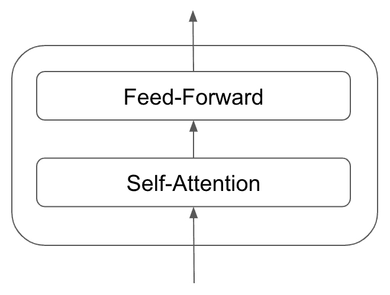

图 9.4 –前馈层

我们的解码器层在结构上与我们的编码器几乎相同，但是它们包含一个额外的注意层。 该关注层可帮助解码器将注意力集中在编码表示的相关部分上，类似于我们看到关注在序列到序列模型中的工作方式：

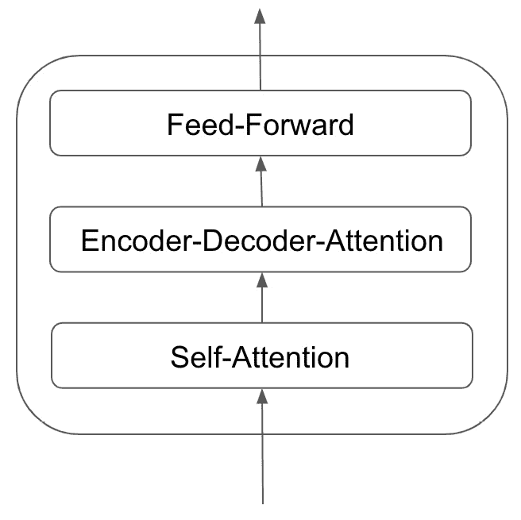

图 9.5 –注意方法

我们知道我们的解码器从最终编码器获取输入，因此一个链接的编码器/解码器可能看起来像这样：

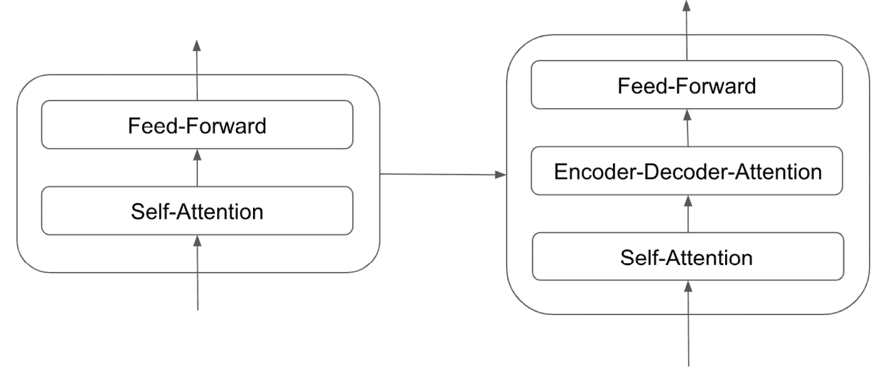

图 9.6 –链接的编码器/解码器阵列

这将为您提供有关大型模型中不同编码器和解码器如何堆叠的有用概述。 接下来，我们将更详细地检查各个部分。

### 编码器

转换器的独特属性是单词分别流过编码器层，并且每个位置的每个单词都有自己的路径。 尽管自我注意层中存在某些依赖关系，但这些不存在于前馈层中。 单个单词的向量是从嵌入层获得的，然后在通过前馈网络馈送之前通过自我关注层馈送：

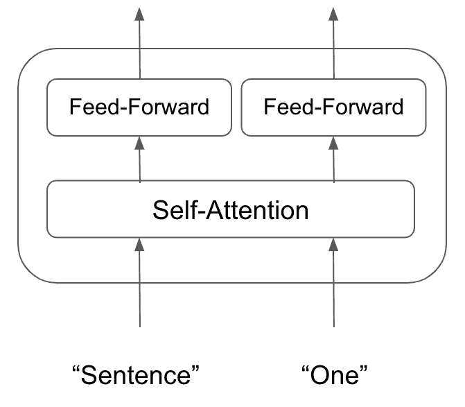

图 9.7 –编码器布局

自我关注可以说是编码器中最复杂的部分，因此我们将首先对其进行更详细的研究。 假设我们有一个由三个单词组成的输入句子； 例如`fine`。 对于此句子中的每个单词，我们将它们表示为从模型的嵌入层获得的单个单词向量。 然后，我们从此单个单词向量中提取三个向量：查询向量，键向量和值向量。 这三个向量是通过将词向量乘以训练模型时获得的三个不同权重矩阵而获得的。

如果我们在输入句子`Ethis`，`Eis`和`Efine`中为每个单词调用单词嵌入，则可以计算查询，键和值向量 像这样：

**查询向量**：


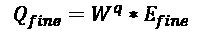

**键向量**：


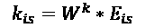


**值向量**：


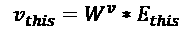


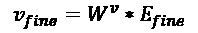

既然我们知道了如何计算每个向量，那么了解每个向量代表什么就很重要。 从本质上讲，每一个都是注意力机制内概念的抽象。 一旦我们看到它们是如何计算的，这将变得显而易见。

让我们继续我们的工作示例。 我们需要依次考虑输入句子中的每个单词。 为此，我们为句子中的每对查询/关键字向量计算得分。 这是通过获取输入句子中每个单词的每个查询/关键字向量对的点积来完成的。 例如，要计算句子中第一个单词`this`的分数，我们计算`this`的查询向量与位置 0 处的键向量之间的点积。我们在所有其他位置的键向量中重复此点积 输入句子中的位置，因此我们获得输入句子中第一个单词的`n`分，其中`n`是句子的长度：

**分数（`"this"`）**：


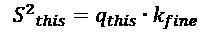

接下来，我们对每个得分应用 softmax 函数，以使每个得分现在处于 0 到 1 之间（因为这有助于防止梯度梯度爆炸并使梯度下降更加有效且易于计算）。 然后，我们将这些分数中的每一个与值向量相乘，然后将它们总和求和，以获得最终向量，然后将其在编码器中传递：

**最终向量（`"this"`）**：


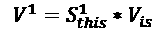


然后，我们对输入句子中的所有单词重复此过程，以便获得每个单词的最终向量，其中包含一个自注意元素，然后将其沿着编码器传递到前馈网络。 这种自我关注的过程意味着我们的编码器知道在输入句子中查找的位置，以获得任务所需的信息。

在此示例中，我们仅为查询，键和值向量学习了单个权重矩阵。 但是，我们实际上可以为这些元素中的每一个学习多个不同的矩阵，并将其同时应用于输入句子中以获得最终输出。 这就是，即所谓的**多头注意力**，它使我们能够依靠多种不同的学习模式而不仅仅是一个单独的注意力机制来执行更复杂的注意力计算。

我们知道 BERT 包含 12 个关注头，这意味着`Wq`，`Wk`和`Wv`学会了 12 种不同的权重矩阵。

最后，我们需要一种让编码器考虑输入序列中单词顺序的方法。 当前，我们的模型独立对待输入序列中的每个单词，但实际上，输入序列中单词的顺序将对句子的整体含义产生巨大的影响。 为了解决这个问题，我们使用**位置编码**。

为了应用这一点，我们的模型将每个输入嵌入并分别向每个位置添加位置编码向量。 这些位置向量是由我们的模型学习的，遵循一种特定的模式来帮助它们确定序列中每个单词的位置。 从理论上讲，将这些位置向量添加到我们的初始嵌入中后，一旦将它们投影到各个查询，键和值向量中，就应该转化为最终向量之间的有意义的距离：

```py
x0 = Raw Embedding

t0 = Positional Encoding

E0 = Embedding with Time Signal

x0 + t0 = E0
```

我们的模型为每个位置学习不同的位置编码向量（`t0`，`t1`，依此类推），然后我们将应用于输入句子中的每个单词，然后再输入 甚至输入我们的编码器：


图 9.8 –将输入添加到编码器

既然我们已经了解了编码器的主要组成部分，现在该来看看模型的另一面并了解如何构造解码器。

### 解码器

解码器中的组件与编码器中的组件非常相似。 但是，我们的转换器中的解码器不是像编码器那样接收原始输入语句，而是从编码器的输出接收其输入。

我们的堆叠编码器处理我们的输入语句，然后剩下一组注意向量`K`和`V`，它们在我们解码器的编码器-解码器注意层中使用。 这使它可以仅关注输入序列的相关部分：

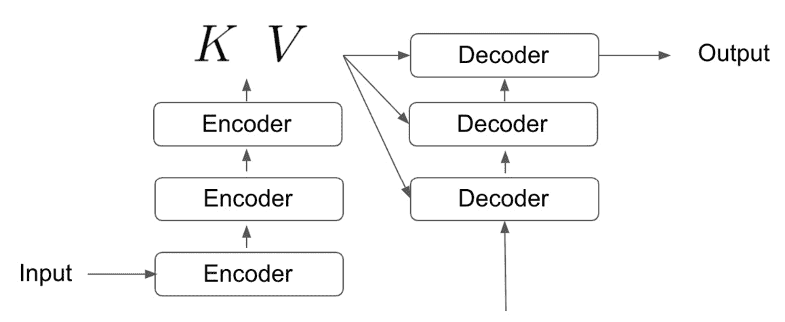

图 9.9 –堆叠式解码器

在每个时间步，我们的解码器都使用句子中先前生成的单词和`K, V`注意向量的组合来生成句子中的下一个单词。 反复重复此过程，直到解码器生成< END >令牌，表明它已完成生成最终输出。 转换器解码器上的给定时间步长可能看起来像这样：


图 9.10 –转换器解码器

在这里值得注意的是，解码器中的自我注意层的运行方式与我们的编码器中的自我关注层略有不同。 在我们的解码器中，自我注意层仅关注输出序列中的较早位置。 这是通过将序列的任何未来位置设置为负无穷大来掩盖的。 这意味着当发生分类时，softmax 计算始终会得出 0 的预测。

编码器-解码器注意层的工作方式与我们编码器中的多头自我注意层相同。 但是，主要区别在于它从下面的层创建查询矩阵，并从编码器的输出获取键和值矩阵。

这些编码器和解码器部分构成了我们的转换器，构成了 BERT 的基础。 接下来，我们将研究 BERT 的某些应用，并研究一些在特定任务下表现出更高性能的变体。

## BERT 的应用

作为最先进的，BERT 显然具有许多实际应用。 目前，您可能每天都会在许多 Google 产品中使用； 即 Gmail 中的建议答复和智能撰写（其中 Gmail 根据您当前输入的内容预测您的预期句子）和 Google 搜索引擎中的自动完成功能（您在其中键入要搜索的前几个字符和下拉列表） 会预测您要搜索的内容）。

正如我们在上一章中所看到的那样，聊天机器人是 NLP 深度学习可以使用的最令人印象深刻的东西之一，而 BERT 的使用确实带来了一些非常令人印象深刻的聊天机器人。 实际上，问题解答是 BERT 擅长的主要事情之一，这主要是因为它是在一个大型知识库（Wikipedia）上进行训练的，并且能够以句法正确的方式回答问题（由于受过训练） 考虑下一个句子的预测）。

我们仍处于聊天机器人无法与真实人类进行对话的阶段，并且 BERT 从其知识库中提取信息的能力非常有限。 但是，BERT 所取得的一些结果是有希望的，并且考虑到 NLP 机器学习领域的发展速度，这表明这可能很快就会成为现实。

当前，由于 BERT 的训练方式，它只能解决非常狭窄的 NLP 任务。 但是，BERT 的许多变体已经以微妙的方式进行了更改，以在特定任务上实现更高的性能。 这些包括但不限于以下内容：

*   **roBERTa**：由 Facebook 构建的 BERT 的变体。 删除 BERT 的下一个句子预测元素，但通过实现动态屏蔽来增强单词屏蔽策略。
*   **xlm**/**BERT**：也是由 Facebook 构建的，该模型对 BERT 应用了双语言训练机制，从而使它能够学习不同语言的单词之间的关系。 这使 BERT 可以有效地用于机器翻译任务，与基本的序列到序列模型相比，表现出更高的性能。
*   **distilBERT**：BERT 的更紧凑版本，保留了原始版本的 95%，但将学习到的参数数量减半，从而减少了模型的总大小和训练时间。
*   **ALBERT**：此经过 Google 训练的模型使用了自己独特的训练方法，称为句子顺序预测。 BERT 的这种变体在许多任务上均表现出优于标准 BERT 的性能，现在被认为是 BERT 之前的最先进技术（说明了事物可以快速改变的速度！）。

虽然 BERT 可能是最著名的，但也有其他基于转换器的模型被认为是最新技术。 通常被认为与 BERT 竞争的主要竞争对手是 GPT-2。

## GPT-2

GPT-2 与 BERT 类似，但在一些细微的方面有所不同。 虽然这两种模型都基于先前概述的转换器架构，但是 BERT 使用一种称为自我注意力的注意力形式，而 GPT-2 使用屏蔽的自我注意力。 两者之间的另一个细微差别是 GPT-2 的构造方式使其可以一次输出一个令牌。

这是因为 GPT-2 实际上在其工作方式上是自回归的。 这意味着当它生成输出（句子中的第一个单词）时，该输出将递归添加到输入中。 然后，此输入用于预测句子中的下一个单词，并重复进行直到生成完整的句子为止。 您可以在以下示例中看到这一点：

**步骤 1**：

**输入**：`What color is the sky?`

**输出**：`...`

然后，将预测的输出添加到输入的末尾并重复此步骤：

**步骤 2**：

**输入**：`What color is the sky? The`

**输出**：`sky`

我们重复此过程，直到生成完整的句子：

**步骤 3**：

**输入**：`What color is the sky? The sky`

**输出**：`is`

**步骤 4**：

**输入**：`What color is the sky? The sky is`

**输出**：`blue`

就 BERT 和 GPT-2 之间的性能而言，这是关键的权衡之一。 BERT 被双向训练的事实意味着这种单令牌生成是不可能的。 但是，GPT-2 不是双向的，因此在进行预测时只考虑句子中的先前单词，这就是为什么 BERT 在预测句子中缺少的单词时胜过 GPT-2 的原因。

## 比较自我注意和遮罩的自我注意

这种差异在两个不同模型实现注意力的方式上也很明显。 由于 BERT 是双向的，因此它的注意力机制能够考虑整个输入句子的上下文，并确定输入句子中确切的位置：

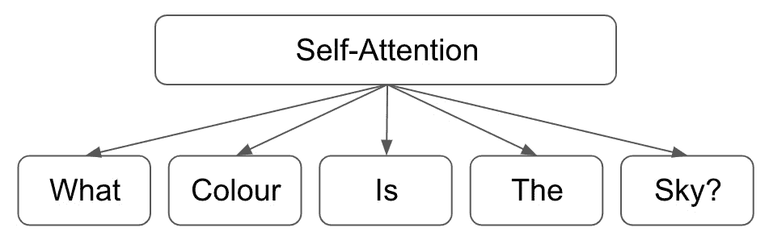

图 9.11 –自我注意力机制

另一方面，不是双向的，因此屏蔽的自我关注机制只能查看已经看到的令牌，而不能“向前看”：


图 9.12 –蒙面的自我关注机制

## GPT-2 –道德规范

关于 GPT-2 的一个非常有趣的考虑是作者在考虑是否向公众发布该模型时的道德考虑。

GPT-2 的语言生成功能意味着它能够使用很少的提示来生成非常现实且句法正确的句子。 通过仅提供两行输入来识别主题，该模型就可以生成有关该主题的详细信息的段落，而不管其是否真实！ 一个现在臭名昭著的例子是“独角兽”故事，该模型收到了一个句子输入：

**输入**：`"In a shocking finding, scientists discovered a herd of unicorns living in a remote, previously unexplored valley, in the Andes Mountains. Even more surprising to the researchers was the fact that the unicorns spoke perfect English."`

该模型提供了以下输出：

**输出**：

```py
The scientist named the population, after their distinctive horn, Ovid's Unicorn. These four-horned, silver-white unicorns were previously unknown to science.

Now, after almost two centuries, the mystery of what sparked this odd phenomenon is finally solved.

Dr. Jorge Pérez, an evolutionary biologist from the University of La Paz, and several companions, were exploring the Andes Mountains when they found a small valley, with no other animals or humans. Pérez noticed that the valley had what appeared to be a natural fountain, surrounded by two peaks of rock and silver snow.

This is only the first th
```

这只是模型从很少的输入中生成的更大的九段响应的前三段。 值得注意的是，这些句子都非常合理（不管不可能的主题是什么！），各段以逻辑顺序排列在一起，并且该模型能够从很小的输入中产生所有这些。

尽管这在性能以及通过构建深层 NLP 模型可以实现的功能方面给人留下深刻的印象，但确实引起了人们对此类模型的道德规范以及如何使用（和滥用它们）的担忧。

随着“假新闻”的兴起和使用互联网的错误信息的传播，类似的示例说明了使用这些模型生成逼真的文本是多么简单。 让我们考虑一个示例，其中代理希望在线上生成有关多个主题的虚假新闻。 现在，他们甚至不需要自己编写虚假信息。 从理论上讲，他们可以训练 NLP 模型为他们执行此操作，然后再在互联网上散布这些虚假信息。 GPT-2 的作者在训练并将模型发布给公众时特别注意这一点，并指出该模型有可能被滥用和滥用，因此只有在他们看不到证据的情况下才向公众发布更大更复杂的模型。 较小型号的误用。

这可能成为 NLP 深度学习向前发展的重点。 当我们使用可以接近人类复杂程度的聊天机器人和文本生成器（例如 GPT-2）时，需要充分了解对这些模型的使用和误用。 研究表明，GPT-2 生成的文本被认为与《纽约时报》的真实人类书面文章（83%）几乎一样可信（72%）。 随着将来我们继续开发更复杂的深层 NLP 模型，随着模型生成的文本变得越来越现实，这些数字可能会收敛。

此外，GPT-2 的作者还证明可以对模型进行微调以防滥用。 通过在意识形态极端立场上微调 GPT-2 并生成文本，可以证明可以生成支持这些意识形态的宣传文本。 虽然还显示可以训练反模型来检测这些模型生成的文本，但是随着这些模型变得更加复杂，我们将来可能在这里再次面临进一步的问题。

随着时间的流逝，NLP 模型变得更加复杂和高效，这些道德考量值得牢记。 尽管您出于自己的目的训练的模型可能不是出于任何滥用目的，但始终有可能将它们用于非预期的目的。 始终考虑您使用的任何模型的潜在应用。

# 未来的 NLP 任务

尽管本书的大部分内容都集中在文本分类和序列生成上，但是还有许多其他 NLP 任务尚未真正涉及到。 尽管从学术的角度而不是从实践的角度来看，其中许多更有趣，但了解这些任务很重要，因为它们构成了语言构造和形成的基础。 作为 NLP 数据科学家，我们做的任何能够更好地理解自然语言形成的方法，只会增进我们对主题的理解。 在本节中，我们将更详细地讨论 NLP 未来发展的四个关键领域：

*   选区解析
*   语义角色标签
*   文字蕴含
*   机器理解

## 选区解析

选区分析（也称为句法分析）是识别句子的各个部分并为它分配句法结构的操作。 的语法结构在很大程度上取决于上下文无关语法的使用，这意味着使用语法分析，我们可以识别给定句子的基础语法结构并将其映射出来。 任何句子都可以分解为“语法树”，该语法树是该基础句子结构的图形表示，而语法分析是检测该基础结构并确定该树结构的方法。

我们将从讨论此基础语法结构开始。 句子中“选区”的概念有点抽象，但基本假设是句子由多个单词“组”组成，每个词组都是一个选区。 语法，以其基本形式，可以说是一个句子中可能出现的所有可能的选区类型的索引。

首先，让我们考虑最基本的类型的构成成分**名词短语**。 句子中的名词很容易识别，因为它们是定义对象或实体的词。 在下面的句子中，我们可以识别出三个名词：

```py
"Jeff the chef cooks dinner"

Jeff - Proper noun, denotes a name

Chef - A chef is an entity

Dinner - Dinner is an object/thing
```

但是，名词短语略有不同，因为每个名词短语都应指一个单独的实体。 在前面的句子中，即使`Jeff`和`Cook`都是名词，短语`Jeff Cook`都指一个人，因此可以将其视为名词 短语。 但是，如何从语法上确定名词短语是指单个实体？ 一种简单的方法是将短语置于动词之前，看看该句子是否具有句法意义。 如果确实如此，那么该短语就是名词短语：

```py
Jeff the chef cooks…

Jeff the chef runs…

Jeff the chef drinks…
```

我们可以识别各种不同的短语，以及帮助我​​们识别它们的许多复杂的语法规则。 我们首先确定每个句子可以分解成的个别语法特征：


现在我们知道句子是由成分组成的，并且成分可以由几个单独的语法组成，现在我们可以开始根据它们的结构来映射句子。 例如，使用以下示例语句：

```py
"The boy hit the ball"
```

我们可以从将该句子分为两部分开始：名词短语和动词短语：

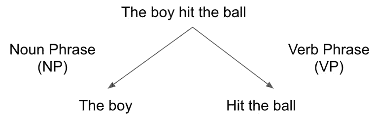

图 9.13 –将句子分解为语法成分

然后，我们对每个短语重复此处理，以将它们分成甚至个较小的语法组成部分。 我们可以将此名词短语分为确定词和名词：


图 9.14 –分解名词短语

再次，我们对动词短语执行此操作，将其分解为一个动词和另一个名词短语：


图 9.15 –分解动词短语

我们可以再次进行迭代，然后再次进行迭代，将句子的各个部分分成较小的和较小的块，直到剩下**解析树**为止。 这个解析的树传达了我们句子的整个句法结构。 我们可以在这里完整地看到示例的解析树：


图 9.16 –句子的分析树

这些解析树使我们能够看到句子的句法结构，但它们远非完美。 从这种结构中，我们可以清楚地看到，发生了两个带有动词的名词短语。 但是，从前面的结构中，尚不清楚实际发生了什么。 我们在两个对象之间有一个动作，但是仅凭语法尚不清楚发生了什么。 哪一方对谁采取行动？ 我们将看到语义角色标签捕获了其中的一些歧义。

## 语义角色标签

语义角色标记是，将标记分配给句子中的单词或词组以指示其在句子中的语义角色的过程。 广义上讲，这涉及标识句子的谓词，并确定句子中的其他每个词如何与此谓词相关。 换句话说，对于给定的句子，语义角色标签确定“谁对谁做了什么，在哪里/什么时候？”

因此，对于给定的句子，我们通常可以将句子分解为各个组成部分，如下所示：


图 9.17 –将句子分为几个组成部分

句子的这些部分具有特定的语义角色。 任何给定句子的**谓词**表示该句子内发生的事件，而该句子的所有其他部分都与给定谓词相关。 在这句话中，我们可以将“谁”标记为谓词的代理。 **代理**是导致事件的原因。 我们还可以将`Whom`标记为谓词的主题。 **主题**是我们句子中受相关事件影响最大的元素：


图 9.18 –分解角色

从理论上讲，句子中的每个单词或短语都可以用其特定的语义成分标记。 几乎完整的表格如下：


通过执行语义角色标记，我们可以为句子的每个部分分配特定的角色。 这在 NLP 中非常有用，因为它允许模型更好地“理解”一个句子，因此而不是仅作为角色分类的句子，应理解为语义角色的组合，可以更好地传达 实际上是在句子描述的情况下发生的。

当我们阅读句子`The boy kicked the ball`时，我们固有地知道有一个男孩，有一个球，并且那个男孩正在踢球。 但是，到目前为止，我们所研究的所有 NLP 模型都可以通过查看句子中的各个单词并为其创建一些表示来理解该句子。 到目前为止，我们所看到的系统不可能理解存在两个“事物”并且一个物体（男孩）对第二物体（球）执行某种动作（踢）的事实。 在模型中引入语义角色元素可以更好地帮助我们的系统通过定义句子的主题及其之间的相互作用来形成更现实的句子表示形式。

语义角色标签极大地帮助了我们一件事，即识别具有相同含义但在语法或语法上不同的句子； 例如以下内容：

```py
The man bought the apple from the shop

The shop sold the man an apple

The apple was bought by the man from the shop

The apple was sold by the shop to the man
```

这些句子虽然没有明显地包含相同顺序的所有相同词，但它们实际上具有相同的含义。 通过对这些句子应用语义角色标签，我们可以确定谓词/代理/主题都相同。

先前我们看到了选区分析/句法分析如何用于识别句子的句法结构。 在这里，我们可以看到如何将简单的句子“我买了一只猫”分解为它的组成部分-代词，动词，行列式和名词：


图 9.19 –选区解析

但是，这并不能使您对句子的每个部分所扮演的语义角色有任何了解。 是猫被我买了还是我被猫买了？ 虽然句法作用对于理解句子的结构很有用，但它并没有对语义有太多了解。 一个有用的类比是图像字幕。 在训练有素的图像标签模型中，我们希望获得一个描述图像内容的标题。 语义标记与此相反，在语义标记中我们采用一个句子，并尝试抽象出一个心理“形象”，以说明该句子中正在发生什么动作。

但是，语义角色标签在 NLP 中有用什么上下文？ 简而言之，任何需要“理解”文本内容元素的 NLP 任务都可以通过添加角色来增强。 可以是文档摘要，问题解答或句子翻译之类的任何内容。 例如，使用语义角色标记来识别句子的谓词和相关的语义成分，我们可以训练一个模型来识别对句子贡献必要信息的成分，并丢弃不构成成分的成分。

因此，能够训练模型以执行准确且有效的语义角色标记将对 NLP 的其余部分有用。 最早的语义角色标记系统完全基于规则，由从语法派生的基本规则集组成。 在深度学习的最新发展之前，这些方法已经演变为包含统计建模方法，这意味着可以训练分类器来识别句子中的相关语义角色。

与任何分类任务一样，这是一个有监督的学习问题，需要完整注释的句子才能训练模型，该模型将识别以前未见过的句子的语义角色。 但是，这样带注释的句子的可用性非常稀缺。 我们在本章前面看到的巨大的语言模型（例如 BERT）是在原始句子上训练的，不需要带标签的示例。 但是，在语义角色标记的情况下，我们的模型需要使用正确标记的句子才能执行此任务。 尽管确实存在用于此目的的数据集，但它们的大小和通用性不足以训练完全综合，准确的模型，该模型在各种句子上均能很好地表现。

您可能会想到，解决语义角色标记任务的最新技术都是基于神经网络的。 初始模型使用 LSTM 和双向 LSTM 结合 GLoVe 嵌入，以便对句子进行分类。 这些模型还包含了卷积层，也表现出良好的性能。

但是，得知这些最新模型是基于 BERT 的也就不足为奇了。 使用 BERT 已在各种与 NLP 相关的任务中显示了出色的性能，并且语义角色标记也不例外。 集成了 BERT 的模型已经过全面训练，可以预测词性标签，执行语法分析并同时执行语义角色标记，并显示出良好的效果。

其他研究也表明，图卷积网络在语义标记方面是有效的。 图由节点和边构成，其中图内的节点代表语义成分，边代表父子部分之间的关​​系。

也可以使用许多用于语义角色标记的开源模型。 Google 的 SLING 解析器经过训练，可以执行数据的语义注释。 该模型使用双向 LSTM 对句子进行编码，并使用基于过渡的循环单元进行解码。 该模型仅将文本标记用作输入和输出角色，而无需任何进一步的符号表示：

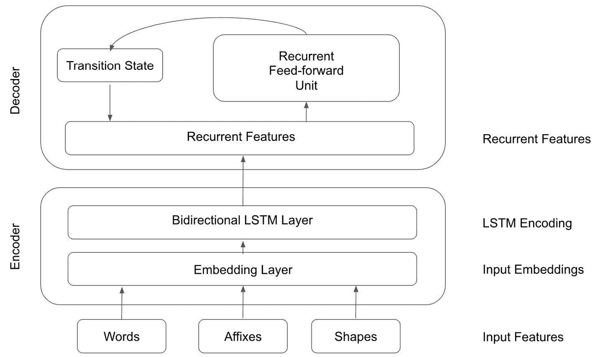

Figure 9.20 – Bi-directional LSTM (SLING)

值得注意的是，SLING 仍在开发中。 当前，它还不够复杂，无法从任意文本中准确提取事实。 这表明在可以创建真实，准确的语义角色解析器之前，该领域需要完成许多工作。 完成此操作后，可以轻松地将语义角色解析器用作整体机器学习模型的一部分，以标记句子中的语义角色，然后将其用于更广泛的机器学习模型中，以增强模型对文本的“理解”。

## 文字蕴含

文本蕴涵是我们可以训练模型以试图更好地理解句子含义的另一种方法。 在文本方面，我们尝试确定两段文本之间的方向关系。 只要一条文本中的真相与另一条文本中的真相相同，就存在这种关系。 这意味着，对于给定的两个文本，如果第一文本中的信息可以使第二文本保持真实，则可以说这两个文本之间存在正向关系。

通常以以下方式设置此任务，我们的第一个文本标记为文本，第二个文本标记为假设：

**文字**：`If you give money to charity, you will be happy`

**假设**：`Giving money to charity has good consequences`

这是**肯定文本蕴涵**的示例。 如果假说来自文本，那么可以说这两个文本之间存在方向性关系。 设置带有文本/假设的示例非常重要，因为它定义了关系的方向。 大多数时候，这种关系是不对称的。 例如，在此示例中，句子 1 包含句子 2（我们可以根据句子 1 中的信息推断出句子 2 是正确的）。 但是，我们不能根据第二句中的信息推断出第一句是正确的。 尽管这两种说法都可能是正确的，但如果我们不能推断出两者之间存在方向关系，就无法从另一种推断出。

也存在**否定文本蕴涵**。 这是陈述矛盾的时候。 例如以下内容：

**文字**：`If you give money to charity, you will be happy`

**假设**：`Giving money to charity has bad consequences`

在此示例中，文本没有假设。 相反，本文与假设相矛盾。 最后，如果两个句子之间没有关系，也可以确定在两个句子之间没有**文本蕴涵**。 这意味着这两个陈述不一定是矛盾的，而是该案文并不包含以下假设：

**文字**：`If you give money to charity, you will be happy`

**假设**：`Giving money to charity will make you relaxed`

从 NLP 的角度来看，自然语言的歧义使其成为一项有趣的任务。 两个句子可以具有不同的句法结构，不同的语义结构，并且由完全不同的单词组成，但含义仍然非常相似。 同样，两个句子可以由相同的词和实体组成，但含义却大不相同。

在这里，使用模型来量化文本的含义特别有用。 文本蕴含也是一个独特的问题，因为两个句子可能没有完全相同的含义，但是仍然可以从另一个推断出一个句子。 这需要在大多数语言模型中不存在的语言推论元素。 通过将语言推论的元素纳入我们未来的模型中，我们可以更好地捕获文本的含义，并且能够确定两个文本是否包含相同的信息，而无论它们的表示形式是否相似。

幸运的是，创建简单的文本包含模型并不困难，并且已证明基于 LSTM 的模型是有效的。 可能证明有效的一种设置是连体 LSTM 网络的设置。

我们将模型设置为多类分类问题，其中两个文本可以是正数或负数，也可以是零数。 我们将两个文本输入到双输入模型中，从而获得两个文本的嵌入，然后将它们传递到双向 LSTM 层。 然后，将这两个输出以某种方式（使用一些张量操作）进行比较，然后再将它们输出给最终的 LSTM 层。 最后，我们使用 softmax 层对输出执行分类：


图 9.21 –连体 LSTM 网络

尽管这些模型远非完美，但它们代表了创建完全准确的文本包含模型的第一步，并为将集成到不断发展的语言模型中打开了可能性。

## 机器理解

到目前为止，在本书中，我们主要指的是 NLP，但是能够处理语言只是其中的一部分。 当您阅读一个句子时，我们不仅阅读，观察和处理单个单词，而且还对句子的实际含义建立了内在的理解。 NLP 的下一步无疑是能够训练不仅能理解句子而且还能形成对其中表达思想的理解的模型。 该字段的真正定义非常松散，但通常被称为机器理解或**自然语言理解**（**NLU**）。

在学校，我们从小就被教导阅读理解。 您可能很久以前学会了此技能，现在您已将其视为理所当然。 通常，您可能甚至没有意识到正在执行此操作； 实际上，您现在就在做！ 阅读理解仅仅是阅读文本，理解文本并能够回答有关文本的问题的行为。 例如，看一下以下文本：

作为对水进行消毒的一种方法，将水加热到 100°C（212°F）的沸点是最古老，最有效的方法，因为它不会影响水的味道。 尽管其中存在污染物或颗粒，但它仍然有效，并且它是一步一步的过程，可以消除大多数引起肠道相关疾病的微生物。 在海平面和正常大气压下，水的沸点为 100°C（212°F）。

鉴于您了解此文本，您现在应该能够回答有关此文本的以下问题：

```py
Q: What is the boiling point of water?

A: 100 °C (212 °F)

Q: Does boiling water affect its taste?

A: No
```

这种理解文本并回答有关问题的能力构成了我们机器理解任务的基础。 我们希望能够训练一种机器学习模型，该模型不仅可以形成对文本的理解，还可以用语法正确的自然语言回答有关该文本的问题。

这样做的好处很多，但是一个非常直观的用例是构建一个充当知识库的系统。 当前，搜索引擎的工作方式是我们运行搜索（在 Google 或类似的搜索引擎中），并且搜索引擎返回选择的文档。 但是，要查找特定信息，我们仍然必须从返回的文档中推断出正确的信息。 整个过程可能看起来像：

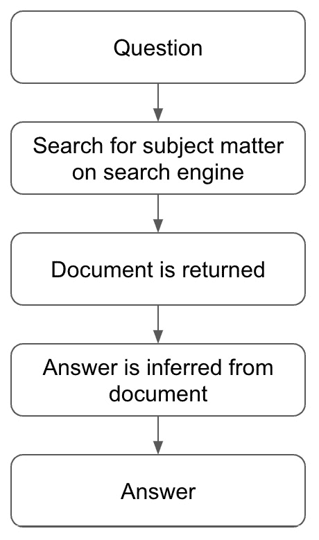

图 9.22 –查找信息的过程

在此示例中，为回答`What is the boiling point of water`，我们首先提出问题。 然后，我们在搜索引擎上搜索主题。 这可能是该问题的某种简化表示； 例如，`boiling point of water`。 然后，我们的搜索引擎将返回一些相关文档，最有可能是维基百科中关于水的条目，然后我们将不得不手动搜索并使用它来推断问题的答案。 尽管此方法有效，但机器理解模型将使此过程有所简化。

假设我们有一个完美的模型，能够完全理解并回答文本语料库上的问题。 我们可以在大量数据源（例如，互联网或维基百科的大型文本抓图）上训练该模型，并形成充当大型知识库的模型。 这样，我们便可以查询具有实际问题的知识库，并且答案将自动返回。 这消除了我们图的推理步骤，因为推理已由模型处理，因为该模型已经对主题有所了解：

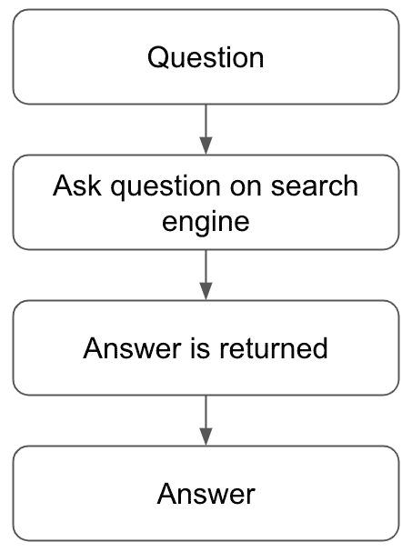

图 9.23 –使用模型的新过程

在理想情况下，这就像键入搜索引擎`What is the boiling point of water`，并返回`100 °C (212 °F)`作为答案一样简单。

假设我们首先有此模型的简化版本。 假设我们已经知道该问题的答案已出现在文档中。因此，鉴于有关水的维基百科页面，我们能否训练一个模型来回答问题`What is the boiling point of water`。首先做一个简单的方法，而不是合并完整语言模型的元素，而是简单地返回包含我们问题答案的维基百科页面的段落。

我们可以训练以完成此任务的架构可能看起来像这样：


图 9.24 –模型的架构

我们的模型将要回答的问题和包含问题的文档作为输入。 然后将它们传递给嵌入层以形成每个张量的基于张量的表示，然后传递给编码层以形成进一步的缩减的向量表示。

现在，我们的问题和文档都表示为向量，我们的匹配层将尝试确定在文档向量中应寻找哪些位置以获得问题的答案。 这是通过一种注意力机制来完成的，在该机制中，我们的问题确定了我们应该查看文档向量的哪些部分才能回答问题。

最后，我们的融合层旨在捕获匹配层的长期依赖性，合并从匹配层收到的所有信息，并执行解码步骤以获得最终答案。 该层采用双向 RNN 的形式，它将我们的匹配层输出解码为最终预测。 我们在这里使用多类分类预测两个值 –起点和终点。 这代表了我们文档中包含初始问题答案的起点和终点。 如果我们的文档包含 100 个单词，而单词 40 和单词 50 之间的句子包含我们问题的答案，则我们的模型将理想地预测起点和终点的值分别为 40 和 50。 这些值然后可以很容易地用于从输入文档中返回相关段落。

虽然返回目标文档的相关区域是有用的训练模型，但它与真实的机器理解模型并不相同。 为此，我们必须合并较大语言模型的元素。

在任何机器理解任务中，实际上都有三个要素在起作用。 我们已经知道存在一个问题和答案，但是也有一个可以确定给定问题答案的相关上下文。 例如，我们可以问以下问题：

```py
What day is it today?
```

答案可能会有所不同，具体取决于提出问题的环境。 例如，圣诞节的 3 月 6 日星期一，星期二，3 月 6 日。

我们还必须注意，问题和答案之间的关系是双向的。 如果提供了知识库，我们就可以给出给定问题的答案，但是也可以得出结论，我们可以给出给定问题的问题：

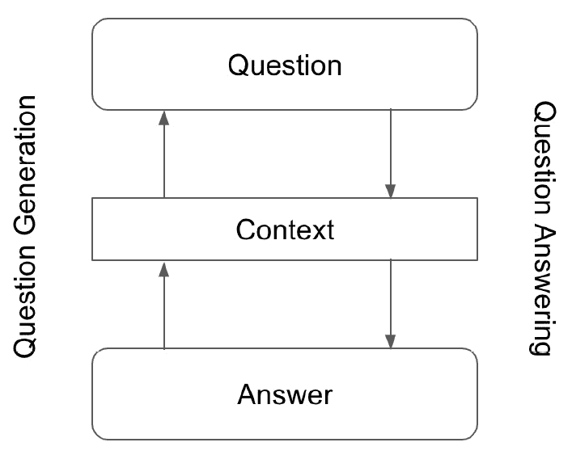

图 9.25 –问题与答案之间的关系

真正的机器理解程序可以执行**问题生成**（**QG**），以及**问答**（**QA**）。 对于，最明显的解决方案是训练两个单独的模型，每个模型一个，并比较其结果。 从理论上讲，我们的 QG 模型的输出应等于我们的 QA 模型的输入，因此通过比较两者，我们可以提供同时评估：

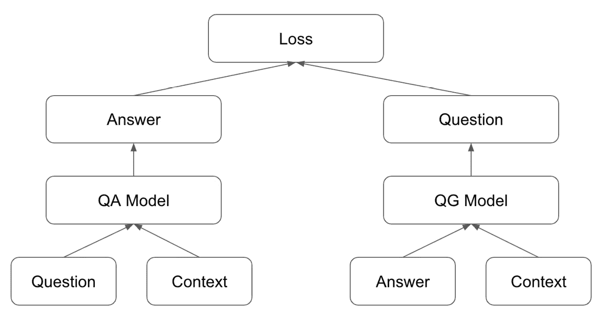

图 9.26 – QG 和 QA 模型之间的比较

但是，更全面的模型将能够同时执行这两项任务，从而从答案中生成问题并回答问题，就像人类能够做到的一样：


图 9.27 –对偶模型表示

实际上，近来在 NLU 中的进步意味着这种模型现已成为现实。 通过组合许多元素，我们能够创建一个神经网络结构，该结构能够执行对偶模型的功能，如先前的所示。 这就是**双问答网络**。 实际上，我们的模型包含到目前为止我们在本书中看到的神经网络的大多数组件，即，嵌入层，卷积层，编码器，解码器和注意层。 问答网络的完整架构类似于以下内容：


图 9.28 –问答网络的架构

我们可以在此处进行以下观察：

*   如前所述，模型的**输入**是问题，答案和上下文，也是向右移动的问题和答案。
*   我们的**嵌入**层跨字符和单词的 GLoVe 嵌入式向量进行卷积，以创建组合的表示形式。
*   我们的**编码器**由 LSTM 组成，需要引起注意。
*   我们的**输出**也是基于 RNN 的，并且一次将我们的输出解码一个单词，以产生最终的问题和答案。

尽管存在经过预训练的问答网络，但是您可以练习实现新获得的 PyTorch 技能，并尝试自己构建和训练这样的模型。

诸如此类的语言理解模型可能会成为 NLP 未来几年研究的主要重点之一，新论文的发布频率可能会越来越高。

# 总结

在本章中，我们首先研究了几种最新的 NLP 语言模型。 尤其是 BERT，似乎已被广泛接受为行业标准的最新语言模型，并且 BERT 及其变体已被企业在其自己的 NLP 应用中广泛使用。

接下来，我们研究了机器学习的几个重点领域。 即语义角色标签，选区解析，文本范围和机器理解。 这些领域可能会占 NLP 正在进行的当前研究的很大一部分。

既然您对 NLP 深度学习模型以及如何在 PyTorch 中实现它们具有全面的能力和了解，也许您会倾向于加入这项研究。 无论是在学术领域还是商业领域，您现在都希望足够了解，可以从头开始创建自己的深层 NLP 项目，并且可以使用 PyTorch 创建解决所需的任何 NLP 任务所需的模型。 通过不断提高自己的技能，并不断了解和掌握该领域的所有最新动态，您一定会成为一名成功的，行业领先的 NLP 数据科学家！