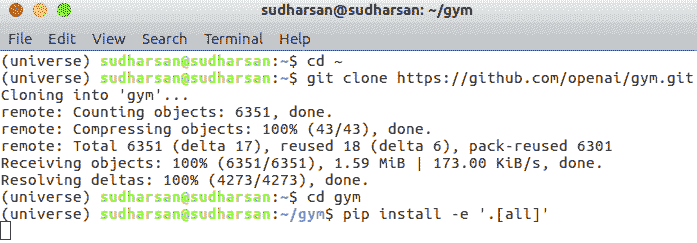
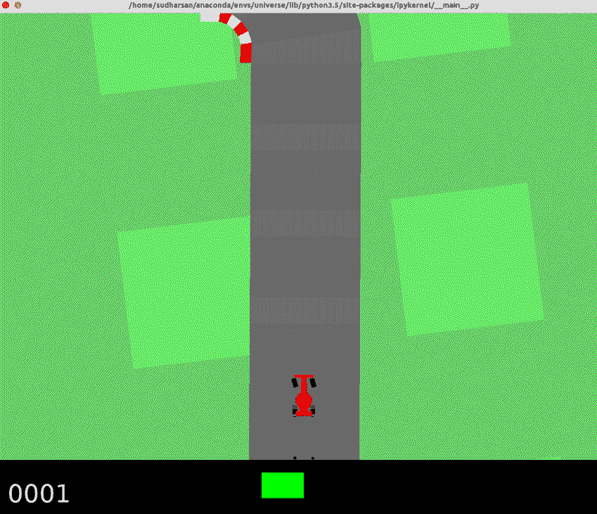
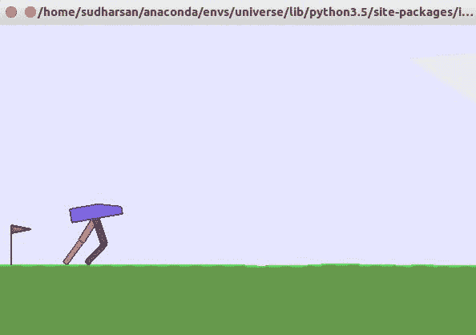

# OpenAI 和 TensorFlow 入门

OpenAI 是由 Elon Musk 和 Sam Altman 创立的非营利性，开源**人工智能**（**AI**）研究公司，旨在构建通用 AI。 他们是由顶级行业领导者和顶尖公司赞助的。 OpenAI 具有 Gym 和 Universe 两种样式，我们可以使用它们模拟现实环境，构建**强化学习**（**RL**）算法，并在这些环境中测试我们的智能体。 TensorFlow 是 Google 的开源机器学习库，已广泛用于数值计算。 在接下来的章节中，我们将使用 OpenAI 和 TensorFlow 来构建和评估强大的 RL 算法。

在本章中，您将了解以下内容：

*   通过安装 Anaconda，Docker，OpenAI Gym 和 Universe 和 TensorFlow 设置机器
*   使用 OpenAI Gym 和 Universe 模拟环境
*   训练机器人走路
*   构建一个视频游戏机器人
*   TensorFlow 的基本原理
*   使用 TensorBoard

# 设置机器

安装 OpenAI 并不是一件容易的事。 要设置和运行系统，必须正确遵循一组步骤。 现在，让我们看看如何设置我们的机器并安装 OpenAI Gym 和 Universe。

# 安装 Anaconda

本书中的所有示例均使用 Anaconda 版本的 Python。 Anaconda 是 Python 的开源发行版。 它被广泛用于科学计算和处理大量数据。 它提供了一个出色的程序包管理环境。 它提供对 Windows，macOS 和 Linux 的支持。 Anaconda 随附安装了 Python 以及用于科学计算的流行软件包，例如 NumPy，SciPy 等。

要下载 Anaconda，请访问[这里](https://www.anaconda.com/download/)，您将在此处看到用于下载用于不同平台的 Anaconda 的选项。

如果使用 Windows 或 Mac，则可以根据计算机架构直接下载图形安装程序，然后使用图形安装程序进行安装。

如果您使用的是 Linux，请按照以下步骤操作：

1.  打开终端并输入以下内容以下载 Anaconda：

```py
wget https://repo.continuum.io/archive/Anaconda3-5.0.1-Linux-x86_64.sh
```

2.  完成后，我们可以通过以下命令安装 Anaconda：

```py
bash Anaconda3-5.0.1-Linux-x86_64.sh
```

成功安装 Anaconda 后，我们需要创建一个新的 Anaconda 环境，该环境基本上是一个虚拟环境。 虚拟环境有什么需求？ 假设您正在使用 Aum 版本 1.14 的项目 A 和使用 NumPy 版本 1.13 的项目 B。 因此，要进行项目 B，您可以降级 NumPy 或重新安装 Anaconda。 在每个项目中，我们使用具有不同版本的不同库，这些库不适用于其他项目。 我们使用虚拟环境来代替降级或升级版本或为新项目每次重新安装 Anaconda。 这为当前项目创建了一个隔离的环境，因此每个项目可以具有自己的依赖性，并且不会影响其他项目。 我们将使用以下命令创建这样的环境，并将我们的环境命名为`universe`：

```py
conda create --name universe python=3.6 anaconda
```

我们可以使用以下命令激活环境：

```py
source activate universe
```

# 安装 Docker

安装 Anaconda 之后，我们需要安装 Docker。 Docker 使将应用程序部署到生产变得容易。 假设您在具有 TensorFlow 和其他一些库的`localhost`中构建了一个应用程序，并且要将应用程序部署到服务器中。 您将需要在服务器上安装所有这些依赖项。 但是使用 Docker，我们可以将应用程序及其依赖项打包在一起，这称为容器，并且我们可以在服务器上运行应用程序而无需在打包的 Docker 容器中使用任何外部依赖项。 OpenAI 不支持 Windows，因此要在 Windows 中安装 OpenAI，我们需要使用 Docker。 而且，大多数 OpenAI Universe 环境都需要 Docker 来模拟环境。 现在让我们看看如何安装 Docker。

要下载 Docker，请转至[这里](https://docs.docker.com/)，您将在其中看到一个名为“Get Docker”的选项。 如果选择该选项，则将看到不同操作系统的选项。 如果使用 Windows 或 Mac，则可以下载 Docker 并直接使用图形安装程序进行安装。

如果您使用的是 Linux，请按照以下步骤操作：

打开您的终端并输入以下内容：

```py
sudo apt-get install \
    apt-transport-https \
    ca-certificates \
    curl \
    software-properties-common
```

然后输入：

```py
curl -fsSL https://download.docker.com/linux/ubuntu/gpg | sudo apt-key add -
```

然后输入：

```py
sudo add-apt-repository \
   "deb [arch=amd64] https://download.docker.com/linux/ubuntu \
   $(lsb_release -cs) \
   stable"
```

最后，输入：

```py
sudo apt-get update
sudo apt-get install docker-ce
```

我们需要成为 Docker 用户组的成员才能开始使用 Docker。 您可以通过以下命令加入 Docker 用户组：

```py
sudo adduser $(whoami) docker
newgrp docker
groups
```

我们可以通过运行内置的`hello-world`程序来测试 Docker 的安装：

```py
sudo service docker start
sudo docker run hello-world
```

为了避免每次使用`sudo`来使用 Docker，我们可以使用以下命令：

```py
sudo groupadd docker
sudo usermod -aG docker $USER
sudo reboot
```

# 安装 OpenAI Gym 和 Universe

现在让我们看看如何安装 OpenAI Gym 和 Universe。 在此之前，我们需要安装几个依赖项。 首先，让我们使用以下命令激活刚刚创建的`conda`环境：

```py
source activate universe
```

然后，我们将安装以下依赖项：

```py
sudo apt-get update
sudo apt-get install golang libcupti-dev libjpeg-turbo8-dev make tmux htop chromium-browser git cmake zlib1g-dev libjpeg-dev xvfb libav-tools xorg-dev python-opengl libboost-all-dev libsdl2-dev swig

conda install pip six libgcc swig
conda install opencv
```

在本书中，我们将使用`gym`版本`0.7.0`，因此您可以使用`pip`直接安装`gym`，如下所示：

```py
pip install gym==0.7.0
```

或者，您可以克隆`gym`存储库并通过以下命令安装最新版本：

```py
cd ~
git clone https://github.com/openai/gym.git
cd gym
pip install -e '.[all]'
```

前面的命令将获取`gym`存储库并以软件包的形式安装`gym`，如以下屏幕截图所示：



# 常见错误修复

在安装 Gym 时，您很可能会遇到以下任何错误。 如果出现这些错误，只需运行以下命令并尝试重新安装：

*   `Failed building wheel for pachi-py`或`Failed building wheel for pachi-py atari-py`：

```py
sudo apt-get update
sudo apt-get install xvfb libav-tools xorg-dev libsdl2-dev swig cmake
```

*   `Failed building wheel for mujoco-py`：

```py
git clone https://github.com/openai/mujoco-py.git
cd mujoco-py
sudo apt-get update
sudo apt-get install libgl1-mesa-dev libgl1-mesa-glx libosmesa6-dev python3-pip python3-numpy python3-scipy
pip3 install -r requirements.txt
sudo python3 setup.py install
```

*   `Error: command 'gcc' failed with exit status 1`：

```py
sudo apt-get update
sudo apt-get install python-dev 
sudo apt-get install libevent-dev
```

同样，我们可以通过获取`universe`存储库并将`universe`作为软件包安装来安装 OpenAI Universe：

```py
cd ~
git clone https://github.com/openai/universe.git
cd universe
pip install -e .
```

以下屏幕快照显示了安装：


如前所述，Open AI Universe 需要 Docker，因为大多数 Universe 环境都在 Docker 容器中运行。

因此，让我们构建一个 Docker 镜像并将其命名为`universe`：

```py
docker build -t universe .
```

构建 Docker 镜像后，我们运行以下命令，该命令从 Docker 镜像启动容器：

```py
docker run --privileged --rm -it -p 12345:12345 -p 5900:5900 -e DOCKER_NET_HOST=172.17.0.1 universe /bin/bash
```

# OpenAI 体育馆

借助 OpenAI Gym，我们可以模拟各种环境，并开发，评估和比较 RL 算法。 现在让我们了解如何使用 Gym。

# 基本模拟

让我们看看如何模拟基本的购物车杆环境：

1.  首先，让我们导入库：

```py
import gym
```

2.  下一步是使用`make`函数创建一个仿真实例：

```py
env = gym.make('CartPole-v0')
```

3.  然后，我们应该使用`reset`方法初始化环境：

```py
env.reset()
```

4.  然后，我们可以循环执行一些时间步骤，并在每个步骤渲染环境：

```py
for _ in range(1000):
    env.render()
    env.step(env.action_space.sample())
```

完整的代码如下：

```py
import gym 
env = gym.make('CartPole-v0')
env.reset() 
for _ in range(1000):  
   env.render()   
   env.step(env.action_space.sample())
```

如果运行前面的程序，则可以看到输出，该输出显示了购物车杆环境：


OpenAI Gym 提供了许多模拟环境，用于培训，评估和构建我们的智能体。 我们可以通过检查其网站或输入以下内容来检查可用的环境，这些将列出可用的环境：

```py
from gym import envs
print(envs.registry.all())
```

由于 Gym 提供了不同的有趣环境，因此让我们模拟一个赛车环境，如下所示：

```py
import gym
env = gym.make('CarRacing-v0')
env.reset()
for _ in range(1000):
    env.render()
    env.step(env.action_space.sample()) 
```

您将获得如下输出：



# 训练机器人走路

现在，让我们学习如何使用 Gym 训练机器人走路以及一些基础知识。

该策略是当机器人向前移动时将获得`X`点作为奖励，如果机器人无法移动，则会减少`Y`点。 因此，机器人将在最大化奖励的情况下学习行走。

首先，我们将导入库，然后通过`make`函数创建一个仿真实例。 Open AI Gym 提供了一个称为`BipedalWalker-v2`的环境，用于在简单的地形中训练机器人特工：

```py
import gym
env = gym.make('BipedalWalker-v2')

```

然后，对于每个情节（初始状态和最终状态之间的智能体程序-环境交互），我们将使用`reset`方法初始化环境：

```py
for episode in range(100):
  observation = env.reset()  
```

然后，我们将循环并渲染环境：

```py
for i in range(10000):
 env.render()

```

我们从环境的行动空间中抽样随机行动。 每个环境都有一个动作空间，其中包含所有可能的有效动作：

```py
action = env.action_space.sample()
```

对于每个操作步骤，我们将记录`observation`，`reward`，`done`和`info`：

```py
observation, reward, done, info = env.step(action)
```

`observation`是代表观察环境的对象。 例如，机器人在地形中的状态。

`reward`是上一动作获得的奖励。 例如，机器人成功前进所获得的奖励。

`done`是布尔值； 如果为真，则表明该情节已经完成（也就是说，机器人学会了行走或完全失败）。 情节完成后，我们可以使用`env.reset()`初始化下一个情节的环境。

`info`是可用于调试的信息。

当`done`为`true`时，我们打印该情节采取的时间步长并中断当前情节：

```py
if done:
  print("{} timesteps taken for the Episode".format(i+1))
  break

```

完整的代码如下：

```py
import gym
env = gym.make('BipedalWalker-v2')
for i_episode in range(100):
 observation = env.reset()
 for t in range(10000):
     env.render()
     print(observation)
     action = env.action_space.sample()
     observation, reward, done, info = env.step(action)
     if done:
         print("{} timesteps taken for the episode".format(t+1))
         break
```

输出显示在以下屏幕截图中：



# OpenAI 宇宙

OpenAI Universe 提供了广泛的现实游戏环境。 它是 OpenAI Gym 的扩展。 它提供了在各种简单到实时复杂环境中训练和评估智能体的能力。 它可以无限制地访问许多游戏环境。

# 构建一个视频游戏机器人

让我们学习如何构建一个可以玩赛车游戏的视频游戏机器人。 我们的目标是赛车必须前进，而不会卡在任何障碍物上或撞到其他赛车上。

首先，我们导入必要的库：

```py
import gym
import universe # register universe environment
import random
```

然后，我们使用`make`函数模拟赛车环境：

```py
env = gym.make('flashgames.NeonRace-v0')
env.configure(remotes=1) #automatically creates a local docker container
```

让我们创建用于移动汽车的变量：

```py
# Move left
left = [('KeyEvent', 'ArrowUp', True), ('KeyEvent', 'ArrowLeft', True),
        ('KeyEvent', 'ArrowRight', False)]

#Move right
right = [('KeyEvent', 'ArrowUp', True), ('KeyEvent', 'ArrowLeft', False),
         ('KeyEvent', 'ArrowRight', True)]

# Move forward
forward = [('KeyEvent', 'ArrowUp', True), ('KeyEvent', 'ArrowRight', False),
       ('KeyEvent', 'ArrowLeft', False), ('KeyEvent', 'n', True)]
```

我们将初始化一些其他变量：

```py
# We use turn variable for deciding whether to turn or not
turn = 0

# We store all the rewards in rewards list
rewards = []

#we will use buffer as some threshold
buffer_size = 100

#we will initially set action as forward, which just move the car forward #without any turn
action = forward
```

现在，让我们的游戏智能体在无限循环中玩，该循环基于与环境的交互持续执行动作：

```py
while True:
    turn -= 1
# Let us say initially we take no turn and move forward.
# We will check value of turn, if it is less than 0
# then there is no necessity for turning and we just move forward.
    if turn <= 0:
        action = forward
        turn = 0

```

然后，我们使用`env.step()`一次性执行一项操作（暂时向前移动）：

```py
 action_n = [action for ob in observation_n]
 observation_n, reward_n, done_n, info = env.step(action_n)
```

对于每个时间步，我们将结果记录在`observation_n`，`reward_n`，`done_n`和`info`变量中：

*   `observation _n`：汽车状态
*   `reward_n`：如果汽车成功前进但没有卡在障碍物上，则通过上一个动作获得奖励
*   `done_n`：这是一个布尔值； 如果游戏结束，它将设置为`true`
*   `info_n`：用于调试目的

显然，特工（汽车）无法在整个游戏中前进； 它需要转弯，避免障碍物，并且还会撞到其他车辆。 但是它必须确定是否应该转弯，如果需要转弯，则应朝哪个方向转弯。

首先，我们将计算到目前为止获得的奖励的平均值； 如果是`0`，则很明显我们在前进时被卡在某处，我们需要转弯。 然后，我们需要转向哪个方向？ 您是否还记得我们在第 1 章，“强化学习简介”中研究的**策略函数**。

关于同一概念，我们这里有两个策略：一个是左转，另一个是右转。 我们将在这里采取随机策略，并计算出奖励并加以改善。

我们将生成一个随机数，如果它小于`0.5`，那么我们将获得一个右数，否则我们将得到一个左数。 稍后，我们将更新奖励，并根据奖励，了解哪个方向最佳：

```py
if len(rewards) >= buffer_size:
        mean = sum(rewards)/len(rewards)

        if mean == 0:
            turn = 20
            if random.random() < 0.5:
                action = right
            else:
                action = left

        rewards = []
```

然后，对于每个情节（例如游戏结束），我们使用`env.render()`重新初始化环境（从头开始游戏）：

```py
  env.render()
```

完整的代码如下：

```py
import gym
import universe # register universe environment
import random

env = gym.make('flashgames.NeonRace-v0')
env.configure(remotes=1) # automatically creates a local docker container
observation_n = env.reset()

##Declare actions
#Move left
left = [('KeyEvent', 'ArrowUp', True), ('KeyEvent', 'ArrowLeft', True),
        ('KeyEvent', 'ArrowRight', False)]

#move right
right = [('KeyEvent', 'ArrowUp', True), ('KeyEvent', 'ArrowLeft', False),
         ('KeyEvent', 'ArrowRight', True)]

# Move forward
forward = [('KeyEvent', 'ArrowUp', True), ('KeyEvent', 'ArrowRight', False),
       ('KeyEvent', 'ArrowLeft', False), ('KeyEvent', 'n', True)]

#Determine whether to turn or not
turn = 0
#store rewards in a list
rewards = []
#use buffer as a threshold
buffer_size = 100
#initial action as forward
action = forward

while True:
    turn -= 1
    if turn <= 0:
        action = forward
        turn = 0
    action_n = [action for ob in observation_n]
    observation_n, reward_n, done_n, info = env.step(action_n)
    rewards += [reward_n[0]]

    if len(rewards) >= buffer_size:
        mean = sum(rewards)/len(rewards)

        if mean == 0:
            turn = 20
            if random.random() < 0.5:
                action = right
            else:
                action = left

        rewards = []

    env.render()
```

如果运行该程序，则可以看到汽车如何学习运动而不会被卡住或撞到其他车辆：


# TensorFlow

TensorFlow 是 Google 的开源软件库，已广泛用于数值计算。 它被广泛用于构建深度学习模型，并且是机器学习的一个子集。 它使用可以在许多不同平台上共享和执行的数据流图。 张量只是多维数组，因此，当我们说 TensorFlow 时，它实际上是计算图中的多维数组（张量）的流。

安装 Anaconda 后，安装 TensorFlow 变得非常简单。 无论使用什么平台，都可以通过键入以下命令轻松安装 TensorFlow：

```py
source activate universe
conda install -c conda-forge tensorflow
```

在安装 TensorFlow 之前，请不要忘记激活`universe`环境。

我们可以通过简单地运行以下`Hello World`程序来检查 TensorFlow 安装是否成功：

```py
import tensorflow as tf
hello = tf.constant("Hello World")
sess = tf.Session()
print(sess.run(hello))
```

# 变量，常量和占位符

变量，常量和占位符是 TensorFlow 的基本元素。 但是，这三者之间总是存在混淆。 让我们逐一查看每个元素，并了解它们之间的区别。

# 变数

变量是用于存储值的容器。 变量将用作计算图中其他几个操作的输入。 我们可以使用`tf.Variable()`函数创建 TensorFlow 变量。 在下面的示例中，我们定义一个具有随机正态分布值的变量，并将其命名为`weights`：

```py
weights = tf.Variable(tf.random_normal([3, 2], stddev=0.1), name="weights")
```

但是，在定义变量后，我们需要使用`tf.global_variables_initializer()`方法显式创建初始化操作，该方法将为变量分配资源。

# 常数

常量与变量不同，不能更改其值。 常量是不可变的。 一旦为它们分配了值，就不能在整个过程中进行更改。 我们可以使用`tf.constant()`函数创建常量：

```py
x = tf.constant(13)
```

# 占位符

可以将占位符视为变量，在其中仅定义类型和尺寸而不会分配值。 占位符定义为无值。 占位符的值将在运行时输入。 占位符有一个可选参数`shape`，它指定数据的维数。 如果`shape`设置为`None`，那么我们可以在运行时提供任意大小的数据。 可以使用`tf.placeholder()`函数定义占位符：

```py
x = tf.placeholder("float", shape=None)
```

简单来说，我们使用`tf.Variable`存储数据，并使用`tf.placeholder`馈送外部数据。

# 计算图

TensorFlow 中的所有内容都将表示为由节点和边组成的计算图，其中节点是数学运算（例如加法，乘法等），而边是张量。 拥有计算图非常有效地优化了资源，并且还促进了分布式计算。

假设我们有节点`B`，其输入取决于节点`A`的输出； 这种依赖关系称为直接依赖关系。

例如：

```py
A = tf.multiply(8,5)
B = tf.multiply(A,1)
```

当节点`B`的输入不依赖于节点`A`时，称为间接依赖。

例如：

```py
A = tf.multiply(8,5)
B = tf.multiply(4,3)
```

因此，如果我们能够理解这些依赖性，则可以在可用资源中分配独立的计算并减少计算时间。

每当我们导入 TensorFlow 时，都会自动创建一个默认图，并且我们创建的所有节点都将与该默认图关联。

# 届会

计算图只会被定义； 为了执行计算图，我们使用 TensorFlow 会话：

```py
sess = tf.Session()
```

我们可以使用`tf.Session()`方法为我们的计算图创建会话，该方法将分配用于存储变量当前值的内存。 创建会话后，我们可以使用`sess.run()`方法执行图形。

为了在 TensorFlow 中运行任何内容，我们需要为实例启动 TensorFlow 会话； 请参考代码：

```py
import tensorflow as tf
a = tf.multiply(2,3)
print(a)
```

它将打印一个 TensorFlow 对象而不是`6`。 就像已经说过的，每当我们导入 TensorFlow 时，都会自动创建一个默认计算图，并且我们创建的所有节点`a`都将附加到该图上。 为了执行图，我们需要初始化一个 TensorFlow 会话，如下所示：

```py
#Import tensorflow 
import tensorflow as tf

#Initialize variables
a = tf.multiply(2,3)

#create tensorflow session for executing the session
with tf.Session() as sess:
  #run the session
  print(sess.run(a))
```

前面的代码将显示`6`。

# 张量板

TensorBoard 是 TensorFlow 的可视化工具，可用于可视化计算图。 它也可以用来绘制各种定量指标和一些中间计算的结果。 使用 TensorBoard，我们可以轻松地可视化复杂的模型，这对于调试和共享非常有用。

现在，让我们构建一个基本的计算图，并在 TensorBoard 中对其进行可视化。

首先，让我们导入库：

```py
import tensorflow as tf
```

接下来，我们初始化变量：

```py
a = tf.constant(5)
b = tf.constant(4)
c = tf.multiply(a,b)
d = tf.constant(2)
e = tf.constant(3)
f = tf.multiply(d,e)
g = tf.add(c,f)
```

现在，我们将创建一个 TensorFlow 会话。 我们将使用`tf.summary.FileWriter()`将图形的结果写入名为`event`的文件中：

```py
with tf.Session() as sess:
  writer = tf.summary.FileWriter("output", sess.graph)
  print(sess.run(g))
  writer.close()
```

为了运行 TensorBoard，请转到您的终端，找到工作目录，然后键入`tensorboard --logdir=output --port=6003`。

您可以看到如下所示的输出：


# 添加范围

范围划分用于降低复杂性，并通过将相关节点分组在一起来帮助我们更好地理解模型。 例如，在前面的示例中，我们可以将图分为两个不同的组，称为计算和结果。 如果看前面的示例，可以看到节点`a`至`e`执行计算，而节点`g`计算结果。 因此，我们可以使用范围将它们分开分组，以便于理解。 可以使用`tf.name_scope()`功能创建作用域。

让我们通过`Computation`使用`tf.name_scope()`函数：

```py
with tf.name_scope("Computation"):
    a = tf.constant(5)
    b = tf.constant(4)
    c = tf.multiply(a,b)
    d = tf.constant(2)
    e = tf.constant(3)
    f = tf.multiply(d,e)
```

让我们通过`Result`使用`tf.name_scope()`函数：

```py
with tf.name_scope("Result"):
    g = tf.add(c,f)
```

查看`Computation`范围； 我们可以将其进一步分解为更多的部分。 我们可以创建一个范围为`Part 1`并具有节点`a`至`c`的范围，并创建一个范围为`Part 2`并具有节点`d`至`e`的范围，因为第 1 部分和第 2 部分彼此独立 ：

```py
with tf.name_scope("Computation"):
    with tf.name_scope("Part1"):
        a = tf.constant(5)
        b = tf.constant(4)
        c = tf.multiply(a,b)
    with tf.name_scope("Part2"):
        d = tf.constant(2)
        e = tf.constant(3)
        f = tf.multiply(d,e)
```

通过在 TensorBoard 中可视化它们可以更好地了解作用域。 完整的代码如下：

```py
import tensorflow as tf
with tf.name_scope("Computation"):
    with tf.name_scope("Part1"):
        a = tf.constant(5)
        b = tf.constant(4)
        c = tf.multiply(a,b)
    with tf.name_scope("Part2"):
        d = tf.constant(2)
        e = tf.constant(3)
        f = tf.multiply(d,e)

with tf.name_scope("Result"):
    g = tf.add(c,f)

with tf.Session() as sess:
  writer = tf.summary.FileWriter("output", sess.graph)
  print(sess.run(g))
  writer.close()
```

如果查看下图，您可以轻松地了解范围如何通过将相似节点分组在一起来帮助我们降低理解的复杂性。 范围界定在处理复杂项目时被广泛使用，以更好地了解节点的功能和依赖性：


# 总结

在本章中，我们学习了如何通过安装 Anaconda，Docker，OpenAI Gym，Universe 和 TensorFlow 来设置机器。 我们还学习了如何使用 OpenAI 创建模拟，以及如何训练智能体在 OpenAI 环境中学习。 然后，我们了解了 TensorFlow 的基础知识，然后在 TensorBoard 中可视化了图形。

在下一章第 3 章，“马尔可夫决策过程和动态规划”中，我们将学习马尔可夫决策过程和动态规划以及如何使用价值和策略迭代来解决冻湖问题。

# 问题

问题列表如下：

1.  为什么以及如何在 Anaconda 中创建新环境？
2.  使用 Docker 有什么需要？
3.  我们如何在 OpenAI Gym 中模拟环境？
4.  我们如何检查 OpenAI Gym 中的所有可用环境？
5.  OpenAI Gym 和 Universe 是否相同？ 如果没有，原因是什么？
6.  TensorFlow 变量和占位符有何区别？
7.  什么是计算图？
8.  为什么我们需要 TensorFlow 中的会话？
9.  TensorBoard 的目的是什么？我们如何启动它？

# 进一步阅读

您可以进一步参考以下论文：

*   [**OpenAI 博客**](https://blog.openai.com)
*   [**OpenAI 环境**](https://gym.openai.com/envs/)
*   [**TensorFlow 官方网站**](https://www.tensorflow.org/)