# 马尔可夫决策过程与动态规划

**马尔可夫决策过程**（**MDP**）提供了解决**强化学习**（**RL**）问题的数学框架。 几乎所有的 RL 问题都可以建模为 MDP。 MDP 被广泛用于解决各种优化问题。 在本章中，我们将了解什么是 MDP 以及如何使用它来解决 RL 问题。 我们还将学习动态规划，它是一种有效解决复杂问题的技术。

在本章中，您将学习以下主题：

*   马尔可夫链与马尔可夫过程
*   马尔可夫决策过程
*   奖励与回报
*   贝尔曼方程
*   使用动态规划求解贝尔曼方程
*   利用值和策略迭代来解决冻湖问题

# 马尔可夫链与马尔可夫过程

在进入 MDP 之前，让我们了解马尔可夫链和马尔可夫过程，它们构成了 MDP 的基础。

马尔可夫性质指出，未来仅取决于现在而不是过去。 马尔可夫链是一个概率模型，仅依靠当前状态来预测下一个状态，而不是先前的状态，也就是说，未来有条件地独立于过去。 马尔可夫链严格遵循马尔可夫属性。

例如，如果我们知道当前状态是多云，则可以预测下一个状态可能是雨天。 我们得出的结论是，只有考虑当前状态（多云）而不考虑过去的状态（可能是晴天，大风等），下一个状态才会下雨。 但是，马尔可夫属性并不适用于所有进程。 例如，掷骰子（下一个状态）与前一个数字无关，无论骰子上显示的是什么（当前状态）。

从一种状态移动到另一种状态称为**转移**，其概率称为**转移概率**。 我们可以用表格的形式来表示转移概率，如下所示，它被称为**马尔可夫表**。 在给定当前状态的情况下，它显示了移至下一个状态的概率为：

| **当前状态** | **下一个状态** | **转移概率** |
| --- | --- | --- |
| 多云 | 下雨 | 0.6 |
| 下雨 | 下雨 | 0.2 |
| 晴天 | 多云 | 0.1 |
| 下雨 | 晴天 | 0.1 |

我们还可以以状态图的形式表示马尔可夫链，该状态图显示转移概率：


前面的状态图显示了从一种状态转移到另一种状态的可能性。 还是不了解马尔可夫链？ 好吧，让我们谈谈。

我：“你在做什么？”

您：“我正在阅读有关马尔可夫链的信息。”

我：“看完书后你打算做什么？”

你：“我要睡觉了。”

我：“您确定要睡觉吗？”

您：“可能。如果我不困，我会看电视的。”

我：“很酷；这也是一条马尔可夫链。”

你：“嗯？”

我们可以将对话公式化为马尔可夫链，并绘制如下状态图：

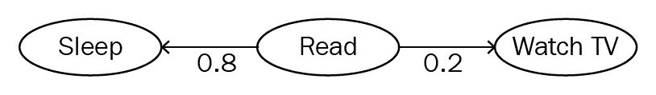

马尔可夫链位于核心概念中，即未来仅取决于现在而不是过去。 如果遵循马尔可夫属性，则随机过程称为马尔可夫过程。

# 马尔可夫决策过程

MDP 是马尔可夫链的延伸。 它提供了用于建模决策情况的数学框架。 几乎所有的强化学习问题都可以建模为 MDP。

MDP 由五个重要元素表示：

*   智能体实际上可以处于的一组状态`(S)`。
*   智能体可以执行的一组动作`(A)`，用于从一种状态转移到另一种状态。
*   转移概率（`P[ss']^a`），是通过执行某些操作`a`从一种状态`s`转移到另一种状态`s'`的概率。
*   奖励概率（`R[ss']^a`），是智能体通过执行某些动作`a`从一种状态`s`转移到另一种状态`s'`所获得的奖励的概率。
*   折扣因子（`γ`），用于控制立即和将来奖励的重要性。 我们将在接下来的部分中详细讨论。

# 奖励与回报

如我们所知，在 RL 环境中，智能体通过执行操作与环境交互，并从一种状态转移到另一种状态。 根据其执行的动作，它会获得奖励。 奖励不过是一个数字值，例如，一个好动作为 +1，而一个坏动作为 -1。 我们如何确定一个动作是好是坏？ 在迷宫游戏中，好动作是指智能体进行移动以使其不会撞到迷宫壁的地方，而不好的动作是指智能体进行移动并撞到迷宫壁的地方。

智能体试图最大化从环境而不是即时奖励中获得的奖励（累积奖励）总量。 智能体从环境中获得的总奖励金额称为回报。 因此，我们可以将智能体收到的奖励（回报）总额计算如下：


`r[t + 1]`是智能体在执行操作`a[0]`从一种状态转换到另一种状态时在时间步骤`t[0]`时收到的奖励。 `r[t + 2]`是智能体在执行从一个状态到另一状态的动作时，在
步骤`t[1]`时收到的奖励。 类似地，`r[T]`是智能体在执行从一个状态到另一状态的动作时，在最后时间步骤`T`所收到的奖励。

# 间歇性和连续性任务

情景任务是具有最终状态（结束）的任务。 在 RL 中，剧集被视为从初始状态到最终状态的智能体与环境的相互作用。

例如，在赛车视频游戏中，您启动游戏（初始状态）并玩游戏直到游戏结束（最终状态）。 这称为剧集。 游戏结束后，您可以通过重新启动游戏来开始下一个剧集，并且无论您在上一个游戏中所处的位置如何，都将从初始状态开始。 因此，每个剧集彼此独立。

在连续任务中，没有最终状态。 连续的任务永远不会结束。 例如，个人协助机器人没有最终状态。

# 折扣因子

我们已经看到，智能体的目标是使回报最大化。 对于一项临时任务，我们可以将返回定义为`R[t] = r[t + 1] + r[t + 2] + ... + r[T]`，其中`T`是剧集的最终状态，我们尝试最大化回报`R[t]`。

由于连续任务没有任何最终状态，因此我们可以将连续任务的收益定义为`R[t] = r[t + 1] + r[t + 2] + ...`，总和为无穷大。 但是，如果永不止息，我们如何才能最大化回报呢？

这就是为什么我们引入折扣因子的概念。 我们可以使用折扣因子`γ`重新定义收益，如下所示：

 ---（1）

 ---（2）

折扣系数决定了我们对未来奖励和即时奖励的重视程度。 折扣因子的值在`0`至`1`之内。 折扣因子`0`意味着即时奖励更为重要，而折扣因子`1`意味着未来奖励比即时奖励更为重要。

折扣系数`0`永远不会只考虑立即获得的奖励。 同样，`1`的折扣因子将永远学习，以寻找未来的奖励，这可能导致无限。 因此，折扣因子的最佳值在 0.2 到 0.8 之间。

根据使用情况，我们重视即时奖励和将来的奖励。 在某些情况下，未来的奖励比立即的奖励更可取，反之亦然。 在国际象棋游戏中，目标是击败对手的国王。 如果我们重视即时奖励，而即时奖励是通过典当击败任何对手玩家等行动获得的，那么坐席将学会执行此子目标，而不是学习达到实际目标。 因此，在这种情况下，我们重视未来的奖励，而在某些情况下，我们更喜欢即时奖励，而不是未来的奖励。 （说，如果我今天或 13 个月后给您巧克力，您会喜欢巧克力吗？）

# 策略函数

我们已经在第 1 章，“强化学习简介”中了解了策略函数，该函数将状态映射到操作。 用`π`表示。

策略函数可以表示为`π(s): s -> a`，指示从状态到动作的映射。 因此，基本上，策略函数会说明在每种状态下要执行的操作。 我们的最终目标在于找到最佳策略，该策略指定在每个状态下执行的正确操作，从而最大化回报。

# 状态值函数

状态值函数也简称为值函数。 它通过策略`π`指定智能体处于特定状态的状态如何。 值函数通常由`V(s)`表示。 它表示遵循策略的状态的值。

我们可以定义一个状态值函数，如下所示：


这根据策略`π`指定从状态`s`开始的预期收益。 我们可以用`(2)`的值函数替换`R[t]`的值，如下所示：

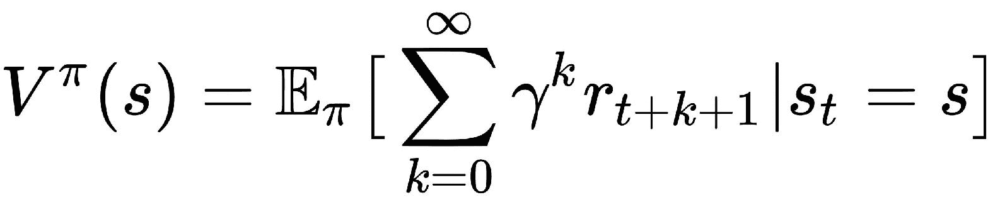

请注意，状态值函数取决于策略，并且取决于我们选择的策略而有所不同。

我们可以在表中查看值函数。 假设我们有两个状态，并且这两个状态都遵循策略π。 根据这两个状态的值，我们可以判断出执行策略后，我们的智能体处于该状态有多好。 值越大，状态越好：

| **状态** | **值** |
| --- | --- |
| 状态 1 | 0.3 |
| 状态 2 | 0.9 |

根据上表，我们可以知道处于状态 2 很好，因为它具有很高的值。 在接下来的部分中，我们将看到如何直观地估计这些值。

# 状态作用值函数（Q 函数）

状态作用值函数也称为`Q`函数。 它指定智能体在具有策略`π`的状态下执行特定操作的效果如何。`Q`函数由`Q(s)`表示。 它表示在遵循策略`π`的状态下执行操作的值。

我们可以定义`Q`函数，如下所示：

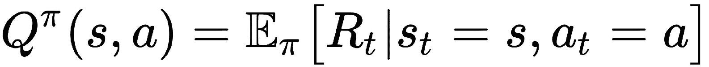

这根据策略`π`指定从状态`s`开始的预期回报，其动作为`a`。 我们可以从（2）的`Q`函数中替换`R[t]`的值，如下所示：

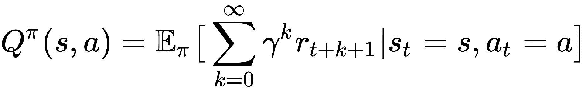

值函数和`Q`函数之间的区别在于，值函数指定状态的优劣，而`Q`函数指定状态的行为的优劣。

与状态值函数一样，`Q`函数可以在表中查看。 也称为`Q`表。 让我们说我们有两个状态和两个动作。 我们的`Q`表如下所示：

| **状态** | **动作** | **值** |
| --- | --- | --- |
| 状态 1 | 动作 1 | 0.03 |
| 状态 1 | 动作 2 | 0.02 |
| 状态 2 | 动作 1 | 0.5 |
| 状态 2 | 动作 2 | 0.9 |

因此，`Q`表显示了所有可能的状态动作对的值。 因此，通过查看此表，我们可以得出结论，在状态 1 中执行动作 1 和在状态 2 中执行动作 2 是更好的选择，因为它具有很高的值。

每当我们说值函数`V(S)`或`Q`函数`Q(S, a)`时，它实际上表示值表，而`Q`表，如前所示。

#贝尔曼方程和最优性

以美国数学家理查德·贝尔曼（Richard Bellman）命名的贝尔曼方程式可帮助我们求解 MDP。 它在 RL 中无处不在。 当我们说解决 MDP 时，实际上意味着找到最佳的策略和值函数。 根据不同的策略，可以有许多不同的值函数。 与所有其他值函数相比，最优值函数`V*(s)`是产生最大值的函数：


类似地，最优策略是导致最优值函数的策略。

由于最优值函数`V*(s)`是比所有其他值函数（即最大收益）更高的值的函数，因此它将是`Q`函数的最大值。 因此，可以通过将`Q`函数的最大值取如下来轻松地计算最佳值函数：

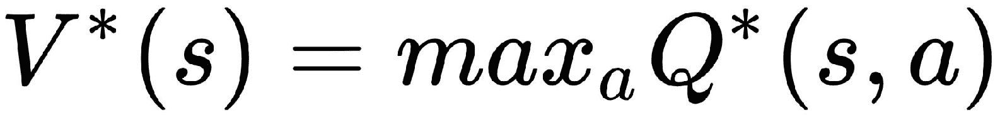 ---（3）

值函数的贝尔曼方程可以表示为（在下一主题中，我们将看到如何推导该方程）：


它指示状态值及其后继状态与所有可能性的平均值之间的递归关系。

类似地，用于`Q`函数的贝尔曼方程可以表示为：

 ---（4）

将公式`(4)`代入`(3)`，我们得到：

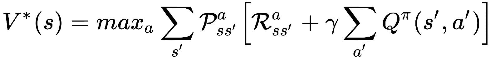

前面的方程式称为贝尔曼最优方程式。 在接下来的部分中，我们将看到如何通过求解该方程式找到最佳策略。

# 推导值和 Q 函数的贝尔曼方程

现在，让我们看看如何导出值和`Q`函数的贝尔曼方程。

如果您对数学不感兴趣，可以跳过本节。 但是，数学将非常有趣。

首先，我们将`P[ss']^a`定义为在执行动作`a`时从状态`s`转换为`s'`的转移概率：

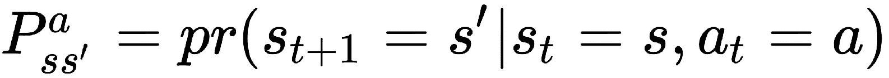

我们将`R[ss']^a`定义为在执行动作`a`时从状态`s`移至`s'`所获得的奖励概率：


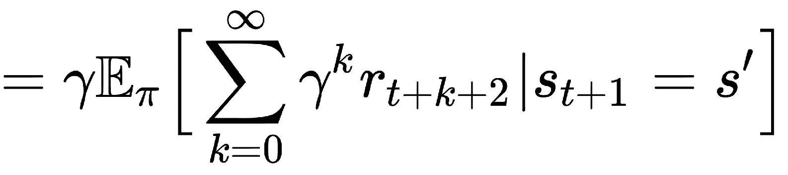 来自（2）---（5）

我们知道值函数可以表示为：


 来自（1）

我们可以通过获取第一笔报酬来重写值函数：

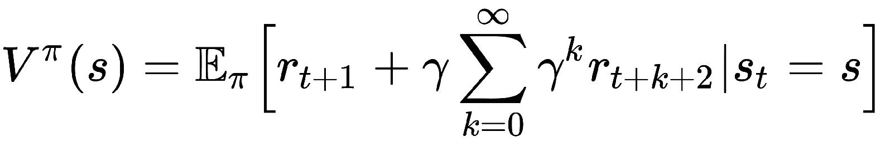 ---（6）

如果我们处于状态`s`，并通过策略`π`执行动作`a`，则值函数中的期望值指定了期望收益。

因此，我们可以通过总结所有可能的动作和奖励来明确地重写我们的期望，如下所示：


在 RHS 中，我们将等式`(5)`中的`R[ss']^a`替换为：


同样，在 LHS 中，我们将从等式`(2)`中替换`r[t + 1]`的值，如下所示：


因此，我们的最终期望方程变为：

 ---（7）

现在，我们将期望值`(7)`替换为值函数`(6)`，如下所示：

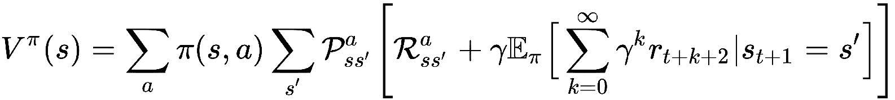

代替


我们可以用等式`(6)`代替`V[s']^π`，我们的最终值函数如下所示：


以非常相似的方式，我们可以为`Q`函数导出一个贝尔曼方程； 最终方程如下：


现在，对于值函数和`Q`函数都有一个贝尔曼方程，我们将看到如何找到最佳策略。

# 求解贝尔曼方程

我们可以通过求解贝尔曼最优性方程来找到最优策略。 为了解决贝尔曼最优性方程，我们使用一种称为动态规划的特殊技术。

# 动态规划

**动态规划**（**DP**）是一种解决复杂问题的技术。 在 DP 中，不是一次解决一个复杂的问题，而是将问题分解为简单的子问题，然后针对每个子问题，我们计算并存储解决方案。 如果出现相同的子问题，我们将不会重新计算，而是使用已经计算的解决方案。 因此，DP 有助于极大地减少计算时间。 它的应用广泛，包括计算机科学，数学，生物信息学等。

我们使用两种强大的算法来求解贝尔曼方程：

*   值迭代
*   策略迭代

# 值迭代

在值迭代中，我们从随机值函数开始。 显然，随机值函数可能不是最佳函数，因此我们以迭代方式寻找新的改进值函数，直到找到最佳值函数为止。 一旦找到最优值函数，就可以轻松地从中得出最优策略：

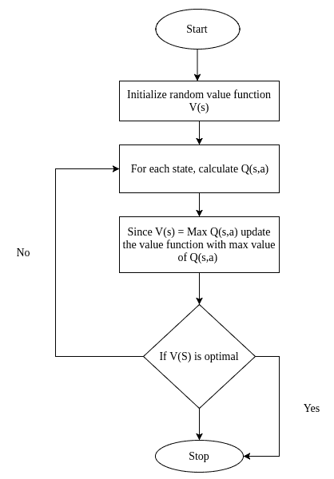

值迭代涉及的步骤如下：

1.  首先，我们初始化随机值函数，即每个状态的随机值。
2.  然后，我们为`Q(s, a)`的所有状态动作对计算`Q`函数。
3.  然后，我们使用`Q(s, a)`中的最大值更新值函数。
4.  我们重复这些步骤，直到值函数的变化很小。

让我们通过手动逐步执行值迭代来直观地理解它。

考虑此处显示的网格。 让我们说我们处于状态`A`，我们的目标是在不访问状态`B`的情况下达到状态`C`，我们有两个动作，0 是左/右和 1 是上/下：

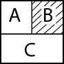

您能想到这里的最佳策略吗？ 此处的最佳策略是告诉我们在`A`状态下执行操作 1 的策略，这样我们就可以访问`C`而无需访问`B`。 我们如何找到这个最佳策略？ 现在让我们看看：

初始化随机值函数，即所有状态的随机值。 让我们将`0`分配给所有状态：


让我们计算所有状态动作对的`Q`值。

Q 值告诉我们每个状态下一个动作的值。 首先，让我们计算状态`A`的`Q`值。 调用`Q`函数的方程式。 为了进行计算，我们需要转移和奖励概率。 让我们考虑状态`A`的转移和奖励概率，如下所示：


状态`A`的 Q 函数可以计算如下：

```
Q(s, a) = 转移概率 * (奖励概率 + gamma * next_state 的值)
```

在此，`gamma`是折扣因子； 我们将其视为`1`。

状态`A`和操作`0`的 Q 值：


```
Q(A, 0) = (0.1 * (0 + 0)) + (0.4 * (-1.0 + 0)) + (0.3 * (1.0 + 0))

Q(A, 0) = -0.1
```

现在我们将计算状态`A`和操作`1`的`Q`值：

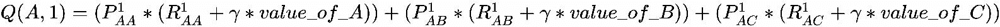

```
Q(A, 1) = (0.3 * (0 + 0)) + (0.1 * (-2.0 + 0)) + (0.5 * (1.0 + 0))

Q(A, 1) = 0.3
```

现在，我们将在`Q`表中对此进行更新，如下所示：


从`Q(s, a)`更新值函数为最大值。

如果您查看前面的`Q`函数，则`Q(A, 1)`的值大于`Q(A, 0)`的值，因此我们将将状态`A`的值更新为`Q(A, 1)`：

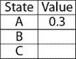

同样，我们为所有状态动作对计算`Q`值，并通过获取具有最高状态动作值的`Q`值来更新每个状态的值函数。 我们的更新值函数如下所示。 这是第一次迭代的结果：


我们重复此步骤几次迭代。 也就是说，我们将步骤`2`重复到步骤`3`（在每次迭代中，在计算`Q`值时，我们使用更新后的值函数，而不是相同的随机初始化函数） 值函数）。

这是第二次迭代的结果：


这是第三次迭代的结果：

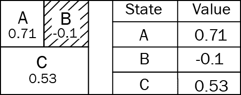

但是我们什么时候停止呢？ 当每次迭代之间的值变化较小时，我们将停止； 如果查看第二和第三次迭代，则值函数的变化不大。 在这种情况下，我们停止迭代并将其视为最佳值函数。

好了，既然我们已经找到了最优值函数，那么我们如何得出最优策略呢？

这很简单。 我们用最终的最优值函数计算`Q`函数。 假设我们计算出的`Q`函数如下所示：


从此`Q`函数中，我们选择每种状态下具有最大值的动作。 在状态`A`下，我们为操作 1 设置了最大值，这是我们的最佳策略。 因此，如果我们在状态`A`中执行动作 1，则无​​需访问`B`就可以达到`C`。

# 策略迭代

与值迭代不同，在策略迭代中，我们从随机策略开始，然后找到该策略的值函数。 如果值函数不是最优的，那么我们会找到新的改进策略。 我们重复此过程，直到找到最佳策略。

策略迭代有两个步骤：

1.  **策略评估**：评估随机估计策略的值函数。
2.  **策略改进**：在评估值函数时，如果它不是最优的，我们会发现新的改进策略：


策略迭代涉及的步骤如下：

1.  首先，我们初始化一些随机策略
2.  然后我们找到该随机策略的值函数，并进行评估以检查其是否最优，这称为策略评估
3.  如果不是最佳选择，我们会找到新的改进策略，称为策略改进
4.  我们重复这些步骤，直到找到最佳策略

让我们通过逐步手动执行策略迭代来直观地理解。

考虑我们在*值迭代*部分中看到的相同网格示例。 我们的目标是找到最佳策略：

1.  初始化随机策略函数。

让我们通过为每个状态指定随机动作来初始化随机策略函数：

```
A -> 0
B -> 1
C -> 0
```

2.  查找随机初始化策略的值函数。

现在，我们必须使用随机初始化的策略来查找值函数。 我们说一下计算后的值函数如下：


现在，根据随机初始化的策略有了新的值函数，让我们使用新的值函数计算新的策略。 我们如何做到这一点？ 这与我们在*值迭代*中所做的非常相似。 我们为新值函数计算`Q`值，然后针对具有最大值的每个状态采取措施作为新策略。

我们说新策略的结果是：

```
A -> 0
B -> 1
C -> 1
```

我们检查旧策略，即随机初始化的策略和新策略。 如果它们相同，则我们已经达到收敛，即找到了最佳策略。 如果没有，我们将旧策略（随机策略）更新为新策略，并从步骤`2`开始重复。

听起来令人困惑？ 看一下伪代码：

```py
policy_iteration():
    Initialize random policy
    for i in no_of_iterations: 
        Q_value = value_function(random_policy)
        new_policy = Maximum state action pair from Q value
        if random_policy == new policy:
            break
        random_policy = new_policy 
    return policy
```

# 解决冻湖问题

如果您到目前为止还不了解我们所学的知识，请放心，我们将研究所有概念以及冻湖问题。

想象一下，有一个从家到办公室的冰冻湖泊。 您必须在结冰的湖面上行走才能到达办公室。 但是糟糕！ 冰冻的湖面上有洞，因此您在冰冻的湖面上行走时必须小心，以免被困在洞中：

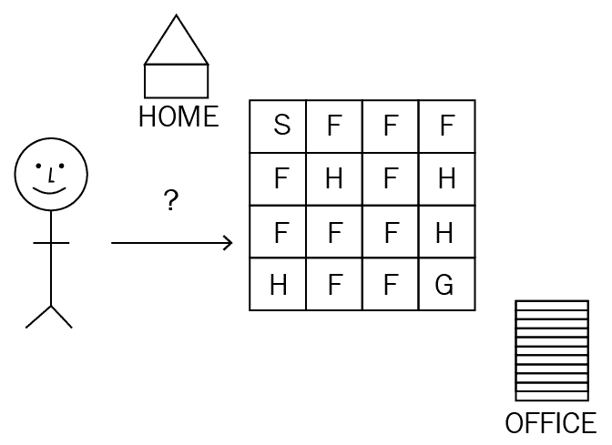

看上图：

*   `S`是起始位置（原点）
*   `F`是您可以漫步的冰冻湖
*   `H`是孔，您必须非常小心
*   `G`是目标（办公室）

好的，现在让我们代替您使用我们的智能体来找到到达办公室的正确方法。 该智能体的目标是找到从`S`到`G`的最佳路径，而不会陷入`H`的陷阱。 智能体如何做到这一点？ 如果智能体正确地在冰冻的湖面上行走，我们给 +1 分作为奖励，如果智能体正确落入洞中，则给 0 分，以便智能体确定正确的行动。 智能体现在将尝试找到最佳策略。 最优策略意味着采取正确的道路，这将最大化智能体的报酬。 如果智能体正在使报酬最大化，则显然智能体正在学习跳过漏洞并到达目的地。

我们可以将问题建模为我们先前研究的 MDP。 MDP 包含以下内容：

*   **状态**：状态集。 在这里，我们有 16 个状态（网格中的每个小方框）。
*   **动作**：所有可能动作的集合（左，右，上，下；这是我们的智能体在冰冻湖面环境中可以采取的所有四种可能动作）。
*   **转移概率**：通过执行动作`a`从一种状态（`F`）转换为另一种状态（`H`）的概率。
*   **奖励概率**：这是执行动作`a`从一种状态（`F`）迁移到另一种状态（`H`）时获得奖励的概率。

现在我们的目标是解决 MDP。 解决 MDP 意味着寻找最佳策略。 现在，我们介​​绍三个特殊函数：

*   **策略函数**：指定在每种状态下要执行的操作
*   **值函数**：指定状态的良好程度
*   **Q 函数**：指定动作在特定状态下的状态

当我们说有多好时，这到底意味着什么？ 这意味着最大化奖励是多么的好。

然后，我们使用称为贝尔曼最优性方程的特殊方程式表示值函数和`Q`函数。 如果我们解决这个方程，我们可以找到最佳策略。 在这里，求解方程式意味着找到正确的值函数和策略。 如果我们找到正确的值函数和策略，那将是我们获得最大回报的最佳途径。

我们将使用一种称为动态规划的特殊技术来求解贝尔曼最优性方程。 要应用 DP，必须预先知道模型动态，这基本上意味着必须预先知道模型环境的转换概率和奖励概率。 由于我们知道模型动态，因此可以在此处使用 DP。 我们使用两种特殊的 DP 算法来找到最佳策略：

*   值迭代
*   策略迭代

# 值迭代

简单来说，在值迭代中，我们首先将一些随机值初始化为值函数。 我们初始化的随机值很有可能不会达到最佳状态。 因此，我们遍历每个状态并找到新的值函数； 我们停止迭代，直到找到最佳值函数。 一旦找到最优值函数，就可以轻松地从中提取最优策略。

现在我们将看到如何使用值迭代来解决冻湖问题。

首先，我们导入必要的库：

```py
import gym
import numpy as np
```

然后，我们使用 OpenAI 的 Gym 创建冰冻的湖泊环境：

```py
env = gym.make('FrozenLake-v0')
```

我们将首先探索环境。

由于我们有一个`4 * 4`的网格，因此环境中的状态数为 16：

```py
print(env.observation_space.n)
```

环境中的操作数为四个，分别为上，下，左和右：

```py
print(env.observation_space.n)
```

现在我们定义一个`value_iteration()`函数，该函数返回最佳值函数（值表）。 我们将首先逐步了解该函数，然后再查看整个函数。

首先，我们为所有状态和迭代次数初始化随机值表`0`：

```py
value_table = np.zeros(env.observation_space.n)
no_of_iterations = 100000
```

然后，在每次迭代开始时，我们将`value_table`复制到`updated_value_table`：

```py
 for i in range(no_of_iterations):
     updated_value_table = np.copy(value_table) 
```

现在，我们计算 Q 表，并选择具有最高值的最大状态动作对作为值表。

我们将使用之前解决的示例来理解代码。 我们在上一个示例中计算了状态`A`和操作`1`的`Q`值：

```
Q(A, 1) = (0.3 * (0 + 0)) + (0.1 * (-1.0 + 0)) + (0.5 + (1.0 + 0))

Q(A, 1) = 0.5
```

我们没有为每个状态创建`Q`表，而是创建了一个名为`Q_value`的列表，然后为该状态中的每个动作创建了一个名为`next_states_rewards`的列表，该列表存储了`Q_value` 下一个转移状态。 然后，我们对`next_state_rewards`求和并将其附加到我们的`Q_value`中。

请看前面的示例，其中状态为`A`，操作为`1`。 `(0.3 * (0 + 0))`是转移状态`A`的下一个状态奖励，`(0.1 * (-1.0 + 0))`是转移状态`B`的下一状态奖励。 `(0.5 + (1.0 + 0))`是转移状态`C`的下一个状态奖励。 我们将所有这些加总为`next_state_reward`，并将其附加到`Q_value`中，该值为 0.5。

当我们为状态的所有动作计算`next_state_rewards`并将其附加到`Q`值时，我们选取​​最大的`Q`值并将其更新为我们的状态值：

```py
for state in range(env.observation_space.n):
    Q_value = []
    for action in range(env.action_space.n):
        next_states_rewards = []
        for next_sr in env.P[state][action]: 
            trans_prob, next_state, reward_prob, _ = next_sr 
            next_states_rewards.append((trans_prob * (reward_prob + gamma *                    updated_value_table[next_state]))) 

          Q_value.append(np.sum(next_states_rewards))

```

```py
          #Pick up the maximum Q value and update it as value of a state
          value_table[state] = max(Q_value) 
```

然后，我们将检查是否已经达到收敛，即，我们的值表和更新后的值表之间的差异非常小。 我们怎么知道它很小？ 我们定义了一个名为`threshold`的变量，然后我们看一下差异是否小于我们的`threshold`； 如果小于，则中断循环，并将值函数返回为最佳值函数：

```py
threshold = 1e-20
if (np.sum(np.fabs(updated_value_table - value_table)) <= threshold):
    print ('Value-iteration converged at iteration# %d.' %(i+1))
    break
```

查看`value_iteration()`的完整函数可以更好地理解：

```py
def value_iteration(env, gamma = 1.0):
    value_table = np.zeros(env.observation_space.n)
    no_of_iterations = 100000
    threshold = 1e-20

    for i in range(no_of_iterations):
        updated_value_table = np.copy(value_table) 

        for state in range(env.observation_space.n):
            Q_value = []

            for action in range(env.action_space.n):
                next_states_rewards = []

                for next_sr in env.P[state][action]: 
                    trans_prob, next_state, reward_prob, _ = next_sr 
                    next_states_rewards.append((trans_prob * (reward_prob + gamma * updated_value_table[next_state])))

                Q_value.append(np.sum(next_states_rewards))
            value_table[state] = max(Q_value) 
        if (np.sum(np.fabs(updated_value_table - value_table)) <= threshold):
             print ('Value-iteration converged at iteration# %d.' %(i+1))
             break

    return value_table, Q_value
```

因此，我们可以使用`value_iteration`导出`optimal_value_function`：

```py
optimal_value_function = value_iteration(env=env,gamma=1.0)
```

找到`optimal_value_function`后，如何从`optimal_value_function`中提取最佳策略？ 我们使用最佳值操作来计算`Q`值，并选择每个状态中具有最高`Q`值的操作作为最佳策略。 我们通过称为`extract_policy()`的函数来完成此操作； 我们现在将逐步介绍这一点。

首先，我们定义随机策略； 对于所有状态，我们将其定义为`0`：

```py
policy = np.zeros(env.observation_space.n)
```

然后，对于每个状态，我们都构建一个`Q_table`，并且针对该状态中的每个动作，我们计算`Q`值并将其添加到我们的`Q_table`中：

```py
for state in range(env.observation_space.n):
        Q_table = np.zeros(env.action_space.n)
        for action in range(env.action_space.n):
            for next_sr in env.P[state][action]: 
                trans_prob, next_state, reward_prob, _ = next_sr 
                Q_table[action] += (trans_prob * (reward_prob + gamma * value_table[next_state]))
```

然后，我们为`state`选择策略，将其作为具有`Q`最高值的操作：

```py
policy[state] = np.argmax(Q_table)
```

看一下完整的函数：

```py
def extract_policy(value_table, gamma = 1.0):

    policy = np.zeros(env.observation_space.n) 
    for state in range(env.observation_space.n):
        Q_table = np.zeros(env.action_space.n)
        for action in range(env.action_space.n):
            for next_sr in env.P[state][action]: 
                trans_prob, next_state, reward_prob, _ = next_sr 
                Q_table[action] += (trans_prob * (reward_prob + gamma * value_table[next_state]))
        policy[state] = np.argmax(Q_table)

    return policy
```

因此，我们可以得出`optimal_policy`如下：

```py
optimal_policy = extract_policy(optimal_value_function, gamma=1.0)
```

我们将获得如下输出，即`optimal_policy`，即在每种状态下要执行的操作：

```py
array([0., 3., 3., 3., 0., 0., 0., 0., 3., 1., 0., 0., 0., 2., 1., 0.])
```

完整的程序如下：

```py
import gym
import numpy as np
env = gym.make('FrozenLake-v0')

def value_iteration(env, gamma = 1.0):
    value_table = np.zeros(env.observation_space.n)
    no_of_iterations = 100000
    threshold = 1e-20
    for i in range(no_of_iterations):
        updated_value_table = np.copy(value_table) 

        for state in range(env.observation_space.n):
            Q_value = []
            for action in range(env.action_space.n):
                next_states_rewards = []
                for next_sr in env.P[state][action]: 
                    trans_prob, next_state, reward_prob, _ = next_sr 
                    next_states_rewards.append((trans_prob * (reward_prob + gamma * updated_value_table[next_state]))) 
                Q_value.append(np.sum(next_states_rewards))

            value_table[state] = max(Q_value) 

        if (np.sum(np.fabs(updated_value_table - value_table)) <= threshold):
             print ('Value-iteration converged at iteration# %d.' %(i+1))
             break

    return value_table

def extract_policy(value_table, gamma = 1.0):
    policy = np.zeros(env.observation_space.n) 
    for state in range(env.observation_space.n):
        Q_table = np.zeros(env.action_space.n)
        for action in range(env.action_space.n):
            for next_sr in env.P[state][action]: 
                trans_prob, next_state, reward_prob, _ = next_sr 
                Q_table[action] += (trans_prob * (reward_prob + gamma * value_table[next_state]))
        policy[state] = np.argmax(Q_table)

    return policy

optimal_value_function = value_iteration(env=env,gamma=1.0)
optimal_policy = extract_policy(optimal_value_function, gamma=1.0)

print(optimal_policy)
```

# 策略迭代

在策略迭代中，首先我们初始化一个随机策略。 然后，我们将评估初始化的随机策略：它们是否好？ 但是，我们如何评估策略呢？ 我们将通过计算它们的值函数来评估我们随机初始化的策略。 如果它们不好，那么我们会找到新的策略。 我们重复此过程，直到找到好的策略。

现在让我们看看如何使用策略迭代来解决冻湖问题。

在查看策略迭代之前，我们将了解在给定策略的情况下如何计算值函数。

我们用状态数将`value_table`初始化为零：

```py
value_table = np.zeros(env.nS)
```

然后，对于每个状态，我们从策略中获取操作，然后根据`action`和`state`计算值函数，如下所示：

```py
        updated_value_table = np.copy(value_table)
        for state in range(env.nS):
            action = policy[state]
            value_table[state] = sum([trans_prob * (reward_prob + gamma *  updated_value_table[next_state]) 
                        for trans_prob, next_state, reward_prob, _ in env.P[state][action]])
```

当`value_table`和`updated_value_table`之差小于我们的`threshold`时，我们将打破这一点：

```py
threshold = 1e-10
if (np.sum((np.fabs(updated_value_table - value_table))) <= threshold):
    break
```

查看以下完整函数：

```py
def compute_value_function(policy, gamma=1.0):
    value_table = np.zeros(env.nS)
    threshold = 1e-10
    while True:
        updated_value_table = np.copy(value_table)
        for state in range(env.nS):
            action = policy[state]
            value_table[state] = sum([trans_prob * (reward_prob + gamma * updated_value_table[next_state]) 
                        for trans_prob, next_state, reward_prob, _ in env.P[state][action]])
        if (np.sum((np.fabs(updated_value_table - value_table))) <= threshold):
            break
    return value_table
```

现在，我们将逐步了解如何执行策略迭代。

首先，我们将`random_policy`初始化为零个 NumPy 数组，其形状为状态数：

```py
 random_policy = np.zeros(env.observation_space.n)
```

然后，对于每次迭代，我们根据随机策略计算`new_value_function`：

```py
new_value_function = compute_value_function(random_policy, gamma)
```

我们将使用计算出的`new_value_function`提取策略。 `extract_policy`函数与我们在值迭代中使用的函数相同：

```py
 new_policy = extract_policy(new_value_function, gamma)
```

然后，我们检查是否已经达到收敛，即是否通过比较`random_policy`和新策略找到了最佳策略。 如果它们相同，我们将中断迭代。 否则，我们用`new_policy`更新`random_policy`：

```py
if (np.all(random_policy == new_policy)):
    print ('Policy-Iteration converged at step %d.' %(i+1))
    break
random_policy = new_policy
```

查看完整的`policy_iteration`函数：

```py
def policy_iteration(env,gamma = 1.0):
    random_policy = np.zeros(env.observation_space.n) 
    no_of_iterations = 200000
    gamma = 1.0
    for i in range(no_of_iterations):
        new_value_function = compute_value_function(random_policy, gamma)
        new_policy = extract_policy(new_value_function, gamma)
        if (np.all(random_policy == new_policy)):
            print ('Policy-Iteration converged at step %d.' %(i+1))
            break
        random_policy = new_policy
    return new_policy
```

因此，我们可以使用`policy_iteration`获得`optimal_policy`：

```py
optimal_policy = policy_iteration(env, gamma = 1.0)
```

我们将获得一些输出，即`optimal_policy`，这是在每种状态下要执行的操作：

```py
array([0., 3., 3., 3., 0., 0., 0., 0., 3., 1., 0., 0., 0., 2., 1., 0.])
```

完整的程序如下：

```py
import gym
import numpy as np

env = gym.make('FrozenLake-v0')

def compute_value_function(policy, gamma=1.0):
    value_table = np.zeros(env.nS)
    threshold = 1e-10
    while True:
        updated_value_table = np.copy(value_table)
        for state in range(env.nS):
            action = policy[state]
            value_table[state] = sum([trans_prob * (reward_prob + gamma * updated_value_table[next_state]) 
                        for trans_prob, next_state, reward_prob, _ in env.P[state][action]])
        if (np.sum((np.fabs(updated_value_table - value_table))) <= threshold):
            break
    return value_table

def extract_policy(value_table, gamma = 1.0):
    policy = np.zeros(env.observation_space.n) 
    for state in range(env.observation_space.n):
        Q_table = np.zeros(env.action_space.n)
        for action in range(env.action_space.n):
            for next_sr in env.P[state][action]: 
                trans_prob, next_state, reward_prob, _ = next_sr 
                Q_table[action] += (trans_prob * (reward_prob + gamma * value_table[next_state]))
        policy[state] = np.argmax(Q_table)

    return policy

def policy_iteration(env,gamma = 1.0):
    random_policy = np.zeros(env.observation_space.n) 
    no_of_iterations = 200000
    gamma = 1.0
    for i in range(no_of_iterations):
        new_value_function = compute_value_function(random_policy, gamma)
        new_policy = extract_policy(new_value_function, gamma)
        if (np.all(random_policy == new_policy)):
            print ('Policy-Iteration converged at step %d.' %(i+1))
            break
        random_policy = new_policy
    return new_policy

print (policy_iteration(env))
```

因此，我们可以得出最佳策略，该策略使用值和策略迭代来解决冻结湖问题，从而指定在每种状态下要执行的操作。

# 总结

在本章中，我们了解了什么是马尔可夫链和马尔可夫过程，以及如何使用 MDP 表示 RL 问题。 我们还研究了贝尔曼方程，并解决了贝尔曼方程，从而使用 DP 推导了最优策略。 在下一章第 4 章，“使用蒙特卡洛方法进行游戏”中，我们将研究蒙特卡洛树搜索以及如何使用它进行智能游戏的构建。

# 问题

问题列表如下：

1.  马尔可夫属性是什么？
2.  为什么我们需要马尔可夫决策过程？
3.  我们何时更喜欢即时奖励？
4.  折扣因子有什么用？
5.  为什么要使用贝尔曼函数？
6.  您将如何导出 Q 函数的贝尔曼方程？
7.  值函数和 Q 函数有何关系？
8.  值迭代和策略迭代有什么区别？

# 进一步阅读

[**MDP 哈佛讲座材料**](http://am121.seas.harvard.edu/site/wp-content/uploads/2011/03/MarkovDecisionProcesses-HillierLieberman.pdf)