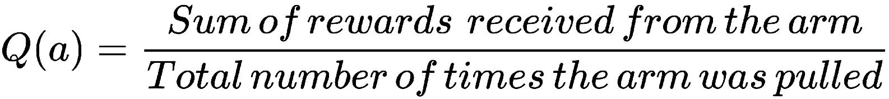
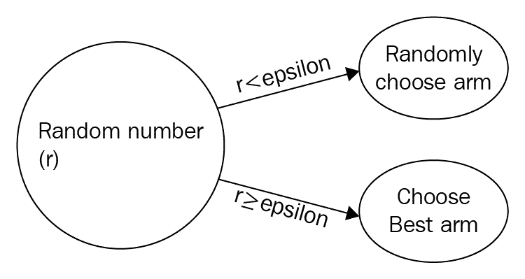
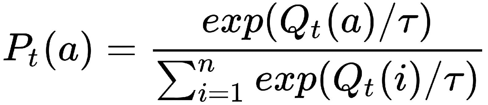
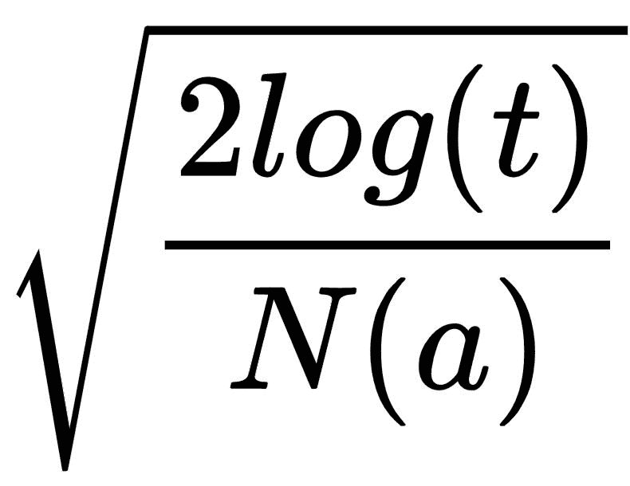
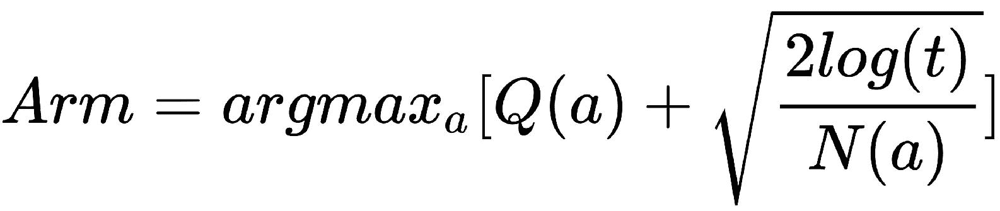
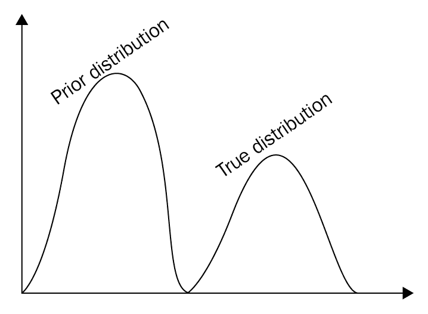
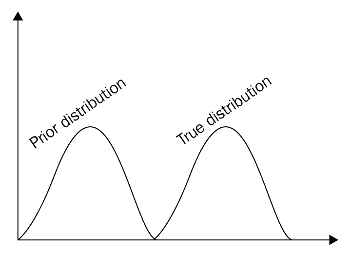

# 多臂老虎机问题

在前面的章节中，我们学习了**强化学习**（**RL**）的基本概念和几种 RL 算法，以及如何将 RL 问题建模为**马尔可夫决策过程**（**MDP**）。 我们还看到了用于解决 MDP 的不同的基于模型和无模型的算法。 在本章中，我们将看到 RL 中的经典问题之一，称为**多臂老虎机**（**MAB**）问题。 我们将看到什么是 MAB 问题，以及如何使用不同的算法解决该问题，然后了解如何使用 MAB 识别将接收大部分点击的正确广告横幅。 我们还将学习广泛用于构建推荐系统的上下文老虎机。

在本章中，您将了解以下内容：

*   MAB 问题
*   epsilon-greedy 算法
*   softmax 探索算法
*   置信区间上限算法
*   汤普森采样算法
*   MAB 的应用
*   使用 MAB 识别正确的广告横幅
*   情境老虎机

# MAB 问题

MAB 问题是 RL 中的经典问题之一。 MAB 实际上是一台老虎机，是一种在赌场玩的赌博游戏，您可以拉动手臂（杠杆）并根据随机生成的概率分布获得支出（奖励）。 一台老虎机称为单臂老虎机，当有多台老虎机时，称为多臂老虎机或 k 臂老虎机。

MAB 如下所示：


由于每台老虎机都通过自己的概率分布为我们提供奖励，因此我们的目标是找出哪台老虎机将在一段时间内为我们提供最大的累积奖励。 因此，代理在每个时间步`t`上执行动作`a[t]`，即从投币游戏机中拉出一条手臂并获得奖励`R[t]`<sub class="calibre24">和</sub>，我们代理商的目标是使累积奖励最大化。

我们将手臂`Q(a)`的值定义为通过拉动手臂获得的平均奖励：



因此，最优臂就是为我们提供最大累积奖励的臂，即：


我们代理人的目标是找到最佳手臂，并最大程度地减少后悔，这可以定义为了解`k`哪个手臂是最佳手臂的代价。 现在，我们如何找到最好的手臂？ 我们应该探索所有武器还是选择已经给予我们最大累积奖励的武器？ 这就是勘探与开发的困境。 现在，我们将看到如何使用以下各种探索策略来解决这个难题：

*   厄普西隆贪婪策略
*   Softmax 探索
*   上置信界算法
*   汤姆森采样技术

在继续之前，让我们在 OpenAI Gym 中安装`bandit`环境； 您可以通过在终端中键入以下命令来安装`bandit`环境：

```py
git clone https://github.c[om/JKCoop](https://www.google.com/url?q=https://github.com/JKCooper2/gym-bandits.git&sa=D&ust=1529836954889000&usg=AFQjCNFpMNcU8k-62v6Bb0UZSngaldPxeg)[er2/gym-ba](https://www.google.com/url?q=https://github.com/JKCooper2/gym-bandits.git&sa=D&ust=1529836954889000&usg=AFQjCNFpMNcU8k-62v6Bb0UZSngaldPxeg)[ndits.g](https://www.google.com/url?q=https://github.com/JKCooper2/gym-bandits.git&sa=D&ust=1529836954889000&usg=AFQjCNFpMNcU8k-62v6Bb0UZSngaldPxeg)[it](https://www.google.com/url?q=https://github.com/JKCooper2/gym-bandits.git&sa=D&ust=1529836954889000&usg=AFQjCNFpMNcU8k-62v6Bb0UZSngaldPxeg)
cd gym-bandits
pip install -e .
```

安装后，让我们导入`gym`和`gym_bandits`：

```py
import gym_bandits
import gym
```

现在我们将初始化环境； 我们使用带有十个臂的 MAB：

```py
env = gym.make("BanditTenArmedGaussian-v0")
```

我们的行动空间将是 10，因为我们有 10 条手臂：

```py
env.action_space
```

输出如下：

```py
10
```

# 贪婪策略

我们已经学到了很多关于ε贪婪策略的知识。 在 epsilon-greedy 策略中，或者我们选择概率为 1-epsilon 的最佳手臂，或者我们随机选择概率为 epsilon 的手臂：



现在，我们将看到如何使用 epsilon-greedy 策略选择最佳手臂：

1.  首先，让我们初始化所有变量：

```py
# number of rounds (iterations)
num_rounds = 20000

# Count of number of times an arm was pulled
count = np.zeros(10)

# Sum of rewards of each arm
sum_rewards = np.zeros(10)

# Q value which is the average reward
Q = np.zeros(10)
```

2.  现在我们定义`epsilon_greedy`函数：

```py
def epsilon_greedy(epsilon):

    rand = np.random.random() 
    if rand < epsilon:
        action = env.action_space.sample()
    else:
        action = np.argmax(Q)

    return action
```

3.  开始拉动手臂：

```py
for i in range(num_rounds):

    # Select the arm using epsilon greedy 
    arm = epsilon_greedy(0.5)

    # Get the reward
    observation, reward, done, info = env.step(arm) 

    # update the count of that arm
    count[arm] += 1

    # Sum the rewards obtained from the arm
    sum_rewards[arm]+=reward

    # calculate Q value which is the average rewards of the arm
    Q[arm] = sum_rewards[arm]/count[arm]

print( 'The optimal arm is {}'.format(np.argmax(Q)))
```

以下是输出：

```py
The optimal arm is 3
```

# softmax 探索算法

Softmax 探索（也称为 Boltzmann 探索）是用于找到最佳老虎机的另一种策略。 在 epsilon-greedy 策略中，我们等效地考虑所有非最佳分支，但是在 softmax 探索中，我们根据来自 Boltzmann 分布的概率选择一个分支。 选择手臂的概率由下式给出：



称为温度因子，它指定我们可以探索多少个随机臂。 当高时，将平等地探索所有手臂，但是当低时，将选择高回报手臂。 请看以下步骤：

1.  首先，初始化变量：

```py
# number of rounds (iterations)
num_rounds = 20000

# Count of number of times an arm was pulled
count = np.zeros(10)

# Sum of rewards of each arm
sum_rewards = np.zeros(10)

# Q value which is the average reward
Q = np.zeros(10)
```

2.  现在我们定义`softmax`函数：

```py
def softmax(tau):

    total = sum([math.exp(val/tau) for val in Q]) 
    probs = [math.exp(val/tau)/total for val in Q]

    threshold = random.random()
    cumulative_prob = 0.0
    for i in range(len(probs)):
        cumulative_prob += probs[i]
        if (cumulative_prob > threshold):
            return i
    return np.argmax(probs) 

```

3.  开始拉`arm`：

```py
for i in range(num_rounds):

    # Select the arm using softmax
    arm = softmax(0.5)

    # Get the reward
    observation, reward, done, info = env.step(arm) 

    # update the count of that arm
    count[arm] += 1

    # Sum the rewards obtained from the arm
    sum_rewards[arm]+=reward

    # calculate Q value which is the average rewards of the arm
    Q[arm] = sum_rewards[arm]/count[arm]

print( 'The optimal arm is {}'.format(np.argmax(Q)))
```

以下是输出：

```py
The optimal arm is 3
```

# 置信区间上限算法

通过 epsilon-greedy 和 softmax 探索，我们以概率探索了随机动作。 随机动作对于探索各种武器很有用，但也可能导致我们尝试无法给我们带来丰厚回报的动作。 我们也不想错过实际上是好的武器，但在最初的回合中却给出了差的奖励。 因此，我们使用一种称为**上置信界上限**（**UCB**）的新算法。 它基于面对不确定性时称为乐观的原则。

UCB 算法可帮助我们根据置信区间选择最佳分支。 好的，置信区间是多少？ 让我们说我们有两条手臂。 我们拉开这两个手臂，发现第一手臂给了我们 0.3 奖励，第二手臂给了我们 0.8 奖励。 但是，随着一轮拉动手臂，我们不应该得出这样的结论：第二臂将给我们最好的回报。 我们必须尝试几次拉动手臂，取每个手臂获得的奖励平均值，然后选择平均值最高的手臂。 但是，我们如何才能找到每个臂的正确平均值？ 这是置信区间进入图片的位置。 置信区间指定武器平均奖励值所在的区间。 如果手臂 1 的置信区间为`[0.2, 0.9]`，则表示手臂 1 的平均值在此区间 0.2 至 0.9 内。 0.2 称为下置信界，而 0.9 称为 UCB。 UCB 选择具有较高 UCB 的机器进行探索。

假设我们有三台老虎机，并且每台老虎机都玩了十次。 下图显示了这三个老虎机的置信区间：


我们可以看到**老虎机 3** 具有较高的 UCB。 但是我们不应该得出这样的结论：**老虎机 3** 只需拉 10 次就能给我们带来丰厚的回报。 一旦我们几次拉起手臂，我们的置信区间就会准确。 因此，随着时间的流逝，置信区间会变窄并缩小为实际值，如下图所示。 因此，现在，我们可以选择具有较高 UCB 的**老虎机 2** ：


UCB 背后的想法非常简单：

1.  选择具有较高平均奖励和较高置信度上限的动作（手臂）
2.  拉手臂并获得奖励
3.  更新手臂的奖励和信心范围

但是，我们如何计算 UCB？

我们可以使用公式计算 UCB，其中`N(a)`是拉动手臂的次数，`t`是回合的总数。

因此，在 UCB 中，我们选择具有以下公式的手臂：



首先，初始化变量：

```py
# number of rounds (iterations)
num_rounds = 20000

# Count of number of times an arm was pulled
count = np.zeros(10)

# Sum of rewards of each arm
sum_rewards = np.zeros(10)

# Q value which is the average reward
Q = np.zeros(10)
```

现在，让我们定义我们的`UCB`函数：

```py
def UCB(iters):

    ucb = np.zeros(10)

    #explore all the arms
    if iters < 10:
        return i

    else:
        for arm in range(10):

            # calculate upper bound
            upper_bound = math.sqrt((2*math.log(sum(count))) / count[arm])

            # add upper bound to the Q value
            ucb[arm] = Q[arm] + upper_bound

        # return the arm which has maximum value
        return (np.argmax(ucb))
```

让我们开始武装起来：

```py
for i in range(num_rounds):

    # Select the arm using UCB
    arm = UCB(i)

    # Get the reward
    observation, reward, done, info = env.step(arm) 

    # update the count of that arm
    count[arm] += 1

    # Sum the rewards obtained from the arm
    sum_rewards[arm]+=reward

    # calculate Q value which is the average rewards of the arm
    Q[arm] = sum_rewards[arm]/count[arm]

print( 'The optimal arm is {}'.format(np.argmax(Q)))
```

输出如下：

```py
The optimal arm is 1
```

# 汤普森采样算法

**汤普森采样**（**TS**）是另一种广泛使用的算法，可克服勘探开发难题。 它是一种概率算法，基于先验分布。 TS 背后的策略非常简单：首先，我们先计算每个`k`武器的平均回报，也就是说，我们从`K`个手臂的每个中提取`n`个样本，并计算`k`个分布。 这些初始分布将与真实分布不同，因此我们将其称为先验分布：



由于我们有伯努利奖赏，因此我们使用 beta 分布来计算先验。 beta 分布[alpha，beta]的值在[0,1]区间内。 Alpha 代表我们获得正面奖励的次数，而 Beta 代表我们获得负面奖励的次数。

现在，我们将看到 TS 如何帮助我们选择最佳手臂。 TS 中涉及的步骤如下：

1.  从每个`k`分布中采样一个值，并将该值用作先验平均值。
2.  选择具有最高先验均值的手臂并观察奖励。
3.  使用观察到的奖励来修改先前的分配。

因此，经过几轮之后，先前的分配将开始类似于真实的分配：



我们将通过在 Python 中实现 TS 来更好地理解 TS。 首先，让我们初始化变量：

```py
# number of rounds (iterations)
num_rounds = 20000

# Count of number of times an arm was pulled
count = np.zeros(10)

# Sum of rewards of each arm
sum_rewards = np.zeros(10)

# Q value which is the average reward
Q = np.zeros(10)

# initialize alpha and beta values
alpha = np.ones(10)
beta = np.ones(10)
```

定义我们的`thompson_sampling`函数：

```py
def thompson_sampling(alpha,beta):

    samples = [np.random.beta(alpha[i]+1,beta[i]+1) for i in range(10)]

    return np.argmax(samples)
```

使用 TS 开始与老虎机一起玩：

```py
for i in range(num_rounds):

 # Select the arm using thompson sampling
 arm = thompson_sampling(alpha,beta)

 # Get the reward
 observation, reward, done, info = env.step(arm) 

 # update the count of that arm
 count[arm] += 1

 # Sum the rewards obtained from the arm
 sum_rewards[arm]+=reward

 # calculate Q value which is the average rewards of the arm
 Q[arm] = sum_rewards[arm]/count[arm]

 # If it is a positive reward increment alpha
 if reward >0:
 alpha[arm] += 1

 # If it is a negative reward increment beta
 else:
 beta[arm] += 1

print( 'The optimal arm is {}'.format(np.argmax(Q)))
```

输出如下：

```py
The optimal arm is 3
```

# MAB 的应用

到目前为止，我们已经研究了 MAB 问题以及如何使用各种探索策略来解决它。 但是老虎机不仅仅用来玩老虎机，还可以用来玩老虎机。 他们有很多应用。

老虎机被用来代替 AB 测试。 AB 测试是常用的经典测试方法之一。 假设您有网站登录页面的两个版本。 您怎么知道大多数用户喜欢哪个版本？ 您进行 AB 测试以了解用户最喜欢哪个版本。

在 AB 测试中，我们分配一个单独的勘探时间和一个单独的开采时间。 也就是说，它有两个不同的专用时期，仅用于勘探和开发。 但是这种方法的问题在于，这将引起很多遗憾。 因此，我们可以使用解决 MAB 的各种探索策略来最大程度地减少后悔。 与其与老虎机分别进行完整的勘探和开发，不如以适应性方式同时进行勘探和开发。

老虎机广泛用于网站优化，最大化转化率，在线广告，广告系列等。 考虑您正在运行一个短期活动。 如果在这里进行 AB 测试，那么几乎所有的时间都将花费在探索和开发上，因此在这种情况下，使用老虎机将非常有用。

# 使用 MAB 识别正确的广告横幅

假设您正在运营一个网站，并且同一广告有五个不同的横幅，并且您想知道哪个横幅吸引了用户。 我们将此问题陈述建模为老虎机问题。 假设这五个横幅是老虎机的五个武器，如果用户点击广告，我们将奖励 1 分；如果用户未点击广告，我们将奖励 0 分。

在正常的 A / B 测试中，我们将对这五个横幅广告进行完整的探索，然后再确定哪个横幅广告是最好的。 但这将耗费我们大量的精力和时间。 取而代之的是，我们将使用良好的探索策略来确定哪个横幅广告将为我们带来最多的回报（最多的点击次数）。

首先，让我们导入必要的库：

```py
import pandas as pd
import numpy as np
import matplotlib.pyplot as plt
import seaborn as sns
%matplotlib inline
```

让我们模拟一个形状为 5 x 10,000 的数据集，其中列为`Banner_type`广告，行为`0`或`1`，即是否单击了广告（`1`或 没有被用户分别点击（`0`）：

```py
df = pd.DataFrame()
df['Banner_type_0'] = np.random.randint(0,2,100000)
df['Banner_type_1'] = np.random.randint(0,2,100000)
df['Banner_type_2'] = np.random.randint(0,2,100000)
df['Banner_type_3'] = np.random.randint(0,2,100000)
df['Banner_type_4'] = np.random.randint(0,2,100000)
```

让我们查看几行数据：

```py
df.head()
```


```py
num_banner = 5
no_of_iterations = 100000
banner_selected = []
count = np.zeros(num_banner)
Q = np.zeros(num_banner)
sum_rewards = np.zeros(num_banner)
```

定义 epsilon-greedy 策略：

```py
def epsilon_greedy(epsilon):

    random_value = np.random.random()
    choose_random = random_value < epsilon

    if choose_random:
        action = np.random.choice(num_banner)
    else:
        action = np.argmax(Q)

    return action
```

```py
for i in range(no_of_iterations):
    banner = epsilon_greedy(0.5)

    reward = df.values[i, banner]
    count[banner] += 1
    sum_rewards[banner]+=reward
    Q[banner] = sum_rewards[banner]/count[banner]

    banner_selected.append(banner)
```

我们可以绘制结果并查看哪个横幅广告为我们带来了最大的点击次数：

```py
sns.distplot(banner_selected)
```


# 情境老虎机

我们刚刚看到了老虎机如何用于向用户推荐正确的广告横幅。 但是横幅首选项因用户而异。 用户 A 喜欢横幅广告类型 1，但是用户 B 喜欢横幅广告类型 3。因此，我们必须根据用户行为来个性化广告横幅广告。 我们该怎么做？ 我们引入了一种新的老虎机类型，称为情境老虎机。

在正常的 MAB 问题中，我们执行操作并获得奖励。 但是对于情境老虎机，我们不仅要单独采取行动，还要采取环境状态。 国家拥有环境。 在这里，状态指定了用户的行为，因此我们将根据状态（用户行为）采取行动（展示广告），从而获得最大的回报（广告点击）。 因此，上下文老虎机被广泛用于根据用户的偏好行为来个性化内容。 它们用于解决推荐系统中面临的冷启动问题。 Netflix 使用上下文盗贼根据用户行为来个性化电视节目的插图。

# 概要

在本章中，我们了解了 MAB 问题以及如何将其应用于不同的应用程序。 我们了解了解决探索-利用困境的几种方法。 首先，我们查看了 epsilon-greedy 策略，在其中我们以概率 epsilon 进行了探索，并以概率 1-epsilon 进行了探索。 我们查看了 UCB 算法，在该算法中我们选择了具有最大上限值的最佳操作，其次是 TS 算法，在此我们通过 beta 分布获得了最佳操作。

在接下来的章节中，我们将学习深度学习以及如何使用深度学习解决 RL 问题。

# 问题

问题列表如下：

1.  什么是 MAB 问题？
2.  什么是探索利用困境？
3.  epsilon 在 epsilon-greedy 策略中有何意义？
4.  我们如何解决探索与利用的困境？
5.  什么是 UCB 算法？
6.  汤普森采样与 UCB 算法有何不同？

# 进一步阅读

您还可以参考以下链接：

*   [**个性化的上下文老虎机**](https://www.microsoft.com/en-us/research/blog/contextual-bandit-breakthrough-enables-deeper-personalization/)
*   [**Netflix 如何使用情境老虎机**](https://medium.com/netflix-techblog/artwork-personalization-c589f074ad76)
*   [**使用 MAB 的协作过滤**](https://arxiv.org/pdf/1708.03058.pdf)