# 深度学习基础

到目前为止，我们已经了解了**强化学习**（**RL**）的工作原理。 在接下来的章节中，我们将学习**深度强化学习**（**DRL**），它是深度学习和 RL 的结合。 DRL 在 RL 社区引起了很多关注，并且对解决许多 RL 任务产生了严重影响。 要了解 DRL，我们需要在深度学习方面有坚实的基础。 深度学习实际上是机器学习的一个子集，并且全都与神经网络有关。 深度学习已经存在了十年，但是之所以现在如此流行，是因为计算的进步和海量数据的可用性。 拥有如此庞大的数据量，深度学习算法将胜过所有经典的机器学习算法。 因此，在本章中，我们将学习几种深度学习算法，例如**循环神经网络**（**RNN**），**长短期记忆**（**LSTM**）和**卷积神经网络**（**CNN**）算法及其应用。

在本章中，您将了解以下内容：

*   人工神经元
*   **人工神经网络**（**ANN**）
*   建立神经网络对手写数字进行分类
*   RNN
*   LSTM
*   使用 LSTM 生成歌曲歌词
*   CNN
*   使用 CNN 对时尚产品进行分类

# 人工神经元

在了解 ANN 之前，首先让我们了解什么是神经元以及大脑中神经元的实际工作方式。 神经元可以定义为人脑的基本计算单位。 我们的大脑包含大约 1000 亿个神经元。 每个神经元通过突触连接。 神经元通过称为树突的分支状结构从外部环境，感觉器官或其他神经元接收输入，如下图所示。 这些输入被增强或减弱，也就是说，根据它们的重要性对其进行加权，然后将它们加在一起在体（细胞体）中。 然后，这些合计的输入从细胞体中被处理并穿过轴突，然后被发送到其他神经元。 下图显示了基本的单个生物神经元：


现在，人工神经元如何工作？ 假设我们有三个输入， `x1`，`x2`和`x3`，预测输出`y`。 这些输入乘以权重，即`w[1]`，`w[2]`和`w[3]`，即`x1 * w[1] + w2 * w[2] + x3 * w[3]`。 但是，为什么我们将这些输入乘以权重？ 因为在计算输出`y`时，所有输入都不是同等重要的。 假设`x2`在计算输出方面比其他两个输入更为重要。 然后，为`w[2]`分配较高的值，而不是为其他两个权重分配较高的值。 因此，将权重乘以输入后， `x2`的值将比其他两个输入值高。 在将输入与权重相乘后，我们将它们求和，然后添加一个称为偏差`b`的值。 因此，`z = (x1 * w1 + x2 * w2 + x3 * w3) + b`，即：


`z`看起来不像线性回归方程吗？ 不仅仅是直线方程吗？`z = mx + b`。

其中`m`是权重（系数），`x`是输入，`b`是偏差（截距）。 嗯，是。 那么神经元和线性回归有什么区别？ 在神经元中，我们通过应用称为激活或传递函数的函数`f()`向结果`z`引入非线性。 因此，我们的输出为`y = f(z)`。 下图显示了一个人工神经元：

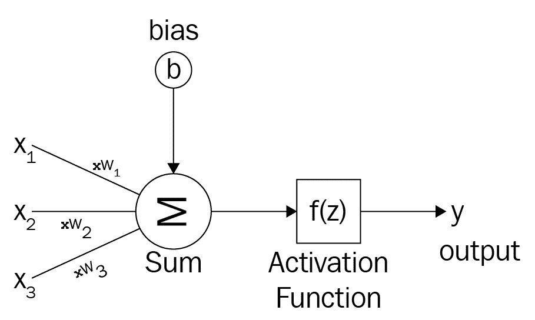

在神经元中，我们将输入`x`乘以权重`w`，并在应用激活函数`f(z)`之​​前加上偏差`b`。得出此结果，并预测输出`y`。

# 人工神经网络

神经元很酷，对吗？ 但是单个神经元不能执行复杂的任务，这就是为什么我们的大脑拥有数十亿个神经元，这些神经元分层组织，形成一个网络。 类似地，人工神经元分层排列。 每层都将以信息从一层传递到另一层的方式连接。 典型的 ANN 由以下几层组成：

*   输入层
*   隐藏层
*   输出层

每层都有一个神经元集合，一层中的神经元与另一层中的所有神经元相互作用。 但是，同一层中的神经元不会互相影响。 下图显示了典型的 ANN：

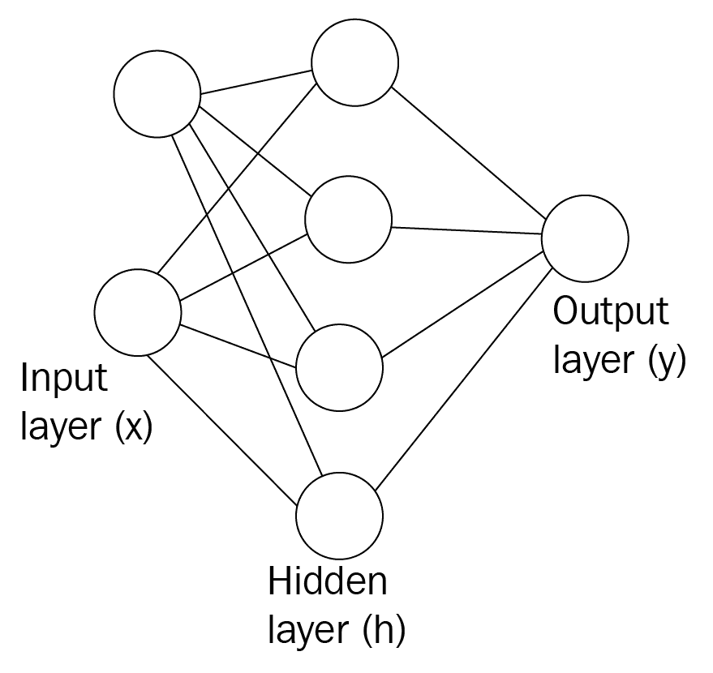

# 输入层

输入层是我们向网络提供输入的地方。 输入层中神经元的数量就是我们馈送到网络的输入数量。 每个输入都会对预测输出产生一定的影响，并将其乘以权重，同时将添加偏差并将其传递给下一层。

# 隐藏层

输入层和输出层之间的任何层都称为隐藏层。 它处理从输入层接收的输入。 隐藏层负责推导输入和输出之间的复杂关系。 即，隐藏层标识数据集中的模式。 可以有任意数量的隐藏层，但是我们必须根据我们的问题选择许多隐藏层。 对于一个非常简单的问题，我们只能使用一个隐藏层，但是在执行诸如图像识别之类的复杂任务时，我们使用许多隐藏层，其中每个层都负责提取图像的重要特征，以便我们可以轻松识别图像。 当我们使用许多隐藏层时，该网络称为深度神经网络。

# 输出层

处理输入后，隐藏层将其结果发送到输出层。 顾名思义，输出层发出输出。 输出层中神经元的数量与我们希望网络解决的问题类型有关。 如果是二进制分类，则输出层中神经元的数量会告诉我们输入所属的类。 如果是五类的多类分类，并且如果我们要获取每个类作为输出的概率，则输出层中的神经元数为五，每个神经元发出该概率。 如果是回归问题，则输出层中只有一个神经元。

# 激活函数

激活函数用于在神经网络中引入非线性。 我们将激活函数应用于权重乘以并加到偏差上的输入，即`f(z)`，其中`z = 输入 * 权重 + 偏差`。 激活函数有以下几种：

*   **Sigmoid 函数**：Sigmoid 函数是最常用的激活函数之一。 它在`0`和`1`之间缩放值。 可以将 Sigmoid 函数定义为`f(z) = 1 / (1 + e^z)`。 当我们将此功能应用于`z`时，值将在 0 到`1`的范围内缩放。 这也称为逻辑函数。 它是 Sigmoid，如下图所示：

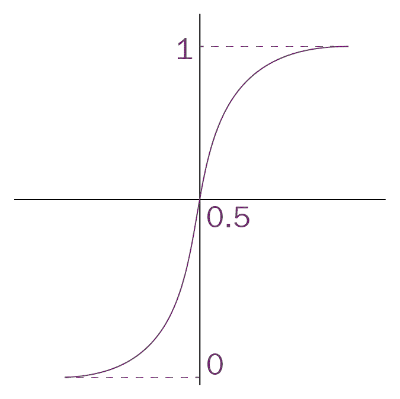

*   **双曲正切函数**：与 Sigmoid 函数不同，双曲正切函数在`-1`和`+1`之间缩放值。 双曲正切函数可以定义为`f(z) = (e^(2z) - 1) / (e^(2z) + 1)`。 当我们将此功能应用于`z`时，这些值将在`-1`至`+1`的范围内缩放。 它也是 S 形，但居中为零，如下图所示：


*   **ReLU 函数**：ReLU 也称为整流线性单元。 它是使用最广泛的激活函数之一。 ReLU 函数可以定义为`f(z) = max(0, z)`，即当`z`小于 0 且`f(z)`为 0。 当`z`大于或等于`0`时，等于`z`：


*   **Softmax 函数**：softmax 函数实际上是 Sigmoid 函数的推广。 它通常应用于网络的最后一层，同时执行多类分类任务。 它给出了每个类别作为输出的概率，因此 softmax 值的总和将始终等于`1`。 可以定义为`σ(z[i]) = e^z[i] / Σ[j] e^z[j]`。

# 深入研究 ANN

我们知道，在人工神经元中，我们将输入乘以权重，对其施加偏倚，然后应用激活函数来产生输出。 现在，我们将看到在神经元分层放置的神经网络环境中如何发生这种情况。 网络中的层数等于隐藏层数加输出层数。 我们不考虑输入层。 考虑一个具有一个输入层，一个隐藏层和一个输出层的两层神经网络，如下图所示：

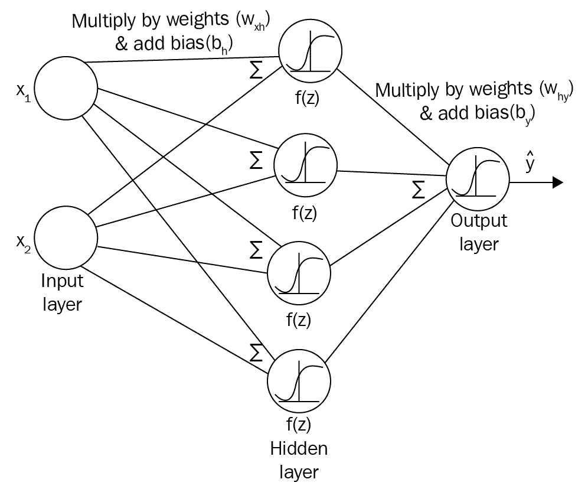

假设我们有两个输入， `x1`和`x2`，我们必须预测输出`y`]。 由于我们有两个输入，因此输入层中的神经元数将为两个。 现在，这些输入将乘以权重，然后添加偏差并将结果值传播到将应用激活函数的隐藏层。 因此，首先我们需要初始化权重矩阵。 在现实世界中，我们不知道哪个输入真正重要，因此需要权重较高才能计算输出。 因此，我们将随机初始化权重和偏差值。 我们可以将输入层和隐藏层之间的权重和偏差分别表示为`w[xh]`和 `b[h]`。 权重矩阵的尺寸如何？ 权重矩阵的尺寸必须为`[当前层中的神经元数量 * 下一层中的神经元数量]`。 这是为什么？ 因为这是基本的矩阵乘法规则。 要乘以任意两个矩阵`AB`，矩阵`A`中的列数必须等于矩阵`B`中的行数。因此，权重矩阵`w[xh]`的尺寸应为`[输入层中的神经元数量 * 隐藏层中的神经元数量]`，即`2 x 4`：

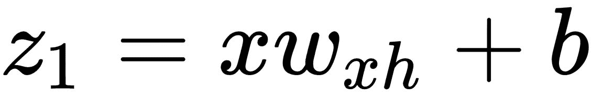

即，`z[1] = 输入 * 权重 + 偏差`。 现在，这将传递到隐藏层。 在隐藏层中，我们将激活函数应用于`z[1]`。 让我们考虑以下 Sigmoid 激活函数：


应用激活函数后，我们再次将结果`a[1]`乘以新的权重矩阵，并添加在隐藏层和输出层之间流动的新偏差值。 我们可以将该权重矩阵和偏差分别表示为`w[hy]`和`b[y]`。 该权重矩阵`w[hy]`的尺寸将为`[隐藏层中的神经元数量 * 输出层中的神经元数量]`。 由于我们在隐藏层有四个神经元，在输出层有一个神经元，因此`w[hy]`矩阵尺寸为`4 x 1`。 因此，我们将`a[1]`乘以权重矩阵`w[hy]`，然后加上偏差`b[y]`并将结果传递到下一层，即输出层：

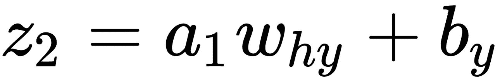

现在，在输出层中，我们将 Sigmoid 函数应用于`z[2]`，这将产生输出值：


从输入层到输出层的整个过程称为正向传播，如下所示：

```py
    def forwardProp():
          z1 = np.dot(x,wxh) + bh
          a1 = sigmoid(z1)
          z2 = np.dot(a1,why) + by
          yHat = sigmoid(z2)    
```

前向传播很酷，不是吗？ 但是我们如何知道神经网络生成的输出是否正确？ 我们必须定义一个新函数，称为成本函数`J`，也称为损失函数，它告诉我们神经网络的性能如何。 有许多不同的成本函数。 我们将均方误差用作成本函数，可以将其定义为实际值`(y)`与预测值`(y_hat)`之间的均方差：

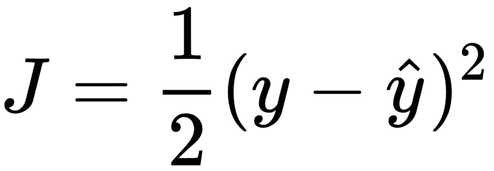

我们的目标是最小化成本函数，以便我们的神经网络预测会更好。 如何使成本函数最小化？ 我们可以通过更改正向传播中的某些值来最小化成本函数。 我们可以改变哪些价值观？ 显然，我们不能更改输入和输出。 现在，我们剩下了权重和偏差值。 我们只是随机初始化权重矩阵和偏差，所以它不是完美的。 现在，我们将调整神经网络的权重矩阵（`w[xh]`和`w[hy]`） 结果。 我们如何调整这些权重矩阵？ 这是一种称为梯度下降的新技术。

# 梯度下降

由于正向传播，我们处于输出层。 因此，现在，我们将网络从输出层反向传播到输入层，并通过计算成本函数相对于权重的梯度来最小化误差，从而更新权重。 听起来令人困惑，对吧？ 让我们从一个类比开始。 假设您位于山顶上，如下图所示，并且您想到达山顶的最低点。 您将必须在山上向下走一步，这会导致您到达最低点（即，您从山上下降到最低点）。 可能有许多地区看起来像山上的最低点，但我们必须到达最低点，实际上这是最低点。 也就是说，当存在全局最低点时，您不应被认为是最低点：


同样，我们可以表示成本函数，如下所示。 这是成本与重量的关系图。 我们的目标是使成本函数最小化。 也就是说，我们必须达到成本最低的最低点。 该点显示了我们的初始权重（即我们在山上的位置）。 如果将这一点向下移动，则可以到达误差最小的位置，即成本函数上的最低点（山上的最低点）：

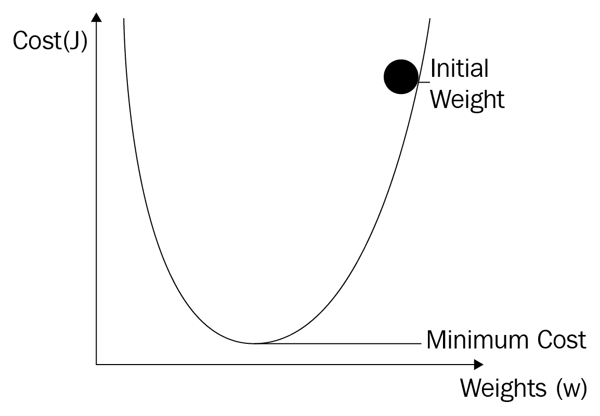

我们如何向下移动该点（初始权重）？ 我们如何下降并到达最低点？ 我们可以通过计算成本函数相对于该点的梯度来移动该点（初始权重）。 梯度是导数，实际上是切线的斜率，如下图所示。 因此，通过计算梯度，我们下降（向下移动）并到达最低点：

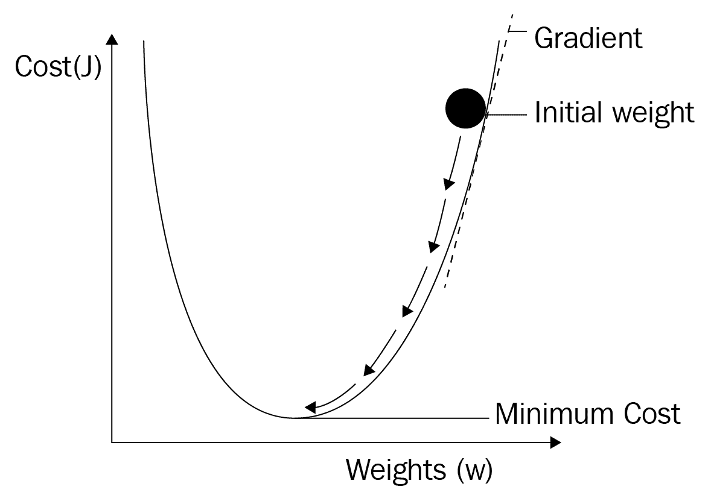

计算梯度后，我们通过权重更新规则更新旧权重：


什么是α？ 它被称为学习率。 如果学习率很小，那么我们会向下走一小步，并且梯度下降会很慢。 如果学习率很高，那么我们将迈出一大步，梯度下降将很快，但是我们可能无法达到全局最小值，而陷入局部最小值。 因此，学习速率应选择最佳，如下所示：


现在，让我们从数学上看一下。 现在，我们将讨论很多有趣的数学运算，因此戴上微积分帽并按照以下步骤操作。 因此，我们有两个权重，一个是`w[xh]`，对输入权重是隐藏的，另一个是`w[hy]`， 隐藏以输出权重。 我们需要根据我们的权重更新规则来更新这些权重。 为此，首先，我们需要计算成本函数相对于权重的导数。

由于我们正在反向传播，也就是说，从输出层到输入层，我们的第一权重将是`w[hy]`。 因此，现在我们需要计算`J`相对于`w[hy]`的导数。 我们如何计算导数？ 回想一下我们的成本函数`J = 1 / 2(y - y_hat)`。 我们无法直接计算导数，因为`J`中没有`w[hy]`项。

回顾如下给出的前向传播方程：


首先，我们将计算相对于`y_hat`的偏导数，然后从`y_hat`计算相对于`z[2]`的偏导数。 从`z[2]`，我们可以直接计算我们的导数`w[hy]`。 这实际上是连锁规则。

因此，我们的等式变为：

 ----（1）

我们将计算以下每一项：


其中`σ'`是我们的 Sigmoid 激活函数的导数。 我们知道 Sigmoid 函数是`σ = 1 / (1 + e^(-z))`，所以 Sigmoid 函数的导数将是`σ' = e^(-z) / (1 + e^(-z))^2`。


我们将所有这些替换为第一个方程式`(1)`。

现在，我们需要针对下一个权重`w[xh]`来计算`J`的导数。 同样，我们无法直接根据`J`计算`w[xh]`的导数，因为我们在`J`中的没有任何`w[xh]`项。 因此，我们需要使用链式规则； 再次回顾我们的前向传播步骤：*


现在，权重`w[xh]`的梯度计算将变为：

 ----（2）

我们将计算以下每一项：


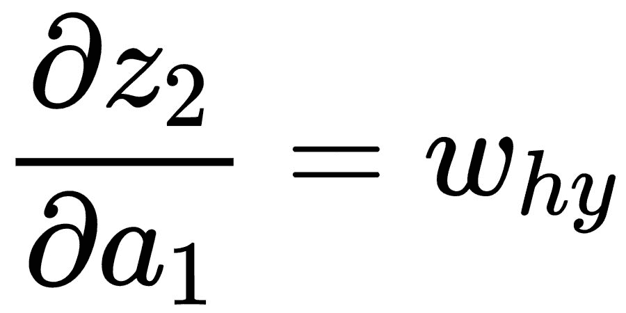


一旦我们计算了两个权重的梯度，就将根据权重更新规则更新以前的权重。

现在，让我们做一些编码。 看等式`(1)`和`(2)`。 我们在两个方程式中都有`∂J/∂y_hat`和`∂J/∂z[2]`，因此我们不必一遍又一遍地进行计算。 我们将其定义为`delta3`：

```py
delta3 = np.multiply(-(y-yHat),sigmoidPrime(z2))
```

现在，我们计算`w[hy]`的梯度为：

```py
dJ_dWhy = np.dot(a1.T,delta3)
```

我们将`w[xh]`的梯度计算为：

```py
delta2 = np.dot(delta3,Why.T)*sigmoidPrime(z1)
dJ_dWxh = np.dot(X.T,delta2) 
```

我们将根据权重更新规则将权重更新为：

```py
Wxh += -alpha * dJ_dWhy
Why += -alpha * dJ_dWxh
```

此反向传播的完整代码如下：

```py
 def backProp():

        delta3 = np.multiply(-(y-yHat),sigmoidPrime(z2))      
        dJdW2 = np.dot(a1.T, delta3)

        delta2 = np.dot(delta3,Why.T)*sigmoidPrime(z1)
        dJdW1 = np.dot(X.T, delta2) 

        Wxh += -alpha * dJdW1
        Why += -alpha * dJdW2
```

在继续之前，让我们熟悉一下神经网络中一些常用的术语：

*   **正向传播**：正向传播意味着从输入层到输出层的正向传播。
*   **反向传播**：反向传播表示从输出层向输入层的反向传播。
*   **周期**：周期指定了神经网络看到我们整个训练数据的次数。 因此，对于所有训练样本，我们可以说一个时期等于一个向前通过和一个向后通过。
*   **批量大小**：批量大小指定了我们在一次向前和向后一次通过中使用的训练样本数。
*   **迭代次数**：迭代次数表示通过次数，其中`一遍 = 一次正向 + 一次反向`。

假设我们有 12,000 个训练样本，而我们的批次大小为 6,000。 我们将需要两个迭代来完成一个周期。 也就是说，在第一次迭代中，我们传递了前 6,000 个样本，并执行了前向遍历和后向遍历； 在第二次迭代中，我们传递接下来的 6,000 个样本，并执行正向传播和反向传递。 经过两次迭代，我们的神经网络将看到整个 12,000 个训练样本，这使它成为一个周期。

# TensorFlow 中的神经网络

现在，我们将看到如何使用 TensorFlow 构建基本的神经网络，该网络可以预测手写数字。 我们将使用流行的 MNIST 数据集，该数据集具有标记的手写图像的集合以进行训练。

首先，我们必须导入 TensorFlow 并从`tensorflow.examples.tutorial.mnist`加载数据集：

```py
import tensorflow as tf
from tensorflow.examples.tutorials.mnist import input_data
mnist = input_data.read_data_sets("/tmp/data/", one_hot=True)
```

现在，我们将看到数据中包含的内容：

```py
print("No of images in training set {}".format(mnist.train.images.shape))
print("No of labels in training set {}".format(mnist.train.labels.shape))

print("No of images in test set {}".format(mnist.test.images.shape))
print("No of labels in test set {}".format(mnist.test.labels.shape))
```

它将打印以下内容：

```py
No of images in training set (55000, 784)
No of labels in training set (55000, 10)
No of images in test set (10000, 784)
No of labels in test set (10000, 10)
```

`training set`中有`55000`个图像，每个图像的大小均为`784`。 我们也有`10`标签，它们实际上是`0`至`9`。 类似地，我们在`test set`中有`10000`图像。

现在，我们绘制输入图像以查看其外观：

```py
img1 = mnist.train.images[41].reshape(28,28)
plt.imshow(img1, cmap='Greys')
```

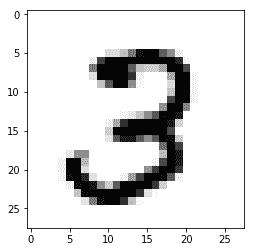

让我们开始建立我们的网络。 我们将构建一个包含一个输入层，一个隐藏层和一个预测手写数字的输出层的两层神经网络。

首先，我们为输入和输出定义占位符。 由于我们的输入数据形状为`784`，因此我们可以将输入占位符定义为：

```py
x = tf.placeholder(tf.float32, [None, 784])
```

`None`表示什么？ `None`指定传递的样本数（批大小），这将在运行时动态确定。

由于我们将`10`类作为输出，因此可以将`placeholder`输出定义为：

```py
 y = tf.placeholder(tf.float32, [None, 10]
```

接下来，我们初始化超参数：

```py
learning_rate = 0.1
epochs = 10
batch_size = 100
```

然后，我们将隐藏层的输入之间的权重和偏差分别定义为`w_xh`和`b_h`。 我们用值初始化权重矩阵，从正态分布中随机抽取标准差为`0.03`的值：

```py
w_xh = tf.Variable(tf.random_normal([784, 300], stddev=0.03), name='w_xh')
b_h = tf.Variable(tf.random_normal([300]), name='b_h')
```

接下来，我们将隐藏层与输出层之间的权重和偏差分别定义为`w_hy`和`b_y`：

```py
w_hy = tf.Variable(tf.random_normal([300, 10], stddev=0.03), name='w_hy')
b_y = tf.Variable(tf.random_normal([10]), name='b_y')
```

现在开始进行正向传播。 回想一下我们在前向传播中执行的步骤：

```py
z1 = tf.add(tf.matmul(x, w_xh), b_h)
a1 = tf.nn.relu(z1)
z2 = tf.add(tf.matmul(a1, w_hy), b_y)
yhat = tf.nn.softmax(z2)
```

我们将成本函数定义为交叉熵损失。 交叉熵损失也称为对数损失，可以定义如下：

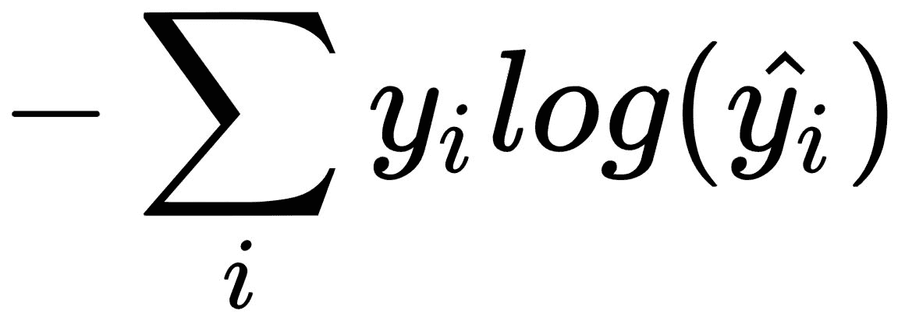

其中`y[i]`是实际值，`y_hat[i]`是预测值：

```py
cross_entropy = tf.reduce_mean(-tf.reduce_sum(y * tf.log(yhat), reduction_indices=[1]))
```

我们的目标是使成本函数最小化。 我们可以通过向后传播网络并执行梯度下降来最小化成本函数。 使用 TensorFlow，我们不必手动计算梯度; 我们可以使用 TensorFlow 的内置梯度下降优化器功能，如下所示：

```py
optimiser = tf.train.GradientDescentOptimizer(learning_rate=learning_rate).minimize(cross_entropy)
```

为了评估我们的模型，我们将计算精度如下：

```py
correct_prediction = tf.equal(tf.argmax(y, 1), tf.argmax(yhat, 1))
accuracy = tf.reduce_mean(tf.cast(correct_prediction, tf.float32))
```

我们知道 TensorFlow 是通过构建计算图来运行的，到目前为止，我们所写的任何内容实际上只有在启动 TensorFlow 会话后才能运行。 所以，让我们这样做。

首先，初始化 TensorFlow 变量：

```py
init_op = tf.global_variables_initializer()
```

现在，开始 TensorFlow 会话并开始训练模型：

```py
with tf.Session() as sess:
   sess.run(init_op)
   total_batch = int(len(mnist.train.labels) / batch_size)

   for epoch in range(epochs):
        avg_cost = 0

        for i in range(total_batch):
            batch_x, batch_y = mnist.train.next_batch(batch_size=batch_size)

            _, c = sess.run([optimiser, cross_entropy], 
                         feed_dict={x: batch_x, y: batch_y})

            avg_cost += c / total_batch

        print("Epoch:", (epoch + 1), "cost =""{:.3f}".format(avg_cost))

   print(sess.run(accuracy, feed_dict={x: mnist.test.images, y: mnist.test.labels}))
```

# RNN

鸟儿在 ____ 中飞翔。 如果我要求您预测空白，则可能会预测“天空”。 您如何预测“天空”一词会很好地填补这一空白？ 因为您阅读了整个句子并根据理解句子的上下文，预测“天空”是正确的词。 如果我们要求正常的神经网络为该空格预测正确的单词，它将无法预测正确的单词。 这是因为正常神经网络的输出仅基于当前输入。 因此，神经网络的输入将只是前一个单词`the`。 也就是说，在正常的神经网络中，每个输入都彼此独立。 因此，在我们必须记住输入序列以预测下一个序列的情况下，它将不能很好地执行。

我们如何使我们的网络记住整个句子以正确预测下一个单词？ 这是 RNN 发挥作用的地方。 RNN 不仅基于当前输入，而且还基于先前的隐藏状态来预测输出。 您可能想知道为什么 RNN 必须基于当前输入和先前的隐藏状态来预测输出，以及为什么它不能仅使用当前输入和先前的输入而不是当前输入和先前的隐藏状态来预测输出 。 这是因为前一个输入将存储有关前一个单词的信息，而前一个隐藏状态将捕获有关整个句子的信息，也就是说，前一个隐藏状态将存储上下文。 因此，基于当前输入和先前的隐藏状态而不是仅基于当前输入和先前的输入来预测输出非常有用。

RNN 是一种特殊类型的神经网络，广泛应用于顺序数据。 换句话说，它适用于排序重要的数据。 简而言之，RNN 有一个存储先前信息的存储器。 它广泛应用于各种**自然语言处理**（**NLP**）任务，例如机器翻译，情感分析等。 它也适用于时间序列数据，例如股票市场数据。 仍然不清楚 RNN 到底是什么？ 查看下图，该图显示了正常神经网络和 RNN 的比较：

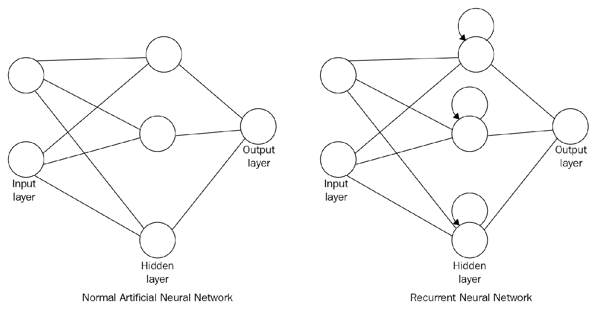

您是否注意到 RNN 与我们在上一主题中看到的普通神经网络有何不同？ 是。 区别在于隐藏状态中存在一个循环，这意味着如何使用以前的隐藏状态来计算输出。

还是令人困惑？ 查看以下 RNN 的展开版本：


如您所见，根据当前输入`x1`，当前隐藏状态*预测输出`y1, h[1]`以及先前的隐藏状态`h[0]`。 类似地，看看如何计算输出`y[2]`。 它采用当前输入`x[2]`和当前隐藏状态 `h[2]`以及先前的隐藏状态`h[1]`。 这就是 RNN 的工作方式； 它需要当前输入和先前的隐藏状态来预测输出。 我们可以将这些隐藏状态称为内存，因为它们保存了到目前为止已经看到的信息。

现在，我们将看到一些数学运算：

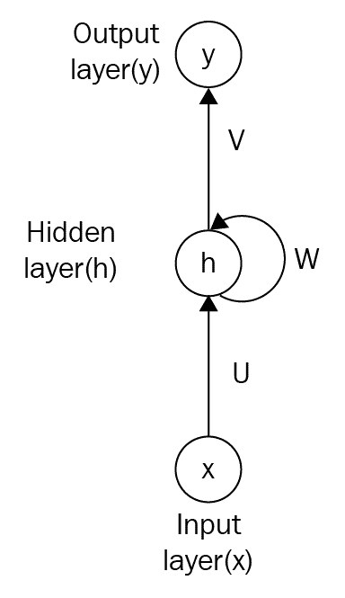

在上图中：

*   `U`代表隐藏状态权重矩阵的输入
*   `W`代表隐藏状态到隐藏状态权重矩阵
*   `V`表示隐藏到输出状态的权重矩阵

因此，在前向传递中，我们计算以下内容：

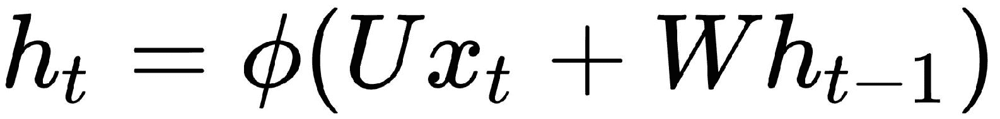

即，`时间 t 的隐藏状态 = tanh([输入到隐藏权重的矩阵 * 输入] + [隐藏权重到隐藏权重的矩阵 *时间 t-1 的先前隐藏状态])`：

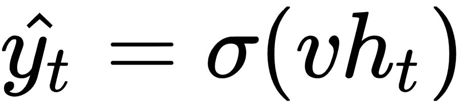

即，`时间的 t 输出 = Sigmoid(隐藏权重到输出的矩阵 * 时间 t 的隐藏状态)`。

我们还可以将损失函数定义为交叉熵损失，如下所示：

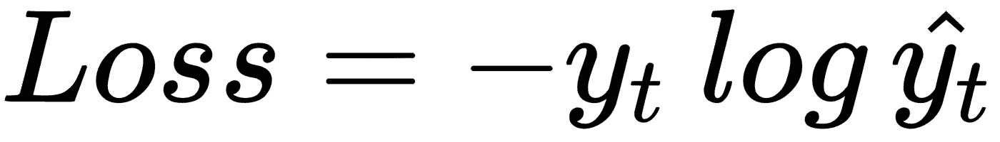


在前面的示例中，`y[t]`是时间`t`时的实际单词，`y_hat[t]`是时间`t`时的预测单词。 由于我们将整个序列作为训练样本，因此总损失将是每个时间步的损失总和。

# 时间上的反向传播

现在，我们如何训练 RNN？ 就像我们训练了正常的神经网络一样，我们可以使用反向传播来训练 RNN。 但是在 RNN 中，由于所有时间步长都具有依赖性，因此每个输出的梯度将不仅取决于当前时间步长，还取决于先前时间步长。 我们将此**沿时间的反向传播**（**BPTT**）。 它与反向传播基本相同，不同之处在于它应用了 RNN。 要查看它如何在 RNN 中发生，让我们考虑一下 RNN 的展开版本，如下图所示：

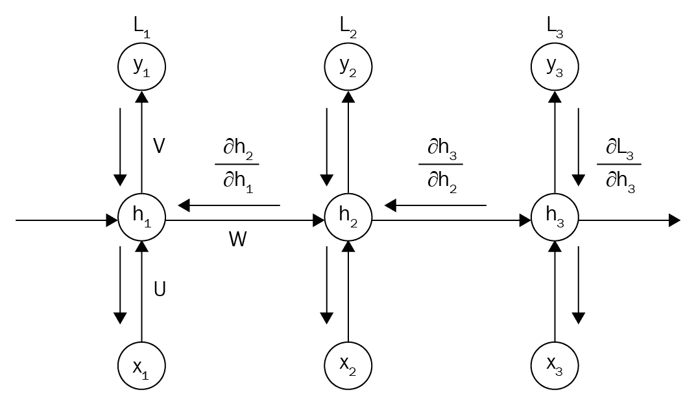

在上图中，`L[1]`，`L[2]`和`L[3]`是每个时间步的损失。 现在，我们需要在每个时间步长计算相对于我们的权重矩阵`U`，`V`和`W`的损耗梯度。 就像我们之前通过对每个时间步长求和来计算总损耗一样，我们用每个时间步长的梯度之和来更新权重矩阵：

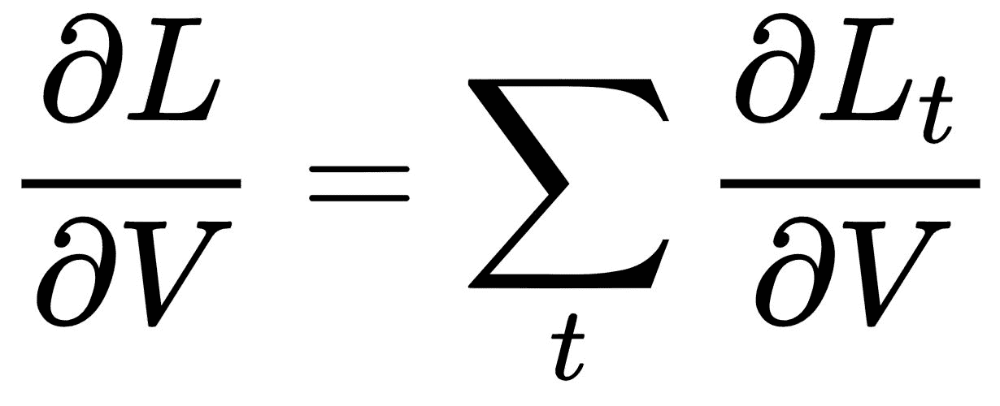

但是，此方法存在问题。 梯度计算涉及计算关于激活函数的梯度。 当我们计算相对于 Sigmoid/tanh 函数的梯度时，该梯度将变得非常小。 当我们在许多时间步长上进一步传播网络并乘以梯度时，梯度将趋于变得越来越小。 这称为消失梯度问题。 那么，由于这个问题会发生什么呢？ 由于梯度会随着时间消失，因此我们无法了解有关长期依赖关系的信息，也就是说，RNN 无法将信息在内存中保留更长的时间。

逐渐消失的梯度不仅会出现在 RNN 中，还会发生在其他深层网络中，在这些深层网络中，当我们使用 Sigmoid/tanh 函数时会出现许多隐藏层。 还有一个称为爆炸梯度的问题，其中梯度值变得大于 1，当我们将这些梯度相乘时，它将导致很大的数字。

一种解决方案是将 ReLU 用作激活函数。 但是，我们有一个称为 LSTM 的 RNN 变体，它可以有效解决消失的梯度问题。 我们将在接下来的部分中看到它的工作原理。

# 长短期记忆 RNN

RNN 非常酷，对吧？ 但是我们在训练 RNN 时遇到了一个问题，即消失梯度问题。 让我们来探讨一下。 天空是 __ 的。 RNN 可以根据所看到的信息轻松地将最后一个单词预测为“蓝色”。 但是 RNN 无法涵盖长期依赖关系。 这意味着什么？ 假设 Archie 在中国生活了 20 年。 他喜欢听好音乐。 他是一个非常大的漫画迷。 他的 __ 很流利。 现在，您将预测空白为中文。 您是如何预测的？ 因为您了解 Archie 在中国生活了 20 年，所以您认为他可能会说流利的中文。 但是 RNN 不能在记忆中保留所有这些信息以说 Archie 能够说流利的中文。 由于消失的梯度问题，它无法长时间在内存中重新收集/记住信息。 我们该如何解决？

LSTM 来了！！！！

LSTM 是 RNN 的一种变体，可以解决梯度消失的问题。 LSTM 会在需要时将信息保留在内存中。 因此，基本上，RNN 单元将替换为 LSTM。 LSTM 如何实现这一目标？

下图显示了一个典型的 LSTM 单元：


LSTM 单元称为内存，它们负责存储信息。 但是信息必须在存储器中保留多长时间？ 我们什么时候可以删除旧信息并用新信息更新单元格？ 所有这些决定将由以下三个特殊部门做出：

*   遗忘门
*   输入门
*   输出门

如果查看 LSTM 单元，则顶部水平线`C[t]`被称为单元状态。 这是信息流向的地方。 LSTM 门将不断更新有关单元状态的信息。 现在，我们将看到这些门的功能：

*   **遗忘门**：遗忘门负责确定哪些信息不应处于单元状态。 看下面的陈述：
    “Harry 是一位好歌手。 他住在纽约。 Zayn 也是一位出色的歌手。”
    
    一旦我们开始谈论 Zayn，网络就会了解到主题已从 Harry 更改为 Zayn，并且不再需要有关 Harry 的信息。 现在，“遗忘门”将从单元状态中删除/忘记关于哈利的信息。

*   **输入门**：输入门负责确定应在存储器中存储哪些信息。 让我们考虑相同的示例：
    
    “Harry 是一位出色的歌手。 他住在纽约。 Zayn 也是一位出色的歌手。”
    
    因此，在“遗忘门”从单元状态中删除信息之后，输入门将确定存储器中必须包含哪些信息。 在此，由于通过遗忘门从单元状态中删除了关于哈利的信息，因此输入门决定用关于 Zayn 的信息来更新单元状态。

*   **输出门**：该输出门负责确定一次从单元状态`t`应该显示什么信息。 现在，考虑以下句子：
    
    “Zayn 的首张专辑取得了巨大的成功。 恭喜 ____。”
    
    在这里，“恭喜”是用于形容名词的形容词。 输出层将预测`Zayn`（名词），以填补空白。

# 使用 LSTM RNN 生成歌曲歌词

现在，我们将看到如何使用 LSTM 网络生成 Zayn Malik 的歌曲歌词。 [可以从此处下载数据集](https://github.com/sudharsan13296/Hands-On-Reinforcement-Learning-With-Python/blob/master/07.%20Deep%20Learning%20Fundamentals/data/ZaynLyrics.txt)，其中包含 Zayn 的歌词集。

首先，我们将导入必要的库：

```py
import tensorflow as tf
import numpy as np
```

现在，我们将读取包含歌词的文件：

```py
with open("Zayn_Lyrics.txt","r") as f:
    data=f.read()
    data=data.replace('\n','')
    data = data.lower()
```

让我们看看数据中包含的内容：

```py
data[:50]
"now i'm on the edge can't find my way it's inside "
```

然后，我们将所有字符存储在`all_chars`变量中：

```py
all_chars=list(set(data))
```

我们将唯一字符数存储在`unique_chars`中：

```py
unique_chars = len(all_chars)
```

我们还将字符总数存储在`total_chars`中：

```py
total_chars =len(data)
```

现在，我们将在每个字符与其索引之间创建一个映射。 `char_to_ix`将具有字符到索引的映射，而`ix_to_char`将具有字符到索引的映射：

```py
char_to_ix = { ch:i for i,ch in enumerate(all_chars) }
ix_to_char = { i:ch for i,ch in enumerate(all_chars) }
```

也就是说，例如：

```py
char_to_ix['e']
9
```

```py
ix_to_char[9]
e
```

接下来，我们定义一个`generate_batch`函数，该函数将生成输入值和目标值。 目标值只是`i`乘以输入值的偏移。

例如：如果`input = [12,13,24]`的偏移值为`1`，则目标将为`[13,24]`：

```py
def generate_batch(seq_length,i):
    inputs = [char_to_ix[ch] for ch in data[i:i+seq_length]]
    targets = [char_to_ix[ch] for ch in data[i+1:i+seq_length+1]]
    inputs=np.array(inputs).reshape(seq_length,1)
    targets=np.array(targets).reshape(seq_length,1)
    return inputs,targets
```

我们将定义序列长度，学习率和节点数，即神经元数：

```py
seq_length = 25 
learning_rate = 0.1
num_nodes = 300
```

让我们构建我们的 LSTM RNN。 TensorFlow 为我们提供了用于构建 LSTM 单元的`BasicLSTMCell()`函数，我们需要指定 LSTM 单元中的单元数以及希望使用的激活函数的类型。

因此，我们将创建一个 LSTM 单元，然后使用`tf.nn.dynamic_rnn()`函数使用该单元构建 RNN，它将返回输出和状态值：

```py
def build_rnn(x):
        cell= tf.contrib.rnn.BasicLSTMCell(num_units=num_nodes, activation=tf.nn.relu)
        outputs, states = tf.nn.dynamic_rnn(cell, x, dtype=tf.float32)
        return outputs,states
```

现在，我们将为输入`X`和目标`Y`创建一个占位符：

```py
X=tf.placeholder(tf.float32,[None,1])
Y=tf.placeholder(tf.float32,[None,1])
```

将`X`和`Y`转换为`int`：

```py
X=tf.cast(X,tf.int32)
Y=tf.cast(Y,tf.int32)
```

我们还将为`X`和`Y`创建`onehot`表示形式，如下所示：

```py
X_onehot=tf.one_hot(X,unique_chars)
Y_onehot=tf.one_hot(Y,unique_chars)
```

通过调用`build_rnn`函数从 RNN 获取输出和状态：

```py
outputs,states=build_rnn(X_onehot)
```

转置输出：

```py
outputs=tf.transpose(outputs,perm=[1,0,2])
```

初始化权重和偏差：

```py
W=tf.Variable(tf.random_normal((num_nodes,unique_chars),stddev=0.001))
B=tf.Variable(tf.zeros((1,unique_chars)))
```

我们将通过将输出乘以权重并加上偏差来计算输出：

```py
Ys=tf.matmul(outputs[0],W)+B
```

接下来，执行 softmax 激活并获得概率：

```py
prediction = tf.nn.softmax(Ys)
```

我们将计算`cross_entropy`损失为：

```py
cross_entropy=tf.reduce_mean(tf.nn.softmax_cross_entropy_with_logits(labels=Y_onehot,logits=Ys))
```

我们的目标是使损失最小化，因此我们将反向传播网络并执行梯度下降：

```py
optimiser = tf.train.GradientDescentOptimizer(learning_rate=learning_rate).minimize(cross_entropy)
```

现在，我们将定义名为`predict`的辅助函数，该函数根据我们的 RNN 模型得出下一个预测字符的索引：

```py
def predict(seed,i):
    x=np.zeros((1,1))
    x[0][0]= seed
    indices=[]
    for t in range(i):
        p=sess.run(prediction,{X:x})
        index = np.random.choice(range(unique_chars), p=p.ravel())
        x[0][0]=index
        indices.append(index)
    return indices
```

我们设置`batch_size`，批数和`epochs`的数量以及`shift`值以生成批量：

```py
batch_size=100
total_batch=int(total_chars//batch_size)
epochs=1000
shift=0
```

最后，我们将开始 TensorFlow 会话并构建模型：

```py
init=tf.global_variables_initializer()

with tf.Session() as sess:
    sess.run(init)
    for epoch in range(epoch):
        print("Epoch {}:".format(epoch))
        if shift + batch_size+1 >= len(data): 
            shift =0

         ## get the input and target for each batch by generate_batch 
         #function which shifts the input by shift value
        ## and form target
        for i in range(total_batch):
            inputs,targets=generate_batch(batch_size,shift)
            shift += batch_size

            # calculate loss
            if(i%100==0):
                loss=sess.run(cross_entropy,feed_dict={X:inputs, Y:targets}) 

                # We get index of next predicted character by 
                # the predict function
                index =predict(inputs[0],200)

                # pass the index to our ix_to_char dictionary and 
                #get the char
                txt = ''.join(ix_to_char[ix] for ix in index)
                print('Iteration %i: '%(i))
                print ('\n %s \n' % (txt, ))

            sess.run(optimiser,feed_dict={X:inputs,Y:targets})
```

我们可以看到输出在初始时期是一些随机字符，但是随着训练步骤的增加，我们会得到更好的结果：

```py
Epoch 0:
Iteration 0: 

 wsadrpud,kpswkypeqawnlfyweudkgt,khdi nmgof' u vnvlmbis . snsblp,podwjqehb,e;g-'fyqjsyeg,byjgyotsrdf;;u,h.a;ik'sfc;dvtauofd.,q.;npsw'wjy-quw'quspfqw- 
.
.
.
Epoch 113:
Iteration 0:
i wanna see you, yes, and she said yes!
```

# 卷积神经网络

CNN，也称为卷积网络（ConvNet），是一种特殊的神经网络，广泛用于计算机视觉。 CNN 的应用范围包括从自动驾驶汽车中的视觉功能到 Facebook 图片中朋友的自动标记。 CNN 利用空间信息来识别图像。 但是它们如何真正起作用？ 神经网络如何识别这些图像？ 让我们逐步进行此步骤。

CNN 通常包含三个主要层：

*   卷积层
*   池化层
*   全连接层

# 卷积层

当我们输入图像作为输入时，它实际上将转换为像素值矩阵。 这些像素值的范围为 0 到 255，此矩阵的尺寸为`[图像高度 * 图像宽度 * 通道数]`。 如果输入图像的尺寸为`64 x 64`，则像素矩阵尺寸将为`64 x 64 x 3`，其中 3 表示通道号。 灰度图像具有 1 个通道，彩色图像具有 3 个通道（RGB）。 看下面的照片。 当将此图像作为输入输入时，它将转换为像素值矩阵，我们稍后将看到。 为了更好地理解，我们将考虑灰度图像，因为灰度图像具有 1 个通道，因此我们将获得 2D 矩阵。

输入图像如下：


现在，让我们在下图中看到矩阵值：


因此，这就是图像由矩阵表示的方式。 接下来发生什么？ 网络如何从该像素的值识别图像？ 现在，我们介​​绍一个称为卷积的操作。 它用于从图像中提取重要特征，以便我们可以了解图像的全部含义。 假设我们有一只狗的形象； 您认为这张图片的特征是什么，这将有助于我们了解这是狗的图片？ 我们可以说身体结构，脸，腿，尾巴等等。 卷积运算将帮助网络学习狗的特征。 现在，我们将看到如何精确执行卷积运算以从图像中提取特征。

众所周知，每个图像都由一个矩阵表示。 假设我们有一个狗图像的像素矩阵，并将其称为输入矩阵。 我们还将考虑称为过滤器的另一个`n x n`矩阵，如下图所示：


现在，该滤镜将在我们的输入矩阵上滑动一个像素，并执行逐元素乘法，从而生成一个数字。 困惑？ 看下图：


也就是说，`(13 * 0) + (8 * 1) + (18 * 0) + (5 * 1) + (3 * 1) + (1 * 1) + (1 * 0) + (9 * 0) + (0 * 1) = 17`。

同样，我们将滤镜矩阵在输入矩阵上移动一个像素，然后执行逐元素乘法：

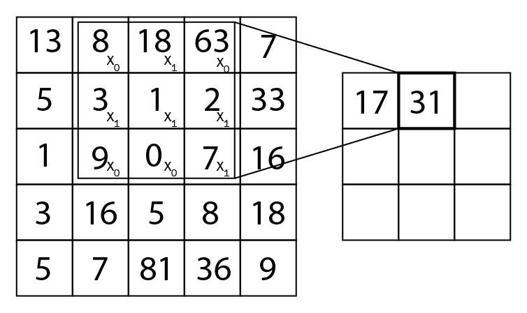

即`(8 * 0) + (18 * 1) + (63 * 0) + (3 * 1) + (1 * 1) + (2 * 1) + (9 * 0) + (0 * 0) + (7 * 1) = 31`。

过滤器矩阵将在整个输入矩阵上滑动，执行逐元素乘法，并生成一个称为特征映射或激活图的新矩阵。 该操作称为卷积，如下图所示：


以下输出显示了实际的卷积图像：

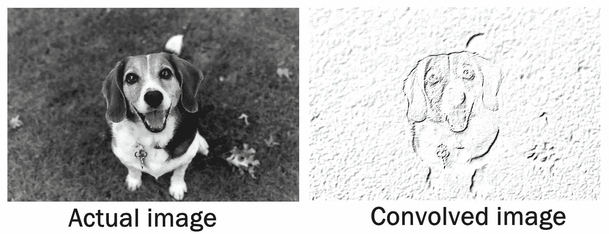

您可以看到我们的滤镜已检测到实际图像中的边缘并产生了卷积图像。 类似地，使用不同的滤镜从图像中提取不同的特征。

例如，如果我们使用滤镜矩阵，比如说锐化滤镜：

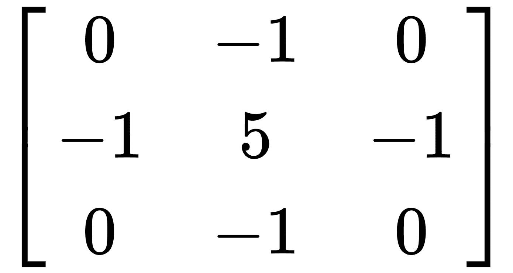

那么我们的卷积图像将如下所示：


因此，过滤器负责通过执行卷积运算从实际图像中提取特征。 将有多个过滤器用于提取生成特征映射的图像的不同特征。 特征映射的深度是我们使用的过滤器的数量。 如果我们使用 5 个滤镜提取特征并生成 5 个特征映射，则特征映射的深度为`5`，如下所示：


当我们有许多过滤器时，我们的网络将通过提取许多功能来更好地理解图像。 在构建 CNN 时，我们不必为此过滤矩阵指定值。 在训练过程中将学习此滤波器的最佳值。 但是，我们必须指定过滤器的数量和要使用的过滤器的尺寸。

我们可以使用滤波器在输入矩阵上滑动一个像素，然后执行卷积运算。 我们不仅可以滑动一个像素。 我们还可以在输入矩阵上滑动任意数量的像素。 我们在输入矩阵中滑过输入矩阵的像素数称为步幅。

但是，当滑动窗口（滤波器矩阵）到达图像边界时会发生什么？ 在这种情况下，我们用零填充输入矩阵，以便可以在图像边缘应用滤镜。 图像上带有零的填充称为相同填充，或宽卷积或零填充，如下所示：

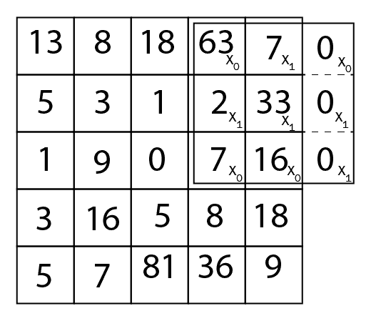

除了用零填充以外，我们还可以简单地丢弃该区域。 这称为有效填充或窄卷积，如下所示：

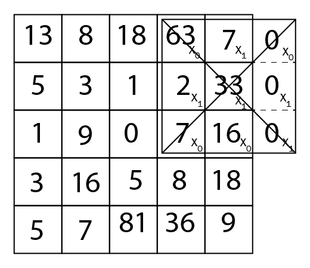

执行卷积运算后，我们应用 ReLU 激活函数引入非线性。

# 池化层

在卷积层之后，我们有了池化层。 池化层用于减少特征映射的维数，并且仅保留必要的细节，因此可以减少计算量。 例如，要确定图像中是否有一只狗，我们不想了解狗在图像中的哪个位置，我们只需要狗的特征。 因此，池化层通过仅保留重要特征来减小空间尺寸。 有多种类型的池化操作。 最大池化是最常用的池化操作之一，我们仅从窗口内的要素图中获取最大值。

带有`2 x 2`过滤器且步幅为 2 的最大池如下所示：


在平均池中，我们只取窗口内要素图中元素的平均值，而在汇总池中，我们取窗口中要素图中元素的总和。

合并操作不会更改要素图的深度，只会影响高度和宽度。

# 全连接层

我们可以有多个卷积层，然后是池化层。 但是，这些图层只会从输入图像中提取特征并生成激活图。 我们如何仅凭激活图对图像中是否有一条狗进行分类？ 我们必须引入一个称为全连接层的新层。 当激活图（现在基本上是图像的特征）应用激活函数时，它将接收输入，并产生输出。 全连接层实际上是正常的神经网络，其中我们具有输入层，隐藏层和输出层。 在这里，我们使用卷积和池化层代替输入层，它们一起产生激活图作为输入。

# CNN 架构

现在，让我们看看如何在 CNN 架构中组织所有这些层，如下所示：


首先，将图像传递到卷积层，在卷积层中我们应用卷积运算以提取特征，然后将特征映射传递到池化层，在其中减小尺寸。 我们可以根据用例添加任意数量的卷积和池化层。 此后，我们可以添加一个神经网络，该神经网络的末尾有一个隐藏层，称为全连接层，该层对图像进行分类。

# 使用 CNN 对时尚产品进行分类

现在，我们将看到如何使用 CNN 对时尚产品进行分类。

首先，我们将照常导入所需的库：

```py
import tensorflow as tf
import numpy as np
import matplotlib.pyplot as plt
%matplotlib inline
```

现在，我们将读取数据。 该数据集位于`tensorflow.examples`中，因此我们可以按以下方式直接提取数据：

```py
from tensorflow.examples.tutorials.mnist import input_data
fashion_mnist = input_data.read_data_sets('data/fashion/', one_hot=True)
```

我们将检查数据中包含的内容：

```py
print("No of images in training set {}".format(fashion_mnist.train.images.shape))
print("No of labels in training set {}".format(fashion_mnist.train.labels.shape))

print("No of images in test set {}".format(fashion_mnist.test.images.shape))
print("No of labels in test set {}".format(fashion_mnist.test.labels.shape))
```

```py
No of images in training set (55000, 784)
No of labels in training set (55000, 10)
No of images in test set (10000, 784)
No of labels in test set (10000, 10)
```

因此，我们在`training set`中具有`55000`数据点，在`test set`中具有`10000`数据点。 我们还具有`10`标签，这意味着我们具有`10`类别。

我们有`10`个产品类别，并将为所有这些产品加上标签：

```py
labels = {
0: 'T-shirt/top',
1: 'Trouser',
2: 'Pullover',
3: 'Dress',
4: 'Coat',
5: 'Sandal',
6: 'Shirt',
7: 'Sneaker',
8: 'Bag',
9: 'Ankle boot'
}
```

现在，我们来看一些图像：

```py
img1 = fashion_mnist.train.images[41].reshape(28,28)
# Get corresponding integer label from one-hot encoded data
label1 = np.where(fashion_mnist.train.labels[41] == 1)[0][0]
# Plot sample
print("y = {} ({})".format(label1, labels[label1]))
plt.imshow(img1, cmap='Greys')
```

输出和视觉效果如下：

```py
y = 6 (Shirt)
```


那是一件很不错的衬衫，不是吗？ 我们将再看一张图片：

```py
img1 = fashion_mnist.train.images[19].reshape(28,28)
# Get corresponding integer label from one-hot encoded data
label1 = np.where(fashion_mnist.train.labels[19] == 1)[0][0]
# Plot sample
print("y = {} ({})".format(label1, labels[label1]))
plt.imshow(img1, cmap='Greys')
```

输出和视觉效果如下：

```py
y = 8 (Bag)
```


这是一个很好的提包！

因此，现在，我们必须建立一个卷积神经网络，该网络实际上将所有这些图像分类为各自的类别。 我们为输入图像和输出标签定义占位符。 由于我们的输入图像的大小为`784`，因此我们为输入`x`定义了一个占位符，如下所示：

```py
x = tf.placeholder(tf.float32, [None, 784])
```

我们需要将输入调整为`[p,q,r,s]`格式，其中`q`和`r`是输入图像的实际尺寸，即`28 x 28`，`s`是通道号。 由于我们只有灰度图像，因此`s`的值为`1`。 `p`表示训练样本的数量，即批量大小。 由于我们不知道批次大小，因此可以将其设置为`-1`，并且在训练过程中会动态更改它：

```py
x_shaped = tf.reshape(x, [-1, 28, 28, 1])    
```

由于我们有`10`个不同的标签，因此我们为输出定义了占位符，如下所示：

```py
y = tf.placeholder(tf.float32, [None, 10])
```

现在，我们需要定义一个称为`conv2d`的函数，该函数实际上执行卷积运算，即输入矩阵（`x`）与滤波器（`w`）的元素级相乘，步长为`1`。 和`SAME`填充。

我们设置`strides = [1, 1, 1, 1]`。 步幅的第一个和最后一个值设置为`1`，这意味着我们不想在训练样本和不同通道之间移动。 步幅的第二个和第三个值也设置为`1`，这意味着我们将滤镜在高度和宽度方向上移动`1`像素：

```py
def conv2d(x, w):
    return tf.nn.conv2d(x, w, strides=[1, 1, 1, 1], padding='SAME')
```

我们定义了一个称为`maxpool2d`的函数来执行池化操作。 我们以`2`和`SAME`填充跨度执行最大池化。 `ksize`表示我们的合并窗口形状：

```py
def maxpool2d(x):
  return tf.nn.max_pool(x, ksize=[1, 2, 2, 1], strides=[1, 2, 2, 1], padding='SAME')
```

接下来，我们定义权重和偏差。 我们将构建一个具有两个卷积层，然后是一个全连接层和一个输出层的卷积网络，因此我们将定义所有这些层的权重。 权重实际上是卷积层中的过滤器。

因此，权重矩阵将初始化为`[filter_shape[0],filter_shape[1], number_of_input_channel, filter_size]`。

我们将使用`5 x 5`滤镜，并将滤镜尺寸设置为`32`。 由于我们使用灰度图像，因此我们的输入通道号将为`1`。 因此，我们的权重矩阵将为`[5,5,1,32]`：

```py
w_c1 = tf.Variable(tf.random_normal([5,5,1,32]))
```

当第二个卷积层将来自具有`32`作为其通道输出的第一卷积层的输入时，到下一层的输入通道数变为`32`：

```py
w_c2 = tf.Variable(tf.random_normal([5,5,32,64]))
```

接下来，我们初始化偏差：

```py
b_c1 = tf.Variable(tf.random_normal([32]))
b_c2 = tf.Variable(tf.random_normal([64]))
```

现在，我们在第一个卷积层上执行操作，即对输入`x`进行卷积操作，并激活 ReLU，然后进行最大池化：

```py
conv1 = tf.nn.relu(conv2d(x, w_c1) + b_c1)
conv1 = maxpool2d(conv1)
```

现在，第一个卷积层的结果将传递到下一个卷积层，在此我们对具有 ReLU 激活的第一个卷积层的结果执行卷积运算，然后进行最大池化：

```py
conv2 = tf.nn.relu(conv2d(conv1, w_c2) + b_c2)
conv2 = maxpool2d(conv2)
```

经过两个带卷积和池化操作的卷积层后，我们的输入图像将从`28 * 28 * 1`降采样为`7 * 7 * 1`。 我们需要先平整该输出，然后再将其馈送到全连接层。 然后，第二个卷积层的结果将被馈送到全连接层中，我们将其与权重相乘，添加偏差并应用 ReLU 激活：

```py
x_flattened = tf.reshape(conv2, [-1, 7`7`64])
w_fc = tf.Variable(tf.random_normal([7`7`64,1024]))
b_fc = tf.Variable(tf.random_normal([1024]))
fc = tf.nn.relu(tf.matmul(x_flattened,w_fc)+ b_fc)
```

现在，我们需要为输出层定义权重和偏差，即`[number of neurons in the current layer, number of neurons layer in the next layer]`：

```py
w_out = tf.Variable(tf.random_normal([1024, 10]))
b_out = tf.Variable(tf.random_normal([10]))
```

我们可以通过将全连接层的结果与权重矩阵相乘并加上偏差来获得输出。 我们将使用`softmax`激活函数来获得输出的概率：

```py
output = tf.matmul(fc, w_out)+ b_out
yhat = tf.nn.softmax(output)
```

我们可以将损失函数定义为交叉熵损失。 我们将使用一种称为 [Adam 优化器](https://www.tensorflow.org/api_docs/python/tf/train/AdamOptimizer)的新型优化器，而不是使用梯度下降优化器，来使损失函数最小化。 ：

```py
cross_entropy = tf.reduce_mean(tf.nn.softmax_cross_entropy_with_logits(logits=output, labels=y))optimiser = tf.train.AdamOptimizer(learning_rate=learning_rate).minimize(cross_entropy)
```

接下来，我们将如下计算`accuracy`：

```py
correct_prediction = tf.equal(tf.argmax(y, 1), tf.argmax(yhat, 1))
accuracy = tf.reduce_mean(tf.cast(correct_prediction, tf.float32))
```

并定义超参数：

```py
epochs = 10
batch_size = 100
```

现在，我们将开始 TensorFlow 会话并构建模型：

```py
init_op = tf.global_variables_initializer()

with tf.Session() as sess:
   sess.run(init_op)
   total_batch = int(len(fashion_mnist.train.labels) / batch_size)
    # For each epoch
   for epoch in range(epochs):

        avg_cost = 0
        for i in range(total_batch):
            batch_x, batch_y = fashion_mnist.train.next_batch(batch_size=batch_size)

            _, c = sess.run([optimiser, cross_entropy], 
                         feed_dict={x: batch_x, y: batch_y})

            avg_cost += c / total_batch

        print("Epoch:", (epoch + 1), "cost =""{:.3f}".format(avg_cost))

   print(sess.run(accuracy, feed_dict={x: mnist.test.images, y: mnist.test.labels}))
```

# 总结

在本章中，我们学习了神经网络的实际工作原理，然后使用 TensorFlow 构建了一个神经网络来对手写数字进行分类。 我们还看到了不同类型的神经网络，例如 RNN，可以记住内存中的信息。 然后，我们看到了 LSTM 网络，该网络用于通过保持多个门来将信息保留在内存中（只要需要）来克服消失的梯度问题。 我们还看到了另一个有趣的神经网络，用于识别图像，称为 CNN。 我们看到了 CNN 如何使用不同的图层来理解图像。 之后，我们学习了如何使用 TensorFlow 构建 CNN 以识别时尚产品。

在下一章第 8 章，“使用深度 Q 网络玩 Atari 游戏”中，我们将看到神经网络实际上将如何帮助我们的 RL 智能体更有效地学习。

# 问题

问题列表如下：

1.  线性回归和神经网络有什么区别？
2.  激活函数有什么用？
3.  为什么我们需要计算梯度下降中的梯度？
4.  RNN 的优势是什么？
5.  什么是消失和爆炸的梯度问题？
6.  LSTM 中的门是什么？
7.  池化层的用途是什么？

# 进一步阅读

深度学习是一个巨大的话题。 要探索有关深度学习和其他相关算法的更多信息，请查看以下非常有用的链接：

*   [**有关此 CNN 的更多信息，请访问这门很棒的斯坦福课程**](https://www.youtube.com/watch?v=NfnWJUyUJYU&list=PLkt2uSq6rBVctENoVBg1TpCC7OQi31AlC)
*   [**通过此很棒的博客文章深入研究 RNN**](http://www.wildml.com/2015/09/recurrent-neural-networks-tutorial-part-1-introduction-to-rnns/)