# 带有 Deep Q Network 的 Atari Games

**深度 Q 网络**（ **DQN** ）是非常流行且广泛使用的**深度强化学习**（ **DRL** ）算法之一。 实际上，它在发布之后，在**强化学习**（ **RL** ）社区周围引起了很多轰动。 该算法由 Google 的 DeepMind 的研究人员提出，在玩任何 Atari 游戏时，只要将游戏屏幕作为输入，就可以达到人类水平的结果。

在本章中，我们将探讨 DQN 的工作原理，并学习如何通过仅将游戏屏幕作为输入来构建可玩任何 Atari 游戏的 DQN。 我们将研究 DQN 体系结构的一些改进，例如双重 DQN 和决斗网络体系结构。

在本章中，您将学习：

*   **深度 Q 网络**（ **DQN** ）
*   DQN 的体系结构
*   建立代理来玩 Atari 游戏
*   双 DQN
*   优先体验重播

# 什么是深度 Q 网络？

在继续之前，首先让我们回顾一下 Q 函数。 什么是 Q 函数？ Q 函数（也称为状态动作值函数）指定*和*在 *s* 状态下的状态。 因此，我们将每个状态下所有可能动作的值存储在一个称为 Q 表的表中，并选择一个状态下具有最大值的动作作为最佳动作。 还记得我们是如何学习这个 Q 函数的吗？ 我们使用了 Q 学习，这是一种非政策性的时差学习算法，用于估算 Q 函数。 我们在第 5 章和*时间差异学习中对此进行了研究。*

到目前为止，我们已经看到了状态数量有限且动作有限的环境，并且我们对所有可能的状态动作对进行了详尽搜索，以找到最佳 Q 值。 想想一个环境，我们有很多状态，并且在每个状态下，我们都有很多动作可以尝试。 仔细检查每个状态下的所有操作将非常耗时。 更好的方法是使用某些参数将 *Q* 函数近似为。 我们可以使用权重为的神经网络来估计每种状态下所有可能动作的 *Q* 值。 当我们使用神经网络来近似 *Q* 函数时，我们可以称其为 Q 网络。 好的，但是我们如何训练网络，我们的目标功能是什么？ 回顾我们的 Q 学习更新规则：

。

是目标值，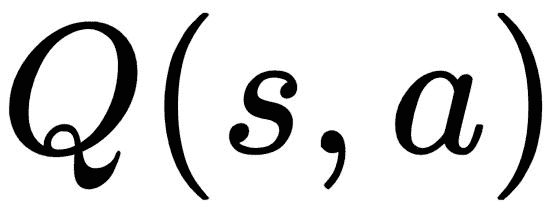是预测值； 我们试图通过学习正确的政策来最大程度地降低这一价值。

同样，在 DQN 中，我们可以将损失函数定义为目标值和预测值之间的平方差，并且我们还将尝试通过更新权重来最大程度地减少损失：

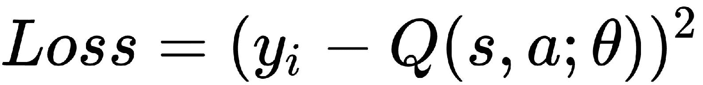

其中。

我们更新权重，并通过梯度下降使损失最小化。 简而言之，在 DQN 中，我们使用神经网络作为函数逼近器来逼近 *Q* 函数，并且通过梯度下降使误差最小化。

# DQN 的体系结构

现在，我们对 DQN 有了基本的了解，我们将详细介绍 DQN 的工作原理以及用于玩 Atari 游戏的 DQN 的体系结构。 我们将研究每个组件，然后将整个算法视为一个整体。

# 卷积网络

DQN 的第一层是卷积网络，网络的输入将是游戏屏幕的原始帧。 因此，我们采用原始框架并将其传递给卷积层以了解游戏状态。 但是原始帧将具有 210 x 160 像素和 128 个调色板，并且如果我们直接输入原始像素，显然将需要大量的计算和内存。 因此，我们将像素下采样为 84 x 84，并将 RGB 值转换为灰度值，然后将经过预处理的游戏屏幕作为卷积层的输入。 卷积层通过识别图像中不同对象之间的空间关系来理解游戏屏幕。 我们使用两个卷积层，然后使用具有 ReLU 作为激活函数的完全连接层。 在这里，我们不使用池化层。

当执行诸如对象检测或分类之类的任务时，池层非常有用，其中我们不考虑对象在图像中的位置，而只想知道所需对象是否在图像中。 例如，如果我们要对图像中是否有狗进行分类，我们只查看图像中是否有狗，而不检查狗在哪里。 在那种情况下，使用池化层对图像进行分类，而与狗的位置无关。 但是对于我们来说，要了解游戏屏幕，位置很重要，因为它描述了游戏状态。 例如，在 Pong 游戏中，我们不仅要分类游戏屏幕上是否有球。 我们想知道球的位置，以便我们下一步行动。 这就是为什么我们在体系结构中不使用池化层的原因。

好的，我们如何计算 Q 值？ 如果我们传递一个游戏画面和一个动作作为 DQN 的输入，它将给我们 Q 值。 但这将需要一个完整的前向通过，因为一个状态中将有许多动作。 而且，游戏中将有许多状态，每个动作都有一个前移，这在计算上将是昂贵的。 因此，我们只需将游戏屏幕单独作为输入，并通过将输出层中的单位数设置为游戏状态下的动作数，即可获得该状态下所有可能动作的 Q 值。

下图显示了 DQN 的体系结构，我们在其中馈送了一个游戏屏幕，它提供了该游戏状态下所有动作的 Q 值：


为了预测游戏状态的 Q 值，我们不仅仅使用当前的游戏屏幕； 我们还考虑了过去的四个游戏屏幕。 这是为什么？ 考虑“吃豆人”游戏，其中“吃豆人”的目标是移动并吞噬所有点。 仅查看当前的游戏屏幕，我们就无法知道吃豆人的前进方向。 但是，如果我们有过去的游戏画面，我们可以了解吃豆人的发展方向。 我们使用过去的四个游戏屏幕以及当前的游戏屏幕作为输入。

# 体验重播

我们知道，在 RL 环境中，我们通过执行某些操作*和*，从一个状态 *s* 过渡到下一状态 *s'*，并获得奖励 *r* 。 我们将此过渡信息作为保存在称为重播缓冲区或体验重播的缓冲区中。 这些过渡称为代理的经验。

体验重播的关键思想是，我们使用从重播缓冲区采样的过渡来训练深度 Q 网络，而不是使用最后的过渡进行训练。 座席的经历一次相关，因此从重播缓冲区中随机选择一批训练样本将减少座席的经历之间的相关性，并有助于座席更好地从广泛的经验中学习。

而且，神经网络将过度拟合相关经验，因此通过从答复缓冲区中选择随机的经验批次，我们将减少过度拟合。 我们可以使用统一采样来采样经验。 我们可以将体验重播视为队列而不是列表。 重播缓冲区将仅存储固定数量的最新体验，因此，当出现新信息时，我们将删除旧信息：


# 目标网络

在损失函数中，我们计算目标值和预测值之间的平方差：


我们使用相同的 Q 函数来计算目标值和预测值。 在前面的公式中，您可以看到相同的权重用于目标 *Q* 和预测的 *Q* 。 由于同一网络正在计算预测值和目标值，因此两者之间可能会有很大差异。

为避免此问题，我们使用称为目标网络的单独网络来计算目标值。 因此，我们的损失函数变为：


您可能会注意到目标 *Q* 的参数是而不是。 我们的实际 Q 网络用于预测 *Q* 值，它通过使用梯度下降来学习的正确权重。 将目标网络冻结几个时间步，然后通过从实际 Q 网络复制权重来更新目标网络权重。 冻结目标网络一段时间，然后使用实际的 Q 网络权重更新其权重，以稳定训练。

# 削减奖励

我们如何分配奖励？ 奖励分配因每个游戏而异。 在某些游戏中，我们可以分配奖励，例如+1 表示获胜，-1 表示损失，而 0 则不计任何收益，但是在某些其他游戏中，我们必须分配诸如+ 100 表示​​执行某项操作和+50 表示进行另一项操作等奖励 行动。 为避免出现此问题，我们将所有奖励分别裁剪为-1 和+1。

# 了解算法

现在，我们将了解 DQN 的整体工作方式。 DQN 涉及的步骤如下：

1.  首先，我们预处理游戏屏幕（状态 *s* ）并将其馈送到 DQN，DQN 将返回该状态下所有可能动作的 *Q* 值。
2.  现在，我们使用 epsilon-greedy 策略选择一个动作：对于概率 epsilon，我们选择一个随机动作*和*；对于概率为 1-epsilon，我们选择一个具有最大 *Q* 的动作 ]值，例如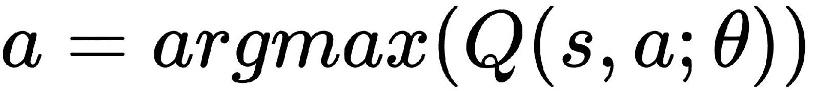。
3.  在选择动作*和*之后，我们在 *s* 状态下执行此动作，然后移至新的 *s'*状态并获得奖励。 下一个状态*的*是下一个游戏屏幕的预处理图像。
4.  我们将此过渡存储在`<s,a,r,s'>`的重播缓冲区中。
5.  接下来，我们从重播缓冲区中抽取一些随机的过渡批次并计算损失。
6.  我们知道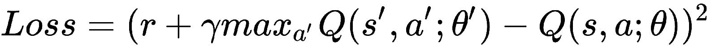就像目标 *Q* 与预测的 *Q* 之间的平方差一样。
7.  我们针对实际网络参数执行梯度下降，以最大程度地减少这种损失。
8.  在每个 *k* 个步骤之后，我们将实际网络权重复制到目标网络权重。
9.  对于 *M* 个情节，我们重复这些步骤。

# 建立代理来玩 Atari 游戏

现在，我们将看到如何建立一个代理来玩任何 Atari 游戏。 [您可以在此处获得 Jupyter 笔记本的完整代码及其说明](https://github.com/sudharsan13296/Hands-On-Reinforcement-Learning-With-Python/blob/master/08.%20Atari%20Games%20with%20DQN/8.8%20Building%20an%20Agent%20to%20Play%20Atari%20Games.ipynb)。

首先，我们导入所有必需的库：

```py
import numpy as np
import gym
import tensorflow as tf
from tensorflow.contrib.layers import flatten, conv2d, fully_connected
from collections import deque, Counter
import random
from datetime import datetime
```

[我们可以使用此处提供的任何 Atari 游戏环境](http://gym.openai.com/envs/#atari)。

在此示例中，我们使用“吃豆人”游戏环境：

```py
env = gym.make("MsPacman-v0")
n_outputs = env.action_space.n
```

此处显示了吃豆人环境：


现在，我们定义了`preprocess_observation`函数，用于预处理输入游戏屏幕。 我们减小图像尺寸并将图像转换为灰度：

```py
color = np.array([210, 164, 74]).mean()

def preprocess_observation(obs):

    # Crop and resize the image
    img = obs[1:176:2, ::2]

    # Convert the image to greyscale
    img = img.mean(axis=2)

    # Improve image contrast
    img[img==color] = 0

    # Next we normalize the image from -1 to +1
    img = (img - 128) / 128 - 1

    return img.reshape(88,80,1)
```

好的，现在我们定义一个`q_network`函数来构建我们的 Q 网络。 Q 网络的输入将是游戏状态`X`。

我们构建一个 Q 网络，该网络包含三个具有相同填充的卷积层，然后是一个完全连接的层：

```py
tf.reset_default_graph()

def q_network(X, name_scope):

    # Initialize layers
    initializer = tf.contrib.layers.variance_scaling_initializer()

    with tf.variable_scope(name_scope) as scope: 

        # initialize the convolutional layers
        layer_1 = conv2d(X, num_outputs=32, kernel_size=(8,8), stride=4, padding='SAME', weights_initializer=initializer) 
        tf.summary.histogram('layer_1',layer_1)

        layer_2 = conv2d(layer_1, num_outputs=64, kernel_size=(4,4), stride=2, padding='SAME', weights_initializer=initializer)
        tf.summary.histogram('layer_2',layer_2)

        layer_3 = conv2d(layer_2, num_outputs=64, kernel_size=(3,3), stride=1, padding='SAME', weights_initializer=initializer)
        tf.summary.histogram('layer_3',layer_3)

        # Flatten the result of layer_3 before feeding to the 
        # fully connected layer
        flat = flatten(layer_3)

        fc = fully_connected(flat, num_outputs=128, weights_initializer=initializer)
        tf.summary.histogram('fc',fc)

        output = fully_connected(fc, num_outputs=n_outputs, activation_fn=None, weights_initializer=initializer)
        tf.summary.histogram('output',output)

        # Vars will store the parameters of the network such as weights
        vars = {v.name[len(scope.name):]: v for v in tf.get_collection(key=tf.GraphKeys.TRAINABLE_VARIABLES, scope=scope.name)} 
        return vars, output
```

接下来，我们定义一个`epsilon_greedy`函数以执行 epsilon-greedy 策略。 在 epsilon-greedy 策略中，我们选择概率为 1 epsilon 的最佳操作，或者选择概率为 epsilon 的随机操作。

我们使用衰减的 epsilon 贪婪策略，其中 epsilon 的值会随着时间的流逝而衰减，因为我们不想永远探索。 因此，随着时间的流逝，我们的政策只会利用良好的行动：

```py
epsilon = 0.5
eps_min = 0.05
eps_max = 1.0
eps_decay_steps = 500000
def epsilon_greedy(action, step):
    p = np.random.random(1).squeeze()
    epsilon = max(eps_min, eps_max - (eps_max-eps_min) * step/eps_decay_steps)
    if np.random.rand() < epsilon:
        return np.random.randint(n_outputs)
    else:
        return action
```

现在，我们初始化长度为 20000 的体验重播缓冲区，其中包含该体验。

我们将座席的所有经验（状态，动作，奖励）存储在经验重播缓冲区中，并抽样此小批经验来训练网络：

```py
def sample_memories(batch_size):
    perm_batch = np.random.permutation(len(exp_buffer))[:batch_size]
    mem = np.array(exp_buffer)[perm_batch]
    return mem[:,0], mem[:,1], mem[:,2], mem[:,3], mem[:,4]
```

接下来，我们定义所有超参数：

```py
num_episodes = 800
batch_size = 48
input_shape = (None, 88, 80, 1)
learning_rate = 0.001
X_shape = (None, 88, 80, 1)
discount_factor = 0.97

global_step = 0
copy_steps = 100
steps_train = 4
start_steps = 2000
logdir = 'logs'
```

现在，我们为输入定义`placeholder`，例如游戏状态：

```py
X = tf.placeholder(tf.float32, shape=X_shape)
```

我们定义一个布尔值`in_training_mode`来切换训练：

```py
in_training_mode = tf.placeholder(tf.bool)
```

我们构建我们的 Q 网络，该网络接受输入`X`并为状态中的所有动作生成 Q 值：

```py
mainQ, mainQ_outputs = q_network(X, 'mainQ')
```

同样，我们建立目标 Q 网络：

```py
targetQ, targetQ_outputs = q_network(X, 'targetQ')
```

为我们的动作值定义`placeholder`：

```py
X_action = tf.placeholder(tf.int32, shape=(None,))
Q_action = tf.reduce_sum(targetQ_outputs * tf.one_hot(X_action, n_outputs), axis=-1, keep_dims=True)
```

将主要 Q 网络参数复制到目标 Q 网络：

```py
copy_op = [tf.assign(main_name, targetQ[var_name]) for var_name, main_name in mainQ.items()]
copy_target_to_main = tf.group(*copy_op)
```

为我们的输出定义一个`placeholder`，例如动作：

```py
y = tf.placeholder(tf.float32, shape=(None,1))
```

现在我们计算损失，它是实际值和预测值之间的差：

```py
loss = tf.reduce_mean(tf.square(y - Q_action))
```

我们使用`AdamOptimizer`来最大程度地减少损失：

```py
optimizer = tf.train.AdamOptimizer(learning_rate)
training_op = optimizer.minimize(loss)
```

在 TensorBoard 中设置日志文件以进行可视化：

```py
loss_summary = tf.summary.scalar('LOSS', loss) 
merge_summary = tf.summary.merge_all()
file_writer = tf.summary.FileWriter(logdir, tf.get_default_graph())
```

接下来，我们启动 TensorFlow 会话并运行模型：

```py
init = tf.global_variables_initializer()
with tf.Session() as sess:
    init.run()

    # for each episode
    for i in range(num_episodes):
        done = False
        obs = env.reset()
        epoch = 0
        episodic_reward = 0
        actions_counter = Counter() 
        episodic_loss = []

        # while the state is not the terminal state
        while not done:

           #env.render()

            # get the preprocessed game screen
            obs = preprocess_observation(obs)

            # feed the game screen and get the Q values for each action
            actions = mainQ_outputs.eval(feed_dict={X:[obs], in_training_mode:False})

            # get the action
            action = np.argmax(actions, axis=-1)
            actions_counter[str(action)] += 1 

            # select the action using epsilon greedy policy
            action = epsilon_greedy(action, global_step)

            # now perform the action and move to the next state, 
            # next_obs, receive reward
            next_obs, reward, done, _ = env.step(action)

            # Store this transition as an experience in the replay buffer
            exp_buffer.append([obs, action, preprocess_observation(next_obs), reward, done])

            # After certain steps, we train our Q network with samples from the experience replay buffer
            if global_step % steps_train == 0 and global_step > start_steps:

                # sample experience
                o_obs, o_act, o_next_obs, o_rew, o_done = sample_memories(batch_size)

                # states
                o_obs = [x for x in o_obs]

                # next states
                o_next_obs = [x for x in o_next_obs]

                # next actions
                next_act = mainQ_outputs.eval(feed_dict={X:o_next_obs, in_training_mode:False})

                # reward
                y_batch = o_rew + discount_factor * np.max(next_act, axis=-1) * (1-o_done) 

                # merge all summaries and write to the file
                mrg_summary = merge_summary.eval(feed_dict={X:o_obs, y:np.expand_dims(y_batch, axis=-1), X_action:o_act, in_training_mode:False})
                file_writer.add_summary(mrg_summary, global_step)

```

```py
                # now we train the network and calculate loss
                train_loss, _ = sess.run([loss, training_op], feed_dict={X:o_obs, y:np.expand_dims(y_batch, axis=-1), X_action:o_act, in_training_mode:True})
                episodic_loss.append(train_loss)

            # after some interval we copy our main Q network weights to target Q network
            if (global_step+1) % copy_steps == 0 and global_step > start_steps:
                copy_target_to_main.run()

            obs = next_obs
            epoch += 1
            global_step += 1
            episodic_reward += reward

        print('Epoch', epoch, 'Reward', episodic_reward,)

```

您可以看到如下输出：


我们可以在 TensorBoard 中看到 DQN 的计算图，如下所示：

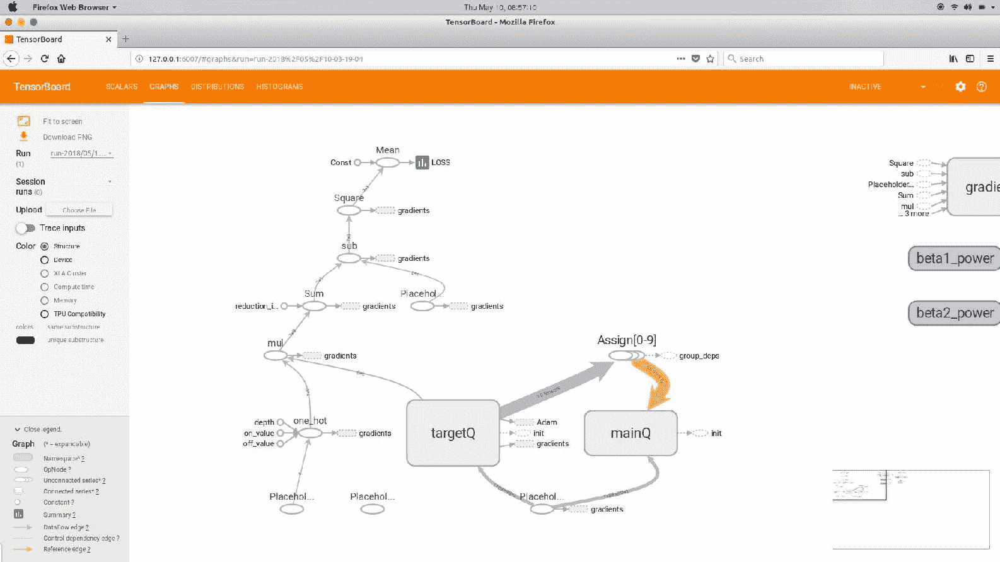

我们可以在主网络和目标网络中可视化权重的分布：


我们还可以看到损失：

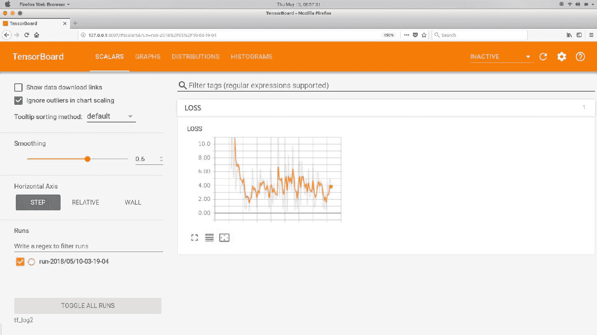

# 双 DQN

深度 Q 学习非常酷，对吗？ 它已经普及了玩任何 Atari 游戏的学习。 但是 DQN 的问题在于，它倾向于高估 *Q* 值。 这是因为 *Q* 学习方程式中的最大值算子。 max 运算符在选择和评估动作时使用相同的值。 那是什么意思 假设我们处于*处于*状态，并且我们有五个动作 *a <sub class="calibre24">1</sub>* 至 *a <sub class="calibre24">5</sub>* 。 假设 *a <sub class="calibre24">3</sub>* 是最好的动作。 当我们估计状态为 *s* 的所有这些动作的 *Q* 值时，估计的 *Q* 值会有些杂音并且与实际值有所不同。 由于这种噪声，动作 *a <sub class="calibre24">2</sub>* 会比最佳动作 *a <sub class="calibre24">3</sub>* 获得更高的值。 现在，如果我们选择最佳动作作为具有最大值的动作，则最终将选择次优动作 *a <sub class="calibre24">2</sub>* 而不是最佳动作 *a <sub class="calibre24">3</sub>* 。

我们可以通过具有两个单独的 *Q* 函数来解决此问题，每个函数都是独立学习的。 一个 *Q* 功能用于选择一个动作，另一个 *Q* 功能用于评估一个动作。 我们可以通过调整 DQN 的目标功能来实现。 调用 DQN 的目标函数：


我们可以如下修改目标函数：


在前面的公式中，我们有两个 *Q* 函数，每个函数具有不同的权重。 因此，权重为的 *Q* 函数用于选择操作，权重为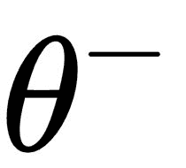的其他 *Q* 函数用于评估操作。 我们还可以切换这两个 *Q* 功能的角色。

# 优先体验重播

在 DQN 架构中，我们使用经验重播来消除训练样本之间的相关性。 但是，从重播存储器中均匀采样过渡不是最佳方法。 相反，我们可以确定转换的优先级并根据优先级进行采样。 优先安排过渡有助于网络快速有效地学习。 我们如何确定过渡的优先级？ 我们优先考虑具有较高 TD 错误的转换。 我们知道，TD 误差指定了估计的 Q 值和实际 Q 值之间的差。 因此，具有较高 TD 误差的过渡是我们必须关注和学习的过渡，因为这些过渡与我们的估计背道而驰。 凭直觉，让我们说您尝试解决一系列问题，但是您无法解决其中两个问题。 然后，您仅将这两个问题放在首位，以专注于问题所在并尝试解决该问题：


我们使用两种类型的优先级：比例优先级和基于等级的优先级。

在**比例优先级**中，我们将优先级定义为：


是转换的优先级 *i* ，是转换的 TD 误差 *i* ，而只是一些正常数，可确保每次转换 具有非零优先级。 当为零时，添加将使转换具有优先级而不是零优先级。 但是，转换的优先级要比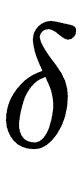不为零的转换低。 指数表示使用的优先级数量。 当为零时，则仅是均匀情况。

现在，我们可以使用以下公式将此优先级转换为概率：


在基于等级的优先级划分中，我们将优先级定义为：


*rank（i）*指定过渡 *i* 在重播缓冲区中的位置，在该位置中，过渡从高 TD 错误到低 TD 错误被分类。 计算优先级后，我们可以使用相同的公式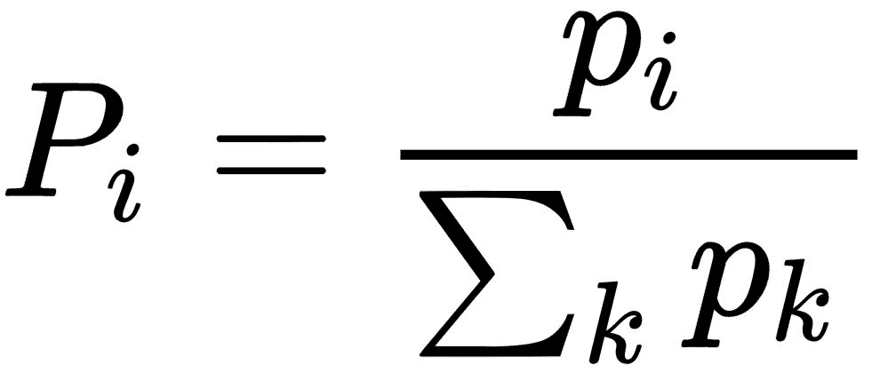将优先级转换为概率。

# 决斗网络架构

我们知道 *Q* 函数指定代理在状态*或*下执行动作*和*有多好，而值函数则指定有多好 使代理处于*或*状态。 现在，我们引入一个称为优势函数的新函数，该函数可以定义为值函数和优势函数之间的差。 优势功能指定与其他动作相比，代理执行一个动作*和*有多好。

因此，值函数指定状态的优劣，而优势函数指定动作的优劣。 如果我们将价值功能和优势功能结合起来会发生什么？ 这将告诉我们代理在状态*或*实际上是我们的 *Q* 功能下执行动作*和*有多好。 因此，我们可以像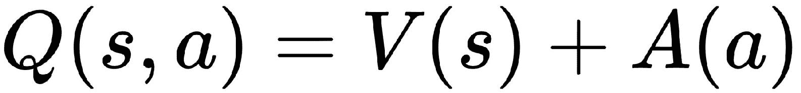中那样将 *Q* 函数定义为值函数和优势函数的和。

现在，我们将看到决斗网络体系结构是如何工作的。 下图显示了对决 DQN 的体系结构：

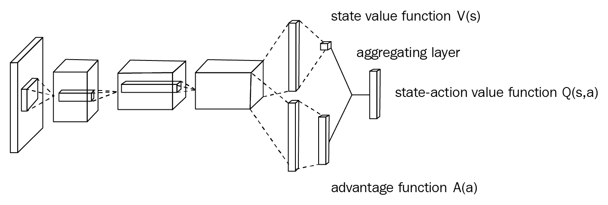

决斗 DQN 的体系结构与 DQN 基本上相同，只是在末端的完全连接层分为两个流。 一个流计算值函数，而另一个流计算优势函数。 最后，我们使用聚合层组合这两个流，并获得 Q 函数。

为什么我们必须将我们的 Q 函数计算分成两个流？ 在许多州，计算所有动作的价值估算并不重要，尤其是当我们在一个状态中有较大的动作空间时； 那么大多数动作将不会对状态产生任何影响。 同样，可能会有许多具有冗余效果的动作。 在这些情况下，与现有 DQN 体系结构相比，决斗 DQN 可以更精确地估算 Q 值：

*   当我们在状态中有大量动作时，并且估计每个动作的值并不是很重要时，第一个流与值函数流中一样有用。
*   与优势功能流一样，第二个流在网络必须决定优先选择哪个操作的情况下很有用

聚合器层合并这两个流的值，并产生 *Q* 函数。 因此，决斗网络比标准 DQN 体系结构更有效，更健壮。

# 概要

在本章中，我们学习了一种非常流行的深度强化学习算法，称为 DQN。 我们看到了如何使用深度神经网络来逼近 Q 函数。 我们还学习了如何建立代理来玩 Atari 游戏。 后来，我们研究了 DQN 的一些改进，例如双 DQN，它用于避免高估 Q 值。 然后，我们研究了优先级体验重放，优先级体验和决斗的网络体系结构，该体系结构将 Q 函数计算分为两个流，分别称为值流和优势流。

在下一章[，第 9 章](09.html#57R300-3c5bb317ad314d43ac43a332c0db6f00)，*与深度递归 Q 网络*玩末日之战中，我们将介绍一种称为 DRQN 的非常酷的 DQN 变体，它利用 RNN 近似于一个 Q 功能。

# 问题

问题列表如下：

1.  什么是 DQN？
2.  体验重播有什么需要？
3.  为什么我们要保留一个单独的目标网络？
4.  为什么 DQN 高估了？
5.  双重 DQN 如何避免高估 Q 值？
6.  优先体验中的优先体验如何重播？
7.  对决架构有什么需求？

# 进一步阅读

*   [**DQN 论文**](https://storage.googleapis.com/deepmind-media/dqn/DQNNaturePaper.pdf)
*   [**双重 DQN 论文**](https://arxiv.org/pdf/1509.06461.pdf)
*   [**决斗网络架构**](https://arxiv.org/pdf/1511.06581.pdf)