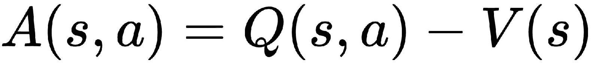
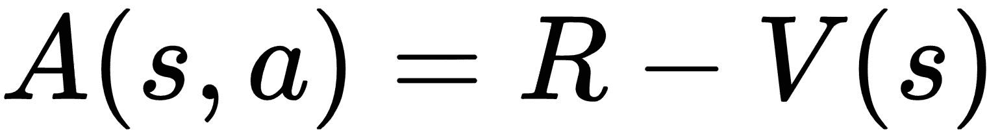
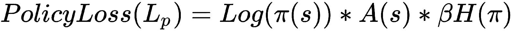

# 异步优势演员评论网络

在前面的章节中，我们已经看到了**深度 Q 网络**（**DQN**）多么酷，以及它如何成功地推广了学习玩具有人类水平性能的 Atari 系列游戏的方法 。 但是我们面临的问题是它需要大量的计算能力和训练时间。 因此，Google 的 DeepMind 引入了一种称为**异步优势演员评论家**（**A3C**）的新算法，该算法在其他深度强化学习算法中占主导地位，因为它需要较少的计算能力和训练时间。 A3C 的主要思想是，它使用多个代理并行学习并汇总其整体经验。 在本章中，我们将了解 A3C 网络如何工作。 接下来，我们将学习如何使用 A3C 构建代理以推动一座山。

在本章中，您将学习以下内容：

*   异步优势演员评论家算法
*   三成
*   A3C 的架构
*   A3C 如何运作
*   驾驶 A3C 上山
*   TensorBoard 中的可视化

# 异步优势演员评论家

A3C 网络风起云涌，并接管了 DQN。 除了前面提到的优点之外，与其他算法相比，它还具有良好的准确性。 它在连续和离散动作空间中都可以很好地工作。 它使用多个代理，每个代理在实际环境的副本中与不同的探索策略并行学习。 然后，将从这些代理获得的经验汇总到全局代理。 全局代理也称为主网络或全局网络，其他代理也称为工作器。 现在，我们将详细了解 A3C 的工作原理以及与 DQN 算法的区别。

# 三成

潜水之前，A3C 是什么意思？ 这三个 As 代表什么？

在 A3C 中，第一个 A，**异步**表示其工作方式。 在这里，我们有多个与环境交互的代理，而不是像 DQN 那样有单个代理尝试学习最佳策略。 由于我们有多个代理同时与环境交互，因此我们将环境的副本提供给每个代理，以便每个代理可以与自己的环境副本进行交互。 因此，所有这些多个代理都称为辅助代理，我们有一个单独的代理，称为全局网络，所有代理都向其报告。 全球网络汇集了学习内容。

第二个 A 是**优势**； 在讨论 DQN 的决斗网络架构时，我们已经看到了优势功能。 优势函数可以定义为 Q 函数和值函数之间的差。 我们知道 Q 函数指定状态下动作的状态，而值函数指定状态下状态的状态。 现在，凭直觉思考； 两者之间的区别意味着什么？ 它告诉我们，与其他所有动作相比，代理在状态`s`下执行动作`a`有多好。

第三个 A 是**演员评论家**； 该架构具有两种类型的网络，即参与者和评论者。 演员的角色是学习策略，评论家的角色是评估演员学习的策略有多好。

# A3C 的架构

现在，让我们看一下 A3C 的架构。 看下图：


仅通过查看上图就可以了解 A3C 的工作原理。 正如我们所讨论的，我们可以看到有多个工作程序代理，每个工作代理都与自己的环境副本进行交互。 然后，工作人员将学习策略并计算策略损失的梯度，并将该梯度更新到全局网络。 每个代理商都会同时更新此全球网络。 A3C 的优点之一是，与 DQN 不同，我们在这里不使用经验回放内存。 实际上，这是 A3C 网络的最大优势之一。 由于我们有多个与环境交互并将信息聚合到全球网络的代理，因此经验之间的相关性很低甚至没有。 经验回放需要占用所有经验的大量内存。 由于 A3C 不需要它，因此我们的存储空间和计算时间将减少。

# A3C 如何运作

首先，辅助代理重置全局网络，然后它们开始与环境进行交互。 每个工人遵循不同的勘探策略以学习最佳策略。 然后，他们计算价值和策略损失，然后计算损失的梯度并将梯度更新到全球网络。 随着工作人员代理开始重置全局网络并重复相同的过程，该循环继续进行。 在查看价值和策略损失函数之前，我们将了解优势函数的计算方式。 众所周知，优点是`Q`函数和值函数之间的区别：



由于我们实际上并未直接在 A3C 中计算`Q`值，因此我们将折现收益用作`Q`值的估算值。 折现收益`R`可以写为：


我们将折价收益`R`替换为`Q`函数，如下所示：



现在，我们可以将价值损失写为折现收益与状态值之间的平方差：


保单损失可以定义如下：



好的，新项目`H(π)`是什么？ 它是熵项。 它用于确保充分探索策略。 熵告诉我们行动概率的扩散。 当熵值高时，每个动作的概率都将相同，因此代理将不确定要执行哪个动作，而当熵值降低时，一个动作将比其他动作具有更高的概率，并且代理可以 拿起这个可能性很高的动作。 因此，将熵添加到损失函数中会鼓励代理进一步探索并避免陷入局部最优状态。

# 驾驶 A3C 上山

让我们通过山车示例了解 A3C。 我们的代理人是汽车，它被放置在两座山之间。 我们代理人的目标是向右上方爬。 但是，汽车不能一口气上山。 它必须来回驱动以建立动力。 如果我们的经纪人在开车上花费更少的精力，将获得高额奖励。 本节使用的代码归功于 [Stefan Boschenriedter](https://github.com/stefanbo92/A3C-Continuous)。 环境如下所示：


好的，让我们开始编码吧！ 完整的代码可在 Jupyter 笔记本中获得，[并在此处进行解释](https://github.com/sudharsan13296/Hands-On-Reinforcement-Learning-With-Python/blob/master/10.%20Aysnchronous%20Advantage%20Actor%20Critic%20Network/10.5%20Drive%20up%20the%20Mountain%20Using%20A3C.ipynb)。

首先，让我们导入必要的库：

```py
import gym
import multiprocessing
import threading
import numpy as np
import os
import shutil
import matplotlib.pyplot as plt
import tensorflow as tf
```

现在，我们将初始化所有参数：

```py
# number of worker agents
no_of_workers = multiprocessing.cpu_count() 

# maximum number of steps per episode
no_of_ep_steps = 200 

# total number of episodes
no_of_episodes = 2000 

global_net_scope = 'Global_Net'

# sets how often the global network should be updated
update_global = 10

# discount factor
gamma = 0.90 

# entropy factor
entropy_beta = 0.01 

# learning rate for actor
lr_a = 0.0001 

# learning rate for critic
lr_c = 0.001 

# boolean for rendering the environment
render=False 

# directory for storing logs
log_dir = 'logs'
```

初始化我们的`MountainCar`环境：

```py
env = gym.make('MountainCarContinuous-v0')
env.reset()
```

获取`states`和`actions`的数量，以及`action_bound`的数量：

```py
no_of_states = env.observation_space.shape[0] 
no_of_actions = env.action_space.shape[0] 
action_bound = [env.action_space.low, env.action_space.high]
```

我们将在`ActorCritic`类中定义演员评论家网络。 像往常一样，我们首先了解一个类中每个函数的代码，并在最后看到整个最终代码。 注释被添加到每行代码中，以更好地理解。 最后，我们将研究干净无注释的整个代码：

```py
class ActorCritic(object):
     def __init__(self, scope, sess, globalAC=None):

        # first we initialize the session and RMS prop optimizer for both
        # our actor and critic networks

        self.sess=sess

        self.actor_optimizer = tf.train.RMSPropOptimizer(lr_a, name='RMSPropA')
        self.critic_optimizer = tf.train.RMSPropOptimizer(lr_c, name='RMSPropC')

        # now, if our network is global then,

        if scope == global_net_scope:
            with tf.variable_scope(scope):

                # initialize states and build actor and critic network
                self.s = tf.placeholder(tf.float32, [None, no_of_states], 'S')

                # get the parameters of actor and critic networks
                self.a_params, self.c_params = self._build_net(scope)[-2:]

        # if our network is local then,
        else:
            with tf.variable_scope(scope):

                # initialize state, action, and also target value 
                # as v_target

                self.s = tf.placeholder(tf.float32, [None, no_of_states], 'S')
                self.a_his = tf.placeholder(tf.float32, [None, no_of_actions], 'A')
                self.v_target = tf.placeholder(tf.float32, [None, 1], 'Vtarget')

                # since we are in continuous actions space, 
                # we will calculate
                # mean and variance for choosing action

                mean, var, self.v, self.a_params, self.c_params = self._build_net(scope)

                # then we calculate td error as the difference 
                # between v_target - v
                td = tf.subtract(self.v_target, self.v, name='TD_error')

                # minimize the TD error
                with tf.name_scope('critic_loss'):
                    self.critic_loss = tf.reduce_mean(tf.square(td))

                # update the mean and var value by multiplying mean 
                # with the action bound and adding var with 1e-4

                with tf.name_scope('wrap_action'):
                    mean, var = mean * action_bound[1], var + 1e-4

                # we can generate distribution using this updated 
                # mean and var
                normal_dist = tf.contrib.distributions.Normal(mean, var)

                # now we shall calculate the actor loss. 
                # Recall the loss function.
                with tf.name_scope('actor_loss'):

                    # calculate first term of loss which is log(pi(s))
                    log_prob = normal_dist.log_prob(self.a_his)
                    exp_v = log_prob * td

                    # calculate entropy from our action distribution 
                    # for ensuring exploration
                    entropy = normal_dist.entropy()

                    # we can define our final loss as
                    self.exp_v = exp_v + entropy_beta * entropy

                    # then, we try to minimize the loss
                    self.actor_loss = tf.reduce_mean(-self.exp_v)

                 # now, we choose an action by drawing from the 
                 # distribution and clipping it between action bounds,

                with tf.name_scope('choose_action'):
                    self.A = tf.clip_by_value(tf.squeeze(normal_dist.sample(1), axis=0), action_bound[0], action_bound[1])

                # calculate gradients for both of our actor 
                # and critic networks,

                with tf.name_scope('local_grad'):

                    self.a_grads = tf.gradients(self.actor_loss, self.a_params)
                    self.c_grads = tf.gradients(self.critic_loss, self.c_params)

            # now, we update our global network weights,
            with tf.name_scope('sync'):

                # pull the global network weights to the local networks
                with tf.name_scope('pull'):
                    self.pull_a_params_op = [l_p.assign(g_p) for l_p, g_p in zip(self.a_params, globalAC.a_params)]
                    self.pull_c_params_op = [l_p.assign(g_p) for l_p, g_p in zip(self.c_params, globalAC.c_params)]

                # push the local gradients to the global network
                with tf.name_scope('push'):
                    self.update_a_op = self.actor_optimizer.apply_gradients(zip(self.a_grads, globalAC.a_params))
                    self.update_c_op = self.critic_optimizer.apply_gradients(zip(self.c_grads, globalAC.c_params))

     # next, we define a function called _build_net for building 
     # our actor and critic network

     def _build_net(self, scope):
     # initialize weights
        w_init = tf.random_normal_initializer(0., .1)

        with tf.variable_scope('actor'):
            l_a = tf.layers.dense(self.s, 200, tf.nn.relu6, kernel_initializer=w_init, name='la')
            mean = tf.layers.dense(l_a, no_of_actions, tf.nn.tanh,kernel_initializer=w_init, name='mean')
            var = tf.layers.dense(l_a, no_of_actions, tf.nn.softplus, kernel_initializer=w_init, name='var')

        with tf.variable_scope('critic'):
            l_c = tf.layers.dense(self.s, 100, tf.nn.relu6, kernel_initializer=w_init, name='lc')
            v = tf.layers.dense(l_c, 1, kernel_initializer=w_init, name='v')

        a_params = tf.get_collection(tf.GraphKeys.TRAINABLE_VARIABLES, scope=scope + '/actor')
        c_params = tf.get_collection(tf.GraphKeys.TRAINABLE_VARIABLES, scope=scope + '/critic')

        return mean, var, v, a_params, c_params

     # update the local gradients to the global network
     def update_global(self, feed_dict):
        self.sess.run([self.update_a_op, self.update_c_op], feed_dict)

     # get the global parameters to the local networks
     def pull_global(self):
        self.sess.run([self.pull_a_params_op, self.pull_c_params_op])

     # select action
     def choose_action(self, s):
        s = s[np.newaxis, :]
        return self.sess.run(self.A, {self.s: s})[0]
```

现在，我们将初始化`Worker`类：

```py
class Worker(object):
    def __init__(self, name, globalAC, sess):
        # initialize environment for each worker
        self.env = gym.make('MountainCarContinuous-v0').unwrapped
        self.name = name

        # create an ActorCritic agent for each worker
        self.AC = ActorCritic(name, sess, globalAC)
        self.sess=sess

    def work(self):
        global global_rewards, global_episodes
        total_step = 1

        # store state, action, reward
        buffer_s, buffer_a, buffer_r = [], [], []

        # loop if the coordinator is active and the global 
        # episode is less than the maximum episode
        while not coord.should_stop() and global_episodes < no_of_episodes:

            # initialize the environment by resetting
            s = self.env.reset()

            # store the episodic reward
            ep_r = 0
            for ep_t in range(no_of_ep_steps):

                # Render the environment for only worker 1
                if self.name == 'W_0' and render:
                    self.env.render()

                # choose the action based on the policy
                a = self.AC.choose_action(s)

                # perform the action (a), receive reward (r),
                # and move to the next state (s_)
                s_, r, done, info = self.env.step(a)

                # set done as true if we reached maximum step per episode
                done = True if ep_t == no_of_ep_steps - 1 else False

                ep_r += r

                # store the state, action, and rewards in the buffer
                buffer_s.append(s)
                buffer_a.append(a)

                # normalize the reward
                buffer_r.append((r+8)/8)

                # we update the global network after a particular time step
                if total_step % update_global == 0 or done:
                    if done:
                        v_s_ = 0
                    else:
                        v_s_ = self.sess.run(self.AC.v, {self.AC.s: s_[np.newaxis, :]})[0, 0]

                    # buffer for target v
                    buffer_v_target = []

                    for r in buffer_r[::-1]:
                        v_s_ = r + gamma * v_s_
                        buffer_v_target.append(v_s_)

                    buffer_v_target.reverse()

                    buffer_s, buffer_a, buffer_v_target = np.vstack(buffer_s), np.vstack(buffer_a), np.vstack(buffer_v_target)
                    feed_dict = {
                                 self.AC.s: buffer_s,
                                 self.AC.a_his: buffer_a,
                                 self.AC.v_target: buffer_v_target,
                                 }

                    # update global network
                    self.AC.update_global(feed_dict)
                    buffer_s, buffer_a, buffer_r = [], [], []

                    # get global parameters to local ActorCritic
                    self.AC.pull_global()

                s = s_
                total_step += 1
                if done:
                    if len(global_rewards) < 5:
                        global_rewards.append(ep_r)
                    else:
                        global_rewards.append(ep_r)
                        global_rewards[-1] =(np.mean(global_rewards[-5:]))

                    global_episodes += 1
                    break
```

现在，让我们开始 TensorFlow 会话并运行我们的模型：

```py
# create a list for string global rewards and episodes
global_rewards = []
global_episodes = 0

# start tensorflow session
sess = tf.Session()

with tf.device("/cpu:0"):

# create an instance to our ActorCritic Class
    global_ac = ActorCritic(global_net_scope,sess)

    workers = []

    # loop for each worker
    for i in range(no_of_workers):
        i_name = 'W_%i' % i
        workers.append(Worker(i_name, global_ac,sess))

coord = tf.train.Coordinator()
sess.run(tf.global_variables_initializer())

# log everything so that we can visualize the graph in tensorboard

if os.path.exists(log_dir):
    shutil.rmtree(log_dir)

tf.summary.FileWriter(log_dir, sess.graph)

worker_threads = []

#start workers

for worker in workers:

    job = lambda: worker.work()
    t = threading.Thread(target=job)
    t.start()
    worker_threads.append(t)
coord.join(worker_threads)
```

输出如下所示。 如果您运行该程序，则可以看到我们的特工如何在几个情节中学会爬山：


# TensorBoard 中的可视化

让我们在 TensorBoard 中可视化我们的网络。 要启动 TensorBoard，请打开您的终端并输入以下内容：

```py
tensorboard --logdir=logs --port=6007 --host=127.0.0.1
```

这是我们的 A3C 网络。 我们拥有一个全球网络和四名员工：


让我们扩展我们的全球网络； 您可以看到我们有一位演员和一位评论家：


好的，工人的实际情况是什么？ 让我们扩展我们的工作人员网络。 您可以看到工作节点的性能如何：


同步节点呢？ 那是在做什么 同步节点将本地梯度从本地网络推送到全局网络，并将梯度从全局网络推送到本地网络：


# 概要

在本章中，我们学习了 A3C 网络的工作方式。 在 A3C 中，“异步”表示多个代理通过与环境的多个副本进行交互而独立工作，“优势”表示“优势”功能，即 Q 函数和值函数之间的差异，“演员评论家”是指演员评论家网络，其中行为者 网络负责生成策略，评论家网络评估由参与者网络生成的策略。 我们已经了解了 A3C 的工作原理，并了解了如何使用该算法解决山地车问题。

在下一章第 11 章，“策略梯度和优化”中，我们将看到无需 Q 函数即可直接优化策略的策略梯度方法。

# 问题

问题列表如下：

1.  什么是 A3C？
2.  这三个 As 代表什么？
3.  列举 A3N 优于 DQN 的一项优势
4.  全局和工作节点之间有什么区别？
5.  为什么我们熵到损失函数？
6.  解释 A3C 的工作原理。

# 进一步阅读

您还可以参考以下论文：

*   [**A3C 论文**](https://arxiv.org/pdf/1602.01783.pdf)
*   [**视觉增强型 A3C**](http://cs231n.stanford.edu/reports/2017/pdfs/617.pdf)