# 策略梯度和优化

在最后三章中，我们学习了各种深度强化学习算法，例如**深度 Q 网络**（**DQN**），**深度循环 Q 网络**（DRQN）和**异步优势演员评论家**（**A3C**）网络。 在所有算法中，我们的目标是找到正确的策略，以便我们能够最大化回报。 我们使用 Q 函数来找到最佳策略，因为 Q 函数告诉我们哪个动作是在某种状态下执行的最佳动作。 您认为我们不使用 Q 函数就能直接找到最优策略吗？ 是。 我们可以。 在策略梯度方法中，我们无需使用 Q 函数就可以找到最优策略。

在本章中，我们将详细了解策略梯度。 我们还将研究不同类型的策略梯度方法，例如深度确定性策略梯度，然后是最新的策略优化方法，例如信任区域策略优化和近端策略优化。

在本章中，您将学习以下内容：

*   策略梯度
*   使用策略梯度的 Lunar Lander
*   深度确定性策略梯度
*   使用**深度确定性策略梯度**（**DDPG**）摆动
*   信任区域策略优化
*   近端策略优化

# 策略梯度

策略梯度是**强化学习**（**RL**）的惊人算法之一，在该算法中，我们直接优化由某些参数`θ`设置的策略。 到目前为止，我们已经使用 Q 函数来找到最佳策略。 现在，我们将了解如何找到没有 Q 函数的最优策略。 首先，让我们将策略函数定义为`π(a | s)`，即在状态为`s`的情况下采取`a`动作的概率。 我们通过参数`θ`将策略参数化为`π(a | s; θ)`，这使我们能够确定状态下的最佳操作。

策略梯度方法具有多个优点，它可以处理连续动作空间，在该连续动作空间中，我们具有无限数量的动作和状态。 假设我们正在制造自动驾驶汽车。 驾驶汽车时应避免撞到其他车辆。 当汽车撞到车辆时，我们得到负奖励，而当汽车没有撞到其他车辆时，我们得到正奖励。 我们以仅获得积极奖励的方式更新模型参数，以使我们的汽车不会撞到任何其他车辆。 这是策略梯度的基本思想：我们以最大化报酬的方式更新模型参数。 让我们详细看一下。

我们使用神经网络来找到最佳策略，我们将此网络称为策略网络。 策略网络的输入将是状态，而输出将是该状态中每个操作的概率。 一旦有了这个概率，就可以从该分布中采样一个动作，并在状态下执行该动作。 但是我们采样的动作可能不是在该状态下执行的正确动作。 很好-我们执行动作并存储奖励。 同样，我们通过从分布中采样一个动作来在每种状态下执行动作，并存储奖励。 现在，这成为我们的训练数据。 我们执行梯度下降并以这样的方式更新梯度：在状态下产生高奖励的动作将具有较高的概率，而在状态下产生低奖励的动作将具有较低的概率。 什么是损失函数？ 在这里，我们使用 softmax 交叉熵损失，然后将损失乘以奖励值。

# 使用策略梯度的 Lunar Lander

假设我们的经纪人正在驾驶航天器，而我们的经纪人的目标是正确着陆在着陆垫上。 如果我们的智能体（着陆器）从着陆点着陆，则它会失去奖励，并且如果智能体崩溃或休息，情节将终止。 在环境中可用的四个离散动作是“不执行任何操作”，“点火向左的引擎”，“点火主引擎”和“点火向右的引擎”。

现在，我们将看到如何训练我们的智能体以策略梯度正确降落在降落区。 本节中使用的代码属于 [Gabriel](https://github.com/gabrielgarza/openai-gym-policy-gradient)：


首先，我们导入必要的库：

```py
import tensorflow as tf
import numpy as np
from tensorflow.python.framework import ops
import gym
import numpy as np
import time
```

然后，我们定义`PolicyGradient`类，该类实现了策略梯度算法。 让我们分解类并分别查看每个函数。 [您可以将整个程序看作 Jupyter 笔记本](https://github.com/sudharsan13296/Hands-On-Reinforcement-Learning-With-Python/blob/master/11.%20Policy%20Gradients%20and%20Optimization/11.2%20Lunar%20Lander%20Using%20Policy%20Gradients.ipynb)：

```py
class PolicyGradient: 

    # first we define the __init__ method where we initialize all variables

    def __init__(self, n_x,n_y,learning_rate=0.01, reward_decay=0.95):

        # number of states in the environment 
        self.n_x = n_x 

        # number of actions in the environment
        self.n_y = n_y

        # learning rate of the network
        self.lr = learning_rate

        # discount factor
        self.gamma = reward_decay 

        # initialize the lists for storing observations, 
        # actions and rewards
        self.episode_observations, self.episode_actions, self.episode_rewards = [], [], []

        # we define a function called build_network for 
        # building the neural network
        self.build_network()

        # stores the cost i.e loss
        self.cost_history = []

        # initialize tensorflow session
        self.sess = tf.Session()
        self.sess.run(tf.global_variables_initializer())

```

接下来，我们定义一个`store_transition`函数，该函数存储转换，即`state`，`action`和`reward`。 我们可以使用以下信息来训练网络：

```py

    def store_transition(self, s, a, r):

        self.episode_observations.append(s)
        self.episode_rewards.append(r)

        # store actions as list of arrays
        action = np.zeros(self.n_y)
        action[a] = 1
        self.episode_actions.append(action)

```

给定`state`，我们定义`choose_action`函数来选择`action`：

```py
    def choose_action(self, observation):

        # reshape observation to (num_features, 1)
        observation = observation[:, np.newaxis]

        # run forward propagation to get softmax probabilities
        prob_weights = self.sess.run(self.outputs_softmax, feed_dict = {self.X: observation})

```

```py
        # select action using a biased sample this will return 
        # the index of the action we have sampled
        action = np.random.choice(range(len(prob_weights.ravel())), p=prob_weights.ravel())

        return action
```

我们定义用于构建神经网络的`build_network`函数：

```py
    def build_network(self):

        # placeholders for input x, and output y
        self.X = tf.placeholder(tf.float32, shape=(self.n_x, None), name="X")
        self.Y = tf.placeholder(tf.float32, shape=(self.n_y, None), name="Y")

        # placeholder for reward
        self.discounted_episode_rewards_norm = tf.placeholder(tf.float32, [None, ], name="actions_value")

        # we build 3 layer neural network with 2 hidden layers and 
        # 1 output layer

        # number of neurons in the hidden layer
        units_layer_1 = 10
        units_layer_2 = 10

        # number of neurons in the output layer
        units_output_layer = self.n_y

        # now let us initialize weights and bias value using 
        # tensorflow's tf.contrib.layers.xavier_initializer

        W1 = tf.get_variable("W1", [units_layer_1, self.n_x], initializer = tf.contrib.layers.xavier_initializer(seed=1))
        b1 = tf.get_variable("b1", [units_layer_1, 1], initializer = tf.contrib.layers.xavier_initializer(seed=1))
        W2 = tf.get_variable("W2", [units_layer_2, units_layer_1], initializer = tf.contrib.layers.xavier_initializer(seed=1))
        b2 = tf.get_variable("b2", [units_layer_2, 1], initializer = tf.contrib.layers.xavier_initializer(seed=1))
        W3 = tf.get_variable("W3", [self.n_y, units_layer_2], initializer = tf.contrib.layers.xavier_initializer(seed=1))
        b3 = tf.get_variable("b3", [self.n_y, 1], initializer = tf.contrib.layers.xavier_initializer(seed=1))

        # and then, we perform forward propagation

        Z1 = tf.add(tf.matmul(W1,self.X), b1)
        A1 = tf.nn.relu(Z1)
        Z2 = tf.add(tf.matmul(W2, A1), b2)
        A2 = tf.nn.relu(Z2)
        Z3 = tf.add(tf.matmul(W3, A2), b3)
        A3 = tf.nn.softmax(Z3)

        # as we require, probabilities, we apply softmax activation 
        # function in the output layer,

        logits = tf.transpose(Z3)
        labels = tf.transpose(self.Y)
        self.outputs_softmax = tf.nn.softmax(logits, name='A3')

        # next we define our loss function as cross entropy loss
        neg_log_prob = tf.nn.softmax_cross_entropy_with_logits(logits=logits, labels=labels)

        # reward guided loss
        loss = tf.reduce_mean(neg_log_prob * self.discounted_episode_rewards_norm) 

        # we use adam optimizer for minimizing the loss
        self.train_op = tf.train.AdamOptimizer(self.lr).minimize(loss)
```

接下来，我们定义`discount_and_norm_rewards`函数，该函数将导致折扣和标准化奖励：

```py

    def discount_and_norm_rewards(self):
        discounted_episode_rewards = np.zeros_like(self.episode_rewards)
        cumulative = 0
        for t in reversed(range(len(self.episode_rewards))):
            cumulative = cumulative * self.gamma + self.episode_rewards[t]
            discounted_episode_rewards[t] = cumulative

        discounted_episode_rewards -= np.mean(discounted_episode_rewards)
        discounted_episode_rewards /= np.std(discounted_episode_rewards)
        return discounted_episode_rewards
```

现在我们实际执行学习：

```py
    def learn(self):
        # discount and normalize episodic reward
        discounted_episode_rewards_norm = self.discount_and_norm_rewards()

        # train the network
        self.sess.run(self.train_op, feed_dict={
             self.X: np.vstack(self.episode_observations).T,
             self.Y: np.vstack(np.array(self.episode_actions)).T,
             self.discounted_episode_rewards_norm: discounted_episode_rewards_norm,
        })

```

```py
        # reset the episodic data
        self.episode_observations, self.episode_actions, self.episode_rewards = [], [], []

        return discounted_episode_rewards_norm
```

您可以看到如下输出：

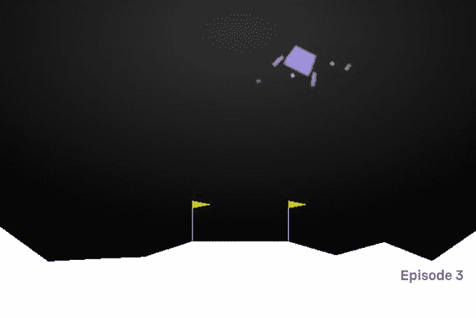

# 深度确定性策略梯度

在第 8 章，“深度 Q 网络和 Atari 游戏”中，我们研究了 DQN 的工作原理，并应用了 DQN 玩 Atari 游戏。 但是，在那些离散的环境中，我们只有一组有限的动作。 想象一个连续的环境空间，例如训练机器人走路； 在那些环境中，应用 Q 学习是不可行的，因为要找到一个贪婪的策略将需要在每一步进行很多优化。 即使我们使连续的环境离散，我们也可能会失去重要的功能并最终获得大量的动作空间。 当我们拥有巨大的行动空间时，很难实现融合。

因此，我们使用称为演员评论家的新架构，该架构具有两个网络：演员和评论家。 演员评论家架构结合了策略梯度和状态操作值功能。 **演员**网络的作用是通过调整参数`θ`来确定**状态**中的最佳动作，而**评论家**的作用是评估**演员**产生的动作。 **评论家**通过计算时间差异误差来评估演员的行动。 也就是说，我们在**演员**网络上执行策略梯度以选择操作， **评论家**网络使用 TD 误差评估由**演员**网络产生的操作。 下图显示了演员评论家架构：


与 DQN 相似，这里我们使用经验缓冲区，通过采样少量的经验来训练演员和评论家网络。 我们还使用单独的目标演员和评论家网络来计算损失。

例如，在乒乓游戏中，我们将具有不同比例的不同特征，例如位置，速度等。 因此，我们以所有要素都处于相同比例的方式来缩放要素。 我们使用一种称为批归一化的方法来缩放要素。 它将所有特征归一化以具有单位均值和方差。 我们如何探索新的行动？ 在连续环境中，将有`n`个动作。 为了探索新动作，我们在演员网络产生的动作中添加了一些噪声`N`。 我们使用称为 Ornstein-Uhlenbeck 随机过程的过程来生成此噪声。

现在，我们将详细介绍 DDPG 算法。

假设我们有两个网络：演员网络和评论家网络。 我们用输入为状态的`μ(s; θ^μ)`表示演员网络
，并以`θ^μ`作为演员网络权重的结果进行操作。 我们将评论家网络表示为`Q(s, a; θ^Q)`，它将输入作为状态和动作并返回`Q`值，其中`θ^Q`是评论家网络权重。

同样，我们将演员网络和评论家网络的目标网络分别定义为`μ(s; θ^μ')`和`Q(s, a; θ^Q')`，其中`θ^μ'`和`θ^Q'`是目标演员和评论家网络的权重。

我们使用策略梯度更新演员网络权重，并使用根据 TD 误差计算得出的梯度更新评论家网络权重。

首先，我们通过将探索噪声`N`添加到演员网络产生的动作（例如`μ(s; θ^μ) + N`）来选择动作。 我们在`s`状态下执行此操作，获得`r`奖励，然后移至新状态`s'`。 我们将此转移信息存储在经验回放缓冲区中。

经过一些迭代后，我们从回放缓冲区采样转移并训练网络，然后计算目标`Q`值：


我们将 TD 误差计算为：


其中`M`是来自回放缓冲区的用于训练的样本数。 我们使用根据此损耗`L`计算出的梯度来更新评论网络的权重。

同样，我们使用策略梯度更新策略网络权重。 然后，我们在目标网络中更新 Actor 和评论家网络的权重。 我们会缓慢更新目标网络的权重，从而提高稳定性。 它称为软替换：


# 摆动摆锤

我们有一个从随机位置开始的摆锤，我们的探员的目标是向上摆动摆锤使其保持直立。 我们将在这里看到如何使用 DDPG。 [wshuail](https://github.com/wangshuailong/reinforcement_learning_with_Tensorflow/tree/master/DDPG) 提供了本节中使用的代码。

首先，让我们导入必要的库：

```py
import tensorflow as tf
import numpy as np
import gym
```

接下来，我们按如下方式定义超参数：

```py
# number of steps in each episode
epsiode_steps = 500 

# learning rate for actor
lr_a = 0.001 

# learning rate for critic
lr_c = 0.002 

# discount factor
gamma = 0.9 

# soft replacement
alpha = 0.01 

# replay buffer size
memory = 10000 

# batch size for training
batch_size = 32 
render = False
```

我们将在`DDPG`类中实现 DDPG 算法。 我们分解类以查看每个函数。 首先，我们初始化所有内容：

```py
class DDPG(object):
    def __init__(self, no_of_actions, no_of_states, a_bound,):

        # initialize the memory with shape as no of actions, no of states and our defined memory size
        self.memory = np.zeros((memory, no_of_states * 2 + no_of_actions + 1), dtype=np.float32)

        # initialize pointer to point to our experience buffer
        self.pointer = 0

        # initialize tensorflow session
        self.sess = tf.Session()

        # initialize the variance for OU process for exploring policies
        self.noise_variance = 3.0

        self.no_of_actions, self.no_of_states, self.a_bound = no_of_actions, no_of_states, a_bound,

        # placeholder for current state, next state and rewards
        self.state = tf.placeholder(tf.float32, [None, no_of_states], 's')
        self.next_state = tf.placeholder(tf.float32, [None, no_of_states], 's_')
        self.reward = tf.placeholder(tf.float32, [None, 1], 'r')

        # build the actor network which has separate eval(primary) 
        # and target network
        with tf.variable_scope('Actor'):
            self.a = self.build_actor_network(self.state, scope='eval', trainable=True)
            a_ = self.build_actor_network(self.next_state, scope='target', trainable=False)

        # build the critic network which has separate eval(primary) 
        # and target network 
        with tf.variable_scope('Critic'):
            q = self.build_crtic_network(self.state, self.a, scope='eval', trainable=True)
            q_ = self.build_crtic_network(self.next_state, a_, scope='target', trainable=False)

        # initialize the network parameters
        self.ae_params = tf.get_collection(tf.GraphKeys.GLOBAL_VARIABLES, scope='Actor/eval')
        self.at_params = tf.get_collection(tf.GraphKeys.GLOBAL_VARIABLES, scope='Actor/target')

        self.ce_params = tf.get_collection(tf.GraphKeys.GLOBAL_VARIABLES, scope='Critic/eval')
        self.ct_params = tf.get_collection(tf.GraphKeys.GLOBAL_VARIABLES, scope='Critic/target')

        # update target value
        self.soft_replace = [[tf.assign(at, (1-alpha)*at+alpha*ae), tf.assign(ct, (1-alpha)*ct+alpha*ce)]
            for at, ae, ct, ce in zip(self.at_params, self.ae_params, self.ct_params, self.ce_params)]

        # compute target Q value, we know that Q(s,a) = reward + gamma *          
          Q'(s',a')
        q_target = self.reward + gamma * q_

        # compute TD error i.e actual - predicted values
        td_error = tf.losses.mean_squared_error(labels=(self.reward + gamma * q_), predictions=q)

        # train the critic network with adam optimizer
        self.ctrain = tf.train.AdamOptimizer(lr_c).minimize(td_error, name="adam-ink", var_list = self.ce_params)

        # compute the loss in actor network
        a_loss = - tf.reduce_mean(q) 

        # train the actor network with adam optimizer for 
        # minimizing the loss
        self.atrain = tf.train.AdamOptimizer(lr_a).minimize(a_loss, var_list=self.ae_params)

```

```py
        # initialize summary writer to visualize our network in tensorboard
        tf.summary.FileWriter("logs", self.sess.graph)

        # initialize all variables
        self.sess.run(tf.global_variables_initializer()) 
```

我们如何在 DDPG 中选择一个动作？ 我们通过向动作空间添加噪音来选择动作。 我们使用 Ornstein-Uhlenbeck 随机过程生成噪声：

```py
  def choose_action(self, s):
        a = self.sess.run(self.a, {self.state: s[np.newaxis, :]})[0]
        a = np.clip(np.random.normal(a, self.noise_variance), -2, 2)

        return a
```

然后，我们定义`learn`函数，在该函数中进行实际训练。 在这里，我们从经验缓冲区中选择一批`states`，`actions`，`rewards`和下一个状态。 我们以此来训练演员和评论家网络：

```py
    def learn(self):
        # soft target replacement
        self.sess.run(self.soft_replace)

        indices = np.random.choice(memory, size=batch_size)
        batch_transition = self.memory[indices, :]
        batch_states = batch_transition[:, :self.no_of_states]
        batch_actions = batch_transition[:, self.no_of_states: self.no_of_states + self.no_of_actions]
        batch_rewards = batch_transition[:, -self.no_of_states - 1: -self.no_of_states]
        batch_next_state = batch_transition[:, -self.no_of_states:]

        self.sess.run(self.atrain, {self.state: batch_states})
        self.sess.run(self.ctrain, {self.state: batch_states, self.a: batch_actions, self.reward: batch_rewards, self.next_state: batch_next_state})
```

我们定义了一个`store_transition`函数，该函数将所有信息存储在缓冲区中并执行学习：

```py
    def store_transition(self, s, a, r, s_):
        trans = np.hstack((s,a,[r],s_))

        index = self.pointer % memory
        self.memory[index, :] = trans
        self.pointer += 1

        if self.pointer > memory:

            self.noise_variance *= 0.99995
            self.learn()
```

我们定义了`build_actor_network`函数来构建演员网络：

```py
    def build_actor_network(self, s, scope, trainable):
        # Actor DPG
        with tf.variable_scope(scope):
            l1 = tf.layers.dense(s, 30, activation = tf.nn.tanh, name = 'l1', trainable = trainable)
            a = tf.layers.dense(l1, self.no_of_actions, activation = tf.nn.tanh, name = 'a', trainable = trainable) 
            return tf.multiply(a, self.a_bound, name = "scaled_a") 
```

我们定义`build_ crtic_network`函数：

```py
    def build_crtic_network(self, s, a, scope, trainable):
        # Critic Q-leaning
        with tf.variable_scope(scope):
            n_l1 = 30
            w1_s = tf.get_variable('w1_s', [self.no_of_states, n_l1], trainable = trainable)
            w1_a = tf.get_variable('w1_a', [self.no_of_actions, n_l1], trainable = trainable)
            b1 = tf.get_variable('b1', [1, n_l1], trainable = trainable)
            net = tf.nn.tanh( tf.matmul(s, w1_s) + tf.matmul(a, w1_a) + b1 )

            q = tf.layers.dense(net, 1, trainable = trainable)
            return q
```

现在，我们使用`make`函数初始化`gym`环境：

```py
env = gym.make("Pendulum-v0")
env = env.unwrapped
env.seed(1)
```

我们得到状态数：

```py
no_of_states = env.observation_space.shape[0]
```

我们得到的动作数：

```py
no_of_actions = env.action_space.shape[0]
```

此外，该动作的上限：

```py
a_bound = env.action_space.high
```

现在，我们为`DDPG`类创建一个对象：

```py
ddpg = DDPG(no_of_actions, no_of_states, a_bound)
```

我们初始化列表以存储总奖励：

```py
total_reward = []
```

设置剧集数：

```py
no_of_episodes = 300
```

现在，让我们开始训练：

```py
# for each episodes 
for i in range(no_of_episodes):
    # initialize the environment
    s = env.reset()

    # episodic reward
    ep_reward = 0

    for j in range(epsiode_steps):

        env.render()

        # select action by adding noise through OU process
        a = ddpg.choose_action(s)

        # perform the action and move to the next state s
        s_, r, done, info = env.step(a)

        # store the the transition to our experience buffer 
        # sample some minibatch of experience and train the network
        ddpg.store_transition(s, a, r, s_)

        # update current state as next state
        s = s_

        # add episodic rewards
        ep_reward += r

        if j == epsiode_steps-1:

            # store the total rewards
            total_reward.append(ep_reward)

            # print rewards obtained per each episode
            print('Episode:', i, ' Reward: %i' % int(ep_reward))

            break
```

您将看到如下输出：


我们可以在 TensorBoard 中看到计算图：

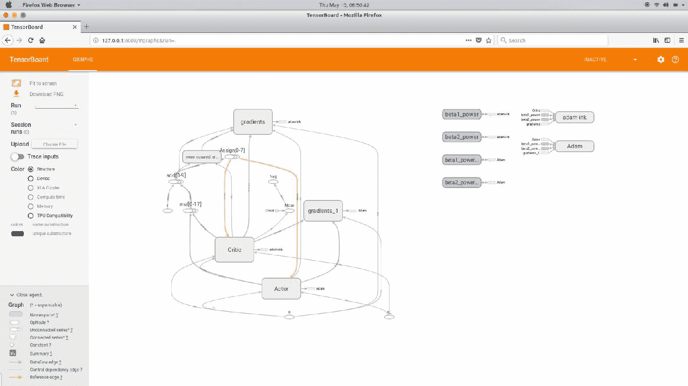

# 信任区域策略优化

在了解**信任区域策略优化**（**TRPO**）之前，我们需要了解受约束的策略优化。 我们知道，在 RL 智能体中，通过反复试验来学习，以使报酬最大化。 为了找到最佳策略，我们的智能体将探索所有不同的行动，并选择能获得良好回报的行动。 在探索不同的动作时，我们的智能体很有可能也会探索不良的动作。 但是最大的挑战是，当我们允许智能体在现实世界中学习以及奖励功能设计不当时。 例如，考虑一个学习走路而没有遇到任何障碍的智能体。 如果智能体被任何障碍物击中，它将获得负奖励；而如果没有被任何障碍物击中，则将获得正奖励。 为了找出最佳策略，智能体会探索不同的操作。 智能体还采取行动，例如撞到障碍物以检查它是否给出了良好的回报。 但这对我们的经纪人来说并不安全； 当智能体在现实环境中学习时，这尤其不安全。 因此，我们介绍了基于约束的学习。 我们设置一个阈值，如果碰到障碍物的可能性小于该阈值，则我们认为我们的智能体是安全的，否则我们认为我们的智能体是不安全的。 添加了约束以确保我们的智能体位于安全区域内。

在 TRPO 中，我们迭代地改进了该策略，并施加了一个约束，以使旧策略和新策略之间的 **Kullback-Leibler**（**KL**）差异要小于某个常数。 。 该约束称为信任区域约束。

那么什么是 KL 散度？ KL 散度告诉我们两个概率分布如何彼此不同。 由于我们的策略是针对行动的概率分布，因此 KL 差异告诉我们新策略与旧策略有多远。 为什么我们必须使旧策略和新策略之间的距离保持小于恒定值`δ`？ 因为我们不希望我们的新策略与旧策略脱节。 因此，我们施加了约束以使新策略接近旧策略。 同样，为什么我们必须保持旧策略呢？ 当新策略与旧策略相距甚远时，它将影响智能体的学习绩效，并导致完全不同的学习行为。 简而言之，在 TRPO 中，我们朝着改善策略的方向迈出了一步，即使报酬最大化，但我们还应确保满足信任区域约束。 [它使用共轭梯度下降](http://www.idi.ntnu.no/~elster/tdt24/tdt24-f09/cg.pdf)优化网络参数`θ`，同时满足约束条件。 该算法保证了单调策略的改进，并且在各种连续环境中也取得了出色的效果。

现在，我们将了解 TRPO 的数学原理。 如果您对数学不感兴趣，可以跳过本节。

准备一些很棒的数学。

让我们指定预期的总折扣奖励`η(π)`，如下所示：


现在让我们将新策略视为`π'`； 就相对于旧策略`π`的优势而言，可以将其定义为策略`π'`的预期回报，如下所示：

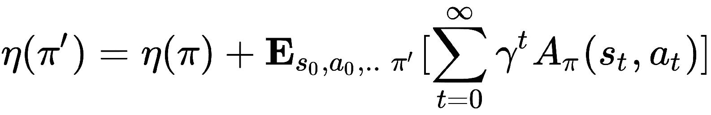

好吧，为什么我们要利用旧策略的优势？ 因为我们正在衡量新策略`π'`相对于旧策略`π`的平均效果有多好。 我们可以用状态之和而不是时间步来重写前面的方程，如下所示：


是折扣的访问频率，即：

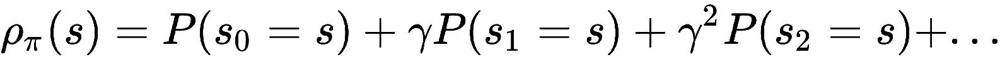

如果您看到前面的方程`η(π')`，则`ρ[π'](s)`与`π'`
之间存在复杂的依存关系，因此很难对方程进行优化。 因此，我们将局部近似`L[π](π')`引入`η(π')`，如下所示：


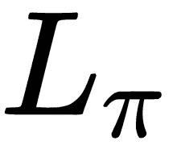使用访问频率`ρ[π]`而不是`ρ[π']`，也就是说，由于策略的变化，我们忽略了状态访问频率的变化。 简而言之，我们假设新旧策略的州访问频率均相同。 当我们计算`L[π]`的梯度时，相对于某些参数`θ`而言，这也会提高`η`，我们不确定要采取多少步骤。

Kakade 和 Langford 提出了一种新的策略更新方法，称为保守策略迭代，如下所示：

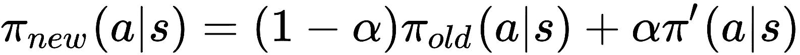 ----（1）

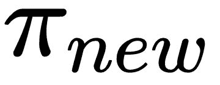是新策略。 `π_old`是旧策略。

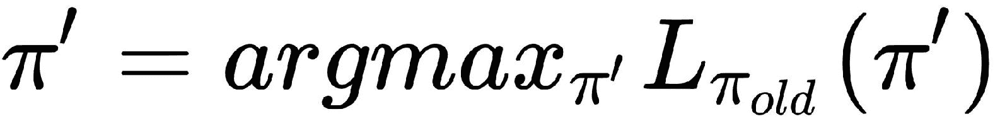，即`π'`，是最大化`L[π_old]`的策略。

Kakade 和 Langford 从`(1)`得出以下方程式：

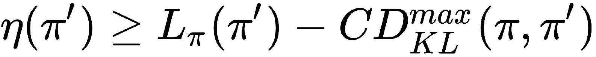 ----（2）

`C`是惩罚系数，等于`4εγ / (1 - α)^2`，`D_max[KL]`表示旧策略与新策略之间的 KL 散度。

如果我们仔细观察前面的方程式`(2)`，我们会注意到，只要右侧最大化，我们的预期长期回报`η`就会单调增加。

让我们将此右侧术语定义为`M[i](π)`，如下所示：

 ----（3）

将公式`(3)`代入`(2)`，我们得到：

 ----（4）

由于我们知道两个相同策略之间的 KL 差异为`0`，我们可以这样写：

 ----（5）

结合方程式`(4)`和`(5)`，我们可以写：

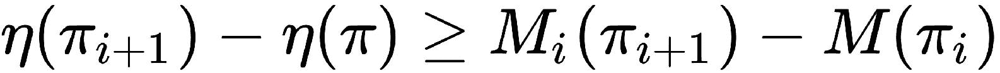

在前面的等式中，我们可以理解，最大化`M[i]`可以保证我们期望收益的最大化。 因此，现在我们的目标是最大化`M[i]`，从而最大化我们的预期回报。 由于我们使用参数化策略，因此在上一个公式中将`π`替换为`θ`，然后使用`θ_old`表示我们要改进的策略，如下所示：

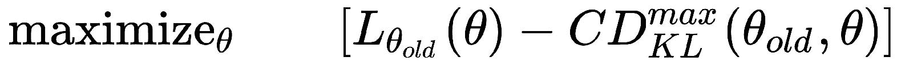

但是，在前面的公式中具有惩罚系数`C`将导致步长非常小，从而减慢了更新速度。 因此，我们对 KL 散度的旧策略和新策略施加了约束，即信任区域约束，这将有助于我们找到最佳步长：


现在，问题是在状态空间的每个点上都施加了 KL 散度，当我们拥有高维状态空间时，解决它确实是不可行的。 因此，我们使用启发式近似，其平均 KL 散度为：

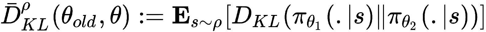

因此，现在，我们可以将平均 KL 散度约束重写为先前的目标函数，如下所示：


扩展`L`的值，我们得到以下信息：

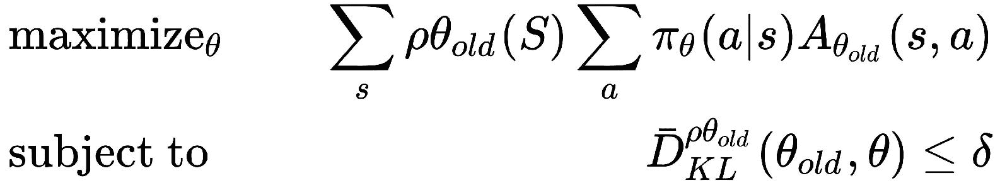

在前面的公式中，我们将状态总和`Σ[s] ρ θ_old`替换为期望`E[s ~ ρ θ_old]`，并且将重要性总和估计值替换为行动总和，如下所示：

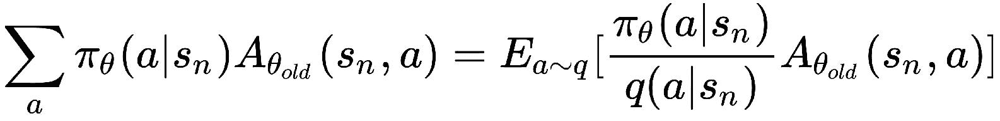

然后，我们将优势目标值`A[θ_old]`替换为 Q 值`Q[θ_old]`。

因此，我们最终的目标函数将变为：


优化前面提到的具有约束的目标函数称为约束优化。 我们的约束是使旧策略和新策略之间的平均 KL 差异小于`δ`。我们使用共轭梯度下降来优化先前的功能。

# 近端策略优化

现在，我们将看另一种策略优化算法，称为**近端策略优化**（**PPO**）。 它是对 TRPO 的改进，由于其性能，已成为解决许多复杂 RL 问题的默认 RL 算法。 它是 OpenAI 的研究人员为克服 TRPO 的缺点而提出的。 回忆一下 TRPO 的替代目标函数。 这是一个约束优化问题，我们在其中施加了一个约束-新旧策略之间的平均 KL 差异应小于`δ`。 但是 TRPO 的问题在于，它需要大量计算能力才能计算共轭梯度以执行约束优化。

因此，PPO 通过将约束更改为惩罚项来修改 TRPO 的目标函数，因此我们不想执行共轭梯度。 现在，让我们看看 PPO 的工作原理。 我们将`r[t](θ)`定义为新旧策略之间的概率比。 因此，我们可以将目标函数编写为：

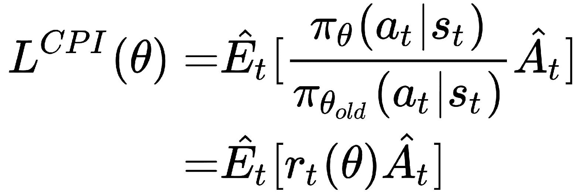

`L_CPI`表示保守策略迭代。 但是最大化`L`会导致无限制地进行大量策略更新。 因此，我们通过添加惩罚项来重新定义我们的目标函数，该惩罚项会惩罚较大的策略更新。 现在目标函数变为：


我们刚刚在实际方程式中添加了一个新项：

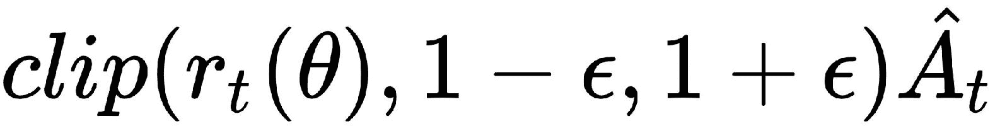

这是什么意思？ 实际上，它会在间隔`[1 - ε, 1 + ε]`之间裁剪`r[t](θ)`的值，也就是说，如果`r[t](θ)`的值导致目标函数增加，则在间隔之间大量裁剪的值会降低其效果。

基于两种情况，我们将概率比限制在`1 - ε`或`ε`：

*   **案例 1**：`A_hat[t] > 0`

当优势为正时，这意味着相对于所有其他操作的平均值，应优先选择相应的操作。 我们将为该操作增加`r[t](θ)`的值，因此将有更大的机会被选择。 当我们执行`r[t](θ)`的限幅值时，不会超过`1 + ε`：


*   **案例 2**：`A_hat[t]`

当优势的值为负时，这意味着该动作没有意义，因此不应采用。 因此，在这种情况下，我们将减小该操作的`r[t](θ)`值，以使其被选择的机会较小。 类似地，当我们执行裁剪时，`r[t](θ)`的值将不会减小到小于`1 - ε`：

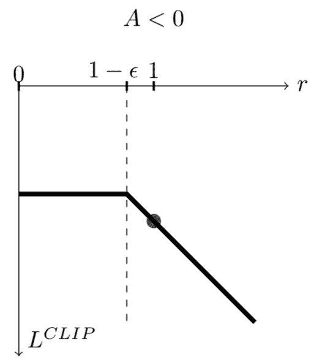

当我们使用神经网络架构时，我们必须定义损失函数，其中包括目标函数的值函数误差。 就像在 A3C 中一样，我们还将添加熵损失以确保足够的探索。 因此，我们最终的目标函数变为：

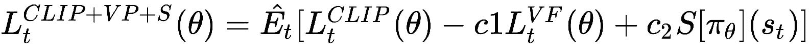

`c[1]`和`c[2]`是系数，`L[t]^(VP)`是实际值和目标值函数之间的平方误差损失，即：

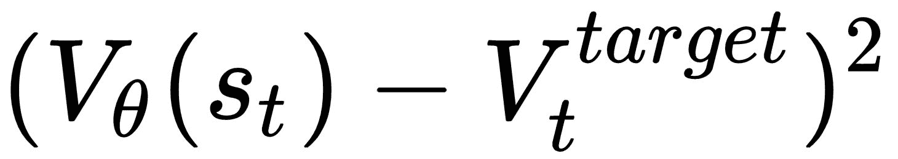

`S`是熵增。

# 总结

我们从策略梯度方法开始，该方法无需 Q 函数即可直接优化策略。 我们通过解决 Lunar Lander 游戏了解了策略梯度，并研究了 DDPG，它具有策略梯度和 Q 函数的优点。

然后，我们研究了诸如 TRPO 之类的策略优化算法，该算法通过对新旧策略之间的 KL 差异实现不大于`δ`的限制来确保单调策略的改进。

我们还研究了近端策略优化，该优化通过惩罚大型策略更新将约束变为惩罚。 在下一章第 12 章， “Capstone 项目 – 使用 DQN 进行赛车”，我们将了解如何构建能够赢得赛车游戏的智能体。

# 问题

问题列表如下：

1.  什么是策略梯度？
2.  策略梯度为何有效？
3.  DDPG 中的演员评论家网络有什么用途？
4.  约束优化问题是什么？
5.  什么是信任区域？
6.  PPO 如何克服 TRPO 的缺点？

# 进一步阅读

您可以进一步参考以下论文：

*   [**DDPG 论文**](https://github.com/wangshuailong/reinforcement_learning_with_Tensorflow/tree/master/DDPG)
*   [**TRPO 论文**](https://arxiv.org/pdf/1502.05477.pdf)
*   [**PPO 论文**](https://arxiv.org/pdf/1707.06347.pdf)