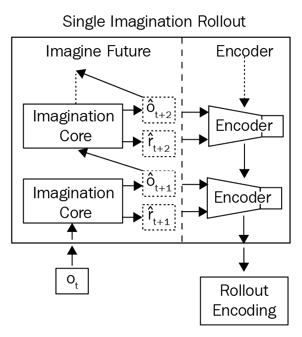
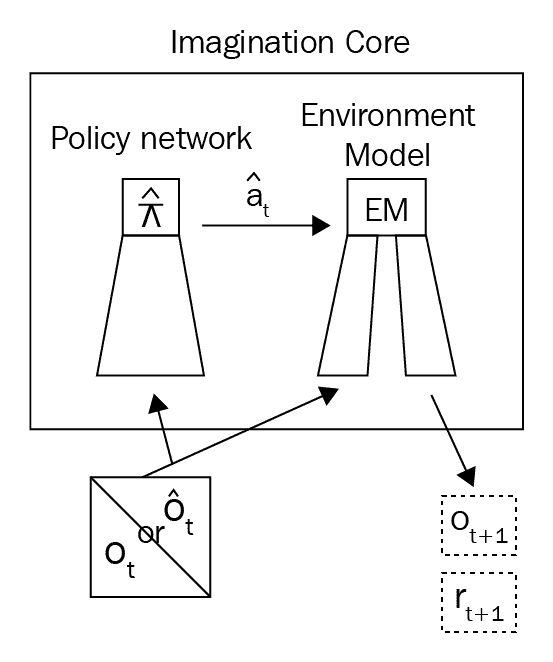
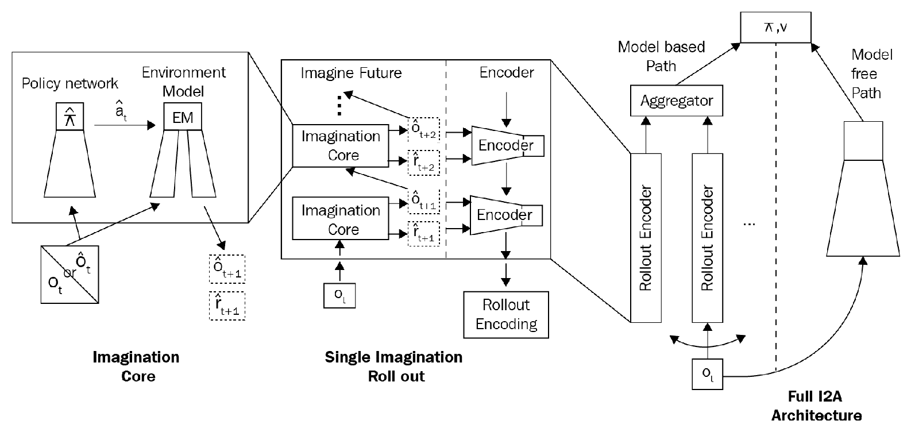
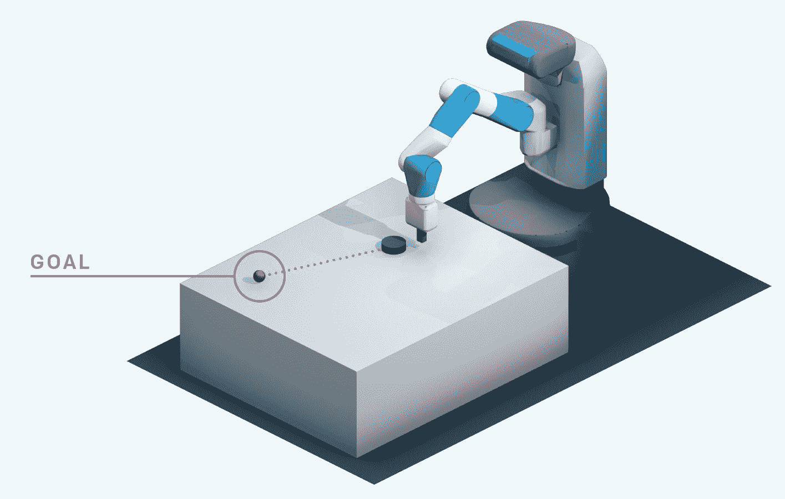
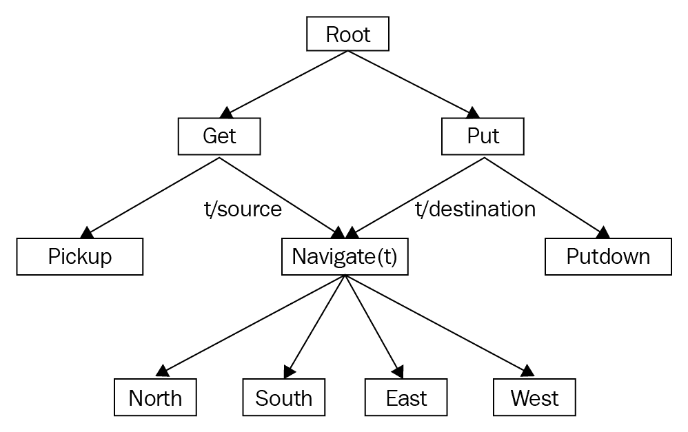
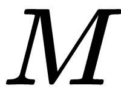
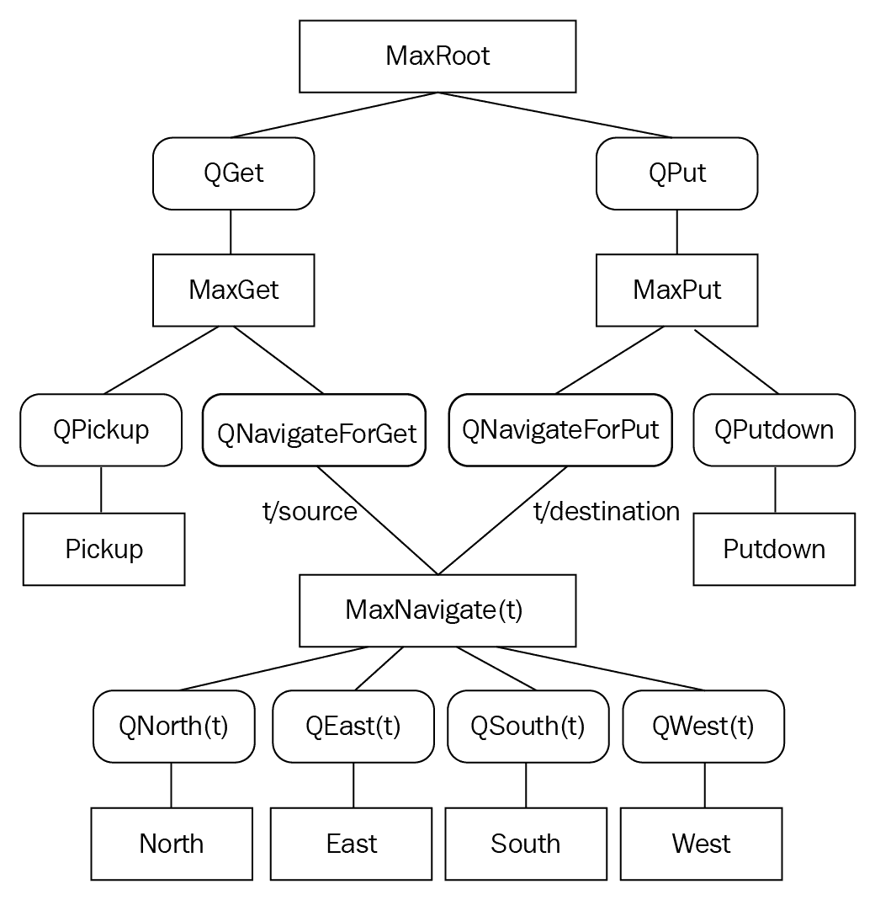

# 最新进展和后续步骤

恭喜你！ 您已进入最后一章。 我们已经走了很长一段路！ 我们从 RL 的基础知识开始，例如 MDP，蒙特卡洛方法和 TD 学习，然后转向高级深度强化学习算法，例如 DQN，DRQN 和 A3C。 我们还了解了有趣的最新策略梯度方法，例如 DDPG，PPO 和 TRPO，并建立了赛车智能体作为我们的最终项目。 但是 RL 每天还有越来越多的进步供我们探索。 在本章中，我们将学习 RL 的一些进步，然后介绍分层和逆 RL。

在本章中，您将学习以下内容：

*   **想象力增强智能体**（**I2A**）
*   从人类偏好学习
*   来自演示的深度 Q 学习
*   事后经验回放
*   分层强化学习
*   逆强化学习

# 想象力增强智能体

您是国际象棋迷吗？ 如果我要你下棋，你会怎么玩？ 在棋盘上移动任何棋子之前，您可能会想象移动任何棋子并移动您认为会帮助您获胜的棋子的后果。 因此，基本上，在采取任何措施之前，您先想像一下后果，如果有利，则继续进行该措施，否则就不要执行该措施。

同样，想象力增强的智能体也会增加想象力。 在环境中采取任何行动之前，他们会想象采取行动的后果，如果他们认为该行动会带来良好的回报，他们将执行该行动。 他们还想象采取不同行动的后果。 用想象力增强智能体是迈向通用人工智能的下一步。

现在，我们将简短地了解想象力增强智能体的工作原理。 I2A 充分利用了基于模型的学习和基于模型的学习。

I2A 的架构如下：

智能体采取的行动是基于模型的路径和没有模型的路径的结果。 在基于模型的路径中，我们有一些称为“滚动编码器”的产品。 这些推出编码器是智能体执行想象任务的地方。 让我们仔细看一下滚动编码器。 推出编码器如下所示：

推出编码器分为两层：想象未来和编码器。 想象未来是想象力发生的地方。 看上图。 想象未来由想象核心组成。 当将状态`o[t]`馈送到想象力核心时，我们得到了新状态`o_hat[t + 1]`和奖励`r_hat[t + 1]`，当我们将这个新状态`o_hat[t + 1]`馈给了下一个想象力核心时，我们得到了下一个新状态`o_hat[t + 2]`和奖励`r_hat[t + 2]`。 当我们在某些`n`步骤中重复这些步骤时，我们会得到一个基本上是状态和奖励对的推出，然后我们使用诸如 LSTM 的编码器对该推广进行编码。 结果，我们得到了卷展编码。 这些推出编码实际上是描述未来想象路径的嵌入。 我们将针对未来不同的想象路径使用多个推出编码器，并使用聚合器来聚合此推出编码器。

等待。 想象力如何在**想象力核心**中发生？ **想象力核心**中实际上是什么？ 下图显示了单个**想象核心**：

**想象核心**由**策略网络**和**环境模型**组成。 **环境模型**实际上是发生一切的地方。 **环境模型**从智能体到目前为止执行的所有动作中学习。 它获取有关状态`o_hat[t]`的信息，并根据经验来想象所有可能的期货，并选择给予较高奖励的操作`a_hat[t]`。

扩展了所有组件的 I2A 架构如下所示：

您以前玩过推箱子吗？ 推箱子是一款经典的益智游戏，玩家必须将盒子推到目标位置。 游戏的规则非常简单：盒子只能推入而不能拉出。 如果我们向错误的方向推箱子，那么难题将变得无法解决：

如果我们被要求玩推箱子，那么在做出任何举动之前，我们会想一想并计划好，因为糟糕的举动会导致游戏结束。 I2A 架构将在此类环境中提供良好的结果，在这种环境中，智能体必须提前计划才能采取任何措施。 本文的作者在推箱子上测试了 I2A 性能，并取得了显著成果。

# 从人类偏好学习

向人类学习是 RL 的重大突破。 该算法由 OpenAI 和 DeepMind 的研究人员提出。 该算法背后的思想是使智能体根据人的反馈进行学习。 最初，智能体会随机行动，然后将执行动作的智能体的两个视频片段提供给人类。 人们可以检查视频剪辑，并告诉智能体哪个视频剪辑更好，也就是说，智能体在哪个视频中更好地执行任务，并将其实现目标。 给出反馈后，智能体将尝试执行人类喜欢的操作并相应地设置奖励。 设计奖励功能是 RL 中的主要挑战之一，因此，与智能体进行人为互动可以直接帮助我们克服挑战，也可以最大程度地减少编写复杂目标功能的过程。

训练过程如下图所示：

让我们看一下以下步骤：

1.  首先，我们的**智能体**通过随机策略与**环境**交互。
2.  智能体与**环境**交互的行为将在两到三秒钟的视频剪辑对中捕获并提供给人类。
3.  人员将检查视频剪辑，并了解智能体在哪个视频剪辑中表现更好。 他们会将结果发送给奖励预测器。
4.  现在，智能体将从预测的奖励中接收这些信号，并根据人类的反馈设置其目标和奖励功能。

轨迹是一系列观察和动作。 我们可以将轨迹段表示为`σ`，因此`σ = (o0, a0), (o1, a1), ..., (o[k-1], a[k-1])`，其中`o`是观察值，`a`是动作。 智能体从环境接收观察并执行某些操作。 假设我们将交互序列存储在两个轨迹段中，即`σ[1]`和`σ[2]`。 现在，这两个轨迹已显示给人类。 如果人类更喜欢`σ[2]`而不是`σ[1]`，那么智能体的目标是产生人类所喜欢的轨迹，并相应地设置奖励功能。 这些轨迹段以`(σ[1], σ[2], μ)`的形式存储在数据库中； 如果人类更喜欢`σ[2]`而不是`σ[1]`，则`μ`设置为更喜欢`σ[2]`。 如果没有一条轨迹是可取的，则两条轨迹都将从数据库中删除。 如果两者均首选，则将`μ`设置为统一。

您可以在[这个页面](https://youtu.be/oC7Cw3fu3gU)上查看视频，以了解算法的工作原理。

# 来自演示的深度 Q 学习

我们已经了解了很多有关 DQN 的知识。 我们从原始 DQN 开始，然后看到了各种改进，例如双重 DQN，决斗的网络架构和优先级的经验回放。 我们还学会了构建 DQN 来玩 Atari 游戏。 我们将智能体与环境的交互存储在经验缓冲区中，并使智能体从这些经验中学习。 但是问题是，我们花了很多训练时间来提高性能。 对于在模拟环境中学习，这很好，但是当我们让智能体在现实环境中学习时，会引起很多问题。 为了克服这个问题，谷歌公司 DeepMind 的研究人员在演示（**DQfd**）的基础上，对 DQN 进行了改进，称为**深度 Q 学习**。

如果我们已经有了一些演示数据，则可以将这些演示直接添加到经验回放缓冲区中。 例如，考虑一个学习玩 Atari 游戏的智能体。 如果我们已经有了一些演示数据来告诉我们的智能体，哪个状态更好，哪个动作可以提供良好的回报，那么智能体可以直接使用此数据进行学习。 即使是少量的演示，也可以提高智能体的表现并最大程度地减少训练时间。 由于演示的数据将直接添加到优先经验回放缓冲区中，因此智能体可以从演示数据中使用的数据量以及智能体可以从其自己的交互中用于学习的数据量将由优先经验回放来控制缓冲区，因为经验将被优先考虑。

DQfd 中的损失函数将是各种损失的总和。 为了防止我们的智能体过度适合演示数据，我们在网络权重上计算 L2 正则化损失。 我们像往常一样计算 TD 损失，也计算监督损失，以了解我们的智能体如何从演示数据中学习。 本文的作者在 DQfd 和各种环境下进行了实验，并且 DQfd 的性能比双重决斗 DQN 优先排序的性能更好，更快。

您可以观看此视频，[以了解 DQfd 如何学会玩“Private Eye”游戏](https://youtu.be/4IFZvqBHsFY)。

# 事后经验回放

我们已经了解了如何在 DQN 中使用经验回放来避免相关经验。 此外，我们了解到，优先经验回放是对原始经验回放的一种改进，因为它优先考虑 TD 错误的每个经验。 现在，我们将研究由 OpenAI 研究人员提出的一种用于处理稀疏奖励的名为**事后经验回放**（**HER**）的新技术。 您还记得如何学习骑自行车吗？ 第一次尝试时，您将无法正确平衡自行车。 您可能多次无法正确平衡。 但是，所有这些失败并不意味着您没有学到任何东西。 失败会教你如何不平衡自行车。 即使您没有学会骑自行车（目标），您也学习了一个不同的目标，即，您学会了如何不平衡自行车。 这是我们人类学习的方式，对吗？ 我们从失败中学习，这就是事后回顾经验的想法。

让我们考虑本文中给出的相同示例。 如图所示，查看 FetchSlide 环境。 在这种环境下的目标是移动机械臂并在桌子上滑动冰球以击中目标，这是一个红色的小圆圈（来自[的图表 https://blog.openai.com/ingredients-for-robotics-research /](https://blog.openai.com/ingredients-for-robotics-research/) ）：

在最初的几次尝试中，智能体不一定能实现目标。 因此，智能体只收到 -1 作为奖励，这告诉智能体他做错了，没有达到目标：

但这并不意味着智能体没有学到任何东西。 智能体已经实现了一个不同的目标，即它学会了接近实际目标。 因此，我们认为它有一个不同的目标，而不是认为它是失败的。 如果我们在多次迭代中重复此过程，智能体将学会实现我们的实际目标。 HER 可以应用于任何非策略算法。 将 HER 的性能与没有 HER 的 DDPG 进行比较，反之亦然，可以看出带有 HER 的 DDPG 的收敛速度比没有 HER 的 DDPG 快。 [您可以在以下视频中看到 HER 的性能](https://youtu.be/Dz_HuzgMxzo)。

# 分层强化学习

RL 的问题在于它无法在大量状态空间和动作下很好地扩展，最终导致维度的诅咒。 **分层强化学习**（**HRL**）被提出来解决维数的诅咒，其中我们将大问题解压缩为层次结构中的小子问题。 假设智能体的目标是从学校到达家中。 在这里，问题被分解为一组子目标，例如从学校大门出来，预定出租车等。

HRL 中使用了不同的方法，例如状态空间分解，状态抽象和时间抽象。 在状态空间分解中，我们将状态空间分解为不同的子空间，并尝试在较小的子空间中解决问题。 分解状态空间还可以加快探查速度，因为智能体程序不希望探究整个状态空间。 在状态抽象中，智能体会忽略与在当前状态空间中实现当前子任务无关的变量。 在时间抽象中，将动作序列和动作集分组，这将单个步骤分为多个步骤。

现在，我们可以研究 HRL 中最常用的算法之一，称为 MAXQ 值函数分解。

# MAXQ 值函数分解

MAXQ 值函数分解是 HRL 中最常用的算法之一。 让我们看看 MAXQ 的工作原理。 在 MAXQ 值函数分解中，我们将值函数分解为每个子任务的一组值函数。 让我们以本文中给出的相同示例为例。 还记得我们使用 Q 学习和 SARSA 解决的出租车问题吗？

总共有四个地点，智能体必须在一个地点接客并在另一地点下车。 智能体将获得 +20 积分作为成功下车的奖励，而每走一步便获得 -1 积分。 该智能体还将因非法取送丢掉 -10 分。 因此，我们智能体的目标是学会在短时间内在正确的位置上落客而不增加非法乘客。

接下来显示的是环境，其中的字母（`R`，`G`，`Y`，`B`）代表不同的位置， 黄色矩形是由我们的智能体驾驶的出租车：

现在，我们将目标分为以下四个子任务：

*   **导航**：这里的目标是将出租车从当前位置驾驶到目标位置之一。 导航子任务应使用北，南，东和西四个原始动作。
*   **获取**：这里的目标是将出租车从当前位置驾驶到乘客的位置并接客。
*   **放置**：这里的目标是将出租车从当前位置驾驶到乘客的目的地位置并下车。
*   **根**：根是整个任务。

我们可以在称为任务图的有向无环图中表示所有这些子任务，如下所示：

您可以在上图中看到所有子任务都是按层次排列的。 每个节点代表子任务或原始动作，并且每个边都连接一个子任务可以调用其子子任务的方式。

**导航**子任务具有四个原始动作：**东部**，**西部**，**北部**和**南部**。**获取**子任务具有**拾取**基本操作和导航子任务； 同样，**放置**子任务，具有**放置**（放置）原始动作并导航子任务。

在 MAXQ 分解中，MDP 将分为一组任务，例如`(M[0], M[1], ,,, M[n])`。

`M[0]`是根任务，`M[1], M[2], M[n]`是子任务。

子任务`M[i]`使用状态`S[i]`，操作`A[i]`，概率转换函数`P[i]^π(s', N | s, a)`和预期奖励函数`R_bar(s, a) = V^π(a, s)`定义半 MDP，其中`V^π(a, s)`是子任务`M[a]`在`s`状态下的投影值函数。

如果动作`a`是原始动作，那么我们可以将`V^π(a, s)`定义为在`s`状态下执行动作`a`的预期立即回报：

现在，我们可以按贝尔曼方程形式重写前面的值函数，如下所示：

 ----（1）

我们将状态动作值函数`Q`表示如下：

 ----（2）

现在，我们再定义一个称为完成功能的函数，它是完成子任务`M[i]`的预期折扣累积奖励：

 ----（3）

对于方程式`(2)`和`(3)`，我们可以将 Q 函数写为：

最后，我们可以将值函数重新定义为：

前面的等式会将根任务的值函数分解为各个子任务任务的值函数。

为了高效地设计和调试 MAXQ 分解，我们可以按如下方式重绘任务图：

我们重新设计的图形包含两种特殊类型的节点：最大节点和 Q 节点。 最大节点定义任务分解中的子任务，而 Q 节点定义可用于每个子任务的动作。

# 逆强化学习

那么，我们在 RL 中做了什么？ 我们试图找到具有奖励功能的最优策略。 逆强化学习只是强化学习的逆，也就是说，给出了最优策略，我们需要找到奖励函数。 但是为什么反强化学习会有所帮助？ 设计奖励功能不是一项简单的任务，而较差的奖励功能会导致智能体的不良行为。 我们并不总是知道适当的奖励功能，但我们知道正确的策略，即在每个州采取正确的行动。 因此，这种最佳策略由人类专家提供给智能体，智能体尝试学习奖励功能。 例如，考虑一个学习在真实环境中行走的智能体； 很难为将要执行的所有动作设计奖励功能。 取而代之的是，我们可以将人类专家的演示（最佳策略）提供给智能体，智能体将尝试学习奖励功能。

RL 周围有各种改进和进步。 现在，您已经阅读完本书，可以开始探索强化学习的各种进步，并开始尝试各种项目。 学习和加强！

# 总结

在本章中，我们了解了 RL 的一些最新进展。 我们看到了 I2A 架构如何将想象力核心用于前瞻性计划，然后如何根据人的喜好来训练智能体。 我们还了解了 DQfd，它可以通过从演示中学习来提高 DQN 的性能并减少其训练时间。 然后，我们研究了事后的经验回放，从中我们了解了智能体如何从失败中学习。

接下来，我们学习了层次 RL，其中目标被解压缩为子目标层次。 我们了解了反向 RL，其中智能体尝试根据给定策略来学习奖励函数。 RL 每天都在以有趣的进步发展。 既然您已经了解了各种强化学习算法，则可以构建智能体以执行各种任务并为 RL 研究做出贡献。

# 问题

问题列表如下：

1.  智能体的想象力是什么？
2.  想象力的核心是什么？
3.  智能体如何从人的偏好中学习？
4.  DQfd 与 DQN 有何不同？
5.  什么是事后经验回放？
6.  分层强化学习有什么需求？
7.  逆强化学习与强化学习有何不同？

# 进一步阅读

您可以进一步参考以下论文：

*   [**I2A 论文**](https://arxiv.org/pdf/1707.06203.pdf)
*   [**来自人类喜好的 DRL 论文**](https://arxiv.org/pdf/1706.03741.pdf)
*   [**HER 论文**](https://arxiv.org/pdf/1707.01495.pdf)
*   [**AI 安全性的辩论**](https://arxiv.org/pdf/1805.00899.pdf)