# 无监督学习入门


在本章中，我们将介绍基本的机器学习概念，即 ，前提是您具有一些统计学习和概率论的基本知识 。 您将了解机器学习技术的使用以及逻辑过程，这些逻辑过程将增进我们对数据集 的性质和属性的了解。 整个过程的目的是建立可支持业务决策的描述性和预测性模型。

无监督学习旨在为数据探索，挖掘和生成提供工具。 在本书中，您将通过具体的示例和分析来探索不同的场景，并且将学习如何应用基本且更复杂的算法来解决特定问题。

在本介绍性章节中，我们将讨论：

*   为什么我们需要机器学习？
*   描述性，诊断性，预测性和规范性分析
*   机器学习的类型
*   我们为什么要使用 Python？


# 技术要求


本章中提供的代码要求：

*   Python 3.5+（强烈建议您使用 [Anaconda 发行版](https://www.anaconda.com/distribution/)）
*   库：
    *   科学 0.19+
    *   NumPy 1.10+
    *   scikit 学习 0.19+
    *   熊猫 0.22+
    *   Matplotlib 2.0+
    *   海上 0.9+

[可以在 GitHub 存储库中找到示例](https://github.com/PacktPublishing/HandsOn-Unsupervised-Learning-with-Python/tree/master/Chapter01)。


# 为什么我们需要机器学习？


数据无处不在。 此刻，成千上万的系统正在收集构成特定服务历史的记录，以及日志，用户交互和许多其他上下文相关元素。 仅十年前，大多数公司甚至无法有效地管理其数据的 1%。 因此，数据库会被定期删除，并且只有重要数据才能保留在永久存储服务器中。

相反，如今，几乎每个公司都可以利用可扩展的云基础架构，以应对不断增长的传入数据量。 诸如 Apache Hadoop 或 Apache Spark 之类的工具使数据科学家和工程师都可以实施涉及大量数据的复杂管道。 在这一点上，所有的障碍都已被拆除，民主化进程已经到位。 但是，这些大型数据集的实际价值是多少？ 从业务角度来看，仅当信息可以帮助做出正确的决策，减少不确定性并提供更好的上下文洞察力时，信息才有价值。 这意味着，在没有正确工具和知识的情况下，一堆数据只是对公司的一项成本，需要对其进行限制以增加利润。

机器学习是计算机科学（尤其是人工智能）的一大分支，旨在通过利用现有数据集来实现现实的**描述性**和**预测性**模型。 由于本书致力于实用的无监督解决方案，因此我们将仅关注通过查找隐藏的原因和关系来描述上下文的算法。 但是，即使仅从理论角度来看，显示机器学习问题之间的主要差异也是有帮助的。 只有对目标有完整的认识（不仅限于技术方面），才能得出对最初问题“我们为什么需要机器学习？”的合理答案。

我们可以说人类具有非凡的认知能力，这激发了许多系统，但是当元素数量显着增加时，他们就缺乏分析能力。 例如，如果您是第一次参加他/她的班级的老师，那么您可以在整个班次浏览后就能对女学生所占的百分比进行粗略估算。 通常，即使估算是由两个或更多个人进行的，估算也可能是准确的并且接近实际计数。 但是，如果我们对在院子里聚集的所有学校人口进行重复实验，性别的区别将不明显。 这是因为所有学生在班上都清晰可见； 但是，在院子里区分性别受某些因素的限制（例如，较高的人可以隐藏矮一些的人）。 摆脱类比，我们可以说大量数据通常携带大量信息。 为了提取和分类信息，有必要采取一种自动化的方法。

在进入下一部分之前，让我们讨论最初由 Gartner 定义的描述性，诊断性，预测性和规范性分析的概念。 但是，在这种情况下，我们希望专注于正在分析的系统（例如，通用上下文），以便对其行为获得越来越多的控制。

下图表示了完整的过程：


Descriptive, diagnostic, predictive, and prescriptive flow


# 描述性分析


在几乎所有数据科学场景中要解决的第一个问题都在于了解其性质。 我们需要知道系统如何工作或数据集正在描述什么。 没有这种分析，我们的知识就太局限了，无法做出任何假设或假设。 例如，我们可以观察几年中城市平均温度的图表。 如果我们无法描述发现相关性，季节性和趋势的时间序列，那么任何其他问题都将无法解决。 在我们特定的上下文中，如果我们没有发现对象组之间的相似性，则无法尝试找到一种方法来总结它们的共同特征。 数据科学家必须针对每个特定问题使用特定的工具，但是，在此阶段结束时，必须回答所有可能的（有用的）问题。

此外，由于此过程必须具有明确的业务价值，因此重要的是要让不同的利益相关者参与进来，以收集他们的知识并将其转换为通用语言。 例如，当使用医疗数据时，医生可能会谈论遗传因素，但是出于我们的目的，最好说某些样本之间存在相关性，因此我们没有完全授权将它们视为统计上独立的元素。 一般而言，描述性分析的结果是一个摘要，其中包含对环境进行限定并减少不确定性所需的所有度量评估和结论。 在温度图表的示例中，数据科学家应该能够回答自相关，峰的周期性，潜在异常值的数量以及趋势的存在。


# 诊断分析


到现在为止，我们已经处理了输出数据，在特定的基础过程生成输出数据之后，才可以观察到这些数据。 描述系统后的自然问题与原因有关。 温度取决于许多气象和地理因素，可以很容易观察到或完全隐藏。 时间序列中的季节性明显受一年中的时间影响，但是离群值呢？

例如，我们在确定为冬季的区域中发现了一个高峰。 我们如何证明这一点呢？ 在简单的方法中，可以将其视为可以过滤掉的嘈杂异常值。 但是，如果已观察到该措施，并且该措施背后有一个基本事实（例如，所有各方都认为这不是错误），我们应该假定存在**隐藏的**（或**潜在）** ）原因。

令人惊讶的是，但是大多数更复杂的场景都具有难以分析的大量潜在原因（有时称为**因素**）的特征。 通常，这不是一个坏条件，但是，正如我们将要讨论的，将它们包括在模型中以通过数据集了解其影响非常重要。

另一方面，决定放弃所有未知元素意味着降低模型的预测能力，并成比例地降低准确性。 因此，诊断分析的主要目标不一定是找出所有原因，而是要列出可观察和可测量的元素（称为**因子**）以及所有潜在的潜在因子（通常归纳为 单个全局元素）。

在某种程度上，诊断分析通常类似于逆向工程过程，因为我们可以轻松地监视效果，但是要检测潜在原因和可观察效果之间的现有关系就更加困难。 因此，这种分析通常是概率性的，并有助于找到确定的特定原因带来特定影响的可能性。 这样，排除非影响元素并确定最初排除的关系也更加容易。 但是，此过程需要对统计学习方法有更深入的了解，除了一些示例（例如高斯混合算子）外，在本书中将不再讨论。


# 预测分析


一旦收集了全部描述性知识，并且对潜在原因的认识令人满意，就可以创建预测模型。 这些模型的目的是根据模型本身的历史和结构来推断未来的结果。 在许多情况下，此阶段与下一个阶段一起进行分析，因为我们对系统的*自由进化*很少感兴趣（例如，下个月的温度将如何变化），而对 影响输出的方式。

就是说，让我们仅关注预测，考虑应考虑的最重要元素。 首先要考虑的是过程的性质。 除非机器确定性过程的复杂性如此之高以至于我们不得不将它们视为黑匣子，否则我们不需要机器学习来进行确定性过程。 我们将要讨论的绝大多数例子都是关于随机过程，其中不确定性无法消除。 例如，我们知道可以将一天中的温度建模为取决于先前观测值的条件概率（例如，高斯模型）。 因此，预测表明不会将系统转变为确定性的预测（这是不可能的），而是要减小分布的方差，因此仅在较短的温度范围内概率较高。 另一方面，由于我们知道许多潜在因素在幕后发挥作用，因此我们永远都不能接受基于尖峰分布的模型（例如，基于概率为 1 的单个结果），因为这种选择会对模型产生极大的负面影响 最终精度。

如果我们的模型使用受学习过程影响的变量（例如，高斯的均值和协方差矩阵）进行参数化，则我们的目标是找出所谓的**偏差-方差折衷[** 。 由于本章只是介绍性的一章，因此我们并没有用数学公式对概念进行形式化，而是需要一个实际的定义（更多详细信息，请参见 *Bonaccorso G。，* *Mastering Machine Learning Algorithms，Packt ，2018* ）。

定义统计预测模型的常用术语是**估算器。** 因此，估算器的**偏差是错误假设和学习过程的可测量结果。 换句话说，如果一个过程的平均值为 5.0，而我们的估计值为 3.0，则可以说该模型存在偏差。 考虑前面的示例，如果观察值和预测之间的误差的期望值不为 null，则我们正在使用有偏估计器。 重要的是要理解，我们并不是说每个估计都必须具有零误差，而是在收集足够的样本并计算均值时，其值应非常接近零（仅在无限样本中它可以为零）。 只要它大于零，就意味着我们的模型无法正确预测训练值。 显然，我们正在寻找平均能产生准确预测的**无偏估计量**。**

另一方面，估计量的**方差是存在不属于训练集的样本时鲁棒性的度量。 在本节的开头，我们说过我们的过程通常是随机的。 这意味着必须将任何数据集视为是从特定数据生成过程 *p <sub class="calibre20">数据</sub>* 中提取的。 如果我们有足够的代表性元素 *x <sub class="calibre20">i</sub> ∈X* ，我们可以假设使用有限的数据集`X`训练分类器会导致模型能够进行分类 可以从 *p <sub class="calibre20">数据</sub>* 中提取的所有潜在样本。**

例如，如果我们需要建模一个人脸分类器，该人脸分类器的上下文仅限于肖像（不允许其他人脸姿势），我们可以收集许多不同个人的肖像。 我们唯一关心的是不排除现实生活中可能存在的类别。 假设我们有 10,000 张不同年龄和性别的人的图像，但是我们没有戴着帽子的肖像。 当系统投入生产时，我们收到客户的电话，说系统对许多图片进行了错误分类。 经过分析，我们发现他们始终代表戴着帽子的人。 显然，我们的模型不对错误负责，因为该模型已使用仅代表数据生成过程区域的样本进行了训练。 因此，为了解决该问题，我们收集了其他样本，并重复了训练过程。 但是，现在我们决定使用更复杂的模型，期望它会更好地工作。 不幸的是，我们观察到更差的验证准确性（例如，训练阶段未使用的子集的准确性）以及更高的训练准确性。 这里发生了什么？

当估算者学习完美地对训练集进行分类，但是其对从未见过的样本的能力很差时，我们说它是**过度拟合**，并且对于特定任务其方差太大（相反， **拟合不足的**模型具有较大的偏差，并且所有预测都非常不准确）。 凭直觉，该模型对训练数据了解得太多，并且丧失了概括能力。 为了更好地理解这个概念，让我们看一下高斯数据生成过程，如下图所示：

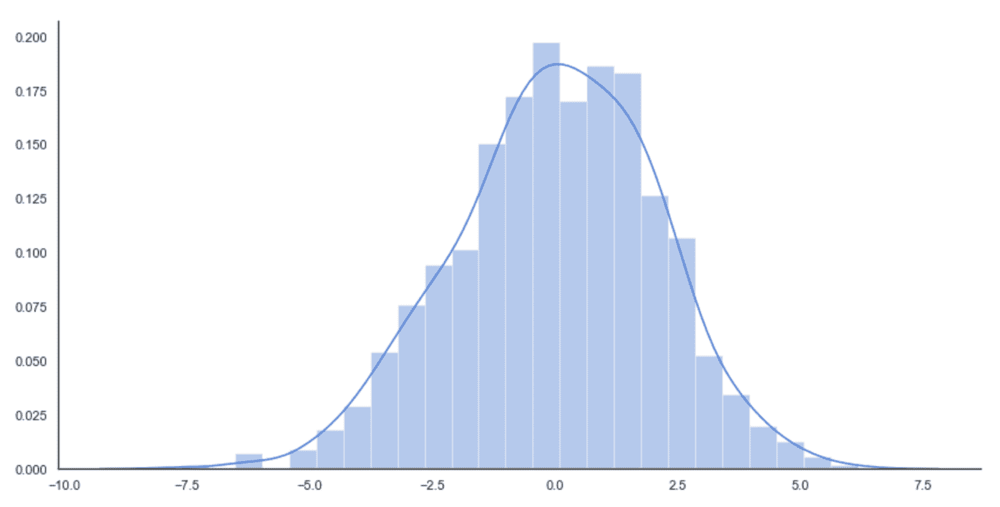

Original data generating process (solid line) and sampled data histogram

如果没有以完全统一的方式对训练集进行采样，或者训练集部分不均衡（某些类别的样本数量少于其他类别），或者模型易于拟合，则结果可能由不正确的分布表示，例如 如下：


Learned distribution

在这种情况下，模型被迫学习训练集的细节，直到它从分布中排除了许多潜在样本。 结果不再是高斯分布，而是双峰分布，其中某些概率错误地较低。 当然，测试和验证集是从训练集未涵盖的小区域中取样的（因为训练数据和验证数据之间没有重叠），因此该模型将无法提供完全错误的结果。

换句话说，我们可以说方差太大，因为该模型已学会使用太多的细节，从而在合理的阈值上增加了不同分类的可能性范围。 例如，人像分类器可能已经知道戴蓝眼镜的人在 30 至 40 岁之间总是男性（这是不现实的情况，因为详细程度通常很低，但是，了解问题的性质非常有帮助 ）。

我们可以这样概括：一个好的预测模型必须具有非常低的偏差和成比例的低方差。 不幸的是，通常不可能有效地最小化这两种措施，因此必须接受权衡。

具有良好泛化能力的系统很可能会具有较高的偏差，因为它无法捕获所有细节。 相反，高方差允许很小的偏差，但是模型的能力几乎仅限于训练集。 在本书中，我们不会讨论分类器，但您应该完全理解这些概念，以便始终了解在处理项目时可能遇到的不同行为。


# 规范分析


这样做的主要目的是回答以下问题：如何影响系统的输出？ 为了避免混淆，最好将此概念转换为纯机器学习语言，因此问题可能是要获得特定输出需要哪些输入值？

如前一部分所述，此阶段通常与预测分析合并在一起，因为模型通常用于两个任务。 但是，在某些特定情况下，预测仅限于*空输入*演变（例如在温度示例中），并且必须在说明阶段分析更复杂的模型。 主要原因在于能够控制造成特定输出的所有原因。

有时，在不必要时，仅对它们进行表面分析。 当原因不可控时（例如，气象事件），或者更简单地包括全局潜在参数集，都可能发生这种情况。 后一种选择在机器学习中非常常见，并且已经开发出许多算法来在存在潜在因素的情况下有效工作（例如 EM 或 SVD 推荐系统）。 因此，我们不关注这一特定方面（这在系统理论中非常重要），同时，我们隐式地假设我们的模型能够研究来自不同输入的许多可能的输出。

例如，在深度学习中，可以创建逆模型来生成输入空间的显着性图，从而强制使用特定的输出类。 考虑到肖像分类器的示例，我们可能会对发现哪些视觉元素会影响类的输出感兴趣。 诊断分析通常无效，因为原因非常复杂且其级别过低（例如，轮廓形状）。 因此，逆模型可以通过显示不同几何区域的影响来帮助解决说明性问题。 但是，完整的规范分析超出了本书的范围，在很多情况下，这是没有必要的，因此在接下来的章节中我们不会考虑这一步骤。 现在让我们分析不同类型的机器学习算法。


# 机器学习算法的类型


在这一点上，我们可以简要介绍不同类型的机器学习，重点介绍它们的主要特性和差异。 在以下各节中，我们将讨论非正式定义，然后是更正式的定义。 如果 您 不熟悉讨论中涉及的数学概念，则可以跳过详细信息。 但是，强烈建议您研究所有未知的理论元素，因为它们对于理解下一章中分析的概念至关重要。


# 监督学习算法


在有监督的情况下，模型的任务是找到样本的正确标签，假设已正确标记了训练集的存在，并且有可能将估计值与正确值进行比较。 术语**受监督**源自外部*教具*的概念，该教具在每次预测后提供准确而即时的反馈。 该模型可以使用这种反馈作为误差的度量，从而执行减少误差所需的校正。

更正式地说，如果我们假设数据生成过程，则数据集的获取方式为：


如上一节中所述，所有样本必须是独立于**且从数据生成过程中均匀采样的**（**IID**）值相等。 特别是，所有类别都必须代表实际分布（例如，如果 *p（y = 0）= 0.4* 和 *p（y = 1）= 0.6* ，则比例应为 40%  或 60% ）。 但是，为了避免偏差，当类别之间的差异不是很大时，合理的选择是完全均匀的采样，并且对于 *y = 1，2，...，M* 具有相同的代表数 ]。

通用分类器可以通过两种方式建模：

*   输出预测类的参数化函数
*   参数化的概率分布，为每个输入样本输出分类概率

在第一种情况下，我们有：

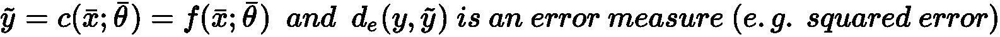

考虑整个数据集`X`，可以计算出全局成本函数`L`：


由于`L`仅取决于参数向量（ *x <sub class="calibre20">i</sub>* 和 *y <sub class="calibre20">i</sub>* 是常数），所以通用 算法必须找到使成本函数最小的最优参数向量。 例如，在**回归**问题（标签是连续的）中，误差度量可以是实际值和预测值之间的平方误差：

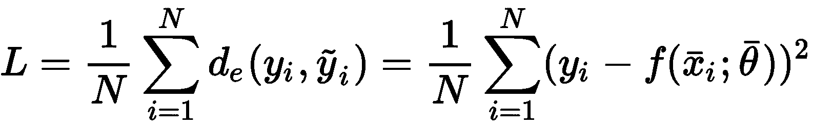

可以通过不同的方式（针对特定算法）优化这种成本函数，但是（在深度学习中最重要的）一种非常通用的策略是采用 S **随机梯度下降**（**SGD**）算法。 它包含以下两个步骤的迭代：

*   用一小批样本 *x <sub class="calibre20">i</sub> ∈X* 计算梯度 *∇L*（相对于参数矢量）
*   更新权重，并沿梯度*-∇L*的相反方向移动参数（请记住，梯度始终指向最大值）

相反，当分类器是概率分类器时，应将其表示为参数化的条件概率分布：


换句话说，分类器现在将在给定输入向量的情况下输出标签`y`的概率。 现在的目标是找到最佳参数集，它将获得：


在前面的公式中，我们将 *p <sub class="calibre20">数据</sub>* 表示为条件分布。 可以使用概率距离度量（例如 **Kullback-Leibler 发散 *D <sub class="calibre20">KL</sub>*** （始终为非负 *D <sub class="calibre20">KL</sub>* *≥*`0`和 *D <sub class="calibre20">KL</sub>* *=* *0 [* 仅在两个分布相同时）：


通过一些简单的操作，我们可以获得：


因此，所得成本函数对应于`p`和 *p <sub class="calibre20">数据</sub>* 之间的交叉熵之间的差，直到一个恒定值（数据生成的熵 处理）。 因此，训练策略现在基于使用一键编码来表示标签（例如，如果有两个标签 *0→（0，1）*和`1`*→（1，0）*，因此所有元素的总和必须始终等于`1`），并使用内在的概率输出（例如在逻辑回归中）或 softmax 过滤器 ，将`M`值转换为概率分布。

在这两种情况下，很明显*隐藏的教师*的存在提供了对错误的一致度量，从而允许模型相应地校正参数。 特别地，第二种方法对我们的目的非常有帮助，因此，如果未知，我建议您进一步研究（所有主要定义也可以在 *Bonaccorso G.，《机器学习算法》第二版，Packt， 2018* ）。

现在我们可以讨论监督学习的一个非常基本的例子，它是一种线性回归模型，可以用来预测简单时间序列的演变。


# 有监督的你好世界！


在此示例中，我们想显示如何对二维数据执行简单的线性回归。 特别是，假设我们有一个包含 100 个样本的自定义数据集，如下所示：

```py
import numpy as np
import pandas as pd

T = np.expand_dims(np.linspace(0.0, 10.0, num=100), axis=1)
X = (T * np.random.uniform(1.0, 1.5, size=(100, 1))) + np.random.normal(0.0, 3.5, size=(100, 1))
df = pd.DataFrame(np.concatenate([T, X], axis=1), columns=['t', 'x'])
```

We have also created a pandas `DataFrame` because it's easier to create plots using the seaborn library ([https://seaborn.pydata.org](https://seaborn.pydata.org)). In the book, the code for the plots (using Matplotlib or seaborn) is normally omitted, but it's always present in the repository.

我们希望以一种综合的方式表示数据集，如下所示：


可以使用线性回归算法来执行此任务，如下：

```py
from sklearn.linear_model import LinearRegression

lr = LinearRegression()
lr.fit(T, X)

print('x(t) = {0:.3f}t + {1:.3f}'.format(lr.coef_[0][0], lr.intercept_[0]))
```

最后一条命令的输出如下：

```py
x(t) = 1.169t + 0.628
```

我们还可以得到视觉确认，将数据集与回归线一起绘制，如下图所示：

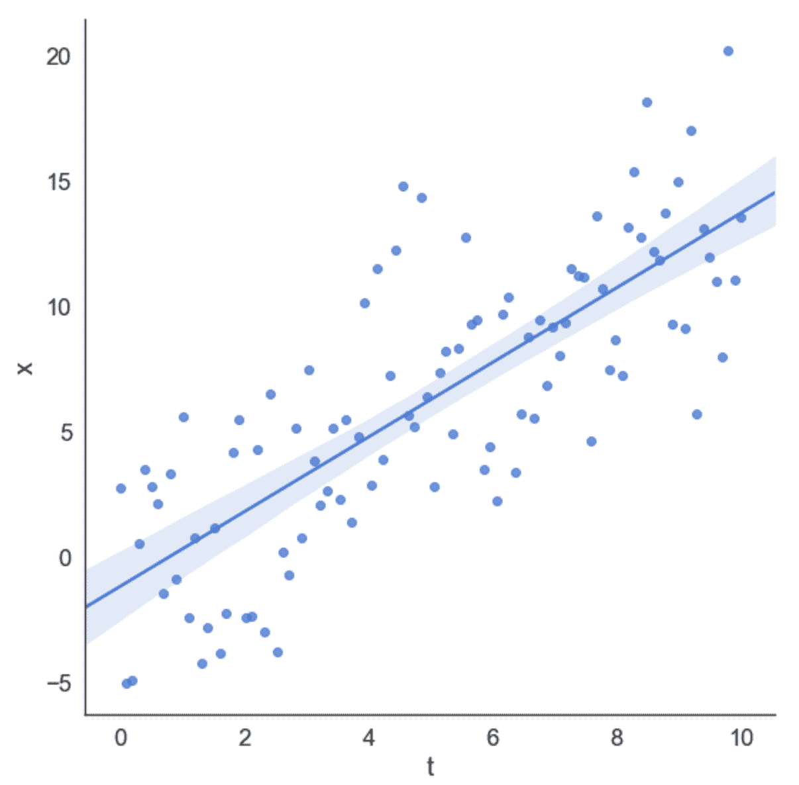

Dataset and regression line

在此示例中，回归算法将平方误差成本函数最小化，试图减小预测值与实际值之间的差异。 由于对称分布，高斯噪声（均值无效）对斜率的影响最小。


# 无监督学习算法


可以想象，在无监督的情况下，没有隐藏的老师，因此主要目标不能与最小化关于真实性的预测误差有关。 的确，在这种情况下，相同的基本事实概念的含义稍有不同。 实际上，在使用分类器时，我们希望训练样本出现空错误（这意味着除真实类别外，其他类别也永远不会被接受为正确的类别）。

相反，在一个无监督的问题中，我们希望模型在没有任何正式指示的情况下学习一些信息。 这种情况意味着只能学习样本本身中包含的元素。 因此，无监督算法通常旨在发现样本之间的相似性和模式，或者在给定一组从中得出的向量的情况下，再现输入分布。 现在让我们分析一些无监督模型的最常见类别。


# 聚类分析


**聚类分析**（通常简称为**聚类**）是一项任务的示例，我们希望在其中找到大量样本之间的共同特征。 在这种情况下，我们总是假设存在数据生成过程，并将数据集`X`定义为：

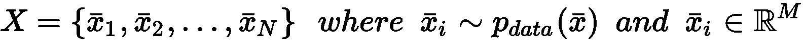

聚类算法基于隐式假设，即可以根据样本的相似性对样本进行分组。 特别地，给定两个向量，相似度函数定义为度量函数的倒数或倒数。 例如，如果我们在欧几里得空间中工作，则有：

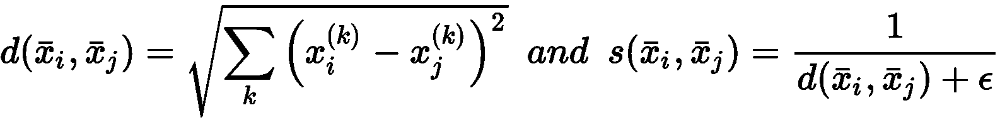

在先前的公式中，引入了常数*ε*以避免被零除。 显然 *d（a，c）< d（a，b）⇒s（a，c）> s（a，b）*。 因此，给定每个群集的代表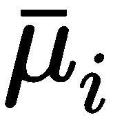，我们可以考虑以下规则来创建一组分配的向量：


换句话说，群集包含与所有其他代表相比与代表的距离最小的所有那些元素。 这意味着聚类包含与所有代表相比与代表的相似性最大的样本。 此外，分配后，样本将获得*权限*，以与同一集群的其他成员共享其功能。

实际上，聚类分析最重要的应用之一就是试图提高被认为相似的样本的同质性。 例如，推荐引擎可以基于用户向量的聚类（包含有关用户兴趣和购买产品的信息）。 一旦定义了组，就将属于同一群集的所有元素视为相似，因此我们被隐式授权*共享差异*。 如果用户`A`购买了产品`P`并给予正面评价，我们可以向未购买此产品的用户`B`推荐该产品，反之亦然 。 这个过程看似随意，但是当元素数量很大并且特征向量包含许多可区分元素（例如，等级）时，它会非常有效。


# 生成模型


另一种无监督的方法是基于**生成模型**的。 这个概念与我们已经讨论过的关于监督算法的概念没有很大不同，但是在这种情况下，数据生成过程不包含任何标签。 因此，目标是对参数化分布进行建模并优化参数，以使候选分布与数据生成过程之间的距离最小化：

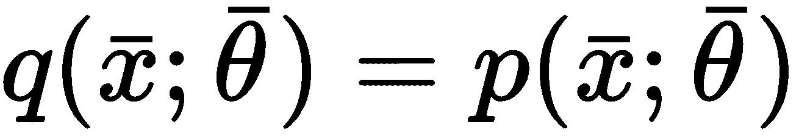

该过程通常基于 Kullback-Leibler 分歧或其他类似措施：

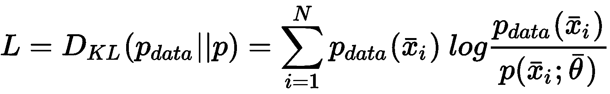

在训练阶段结束时，我们假设 *L→0* ，所以 *p≈p <sub class="calibre20">数据</sub>* 。 通过这种方式，我们不仅将分析限于可能的样本子集，还限于整个分布。 使用生成模型，您可以绘制新样本，这些样本可能与为训练过程选择的样本有很大差异，但是它们始终属于同一分布。 因此，它们（可能）始终是可接受的。

例如，**生成对抗网络**（**GAN**）是一种特殊的深度学习模型，能够学习图像集的分布，生成几乎无法区分的新样本（与 视觉语义的观点）。 由于无监督学习是本书的主要主题，因此在本简介中，我们将不再进一步介绍 GAN。 所有这些概念将在接下来的所有章节中进行广泛讨论（并带有实际示例）。


# 关联规则


我们正在考虑的最后一种无监督方法是基于**关联规则**的发现，它在数据挖掘领域中极为重要。 常见方案是由一组商品子集组成的商业交易的集合。 目的是找出产品之间最重要的关联（例如，购买 *P <sub class="calibre20">i</sub>* 和 *P <sub class="calibre20">j</sub>* 的概率为 70% ）。 特定算法可以有效地挖掘整个数据库，突出显示出于战略和物流目的可以考虑的所有关系。 例如，在线商店可以采用这种方法来促销经常与其他商品一​​起购买的所有那些商品。 此外，由于其他项目的销量增加，因此预测性方法可以通过建议所有极有可能售罄的产品来简化配置过程。

在这一点上，向读者介绍无监督学习的实际示例是有帮助的。 不需要特定的先决条件，但是最好具有概率论的基本知识。


# 无人监督的世界！


由于本书完全致力于无监督算法，因此我决定不将简单的聚类分析展示为一个“世界”！ 例如，而是相当基本的生成模型。 假设我们正在每小时监控一次到达地铁站的火车的数量，因为我们需要确定车站所需的安全代理的数量。 特别是，我们被要求每列火车至少有一名经纪人，每当火车数量减少时，我们将被罚款。

而且，在每个小时的开始发送一个组变得更容易，而不是一个个地控制代理。 因为问题很简单，所以我们也知道泊松分布很好，它是用*μ*参数化的泊松分布。 从理论上，我们知道，这种分布可以在独立性的主要假设下有效地模拟固定时间范围内发生的随机事件数。 在一般情况下，生成模型基于参数化分布（例如，使用神经网络），并且没有对其族做出特定假设。 仅在某些特定情况下（例如，高斯混合），才可以选择具有特定属性的分布，并且在不失严格性的前提下，我们可以将此示例视为这样的情况。

泊松分布的概率质量函数为：


此分布描述了在预定时间间隔内观察`k`事件的可能性。 在我们的案例中，间隔始终为一小时，因此我们非常希望估算观察 10 列以上火车的可能性。 如何获得*μ*的正确数字？

最常见的策略称为**最大似然估计**（**MLE**）。 它收集了一组观测值，并找到了 *μ*的值，该值最大化了通过我们的分布生成所有点的概率。

假设我们收集了 *N 个*观测值（每个观测值是一个小时内的到达次数），则*μ*的**可能性**相对于所有样本的概率就是 使用 *μ*计算的概率分布下的所有样本（为简单起见，假设为 IID）：

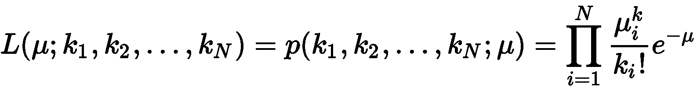

当我们使用乘积和指数运算时，计算**对数似然**是一条通用规则：


一旦计算出对数似然，就可以将*μ*的导数设置为 0，以找到最佳值。 在这种情况下，我们省略了证明（直接获得）并直接得出 *μ*的 MLE 估计：


我们很幸运！ MLE 估计值只是到达时间的平均值。 这意味着，如果我们观察到`N`值的平均值为 *μ*，则最有可能产生它们的泊松分布为*μ*作为特征系数。 因此，从这种分布中提取的任何其他样本将与观察到的数据集兼容。

现在，我们可以开始第一个模拟。 假设我们在一个工作日的午后收集了 25 个观测值，如下所示：

```py
import numpy as np

obs = np.array([7, 11, 9, 9, 8, 11, 9, 9, 8, 7, 11, 8, 9, 9, 11, 7, 10, 9, 10, 9, 7, 8, 9, 10, 13])
mu = np.mean(obs)

print('mu = {}'.format(mu))
```

最后一条命令的输出如下：

```py
mu = 9.12
```

因此，我们的平均到达速度约为每小时 9 列火车。 直方图如下图所示：

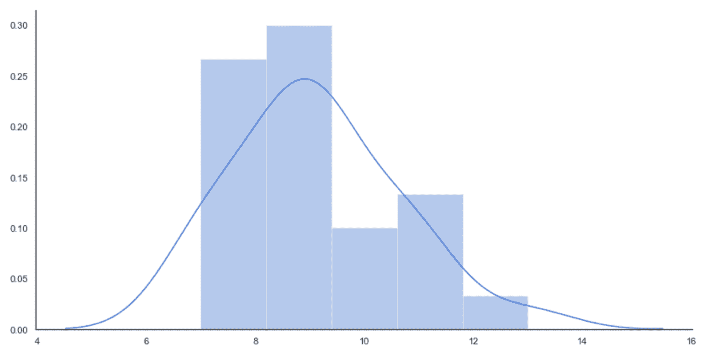

Histogram of the initial distribution

为了计算请求的概率，我们需要使用**累积分布函数**（**CDF**），该函数在 SciPy 中实现（在`scipy.stats`包中）。 特别是，由于我们对观测比固定值更多的火车的可能性感兴趣，因此有必要使用**生存函数**（**SF**），它对应于 *1- CDF* ，如下所示：

```py
from scipy.stats import poisson

print('P(more than 8 trains) = {}'.format(poisson.sf(8, mu)))
print('P(more than 9 trains) = {}'.format(poisson.sf(9, mu)))
print('P(more than 10 trains) = {}'.format(poisson.sf(10, mu)))
print('P(more than 11 trains) = {}'.format(poisson.sf(11, mu)))
```

前一个代码段的输出为，如下所示：

```py
P(more than 8 trains) = 0.5600494497386543
P(more than 9 trains) = 0.42839824517059516
P(more than 10 trains) = 0.30833234660452563
P(more than 11 trains) = 0.20878680161156604
```

不出所料，观察到 10 列以上火车的概率很低（30% ），并且派遣 10 个特工似乎并不合理。 但是，由于我们的模型是自适应的，因此我们可以继续收集观测值（例如，在清晨），如下所示：

```py
new_obs = np.array([13, 14, 11, 10, 11, 13, 13, 9, 11, 14, 12, 11, 12, 14, 8, 13, 10, 14, 12, 13, 10, 9, 14, 13, 11, 14, 13, 14])

obs = np.concatenate([obs, new_obs])
mu = np.mean(obs)

print('mu = {}'.format(mu))
```

*μ*的新值如下：

```py
mu = 10.641509433962264
```

现在平均每小时近 11 列火车。 假设我们已经收集了足够的样本（考虑所有潜在事故），我们可以重新估计概率，如下所示：

```py
print('P(more than 8 trains) = {}'.format(poisson.sf(8, mu)))
print('P(more than 9 trains) = {}'.format(poisson.sf(9, mu)))
print('P(more than 10 trains) = {}'.format(poisson.sf(10, mu)))
print('P(more than 11 trains) = {}'.format(poisson.sf(11, mu)))
```

输出为，如下所示：

```py
P(more than 8 trains) = 0.7346243910180037
P(more than 9 trains) = 0.6193541369812121
P(more than 10 trains) = 0.49668918740243756
P(more than 11 trains) = 0.3780218948425254
```

使用新的数据集，观察到 9 列以上火车的概率约为 62% （这证实了我们的最初选择），但是现在观察到 10 列以上火车的概率约为 50%。 由于我们不想冒险支付罚款（高于代理商的费用），因此最好派出一组 10 名代理商。 为了进一步确认，我们决定从分布中抽取 2,000 个值，如下所示：

```py
syn = poisson.rvs(mu, size=2000)
```

下图显示了相应的直方图：

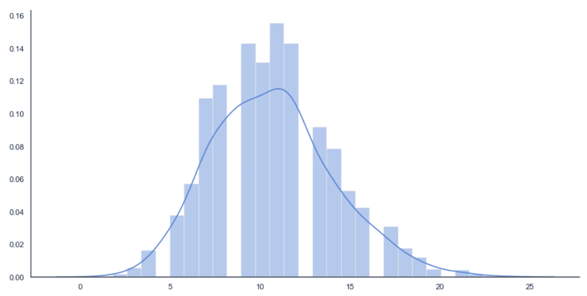

Histogram of 2000 points sampled from the final Poisson distribution

该图确认了在 10 点（非常接近 11）之后的一个峰值，并且从 *k = 13* 开始快速衰减，这已经使用有限的数据集发现了（比较直方图的形状以进一步确认） 。 但是，在这种情况下，我们将生成观察集中无法存在的潜在样本。 MLE 保证概率分布与数据一致，并对新样本进行相应加权。 这个例子显然非常简单，它的目标只是显示生成模型的动态。

在本书的下一章中，我们将讨论许多其他更复杂的模型和示例。 许多算法共有的一项重要技术不是选择预定义的分布（这意味着先验知识），而是使用灵活的参数模型（例如神经网络）来找出最佳分布。 仅当对基础随机过程有较高的置信度时，才有理由选择预定义的先验。 在所有其他情况下，总是最好避免任何假设，而仅依赖于数据，以便找到数据生成过程的最合适的近似值。


# 半监督学习算法


半监督场景可以看作是一种标准的监督场景，它利用了属于非监督学习技术的某些功能。 实际上，很容易获得大型未标记数据集，但标记成本却很高，这会引起一个非常普遍的问题。 因此，合理的做法是只标记一小部分样本，并将标记传播到与标记样本的距离低于预定义阈值的所有未标记样本。 如果数据集是从单个数据生成过程中提取的，并且标记的样本是均匀分布的，则半监督算法可以实现与监督算法相当的准确性。 在本书中，我们不会讨论这些算法。 但是，简要介绍两个非常重要的模型会有所帮助：

*   标签传播
*   半监督支持向量机

第一个称为**标签传播**，其目标是将一些样本的标签传播到更大的人群。 通过考虑一个图形来实现此目标，其中每个顶点代表一个样本，并且使用距离函数对每个边缘进行加权。 通过迭代过程，所有标记的样本将一部分标记值发送给所有邻居，并重复该过程，直到标记停止更改为止。 该系统具有稳定点（即，不能再进化的配置），并且算法可以通过有限的迭代次数轻松达到目标。

在所有可以根据相似性度量标记样本的情况下，标记传播都非常有用。 例如，在线商店可能有大量的客户群，但是只有 10% 的顾客公开了自己的性别。 如果特征向量足够丰富，可以代表男性和女性用户的常见行为，则可以使用标签传播算法来猜测尚未公开的用户性别。 当然，重要的是要记住，所有分配均基于类似样品具有相同标签的假设。 在许多情况下这可能是正确的，但是当特征向量的复杂性增加时，也会产生误导。

半监督算法的另一个重要系列是基于将标准 **SVM** （ **Support Vector Machine** 的缩写）扩展到包含未标记样本的数据集。 在这种情况下，我们不想传播现有标签，而是传播分类标准。 换句话说，我们要使用标记的数据集训练分类器，并将判别规则也扩展到未标记的样本。

与只能评估未标记样本的标准程序相反，半监督 SVM 使用它们来校正分离的超平面。 该假设始终基于相似性：如果`A`的标签为`1`，而未标签的样品`B`的标签为 *d（A，B）* <ε（其中 *ε*是预定义的阈值），可以合理地假设`B`的标签也是`1`。 这样，即使仅手动标记了一个子集，分类器也可以在整个数据集上实现高精度。 与标签传播类似，仅当数据集的结构不是非常复杂时，尤其是当相似性假设成立时，这类模型才是可靠的（不幸的是，在某些情况下，很难找到合适的距离度量，因此 许多相似的样本的确不同，反之亦然）。


# 强化学习算法


强化学习方案可以看作是一种有监督的方案，其中隐藏的老师在模型的每个决定之后仅提供近似的反馈。 更正式地讲，强化学习的特征在于主体与环境之间的持续交互。 前者负责制定决策（行动），并最终确定其结果以增加回报，而后者则负责为每项行动提供反馈。 反馈通常被认为是一种奖励，其价值可以是积极的（行动已经成功）或消极的（行动不应重复）。 当代理分析环境（状态）的不同配置时，必须将每个奖励都视为绑定到元组（动作，状态）。 因此，最终目标是找到一个最大化预期总回报的策略（一种建议在每个州采取最佳行动的策略）。

强化学习的一个非常经典的例子是学习如何玩游戏的代理。 在情节期间，代理会在所有遇到的状态下测试动作并收集奖励。 一种算法会纠正该策略，以减少非积极行为（即那些奖励为正的行为）的可能性，并增加在情节结束时可获得的预期总奖励。

强化学习有许多有趣的应用，而不仅限于游戏。 例如，推荐系统可以根据用户提供的二进制反馈（例如，拇指向上或向下）来校正建议。 强化学习和监督学习之间的主要区别是环境提供的信息。 实际上，在有监督的情况下，校正通常与校正成比例，而在强化学习中，必须考虑一系列操作和将来的奖励来进行分析。 因此，校正通常基于预期奖励的估计，并且其效果受后续操作的值影响。 例如，一个受监督的模型没有记忆，因此它的修正是即时的，而强化学习代理必须考虑情节的部分推出，以便确定一个动作是否实际上是负面的。

强化学习是机器学习的一个有趣的分支。 不幸的是，该主题超出了本文的讨论范围，因此我们不对其进行详细讨论（您可以在*使用 Python 进行动手强化学习，Ravichandiran S。，  Packt 出版中找到更多详细信息）。 ，* 2018 和 *Mastering Machine Learning Algorithms，Bonaccorso G。，  Packt Publishing，* 2018）。

现在，我们可以简要地解释一下为什么选择 Python 作为这种探索无监督学习世界的主要语言。


# 为什么将 Python 用于数据科学和机器学习？


在继续进行更多技术讨论之前，我认为解释 Python 作为本书编程语言的选择会有所帮助。 在过去的十年中，数据科学和机器学习领域的研究呈指数增长，拥有数千篇有价值的论文和数十种完善的工具。 特别是由于 Python 的高效性，美观性和紧凑性，许多研究人员和程序员都选择使用 Python 创建一个完整的科学生态系统，该生态系统已免费发布。

如今，诸如 scikit-learn，SciPy，NumPy，Matplotlib，pandas 之类的软件包代表了数百种可用于生产环境的系统的骨干，并且其使用量还在不断增长。 此外，复杂的深度学习应用程序（例如 Theano，TensorFlow 和 PyTorch）允许每个 Python 用户创建和训练复杂模型而没有任何速度限制。 实际上，必须注意 Python 不再是脚本语言。 它支持许多特定任务（例如，Web 框架和图形），并且可以与用 C 或 C ++编写的本机代码进行接口。

由于这些原因，Python 几乎是所有数据科学项目中的最佳选择，并且由于其功能，所有具有不同背景的程序员都可以轻松地学会在短时间内有效地使用它。 也可以使用其他免费解决方案（例如 R，Java 或 Scala），但是，在 R 的情况下，可以完全涵盖统计和数学函数，但缺少构建完整应用程序所必需的支持框架。 相反，Java 和 Scala 具有完整的可用于生产环境的库生态系统，但是特别是 Java 不像 Python 那样紧凑且易于使用。 而且，对本机代码的支持要复杂得多，并且大多数库都完全依赖 JVM（从而导致性能损失）。

由于 Scala 的功能特性和 Apache Spark 等框架的存在（可用于执行大数据的机器学习任务），Scala 在大数据全景图中获得了重要的地位。 但是，考虑到所有优点和缺点，Python 仍然是最佳选择，这就是为什么它被选为本书的原因。


# 概要


在本章中，我们讨论了证明采用机器学习模型合理的主要原因，以及如何分析数据集以描述其特征，列举特定行为的原因，预测未来行为并对其产生影响。

我们还重点研究了前两个模型，探讨了有监督，无监督，半监督和强化学习之间的差异。 我们还使用了两个简单的示例来了解监督和非监督方法。

在下一章中，我们将介绍聚类分析的基本概念，并将讨论重点放在一些非常著名的算法上，例如 K 均值和 **K 最近邻**（**KNN**） ，以及最重要的评估指标。


# 问题


1.  当不适用监督学习时，无监督学习是最常见的选择。 这是正确的吗？
2.  您公司的首席执行官要求您找出确定负面销售趋势的因素。 您需要执行哪种分析？

3.  给定独立样本的数据集和候选数据生成过程（例如，高斯分布），可通过对所有样本的概率求和来获得可能性。 它是正确的？
4.  在哪种假设下，可能性可以作为单个概率的乘积来计算？
5.  假设我们有一个包含一些未知数字特征（例如年龄，分数等）的学生数据集。 您想将男性和女性学生分开，因此决定将数据集分为两组。 不幸的是，这两个集群大约都有 50% 的男生和 50% 的女生。 您如何解释这个结果？
6.  考虑前面的示例，但重复该实验并将其分为五个组。 您希望在其中每个中找到什么？ （列出一些合理的可能性。）
7.  您已经将在线商店的客户聚集在一起。 给定一个新样本，您可以做出什么样的预测？


# 进一步阅读


*   *机器学习算法第二版*， *Bonaccorso G.* ， *Packt Publishing* ，2018
*   *使用 Python 进行动手强化学习*， *Ravichandiran S.* ， *Packt* *发布*，2018 年
*   *使用 NumPy 和熊猫进行动手数据分析*， *Miller C.* ， *Packt 出版*，2018 年


