# 聚类基础


在本章中，我们将介绍聚类分析的基本概念，将注意力集中在许多算法共有的主要原理以及可用于评估方法性能的最重要技术上。

特别是，我们将讨论：

*   聚类和距离函数简介
*   K 均值和 K 均值++
*   评估指标
*   **最近的邻居**（ **KNN** ）
*   **矢量量化**（ **VQ** ）


# 技术要求


本章中提供的代码要求：

*   Python 3.5+（强烈建议您使用 Anaconda 发行版： [https://www.anaconda.com/distribution/](https://www.anaconda.com/distribution/) [](https://www.anaconda.com/download/)）
*   库：
    *   科学 0.19+
    *   NumPy 1.10+
    *   scikit 学习 0.20+
    *   熊猫 0.22+
    *   Matplotlib 2.0+
    *   海上 0.9+

该数据集可以通过 UCI 获得。 可以从 [https://archive.ics.uci.edu/ml/machine-learning-databases/breast-cancer-wisconsin/wdbc.data](https://archive.ics.uci.edu/ml/machine-learning-databases/breast-cancer-wisconsin/wdbc.data) 下载 CSV 文件，并且不需要任何预处理 用于添加在加载阶段将出现的列名。

这些示例可在 GitHub 存储库上找到：

[https://github.com/PacktPublishing/HandsOn-Unsupervised-Learning-with-Python/Chapter02](https://github.com/PacktPublishing/HandsOn-Unsupervised-Learning-with-Python/tree/master/Chapter02) 。


# 集群介绍


如我们在[第 1 章](../Text/01.html)和*无监督学习*入门中所述，聚类分析的主要目标是根据相似性度量或接近性标准对数据集的元素进行分组。 在本章的第一部分中，我们将专注于前一种方法，而在第二部分和下一章中，我们将分析利用数据集其他几何特征的更多通用方法。

让我们进行一个数据生成过程 *p <sub class="calibre20">数据</sub>（x）*，并从中抽取 *N* 个样本：


可以假设 *p <sub class="calibre20">数据</sub>（x）*的概率空间可划分为包含 *K* 的（可能无限）配置（对于 *K = 1 ，2，...，*区域，这样 *p <sub class="calibre20">数据</sub>（x; k）*表示样本属于簇 *k* 的概率。 以这种方式，我们指出，当确定 *p <sub class="calibre20">数据</sub>（x）*时，每个可能的聚类结构已经存在。 可以对聚类概率分布做出进一步的假设，以更好地近似 *p <sub class="calibre20">数据</sub>（x）*（我们将在[第 5 章](../Text/05.html)和[HTG24 软聚类和高斯混合模型）。 但是，当我们尝试将概率空间（和相应的样本）划分为内聚组时，我们可以假设两种可能的策略：

*   **硬聚类**：在这种情况下，每个样本 *x <sub class="calibre20">p</sub> ∈X* 被分配给一个聚类 *K <sub class="calibre20">i</sub>* 对于 *i≠j* ， *K <sub class="calibre20">i</sub> ∩K <sub class="calibre20">j</sub> =∅*。 我们将要讨论的大多数算法都属于这一类。 在这种情况下，问题可以表示为将聚类分配给每个输入样本的参数化函数：

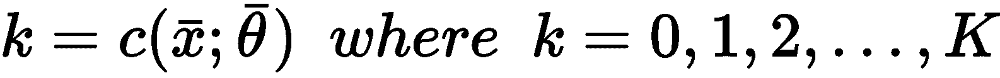

*   **软聚类**：通常将其细分为**概率**和**模糊**聚类，这种方法确定了每个样本的概率 *p（x）* 属于预定簇的 *x <sub class="calibre20">p</sub>* *∈X* 。 因此，如果存在 *K* 个簇，我们就有一个概率向量 *p（x）= [p <sub class="calibre20">1</sub> （x），p <sub class="calibre20">2</sub> （x ），...，p <sub class="calibre20">k</sub> （x）]* ，其中 *p <sub class="calibre20">i</sub> （x）*表示分配给群集的概率 *i* 。 在这种情况下，聚类不是不相交的，通常，样本将属于*隶属度*等于概率的所有聚类（此概念是模糊聚类所特有的）。

出于我们的目的，在本章中，我们仅假设数据集 *X* 来自数据生成过程，该过程的空间在给定度量函数的情况下可分为彼此分离的紧凑区域。 实际上，我们的主要目标是找到满足**最大内聚力**和**最大分离**双重特征的 *K* 簇。 在讨论 K-means 算法时，这个概念会更清楚。 但是， 可能将 想象为斑点，其密度远远高于将它们隔开两个或多个的空间中可观察到的斑点，如下图所示：


Bidimensional clustering structure obeying the rule of maximum cohesion and maximum separation. N<sub class="calibre26">k</sub> represents the number of samples belonging to the cluster k while N<sub class="calibre26">out</sub>(r) is the number of samples that are outside the balls centered at each cluster center with a maximum radius r

在上图中，我们假设考虑到样本到中心的最大距离，所以大多数样本将被一个球捕获。 但是，由于我们不想对球的生长施加任何限制（也就是说，它可以包含任意数量的样本），因此最好不要考虑半径并通过对（ 整个空间）并收集它们的密度。

在理想情况下，簇跨越一些子区域，其密度为 *D* ，而分隔区域的特征为密度 *d < < D* 。 关于几何特性的讨论可能变得非常复杂，并且在许多情况下，这是非常理论性的。 今后，我们仅考虑属于不同聚类的最近点之间的距离。 如果此值远小于所有聚类的样本与其聚类中心之间的最大距离，则可以确保分离有效，并且很容易区分聚类和分离区域。 相反，当使用距离度量（例如，以 K 均值表示）时，，我们需要考虑的另一个重要要求是聚类的**凸度**。 如果*∀x <sub class="calibre20">1</sub> ，x <sub class="calibre20">2</sub> ∈C* 且属于连接[ *x <sub class="calibre20">1</sub>* 和 *x <sub class="calibre20">2</sub>* 属于 *C* 。 在下图中，对凸和非凸（凹）簇进行了比较：

Example of a convex cluster (left) and a concave one (right)

不幸的是，由于距离函数的对称性，诸如 K 均值之类的算法无法管理非凸类。 在我们的探索中，我们将展示此限制以及其他方法如何克服它。


# 距离功能


即使聚类的一般定义通常基于**相似度**的概念，也很容易采用它的反函数，它由**距离函数**（相异性度量）表示。 最常见的选择是**欧几里德距离**，但是在选择它之前，必须考虑它的属性及其在高维空间中的行为。 让我们开始介绍 **Minkowski 距离**作为欧几里得距离的推广。 如果样本是 *x <sub class="calibre20">i</sub> ∈ <sup class="calibre27">N</sup>* ，则其定义为：

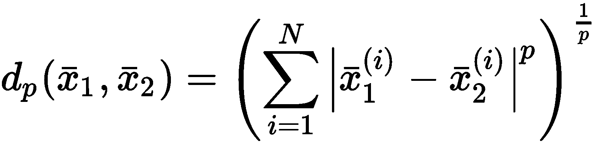

对于 *p = 1* ，我们获得**曼哈顿**（或**城市街区**）的距离，而 *p = 2* 对应于标准欧几里得距离 。 我们想了解当 *p→∞*时 *d <sub class="calibre20">p</sub>* 的行为。 假设我们在二维空间中工作，并且有一个簇，其中心是 *x <sub class="calibre20">c</sub> =（0，0）*，并且采样点 *x =（5，3 ）*，相对于 *p* 不同值的距离 *d <sub class="calibre20">p</sub> （x <sub class="calibre20">c</sub> ，x）*为：


很明显（并且很容易证明），如果 *| x <sub class="calibre20">1</sub> <sup class="calibre27">j</sup> - x <sub class="calibre20">2</sub> <sup class="calibre27">j [</sup> |* 是最大的组件绝对差， *p→∞*， *d <sub class="calibre20">p</sub> （x <sub class="calibre20">c</sub> ，x）→| x [ <sub class="calibre20">1</sub> <sup class="calibre27">j</sup> -x <sub class="calibre20">2</sub> <sup class="calibre27">j</sup> |* 。 这意味着，如果考虑由于所有组件的差异而导致的相似性（或相异性），则需要为 p 选择一个较小的值（例如 *p = 1* 或 *2* ）。 另一方面，如果必须仅根据组件之间的最大绝对差将两个样本视为不同，则 *p* 的较高值是合适的。 通常，此选择非常依赖于上下文，并且不能轻易概括。 为了我们的目的，我们通常只考虑欧几里得距离，这在大多数情况下是合理的。 另一方面，当 *N→∞*时，为 *p* 选择更大的值具有重要的意义。 让我们从一个例子开始。 我们要测量 *1N* -矢量 （属于*ℜ <sup class="calibre27">N</sup>* 且所有分量均等于*的向量）之间的距离 对于不同的 *p* 和 *N* 值（使用对数标度压缩 *y* 轴），从原点起 1* 即可。 如下：

```py
import numpy as np

from scipy.spatial.distance import cdist

distances = np.zeros(shape=(8, 100))

for i in range(1, distances.shape[0] + 1):
    for j in range(1, distances.shape[1] + 1):
        distances[i - 1, j - 1] = np.log(cdist(np.zeros(shape=(1, j)), np.ones(shape=(1, j)), 
                                               metric='minkowski', p=i)[0][0])
```

距离如下图所示：

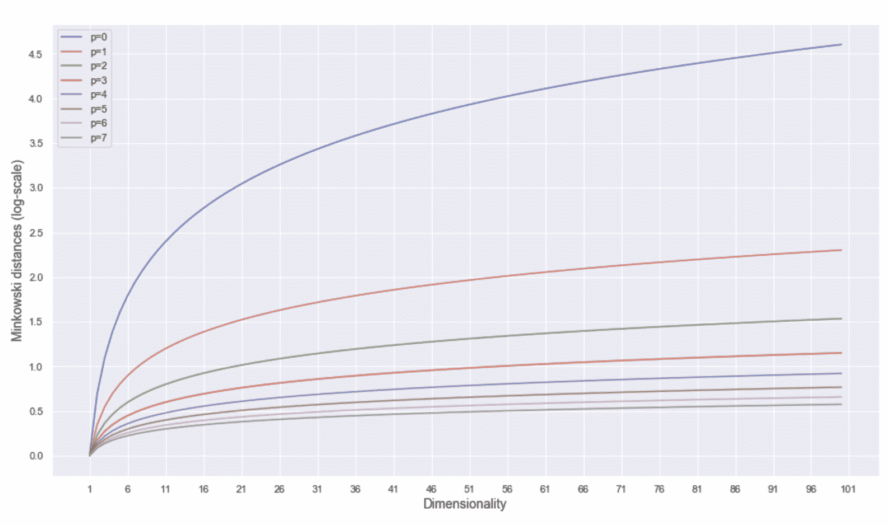

Minkowski distances (log-scale) for different values of p and N

第一个结果是，如果我们选择 *N* 的值，则当 *p→∞*时，距离收缩并饱和。 这是 Minkowski 距离结构的正常结果，但敏锐的读者可能会注意到另一个要素。 让我们想象一下将 *1N* -vector 的成分之一设置为等于 *0.0* 。 这等效于从 *N* 维超立方体的顶点移动到另一个顶点。 距离会怎样？ 好吧，用一个例子很容易证明，当 *p→∞*时，两个距离收敛到相同的值。 特别是 Aggarwal，Hinneburg 和 Keim （在 *中，关于高度量空间中距离度量的惊人行为，Aggarwal CC，Hinneburg A.，Keim DA，ICDT* 2001 ）被证明是重要的结果。

假设我们有 *M* 个二元样本的分布 *p（x）* *x <sub class="calibre20">i</sub> ∈（0，1） <sup class="calibre27">d</sup>* 。 如果采用 Minkowski 度量，则可以计算最大值（ *D <sub class="calibre20">max</sub> <sup class="calibre27">p</sup>* ）和最小值（ *D <sub class="calibre20">min</sub> [ <sup class="calibre27">p</sup>* ）从 *p（x）*采样的两个点与原点之间的距离（通常，该距离可以通过解析来计算，但是也可以使用迭代程序 继续采样，直到 *D <sub class="calibre20">max</sub> <sup class="calibre27">p</sup>* 和 *D <sub class="calibre20">min</sub>* <sup class="calibre27">*p*</sup> 停止更改）。 作者证明以下不等式成立：

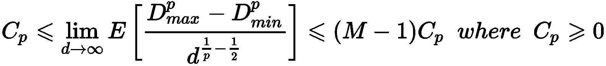

在先前的公式中， *C <sub class="calibre20">p</sub>* 是取决于 *p* 的常数。 当 *p→∞*时，期望值 *E [D <sub class="calibre20">max</sub> <sup class="calibre27">p</sup> -D <sub class="calibre20">min</sub> <sup class="calibre27">p</sup> ]* i 在边界 *k <sub class="calibre20">1</sub> C <sub class="calibre20">p</sub> d <sup class="calibre27">1 / p- 1/2</sup>* 和*（M-1）C <sub class="calibre20">p</sub> d <sup class="calibre27">1 / p-1 / 2</sup>* 。 当 *p > 2* 和 *d→∞时，术语 *d <sup class="calibre27">1 / p-1 / 2</sup> →0** ，最大和最小距离之差的期望值收敛到 *0* 。 这意味着，独立于样本，当维数足够高且 *p > 2* 时，几乎不可能使用 Minkowski 距离来区分两个样本。 当我们发现距离函数的相似性时，该定理警告我们选择 *d > > 1* 时选择 *p* 较大的值。 当 *d > > 1* （即使 *p = 1* 是最佳选择）时，欧几里德度量标准的常用选择也相当可靠 组件的重量（可以假定它们具有相同的重量），并保证在高维空间中的可区分性。 相反，高维空间中的 *p > > 2* 对于所有最大分量保持固定而所有其他分量都被修改的样本，则产生无法区分的距离（例如，如果 *x =（5，0）→（5，a）*，其中 *|* *a | < 5* ），如以下示例所示 ：

```py
import numpy as np

from scipy.spatial.distance import cdist

distances = []

for i in range(1, 2500, 10):
    d = cdist(np.array([[0, 0]]), np.array([[5, float(i/500)]]), metric='minkowski', p=15)[0][0]
    distances.append(d)

print('Avg(distances) = {}'.format(np.mean(distances)))
print('Std(distances) = {}'.format(np.std(distances)))
```

输出如下：

```py
Avg(distances) = 5.0168687736484765
Std(distances) = 0.042885311128215066
```

因此，对于`p = 15`，对于 *x∈[0.002，5.0）*的所有样本*（5，x）*与原点之间的距离均值约为`5.0`和标准差 关于`0.04`。 当`p`变大时，`Avg(distances) = 5.0` 和`Std(distances) = 0.04` 。

在这一点上，我们可以开始讨论一种最常见且被广泛采用的聚类算法：K-means。


# K 均值


**K-均值**是最大分离和最大内部凝聚力原理的最简单实现。 假设我们有一个数据集 *X∈ <sup class="calibre27">M×N</sup>* （即 *MN* 维样本），我们希望将其拆分为 *K* 簇和一组 *K* **重心**，它们对应于分配给每个簇 *K <sub class="calibre20">j</sub>* 的样本均值：


集合 *M* 和质心具有一个附加索引（作为上标），指示迭代步骤。 从初始猜测 *M <sup class="calibre27">（0）</sup>* 开始，K-means 尝试最小化称为**惯性**的目标函数（即总平均集群内距离） 分配给簇 *K <sub class="calibre20">j</sub>* 和其质心*μ <sub class="calibre20">j</sub>* 的样本之间）：

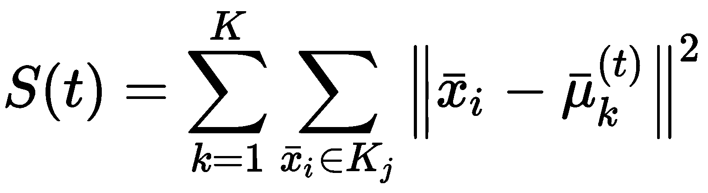

不难理解， *S（t）*不能被视为绝对度量，因为其值在很大程度上受样本方差的影响。 但是， *S（t + 1）< S（t）*表示质心正在靠近最佳位置，在最佳位置，分配给聚类的点与相应质心的距离最小。 因此，迭代过程（也称为 **Lloyd 算法**）开始于使用随机值初始化 *M <sup class="calibre27">（0）</sup>* 。 下一步是将每个样本 *x <sub class="calibre20">i</sub> ∈X* 分配给其质心与 *x <sub class="calibre20">i [</sub>* ：

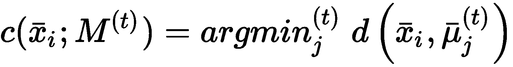

完成所有分配后，将重新计算新的质心作为算术方法：


重复该过程，直到质心停止变化为止（这也意味着序列 *S（0）>* *S（1）> ... > S（t <sub class="calibre20">末端</sub>）*）。 读者应该立即了解到，计算时间受初始猜测的影响很大。 如果 *M <sup class="calibre27">（0）</sup>* 非常接近 *M <sup class="calibre27">（t <sub class="calibre28">端</sub>）</sup>* ，则可以找到一些迭代 最佳配置。 相反，当 *M <sup class="calibre27">（0）</sup>* 纯粹是随机的时，无效初始选择的概率接近 *1* （也就是说，每个初始均匀随机选择为 在计算复杂度方面几乎相等）。


# K-均值++


找到最佳的初始配置等同于最小化惯性。 但是， Arthur 和 Vassilvitskii（在 *K-means ++：精心播种的优势中，Arthur D.，Vassilvitskii S。，  ACM-SIAM 第 18 届年度学术会议论文集 离散算法，* 2007）提出了另一种初始化方法（称为 **K-means ++** ），该方法可以通过选择初始质心的可能性大得多，从而提高收敛速度，而初始质心的概率接近最终质心。 完整的证明非常复杂，可以在前述论文中找到。 在这种情况下，我们直接提供最终结果和一些重要后果。

让我们考虑定义为的函数 *D（•）*：

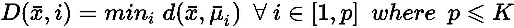

*D（•）*表示样本 *x∈X* 与已选择的质心之间的最短距离。 一旦函数被计算，就可以如下确定概率分布 *G（x）*：


从均匀分布中采样第一个质心*μ <sub class="calibre20">1</sub>* 。 此时，可以为所有样本 *x∈X* 计算 *D（•）*，因此，可以计算出分布 *G（x）*。 直截了当，如果我们从 *G（x）*进行采样，那么在稠密区域中选择值的概率要比在均匀区域中均匀采样或选取质心的概率大得多。 因此，我们继续从 *G（x）*中采样*μ <sub class="calibre20">2</sub>* 。 重复该过程，直到确定所有 *K* 重心。 当然，由于这是一种概率方法，因此我们无法保证最终配置是最佳的。 但是，使用 K-means ++是 *O（log K）具有竞争力的*。 实际上，如果 *S <sub class="calibre20">选择</sub>* 是 *S* 的理论最优值，则作者证明存在以下不等式：


由于通过更好的选择降低了 *S* ，因此先前的公式设置了与 *log K* 大致成比例的期望值 *E [S]* 的上限。 例如，对于 *K = 10* ， *E [S]  19.88 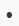 S <sub class="calibre20"> opt </sub>* 和 *E [S]  12.87  S  <sub class="calibre20">选择</sub>* 为 *K = 3* 。 该结果揭示了两个重要因素。 第一个是当 *K* 不太大时，K-means ++的性能会更好；第二个（可能也是最重要的）是，单个 K-means ++初始化不足以获取最佳配置。 因此，常见的实现（例如 scikit-learn）执行可变数量的初始化，并选择初始惯量最小的初始化。


# 乳腺癌威斯康星州数据集分析


在本章中，我们使用著名的**乳腺癌威斯康星州数据集**进行聚类分析。 最初，提出数据集是为了训练分类器。 但是，这对于非平凡的聚类分析非常有帮助。 它包含由 32 个属性（包括诊断和标识号）组成的 569 条记录。 所有属性都与肿瘤的生物学和形态学特性严格相关，但是我们的目标是考虑基本事实（良性或恶性）和数据集的统计特性来验证通用假设。 在继续之前，弄清楚一些要点很重要。 数据集是高维的，聚类是非凸的（因此我们不能期望有完美的分割）。 此外，我们的目标不是使用聚类算法来获得分类器的结果； 因此，必须仅将地面真实情况作为潜在分组的一般指示。 该示例的目的是演示如何执行简短的初步分析，选择最佳数量的聚类以及验证最终结果。

下载后（如技术要求部分所述），CSV 文件必须放在我们通常表示为`<data_folder>`的文件夹中。 第一步是加载数据集，并通过熊猫`DataFrame`暴露的函数`describe()`进行全局统计分析，如下所示：

```py
import numpy as np
import pandas as pd

bc_dataset_path = '<data_path>\wdbc.data'

bc_dataset_columns = ['id','diagnosis', 'radius_mean', 'texture_mean', 'perimeter_mean', 
 'area_mean', 'smoothness_mean', 'compactness_mean', 'concavity_mean', 
 'concave points_mean', 'symmetry_mean', 'fractal_dimension_mean',
 'radius_se','texture_se', 'perimeter_se', 'area_se', 'smoothness_se', 
 'compactness_se', 'concavity_se', 'concave points_se', 'symmetry_se', 
 'fractal_dimension_se', 'radius_worst', 'texture_worst', 'perimeter_worst', 
 'area_worst', 'smoothness_worst', 'compactness_worst', 'concavity_worst',
 'concave points_worst', 'symmetry_worst', 'fractal_dimension_worst']

df = pd.read_csv(bc_dataset_path, index_col=0, names=bc_dataset_columns).fillna(0.0)
print(df.describe())
```

我强烈建议使用 Jupyter Notebook（在这种情况下，命令必须仅是`df.describe()`），所有命令都将产生内联输出。 出于实际原因，在以下屏幕截图中，显示了表格输出的第一部分（包含八个属性）：

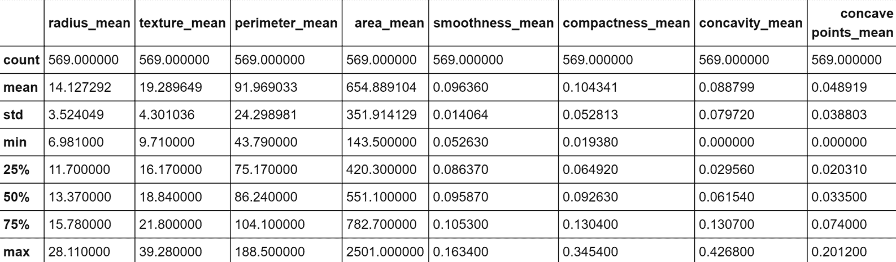

Statistical report of the first eight attributes of the dataset

当然，即使我们仅将注意力集中在子集上，我也请读者检查所有属性的值。 特别是，我们需要观察前八个属性之间存在的不同尺度。 标准偏差的范围是 0.01 到 350，这意味着仅由于一个或两个属性，许多矢量可能极其相似。 另一方面，使用方差缩放对值进行归一化将赋予所有属性相同的责任（例如`143.5`和`2501`之间的界限为`area_mean`，而`0.05`和`smoothness_mean`之间的界限为`smoothness_mean`。 强迫它们具有相同的方差会影响因素的生物学影响，并且由于我们没有任何具体的指示，因此我们没有*授权*做出这样的选择）。 显然，某些属性在聚类过程中将具有更高的权重，我们将它们的主要影响视为与上下文相关的条件。

让我们现在开始考虑`perimeter_mean`，`area_mean`，`smoothness_mean`，`concavity_mean`和`symmetry_mean`的对图的初步分析。 该图显示在以下屏幕截图中：


Pair-plot of perimeter mean, area mean, smoothness mean, concavity mean, and symmetry mean

该图将每个非对角线属性绘制为其他所有属性的函数，而对角线图则表示每个属性分为两个部分的分布（在这种情况下，这就是诊断）。 因此，第二个非对角线图（左上图）是`perimeter_mean`作为`area_mean`的函数的图，依此类推。 快速分析突出了一些有趣的元素：

*   `area_mean`和`perimeter_mean`具有明确的相关性，并确定了清晰的间隔。 当`area_mean`大于约 1,000 时，显然周长也会增加，并且诊断会从良性突然转变为恶性。 因此，这两个属性是最终结果的决定因素，并且其中之一很可能是多余的。
*   其他图（例如`perimeter_mean` / `area_mean`与`smoothness_mean`，`area_mean`与`symmetry_mean`，`concavity_mean`与`smoothness_mean`和`concavity_mean`与`symmetry_mean`）具有水平间距（ 变为垂直反转轴）。 这意味着，对于独立变量（ *x* 轴）假定的几乎所有值，都有一个阈值将另一个变量的值分成两组（良性和恶性）。
*   一些图（例如`perimeter_mean` / `area_mean`对`concavity_mean` / `concavity_mean`对`symmetry_mean`）显示了略微负的斜对角线间距。 这意味着，当自变量较小时，诊断几乎对因变量的所有值均保持不变，而另一方面，当自变量变得越来越大时，诊断将按比例切换为相反的值。 例如，对于较小的`perimeter_mean`值，`concavity_mean`可以达到最大值而不影响诊断（良性），而`perimeter_mean > 150`总是独立于`concavity_mean`进行恶性诊断。

当然，我们不能轻易地从拆分分析中得出结论（因为我们需要考虑所有交互作用），但是此活动将有助于为每个群集提供语义标签。 此时，通过 **t 分布随机邻居嵌入**（ **t-SNE** ）变换（用于 进一步的细节，请检查*使用 t-SNE 可视化数据，  van der Maaten L.，Hinton G.，Journal of Machine Learning Research 9，* 2008）。 可以按照以下步骤进行：

```py
import pandas as pd

from sklearn.manifold import TSNE

cdf = df.drop(['diagnosis'], axis=1)

tsne = TSNE(n_components=2, perplexity=10, random_state=1000)
data_tsne = tsne.fit_transform(cdf)

df_tsne = pd.DataFrame(data_tsne, columns=['x', 'y'], index=cdf.index)
dff = pd.concat([df, df_tsne], axis=1)
```

生成的绘图显示在以下屏幕截图中：


Bidimensional t-SNE plot of the Breast Cancer Wisconsin dataset

该图是高度非线性的（别忘了这是从*ℜ <sup class="calibre27">30</sup>* 到*ℜ <sup class="calibre27">2</sup>* 的投影）） 恶性样本中的一半在半平面 *y < 0* 中。 不幸的是，在该区域中也有适度的良性样本，因此我们不期望使用 *K = 2* 进行完美分离（在这种情况下，很难理解真实的几何形状，但是 t- SNE 保证二维分布的 Kullback-Leibler 散度与原始高维散度最小。 现在，我们以 *K = 2* 进行初始聚类。 我们将使用`n_clusters=2`和`max_iter=1000`创建`KMeans` scikit-learn 类的实例（`random_state`始终设置为等于`1000`）。

其余参数为默认参数（使用 10 次尝试的 K-means ++初始化），如下所示：

```py
import pandas as pd

from sklearn.cluster import KMeans

km = KMeans(n_clusters=2, max_iter=1000, random_state=1000)
Y_pred = km.fit_predict(cdf)

df_km = pd.DataFrame(Y_pred, columns=['prediction'], index=cdf.index)
kmdff = pd.concat([dff, df_km], axis=1)
```

生成的绘图显示在以下屏幕截图中：


K-means clustering (with K=2) of the Breast Cancer Wisconsin dataset

毫不奇怪，该结果对于 *y < -20* 相当准确，但该算法无法同时包含边界点（ *y≈0* ）进入主要恶性集群。 这主要是由于原始集合的非凸性，并且使用 K 均值很难解决问题。 此外，在投影中，大多数 *y* *≈0* 的恶性样本与良性样本混合在一起，因此，基于 接近。 正确分离这些样本的唯一机会来自原始分布。 实际上，如果可以通过*ℜ <sup class="calibre27">30</sup>* 中的不相交球捕获属于同一类别的点，则 K 均值也可以成功。 不幸的是，在这种情况下，混合集看起来非常具有内聚性，因此我们不能指望不进行转换就可以提高性能。 但是，出于我们的目的，此结果使我们可以应用主要评估指标，然后从 *K = 2* 移到更大的值。 我们将使用 *K > 2* 分析一些聚类，并将它们的结构与配对图进行比较。


# 评估指标


在本节中，我们将分析一些可用于评估聚类算法性能并帮助找到最佳聚类数量的常用方法。


# 最小化惯性


K 均值和类似算法的最大缺点之一是对簇数的明确要求。 有时，这条信息是由外部约束施加的（例如，在乳腺癌的情况下，只有两种可能的诊断），但是在许多情况下（需要进行探索性分析时），数据科学家必须检查不同的配置 并评估它们。 评估 K 均值性能并选择适当数量的聚类的最简单方法是基于不同最终惯性的比较。

让我们从下面的简单示例开始，该示例基于 scikit-learn 函数`make_blobs()`生成的 12 个非常紧凑的高斯 Blob：

```py
from sklearn.datasets import make_blobs

X, Y = make_blobs(n_samples=2000, n_features=2, centers=12, 
                  cluster_std=0.05, center_box=[-5, 5], random_state=100)
```

以下屏幕快照中显示了斑点。


Dataset made up of 12 disjoint bidimensional blobs

现在让我们计算 *K∈[2，20]，*的惯性（在经过训练的`KMeans`模型中作为实例变量`inertia_`可用），如下所示：

```py
from sklearn.cluster import KMeans

inertias = []

for i in range(2, 21):
    km = KMeans(n_clusters=i, max_iter=1000, random_state=1000)
    km.fit(X)
    inertias.append(km.inertia_)
```

结果图为，如下所示 ：


Inertia as a function of the number of clusters

上图显示了一种常见行为。 当团簇的数量非常小时，密度成比例地降低，因此内聚力降低，结果，惯性也高。 簇数的增加会迫使模型创建更多的内聚组，并且惯性开始突然减小。 如果继续此过程，并且 *M > > K* ，我们将观察到非常慢的方法，接近与 *K = M* 的配置对应的值（每个样本都是 簇）。 通用启发式规则（在没有外部约束的情况下）是选择与将高变化区域与几乎平坦区域分开的点相对应的聚类数目。 这样，我们可以确保所有群集都达到了最大的凝聚力，而没有内部碎片。 当然，在这种情况下，如果我们选择 *K = 15* ，则将九个斑点分配给不同的簇，而其他三个斑点将分为两部分。 显然，当我们划分一个高密度区域时，惯性仍然很低，但是不再遵循最大分离的原理。

现在，我们可以使用 *K∈[2，50]* ，的乳腺癌威斯康星数据集重复该实验，如下所示：

```py
from sklearn.cluster import KMeans

inertias = []

for i in range(2, 51):
    km = KMeans(n_clusters=i, max_iter=1000, random_state=1000)
    km.fit(cdf)
    inertias.append(km.inertia_)
```

生成的绘图显示在以下屏幕截图中：


Inertia as a function of the number of clusters for the Breast Cancer Wisconsin dataset

在这种情况下，基本事实表明，我们应该根据诊断将其分为两组。 但是，该图显示了急剧下降，下降到 *K = 8* 并以较低的斜率继续，直到大约 *K = 40* 为止。 在初步分析过程中，我们已经看到二维投影由具有相同诊断的许多孤立的斑点组成。 因此，我们可以决定采用例如 *K = 8* 并分析与每个群集相对应的特征。 由于这不是分类任务，因此可以将地面真实情况用作主要参考，但是正确的探索性分析可以尝试理解子结构的组成，以便为技术人员（例如，医生）提供更多详细信息。

现在，我们在乳腺癌威斯康星州数据集上对八个聚类进行 K-均值聚类，以描述两个样本组， 的结构，如下所示

```py
import pandas as pd

from sklearn.cluster import KMeans

km = KMeans(n_clusters=8, max_iter=1000, random_state=1000)
Y_pred = km.fit_predict(cdf)

df_km = pd.DataFrame(Y_pred, columns=['prediction'], index=cdf.index)
kmdff = pd.concat([dff, df_km], axis=1)
```

生成的绘图显示在以下屏幕截图中：


K-means clustering (with K=8) result for the Breast Cancer Wisconsin dataset

现在，让我们考虑位于图底部的子群集（ *-25 < x < 30* 和 *-60 < y < -40* ）[ ， 如下：

```py
sdff = dff[(dff.x > -25.0) & (dff.x < 30.0) & (dff.y > -60.0) & (dff.y < -40.0)]
print(sdff[['perimeter_mean', 'area_mean', 'smoothness_mean', 
            'concavity_mean', 'symmetry_mean']].describe())
```

以下屏幕截图显示了统计表的打印友好版本：

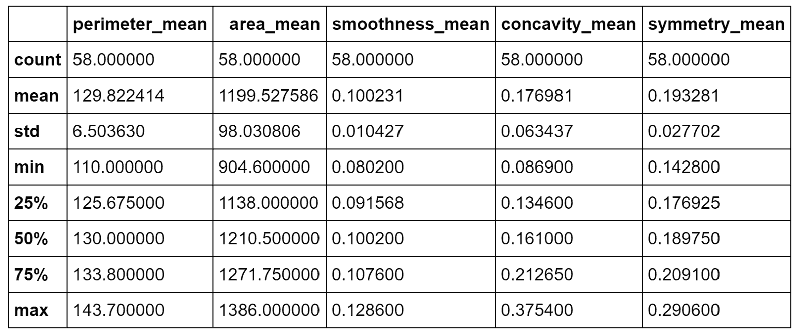

Statistical description of a malignant cluster

根据事实，我们知道所有这些样本都是恶性的，但是我们可以尝试确定一个规则。 `area_mean` / `perimeter_mean`之比约为`9.23`，相对于平均值，相对标准偏差非常小。 这意味着这些样品在非常狭窄的范围内代表了扩展的肿瘤。 而且，`concavity_mean`和`symmetry_mean`均大于总值。 因此（在不进行科学合理分析的前提下），我们可以得出结论，分配给这些簇的样品代表了已经进入晚期的非常糟糕的肿瘤。

为了与良性样本进行比较，现在考虑由 *x > -10* 和 *20 < y < 50* ，界定的区域 如下：

```py
sdff = dff[(dff.x > -10.0) & (dff.y > 20.0) & (dff.y < 50.0)]
print(sdff[['perimeter_mean', 'area_mean', 'smoothness_mean',
            'concavity_mean', 'symmetry_mean']].describe())
```

结果显示在以下屏幕截图中：


Statistical description of a benign cluster

在这种情况下，比 `area_mean` / `perimeter_mean` 约为`4.89`，但是`area_mean`具有较大的标准差（实际上，其最大值约为`410`）。 `concavity_mean`相对于前一个非常小（即使具有近似相同的标准偏差），而`symmetry_mean`几乎相等。 从这个简短的分析中，我们可以推断出`symmetry_mean`不是判别特征，而`concavity_mean`的比值`area_mean` / `perimeter_mean`小于`5.42`（考虑最大值）。 小于或等于`0.04`应当保证良性结果。 由于`concavity_mean`可以达到非常大的最大值（大于与恶性样品相关的最大值），因此有必要考虑其他特征，以便确定是否应将其值视为警报。 但是，我们可以得出结论，说属于这些簇的所有样本都是良性的，错误概率可以忽略不计。 我想重复一遍，这不是真正的分析，而是更多的练习，在这种情况下，数据科学家的主要任务是收集可以支持结论的上下文信息。 即使存在基本事实，该验证过程也始终是强制性的，因为根本原因的复杂性可能导致完全错误的陈述和规则。


# 轮廓分数


在不了解基本事实的情况下评估聚类算法性能的最常见方法是**轮廓分数**。 它既提供了每个样本的索引，又提供了整体的图形表示，显示了群集的内部一致性和分离程度。 为了计算分数，我们需要引入两个辅助措施。 第一个是 *x <sub class="calibre20">i</sub> ∈K <sub class="calibre20">j</sub>* 的平均群内距离，假设 *| K <sub class="calibre20">j [</sub> | = n（j）*：

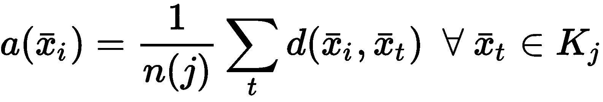

对于 K 均值，假定距离为欧几里得，但没有特定限制。 当然， *d（•）*必须与聚类过程中使用的距离函数相同。

给定样本 *x <sub class="calibre20">i</sub> ∈K <sub class="calibre20">j</sub>* ，让我们将最近的簇表示为 *K [ <sub class="calibre20">c</sub>* 。 这样，我们还可以定义最小最近集群距离（作为平均最近集群距离）：

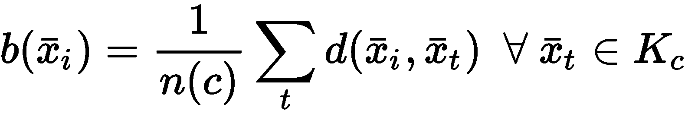

通过这两个度量，我们可以定义 *x <sub class="calibre20">i</sub> ∈X* 的轮廓分数：


分数 *s（•）∈（-1，1）*。 当 *s（•）→-1* 时，意味着 *b（•）< < a（•）*，因此样本 *x <sub class="calibre20">i</sub> ∈K <sub class="calibre20">j</sub>* 比其他分配的样本更接近最近的簇 *K* <sub class="calibre20">*c*</sub> 到 *K <sub class="calibre20">j</sub>* 。 此情况表示分配错误。 相反，当 *s（•）→1* 时， *b（•）> > a（•）*，因此样本 *x <sub class="calibre20">i</sub>* 与其邻近的*邻居*（属于同一簇）比分配给最近簇的任何其他点更近。 显然，这是最佳条件，也是微调算法时要采用的参考。 但是，由于该索引不是全局索引，因此引入轮廓图很有帮助，该轮廓图显示每个样本所获得的得分，按聚类分组并以降序排序。

让我们考虑 *K = {2，4，6，8}* 的乳腺癌威斯康星州数据集的轮廓图（完整代码包含在存储库中）：


Silhouette plots for the Breast Cancer Wisconsin dataset

第一张图显示了 *K = 2* 的*自然*聚类。 第一个轮廓非常清晰，表明平均群集间距离具有较大的差异。 而且，一个集群比另一个集群具有更多的分配（即使它不那么尖锐）。 从数据集描述中，我们知道这两个类别是不平衡的（357 良性与 212 恶性），因此，不对称是部分合理的。 但是，一般而言，当数据集平衡时，良好的轮廓图的特征是具有均匀轮廓的均质簇，其圆形轮廓应接近 1.0。 实际上，当形状类似于长雪茄时，这意味着群集内距离非常接近其平均值（高内聚力），并且相邻群集之间存在明显的分隔。 对于 *K = 2* ，我们拥有合理的分数，因为第一个簇达到 0.6，而第二个簇具有约 0.8 的峰值。 但是，尽管后者的大多数样本的特征是 *s（•）> 0.75* ，但在前一种样本中，约有一半的样本低于 0.5。 分析表明，较大的聚类更均匀，并且 K 均值更易于分配样本（即，就度量而言， *x <sub class="calibre20">i</sub> ∈K <sub class="calibre20">2 的方差）</sub>* 较小，在高维空间中，代表 *K <sub class="calibre20">2</sub>* 的球比代表 *K <sub class="calibre20">1 的球更均匀。</sub>* ）。

其他图显示了类似的情况，因为已检测到非常紧密的聚类以及一些尖锐的聚类。 这意味着宽度差异非常一致。 但是，随着 *K* 的增加，由于分配的样本数趋于变得相似，因此我们获得了更加均一的簇。 具有 *s* *（•）> 0.75* 的非常圆形（几乎矩形）的簇的存在证实了数据集至少包含一组非常有凝聚力的样本，其样本 相对于分配给其他群集的任何其他点的距离都非常接近。 我们知道，恶性类（即使其基数更大）更为紧凑，而良性类则分布在更宽的子空间中。 因此，我们可以假设，对于所有 *K* 来说，最圆的簇是由恶性样本组成的，而其他所有簇都可以根据其清晰度进行区分。 例如，对于 *K = 8* ，第三簇很可能对应于第一图中第二簇的中心部分，而较小的簇包含属于良性子集的孤立区域的样本。

如果我们不了解基本事实，则应同时考虑 *K = 2* 和 *K = 8* （甚至更大）。 实际上，在第一种情况下，我们可能会丢失许多细粒度的信息，但是我们正在确定一个强大的细分领域（假设由于问题的性质，一个集群的凝聚力不是很高）。 另一方面，在 *K > 8* 的情况下，簇明显更小，具有适度的内聚性，它们代表具有某些共同特征的亚组。 正如我们在上一节中讨论的那样，最终的选择取决于许多因素，这些工具只能提供一般的指示。 此外，当聚类是非凸的或它们的方差未在所有特征之间均匀分布时，K 均值将始终产生次优性能，因为所得聚类将包含较大的空白空间。 如果没有特定的方向，则群集的最佳数量与包含均匀（宽度大致相同）的圆形图的图相关联。 如果形状对于任何 *K* 值仍然保持清晰，则意味着几何形状与对称度量不完全兼容（例如，簇非常拉伸），应考虑其他方法。


# 完整性分数


此措施（以及从现在开始讨论的所有其他措施）是基于对基本事实的了解。 在引入索引之前，定义一些常用值会很有帮助。 如果我们用 *Y <sub class="calibre20">true</sub>* 表示包含真实分配的集合，而 *Y <sub class="calibre20">pred</sub>* 则表示预测的集合（均包含 *[M* 个值和 *K* 个簇），我们可以估计以下概率：

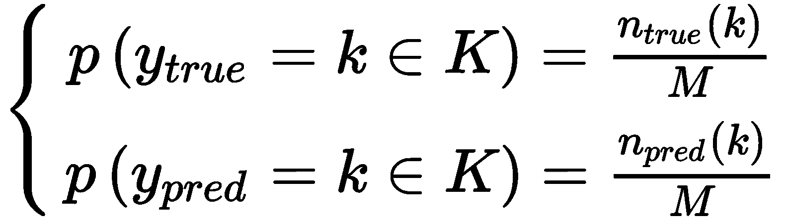

在先前的公式中， *n <sub class="calibre20">true / pred</sub> （k）*代表属于簇 *k∈K* 的真实/预测样本数。 在这一点上，我们可以计算 *Y <sub class="calibre20">真</sub>* 和 *Y <sub class="calibre20">pre</sub>* 的熵：

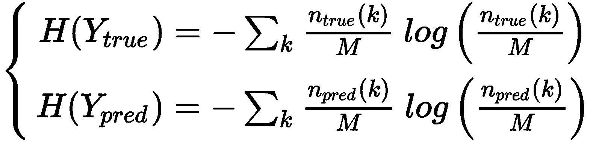

考虑到熵的定义， *H（•）*通过均匀分布最大化，而均匀分布又对应于每个分配的最大不确定性。 出于我们的目的，还必须引入 *Y <sub class="calibre20">真</sub>* 的条件熵（表示已知另一个变量的分布的不确定性），前提是 *Y* 以及其他方法：


在第一种情况下，函数 *n（i，j）*表示具有分配给 *K <sub class="calibre20">j</sub>* 的真标签 *i* 的样本数 ]，在第二种情况下，将分配给 *K <sub class="calibre20">i</sub>* 的真标签 *j* 的样本数。

完整性分数定义为：


很容易理解，当 *H（Y <sub class="calibre20">pred</sub> | Y <sub class="calibre20">true</sub> ）→0* 时， *Y <sub class="calibre20">true</sub> [* 减少了预测的不确定性，因此， *c→1* 。 这等同于说所有具有相同真实标签的样本都分配给同一群集。 相反，当 *H（Y <sub class="calibre20">pred</sub> | Y <sub class="calibre20">true</sub>* *）→H（ Y <sub class="calibre20">pred</sub> ）*，这意味着地面实况没有提供任何信息，可以减少预测的不确定性， *c→0* 。

当然，良好的聚类的特征是 *c→1* 。 对于乳腺癌威斯康星州数据集，使用 scikit-learn 函数`completenss_score()`（也适用于文本标签）和 *K = 2* 计算**完整性评分**（ 与地面真相相关的唯一配置）如下：

```py
import pandas as pd

from sklearn.cluster import KMeans
from sklearn.metrics import completeness_score

km = KMeans(n_clusters=2, max_iter=1000, random_state=1000)
Y_pred = km.fit_predict(cdf)

df_km = pd.DataFrame(Y_pred, columns=['prediction'], index=cdf.index)
kmdff = pd.concat([dff, df_km], axis=1)

print('Completeness: {}'.format(completeness_score(kmdff['diagnosis'], kmdff['prediction'])))
```

上一个代码段的输出如下：

```py
Completeness: 0.5168089972809706
```

该结果证实，对于 *K = 2* ，K-均值不能完美地分离聚类，因为如我们所见，因为某些恶性样本被错误地分配给包含大量 大多数良性样本。 但是，由于 *c* 并不是非常小，因此我们可以确保将这两个类别的大多数样本分配给了不同的群集。 邀请读者使用其他方法（在[第 3 章](../Text/03.html)，*高级聚类*中讨论）检查该值，并提供不同结果的简要说明。


# 同质性评分


**同质性得分**是对先前得分的补充，它基于以下假设：聚类必须仅包含具有相同真实标记的样本。 它定义为：


与完整性得分类似，当 *H（Y <sub class="calibre20">true</sub> | Y <sub class="calibre20">pred</sub> ）→H（Y <sub class="calibre20">true</sub> ）*时，表示 分配对条件熵没有影响，因此在聚类（例如，每个聚类包含属于所有类别的样本）并且 *h →0* 之后，不确定性不会降低。 相反，当 *H（Y <sub class="calibre20">true</sub> | Y <sub class="calibre20">pred</sub>* *）→0* ， *h→1* ，因为对预测的了解减少了关于真实分配的不确定性，并且簇几乎只包含带有相同标签的样本。 重要的是要记住，仅靠这个分数是不够的，因为它不能保证一个簇包含所有带有相同真实标签的样本 *x <sub class="calibre20">i</sub> ∈X* 。 这就是为什么同质性分数总是与完整性分数一起评估的原因。

对于乳腺癌威斯康星州数据集， *K = 2* ，我们获得以下信息：

```py
from sklearn.metrics import homogeneity_score print('Homogeneity: {}'.format(homogeneity_score(kmdff['diagnosis'], kmdff['prediction'])))
```

相应的输出如下：

```py
Homogeneity: 0.42229071246999117
```

这个值（特别是 *K = 2* ）证实了我们的初步分析。 至少一个聚类（具有大多数良性样本的聚类）不是完全同质的，因为它包含属于这两个类别的样本。 但是，由于该值不是非常接近 *0* ，因此我们可以确保分配部分正确。 考虑到 *h* 和 *c* 这两个值，我们可以推断出 K 均值的效果不是很好（可能是由于非凸性），但同时 正确分离所有最近簇距离在特定阈值以上的样本。 毋庸置疑，在掌握基本事实的情况下，我们不能轻易接受 K 均值，我们应该寻找另一种能够同时产生 *h* 和 *c→1* 的算法 。


# 使用 V 度量在同质性和完整性之间进行权衡


熟悉监督学习的读者应该知道 F 分数（或 F 量度）的概念，它是精确度和查全率的谐调平均值。 在给出基本事实的情况下评估聚类结果时，也可以采用相同的折衷方法。

实际上，在许多情况下，有一个同时考虑同质性和完整性的度量是有帮助的。 使用 **V 量度**（或 V 分数）可以很容易地获得这样的结果，其定义为：


对于乳腺癌威斯康星州数据集，V 度量如下：

```py
from sklearn.metrics import v_measure_score

print('V-Score: {}'.format(v_measure_score(kmdff['diagnosis'], kmdff['prediction'])))
```

上一个代码段的输出如下：

```py
V-Score: 0.46479332792160793
```

不出所料，V 分数是一种平均度量，在这种情况下，它受到较低同质性的负面影响。 当然，该索引不会提供任何不同的信息，因此仅在单个值中综合完整性和同质性很有帮助。 但是，通过一些简单但乏味的数学操作，有可能证明 V 度量也是对称的（即 *V（Y <sub class="calibre20">pred</sub> | V <sub class="calibre20">true</sub> ） = V（Y <sub class="calibre20">true</sub> | Y <sub class="calibre20">pred</sub> ）*）； 因此，给定两个独立的分配 *Y <sub class="calibre20">1</sub>* 和 *Y <sub class="calibre20">2</sub>* ， *V（Y <sub class="calibre20">1</sub> | 是 <sub class="calibre20">2</sub> ）*，这是衡量它们之间一致性的标准。 这种情况不是很普遍，因为其他措施可以取得更好的结果。 但是，例如，可以使用这种分数来检查两种算法（可能基于不同的策略）是否倾向于产生相同的分配，或者它们是否不一致。 在后一种情况下，即使未知的基础事实，数据科学家也可以理解，一种策略肯定不如另一种策略有效，因此可以开始探索过程以找出最佳的聚类算法。


# 调整后的相互信息（AMI）得分


该分数的主要目标是评估 *Y <sub class="calibre20">true</sub>* 和 *Y <sub class="calibre20">pred</sub>* 之间的一致性水平 。 可以通过采用**互信息**（ **MI** ）的信息论概念来衡量这一目标； 在我们的例子中，它定义为：

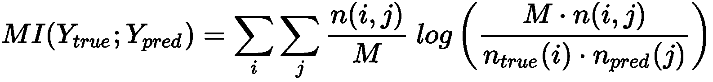

功能与先前定义的相同。 当 *MI→0* 时， *n（i，j）* *→n <sub class="calibre20">true</sub> （i）n <sub class="calibre20">pred</sub> （ j）*，其项分别与 *p（i，j）*和 *p <sub class="calibre20">成正比</sub>（i）p <sub class="calibre20">pred</sub> （j）* 。 因此，此条件等同于说 *Y <sub class="calibre20">真</sub>* 和 *Y <sub class="calibre20">pred</sub>* 在统计上是独立的，没有共识。 另一方面，通过一些简单的操作，我们可以将 MI 重写为：

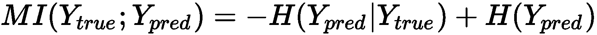

因此，当 *H（Y <sub class="calibre20">pred</sub> | Y <sub class="calibre20">true</sub> ）≤ H（ Y <sub class="calibre20">pred</sub> ）*时，当基础事实的知识减少了 *Y <sub class="calibre20">pred</sub>* 的不确定性时，得出] *H（Y <sub class="calibre20">pred</sub> | Y <sub class="calibre20">true</sub>* *）→0* MI 最大化。 就我们的目的而言，最好考虑同时针对偶然性进行调整的规范化版本（在 *0* 和 *1* 之间界定）（即，考虑由于 机会）。 **AMI 分数**的完整推导是不平凡的，并且超出了本书的范围，其定义为：

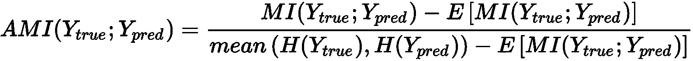

在完全不达成协议的情况下，此值等于 *0* ；当 *Y <sub class="calibre20">true</sub>* 和*时，该值等于 *1* 。 Y <sub class="calibre20">pred</sub>* 完全同意（也存在置换）。 对于乳腺癌威斯康星州数据集和 *K = 2* ，我们获得以下信息：

```py
from sklearn.metrics import adjusted_mutual_info_score
 print('Adj. Mutual info: {}'.format(adjusted_mutual_info_score(kmdff['diagnosis'], kmdff['prediction'])))
```

输出如下：

```py
Adj. Mutual info: 0.42151741598216214
```

该协议是适度的，并且与其他措施兼容。 假设存在置换和机会分配的可能性， *Y <sub class="calibre20">真</sub>* 和 *Y <sub class="calibre20">pred</sub>* 共享中等级别的信息，因为 我们已经讨论过，K 均值能够正确分配重叠概率可忽略不计的所有样本，同时它倾向于考虑良性地位于两个聚类边界上的许多恶性样本（相反，这没有错 良性样本的分配）。 没有任何进一步的指示，该索引还建议检查其他可以管理非凸簇的聚类算法，因为缺少共享信息主要是由于无法使用标准球（尤其是在重叠区域为子空间）捕获复杂的几何图形 更重要）。


# 调整后的兰德分数


**调整后的兰德评分**是真实标签分布与预测标签之间差异的量度。 为了对其进行计算，必须按以下方式定义数量：

*   **a** ：用相同的真实标签*表示样本对的数量（ *x <sub class="calibre20">i</sub> ，x <sub class="calibre20">j</sub>* ）（y <sub class="calibre20">i</sub> ，y <sub class="calibre20">j</sub> ）：y <sub class="calibre20">i</sub> = y <sub class="calibre20">j</sub>* 并分配给同一集群 *K <sub class="calibre20">c</sub>*
*   **b** ：R 代表样本对的数量（ *x* *<sub class="calibre20">i</sub> ，x <sub class="calibre20">j</sub>* ），带有不同的真实标签*（y* *<sub class="calibre20">i</sub> ，y <sub class="calibre20">j</sub> ）：y <sub class="calibre20">i</sub> ≠y <sub class="calibre20">j</sub>* 并分配给不同的集群 *K* *<sub class="calibre20">c</sub>* 和 *K <sub class="calibre20">d</sub>* ， *c≠d*

如果存在 *M 个*值，则使用具有 *k = 2* 的二项式系数获得二进制组合的总数，因此，差异的初始度量为：


显然，该值可以由 *a* 或 *b* 主导。 在这两种情况下，较高的分数表示作业与基本事实相符。 但是， *a* 和 *b* 都可能因机会分配而产生偏差。 这就是引入调整后的兰德分数的原因。 更新的公式为：

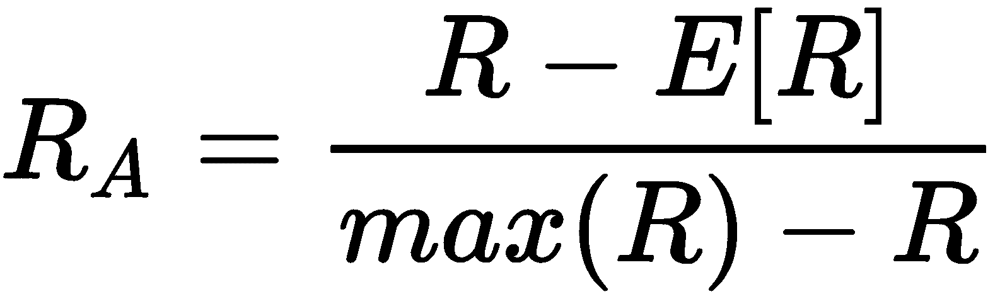

该值限制在 *-1* 和 *1* 之间。 当 *R <sub class="calibre20">A</sub> →-1* 时，a 和 b 都非常小，并且绝大多数分配都是错误的。 另一方面，当 *R <sub class="calibre20">A</sub>* *→1* 时，预测分布非常接近地面实况。 对于乳腺癌威斯康星州数据集和 *K = 2* ，我们获得以下信息：

```py
from sklearn.metrics import adjusted_rand_score

print('Adj. Rand score: {}'.format(adjusted_rand_score(kmdff['diagnosis'], kmdff['prediction'])))
```

上一个代码段的输出如下：

```py
Adj. Rand index: 0.49142453622455523
```

由于该值大于 *-1* （负极值），因此该结果优于其他指标。 它确认分布之间的差异不是很明显，这主要是由于样本的子集有限所致。 该分数非常可靠，也可以用作评估聚类算法性能的单个指标。 接近 0.5 的值确认 K-means 不太可能是最佳解，但与此同时，数据集的几何形状几乎可以被对称球完全捕获，除了某些 重叠可能性高的非凸区域。


# 权变矩阵


一个非常简单而强大的工具，可以在已知地面实况时显示聚类算法的性能，它是**权变矩阵** *C <sub class="calibre20">m</sub>* 。 如果存在 *m* 类，则 *C <sub class="calibre20">m</sub> ∈ℜ <sup class="calibre27">m×m</sup>* 和每个元素 *C <sub class="calibre20">m</sub> （i，j）*代表已分配给群集 *j* 的 *Y <sub class="calibre20">true</sub> = i* 的样本数。 因此，一个完美的权变矩阵是对角线的，而所有其他单元格中元素的存在则表明了聚类误差。

在我们的案例中，我们获得以下信息：

```py
from sklearn.metrics.cluster import contingency_matrix

cm = contingency_matrix(kmdff['diagnosis'].apply(lambda x: 0 if x == 'B' else 1), kmdff['prediction'])
```

上一个代码片段的输出可以显示为热图（变量`cm`是（2×2）矩阵）：

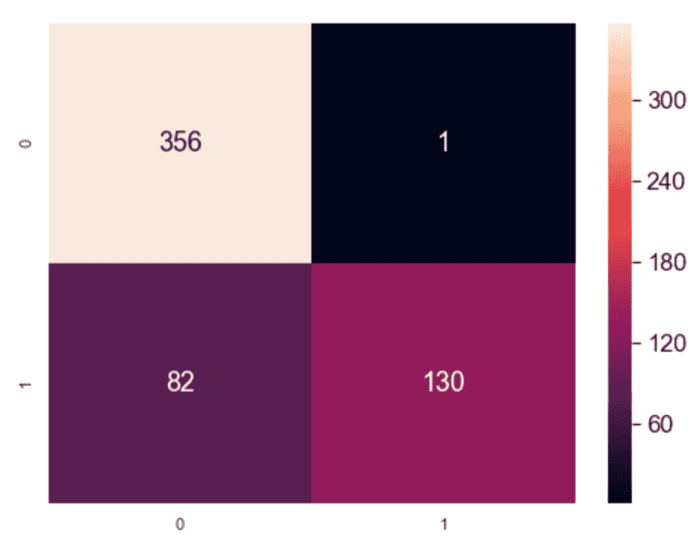

Graphical representation of the contingency matrix

该结果表明，几乎所有良性样本均已正确聚类，而适度百分比的恶性样本已被错误地分配给第一个聚类。 我们已经使用其他度量进行了确认，但是类似于分类任务中的混淆矩阵，列联矩阵可以立即可视化最难分离的类别，从而帮助数据科学家寻找更有效的解决方案。


# K 最近邻居


**K 最近邻居**（ **K** NN）是属于称为**基于实例的学习**类别的方法。 在这种情况下，没有参数化模型，而是样本的重新排列以加快特定查询的速度。 在最简单的情况下（也称为蛮力搜索），假设我们有一个 *X* 数据集，其中包含 *M* 个样本 *x <sub class="calibre20">i</sub> ∈ℜ[ <sup class="calibre27">N</sup>* 。 给定距离函数 *d（x <sub class="calibre20">i</sub> ，x <sub class="calibre20">j</sub> ）*，则可以定义测试样品的半径邻域 *x <sub class="calibre20">i</sub>* 如下：

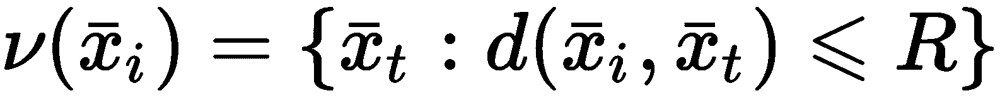

集合*ν（x <sub class="calibre20">i</sub> ）*是一个以 *x <sub class="calibre20">i</sub>* 为中心的球，包括所有距离小于或等于的样本 *R* 。 另外，也可以只计算最接近的 *k* 个邻居，即更接近 *x <sub class="calibre20">i</sub>* 的 *k* 个样本（通常， 该集合是 *ν（x <sub class="calibre20">i</sub>* *）*的子集，但当 *k* 非常大）。 该过程很简单，但不幸的是，从计算的角度来看太昂贵了。 实际上，对于每个查询，有必要计算 *M <sup class="calibre27">2</sup>* *N* -维距离（即，假设每距离 *N* 个运算） ，复杂度为 *O（NM <sup class="calibre27">2</sup> ）*），这是使暴力破解方法遭受维度诅咒的条件。 例如，在 *N = 2* 和 *M = 1,000* 的情况下，复杂度为 *O（2  10 <sup class="calibre27">6</sup> ）*，但是 当 *N ＝ 1,000* 和 *M ＝ 10,000* 时，其变为 *O（10 <sup class="calibre27">11</sup> ）*。 例如，如果每个操作需要 1 纳秒，那么查询将需要 100 秒，这在许多实际情况下超出了可容忍的限制。 此外，对于 64 位浮点值，成对距离矩阵每次计算将需要约 764 MB，再次考虑到任务的性质，这可能是一个过多的请求。

由于这些原因，仅当 *M* 非常小时并且在所有其他情况下都依赖于稍微复杂的结构时，KNN 具体实现才使用蛮力搜索。 第一种替代方法基于 **kd 树**，这是将二叉树自然扩展到多维数据集的方法。

在下图中，表示了由 *3* 维向量组成的部分 kd 树：

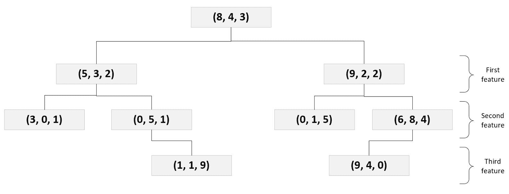

Example of kd-tree with 3-dimensional vectors

kd 树的构建非常简单。 给定一个根样本（*， <sub class="calibre20">1</sub> ， <sub class="calibre20">2</sub> ，...， <sub class="calibre20">N</sub>* ），考虑到 第一个特征，因此左分支包含（ *b <sub class="calibre20">1</sub> < a <sub class="calibre20">1</sub> ，...，*等）和右分支（ *c <sub class="calibre20">1</sub> > a <sub class="calibre20">1</sub> ，...，*等）。 该过程将继续执行第二个功能，第三个功能，依此类推，直到第一个功能，依此类推，直到到达叶节点为止（分配给叶的样本数量是需要调整的超参数。） 该参数称为`leaf_size`，默认值为 30 个样本）。

当维度 *N* 不太大时，计算复杂度变为 *O（N log M）*，这比蛮力搜索要好得多。 例如，在 *N = 1,000* 和 *M = 10,000* 的情况下，计算复杂度变为 *O（4,000）< < O（10 <sup class="calibre27">11</sup> ）*。 不幸的是，当 *N* 大时，kd 树查询变为 *O（NM）*，因此，考虑前面的示例， *O（10 <sup class="calibre27">7</sup> ）*，它比蛮横搜索更好，但有时对于实时查询而言仍然太昂贵。

KNN 中常用的第二个数据结构是**球树**。 在这种情况下，根节点由 *R <sub class="calibre20">0</sub>* -ball 表示，精确定义为样本的邻域：

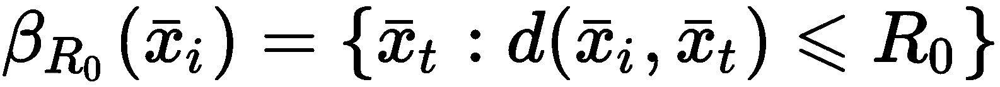

选择第一个球以便捕获所有样本。 此时，将其他较小的球嵌套到*β <sub class="calibre20">R0</sub>* 中，以确保每个样本始终属于一个球。 在下图中，有一个简单的球树的示意图：

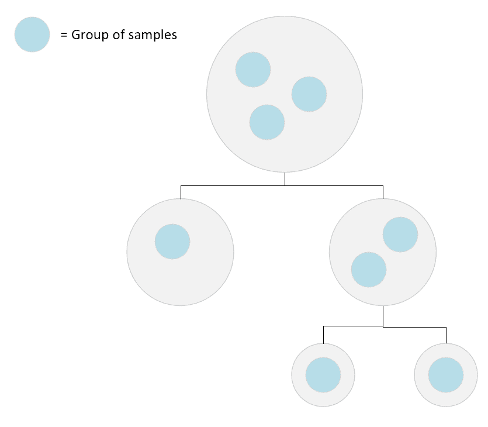

Example of a simple ball-tree

由于每个球都由其中心 *c <sub class="calibre20">j</sub>* 完全确定，因此对测试样本 *x <sub class="calibre20">i</sub>* 的查询要求计算距离 HTG8] d（x <sub class="calibre20">i</sub> ，c <sub class="calibre20">j</sub> ）。 因此，从底部（最小的球所在的位置）开始，执行完整的扫描。 如果没有一个球包含样本，则级别会增加，直到达到根节点为止（记住一个样本可以属于一个球）。 由于球的特性，计算复杂度现在始终为 *O（N log M）*（也就是说，给定中心和半径，可以通过一次距离计算来检查样本的隶属度） 。 确定正确的球后，样本 *x* <sub xmlns:epub="http://www.idpf.org/2007/ops" class="calibre20">*i*</sub> 的邻居需要计算有限数量的成对距离（该值小于 叶大小，因此与数据集的维数相比通常可以忽略不计）。

当然，这些结构是在培训阶段构建的，在生产阶段不会对其进行修改。 这意味着要仔细选择最小半径或分配给叶节点的样本数。 实际上，由于查询通常需要多个邻居 *k* ，因此仅当 *k < |ν（x <sub class="calibre20">i</sub> ）|达到最佳值时，才能实现最优。* 。 换句话说，我们想在同一子结构中找到所有包含 *x <sub class="calibre20">i</sub>* 的邻居。 每当 *k > |ν（x <sub class="calibre20">i</sub>* *）|* ，该算法还必须检查相邻结构并合并结果。 当然，当叶子大小太大（与样本总数 *M* 相比）时，这些树的优势就消失了，因为有必要计算太多的成对距离才能回答查询。 必须根据软件的生产使用情况来正确选择叶子大小。

例如，如果推荐系统需要具有 100 个邻居的初始查询和具有 10 个邻居的几个（例如 5 个）后续查询，则等于 10 的叶子大小将优化优化阶段，但会产生负面影响 在第一个查询上。 相反，选择等于 100 的叶子大小将减慢所有 10 个邻居查询的速度。 权衡可能是 25，这减少了第一个查询的负担，但对细化查询的成对距离的计算产生了中等程度的负面影响。

现在，我们可以基于 Olivetti 人脸数据集（由 scikit-learn 直接提供）分析一个简短示例。 它由代表不同人物肖像的 400 张 64×64 灰度图像组成。 让我们从如下加载数据集开始：

```py
from sklearn.datasets import fetch_olivetti_faces

faces = fetch_olivetti_faces()
X = faces['data']
```

变量`X`包含数据集的展平版本（400 个 4,096 维实例已经在 0 和 1 之间标准化）。 在这一点上，我们可以训练一个`NearestNeighbor`模型，假设使用 10 个样本（参数`n_neighbors`）和半径等于 20（参数`radius`）的默认查询。 我们保留默认的`leaf_size (30)`，并使用`p=2`（欧几里得距离）明确设置 Minkowski 度量。 该算法基于一棵球树，但我邀请读者同时测试不同的指标和 kd 树。 现在，我们可以创建`NearestNeighbors`实例并继续训练模型：

```py
from sklearn.neighbors import NearestNeighbors

knn = NearestNeighbors(n_neighbors=10, metric='minkowski', p=2, radius=20.0, algorithm='ball_tree')
knn.fit(X)
```

训练好模型后，请使用嘈杂的测试脸来查找最近的 10 个邻居，如下所示：

```py
import numpy as np

i = 20
test_face = X[i] + np.random.normal(0.0, 0.1, size=(X[0].shape[0]))
```

测试面绘制在以下屏幕截图中：


Noisy test face

可以使用仅提供测试样本的方法`kneighbors()`来执行具有默认邻居数的查询（在邻居数不同的情况下，必须调用该函数，并同时提供参数`n_neighbors`）。 如果参数为`return_distance=True`，则该函数返回包含`distances, neighbors`的元组，如下所示：

```py
distances, neighbors = knn.kneighbors(test_face.reshape(1, -1))
```

查询结果显示在以下屏幕截图中：

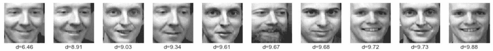

Nearest neighbors of the test sample with their relative distances

第一个样本始终是测试样本（在这种情况下，它被去噪，因此其距离不为零）。 可以看到，即使距离是一个累积函数，第二个和第四个样本是指同一个人，而其他样本共享不同的解剖元素。 当然，欧几里德距离并不是衡量图像之间差异的最合适方法，但是该示例在一定程度上证实了当图像相当相似时，全局距离也可以为我们提供 可以使用有价值的工具查找相似的样本。

现在，使用`radius_neighbors()`设置`radius=100`的方法执行半径查询，如下所示：

```py
import numpy as np

distances, neighbors = knn.radius_neighbors(test_face.reshape(1, -1), radius=100.0)
sd, sd_arg = np.sort(distances[0]), np.argsort(distances[0])
```

以下屏幕快照显示了包含前 20 个邻居的结果：


First 50 neighbors using a radius query

有趣的是，距离并没有很快变化（第二个样本具有`d=8.91`，第五个`d=10.26`）。 这主要是由于两个因素：第一个是样本之间的全局相似性（就几何元素和色调而言），第二个可能与欧氏距离对 4,096 维向量的影响有关。 正如在谈到聚类基本原理时所解释的那样，高维样本可能缺乏可区分性（尤其是当 *p > > 1* 时）。 在这种情况下，图片不同部分的平均效果可能会产生与分类系统完全不兼容的结果。 特别是，深度学习模型倾向于通过使用可以学会检测不同级别特定特征的卷积网络来避免此*陷阱*。 我建议以不同的指标重复此示例，并观察 *p* 对半径查询样本所显示的实际差异的影响。


# 向量量化


**矢量量化**（ **VQ** ）是一种利用无监督学习对样本 *x <sub class="calibre20">i</sub> ∈ℜ<sup class="calibre27">进行有损压缩的方法。 N</sup>* （为简单起见，我们假设多维样本被展平）或整个数据集 *X* 。 主要思想是找到带有许多条目 *C < < N* 的密码本 *Q* ，并将每个元素与条目 *q <sub class="calibre20">相关联 i</sub> ∈Q* 。 在单个样本的情况下，每个条目将代表一个或多个特征组（例如，可以是均值），因此，该过程可以描述为一种变换 *T* ，其一般表示为 ：

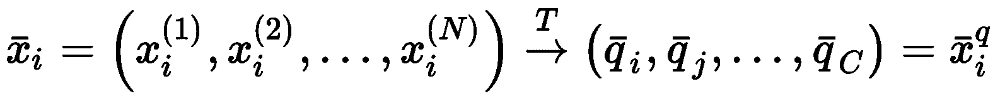

码本被定义为 *Q =（q <sub class="calibre20">1</sub> ，q <sub class="calibre20">2</sub> ，...，q <sub class="calibre20">C</sub> ）*。 因此，给定一个由一组特征集合（例如，一组两个连续元素）组成的综合数据集，VQ 将关联一个码本条目：


由于使用*汇总*整个组的固定值的组合表示输入样本，因此将过程定义为量化。 类似地，如果输入是数据集 *X* ，则转换将按样本组进行操作，就像任何标准聚类过程一样。 主要区别在于目的：使用 VQ 代表每个聚类及其质心，从而减少数据集的方差。 这个过程是不可逆的。 一旦执行了转换，就不可能重建原始聚类（唯一可行的过程是基于具有相同原始均值和协方差的分布的采样，但是重建显然是近似的）。

让我们从显示一个非常简单的高斯数据集的示例开始，如下所示：

```py
import numpy as np

nb_samples = 1000
data = np.random.normal(0.0, 1.5, size=(nb_samples, 2))

n_vectors = 16
qv = np.random.normal(0.0, 1.5, size=(n_vectors, 2))
```

我们的目标是用 16 个向量表示数据集。 在以下屏幕截图中，该图显示了初始配置的示例：


Initial configuration of the vectors for the VQ example

当我们使用随机数时，相同代码的后续执行会产生不同的初始配置。 该过程遍历所有样本，选择最接近的量化矢量，并将其距离减小固定量`delta=0.05`，如下所示：

```py
import numpy as np

from scipy.spatial.distance import cdist

delta = 0.05
n_iterations = 1000

for i in range(n_iterations):
    for p in data:
        distances = cdist(qv, np.expand_dims(p, axis=0))
        qvi = np.argmin(distances)
        alpha = p - qv[qvi]
        qv[qvi] += (delta * alpha)

distances = cdist(data, qv)
Y_qv = np.argmin(distances, axis=1)
```

除了固定的 for 循环外，还可以使用 while 循环来检查量化向量是否已达到稳态（比较 *t* 和 *t + 1* ）。 以下屏幕快照显示了该过程结束时的结果：

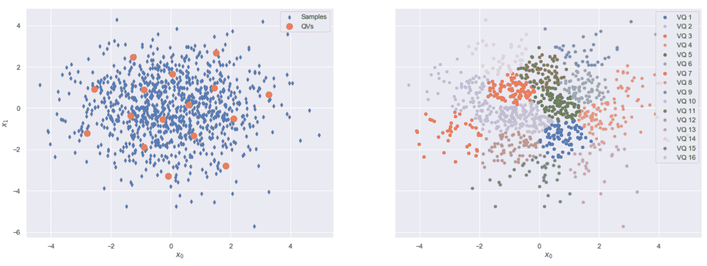

Final configuration of the quantization vectors (left). Influence area of each quantization vector (right)

正如预期的那样，量化矢量已达到最终配置，其中每个量化矢量都代表数据集的一小部分（如右图所示）。 在这一点上，给定一个点，最接近的向量将代表它。 有趣的是，全局方差并未受到影响，但是，选择任何子集后，内部方差会大大降低。 向量的相对位置反映了数据集的密度，因为区域中的*更多样本吸引了更多向量*。 这样，通过构建距离矩阵，可以获得粗略的密度估计（例如，当向量与向量的近邻的平均距离较高时，意味着底层区域的密度较小）。 我们将在[第 6 章](../Text/06.html)，*异常检测*中更详细地讨论此主题。

现在让我们考虑一个示例，该示例具有一个代表浣熊图片的单个样本。 由于过程可能很长，因此第一步是加载示例 RGB 图像（由 SciPy 提供）并将其大小调整为 192×256，如下所示：

```py
from scipy.misc import face
from skimage.transform import resize

picture = resize(face(gray=False), output_shape=(192, 256), mode='reflect')
```

以下屏幕快照显示了原始图片（已在[0，1]范围内标准化）：


Sample RGB picture for VQ example

我们想用 24 个使用 2×2 正方形区域计算的矢量执行 VQ（由包含 2×2×3 特征的展平矢量表示）。 但是，我们将使用 K-means 算法来查找质心，而不是从头开始执行该过程。 第一步是收集所有正方形区域，如下所示：

```py
import numpy as np

square_fragment_size = 2
n_fragments = int(picture.shape[0] * picture.shape[1] / (square_fragment_size**2))

fragments = np.zeros(shape=(n_fragments, square_fragment_size**2 * picture.shape[2]))
idx = 0

for i in range(0, picture.shape[0], square_fragment_size):
    for j in range(0, picture.shape[1], square_fragment_size):
        fragments[idx] = picture[i:i + square_fragment_size, 
                                 j:j + square_fragment_size, :].flatten()
        idx += 1
```

此时，可以使用 24 个量化矢量进行 K-means 聚类，如下所示：

```py
from sklearn.cluster import KMeans

n_qvectors = 24

km = KMeans(n_clusters=n_qvectors, random_state=1000)
km.fit(fragments)

qvs = km.predict(fragments)
```

在训练结束时，变量`qvs`将包含与每个正方形区域关联的质心的索引（可通过实例变量`cluster_centers_`获得）。

现在可以使用质心构建量化的图像，如下所示：

```py
import numpy as np

qv_picture = np.zeros(shape=(192, 256, 3))
idx = 0   for i in range(0, 192, square_fragment_size):
    for j in range(0, 256, square_fragment_size):
        qv_picture[i:i + square_fragment_size,
                   j:j + square_fragment_size, :] = \
            km.cluster_centers_[qvs[idx]].\
                reshape((square_fragment_size, square_fragment_size, 3))   idx += 1
```

量化的图像显示在以下屏幕截图中：

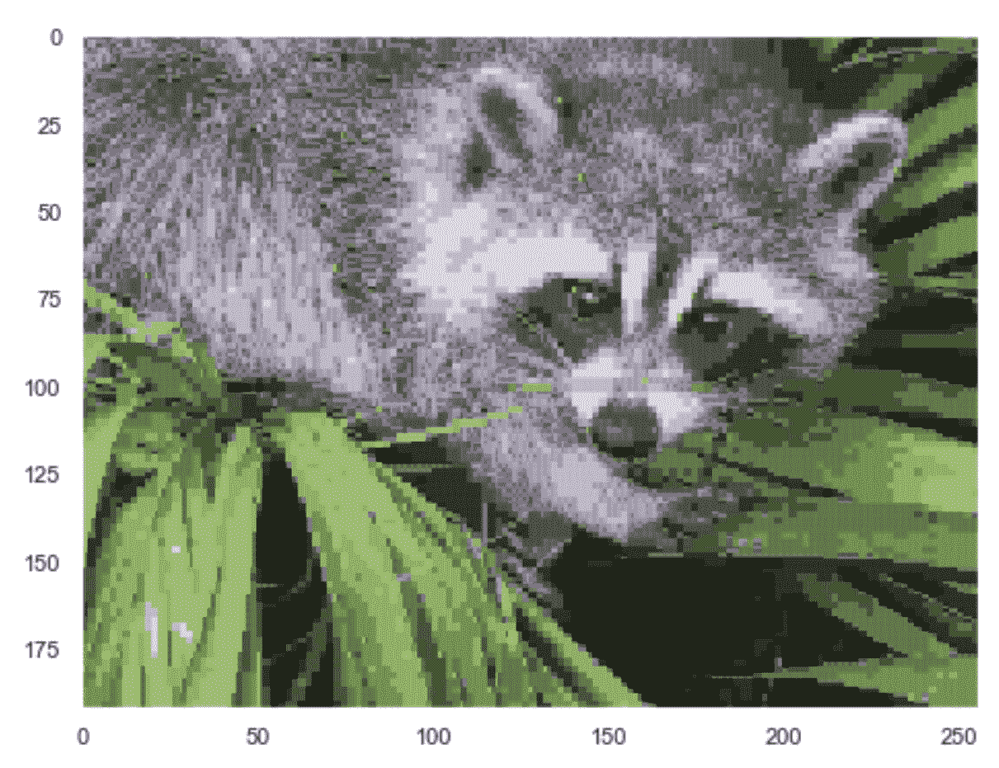

Picture quantized with 24 vectors

结果显然是原始图像的有损压缩版本。 每个组都可以用一个索引来表示（例如，在我们的示例中，它可以是 8 位整数），该索引指向码本中的条目（`km.cluster_centers_`）。 因此，如果最初有 192×256×3 = 1,474,560 个 8 位值，则在量化之后，我们有 12,288 个 8 位索引（2×2×3 块的数量） ），再加上 24 个 12 维量化矢量。 为了了解 VQ 对图像的影响，绘制原始图像和处理后图像的 RGB 直方图非常有用，如以下直方图所示：

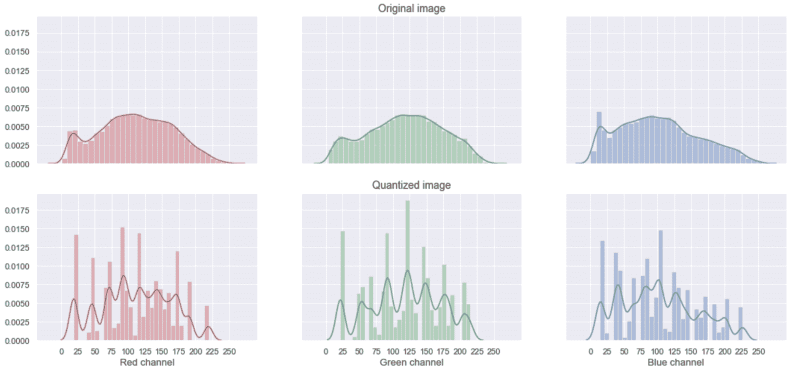

RGB histogram of the original image (top) and quantized version (bottom)For readers who are not familiar with histograms, we can briefly describe them as having a dataset *X* and a fixed number of bins. Each bin is assigned to a range (starting from *min(X)* and ending in *max(X)*) and each range (*a, b*) is associated with the number of samples such that *a ≤ x < b*. The resulting plot is proportional to an approximation of the actual probability distribution that generated *X*. In our case, on the x-axis, there are all possible values for each pixel per channel (8-bit), while the y-axis represents the estimated frequency (*Nx / Total number of pixels*).

可以看到，量化减少了信息量，但是直方图往往会重现原始信息。 增加量化矢量的数量具有减少近似值的效果，从而产生差异较小的直方图。 对该主题的完整分析超出了本书的范围。 但是，我邀请读者使用其他图像和不同数量的量化矢量来测试该过程。 也可以将原始图像的（协）方差（或熵）与量化版本进行比较，并找到保留 80％的方差的阈值。 例如，仅考虑红色通道，并使用频率计数来近似每个值（0÷255）的概率，我们可以获得以下信息：

```py
import numpy as np

hist_original, _ = np.histogram(picture[:, :, 0].flatten() * 255.0, bins=256)
hist_q, _ = np.histogram(qv_picture[:, :, 0].flatten() * 255.0, bins=256)

p_original = hist_original / np.sum(hist_original)
H_original = -np.sum(p_original * np.log2(p_original + 1e-8))

p_q = hist_q / np.sum(hist_q)
H_q = -np.sum(p_q * np.log2(p_q + 1e-8))

print('Original entropy: {0:.3f} bits - Quantized entropy: {1:.3f} bits'.format(H_original, H_q))
```

上一个代码段的输出如下：

```py
Original entropy: 7.726 bits - Quantized entropy: 5.752 bits
```

由于信息量与熵成正比，因此我们现在已经确认，24 个量化矢量（具有 2×2 正方形块）能够解释红色通道原始熵的大约 74％（即使三个通道都不是）。 独立地，可以通过对三个熵求和来获得总熵的粗略近似。 该方法可以有效地用于在压缩强度和最终结果质量之间进行权衡。


# 概要


在本章中，我们从相似性的概念及其度量方法入手，解释了聚类分析的基本概念。 我们讨论了 K-means 算法及其优化的变体 K-means ++，并分析了乳腺癌威斯康星州数据集。 然后，我们讨论了最重要的评估指标（无论是否了解基本事实），并且了解了哪些因素会影响绩效。 接下来的两个主题是 KNN（一种非常著名的算法，可用于在给定查询向量的情况下查找最相似的样本），以及 VQ（一种利用聚类算法以查找样本的有损表示形式的技术）（例如， 图片）或数据集。

在下一章中，我们将介绍一些最重要的高级聚类算法，展示它们如何轻松解决非凸问题。


# 问题


1.  如果两个样本的 Minkowski 距离（ *p = 5* ）等于 10，那么您能说出它们的曼哈顿距离吗？
2.  对 K 均值的收敛速度产生负面影响的主要因素是数据集的维数。 它是否正确？
3.  可以积极影响 K 均值性能的最重要因素之一是聚类的凸度。 它是否正确？
4.  聚类应用程序的同质性得分等于 0.99。 这是什么意思？
5.  调整后的兰德得分等于-0.5 是什么意思？
6.  考虑到前面的问题，不同数量的聚类能否产生更好的分数？
7.  基于 KNN 的应用程序平均每分钟需要 100 个 5-NN 基本查询。 每分钟执行 2 个 50-NN 查询（每个查询需要 4 秒，叶子大小为 25），并在紧接其后执行 2 秒的阻塞任务。 假设没有其他延迟，则每分钟叶子大小= 50 可以执行多少*个基本*查询？
8.  球形树结构不适合管理高维数据，因为它遭受了维数的诅咒。 它是否正确？

9.  获得了一个数据集，该数据集从 3 个二维高斯分布中采样了 1,000 个样本： *N（[-1.0，0.0]，diag [0.8，0.2]）*， *N（[0.0，5.0]， diag [0.1，0.1]）*和 *N（[-0.8，0.0]* ， *diag [0.6，0.3]）*。 集群中最可能的数量是？
10.  可以使用 VQ 压缩文本文件吗（例如，构建具有 10,000 个单词的字典，该单词在 *[0.0，1.0]* 范围内均匀映射，将文本拆分为标记，然后将其转换为浮点序列） ）？


# 进一步阅读


*   *关于高维空间*， *Aggarwal CC* ， *Hinneburg A.* ，*的* *f 距离度量的惊人行为 Keim DA* ， *ICDT* ，2001
*   *K* *-表示++：* *精心播种的优势* ， [ *Arthur D.* ， *Vassilvitskii S.* ， *第 18 届 ACM-SIAM 离散算法年会论文集*，2007 年
*   *使用 t-SNE 可视化数据*， *van der Maaten L.* ， *Hinton G.* ， *机器学习研究杂志 9* ，2008 年
*   *两个线性不可分集的鲁棒线性编程判别* ， *Bennett KP* ， *Mangasarian OL* ， *优化 方法与软件 1* ，1992
*   *通过线性编程*， *Mangasarian OL* ， *Street WN* ， *Wolberg WH* ， [HTG10 运筹学，43（4），第 570-577 页，1995 年 7 月至 8 月
*   *V 度量：基于条件熵的外部聚类评估度量*， *Rosenberg A.* ， *Hirschberg J.* ， *程序 2007 年自然语言处理和计算自然语言学习经验方法联合会议的报告*，2007 年


