# 进阶丛集


在本章中，我们将继续探索可用于非凸任务的更复杂的聚类算法（即，例如，K 均值无法同时获得内聚力和分离力。 几何形状）。 我们还将展示如何将基于密度的算法应用于复杂的数据集，以及如何正确选择超参数并根据所需结果评估性能。 这样，数据科学家就可以准备面对各种问题，排除价值较低的解决方案，而只关注最有前途的解决方案。

特别是，我们将讨论以下主题：

*   光谱聚类
*   平均移动
*   **具有噪声**（**DBSCAN**）的应用程序的基于密度的空间聚类
*   其他评估指标：Calinski-Harabasz 指数和集群不稳定性
*   K-类固醇
*   在线聚类（小批量 K 均值和**使用层次结构**（**BIRCH**）平衡的迭代减少和聚类）


# 技术要求


本章中提供的代码要求：

*   Python3.5+（强烈建议您使用 [Anaconda 发行版](https://www.anaconda.com/distribution/)）
*   库：
    *   SciPy 0.19+
    *   NumPy 1.10+
    *   Scikit-Learn 0.20+
    *   Pandas 0.22+
    *   Matplotlib 2.0+
    *   Seaborn 0.9+

数据集  可以通过 UCI 获得。 可以从[这里](https://archive.ics.uci.edu/ml/datasets/Absenteeism+at+work)下载 CSV 文件，并且不需要任何预处理，除了添加了 将在加载阶段发生。

[Github 存储库中提供了示例](https://github.com/PacktPublishing/HandsOn-Unsupervised-Learning-with-Python/tree/master/Chapter03)。


# 光谱聚类


可以管理非凸类的最常见算法家族之一是**谱类聚类**。 主要思想是将数据集`X`投影到可以通过超球体捕获群集的空间（例如，使用 K-means）。 该结果可以通过不同的方式实现，但是由于该算法的目标是消除通用形状区域的凹面，因此第一步始终是`X`表示为图形 *{V，E}，*其中顶点 *V≡X* 和加权边表示每对样本 *x [i]* ，[HTG14 通过参数 *w [ij] ≥0* 通过[x] [j] ∈X 。 生成的图形可以是完整的（完全连接的），也可以仅在某些样本对之间具有边（即，不存在的权重的权重设置为零）。 在下图中，有一个局部图的示例：


Example of a graph: Point x[0] is the only one that is connected to x[1]

可以使用两种主要策略来确定权重 *w [ij]* ：KNN 和**径向基函数**（**RBF**）。 第一个基于上一章中讨论的相同算法。 考虑到邻居数`k`，数据集表示为球树或 kd 树，对于每个样本 *x [i]* ，集合 *计算 kNN（x [i] ）*。 此时，给定另一个样本 *x [j]* ，权重计算如下：


在这种情况下，该图不包含有关实际距离的任何信息，因此，考虑到 KNN 中使用的相同距离函数 *d（•）*，最好表示`w`[*ij*] 如下：


此方法简单且相当可靠，但是生成的图形未完全连接。 通过采用如下定义的 RBF 可以轻松实现这种条件：

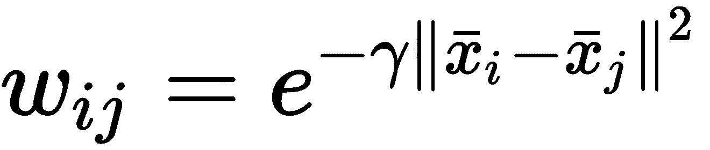

通过这种方式，将根据其距离自动对所有夫妇加权。 由于 RBF 是高斯曲线，因此当 *x [i] = x [j]* 时，它等于`1`，并且与平方距离成比例地减小 *d（x [i] ，x [j] ）*（表示为差异的范数）。 参数*γ*确定半铃曲线的振幅（通常，默认值为 *γ= 1* ）。 当 *γ< 1* 时，振幅增加，反之亦然。 因此，*γ< 1* 表示对距离的灵敏度较低，而*γ> 1* 的情况下，RBF 下降得更快，如以下屏幕截图所示：


Bidimensional RBFs as functions of the distance between x and 0 computed for γ = 0.1, 1.0, and 5.0

当*γ= 0.1* 时， *x = 1* （相对于 0.0）的权重约为 0.9。 对于*γ= 1.0* ，该值约为 0.5；对于*γ= 5.0* ，该值几乎为零。 因此，在调整频谱聚类模型时，考虑*γ*的不同值并选择产生最佳性能的值（例如，使用第 2 章，“聚类基础知识”）。 一旦创建了图，就可以使用对称**亲和矩阵** *W = {w [ij] }* 来表示。 对于 KNN *，W* 通常比较稀疏，可以使用专门的库进行有效地存储和操作。 相反，对于 RBF，它始终是密集的，并且如果 *X∈^(N×M)* ，则它需要存储 *N^2* 值 。

不难证明到目前为止我们分析过的程序等同于将`X`分割为多个内聚区域。 实际上，让我们考虑例如具有通过 KNN 获得的亲和度矩阵的图`G`。 连接的组件 *C [i]* 是一个子图，其中每对顶点 *x [a]* ， *x [b] ∈C [i]* 通过属于`C`[`i`] 的顶点的路径连接，并且没有连接任何顶点的边 *C [i]* 的顶点具有不属于 *C [i]* 的顶点。 换句话说，连接的组件是一个内聚子集 *C [i]  G* ，它代表群集选择的最佳候选者。 在下图中，有一个从图中提取的连接组件的示例：


Example of a connected component extracted from a graph

在原始空间中，点 **x [0]** ， **x [2]** 和 **x [3] [** 连接到 **x [n]** ，`x`**[m] [** 和`x`**[q]** 至 **x [1]** 。 这可以表示非常简单的非凸几何，例如半月形。 实际上，在这种情况下，凸度假设对于最佳分离不再是必需的，因为，正如我们将要看到的那样，这些分量被提取并投影到具有平坦几何形状的子空间中（可通过诸如此类的算法轻松管理） 以 K 均值表示）。

当使用 KNN 时，此过程更加明显，但是，通常，我们可以说，当区域间距离（例如，两个最近点之间的距离）与平均内部区域相当时，可以合并两个区域 距离。 Shi 和 Malik（在*归一化剪切和图像分割中，J。Shi 和 J. Malik，  IEEE Transactions on Pattern Analysis and Machine Intelligence）中提出了解决此问题的最常用方法之一。 ，第 22 卷，* 08/2000），这称为归一化剪切。 整个证明超出了本书的范围，但是我们可以讨论主要概念。 给定一个图，可以构建归一化的图拉普拉斯算子，定义为：


对角矩阵`D`被称为**度矩阵**，每个元素 *d [i] [i]* 是权重之和 相应行的 可以证明以下陈述：

*   在对`L`进行特征分解之后（考虑非正规图 Laplacian *L [u] = D-W* 并求解方程 *L [，很容易计算特征值和特征向量 [u] v =λDv*），则空特征值始终以多重性出现`p`。
*   如果`G`是无向图（因此 *w [ij] ≥0∀i，j* ），则连接的组件数等于`p`（空特征值的多重性）。
*   如果 *A ℜ^N* 和*Θ*是`A`的可数子集（即`X`是可计数的子集，因为样本数始终是有限的），向量 *v∈ℜ^N* 被称为**指标向量**对于 *Θ* ，如果给定 *θ [ i ] ∈ Θ， v^(（i）[ 如果 *θ [i] ∈* *A 和 v <sup class="calibre27">（i）) = 0* </sup> = 1* HTG43]否则。 例如，如果我们有两个向量 *a =`(1, 0)`*和 *b =`(0, 0)`*（因此，*Θ= {a，b}* ），我们认为 *A = {（1，n）其中 n∈[1，10]}* ，向量 *v =`(1, 0)`*是一个指标向量，因为 *a∈A* 和 *b∉A* 。
*  `L`的第一个`p`特征向量（对应于空特征值）是每个连接的分量 *C [1] ，C [2] ，...，C* [`p`。]

因此，如果数据集由`M`个样本 *x [i] ∈ℜ^N* 以及图`G`与亲和力矩阵 *W^(M ×M)* 相关联，Shi 和 Malik 建议建立矩阵 *B∈ℜ^(M×p)* 包含第一个`p`特征向量作为列，并使用诸如 K 均值的更简单方法对行进行聚类。 实际上，每一行代表样本在`p`维子空间上的投影，其中非凸性由可以封装在规则球中的子区域表示。

现在，我们应用频谱聚类以分离由以下代码段生成的二维正弦数据集：

```py
import numpy as np

nb_samples = 2000

X0 = np.expand_dims(np.linspace(-2 * np.pi, 2 * np.pi, nb_samples), axis=1)
Y0 = -2.0 - np.cos(2.0 * X0) + np.random.uniform(0.0, 2.0, size=(nb_samples, 1))

X1 = np.expand_dims(np.linspace(-2 * np.pi, 2 * np.pi, nb_samples), axis=1)
Y1 = 2.0 - np.cos(2.0 * X0) + np.random.uniform(0.0, 2.0, size=(nb_samples, 1))

data_0 = np.concatenate([X0, Y0], axis=1)
data_1 = np.concatenate([X1, Y1], axis=1)
data = np.concatenate([data_0, data_1], axis=0)
```

数据集显示在以下屏幕截图中：

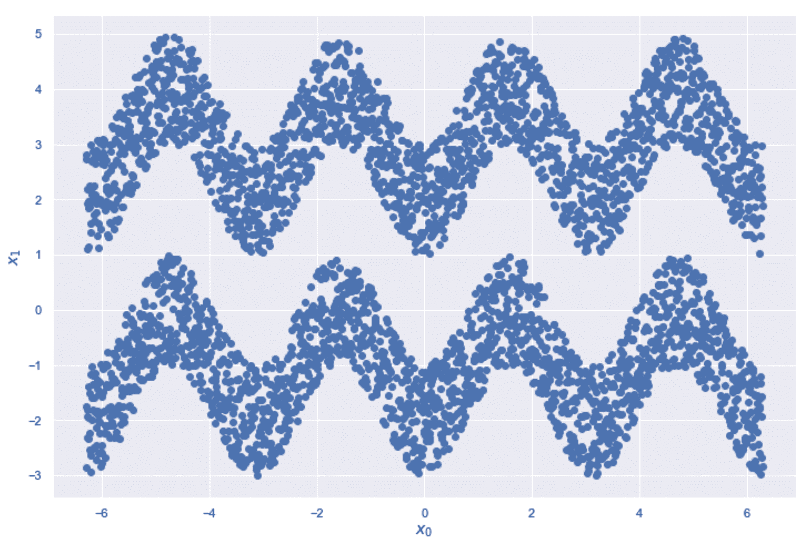

A sinusoidal dataset for the spectral clustering example

我们尚未指定任何基本事实； 但是，目标是将两个正弦曲线分开（非正弦曲线）。 很容易检查捕获正弦曲线的球是否还会包含许多属于另一个正弦曲线子集的样本。 为了显示纯 K 均值和频谱聚类之间的差异（scikit-learn 实现 Shi-Malik 算法，然后进行 K 均值聚类），我们将训练两个模型，后者使用 RBF（`affinity`参数，其中*γ= 2.0* （`gamma`参数）。 当然，我邀请读者也测试其他值和 KNN 相似性。 以下片段显示了基于 RBF 的解决方案：

```py
from sklearn.cluster import SpectralClustering, KMeans

km = KMeans(n_clusters=2, random_state=1000)
sc = SpectralClustering(n_clusters=2, affinity='rbf', gamma=2.0, random_state=1000)

Y_pred_km = km.fit_predict(data)
Y_pred_sc = sc.fit_predict(data)
```

结果显示在以下屏幕截图中：

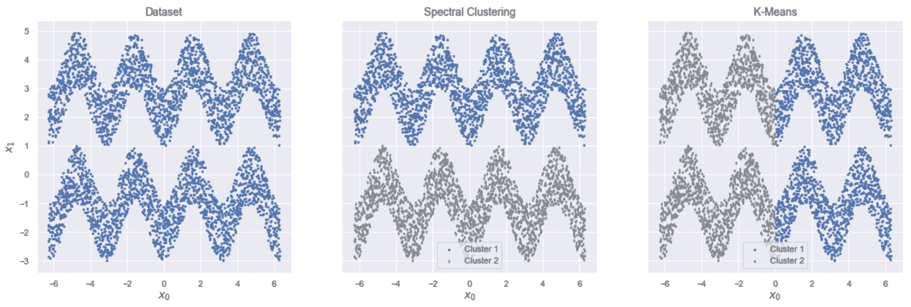

Original dataset (left). Spectral clustering result (center). K-means result (right)

如您所见，K 均值将数据集沿 x 轴划分为两个球，而光谱聚类成功地正确分离了两个正弦曲线。 只要簇的数量和`X`的维数都不太大（在这种情况下，拉普拉斯算子的本征分解会变得非常昂贵），该算法就非常强大。 此外，由于该算法基于图形*切割*程序，因此，当簇数为偶数时，它非常适合。


# 平均移动


让我们考虑一个数据集 *X∈^(M×N)* （ *MN* 维样本）是从多元数据生成过程 *p [数据中得出的]* 。 **均值漂移**算法应用于聚类问题的目的是找到 *p [数据]* 最大的区域，并将周围子区域中包含的样本与 同一集群。 由于 *p [数据]* 是 P **鲁棒性密度函数**（**PDF**），因此将其表示为 以一小部分参数（例如均值和方差）为特征的常规 PDF（例如，高斯）的总和。 以这种方式，可以认为 PDF 由样本生成的概率最高。 我们还将在第 5 章，“软聚类和高斯混合模型”，和第 6 章，“异常检测”中讨论该过程。 出于我们的目的，将问题重构为一个迭代过程，可以更新均值向量（质心）的位置，直到达到最大值为止。 当质心到达其最终位置时，将使用标准邻域函数将样本分配给每个聚类。

该算法的第一步是确定近似 p [数据]的合适方法。 一种经典方法（将在 **Parzen 的使用上（将在[第  6](https://cdp.packtpub.com/hands_on_unsupervised_learning_with_python/wp-admin/post.php?post=26&action=edit#post_29) ，  “异常检测”中进行讨论）。 Windows** 。 就目前而言，可以说 Parzen 窗口是一个非负内核函数 *f（•）*，其特征是称为**带宽**的参数（有关更多详细信息，请参阅原始论文） *关于概率密度函数和模式的估计，Parzen E。，  《数理统计年鉴》 33，* 1962）。 顾名思义，此参数的作用是加宽或限制 Parzen 窗口接近其最大值的区域。 考虑到与高斯分布的类比，带宽具有与方差相同的作用。 因此，较小的带宽将产生在均值附近非常峰值的函数，而较大的值与较平坦的函数关联。 不难理解，在这种特定情况下，群集的数量由带宽和相反的方式隐式确定。 因此，大多数实现（例如 scikit-learn）仅采用一个参数，然后计算另一个参数。 考虑到该算法已设计为适用于概率分布，自然的选择是指定所需带宽或让实现检测最佳带宽。 这个过程看起来比施加特定数量的群集更为复杂，但是，在许多实际情况下，尤其是当至少部分地了解了基本事实时，测试不同带宽的结果会更容易。

均值平移的最常见选择是用`n`个扁平核的总和来近似数据生成过程（`n`是形心数）：


因此，收敛之后，每个样本都由最接近的质心表示。 不幸的是，这种近似导致了分段函数，该分段函数不太可能代表实际过程。 因此，最好基于相同的基础内核采用平滑的 Parzen 窗口 *K（•）*：

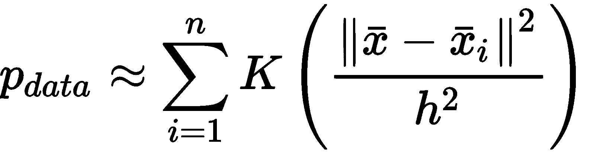

*K（•）*是平方距离（例如对于标准球）和带宽`h`的函数。 可以使用许多可能的候选函数，但是，当然最明显的是高斯核（RBF），其中 *h^2* 发挥方差的作用。 现在得到的近似值非常平滑，`n`峰对应于质心（即均值）。 定义函数后，就可以计算质心的最佳位置 *x [1] ，x [2] ，...，x [n]* 。

给定质心和邻域函数（为简单起见，我们假定使用半径为`h`和*的标准球 *B [h]* K（x）≠0∀x∈B [r]* ），相应的平均移位向量定义为：


可以看到， *m（•）*是加权为 *K（•）*的所有邻域样本的平均值。 显然，由于 *K（•）*是对称的并且具有一定的距离，所以 *x [i] [* 达到实际平均值。 带宽的作用是限制 *x [i]* 周围的区域。 现在应该更加清楚，较小的值会强制算法引入更多的质心，以便将所有样本分配给一个群集。 相反，较大的带宽可能导致单个群集具有*最终*配置。 迭代过程从初始质心猜测开始 *x [1]^(（0）)，x [2]^(（0）)等。 。，x [n]^(（0）)* ，并使用以下规则校正向量：


以前的公式很简单； 在每一步中，质心都会移动（移动）到 *m（•）*附近。 这样，由于`m`*（•）*与相对于 *x [i]* 计算的邻域密度成比例。 ，当 *x [i]* 到达概率最大的位置 *m（•）→m [最终]* 时，不需要更多更新 。 当然，收敛速度受样本数量的强烈影响。 对于非常大的数据集，该过程可能会变得很慢，因为每个平均移位向量的计算都需要对邻域进行预先计算。 另一方面，当聚类标准由数据密度定义时，该算法非常有用。

作为示例，现在让我们考虑具有`500`二维样本的合成数据集，该样本由三个带有对角协方差矩阵的多元高斯生成，如下所示：

```py
import numpy as np

nb_samples = 500

data_1 = np.random.multivariate_normal([-2.0, 0.0], np.diag([1.0, 0.5]), size=(nb_samples,))
data_2 = np.random.multivariate_normal([0.0, 2.0], np.diag([1.5, 1.5]), size=(nb_samples,))
data_3 = np.random.multivariate_normal([2.0, 0.0], np.diag([0.5, 1.0]), size=(nb_samples,))

data = np.concatenate([data_1, data_2, data_3], axis=0)
```

数据集显示在以下屏幕截图中：


Sample dataset for the MeanShift algorithm example

在这种情况下，我们知道基本事实，但是我们想测试不同的带宽并比较结果。 由于生成高斯粒子彼此非常接近，因此可以将某些*外部*区域识别为簇。 为了将研究重点放在最佳参数上，我们可以观察到平均方差（考虑不对称性）为 1，因此可以考虑值`h` = `0.9`，`1.0`，`1.2`和 `1.5`。 此时，我们可以实例化 scikit-learn 类`MeanShift`，将`h`值通过参数`bandwidth` 传递，如下所示：

```py
from sklearn.cluster import MeanShift

mss = []
Y_preds = []
bandwidths = [0.9, 1.0, 1.2, 1.5]

for b in bandwidths:
   ms = MeanShift(bandwidth=b)
    Y_preds.append(ms.fit_predict(data))
    mss.append(ms)
```

密度分析后，训练过程会自动选择质心的数量和初始位置。 不幸的是，这个数字通常大于最后一个数字（由于局部密度差异）； 因此，该算法将优化所有质心，但在完成操作之前，将执行合并过程以消除所有与其他质心太近（即重复的质心）的质心。 Scikit-learn 提供了参数`bin_seeding`，可以通过根据带宽对样本空间进行离散化（合并）来加快这项研究。 这样，有可能以合理的精度损失来减少候选者的数量。

下图显示了这四个训练过程结束时的结果：

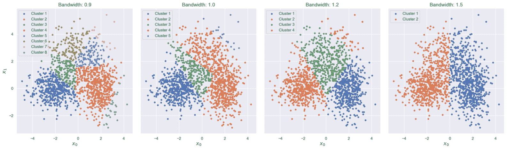

MeanShift clustering results for different bandwidths

如您所见，带宽的微小差异会导致群集数量不同。 在我们的情况下，最佳值为`h=1.2`，它产生的结果是确定了三个不同的区域（以及一个包含潜在异常值的额外聚类）。 最大聚类的质心大致对应于实际均值，但是聚类的形状与任何高斯分布都不相似。 这是可以通过采用其他方法解决的缺陷（在第 5 章 ， “软聚类和高斯混合模型”中进行了讨论）。 实际上，均值偏移适用于局部邻域，并且 *p [数据]* 不被认为属于特定分布。 因此，最终结果是将数据集非常准确地分割为高度密集的区域（注意不再需要最大分隔），这也可以从多个标准分布的叠加中得出。 没有任何先前的假设，我们不能期望结果非常规则，但是，将该算法与 VQ 进行比较，很容易注意到分配是基于找到每个密集 Blob 的最佳代表的想法。 因此，由高斯 *N（μ，Σ）*产生的一些点以低概​​率分配给质心比 *更具代表性的另一个聚类。 μ*。


# 数据库扫描


**DBSCAN** 是基于数据集密度估计的另一种聚类算法。 但是，与均值移位相反，没有直接参考数据生成过程。 在这种情况下，实际上，过程*通过自下而上的分析建立了样本之间的关系*，从`X`由高密度区域（气泡 ）由低密度的分隔。 因此，DBSCAN 不仅需要最大的分隔约束，而且为了确定群集的边界，它强制执行这种条件。 而且，此算法不允许指定所需的簇数，这是`X`结构的结果，但是，类似于均值移位，可以控制进程的粒度。

特别是，DBSCAN 基于两个基本参数：*ε*，它表示球的半径 *B [ε]（x [i] ）* *x [i]* 和 *n [min]* 上的样品，这是*中必须包含的最小样品数 B [ε] （x [i]* *）*，以便考虑 *x [i]* 作为**核心点**（即可以被视为集群的实际成员的点）。 形式上，给定一个函数 *N（•）*，该函数对集合中包含的样本数进行计数，则在以下情况下将样本 *x [i] ∈X* 称为核心点 ：


所有点 *x [j] ∈ B [ε] （x [i]* [ *）*定义为从 *x [i]* 直接密度可达的。 这样的条件是点之间最强的关系，因为它们都属于以`x`[`i`] 和*中包含的样本总数为中心的同一球。 B [ε]（x [i] ）*足够大，可以将邻域视为密集的子区域。 此外，如果存在 *x [i] →x [i + 1] →...→x* [`j`] ，其中 *x [i + 1]* 的密度直接来自 *x [i]* （适用于所有顺序对）`x`[`j`] 定义为 **x [i] 中密度可达的**。 该概念非常直观，可以通过考虑以下图表立即理解：****

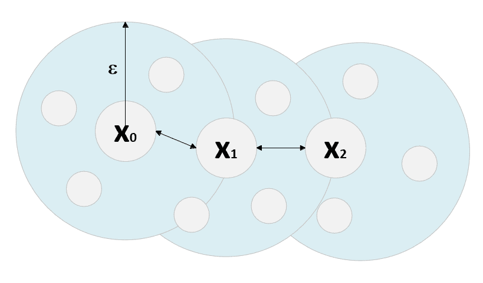

The point x[2] is density-reachable from x[0]  if n[min] = 4

如果我们将样本的最小数量设置为等于 4，则 **x [0]** ， **x [1]** 和 **x [2]** 是核心点， **x [0]** 和**可以直接直接达到 **x [1]** 的密度。 ] x [2]** 从 **x [1]** 直接密度可达。 因此， **x [2]** 从 **x [0]** 密度可达。 换句话说，这意味着可以从 **x [0] 开始定义一系列重叠的密集球（ *N（•）≥n [min]* ） ]** 并以 **x [2]** 结尾。 通过添加更多定义，可以将此概念扩展到属于球的所有其他点：给定点 *x [k]* ，点 *x [i [HTG54 如果 *x <sub class="calibre20">i]* 和 *x [j]* 从 *x [k]* 密度可达到。</sub>*

重要的是要了解这种情况比密度可达性弱，因为为了保证*密集链*，有必要考虑第三点，该点代表两个点之间的*连接器* 密集的次区域。 实际上，可能有两个密度连接点`a`和`b`，而`a`不能从`b`达到密度。 （反之亦然）。 只要仅在一个方向上移动就满足最小数量的样本条件（即，属于一个球的样本不是均匀分布，而是倾向于以较小的超量累积），就会发生这种情况。

因此，例如，如果 *N（a）> > n [min] 和 N（a [1] ）< < N（a）[* ，转换 *a→a [1]* 可以允许构建一个球 *B [ε]（a）*，其中还包含 *a [ [1]* （以及许多其他要点）。 但是，在*逆转换中 [1] →a， B [ε]* *（a [1 [] ）* 的密度不足以建立直接的密度可达性条件。

因此，当在两个方向之一上移动时，较长的序列可能会被*破坏*，从而导密集度可达性丧失。 现在应该更清楚地知道，在 *x [i]* 和 *x [j]* 两点之间的密度连接可以使我们避免此问题 还有一个点可以同时达到 *x [i]* 和 *x [j]* 。

所有具有 *x [i]* 和 *x [j] ∈X* 将分配给同一群集 *C [t]* 。 此外，如果 *x [k] ∈C [t]* ，则所有密度可达的点 *x [p] ∈X* *x [k]* 也将属于同一群集。 从任何其他点 *x [i] ∈X* 不可达到密度的点 *x [n]* 被定义为**噪声 点**。 因此，与其他算法相反，DBSCAN 输出`n`簇以及一个包含所有噪声点的附加集（不必将其视为离群值，而应视为不属于任何密集子区域的点）。 当然，由于噪声点没有标签，因此其数目应相当低； 因此，重要的是要调整参数*ε*和 *n [min]* ，以达到双重目的：最大化内聚力和分离度，避免过多的点被标记为噪点 。 没有实现此目标的标准规则，因此，我建议在做出最终决定之前测试不同的值。

最后，重要的是要记住，DBSCAN 可以处理非凸几何形状，并且与均值移位相反，它假设存在由低密度区域包围的高密度区域。 而且，它的复杂性与所采用的 KNN 方法（强力，球树或 kd 树）严格相关。 通常，当数据集不太大时，平均性能大约为 *O（N log N）*，但可能趋于 *O（N^2 ）* 当`N`非常大时。 要记住的另一个重要元素是样品的尺寸。 正如我们已经讨论的那样，高维度量可以减少两点的可分辨性，从而对 KNN 方法的性能产生负面影响。 因此，当维数很高时，应避免（或至少仔细分析）DBSCAN，因为生成的簇不能有效地表示实际的密集区域。

在显示具体示例之前，最好先介绍一种在未知的真实情况下可以采用的进一步评估方法。


# 卡林斯基-哈拉巴兹分数


假设将聚类算法应用于包含`M`个样本的数据集`X`，以便将其分割为 *n [c]* 聚类[ 由重心*μ [i] 表示的 HTG8 C [i]* i = 1..n [c] 。 我们可以将`W`**ithin-Cluster Dispersion**（**WCD**）定义如下：

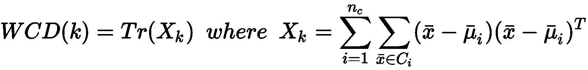

如果 *x [i]* 是`N`维列向量，则 *X [k] ∈ℜ^(N×N)* 。 不难理解， *WCD（k）*编码有关群集的*伪方差*的全局信息。 如果满足最大内聚条件，我们预计质心周围的分散性有限。 另一方面，即使 *WCD（k）*也可能受到包含异常值的单个群集的负面影响。 因此，我们的目标是在每种情况下都将 *WCD（k）*最小化。 以类似的方式，我们可以将`B`**集群间色散**（**BCD**）定义为：


在上一个公式中， *N（C [i] ）*是分配给群集 *C [i]* 和*μ的元素数* 是整个数据集的全局质心。 考虑到最大分离的原理，我们希望有一个远离全局质心的密集区域。 *BCD（k）*精确地表达了这一原理，因此我们需要对其进行最大化以实现更好的性能。

**Calinski-Harabasz 分数**定义为：


由于不考虑质心计算是聚类算法的一部分，因此引入了对预测标签的显式依赖性。 分数没有绝对含义，但是有必要比较不同的值以了解哪种解决方案更好。 显然， *CH [k] （•）*越高，聚类性能越好，因为这种条件意味着更大的分离度和更大的内部凝聚力。


# 使用 DBSCAN 分析工作缺勤数据集


旷工数据集（按照本章开头的说明进行下载）由 740 条记录组成，其中包含有关请假几天的员工的信息。 共有 20 个属性，分别代表年龄，服务时间，教育程度，习惯，疾病，纪律衰竭，交通费用，从家到办公室的距离等（这些字段的完整说明，请参见[这里](https://archive.ics.uci.edu/ml/datasets/Absenteeism+at+work)）。 我们的目标是预处理数据并应用 DBSCAN，以发现具有特定语义内容的密集区域。

第一步是按以下方式加载 CSV 文件（必须更改占位符`<data_path>`，以指向文件的实际位置）：

```py
import pandas as pd

data_path = '<data_path>\Absenteeism_at_work.csv'

df = pd.read_csv(data_path, sep=';', header=0, index_col=0).fillna(0.0)
print(df.count())
```

上一条命令的输出如下：

```py
Reason for absence                 740
Month of absence                   740
Day of the week                    740
Seasons                            740
Transportation expense             740
Distance from Residence to Work    740
Service time                       740
Age                                740
Work load Average/day              740
Hit target                         740
Disciplinary failure               740
Education                          740
Son                                740
Social drinker                     740
Social smoker                      740
Pet                                740
Weight                             740
Height                             740
Body mass index                    740
Absenteeism time in hours          740
dtype: int64
```

其中一些功能是分类的，并使用连续的整数进行编码（例如`Reason for absence`，`Month of absence`等）。 由于这些值可能会在没有确切语义原因的情况下影响距离（例如`Month=12`大于`Month=10`，但两个月的距离相等），因此在继续操作之前，我们需要对所有这些功能进行一次热编码 后续步骤（新功能将添加到列表末尾）。 在以下代码段中，我们使用`get_dummies()` pandas 函数来执行编码； 然后删除原始列：

```py
import pandas as pd

cdf = pd.get_dummies(df, columns=['Reason for absence', 'Month of absence', 'Day of the week', 'Seasons', 'Disciplinary failure', 'Education', 'Social drinker', 'Social smoker'])

cdf = cdf.drop(labels=['Reason for absence', 'Month of absence', 'Day of the week', 'Seasons', 'Disciplinary failure', 'Education', 'Social drinker', 'Social smoker']).astype(np.float64)
```

一键式编码的结果通常会在方法之间产生差异，因为许多特征将被限制为 0 或 1，而其他特征（例如，年龄）的范围可能会更大。 因此，最好对方法进行标准化（在不影响标准差的情况下，由于它们与现有信息内容成正比，因此保持不变是有帮助的）。 可以使用`StandardScaler`类设置参数`with_std=False`来完成此步骤，如下所示：

```py
from sklearn.preprocessing import StandardScaler

ss = StandardScaler(with_std=False)
sdf = ss.fit_transform(cdf)
```

在这一点上，像往常一样，我们可以使用 t-SNE 算法来减少数据集的维数（使用`n_components=2`）并可视化结构。 数据框`dff`将包含原始数据集和 t-SNE 坐标，如下所示：

```py
from sklearn.manifold import TSNE

tsne = TSNE(n_components=2, perplexity=15, random_state=1000)
data_tsne = tsne.fit_transform(sdf)

df_tsne = pd.DataFrame(data_tsne, columns=['x', 'y'], index=cdf.index) 
dff = pd.concat([cdf, df_tsne], axis=1)
```

生成的绘图显示在以下屏幕截图中：


t-SNE bidimensional representation of the Absenteeism at Work dataset

在进行任何考虑之前，重复一下 t-SNE 产生最佳的低维表示很重要，但是始终必须在原始数据集上测试算法，以检查 t-SNE 标识的邻居是否对应于实际的聚集体。 特别是，考虑到 DBSCAN 的结构，考虑到 t-SNE 表示形式，ε值可能是合理的，但是当移至更高维度的空间时，这些球不再能够捕获相同的样本。 但是，先前的图显示了被空白空间包围的密集区域的存在。 不幸的是，密度极不可能是均匀的（这是 DBSCAN 的建议要求之一，因为 *ε*和 *n [min]* 不能改变，但是在这种情况下，我们假设所有斑点的密度都是恒定的。

为了找到适合我们目的的最佳配置，我们绘制了簇数，噪声点数，轮廓分数和 Calinski-Harabasz 分数作为ε的函数，采用了 *p = 2* ， *p = 4* ， *p = 8* 和 *p = 12，*，如下图所示：

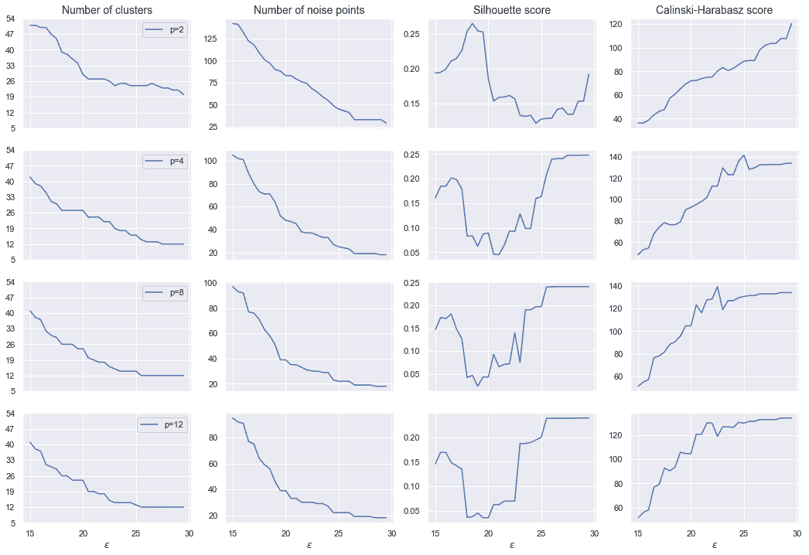

Evaluation metrics as functions of ε

Silhouette 和 Calinski-Harabasz 均基于凸簇的假设（例如，色散显然是一种假设样本围绕质心呈放射状分布的度量），因此在非凸情况下其期望值通常较小 。 但是，我们要最大化两个分数（剪影→1 和 Calinski-Harabasz →∞），同时避免大量聚类。 考虑到我们的最初目标（寻找以一组特定特征为特征的凝聚聚类），我们选择了 ε= 25 和 Minkowski 度量，其中 *p = 12* ， 这会产生合理数量的群集（13）和 22 个噪声点。 在 第 2 章 ， *聚类基本原理中，* 我们证明了，当 *p→∞*时（但效果 对于 *p > 2* 已经可见），距离趋向于最大的特征差异。

因此，应该始终通过上下文分析来证明这种选择是合理的。 在这种情况下，我们可以假设每个（非）凸斑点代表一个由特定特征（具有所有其他特征的次要贡献）主导的类别，因此 *p = 12* （导致 17 个簇） 对于中等粗粒度的分析（考虑有 20 个属性），这可能是一个很好的权衡。 此外， *ε= 22.5* 与最高的 Calinski-Harabasz 得分之一 129.3 和轮廓得分约等于 0.2 关联。 特别是，后者的值表示总体聚类是合理正确的，但可能存在重叠。 由于基础几何很可能是非凸的，因此考虑到具有相应峰值的 Calinski-Harabasz 分数，这样的结果是可以接受的（通常在凸形场景中不是这样）。 较大的ε值会产生略高的轮廓分数（小于 0.23），但是所得的簇数和 Calinski-Harbasz 分数均不受所得构型的影响。 必须清楚这一选择尚未得到任何外部证据的证实，必须通过对结果的语义分析加以验证。 如果需要进行细粒度的分析，则可以使用具有更多簇和更多噪声点的配置（因此，读者可以 *用这些值播放* 并提供一个 结果的解释）。 但是，此示例的最终目标仍然是相同的：分割数据集，以便每个群集包含特定的（可能是唯一的）属性。

现在，我们可以实例化`DBSCAN`模型，并使用包含规范化特征的数组`sdf`对其进行训练。 配置为 *ε= 25* （参数`eps`）和 *n [min] = 3* （参数`min_samples`），以及 Minkowski 度量（`metric='minkowski'`）和`p=12`。

现在，我们可以执行以下集群：

```py
from sklearn.cluster import DBSCAN
from sklearn.metrics import silhouette_score, calinski_harabaz_score

ds = DBSCAN(eps=25, min_samples=3, metric='minkowski', p=12)
Y_pred = ds.fit_predict(sdf)

print('Number of clusters: {}'.format(np.max(Y_pred) + 1))
print('Number of noise points: {}'.format(np.sum(Y_pred==-1)))

print('Silhouette score: {:.3f}'.format(silhouette_score(dff, Y_pred, metric='minkowski', p=12)))
print('Calinski-Harabaz score: {:.3f}'.format(calinski_harabaz_score(dff, Y_pred)))
```

由于`DBSCAN`用标签`-1`标记了噪声点，因此上一个代码段的输出如下：

```py
Number of clusters: 13
Number of noise points: 22

Silhouette score: 0.2
Calinski-Harabaz score: 129.860
```

生成的绘图显示在以下屏幕截图中：


Clustering result for the Absenteeism at Work dataset

如您所见（我建议运行代码以便获得更好的视觉确认），已成功检测出大多数孤立区域（即使在 t-SNE 图中没有内聚力），并且已将样本分配给了相同区域 簇。 我们还可以观察到两个基本结果：在 t-SNE 表示中，噪声点（带有叉号的标记）不是孤立的，并且某些群集被部分拆分。 这不是算法的失败，而是降维的直接结果。 在原始空间中，所有噪声点实际上都没有与任何其他样本紧密连接，但在 t-SNE 图中它们可能看起来重叠或接近某些斑点。 但是，我们对高密度和准粘结的非凸区域感兴趣，幸运的是，它们在二维图中也显示为连通。

现在让我们考虑两个不同的区域（为简单起见，将分析限制为单次热编码后的前 10 个属性）。 第一个是二维区域`x < -45`，如下所示：

```py
sdff = dff[(dff.x < -45.0)]
print(sdff[sdff.columns[0:10]].describe())
```

以下屏幕截图显示了输出的打印精美版本：


Statistical measures corresponding to the subdataset x < -45

有两个因素可以立即引起我们的注意：运输费用（这似乎标准化为 179 的值）和子孙的数量（考虑到平均值和标准差，对于大多数样本而言，其为 0）。 我们还考虑服务时间和从住所到工作的距离，这可以帮助我们找到群集的语义标签。 所有其他参数的判别力都较小，因此在此简要分析中将它们排除在外。 因此，我们可以假设这样的子集群包含大约 40 岁的没有孩子的人，服务时间较长，居住在离办公室很远的地方（我请读者检查总体统计数据以确认这一点），并且交通费用标准化（ 例如一次性支出汽车）。

现在让我们将该结果与 *-20 < x < 20* 和 *y < 20* 的区域进行比较，如下：

```py
sdff = dff[(dff.x > 20.0) & (dff.y > -20.0) & (dff.y < 20.0)]
print(sdff[sdff.columns[0:10]].describe())
```

相应的输出如下：

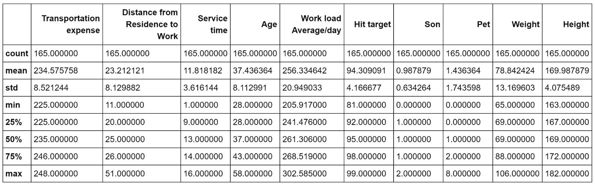

Statistical measures corresponding to the subdataset -20 < x < -20 and y < 20

在这种情况下，运输费用会更大，而从住所到工作的距离大约是前一个示例的一半（还要考虑标准差）。 此外，平均儿子数为 1，雇员中有两个孩子的雇员比例适中，服务时间约为 12，标准差为 3.6。 我们可以推断出，该集群包含所有年龄在（28-58）之间有家庭的（已婚）人的所有样本，这些人有家庭，办公室相对较近，但旅行费用较高（例如，由于使用出租车服务）。 这样的员工倾向于避免加班，但是他们的平均工作量几乎与前面示例中观察到的相同。 即使没有正式的确认，我们也可以假设这样的员工通常效率更高，而第一批员工包含生产型员工，但是他们需要更多的时间来实现他们的目标（例如，由于旅行时间更长）。

这显然不是详尽的分析，也不是一组客观的陈述。 目的是展示如何通过观察样本的统计特征来找到聚类的语义内容。 在现实生活中，所有观察都必须由专家（例如，HR 经理）进行验证，以便了解分析的最后部分（特别是语义上下文的定义）是否正确或是否正确。 需要使用更多的群集，不同的指标或其他算法。 作为练习，我邀请读者分析包含单个群集的所有区域，以完成大图并测试与不同类别相对应的人工样本的预测（例如，非常小的年轻人，有三个孩子的雇员， 等等）。


# 群集不稳定性作为性能指标


群集不稳定性是 Von Luxburg 提出的一种方法（在*群集稳定性：概述中， Von Luxburg U。， arXiv 1007：1075v1，2010* ）可以用以下方法衡量算法的优缺点： 关于特定数据集。 它可以用于不同的目的（例如，调整超参数或找到最佳数目的群集），并且它相对容易计算。 该方法基于这样的想法，即满足最大内聚和分离要求的聚类结果也应该对数据集的噪声扰动具有鲁棒性。 换句话说，如果将数据集`X`分割为簇集`C`，则派生数据集 *X [n]* （基于 功能）应映射到同一群集集。 如果不满足此条件，则通常有两种可能性：噪声扰动太强或算法对小变化过于敏感，因此不稳定。 因此，我们定义了原始数据集`X`的一组`k`扰动（或二次采样）版本：


如果我们应用产生相同数目簇 *n [c]* 的算法`A`，我们可以定义距离度量 *d（•）* *A（X [i] ）*和 *A（X [j] ）*之间的值，该值测量不一致分配的数量（即 *A（X [i] ）*，并且可以表示为返回对应于每个点的赋值的向量函数，因此 *d（•）*可以简单地计算 假设算法（如果需要）以相同的方式播种，并且数据集显然没有被改组，则算法的不稳定性（对于`k`*X 的噪声变化*）定义为：


因此，不稳定性是几对噪声变化的聚类结果之间的平均距离。 当然，该值不是绝对的，因此可以得出的规则是：选择产生最小不稳定的配置。 同样重要的是，这种方法不能与之前讨论的其他方法相提并论，因为它是基于其他超参数（噪声变化的数量，噪声均值和方差，二次采样率等），因此可以产生不同的结果。 当`A`和`X`固定时。 特别是噪声的大小会极大地改变不稳定性，因此在确定*μ*和*之前，有必要评估`X`的均值和协方差矩阵。 高斯噪声的Σ*。 在我们的示例中（基于“旷工”数据集中的 DBSCAN 聚类），我们从加性噪声项 *n [i] 〜N（E [X]* 开始创建了 20 个扰动版本。 ， *Cov（X）/ 4* ），然后应用从均匀分布 *U`(0, 1)`*中采样的乘法掩码。 这样，一些噪声项将被随机抵消或减少，如以下代码所示：

```py
import numpy as np

data = sdf.copy()

n_perturbed = 20
n_data = []

data_mean = np.mean(data, axis=0)
data_cov = np.cov(data.T) / 4.0

for i in range(n_perturbed):
    gaussian_noise = np.random.multivariate_normal(data_mean, data_cov, size=(data.shape[0], ))
    noise = gaussian_noise * np.random.uniform(0.0, 1.0, size=(data.shape[0], data.shape[1]))
    n_data.append(data.copy() + noise)
```

在这种情况下，我们想将不稳定性计算为*ε*的函数，但是可以使用任何其他算法和超参数重复该示例。 此外，我们采用归一化的汉明距离，该距离与两个聚类结果之间不一致分配的数量成正比，如下所示：

```py
from sklearn.cluster import DBSCAN
from sklearn.metrics.pairwise import pairwise_distances

instabilities = []

for eps in np.arange(5.0, 31.0, 1.5):
    Yn = []

    for nd in n_data:
        ds = DBSCAN(eps=eps, min_samples=3, metric='minkowski', p=12)
        Yn.append(ds.fit_predict(nd))

    distances = []

    for i in range(len(Yn)-1):
        for j in range(i, len(Yn)):
            d = pairwise_distances(Yn[i].reshape(-1, 1), Yn[j].reshape(-1, 1), 'hamming')
            distances.append(d[0, 0])

    instability = (2.0 * np.sum(distances)) / float(n_perturbed ** 2)
    instabilities.append(instability)
```

结果如下图所示：


Cluster instability of DBSCAN applied to the Absenteeism at Work dataset as a function of ε

对于*ε< 7* ，该值为空。 这样的结果归因于该算法产生的大量簇和噪声样本。 由于样本分布在不同的区域，因此小的扰动不会改变分配。 对于 *7 <* *ε< 17* ，我们观察到一个正斜率达到最大值，大约对应于*ε= 12.5* ，接着是 负斜率达到最终值 0。在这种情况下，聚类变得越来越大，并且包含了越来越多的样本。 但是，当*ε*仍然太小时，*密度可达性链*容易被小扰动破坏（也就是说，样本可以克服球的边界，因此将其排除在外） 来自群集）。 结果，在施加加性噪声之后，通常将样本分配给不同的群集。 当*ε= 12.5* 时，此现象达到最大值，然后开始变得不太明显。

实际上，当*ε*足够大时，球的并集能够*包裹*整个群集，从而为*留出足够的自由空间*以进行小扰动 。 当然，在取决于数据集的阈值之后，将仅产生单个簇，并且，如果噪声不太强，则任何扰动版本将产生相同的分配。 在我们的特定情况下，*ε= 25* 确保了高稳定性，这也可以通过 t-SNE 图得到证实。 一般而言，此方法可用于所有算法和几何形状，但建议您在决定如何创建受干扰的版本之前，先对`X`进行全面分析。 实际上，错误的决定会损害结果，产生较大/较小的不稳定性，并不表示性能不好/良好。 特别是，当聚类具有不同的方差时（例如，在高斯混合中），加性噪声项对某些样本的影响可以忽略不计，而它可以完全改变其余样本的结构。 在这些情况下，此方法比其他方法要弱，并且应使用方差很小（通常小于最小聚类（协）方差）的高斯噪声进行二次采样。 另一方面，使用基于密度的算法进行二次采样显然会非常危险，因为由于可达性的丧失，小型群集可能会成为一组孤立的噪声点。 我邀请读者也使用 K 均值测试此方法，以找到最佳的簇数（通常与最小不稳定性相关）。


# K-类固醇


在上一章中，我们显示了当簇的几何形状为凸形时，K 均值通常是一个不错的选择。 但是，该算法有两个主要局限性：度量始终为欧几里得，并且对异常值的鲁棒性不强。 第一个元素是显而易见的，而第二个元素是质心性质的直接结果。 实际上，K 均值选择质心作为不属于数据集的实际均值。 因此，当聚类具有一些离群值时，均值会受到影响并朝着它们成比例地移动。 下图显示了一个示例，其中一些异常值的存在迫使质心到达密集区域之外的位置：


Example of centroid selection (left) and medoid selection (right)

提出了 **K-类固醇**（在基于 L1-Norm 和相关方法的统计数据分析中，通过 Medoids，Kaufman L.，Rousseeup PJ，  进行聚类 -Holland，，1987 年），最初是为了缓解对异常值的缺乏鲁棒性的问题（在原始论文中，该算法仅设计用于曼哈顿度量标准），但后来设计了不同版本，以允许使用任何度量标准 （尤其是任意的 Minkowski 指标）。 与 K 均值的主要区别在于质心的选择，在这种情况下，质心是始终属于数据集的示例性样本（称为 **medoids** ）。 该算法本身与标准 K 均值非常相似，并且替代了 medoids 的定义*μ [i] = x [i] ∈X* 分配给聚类 *C [i]* 的所有其他样本的平均或总距离），然后将样本重新分配给具有最接近 medoid 的聚类。

容易理解的是，离群值不再具有较高的权重，因为与标准质心相反，离群值被选择为质心的可能性接近于零。 另一方面，当簇由*远且无法归类为离群值的*样本包围的密集斑点组成时，K-medoids 性能较差。 在这种情况下，该算法会错误地分配这些样本，因为它无法生成可以捕获它们的*虚拟球*（请注意，半径是由质心/质心的相互位置隐式定义的）。 因此，尽管 K 均值可以将质心移动到非密集区域以捕获远点，但当密集的斑点包含许多点时，K 质点不太可能以这种方式表现。

此外，K 质体趋向于*聚集*高度重叠的斑点，斑点的密度具有两个峰值，而 K 均值通常根据手段的位置将整个区域分为两部分。 如果凸几何的假设成立，则通常会接受此行为，但是在其他情况下这可能是一个限制（我们将在示例中展示这种效果）。

最后一个基本差异是公制距离。 由于没有限制，所以 K 型药物或多或少具有攻击性。 正如我们在第 2 章，“聚类基本原理”中讨论的那样，最长的距离由 Manhattan 度量标准提供（以相同的方式评估每个组件），而当`p`增加（以通用的 Minkowski 度量），组件之间的最大差异成为主导。 K 均值基于最常见的权衡（欧几里德距离），但是在某些特殊情况下，较大的`p`可以带来更好的性能（比较 *p = 1* 与 *p > 1* ）。 例如，如果 *c [1] =`(0, 0)`*， *c [2] =`(2, 1)`*和 *x =（0.55，1.25）*，曼哈顿距离 *d [1] （x，c [1] ）*和 *d [1] （x，c [2] ）*分别为 1.8 和 1.7，而欧几里得距离为 1.37 和 1.47。 因此，在 *p = 1* 的情况下，该点被分配给第二个簇，而在 *p = 2* 的情况下，该点被分配给第一个簇。

通常，预测正确的`p`值并不容易，但始终可以使用轮廓和调整后的 Rand 得分等方法测试几种配置，并选择产生更好分割效果的方法（即 ，最大内聚力和分离度或更高的调整后的 Rand 得分）。 在我们的示例中，我们将生成一个也包含基本事实的数据集，因此我们可以使用后一个选项轻松评估性能。 因此，我们将使用函数`make_blobs`生成`1000`样本，这些样本在由`[-5.0, 5.0]` 界定的框中分成`8`个 blob，如下所示：

```py
from sklearn.datasets import make_blobs

nb_samples = 1000
nb_clusters = 8

X, Y = make_blobs(n_samples=nb_samples, n_features=2, centers=nb_clusters, 
                  cluster_std=1.2, center_box=[-5.0, 5.0], random_state=1000)
```

结果数据集呈现出一些强烈的重叠（如最终图所示），因此我们不希望使用对称方法获得高级结果，但是我们有兴趣比较 K 均值和 K 均值的赋值 。

让我们开始评估由 K 均值达到的调整后的兰德分数，如下：

```py
from sklearn.cluster import KMeans
from sklearn.metrics import adjusted_rand_score

km = KMeans(n_clusters=nb_clusters, random_state=1000)
C_km = km.fit_predict(X)

print('Adjusted Rand score K-Means: {}'.format(adjusted_rand_score(Y, C_km)))
```

前一个块的输出如下：

```py
Adjusted Rand score K-Means: 0.4589907163792297
```

这个值足以理解 K 均值在进行错误分配，尤其是在重叠区域中。 由于使用这种方法很难对数据集进行聚类，因此我们并不将这一结果视为真实的指标，而只是将其视为可以与 K-medoids 得分进行比较的量度。 现在，我们使用带有`p = 7`的 Minkowski 度量来实现此算法（邀请读者更改此值并检查结果），如下所示：

```py
import numpy as np

C = np.random.randint(0, nb_clusters, size=(X.shape[0], ), dtype=np.int32)
mu_idxs = np.zeros(shape=(nb_clusters, X.shape[1]))

metric = 'minkowski'
p = 7
tolerance = 0.001

mu_copy = np.ones_like(mu_idxs)
```

数组`C`包含分配，而`mu_idxs`则包含 medoids。 由于存储整个 medoids 所需的空间量通常很小，因此我们首选此方法，而不是仅存储索引。 优化算法为，如下所示：

```py
import numpy as np

from scipy.spatial.distance import pdist, cdist, squareform
from sklearn.metrics import adjusted_rand_score

while np.linalg.norm(mu_idxs - mu_copy) > tolerance:
    for i in range(nb_clusters):
        Di = squareform(pdist(X[C==i], metric=metric, p=p))
        SDi = np.sum(Di, axis=1)

        mu_copy[i] = mu_idxs[i].copy()
        idx = np.argmin(SDi)
        mu_idxs[i] = X[C==i][idx].copy()

    C = np.argmin(cdist(X, mu_idxs, metric=metric, p=p), axis=1)

print('Adjusted Rand score K-Medoids: {}'.format(adjusted_rand_score(Y, C)))
```

行为非常简单。 在每次迭代中，我们都计算出属于一个簇的所有元素之间的成对距离（这实际上是最昂贵的部分），然后选择使总和最小的 medoids。 循环后，我们通过最小化它们与类固醇的距离来分配样品。 重复该操作，直到类固醇的范数变化变得小于预定阈值为止。 调整后的 Rand 得分为，如下所示：

```py
Adjusted Rand score K-Medoids: 0.4761670824763849
```

The final adjusted Rand score is influenced by the random initialization of the algorithm (hence, the previous result can slightly change when running the code). In real applications, I suggest employing a double stopping criterion based on the maximum number of iterations together with a small tolerance.

因此，即使没有解决重叠问题，其性能也比 K 均值稍好。 下面的屏幕快照显示了地面真相，K 均值和 K 质素结果：


Ground truth (left), K-means (center), and K-medoids (right)

如您所见，基本事实包含两个非常难以聚类的重叠区域。 在此特定示例中，我们对解决此问题不感兴趣，而是对展示两种方法的不同行为感兴趣。 如果考虑前两个 Blob（左上角），则 K 均值将整个区域分为两部分，而 K 均值将所有元素分配给同一簇。 在不知道基本事实的情况下，后一个结果可能比第一个更连贯。 实际上，观察第一张图，可能会发现密度差并不足以完全证明分裂的合理性（但是，在某些情况下这是合理的）。 由于该区域非常密集且与邻近区域分开，因此单个群集很可能是预期的结果。 此外，几乎不可能根据差异来区分样本（错误地分配了靠近分离线的大多数样本），因此，K-medoids *的攻击性*比 K 均值少，并且显示出更好的权衡性。 相反，两个算法几乎以相同的方式管理第二个重叠区域（右下）。 这是由于以下事实：K 均值将质心放置在非常接近某些实际样本的位置。 在这两种情况下，算法需要在 0 和 4 之间创建几乎水平的间隔，因为否则无法分割区域。 这种行为是所有基于标准球的方法所共有的，在这种特殊情况下，这是极其复杂的几何体的正常结果（许多相邻点具有不同的标签）。 因此，我们可以通过说 K-medoids 对异常值更健壮，并通过避免不必要的分离而有时比 K 均值更好地表现出结论。 另一方面，在非常密集的区域中没有异常值时，这两种算法（尤其是采用相同度量时）是等效的。 作为练习，我邀请读者使用其他指标（包括余弦距离）并比较结果。


# 在线聚类


有时，数据集太大而无法容纳在内存中，或者样本通过通道流式传输并在不同的时间步长接收。 在这种情况下，不能使用前面讨论的算法，因为自第一步以来，它们就假定要访问整个数据集。 由于这个原因，已经提出了一些在线替代方案，并且当前它们已在许多现实生活中实现。


# 迷你批量 K 均值


该算法是标准 K 均值的扩展，但是，由于不能对所有样本都计算质心，因此有必要包括一个额外的步骤，当现有聚类不再有效时，该步骤负责重新分配样本。 特别是，**迷你批处理 K 均值**代替了计算均值的方法，可以处理流平均值。 收到批量后，该算法将计算部分均值并确定质心的位置。 但是，并非所有集群都具有相同数量的分配，因此算法必须决定是等待还是重新分配样本。

通过考虑效率非常低的流处理过程，可以立即理解该概念，该过程开始发送属于半空间的所有样本，并且仅包括属于互补半空间的几个点。 由于簇的数量是固定的，因此该算法将开始优化质心，同时仅考虑一个子区域。 假设质心已放置在球的中心，该球围绕着属于互补子空间的几个样本。 如果越来越多的批量继续向密集区域添加点，则算法可以合理地决定丢弃孤立的质心并重新分配样本。 但是，如果进程开始发送属于互补半空间的点，则该算法必须准备好将它们分配给最合适的聚类（也就是说，它必须将其他质心放置在空白区域中）。

该方法通常基于称为**重分配比** *α*的参数。 当 *α*较小时，该算法将等待更长的时间才能重新分配样本，而较大的值会加快此过程。 当然，我们要避免两种极端情况。 换句话说，我们需要避免过于静态的算法在做出决定之前需要大量样本，同时又需要避免过于快速变化的算法来在每次批处理后重新分配样本。 通常，第一种情况产生的次优解决方案具有较低的计算成本，而后一种情况可能变得非常类似于每次批处理后重新应用于流数据集的标准 K 均值。 考虑到通常与实时过程有关的这种情况，我们通常对需要高计算成本的极其精确的解决方案不感兴趣，而对在收集新数据时得到改进的良好近似值不感兴趣。

但是，必须考虑每个单个上下文来评估重新分配比率的选择，包括合理地预定义流传输过程（例如，它是纯随机的吗？样本是否独立？某些样本在特定时间内是否更频繁） -帧？）。 同样，必须群集的数据量（即批处理大小，这是一个非常重要的因素），当然还有可以配置的硬件。 通常，有可能证明迷你批 K 均值产生的结果可与标准 K 均值相媲美，并且批大小不是太小时具有较低的内存需求和较高的计算复杂性（但这通常不是可控的超参数，因为它取决于 外部资源），并相应地选择重新分配比率。

相反，如果从真实数据生成过程中对批量进行均匀采样，则重新分配比率将成为次要参数，并且其影响会更低。 实际上，在这些情况下，批量大小通常是获得良好结果的主要影响因素。 如果足够大，该算法可立即确定质心的最可能位置，并且后续批量无法显着更改此配置（因此减少了对连续重新分配的需求）。 当然，在在线情况下，很难确定数据生成过程的结构，因此通常只能假设一批（如果不是太小）包含每个独特区域的足够代表。 数据科学家的主要任务是通过收集足够的样本以执行完整的 K 均值并将性能与迷你批处理版本进行比较来验证该假设。 观察到批处理量较小的最终结果（具有相同的重新分配比率）更好的方案也就不足为奇了。 通过考虑该算法不会立即重新分配样本可以理解这种现象。 因此，有时，较大的批量可能导致错误的配置，但是该配置具有更多的代表，因此重新分配的可能性较低（也就是说，算法更快但准确性更低）。 相反，在相同情况下，由于频繁的重新分配（具有更精确的最终配置），较小的批处理可能会迫使算法执行更多的迭代。 由于定义通用的经验法则并不容易，因此一般建议是在做出决定之前检查不同的值。


# 桦木


该算法（其名称代表**使用层次结构**的平衡迭代约简和聚类）具有比小批量 K 均值稍微复杂的动态特性，最后一部分采用了一种方法（**层次聚类**） 我们将在第 4 章，“层次结构聚类”中进行介绍。 然而，出于我们的目的，最重要的部分涉及数据准备阶段，该阶段基于称为 **聚类**或 **特征特征树**的特定树结构（ **CF 树**）。 给定数据集`X`，树的每个节点都由三个元素的元组组成：


特征元素分别是属于一个节点的样本数，所有样本的总和以及平方范数的总和。 做出此选择的原因将立即清楚，但让我们现在将注意力集中在树的结构上，以及在尝试平衡高度时如何插入新元素。 在下图中，有一个 CF-Tree 的通用表示形式，其中所有终端节点都是必须合并的实际子集群，以获得所需数量的集群：

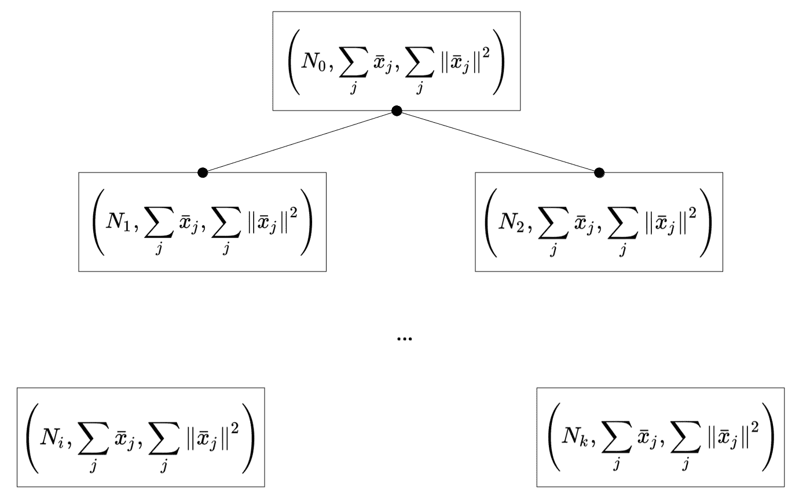

Example of a simple CF-Tree with a binary repartition

在上图中，点代表指向子节点的指针。 因此，每个非终端节点都与指向其所有子节点的指针（ *CF [i] ，p [i]* ）一起存储，而终端节点是纯 CF。 为了讨论插入策略，必须考虑另外两个元素。 第一个称为**分支因子**`B`，而第二个称为**阈值**`T`。 此外，每个非终端节点最多可以包含`B`个元组。 通过减少存储的数据量和计算数量，设计了此策略，以最大程度地提高仅依赖于主内存的流处理过程的性能。

现在考虑需要插入的新样本 *x [i]* 。 很容易理解 *CF [j] 的质心=（n [j] ， [j] ，b [j] ）* 只是*μ [j] = a [j] / n [j]* ； 因此， *x [i]* 沿着树传播，因为它到达了末端 CF（子集群），在此处距离 *d（x [i] ， μ [j] ）*是最小值。 到那时，CF 会逐步更新：


但是，如果没有控制权，则树很容易变得不平衡，从而导致性能损失。 因此，该算法执行一个附加步骤。 一旦确定了 CF，就计算更新后的半径 *r [j]* ，以及是否 *r [j] > T* 并且 CF 的数量大于分支因子，分配新的块并且原始的 CF 保持不变。 由于这个新块几乎完全是空的（ *x [i]* 除外），BIRCH 会执行一个附加步骤来检查所有子集群之间的差异（此概念在[第 4 章中会更清楚](https://cdp.packtpub.com/hands_on_unsupervised_learning_with_python/wp-admin/post.php?post=26&action=edit#post_27) ， “实用的分层聚类”；但是，读者可以考虑属于两个不同子类的点之间的平均距离）。 最不相似的一对分为两部分，其中之一移到新块中。 这样的选择确保了子群集的高度紧凑性，并加快了最终步骤。 实际上，实际聚类阶段中涉及的算法需要合并子聚类，直到总数减少到所需值为止。 因此，如果先前已将总不相似性最小化，则更容易执行此操作，因为*段*可以立即识别为连续并合并。 在本章中将不详细讨论此阶段，但不难想象。 将所有终端 CF 依次合并到较大的块中，直到确定单个群集为止（即使当数量与所需群集数目匹配时也可以停止该过程）。 因此，与小批量 K 均值相反，此方法可以轻松管理大量簇 *n [c]* ，而当 *n [c 时效果不佳]* 很小。 实际上，正如我们在示例中将要看到的那样，其准确性通常比使用小批量 K 均值所能达到的精度低，并且其最佳用法要求准确选择分支因子和阈值。 由于此算法的主要目的是在在线情况下工作，因此`B`和`T`在处理了某些批量后可能会失效（而小批量 K 均值通常可以纠正 在几次迭代后聚类），产生次优的结果。 因此，BIRCH 的主要用例是需要非常细粒度细分的在线过程，而在所有其他情况下，通常最好选择小批量 K 均值作为初始选项。


# 小批量 K 均值和 BIRCH 的比较


在此示例中，我们想将这两种算法的性能与包含 2,000 个样本的二维数据集进行比较，该样本分为`8`个 blob（出于分析目的，我们也使用了基本事实），如下所示 ：

```py
from sklearn.datasets import make_blobs

nb_clusters = 8
nb_samples = 2000

X, Y = make_blobs(n_samples=nb_samples, n_features=2, centers=nb_clusters,
                  cluster_std=0.25, center_box=[-1.5, 1.5], shuffle=True, random_state=100)
```

下面的屏幕快照显示了数据集（已被改组以除去流传输过程中的任何相互关系）：

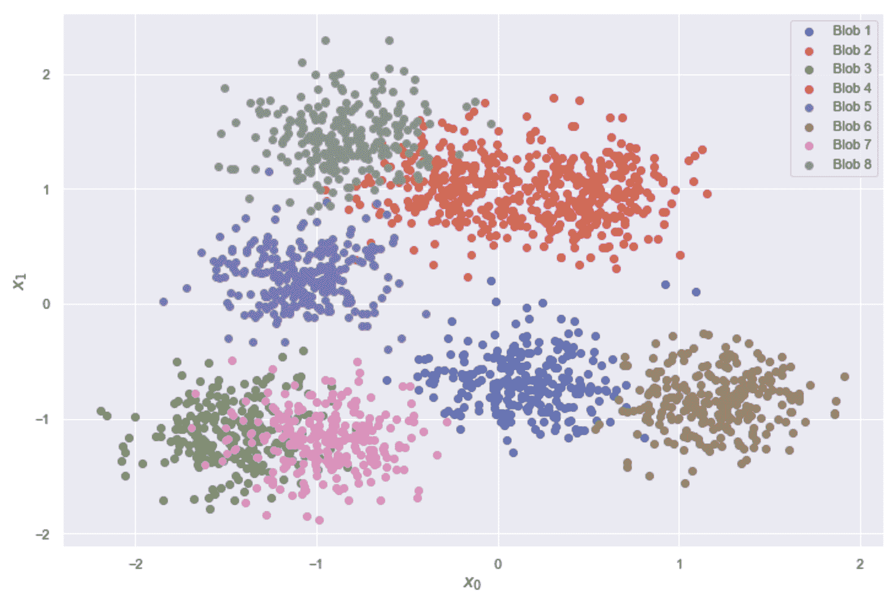Bidimensional dataset for a comparison between mini-batch K-means and BIRCH

在执行在线聚类之前，评估标准 K 均值的调整后的兰德得分非常有用，如下所示：

```py
from sklearn.cluster import KMeans

km = KMeans(n_clusters=nb_clusters, random_state=1000)
Y_pred_km = km.fit_predict(X)

print('Adjusted Rand score: {}'.format(adjusted_rand_score(Y, Y_pred_km)))
```

前一个块的输出为，如下所示：

```py
Adjusted Rand score: 0.8232109771787882
```

考虑到数据集的结构（没有凹面），我们可以合理地假设此值代表在线过程的基准。 现在，我们可以实例化类`MiniBatchKMeans`和`Birch`，其参数分别等于`reassignment_ratio=0.001`，`threshold=0.2`和`branching_factor=350`。 这些值是经过研究后选择的，但我邀请读者重复使用不同配置的示例，比较结果。 在这两种情况下，我们都假设批量大小等于`50`样本，如下所示：

```py
from sklearn.cluster import MiniBatchKMeans, Birch

batch_size = 50

mbkm = MiniBatchKMeans(n_clusters=nb_clusters, batch_size=batch_size, reassignment_ratio=0.001, random_state=1000)
birch = Birch(n_clusters=nb_clusters, threshold=0.2, branching_factor=350)
```

该示例的目标是现在采用方法`partial_fit()`逐步训练两个模型，并考虑到每个步骤之前处理的全部数据，评估调整后的 Rand 得分，如下所示：

```py
from sklearn.metrics import adjusted_rand_score

scores_mbkm = []
scores_birch = []

for i in range(0, nb_samples, batch_size):
    X_batch, Y_batch = X[i:i+batch_size], Y[i:i+batch_size]

    mbkm.partial_fit(X_batch)
    birch.partial_fit(X_batch)

    scores_mbkm.append(adjusted_rand_score(Y[:i+batch_size], mbkm.predict(X[:i+batch_size])))
    scores_birch.append(adjusted_rand_score(Y[:i+batch_size], birch.predict(X[:i+batch_size])))

print('Adjusted Rand score Mini-Batch K-Means: {}'.format(adjusted_rand_score(Y, Y_pred_mbkm)))
print('Adjusted Rand score BIRCH: {}'.format(adjusted_rand_score(Y, Y_pred_birch)))
```

前一个代码片段的输出包含整个数据集的调整后的 Rand 分数：

```py
Adjusted Rand score Mini-Batch K-Means: 0.814244790452388
Adjusted Rand score BIRCH: 0.767304858161472
```

不出所料，当处理完所有样本后，小批量 K 均值几乎达到基准，而 BIRCH 性能稍差。 为了更好地理解行为，让我们考虑将增量分数作为批量函数的图表，如下图所示：

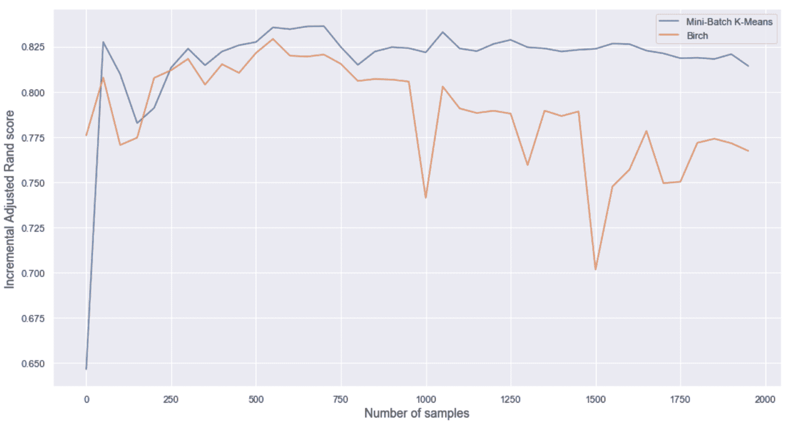Incremental adjusted Rand scores as functions of the batches (number of samples)

如您所见，小批量 K 均值很快就达到最大值，所有随后的振荡都是由于重新分配。 相反，BIRCH 的性能总是较差，且呈负趋势。 出现这种差异的主要原因是由于策略不同。 实际上，小批量 K 均值可以在几次批处理后纠正质心的初始猜测，并且重新分配不会显着改变配置。 另一方面，BIRCH 执行的合并数受样本数影响。

刚开始时，性能不是很相似，因为 CF 树中的子簇的数量不是很大（因此，聚合更多*相干*），但是经过几批之后，BIRCH 必须进行聚合 为了获得所需的最终簇数，越来越多的子簇。 这种情况以及越来越多的流样本数量驱使算法重新排列树，这常常导致稳定性的损失。 此外，数据集有一些重叠，可以通过对称方法更轻松地进行管理（实际上，即使分配错误，质心在这种情况下也可以到达其最终位置），而采用分层方法（例如 BIRCH 所采用的方法更能够找到所有子区域，但是在合并具有最小间距甚至更糟的重叠的子类时，更容易出错。 但是，此示例确认，通常首选小批量 K 均值作为首选，并且仅在性能不符合预期时（应谨慎选择其参数）才应选择 BIRCH。 我邀请读者使用更多所需的簇（例如`nb_clusters=20`和`center_box=[-10.5, 10.5]`）重复该示例。 可能会看到在这种情况下（保持所有其他参数不变），由小批量 K 均值执行的重新分配如何以较差的最终调整后的 Rand 分数减慢了收敛速度，而 BIRCH 立即达到了最佳值（几乎相等） 到通过标准 K 均值获得的结果），并且不再受样本数量的影响。


# 概要


在本章中，我们介绍了一些最重要的聚类算法，这些算法可用于解决非凸问题。 频谱聚类是一种非常流行的技术，它可以将数据集投影到一个新的空间上，在该空间上，凹形几何形状变为凸形，而标准算法（例如 K 均值）可以轻松地对数据进行分段。

相反，均值漂移和 DBSCAN 分析数据集的密度并尝试对其进行拆分，以使所有密集区域和连通区域合并在一起以构成聚类。 特别是，DBSCAN 在非常不规则的情况下非常有效，因为它基于连接的本地最近邻集，直到分离度超过预定义的阈值为止。 这样，该算法可以解决许多特定的聚类问题，唯一的缺点是，它还会产生无法自动分配给现有聚类的一组噪声点。 在基于旷工的数据集的示例中，我们展示了如何选择超参数，以便以最少的噪声点和可接受的轮廓或 Calinski-Harabasz 分数获得所需数量的聚类。

在最后一部分中，我们分析了 K-medoids 作为 K 均值的替代方法，它对于异常值也更可靠。 该算法不能用于解决非凸问题，但是它有时比 K 均值更有效，因为它没有选择实际的均值作为质心，而是仅依赖于数据集，并且聚类中心（称为 medoids）是示例性样本。 而且，该算法不严格地局限于欧几里得度量，因此，它可以充分利用替代距离函数的潜力。 最后一个主题涉及两种在线聚类算法（小批量 K 均值和 BIRCH），当数据集太大而无法放入内存或长时间流传输数据时，可以使用这些算法。

在下一章中，我们将分析一个非常重要的聚类算法系列，它们可以输出完整的层次结构，从而使我们能够观察到完整的聚合过程，并选择最有用和最一致的最终配置。


# 问题


1.  半月形的数据集是凸簇吗？
2.  二维数据集由两个半月组成。 第二个完全包含在第一个的凹腔中。 哪种内核可以轻松地将两个群集分离（使用光谱群集）？
3.  应用*ε= 1.0* 的 DBSCAN 算法后，我们发现噪点太多。 对于 *ε= 0.1* ，我们应该期待什么？
4.  K-medoids 基于欧几里得度量。 它是否正确？
5.  DBSCAN 对数据集的几何非常敏感。 它是否正确？
6.  数据集包含 10,000,000 个样本，可以使用 K 均值在大型计算机上轻松进行聚类。 相反，我们可以使用更小的机器和小批量的 K 均值吗？
7.  群集的标准偏差等于 1.0。 施加噪声`N`（0，0.005）后，80% 的原始分配被更改。 我们可以说这样的集群配置通常是稳定的吗？


# 进一步阅读


*   *归一化剪切和图像分割*， *J. Shi 和 J. Malik* ， *IEEE 模式分析和机器智能交易[* ， *Vol。 22* ，08/2000
*   *频谱聚类教程*， *Von Luxburg U.* ， 2007
*   *函数和图表 2* ， *Gelfand IM* ， *Glagoleva EG* ， *Shnol E.* *E.* ， *MIT 出版社，* 1969
*   *关于概率密度函数和模式的估计*， *Parzen E.* ， *《数学统计年鉴》，* 33，1962 年
*   *神经模糊网络在预测缺勤中的应用，Martiniano A.，Ferreira RP，Sassi RJ，Affonso C.，信息系统和技术（CISTI）* ，*第 7 届伊比利亚会议（第 1-4 页）。 IEEE* ，2012 年
*   *一种基于密度的算法，用于在带有噪声的大型空间数据库中发现簇* ， *Ester M.* ， *Kriegel HP* ，[ *Sander J.* ， *Xu X.* ， *第二届知识发现和数据挖掘国际会议论文集，俄勒冈州波特兰市，AAAI 出版社*，1996 年
*   *Mac* *hine 学习算法*，*第二版*， *Bonaccorso G.* ， *Packt Publishing* ，2018
*   *群集稳定性：概述*， *冯·卢森堡（U.*
*   *通过类固醇* *进行聚类，Kaufman L.，Rousseeuw PJ，基于 L1* *] –规范及相关方法* ，*北荷兰*，1987 年


