# 实用的层次聚类


在本章中，我们将讨论层次聚类的概念，层次聚类是一种强大而广泛的技术，用于生成完整的聚类配置层次，从与数据集等效的单个群集（除法）开始，或者等于样本数量（凝聚法）的多个群集。 当需要立即分析整个分组过程以了解例如如何将较小的群集合并为较大的群集时，此方法特别有用。

特别是，我们将讨论以下主题：

*   层次聚类策略（分裂式和凝聚式）
*   距离度量和链接方法
*   树状图及其解释
*   凝聚聚类
*   作为一种表现指标的 Cophenetic 相关性
*   连通性约束


# 技术要求


本章中提供的代码要求以下内容：

*   Python3.5+（强烈建议使用 [Anaconda 发行版](https://www.anaconda.com/distribution/)）
*   库：
    *   SciPy 0.19+
    *   NumPy 1.10+
    *   Scikit-Learn 0.20+
    *   Pandas 0.22+
    *   Matplotlib 2.0+
    *   Seaborn 0.9+

数据集可以从 UCI 机器学习存储库中获得。 可以从[这里](https://archive.ics.uci.edu/ml/datasets/water+treatment+plant)下载 CSV 文件，除了添加列名外，不需要任何预处理。 ，这将在加载阶段发生。

[可以在 GitHub 存储库上找到示例](https://github.com/PacktPublishing/HandsOn-Unsupervised-Learning-with-Python/tree/master/Chapter04)。


# 层次聚类


在前面的章节中，我们分析了聚类算法，其中 ， 输出是基于预定义数量的聚类或参数集结果和精确的基础几何结构的单个分割。 另一方面，**层次聚类**生成一系列聚类配置，这些聚类配置可以排列在树的结构中。 具体来说，让我们假设有一个数据集`X`，其中包含`n`个样本：


**凝聚**方法是通过将每个样本分配到一个集群`C[i]`开始的，然后通过在每个步骤合并两个集群直到单个最终集群（对应于`X`）已产生：


在前面的示例中，群集`C[i]`和`C[j]`合并为`C[k]`； 因此，我们在第二步中获得`n-1`个簇。 该过程继续进行，直到剩下的两个群集合并为一个包含整个数据集的单个块。 相反，**分裂**方法（由 Kaufman 和 Roussew 最初提出，使用 DIANA 算法）在相反的方向上操作，从`X`开始，最后每个群集包含单个样本：


在这两种情况下，结果都是层次结构的形式，其中每个级别都是通过在上一个级别上执行合并或拆分操作来获得的。 复杂度是这两种方法之间的主要区别，因为分裂聚类的复杂度更高。 实际上，合并/拆分决定是通过考虑所有可能的组合并通过选择最合适的组合（根据特定标准）来做出的。 例如，在比较第一步时，很明显（在团聚的情况下）找到最合适的几个样本要比考虑所有可能的组合（在`X`中， 分裂情形），这需要指数级的复杂性。

由于最终结果几乎相同，而除法算法的计算复杂度要高得多，因此，一般而言，没有特别的理由偏爱这种方法。 因此，在本书中，我们将仅讨论凝聚聚类（假设所有概念都可立即应用于除法算法）。 我鼓励您始终考虑整个层次结构，即使需要大多数实现（例如 scikit-learn）来指定所需的集群数量。 实际上，在实际的应用中，最好是在达到目标后停止该过程，而不是计算整个树。 但是，此步骤是分析阶段的重要组成部分（尤其是在没有很好定义簇数的情况下），我们将演示如何可视化树并针对每个特定问题做出最合理的决策。


# 凝聚聚类


从其他算法中可以看出，为了执行聚合，我们需要先定义一个距离度量，该度量代表样本之间的不相似性。 我们已经分析了其中许多，但在这种情况下，开始考虑通用**闵可夫斯基距离**（用`p`参数化）会有所帮助：

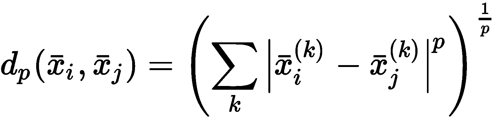

两个特定情况对应于`p = 2`和`p = 1`。 在前一种情况下，当`p = 2`时，我们获得标准**欧几里德距离**（等于`L[2]`范数）：

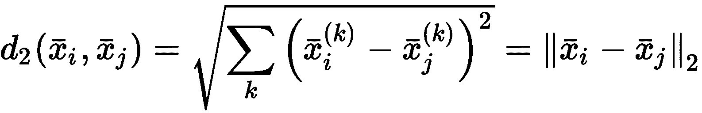

当`p = 1`时，我们获得**曼哈顿**或**城市街区**距离（等于`L[1]`范数 ）：

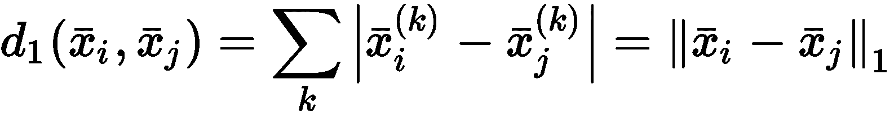

这些距离之间的主要差异在第 2 章，“聚类基础知识”中进行了讨论。 在本章中，介绍**余弦**距离很有用，这不是一个合适的距离度量（从数学角度来看），但是当样本之间的区分必须仅取决于他们形成的角度时，这将非常有帮助：

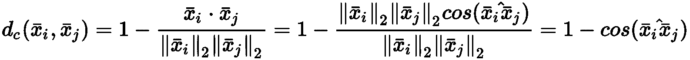

余弦距离的应用非常特殊（例如**自然语言处理**（**NLP**）），因此，这不是一个常见的选择。 但是，我建议您使用一些样本向量（例如`(0, 1), (1, 0)`和`(0.5, 0.5)`，因为它可以解决许多现实生活中的问题（例如，在 word2vec 中，可以通过检查它们的余弦相似度来轻松评估两个单词的相似度）。一旦定义了距离度量，定义**邻接矩阵**，`P`：


`P`是对称的，所有对角元素均为空。 因此，某些应用（例如 SciPy 的`pdist`函数）会产生一个压缩矩阵`P[c]`，这是一个仅包含矩阵上三角部分的向量`P[c]`的第`ij`元素对应于`d(x[i], x[j])`。

下一步是定义合并策略，在这种情况下，该策略称为**链接**。 链接方法的目标是找出必须在层次结构的每个级别合并为单个群集的群集。 因此，它必须与代表群集的通用样本集一起使用。 在这种情况下，假设我们正在分析几个群集`(c[a], c[b])`，并且我们需要找到哪个索引`a`或`b`对应于将要合并的对。


# 单一和完整的联系


最简单的方法称为**单个**和**完整链接**，它们的定义如下：


单链接方法选择包含最接近的样本对的样本对（每个样本属于不同的簇）。 下图显示了此过程，其中选择了`C1`和`C2`进行合并：


单链接的例子。 选择`C[1]`和`C[2]`来合并

这种方法的主要缺点是可能同时具有很小的簇和很大的簇。 正如我们将在下一部分中看到的那样，单个链接可以使*离群值*保持隔离，直到存在非常高的相异度级别为止。 为了避免或减轻该问题，可以使用平均值和沃德方法。

相反，完全链接定义为：


这种链接方法的目的是使属于合并簇的最远样本之间的距离最小。 在下图中，有一个完整链接的示例，其中已选择`C[1]`和`C[3]`：


完全链接的示例。 选择`C[1]`和`C[3]`进行合并

该算法选择`C[1]`和`C[3]`为了增加内部凝聚力。 实际上，很容易理解，考虑所有可能的组合，完全链接会导致群集密度最大化。 在上图所示的示例中，如果所需的簇数为两个，则合并`C[1]`和`C[2]`或`C[2]`和`C[3]`会产生具有较小内聚的最终构型，这通常是不希望的结果。


# 平均链接


另一种常见的方法称为**平均链接**（或**非加权组平均法**（**UPGMA**））。 定义如下：

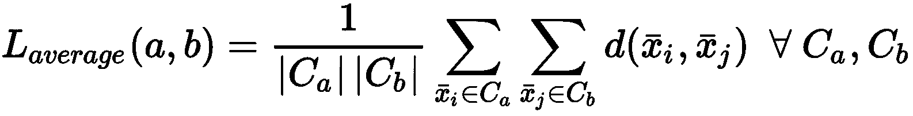

这个想法与完全链接非常相​​似，但是在这种情况下，考虑每个群集的平均值，并且目标是考虑所有可能的对`(c[a], c[b])`。 下图显示了平均链接的示例：

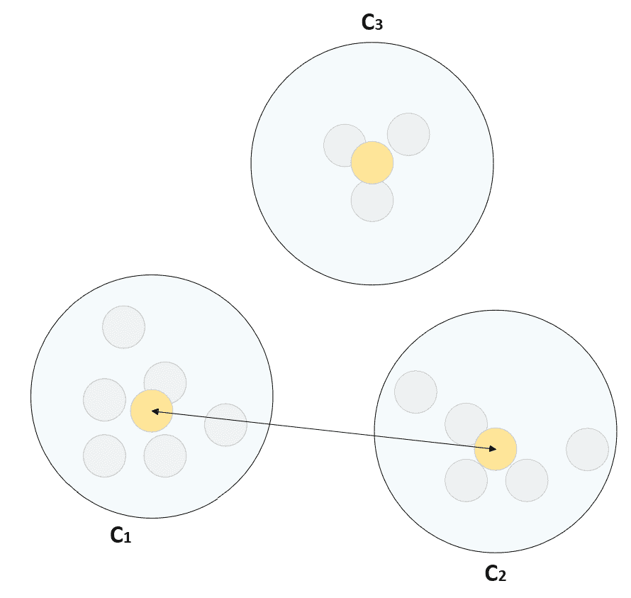

平均链接的示例。 选择`C[1]`和`C[2]`进行合并。 突出显示的点是平均值。

平均链接在生物信息学应用（定义层次聚类的主要环境）中特别有用。 对其属性的数学解释是不平凡的，我鼓励您查看原始论文（《一种评估系统关系的统计方法》），以获取更多详细信息。


# Ward 链接


我们要讨论的最后一种方法称为 **Ward 链接**（以其作者命名，最初是在《用于优化目标函数的分层分组过程》中提出的。 它基于欧几里得距离，其正式定义如下：

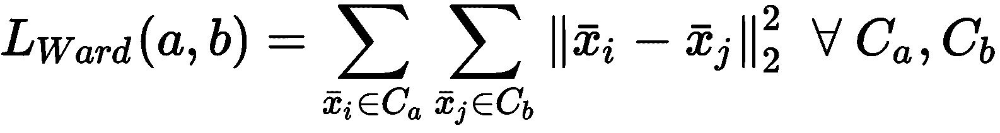

在每个级别上，都要考虑所有聚类，并选择其中两个聚类，以最小化平方距离的总和。 该过程本身与平均链接没有太大不同，并且有可能证明合并过程会导致集群方差的减少（即，增加其内部凝聚力）。 而且，沃德的联系倾向于产生包含大约相同数量样本的簇（也就是说，与单联系相比，沃德的方法避免了小簇和非常大的簇的存在，如下一节所述）。 Ward 的链接是一种流行的默认选择，但是，为了在每种特定情况下做出正确的选择，有必要引入树状图的概念。


# 分析树状图


**树状图**是一种树数据结构，它使我们能够表示由凝聚算法或分裂算法产生的整个聚类层次结构。 想法是将样本放置在`x`轴上，而相异度放置在`y`轴上。 每当两个聚类合并时，树状图就会显示与其发生的相异程度相对应的连接。 因此，在聚集情况下，树状图始终以所有被视为簇的样本开始，然后向上移动（方向完全是常规的），直到定义了一个簇。

出于教学目的，最好显示与非常小的数据集`X`相对应的树状图，但是我们将要讨论的所有概念都可以应用于任何情况。 但是，对于较大的数据集，通常需要应用一些截断法以更紧凑的形式可视化整个结构。

让我们考虑一个小的数据集`X`，它由`4`高斯分布生成的`12`二维样本组成，平均向量的范围为`(01, 1) × (-1, 1)`：

```py
from sklearn.datasets import make_blobs

nb_samples = 12
nb_centers = 4

X, Y = make_blobs(n_samples=nb_samples, n_features=2, center_box=[-1, 1], centers=nb_centers, random_state=1000)
```

数据集（带有标签）显示在以下屏幕截图中：


用于树状图分析的数据集

为了生成树状图（使用 SciPy），我们首先需要创建一个链接矩阵。 在这种情况下，我们选择了具有 Ward 链接的欧几里德度量标准（但是，与往常一样，我建议您使用不同的配置执行分析）：

```py
from scipy.spatial.distance import pdist
from scipy.cluster.hierarchy import linkage

dm = pdist(X, metric='euclidean')
Z = linkage(dm, method='ward')
```

`dm`数组是一个压缩的成对距离矩阵，而`Z`是通过沃德方法生成的链接矩阵（`linkage()`函数需要`method`参数，该参数除其他外接受`single`，`complete`，`average`和`ward`）。 此时，我们可以生成并绘制树状图（`dendrogram()` 函数可以使用默认或提供的 Matplotlib `axis`对象自动绘制图）：

```py
import matplotlib.pyplot as plt

from scipy.cluster.hierarchy import dendrogram

fig, ax = plt.subplots(figsize=(12, 8))

d = dendrogram(Z, show_leaf_counts=True, leaf_font_size=14, ax=ax)

ax.set_xlabel('Samples', fontsize=14)
ax.set_yticks(np.arange(0, 6, 0.25))

plt.show()
```

该图显示在以下屏幕截图中：


应用于数据集的对应 Ward 链接的树状图

如前面的屏幕快照中所述，`x`轴表示旨在最大程度降低交叉连接风险的样本，而`y`轴表示相异程度。 现在让我们从底部开始分析图。 初始状态对应于被视为独立聚类的所有样本（因此相异性为空）。 向上移动，我们开始观察第一次合并。 特别地，当相异度约为 0.35 时，样本 1 和 3 被合并。

当样本 0 和 9 也合并时，第二步发生的差异略小于 0.5。 创建单个群集时，该过程一直持续到相异度约为 5.25。 现在，当相差等于 1.25 时，水平剖析树状图。 查看基础连接，我们发现聚类结构为：{ 6 }，{ 7 ， 5 ， 8 }， { 0 ， 9 ， 4 ， 10 }，{ 11 }，{ 2 [ ， 1 ， 3 }。

因此，我们有五个聚类，其中两个由一个样本组成。 样本 6 和 11 是最后合并的样本，这并不奇怪。 实际上，它们之间的距离比其他所有区域都远。 在以下屏幕截图中，显示了四个不同的级别（只有包含多个样本的聚类用圆圈标记）：


通过在不同级别切割树状图而生成的簇（沃德链接）

易于理解，聚集从选择最相似的簇/样本开始，然后通过添加*最近邻*，直到到达树的根为止。 在我们的情况下，在相异度等于 2.0 的情况下，已检测到三个定义明确的簇。 左一个也保留在下一个剪切中，而右两个（显然更靠近）被选择合并以生成单个簇。 该过程本身很简单，不需要特别的解释。 但是，有两个重要的考虑因素。

第一个是树状图结构本身固有的。 与其他方法相反，层次聚类允许观察整个聚类树，当需要通过增加不相似度来显示流程如何演变时，此功能非常有用。 例如，产品推荐器应用无法提供有关代表用户的所需群集数量的任何信息，但是执行管理层可能会对理解合并过程的结构和演变方式感兴趣。

实际上，观察群集是如何合并的可以深入了解底层的几何，还可以发现哪些群集可能被视为较大群集的一部分。 在我们的示例中，在级别 0.5 处，我们有一个小的簇{ 1 ， 3 }。 问题是“可以通过增加不相似性将哪些样本添加到该群集中？” 可以立即用{ 2 }回答。 当然，在这种情况下，这是一个微不足道的问题，可以通过查看数据图来解决，但是对于高维数据集，如果没有树状图的支持，它可能会变得更加困难。

树状图的第二个优点是可以比较不同链接方法的行为。 使用 Ward 的方法，第一次合并发生的相异度很低，但是五个群集和三个群集之间存在较大的差距。 这是几何形状和合并策略的结果。 例如，如果我们使用单个链接（本质上非常不同）会发生什么？ 以下屏幕快照显示了相应的树状图：


与应用于数据集的单个链接相对应的树状图

结论是，树状图是不对称的，并且簇通常与单个样本或小的附聚物合并。 从右侧开始，我们可以看到样本{ 11 }和{ 6 }合并得很晚。 此外，当必须生成最终的单个簇时，样本{ 6 }（可能是异常值）被合并。 通过以下屏幕快照可以更好地理解该过程：


通过在不同级别切割树状图而生成的簇（单链接）

从屏幕快照中可以看到，虽然 Ward 的方法生成包含所有样本的两个聚类，但单个链接通过将潜在异常值保持在外部来聚集级别 1.0 上的最大块。 因此，树状图还允许定义聚合语义，这在心理学和社会学方面非常有用。 尽管 Ward 的链接与其他对称算法非常相似，但单个链接具有逐步显示的方式，显示了对逐步构建的聚类的潜在偏好，从而避免了相异性方面的巨大差距。

最后，有趣的是，尽管 Ward 的链接通过在级别 3.0 处切断树状图产生了潜在的最佳簇数（三个），但单个链接从未达到这样的配置（因为簇{ 6 }仅在最后一步中合并。 该效果与最大分离和最大内聚的双重原理紧密相关。 沃德的联系往往会很快找到最具凝聚力和最独立的集群。 当相异性差距超过预定义的阈值时（当然，当达到所需的簇数时），它可以切割树状图，而其他链接则需要不同的方法，有时会产生不希望的最终配置。

考虑到问题的性质，我始终鼓励您测试所有链接方法的行为，并为某些示例场景（例如，根据教育水平，居住地， 和收入）。 这是提高认识并提高提供流程语义解释的能力的最佳方法（这是任何聚类过程的基本目标）。


# 作为表现指标的 Cophenetic 相关性


可以使用前面各章中介绍的任何方法来评估层次集群性能。 但是，在这种特定情况下，可以采用特定措施（不需要基本事实）。 给定一个近似矩阵`P`和一个链接`L`，几个样本`x[i]`和`x[j] ∈ X`始终分配给特定层次级别的同一群集。 当然，重要的是要记住，在团聚的情况下，我们从`n`个不同的簇开始，最后以一个等于`X`的单个簇结束。 此外，由于两个合并的群集成为一个群集，因此属于一个群集的两个样本将始终继续属于同一*扩充的*群集，直到该过程结束。

考虑到上一节中显示的第一个树状图，样本`{1}`和`{3}`立即合并； 然后添加样本`{2}`，然后添加`{11}`。 此时，整个簇将与另一个块合并（包含样本`{0}, {9}, {4}, {10}`）。 在最后一级，将剩余的样本合并以形成单个最终群集。 因此，命名相似度`DL[0]`，`DL[1]`，...和`DL[k]`，样本`{1}`和{ 3 }在`DL[1]`处开始属于同一簇。 例如，在`DL[6]`的同一簇中发现`{2}`和`{1}`。

此时，我们可以将`DL[ij]`定义为`x[i]`和`x[j]`首次属于同一簇，并且将以下`n×n`**对称矩阵**作为`CP`：

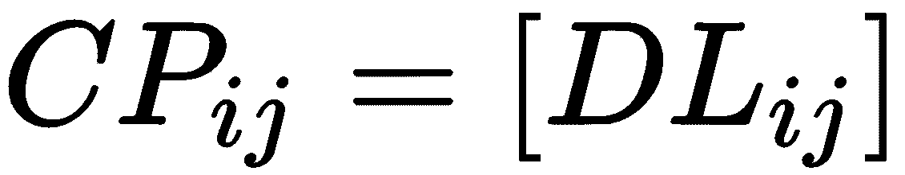

换句话说，`CP[ij]`元素是观察同一群集中`x[i]`和`x[j]`所需的最小差异。 可以证明`CP[ij]`是`x[i]`和`x[j]`之间的距离度量; 因此，`CP`与`P`类似，并且具有与邻近矩阵相同的属性（例如，所有对角元素为空）。 特别是，我们对它们的相关性感兴趣（在`-1`和`1`范围内标准化）。 这样的值（**Cophenetic 系数**（**CPC**）表示`P`和`CP`之间的一致性程度，并且可以很容易地计算出， 如以下等式所示。

由于`P`和`CP`均为`n×n`对称矩阵且对角元素为空，因此可以仅考虑下三角部分（不包括对角线，表示为`Tril(·)`），包含`n (n-1) / 2`值。 因此，平均值如下：


标准化平方和值如下：


因此，归一化的同位相关仅等于以下内容：


前面的方程式基于以下假设：如果`x[i]`，`x[j]`和`x[p]`的距离，例如`d(x[i], x[j]) < d(x[i],  x[p])`，可以合理预期`x[i]`和`x[j]`在`x[i]`和`x[p]`之前合并在同一群集中（即，对应于`x[i]`和`x[j]`的合并的差异程度低于`x[i]`和`x[p]`的合并）。 因此，`CPC → 1`表示链接生成了一个最佳层次结构，该层次结构反映了基础几何结构。 另一方面，`CPC → -1`表示完全不同意，并且潜在的聚类结果与几何形状不一致。 毋庸置疑，给定一个问题，我们的目标是找到一个最大化`CPC`的指标和链接。

考虑到第 3 章，“高级聚类”中描述的示例，我们可以使用 SciPy 函数`cophenet`计算与不同链接（假设欧几里得距离）相对应的同位矩阵和 CPC 。 此函数需要将链接矩阵作为第一个参数，将接近度矩阵作为第二个参数，并返回同义矩阵和 CPC（`dm`变量是先前计算出的压缩接近度矩阵）：

```py
from scipy.cluster.hierarchy import linkage, cophenet

cpc, cp = cophenet(linkage(dm, method='ward'), dm)
print('CPC Ward\'s linkage: {:.3f}'.format(cpc))

cpc, cp = cophenet(linkage(dm, method='single'), dm)
print('CPC Single linkage: {:.3f}'.format(cpc))

cpc, cp = cophenet(linkage(dm, method='complete'), dm)
print('CPC Complete linkage: {:.3f}'.format(cpc))

cpc, cp = cophenet(linkage(dm, method='average'), dm)
print('CPC Average linkage: {:.3f}'.format(cpc))
```

此代码段的输出如下所示：

```py
CPC Ward's linkage: 0.775
CPC Single linkage: 0.771
CPC Complete linkage: 0.779
CPC Average linkage: 0.794
```

这些值非常接近，表明所有链接都产生了很好的结果（即使由于两个异常值的存在它们并不是最优的）。 但是，如果需要选择一种方法，则平均链接是最准确的方法，如果没有特殊原因，则应优先使用其他链接。

同类关系是层次聚类特有的评估指标，通常可提供可靠的结果。 但是，当几何形状更复杂时，CPC 值可能会产生误导并导致次佳配置。 因此，我总是建议也使用其他指标（例如，轮廓分数或调整后的 Rand 分数），以便仔细检查性能并做出最合适的选择。


# 水厂数据集上的凝聚聚类


现在，让我们考虑一个更大的数据集上的更详细的问题（在本章开头的“技术要求”部分中提供了下载说明），其中包含 527 个样本，其中有 38 个化学和物理变量描述了水处理厂的状态。 正如同一作者（ Bejar，Cortes 和 Poch）所述，该域的结构较差，需要仔细分析。 同时，我们的目标是使用不可知论的方法找到最佳的聚类。 换句话说，我们将不考虑语义标记过程（需要领域专家），而仅考虑数据集的几何结构以及通过聚集算法发现的关系。

下载后，可以使用 Pandas 加载 CSV 文件（称为`water-treatment.data`）（当然，必须更改术语`<DATA_PATH>`才能指向文件的确切位置）。 第一列是与特定工厂相关的索引，而所有其他值都是数字，可以转换为`float64`。 缺少的值用`'?'` 字符表示，并且由于我们没有其他信息，因此将每个属性的均值设置为：

```py
import pandas as pd

data_path = '<DATA_PATH>/water-treatment.data'

df = pd.read_csv(data_path, header=None, index_col=0, na_values='?').astype(np.float64)
df.fillna(df.mean(), inplace=True)
```

由于单个变量的大小存在很大差异（我邀请读者使用 DataFrame 上的`describe`函数检查此语句），因此最好在范围`(-1, 1)`内对其进行标准化，以保持原始差异：

```py
from sklearn.preprocessing import StandardScaler

ss = StandardScaler(with_std=False)
sdf = ss.fit_transform(df)
```

在这一点上，像往常一样，我们可以使用 t-SNE 算法将数据集投影到二维空间上：

```py
from sklearn.manifold import TSNE

tsne = TSNE(n_components=2, perplexity=10, random_state=1000)
data_tsne = tsne.fit_transform(sdf)

df_tsne = pd.DataFrame(data_tsne, columns=['x', 'y'], index=df.index)
dff = pd.concat([df, df_tsne], axis=1)
```

生成的绘图显示在以下屏幕截图中：


水处理厂数据集的 t-SNE 图

该图显示了潜在的非凸几何形状，其中有许多小的*小岛*（密集区域），这些小岛由空白空间隔开。 但是，如果没有任何域信息，则很难确定哪些斑点可以被视为同一群集的一部分。 我们可以决定施加的唯一*伪约束*（考虑到所有工厂都以相似的方式运行）是具有中等或较小的最终簇数。 因此，假设欧氏距离并使用 scikit-learn `AgglomerativeClustering`类，我们可以计算所有链接以及`4`，`6`，`8`和 `10`集群数：

```py
import numpy as np

from sklearn.cluster import AgglomerativeClustering
from sklearn.metrics import silhouette_score

from scipy.spatial.distance import pdist
from scipy.cluster.hierarchy import linkage, cophenet

nb_clusters = [4, 6, 8, 10]
linkages = ['single', 'complete', 'ward', 'average']

cpcs = np.zeros(shape=(len(linkages), len(nb_clusters)))
silhouette_scores = np.zeros(shape=(len(linkages), len(nb_clusters)))

for i, l in enumerate(linkages):
    for j, nbc in enumerate(nb_clusters): 
        dm = pdist(sdf, metric='minkowski', p=2)
        Z = linkage(dm, method=l)
        cpc, _ = cophenet(Z, dm)
        cpcs[i, j] = cpc

        ag = AgglomerativeClustering(n_clusters=nbc, affinity='euclidean', linkage=l)
        Y_pred = ag.fit_predict(sdf)
        sls = silhouette_score(sdf, Y_pred, random_state=1000)
        silhouette_scores[i, j] = sls
```

相应的图显示在以下屏幕截图中：

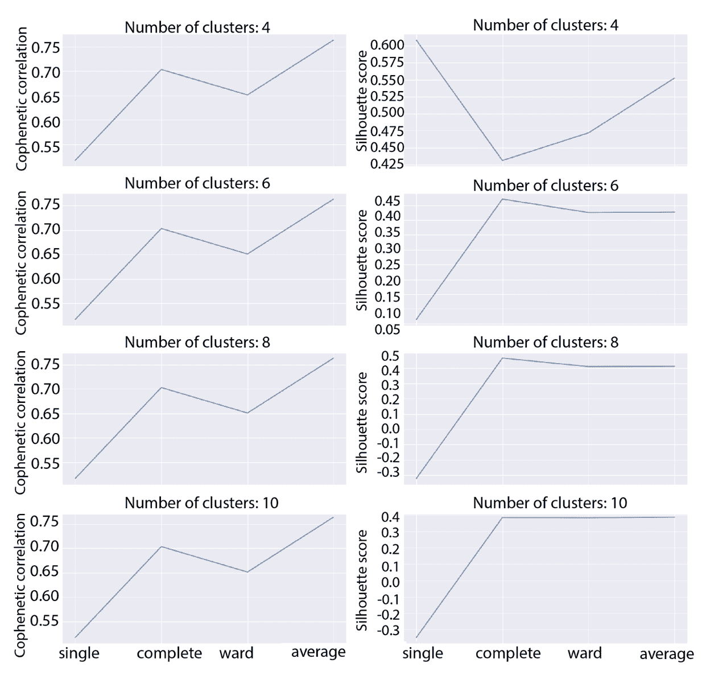

不同数量的群集和四种链接方法的同位相关（左）和轮廓分数（右）

首先要考虑的一点是，对于完全和平均链接而言，同义相关可以合理地接受，而对于单个链接而言，它太低了。 考虑到轮廓分数，通过单联动和四个簇可实现最大值（约 0.6）。 该结果表明，即使分层算法产生了次优的配置，也可以用中等或高水平的内部凝聚力分离四个区域。

如上一节所述，同位相关有时可能会引起误解，在这种情况下，我们可以得出结论，如果潜在簇的理论数目为 4，则使用单连接是最佳选择。 但是，所有其他图均显示对应于完整链接的最大值（单个图的最小值）。 因此，第一个要回答的问题是：我们是否甚至需要集群？ 在此示例中，我们假设许多工厂以非常标准的方式运行（差异由许多样本共享），但是也可能存在某些特定情况（不适当的*离群值*）表现出截然不同的行为。

这种假设在许多情况下都是现实的，并且可能是由于创新或实验过程，资源不足，测量过程中的内部问题等导致的。 领域专家可以确认或拒绝我们的假设，但是，由于这是一个通用示例，我们可以决定保留八个具有完全链接的聚类（轮廓分数约为 0.5）。 该值表示存在重叠，但是考虑到数据集的维数和非凸性，在许多实际情况下可以接受。

在这一点上，我们还可以分析截断为 80 片叶子的树状图（可以通过设置`trucate_mode='lastp'` 参数和`p=80`来实现），以避免间隔太小且难以区分 （但是，您可以删除此约束并提高分辨率）：

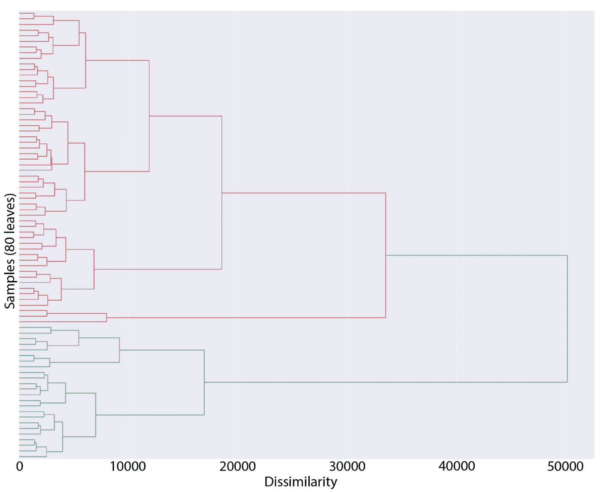

具有欧几里德度量标准和完全链接的水处理厂数据集的树状图

如我们所见，集聚过程不是均匀的。 在过程开始时，相异度的增加非常缓慢，但是在对应于大约 10,000 的值之后，跃变变大。 查看 t-SNE 图，可以理解非凸性的影响对非常大的聚类具有更强的影响，因为密度降低并且隐含地差异增大。 显而易见，很少数量的簇（例如 1、2 或 3）的特征是内部差异非常大，凝聚力非常低。

此外，树状图显示在大约 17,000 的水平上有两个主要的不均匀聚集，因此我们可以推断出粗粒度分析突出显示了主要行为的存在（从顶部观察图），以及由少量的工厂产生的次要行为。 特别是，较小的组非常稳定，因为它将以大约 50,000 的相异度级别合并到最终的单个群集中。 因此，我们应该期待伪异常值的存在，这些伪异常值被分组为更多的孤立区域（t-SNE 图也证实了这一点）。

切割级别在 4,000÷6,000（对应于大约八个簇）的范围内，较大的块比较小的块更密集。 换句话说，离群值群集将包含比其他群集少得多的样本。 这不足为奇，因为，如在专门针对树状图的“分析树状图”部分中所讨论的那样，最远的簇通常在完全链接中合并得很晚。

至此，我们终于可以执行聚类并检查结果了。 Scikit-learn 的实现不会计算整个树状图，而是会在达到所需簇数时停止该过程（除非`compute_full_tree` 参数不是`True`）：

```py
import pandas as pd

from sklearn.cluster import AgglomerativeClustering

ag = AgglomerativeClustering(n_clusters=8, affinity='euclidean', linkage='complete')
Y_pred = ag.fit_predict(sdf)

df_pred = pd.Series(Y_pred, name='Cluster', index=df.index)
pdff = pd.concat([dff, df_pred], axis=1)
```

最终图显示在以下屏幕截图中：

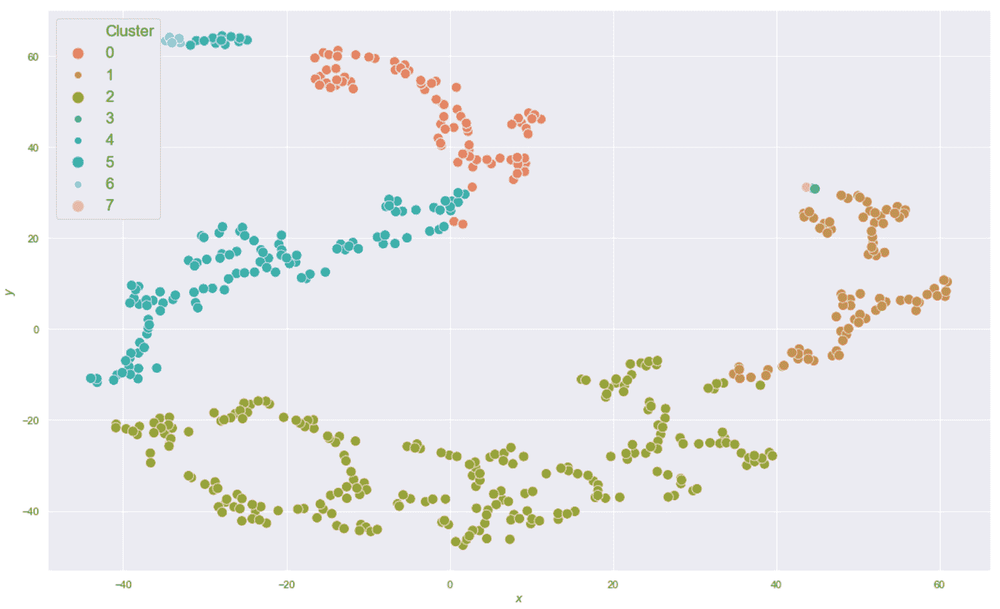

水处理厂数据集的聚类结果（八个群集）

不出所料，群集是不均匀的，但是它们与几何形状非常一致。 此外，孤立的簇（例如，在`x ∈ (-40. -20)`和`y > 60`的区域中）非常小，很可能包含真实的异常值，其行为与大多数其他样本有很大不同。 我们将不分析语义，因为问题非常具体。 但是，可以合理地认为`x ∈ (-40, 40)`和`y ∈ (-40, -10)`，代表合适的基线。 相反，其他大块（在该簇的极端）对应于具有特定特性或行为的工厂，这些工厂具有足够的扩散性，可以视为标准的替代实践。 当然，如开始时所述，这是不可知的分析，应该有助于理解如何使用层次聚类。

作为最后一步，我们希望以大约 35,000（对应于两个聚类）的相似度水平切割树状图。 结果显示在以下屏幕截图中：


水处理厂数据集的聚类结果（两个群集）

在此级别上，树状图显示出属于簇和剩余较小块的样本数量很大。 现在我们知道，这样的次级区域对应于`x ∈ (-40, 10)`和`y > 20`。 同样，结果并不令人惊讶，因为 t-SNE 图表明，这些样本是唯一具有`y > 20÷25`的样本（而较大的簇，即使有很大的空白区域，也覆盖了几乎所有范围）。

因此，我们可以说这些样本代表具有*极端*行为的非常不同的工厂，如果将新样本分配给该群集，则可能是非标准工厂（假设一个标准工厂具有与大多数同类相似的行为）。 作为练习，我鼓励您测试其他数量的类和不同的链接（尤其是单个链接，这非常特殊），并尝试验证或拒绝某些样本，先前的假设（它们在物理上没有必要被接受） ）。


# 连通性约束


聚集层次聚类的一个重要特征是可以包括连通性约束以强制合并特定样本。 在邻居之间有很强关系的情况下，或者当我们知道某些样本由于其固有属性而必须属于同一类时，这种先验知识非常普遍。 为了实现此目标，我们需要使用**连接矩阵**`A ∈ {0, 1}^(n×n)`：


通常，`A`是由数据集图诱导的邻接矩阵； 但是，唯一重要的要求是没有隔离的样本（无连接），因为它们无法以任何方式合并。 连接矩阵在初始合并阶段应用，并强制算法聚合指定的样本。 由于以下聚集不会影响连接性（两个合并的样本或群集将保持合并直到过程结束），因此始终会强制执行约束。

为了理解此过程，让我们考虑一个样本数据集，其中包含从`8`双变量高斯分布中提取的`50`二维点：

```py
from sklearn.datasets import make_blobs

nb_samples = 50
nb_centers = 8

X, Y = make_blobs(n_samples=nb_samples, n_features=2, center_box=[-1, 1], centers=nb_centers, random_state=1000)
```

标记的数据集显示在以下屏幕截图中：


连通性约束的数据集示例

从图中可以看出，样本 18 和 31 （`x[0] ∈ (-2, -1)`和`x[1] ∈ (1, 2)`非常接近； 但是，我们不希望将它们合并，因为样本 18 在较大的中央斑点中有更多邻居，而点 31 被部分隔离，应视为一个自治簇。 我们还希望样本 33 形成单个簇。 这些要求将迫使算法合并不再考虑基础几何（根据高斯分布）的聚类，而是考虑现有知识。

为了检查聚类的工作原理，现在让我们使用欧几里德距离和平均链接计算树状图（截短为 20 片叶子）：

```py
from scipy.spatial.distance import pdist
from scipy.cluster.hierarchy import linkage, dendrogram

dm = pdist(X, metric='euclidean')
Z = linkage(dm, method='average')

fig, ax = plt.subplots(figsize=(20, 10))

d = dendrogram(Z, orientation='right', truncate_mode='lastp', p=20, ax=ax)

ax.set_xlabel('Dissimilarity', fontsize=18)
ax.set_ylabel('Samples', fontsize=18)
```

以下屏幕快照显示了树状图（从右到左）：


具有欧氏距离和平均链接的连通性约束示例的树状图

不出所料，样本 18 和 31 立即合并，然后与另一个包含 2 个样本的簇聚合（当括号中的数字表示这是一个包含更多样本的复合块） ，可能是 44 和 13 。 样本 33 也已合并，因此不会保留在孤立的群集中。 作为确认，让我们使用`n_clusters=8`进行聚类：

```py
from sklearn.cluster import AgglomerativeClustering

ag = AgglomerativeClustering(n_clusters=8, affinity='euclidean', linkage='average')
Y_pred = ag.fit_predict(X)
```

以下屏幕快照显示了聚类数据集的图：

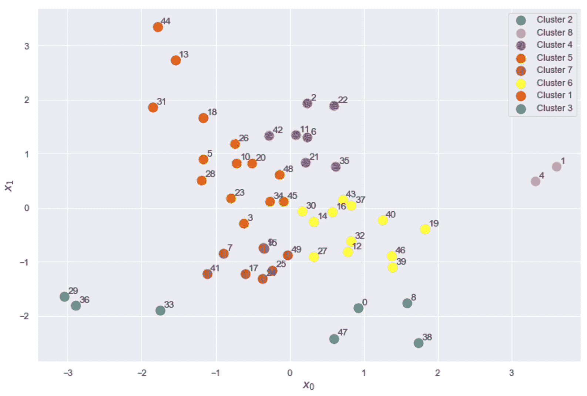

使用欧几里得距离和平均链接来聚类的数据集

结果证实了先前的分析。 在没有限制的情况下，平均链接会产生合理的分区，该分区与基本事实（八高斯分布）兼容。 为了拆分大的中心斑点并保持所需的聚类数量，即使树状图确认它们最终以最高相异度级别合并，该算法也必须合并孤立的样本。

为了施加约束，我们可以观察到，基于前两个最近邻的连通性矩阵很可能会迫使属于较密集区域的所有样本聚集（考虑到邻居更近）并最终保持孤立状态。 自治集群中的点。 出现这种假设行为的原因是基于平均链接的目标（以最大程度地减少集群间平均距离）。 因此，在施加约束之后，该算法更易于与其他邻居聚集紧密的簇（请记住，`A`具有空值，但在与两个最近邻相对应的位置），并且最远的点不合并，直到差异程度足够大（产生非常不均匀的簇）。

为了检查我们的假设是否正确，让我们使用 scikit-learn `kneighbors_graph()`函数和`n_neighbors=2`生成连接矩阵，并重新设置数据集，并设置`connectivity`约束：

```py
from sklearn.cluster import AgglomerativeClustering
from sklearn.neighbors import kneighbors_graph

cma = kneighbors_graph(X, n_neighbors=2)

ag = AgglomerativeClustering(n_clusters=8, affinity='euclidean', linkage='average', connectivity=cma)
Y_pred = ag.fit_predict(X)
```

下一个屏幕截图显示了上一个片段的图形输出：

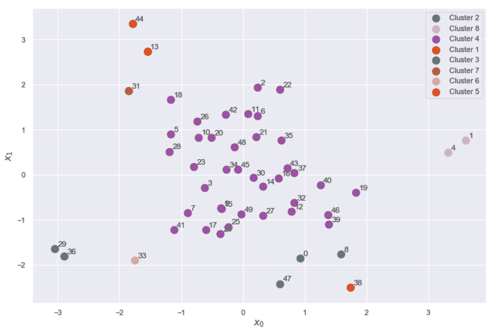

使用欧式距离和连通性约束来聚类的数据集

正如预期的那样，样本 18 已分配给大型中央群集，而点 31 和 33 现在已被隔离。 当然，由于该过程是分层的，因此施加连通性约束比分离约束更容易。 实际上，虽然可以在初始阶段轻松合并单个样本，但是使用所有链接都无法轻松保证在最终合并之前将其排除。

当需要复杂的约束条件（给定距离和链接）时，通常有必要同时调整连接矩阵和所需的群集数量。 当然，如果期望的结果是通过特定数目的聚类实现的，则也将使用较大的值来实现，直到相异性下界为止（也就是说，合并过程会减少聚类的数量；因此，如果相异性足够大，所有现有约束将仍然有效）。 例如，如果三个样本被约束为属于同一群集，则通常无法在初始合并阶段之后获得此结果。

但是，如果所有三个样本的合并都在某个不同的级别上发生（例如，对应于 30 个群集的 2.0），则它对于`n < 30`个群集以及具有`DL > 2.0`。 因此，如果我们从 5 个聚类开始，则可以轻松增加此数字，同时注意其相异度级别大于与约束所施加的最后合并对应的相异程度。 建议您与其他数据集一起测试此方法，并尝试定义可以在聚类过程之后轻松验证的先前约束。


# 总结


在本章中，我们介绍了层次聚类方法，重点介绍了可以采用的不同策略（分裂策略和聚集策略）。 我们还讨论了用于发现哪些群集可以合并或拆分（链接）的方法。 特别地，给定距离度量，我们分析了四种链接方法的行为：单一，完整，平均和沃德方法。

我们已经展示了如何构建树状图以及如何分析树状图，以便使用不同的链接方法来理解整个分层过程。 引入了一种称为共情相关的特定性能度量，以在不了解基本事实的情况下评估分层算法的性能。

我们分析了一个更大的数据集（水处理厂数据集），定义了一些假设并使用前面讨论的所有工具对其进行了验证。 在本章的最后，我们讨论了连通性约束的概念，该概念允许使用连通性矩阵将先验知识引入流程。

在下一章中，我们将介绍软聚类的概念，重点是模糊算法和两个非常重要的高斯混合模型。


# 问题


1.  凝聚法和分裂法有什么区别？
2.  给定两个簇`a: [(-1, -1), (0, 0)]`和`b: [(1, 1), (1, 0)]`，是否考虑欧几里得距离，什么是单一和完整链接？
3.  树状图表示给定数据集的不同链接结果。 它是否正确？
4.  在凝聚聚类中，树状图的底部（初始部分）包含单个聚类。 它是否正确？
5.  凝聚聚类中树状图的`y`轴是什么意思？
6.  合并较小的群集时，相异性降低。 它是否正确？
7.  显色矩阵的元素`C(i, j)`报告相异度，其中两个对应元素`x[i]`和`x[j]`首次出现在同一群集中。 它是否正确？
8.  连通性约束的主要目的是什么？


# 进一步阅读


+   `A Statistical Method for Evaluating Systematic Relationships, Sokal R., Michener C., University of Kansas Science Bulletin, 38, 1958`
+   `Hierarchical Grouping to Optimize an Objective Function, Ward Jr J. H., Journal of the American Statistical Association. 58(301), 1963`
+   `LINNEO+: A Classification Methodology for Ill-structured Domains, Bejar J., Cortes U., Poch M., Research report RT-93-10-R. Dept. Llenguatges i Sistemes Informatics, Barcelona, 1993`
+   `Machine Learning Algorithms, Second Edition, Bonaccorso G., Packt Publishing, 2018`


