# 软聚类和高斯混合模型


在本章中，我们将讨论软聚类的概念，它允许我们针对定义的聚类配置获取数据集每个样本的隶属度。 也就是说，考虑从 0％到 100％的范围，我们想知道 *x <sub class="calibre20">i</sub>* 在多大程度上属于一个集群。 极限值为 0，这表示 *x <sub class="calibre20">i</sub>* 完全在集群域之外，并且为 1（100％），表示 *x <sub class="calibre20">i</sub>* 已完全分配给单个群集。 所有中间值都表示两个或多个不同群集的部分域。 因此，与硬聚类相反，在这里，我们感兴趣的不是确定固定分配，而是确定具有相同概率分布（或概率本身）属性的向量。 这种方法可以更好地控制边界样本，并帮助我们找到生成数据集的适当近似方法。

特别是，我们将讨论以下主题：

*   模糊 C 均值
*   高斯混合
*   AIC 和 BIC 作为绩效指标
*   贝叶斯高斯混合（简要介绍）
*   生成（半监督）高斯混合


# 技术要求


本章将介绍的代码需要以下内容：

*   Python 3.5+（强烈建议使用 [Anaconda 发行版](https://www.anaconda.com/download/)）
*   以下库：
    *   科学 0.19+
    *   NumPy 1.10+
    *   scikit 学习 0.20+
    *   Scikit 模糊 0.2
    *   熊猫 0.22+
    *   Matplotlib 2.0+
    *   海上 0.9+

[可以在 GitHub 存储库中找到示例](https://github.com/PacktPublishing/HandsOn-Unsupervised-Learning-with-Python/tree/master/Chapter05)。


# 软集群


在第 4 章，*分层活动聚类*中分析的所有算法均属于硬聚类方法家族。 这意味着给定的样本始终分配给单个群集。 另一方面，软聚类旨在将每个样本 *x <sub class="calibre20">i</sub>* 与一个向量相关联，该向量通常表示 *x <sub class="calibre20">的概率 i</sub>* 属于每个群集：

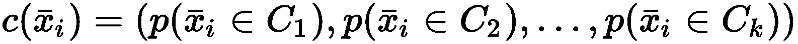

或者，可以将输出解释为隶属向量：


形式上，这两个版本之间没有区别，但是通常，当算法未明确基于概率分布时使用后者。 但是，出于我们的目的，我们始终将 *c（x <sub class="calibre20">i</sub> ）*与概率相关联。 以此方式，激励读者考虑已经用于获取数据集的数据生成过程。 一个明显的例子是将这些向量解释为与特定贡献相关的概率，这些贡献构成了数据生成过程， *p <sub class="calibre20">数据</sub>* 的近似值。 例如，采用概率混合，我们可以决定近似 *p <sub class="calibre20">数据</sub>* ，如下所示：


因此，将过程分为（独立）分量的加权总和，输出是每个分量的 *x <sub class="calibre20">i</sub>* 的概率。 当然，我们通常希望对每个样本都有一个主导成分，但是通过这种方法，我们对所有边界点有了很大的了解，但受到很小的扰动，这些边界点可以分配给不同的聚类。 因此，当可以将输出馈送到可以利用整个概率向量的另一个模型（例如，神经网络）时，软聚类非常有用。 例如，推荐者可以首先使用软聚类算法对用户进行细分，然后处理向量，以便基于显式反馈找到更复杂的关系。 常见的情况是通过对以下问题的答案进行更正：“此结果是否与您相关？” 或者，“您是否希望看到更多类似这些的结果？” 由于答案是由用户直接提供的，因此可以将其用于监督或强化学习模型中，这些模型的输入基于软自动细分（例如，基于购买历史记录或详细的页面浏览量）。 通过这种方式，可以通过更改原始分配的效果（由于不同集群提供的大量贡献而完全无关紧要）来轻松管理边界用户，同时为拥有强大成员资格的其他用户提供建议（例如， 接近 1）的概率可以稍加修改以提高回报率。

现在，我们可以开始对 Fuzzy c-means 的讨论，这是一种非常灵活的算法，将针对 k-means 讨论的概念扩展到了软聚类场景。


# 模糊 c 均值


我们将提出的第一个算法是基于软分配的 k 均值的变体。 名称 **Fuzzy c-means** 源自模糊集的概念，这是经典二进制集（即，在这种情况下，样本可以属于单个簇）的扩展，基于 代表整个集合不同区域的不同子集的叠加。 例如，一个基于某些用户年龄的集合可以将度`young`，`adult`和`senior`与三个不同（且部分重叠）的年龄范围相关联：18-35、28-60 和 > 50.例如，一个 30 岁的用户在不同程度上既是`young`又是`adult`（并且实际上是边界用户，考虑到边界）。 有关这些类型的集合以及所有相关运算的更多详细信息，我建议这本书*概念和模糊逻辑，* Belohlavek R.，Klir GJ（编辑），麻省理工学院出版社，2011 年。 ，我们可以想象，数据集`X`包含`m`个样本，被划分为`k`个重叠的簇，因此每个样本始终与每个簇关联 隶属度 *w <sub class="calibre20">ij</sub>* （介于 0 和 1 之间的值）。 如果 *w <sub class="calibre20">ij</sub> = 0* ，则表示 *x <sub class="calibre20">i</sub>* 完全在簇 *C <sub class="calibre20">j</sub> 之外 ]* ，相反， *w <sub class="calibre20">ij</sub>* *= 1* 表示对群集 *C 的硬分配 <sub class="calibre20">j</sub>* 。 所有中间值代表部分成员资格。 当然，出于显而易见的原因，必须将样本的所有隶属度的总和标准化为 1（如概率分布）。 这样，样本始终属于所有聚类的并集，并且将聚类分为两个或多个子聚类始终会在成员资格方面产生一致的结果。

该算法基于广义惯量 *S <sub class="calibre20">f</sub>* 的优化：


在上一个公式中，*μ <sub class="calibre20">j</sub>* 是簇 *C <sub class="calibre20">j</sub>* 的质心，而 *m（m > 1 ）*是重加权指数系数。 当 *m≈1* 时，权重不受影响。 对于较大的值，例如 *w <sub class="calibre20">ij</sub> ∈（0，1）*，它们的重要性将按比例降低。 可以选择这样的系数以比较不同值的结果和期望的模糊程度。 实际上，在每次迭代之后（完全等同于 k 均值），权重使用以下公式更新：


如果 *x <sub class="calibre20">i</sub>* 接近质心 *μ <sub class="calibre20">j</sub>* 的质心，则总和接近 0，并且 权重增加（当然，为了避免数字不稳定性，在分母上添加了一个小常数，因此它永远不能等于 0）。 当 *m > > 1* 时，指数接近 0，并且所有项的总和趋向于 1。这意味着对特定簇的偏好减弱， *w <sub class="calibre20">ij</sub> ≈1 / k* 对应于均匀分布。 因此，较大的`m`表示划分较为平坦，不同分配之间没有明显的区别（除非样本非常接近质心），而当 *m≈1* 时，则是一个主要的 权重将几乎等于 1，其他权重将接近 0（也就是说，分配很困难）。

以类似于 k 均值的方式更新质心（换句话说，以最大化分离和内部凝聚力为目标）：

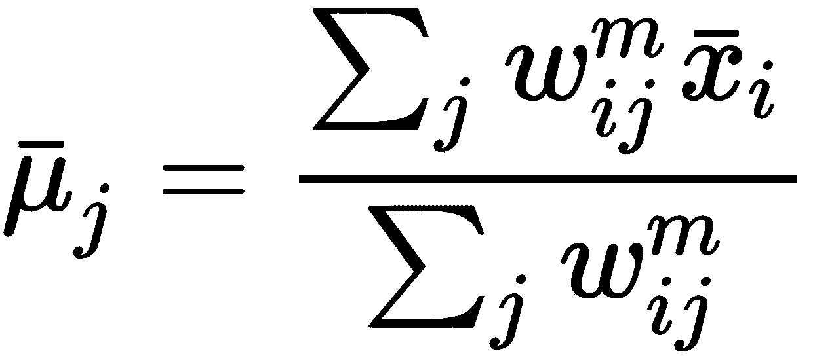

重复该过程，直到质心和权重变得稳定为止。 收敛之后，可以使用称为标准化 **Dunn 分区系数**的特定方法来评估结果，定义如下：


这样的系数在 0 和 1 之间。当 *P <sub class="calibre20">C</sub> ≈0* 时，表示 *w <sub class="calibre20">C</sub>* *≈1 / k* ，这意味着平坦的分布和较高的模糊度。 另一方面，当 *P <sub class="calibre20">C</sub> ≈1* 时，则 *w <sub class="calibre20">C</sub> ≈1* 表示几乎是硬分配。 所有其他值都与模糊程度成正比。 因此，给定任务后，数据科学家可以根据所需结果立即评估算法的执行情况。 在某些情况下，最好使用硬分配，因此，可以将 *P <sub class="calibre20">C</sub>* 视为在切换至例如标准 k 均值之前执行的检查。 实际上，当 *P <sub class="calibre20">C</sub> ≈1* （并且这样的结果是预期的结果）时，不再使用模糊 c 均值。 相反，小于 1 的值（例如 *P <sub class="calibre20">C</sub> = 0.5* ）会告诉我们，由于存在许多边界样本，因此可能会出现非常不稳定的硬分配。

现在，让我们将 scikit-learn 提供的 Fuzzy c-means 算法应用于简化的 MNIST 数据集。 该算法由 Scikit-Fuzzy 库提供，该库实现了所有最重要的模糊逻辑模型。 第一步是加载和规范化样本，如下所示：

```py
from sklearn.datasets import load_digits

digits = load_digits()
X = digits['data'] / 255.0
Y = digits['target']
```

`X` 数组包含 1,797 个扁平化样本， *x∈ <sup class="calibre27">64</sup>* ，对应于灰度 *8×8* 图像（其值为 在 0 和 1 之间归一化）。 我们要分析不同`m`系数（1.05 和 1.5 之间的 5 个均匀值）的行为，并检查样本的权重（在我们的例子中，我们将使用`X[0]`）。 因此，我们调用 Scikit-Fuzzy `cmeans`函数，设置`c=10`（簇数）以及两个收敛参数`error=1e-6`和`maxiter=20000`。 此外，出于可重复性的原因，我们还将设置标准随机`seed=1000`。 输入数组应包含样本列。 因此，我们需要按如下方式转置它：

```py
from skfuzzy.cluster import cmeans

Ws = []
pcs = []

for m in np.linspace(1.05, 1.5, 5):
    fc, W, _, _, _, _, pc = cmeans(X.T, c=10, m=m, error=1e-6, maxiter=20000, seed=1000)
    Ws.append(W)
    pcs.append(pc)
```

上一个代码段执行不同类型的聚类，并将相应的权重矩阵`W`和分配系数`pc`附加到两个列表中。 在分析特定配置之前，显示测试样本（代表数字 0）的最终权重（对应于每个数字）将非常有帮助：

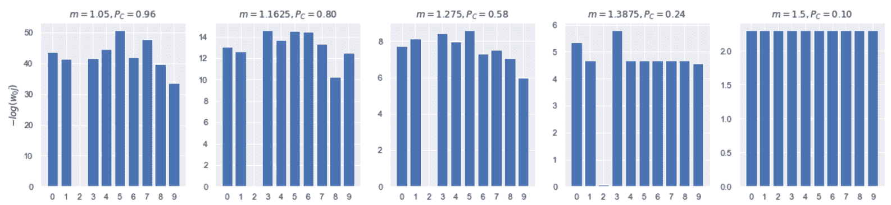Weights (in an inverse logarithmic scale) for the sample X[0], corresponding to different m values

由于极值往往会非常不同，因此我们选择使用对数逆标（即 *-log（w <sub class="calibre20">0j</sub> ）*而不是 *w <sub class="calibre20">0</sub> <sub class="calibre20">j</sub>* ）。 当 *m = 1.05* 时， *P <sub class="calibre20">C</sub>* 约为 0.96，并且所有权重（与 *C <sub class="calibre20">2 对应的权重除外</sub>* ）非常小（请记住，如果 *-log（w）= 30* ，则 *w = e <sup class="calibre27">-30</sup>* ）。 这样的配置清楚地显示了具有主要成分（ *C <sub class="calibre20">2</sub>* ）的非常硬的聚类。 上图中的后续三个图继续显示优势，但是，尽管`m`增大（ *P <sub class="calibre20">C</sub>* 减小），但优势和次级之间的差异 组件变得越来越小。 该效果证实了增加的模糊性，达到 *m > 1.38* 的最大值。 实际上，当 *m = 1.5* 时，即使 *P <sub class="calibre20">C</sub> ≈0.1* ，所有权重几乎相同，并且测试样品无法轻松分配给 主导集群。 正如我们之前讨论的那样，我们现在知道像 k 均值这样的算法可以轻松地找到硬分区，因为平均而言，对应于不同数字的样本彼此之间非常不同，并且欧几里得距离足以将它们分配给右边 重心。 在这个例子中，我们要保持适度的模糊性。 因此，我们选择了 *m = 1.2* （对应于`P`*<sub class="calibre20">C</sub>* *0.73* ）：

```py
fc, W, _, _, _, _, pc = cmeans(X.T, c=10, m=1.2, error=1e-6, maxiter=20000, seed=1000)
Mu = fc.reshape((10, 8, 8)) 
```

`Mu` 数组包含质心，如下图所示：

Centroids corresponding to m = 1.2 and P<sub class="calibre26">C</sub> ≈ 0.73

如您所见，所有不同的数字均已选定，并且按预期，第三个簇（由 *C <sub class="calibre20">2</sub>* 表示）对应于数字 0。现在，让我们检查一下 对应于`X[0]`的权重（也是`W`的转置，因此它们存储在`W[:, 0]`中）：

```py
print(W[:, 0])
```

输出如下：

```py
[2.68474857e-05 9.14566391e-06 9.99579876e-01 7.56684450e-06
 1.52365944e-05 7.26653414e-06 3.66562441e-05 2.09198951e-05
 2.52320741e-04 4.41638611e-05]
```

即使分配不是特别困难，集群`C`<sub class="calibre20">`2`</sub> 的优势也很明显。 第二个电位分配是 *C <sub class="calibre20">8</sub>* ，对应于数字 9（比率约为 4,000）。 这样的结果与数字的形状绝对一致，并且考虑到最大权重和第二个权重之间的差异，很明显，大多数样本几乎都不会被分配（即，用 k 均值表示），即使 与 *P <sub class="calibre20">C</sub> ≈0.75* 。 为了检查硬分配的性能（使用权重矩阵上的`argmax`函数获得），并考虑到我们了解基本事实，可以采用`adjusted_rand_score`，如下所示：

```py
from sklearn.metrics import adjusted_rand_score

Y_pred = np.argmax(W.T, axis=1)

print(adjusted_rand_score(Y, Y_pred))
```

上一个代码段的输出如下：

```py
0.6574291419247339
```

该值确认大多数样本已成功硬分配。 作为补充练习，让我们找到权重最小的标准偏差的样本：

```py
im = np.argmin(np.std(W.T, axis=1))

print(im)
print(Y[im])
print(W[:, im])
```

输出如下：

```py
414
8
[0.09956437 0.05777962 0.19350572 0.01874303 0.15952518 0.04650815
 0.05909216 0.12910096 0.17526108 0.06091973]
```

示例 *X [414]* 代表一个数字（8），如以下屏幕快照所示：

Plot of the sample, X[414], corresponding to the weight vector with the smallest standard deviation

在这种情况下，存在三个主要簇： *C <sub class="calibre20">8</sub>* ， *C <sub class="calibre20">4</sub>* 和 *C <sub class="calibre20">7 [</sub>* （降序）。 不幸的是，它们都不对应于与 *C <sub class="calibre20">5</sub>* 相关的数字 8。 不难理解，这种错误主要是由于手指下部的格式不正确而导致的，其结果更类似于 9（这种错误分类也可能发生在人类身上）。 然而，低标准偏差和明显的主导成分的缺乏应告诉我们，这一决定不容易做出，并且样本具有属于三个主要类别的特征。 一个更复杂的监督模型可以轻松避免此错误，但考虑到我们正在执行非监督分析，并且我们仅将基本事实用于评估目的，结果并不是那么负面。 我建议您使用其他`m`值测试结果，并尝试找出一些可能的合成规则（即，大多数 8 位数字都被软分配给 *C <sub class="calibre20">i</sub>* 和 *C <sub class="calibre20">j</sub>* ，因此我们可以假设相应的质心对部分共同特征进行编码，例如，由所有 8 位和 9 位数字共享。

现在，我们可以讨论高斯混合的概念，这是一种非常广泛使用的方法，用于建模以低密度区域包围的密集斑点为特征的数据集的分布。


# 高斯混合


**高斯混合**是最著名的软聚类方法之一，具有数十种特定应用。 它可以被认为是 k-means 之父，因为它的工作方式非常相似。 但是，与该算法相反，给定样本 *x <sub class="calibre20">i</sub> ∈X* 和`k`簇（以高斯分布表示），它提供了一个概率矢量， *[p（x <sub class="calibre20">i</sub>* *∈C <sub class="calibre20">1</sub> ），...，p（x <sub class="calibre20">i</sub> ∈C <sub class="calibre20">k</sub> ）]* 。

以更一般的方式，如果数据集`X`已从数据生成过程 *p <sub class="calibre20">数据</sub>* （高斯混合模型）中采样 基于以下假设：


换句话说，数据生成过程通过多元高斯分布的加权和来近似。 这种分布的概率密度函数如下：


每个多元高斯变量的每个分量的影响都取决于协方差矩阵的结构。 下图显示了双变量高斯分布的三种主要可能性（结果可以轻松扩展到`n`维空间）：

Full covariance matrix (left); diagonal covariance (center); circular/spherical covariance (right)

从现在开始，我们将一直在考虑完全协方差矩阵的情况，该矩阵可以实现最大的表达能力。 很容易理解，当这样的分布完全对称（即协方差矩阵是圆形/球形）时，伪簇的形状与 k 均值相同（当然 ，在高斯混合中，簇没有边界，但是始终可以在固定数量的标准偏差后削减高斯）。 相反，当协方差矩阵不是对角线或具有不同的方差时，影响不再是对称的（例如，在双变量的情况下，一个组件可以显示出比另一个更大的方差）。 在这两种情况下，高斯混合均允许我们计算实际概率，而不是测量样本之间的距离，`x`*<sub class="calibre20">i</sub>* 平均载体*μ* *<sub class="calibre20">j</sub>* （以 k 均值表示）。 下图显示了单变量混合的示例：

Example of a univariate Gaussian mixture

在这种情况下，每个样本在每个高斯下始终具有非零概率，其影响取决于其均值和协方差矩阵。 例如，对应于`x`-位置的点 2.5 既可以属于中央高斯，也可以属于右手的点（而左手的影响最小）。 如本章开头所述，通过选择影响最大的组件（`argmax`），可以将任何软聚类算法转换为硬聚类算法。

您将立即理解，在这种特定情况下，对于对角协方差矩阵，`argmax` 提供了一条附加信息（该信息已被 k 均值完全丢弃），可用于进一步的处理步骤（即， 推荐器应用程序可以提取所有群集的主要特征，然后根据相对概率对它们进行加权。


# 高斯混合的 EM 算法


完整算法（由 Bonaccorso G。，Packt Publishing，2018 年在 *Mastering Machine Learning Algorithms* 中进行了全面描述）比 k 均值稍微复杂一点，并且需要更深层次的知识。 数学知识。 由于本书的范围更实际，因此我们仅讨论主要步骤，而没有提供正式证据。

让我们首先考虑一个数据集`X`，其中包含`n`个样本：


给定`k`分布，我们需要找到权重 *w <sub class="calibre20">j</sub>* 以及每个高斯*（μ <sub class="calibre20">j</sub> ，Σ <sub class="calibre20">j</sub> ）*，其条件如下：

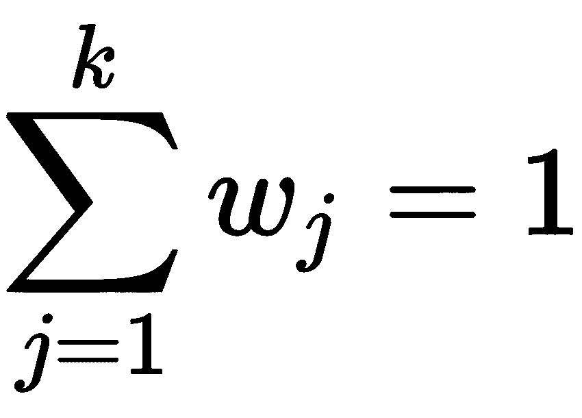

这最后一个条件对于保持与概率定律的一致性是必要的。 如果将所有参数归为一个集合，则*θ <sub class="calibre20">j</sub> =（w <sub class="calibre20">j</sub> ，μ <sub class="calibre20">j</sub> ， <sub class="calibre20">j</sub> ）*，我们可以定义`j`<sup class="calibre27">下样本 *x <sub class="calibre20">i</sub>* 的概率 ]</sup> 高斯，如下所示：

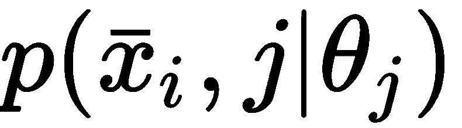

以类似的方式，我们可以引入伯努利分布， *z <sub class="calibre20">i</sub> <sub class="calibre20">j</sub> = p（j | x <sub class="calibre20">i</sub> ，θ <sub class="calibre20">j</sub> ）〜B（p）*，这是`j`<sup class="calibre27">th</sup> 高斯产生样本 *x <sub class="calibre20">i 的概率</sub>* 。 换句话说，给定一个样本 *x <sub class="calibre20">i</sub> ，z <sub class="calibre20">ij</sub>* 等于 1，概率为 *p（j | x <sub class="calibre20">i</sub> ， θ <sub class="calibre20">j</sub>* *）* ，[ ，否则为 0。

此时，我们可以计算整个数据集的联合对数似然，如下所示：

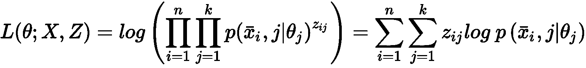

在前面的公式中，我们利用指数指示符表示法，它依赖于 *z <sub class="calibre20">ij</sub>* 只能为 0 或 1 的事实。因此，当 *z <sub class="calibre20">ij</sub> = 0* ，这意味着`j`<sup xmlns:epub="http://www.idpf.org/2007/ops" class="calibre27">th</sup> 高斯尚未生成样本 *x <sub class="calibre20">i</sub>* 乘积中的对应项变为 1（即 *x <sup class="calibre27">0</sup> = 1* ）。 相反，当 *z <sub class="calibre20">ij</sub> = 1* 时，该项等于 *x <sub class="calibre20">i</sub>* 和 *j [* <sup xmlns:epub="http://www.idpf.org/2007/ops" class="calibre27">th</sup> 高斯。 因此，假设每个 *x <sub class="calibre20">i</sub> ∈X* 独立且均匀分布，则联合对数似然是模型已生成整个数据集的联合概率（**IID**）。 要解决的问题是**最大似然估计**（**MLE**），换句话说，就是找到最大化 *L（ θ； X，Z ）*。 但是，没有观察到（或隐含）变量 *z <sub class="calibre20">ij</sub>* ，因此无法直接最大化可能性，因为我们不知道它们的值。

解决此问题的最有效方法是采用 EM 算法（由 Dempster AP，Laird NM 和 Rubin DB 中的 Dempster，Laird 和 Rubin 提出，*通过 EM 算法，皇家统计协会杂志*，系列 B. 39（1），1977 年。 完整的解释超出了本书的范围，但是我们想提供主要步骤。 首先要做的是使用概率的链式规则，以便将先前的表达式转换为条件概率的总和（可以很容易地对其进行管理）：


这两个概率现在很简单。 项 *p（x <sub class="calibre20">i</sub> | j，θ <sub class="calibre20">j</sub> ）*是 *x <sub class="calibre20">i</sub>* 在`j`<sup class="calibre27">th</sup> 高斯之下，而 *p（j |θ <sub class="calibre20">j</sub> ）*只是`j`<sup class="calibre27">th</sup> 高斯的概率，它等于权重 *w <sub class="calibre20">j</sub>* 的权重。 为了消除潜在变量，EM 算法以迭代方式进行，由两个步骤组成。 第一个（称为**期望步骤**或 **E 步骤**）是对没有潜在变量的似然性的代理计算。 如果将整个参数集表示为*θ*，并且在迭代`t`时计算出的同一参数集为*θ <sub class="calibre20">t</sub>* ，则可以计算出 以下功能：

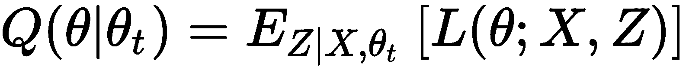

*Q（* *θ|θ <sub class="calibre20">t</sub> ）*是相对于变量 *z []的联合对数似然的期望值。 HTG8] ij* ，并以数据集`X`和迭代时设置的参数`t`为条件。 此操作的作用是删除潜在变量（相加或积分后的值），并得出实际对数似然的近似值。 不难想象，第二步（称为**最大化步**或 **M 步**）的目标是最大化 *Q（θ|θ <sub class="calibre20">t</sub> ）*生成一个新的参数集*θ <sub class="calibre20">t + 1</sub>* 。 重复该过程，直到参数变得稳定为止，并且有可能证明最终的参数集与 MLE 相对应。 跳过所有中间步骤，并假设最佳参数集为*θ <sub class="calibre20">f</sub>* ，最终结果如下：

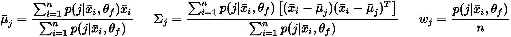

为了清楚起见，可以通过使用贝叶斯定理来计算 *p（j | x <sub class="calibre20">i</sub> ，θ <sub class="calibre20">f</sub> ）*的概率：


可以通过将所有项归一化以使它们的总和等于 1（满足概率分布的要求）来消除比例性。

现在，让我们考虑使用 scikit-learn 的实际示例。 由于目标纯粹是说教性的，因此我们使用了可以轻松可视化的二维数据集：

```py
from sklearn.datasets import make_blobs

nb_samples = 300
nb_centers = 2

X, Y = make_blobs(n_samples=nb_samples, n_features=2, center_box=[-1, 1], centers=nb_centers, cluster_std=[1.0, 0.6], random_state=1000)
```

该数据集是通过对两个具有不同标准偏差（1.0 和 0.6）的高斯分布进行采样而生成的，如以下屏幕截图所示：

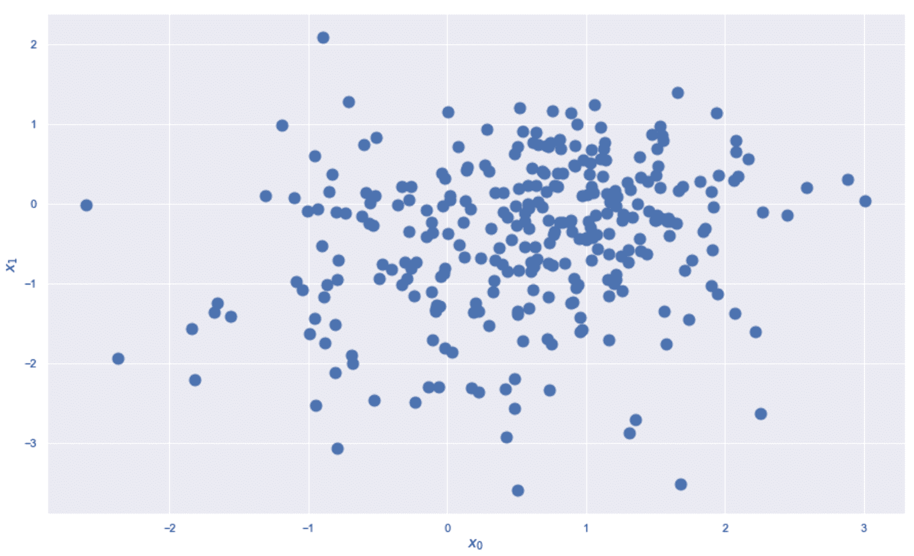Dataset for the Gaussian mixture example

我们的目标是同时使用高斯混合模型和 k 均值，并比较最终结果。 正如我们期望的那样，有两个组成部分，数据生成过程的近似如下：


现在我们可以使用`n_components=2`训练`GaussianMixture`实例。 默认协方差类型是完整的，但可以通过设置`covariance_type`参数来更改此选项。 允许的值为`full`，`diag`，`spherical`和`tied`（这迫使算法对所有高斯使用共享的单个协方差矩阵）：

```py
from sklearn.mixture import GaussianMixture

gm = GaussianMixture(n_components=2, random_state=1000)
gm.fit(X)
Y_pred = gm.fit_predict(X)

print('Means: \n{}'.format(gm.means_))
print('Covariance matrices: \n{}'.format(gm.covariances_))
print('Weights: \n{}'.format(gm.weights_))
```

上一个代码段的输出如下：

```py
Means: 
[[-0.02171304 -1.03295837]
 [ 0.97121896 -0.01679101]]

Covariance matrices: 
[[[ 0.86794212 -0.18290731]
  [-0.18290731  1.06858097]]

 [[ 0.44075382  0.02378036]
  [ 0.02378036  0.37802115]]]

Weights: 
[0.39683899 0.60316101]
```

因此，MLE 产生两个成分，其中一个成分占主导地位（即 *w <sub class="calibre20">2</sub> = 0.6* ）。 为了知道高斯轴的方向，我们需要计算协方差矩阵的归一化特征向量（这一概念将在第 7 章，*降维和分量分析*）：

```py
import numpy as np

c1 = gm.covariances_[0]
c2 = gm.covariances_[1]

w1, v1 = np.linalg.eigh(c1)
w2, v2 = np.linalg.eigh(c2)

nv1 = v1 / np.linalg.norm(v1)
nv2 = v2 / np.linalg.norm(v2)

print('Eigenvalues 1: \n{}'.format(w1))
print('Eigenvectors 1: \n{}'.format(nv1))

print('Eigenvalues 2: \n{}'.format(w2))
print('Eigenvectors 2: \n{}'.format(nv2))
```

输出如下：

```py
Eigenvalues 1: 
[0.75964929 1.17687379]
Eigenvectors 1: 
[[-0.608459   -0.36024664]
 [-0.36024664  0.608459  ]]

Eigenvalues 2: 
[0.37002567 0.4487493 ]
Eigenvectors 2: 
[[ 0.22534853 -0.6702373 ]
 [-0.6702373  -0.22534853]]
```

在两个高斯变量中（一旦被截断并从顶部观察，都可以想象成椭圆），主要成分是第二个成分（即第二列，对应于最大的特征值）。 椭圆的偏心率由特征值之间的比率确定。 如果 的比率等于 等于 1，则形状为圆形，而高斯完美对称。 否则，它们会沿轴拉伸。 主要成分与`x`轴之间的角度（度）如下：

```py
import numpy as np

a1 = np.arccos(np.dot(nv1[:, 1], [1.0, 0.0]) / np.linalg.norm(nv1[:, 1])) * 180.0 / np.pi
a2 = np.arccos(np.dot(nv2[:, 1], [1.0, 0.0]) / np.linalg.norm(nv2[:, 1])) * 180.0 / np.pi
```

先前的公式基于主要成分 *v <sub class="calibre20">1</sub>* 与`x`-versor *e <sub class="calibre20">0 [</sub>* （即 *[1，0]* ）：


在显示最终结果之前，使用 k 均值对数据集进行聚类将很有帮助：

```py
from sklearn.cluster import KMeans

km = KMeans(n_clusters=2, random_state=1000)
km.fit(X)
Y_pred_km = km.predict(X)
```

群集结果显示在以下屏幕截图中：

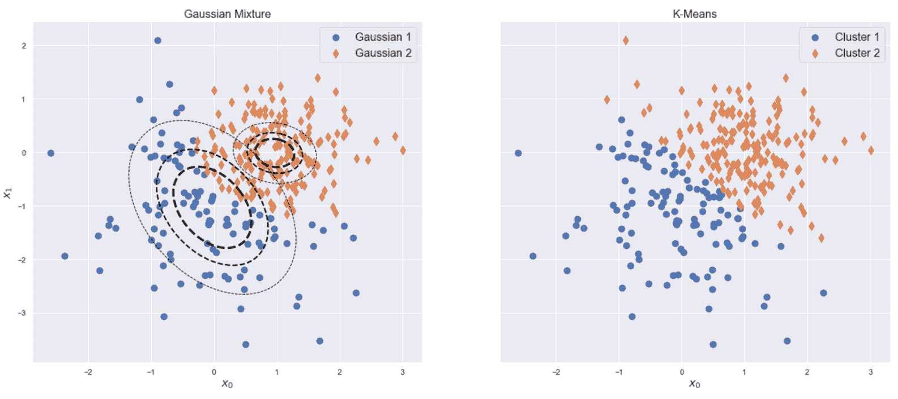Gaussian mixture result (left) with the shapes of three horizontal sections; k-means result (right)

不出所料，这两种算法都产生非常相似的结果，并且主要差异是由于高斯算法的非对称性造成的。 特别地，与数据集的左下部分相对应的伪群集在两个方向上均具有较大的方差，并且对应的高斯是主要的。 为了检查混合物的行为，让我们计算三个样本点的概率（*（0，-2）*； *（1，-1）*-临界样本​​；以及 *（1、0）*），使用`predict_proba()`方法：

```py
print('P([0, -2]=G1) = {:.3f} and P([0, -2]=G2) = {:.3f}'.format(*list(gm.predict_proba([[0.0, -2.0]]).squeeze())))
print('P([1, -1]=G1) = {:.3f} and P([1, -1]=G2) = {:.3f}'.format(*list(gm.predict_proba([[1.0, -1.0]]).squeeze())))
print('P([1, 0]=G1) = {:.3f} and P([1, 0]=G2) = {:.3f}'.format(*list(gm.predict_proba([[1.0, 0.0]]).squeeze())))
```

前一个块的输出如下：

```py
P([0, -2]=G1) = 0.987 and P([0, -2]=G2) = 0.013
P([1, -1]=G1) = 0.354 and P([1, -1]=G2) = 0.646
P([1, 0]=G1) = 0.068 and P([1, 0]=G2) = 0.932
```

我邀请读者使用其他协方差类型重复该示例，然后将所有硬分配与 k 均值进行比较。


# 评估高斯混合 AIC 和 BIC 的性能


由于高斯混合是一个概率模型，因此要找到最佳的组件数，需要的方法不同于前面章节中分析的方法。 **赤池信息准则**（**AIC**）是使用最广泛的技术之一，它基于信息论（首次在 Akaike H.中提出， *请看统计模型识别，IEEE 自动控制事务，* 19（6））。 如果概率模型具有 *n <sub class="calibre20">p</sub>* 参数（即，必须学习的单个值）并且达到最大负对数可能性，则 *L <sub class="calibre20">选择</sub>* ，AIC 定义如下：


这种方法有两个重要含义。 第一个是关于价值本身。 AIC 越小，得分越高。 实际上，考虑到奥卡姆（Occam）的剃刀原理，模型的目的是用最少的参数获得最佳的似然性。 第二个含义与信息理论严格相关（我们不在讨论数学上繁琐的细节），尤其是与数据生成过程和通用概率模型之间的信息丢失有关。 可以证明 AIC 的渐近最小化（即，当样本数量趋于无穷大时）等于信息丢失的最小化。 考虑基于不同成分数量的几种高斯混合（ *n <sub class="calibre20">p</sub>* 是所有权重，均值和协方差参数的总和），具有最小 AIC 的配置对应于该模型 可以最高精度地再现数据生成过程。 AIC 的主要局限性在于小型数据集。 在这种情况下，AIC 倾向于针对大量参数达到最小值，这与 Occam 的剃刀原理相反。 但是，在大多数现实生活中，AIC 提供了一种有用的相对措施，可以帮助数据科学家排除许多配置并仅分析最有前途的配置。

当需要强制将参数的数量保持在非常低的水平时，可以使用**贝叶斯信息准则**（**BIC**），其定义如下：


在先前的公式中，`n`是样本数（例如，对于 *n = 1000* 并使用自然对数，惩罚约为 6.9）； 因此，BIC 几乎等同于 AIC，对参数数量的惩罚更大。 但是，即使 BIC 倾向于选择较小的模型，结果通常也不如 AIC 可靠。 BIC 的主要优势在于，当 *n→∞*时，数据生成过程 *p <sub class="calibre20">数据</sub>* 与模型之间的 Kullback-Leibler 差异， *p <sub class="calibre20">m</sub>* （具有最小的 BIC）趋向于 0：


当两个分布相同时，由于 Kullback-Leibler 散度为零，因此先前的条件意味着 BIC 倾向于渐近地选择精确地再现数据生成过程的模型。

现在，让我们考虑前面的示例，检查 AIC 和 BIC 是否有不同数量的组件。 Scikit-learn 将这些度量合并为`GaussianMixture`类的方法（`aic()`和`bic()`）。 此外，我们还想计算每个模型获得的最终对数似然率。 这可以通过将`score()`方法获得的值乘以（每个样本的平均对数似然率乘以样本数）来实现，如下所示：

```py
from sklearn.mixture import GaussianMixture

n_max_components = 20

aics = []
bics = []
log_likelihoods = []

for n in range(1, n_max_components + 1):
 gm = GaussianMixture(n_components=n, random_state=1000)
 gm.fit(X)
 aics.append(gm.aic(X))
 bics.append(gm.bic(X))
 log_likelihoods.append(gm.score(X) * nb_samples)
```

生成的图显示在以下屏幕截图中：

AICs, BICs, and log-likelihoods for Gaussian mixtures with the number of components in the range (1, 20)

在这种情况下，我们知道数据集是由两个高斯分布生成的，但是让我们假设我们没有这条信息。 AIC 和 BIC 都具有 *n <sub class="calibre20">c</sub> = 2* 的（局部）最小值。 但是，尽管 BIC 越来越大，但 AIC 的伪全局最小值为 *n <sub class="calibre20">c</sub> = 18* 。 因此，如果我们信任 AIC，则应该选择 18 个分量，这等效于以许多高斯对数据集进行超细分，并且方差很小。 另一方面， *n <sub class="calibre20">c</sub> = 2* 和 *n <sub class="calibre20">c</sub> = 18* 之间的差异不是很大 值，因此考虑到简单得多，我们也可以选择以前的配置。 BIC 确认了这种选择。 实际上，即使还有一个局部最小值对应于 *n <sub class="calibre20">c</sub> = 18* ，其值也比 *n <sub class="calibre20">c</sub> ＝ 2* 。 正如我们之前所解释的，这种行为是由于 BIC 施加的样本量额外罚款。 对于 *n <sub class="calibre20">c</sub> = 2* ，每个二元高斯变量需要一个权重变量，两个均值变量和四个协方差矩阵变量，我们得到 *n <sub class="calibre20">p</sub> = 2（1 + 2+ 4）= 14* ，对于 *n <sub class="calibre20">c</sub> = 18* ，我们得到 *n <sub class="calibre20">p</sub> = 18（1 + 2+ 4）= 126* 。 由于有 300 个样本，BIC 会受到 *log（300）≈5.7* 的惩罚，这会导致 BIC 增加约 350。随着 *n <sub class="calibre20">c [</sub>* 变大（因为在极端情况下，每个点都可以被视为由具有零方差的单个高斯生成，等效于狄拉克三角洲），因此参数数量在模型选择中起主要作用 处理。

没有任何额外的惩罚，很可能会选择更大的模型作为最佳选择，但是在聚类过程中，我们还需要强制执行最大分离原则。 这种情况部分与更少的组件有关，因此 BIC 应该成为最佳方法。 通常，我建议比较两个标准，以尝试找到与 AIC 和 BIC 之间的最大协议相对应的 *n <sub class="calibre20">c</sub>* 。 此外，还应考虑基本的背景知识，因为许多数据生成过程具有明确定义的行为，并且有可能通过排除所有不现实的值来限制潜在组件的范围。 我邀请读者以 *n <sub class="calibre20">c</sub> = 18* 重复前面的示例，绘制所有高斯曲线并比较某些特定点的概率。


# 使用贝叶斯高斯混合进行成分选择


贝叶斯高斯混合模型是基于变分框架的标准高斯混合的扩展。 该主题相当高级，需要进行全面的数学描述，这超出了本书的范围（您可以在 Nasios N. and Bors AG 中找到它，*高斯混合模型的变分学习，IEEE Transactions On Systems， 人与控制论，* 36/4，08/2006）。 但是，在讨论主要属性之前，了解主要概念和不同之处将很有帮助。 假设我们有一个数据集`X`，以及一个用向量*θ*参数化的概率模型。 在前面的部分中，您看到了 *p（X |* *θ）*的可能性是 *L（θ| X）*的可能性， 最大化它会导致产生概率最大的`X`模型。 但是，我们没有对参数施加任何约束，它们的最终值仅取决于`X`。 如果我们引入贝叶斯定理，我们将得到以下结果：


给定数据集，左侧是参数的后验概率，我们知道它与似然度乘以参数的先验概率成正比。 在标准 MLE 中，我们仅处理 *p（X | θ）* ，但是，当然，我们也可以包含一个 了解*θ*（根据概率分布），并最大化 *p（θ| X）*或比例代理函数。 但是，一般来讲， *p（θ| X）*很难处理，而先前的 *p（θ）* 通常很难定义，因为知识不足 大约和高度可能区域。 因此，最好将参数建模为以*η*（所有特定参数的集合，例如均值，系数等）为参数的概率分布，并引入**变分后验**， *q（θ| X;η*）近似于实分布。

这种工具是称为**变分贝叶斯推断**（您可以在上述论文中找到更多详细信息）的技术的关键元素，它使我们能够轻松找到最佳参数而无需使用 实际的 *p（θ| X）*。 特别是，在高斯混合中，存在三组不同的参数，并且使用适当的分布对每个参数进行建模。 在这种情况下，我们不希望讨论这些选择的细节，但是理解其原理是有用的。

在贝叶斯框架中，给定可能性， *p（X |θ）*是属于后验的同一族的概率密度函数 *p（θ）*， *p（θ| X）*被称为​​优先于的共轭物。 在这种情况下，显然可以简化此过程，因为可能性的影响仅限于修改前一个参数。 因此，由于似然是正态的，因此为了对均值建模，我们可以采用正态分布（相对于均值的共轭先验），对于协方差矩阵，我们可以使用 Wishart 分布（即 相对于协方差矩阵的逆的共轭先验）。 在此讨论中，不必熟悉所有这些分布（正态分布除外），但是记住它们是共轭先验是有帮助的，因此，在对参数进行初步猜测时，可能性的作用是调整 给定数据集，以便最大程度地提高联合概率。

由于对混合物的权重进行了归一化处理，因此它们的总和必须始终等于 1，并且我们只想自动选择大量组分的子集，因此可以使用 Dirichlet 分布，该分布具有以下有用的特性： 疏。 换句话说，给定一组权重 *w <sub class="calibre20">1</sub> ，w <sub class="calibre20">2</sub>* ，...和 *w <sub class="calibre20">n</sub>* 的 Dirichlet 分布趋于使大多数 权重 的概率相当低，而较小的非空权重子集则决定了主要贡献。 Dirichlet 过程提供了一种替代方法，该过程是一种生成概率分布的特定随机过程。 在这两种情况下，目标都是调整单个参数（称为**重量浓度参数**），该参数增加或减少具有稀疏分布（或简单地说是 Dirichlet 分布的稀疏性）的可能性。

Scikit-learn 实现了贝叶斯高斯混合（通过`BayesianGaussianMixture`类），该混合可以基于 Dirichlet 过程和分布。 在此示例中，我们将保留默认值（`process`），并检查不同浓度值（`weight_concentration_prior`参数）的行为。 还可以针对逆协方差调整高斯平均值的均值和维沙特的自由度。 但是，在没有任何特定先验知识的情况下，很难设置这些值（我们假设我们不知道均值可能位于何处或协方差矩阵的结构），因此，最好保留 从问题的结构中得出的值。 因此，均值（高斯）将等于`X`的均值（可以通过`mean_precision_prior`参数控制位移； *< 1.0* 值倾向于移动）。`X`平均值的单一均值，而较大的值会增加位移），并且将自由度（Wishart）的数量设置为等于特征的数量（ *X [HTG12 的维数 ]）。 在许多情况下，这些参数会在学习过程中自动进行调整，因此无需更改其初始值。 相反，可以调整`weight_concentration_prior`，以增加或减少有效成分的数量（即，其权重不接近零或比其他权重低得多）。*

在此示例中，我们将使用 5 个部分重叠的高斯分布（特别是其中 3 个共享非常大的重叠区域）生成 500 个二维样本：

```py
from sklearn.datasets import make_blobs

nb_samples = 500
nb_centers = 5

X, Y = make_blobs(n_samples=nb_samples, n_features=2, center_box=[-5, 5], 
                  centers=nb_centers, random_state=1000)
```

让我们从较大的重量浓度参数（`1000`）和最大成分数等于`5`开始。 在这种情况下，我们期望找到大量（可能是`5`）的活动组件，因为 Dirichlet 流程无法实现高度的稀疏性：

```py
from sklearn.mixture import BayesianGaussianMixture

gm = BayesianGaussianMixture(n_components=5, weight_concentration_prior=1000, 
                             max_iter=10000, random_state=1000)
gm.fit(X)

print('Weights: {}'.format(gm.weights_))
```

上一个代码段的输出如下：

```py
Weights: [0.19483693 0.20173229 0.19828598 0.19711226 0.20803253]
```

正如预期的那样，所有组件的重量都大致相同。 为了得到进一步的确认，我们可以检查几乎没有（通过`argmax`函数）分配给每个样本的样本数量，如下所示：

```py
Y_pred = gm.fit_predict(X)

print((Y_pred == 0).sum())
print((Y_pred == 1).sum())
print((Y_pred == 2).sum())
print((Y_pred == 3).sum())
print((Y_pred == 4).sum())
```

输出如下：

```py
96
102
97
98
107
```

因此，平均而言，所有高斯人都产生相同数量的点。 最终配置显示在以下屏幕截图中：

Final configuration, with five active components

该模型通常可以接受； 但是，假设我们知道根本原因（即产生高斯分布）的数量可能是 4，而不是 5。我们可以尝试的第一件事是保持原始的最大组件数量并减少组件数量。 重量浓度参数（即 0.1）。 如果近似值可以使用较少的高斯分布成功生成`X`，则应该找到一个空权重：

```py
gm = BayesianGaussianMixture(n_components=5, weight_concentration_prior=0.1, 
                             max_iter=10000, random_state=1000)

gm.fit(X)

print('Weights: {}'.format(gm.weights_))
```

现在的输出如下：

```py
Weights: [3.07496936e-01 2.02264778e-01 2.94642240e-01 1.95417680e-01 1.78366038e-04]
```

可以看到，第五个高斯的权重比其他高斯小得多，可以完全丢弃（我请您检查是否几乎没有分配一些样本）。 以下屏幕快照显示了具有四个活动组件的新配置：

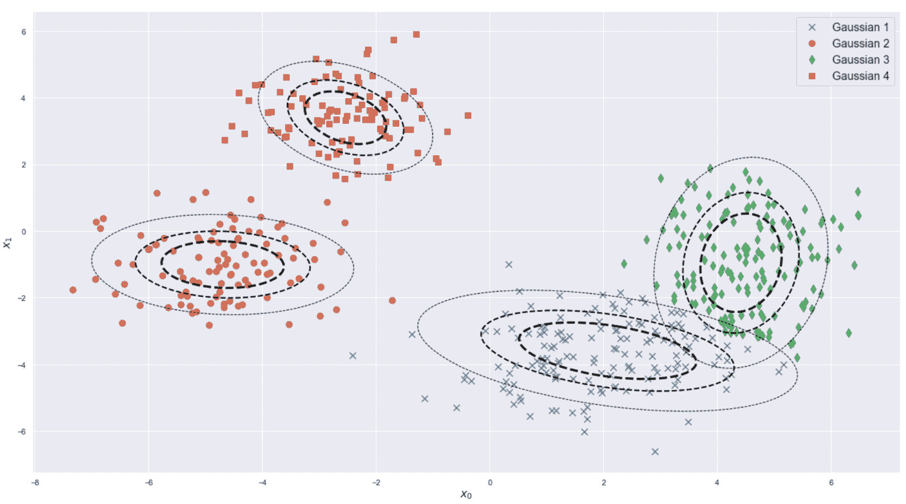Final configuration, with four active components

可以看到，该模型执行了组件数量的自动选择，并且已将较大的右 Blob 分成几乎正交的两个部分。 即使使用大量初始组件（例如 10 个）训练模型，此结果也保持不变。 作为练习，我建议使用其他值重复该示例，检查权重之间的差异。 贝叶斯高斯混合因避免过度拟合的能力而非常强大。 实际上，虽然标准的高斯混合将通过减小它们的协方差来使用所有成分，但必要时（以便覆盖密集区域），这些模型利用了 Dirichlet 过程/分布的特性，以避免激活 组件过多。 例如，可以通过检查模型可实现的最少组件数来深入了解潜在的数据生成过程。 在没有任何其他先验知识的情况下，这样的值是最终配置的良好候选者，因为较少数量的组件也将产生较低的最终可能性。 当然，可以将 AIC / BIC 与这种方法一起使用，以进行另一种形式的确认。 但是，与标准高斯混合的主要区别在于可以包括来自专家的先验信息（例如，均值和协方差的原因结构）。 因此，我邀请您通过更改`mean_precision_prior`的值来重复该示例。 例如，可以将`mean_prior`参数设置为与`X`的平均值不同的值，并调整 `mean_precision_prior`，以便基于某些参数强制模型实现不同的细分 先验知识（即，区域中的所有样本应由特定组件生成）。


# 高斯混合生成


高斯混合模型主要是生成模型。 这意味着训练过程的目标是优化参数，以最大程度地提高模型生成数据集的可能性。 如果假设是正确的，并且已经从特定的数据生成过程中采样了`X`，则最终近似值必须能够生成所有其他可能的采样。 换句话说，我们假设 *x <sub class="calibre20">i</sub> ∈X* 是 IDD，并且 *x <sub class="calibre20">i</sub> 〜p <sub class="calibre20">数据</sub>* ； 因此，当找到最佳近似值 *p≈p <sub class="calibre20">数据</sub>* 时，所有样本 *x <sub class="calibre20">j</sub>* 的概率`p`的数据也很可能生成。

在此示例中，我们要在半监督场景中采用高斯混合模型。 这意味着我们有一个既包含标记样本又包含未标记样本的数据集，并且我们希望将标记样本用作基础事实并找出可以生成整个数据集的最佳混合。 当标记非常大的数据集非常困难且昂贵时，这种情况非常普遍。 为了克服这个问题，可以标记统一采样的子集并训练生成模型，该模型能够以最大可能的可能性生成剩余样本。

我们将采用一个简单的过程，使用主要步骤中讨论的权重，均值和协方差矩阵的更新公式，如下所示：

*   所有标记的样本均被视为事实依据。 因此，如果有 k 个类别，我们还需要定义`k`个组件，并将每个类别分配给其中一个。 因此，如果 *x <sub class="calibre20">i</sub>* 是标有 *y <sub class="calibre20">i</sub> = {1,2，...，k}* 的通用样本， 相应的概率向量将是 *p（x <sub class="calibre20">i</sub> ）=（0，0，...，1，1，0，...，0）*，其中 1 对应于 与 *y <sub class="calibre20">i</sub>* 类相关的高斯。 换句话说，我们信任标记的样本，并强制单个高斯生成具有相同标记的子集。
*   所有未标记的样本均以标准方式处理，概率向量是通过将权重乘以每个高斯下的概率来确定的。

让我们首先生成一个包含 500 个二维样本（标记为`100`，其余标记为未标记），真实标记为`0`和`1`且未标记为`-1`的数据集：

```py
from sklearn.datasets import make_blobs

nb_samples = 500
nb_unlabeled = 400

X, Y = make_blobs(n_samples=nb_samples, n_features=2, centers=2, cluster_std=1.5, random_state=100)

unlabeled_idx = np.random.choice(np.arange(0, nb_samples, 1), replace=False, size=nb_unlabeled)
Y[unlabeled_idx] = -1
```

此时，我们可以初始化高斯参数（权重选择为相等，并且协方差矩阵必须为正半定。如果读者不熟悉此概念，则可以说对称方阵 *A∈ if <sup class="calibre27">n×n</sup>* 在以下情况下为正半定数：


此外，所有特征值都是非负的，特征向量生成正交的基础（当在第 7 章，*降维和分量分析*中讨论 PCA 时，此概念将非常有用）。

如果协方差矩阵是随机选择的，则为了使其为正半定值，有必要将它们的每一个乘以其转置）：

```py
import numpy as np

m1 = np.array([-2.0, -2.5])
c1 = np.array([[1.0, 1.0],
               [1.0, 2.0]])
q1 = 0.5

m2 = np.array([1.0, 3.0])
c2 = np.array([[2.0, -1.0],
               [-1.0, 3.5]])
q2 = 0.5
```

下面的屏幕快照显示了数据集和初始高斯分布：

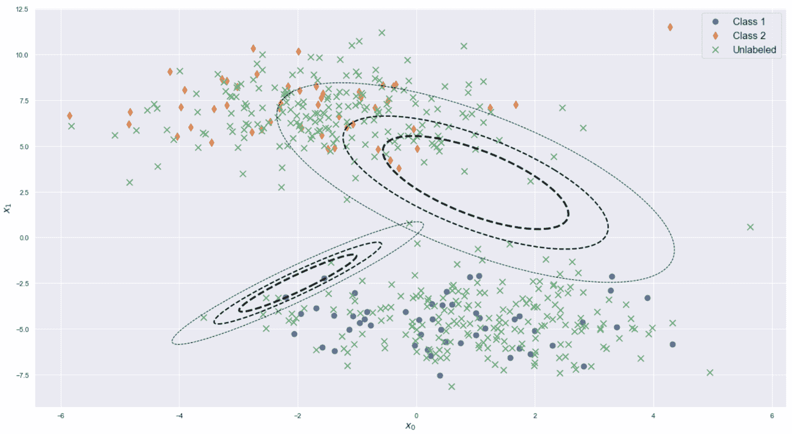Dataset (the unlabeled samples are marked with an x) and initial configuration

现在，我们可以按照先前定义的规则执行几次迭代（本例中为 10 次）（当然，也可以检查参数的稳定性，以停止迭代）。 使用 SciPy `multivariate_normal`类计算每个高斯下的概率：

```py
from scipy.stats import multivariate_normal

nb_iterations = 10

for i in range(nb_iterations):
    Pij = np.zeros((nb_samples, 2))

    for i in range(nb_samples):

        if Y[i] == -1:
            p1 = multivariate_normal.pdf(X[i], m1, c1, allow_singular=True) * q1
            p2 = multivariate_normal.pdf(X[i], m2, c2, allow_singular=True) * q2
            Pij[i] = [p1, p2] / (p1 + p2)
        else:
            Pij[i, :] = [1.0, 0.0] if Y[i] == 0 else [0.0, 1.0]

    n = np.sum(Pij, axis=0)
    m = np.sum(np.dot(Pij.T, X), axis=0)

    m1 = np.dot(Pij[:, 0], X) / n[0]
    m2 = np.dot(Pij[:, 1], X) / n[1]

    q1 = n[0] / float(nb_samples)
    q2 = n[1] / float(nb_samples)

    c1 = np.zeros((2, 2))
    c2 = np.zeros((2, 2))

    for t in range(nb_samples):
        c1 += Pij[t, 0] * np.outer(X[t] - m1, X[t] - m1)
        c2 += Pij[t, 1] * np.outer(X[t] - m2, X[t] - m2)

    c1 /= n[0]
    c2 /= n[1]
```

该过程结束时的高斯混合参数如下：

```py
print('Gaussian 1:')
print(q1)
print(m1)
print(c1)

print('\nGaussian 2:')
print(q2)
print(m2)
print(c2)
```

上一个代码段的输出如下：

```py
Gaussian 1:
0.4995415573662937
[ 0.93814626 -4.4946583 ]
[[ 2.53042319 -0.10952365]
 [-0.10952365  2.26275963]]

Gaussian 2:
0.5004584426337063
[-1.52501526  6.7917029 ]
[[ 2.46061144 -0.08267972]
 [-0.08267972  2.54805208]]
```

正如预期的那样，由于数据集的对称性，权重几乎保持不变，同时均值和协方差矩阵也进行了更新，以使可能性最大化。 最终图显示在以下屏幕截图中：

Final configuration, after 10 iterations

可以看到，两个高斯函数均已成功优化，并且它们能够从充当**受信任指南**的几个标记样本开始生成整个数据集。 这种方法非常强大，因为它允许我们在不做任何修改的情况下将一些先验知识包括在模型中。 但是，由于标记的样本具有等于 1 的固定概率，因此该方法在异常值方面不是非常可靠。 如果样本尚未通过数据生成过程生成或受噪声影响，则可能导致模型放错高斯分布。 但是，通常不应该考虑这种情况，因为任何先验知识（包括在估算中）都必须进行预评估，以检查其是否可靠。 这样的步骤是必要的，以避免强迫模型仅学习原始数据生成过程的一部分的风险。 相反，当标记的样本真正代表了潜在的过程时，它们的包含减少了错误并加快了收敛速度。 我邀请读者在引入一些噪声点（例如（-20，-10））之后重复该示例，并比较一些未标记的测试样本的概率。


# 概要


在本章中，我们介绍了一些最常见的软聚类方法，重点介绍了它们的特性和功能。 模糊 c 均值是基于模糊集的概念对经典 k 均值算法的扩展。 群集不被视为互斥分区，而是可以与其他某些群集重叠的灵活集。 所有样本始终分配给所有聚类，但是权重向量确定每个聚类的隶属度。 连续的簇可以定义部分重叠的属性； 因此，对于两个或更多簇，给定样本的权重可能不为零。 大小决定了它属于每个段的数量。

高斯混合是一个生成过程，其基于这样的假设：可以用加权高斯分布的总和来近似实际数据生成过程。 给定预定义数量的组件，对模型进行训练，以使可能性最大化。 我们讨论了如何使用 AIC 和 BIC 作为绩效指标，以找出最佳的高斯分布数量。 我们还简要介绍了贝叶斯高斯混合的概念，并研究了先验知识的包含如何帮助自动选择一小部分活性成分。 在最后一部分中，我们讨论了半监督高斯混合的概念，展示了如何使用一些带标记的样本作为指导，以优化带有大量未标记点的训练过程。

在下一章中，我们将讨论核密度估计的概念及其在异常检测领域中的应用。


# 问题


1.  软集群和硬集群之间的主要区别是什么？
2.  模糊 c 均值可以轻松处理非凸类。 这句话正确吗？
3.  高斯混合的主要假设是什么？
4.  假设两个模型达到相同的最佳对数似然性； 但是，第一个的 AIC 是第二个的 AIC 的两倍。 这是什么意思？
5.  考虑到前面的问题，我们希望使用哪种模型？
6.  为什么我们要采用 Dirichlet 分布作为贝叶斯高斯混合物权重的先验？
7.  假设我们有一个包含 1,000 个带有标签的样本的数据集，其值已经由专家认证。 我们从相同的来源收集了 5,000 个样本，但我们不想为额外的标签付费。 为了将它们纳入我们的模型，我们该怎么做？


# 进一步阅读


*   *理论神经科学*， *Dayan P.，Abbott L. F.* ，*麻省理工学院出版社，2005 年*
*   *通过 EM 算法从不完整数据中获得最大可能性*，*皇家统计学会杂志*， *Dempster AP，Laird NM 和 Rubin DB* ， *系列 B. 39（1），1977 年*
*   *重新研究统计模型识别*， *Akaike H.* ， *IEEE Transactions on Automatic Control，19（6）*
*   *高斯混合模型的变分学习*， *Nasios N. and Bors AG* ， *IEEE Transactions on Systems，Man，and Cyber​​netics，36/4，08 / 2006*
*   *Belohlavek R.，Klir G. J.* （编辑），*概念和模糊逻辑*，*麻省理工学院出版社*，2011 年
*   *Chapelle O.，SchölkopfB.和 Zien A.* （编辑），*半监督学习*，*麻省理工学院出版社*，2010 年
*   *掌握机器学习算法*， *Bonaccorso G.* ， *Packt Publishing，2018 年*
*   *机器学习算法，第二版*， *Bonaccorso G.* ， *Packt Publishing，2018 年*


