# 异常检测


在本章中，我们将讨论无监督学习的实际应用。 我们的目标是训练模型，这些模型要么能够重现特定数据生成过程的概率密度函数，要么能够识别给定的新样本是内部数据还是外部数据。 一般而言，我们可以说，我们要追求的特定目标是发现异常，这些异常通常是在模型下不太可能出现的样本（也就是说，给定概率分布 *p（x）< < λ*，其中*λ*是预定义的阈值），或者离主分布的质心很远。

特别是，本章将包含以下主题：

*   概率密度函数及其基本性质简介
*   直方图及其局限性
*   **核密度估计**（**KDE**）
*   带宽选择标准
*   异常检测的单变量示例
*   使用 KDD Cup 99 数据集的 HTTP 攻击异常检测示例
*   一类支持向量机
*   隔离林的异常检测


# 技术要求


本章中提供的代码要求：

*   Python3.5+（强烈建议使用 [Anaconda 发行版](https://www.anaconda.com/distribution/)）
*   库：
    *   SciPy 0.19+
    *   NumPy 1.10+
    *   Scikit-Learn 0.20+
    *   Pandas 0.22+
    *   Matplotlib 2.0+
    *   Seaborn 0.9+

[可以在 GitHub 存储库上找到示例](https://github.com/PacktPublishing/HandsOn-Unsupervised-Learning-with-Python/tree/master/Chapter06)。


# 概率密度函数


在所有先前的章节 中，我们一直认为我们的数据集是从隐式数据生成过程`p_data`以及所有 算法假设 *x [i] ∈X* 为**独立且均匀分布的**（**IID**）并进行均匀采样。 我们假设`X`足够准确地表示`p_data`，以便算法可以学习使用有限的初始知识进行概括。 相反，在本章中，我们感兴趣的是直接建模`p_data`，而没有任何具体限制（例如，高斯混合模型通过对数据结构施加约束来实现此目标 分布）。 在讨论一些非常有效的方法之前，简要回顾一下在可测量子集 *X ℜn*上定义的通用连续概率密度函数 *p（x）*的性质很有帮助（避免 混淆，我们将用 *p（x）*表示密度函数，用 *P（x）*表示实际概率）：


例如，单变量高斯分布完全由均值`μ`和方差*σ^2* 来表征：

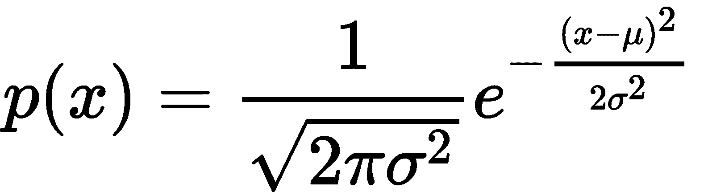

因此， *x∈（a，b）*的概率如下：


即使连续空间（例如，高斯）中某个事件的绝对概率为零（因为积分具有相同的极值），概率密度函数还是一种非常有用的度量，可以用来了解一个样本比 另一个。 例如：考虑高斯分布 *N`(0, 1)`*，密度 *p（1）= 0.4* ，而对于*密度降低到大约 *0.05* ] x ＝ 2* 。 这意味着`1`的可能性比`2`高 0.4 / 0.05 = 8 倍。 同样，我们可以设置可接受阈值`α`并定义所有`x[i]`样本，这些样本的 *p（x [i] ）<* `α`作为异常（例如，在我们的情况下，*α= 0.01* ）。 这种选择是异常检测过程中的关键步骤，正如我们将要讨论的那样，它还必须包括潜在的异常值，但是这些异常值仍然是常规样本。

在许多情况下，特征向量是使用多维随机变量建模的。 例如：数据集 *X →^3* 可以用联合概率密度函数 *p（x，y，z）*表示。 在一般情况下，实际概率需要三重积分：


不难理解，任何使用这种联合概率的算法都会受到复杂性的负面影响。 通过假设单个组件的统计独立性可以大大简化：


不熟悉此概念的读者可以想象考试前会有大量学生。 用随机变量建模的功能是学习时间（`x`）和完成课程的数量（`y`），鉴于这些因素*，我们希望找出成功的可能性 p（Success | x，y）*（此类示例基于条件概率，但主要概念始终相同）。 我们可以假设一个完成所有课程的学生需要在家少学习； 但是，这样的选择意味着两个因素之间的依赖性（和相关性），不能再单独评估了。 相反，我们可以通过假设不存在任何相关性来简化程序，并根据给定的上课次数和作业时间与成功的边际概率进行比较。 重要的是要记住，要素之间的独立性不同于随后从分布中抽取的样本的独立性。 当我们说数据集由 IID 样本组成时，是指概率 *p（x [i] | x [i] [-1] ，x [i] [-2] ，...，p [1] ）= p（x [i] ）*。 换句话说，我们假设样本之间没有相关性。 这样的条件更容易实现，因为通常足以洗净数据集以删除任何残余相关性。 取而代之的是，特征之间的相关性是数据生成过程的特殊属性，无法删除。 因此，在某些情况下，我们假定独立性是因为我们知道其影响可以忽略不计，并且最终结果不会受到严重影响，而在其他情况下，我们将基于整个多维特征向量训练模型。 现在，我们可以定义将在其余部分中使用的异常的概念。


# 作为异常值或新颖性的异常


本章的主题是在没有任何监督的情况下自动检测异常。 由于模型不是基于标记样本提供的反馈，因此我们只能依靠整个数据集的属性来找出相似之处并突出显示不同之处。 特别是，我们从一个非常简单但有效的假设开始：常见事件为*正常*，而不太可能发生的事件通常被视为**异常**。 当然，此定义意味着我们正在监视的过程运行正常，并且大多数结果都被认为是有效的。 例如：一家硅加工厂必须将晶圆切成相等的块。 我们知道它们每个都是 0.2×0.2 英寸（约 0.5×0.5 厘米），每侧的标准偏差为 0.001 英寸。 此措施是在 1,000,000 个处理步骤后确定的。 我们是否被授权将 0.25×0.25 英寸芯片视为异常？ 当然可以。 实际上，我们假设每边的长度都建模为高斯分布（一个非常合理的选择），其中*μ= 0.2* 和*σ= 0.001；* 在经过三个标准偏差后，概率下降到几乎为零。 因此，例如： *P（边> 0.23）≈0* ，具有这种尺寸的芯片必须清楚地视为异常。

显然，这是一个非常简单的示例，不需要任何模型。 但是，在现实生活中，密度的结构可能非常复杂，几个高概率区域被低概率区域包围。 这就是为什么必须采用更通用的方法来对整个样本空间进行建模的原因。

当然，异常的语义无法标准化，并且始终取决于所分析的特定问题。 因此，定义异常概念的 常见方法是在**异常值**和**新奇**之间进行区分。 前者是数据集中包含的样本，即使它们与其他样本之间的距离大于平均值。 因此，**离群值检测**过程旨在找出此类*奇怪的*样本（例如：考虑之前的示例，如果将 0.25×0.25 英寸的芯片包含在数据集中，则显然是一个离群值 ）。 相反，**新奇检测**的目标略有不同，因为在这种情况下，我们假定使用仅包含*正常*样本的数据集； 因此，给定一个新的芯片，我们有兴趣了解我们是否可以将其视为来自原始数据生成过程还是离群值（例如：新手技术人员向我们提出以下问题：是 0.25×0.25 英寸的芯片 如果我们已经收集了*正常*芯片的数据集，则可以使用我们的模型来回答问题。

描述这种情况的另一种方法是将样本视为一系列可能受可变噪声影响的值： *y（t）= x（t）+ n（t）*。 当 *|| n（t）|| < < || x（t）||* 可以分类为*干净*： *y（t）≈x（t）*。 相反，当 *|| n（t）||时 ≈|| x（t）||* （或更高），它们是离群值，不能代表真实的基础过程`p_data`。 由于噪声的平均大小通常比信号小得多，因此 *P（|| n（t）||≈|| x（t）||）*的概率接近于零。 因此，我们可以将异常想象为受异常外部噪声影响的正常样本。 异常和噪声样本管理之间真正的主要区别通常在于检测真实异常并相应地标记样本的能力。 实际上，虽然嘈杂的信号肯定已损坏，然后目标是最大程度地减少噪声的影响，但是异常现象可以很容易地被人类识别并正确标记。 但是，正如已经讨论过的，在本章中，我们有兴趣找出不依赖现有标签的发现方法。 此外，为避免混淆，我们总是引用异常，每次定义数据集的内容（仅内部数据或内部数据及异常值）以及我们的分析目标。 在下一部分中，我们将简要讨论数据集的预期结构。


# 数据集的结构


在标准监督（通常也是非监督）任务中，数据集有望达到平衡。 换句话说，属于每个类别的样本数量应该几乎相同。 相反，在本章要讨论的任务中，我们假设数据集`X`非常不平衡（包含`N`个样本）：

*   *N [离群值] < < N* ，如果存在离群检测（即数据集部分为*污垢；* ，因此， （找出一种方法将所有异常值过滤掉）
*   *N [离群值] = 0* （或更实际地， *P（ N [离群值] > 0）→0 ）*，如果存在新颖性检测（也就是说，我们通常可以信任现有样本，而将注意力集中在新样本上）

这些标准的原因很明显：让我们考虑前面讨论的示例。 如果在 1,000,000 个处理步骤后观察到的异常率等于 0.2%，则表示存在 2,000 个异常，这对于一个工作过程而言可能是一个合理的值。 如果这个数字大得多，则意味着系统中应该存在一个更严重的问题，这超出了数据科学家的职责范围。 因此，在这种情况下，我们期望一个数据集包含大量正确的样本和非常少的异常（甚至为零）。 在许多情况下，经验法则是反映潜在的数据生成过程，因此，如果专家可以确认例如发生 0.2% 的异常，则该比率应为 *1000÷2* 找出现实的概率密度函数。 实际上，在这种情况下，更重要的是找出确定异常值可区分性的因素。 另一方面，如果要求我们仅执行新颖性检测（例如：区分有效和恶意网络请求），则必须对数据集进行验证，以便不包含异常，但同时要进行反映 负责所有可能有效样本的真实数据生成过程。

实际上，如果正确样本的数量是详尽无遗的，则与高概率区域的任何较大偏差都足以触发警报。 相反，真实数据生成过程的有限区域可能会导致假阳性结果（也就是说，尚未包含在训练集中并被错误标识为异常值的有效样本）。 在最坏的情况下，如果特征发生更改（即，错误地识别为有效样本的离群值），则噪声很大的子集也可能确定假阴性。 但是，在大多数现实生活中，最重要的因素是样本的数量和收集样本的环境。 毋庸置疑，任何模型都必须使用将要测试的相同类型的元素进行训练。 例如：如果使用低精度的仪器在化工厂内部进行测量，则高精度采集的测试可能无法代表总体（当然，它们比数据集可靠得多）。 因此，在进行分析之前，我强烈建议您仔细检查数据的性质，并询问是否所有测试样本均来自同一数据生成过程。

现在，我们可以介绍**直方图**的概念，这是估计包含观测值的数据集分布的最简单方法。


# 直方图


找出概率密度函数近似值的最简单方法是基于频率计数。 如果我们有一个包含`m`样本 *x [i] ∈*的数据集`X`（为简单起见，我们仅考虑单变量分布，但是 过程对于多维样本完全相同），我们可以如下定义`m`和`M`：

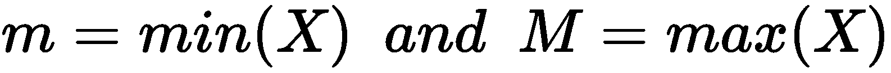

间隔*（m，M）*可以分为固定数量的`b`个 bin（它们可以具有相同或不同的宽度，表示为 *w（b [HT [5] j ）*，因此 *n [p] （b [j] ）*对应于箱 *b [中包含的样本数 ] j]* 此时，给定测试样本`x[t]`，很容易理解，通过检测 bin 可以很容易地获得概率的近似值 包含`x[t]`，并使用以下公式：

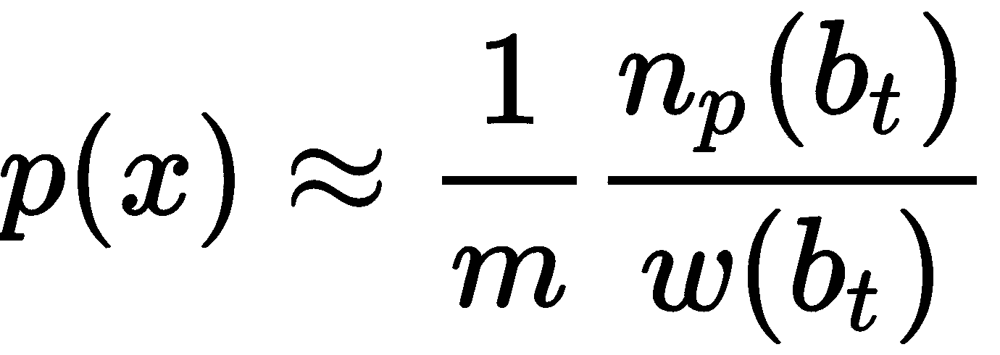

在分析这种方法的利弊之前，让我们考虑一个简单的示例，该示例基于细分为 10 个不同类别的人群的年龄分布：

```py
import numpy as np

nb_samples = [1000, 800, 500, 380, 280, 150, 120, 100, 50, 30]

ages = []

for n in nb_samples:
    i = np.random.uniform(10, 80, size=2)
    a = np.random.uniform(i[0], i[1], size=n).astype(np.int32)
    ages.append(a)

ages = np.concatenate(ages)
```

只能使用随机种子`1000`（即，设置`np.random.seed(1000)`）来复制数据集。

`ages` 数组包含所有样本，我们想创建一个直方图以初步了解分布。 我们将使用 NumPy `np.histrogram()`函数，该函数提供所有必需的工具。 要解决的第一个问题是找出最佳箱数。 对于标准分布，这可能很容易，但是如果没有关于概率密度的先验知识，则变得非常困难。 原因很简单：因为我们需要用一个逐步函数来近似一个连续函数，所以 bin 的宽度决定了最终精度。 例如：如果密度是平坦的（例如：均匀分布），那么几个箱就足以达到良好的效果。 相反，当存在峰时，在函数的一阶导数较大时将更多（较短）的 bin 放在区域中，在导数接近零（表示平坦区域）时将较小的数目放置在区域中会很有帮助。 正如我们将要讨论的，使用更复杂的技术可以使此过程变得更容易，而直方图通常基于对最佳仓数的更粗略计算。 特别是，NumPy 允许设置`bins='auto'`参数，该参数将强制算法根据明确定义的统计方法（基于 Freedman Diaconis Estimator 和 Sturges 公式）自动选择数字：

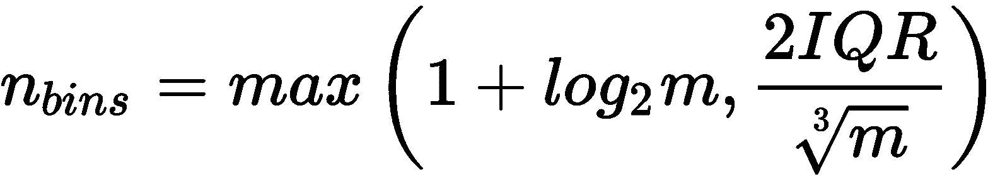

在上式中，**四分位数范围**（**IQR**）对应于第 75^个和第 25^个百分位数。 由于我们对分布没有一个清晰的概念，因此我们希望依靠自动选择，如以下代码片段所示：

```py
import numpy as np

h, e = np.histogram(ages, bins='auto')

print('Histograms counts: {}'.format(h))
print('Bin edges: {}'.format(e))
```

上一个代码段的输出如下：

```py
Histograms counts: [177  86 122 165 236 266 262 173 269 258 241 116 458 257 311   1   1   5 6]
Bin edges: [16\.         18.73684211 21.47368421 24.21052632 26.94736842 29.68421053
 32.42105263 35.15789474 37.89473684 40.63157895 43.36842105 46.10526316
 48.84210526 51.57894737 54.31578947 57.05263158 59.78947368 62.52631579
 65.26315789 68\.        ]
```

因此，该算法定义了 19 个 bin，并已输出频率计数和边缘（即，最小值为`16`，最大值为`68`）。 现在，我们可以显示直方图的图：


测试分布的直方图

该图证实该分布是非常不规则的，并且一些区域的峰被平坦区域包围。 如前所述，当查询基于样本属于特定区域的概率时，直方图会很有帮助。 例如，在这种情况下，我们可能有兴趣确定某个人的年龄在 48.84 和 51.58 之间（对应于第 12^个）的概率 bin 从 0 开始）。 由于所有垃圾箱的宽度相同，因此我们可以简单地用 *n [p] （b [12 []* *）*（ `h[12]` ）和`m`（`ages.shape[0]`）：

```py
d = e[1] - e[0]
p50 = float(h[12]) / float(ages.shape[0])

print('P(48.84 < x < 51.58) = {:.2f} ({:.2f}%)'.format(p50, p50 * 100.0))
```

输出如下：

```py
P(48.84 < x < 51.58) = 0.13 (13.43%)
```

因此，概率的近似值约为 13.5%，这也由直方图的结构证实。 但是，读者应该清楚地了解到这种方法有明显的局限性。 首先，也是最明显的是关于垃圾箱的数量和宽度。 实际上，一小部分产生的粗略结果无法考虑快速振荡。 另一方面，非常大的数量会驱动到*带孔的*直方图，因为大多数 bin 都没有样本。 因此，考虑到现实生活中可能遇到的所有动态因素，需要一种更可靠的方法。 这是我们将在下一节中讨论的内容。


# 核密度估计（KDE）


直方图不连续性问题的解决方案可以通过一种简单的方法有效地解决。 给定样本 *x [i] ∈X* ，假设我们使用的是中心为*的多元分布，则可以考虑超体积（通常是超立方体或超球体） x [i]* 。 通过一个称为**带宽**的常数`h`定义了这样一个区域的扩展（已选择名称以支持该值为正的有限区域的含义）。 但是，我们现在不只是简单地计算属于超体积的样本数量，而是使用具有一些重要特征的平滑核函数 *K（x [i] ; h）*来近似估计该值：


此外，出于统计和实际原因，还必须强制执行以下整数约束（为简单起见，仅在单变量情况下显示，但扩展很简单）：

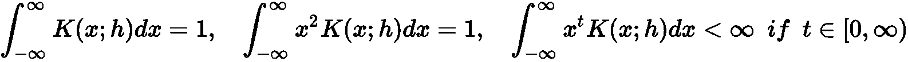

在讨论称为**核密度估计**（**KDE**）的技术之前，显示`K(·)`的一些常见选择将很有帮助。


# 高斯核


这是最常用的内核之一，其结构如下：


以下屏幕截图显示了图形表示：


高斯核

鉴于其规律性，高斯核是许多密度估计任务的常见选择。 但是，由于该方法不允许混合不同的内核，因此选择时必须考虑所有属性。 从统计数据中，我们知道高斯分布可被视为峰度的平均参考值（峰度与峰高和尾巴的重量成正比）。 为了最大化内核的选择性，我们需要减少带宽。 这意味着即使最小的振荡也会改变密度，并且结果是非常不规则的估计。 另一方面，当`h`大时（即高斯的方差），近似变得非常平滑，并且可能失去捕获所有峰的能力。 因此，结合选择最合适的带宽，考虑其他可以自然简化流程的内核也会很有帮助。


# Epanechnikov 核


已经提出该内核以最小化均方误差，并且它还具有非常规则的性质（实际上，可以想象为倒抛物线）。 计算公式如下：


引入常数`ε`可以使内核规范化并满足所有要求（以类似的方式，可以在范围内扩展内核（ *-h* ，`h`），以便与其他功能更加一致）。 以下屏幕截图显示了图形表示：

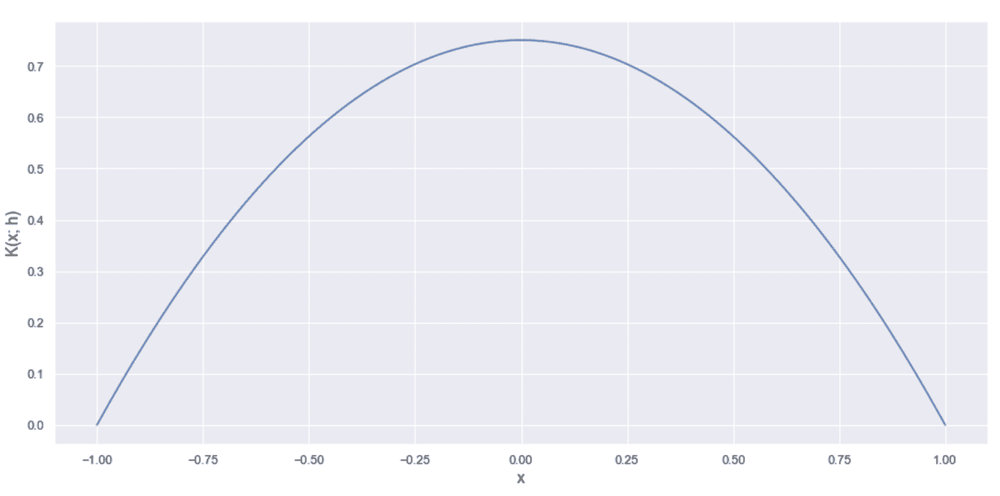

Epanechnikov 核

当 *h→0 时，内核会变得非常尖峰。*但是，由于其数学结构，它将始终保持非常规则； 因此，在大多数情况下，无需用它代替高斯核（即使后者的均方误差稍大）。 此外，由于函数在 *x =±h（K（x; h）= 0* *对于* *| x | > h* ）不连续，因此 可能会导密集度估计值迅速下降，特别是在边界处，例如高斯函数非常缓慢地下降。


# 指数核


指数核是一个非常高峰的内核，其通用表达式如下：


与高斯核相反，该核的尾巴很重，峰尖尖。 以下屏幕截图显示了一个图：


指数核

可以看到，这样的函数适合于建模非常不规则的分布，其密度高度集中在某些特定点周围。 另一方面，当数据生成过程非常规则且表面光滑时，误差可能会非常高。 **平均积分平方误差**（**MISE**）可以用来评估内核（和带宽）的性能，是一种很好的理论方法，其定义如下：

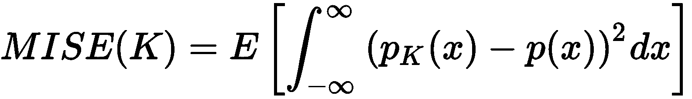

在上一个公式中， *p [K] （x）*是估计的密度，而 *p（x）*是实际的密度。 不幸的是， *p（x）*是未知的（否则，我们不需要任何估计）。 因此，这种方法只能用于理论评估（例如：Epanechnikov 核的最优性）。 但是，很容易理解，只要内核无法保持接近实际表面，MISE 就会更大。 由于指数突然跃升至峰值，因此仅在特定情况下才适用。 在所有其他情况下，它的行为会导致更大的 MISE，因此最好使用其他内核。


# 统一（或 Tophat）内核


这是最简单且不太平滑的内核函数，其用法类似于构建直方图的标准过程。 它等于以下内容：

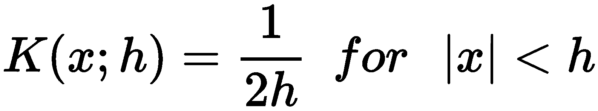

显然，这是一个在带宽界定的范围内恒定的步骤，仅在估计不需要平滑时才有用。


# 估计密度


一旦选择了核函数，就可以使用 k 最近邻方法建立概率密度函数的完全近似值。 实际上，给定数据集`X`（为简单起见， *X∈^m* ，所以这些值是实数），例如，创建起来很容易 球形树（如第 2 章，“聚类基础知识”中所述）以有效的方式对数据进行分区。 当数据结构准备就绪时，可以在带宽定义的半径范围内获得查询点`x`[`j`] 的所有邻居。 假设这样的集合是 *X [j] = {x [1] ，...，x [t] }* 和点数 是`N[j]`。 概率密度的估计如下：


不难证明，如果适当地选择了带宽（根据邻域中包含的样本数量而定），`p[K]`的概率就会收敛到实际的 *] p（x）*。 换句话说，如果粒度足够大，则近似值与真实密度之间的绝对误差将收敛为零。 下图显示了 *p [K] （x [j] ）*的构建过程：

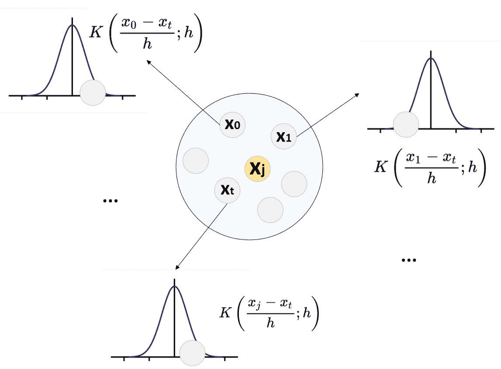

`x[j]`的密度估计。 在属于`x[j]`邻域的每个点中评估内核函数

在这一点上，自然会问为什么不为每个查询使用整个数据集而不是 k-NN 方法？ 答案很简单，它基于这样的假设：可以使用局部行为轻松地插值以`x[j]`计算的密度函数的值（即，对于多变量 分布，以`x[j]`为中心的球和*远点*对估计没有影响。 因此，我们可以将计算限制为`X`的较小子集，避免包含接近零的贡献。

在讨论如何确定最佳带宽之前，让我们展示一下先前定义的数据集的密度估计（使用 scikit-learn）。 由于我们没有任何特定的先验知识，因此我们将使用具有不同带宽（0.1、0.5 和 1.5）的高斯核。 所有其他参数均保留为其默认值。 但是，`KernelDensity`类允许设置度量（默认为`metric='euclidean'`），数据结构（默认为`algorithm='auto'`，它根据维度在球树和 kd 树之间执行自动选择），以及 绝对公差和相对公差（分别为 0 和 10^(-8) ）。 在许多情况下，无需更改默认值。 但是，对于具有特定功能的超大型数据集，例如，更改`leaf_size`参数以提高性能可能会有所帮助（如 第 2 章 中讨论的 ， “聚类基础知识”）。 此外，默认度量标准不能满足所有任务的要求（例如：标准文档显示了一个基于 Haversine 距离的示例，在使用纬度和经度时可以使用该示例）。 在其他情况下，最好使用超立方体而不是球（曼哈顿距离的情况就是这样）。

让我们首先实例化类并拟合模型：

```py
from sklearn.neighbors import KernelDensity

kd_01 = KernelDensity(kernel='gaussian', bandwidth=0.1)
kd_05 = KernelDensity(kernel='gaussian', bandwidth=0.5)
kd_15 = KernelDensity(kernel='gaussian', bandwidth=1.5)

kd_01.fit(ages.reshape(-1, 1))
kd_05.fit(ages.reshape(-1, 1))
kd_15.fit(ages.reshape(-1, 1))
```

此时，可以调用`score_samples()`方法来获取一组数据点的对数密度估计值（在我们的示例中，我们正在考虑以 0.05 为增量的范围`(10, 70)`）。 由于值是 *log（p）*，因此有必要计算 *e^(log（p）)* 以获得实际概率。

生成的图显示在以下屏幕截图中：


带宽的高斯密度估计：0.1（顶部），0.5（中间）和 1.5（底部）

可能会注意到，当带宽很小（0.1）时，由于缺少特定子范围的样本，因此密度具有强烈的振荡。 当 *h = 0.5* 时，轮廓（由于数据集是单变量的）变得更加稳定，但是仍然存在一些由邻居的内部方差引起的残留快速变化。 当`h`变大（在我们的情况下为 1.5）时，几乎完全消除了这种行为。 一个明显的问题是：如何确定最合适的带宽？ 当然，最自然的选择是使 MISE 最小的`h`值，但是，正如所讨论的，只有在知道真实的概率密度时才可以使用此方法。 但是，有一些经验标准已经被证实是非常可靠的。 给定完整的数据集 *X∈^m* ，第一个数据集基于以下公式：

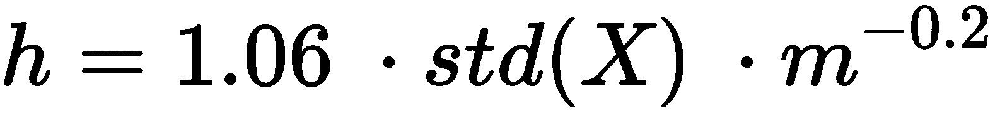

在我们的案例中，我们获得以下信息：

```py
import numpy as np

N = float(ages.shape[0])
h = 1.06 * np.std(ages) * np.power(N, -0.2)

print('h = {:.3f}'.format(h))
```

输出如下：

```py
h = 2.415
```

因此，建议是增加带宽，甚至超过我们上一个实验中的带宽。 因此，第二种方法基于四分位数间距（ *IQR = Q3-Q1* 或等效地，第 75^个百分位-25^第个百分位），并且 对于非常强大的内部变体，它更加健壮：

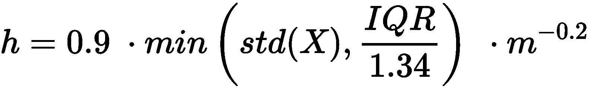

计算如下：

```py
import numpy as np

IQR = np.percentile(ages, 75) - np.percentile(ages, 25)
h = 0.9 * np.min([np.std(ages), IQR / 1.34]) * np.power(N, -0.2)

print('h = {:.3f}'.format(h))
```

现在的输出是这样的：

```py
h = 2.051
```

该值比上一个值小，表明 *p [K] （x）*可以使用较小的超体积来更精确。 根据经验，我建议选择带宽最小的方法，即使第二种方法通常在不同情况下也能提供最佳结果。 现在让我们使用 *h = 2.0* 以及高斯，Epanechnikov 和指数核（我们将统一的数排除在外，因为最终结果与直方图等效）来重新执行估计：

```py
from sklearn.neighbors import KernelDensity

kd_gaussian = KernelDensity(kernel='gaussian', bandwidth=2.0)
kd_epanechnikov = KernelDensity(kernel='epanechnikov', bandwidth=2.0)
kd_exponential = KernelDensity(kernel='exponential', bandwidth=2.0)

kd_gaussian.fit(ages.reshape(-1, 1))
kd_epanechnikov.fit(ages.reshape(-1, 1))
kd_exponential.fit(ages.reshape(-1, 1))
```

图形输出显示在以下屏幕截图中：

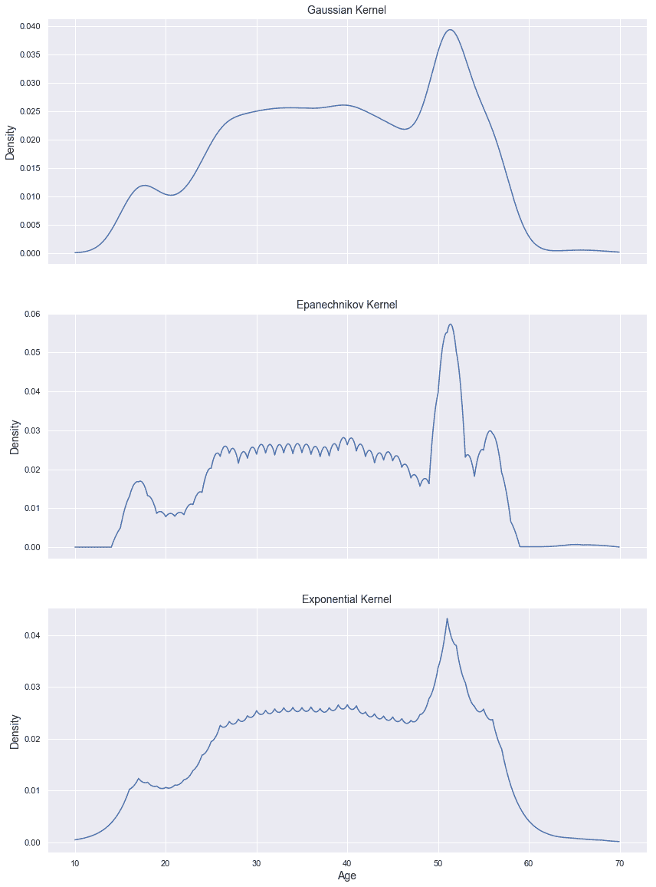

带宽等于 2.0 的密度估计，高斯核（上），Epanechnikov 核（中）和指数核（下）

不出所料，Epanechnikov 和指数核都比高斯核振荡（因为当`h`较小时，它们倾向于更趋于峰值）； 但是，很明显，中心图肯定是最准确的（就 MISE 而言）。 以前使用高斯核和 *h = 0.5* 时已经获得了相似的结果，但是在那种情况下，振荡极为不规则。 如所解释的， Epanechnikov 内核在值达到带宽边界时具有非常强的不连续趋势。 通过查看估计的极端现象可以立即理解该现象，该估计值几乎垂直下降到零。 相反， *h = 2* 的高斯估计似乎非常平滑，并且无法捕获 50 到 60 年之间的变化。 指数核也发生了同样的情况，它也显示出其独特的行为：极端尖刺的极端。 在下面的示例中，我们将使用 Epanechnikov 内核； 但是，我邀请读者也检查带宽不同的高斯滤波器的结果。 这种选择有一个精确的理由（没有充分的理由就不能丢弃）：我们认为数据集是详尽无遗的，并且我们希望对克服自然极端的所有样本进行惩罚。 在所有其他情况下，可以选择非常小的残差概率。 但是，必须考虑每个特定目标做出这样的选择。


# 异常检测


现在，我们使用 Epanechnikov 密度估计来执行异常检测的示例。 根据概率密度的结构，我们决定在 *p（x）< 0.005* 处设置一个截止点。 以下屏幕快照中显示了这种情况：

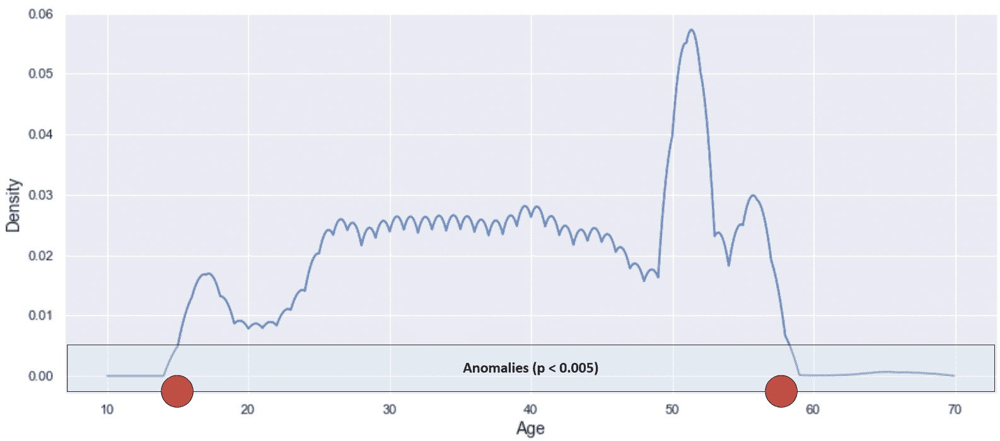

具有异常截止的 Epanechnikov 密度估计

红点表示将样本归类为异常的年龄限制。 让我们计算一些测试点的概率密度：

```py
import numpy as np

test_data = np.array([12, 15, 18, 20, 25, 30, 40, 50, 55, 60, 65, 70, 75, 80, 85, 90]).reshape(-1, 1)

test_densities_epanechnikov = np.exp(kd_epanechnikov.score_samples(test_data))
test_densities_gaussian = np.exp(kd_gaussian.score_samples(test_data))

for age, density in zip(np.squeeze(test_data), test_densities_epanechnikov):
    print('p(Age = {:d}) = {:.7f} ({})'.format(age, density, 'Anomaly' if density < 0.005 else 'Normal'))
```

上一个代码片段的输出是这样的：

```py
p(Age = 12) = 0.0000000 (Anomaly)
p(Age = 15) = 0.0049487 (Anomaly)
p(Age = 18) = 0.0131965 (Normal)
p(Age = 20) = 0.0078079 (Normal)
p(Age = 25) = 0.0202346 (Normal)
p(Age = 30) = 0.0238636 (Normal)
p(Age = 40) = 0.0262830 (Normal)
p(Age = 50) = 0.0396169 (Normal)
p(Age = 55) = 0.0249084 (Normal)
p(Age = 60) = 0.0000825 (Anomaly)
p(Age = 65) = 0.0006598 (Anomaly)
p(Age = 70) = 0.0000000 (Anomaly)
p(Age = 75) = 0.0000000 (Anomaly)
p(Age = 80) = 0.0000000 (Anomaly)
p(Age = 85) = 0.0000000 (Anomaly)
p(Age = 90) = 0.0000000 (Anomaly)
```

可以看到，函数的突然下降造成了某种垂直分离。 年龄`15`的人几乎处于边界（ *p（15）≈0.0049* ），而行为的上限更加剧烈。 截止日期约为 58 年，但年龄`60`的样本比年龄 57 岁的样本低约 10 倍（这也由初始直方图证实）。 由于这只是一个教学示例，因此很容易检测到异常。 但是，如果没有标准化的算法，即使是稍微更复杂的分布也会产生一些问题。 特别地，在这种简单的单变量分布的特定情况下，异常通常位于尾部。

因此，我们假设给定整体密度估计 *p [K] （x）*：

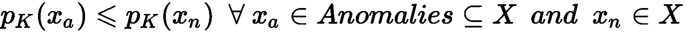

当考虑包含所有样本（正常样本和异常样本）的数据集时，这种行为通常是不正确的，并且数据科学家在确定阈值时必须小心。 即使很明显，也最好通过从数据集中删除所有异常来学习正态分布，以展开（ *p [K] （x）→0* ）的区域 异常所在的位置。 这样，先前的标准仍然有效，并且可以轻松比较不同的密度以进行区分。

在继续下一个示例之前，我建议通过创建人工漏洞并设置不同的检测阈值来修改初始分布。 此外，我邀请读者根据年龄和身高生成双变量分布（例如：基于一些高斯的总和），并创建一个简单的模型，该模型能够检测所有参数不太可能出现的人。


# 使用 KDD Cup 99 数据集进行异常检测


本示例基于 KDD Cup 99 数据集，该数据集收集了一系列正常和恶意的互联网活动。 特别是，我们将重点放在 HTTP 请求的子集上，该子集具有四个属性：持续时间，源字节，目标字节和行为（这是一个分类元素，但是对我们而言，可以立即访问某些特定的属性很有帮助。 攻击）。 由于原始值是非常小的零附近的数字，因此所有版本（包括 scikit-learn 在内）都使用公式 *log（x + 0.1）*（因此，在模拟 新样本的异常检测）。 当然，逆变换如下：


让我们首先使用 scikit-learn 内置函数`fetch_kddcup99()`加载并准备数据集，然后选择`percent10=True`将数据限制为原始集合的 10% （非常大）。 当然，我邀请读者也使用整个数据集和完整的参数列表（包含 34 个数值）进行测试。

在这种情况下，我们还选择`subset='http'`，它已经准备好包含大量的正常连接和一些特定的攻击（如在标准期刊日志中）：

```py
from sklearn.datasets import fetch_kddcup99

kddcup99 = fetch_kddcup99(subset='http', percent10=True, random_state=1000)

X = kddcup99['data'].astype(np.float64)
Y = kddcup99['target']

print('Statuses: {}'.format(np.unique(Y)))
print('Normal samples: {}'.format(X[Y == b'normal.'].shape[0]))
print('Anomalies: {}'.format(X[Y != b'normal.'].shape[0]))
```

输出如下：

```py
Statuses: [b'back.' b'ipsweep.' b'normal.' b'phf.' b'satan.'] Normal samples: 56516 Anomalies: 2209
```

因此，使用`2209`恶意样本和`56516`正常连接有四种类型的攻击（在此情况下，其详细信息不重要）。 为了进行密度估计，为了进行一些初步考虑，我们将把这三个分量视为独立的随机变量（虽然不完全正确，但是可以作为一个合理的起点），但是最终估计是基于完整的联合分布 。 当我们要确定最佳带宽时，让我们执行基本的统计分析：

```py
import numpy as np

means = np.mean(X, axis=0)
stds = np.std(X, axis=0)
IQRs = np.percentile(X, 75, axis=0) - np.percentile(X, 25, axis=0)
```

上一个代码段的输出如下：

```py
Means: [-2.26381954  5.73573107  7.53879208]
Standard devations: [0.49261436 1.06024947 1.32979463]
IQRs: [0\.         0.34871118 1.99673381]
```

持续时间的 IQR（第一个部分）为空； 因此，大多数值是相等的。 让我们绘制一个直方图来确认这一点：

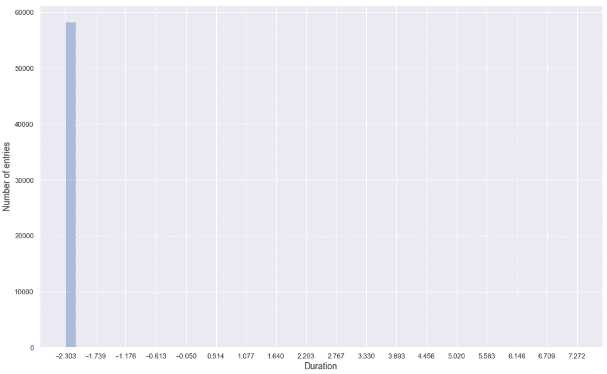

第一部分的直方图（持续时间）

不出所料，这种成分不是很重要，因为只有一小部分样本具有不同的值。 因此，在此示例中，我们将跳过它，仅使用源字节和目标字节。 现在，如前所述，计算带宽：

```py
import numpy as np

N = float(X.shape[0])

h0 = 0.9 * np.min([stds[0], IQRs[0] / 1.34]) * np.power(N, -0.2)
h1 = 0.9 * np.min([stds[1], IQRs[1] / 1.34]) * np.power(N, -0.2)
h2 = 0.9 * np.min([stds[2], IQRs[2] / 1.34]) * np.power(N, -0.2)

print('h0 = {:.3f}, h1 = {:.3f}, h2 = {:.3f}'.format(h0, h1, h2))
```

输出如下：

```py
h0 = 0.000, h1 = 0.026, h2 = 0.133
```

除了第一个值，我们需要在`h1`和`h2`之间进行选择。 由于值的大小不大并且我们希望具有较高的选择性，因此我们将设置 *h = 0.025* ，并使用高斯核，该核提供了良好的平滑度。 下面的屏幕快照显示了分割输出（使用包含一个内部 KDE 模块的 seaborn 可视化库获得），其中还包含第一个组件。

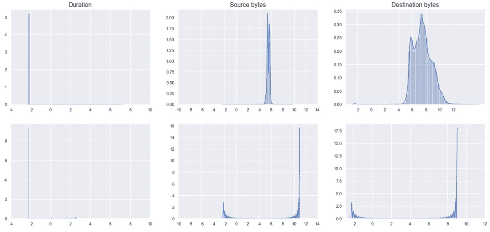

正常连接（上面一行）和恶意攻击（下面一行）的密度估计

第一行显示了正常连接的密度，而下一行是恶意攻击。 正如预期的那样，两种情况下的第一部分（持续时间）几乎相同，可以将其丢弃。 相反，源字节和目标字节都表现出非常不同的行为。 在不考虑对数变换的情况下，普通连接平均发送 5 个字节，其方差很小，从而将电位范围扩展到间隔（ 4 ， 6 ） 。 响应具有较大的方差，其值在 4 和 10 之间，并且从 10 开始具有非常低的密度。 相反，恶意攻击的源字节和目标字节都具有两个峰值：一个较短的峰值对应于 -2 ，一个较高的峰值分别对应于大约 11 和。 9 （与正常区域的重叠最小）。 即使不考虑全部联合概率密度，也不难理解大多数攻击会发送更多的输入数据并获得更长的响应（而连接持续时间并没有受到很大影响）。

现在，我们可以通过仅选择正常样本（即，对应于`Y == b'normal.'`）来训练估计器：

```py
from sklearn.neighbors import KernelDensity

X = X[:, 1:]

kd = KernelDensity(kernel='gaussian', bandwidth=0.025)
kd.fit(X[Y == b'normal.'])
```

让我们计算正常样本和异常样本的密度：

```py
Yn = np.exp(kd.score_samples(X[Y == b'normal.']))
Ya = np.exp(kd.score_samples(X[Y != b'normal.']))

print('Mean normal: {:.5f} - Std: {:.5f}'.format(np.mean(Yn), np.std(Yn)))
print('Mean anomalies: {:.5f} - Std: {:.5f}'.format(np.mean(Ya), np.std(Ya)))
```

输出如下：

```py
Mean normal: 0.39588 - Std: 0.25755
Mean anomalies: 0.00008 - Std: 0.00374
```

显然，当例如 *p [K] （x）< 0.05* （考虑三个标准差），我们得到 *p 时，我们可以预期到异常。 [K] （x）∈（0，0.01））*，而`Yn`的中位数约为 0.35。 这意味着至少一半的样本具有`p[K]`*（x）> 0.35* 。 但是，通过简单的计数检查，我们得到以下信息：

```py
print(np.sum(Yn < 0.05))
print(np.sum(Yn < 0.03))
print(np.sum(Yn < 0.02))
print(np.sum(Yn < 0.015))
```

输出如下：

```py
3147
1778
1037
702
```

由于有 56,516 个正常样本，我们可以决定选择两个阈值（还要考虑异常离群值）：

*   **正常连接**： *p [K] （x）> 0.03*
*   **中度警报**：0.03（涉及 3.1% 的正常样本，可以将其识别为假阳性）
*   **高警报**：0.015（在这种情况下，只有 1.2% 的正常样本可以触发警报）

此外，在第二个警报中，我们捕获到以下内容：

```py
print(np.sum(Ya < 0.015))
```

输出如下：

```py
2208
```

因此，只有一个异常样本具有 *p [K] （x）> 0.015* （有 2,209 个向量），这证实了这种选择是合理的。 密度的直方图也证实了先前的结果：

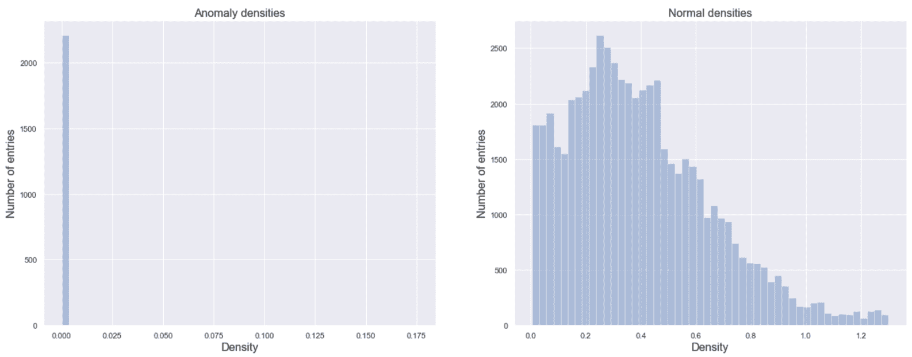

异常（左）和正常（右）密度的直方图

正态分布的右尾并不令人担忧，因为异常高度集中在左侧。 在这一领域，也存在大多数异常，因此也是最严重的。 原因与特定域严格相关（对于不同的请求，输入和输出字节可能非常相似），并且在更稳定的解决方案中，有必要考虑其他参数（例如：完整的 KDD Cup 99 数据集） 。 但是，出于教学目的，我们可以定义一个简单的函数（基于先前定义的阈值），以根据源字节和目标字节的数量（不是对数的）检查连接状态：

```py
import numpy as np

def is_anomaly(kd, source, destination, medium_thr=0.03, high_thr=0.015):
    xs = np.log(source + 0.1)
    xd = np.log(destination + 0.1)
    data = np.array([[xs, xd]])

    density = np.exp(kd.score_samples(data))[0]

    if density >= medium_thr:
        return density, 'Normal connection'
    elif density >= high_thr:
        return density, 'Medium risk'
    else:
        return density, 'High risk'
```

现在，我们可以使用三个不同的示例来测试该功能：

```py
print('p = {:.2f} - {}'.format(*is_anomaly(kd, 200, 1100)))
print('p = {:.2f} - {}'.format(*is_anomaly(kd, 360, 200)))
print('p = {:.2f} - {}'.format(*is_anomaly(kd, 800, 1800)))
```

输出如下：

```py
p = 0.30 - Normal connection
p = 0.02 - Medium risk
p = 0.00000 - High risk
```

对于一般概述，还可以考虑源和目标字节密度的双变量图：


源和目标字节密度的双变量图

前面的屏幕快照确认，尽管攻击通常涉及大量的输入字节，但响应却与正常的响应非常相似，即使它们占据了该区域的最末端。 作为练习，我邀请读者使用整个 KDD Cup 99 数据集训练模型，并找出最佳阈值以检测非常危险和中等风险的攻击。


# 一类支持向量机


一类**支持向量机**（**SVM**）的概念已由 SchölkopfB，Platt JC，Shawe-Taylor JC，Smola AJ 和 Williamson RC 提出[ *，《估计高维分布的支持》，《神经计算》，13 / 7，2001* 作为一种将新颖性分类为从真实数据生成过程中抽取的样本或异常值的方法。 让我们从我们要实现的目标开始：找到一个无监督模型，在给定样本`x[i]`的情况下，可以产生二进制输出`y[i]`（通常，SVM 的结果是双极性的，分别为-1 和+1），因此，如果`x[i]`属于内在 *y [i] = 如果`x[i]`是一个异常值，则[+1]* 以及 *y [i] = -1* ，在上述论文中，假设对构成训练集的大多数内线而言，结果是`1`。 乍一看，这似乎是一个经典的监督问题。 但是，这不是因为不需要标签数据集。 实际上，给定一个包含`m`样本 *x [i] ∈^n* 的数据集`X`，模型将是 使用一个固定的类进行训练，目的是找到一个分离的超平面，该平面使`X`与原点之间的距离最大化。 首先，让我们考虑一个简单的线性情况，如下图所示：

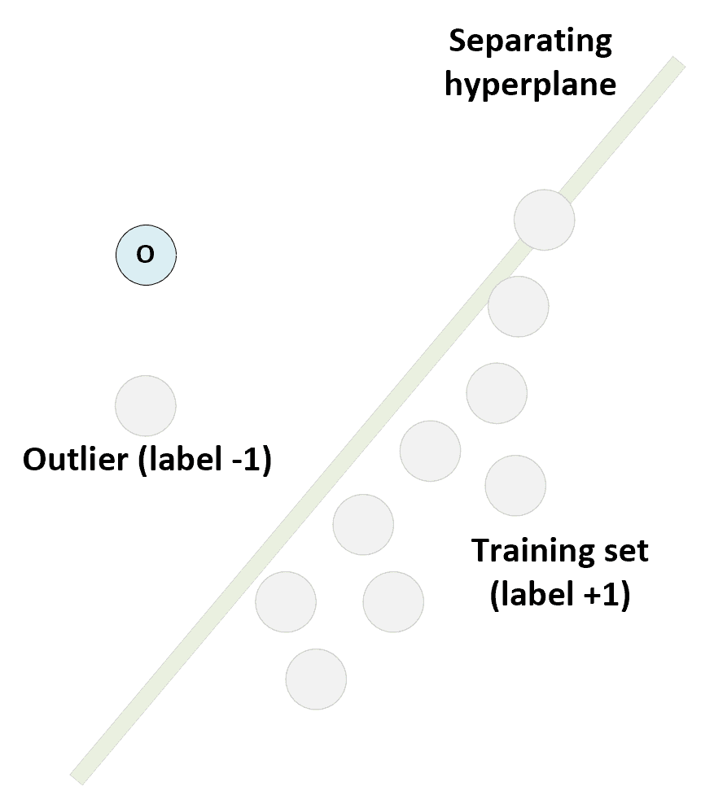

线性单类 SVM 方案：训练集与原点分开，具有最大的边距

训练模型以找出使距原点的距离最大的超平面参数。 超平面一侧的所有样本均应为离群值，输出标签为 **+1** ，而其余所有样本均被视为离群值，并且输出标签为 *`-1`* 。 此标准似乎有效，但仅适用于线性可分离的数据集。 标准 SVM 通过将数据集（通过函数`$1`）投影到特征空间 D 上来解决此问题，在该特征空间 D 中，它获得了这样的属性：

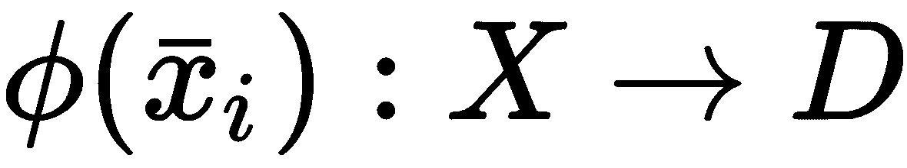

特别是，考虑到问题的数学性质，如果选择了内核，则投影在计算上变得轻巧。 换句话说，我们要使用一个具有以下属性的函数：


投影函数`$1`的存在保证存在于非常容易获得的条件（称为美世条件）下（即，在实子空间中，内核必须为正半 -定）。 这种选择的原因与解决问题的过程密切相关（更详细的解释可以在*机器学习算法第二版*， *Bonaccorso G* ， *Packt Publishing* ，2018 年）。 但是，不熟悉 SVM 的读者不必担心，因为我们不会讨论太多的数学细节。 要记住的最重要的一点是，不支持任何内核的通用投影会导致计算复杂性急剧增加（尤其是对于大型数据集）。

*K（•，•）*的最常见选择之一是径向基函数（已经在第 3 章，“高级聚类”中进行了分析）：

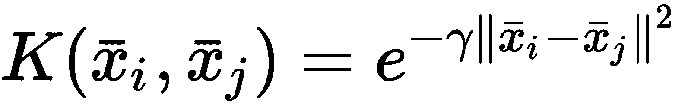

另一个有用的内核是多项式：

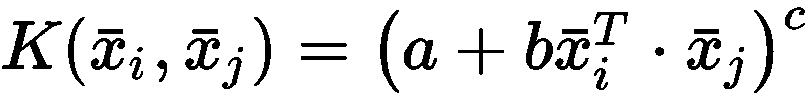

在这种情况下，指数`c`定义多项式函数的次数，该次数与特征空间的维数成正比。 但是，内核及其超参数的选择均取决于上下文，并且没有总有效的通用规则。 因此，对于每个问题，都需要进行初步分析，通常还需要进行网格搜索以做出最适当的选择。 一旦选择了内核，就可以用以下方式表示问题：

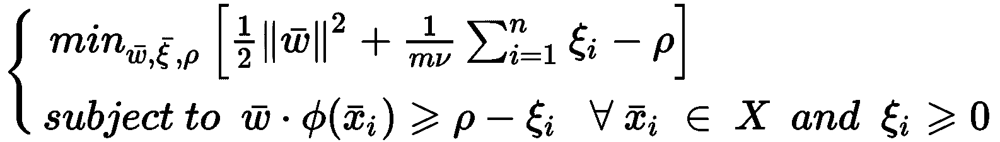

如果不进行全面讨论（超出本书的讨论范围），我们可以将注意力集中在一些重要元素上。 首先，决策功能如下：


解决方案中涉及的数学过程使我们可以简化以下表达式，但出于我们的目的，最好保留原始表达式。 如果读者具有监督学习的基础知识，他们可以轻松地理解权重向量与样本投影之间的点积`x[i]`可以确定*的位置 [x] [i]* 。 实际上，如果两个向量之间的角度小于 90°（π/ 2），则点积是非负的。 当角度正好为 90°（即向量正交）时，它等于零；而当角度在 90°至 180°之间时，它等于负。 下图显示了此过程：

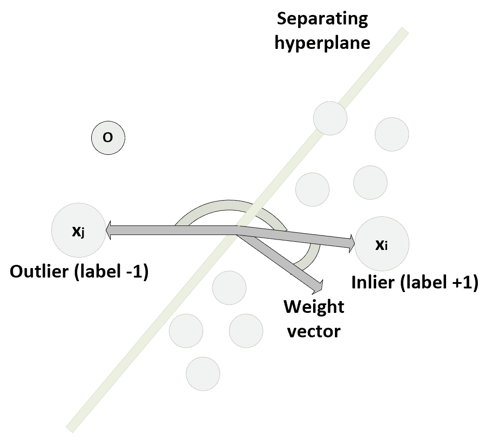

支持向量机中的决策过程

权向量正交于分离超平面。 样本`x`[`i`] 被确定为一个惯常值，因为点积为正且大于阈值*ρ*。 相反， *`x[j]`* 被标记为异常值，因为决策函数的符号为负。 术语*ξ [i] （ξ [i] ≥0）*被称为松弛变量，它们的引入是为了使异常值和 内线 实际上，如果这些变量都等于零（并且为简单起见， *ρ= 1* ），则优化问题的条件变为：


这意味着必须将所有训练样本视为内部值，因此必须选择分隔的超平面，以便所有`x[i]`都在同一侧。 但是，松弛变量的使用通过定义软边界可以提供更大的灵活性。 每个训练样本都与变量`x[i]`相关联，当然，问题在于将其最小化。 但是，通过这种技巧，即使继续将其识别为离群值，也可以将一些边界样本放置在超平面的另一侧（足够靠近它）。 要考虑的最后一个元素是此上下文中最重要的元素，并且涉及超参数*ν∈`(0, 1)`*。 在上述论文中，作者证明，每当 *ρ≠0 时，ν*都可以解释为训练样本分数的上限，实际上是离群值。 在本章开始时，我们已经指出，在新颖性检测问题中，数据集必须是干净的。 不幸的是，并非总是如此。 因此，`v`和松弛变量的联合使用使我们也能够处理包含一小部分离群值的数据集。 就概率而言，如果`X`是从部分被噪声破坏的数据生成过程中提取的，则*ν*是在`X`中发现异常值的概率 ]。

现在，基于一个用元组（年龄，身高）识别的学生数据集分析一个二维示例。 我们将从二元高斯分布中得出 2,000 个内点，并均匀采样 200 个测试点：

```py
import numpy as np

nb_samples = 2000
nb_test_samples = 200

X = np.empty(shape=(nb_samples + nb_test_samples, 2))

X[:nb_samples] = np.random.multivariate_normal([15, 160], np.diag([1.5, 10]), size=nb_samples)
X[nb_samples:, 0] = np.random.uniform(11, 19, size=nb_test_samples)
X[nb_samples:, 1] = np.random.uniform(120, 210, size=nb_test_samples)
```

由于比例尺不同，因此在训练模型之前最好对数据集进行标准化：

```py
from sklearn.preprocessing import StandardScaler

ss = StandardScaler()
Xs = ss.fit_transform(X)
```

以下屏幕快照显示了标准化数据集的图：


单类 SVM 示例的数据集

主斑点主要由内部像素组成，一部分测试样本位于同一高密度区域。 因此，我们可以合理地假设在包含所有样本的数据集中有大约 20% 的异常值（因此*ν= 0.2* ）。 当然，这种选择是基于我们的假设，在任何实际场景中， *ν*的值必须始终反映数据集中预期异常值的实际百分比 。 当此信息不可用时，最好从较大的值开始（例如 *ν= 0.5* ），然后再减小它直到找到最佳配置为止（即 ，则错误分类的可能性最小）。

同样重要的是要记住，训练过程有时会找到次优的解决方案。 因此，可以将一些孤立点标记为孤立点。 在这些情况下，最佳策略是测试不同内核的效果，例如，在处理多项式内核时，增加它们的复杂度，直到找到最佳解决方案（不一定排除所有错误）为止。

现在让我们使用 RBF 内核（特别适合于高斯数据生成过程）初始化 scikit-learn `OneClassSVM`类的实例，并训练模型：

```py
from sklearn.svm import OneClassSVM

ocsvm = OneClassSVM(kernel='rbf', gamma='scale', nu=0.2)
Ys = ocsvm.fit_predict(Xs)
```

我们根据以下公式选择了建议值`gamma='scale'`：

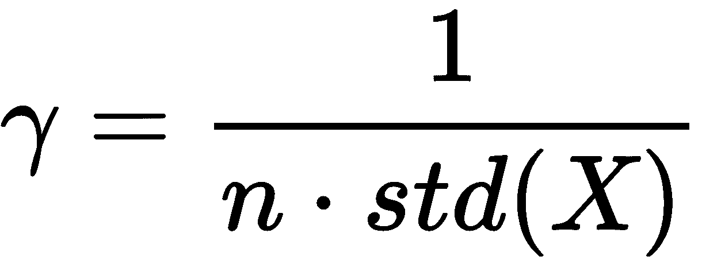

通常，这样的选择是最好的起点，可以更改（根据结果是否可接受而增加或减少）。 在我们的情况下，由于数据集是二维（ *n = 2* ）和归一化的*（std（X）= 1）*，因此*γ= 0.5* 单位方差高斯分布（因此，我们应该期望它是最合适的选择）。 在这一点上，我们可以通过突出显示异常值来绘制结果：

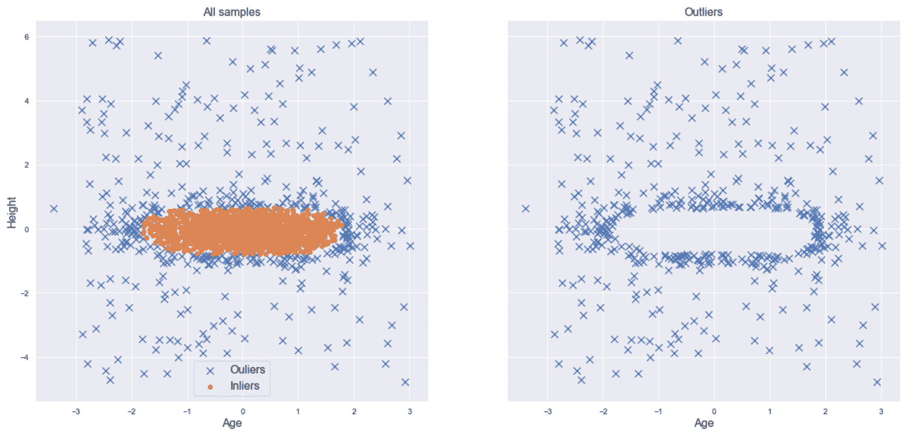

分类结果（左）。 测试集中的异常值（右）

从左图可以看出，该模型已成功识别出数据集的较高密度部分，并且还在密集 Blob 的外部区域中将一些样本标记为离群值。 它们对应于二元高斯条件下具有较低概率的值，在我们的情况下，我们假设它们是应过滤掉的噪声样本。 在右图中，可能只看到离群区域，这当然是高密度斑点的补充。 我们可以得出结论，即使是一类 SVM，即使有点倾向于过拟合，它也可以帮助我们以极小的错误概率识别新颖性。 这也是由于数据集的结构（但是，在许多情况下很常见），可以使用 RBF 内核轻松地对其进行管理。 不幸的是，对于高维数据，通常会丢失这种简单性，并且必须进行更彻底的超参数搜索才能使错误率最小化。


# 隔离林的异常检测


Liu FT，Ting KM 和 Zhou Z 在文章*隔离林，ICDM 2008* 和*第八届 IEEE 国际数据会议中提出了一种非常强大的异常检测方法。 Mining* 2008），它基于整体学习的总体框架。 由于该主题范围很广，并且主要涵盖在有监督的机器学习书籍中，因此，如果有必要，我们邀请读者检查建议的资源之一。 相反，在这种情况下，我们将在不非常强力引用所有基础理论的情况下描述模型。

首先，我们说森林是一组称为**决策树**的独立模型。 顾名思义，它们比算法更实用，是对数据集进行分区的一种实用方法。 从根开始，为每个节点选择一个特征和一个阈值，并将样本分为两个子集（非二叉树不是这样，但是通常，所有涉及的树都是这些模型都是二叉树），如下 如下图所示：

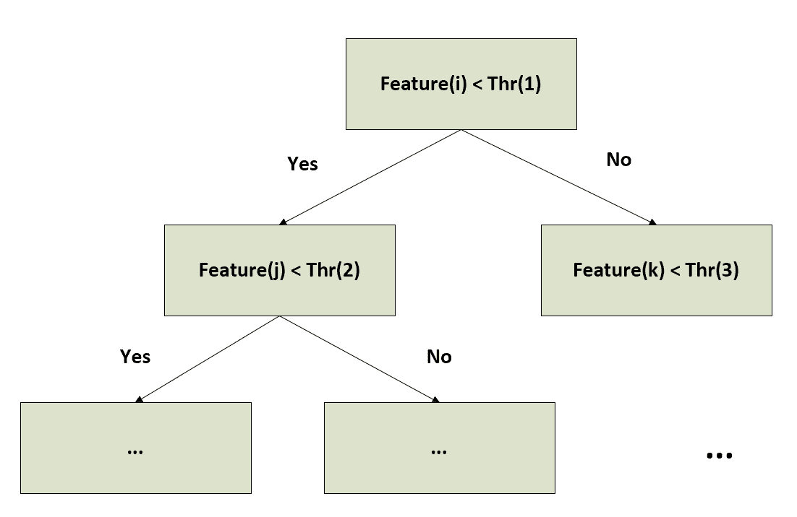

二叉决策树的通用结构

在有监督的任务中，选择元组（功能，阈值）是根据使孩子的杂质最小化的特定标准选择的。 这意味着目标通常是拆分节点，以使结果子集包含属于单个类的大多数样本。 当然，很容易理解，当所有叶子都是纯净的或达到最大深度时，该过程结束。 相反，在此特定上下文中，我们从一个非常特殊（但经过经验证明）的假设开始：如果属于**隔离林**的树木每次都选择随机特征和随机阈值进行生长，则平均长度 从根到包含任何异常值的叶子的路径比隔离异常值所需的路径更长。 通过考虑一个二维示例，可以很容易地理解这一假设的原因，如作者所示：


二维随机分区。 在左侧，孤立了一个内部。 在右侧，检测到属于低密度区域的异常值

可以观察到，正常值通常属于高密度区域，需要更多的分区来隔离样本。 相反，由于所需的粒度与斑点的密度成比例，因此可以使用较少的划分步骤来检测低密度区域中的异常值。 因此，建立了一个隔离林，其目的是测量所有内部节点的平均路径长度，并将其与新样本所需的平均路径长度进行比较。 当这样的长度较短时，成为异常值的可能性增加。 作者提出的异常分数基于指数函数：

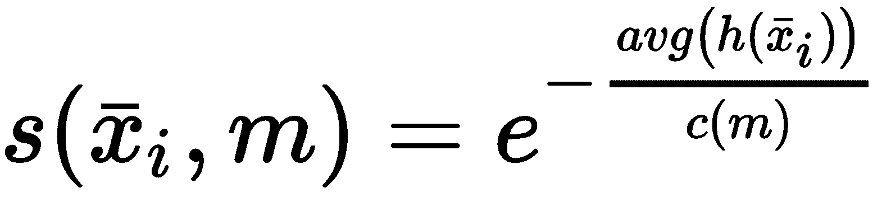

在上一个公式中，`m`是属于训练集`X`和 *avg（h（x [i] ））*的样本数 是`x[i]`并考虑所有树木的平均路径长度， *c（m）*是仅取决于 *m [* 。 当 *s（x [i] ，m）→1* 时，样本`x[i]`被识别为异常。 因此，由于 *s （•* *）*的界限介于 0 和 1 之间，如果我们将阈值设为 0.5，则正常样本与 *s（x [i]* *，m）< < 0.5* 。

现在让我们考虑一下葡萄酒数据集，其中包含 178 个样本 *x [i] ∈ℜ^(13)* ，其中每个功能都是特定的化学性质（例如，酒精，苹果酸 酸，灰分等），并训练一个隔离林来检测一种新葡萄酒是否可以被认为是一种异常值（例如，现有品牌的变体）还是异常值，因为它的化学特性与每种 现有样本。 第一步包括加载和规范化数据集：

```py
import numpy as np

from sklearn.datasets import load_wine
from sklearn.preprocessing import StandardScaler

wine = load_wine()
X = wine['data'].astype(np.float64)

ss = StandardScaler()
X = ss.fit_transform(X)
```

现在，我们可以实例化`IsolationForest`类并设置最重要的超参数。 第一个是`n_estimators=150`，它通知模型训练 150 棵树。 另一个基本参数（类似于一类 SVM 中的`v`）称为`contamination`，其值表示训练集中异常值的预期百分比。 当我们信任数据集时，我们选择了等于 0.01（1%）的值来解决数量可忽略不计的奇怪样本的存在。 出于兼容性原因，已插入`behaviour='new'`参数（请查看官方文档以获取更多信息），并且`random_state=1000`保证实验的可重复性。 一旦类被初始化，就可以训练模型：

```py
from sklearn.ensemble import IsolationForest

isf = IsolationForest(n_estimators=150, behaviour='new', contamination=0.01, random_state=1000)
Y_pred = isf.fit_predict(X)

print('Outliers in the training set: {}'.format(np.sum(Y_pred == -1)))
```

上一片段的输出为：

```py
2
```

因此，隔离林已成功识别出 178 个内岛中的 176 个。 我们可以接受此结果，但是与往常一样，我建议调整参数以获得与每种特定情况都兼容的模型。 此时，我们可以生成一些嘈杂的样本：

```py
import numpy as np

X_test_1 = np.mean(X) + np.random.normal(0.0, 1.0, size=(50, 13))
X_test_2 = np.mean(X) + np.random.normal(0.0, 2.0, size=(50, 13))
X_test = np.concatenate([X_test_1, X_test_2], axis=0)
```

测试集分为两个块。 第一个数组`X_test_1`包含噪声水平相对较低的样本（*σ= 1* ），而第二个数组`X_test_2`包含更多噪声样本（ *σ= 2* ）。 因此，我们期望第一组的异常值较低，而第二组的数量较大。 数组`X_test`是两个测试集的有序连接。 现在让我们预测状态。 由于这些值是双极性的，我们想将它们与训练结果区分开，因此我们将乘以预测时间`2`（即，`-1`表示训练集中的离群值，`1`训练集中的离群值， 测试集中的`-2`异常值，测试集中的`2`异常值）：

```py
Y_test = isf.predict(X_test) * 2

Xf = np.concatenate([X, X_test], axis=0)
Yf = np.concatenate([Y_pred, Y_test], axis=0)

print(Yf[::-1])
```

输出如下：

```py
[ 2 2 -2 -2 -2 -2 -2 2 2 2 -2 -2 -2 -2 -2 -2 -2 -2 -2 -2 -2 -2 -2 2 -2 2 2 -2 -2 -2 2 -2 -2 -2 -2 2 2 -2 -2 -2 -2 -2 -2 2 2 -2 2 -2 2 -2 2 2 2 2 2 2 2 2 2 2 2 2 2 2 2 2 2 2 2 2 2 2 2 2 2 2 2 2 2 2 2 2 2 2 2 2 2 2 2 2 2 2 -2 2 2 2 2 2 2 2 1 1 1 1 1 1 1 1 1 1 1 1 1 1 1 1 1 1 1 1 1 1 1 1 1 1 1 1 1 1 1 1 1 1 1 1 1 1 1 1 1 1 1 1 1 1 1 1 1 1 1 1 1 1 1 1 -1 1 1 1 1 1 1 1 1 1 1 -1 1 1 1 1 1 1 1 1 1 1 1 1 1 1 1 1 1 1 1 1 1 1 1 1 1 1 1 1 1 1 1 1 1 1 1 1 1 1 1 1 1 1 1 1 1 1 1 1 1 1 1 1 1 1 1 1 1 1 1 1 1 1 1 1 1 1 1 1 1 1 1 1 1 1 1 1 1 1 1 1 1 1 1 1 1 1 1 1 1 1 1 1 1 1 1 1 1 1 1 1 1 1 1 1 1 1 1 1 1 1]
```

由于顺序被保留和反转，我们可以看到属于`X_test_2`（高方差）的大多数样本被归类为异常，而大多数低方差样本被识别为常值。 为了得到进一步的视觉确认，我们可以执行 t-SNE 降维，考虑到最终结果是二维分布，其 Kullback-Leibler 与原始（13 维）的散度最小。 这意味着所得维数的可解释性非常低，并且只能使用该图来理解二维空间的哪些区域更可能被 inlier 占据：

```py
from sklearn.manifold import TSNE

tsne = TSNE(n_components=2, perplexity=5, n_iter=5000, random_state=1000)
X_tsne = tsne.fit_transform(Xf)
```

下图显示了结果图：


用于葡萄酒数据集的新颖性检测的 t-SNE 图

可以看到，许多接近训练离群点的样本本身就是离群点，并且通常，几乎所有远测样本都是离群点。 但是，由于维数的减少，很难得出更多的结论。 但是，我们知道，当噪声足够小时，找到内点的可能性就很大（这是合理的结果）。 作为练习，我请读者检查一下[单个化学性质](https://scikit-learn.org/stable/datasets/index.html#wine-dataset)，以及每个 他们或小组，找出哪个阈值可以将一个离群值转换为离群值（例如，回答此问题：与训练集兼容的最大酒精含量是多少？）。


# 总结


在本章中，我们讨论了概率密度函数的性质以及如何将其用于计算实际概率和相对可能性。 我们已经看到了如何创建直方图，这是将值分组到预定义的 bin 中后代表值频率的最简单方法。 由于直方图有一些重要的局限性（它们非常不连续并且很难找到最佳的 bin 大小），我们引入了核密度估计的概念，这是使用平滑函数估计密度的一种稍微复杂的方法。

我们分析了最常见内核（高斯， Epanechnikov，指数和均匀）的属性，以及两种可用于找出每个数据集最佳带宽的经验方法。 使用这种技术，我们试图基于合成数据集解决一个非常简单的单变量问题。 我们分析了 KDD Cup 99 数据集的 HTTP 子集，其中包含几个正常和恶意网络连接的日志记录。 并且我们已经使用 KDE 技术基于两个阈值创建了一个简单的异常检测系统，并且我们还解释了在处理这类问题时必须考虑哪些因素。

在最后一部分中，我们分析了可用于执行新颖性检测的两种常用方法。 一类 SVM 利用内核的功能将复杂的数据集投影到可以线性分离的特征空间上。 下一步基于这样的假设：所有训练集（一小部分除外）都是内在者，因此它们属于同一类。 训练该模型的目的是最大程度地缩小内部节点与特征空间原点之间的距离，并且结果基于样本相对于分离超平面的位置。 相反，孤立森林是一种集成模型，基于以下假设：离群值从随机训练的决策树中的根到样本的路径平均较短。

因此，在训练森林之后，可以考虑给定新样本的平均路径长度来计算异常分数。 当该分数接近 1 时，我们可以得出结论，异常的可能性也很大。 相反，非常小的得分值表明该新颖性是潜在的内在价值。

在下一章中，我们将讨论降维和字典学习的最常用技术，当有必要管理具有大量功能的数据集时，这些技术将非常有用。


# 问题


1.  一个人身高 1.70 m 的概率为 *p（Tall）= 0.75* ，而明天要下雨的概率为 *P（Rain）= 0.2* 。 *P（高，雨）*的概率是多少？ （即一个人身高 1.70 m，明天要下雨的概率）。
2.  给定数据集`X`，我们构建了一个具有 1,000 个 bin 的直方图，我们发现其中许多是空的。 为什么会这样？
3.  直方图包含三个分别具有 20、30 和 25 个样本的 bin。 第一个容器的范围为 *0 < x < 2* ，第二 *2 < x < 4* ，第三 *4 < x < 6* 。 *P（x）> 2* 的大概概率是多少？
4.  给定正态分布 *N`(0, 1)`*，可以将 *p（x）= 0.35* 的样本`x`视为异常吗？
5.  具有 500 个样本的数据集`X`具有 *std（X）= 2.5* 和 *IQR（X）= 3.0* 。 最佳带宽是多少？
6.  一位专家告诉我们，分布在两个值附近都达到了峰值，并且密度突然从峰均值下降了 0.2 个标准差。 哪种内核最合适？
7.  给定样本`x`（从 10,000 个样本的流人口中收集），我们不确定这是异常还是新颖，因为 *p（x）= 0.0005* 。 再进行 10,000 次观察后，我们重新训练模型，`x`保持 *p（x）< 0.001* 。 我们可以得出结论`x`是异常吗？


# 进一步阅读


*   *Epanechnikov V A，多元概率密度的非参数估计，概率论及其应用，第 14 页，* 1969 年

*   *Parzen E，关于概率密度函数和模式的估计，《数学统计年鉴》，* 1962 年

*   *Sheather S J，在某些实际数据集上的六种流行带宽选择方法的性能（有讨论），计算统计，第 7 页，* 1992 年

*   *SchölkopfB，Platt JC，Shawe-Taylor JC，Smola AJ，Williamson RC ，估计对高维分布的支持，神经计算，13/7，[* 2001

*   *Liu F T，Ting K M，周 Z，隔离林，ICDM 2008* ，*第八届 IEEE 数据挖掘国际会议，2008*

*   *Dayan P，Abbott L F，《理论神经科学》，麻省理工学院出版社，* 2005

*   *机器学习算法第二版*， *Bonaccorso G.* ， *Packt Publishing* ，2018 年


