# 降维和成分分析


在本章中，我们将介绍和讨论一些非常重要的技术，这些技术可用于执行降维和成分提取。 在前一种情况下，目标是将高维数据集转换为低维数据集，以尽量减少信息丢失量。 后者是找到可以混合的原子字典以构建样本所需的过程。

特别是，我们将讨论以下主题：

*   **主成分分析**（**PCA**）
*   **奇异值分解**（**SVD**）和增白
*   内核 PCA
*   稀疏的 PCA 和字典学习
*   因子分析
*   **独立成分分析**（**ICA**）
*   **非负矩阵分解**（**NNMF**）
*   **潜在狄利克雷分布**（**LDA**）


# 技术要求


本章将介绍的代码需要以下内容：

*   Python3.5+（强烈建议使用 [Anaconda 发行版](https://www.anaconda.com/distribution/)）
*   以下库：
    *   SciPy 0.19+
    *   NumPy 1.10+
    *   Scikit-Learn 0.20+
    *   Pandas 0.22+
    *   Matplotlib 2.0+
    *   Seaborn 0.9+

[可以在 GitHub 存储库中找到这些示例](https://github.com/PacktPublishing/HandsOn-Unsupervised-Learning-with-Python/tree/master/Chapter07)。


# 主成分分析（PCA）


减少数据集维数的最常见方法之一是基于样本协方差矩阵的分析。 通常，我们知道随机变量的信息内容与其方差成正比。 例如，给定多元高斯，熵是我们用来测量信息的数学表达式，如下所示：

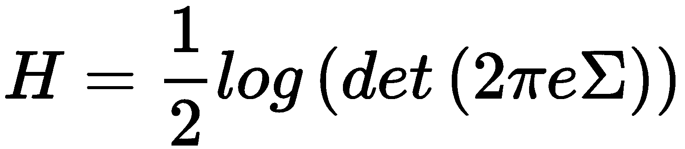

在前面的公式中，`Σ`是协方差矩阵。 如果我们假设（不失一般性）`Σ`是对角线，那么很容易理解，熵（成比例地）大于每个单个分量的方差`σ[i]^2`。 这不足为奇，因为方差低的随机变量集中在均值附近，出现意外的可能性低。 另一方面，当`σ^2`变得越来越大时，潜在结果随着不确定性而增加，不确定性与信息量成正比。

当然，组件的影响通常是不同的； 因此，**主成分分析**（**PCA**）的目标是，可以找到可以将其投影到较低维子空间的样本的线性变换，来保持最大的初始方差量。 实际上，让我们考虑一个数据集`X ∈ G^(m×n)`：


我们要查找的线性变换是一个新的数据集，如下所示：

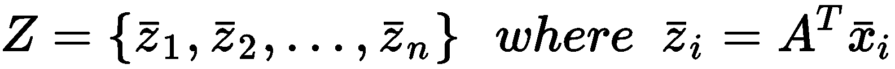

应用了这样的转换后，我们期望具有以下内容：

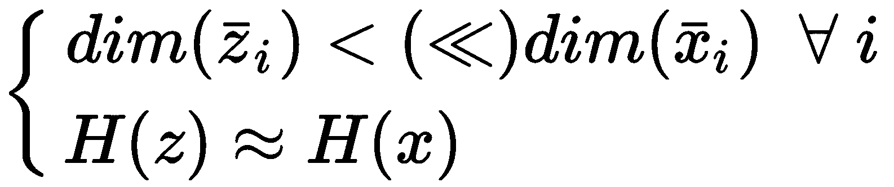

让我们开始考虑样本协方差矩阵（出于我们的目的，我们也可以采用有偏估计）； 为简单起见，我们还将假设`X`的均值为零：


这样的矩阵是对称的且是正半定的（如果您不熟悉这些概念并不重要，但是它们对于证明以下步骤非常重要），因此其特征向量构成了正交标准。 快速回顾一下，如果`A`是方阵，则将`v[i]`的向量称为与特征值`v[i]`，如果满足以下条件：


换句话说，特征向量被转换为自身的扩展或压缩版本（不会发生旋转）。 证明协方差矩阵的特征向量定义协方差分量的方向（即数据集具有特定协方差分量的方向）并不难（但将省略所有数学细节）。 原因很简单； 实际上，在变换之后，新的协方差矩阵（变换后的数据集`Z`）是不相关的（即，它是对角线的），因为新轴与协方差分量对齐。 这意味着将向量（例如，``v[0] = (1, 0, 0, ..., 0)``）转换为`σ[i]^2 v[i]`，因此它是一个特征向量，其相关特征值与第`i`个分量的方差成比例 。

因此，为了找出可以丢弃的元素，我们可以对特征值进行排序，以便满足以下条件：

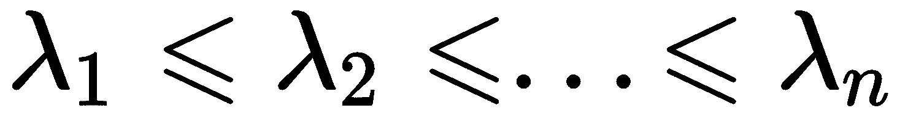

相应的特征向量`v[1], v[2], ..., v[n]`分别确定对应最大方差的成分，依此类推，直到最后一个。 形式上，我们将特征向量定义为**主成分**； 因此，第一个主成分是与最大方差相关的方向，第二个主成分与第一个主方正交，并且与第二个最大方差相关，依此类推。 对于二维数据集，此概念显示在以下屏幕截图中：


二维数据集的主成分； 第一个主成分沿着方差最大的轴，而第二个主成分正交，并且与剩余方差成比例

至此，问题几乎解决了。 实际上，如果仅选择第一个`k`主成分（`v[i] ∈ R^(n×1)`），则可以构建一个变换矩阵`A[k] ∈ R^(n×k)`，从而使特征向量与前`k`个特征值列：

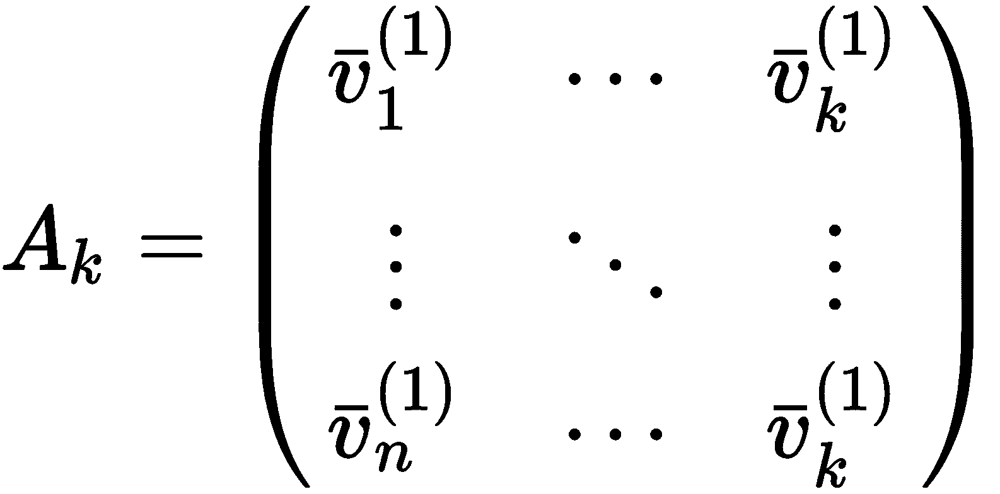

因此，我们可以使用以下矩阵乘法来转换整个数据集：

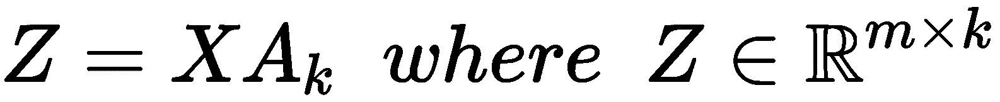

新数据集`Z`的维数等于`k < n`（或`<<`），并且它包含与分量数量成比例的原始变化量。 例如，考虑上一个屏幕快照中显示的示例，如果我们选择单个分量，则所有向量都将沿着第一个主分量变换为点。 当然，会有一些信息丢失，必须逐案考虑； 在以下各节中，我们将讨论如何评估此类损失并做出合理的决定。 现在，我们将简要展示如何以有效方式提取主要成分。


# 具有奇异值分解的 PCA


即使我们将采用完整的 PCA 实现，了解如何有效地执行此过程也将有所帮助。 当然，最明显的处理方法是基于样本协方差矩阵的计算，其特征分解（将输出特征值和对应的特征向量），然后最后可以构建变换矩阵。 这种方法很简单，但不幸的是，它效率也不高。 主要原因是我们需要计算样本协方差矩阵，这对于大型数据集而言可能是一项非常长的任务。

**奇异值分解**（**SVD**）提供了一种更为有效的方法，它是一种线性代数程序，具有一些重要特征：它可以直接在数据集上操作，当提取了所需数量的组件时可以停止，并且有增量版本可以小批量工作，从而解决了内存不足的问题。 特别地，考虑到数据集`X ∈ R^(m×n)`，SVD 可以表示为：


`U`是一个正交矩阵（即`UU^T = U^T U = I`，因此`U^T = U^(-1)`），其中左手奇异向量作为行（`XX^T`的特征向量）；`V`（也为正交）包含右手奇异向量作为行（对应于`X^T X`的特征向量），而`Λ`是一个对角矩阵，包含`$1[$2]`的奇异值（这是`XX^T`和`X^T X`的特征值的平方根）。 特征值按降序排序，特征向量重新排列以匹配相应位置。 由于`1 / m`因子是一个乘法常数，因此它不会影响特征值的相对大小； 因此，排序顺序保持不变。 因此，我们可以直接使用`V`或`U`进行工作，并从`Λ`中选择第一个顶部`k`特征值。 特别是，我们可以观察到以下结果（因为变换矩阵`A`等于`V`）：


因此，通过使用`U[k]`（仅包含顶部`k`特征向量）和`U[k]`]（仅包含顶部的`k`特征值），我们可以直接获得较低维的转换数据集（具有`k`分量），如下所示：


此方法快速，有效，并且在数据集太大而无法放入内存时可以轻松扩展。 即使我们在本书中不使用此类场景，也值得一提的是 scikit-learn `TruncatedSVD` 类（其 SVD 限于`k`最高特征值）和`IncrementalPCA` 类（小批量执行 PCA）。 为了我们的目的，我们将使用标准的`PCA`类和一些重要的变体，它们要求整个数据集都适合内存。


# 美白


SVD 的一个重要应用是**白化**程序，该程序强制以空平均值（即`E[X] = 0`）对数据集`X`或零中心），以具有恒等式的协方差矩阵`C`。 该方法对提高许多监督算法的性能非常有帮助，这可以受益于所有组件共享的统一单一方差。

将分解应用于`C`，我们获得以下信息：

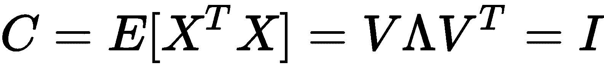

矩阵`V`的列是`C`的特征向量，而`Λ`是包含特征值的对角矩阵（请记住，SVD 输出奇异值，它们是特征向量的平方根）。 因此，我们需要找到一个线性变换，`z = Ax`，以便`E[Z^T Z] = I`。 使用先前的分解时，这很简单：

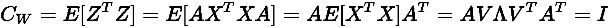

从前面的方程式中，我们可以得出变换矩阵`A`的表达式：


现在，我们将通过一个小的测试数据集展示美白效果，如下所示：

```py
import numpy as np

from sklearn.datasets import make_blobs

X, _ = make_blobs(n_samples=300, centers=1, cluster_std=2.5, random_state=1000)

print(np.cov(X.T))
```

前一个块的输出显示了数据集的协方差矩阵，如下所示：

```py
[[6.37258226 0.40799363]
 [0.40799363 6.32083501]]
```

以下代码段显示了`whiten()` 函数，该函数用于对通用数据集进行美白（零居中是过程的一部分）（`correct`参数在漂白之后强制执行缩放校正）：

```py
import numpy as np

def zero_center(X):
    return X - np.mean(X, axis=0)

def whiten(X, correct=True):
    Xc = zero_center(X)
    _, L, V = np.linalg.svd(Xc)
    W = np.dot(V.T, np.diag(1.0 / L))
    return np.dot(Xc, W) * np.sqrt(X.shape[0]) if correct else 1.0
```

以下屏幕截图显示了应用于`X` 阵列的增白结果：

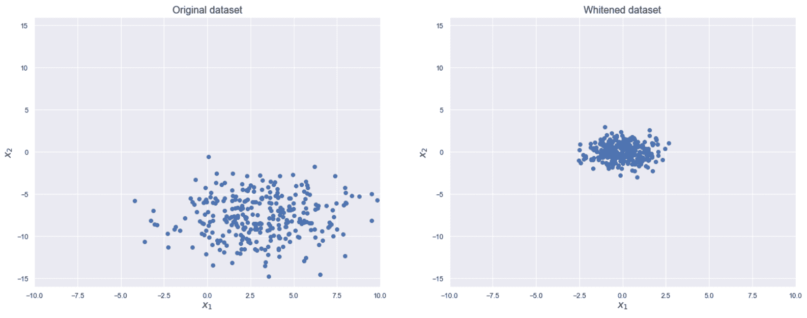

原始数据集（左）； 白化的数据集（右）

现在，我们可以检查新的协方差矩阵，如下所示：

```py
import numpy as np

Xw = whiten(X)
print(np.cov(Xw.T))
```

输出如下：

```py
[[1.00334448e+00 1.78229783e-17]
 [1.78229783e-17 1.00334448e+00]]
```

可以看到，矩阵现在是一个恒等式（具有最小的误差），并且数据集也具有空均值。


# 具有 MNIST 数据集的 PCA


现在，让我们应用 PCA，以减少 MNIST 数据集的维数。 我们将使用 scikit-learn 提供的压缩版本（1,797，8×8 图像），但是我们的考虑都不会受到此选择的影响。 让我们从加载和规范化数据集开始：

```py
from sklearn.datasets import load_digits

digits = load_digits()
X = digits['data'] / np.max(digits['data'])
```

从理论讨论中，我们知道协方差矩阵的特征值的大小与相应主成分的相对重要性（即，所解释的方差，因此是信息含量）成正比。 因此，如果将它们按降序排序，则可以计算以下差异：

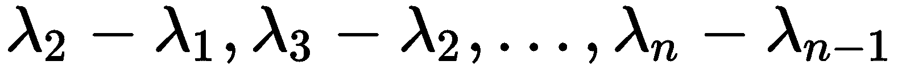

当`k → n`的数量变得越来越重要时，我们可以通过选择第一个最大的差值来选择最佳的`k`，这表明所解释的数量大大减少了。 以下所有组件的差异。 为了更好地理解这种机制，让我们计算特征值和它们的差异（由于协方差矩阵`C`是正半确定的，因此我们确定`λ[i] ≥ 0, ∀i ∈ (1, n)`）：

```py
import numpy as np

C = np.cov(X.T)
l, v = np.linalg.eig(C)
l = np.sort(l)[::-1]
d = l[:l.shape[0]-1] - l[1:]
```

以下屏幕快照显示了展开图像（64 维数组）的差异：


每个主成分的特征值差异

可以看出，第一主成分的差异非常大，与第四主成分（`λ[4] - λ[3]`）； 但是，下一个差异仍然很高，虽然对应`$1[$2]`突然下降。 在这一点上，趋势几乎是稳定的（除了一些残余振荡），直到`$1[$2]`为止，然后趋势开始迅速下降，趋于趋于零 。 由于我们仍然希望获得正方形图像，因此我们将选择`k = 16`（相当于将每一边除以四）。 在另一个任务中，您可以选择`k = 15`，甚至`k = 8`； 但是，为了更好地理解降维导致的误差，也将有助于分析所解释的方差。 因此，让我们从执行 PCA 开始：

```py
from sklearn.decomposition import PCA

pca = PCA(n_components=16, random_state=1000)
digits_pca = pca.fit_transform(X)
```

在拟合模型并将所有样本投影到对应于前 16 个主成分的子空间后，即可获得`digits_pca` 数组。 如果我们想将原始图像与其重构进行比较，则需要调用`inverse_transform()` 方法，该方法将投影投射到原始空间上。 因此，如果 PCA 在这种情况下是变换`f(x): ℜ^64 → ℜ^16`，则逆变换为`g(x): ℜ^16 → ℜ^64`。 以下屏幕截图显示了前 10 位数字与它们的重构之间的比较：


原始样本（第一行）； 重建（底部行）

重建显然是有损的，但是数字仍然是可区分的。 现在，让我们通过对`explained_variance_ratio_` 数组的所有值求和来检查总的解释方差，其中包含每个分量的相对解释方差的相对数量（因此，任何`k < n`分量始终小于 1）：

```py
print(np.sum(pca.explained_variance_ratio_))
```

上一个代码段的输出如下：

```py
0.8493974642542452
```

因此，在将维数减少到 16 个分量的情况下，考虑到每个样本都将丢弃 48 个分量，我们正在解释原始差异的 85%，这是一个合理的值。

以下屏幕快照显示了显示所有单个贡献的图：


对应每个主成分的解释方差比

正如预期的那样，贡献趋于减少，因为在这种情况下，第一个主要成分负责任； 例如，对于一种颜色的线条（例如黑色或白色），而其余的则为灰色。 这种行为非常普遍，几乎在每种情况下都可以观察到。 通过该图，还可以轻松找到额外的损失，以进一步减少损失。 例如，我们可以立即发现，对 3 个成分的严格限制可以解释原始差异的 40% ； 因此，剩余的 45% 被分为剩余的 13 个组成部分。 我邀请您重复此示例，尝试找出人类区分所有数字所需的最少数量的组件。


# 内核 PCA


有时，数据集不是线性可分离的，并且标准 PCA 无法提取正确的主成分。 当我们面对非凸簇的问题时，该过程与第 3 章，“高级聚类”中讨论的过程没有什么不同。 在那种情况下，由于几何原因，某些算法无法执行成功的分离。 在这种情况下，目标是根据主成分的结构区分不同的类（在纯净，无监督的情况下，我们考虑特定的分组）。 因此，我们要使用转换后的数据集`Z`，并检测可区分阈值的存在。 例如，让我们考虑以下屏幕截图：


原始数据集（左）； PCA 投影版本（右）

由于原始数据集是线性可分离的，因此在 PCA 投影之后，我们可以立即找到允许检测第一个成分（这是真正需要的唯一成分）的阈值，以便区分两个斑点。 但是，如果数据集不是线性可分离的，我们将得到不可接受的结果，如以下屏幕截图所示：

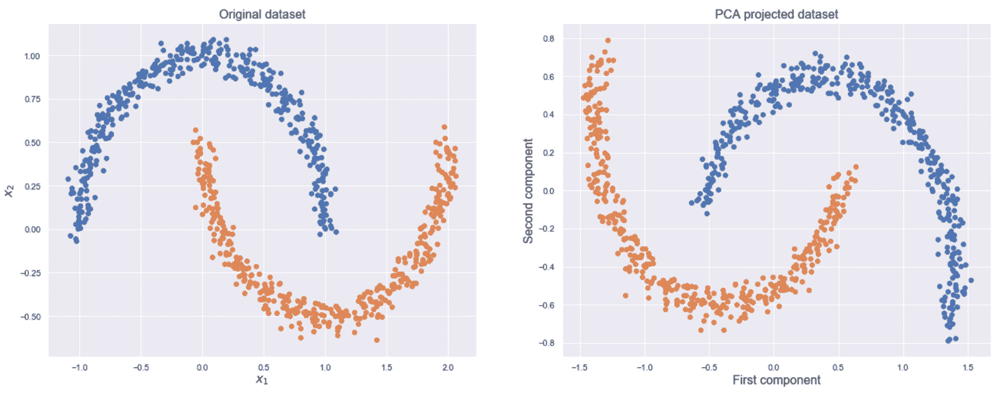

原始数据集（左）； PCA 投影版本（右）

当几何形状更复杂时，找到可区分的阈值可能是不可能的。 但是，我们知道，将数据投影到高维空间可以使它们线性分离。 特别地，如果`x ∈ ℜ^n`，我们可以选择适当的函数`f(x)`，这样`y = f(x) ∈ ℜ^p`，以及`p >> n`。 不幸的是，将这种转换应用于整个数据集可能会非常昂贵。 实际上，给定一个转换矩阵`A`（具有`n`个组件），一个主分量，`a(t)`投影后的可以编写如下（请记住它们是协方差矩阵的特征向量）：

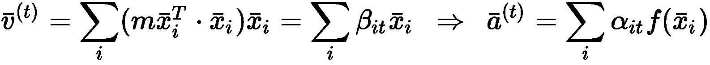

因此，单个向量的转换如下：


可以看到，转换需要计算点积`f(x[i])^T f(x[i])`。 在这些情况下，我们可以采用所谓的**核技巧**，该技巧指出存在称为核且具有有趣特性的特定功能`K(·, ·)`，如下：


换句话说，我们可以通过仅计算每两个点的内核，而不是执行一个点积来计算在高维空间中的主成分上的投影，该点积在计算后需要`n`乘法`f(·)`的值。

一些常见的内核如下：

*   **径向基函数**（**RBF**）或高斯核：

    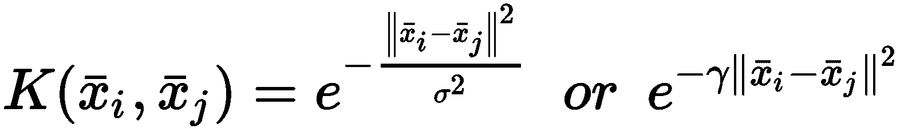
*  `p`为多项式内核：

    
*   Sigmoid 内核：

    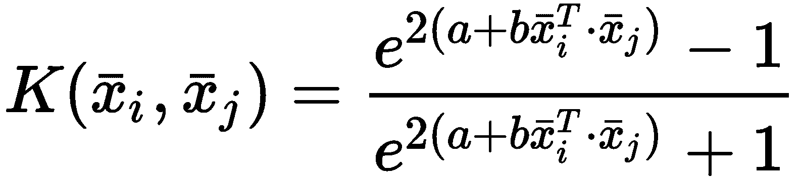

对于非常大的数据集，该过程仍然相当昂贵（但是可以预先计算并存储内核值，以避免浪费额外的时间），但是它比标准投影更有效。 此外，其具有允许在可能进行线性辨别的空间中提取主要成分的优点。 现在，让我们将 RBF 内核 PCA 应用于上一个屏幕快照中显示的半月数据集。 `gamma` 参数等于`1 /σ^2`。 在这种特殊情况下，主要问题是存在双重重叠。 考虑到原始标准偏差约为 1.0（即`σ^2 = 1`），我们至少需要三个标准偏差才能适当区分他们; 因此，我们将设置`γ = 10`：

```py
from sklearn.datasets import make_moons
from sklearn.decomposition import KernelPCA

X, Y = make_moons(n_samples=800, noise=0.05, random_state=1000)

kpca = KernelPCA(n_components=2, kernel='rbf', gamma=10.0, random_state=1000)
X_pca = kpca.fit_transform(X)
```

投影结果显示在以下屏幕截图中：


原始数据集（左）；核 PCA 投影版本（右）

可以看到，即使在这种情况下，第一个分量也足以做出决定（由于噪声，公差最小），将阈值设置为零可以分离数据集。 我邀请读者测试其他内核的效果并应用它们，以区分包含所有零和一的 MNIST 子集。


# 通过因子分析为异方差噪声添加更多鲁棒性


标准 PCA 的主要问题之一是这种模型在异方差噪声方面的固有弱点。 如果您不熟悉此术语，则引入两个定义将很有帮助。 多元去相关噪声项的特征在于对角协方差矩阵`C`，该矩阵可以具有两种不同的配置，如下所示：

*   `C = diag(σ^2, σ^2, ..., σ^2)`：在这种情况下，噪声定义为**同调**（所有分量均具有相同的方差）。
*   `C = diag(σ[1]^2, σ[2]^2, ..., σ[n]^2)`，其中`σ[1]^2 ≠ σ[2]^2 ≠ ... ≠σ[n]^2`：在这种情况下，噪声定义为**异方差**（每个分量都有其自身的方差）。

有可能证明，当噪声是同调的时，PCA 可以轻松地对其进行管理，因为单个分量的解释方差以相同的方式受噪声项的影响（也就是说，这等同于不存在噪声）。 相反，当噪声为异方差时，PCA 的性能将下降，其结果可能绝对不可接受。 因此，Rubin 和 Thayer（在《用于 ML 因子分析的 EM 算法》中）提出了另一种降维方法，称为**因子分析**，它可以解决此类问题。

假设我们有一个零中心数据集`X`，其中包含`m`个样本`x[i] ∈ ℜ^n`。 我们的目标是找到一组潜在变量，`z[i] ∈ ℜ^p`（其中`p < n`）和矩阵`A`（称为因子加载矩阵），以便可以重写每个样本，如下所示：

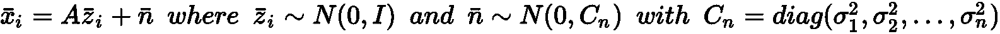

因此，我们现在假设样本`x[i]`是一组高斯潜变量加上一个额外的异方差噪声项的组合。 由于潜在变量的维数较低，因此问题与标准 PCA 非常相似，主要区别在于，我们现在考虑了异方差噪声（当然，`n`项也可以为`null`，或者同调）。 因此，当确定分量（即潜在变量）时，模型中将包括不同噪声方差的影响，最终效果是部分滤波（降噪）。 在上述论文中，作者提出了一种优化算法，该算法形式上不是很复杂，但是需要许多数学操作（因此，我们省略了任何证明）。 此方法基于**期望最大化**（**EM**）算法，该算法有助于查找使对数似然性最大化的参数集。 在本书中，我们无需讨论所有数学细节（可在原始论文中找到），而是检查该方法的属性并将结果与​​标准 PCA 进行比较。

让我们首先加载 Olivetti 人脸数据集，将其零居中，然后创建一个异方差嘈杂的版本，如下所示：

```py
import numpy as np

from sklearn.datasets import fetch_olivetti_faces

faces = fetch_olivetti_faces(shuffle=True, random_state=1000)
X = faces['data']
Xz = X - np.mean(X, axis=0)

C = np.diag(np.random.uniform(0.0, 0.1, size=Xz.shape[1]))
Xnz = Xz + np.random.multivariate_normal(np.zeros(shape=Xz.shape[1]), C, size=Xz.shape[0])
```

以下屏幕截图显示了一些原始图像和嘈杂图像：

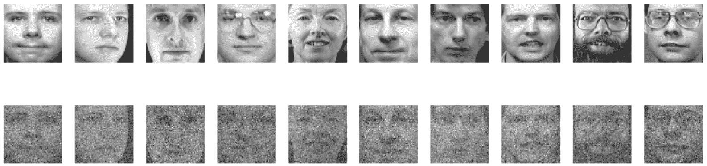

原始图像（上一行）； 嘈杂的版本（下一行）

现在，让我们评估以下各项的平均对数似然率（通过`score()` 方法，`PCA`和`FactorAnalysis`类均可用的）：

*   PCA，具有原始数据集和`128`组件
*   PCA，带有嘈杂的数据集和`128`组件
*   因子分析，带有嘈杂的数据集和`128`分量（潜在变量）

在以下代码段中，所有 3 个模型都被实例化和训练：

```py
from sklearn.decomposition import PCA, FactorAnalysis

pca = PCA(n_components=128, random_state=1000)
pca.fit(Xz)
print('PCA log-likelihood(Xz): {}'.format(pca.score(Xz)))

pcan = PCA(n_components=128, random_state=1000)
pcan.fit(Xnz)
print('PCA log-likelihood(Xnz): {}'.format(pcan.score(Xnz)))

fa = FactorAnalysis(n_components=128, random_state=1000)
fa.fit(Xnz)
print('Factor Analysis log-likelihood(Xnz): {}'.format(fa.score(Xnz)))
```

上一个代码段的输出如下：

```py
PCA log-likelihood(Xz): 4657.3828125
PCA log-likelihood(Xnz): -2426.302304948351
Factor Analysis log-likelihood(Xnz): 1459.2912218162423
```

这些结果表明存在异方差噪声时因素分析的有效性。 PCA 实现的最大平均对数似然度约为`4657`，在存在噪声的情况下降至`-2426`。 相反，因子分析获得的平均对数似然率约为 1,460，这比使用 PCA 获得的对数似然率大得多（即使尚未完全滤除噪声的影响）。 因此，每当数据集包含（或数据科学家怀疑包含）异方差噪声时（例如，样本是作为不同仪器捕获的源的叠加而获得的），我强烈建议将因子分析作为主要的降维方法。 当然，如果要求其他条件（例如，非线性，稀疏性等），则可以在做出最终决定之前评估本章中讨论的其他方法。


# 稀疏的 PCA 和字典学习


标准 PCA 通常是密集分解； 这就是说，向量一旦转换，便是所有具有非零系数的分量的线性组合：


在前面的表达式中，系数`$1[$2]`几乎总是不为零，因此所有组件都参与重建过程。 出于降维的目的，这不是问题，因为为了限制它们，我们对每个组件解释的方差更感兴趣。 但是，在某些任务下，分析每个较大的**构建原子**很有帮助，并假设每个向量都可以表示为它们的稀疏组合。 最经典的例子是文本语料库，其中词典包含的术语比每个文档中涉及的术语更多。 这些类型的模型通常称为**字典学习**算法，因为原子集定义了一种字典，其中包含可用于创建新样本的所有单词。 当原子数`k`大于样本的维数`n`时，该字典被称为**过度完成**，其表示通常是稀疏的。 相反，当`k < n`时，字典被称为**尚未完成**，并且向量需要更密集。

通过对函数的最小化，对解决方案的`L[1]`范数施加惩罚，可以轻松解决此类学习问题。 这种限制导致稀疏性的原因不在本书的讨论范围之内，但是有兴趣的人可以在《Mastering Machine Learning Algorithms》中找到更长的讨论范围。 

字典学习（以及稀疏 PCA）的问题可以正式表示为：


这是一种算法的特殊情况，其中`U[k]`的分量被强制具有单位长度（除非`normalize_components=False` 参数） ，并对系数`V`进行了惩罚，以增加其稀疏度（与系数`α`成比例）。

让我们考虑 MNIST 数据集，它执行具有 30 个成分的稀疏 PCA（产生不完全的字典）和中高稀疏度（例如`α = 2.0`）。 数组`X`应该包含归一化的样本，并在以下 PCA 示例中显示：

```py
from sklearn.decomposition import SparsePCA

spca = SparsePCA(n_components=30, alpha=2.0, normalize_components=True, random_state=1000)
spca.fit(X)
```

在训练过程结束时，`components_` 数组包含原子，如以下屏幕快照所示：

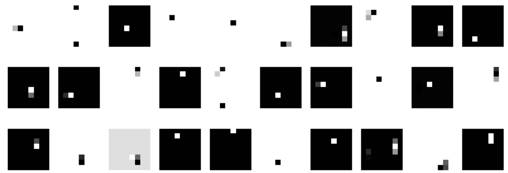

稀疏 PCA 算法提取的成分

不难理解，每个数字都可以由这些原子组成。 但是，考虑到原子数，稀疏度不能非常大。 例如，考虑数字`X[0]`的转换：

```py
y = spca.transform(X[0].reshape(1, -1)).squeeze()
```

以下屏幕快照显示了系数的绝对值：


`X[0]`的稀疏转换的绝对系数

显然有一些主要成分（例如 2，7，13，17，21，24，26，27 和 30 ），一些次要的（例如 5，8 等）和一些无效或可忽略的值（例如 1，3，6 等）。 如果以相同的代码长度（30 个分量）增加稀疏度，则对应于空分量的系数将降至零，而如果代码长度也增加（例如`k = 100`） ，字典将变得过于完整，并且空系数的数量也将增加。


# 非负矩阵分解


当数据集`X`为非负数时，可以应用已被证明的分解技术（例如，在《通过非负矩阵分解学习对象的部分》中）在任务目标是提取与样本结构部分相对应的原子时更加可靠。 例如，在图像的情况下，它们应该是几何元素，甚至是更复杂的部分。 **非负矩阵分解**（**NNMF**）施加的主要条件是，所有涉及的矩阵都必须为非负，并且`X = UV`。 因此，一旦定义了标准`N`（例如 Frobenius），则简单目标就变成了：


由于这在通常还需要稀疏性的情况下通常是不可接受的（而且，为了在更改解决方案以满足特定要求时具有更大的灵活性），因此通常通过在两个 Frobenius 上加点惩罚来表达该问题（例如在 scikit-learn 中） （`L[2]`的矩阵扩展）和`L[1]`规范（例如，在 ElasticNet 中）：


双重正则化通过避免类似于监督模型的过拟合的效果，使您既可以获得稀疏性，又可以获得样本的各部分之间的更好匹配（由于该解决方案次优，因此在适应新模型时更加灵活） 样本是从相同的数据生成过程中提取的；这增加了通常可以实现的可能性）。

现在，让我们考虑 MNIST 数据集，并将其分解为 50 个原子，最初设置`α = 2.0`和`β = 0.1`（在 scikit-learn 中称为`l1_ratio`）。 此配置将强制中等稀疏性和强 L2/Frobenius 正则化。 该过程非常简单，类似于稀疏 PCA：

```py
from sklearn.decomposition import NMF

nmf = NMF(n_components=50, alpha=2.0, l1_ratio=0.1, random_state=1000)
nmf.fit(X)
```

在训练过程结束时，组件（原子）如以下屏幕快照所示：

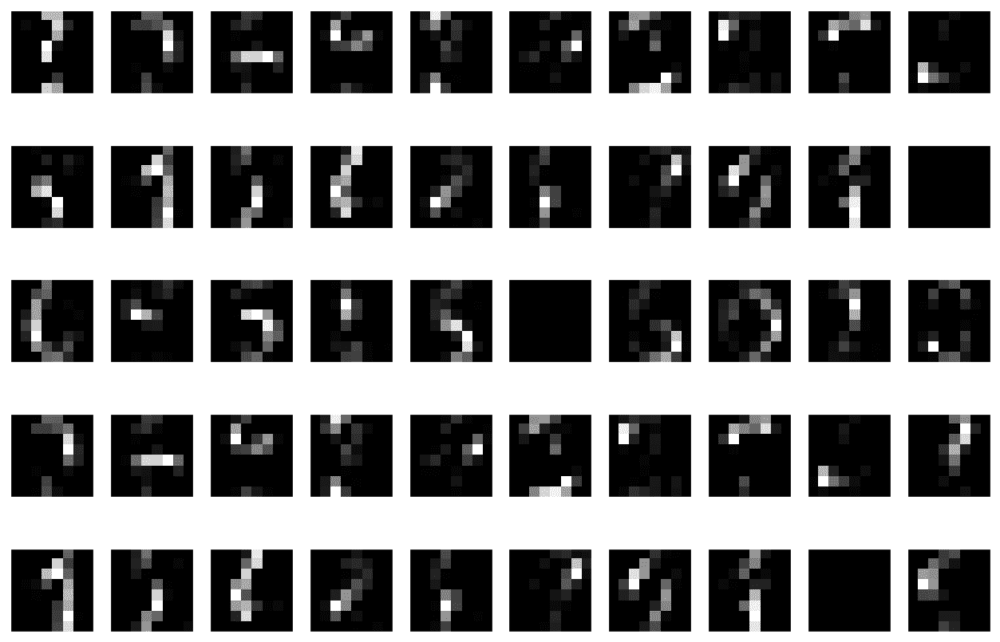

NNMF 算法提取的原子

与我们在标准字典学习中观察到的相反，原子现在结构化了很多，并且它们再现了数字的特定部分（例如，垂直或水平笔画，圆，点等）； 因此，我们可以预期会有更多的稀疏表示，因为更少的组件足以构成一个数字。 考虑上一节中显示的示例（数字`X[0]`），所有组件的绝对贡献如下图所示：


`X[0]`的 NNMF 的绝对系数

占主导地位的是三个部分（ 3 ， 24 和 45 ）； 因此，我们可以尝试将样本表示为它们的组合。 系数分别为 0.19、0.18 和 0.16。 结果显示在以下屏幕截图中（数字`X[0]`代表零）：

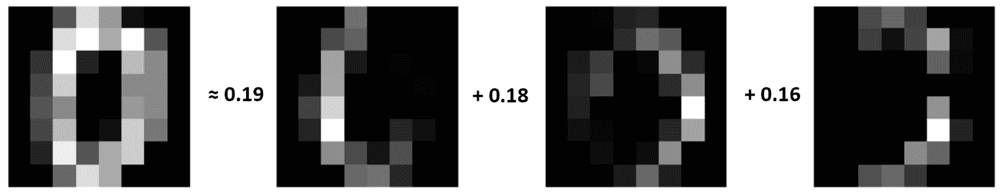

基于三个主成分来解构数字`X[0]`

有趣的是，该算法是如何选择原子的。 即使此过程受到`α`和`β`参数，以及规范的强烈影响，我们也可以观察到，例如，第三个原子（ 屏幕截图中的第一个）可以被许多零，三和八共享； 最后一个原子对于零和九都是有帮助的。 每当原子的粒度太粗糙时，具有较弱的`L[1]`罚分的不完整字典可能会有所帮助。 当然，每个问题都需要特定的解决方案。 因此，我强烈建议与领域专家一起检查原子的结构。 作为练习，我邀请您将 NNMF 应用于另一个小图像数据集（例如 Olivetti，Cifar-10 或 STL-10），并尝试找到隔离固定数量的结构零件所必需的正确参数（ 例如，对于面部，它们可以是眼睛，鼻子和嘴巴。


# 独立成分分析


当使用标准 PCA（或其他技术，例如因子分析）时，组件是不相关的，但是不能保证它们在统计上是独立的。 换句话说，假设我们有一个数据集`X`，它是从联合概率分布`p(X)`中得出的； 如果`n`个组件存在，我们不能总是确定以下等式成立：

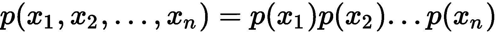

但是，基于称为**鸡尾酒会**的通用模型，有许多重要任务。 在这种情况下，我们可以假设（或我们知道）许多不同且独立的源（例如声音和音乐）重叠并生成单个信号。 在这一点上，我们的目标是尝试通过对每个样本进行线性变换来分离源。 让我们考虑一个增白的数据集`X`（因此所有组件都具有相同的信息内容），我们可以假定是从高斯分布`N(0, I)`中采样的（ 这不是限制性条件，因为许多不同源的重叠很容易收敛到正态分布。 因此，目标可以表示如下：

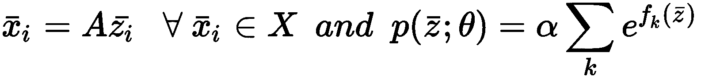

换句话说，我们将每个样本表示为许多独立因素的乘积，并具有基于指数函数的先验分布。 必须绝对强制执行的唯一条件是非高斯性（否则，各组成部分将变得难以区分）。 因此，函数`f[k](z)`不能为二次多项式。 在实践中，我们还希望包括中等程度的稀疏性，因此我们期望出现峰值和重尾分布（也就是说，概率仅在非常短的范围内才很高，然后突然下降到几乎为零）。 这种情况可以通过检查归一化的第四矩**峰度**来验证：

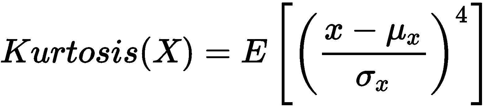

对于高斯分布，峰度为 3。由于这通常是一个参考值，因此所有具有`Kurtosis(X) > 3`的分布都称为超高斯或**尖峰**。 ，将具有`Kurtosis(X) < 3`的人称为亚高斯性或**平峰**。 前一个分配类别的示例是 Laplace 分配类别，如以下屏幕截图所示：


高斯分布（左）和拉普拉斯分布（右）的概率密度函数

不幸的是，峰度的使用由于其对异常值的缺乏鲁棒性而受到阻碍（也就是说，由于它涉及四次方，因此即使很小的值也可以被放大并改变最终结果；例如，噪声高斯的尾部的离群值可以显示为超高斯）。 因此，作者 Hyvarinen 和 Oja （在《独立组件分析：算法和应用》中）提出了一种称为**快速独立组件分析**（**FastICA**）基于**负熵**的概念。 我们不会在本书中描述整个模型。 但是，了解基本思想会有所帮助。 可以证明，在具有相同方差的所有分布之间，高斯熵最大。 因此，如果数据集`X`（零中心）已从具有协方差`Σ`的分布中得出，则可以定义`X`作为高斯`N(0 ;Σ)`的熵与`X`的熵之间的差

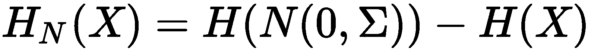

因此，我们的目标是通过减少`J(X)`来减少`H[N](X)`（始终大于或等于零）。 FastICA 算法基于特定功能的组合，近似于`H[N](X)`。 最常见的称为 **logcosh** （它也是 scikit-learn 中的默认值），如下所示：


使用此技巧，可以更轻松地优化负熵，并且最终分解必定包含独立的成分。 现在，让我们将 FastICA 算法应用于 MNIST 数据集（为了提高精度，我们设置`max_iter=10000`和`tol=1e-5`）：

```py
from sklearn.decomposition import FastICA

ica = FastICA(n_components=50, max_iter=10000, tol=1e-5, random_state=1000)
ica.fit(X)
```

以下屏幕快照显示了该算法找到的 50 个独立组件（始终通过`components_` i 实例变量可用）。


FastICA 提取的独立成分

在这种情况下，组件可以立即被识别为数字的一部分（考虑到数据集的维数，我邀请读者通过减少和增加组件的数量直至 64（这是最大数量）来重复该示例）。 这些分量趋于到达相应分布的平均位置。 因此，使用较少的数量，就可以区分出更多的结构化模式（可以视为不同的重叠信号），而使用更多的组件，则可以得到更多以特征为中心的元素。 但是，与 NNMF 相反，FastICA 不保证提取样本的实际部分，而是保证提取更完整的区域。 换句话说，尽管 NNMF 可以轻松检测到例如某些单个笔触，但 FastICA 倾向于将样本视为不同信号的总和，在图像的情况下，通常涉及样本的整个维数，除非组件数量急剧增加。 为了更好地理解这个概念，让我们考虑一下 Olivetti 人脸数据集，其中包含 400 张 64×64 灰度肖像：

```py
from sklearn.datasets import fetch_olivetti_faces

faces = fetch_olivetti_faces(shuffle=True, random_state=1000)
```

以下屏幕截图显示了前 10 张面孔：


从 Olivetti 人脸数据集中提取的人脸样本

现在，让我们提取 100 个独立的组件：

```py
ica = FastICA(n_components=100, max_iter=10000, tol=1e-5, random_state=1000)
ica.fit(faces['data'])
```

下面的屏幕截图绘制了前 50 个组件：

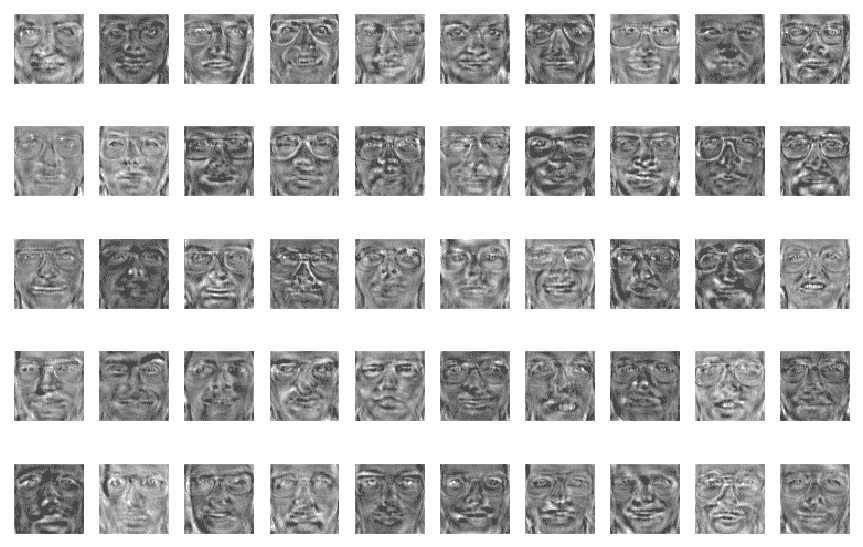

50 (out of 100) independent components extracted by FastICA

如您所见，每个组成部分都类似于**元人脸**（有时称为特征人脸），由于所有其余部分（即使它们无法在精确的样本集中立即识别出来）。 当组件的数量增加到 350 时，效果将更加明显，如下所示：

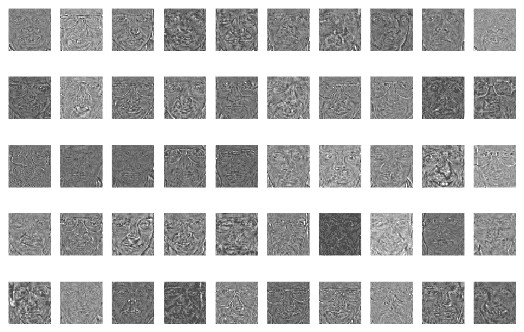

50 (out of 350) independent components extracted by FastICA

在这种情况下，次要特征不太占优势，因为存在更多的重叠分布，并且每个特征都集中在一个更原子的本征面上。 当然，如果没有完整的领域知识，就无法定义组件的最佳数量。 例如，对于 Olivetti 人脸数据集，识别特定的子元素（例如，眼镜的位置）或更完整的面部表情可能会有所帮助。 在前一种情况下，更多的组件会产生更集中的解决方案（即使它们在全球范围内的区别性较小），而在后一种情况下，数量较少的组件（例如上一个示例）会产生更完整的结果，可以评估不同的影响因素。 就信号而言，组件的数量应等于预期的重叠因子的数量（假设其独立性）。 例如，音频信号可以包含在机场讲话的人的录音，并带有宣布飞行的背景声音。 在这种情况下，方案可以由三个部分组成：两个声音和噪音。 由于噪声将部分分解为主要成分，因此最终数量将等于 2。


# 潜在狄利克雷分布的主题建模


现在，我们将考虑另一种分解方法，这种分解方法在处理文本文档（即 NLP）时非常有用。 理论部分不是很容易，因为它需要对概率论和统计学习有深入的了解（可以在原始论文《隐迪利克雷分布》）； 因此，我们将只讨论主要元素，而没有任何数学参考（《机器学习算法第二版》）。 让我们考虑一组文本文件`d[j]`（称为**语料库**），其原子（或组成部分）为单词`w[i]`：


收集所有单词后，我们可以构建一个词典：

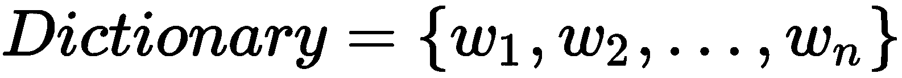

我们还可以陈述以下不等式（`N(·)`计算集合中元素的数量）：

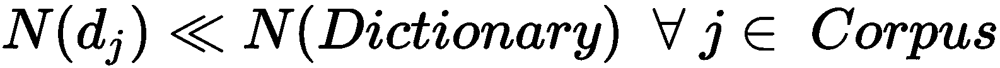

这意味着文档之间单词的分布是稀疏的，因为在单个文档中只使用了很少的单词，而前者的选择是对称 Dirichlet 分布（该模型以此命名），它非常稀疏 （此外，它是分类分布的共轭先验，它是一阶多项式，因此很容易合并到模型中）。 概率密度函数（由于分布是对称的，因此`α[i] = α ∀ i`）如下：


现在，让我们考虑将文档按主题进行语义分组，即`t[k]`，并假设每个主题都具有少量奇特词：


这意味着主题之间的单词分布也很少。 因此，我们具有完整的联合概率（单词，主题），并且我们想要确定条件概率`p(w[i] | t[k])`和`p(t[k] | w[i])`。 换句话说，给定一个文档，它是术语的集合（每个术语都有边际概率`p(w[i])`计算此类文档属于特定主题的概率。 由于一个文档被轻柔地分配给所有主题（也就是说，它可以在不同程度上属于一个以上的主题），因此我们需要考虑一个稀疏的主题文档分布，其中的主题组合（`$1[$2]`）被绘制为：


以类似的方式，我们需要考虑主题词的分布（因为一个词可以被更多的主题共享，程度不同），我们可以从中得出主题词-混合样本`β[j]`：

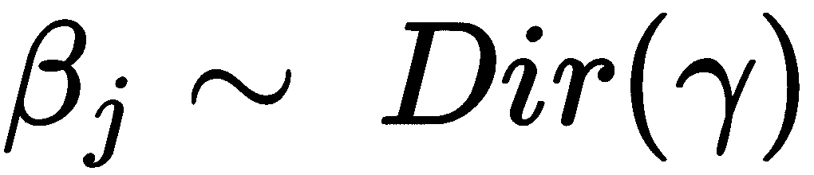

**潜在狄利克雷分布**（**LDA**）是一个生成模型（训练目标以简单的方式包括找到最佳参数`α`和`γ`），它能够从语料库中提取固定数量的主题，并用一组单词来表征它们。 给定示例文档，它可以通过提供主题混合概率向量（`θ[i] = (p(t[1]), p(t[2]), ..., p(t[k]))`）；它也可以处理看不见的文档（使用同一词典）。

现在，让我们将 LDA 应用于 20 个新闻组数据集中的一个子集，其中包含数千个已公开发布以供 NLP 研究的消息。 特别是，我们要对`rec.autos`和`comp.sys.mac.hardware`子组建模。 我们可以使用内置的 scikit-learn `fetch_20newsgroups()`函数，要求去除所有不必要的页眉，页脚和引号（答案所附的其他帖子）：

```py
from sklearn.datasets import fetch_20newsgroups

news = fetch_20newsgroups(subset='all', categories=('rec.autos', 'comp.sys.mac.hardware'), remove=('headers', 'footers', 'quotes'), random_state=1000)

corpus = news['data']
labels = news['target']
```

此时，我们需要对语料库进行向量化处理。 换句话说，我们需要将每个文档转换为包含词汇表中每个单词的频率（计数）的稀疏向量：


我们将使用`CountVectorizer` 类，来执行此步骤，要求去除重音并删除停用词，例如，停用词的相对使用率很高，但不具有代表性。 此外，我们正在强制令牌生成器排除所有不是纯文本的令牌（通过设置`token_pattern='[a-z]+'`）。 在其他情况下，这种模式可能会有所不同，但是在这种情况下，我们不想依赖数字和符号：

```py
from sklearn.feature_extraction.text import CountVectorizer

cv = CountVectorizer(strip_accents='unicode', stop_words='english', analyzer='word', token_pattern='[a-z]+')
Xc = cv.fit_transform(corpus)

print(len(cv.vocabulary_))
```

上一个代码段的输出如下：

```py
14182
```

因此，每个文档都是一个 14182 维的稀疏向量（很明显，大多数值都是空的）。 现在，我们可以通过施加`n_components=2`来执行 LDA，因为我们希望提取两个主题：

```py
from sklearn.decomposition import LatentDirichletAllocation

lda = LatentDirichletAllocation(n_components=2, learning_method='online', max_iter=100, random_state=1000)
Xl = lda.fit_transform(Xc)
```

在训练过程之后，`components_` 实例变量包含每对夫妇（单词和主题）的相对频率（以计数为单位）。 因此，在我们的情况下，其形状为`(2, 14, 182)`，`components_[i, j]` 元素，且`i ∈ (0, 1)`和`j ∈ (0, 14, 181)`可以解释为单词`j`的重要性，以便定义主题`i`。 因此，我们将有兴趣检查两个主题的前 10 个词：

```py
import numpy as np

Mwts_lda = np.argsort(lda.components_, axis=1)[::-1]

for t in range(2):
    print('\nTopic ' + str(t))
    for i in range(10):
        print(cv.get_feature_names()[Mwts_lda[t, i]])
```

输出如下：

```py
Topic 0
compresion
progress
deliberate
dependency
preemptive
wv
nmsu
bpp
coexist
logically

Topic 1
argues
compromising
overtorque
moly
forbid
cautioned
sauber
explosion
eventual
agressive
```

易于理解（考虑一些非常特殊的术语），已将`Topic 0`分配给`comp.sys.mac.hardware` ，将另一个分配给`rec.autos`（不幸的是，此过程不能基于自动检测，因为语义必须由人解释）。 为了评估模型，让我们考虑两个示例消息，如下所示：

```py
print(corpus[100])
print(corpus[200])
```

输出（限于几行）如下：

```py
I'm trying to find some information on accelerator boards for the SE. Has
anyone used any in the past, especially those from Extreme Systems, Novy or
MacProducts? I'm looking for a board that will support extended video,
especially Radius's two-page monitor. Has anyone used Connectix Virtual in
conjunction with their board? Any software snafus? Are there any stats
anywhere on the speed difference between a board with an FPU and one
without? Please send mail directly to me. Thanks.

...

The new Cruisers DO NOT have independent suspension in the front.  They
still
run a straight axle, but with coils.  The 4Runner is the one with
independent
front.  The Cruisers have incredible wheel travel with this system. 

The 91-up Cruiser does have full time 4WD, but the center diff locks in
low range.  My brother has a 91 and is an incredibly sturdy vehicle which
has done all the 4+ trails in Moab without a tow.  The 93 and later is even
better with the bigger engine and locking diffs.
```

因此，第一个帖子显然与图形有关，而第二个帖子是政治信息。 让我们为它们两者计算主题混合，如下所示：

```py
print(Xl[100])
print(Xl[200])
```

输出如下：

```py
[0.98512538 0.01487462]
[0.01528335 0.98471665]
```

因此，第一个消息大约有`Topic 0`的概率为 98%，而第二个消息几乎几乎没有分配给`Topic 1`。 这证实了分解工作正常。 为了更好地了解整体分布，可视化属于每个类别的消息的混合将很有帮助，如以下屏幕快照所示：


`comp.sys.mac.hardware`（左）和`rec.autos`（右）的主题组合

如您所见，主题几乎是正交的。 属于`rec.autos`的大多数消息具有`p(t[0]) < 0.5`和`p(t[1]) > 0.5`，而`comp.sys.mac.hardware`则略有重叠，其中不具有`p(t[0]) > 0.5`和`p(t[1]) < 0.5`的消息组稍大。 这可能是由于存在可以使两个主题具有相同重要性的词语（例如，*讨论*或*辩论*可能在两个新闻组中均出现）。 作为练习，我邀请您使用更多的子集，并尝试证明主题的正交性，并检测可能导致错误分配的单词。


# 总结


在本章中，我们介绍了可用于降维和字典学习的不同技术。 PCA 是一种非常知名的方法，涉及查找与方差较大的方向相关联的数据集的大部分导入成分。 该方法具有对角化协方差矩阵并立即测量每个特征的重要性的双重效果，从而简化了选择并最大化了剩余的解释方差（可以用较小的数字来解释的方差量） 组件）。 由于 PCA 本质上是一种线性方法，因此它通常不能与非线性数据集一起使用。 因此，已经开发了基于内核的变体。 在我们的示例中，您了解了 RBF 内核如何将非线性可分离的数据集投影到子空间，在该子空间中 PCA 可以确定判别分量。

稀疏 PCA 和字典学习是广泛使用的技术，当需要提取可以混合（以线性组合方式）的建筑原子以生成样本时，可以使用这些技术。 在许多情况下，目标是找到一个所谓的“过度完成的字典”，这相当于说我们期望比构造每个样本的实际原子更多的原子（这就是为什么表示稀疏的原因）。 尽管 PCA 可以提取不相关的成分，但很少能够找到统计上独立的成分。 因此，我们引入了 ICA 的概念，该技术是为了从可以被认为是独立原因（例如，声音或视觉元素）之和的样本中提取重叠源而开发的。 具有特殊功能的另一种方法是 NNMF，它既可以生成稀疏表示，又可以生成类似于样本特定部分的一组组件（例如，对于面部，它们可以表示眼睛，鼻子等）。 最后一部分介绍了 LDA 的概念，LDA 是一种主题建模技术，可以在给定文档主体（即文档属于每个特定主题的概率）的情况下查找主题组合。

在下一章中，我们将介绍一些基于无监督范式的神经模型。 特别地，将讨论可以在没有协方差矩阵的特征分解（或 SVD）的情况下提取数据集主成分的深度置信网络，自编码器和模型。


# 问题


1.  数据集`X`具有协方差矩阵`C = diag(2, 1)`。 您对 PCA 有什么期望？
2.  考虑到前面的问题，如果`X`居中于零，并且`B[0.5](0, 0)`*的球为空，我们可以假设一个阈值`x = 0`（第一个主要成分）是否允许水平判别？
3.  PCA 提取的成分在统计上是独立的。 它是否正确？
4.  `Kurt(X) = 5`的分布适用于 ICA。 它是否正确？
5.  包含样本`(1, 2)`和`(0, -3)`的数据集`X`的 NNMF 是多少？
6.  一个 10 个文档的语料库与一个带有 10 个词的词典相关联。 我们知道每个文档的固定长度为 30 个字。 字典是否过于完整？
7.  内核 PCA 与二次内核一起使用。 如果原始尺寸为 2，则执行 PCA 的新空间的尺寸是多少？


# 进一步阅读


+   `Online Dictionary Learning for Sparse Coding, J. Mairal, F. Bach, J. Ponce, and G. Sapiro, 2009`
+   `Learning the parts of objects by non-negative matrix factorization, Lee D. D., Seung S. H., Nature, 401, 10/1999`
+   `EM algorithms for ML factor analysis, Rubin D., and Thayer D., Psychometrika, 47, 1982`
+   `Independent Component Analysis: Algorithms and Applications, Hyvarinen A. and Oja E., Neural Networks 13, 2000`
+   `Mathematical Foundations of Information Theory, Khinchin A. I., Dover Publications`
+   `Latent Dirichlet Allocation, Journal of Machine Learning Research, Blei D., Ng A., and Jordan M., 3, (2003) 993-1022`
+   `Machine Learning Algorithms Second Edition, Bonaccorso G., Packt Publishing, 2018`
+   `Mastering Machine Learning Algorithms, Bonaccorso G., Packt Publishing, 2018`


