# 无监督神经网络模型


在本章中，我们将讨论一些可用于无监督任务的神经模型。 神经网络（通常是深层网络）的选择使您能够利用需要复杂处理单元（例如图像）的特定功能来解决高维数据集的复杂性。

特别是，我们将介绍以下内容：

*   汽车编码器
*   去噪自编码器
*   稀疏的汽车编码器
*   变体自编码器
*   PCA 神经网络：
*   桑格的网络
*   Rubner-Attic 的网络
*   无监督**深度信念网络**（**DBN**）


# 技术要求


本章中提供的代码要求以下内容：

*   Python3.5+（强烈建议使用 [Anaconda 发行版](https://www.anaconda.com/download/)）
*   以下库：
    *   SciPy 0.19+
    *   NumPy 1.10+
    *   Scikit-Learn 0.20+
    *   Pandas 0.22+
    *   Matplotlib 2.0+
    *   Seaborn 0.9+
    *   TensorFlow 1.5+
    *   [深度信念网络](https://github.com/albertbup/deep-belief-network)

[这些示例可在 GitHub 存储库中找到](https://github.com/PacktPublishing/HandsOn-Unsupervised-Learning-with-Python/tree/master/Chapter08)。


# 汽车编码器


在第 7 章，“降维和成分分析”中，我们讨论了一些通用的方法，这些方法可用于降低数据集的维数，因为其具有特殊的统计属性（例如协方差） 矩阵）。 但是，当复杂度增加时，即使**核主成分分析**（**核 PCA**）也可能找不到合适的低维表示形式。 换句话说，信息的丢失可以克服一个阈值，该阈值保证了有效重建样本的可能性。 **自编码器**是利用神经网络的极端非线性特性来查找给定数据集的低维表示的模型。 特别地，假设`X`是从数据生成过程中提取的一组样本，`p_data(x)`。 为简单起见，我们将考虑`x[i] ∈ R^n`，但对支撑结构没有任何限制（例如，对于 RGB 图像，`x[i] ∈ R^(n×m×3)`。 自编码器在形式上分为两个部分：有一个编码器，它将高维输入转换为较短的代码；一个解码器，执行逆运算（如下图所示）：


通用自编码器的结构模式

如果代码是`p`维向量，则可以将编码器定义为参数化函数`e(·)`：

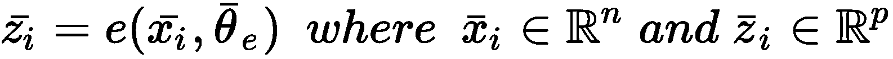

以类似的方式，解码器是另一个参数化函数`d(·)`：


因此，完整的自编码器是一个复合函数，在给定输入样本`x[i]`的情况下，它提供了最佳的输出重构：


由于通常是通过神经网络实现的，因此使用反向传播算法来训练自编码器，通常基于均方误差成本函数：

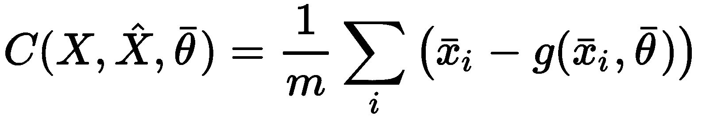

另外，考虑到数据生成过程，我们可以考虑参数化条件分布`q(·)`重新表达目标：


因此，成本函数现在可以成为`p_data`(·)*和`q(·)`之间的 Kullback-Leibler 散度：

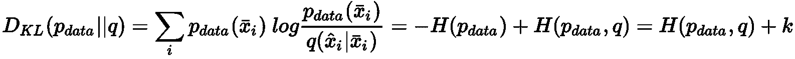

由于`p_data`的熵是一个常数，因此可以通过优化过程将其排除； 因此，散度的最小化等于`p_data`和`q`之间的交叉熵最小化。 如果假设`p_data`和`q`为高斯，则 Kullback-Leibler 成本函数等效于均方误差。 在某些情况下，当数据在`(0, 1)`范围内归一化时，可以对`p_data`和`q`采用伯努利分布。 形式上，这不是完全正确的，因为伯努利分布是二进制的，并且`x[i] ∈ {0, 1}^d`； 但是，使用 S 型输出单元还可以保证连续样本的成功优化， `x[i] ∈ (0, 1)^d`。 在这种情况下，成本函数变为：


# 深度卷积自编码器的示例


让我们基于 TensorFlow 和 Olivetti faces 数据集（虽然相对较小，但提供良好的表现力）来实现深层卷积自编码器 。 让我们首先加载图像并准备训练集：

```py
from sklearn.datasets import fetch_olivetti_faces

faces = fetch_olivetti_faces(shuffle=True, random_state=1000)
X_train = faces['images']
```

样本是 400 个`64×64`灰度图像，我们将其调整为`32×32`，以加快计算速度并避免出现内存问题（此操作会导致视觉精度略有下降，如果您有足够的计算资源，您可以删除它）。 现在，我们可以定义主要常量（历元数（`nb_epochs`，`batch_size`和`code_length`））和`graph`：

```py
import tensorflow as tf

nb_epochs = 600
batch_size = 50
code_length = 256 
width = 32
height = 32

graph = tf.Graph() 
```

因此，我们将训练 600 个时期的模型，每批 50 个样本。 由于每个图像都是`64×64 = 4,096`，因此压缩率是`4,096 / 256 = 16`倍。 当然，这种选择不是规则，我邀请您始终检查不同的配置，以最大化收敛速度和最终精度。 在我们的案例中，我们正在对编码器进行以下建模：

*   具有 16 个`3×3`过滤器，`2×2`步幅，ReLU 激活和相同填充的 2D 卷积
*   具有 32 个`3×3`过滤器，`1×1`步幅，ReLU 激活和相同的填充的 2D 卷积
*   具有 64 个`3×3`过滤器，`1×1`跨距，ReLU 激活和相同的填充的 2D 卷积
*   2D 卷积，具有 128 个`3×3`个过滤器，`1×1`跨距，ReLU 激活和相同的填充

解码器利用一系列转置卷积（也称为**反卷积**）：

*   2D 转置卷积，具有 128`3×3`个过滤器，`2×2`步幅，ReLU 激活和相同的填充
*   具有 64 个`3×3`滤波器，`1×1`跨距，ReLU 激活和相同填充的 2D 转置卷积
*   具有 32 个`3×3`滤波器，`1×1`跨距，ReLU 激活和相同填充的 2D 转置卷积
*   2D 转置卷积，带有 1`3×3`过滤器，`1×1`步幅，Sigmoid 激活，以及相同的填充

损失函数基于重构图像和原始图像之间差异的`L[2]`范数。 优化器是 Adam，学习率为`η = 0.001`。 TensorFlow DAG 的编码器部分如下：

```py
import tensorflow as tf

with graph.as_default():
    input_images_xl = tf.placeholder(tf.float32, 
                                     shape=(None, X_train.shape[1], X_train.shape[2], 1))
    input_images = tf.image.resize_images(input_images_xl, (width, height), 
                                          method=tf.image.ResizeMethod.BICUBIC)

    # Encoder
    conv_0 = tf.layers.conv2d(inputs=input_images,
                              filters=16,
                              kernel_size=(3, 3),
                              strides=(2, 2),
                              activation=tf.nn.relu,
                              padding='same')

    conv_1 = tf.layers.conv2d(inputs=conv_0,
                              filters=32,
                              kernel_size=(3, 3),
                              activation=tf.nn.relu,
                              padding='same')

    conv_2 = tf.layers.conv2d(inputs=conv_1,
                              filters=64,
                              kernel_size=(3, 3),
                              activation=tf.nn.relu,
                              padding='same')

    conv_3 = tf.layers.conv2d(inputs=conv_2,
                              filters=128,
                              kernel_size=(3, 3),
                              activation=tf.nn.relu,
                              padding='same')
```

DAG 的代码部分如下：

```py
import tensorflow as tf

with graph.as_default():   
    # Code layer
    code_input = tf.layers.flatten(inputs=conv_3)

    code_layer = tf.layers.dense(inputs=code_input,
                                 units=code_length,
                                 activation=tf.nn.sigmoid)

    code_mean = tf.reduce_mean(code_layer, axis=1)
```

DAG 的解码器部分如下：

```py
import tensorflow as tf

with graph.as_default(): 
    # Decoder
    decoder_input = tf.reshape(code_layer, (-1, int(width / 2), int(height / 2), 1))

    convt_0 = tf.layers.conv2d_transpose(inputs=decoder_input,
                                         filters=128,
                                         kernel_size=(3, 3),
                                         strides=(2, 2),
                                         activation=tf.nn.relu,
                                         padding='same')

    convt_1 = tf.layers.conv2d_transpose(inputs=convt_0,
                                         filters=64,
                                         kernel_size=(3, 3),
                                         activation=tf.nn.relu,
                                         padding='same')

    convt_2 = tf.layers.conv2d_transpose(inputs=convt_1,
                                         filters=32,
                                         kernel_size=(3, 3),
                                         activation=tf.nn.relu,
                                         padding='same')

    convt_3 = tf.layers.conv2d_transpose(inputs=convt_2,
                                         filters=1,
                                         kernel_size=(3, 3),
                                         activation=tf.sigmoid,
                                         padding='same')

    output_images = tf.image.resize_images(convt_3, (X_train.shape[1], X_train.shape[2]), 
                                           method=tf.image.ResizeMethod.BICUBIC)
```

`loss`函数和 Adam 优化器在以下代码段中定义：

```py
import tensorflow as tf

with graph.as_default():
    # Loss
    loss = tf.nn.l2_loss(convt_3 - input_images)

    # Training step
    training_step = tf.train.AdamOptimizer(0.001).minimize(loss)
```

一旦定义了完整的 DAG，我们就可以初始化会话和所有变量：

```py
import tensorflow as tf

session = tf.InteractiveSession(graph=graph)
tf.global_variables_initializer().run()
```

一旦 TensorFlow 初始化，就可以开始训练过程，如下所示：

```py
import numpy as np

for e in range(nb_epochs):
    np.random.shuffle(X_train)

    total_loss = 0.0
    code_means = []

    for i in range(0, X_train.shape[0] - batch_size, batch_size):
        X = np.expand_dims(X_train[i:i + batch_size, :, :], axis=3).astype(np.float32)

        _, n_loss, c_mean = session.run([training_step, loss, code_mean],
                                        feed_dict={
                                            input_images_xl: X
                                        })
        total_loss += n_loss
        code_means.append(c_mean)

    print('Epoch {}) Average loss per sample: {} (Code mean: {})'.
          format(e + 1, total_loss / float(X_train.shape[0]), np.mean(code_means)))
```

上一个代码段的输出如下：

```py
Epoch 1) Average loss per sample: 11.933397521972656 (Code mean: 0.5420681238174438)
Epoch 2) Average loss per sample: 10.294102325439454 (Code mean: 0.4132006764411926)
Epoch 3) Average loss per sample: 9.917563934326171 (Code mean: 0.38105469942092896)
...
Epoch 600) Average loss per sample: 0.4635812330245972 (Code mean: 0.42368677258491516)
```

在训练过程结束时，每个样本的平均损失约为 0.46（考虑 32×32 图像），编码的平均值为 0.42。 该值表示编码相当密集，因为期望单个值在`(0, 1)`范围内均匀分布； 因此，平均值为 0.5。 在这种情况下，我们对这个数据不感兴趣，但是在寻找稀疏度时我们也将比较结果。

下图显示了一些样本图像的自编码器的输出：


深度卷积自编码器的样本输出

扩大到 64×64 会部分影响重建的质量。 但是，通过降低压缩率和增加代码长度可以获得更好的结果。


# 去噪自编码器


自编码器的一个非常有用的应用程序并不严格取决于它们查找低维表示形式的能力，而是依赖于从输入到输出的转换过程。 特别地，我们假设一个零中心数据集`X`和一个嘈杂的版本，其样本具有以下结构：


在这种情况下，自编码器的目标是消除噪声项并恢复原始样本`x[i]`。 从数学角度来看，标准和**去噪自编码器**之间没有特别的区别； 但是，重要的是要考虑此类模型的容量需求。 由于他们必须恢复原始样本，因此在输入受损（其特征占用更大的样本空间）的情况下，层的数量和尺寸可能比标准自编码器要大。 当然，考虑到复杂性，没有一些测试就不可能有清晰的洞察力。 因此，我强烈建议从较小的模型开始，然后增加容量，直到最佳成本函数达到合适的值为止。 为了增加噪音，有几种可能的策略：

*   破坏每个批量中的样本（贯穿整个时期）。
*   将噪声层用作编码器的输入 1。
*   将压差层用作编码器的输入 1（例如，椒盐噪声）。 在这种情况下，丢失的概率可以是固定的，也可以以预定义的间隔（例如，（0.1，0.5））随机采样。

如果假定噪声为高斯噪声（这是最常见的选择），则可能会同时产生同调和异调噪声。 在第一种情况下，所有分量的方差都保持恒定（即`n(i) ~ N(0, σ^2 I)`），而在后一种情况下，每个组件具有其自身的差异。 根据问题的性质，另一种解决方案可能更合适。 但是，在没有限制的情况下，总是最好使用异方差噪声，以提高系统的整体鲁棒性。


# 给深度卷积自编码器增加噪声


在此示例中，我们将修改先前开发的深度卷积自编码器，以管理嘈杂的输入样本。 DAG 几乎等效，不同之处在于，现在我们需要同时提供噪点图像和原始图像：

```py
import tensorflow as tf

with graph.as_default():
    input_images_xl = tf.placeholder(tf.float32, 
                                     shape=(None, X_train.shape[1], X_train.shape[2], 1))
    input_noisy_images_xl = tf.placeholder(tf.float32, 
                                           shape=(None, X_train.shape[1], X_train.shape[2], 1))

    input_images = tf.image.resize_images(input_images_xl, (width, height), 
                                          method=tf.image.ResizeMethod.BICUBIC)
    input_noisy_images = tf.image.resize_images(input_noisy_images_xl, (width, height), 
                                                method=tf.image.ResizeMethod.BICUBIC)

    # Encoder
    conv_0 = tf.layers.conv2d(inputs=input_noisy_images,
                              filters=16,
                              kernel_size=(3, 3),
                              strides=(2, 2),
                              activation=tf.nn.relu,
                              padding='same')
...
```

`loss`函数当然是通过考虑原始图像来计算的：

```py
...

# Loss
loss = tf.nn.l2_loss(convt_3 - input_images)

# Training step
training_step = tf.train.AdamOptimizer(0.001).minimize(loss)
```

在变量的标准初始化之后，我们可以考虑附加噪声`n[i] = N(0, 0.45)`（即`σ ≈ 0.2`）开始训练过程：

```py
import numpy as np

for e in range(nb_epochs):
    np.random.shuffle(X_train)

    total_loss = 0.0
    code_means = []

    for i in range(0, X_train.shape[0] - batch_size, batch_size):
        X = np.expand_dims(X_train[i:i + batch_size, :, :], axis=3).astype(np.float32)
        Xn = np.clip(X + np.random.normal(0.0, 0.2, size=(batch_size, X_train.shape[1], X_train.shape[2], 1)), 0.0, 1.0)

        _, n_loss, c_mean = session.run([training_step, loss, code_mean],
                                        feed_dict={
                                            input_images_xl: X,
                                            input_noisy_images_xl: Xn
                                        })
        total_loss += n_loss
        code_means.append(c_mean)

    print('Epoch {}) Average loss per sample: {} (Code mean: {})'.
          format(e + 1, total_loss / float(X_train.shape[0]), np.mean(code_means)))
```

一旦训练了模型，就可以用一些嘈杂的样本对其进行测试。 结果显示在以下屏幕截图中：

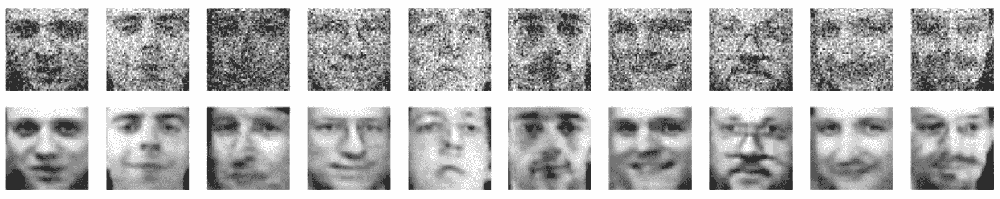

噪音样本（上排）； 去噪图像（下排）

如您所见，自编码器已经成功学习了如何对输入图像进行去噪，即使它们已经损坏。 我邀请您与其他数据集一起测试模型，以寻找允许合理良好重构的最大噪声方差。


# 稀疏的汽车编码器


标准自编码器生成的代码通常很密集； 但是，如第 7 章，“降维和成分分析”中所讨论的，有时，最好使用字典过于完整和稀疏编码。 实现此目标的主要策略是简单地在成本函数上添加`L[1]`罚款（在代码层上）：

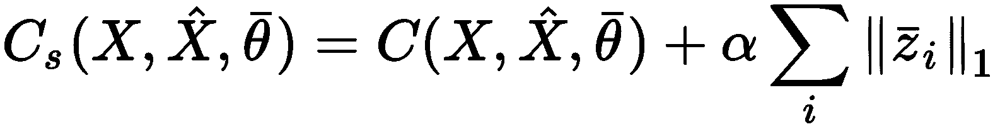

`α`常数确定将要达到的稀疏程度。 当然，由于`C[s]`的最佳值与原始值不对应，因此，为了达到相同的精度，通常需要更多的历元和更长的代码层。 由 Andrew Ng（斯坦福大学的 CS294A “稀疏自编码器”）提出的另一种方法是基于稍微不同的方法。 代码层被认为是一组独立的伯努利随机变量。 因此，给定另一组均值较小的伯努利变量（例如`p[r] ~ B(0.05)`），就有可能尝试找到使代码最小化的最佳代码`z[i]`与此类参考分布之间的 Kullback-Leibler 散度：

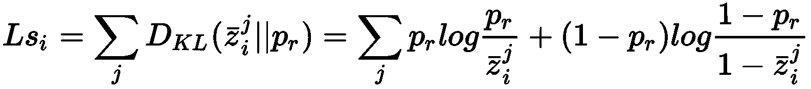

因此，新的成本函数变为：


最终效果与使用`L[1]`惩罚所获得的效果没有太大不同。 实际上，在这两种情况下，模型都被迫学习次优表示，还试图最小化目标（如果单独考虑）将导致输出代码始终为空。 因此，全部成本函数将达到最小，从而保证重构能力和稀疏性（必须始终与代码长度保持平衡）。 因此，通常，代码越长，可以实现的稀疏度就越大。


# 向深度卷积自编码器添加稀疏约束


在此示例中，我们想通过使用`L[1]`罚分来提高代码的稀疏性。 DAG 和训练过程与主要示例完全相同，唯一的区别是`loss`函数，现在变为：

```py
...
sparsity_constraint = 0.01 * tf.reduce_sum(tf.norm(code_layer, ord=1, axis=1))
loss = tf.nn.l2_loss(convt_3 - input_images) + sparsity_constraint
...
```

我们添加了`α = 0.01`的稀疏约束； 因此，我们可以通过检查平均代码长度来重新训练模型。 该过程的输出如下：

```py
Epoch 1) Average loss per sample: 12.785746307373048 (Code mean: 0.30300647020339966)
Epoch 2) Average loss per sample: 10.576686706542969 (Code mean: 0.16661183536052704)
Epoch 3) Average loss per sample: 10.204148864746093 (Code mean: 0.15442773699760437)
...
Epoch 600) Average loss per sample: 0.8058895015716553 (Code mean: 0.028538944199681282)
```

如您所见，代码现在变得极为稀疏，最终均值大约等于 0.03。 该信息表明大多数代码值接近于零，并且在解码图像时只能考虑其中的几个。 作为练习，我邀请您分析一组选定图像的代码，尝试根据它们的激活/不激活来理解其值的语义。


# 变体自编码器


让我们考虑从数据生成过程中提取的数据集`X`，`p_data`。 可变自编码器是一种生成模型（基于标准自编码器的主要概念），由 Kingma 和 Welling 提出（在《贝叶斯变分自编码》），旨在再现数据生成过程。 为了实现此目标，我们需要从基于一组潜在变量`z`和一组可学习参数*θ*的通用模型开始。 给定样本`x[i] ∈ X`，该模型的概率为`p(x, z; θ)` 。 因此，训练过程的目标是找到使似然性最大化的最佳参数`p(x; θ)`，该参数可以通过边缘化整个联合概率来获得：


以前的表达式很简单，但是不幸的是，它很难以封闭形式处理。 主要原因是我们没有关于先验`p(z;  θ)`的有效信息。 此外，即使假设例如`z ~ N(0, Σ)`（例如`N(0, I)`），找到有效样本的概率也非常稀疏 。 换句话说，给定`z`值，我们也不太可能生成实际上属于`p_data`的样本。 为了解决这个问题，作者提出了一种变分方法，我们将简要介绍一下（上述论文中有完整的解释）。 假设标准自编码器的结构，我们可以通过将编码器建模为`q(z | x; θ[q])`来引入代理参数化分布。 此时，我们可以计算`q(·)`与实际条件概率`p(z | x; θ)`之间的 Kullback-Leibler 散度


当期望值运算符在`z`上工作时，可以提取最后一项并将其移到表达式的左侧，变为：


经过另一种简单的操作，先前的等式变为：


左侧是模型下样本的对数似然，而右侧是非负项（KL 散度）和另一个称为**证据下界**（**ELBO**）：

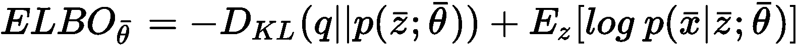

正如我们将要讨论的，使用 ELBO 比处理公式的其余部分要容易得多，并且由于 KL 散度不会产生负面影响，所以如果我们最大化 ELBO，我们也将最大化对数似然率。

我们先前定义了`p(z; θ) = N(0, I)`; 因此，我们可以将`q(z | x; θ)`建模为多元高斯模型，其中两个参数集（均值向量和协方差矩阵）由拆分概率编码器表示。 特别是，给定样本`x`，编码器现在必须同时输出平均向量`μ(z | x; θ[q])`和协方差矩阵`Σ(z | x; θ[q])`。 为简单起见，我们可以假设矩阵是对角线，因此两个组件的结构完全相同。 结果分布为`q(​​z | x; θ[q]) = N(μ(z | x; θ[q]), Σ(z | x; θ[q])`; 因此，ELBO 的第一项是两个高斯分布之间的负 KL 散度：


在前面的公式中，`p`是代码长度，因此它是均值和对角协方差向量的维数。 右侧的表达式非常容易计算，因为`Σ`是对角线的（也就是说，迹线是元素的总和，行列式是乘积）。 但是，当使用**随机梯度下降**（**SGD**）算法时，此公式的最大值尽管正确，但却不是可微的运算。 为了克服这个问题，作者建议重新分配分布。

当提供一批时，对正态分布进行采样，获得`α ~ N(0, I)`。 使用该值，可以使用概率编码器的输出来构建所需的样本：`μ(z | x; θ[q]) + α • ∑(z | x; θ[q])^2`。 该表达式是可区分的，因为`α`在每个批量中都是常数（当然，就像`μ(z | x; θ[q])`和`∑(z | x; θ[q])`用神经网络参数化，它们是可微的）。

ELBO 右侧的第二项是`log p(x|z; θ)`的期望值。 不难看出，这样的表达式与原始分布和重构之间的交叉熵相对应：


这是标准自编码器的成本函数，在使用伯努利分布的假设下，我们将其最小化。 因此，公式变为：


# 深卷积变分自编码器的示例


在此示例中，我们要基于 Olivetti 人脸数据集构建和训练深度卷积变分自编码器。 该结构与我们第一个示例中使用的结构非常相似。 编码器具有以下几层：

*   具有 16`3×3`过滤器，`2×2`步幅，ReLU 激活和相同填充的 2D 卷积
*   具有 32 个`3×3`过滤器，`1×1`步幅，ReLU 激活和相同的填充的 2D 卷积
*   具有 64 个`3×3`过滤器，`1×1`跨距，ReLU 激活和相同的填充的 2D 卷积
*   2D 卷积，具有 128`3×3`个过滤器，`1×1`跨距，ReLU 激活和相同的填充

解码器具有以下转置卷积：

*   2D 转置卷积，具有 128`3×3`个过滤器，`2×2`步幅，ReLU 激活和相同的填充
*   2D 转置卷积，具有 128`3×3`个过滤器，`2×2`步幅，ReLU 激活和相同的填充
*   具有 32 个`3×3`滤波器，`1×1`跨距，ReLU 激活和相同填充的 2D 转置卷积
*   2D 转置卷积，带有 1`3×3`过滤器，`1×1`步幅，Sigmoid 激活，以及相同的填充

TensorFlow 完全控制了噪声的产生，并且基于理论部分中说明的技巧。 以下代码段显示了 DAG 的第一部分，其中包含图形定义和编码器：

```py
import tensorflow as tf

nb_epochs = 800
batch_size = 100
code_length = 512
width = 32
height = 32

graph = tf.Graph()

with graph.as_default():
    input_images_xl = tf.placeholder(tf.float32, 
                                     shape=(batch_size, X_train.shape[1], X_train.shape[2], 1))
    input_images = tf.image.resize_images(input_images_xl, (width, height), 
                                          method=tf.image.ResizeMethod.BICUBIC)

    # Encoder
    conv_0 = tf.layers.conv2d(inputs=input_images,
                              filters=16,
                              kernel_size=(3, 3),
                              strides=(2, 2),
                              activation=tf.nn.relu,
                              padding='same')

    conv_1 = tf.layers.conv2d(inputs=conv_0,
                              filters=32,
                              kernel_size=(3, 3),
                              activation=tf.nn.relu,
                              padding='same')

    conv_2 = tf.layers.conv2d(inputs=conv_1,
                              filters=64,
                              kernel_size=(3, 3),
                              activation=tf.nn.relu,
                              padding='same')

    conv_3 = tf.layers.conv2d(inputs=conv_2,
                              filters=128,
                              kernel_size=(3, 3),
                              activation=tf.nn.relu,
                              padding='same')
```

DAG 中定义代码层的部分如下：

```py
import tensorflow as tf

with graph.as_default():
    # Code layer
    code_input = tf.layers.flatten(inputs=conv_3)

    code_mean = tf.layers.dense(inputs=code_input,
                                units=width * height)

    code_log_variance = tf.layers.dense(inputs=code_input,
                                        units=width * height)

    code_std = tf.sqrt(tf.exp(code_log_variance))
```

DAG 的解码器部分如下：

```py
import tensorflow as tf

with graph.as_default():  
    # Decoder
    decoder_input = tf.reshape(sampled_code, (-1, int(width / 4), int(height / 4), 16))

    convt_0 = tf.layers.conv2d_transpose(inputs=decoder_input,
                                         filters=128,
                                         kernel_size=(3, 3),
                                         strides=(2, 2),
                                         activation=tf.nn.relu,
                                         padding='same')

    convt_1 = tf.layers.conv2d_transpose(inputs=convt_0,
                                         filters=128,
                                         kernel_size=(3, 3),
                                         strides=(2, 2),
                                         activation=tf.nn.relu,
                                         padding='same')

    convt_2 = tf.layers.conv2d_transpose(inputs=convt_1,
                                         filters=32,
                                         kernel_size=(3, 3),
                                         activation=tf.nn.relu,
                                         padding='same')

    convt_3 = tf.layers.conv2d_transpose(inputs=convt_2,
                                         filters=1,
                                         kernel_size=(3, 3),
                                         padding='same')

    convt_output = tf.nn.sigmoid(convt_3)

    output_images = tf.image.resize_images(convt_output, (X_train.shape[1], X_train.shape[2]), 
                                           method=tf.image.ResizeMethod.BICUBIC)
```

DAG 的最后一部分包含损失函数和 Adam 优化器，如下所示：

```py
import tensorflow as tf

with graph.as_default():
    # Loss
    reconstruction = tf.nn.sigmoid_cross_entropy_with_logits(logits=convt_3, labels=input_images)
    kl_divergence = 0.5 * tf.reduce_sum(
            tf.square(code_mean) + tf.square(code_std) - tf.log(1e-8 + tf.square(code_std)) - 1, axis=1)

    loss = tf.reduce_sum(tf.reduce_sum(reconstruction) + kl_divergence)

    # Training step
    training_step = tf.train.AdamOptimizer(0.001).minimize(loss)
```

损失函数由两个部分组成：

1.  基于交叉熵的重构损失
2.  代码分布与参考正态分布之间的 Kullback-Leibler 散度

在这一点上，像往常一样，我们可以初始化会话和所有变量，并开始每批 800 个纪元和 100 个样本的训练过程：

```py
import tensorflow as tf
import numpy as np

session = tf.InteractiveSession(graph=graph)
tf.global_variables_initializer().run()

for e in range(nb_epochs):
    np.random.shuffle(X_train)

    total_loss = 0.0

    for i in range(0, X_train.shape[0] - batch_size, batch_size):
        X = np.zeros((batch_size, 64, 64, 1), dtype=np.float32)
        X[:, :, :, 0] = X_train[i:i + batch_size, :, :]

        _, n_loss = session.run([training_step, loss],
                                feed_dict={
                                    input_images_xl: X
                                })
        total_loss += n_loss

    print('Epoch {}) Average loss per sample: {}'.format(e + 1, total_loss / float(batch_size)))
```

在训练过程的最后，我们可以测试几个样本的重构。 结果显示在以下屏幕截图中：


变分自编码器产生的样本重构

作为练习，我邀请读者修改 DAG，以接受通用输入代码并评估模型的生成属性。 或者，可以获取训练样本的代码并施加一些噪声，以便观察对输出重构的影响。


# 基于 Hebbian 的主成分分析


在本节中，我们将分析两个神经模型（Sanger 和 Rubner-Tavan 网络），它们可以执行**主成分分析**（**PCA**），而无需对协方差矩阵进行特征分解或执行截断的 SVD。 它们都是基于**赫布学习**的概念（有关更多详细信息，请参阅《理论神经科学》），这是有关非常简单的神经元动力学的第一批数学理论之一。 然而，这些概念具有非常有趣的含义，尤其是在组件分析领域。 为了更好地了解网络的动力学，提供神经元基本模型的快速概述将很有帮助。 让我们考虑一个输入`x ∈ R^n`和权重向量`w ∈ ℜ^n`。 神经元执行点积（无偏差），以产生标量输出`y`：

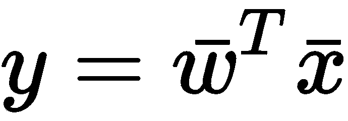

现在，如果我们想象两个神经元，第一个被称为突触前单元，另一个被称为突触后单元。 **赫布规则**指出，当突触前​​和突触后单元都输出具有相同符号（尤其是正值）的值时，突触强度必须增加，而当符号不同时，突触强度必须减弱。 这种概念的数学表达式如下：

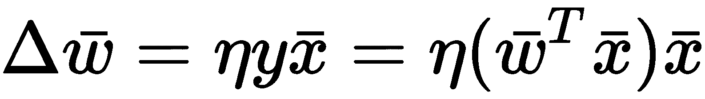

常数`η`是学习率。 完整的分析超出了本书的范围，但是有可能证明，一个 Hebbian 神经元（经过一些非常简单的修改，需要控制`w`的生长）可以改变突触的权重，因此在足够多的迭代之后，它沿着数据集的第一个主成分`X`对齐。 从这个结果（我们不会证明）开始，我们可以介绍 Sanger 的网络。


# 桑格的网络


Sanger 的网络模型由 Sanger 提出（在《单层线性前馈神经网络中的最佳无监督学习》），以便提取第一个数据集的`X`的`k`个主成分，以在线过程降序排列（相反，标准 PCA 是需要整个数据集的批量）。 即使有基于特定版本 SVD 的增量算法，这些神经模型的主要优点是它们处理单个样本的固有能力而不会损失任何性能。 在显示网络结构之前，有必要对 Hebb 规则进行修改，称为 **Oja 规则**：

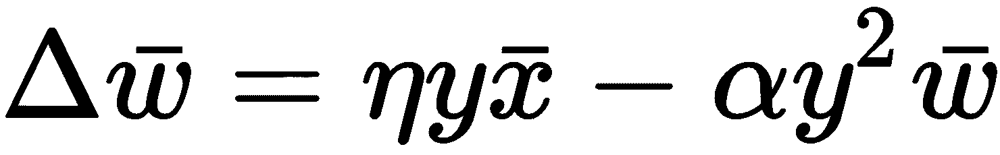

引入此规则是为了解决标准 Hebbian 神经元无限增长的问题。 实际上，很容易理解，如果点积`w^T x`为正，Δw 将通过增加`w`的幅度来更新权重。 和更多。 因此，在进行大量迭代之后，模型可能会遇到溢出。 奥雅定律通过引入一种自动限制来克服这个问题，该自动限制迫使重量幅度饱和而不影响神经元找到第一个主要成分的方向的能力。 实际上，用`w[k]`表示第`k`次迭代之后的权重向量，可以证明以下内容：

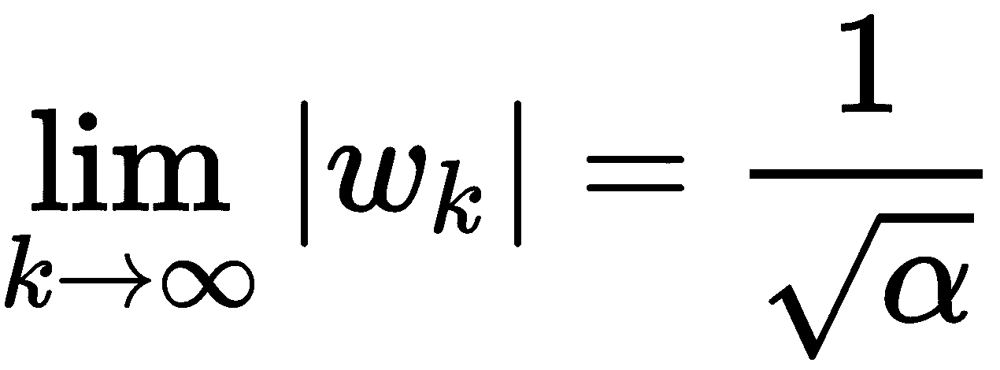

Sanger 的网络基于 Oja 规则的修改版本，该规则定义为**广义赫布学习**（**GHL**）。 假设我们有一个数据集`X`，包含`m`个向量，`x[i] ∈ R^n`。 下图显示了网络的结构：

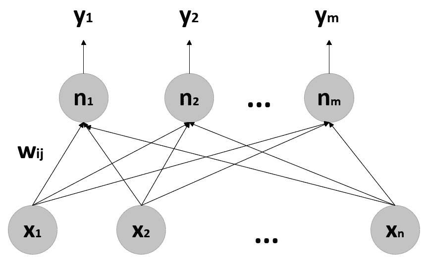

通用 Sanger 网络的结构

权重被组织成一个矩阵，`W = {w[ij]}`（`w[ij]`是连接突触前单元的权重 ，`i`，带有突触后单位，`j`）； 因此，可以使用以下公式来计算输出的激活：


但是，在这种网络中，我们对最终权重更感兴趣，因为它们必须等于第一个`n`主分量。 不幸的是，如果我们应用 Oja 规则而不做任何修改，则所有神经元都将找到相同的组件（第一个组件）。 因此，必须采用不同的策略。 从理论上讲，我们知道主成分必须正交。 因此，如果`w[1]`是具有第一个分量方向的向量，则可以强制`w[2]`正交于`w[1]`，依此类推。 该方法基于 **Gram-Schmidt 正交归一化程序**。 让我们考虑两个向量-已经收敛的`w[1]`，和`w[20]`， 任何干预措施，也将收敛于`w[1]`。 通过考虑此向量在`w[1]`上的投影，可以找到`w[20]`的正交分量：

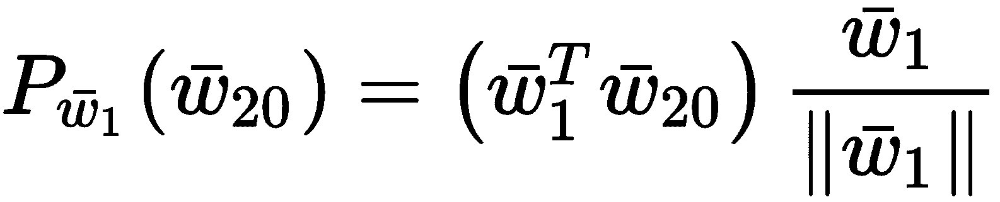

此时，`w[2]`的正交分量等于：


第三部分必须正交于`w[1]`和`w[2]`，因此必须对所有`n`个单位，直到最终收敛。 而且，我们现在正在使用已经融合的组件，而是使用并行更新的动态系统。 因此，有必要将此程序纳入学习规则，如下所示：


在给定输入`x`的情况下，先前的更新是指单个权重`w[ij]`。 容易理解，第一部分是标准赫布法则，而其余部分是正交项，它扩展到`y[i]`之前的所有单元。

以矩阵形式，更新内容如下：

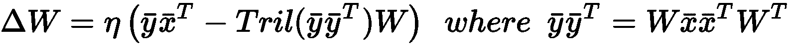

`Tril(·)`函数计算方阵的下三角部分。 收敛性证明并非无关紧要，但在`η`单调减少的温和条件下，可以看到该模型如何以降序收敛到第一个`n`主成分。

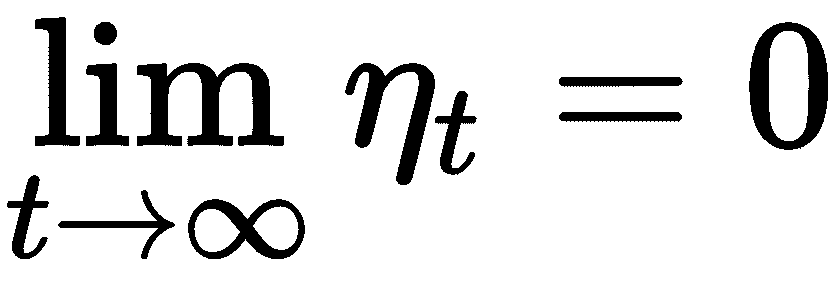

这样的约束并不难实现。 但是，一般来说，当`η < 1`并在迭代过程中保持恒定时，该算法也可以达到收敛。


# 桑格网络的一个例子


让我们考虑一个使用 scikit-learn `make_blobs()` 实用函数获得的样本二维零中心数据集：

```py
import numpy as np

def zero_center(Xd):
    return Xd - np.mean(Xd, axis=0)

X, _ = make_blobs(n_samples=500, centers=3, cluster_std=[5.0, 1.0, 2.5], random_state=1000)
Xs = zero_center(X)

Q = np.cov(Xs.T)
eigu, eigv = np.linalg.eig(Q)

print('Covariance matrix: {}'.format(Q))
print('Eigenvalues: {}'.format(eigu))
print('Eigenvectors: {}'.format(eigv.T))
```

上一个代码段的输出如下：

```py
Covariance matrix: [[18.14296606  8.15571356]
 [ 8.15571356 22.87011239]]
Eigenvalues: [12.01524122 28.99783723]
Eigenvectors: [[-0.79948496  0.60068611]
 [-0.60068611 -0.79948496]]
```

特征值分别约为 12 和 29，，表示第一主成分（对应于转置特征向量矩阵的第一行，因此`(-0.799, 0.6)`比第二个要短得多。 当然，在这种情况下，我们已经通过对协方差矩阵进行特征分解来计算了主成分，但这只是出于教学目的。 Sanger 的网络将按降序提取组件； 因此，我们期望找到第二列作为权重矩阵的第一列，第一列作为权重矩阵的第二列。 让我们从初始化权重和训练常数开始：

```py
import numpy as np

n_components = 2
learning_rate = 0.01
nb_iterations = 5000
t = 0.0

W_sanger = np.random.normal(scale=0.5, size=(n_components, Xs.shape[1]))
W_sanger /= np.linalg.norm(W_sanger, axis=1).reshape((n_components, 1))
```

In order to reproduce the example, it's necessary to set the random seed equal to 1,000; that is, `np.random.seed(1000)`.

在这种情况下，我们将执行固定的迭代次数（5,000）； 但是，我邀请您修改示例，以基于在随后两个时间步长计算出的权重之间的差的范数（例如 Frobenius）采用公差和停止准则（此方法可以加快训练速度） 避免无用的迭代）。

下图显示了初始配置：

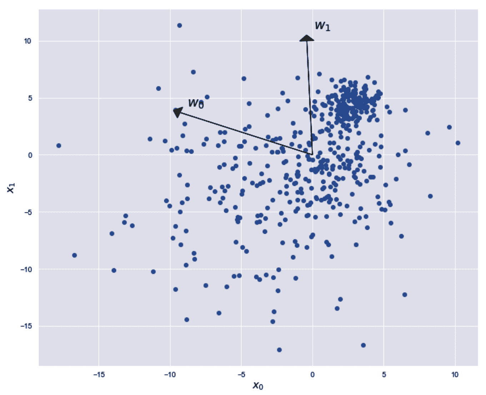

Sanger 网络的初始配置

此时，我们可以开始训练周期，如下所示：

```py
import numpy as np

for i in range(nb_iterations):
    dw = np.zeros((n_components, Xs.shape[1]))
    t += 1.0

    for j in range(Xs.shape[0]):
        Ysj = np.dot(W_sanger, Xs[j]).reshape((n_components, 1))
        QYd = np.tril(np.dot(Ysj, Ysj.T))
        dw += np.dot(Ysj, Xs[j].reshape((1, X.shape[1]))) - np.dot(QYd, W_sanger)

    W_sanger += (learning_rate / t) * dw
    W_sanger /= np.linalg.norm(W_sanger, axis=1).reshape((n_components, 1))

print('Final weights: {}'.format(W_sanger))
print('Final covariance matrix: {}'.format(np.cov(np.dot(Xs, W_sanger.T).T)))
```

上一个代码段的输出如下：

```py
Final weights: [[-0.60068611 -0.79948496]
 [-0.79948496  0.60068611]]
Final covariance matrix: [[ 2.89978372e+01 -2.31873305e-13]  
 [-2.31873305e-13 1.20152412e+01]]
```

如您所见，最终的协方差矩阵如预期的那样是去相关的，并且权重已收敛到`C`的特征向量。 权重（主要成分）的最终配置如下图所示：

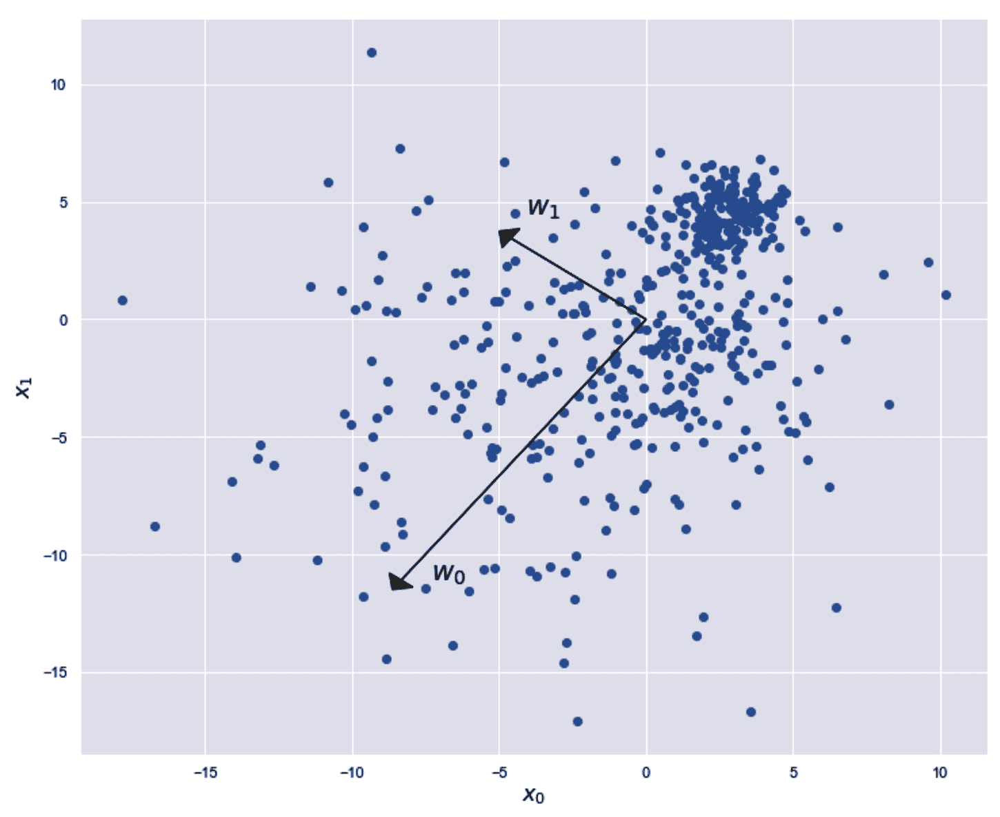

Sanger 网络的最终配置

第一个主成分对应的权重是`w[0]`，它是最大的，而`w[1]`是第二个成分。 我邀请您使用高维数据集测试网络，并根据协方差矩阵的 SVD 或本征分解将性能与标准算法进行比较。


# Rubner-Attic 的网络


Rubner 和 Tavan 提出了另一种可以执行 PCA 的神经网络（在《主成分分析的自组织网络》）。 但是，他们的方法基于协方差矩阵的去相关，这是 PCA 的最终结果（也就是说，就像使用自下而上的策略，而标准过程是自上而下的操作一样）。 让我们考虑一个零中心数据集`X`和一个网络，其输出为 *y∈^m* 向量。 因此，输出分布的协方差矩阵如下：


通用 Rubner-Tavan 网络的结构

如您所见，与 Sanger 网络的主要区别在于每个输出单元（第一个输出单元除外）之前都存在求和节点。 这种方法称为**分层横向连接**，因为每个节点`y[i] (i > 0)`由直接组件`n[i]`组成，加到所有先前的加权输出中。 因此，假设使用`v^(i)`表示法，以表示向量的第`i`个分量，网络输出如下：


已经证明，具有特定权重更新规则（我们将要讨论）的该模型收敛到单个稳定的固定点，并且输出被迫变得相互解相关。 查看模型的结构，操作顺序如下：

*   第一个输出保持不变
*   第二个输出被强制与第一个输出去相关
*   第三输出被强制与第一输出和第二输出去相关，依此类推
*   最后的输出被强制与所有先前的输出去相关

经过多次迭代后，每个生成的`y[i] y[j]`以及`i ≠ j`都为空，而`C`变成对角协方差矩阵。 此外，在上述论文中，作者证明了特征值（对应于方差）是按降序排序的； 因此，可以通过选择包含前`p`行和列的子矩阵来选择顶部的`p`组件。

通过使用两个不同的规则（每个权重层一个）来更新 Rubner-Tavan 网络。 内部权重`w[ij]`通过使用 Oja 规则进行更新：

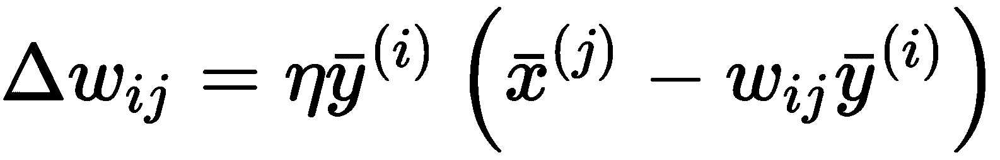

该规则确保提取主成分时不会无限增长`w[ij]`。 相反，外部权重`v[jk]`通过使用**反希伯来规则**更新：


前一个公式的第一项`-ηy^(j) y^(k))`负责解相关，而第二项类似于 Oja's 规则，用作防止权重溢出的自限制正则器。 特别地，`-ηy(i) y^(k)`项可以解释为更新规则的反馈信号`w[ij]`，它受`w[ij]`项校正的实际输出的影响。 考虑到 Sanger 网络的行为，不容易理解，一旦输出去相关，内部权重`w[ij]`就变成正交，代表第一个主要成分`X`。

以矩阵形式，权重`w[ij]`可以立即排列为`W = {w[ij]}`，这样在训练过程结束时，每一列都是`C`的特征向量（降序排列）。 相反，对于外部权重`v[jk]`，我们需要再次使用`Tril(·)`运算符：


因此，迭代`t + 1`的输出变为：


有趣的是，这样的网络经常输出。 因此，一旦应用了输入，就需要进行几次迭代才能使`y`稳定下来（理想情况下，更新必须持续到`||y^(t + 1) - y^(t)|| → 0`）。


# Rubner-Tavan 网络的一个例子


在此示例中，我们将使用 Sanger 网络示例中定义的数据集，以便使用 Rubner-Tavan 网络进行主成分提取。 为了方便起见，让我们重新计算特征分解：

```py
import numpy as np

Q = np.cov(Xs.T)
eigu, eigv = np.linalg.eig(Q)

print('Eigenvalues: {}'.format(eigu))
print('Eigenvectors: {}'.format(eigv.T))
```

上一个代码段的输出如下：

```py
Eigenvalues: [12.01524122 28.99783723]
Eigenvectors: [[-0.79948496 0.60068611]
 [-0.60068611 -0.79948496]]
```

现在，我们可以初始化超参数，如下所示：

```py
n_components = 2 learning_rate = 0.0001 max_iterations = 1000 stabilization_cycles = 5 threshold = 0.00001 W = np.random.normal(0.0, 0.5, size=(Xs.shape[1], n_components))
V = np.tril(np.random.normal(0.0, 0.01, size=(n_components, n_components)))
np.fill_diagonal(V, 0.0)

prev_W = np.zeros((Xs.shape[1], n_components))
t = 0
```

因此，我们选择采用等于 0.00001 的停止阈值（比较基于权重矩阵的两次连续计算的 Frobenius 范数）和最多 1,000 次迭代。 我们还设置了五个稳定周期和固定的学习率`η = 0.0001`。 我们可以开始学习过程，如下所示：

```py
import numpy as np

while np.linalg.norm(W - prev_W, ord='fro') > threshold and t < max_iterations:
    prev_W = W.copy()
    t += 1    for i in range(Xs.shape[0]):
        y_p = np.zeros((n_components, 1))
        xi = np.expand_dims(Xs[i], 1)
        y = None   for _ in range(stabilization_cycles):
            y = np.dot(W.T, xi) + np.dot(V, y_p)
            y_p = y.copy()

        dW = np.zeros((Xs.shape[1], n_components))
        dV = np.zeros((n_components, n_components))

        for t in range(n_components):
            y2 = np.power(y[t], 2)
            dW[:, t] = np.squeeze((y[t] * xi) + (y2 * np.expand_dims(W[:, t], 1)))
            dV[t, :] = -np.squeeze((y[t] * y) + (y2 * np.expand_dims(V[t, :], 1)))

        W += (learning_rate * dW)
        V += (learning_rate * dV)

        V = np.tril(V)
        np.fill_diagonal(V, 0.0)

        W /= np.linalg.norm(W, axis=0).reshape((1, n_components))

print('Final weights: {}'.format(W))
```

前一个块的输出如下：

```py
Final weights: [[-0.60814345 -0.80365858]
 [-0.79382715 0.59509065]]
```

如预期的那样，权重收敛到协方差矩阵的特征向量。 我们还计算最终的协方差矩阵，以检查其值：

```py
import numpy as np

Y_comp = np.zeros((Xs.shape[0], n_components))

for i in range(Xs.shape[0]):
    y_p = np.zeros((n_components, 1))
    xi = np.expand_dims(Xs[i], 1)

    for _ in range(stabilization_cycles):
        Y_comp[i] = np.squeeze(np.dot(W.T, xi) + np.dot(V.T, y_p))
        y_p = y.copy()

print('Final covariance matrix: {}'.format(np.cov(Y_comp.T)))
```

输出如下：

```py
Final covariance matrix: [[28.9963492 0.31487817]
 [ 0.31487817 12.01606874]]
```

同样，最终协方差矩阵是去相关的（误差可忽略不计）。 Rubner-Tavan 的网络通常比 Sanger 的网络快，这是因为反希伯来语的反馈加快了收敛速度。 因此，当采用这种模型时，它们应该是首选。 但是，调整学习速率非常重要，这样可以避免振荡。 我建议从一个较小的值开始，然后稍微增加它，直到迭代次数达到最小值为止。 另外，也可以从较高的学习率入手，以便更快地进行初始校正，并可以通过使用线性（如 Sanger 网络）或指数衰减逐步降低学习率。


# 无监督的深度信念网络


在本节中，我们将讨论一个非常著名的生成模型，该模型可以在无监督的情况下使用，以执行从预定义的数据生成过程中提取的输入数据集`X`的降维。 由于本书没有特定的先决条件，并且数学上的复杂度很高，因此我们将简要介绍这些概念，而无需提供证明，也不会对算法的结构进行深入分析。 在讨论**深度信念网络**（**DBN**）之前，有必要介绍另一种模型**受限玻尔兹曼机**（**RBM**）， 被视为 DBN 的构建块。


# 受限玻尔兹曼机


在《动态系统的信息处理：谐波理论的基础》中，提出了这个网络作为概率生成模型，也称为 **Harmonium**。 换句话说，RBM 的目标是学习未知分布（即数据生成过程），以便生成所有可能的样本。 下图显示了通用结构：


通用受限玻尔兹曼机的结构

神经元`x[i]`是可观察到的（也就是说，它们代表 RBM 必须学习的过程生成的向量），而`h[j]`是潜在的（也就是说，它们是隐藏的并且有助于`x[i]`假定的值）。 由于没有任何进一步的细节，我们需要说这个模型具有**马尔科夫随机场**（**MRF**）的结构，这是由于相同层的神经元之间没有连接（即描述网络的图是二分图）。 MRF 的一个重要特性是可以用吉布斯分布对整个联合概率`p(x, h; θ)`进行建模：


指数`E(x, h, θ)`发挥物理系统能量的作用，在我们的情况下，它等于：


该公式的主要假设是所有神经元都是伯努利分布的（即`x[i], h[j] ~ B(0, 1)`） 术语`b[i]`和`c[j]`是可观察和潜在单位的偏差。 给定数据生成过程`p_data`，必须优化 RBM，以便`p(x; θ)`的可能性最大化。 跳过所有中间步骤（可以在前面的文章中找到），可以证明以下几点：

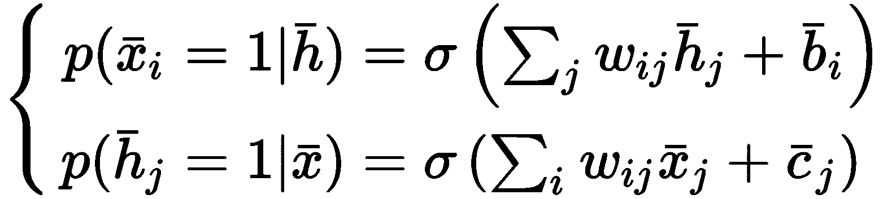

在先前的公式中，`$1`是 Sigmoid 函数。 给定这两个表达式，可以得出（省略操作）对数似然率相对于所有可学习变量的梯度：


很容易理解，所有梯度的第一项都非常容易计算，而所有第二项都需要所有可能的可观测值之和。 这显然是一个棘手的问题，无法以封闭的形式解决。 因此，Hinton（训练受限的玻尔兹曼机器的实用指南》）提出了一种名为**对比发散**的算法 ，可用于查找近似解。 对这种方法的解释需要了解马尔可夫链（这不是前提条件）。 但是，我们可以概括地说该策略是通过有限（少量）采样步骤（通常，一个步骤就足以获得良好的结果）来计算梯度的近似值。 这种方法可以非常有效地训练 RBM，并使深层信念网络易于使用并且非常有效。


# 深度信仰网络


DBN 是基于 RBM 的堆叠模型。 下图显示了通用结构：


通用 DBN 的结构

第一层包含可见单元，其余所有单元都是潜在单元。 在无监督的情况下，目标是学习未知分布，找出样本的内部表示。 实际上，当潜在单元的数量少于输入单元的数量时，模型将学习如何使用低维子空间对分布进行编码。 Hinton 和 Osindero（在《深层信念网络的快速学习算法》）提出了逐步贪婪训练程序（这是通常执行的程序）。 每对层都被认为是 RBM，并使用对比发散算法进行训练。 一旦对 RBM 进行了训练，则隐藏层将成为后续 RBM 的可观察层，并且该过程将一直持续到最后一个。 因此，DBN 开发了一系列内部表示形式（这就是为什么将其定义为深度网络的原因），其中每个级别都接受了较低级别功能的训练。 该过程与可变自编码器并无不同。 但是，在这种情况下，模型的结构更加僵化（例如，无法使用卷积单位）。 而且，输出不是输入的重建，而是内部表示。 因此，考虑上一节中讨论的公式，如果有必要反转过程（即给定内部表示，获得输入），则必须使用以下公式从最顶层进行采样：


当然，必须向后重复此过程，直到到达实际的输入层为止。 DBN 非常强大（例如，在天体物理学领域有一些科学应用程序），即使它们的结构不像其他更新的模型那样灵活。 但是，复杂度通常较高，因此，我总是建议从较小的模型开始，仅在最终精度不足以满足特定目的的情况下才增加层和/或神经元的数量。


# 无监督 DBN 的示例


在此示例中，我们要使用 DBN 来查找 MNIST 数据集的低维表示。 由于这些模型的复杂性很容易增加，我们将限制该过程为 500 个随机样本。 该实现基于 [Deep-belief-network 软件包](https://github.com/albertbup/deep-belief-network)，该软件包同时支持 NumPy 和 TensorFlow。 在前一种情况下，必须从`dbn`包中导入类（其名称保持不变），而在后一种情况下，必须是`dbn.tensorflow`包。 在此示例中，我们将使用要求较少的 NumPy 版本，但也请读者检查 TensorFlow 版本。

让我们从加载和规范化数据集开始，如下所示：

```py
import numpy as np

from sklearn.datasets import load_digits
from sklearn.utils import shuffle

nb_samples = 500

digits = load_digits()

X_train = digits['data'] / np.max(digits['data'])
Y_train = digits['target']

X_train, Y_train = shuffle(X_train, Y_train, random_state=1000)
X_train = X_train[0:nb_samples]
Y_train = Y_train[0:nb_samples]
```

现在，我们可以使用以下结构实例化`UnsupervisedDBN`类：

1.  64 个输入神经元（从数据集中隐式检测到）
2.  32 个乙状结肠神经元
3.  32 个乙状结肠神经元
4.  16 个乙状神经元

因此，最后一个表示形式由 16 个值（原始尺寸的四分之一）组成。 我们将`η = 0.025`的学习速率设置为每批 16 个样本（当然，我们邀请您检查其他配置，以最大程度地减少重构误差）。 以下代码段初始化并训练模型：

```py
from dbn import UnsupervisedDBN

unsupervised_dbn = UnsupervisedDBN(hidden_layers_structure=[32, 32, 16],
                                   learning_rate_rbm=0.025,
                                   n_epochs_rbm=500,
                                   batch_size=16,
                                   activation_function='sigmoid')

X_dbn = unsupervised_dbn.fit_transform(X_train)
```

在训练过程的最后，我们可以将分布投影到二维空间上，然后分析分布。 像往常一样，我们将采用 t-SNE 算法，该算法可确保找到最相似的低维分布：

```py
from sklearn.manifold import TSNE

tsne = TSNE(n_components=2, perplexity=10, random_state=1000)
X_tsne = tsne.fit_transform(X_dbn)
```

下图显示了投影样本的图：

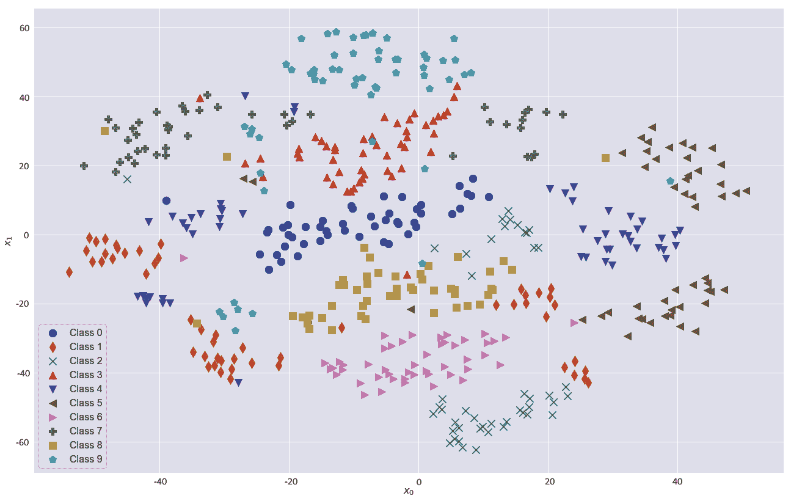

无监督 DBN 输出表示的 t-SNE 图

如您所见，大多数块都具有很强的凝聚力，这表明数字的特殊属性已在较低维空间中成功表示。 在某些情况下，相同的数字组被划分为更多的簇，但是总的来说，噪点（隔离点）的数量非常少。 例如，包含数字`2`的组用符号`x`表示。 大部分样本在`0 < x[0] < 30`，`x[1] < -40`范围内； 但是，一个子组也位于`-10 < x[1] < 10`范围内。 如果我们检查这个小集群的邻居，它们是由代表数字`8`（用正方形表示）的样本组成的。 容易理解，某些格式错误的二进制与格式错误的八进制非常相似，这证明了拆分原始群集的合理性。 从统计角度来看，所解释的方差可能会产生不同的影响。 在某些情况下，只有几个组件足以确定类的特殊功能，但这通常是不正确的。 当属于不同类别的样本显示出相似性时，只能由于次级成分的差异而做出区分。 在处理包含几乎（甚至部分）重叠样本的数据集时，这一考虑非常重要。 进行降维时，数据科学家的主要任务不是检查总体解释的方差，而是了解是否存在受降维不利影响的区域。 在这种情况下，可以定义多个检测规则（例如，当样本`x[i] ∈ R[1]`或`x[i] ∈ R[4] → x[i]`具有`y[k]`标签）或尝试避免使用模型来创建此细分（在这种情况下，我们邀请您测试更复杂的 DBN 和更高维的输出表示形式）。


# 总结


在本章中，我们讨论了用于解决无监督任务的一些非常常见的神经模型。 自编码器使您可以查找数据集的低维表示形式，而没有对其复杂性的特定限制。 特别是，深度卷积网络的使用有助于检测和学习高级和低级几何特征，当内部代码也比原始维数短得多时，这可以导致非常准确的重构。 我们还讨论了如何为自编码器增加稀疏性，以及如何使用这些模型对样本进行降噪。 标准自编码器的一个稍有不同的变体是变体自编码器，它是一种生成模型，可以提高学习从中得出数据集的数据生成过程的能力。

Sanger 和 Rubner-Tavan 的网络是神经模型，能够在不进行任何统计预处理的情况下提取数据集的前`k`主成分。 它们还具有以在线方式自然工作的优势（尽管标准 PCA 经常需要整个数据集，即使存在性能稍逊于脱机算法的增量变体），也可以按降序提取组件。 我们讨论的最后一个模型是在无监督的情况下的 DBN。 我们描述了其构建基块 RBM 的生成属性，然后分析了此类模型如何学习数据生成过程的内部（通常为低维）表示。

在下一章中，我们将讨论其他神经模型：**生成对抗网络**（**GAN**）和**自组织映射**（**SOM**）。 前者可以学习输入分布并从中获取新样本，而后者则基于大脑某些特定区域的功能，并训练它们的单位以接受特定的输入模式。


# 问题


1.  在自编码器中，编码器和解码器都必须在结构上对称。 它是否正确？
2.  给定数据集`X`及其转换`Y`，根据自编码器产生的代码，可以在`Y`找到`X`中包含的所有信息。 它是否正确？
3.  代码`z[i] ∈ (0, 1)^128`的`sum(z[i]) = 36`。 稀疏吗？
4.  如果`std(z[i]) = 0.03`，代码是否稀疏？
5.  Sanger 网络需要协方差矩阵列作为输入向量。 它是否正确？
6.  我们如何确定 Rubner-Tavan 网络提取的每个成分的重要性？
7.  给定一个随机向量，`h[i] ∈ R^m`（`m`是 DBN 的输出维数），是否可以确定最可能对应的输入样本？


# 进一步阅读


+   `Stacked Denoising Autoencoders: Learning Useful Representations in a Deep Network with a Local Denoising Criterion, Vincent, P., Larochelle, H., Lajoie, I., Bengio, Y., and Manzagol, P., Journal of Machine Learning Research 11, 2010`
+   `Sparse Autoencoder, CS294A, Ng, A., Stanford University`
+   `Auto-Encoding Variational Bayes, Kingma. D. P. and Welling, M., arXiv:1312.6114 [stat.ML]`
+   `Theoretical Neuroscience, Dayan, P. and Abbott, L. F., The MIT Press, 2005`
+   `Optimal Unsupervised Learning in a Single-Layer Linear Feedforward Neural Network, Neural Networks, Sanger, T. D., 2, 1989`
+   `A Self-Organizing Network for Principal-Components Analysis, Europhysics Letters, Rubner, J. and Tavan, P., 10(7), 1989`
+   `Information Processing in Dynamical Systems: Foundations of Harmony Theory, Parallel Distributed Processing, Smolensky, Paul, Vol 1, The MIT Press, 1986`
+   `A Practical Guide to Training Restricted Boltzmann Machines, Hinton, G., Dept. Computer Science, University of Toronto, 2010`
+   `A Fast Learning Algorithm for Deep Belief Nets, Hinton G. E., Osindero S., and Teh Y. W., Neural Computation, 18/7, 2005`
+   `Machine Learning Algorithms, Second Edition, Bonaccorso, G., Packt, 2018`
+   `Mastering Machine Learning Algorithms, Bonaccorso, G., Packt, 2018`


