# 生成对抗网络和 SOM


在本章中，我们将结束无监督学习的整个过程，讨论一些可以用于执行数据生成过程的非常流行的神经模型，以及可以从中提取的新样本。 此外，我们将分析自组织地图的功能，该功能可以调整其结构，以便特定单位可以响应不同的输入模式。

特别是，我们将讨论以下主题：

*   **生成对抗网络**（**GAN**）
*   **深度卷积 GAN**（**DCGAN**）
*   **Wasserstein GAN**（**WGAN**）
*   **自组织映射**（**SOM**）


# 技术要求


本章将介绍的代码需要以下内容：

*   Python3.5+（强烈建议使用 [Anaconda 发行版](https://www.anaconda.com/distribution/)）
*   库如下：
    *   SciPy 0.19+
    *   NumPy 1.10+
    *   Scikit-Learn 0.20+
    *   Pandas 0.22+
    *   Matplotlib 2.0+
    *   Seaborn 0.9+
    *   TensorFlow 1.5+
    *   Keras 2+（仅适用于数据集实用程序功能）

[可以在 GitHub 存储库中找到这些示例](https://github.com/PacktPublishing/HandsOn-Unsupervised-Learning-with-Python/tree/master/Chapter09)。


# 生成对抗网络


这些生成模型由 Goodfellow 和其他研究人员提出（在《生成对抗网络》中），以利用**对抗训练**的功能以及深度神经网络的灵活性。 无需过多的技术细节，我们就可以将对抗训练的概念作为一种基于博弈论的技术进行介绍，其目标是优化两个相互竞争的代理。 当一个特工试图欺骗其对手时，另一名特工必须学习如何区分正确的输入和伪造的输入。 特别是，GAN 是一个模型，它分为两个定义明确的组件：

*   **生成器**
*   **判别器**（也称为**评论家**）

让我们首先假设有一个数据生成过程，`p_data`，以及一个数据集`X`，该数据集是从`m`样本中提取的：

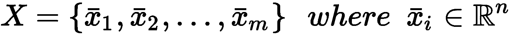

为简单起见，假定数据集具有一个维度； 但是，这不是约束也不是限制。 生成器是一个参数化函数（通常使用神经网络），该函数馈入有噪声的样本，并提供`n`维向量作为输出：


换句话说，生成器是样本`x ∈ R^n`上均匀分布到另一分布`p[g](x)`的变换。 GAN 的主要目标如下：

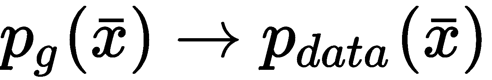

但是，与通过直接训练整个模型来实现这一目标的自编码器相反，在 GAN 中，目标是通过在生成器和判别器之间进行的游戏来实现的，这是另一个需要采样的参数化函数，`x[i] ∈ R^n`，并返回概率：


判别器的作用是区分从`p_data`（返回大概率）提取的样本与由`g(z; θ[g])`（返回低概率）。 但是，由于生成器的目标是变得越来越有能力复制`p_data`，因此其作用是学习如何用数据生成过程的几乎完美复制品中的样本来欺骗判别器。 因此，考虑到区分因素，目标是最大化以下条件：

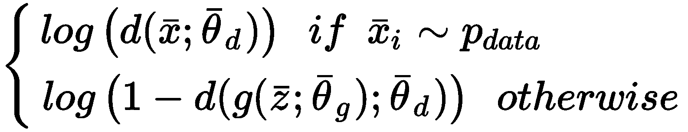

但是，这是 **minimax 游戏**，这意味着两个对手`A`和`B`都必须尝试最小化（`A`） 和最大化（`B`），这是相同的目标。 在这种情况下，生成器的目标是最小化先前的双重成本函数的第二项：

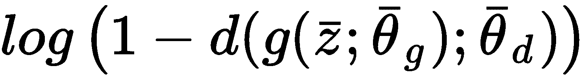

实际上，当两个代理都成功地优化了目标时，判别器将能够区分从`p_data`提取的样本和异常值，并且生成器将能够输出属于`p_data`的合成样本。 但是，必须明确的是，可以通过使用单个目标来表达问题，并且训练过程的目标是找出最佳参数集，`θ = {θ[d], θ[g]}`，因此判别器将其最大化，而生成器将其最小化。 必须同时优化两个代理，但是实际上，过程是交替的（例如，生成器，判别器，生成器等）。 目标可以用更紧凑的形式表示如下：

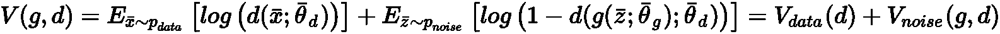

因此，通过解决以下问题可以达到最佳效果：


根据博弈论，这是一个不合作的博弈，它承认**纳什均衡**点。 当满足这种条件时，如果我们假设双方都知道对手的策略，那么他们就没有理由再改变自己的策略了。 在 GAN 的情况下，这种情况意味着一旦达到平衡（甚至只是理论上），生成器就可以继续输出样本，并确保它们不会被判别器误分类。 同时，判别器没有理由改变其策略，因为它可以完美地区分`p_data`和任何其他分布。 从动态角度来看，两个组件的训练速度都是不对称的。 尽管生成器通常需要更多的迭代，但判别器可以非常迅速地收敛。 但是，这样的过早收敛对于整体性能可能非常危险。 实际上，由于判别器提供的反馈，生成器也达到了最佳状态。 不幸的是，当梯度很小时，这种贡献可以忽略不计，其明显的结果是，生成器错过了提高其输出更好样本能力的机会（例如，当样本是图像时，它们的质量可能会保持非常低，甚至具有复杂的架构）。 这种情况并不取决于生成器固有的容量不足，而是取决于判别器收敛（或非常接近收敛）后开始应用的有限次校正。 在实践中，由于没有特定的规则，唯一有效的建议是在训练过程中检查两个损失函数。 如果判别器的损失下降得太快，而生成器的损失仍然很大，那么通常最好在单个判别器步骤中插入更多的生成器训练步骤。


# 分析 GAN


假设我们有一个 GAN，该 GAN 已通过使用从`p_data(x)`中提取的数据集`X`进行了适当的训练。 Goodfellow 等人证明，给定生成器分布`p[g](x)`，最佳判别器如下：

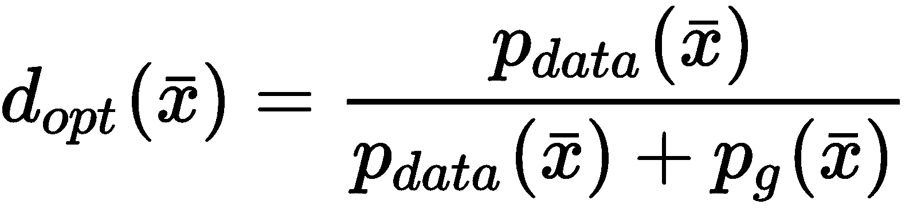

可以使用最佳区分符来重写全局目标：


现在，我们可以扩展前面的表达式：

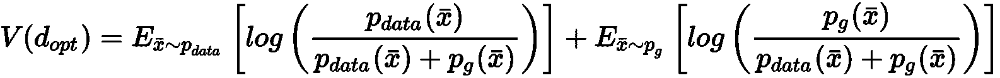

现在，让我们考虑两个分布`a`和`b`之间的 Kullback-Leibler 散度：


考虑前面的表达式，经过一些简单的操作，很容易证明以下相等：

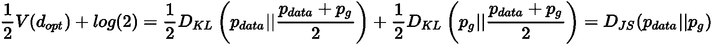

因此，目标可以表示为数据生成过程和生成器分布之间的 **Jensen-Shannon 散度**的函数。 与 Kullback-Leibler 散度的主要区别在于`0 ≤ D[JS](p_data || p[g]) ≤ log(2)`，并且是对称的。 这种重新定义并不奇怪，因为 GAN 的真正目标是成为一个能够成功复制`p_data`的生成模型，如下图所示：

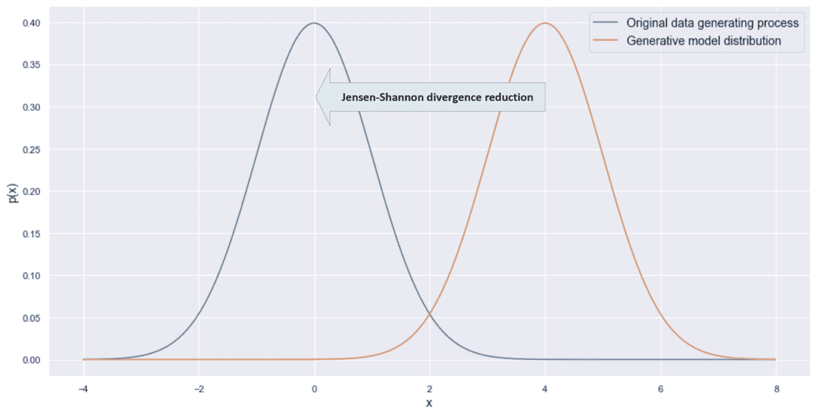

GAN 的目标是将生成的模型分布朝`p_data`方向移动，以尝试使重叠最大化

初始分布通常与目标分布完全不同； 因此，GAN 必须同时调整形状并将其移向`p_data`。 重叠完成后，Jensen-Shannon 散度达到最小值，并且优化完成。 但是，正如我们将在下一节中讨论的那样，由于 Jensen-Shannon 散度的特性，此过程并不总是如此平稳地运行，并且 GAN 可以达到次理想的极小值，离期望的最终配置很远。


# 模式崩溃


给定一个概率分布，最常出现的值（在离散情况下）或对应于概率密度函数最大值的值（在连续情况下）称为**模式**。 如果考虑后一种情况，则其 PDF 具有单个最大值的分布称为**单峰**。 当有两个局部极大值时，称为**双峰**，等（通常，当存在多个众数时，分布简称为**多峰**）。 以下屏幕快照显示了两个示例：


单峰（左）和双峰（右）分布的示例

当处理复杂的数据集时，我们无法轻松地估计模式数量。 但是，可以合理地假设数据生成过程是多模式的。 有时，当样本基于共同的结构时，可以有一个主导模式和几个次要模式。 但是通常，如果样本在结构上不同，则具有单一模式的可能性非常低（当然，如果对相同基本元素进行少量修改，则可能具有单一模式，但这不是要考虑的有效情况） 帐户）。

现在，让我们想象一下我们正在处理人脸图片的多模式分布（例如下一节将要讨论的示例中的人脸图片）。 模式的内容是什么？ 很难精确地回答这个问题，但是很容易理解，对应于最大数据生成过程的人脸应该包含数据集中最常见的元素（例如，如果 80% 的人留着胡须 ，我们可以合理地假设该模式将包含它）。

我们在使用 GAN 时面临的最著名，最棘手的问题之一就是**模式崩溃**，它涉及到次优的最终配置，其中生成器冻结在某个模式附近，并不断提供输出。 发生这种情况的原因非常难以分析（实际上，只有理论），但是我们可以理解如果重新考虑 minimax 游戏，为什么会发生这种情况。 当我们要训练两个不同的分量时，即使保证了纳什均衡，在几次迭代之后，对于最常见的模式，判别器也会变得非常有选择性。 当然，当训练生成器以欺骗判别器时，实现此目标的最简单方法是简单地避免所有采样远离模式。 这种行为增加了判别器的选择性，并创建了一个反馈过程，使 GAN 陷入只有数据生成过程只有一小部分区域的状态。

在梯度方面，判别器提供的用于优化生成器的信息很快变得非常稀缺，因为最常见的样本不需要任何调整。 另一方面，当生成器开始避免所有`p(x)`不接近最大值的样本时，它们不会将判别器暴露给新的，可能有效的样本，因此梯度将保持很小，直到消失为零。 不幸的是，没有可以用来避免此问题的全局策略，但是在本章中，我们将讨论一种建议的方法，以减轻模式崩溃（WGAN）的风险。 特别是，我们将把注意力集中在 Jensen-Shannon 发散的局限性上，在某些情况下，由于没有大的梯度，这可能导致 GAN 达到次优配置。 在本简介中，重要的是，不熟悉这些模型的读者应意识到风险，并能够在发生模式崩溃时识别出它。

此时，我们可以继续进行实际操作，并使用 TensorFlow 建模真实的 GAN。


# 深度卷积 GAN 的示例


现在，我们可以基于《使用深度卷积生成对抗网络的无监督表示学习》和 Olivetti faces 数据集，该数据集足够小以允许进行快速训练。

让我们首先加载数据集并标准化范围`(-1, 1)`中的值，如下所示：

```py
from sklearn.datasets import fetch_olivetti_faces

faces = fetch_olivetti_faces(shuffle=True, random_state=1000)

X_train = faces['images']
X_train = (2.0 * X_train) - 1.0

width = X_train.shape[1]
height = X_train.shape[2]
```

以下屏幕快照显示了一些示例面孔：


从 Olivetti 人脸数据集中抽取的人脸样本

即使所有脸部的结构都相似，但眼睛（戴或不戴眼镜），鼻子和嘴巴的形状也存在细微差别。 而且，有些人留着胡须，表情却大不相同（微笑，严肃，盯着相机远处的东西，等等）。 因此，我们需要期待多峰分布，可能具有对应于平均面部结构的主要模式，以及对应于具有特定，共同特征的子集的其他几种模式。

此时，我们可以定义主要常量，如下所示：

```py
nb_samples = 400
code_length = 512
nb_epochs = 500
batch_size = 50
nb_iterations = int(nb_samples / batch_size)
```

有`400` 64×64 灰度样本（每个样本对应 4,096 个分量）。 在此示例中，我们选择采用具有`512`分量的噪声代码向量，并以`50`个样本批量训练`500`时期的模型。 这样的值不是基于黄金规则的，因为（尤其是对于 GAN）几乎不可能知道哪个设置会产生最佳结果。 因此，与往常一样，我强烈建议在做出决定之前检查不同的超参数集。

当训练过程不太长时，可以使用一组统一采样的超参数（例如批大小属于`{20, 50, 100, 200}`）检查生成器和判别器的平均损失。 例如，如果某个最佳值似乎在范围`(50, 100)`内，那么一个好的策略是提取一些随机值并重新训练模型。 可以重复进行此过程，直到采样值之间的差异可以忽略不计为止。 当然，考虑到这些模型的复杂性，只有使用专用硬件（即多个 GPU 或 TPU）才能进行彻底的搜索。 因此，另一个建议是从经过测试的配置开始（即使上下文不同），并进行小的修改，以便针对特定任务优化它们。 在此示例中，我们根据原始论文设置了许多值，但是我邀请读者在自定义更改后重新运行代码并观察差异。

现在，我们可以基于以下结构为生成器定义 DAG：

*   具有 1,024 个`4×4`过滤器的 2D 卷积，步幅为`(1, 1)`，有效填充和线性输出
*   批量标准化和 LReLU 激活（当输入值为负时，性能更高；实际上，当`x < 0`时，标准 ReLU 的梯度为零，而 LReLU 的常数较小） 允许稍微修改的渐变）
*   带有`(2, 2)`步幅，相同填充和线性输出的 512 个`4×4`滤波器的 2D 卷积
*   批量标准化和泄漏的 ReLU 激活
*   256 个`4×4`滤波器的 2D 卷积，步幅为`(2, 2)`，相同填充，以及线性输出
*   批量标准化和泄漏的 ReLU 激活
*   具有 128 个`4×4`过滤器的 2D 卷积，步幅为`(2, 2)`，相同填充，以及线性输出
*   批量标准化和泄漏的 ReLU 激活
*   具有 1 个`4×4`滤波器的 2D 卷积，步幅为`(2, 2)`，相同填充，以及双曲正切输出

以下代码段显示了生成器的代码：

```py
import tensorflow as tf

def generator(z, is_training=True):
    with tf.variable_scope('generator'):
        conv_0 = tf.layers.conv2d_transpose(inputs=z,
                                            filters=1024,
                                            kernel_size=(4, 4),
                                            padding='valid')

        b_conv_0 = tf.layers.batch_normalization(inputs=conv_0, training=is_training)

        conv_1 = tf.layers.conv2d_transpose(inputs=tf.nn.leaky_relu(b_conv_0),
                                            filters=512,
                                            kernel_size=(4, 4),
                                            strides=(2, 2),
                                            padding='same')

        b_conv_1 = tf.layers.batch_normalization(inputs=conv_1, training=is_training)

        conv_2 = tf.layers.conv2d_transpose(inputs=tf.nn.leaky_relu(b_conv_1),
                                            filters=256,
                                            kernel_size=(4, 4),
                                            strides=(2, 2),
                                            padding='same')

        b_conv_2 = tf.layers.batch_normalization(inputs=conv_2, training=is_training)

        conv_3 = tf.layers.conv2d_transpose(inputs=tf.nn.leaky_relu(b_conv_2),
                                            filters=128,
                                            kernel_size=(4, 4),
                                            strides=(2, 2),
                                            padding='same')

        b_conv_3 = tf.layers.batch_normalization(inputs=conv_3, training=is_training)

        conv_4 = tf.layers.conv2d_transpose(inputs=tf.nn.leaky_relu(b_conv_3),
                                            filters=1,
                                            kernel_size=(4, 4),
                                            strides=(2, 2),
                                            padding='same')

        return tf.nn.tanh(conv_4)
```

该代码很简单，但是有助于阐明对变量范围上下文的需要（通过命令`tf.variable_scope('generator')`定义）。 由于我们需要以其他方式训练模型，因此在优化生成器时，仅必须更新其变量。 因此，我们在命名范围内定义了所有层，从而允许强制优化器仅工作所有可训练变量的子集。

判别器的 DAG 基于以下对称结构：

*   具有`(2, 2)`步幅的 128`4×4`个滤波器的 2D 卷积，相同填充，以及泄漏的 ReLU 输出
*   256 个`4×4`滤波器的 2D 卷积，步幅为`(2, 2)`，相同填充，以及线性输出
*   批量标准化和泄漏的 ReLU 激活
*   带有 512 个`4×4`滤波器的 2D 卷积，步幅为`(2, 2)`，相同填充，以及线性输出
*   批量标准化和泄漏的 ReLU 激活
*   具有 1,024`4×4`滤波器的 2D 卷积，步幅为`(2, 2)`，相同填充，以及线性输出
*   批量标准化和泄漏的 ReLU 激活
*   具有 1 个`4×4`过滤器的 2D 卷积，步幅为`(2, 2)`，有效填充，以及线性输出（预期输出为 sigmoid，可以表示一个概率，但是我们将直接在损失函数内部执行此变换）

判别器的代码为，如下所示：

```py
import tensorflow as tf

def discriminator(x, is_training=True, reuse_variables=True):
    with tf.variable_scope('discriminator', reuse=reuse_variables):
        conv_0 = tf.layers.conv2d(inputs=x,
                                  filters=128,
                                  kernel_size=(4, 4),
                                  strides=(2, 2),
                                  padding='same')

        conv_1 = tf.layers.conv2d(inputs=tf.nn.leaky_relu(conv_0),
                                  filters=256,
                                  kernel_size=(4, 4),
                                  strides=(2, 2),
                                  padding='same')

        b_conv_1 = tf.layers.batch_normalization(inputs=conv_1, training=is_training)

        conv_2 = tf.layers.conv2d(inputs=tf.nn.leaky_relu(b_conv_1),
                                  filters=512,
                                  kernel_size=(4, 4),
                                  strides=(2, 2),
                                  padding='same')

        b_conv_2 = tf.layers.batch_normalization(inputs=conv_2, training=is_training)

        conv_3 = tf.layers.conv2d(inputs=tf.nn.leaky_relu(b_conv_2),
                                  filters=1024,
                                  kernel_size=(4, 4),
                                  strides=(2, 2),
                                  padding='same')

        b_conv_3 = tf.layers.batch_normalization(inputs=conv_3, training=is_training)

        conv_4 = tf.layers.conv2d(inputs=tf.nn.leaky_relu(b_conv_3),
                                  filters=1,
                                  kernel_size=(4, 4),
                                  padding='valid')

        return conv_4
```

同样，在这种情况下，我们需要声明一个专用的变量作用域。 但是，由于区分符在两个不同的上下文中使用（即，对真实样本和生成样本的评估），我们需要在第二个声明中要求重用变量。 如果未设置此类标志，则对函数的每次调用都会产生新的变量集，对应于不同的标识符。

声明了两个主要组件后，我们可以初始化图形并为 GAN 设置整个 DAG，如下所示：

```py
import tensorflow as tf

graph = tf.Graph()

with graph.as_default():
    input_x = tf.placeholder(tf.float32, shape=(None, width, height, 1))
    input_z = tf.placeholder(tf.float32, shape=(None, code_length))
    is_training = tf.placeholder(tf.bool)

    gen = generator(z=tf.reshape(input_z, (-1, 1, 1, code_length)), is_training=is_training)

    discr_1_l = discriminator(x=input_x, is_training=is_training, reuse_variables=False)
    discr_2_l = discriminator(x=gen, is_training=is_training, reuse_variables=True)

    loss_d_1 = tf.reduce_mean(
            tf.nn.sigmoid_cross_entropy_with_logits(labels=tf.ones_like(discr_1_l), logits=discr_1_l))
    loss_d_2 = tf.reduce_mean(
            tf.nn.sigmoid_cross_entropy_with_logits(labels=tf.zeros_like(discr_2_l), logits=discr_2_l))
    loss_d = loss_d_1 + loss_d_2

    loss_g = tf.reduce_mean(
            tf.nn.sigmoid_cross_entropy_with_logits(labels=tf.ones_like(discr_2_l), logits=discr_2_l))

    variables_g = [variable for variable in tf.trainable_variables() if variable.name.startswith('generator')]
    variables_d = [variable for variable in tf.trainable_variables() if variable.name.startswith('discriminator')]

    with tf.control_dependencies(tf.get_collection(tf.GraphKeys.UPDATE_OPS)):
        training_step_d = tf.train.AdamOptimizer(0.0001, beta1=0.5).minimize(loss=loss_d, var_list=variables_d)
        training_step_g = tf.train.AdamOptimizer(0.0005, beta1=0.5).minimize(loss=loss_g, var_list=variables_g)
```

第一块包含占位符的声明。 为了清楚起见，虽然`input_x`和`input_z`的目的很容易理解，但`is_training`可能不太明显。 此布尔值标志的目的是允许在生产阶段禁用批量标准化（必须仅在训练阶段有效）。 下一步包括声明生成器和两个判别器（它们在形式上是相同的，因为变量是共享的，但是其中一个被提供了真实的样本，而另一个必须评估生成器的输出）。 然后，是时候定义损失函数了，它是基于一种可以加快计算速度并增加数值稳定性的技巧。

函数`tf.nn.sigmoid_cross_entropy_with_logits()`接受对率（这就是为什么我们没有将 Sigmoid 变换直接应用于判别器输出的原因），并允许我们执行以下向量计算：

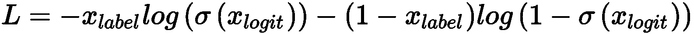

因此，由于`loss_d_1`是真实样本的损失函数，因此我们使用运算符`tf.ones_like()`将所有标签设置为 1； 因此，S 形交叉熵的第二项变为零，结果如下：

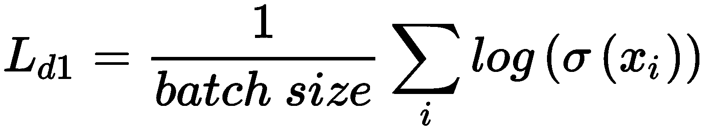

相反，`loss_d_2`恰好需要 S 型交叉熵的第二项。 因此，我们将所有标签设置为零，以获得损失函数：

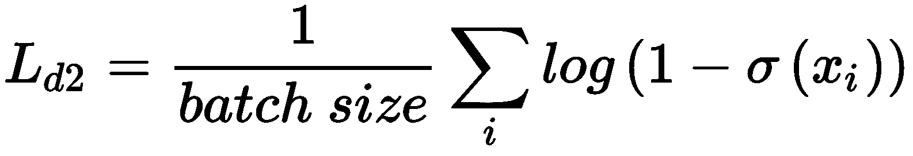

相同的概念适用于生成器损失函数。 下一步需要定义两个 Adam 优化器。 如前所述，我们需要隔离变量以进行隔行训练。 因此，`minimize()`函数现在被提供了损失和必须更新的变量集。 TensorFlow 官方文档中建议使用上下文声明`tf.control_dependencies(tf.get_collection(tf.GraphKeys.UPDATE_OPS))`，只要采用批量标准化，其目标是仅在计算均值和方差之后才允许执行训练步骤（有关此技术的更多详细信息，请检查原始论文：《批量标准化：通过减少内部协变量移位》。

此时，我们可以创建一个会话并初始化所有变量，如下所示：

```py
import tensorflow as tf

session = tf.InteractiveSession(graph=graph)
tf.global_variables_initializer().run()
```

一旦一切准备就绪，就可以开始训练过程。 以下代码片段显示了对判别器和生成器进行交替训练的代码：

```py
import numpy as np

samples_range = np.arange(nb_samples)

for e in range(nb_epochs):
    d_losses = []
    g_losses = []

    for i in range(nb_iterations):
        Xi = np.random.choice(samples_range, size=batch_size)
        X = np.expand_dims(X_train[Xi], axis=3)
        Z = np.random.uniform(-1.0, 1.0, size=(batch_size, code_length)).astype(np.float32)

        _, d_loss = session.run([training_step_d, loss_d],
                                    feed_dict={
                                        input_x: X,
                                        input_z: Z,
                                        is_training: True
                                    })
        d_losses.append(d_loss)

        Z = np.random.uniform(-1.0, 1.0, size=(batch_size, code_length)).astype(np.float32)

        _, g_loss = session.run([training_step_g, loss_g],
                                    feed_dict={
                                        input_x: X,
                                        input_z: Z,
                                        is_training: True
                                        })

        g_losses.append(g_loss)

    print('Epoch {}) Avg. discriminator loss: {} - Avg. generator loss: {}'.format(e + 1, np.mean(d_losses), np.mean(g_losses)))
```

在这两个步骤中，我们为网络提供一批真实的图像（在生成器优化期间不会使用）和统一采样的代码`Z`，其中每个分量为`z[i] ~ U(-1, 1)`。 为了减轻模式崩溃的风险，我们将在每次迭代开始时对集合进行洗牌。 这不是一个可靠的方法，但是至少可以确保避免可能导致 GAN 达到次优配置的相互关系。

在训练过程结束时，我们可以生成一些样本面孔，如下所示：

```py
import numpy as np

Z = np.random.uniform(-1.0, 1.0, size=(20, code_length)).astype(np.float32)

Ys = session.run([gen],
                 feed_dict={
                     input_z: Z,
                     is_training: False
                 })

Ys = np.squeeze((Ys[0] + 1.0) * 0.5 * 255.0).astype(np.uint8)
```

结果显示在以下屏幕截图中：


DCGAN 生成的样本人脸

可以看到，质量非常高，较长的训练阶段会有所帮助（以及更深的超参数搜索）。 但是，GAN 已成功学习了如何通过使用同一组属性来生成新面孔。 表达式和视觉元素（例如，眼睛的形状，眼镜的存在等）都重新应用于不同的模型，以便产生从相同原始数据生成过程中绘制的潜在面孔。 例如，第七名和第八名基于具有修改属性的一个人。 原始图片如下：


对应于 Olivetti 人之一的原始图片

嘴的结构对于两个生成的样本都是相同的，但是从第二个样本来看，我们可以确认已经从其他样本中提取了许多元素（鼻子，眼睛，前额和方向），从而产生了不存在的人。 即使模型正常工作，也会出现部分模式崩溃，因为某些面孔（具有其相对属性，例如眼镜）比其他面孔更常见。 相反，一些女性面孔（数据集中的少数）已与男性属性合并，从而产生了样本，例如包含所生成样本的图像的第一行的第二个或底部行的第八个。 作为练习，我邀请读者使用不同的参数和其他数据集（包含灰度和 RGB 图像，例如 Cifar-10 或 STL-10）来重新训练模型。

The screenshots that are shown in this and other examples in this chapter are often based on random generations; therefore, in order to increase the reproducibility, I suggest setting both the NumPy and TensorFlow random seed equal to `1000`. The commands are: `np.random.seed(1000)` and `tf.set_random_seed(1000)`.


# Wasserstein GAN


给定概率分布`p(x)`，集合`D[p] = {x: p(x) > 0}`被称为**支撑** 。 如果`p(x)`和`q(x)`的两个分布具有脱节的支撑（即`D[p] ∩ D[q] = {∅}`），詹森-香农散度等于`log(2)`。 这意味着渐变为零，并且无法进行任何校正。 在涉及 GAN 的一般情况下， `p[g](x)`和`p_data`完全不可能重叠（ 但是，您可以期望有最小的重叠）； 因此，梯度很小，权重的更新也很小。 这样的问题可能会阻止训练过程，并使 GAN 陷入无法逃避的次优配置状态。 因此， Arjovsky，Chintala 和 Bottou （在《Wasserstein GAN》中）基于称为 **Wasserstein 距离**的更稳健的差异度量，提出了一个略有不同的模型。（或“地球移动者”的距离）：

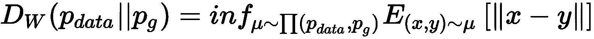

为了理解前面的公式，必须说`∏(p_data, p[g])`是包含所有可能的联合分布的集合。 数据生成过程和生成器分布。 因此，Wasserstein 距离等于范数`||x - y||`的期望值的最小值。假设一对`(x, y)`是分布`μ ~ ∏(p_data, p[g])`。 即使这个概念很简单，这种定义也不是很直观，并且可以通过考虑两个二维 Blob（其距离是两个最近点之间的距离）来概括。 显然，支撑支点不相交的问题已被完全克服，此外，度量也与实际分布距离成比例。 不幸的是，我们没有使用有限集。 因此，Wasserstein 距离的计算可能非常低效，并且几乎不可能用于现实生活中的任务。 但是， **Kantorovich-Rubinstein 定理**（由于超出了本书的范围，因此未进行全面分析）使我们可以通过使用特殊的支持函数`f(x)`来简化表达式：


该定理施加的主要约束是`f(x)`必须是 L-Lipschitz 函数，也就是说，给定非负常数`L`，则适用 ：


考虑使用神经网络参数化的函数`f(·)`，全局目标变为：

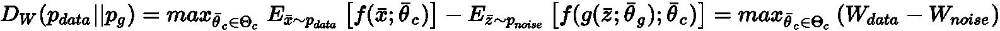

在这种特定情况下，区分符通常被称为批判者，因此`f(x; θ[c])`扮演着这个角色。 由于这样的函数必须是 L-Lipschitz，因此作者建议在应用校正后就剪切所有变量`$1[$2]`：


该方法不是非常有效，因为它会减慢学习过程。 但是，当函数执行一组有限变量的操作时，假定输出始终受常数约束，并且可以应用 Kantorovich-Rubinstein 定理。 当然，由于参数化通常需要许多变量（有时数百万或更多），因此裁剪常数应保持很小（例如 0.01）。 此外，由于剪辑的存在会影响批判者的训练速度，因此也有必要在每次迭代中增加批判者训练步骤的数量（例如，批判者 5 次，生成器 1 次，依此类推。 ）。


# 将 DCGAN 转变为 WGAN


在此示例中，我们将使用 Fashion MNIST 数据集（由 Keras 直接提供）基于 Wasserstein 距离实现 DCGAN。 该集合由 60,000 张 28×28 灰度的衣服图像组成，由 Zalando 引入，以替代标准 MNIST 数据集，该数据集的类别太容易被许多分类器分离。 考虑到此类网络所需的训练时间，我们决定将过程限制为 5,000 个样本，但是拥有足够资源的读者可以选择增加或消除此限制。

第一步包括加载，切片和规范化数据集（在`(-1, 1)`范围内），如下所示：

```py
import numpy as np

from keras.datasets import fashion_mnist

nb_samples = 5000

(X_train, _), (_, _) = fashion_mnist.load_data()
X_train = X_train.astype(np.float32)[0:nb_samples] / 255.0
X_train = (2.0 * X_train) - 1.0

width = X_train.shape[1]
height = X_train.shape[2]
```

以下屏幕快照显示了一些示例：


从 Fashion MNIST 数据集中提取的样本

现在，我们可以基于 DCGAN 的同一层定义生成器 DAG，如下所示：

*   具有 1,024 个`4×4`滤波器的 2D 卷积，步幅为`(1, 1)`，有效填充，以及线性输出
*   批量标准化和 LReLU 激活
*   带有 512 个`4×4`滤波器的 2D 卷积，步幅为`(2, 2)`，相同填充，以及线性输出
*   批量标准化和泄漏的 ReLU 激活
*   256 个`4×4`滤波器的 2D 卷积，步幅为`(2, 2)`，相同填充，以及线性输出
*   批量标准化和泄漏的 ReLU 激活
*   具有 128 个`4×4`滤波器的 2D 卷积，步幅为`(2, 2)`，相同填充，以及线性输出
*   批量标准化和泄漏的 ReLU 激活
*   具有 1 个`4×4`滤波器的 2D 卷积，步幅为`(2, 2)`，相同填充，以及双曲正切输出

该代码显示在以下代码片段中：

```py
import tensorflow as tf

def generator(z, is_training=True):
    with tf.variable_scope('generator'):
        conv_0 = tf.layers.conv2d_transpose(inputs=z,
                                            filters=1024,
                                            kernel_size=(4, 4),
                                            padding='valid')

        b_conv_0 = tf.layers.batch_normalization(inputs=conv_0, training=is_training)

        conv_1 = tf.layers.conv2d_transpose(inputs=tf.nn.leaky_relu(b_conv_0),
                                            filters=512,
                                            kernel_size=(4, 4),
                                            strides=(2, 2),
                                            padding='same')

        b_conv_1 = tf.layers.batch_normalization(inputs=conv_1, training=is_training)

        conv_2 = tf.layers.conv2d_transpose(inputs=tf.nn.leaky_relu(b_conv_1),
                                            filters=256,
                                            kernel_size=(4, 4),
                                            strides=(2, 2),
                                            padding='same')

        b_conv_2 = tf.layers.batch_normalization(inputs=conv_2, training=is_training)

        conv_3 = tf.layers.conv2d_transpose(inputs=tf.nn.leaky_relu(b_conv_2),
                                            filters=128,
                                            kernel_size=(4, 4),
                                            strides=(2, 2),
                                            padding='same')

        b_conv_3 = tf.layers.batch_normalization(inputs=conv_3, training=is_training)

        conv_4 = tf.layers.conv2d_transpose(inputs=tf.nn.leaky_relu(b_conv_3),
                                            filters=1,
                                            kernel_size=(4, 4),
                                            strides=(2, 2),
                                            padding='same')

        return tf.nn.tanh(conv_4)
```

评论者的 DAG 基于以下几组：

*   具有`(2, 2)`步幅的 128`4×4`个滤波器的 2D 卷积，相同填充，以及泄漏的 ReLU 输出
*   256 个`4×4`滤波器的 2D 卷积，步幅为`(2, 2)`，相同填充，以及线性输出
*   批量标准化和泄漏的 ReLU 激活
*   带有 512 个`4×4`滤波器的 2D 卷积，步幅为`(2, 2)`，相同填充，以及线性输出
*   批量标准化和泄漏的 ReLU 激活
*   具有 1,024`4×4`滤波器的 2D 卷积，步幅为`(2, 2)`，相同填充，以及线性输出
*   批量标准化和泄漏的 ReLU 激活
*   具有 1 个`4×4`过滤器的 2D 卷积，步幅为`(2, 2)`，有效填充和线性输出

相应的代码块为，如下所示：

```py
import tensorflow as tf

def critic(x, is_training=True, reuse_variables=True):
    with tf.variable_scope('critic', reuse=reuse_variables):
        conv_0 = tf.layers.conv2d(inputs=x,
                                  filters=128,
                                  kernel_size=(4, 4),
                                  strides=(2, 2),
                                  padding='same')

        conv_1 = tf.layers.conv2d(inputs=tf.nn.leaky_relu(conv_0),
                                  filters=256,
                                  kernel_size=(4, 4),
                                  strides=(2, 2),
                                  padding='same')

        b_conv_1 = tf.layers.batch_normalization(inputs=conv_1, training=is_training)

        conv_2 = tf.layers.conv2d(inputs=tf.nn.leaky_relu(b_conv_1),
                                  filters=512,
                                  kernel_size=(4, 4),
                                  strides=(2, 2),
                                  padding='same')

        b_conv_2 = tf.layers.batch_normalization(inputs=conv_2, training=is_training)

        conv_3 = tf.layers.conv2d(inputs=tf.nn.leaky_relu(b_conv_2),
                                  filters=1024,
                                  kernel_size=(4, 4),
                                  strides=(2, 2),
                                  padding='same')

        b_conv_3 = tf.layers.batch_normalization(inputs=conv_3, training=is_training)

        conv_4 = tf.layers.conv2d(inputs=tf.nn.leaky_relu(b_conv_3),
                                  filters=1,
                                  kernel_size=(4, 4),
                                  padding='valid')

        return conv_4
```

由于与 DCGAN 没有特别的区别，因此无需添加其他注释。 因此，我们可以继续进行图的定义和整体 DAG ，如下所示：

```py
import tensorflow as tf

nb_epochs = 100
nb_critic = 5
batch_size = 64
nb_iterations = int(nb_samples / batch_size)
code_length = 100

graph = tf.Graph()

with graph.as_default():
    input_x = tf.placeholder(tf.float32, shape=(None, width, height, 1))
    input_z = tf.placeholder(tf.float32, shape=(None, code_length))
    is_training = tf.placeholder(tf.bool)

    gen = generator(z=tf.reshape(input_z, (-1, 1, 1, code_length)), is_training=is_training)

    r_input_x = tf.image.resize_images(images=input_x, size=(64,64),    
                                       method=tf.image.ResizeMethod.BICUBIC)

     crit_1_l = critic(x=r_input_x, is_training=is_training, reuse_variables=False)
     crit_2_l = critic(x=gen, is_training=is_training, reuse_variables=True)

     loss_c = tf.reduce_mean(crit_2_l - crit_1_l)
     loss_g = tf.reduce_mean(-crit_2_l)

     variables_g = [variable for variable in tf.trainable_variables() 
                     if variable.name.startswith('generator')]
     variables_c = [variable for variable in tf.trainable_variables() 
                     if variable.name.startswith('critic')]

     with tf.control_dependencies(tf.get_collection(tf.GraphKeys.UPDATE_OPS)):
         optimizer_c = tf.train.AdamOptimizer(0.00005, beta1=0.5, beta2=0.9).\
                             minimize(loss=loss_c, var_list=variables_c)

         with tf.control_dependencies([optimizer_c]):
             training_step_c = tf.tuple(tensors=[
                                     tf.assign(variable, tf.clip_by_value(variable, -0.01, 0.01))
                                                             for variable in variables_c])

         training_step_g = tf.train.AdamOptimizer(0.00005, beta1=0.5, beta2=0.9).\
                                  minimize(loss=loss_g, var_list=variables_g)
```

通常，第一步是声明占位符，该占位符与 DCGAN 相同。 但是，由于已经针对 64×64 图像优化了模型（特别是卷积或转置卷积的序列），因此我们将使用`tf.image.resize_images()`方法来调整原始样本的大小。 此操作将导致有限的质量损失； 因此，在生产应用程序中，我强烈建议您使用针对原始输入尺寸优化的模型。 在生成器和注释器都声明之后（如我们在上一个示例中讨论的那样，由于需要分别优化损失函数，因此我们需要两个实例共享相同的变量），我们可以设置损失。 在这种情况下，它们的计算非常简单且快速，但是我们为此付出了代价，并为此网络可以应用更小的校正。 实际上，在这种情况下，我们并没有直接最小化批评者损失函数； 相反，我们首先使用算子`optimizer_c`计算并应用梯度，然后使用算子`training_step_c`裁剪所有评论者变量。 因为我们只想调用此运算符，所以已在使用指令`tf.control_dependencies([optimizer_c])`定义的上下文中声明了它。 这样，当请求一个会话来计算`traning_step_c`时，TensorFlow 将注意首先运行`optimizer_c`，但是只有在结果准备好后，才会执行 main 命令（简单地裁剪变量）。 正如我们在理论中所解释的那样，此步骤对于保证评论者仍然具有 L-Lipschitz 函数是必要的，因此，允许使用从 Kantorovich-Rubinstein 定理得到的简化 Wasserstein 距离表达式。

当图形完全定义后，可以创建一个会话并初始化所有变量，如下所示：

```py
import tensorflow as tf

session = tf.InteractiveSession(graph=graph)
tf.global_variables_initializer().run()
```

现在，所有组件都已设置好，我们准备开始训练过程，该过程分为批注者训练步骤的`nb_critic`（在我们的情况下为五次）迭代和生成器训练步骤的一次执行，如下：

```py
import numpy as np

samples_range = np.arange(X_train.shape[0])

for e in range(nb_epochs):
    c_losses = []
    g_losses = []

    for i in range(nb_iterations):
        for j in range(nb_critic):
            Xi = np.random.choice(samples_range, size=batch_size)
            X = np.expand_dims(X_train[Xi], axis=3)
            Z = np.random.uniform(-1.0, 1.0, size=(batch_size, code_length)).astype(np.float32)

            _, c_loss = session.run([training_step_c, loss_c],
                                        feed_dict={
                                            input_x: X,
                                            input_z: Z,
                                            is_training: True
                                        })
            c_losses.append(c_loss)

        Z = np.random.uniform(-1.0, 1.0, size=(batch_size, code_length)).astype(np.float32)

        _, g_loss = session.run([training_step_g, loss_g],
                                    feed_dict={
                                        input_x: np.zeros(shape=(batch_size, width, height, 1)),
                                        input_z: Z,
                                        is_training: True
                                    })

        g_losses.append(g_loss)

    print('Epoch {}) Avg. critic loss: {} - Avg. generator loss: {}'.format(e + 1,
                                                                            np.mean(c_losses),
                                                                            np.mean(g_losses)))
```

在此过程结束时（可能会很长，尤其是在没有任何 GPU 支持的情况下可能会很长），为了获得视觉确认，我们可以再次生成一些示例，如下所示：

```py
import numpy as np

Z = np.random.uniform(-1.0, 1.0, size=(30, code_length)).astype(np.float32)

Ys = session.run([gen],
                  feed_dict={
                      input_z: Z,
                      is_training: False
                  })

Ys = np.squeeze((Ys[0] + 1.0) * 0.5 * 255.0).astype(np.uint8)
```

结果显示在以下屏幕截图中：

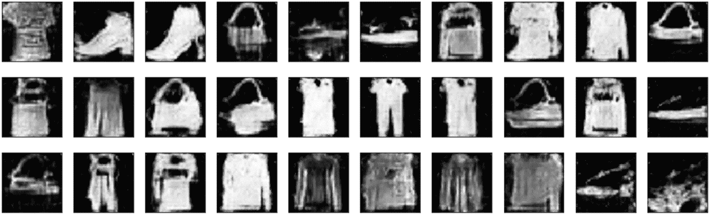

WGAN 生成的样本

可以看到，WGAN 已收敛到合理的最终配置。 图像质量受尺寸调整操作的强烈影响； 但是，有趣的是，生成的样本平均比原始样本要复杂。 例如，衣服的质地和形状受其他因素（例如，包和鞋子）的影响，结果是模型不规则，新颖样本数量增加。 但是，与 Olivetti 人脸数据集相反，在这种情况下，很难理解样本是否由异质属性的混合物组成，因为数据生成过程（例如标准 MNIST）具有至少 10 种原始的类。

WGAN 不会陷入模式崩溃，但是不同区域的强烈分离使模型无法轻松合并元素，正如我们在面部观察到的那样。 作为练习，我邀请读者对 Olivetti 人脸数据集重复该示例，找到最佳的超参数配置，并将结果与​​标准 DCGAN 获得的结果进行比较。


# 自组织图


自组织映射是 Willshaw 和 Von Der Malsburg 首次提出的模型（在《如何通过自组织建立模式化的神经连接》中），目的是找到一种描述大脑中发生的不同现象的方法。 实际上，他们观察到许多动物的大脑的某些区域可以发展出内部组织的结构，这些结构的子组件相对于特定的输入模式（例如，某些视觉皮层区域对垂直或水平带非常敏感）可以选择性地接受。 SOM 的中心思想可以通过考虑聚类过程来综合，该聚类过程旨在找出样本的低级属性，这要归功于其对聚类的分配。 主要的实际差异是，在 SOM 中，单个单元通过称为**赢家通吃**的学习过程，成为一部分样本总体（即数据生成过程的区域）的代表。 。 这样的训练过程首先是引起所有单元（我们将其称为神经元）的响应并增强所有权重，然后通过减小最活跃单元周围的影响区域来进行，直到单个单元成为唯一的响应神经元为止。 给定输入模式。

下图综合了该过程：

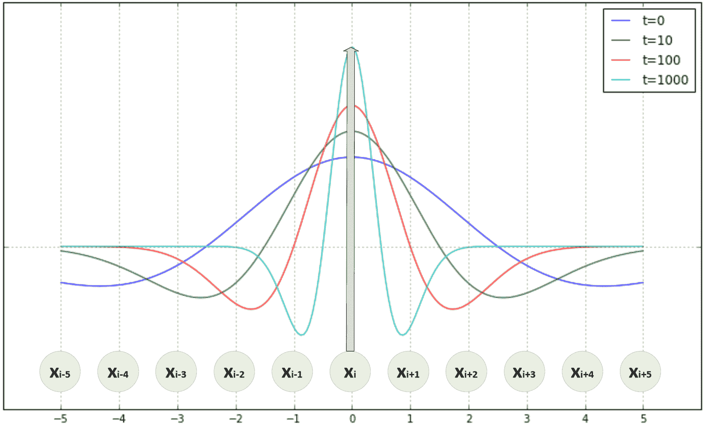

SOM 开发的墨西哥帽选择性

在初始步骤中，许多单元会响应相同的输入模式，但是我们已经可以观察到`x[i]`附近的优势。 但是，立即选择此设备可能会导致收敛过早，从而导致准确性下降。 这就是为什么获胜单位周围的半径逐渐减小的原因（观察到一种称为**墨西哥帽**的现象，因为其形状特殊）。 当然，在此过程中，最初的获胜单位无法保持稳定； 因此，重要的是要避免半径的快速减小，以免引起其他潜在单位被引出。 当呈现特定模式时，当神经元保持最活跃时，它将被略微转换为实际的赢家，因此，这将花费全部，因为不会再加强任何其他单元。

一些非常著名和有用的 SOM 是 **Kohonen 映射**（首次出现在《拓扑正确特征图的自组织形成》）。 它们的结构像投影到由`N`神经元组成的二维流形（最经典的情况是平坦的二维区域）上的平面一样。 从现在开始，为简单起见，我们将考虑映射到包含`k×p`单位的矩阵的曲面，每个曲面均使用突触权重`w[ij] ∈ R^n`进行建模 （尺寸与输入模式相同，`x[i] ∈ R^n`）。 因此，权重矩阵变为`W(i, j) ∈ R^(k×p×n)`。 从实际的角度来看，在此模型中，由于不执行内部转换，因此神经元通过相应的权重向量表示。 当呈现模式`x[i]`时，获胜神经元`n[w]`（作为元组）的确定如下： 使用以下规则：*


训练过程通常分为两个不同的阶段：**调整**和**收敛**。 在调整阶段，更新会扩展到获胜单位的所有邻居，而在后者期间，只会增强权重`W(n[w])`。 但是，平滑而渐进的下降比快速下降更可取； 因此， `n[s](i, j)`的邻域大小的常见选择是基于**径向基函数**（**RBF**）具有指数衰减的方差：

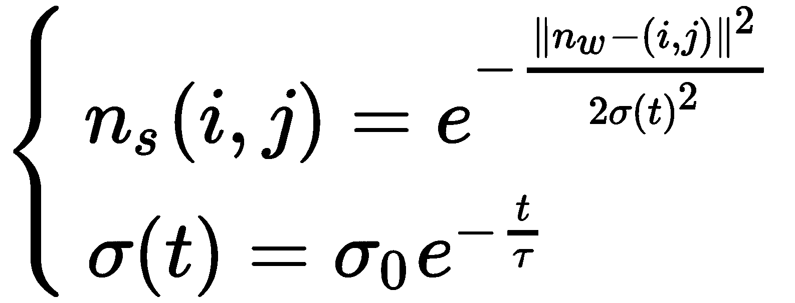

初始方差（与最大邻域成比例）为`x[i]`，并且根据时间常数`τ`呈指数衰减。 根据经验，当`t > 4τ`时，`σ(t) ≈ 0`，因此`τ`应该设置为 1/4 调整阶段的训练时期数：`τ = 0.25•t[adj]`。 一旦定义了邻域，就可以根据它们与每个样本的不相似性来更新所有成员的权重，`x[i]`：


在先前的公式中，学习率`η(t)`也是训练时期的函数，因为最好在早期（尤其是在调整阶段）施加更大的灵活性 ，但最好在收敛阶段设置较小的`η`，以便进行较小的修改。 降低学习率的一个非常常见的选择类似于邻域大小：

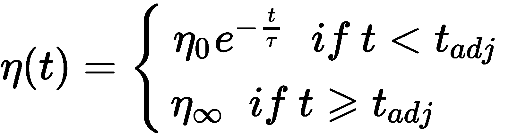

学习规则的作用是迫使获胜单位的权重接近特定模式，因此在训练过程结束时，每个模式都应引起代表一个定义明确的特征集的单个单元的响应。 。 形容词的自组织性源自这种模型必须优化单元的能力，以便使相似的模式彼此靠近（例如，如果竖线引起单元的响应，则稍微旋转的单元应引起单元的响应）。 邻居）。


# Kohonen 地图的示例


在此示例中，我们要训练一个 8×8 正方形 Kohonen 地图以接受 Olivetti 人脸数据集。 由于每个样本都是 64×64 灰度图像，因此我们需要分配一个形状等于（8，8，4,096）的权重矩阵。 训练过程可能会很长； 因此，我们会将地图限制为 100 个随机样本（当然，读者可以自由删除此限制，并使用整个数据集训练模型）。

像往常一样，让我们​​开始加载并规范化数据集，如下所示：

```py
import numpy as np

from sklearn.datasets import fetch_olivetti_faces

faces = fetch_olivetti_faces(shuffle=True)
Xcomplete = faces['data'].astype(np.float64) / np.max(faces['data'])
np.random.shuffle(Xcomplete)
X = Xcomplete[0:100]
```

现在，让我们为距离函数的方差`σ(t)`以及学习率`η(t)`定义指数衰减函数，如下所示[ ：

```py
import numpy as np

eta0 = 1.0 sigma0 = 3.0 tau = 100.0 def eta(t):
 return eta0 * np.exp(-float(t) / tau)

def sigma(t):
 return float(sigma0) * np.exp(-float(t) / tau)
```

在该示例中，我们采用初始学习率`η(0) = 1`，半径方差`σ(0) = 3`* 。 之所以选择时间常数等于 100，是因为我们计划执行 500 个调整迭代和`500`收敛迭代（`1000`总迭代）。 在以下代码段中声明了相应的值：

```py
nb_iterations = 1000 nb_adj_iterations = 500
```

在这一点上，我们可以基于差值`w-x`的 L2 范数定义权重矩阵（初始化为`w[ij] ~ N(0, 0.01)`）和负责计算获胜单位的函数，如下所示：

```py
import numpy as np

pattern_length = 64 * 64 pattern_width = pattern_height = 64  matrix_side = 8 
W = np.random.normal(0, 0.1, size=(matrix_side, matrix_side, pattern_length))

def winning_unit(xt):
    distances = np.linalg.norm(W - xt, ord=2, axis=2)
    max_activation_unit = np.argmax(distances)
    return int(np.floor(max_activation_unit / matrix_side)), max_activation_unit % matrix_side
```

在开始训练周期之前，预先计算距离矩阵`dm(x[0], y[0], x[1], y[1])`，其中每个元素代表`(x[0], y[0])`和`(x[1], y[1])`。 如以下片段所示，此步骤避免了必须确定获胜单位的邻域时的计算开销：

```py
import numpy as np

precomputed_distances = np.zeros((matrix_side, matrix_side, matrix_side, matrix_side))

for i in range(matrix_side):
    for j in range(matrix_side):
        for k in range(matrix_side):
            for t in range(matrix_side):
                precomputed_distances[i, j, k, t] = \
                    np.power(float(i) - float(k), 2) + np.power(float(j) - float(t), 2)

def distance_matrix(xt, yt, sigmat):
    dm = precomputed_distances[xt, yt, :, :]
    de = 2.0 * np.power(sigmat, 2)
    return np.exp(-dm / de)
```

函数`distance_matrix()`计算一个正方形矩阵，该正方形矩阵包含所有以`(xt, yt)`为中心的神经元的指数衰减影响。 现在，我们具有创建训练过程所需的所有构造块，该训练过程基于我们先前描述的权重更新规则，如下所示：

```py
import numpy as np

sequence = np.arange(0, X.shape[0])
t = 0

for e in range(nb_iterations):
    np.random.shuffle(sequence)
    t += 1

    if e < nb_adj_iterations:
        etat = eta(t)
        sigmat = sigma(t)
    else:
        etat = 0.2
        sigmat = 1.0

    for n in sequence:
        x_sample = X[n]

        xw, yw = winning_unit(x_sample)
        dm = distance_matrix(xw, yw, sigmat)

        dW = etat * np.expand_dims(dm, axis=2) * (x_sample - W)
        W += dW

    W /= np.linalg.norm(W, axis=2).reshape((matrix_side, matrix_side, 1))

    if e > 0 and e % 100 == 0:
        print('Training step: {}'.format(t-1))
```

在每个循环中，执行以下步骤：

1.  为了避免相互关联，对输入样本的顺序进行了混洗。
2.  计算学习率和距离方差（收敛值为`η[∞] = 0.2`和`σ[∞] = 1`）。
3.  对于每个样本，适用以下条件：
    1.  计算获胜单位。
    2.  计算距离矩阵。
    3.  计算和应用权重更新。
4.  权重被重新归一化，以避免溢出。

现在，我们可以在训练过程结束时显示权重矩阵，如下所示：


训练过程结束时的 Kohonen 映射权重矩阵

可以看到，每个权重都集中在人脸的通用结构上（因为数据集仅包含这种模式）； 但是，不同的权重已变得对特定的输入属性更敏感。 我建议您开始观察左上脸的元素（例如，眼睛或嘴巴），然后沿终止于中央砝码的螺旋线沿顺时针方向旋转。 这样，很容易看到接收字段中的修改。 作为练习，我邀请读者使用其他数据集（例如 MNIST 或 Fashion MNIST）测试模型，并对最终权重矩阵进行手动标记（例如，考虑到此示例，特定权重可以表示笑脸） 戴着眼镜，大鼻子）。 在标记每个元素之后，可以通过直接提供标记作为输出来投影原始样本并检查哪些神经元更易接受。


# 总结


在本章中，我们介绍了 GAN 的概念，并讨论了 DCGAN 的示例。 这种模型具有通过使用 minimax 游戏中涉及的两个神经网络来学习数据生成过程的能力。 生成器必须学习如何返回与训练过程中使用的其他样本没有区别的样本。 判别者或批评者必须变得越来越聪明，只为有效样本分配高概率。 对抗训练方法的基础是，通过学习如何用具有与真实属性相同的合成样本作弊的方法，迫使生成器与判别器竞争。 同时，生成器被迫通过选择越来越多来与歧视者抗争。 在我们的示例中，我们还分析了一个称为 WGAN 的重要变体，当标准模型无法复制有效样本时可以使用该变体。

SOM 是基于大脑特定区域功能的结构，该结构迫使其特定单元学习输入样本的特定特征。 这样的模型会自动进行自我组织，从而使响应相似模式的单位更加接近。 一旦提供了一个新样本，就足以计算获胜单位，该单位的权重与样本的距离最短； 并且在贴标过程之后，可以立即了解引起响应的特征（例如，垂直线或高级特征，例如是否有眼镜或胡须或脸部形状）。


# 问题


1.  在 GAN 中，生成器和判别器的作用与自编码器中的编码器和解码器相同。 它是否正确？
2.  判别器能否输出`(-1, 1)`范围内的值？
3.  GAN 的问题之一是判别器过早收敛。 这个正确吗？
4.  在 Wasserstein GAN 中，批评家（区分者）在训练阶段是否比生成器慢？
5.  考虑到前面的问题，不同速度的原因是什么？
6.  `U(-1, 0)`和`U(1, 2)`之间的 Jensen-Shannon 散度值是多少？
7.  赢家通吃战略的目标是什么？
8.  SOM 训练过程的调整阶段的目的是什么？


# 进一步阅读


+   `Generative Adversarial Networks, Goodfellow I. J., Pouget-Abadie J., Mirza M., Xu B., Warde-Farley D., Ozair S., Courville A., and Bengio Y., arXiv:1406.2661 [stat.ML]`
+   `Unsupervised Representation Learning with Deep Convolutional Generative Adversarial Networks, Radford A., Metz L., and Chintala S., arXiv:1511.06434 [cs.LG]`
+   `Wasserstein GAN, Arjovsky M., Chintala S., and Bottou L., arXiv:1701.07875 [stat.ML]`
+   `How Patterned Neural Connections Can Be Set Up by Self-Organization, Willshaw, D. J. and Von Der Malsburg, C., Proceedings of the Royal Society of London, B/194, N. 1117, 1976`
+   `Self-Organized Formation of Topologically Correct Feature Maps, Kohonen T., Biological Cybernetics, 43/1, 1982`
+   `Mastering Machine Learning Algorithms, Bonaccorso G., Packt Publishing, 2018`


