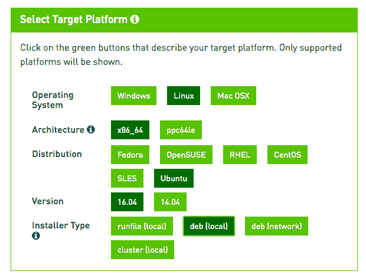
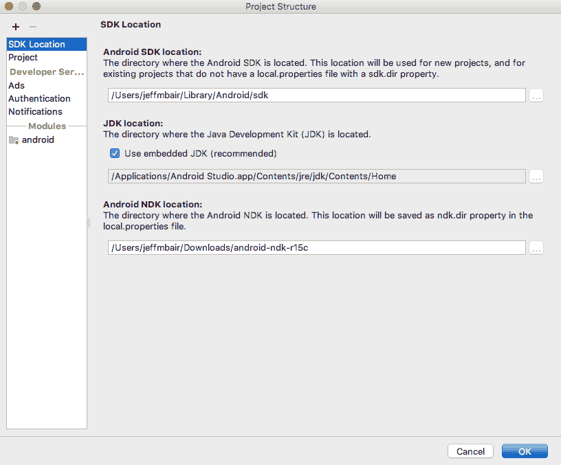

# 移动 TensorFlow 入门


本章介绍如何设置开发环境，以使用 TensorFlow 构建所有 iOS 或 Android 应用程序，本书其余部分对此进行了讨论。 我们不会详细讨论可用于开发的所有受支持的 TensorFlow 版本，OS 版本，Xcode 和 Android Studio 版本，因为可以在 [TensorFlow 网站](http://www.tensorflow.org)或通过 Google。 相反，我们将在本章中简要讨论示例工作环境，以便我们能够快速了解​​可使用该环境构建的所有出色应用程序。

如果您已经安装了 TensorFlow，Xcode 和 Android Studio，并且可以运行和测试示例 TensorFlow iOS 和 Android 应用程序，并且如果您已经安装了 NVIDIA GPU 以进行更快的深度学习模型训练，则可以跳过本章。 或者，您可以直接跳到您不熟悉的部分。

我们将在本章涵盖以下主题（如何设置 Raspberry Pi 开发环境将在第 12 章，“在 Raspberry Pi 上开发 TensorFlow 应用程序”中进行讨论）：

*   设置 TensorFlow
*   设置 Xcode
*   设置 Android Studio
*   TensorFlow Mobile 与 TensorFlow Lite
*   运行示例 TensorFlow iOS 应用
*   运行示例 TensorFlow Android 应用


# 设置 TensorFlow


TensorFlow 是领先的机器智能开源框架。 当 Google 在 2015 年 11 月将 TensorFlow 作为一个开源项目发布时，已经有其他一些类似的深度学习开源框架：Caffe，Torch 和 Theano。 在 5 月 10 日的 Google I/O 2018 上，GitHub 上的 TensorFlow 已达到 99000 星，在 4 个月内增加了 14k 星，而 Caffe 仅增加了 2k 至 24k 星。 两年后，它已经成为最流行的开源框架，用于训练和部署深度学习模型（它对传统机器学习也有很好的支持）。 截至 2018 年 1 月，TensorFlow 在 GitHub 上拥有[近 8.5 万颗星](https://github.com/tensorflow/tensorflow)，而其他三个领先的开源深度学习框架 [Caffe](https://github.com/BVLC/caffe)，[CNTK](https://github.com/Microsoft/CNTK) 和 [Mxnet](https://github.com/apache/incubator-mxnet) 分别拥有 22k，13k 和 12k 颗星。

如果您对机器学习，深度学习，机器智能和人工智能（AI）的流行语有些困惑，这里有个简短的摘要：机器智能和 AI 确实是同一回事。 机器学习是 AI 的一个领域，也是最受欢迎的领域; 深度学习是机器学习的一种特殊类型，也是解决诸如计算机视觉，语音识别和合成以及自然语言处理之类的复杂问题的现代且最有效的方法。 因此，在本书中，当我们说 AI 时，我们主要是指深度学习，这是将AI从漫长的冬天带到夏天的救星。 有关 AI 冬季和深度学习的更多信息，您可以查看[这里](https://en.wikipedia.org/wiki/AI_winter)和[这里](http://www.deeplearningbook.org)。

我们假设您已经对 TensorFlow 有了基本的了解，但是如果您还没有，请查看[入门](https://www.tensorflow.org/get_started)和[教程](https://www.tensorflow.org/tutorials)部分或 [Awesome TensorFlow 教程](https://github.com/jtoy/awesome-tensorflow)。 关于该主题的两本好书是《Python 机器学习：Python ， scikit-learn 和 TensorFlow 机器学习和深度学习》和《使用 Scikit-Learn 和 TensorFlow 动手进行机器学习》。

TensorFlow 可以安装在 MacOS，Ubuntu 或 Windows 上。 我们将介绍在 MacOS X El Capitan（10.11.6），macOS Sierra（10.12.6）和 Ubuntu 16.04 上从源代码安装 TensorFlow 1.4 的步骤。 如果您使用其他操作系统或版本，则可以参考 [TensorFlow 安装文档](https://www.tensorflow.org/install)以获取更多信息。 当您阅读本书时，可能会出现更新的 TensorFlow 版本。 尽管您仍然应该能够使用较新版本运行本书中的代码，但这并不能保证，因此我们在 Mac 和 Ubuntu 上使用 TensorFlow 1.4 发行源代码来设置 TensorFlow； 这样，您可以轻松地测试运行并与书中的应用程序一起玩。

自从我们于 2017 年 12 月撰写以上段落以来，TensorFlow 已有四个新的正式版本（1.5、1.6、1.7和1.8），以及截至 2018 年 5 月的新版本 Xcode（9.3），您可以在[以下位置](https://github.com/tensorflow/tensorflow/releases)下载， 或在 TensorFlow [源代码仓库](https://github.com/tensorflow/tensorflow)。 TensorFlow 的较新版本（例如 1.8）默认情况下支持 NVIDIA CUDA 和 cuDNN 的较新版本（有关详细信息，请参阅“在 Ubuntu 上设置基于 GPU 的 TensorFlow”部分），并且最好遵循官方的 TensorFlow 文档来安装具有 GPU 支持的最新 TensorFlow 版本。 在本章及以下各章中，我们将以特定的 TensorFlow 版本为例，但将对所有 iOS，Android 和 Python 代码进行测试，并在需要时针对其中的最新 TensorFlow，Xcode 和 Android Studio 版本进行更新。 本书的源代码仓库位于[这里](https://github.com/jeffxtang/mobiletfbook)。

总体而言，我们将在 Mac 上使用 TensorFlow 开发 iOS 和 Android TensorFlow 应用程序，并在 Ubuntu 上使用 TensorFlow 训练应用中使用的深度学习模型。


# 在 MacOS 上设置 TensorFlow


通常，您应该使用 VirtualEnv，Docker 或 Anaconda 安装在单独的环境中安装 TensorFlow。 但是由于我们必须使用 TensorFlow 源代码构建 iOS 和 Android TensorFlow 应用程序，因此我们不妨从源代码构建 TensorFlow 本身，在这种情况下，使用本机 PIP 安装选择可能比其他选择更容易。 如果您想尝试不同的 TensorFlow 版本，我们建议您使用 VirtualEnv，Docker 和 Anaconda 选项之一安装其他 TensorFlow 版本。 在这里，我们将使用本地 PIP 和 Python 2.7.10 直接在 MacOS 系统上安装 TensorFlow 1.4。

请按照以下步骤在 MacOS 上下载并安装 TensorFlow 1.4：

1.  从 GitHub 上的 TensorFlow 发布页面下载 [TensorFlow 1.4.0 源代码](https://github.com/tensorflow/tensorflow/releases)（`zip`或`tar.gz`）
2.  解压缩下载的文件并将`tensorflow-1.4.0`文件夹拖到您的主目录
3.  确保已安装 Xcode 8.2.1 或更高版本（否则，请先阅读“设置 Xcode”部分）
4.  打开一个新的终端窗口，然后单击`cd tensorflow-1.4.0`
5.  运行`xcode-select --install`以安装命令行工具
6.  运行以下命令以安装构建 TensorFlow 所需的其他工具和软件包：

```py
sudo pip install six numpy wheel  
brew install automake 
brew install libtool 
./configure 
brew upgrade bazel 
```

7.  从 TensorFlow 源代码构建，仅提供 CPU 支持（我们将在下一部分介绍 GPU 支持），并生成带有`.whl`文件扩展名的 PIP 包文件：

```py
bazel build --config=opt //tensorflow/tools/pip_package:build_pip_package 

bazel-bin/tensorflow/tools/pip_package/build_pip_package /tmp/tensorflow_pkg 

```

8.  安装 TensorFlow 1.4.0 CPU 软件包：

```py
sudo pip install --upgrade /tmp/tensorflow_pkg/tensorflow-1.4.0-cp27-cp27m-macosx_10_12_intel.whl
```

老实说，如果您在此过程中遇到任何错误，则搜索错误消息应该是修复该错误的最佳方法，因为我们打算在本书中重点介绍从我们长期积累的技巧和知识，从数小时的构建和调试实用的移动 TensorFlow 应用程序中获取，它们在其他地方不易获得。 运行`sudo pip install`命令时，您可能会看到的一个特定错误是`Operation not permitted`错误。 要解决此问题，您可以通过重新启动 Mac 并点击`Cmd + R`键来禁用 Mac 的**系统完整性保护**（**SIP**） 要进入恢复模式，请在实用程序终端下，在重新启动 Mac 之前运行`csrutil disable`。 如果您对禁用 SIP 不满意，可以按照 TensorFlow 文档尝试使用更复杂的安装方法之一，例如 VirtualEnv。

如果一切顺利，则应该能够在终端窗口，Python 或最好在 IPython 上运行，然后运行`import tensorflow as tf`和`tf.__version__`将 1.4.0 作为输出。


# 在 GPU 驱动的 Ubuntu 上设置 TensorFlow


使用良好的深度学习框架（例如 TensorFlow）的好处之一是在模型训练中无缝支持使用**图形处理单元**（**GPU**） 。 在 GPU 上训练非平凡的基于 TensorFlow 的模型要比在 CPU 上训练要快得多，并且当前 NVIDIA 提供 TensorFlow 支持的最佳和最具成本效益的 GPU。 Ubuntu 是使用 TensorFlow 运行 NVIDIA GPU 的最佳操作系统。 您可以花几百美元轻松购买一个 GPU，然后将其安装在带有 Ubuntu 系统的廉价台式机上。 您也可以在 Windows 上安装 NVIDIA GPU，但 TensorFlow 对 Windows 的支持不如对 Ubuntu 的支持。

为了训练本书中应用程序中部署的模型，我们使用 NVIDIA GTX 1070，您可以在 Amazon 或 eBay 上以大约 400 美元的价格购买。 蒂姆·戴特默斯（Tim Dettmers）有一个不错的博客，其中介绍了[用于深度学习的 GPU](http://timdettmers.com/2017/04/09/which-gpu-for-deep-learning/)。 在获得这样的 GPU 并将其安装在 Ubuntu 系统上之后，以及在安装启用 GPU 的 TensorFlow 之前，您需要安装 NVIDIA CUDA 8.0（或 9.0）和 cuDNN（CUDA-DeepNeuralNetwork）6.0 （或 7.0），两者均受 TensorFlow 1.4 支持。

使用 TensorFlow 设置自己的 GPU 驱动的 Ubuntu 的另一种方法是[在支持 GPU 的云服务（例如Google Cloud Platform 的 Cloud ML Engine）中使用 TensorFlow](https://cloud.google.com/ml-engine/docs/using-gpus)。 每个选项都有优点和缺点。 云服务通常是基于时间的计费。 如果您的目标是训练或重新训练要在移动设备上部署的模型，这意味着模型并不复杂，并且如果您计划长时间进行机器学习训练，那么拥有自己的 GPU 成本效益更高并且令人满意。

请按照以下步骤在 Ubuntu 16.04 上安装 CUDA 8.0 和 cuDNN 6.0（您应该能够以类似的方式下载并安装 CUDA 9.0 和 cuDNN 7.0）：

1.  在[这个页面](https://developer.nvidia.com/cuda-80-ga2-download-archive)中找到 NVIDIA CUDA 8.0 GA2 版本，并进行以下屏幕截图中所示的选择：



图 1.1：准备在 Ubuntu 16.04 上下载 CUDA 8.0

2.  下载基本安装程序，如以下屏幕快照所示：


图 1.2：为 Ubuntu 16.04 选择 CUDA 8.0 安装程序文件

3.  打开一个新的终端并运行以下命令（您还需要将最后两个命令添加到`.bashrc`文件中，以使两个环境变量在您下次启动新终端时生效）：

```py
sudo dpkg -i /home/jeff/Downloads/cuda-repo-ubuntu1604-8-0-local-ga2_8.0.61-1_amd64.deb  
sudo apt-get update 
sudo apt-get install cuda-8-0 
export CUDA_HOME=/usr/local/cuda 
export LD_LIBRARY_PATH=/usr/local/cuda/lib64:$LD_LIBRARY_PATH
```

4.  通过[这里](https://developer.nvidia.com/rdp/cudnn-download)下载用于 CUDA 8.0 的 NVIDIA cuDNN 6.0，您将被要求先免费注册一个 NVIDIA 开发者帐户（免费）。 您可以下载它，如下一个屏幕截图所示（选择突出显示的 cuDNN v6.0 Linux 版）：


图 1.3：在 Linux 上为 CUDA 8.0 选择 cuDNN 6.0

5.  假设下载的文件位于默认的`~/Downloads`目录下，请解压缩该文件，然后您会看到一个名为`cuda`的文件夹，其中包含两个名为`include`和`lib64`的子文件夹
6.  将 cuDNN `include`和`lib64`文件复制到`CUDA_HOME`的`lib64`和`include`文件夹中：

```py
sudo cp ~/Downloads/cuda/lib64/* /usr/local/cuda/lib64 
sudo cp ~/Downloads/cuda/include/cudnn.h /usr/local/cuda/include 
```

现在我们准备在 Ubuntu 上安装启用 GPU 的 TensorFlow 1.4（此处给出的前两个步骤与*在 MacOS* 上设置 TensorFlow 一节中描述的步骤相同）：

1.  从 [GitHub 上的 TensorFlow 发布页面](https://github.com/tensorflow/tensorflow/releases)下载 TensorFlow 1.4.0 源代码（`zip`或`tar.gz`）
2.  解压缩下载的文件并将文件夹拖到主目录
3.  从[这里](https://github.com/bazelbuild/bazel/releases)下载 bazel 安装程序
4.  打开一个新的终端窗口，然后运行以下命令以安装构建 TensorFlow 所需的工具和软件包：

```py
sudo pip install six numpy wheel  
cd ~/Downloads 
chmod +x bazel-0.5.4-installer-linux-x86_64.sh 
./bazel-0.5.4-installer-linux-x86_64.sh --user
```

5.  从具有 GPU 支持的 TensorFlow 源进行构建，并生成带有`.whl`文件扩展名的 pip 包文件：

```py
cd ~/tensorflow-1.4.0 
./configure 
bazel build --config=opt --config=cuda //tensorflow/tools/pip_package:build_pip_package 
bazel-bin/tensorflow/tools/pip_package/build_pip_package /tmp/tensorflow_pkg 
```

6.  安装 TensorFlow 1.4.0 GPU 软件包：

```py
sudo pip install --upgrade /tmp/tensorflow_pkg/tensorflow-1.4.0-cp27-cp27mu-linux_x86_64.whl 
```

现在，如果一切顺利，您可以启动 IPython 并输入以下脚本以查看 TensorFlow 使用的 GPU 信息：

```py
In [1]: import tensorflow as tf 

In [2]: tf.__version__ 
Out[2]: '1.4.0' 

In [3]: sess=tf.Session() 
2017-12-28 23:45:37.599904: I tensorflow/stream_executor/cuda/cuda_gpu_executor.cc:892] successful NUMA node read from SysFS had negative value (-1), but there must be at least one NUMA node, so returning NUMA node zero 
2017-12-28 23:45:37.600173: I tensorflow/core/common_runtime/gpu/gpu_device.cc:1030] Found device 0 with properties:  
name: GeForce GTX 1070 major: 6 minor: 1 memoryClockRate(GHz): 1.7845 
pciBusID: 0000:01:00.0 
totalMemory: 7.92GiB freeMemory: 7.60GiB 
2017-12-28 23:45:37.600186: I tensorflow/core/common_runtime/gpu/gpu_device.cc:1120] Creating TensorFlow device (/device:GPU:0) -> (device: 0, name: GeForce GTX 1070, pci bus id: 0000:01:00.0, compute capability: 6.1) 
```

恭喜你！ 现在，您就可以训练本书中应用程序中使用的深度学习模型了。 在我们开始玩我们的新玩具并用它来训练我们的炫酷模型然后在移动设备上部署和运行它们之前，我们首先来看看准备好开发移动应用程序需要做什么。


# 设置 Xcode


Xcode 用于开发 iOS 应用，您需要 Mac 电脑和免费的 Apple ID 才能下载和安装它。 如果您的 Mac 相对较旧并且使用 OS X El Capitan（版本 10.11.6），则可以从[这里](https://developer.apple.com/download/more)下载 Xcode 8.2.1。 或者，如果您安装了 macOS Sierra（10.12.6 版）或更高版本，则可以从前面的链接下载 Xcode 9.2 或 9.3（截至 2018 年 5 月的最新版本）。 本书中的所有 iOS 应用均已在 Xcode 8.2.1、9.2 和 9.3 中进行了测试。

要安装 Xcode，只需双击下载的文件，然后按照屏幕上的步骤进行操作。 这很简单。 现在，您可以在 Xcode 随附的 iOS 模拟器或您自己的 iOS 设备上运行应用程序。 从 Xcode 7 开始，您可以在 iOS 设备上免费运行和调试 iOS 应用，但如果要分发或发布您的应用，[则需要以每年 99 美元的价格参加 Apple 开发人员计划](https://developer.apple.com/programs/enroll)。

尽管您可以使用 Xcode 模拟器测试运行书中的许多应用程序，但是书中的某些应用程序需要使用实际的 iOS 设备上的相机拍摄照片，然后才能使用经过 TensorFlow 训练的深度学习模型对其进行处理。 此外，通常最好在实际设备上测试模型的准确性能和内存使用情况：在模拟器中运行良好的模型可能会崩溃或在实际设备中运行太慢。 因此，强烈建议或要求您（如果并非总是）至少在您的实际 iOS 设备上测试并运行本书中的 iOS 应用程序一次。

本书假定您熟悉 iOS 编程，但是如果您不熟悉 iOS 开发，则可以从许多出色的在线教程中学习，例如 [Ray Wenderlich 的 iOS 教程](https://www.raywenderlich.com)。 我们不会介绍复杂的 iOS 编程； 我们将主要向您展示如何在我们的 iOS 应用中使用 TensorFlow C++ API 来运行 TensorFlow 训练有素的模型来执行各种智能任务。 Apple 的两种官方 iOS 编程语言 Objective-C 和 Swift 代码都将用于与我们的移动 AI 应用程序中的 C++ 代码进行交互。


# 设置 Android Studio


Android Studio 是开发 Android 应用程序的最佳工具，并且 TensorFlow 对其使用提供了强大的支持。 与 Xcode 不同，您可以在 Mac，Windows 或 Linux 上安装并运行 Android Studio。 有关详细的系统要求，请参阅 [Android Studio 网站](https://developer.android.com/studio/index.html)。 在这里，我们将介绍如何在 Mac 上设置 Android Studio 3.0 或 3.0.1-本书中的所有应用均已在两个版本上进行了测试。

首先，从前面的链接下载 Android Studio 3.0.1，如果最新版本是 3.0.1 以上，并且您不介意解决可能的小问题，请下载最新版本。 您也可以从[这里](https://developer.android.com/studio/archive.html)的存档中下载 3.0.1 或 3.0。

然后，双击下载的文件并将`Android Studio.app`图标拖放到`Applications`。 如果您以前安装了 Android Studio，则系统会提示您是否要用较新的 Android Studio 替换它。 您只需选择替换即可。

接下来，打开 Android Studio，您需要提供 Android SDK 的路径，如果您安装了以前版本的 Android Studio，则默认情况下它位于`~/Library/Android/sdk`中，或者您可以选择打开现有的 Android Studio 项目，然后转到“在 MacOS 上设置 TensorFlow”一节中创建的 TensorFlow 1.4 源目录，然后打开`tensorflow/examples/android`文件夹。 之后，您可以通过单击安装工具消息的链接或转到 Android Studio 的`Tools | Android | SDK Manager`来下载 Android SDK，如以下屏幕截图所示。 从 SDK 工具标签中，您可以选中特定版本的 Android SDK 工具旁边的框，然后单击确定按钮以安装该版本：


图 1.4：Android SDK Manager，用于安装 SDK 工具和 NDK

最后，由于 TensorFlow Android 应用程序使用 C++ 中的本机 TensorFlow 库来加载和运行 TensorFlow 模型，因此您需要安装 Android **本机开发套件**（**NDK**），您可以执行以下任一操作，从上一个屏幕快照中显示的 Android SDK Manager 中获取，或者直接从[这里](https://developer.android.com/ndk/downloads/index.html)下载 NDK。 NDK 版本 r16b 和 r15c 均已通过测试可运行本书中的 Android 应用。 如果直接下载 NDK，则在打开项目并选择 Android Studio 的`File | Project Structure`后，您可能还需要设置 Android NDK 位置，如以下屏幕截图所示：



图 1.5：设置项目级别的 Android NDK 位置

安装并设置了 Android SDK 和 NDK 之后，您就可以测试运行示例 TensorFlow Android 应用程序了。


# TensorFlow Mobile 与 TensorFlow Lite


在我们开始运行示例 TensorFlow iOS 和 Android 应用程序之前，让我们澄清一下。 TensorFlow 当前有两种在移动设备上开发和部署深度学习应用程序的方法：TensorFlow Mobile 和 TensorFlow Lite。 TensorFlow Mobile 从一开始就是 TensorFlow 的一部分，而 TensorFlow Lite 是开发和部署 TensorFlow 应用程序的较新方法，因为它具有更好的性能和更小的应用程序尺寸。 但是有一个关键因素可以让我们在本书中专注于 TensorFlow Mobile，同时仍在一个章节中介绍 TensorFlow Lite：从 TensorFlow 1.8 和 2018 年 5 月的 Google I/O 开始，TensorFlow Lite 仍在开发人员预览版中。 现在，准备投入生产的移动 TensorFlow 应用程序，您必须按照 Google 的建议使用 TensorFlow Mobile。

我们决定现在专注于 TensorFlow Mobile 的另一个原因是，虽然 TensorFlow Lite 仅对模型运算符提供了有限的支持，但 TensorFlow Mobile 支持自定义以添加默认情况下 TensorFlow Mobile 不支持的新运算符，您会发现它经常发生在我们的各种模型中 AI 应用程序的模型。

但是将来，当 TensorFlow Lite 不在开发人员预览版中时，它很可能会取代 TensorFlow Mobile，或者至少克服其当前的局限性。 为了为此做好准备，我们将在下一章中详细介绍 TensorFlow Lite。


# 运行示例 TensorFlow iOS 应用


在本章的最后两部分中，我们将测试运行 TensorFlow 1.4 随附的三个示例 iOS 应用程序和四个示例 Android 应用程序，以确保您正确设置了移动 TensorFlow 开发环境并快速预览了其中的一些内容 TensorFlow 移动应用程序可以做到。

三个示例 TensorFlow iOS 应用程序的源代码位于`tensorflow/examples/ios: simple`，`camera`和`benchmark`。 为了成功运行这些样本，您需要首先下载一个由 Google 训练的深度学习模型，称为 [Inception](https://github.com/tensorflow/models/tree/master/research/inception)，用于图像识别。 Inception 有多个版本：v1 到 v4，在每个较新的版本中准确性更高。 在这里，我们将使用 Inception v1 作为为其开发的示例。 下载模型文件后，将与模型相关的文件复制到每个样本的`data`文件夹中：

```py
curl -o ~/graphs/inception5h.zip https://storage.googleapis.com/download.tensorflow.org/models/inception5h.zip 
unzip ~/graphs/inception5h.zip -d ~/graphs/inception5h 
cd tensorflow/examples/ios 
cp ~/graphs/inception5h/* simple/data/ 
cp ~/graphs/inception5h/* camera/data/ 
cp ~/graphs/inception5h/* benchmark/data/ 
```

现在，在打开和运行应用程序之前，转到每个`app`文件夹并运行以下命令以下载每个应用程序所需的 Pod：

```py
cd simple 
pod install 
open tf_simple_example.xcworkspace 
cd ../camera 
pod install 
open tf_camera_example.xcworkspace 
cd ../benchmark 
pod install 
open tf_benchmark_example.xcworkspace  

```

然后，您可以在 iOS 设备上运行这三个应用程序，或者在 iOS 模拟器上运行简单和基准的应用程序。 如果在运行简单应用程序后点击运行模型按钮，您将看到一条文本消息，提示已加载 TensorFlow Inception 模型，随后是几个顶级识别结果以及置信度值。

如果在运行基准测试应用程序后点击 Benchmark Model 按钮，您将看到运行模型超过 20 次的平均时间。 例如，在我的 iPhone 6 上平均需要大约 0.2089 秒，在 iPhone 6 模拟器上平均需要 0.0359 秒。

最后，在 iOS 设备上运行照相机应用程序并将其对准相机可以向您实时显示该应用程序看到和识别的对象。


# 运行示例 TensorFlow Android 应用


`tensorflow/examples/android`中有四个样本 TensorFlow Android 应用，分别为 TF 分类，TF 检测，TF 语音和 TF 风格化。 运行这些示例的最简单方法是使用 Android Studio 在前面的文件夹中打开项目，如“设置 Android Studio”部分中所示，然后通过编辑项目的`build.gradle`文件进行单个更改，并将`def nativeBuildSystem = 'bazel'`更改为`def nativeBuildSystem = 'none'`。

现在，将 Android 设备连接到您的计算机，然后通过选择 Android Studio 的`Run | Run 'android'`构建，安装和运行该应用。这会在您的设备上安装四个名称为“TF 分类”，“TF 检测”，“TF 语音”和“TF 风格化”的 Android 应用。 “TF 分类”就像 iOS 相机应用程序一样，使用 TensorFlow Inception v1 模型对设备相机进行实时对象分类。 “TF 检测”使用另一种模型，称为**单发多框检测器**（**SSD**）和 MobileNet，这是 Google 发布的一组新的深度学习模型，专门针对移动和嵌入式设备， 要执行对象检测，请在检测到的对象上绘制矩形。 “TF 语音”使用另一种不同的深度学习（语音识别）模型来收听和识别一小部分单词，例如`Yes`，`No`，`Left`，`Right`，`Stop`和`Start`。 “TF 风格化”使用另一种模型来更改相机看到的图像样式。 有关这些应用程序的更多详细信息，您可以在[这个页面](https://github.com/tensorflow/tensorflow/tree/master/tensorflow/examples/android)中查看 TensorFlow Android 示例文档。


# 总结


在本章中，我们介绍了如何在 Mac 和 Ubuntu 上安装 TensorFlow 1.4，如何在 Ubuntu 上设置具有成本效益的 NVIDIA GPU 以便进行更快的模型训练以及如何为移动 AI 应用程序开发设置 Xcode 和 Android Studio。 我们还向您展示了如何运行一些很酷的 TensorFlow 示例 iOS 和 Android 应用程序。 在本书的其余部分，我们将详细讨论如何在基于 GPU 的 Ubuntu 系统上构建和训练或重新训练应用程序中使用的每个模型以及其他模型，并向您展示如何在以下环境中部署模型 iOS 和 Android 应用程序，并编写代码以在移动 AI 应用程序中使用模型。 现在我们已经准备就绪，我们已经迫不及待要上路了。 这将是一段激动人心的旅程，我们当然很乐意与朋友分享这一旅程。 那么，为什么不从我们最好的朋友开始，让我们看看构建狗品种识别应用需要什么呢？


