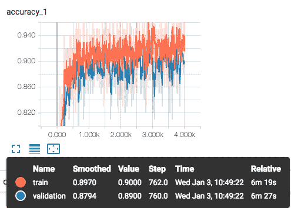
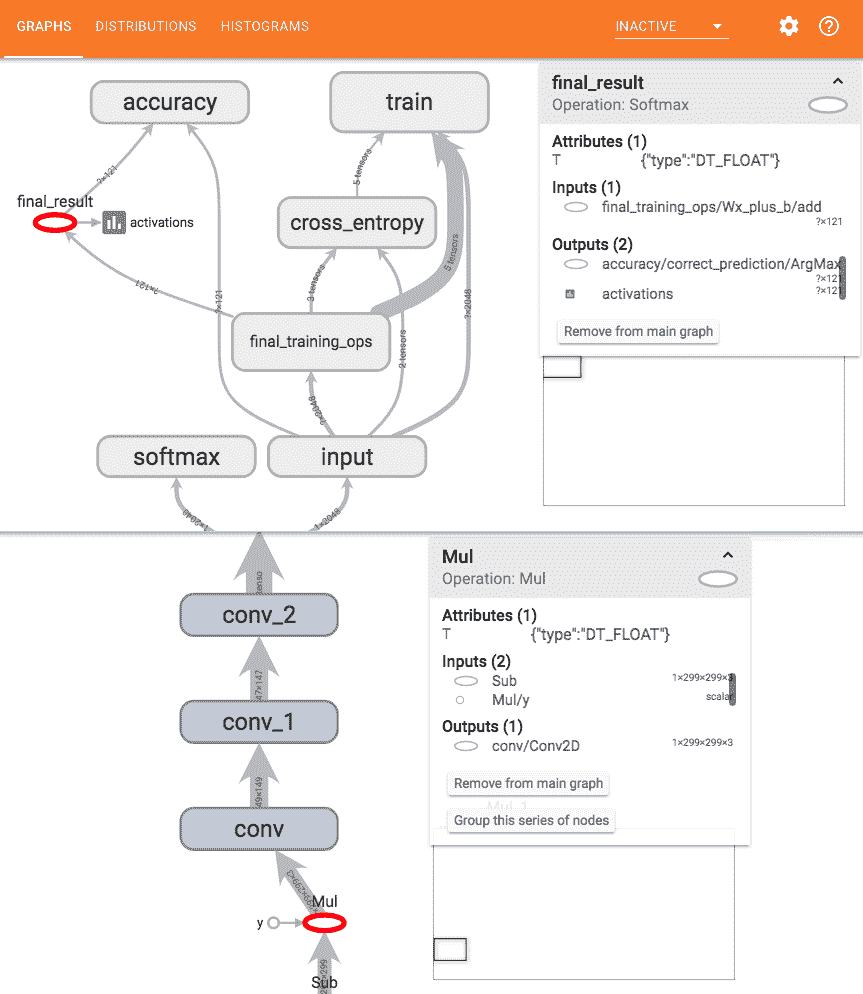
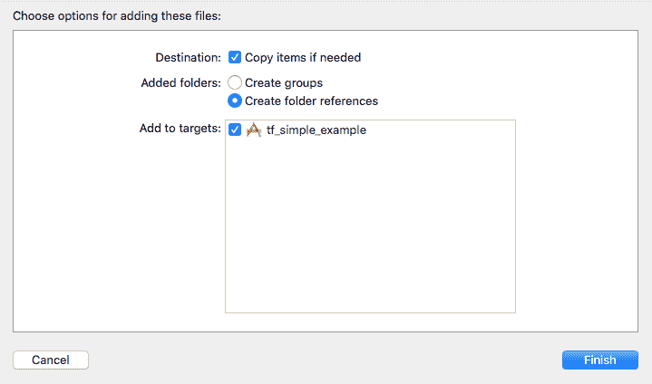
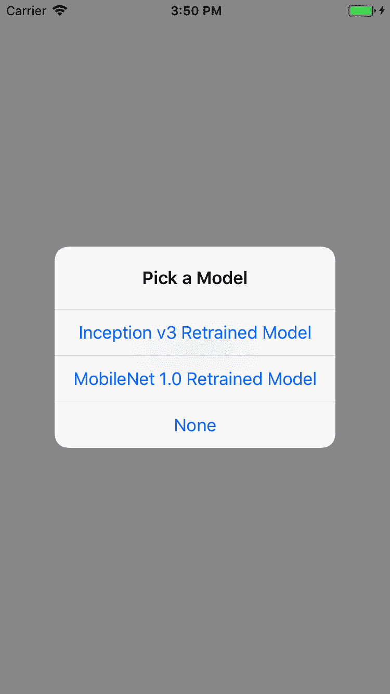
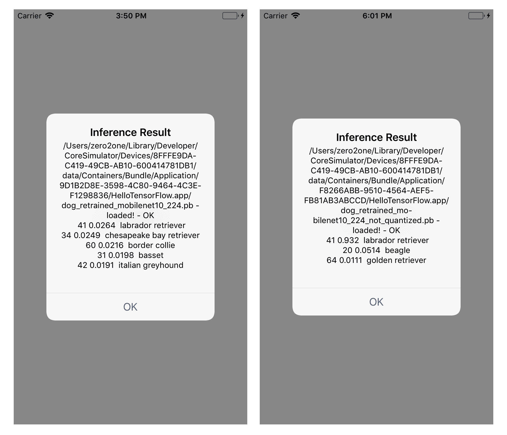
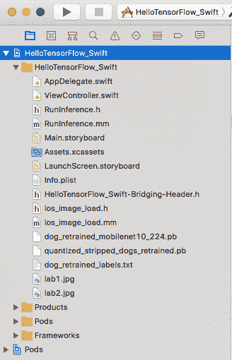
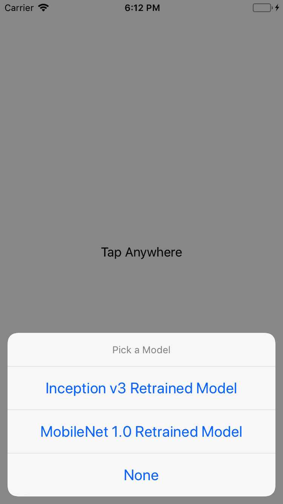
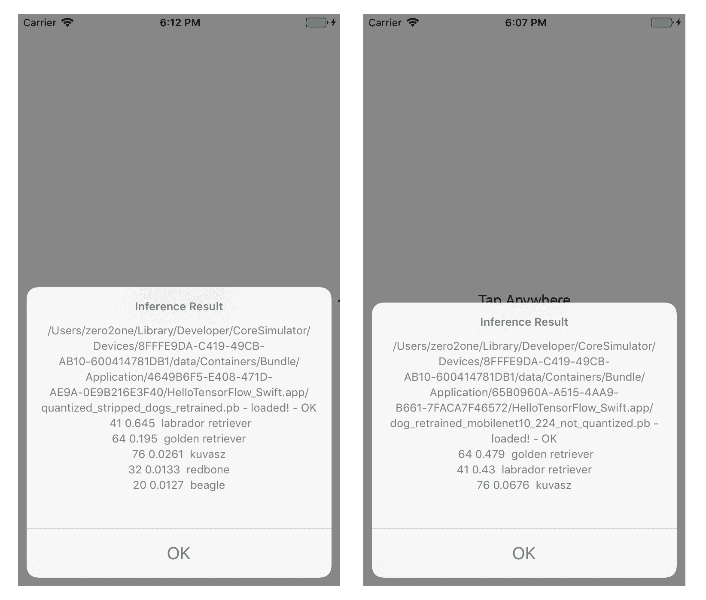
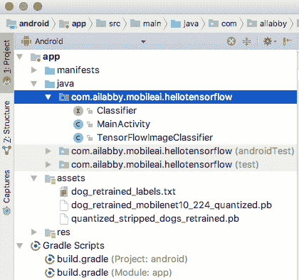
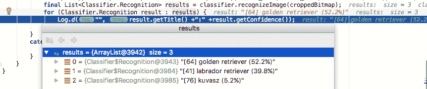

# 通过迁移学习对图像进行分类


上一章中描述的示例 TensorFlow iOS 应用程序，Simple 和 Camera 以及 Android 应用程序“TF 分类”都使用了 Inception v1 模型，该模型是 Google 公开提供的预先训练的图像分类深度神经网络模型。 该模型针对 [ImageNet](http://image-net.org) 进行了训练，ImageNet 是最大和最知名的图像数据库之一，其中有超过一千万个图像被标注为对象类别。 Inception 模型可用于将图像分类为[列出的 1,000 个类别之一](http://image-net.org/challenges/LSVRC/2014/browse-synsets)。 这 1000 个对象类别包括很多对象中的很多犬种。 但是，识别狗品种的准确性不是很高，约为 70%，因为模型经过训练可以识别大量对象，而不是像狗品种之类的特定对象。

如果我们想提高准确性并在使用改进模型的智能手机上构建移动应用程序怎么办，那么当我们四处走走并看到一只有趣的狗时，我们可以使用该应用程序告诉我们它是哪种狗。

在本章中，我们将首先讨论为什么对于这样的图像分类任务，迁移学习或重新训练经过预训练的深度学习模型是完成任务的最经济有效的方法。 然后，我们将向您展示如何使用良好的狗数据集对一些最佳图像分类模型进行再训练，以及在第 1 章，“移动 TensorFlow 入门”。 此外，我们还将分步说明如何将 TensorFlow 添加到基于 Objective-C 或 Swift 的 iOS 和 Android 应用中。

总而言之，我们将在本章中介绍以下主题：

*   迁移学习-什么和为什么
*   使用 Inception v3 模型进行再训练
*   使用 MobileNet 模型进行再训练
*   在示例 iOS 应用中使用经过重新训练的模型
*   在示例 Android 应用中使用经过重新训练的模型
*   将 TensorFlow 添加到您自己的 iOS 应用中
*   将 TensorFlow 添加到您自己的 Android 应用中


# 迁移学习-什么和为什么


我们人类不会从头开始学习新事物。 取而代之的是，无论是否有意识地，我们都充分利用所学到的知识。 人工智能中的迁移学习试图做同样的事情-这种技术通常只需要训练的大型模型中的一小块，然后将其重新用于相关任务的新模型中，而无需访问大型训练数据和计算资源 训练原始模型。 总体而言，迁移学习仍然是 AI 中的一个开放问题，因为在许多情况下，仅需人类反复尝试几个例子，然后再学习掌握新事物，就会花很多时间来训练和学习 AI。 但是，在图像识别领域，迁移学习已被证明是非常有效的。

用于图像识别的现代深度学习模型通常是深度神经网络，或更具体地说，是具有许多层的深度**卷积神经网络**（**CNN**）。 这种 CNN 的较低层负责学习和识别较低层的功能，例如图像的边缘，轮廓和零件，而最后一层则确定图像的类别。 对于不同类型的对象，例如犬种或花朵类型，我们不需要重新学习网络较低层的参数或权重。 实际上，从头开始需要花费数周的训练来学习用于图像识别的现代 CNN 的所有权重，通常是数百万甚至更多。 传输 在图像分类的情况下，学习使我们能够使用特定的图像集重新训练此类 CNN 的最后一层，通常不到一小时，而 所有其他层都保持不变，并且达到了几乎相同的精度，就像我们从头开始训练整个网络数周一样。

迁移学习的第二个主要好处是，我们只需要少量的训练数据就可以重新训练 CNN 的最后一层。 如果必须从头开始训练深层 CNN 的数百万个参数，则需要大量的训练数据。 例如，对于我们的狗品种再训练，我们只需要为每个狗品种提供 100 幅以上的图像，即可建立一个比原始图像分类模型更好的狗品种分类模型。

If you're unfamiliar with CNN, check out the videos and notes of one of the best resources on it, the Stanford CS231n course *CNN for Visual Recognition* ([http://cs231n.stanford.edu](http://cs231n.stanford.edu)). Another good resource on CNN is Chapter 6 of *Michael Nielsen's* online book, *Neural Networks and Deep Learning*: [http://neuralnetworksanddeeplearning.com/chap6.html#introducing_convolutional_networks](http://neuralnetworksanddeeplearning.com/chap6.html#introducing_convolutional_networks).

在接下来的两个部分中，我们将使用针对 TensorFlow 的两个最佳的经过预训练的 CNN 模型和一个犬种数据集来重新训练模型并生成更好的犬种识别模型。 第一个模型是 Inception v3，它是比 Inception v1 更准确的模型，已针对准确性进行了优化，但尺寸较大。 另一个模型是 MobileNet，它针对移动设备的大小和效率进行了优化。 TensorFlow 支持的预训练模型的详细列表位于[这里](https://github.com/tensorflow/models/tree/master/research/slim#pre-trained-models)。


# 使用 Inception v3 模型进行再训练


在上一章中设置的 TensorFlow 源代码中，有一个 Python 脚本`tensorflow/examples/image_retraining/retrain.py`，可用于重新训练 Inception v3 或 MobileNet 模型。 在运行脚本以重新训练 Inception v3 模型以进行狗品种识别之前，我们需要首先下载[斯坦福狗数据集](http://vision.stanford.edu/aditya86/ImageNetDogs)， 120 个犬种的图片（您只需要在链接中下载图片，而不是注释即可）。

在`~/Downloads`中解压缩下载的狗`images.tar`文件，您应该在`~/Downloads/Images`中看到文件夹列表，如以下屏幕截图所示。 每个文件夹对应一个犬种，并且包含约 150 张图像（您无需为图像提供显式标签，因为文件夹名称用于标记文件夹中包含的图像）：

Figure 2.1 Dogset images separated by folders, or labels of dog breedYou may download the dataset and then run the `retrain.py` script on Mac, as it doesn't take too long (less than an hour) for the script to run on the relatively small dataset (about 20,000 images in total), but if you do that on a GPU-powered Ubuntu, as set up in the last chapter, the script can complete in just a few minutes. In addition, when retraining with a large image dataset, running on Mac may take hours or days so it makes sense to run it on a GPU-powered machine.

假设您已经创建了`/tf_file`目录和`/tf_file/dogs_bottleneck`目录，那么重新训练模型的命令如下：

```py
python tensorflow/examples/image_retraining/retrain.py  
--model_dir=/tf_files/inception-v3  
--output_graph=/tf_files/dog_retrained.pb  
--output_labels=/tf_files/dog_retrained_labels.txt  
--image_dir ~/Downloads/Images  
--bottleneck_dir=/tf_files/dogs_bottleneck 
```

这五个参数在这里需要一些解释：

*   `--model_dir`指定应该由`retrain.py`自动下载 Inception v3 模型的目录路径，除非它已经在目录中。
*   `--output_graph`表示再训练模型的名称和路径。
*   `--output_labels`是由图像数据集的文件夹（标签）名称组成的文件，稍后将其与经过重新训练的模型一起使用以对新图像进行分类。
*   `--image_dir`是用于重新训练 Inception v3 模型的图像数据集的路径。
*   `--bottleneck_dir`用于缓存在瓶颈（最后一层之前的那一层）上生成的结果； 最后一层使用这些结果进行分类。 在重新训练期间，每个映像都使用了几次，但该映像的瓶颈值保持不变，即使将来重新运行重新训练脚本也是如此。 因此，第一次运行需要更长的时间，因为它需要创建瓶颈结果。

在再训练期间，您将每 10 步看到 3 个值，默认总计 4,000 步。 前 20 个步骤和后 20 个步骤以及最终精度如下所示：

```py
INFO:tensorflow:2018-01-03 10:42:53.127219: Step 0: Train accuracy = 21.0% 
INFO:tensorflow:2018-01-03 10:42:53.127414: Step 0: Cross entropy = 4.767182 
INFO:tensorflow:2018-01-03 10:42:55.384347: Step 0: Validation accuracy = 3.0% (N=100) 
INFO:tensorflow:2018-01-03 10:43:11.591877: Step 10: Train accuracy = 34.0% 
INFO:tensorflow:2018-01-03 10:43:11.592048: Step 10: Cross entropy = 4.704726 
INFO:tensorflow:2018-01-03 10:43:12.915417: Step 10: Validation accuracy = 22.0% (N=100) 
... 
... 
INFO:tensorflow:2018-01-03 10:56:16.579971: Step 3990: Train accuracy = 93.0% 
INFO:tensorflow:2018-01-03 10:56:16.580140: Step 3990: Cross entropy = 0.326892 
INFO:tensorflow:2018-01-03 10:56:16.692935: Step 3990: Validation accuracy = 89.0% (N=100) 
INFO:tensorflow:2018-01-03 10:56:17.735986: Step 3999: Train accuracy = 93.0% 
INFO:tensorflow:2018-01-03 10:56:17.736167: Step 3999: Cross entropy = 0.379192 
INFO:tensorflow:2018-01-03 10:56:17.846976: Step 3999: Validation accuracy = 90.0% (N=100) 
INFO:tensorflow:Final test accuracy = 91.0% (N=2109) 

```

训练精度是神经网络用于训练的图像上的分类精度，而验证精度是神经网络未用于训练的图像上的验证精度。 因此，验证准确度是衡量模型准确度的一种更可靠的度量，并且通常应该比训练准确度小一点，但是如果训练收敛并进行得很好，也就是说，如果训练的模型是 既不适合也不适合。

如果火车精度很高，但验证精度仍然很低，则意味着模型过拟合。 如果火车精度仍然很低，则表明模型不适合。 同样，交叉熵是损失函数值，如果再训练顺利进行，则总体上应该越来越小。 最后，测试准确性取决于尚未用于训练或验证的图像。 通常，这是我们可以说出的关于重新训练模型的最准确的值。

如前面的输出所示，在再训练结束时，我们看到验证精度与火车精度相似（90% 和 93%，相比之初为 3% 和 21%），最终测试精度为 91%  。 交叉熵也从开始时的 4.767 下降到最后的 0.379。 因此，我们现在有了一个很好的再训练狗品种识别模型。

To further improve the accuracy, you can play with the `retrain.py`'s other parameters such as training steps (`--how_many_training_steps`), learning rate (`--learning_rate`), and data augmentation (`--flip_left_right`, `--random_crop`, `--random_scale`, `--random_brightness`). Generally, this is a tedious process that involves a lot of "dirty work" as called by Andrew Ng, one of the best-known deep learning experts, in his *Nuts and Bolts of Applying Deep Learning* speech (video is available at: [https://www.youtube.com/watch?v=F1ka6a13S9I](https://www.youtube.com/watch?v=F1ka6a13S9I)).

您可以使用另一个 Python 脚本`label_image`来对经过重新训练的模型进行快速测试，以测试自己的图像（例如`/tmp/lab1.jpg`中的 Labrador Retriever 图像），您可以在首先对其进行如下构建后运行该脚本：

```py
bazel build tensorflow/examples/image_retraining:label_image 

bazel-bin/tensorflow/examples/label_image/label_image  
--graph=/tf_files/dog_retrained.pb  
--image=/tmp/lab1.jpg  
--input_layer=Mul  
--output_layer=final_result  
--labels=/tf_files/dog_retrained_labels.txt 
```

您会看到与以下内容相似的前五个分类结果（但是，因为网络随机变化，可能不完全相同）如下：

```py
n02099712 labrador retriever (41): 0.75551 
n02099601 golden retriever (64): 0.137506 
n02104029 kuvasz (76): 0.0228538 
n02090379 redbone (32): 0.00943663 
n02088364 beagle (20): 0.00672507 
```

`--input_layer (Mul)`和`--output_layer (final_result)`的值非常重要–必须与模型中定义的值相同，这样分类才能完全起作用。 如果您想知道如何获取它们（从图形，aka 模型，文件`dog_retrained.pb`中获取），则有两个 TensorFlow 工具可能会有所帮助。 第一个是适当命名的`summarize_graph`。 这是构建和运行它的方法：

```py
bazel build tensorflow/tools/graph_transforms:summarize_graph

bazel-bin/tensorflow/tools/graph_transforms/summarize_graph --in_graph=/tf_files/dog_retrained.pb
```

您将看到类似于以下内容的摘要结果：

```py
No inputs spotted.
No variables spotted.
Found 1 possible outputs: (name=final_result, op=Softmax)
Found 22067948 (22.07M) const parameters, 0 (0) variable parameters, and 99 control_edges
Op types used: 489 Const, 101 Identity, 99 CheckNumerics, 94 Relu, 94 BatchNormWithGlobalNormalization, 94 Conv2D, 11 Concat, 9 AvgPool, 5 MaxPool, 1 DecodeJpeg, 1 ExpandDims, 1 Cast, 1 MatMul, 1 Mul, 1 PlaceholderWithDefault, 1 Add, 1 Reshape, 1 ResizeBilinear, 1 Softmax, 1 Sub
```

有一个可能的输出，名称为`final_result`。 不幸的是，有时`summarize_graph`工具没有告诉我们输入名称，因为它似乎对用于训练的节点感到困惑。 删除仅用于训练的节点（我们将在稍后讨论）之后，`summarize_graph`工具将返回正确的输入名称。 另一个名为 **TensorBoard** 的工具为我们提供了更完整的模型图。 如果直接从二进制文件安装了 TensorFlow，则应该可以只运行 TensorBoard，因为默认情况下，它安装在`/usr/local/bin`中。 但是，如果像我们之前那样从源代码安装 TensorFlow，则可以运行以下命令来构建 TensorBoard：

```py
git clone https://github.com/tensorflow/tensorboard 
cd tensorboard/ 
bazel build //tensorboard 
```

现在，确保您具有`/tmp/retrained_logs`，在运行`retrain.py`时自动创建并运行：

```py
bazel-bin/tensorboard/tensorboard --logdir /tmp/retrain_logs
```

然后在浏览器中启动 URL `http://localhost:6006`。 首先，您将看到准确性图，如以下屏幕截图所示：

Figure 2.2 Train and validation accuracy of the Inception v3 retrained model

在下面的屏幕截图中的交叉熵图，和我们之前对于运行`retrain.py`的输出所描述的一样：

Figure 2.3 Train and validation cross entropy of the Inception v3 retrained model

现在单击`GRAPHS`选项卡，您将看到一个名为`Mul`的操作，另一个名为`final_result`的操作 ，如下所示：

Figure 2.4 The Mul and final_result nodes in the retrained model

实际上，如果您希望与 TensorFlow 进行小的交互，则可以尝试几行 Python 代码来找出输出层和输入层的名称，如 iPython 交互所示：

```py
In [1]: import tensorflow as tf 
In [2]: g=tf.GraphDef() 
In [3]: g.ParseFromString(open("/tf_files/dog_retrained.pb", "rb").read()) 
In [4]: x=[n.name for n in g.node] 
In [5]: x[-1:] 
Out[5]: [u'final_result'] 
```

请注意，由于无法保证节点的顺序，因此此代码段并不总是有效，但它通常会为您提供所需的信息或验证。

现在，我们准备讨论如何进一步修改重新训练的模型，以便可以在移动设备上部署和运行它。 重新训练的模型文件`dog_retrained.pb`的大小太大，大约 80MB，在部署到移动设备之前，应该经过两个步骤进行优化：

1.  **去除未使用的节点**：删除模型中仅在训练期间使用但在推理期间不需要的节点。
2.  **量化模型**：将模型参数的所有 32 位浮点数转换为 8 位值。 这样可以将模型大小减小到其原始大小的 25%，同时保持推理精度大致相同。

TensorFlow's documentation ([https://www.tensorflow.org/performance/quantization](https://www.tensorflow.org/performance/quantization)) offers more details on quantization and why it works.

有两种方法可以执行前面的两个任务：使用`strip_unused`工具的旧方法和使用`transform_graph`工具的新方法。

让我们看看旧方法的工作原理：首先运行以下命令以创建一个模型，其中所有未使用的节点都将被删除：

```py
bazel build tensorflow/python/tools:strip_unused 

bazel-bin/tensorflow/python/tools/strip_unused  
  --input_graph=/tf_files/dog_retrained.pb  
  --output_graph=/tf_files/stripped_dog_retrained.pb  
  --input_node_names=Mul  
  --output_node_names=final_result  
     --input_binary=true 
```

如果在输出图中运行前面的 Python 代码，则可以找到正确的输入层名称：

```py
In [1]: import tensorflow as tf 
In [2]: g=tf.GraphDef() 
In [3]: g.ParseFromString(open("/tf_files/ stripped_dog_retrained.pb", "rb").read()) 
In [4]: x=[n.name for n in g.node] 
In [5]: x[0] 
Out[5]: [u'Mul'] 
```

现在运行以下命令来量化模型：

```py
python tensorflow/tools/quantization/quantize_graph.py  
   --input=/tf_files/stripped_dog_retrained.pb   
--output_node_names=final_result   
--output=/tf_files/quantized_stripped_dogs_retrained.pb  
   --mode=weights 
```

之后，可以在 iOS 和 Android 应用程序中部署和使用模型`quantized_stripped_dogs_retrained.pb`，我们将在本章的以下部分中看到。

剥离未使用的节点并量化模型的另一种方法是使用称为`transform_graph`的工具。 这是 TensorFlow 1.4 中推荐的新方法，并且可以在 Python `label_image`脚本中正常工作，但是在部署到 iOS 和 Android 应用程序时仍然会导致不正确的识别结果。

```py
bazel build tensorflow/tools/graph_transforms:transform_graph
bazel-bin/tensorflow/tools/graph_transforms/transform_graph  
  --in_graph=/tf_files/dog_retrained.pb  
  --out_graph=/tf_files/transform_dog_retrained.pb  
  --inputs='Mul'  
  --outputs='final_result'  
  --transforms=' 
    strip_unused_nodes(type=float, shape="1,299,299,3") 
    fold_constants(ignore_errors=true) 
    fold_batch_norms 
    fold_old_batch_norms 
    quantize_weights' 
```

在测试中使用`label_image`脚本可以正确运行`quantized_stripped_dogs_retrained.pb`和`transform_dog_retrained.pb`。 但是只有第一个可以在 iOS 和 Android 应用程序中正常工作。

有关图形转换工具的详细文档，请参见其 [GitHub README](https://github.com/tensorflow/tensorflow/blob/master/tensorflow/tools/graph_transforms/README.md)。


# 使用 MobileNet 模型进行再训练


上一节中生成的剥离和量化模型的大小仍超过 20MB。 这是因为用于再训练的预先构建的 Inception v3 模型是大规模的深度学习模型，具有超过 2500 万个参数，并且 Inception v3 并非以移动优先为目标。

2017 年 6 月，谷歌发布了 MobileNets v1，共 16 种针对 TensorFlow 的移动优先深度学习模型。 这些模型的大小只有几 MB，具有 47 万至 424 万个参数，仍然达到了不错的精度（仅比 Inception v3 低一点）。 有关更多信息，请参见[其自述文件](https://github.com/tensorflow/models/blob/master/research/slim/nets/mobilenet_v1.md)。

上一节中讨论的`retrain.py`脚本还支持基于 MobileNet 模型的重新训练。 只需运行如下命令：

```py
python tensorflow/examples/image_retraining/retrain.py  
  --output_graph=/tf_files/dog_retrained_mobilenet10_224.pb  
  --output_labels=/tf_files/dog_retrained_labels_mobilenet.txt  
  --image_dir ~/Downloads/Images  
  --bottleneck_dir=/tf_files/dogs_bottleneck_mobilenet  
  --architecture mobilenet_1.0_224 
```

生成的标签文件`dog_retrained_labels_mobilenet.txt`实际上与使用 Inception v3 模型进行再训练期间生成的标签文件相同。 `--architecture`参数指定 16 个 MobileNet 模型之一，而值`mobilenet_1.0_224`表示使用模型大小为 1.0 的模型（对于其他参数，其他三个可能的值分别为 0.75、0.50 和 0.25 – 1.0，准确但 最大尺寸，反之为 0.25）和 224 作为图像输入尺寸（其他三个值分别为 192、160 和 128）。 如果将`_quantized`添加到架构值的末尾，即`--architecture mobilenet_1.0_224_quantized`，则模型也将被量化，从而导致重新训练的模型大小约为 5.1MB。 非量化模型的大小约为 17MB。

您可以按以下步骤测试先前使用`label_image`生成的模型：

```py
bazel-bin/tensorflow/examples/label_image/label_image  
--graph=/tf_files/dog_retrained_mobilenet10_224.pb  
--image=/tmp/lab1.jpg  
--input_layer=input  
--output_layer=final_result  
--labels=/tf_files/dog_retrained_labels_mobilenet.txt  
--input_height=224  
--input_width=224  
--input_mean=128  
--input_std=128 

n02099712 labrador retriever (41): 0.824675 
n02099601 golden retriever (64): 0.144245 
n02104029 kuvasz (76): 0.0103533 
n02087394 rhodesian ridgeback (105): 0.00528782 
n02090379 redbone (32): 0.0035457 
```

请注意，在运行`label_image`时，`input_layer`名为`input`。 我们可以使用交互式 iPython 代码或之前看到的摘要图形工具找到该名称：

```py
bazel-bin/tensorflow/tools/graph_transforms/summarize_graph  
--in_graph=/tf_files/dog_retrained_mobilenet10_224.pb 
Found 1 possible inputs: (name=input, type=float(1), shape=[1,224,224,3])  
No variables spotted. 
Found 1 possible outputs: (name=final_result, op=Softmax)  
Found 4348281 (4.35M) const parameters, 0 (0) variable parameters, and 0 control_edges 
Op types used: 92 Const, 28 Add, 27 Relu6, 15 Conv2D, 13 Mul, 13 DepthwiseConv2dNative, 10 Dequantize, 3 Identity, 1 MatMul, 1 BiasAdd, 1 Placeholder, 1 PlaceholderWithDefault, 1 AvgPool, 1 Reshape, 1 Softmax, 1 Squeeze 
```

那么，我们什么时候应该在移动设备上使用 Inception v3 或 MobileNet 重新训练的模型？ 如果您想获得最高的准确性，则应该并且可以使用基于 Inception v3 的重新训练模型。 如果速度是您的首要考虑因素，则应考虑使用具有最小参数大小和图像输入大小的 MobileNet 重训练模型，以换取一些精度损失。

`benchmark_model`是为您提供模型精确基准的一种工具。 首先，将其构建如下：

```py
bazel build -c opt tensorflow/tools/benchmark:benchmark_model
```

然后，针对基于 Inception v3 或 MobileNet v1 的重新训练模型运行它：

```py
bazel-bin/tensorflow/tools/benchmark/benchmark_model  
--graph=/tf_files/quantized_stripped_dogs_retrained.pb  
--input_layer="Mul"  
--input_layer_shape="1,299,299,3"  
--input_layer_type="float"  
--output_layer="final_result"  
--show_run_order=false  
--show_time=false  
--show_memory=false  
--show_summary=true  
```

您将获得相当长的输出，最后会有一行像 FLOPS 的估计值：11.42B，这意味着它将使用基于 Inception v3 的重新训练模型约 11B FLOPS（浮点运算）进行推断。 iPhone 6 运行大约 2 B FLOPS，因此在 iPhone 6 上运行模型大约需要 5–6 秒。 其他现代智能手机可以运行 10B FLOPS。

通过将图形文件替换为基于 MobileNet 模型的重新训练模型`dog_retrained_mobilenet10_224.pb`并重新运行基准测试工具，您将看到 FLOPS 估计值变为约 1.14B，大约快了 10 倍。


# 在示例 iOS 应用中使用经过重新训练的模型


我们在第 1 章，“移动 TensorFlow 入门”中看到的 iOS 简单示例使用了 Inception v1 模型。 为了使该应用程序使用我们经过重新训练的 Inception v3 模型和 MobileNet 模型来更好地识别狗的品种，我们需要对该应用程序进行一些更改。 首先，让我们看看在 iOS 简单应用中使用经过重新训练的`quantized_stripped_dogs_retrained.pb`会发生什么：

1.  双击`tensorflow/examples/ios/simple`中的`tf_simple_example.xcworkspace`文件以 Xcode 打开应用
2.  拖动我们用来测试`label_image`脚本的`quantized_stripped_dogs_retrained.pb`模型文件，`dog_retrained_labels.txt`标签文件和`lab1.jpg`图像文件，然后拖放到项目的数据文件夹中，并确保同时复制两个项目 选中和添加到目标，如以下屏幕截图所示：

Figure 2.5 Adding the retrained model file and the label file to app

3.  单击 Xco​​de 中的`RunModelViewController.mm`文件，该文件使用 TensorFlow C++ API 处理输入图像，通过 Inception v1 模型运行它，并获得图像分类结果，并更改行：

```py
NSString* network_path = FilePathForResourceName(@"tensorflow_inception_graph", @"pb");
NSString* labels_path = FilePathForResourceName(@"imagenet_comp_graph_label_strings", @"txt");
NSString* image_path = FilePathForResourceName(@"grace_hopper", @"jpg");
```

使用正确的模型文件名，标签文件名和测试图像名称进行以下操作：

```py
NSString* network_path = FilePathForResourceName(@"quantized_stripped_dogs_retrained", @"pb");
NSString* labels_path = FilePathForResourceName(@"dog_retrained_labels", @"txt");
NSString* image_path = FilePathForResourceName(@"lab1", @"jpg");
```

4.  同样在`RunModelViewController.mm`中，要匹配我们的 Inception v3（从 v1）重新训练模型所需的输入图像大小，请将`const int wanted_width = 224;`和`const int wanted_height = 224;`中的`224`值更改为`299`，并同时将`const float input_mean = 117.0f;`中的值 ]和`const float input_std = 1.0f;`至`128.0f`
5.  从以下项更改输入和输出节点名称的值：

```py
std::string input_layer = "input"; 
std::string output_layer = "output"; 
```

为以下正确值：

```py
std::string input_layer = "Mul"; 
std::string output_layer = "final_result"; 
```

6.  最后，您可以编辑`dog_retrained_labels.txt`文件以删除每行中的前导`nxxxx`字符串（例如，删除`n02099712 labrador retriever`中的`n02099712`）– 在 Mac 上，您可以通过按住 Option 键然后进行 选择和删除–从而使识别结果更具可读性

立即运行应用程序，然后单击运行模型按钮，在 Xcode 的控制台窗口或应用程序的编辑框中，您将看到以下识别结果，与运行`label_image`脚本的结果非常一致：

```py
Predictions: 41 0.645  labrador retriever 
64 0.195  golden retriever 
76 0.0261  kuvasz 
32 0.0133  redbone 
20 0.0127  beagle 
```

要使用 MobileNet（`mobilenet_1.0_224_quantized`）训练模型`dog_retrained_mobilenet10_224.pb`，请按照与之前类似的步骤进行操作，而在步骤 2 和 3 中，我们使用`dog_retrained_mobilenet10_224.pb`，但是在步骤 4 中，我们需要保留`const int wanted_width = 224;`和 `const int wanted_height = 224;`，仅将`const float input_mean`和`const float input_std`更改为`128`。 最后，在步骤 5 中，我们必须使用`std::string input_layer = "input";`和`std::string output_layer = "final_result";`。 这些参数与`dog_retrained_mobilenet10_224.pb`的`label_image`脚本使用的参数相同。

再次运行该应用程序，您将看到类似的最佳识别结果。


# 在示例 Android 应用中使用经过重新训练的模型


在 Android 的“TF 分类”应用程序中使用经过重新训练的 Inception v3 模型和 MobileNet 模型也非常简单。 请按照此处的步骤测试两个重新训练的模型：

1.  使用 Android Studio 打开位于`tensorflow/examples/android`中的示例 TensorFlow Android 应用。
2.  将两个重新训练的模型`quantized_stripped_dogs_retrained .pb`和`dog_retrained_mobilenet10_224.pb`以及标签文件`dog_retrained_labels.txt`拖放到 android 应用程序的`assets`文件夹中。
3.  打开文件`ClassifierActivity.java`，以使用 Inception v3 训练后的模型，并替换以下代码：

```py
private static final int INPUT_SIZE = 224; 
private static final int IMAGE_MEAN = 117; 
private static final float IMAGE_STD = 1; 
private static final String INPUT_NAME = "input"; 
private static final String OUTPUT_NAME = "output"; 
```

这些行：

```py
private static final int INPUT_SIZE = 299; 
private static final int IMAGE_MEAN = 128; 
private static final float IMAGE_STD = 128; 
private static final String INPUT_NAME = "Mul"; 
private static final String OUTPUT_NAME = "final_result"; 
private static final String MODEL_FILE = "file:///android_asset/quantized_stripped_dogs_retrained.pb"; 
private static final String LABEL_FILE = 
"file:///android_asset/dog_retrained_labels.txt";  
```

4.  或者，要使用 MobileNet 训练后的模型，请用以下代码行替换代码：

```py
private static final int INPUT_SIZE = 224; 
private static final int IMAGE_MEAN = 128; 
private static final float IMAGE_STD = 128; 
private static final String INPUT_NAME = "input"; 
private static final String OUTPUT_NAME = "final_result"; 
private static final String MODEL_FILE = "file:///android_asset/dog_retrained_mobilenet10_224.pb"; 
private static final String LABEL_FILE = "file:///android_asset/dog_retrained_labels.txt";
```

5.  将 Android 设备连接到计算机并在其上运行该应用程序。 然后点击 TF 分类应用程序，将相机指向一些狗的照片，您将在屏幕上看到最佳结果。

这就是在示例 TensorFlow iOS 和 Android 应用程序中使用两个经过重新训练的模型所需要的全部。 既然您已经了解了如何在示例应用程序中使用经过重新训练的模型，那么您可能想知道的下一件事是如何将 TensorFlow 添加到自己的新的或现有的 iOS 或 Android 应用程序中，以便可以开始添加 AI 对您自己的移动应用程序的强大功能。 这就是本章其余部分将详细讨论的内容。


# 将 TensorFlow 添加到您自己的 iOS 应用中


在 TensorFlow 的早期版本中，将 TensorFlow 添加到您自己的应用程序非常繁琐，需要使用 TensorFlow 的手动构建过程和其他手动设置。 在 TensorFlow 1.4 中，该过程非常简单，但在 TensorFlow 网站上并未详细记录详细步骤。 缺少的另一件事是缺少有关如何在基于 Swift 的 iOS 应用中使用 TensorFlow 的文档； 示例 TensorFlow iOS 应用程序都在 Objective-C 中，它们调用了 TensorFlow 的 C++ API。 让我们看看我们如何做得更好。


# 将 TensorFlow 添加到您的 Objective-C iOS 应用


首先，按照以下步骤将具有图像分类功能的 TensorFlow 添加到您的 Objective-C iOS 应用程序（我们将从一个新应用程序开始，但是如果需要将 TensorFlow 添加到现有应用程序，则可以跳过第一步）：

1.  在您的 Xcode 中，单击“文件 | 新增 | 项目 ...”，选择“Single View App”，然后选择接下来的，输入`HelloTensorFlow`作为产品名称，选择 Obj-C 作为语言，然后单击接下来并选择项目的位置，然后单击创建。 关闭 Xcode 中的项目窗口（因为我们稍后将使用 Pod 来打开项目的工作区文件）。
2.  打开一个终端窗口，即`cd`到项目所在的位置，然后创建一个名为`Podfile`的新文件，其内容如下：

```py
target 'HelloTensorFlow' 
pod 'TensorFlow-experimental'
```

3.  运行命令`pod install`下载并安装 TensorFlow Pod。
4.  在 Xcode 中打开`HelloTensorFlow.xcworkspace`文件，然后将两个文件（`ios_image_load.mm`和`ios_image_load.h`）拖放到 TensorFlow iOS 示例目录`tensorflow/examples/ios/simple`到`HelloTensorFlow`项目文件夹中。
5.  将两个模型`quantized_stripped_dogs_retrained.pb`和`dog_retrained_mobilenet10_224.pb`，`label file dog_retrained_labels.txt`以及几个测试图像文件拖放到项目文件夹中，之后，您应该看到类似以下的内容：

Figure 2.6 Adding utility files, model files, label file and image files

6.  将`ViewController.m`重命名为`ViewController.mm`，因为我们将在该文件中混合使用 C++ 代码和 Objective-C 代码来调用 TensorFlow C++ API 并处理图像输入和推断结果。 然后，在`@interface ViewController`之前，添加以下`#include`和函数原型：

```py
#include <fstream> 
#include <queue> 
#include "tensorflow/core/framework/op_kernel.h" 
#include "tensorflow/core/public/session.h" 
#include "ios_image_load.h" 

NSString* RunInferenceOnImage(int wanted_width, int wanted_height, std::string input_layer, NSString *model); 
```

7.  在`ViewController.mm`的末尾，添加从`tensorflow/example/ios/simple/RunModelViewController.mm`复制的以下代码，对函数`RunInferenceOnImage`稍作更改，以接受具有不同输入大小和输入层名称的不同再训练模型：

```py
namespace { 
    class IfstreamInputStream : public ::google::protobuf::io::CopyingInputStream { 
... 
static void GetTopN( 
... 
bool PortableReadFileToProto(const std::string& file_name, 
... 
NSString* FilePathForResourceName(NSString* name, NSString* extension) { 
... 
NSString* RunInferenceOnImage(int wanted_width, int wanted_height, std::string input_layer, NSString *model) { 
```

8.  仍然在`viewDidLoad`方法的`ViewController.mm`中，首先添加添加标签的代码，以使用户知道他们可以使用该应用程序执行的操作：

```py
UILabel *lbl = [[UILabel alloc] init]; 
[lbl setTranslatesAutoresizingMaskIntoConstraints:NO]; 
lbl.text = @"Tap Anywhere"; 
[self.view addSubview:lbl];  
```

然后将标签置于屏幕中央的约束：

```py
NSLayoutConstraint *horizontal = [NSLayoutConstraint constraintWithItem:lbl attribute:NSLayoutAttributeCenterX 
relatedBy:NSLayoutRelationEqual toItem:self.view 
attribute:NSLayoutAttributeCenterX multiplier:1 constant:0]; 

NSLayoutConstraint *vertical = [NSLayoutConstraint constraintWithItem:lbl attribute:NSLayoutAttributeCenterY 
relatedBy:NSLayoutRelationEqual toItem:self.view 
attribute:NSLayoutAttributeCenterY multiplier:1 constant:0]; 

[self.view addConstraint:horizontal]; 
[self.view addConstraint:vertical];  
```

最后，在此处添加点击手势识别器：

```py
UITapGestureRecognizer *recognizer = [[UITapGestureRecognizer alloc] initWithTarget:self action:@selector(tapped:)]; 
[self.view addGestureRecognizer:recognizer]; 
```

9.  在轻敲处理程序中，我们首先创建两个`alert`操作，以允许用户选择重新训练的模型：

```py
UIAlertAction* inceptionV3 = [UIAlertAction actionWithTitle:@"Inception v3 Retrained Model" style:UIAlertActionStyleDefault handler:^(UIAlertAction * action) { 
        NSString *result = RunInferenceOnImage(299, 299, "Mul", @"quantized_stripped_dogs_retrained"); 
        [self showResult:result]; 
}]; 
UIAlertAction* mobileNet = [UIAlertAction actionWithTitle:@"MobileNet 1.0 Retrained Model" style:UIAlertActionStyleDefault handler:^(UIAlertAction * action) { 
        NSString *result = RunInferenceOnImage(224, 224, "input", @"dog_retrained_mobilenet10_224"); 
        [self showResult:result]; 
}]; 
```

然后创建一个`none`操作，并将所有三个`alert`操作添加到警报控制器并显示它：

```py
UIAlertAction* none = [UIAlertAction actionWithTitle:@"None" style:UIAlertActionStyleDefault 
        handler:^(UIAlertAction * action) {}]; 

UIAlertController* alert = [UIAlertController alertControllerWithTitle:@"Pick a Model" message:nil preferredStyle:UIAlertControllerStyleAlert]; 
[alert addAction:inceptionV3]; 
[alert addAction:mobileNet]; 
[alert addAction:none]; 
[self presentViewController:alert animated:YES completion:nil]; 
```

10.  推断的结果在方法`showResult`中显示为另一个警报控制器：

```py
-(void) showResult:(NSString *)result { 
    UIAlertController* alert = [UIAlertController alertControllerWithTitle:@"Inference Result" message:result preferredStyle:UIAlertControllerStyleAlert]; 

    UIAlertAction* action = [UIAlertAction actionWithTitle:@"OK" style:UIAlertActionStyleDefault handler:nil]; 
    [alert addAction:action]; 
    [self presentViewController:alert animated:YES completion:nil]; 
}  
```

与调用 TensorFlow 相关的核心代码在`RunInferenceOnImage`方法中，该方法基于 TensorFlow iOS 简单应用进行了略微修改，包括首先创建一个 TensorFlow 会话和一个图形：

```py
tensorflow::Session* session_pointer = nullptr; 
tensorflow::Status session_status = tensorflow::NewSession(options, &session_pointer); 
... 
std::unique_ptr<tensorflow::Session> session(session_pointer); 
tensorflow::GraphDef tensorflow_graph; 
NSString* network_path = FilePathForResourceName(model, @"pb"); 
PortableReadFileToProto([network_path UTF8String], &tensorflow_graph); 
tensorflow::Status s = session->Create(tensorflow_graph); 
```

然后加载标签文件和图像文件，并将图像数据转换为适当的 Tensor 数据：

```py
NSString* labels_path = FilePathForResourceName(@"dog_retrained_labels", @"txt"); 
... 
NSString* image_path = FilePathForResourceName(@"lab1", @"jpg"); 
std::vector<tensorflow::uint8> image_data = LoadImageFromFile([image_path UTF8String], &image_width, &image_height, &image_channels); 
tensorflow::Tensor image_tensor(tensorflow::DT_FLOAT, tensorflow::TensorShape({1, wanted_height, wanted_width, wanted_channels})); 
auto image_tensor_mapped = image_tensor.tensor<float, 4>(); 
tensorflow::uint8* in = image_data.data(); 
float* out = image_tensor_mapped.data(); 
for (int y = 0; y < wanted_height; ++y) { 
    const int in_y = (y * image_height) / wanted_height; 
... 
} 
```

最后，使用图像张量数据和输入层名称调用 TensorFlow 会话的`run`方法，获取返回的输出结果，并对其进行处理以获取置信度值大于阈值的前五个结果：

```py
std::vector<tensorflow::Tensor> outputs; 
tensorflow::Status run_status = session->Run({{input_layer, image_tensor}},{output_layer}, {}, &outputs); 
... 
tensorflow::Tensor* output = &outputs[0]; 
const int kNumResults = 5; 
const float kThreshold = 0.01f; 
std::vector<std::pair<float, int> > top_results; 
GetTopN(output->flat<float>(), kNumResults, kThreshold, &top_results); 
```

在本书的其余部分，我们将实现`RunInferenceOnxxx`方法的不同版本，以使用不同的输入来运行不同的模型。 因此，如果您不完全理解前面的一些代码，请不要担心； 通过构建更多的应用程序，您将为新的自定义模型编写自己的推理逻辑而感到自在。

此外，完整的 iOS 应用程序 HelloTensorFlow 也包含在本书的源代码存储库中。

现在，在模拟器中或实际的 iOS 设备上运行该应用程序，首先，您将看到以下消息框，要求您选择重新训练的模型：

Figure 2.7 Selecting different retrained model for inference

然后，您将在选择模型后看到推断结果：

Figure 2.8 Inference results based on different retrained models

请注意，MobileNet 训练后的模型在同一款 iPhone 上的运行速度要快得多，在 iPhone 6 上要比 Inception v3 训练后的模型快约一秒钟。


# 将 TensorFlow 添加到您的 Swift iOS 应用


自 2014 年 6 月诞生以来，Swift 已成为最优雅的现代编程语言之一。因此，对于某些开发人员而言，将现代 TensorFlow 集成到其基于 Swift 的现代 iOS 应用程序中既有趣又有用。 这样做的步骤与基于 Objective-C 的应用程序的步骤相似，但具有一些与 Swift 相关的技巧。 如果您已经按照 Objective-C 部分的步骤进行操作，则可能会发现这里的某些步骤是重复的，但是对于那些可能会跳过 Objective-C 部分并直接进入 Swift 的用户而言，仍然提供了完整的步骤：

1.  在您的 Xcode 中，单击“文件 | 新增 | 项目...”，选择“Single View App”，然后接下来的，输入`HelloTensorFlow_Swift`作为产品名称，选择 Swift 将设置为语言，然后单击接下来并选择项目的位置，然后单击创建。 关闭 Xcode 中的项目窗口（因为稍后将使用 Pod 来打开项目的工作区文件）。
2.  打开一个终端窗口，即`cd`到项目所在的位置，然后创建一个名为`Podfile`的新文件，其内容如下：

```py
target 'HelloTensorFlow_Swift' 
pod 'TensorFlow-experimental' 
```

3.  运行命令`pod install`下载并安装 TensorFlow Pod；

4.  在 Xcode 中打开`HelloTensorFlow_Swift.xcworkspace`文件，然后将两个文件（`ios_image_load.mm`和`ios_image_load.h`）拖放到 TensorFlow iOS 示例目录`tensorflow/examples/ios/simple`到`HelloTensorFlow_Swift`项目文件夹中。 当将两个文件添加到项目中时，您将看到一个消息框，如以下屏幕截图所示，询问您是否要配置 Objective-C 桥接头，Swift 代码调用 C++ 头需要此头。 Objective-C 代码。 因此，单击创建桥接标题按钮：

Figure 2.9 Creating Bridging Header when adding C++ file

5.  同样将`quantized_stripped_dogs_retrained .pb`和`dog_retrained_mobilenet10_224.pb`这两个模型，标签文件`dog_retrained_labels.txt`和几个测试图像文件拖放到项目文件夹中–之后，您应该会看到类似以下内容：

Figure 2.10 Adding utility files, model files, label file and image files

6.  使用以下代码创建一个名为`RunInference.h`的新文件（一个窍门是，我们必须在下一步中使用 Objective-C 类作为`RunInferenceOnImage`方法的包装，以便我们的 Swift 代码进行间接调用） 。否则，将发生构建错误）：

```py
#import <Foundation/Foundation.h> 
@interface RunInference_Wrapper : NSObject 
    - (NSString *)run_inference_wrapper:(NSString *)name; 
@end
```

7.  创建另一个名为`RunInference.mm`的文件，该文件以以下`include`对象和原型开头：

```py
#include <fstream> 
#include <queue> 
#include "tensorflow/core/framework/op_kernel.h" 
#include "tensorflow/core/public/session.h" 
#include "ios_image_load.h" 

NSString* RunInferenceOnImage(int wanted_width, int wanted_height, std::string input_layer, NSString *model); 
```

8.  在以下代码中添加`RunInference.mm`，以实现在其`.h`文件中定义的`RunInference_Wrapper`：

```py
@implementation RunInference_Wrapper 
- (NSString *)run_inference_wrapper:(NSString *)name { 
    if ([name isEqualToString:@"Inceptionv3"]) 
        return RunInferenceOnImage(299, 299, "Mul", @"quantized_stripped_dogs_retrained"); 
    else 
        return RunInferenceOnImage(224, 224, "input", @"dog_retrained_mobilenet10_224"); 
} 
@end     

```

9.  在`RunInference.mm`的末尾，添加与 Objective-C 部分中`ViewController.mm`完全相同的方法，与`tensorflow/example/ios/simple/RunModelViewController.mm`中的方法略有不同：

```py
class IfstreamInputStream : public namespace { 
    class IfstreamInputStream : public ::google::protobuf::io::CopyingInputStream { 
... 
static void GetTopN( 
... 
bool PortableReadFileToProto(const std::string& file_name, 
... 
NSString* FilePathForResourceName(NSString* name, NSString* extension) { 
... 
NSString* RunInferenceOnImage(int wanted_width, int wanted_height, std::string input_layer, NSString *model) {
```

10.  现在打开`viewDidLoad method`末尾的`ViewController.swift`，首先添加添加标签的代码，以使用户知道他们可以使用该应用程序做什么：

```py
let lbl = UILabel() 
lbl.translatesAutoresizingMaskIntoConstraints = false 
lbl.text = "Tap Anywhere" 
self.view.addSubview(lbl) 
```

然后将标签置于屏幕中央的约束：

```py
let horizontal = NSLayoutConstraint(item: lbl, attribute: .centerX, relatedBy: .equal, toItem: self.view, attribute: .centerX, multiplier: 1, constant: 0) 

let vertical = NSLayoutConstraint(item: lbl, attribute: .centerY, relatedBy: .equal, toItem: self.view, attribute: .centerY, multiplier: 1, constant: 0) 

self.view.addConstraint(horizontal) 
self.view.addConstraint(vertical) 

```

最后，在此处添加点击手势识别器：

```py
let recognizer = UITapGestureRecognizer(target: self, action: #selector(ViewController.tapped(_:))) 
self.view.addGestureRecognizer(recognizer) 
```

11.  在轻击处理程序中，我们首先添加`alert`动作，以允许用户选择 Inception v3 训练后的模型：

```py
let alert = UIAlertController(title: "Pick a Model", message: nil, preferredStyle: .actionSheet) 
alert.addAction(UIAlertAction(title: "Inception v3 Retrained Model", style: .default) { action in 
    let result = RunInference_Wrapper().run_inference_wrapper("Inceptionv3") 

    let alert2 = UIAlertController(title: "Inference Result", message: result, preferredStyle: .actionSheet) 
    alert2.addAction(UIAlertAction(title: "OK", style: .default) { action2 in 
    }) 
    self.present(alert2, animated: true, completion: nil) 

}) 
```

然后在展示之前，为 MobileNet 重训练模型创建另一个动作以及一个`none`动作：

```py
alert.addAction(UIAlertAction(title: "MobileNet 1.0 Retrained Model", style: .default) { action in 
    let result = RunInference_Wrapper().run_inference_wrapper("MobileNet") 

    let alert2 = UIAlertController(title: "Inference Result", message: result, preferredStyle: .actionSheet) 
    alert2.addAction(UIAlertAction(title: "OK", style: .default) { action2 in 
    }) 
    self.present(alert2, animated: true, completion: nil) 
}) 
alert.addAction(UIAlertAction(title: "None", style: .default) { action in 
}) 

self.present(alert, animated: true, completion: nil) 
```

12.  打开`HelloTensorFlow_Swift-Bridging-Header.h`文件，并向其中添加一行代码：`#include "RunInference.h"`。

现在，在模拟器中运行该应用程序，您将看到一个警报控制器，要求您选择模型：

Figure 2.11 Selecting a retrained model for inference

以及不同再训练模型的推论结果：



Figure 2.12 Inference results for different retrained models

妳去 既然您知道了将强大的 TensorFlow 模型添加到 iOS 应用程序需要做什么，无论它是用 Objective-C 还是 Swift 编写的，都没有理由阻止您将 AI 添加到您的移动应用程序中，除非您是 Android。 但是您知道我们当然也会照顾 Android。


# 将 TensorFlow 添加到您自己的 Android 应用中


事实证明，将 TensorFlow 添加到自己的 Android 应用程序比 iOS 容易。 让我们跳到步骤：

1.  如果您有现有的 Android 应用，请跳过此步骤。 否则，在 Android Studio 中，选择“文件 | 新增 | 新项目...”并接受所有默认设置，然后单击完成。
2.  打开`build.gradle`（`Module: app`）文件，并在依赖项`{...};`内部和末尾添加编译`'org.tensorflow:tensorflow-android:+'`。
3.  生成`gradle`文件，您将在`app`目录的位置`app/build/intermediates/transforms/mergeJniLibs/debug/0/lib`的子文件夹内看到`libtensorflow_inference.so`，这是 Java 代码与之对话的 TensorFlow 本机库。
4.  如果这是一个新项目，则可以通过首先切换到软件包，然后右键单击该应用程序并选择“新建 | 文件夹 | `assets`文件夹”来创建`assets`文件夹。 ，如以下屏幕截图所示，然后从软件包切换回 Android：

Figure 2.13 Adding Assets Folder to a new project

5.  将两个重新训练的模型文件和标签文件以及几个测试图像拖放到资产文件夹中，如下所示：

Figure 2.14 Adding model files, the label file and test images to assets

6.  按住选项按钮，将`tensorflow/examples/android/src/org/tensorflow/demo`和`Classifier.java`从`tensorflow/examples/android/src/org/tensorflow/demo`拖放到项目的 Java 文件夹中，如下所示：

Figure 2.15 Adding TensorFlow classifier files to the project

7.  打开`MainActivity`，首先创建与重新训练的 MobileNet 模型相关的常数-输入图像大小，节点名称，模型文件名和标签文件名：

```py
private static final int INPUT_SIZE = 224; 
private static final int IMAGE_MEAN = 128; 
private static final float IMAGE_STD = 128; 
private static final String INPUT_NAME = "input"; 
private static final String OUTPUT_NAME = "final_result"; 

private static final String MODEL_FILE = "file:///android_asset/dog_retrained_mobilenet10_224.pb"; 
private static final String LABEL_FILE = "file:///android_asset/dog_retrained_labels.txt"; 
private static final String IMG_FILE = "lab1.jpg";
```

8.  现在，在`onCreate`方法内部，首先创建一个`Classifier`实例：

```py
Classifier classifier = TensorFlowImageClassifier.create( 
                getAssets(), 
                MODEL_FILE, 
                LABEL_FILE, 
                INPUT_SIZE, 
                IMAGE_MEAN, 
                IMAGE_STD, 
                INPUT_NAME, 
                OUTPUT_NAME);  
```

然后从`assets`文件夹中读取我们的测试图像，根据模型指定的尺寸进行调整，然后调用推理方法`recognizeImage`：

```py
Bitmap bitmap = BitmapFactory.decodeStream(getAssets().open(IMG_FILE)); 
Bitmap croppedBitmap = Bitmap.createScaledBitmap(bitmap, INPUT_SIZE, INPUT_SIZE, true); 
final List<Classifier.Recognition> results = classifier.recognizeImage(croppedBitmap); 

```

为简单起见，我们没有向 Android 应用程序添加任何与 UI 相关的代码，但是您可以在获取结果后在此行设置一个断点，并调试运行该应用程序； 您将看到以下屏幕截图所示的结果：

Figure 2.16 Recognition results using the MobileNet retrained model

如果您通过将`MODEL_FILE`更改为`quantized_stripped_dogs_retrained.pb`，将`INPUT_SIZE`更改为`299`，并且将`INPUT_NAME`更改为`Mul`来使用 Inception v3 训练后的模型，则调试该应用程序，您将获得如下所示的结果 ：

Figure 2.17 Recognition results using the Inception v3 retrained model

既然您已经了解了如何将 TensorFlow 和经过重新训练的模型添加到自己的 iOS 和 Android 应用程序，那么想要添加非 TensorFlow 相关功能（例如使用手机的摄像头拍摄狗的照片和 认识它的品种。


# 概要


在本章中，我们首先简要介绍了什么是迁移学习以及为什么我们能够并且应该使用它来重新训练经过预训练的深度学习图像分类模型。 然后，我们提供了有关如何重新训练基于 Inception v3 的模型和 MobileNet 模型的详细信息，以便我们可以更好地理解和认识我们最好的朋友。 之后，我们首先展示了如何在 TensorFlow 示例 iOS 和 Android 应用中使用经过重新训练的模型，然后给出了有关如何将 TensorFlow 添加到您自己的基于 Objective-C 和 Swift 的 iOS 应用中的分步教程，以及 您自己的 Android 应用。

现在我们有了最好的朋友，其中涵盖了一些不错而干净的技巧，我们知道还有很多其他人，无论好坏。 在下一章中，我们将学习如何变得更聪明，如何识别图片中所有有趣的对象以及如何在智能手机上随时随地对其进行定位。


