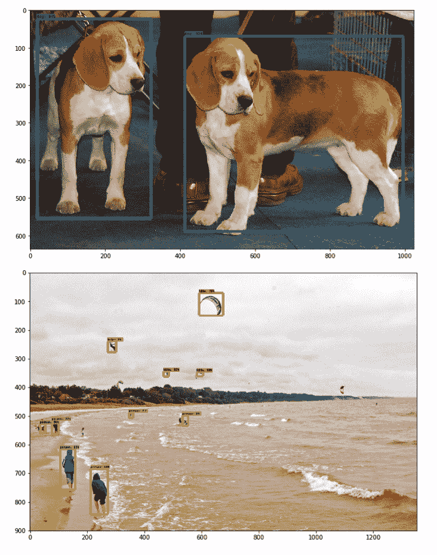
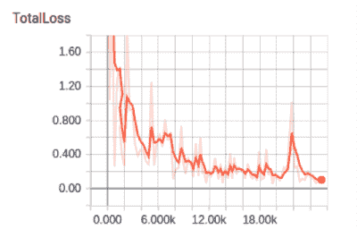
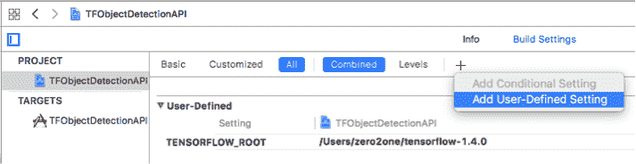
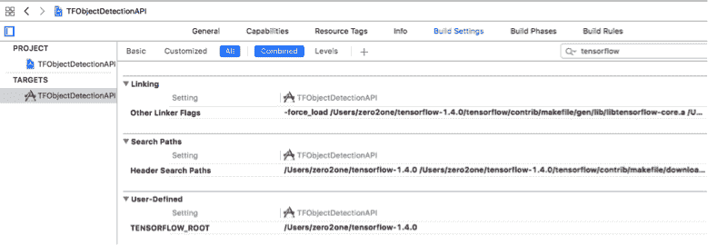
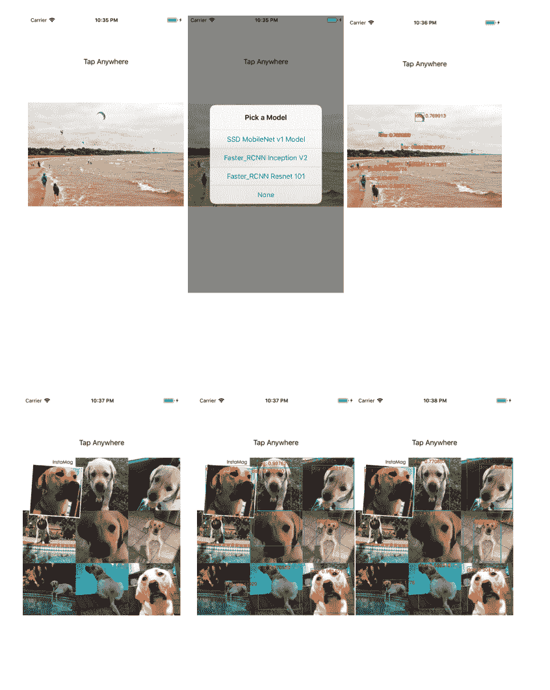
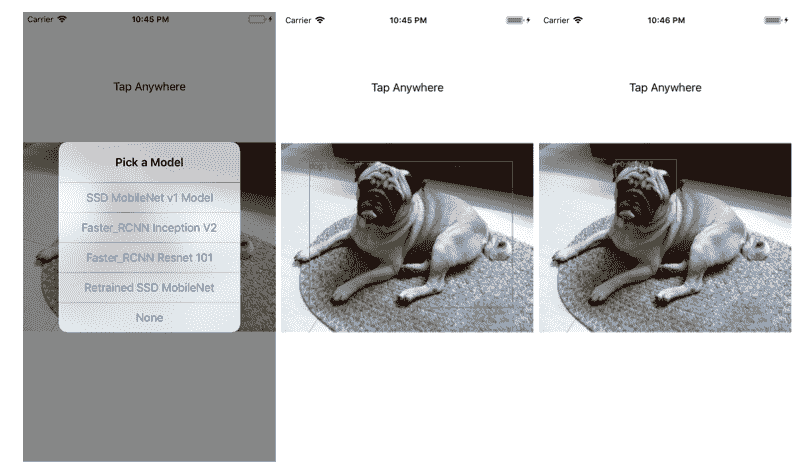

# 检测物体及其位置


对象检测比上一章中讨论的图像分类迈出了一步。 图像分类仅返回图像的类别标签，而对象检测返回图像中标识的对象列表以及每个标识对象的边界框。 现代的对象检测算法使用深度学习来构建可用于检测和定位单个图像中各种对象的模型。 在过去的几年中，更快，更准确的对象检测算法相继问世.2017 年 6 月，谷歌发布了 TensorFlow 对象检测 API，该 API 集成了几种领先的对象检测算法。

在本章中，我们将首先简要概述对象检测：创建有效的深度学习模型进行对象检测，然后使用该模型进行推理的过程。 然后，我们将详细讨论 TensorFlow 对象检测 API 的工作原理，如何使用其多个模型进行推理以及如何使用自己的数据集对其进行重新训练。 然后，我们将向您展示如何在 iOS 应用中使用预先训练的对象检测模型以及重新训练的模型。 我们将介绍一些强大的技巧，使您可以手动构建自定义的 TensorFlow iOS 库，以解决使用 TensorFlow Pod 的问题； 这将帮助您准备好处理本书其余部分中介绍的任何受 TensorFlow 支持的模型。 在本章中，我们将不提供用于对象检测的 Android 示例应用程序，因为 TensorFlow 源代码已经附带了一个很好的示例，可以使用 TensorFlow 对象检测预训练模型以及 YOLO 模型进行操作。 我们将在本章最后介绍。 我们将向您展示如何在 iOS 应用中使用另一种领先的物体检测模型 YOLO v2。 总而言之，我们将在本章中介绍以下主题：

*   物体检测：快速概述
*   设置 TensorFlow 对象检测 API

*   重新训练 SSD-MobileNet 和更快的 RCNN 模型
*   在 iOS 中使用对象检测模型
*   使用 YOLO2：另一种物体检测模型


# 对象检测-快速概述


自从 2012 年神经网络取得突破以来，当名为 **AlexNet** 的深层 CNN 模型通过大大降低错误率赢得了年度 ImageNet 视觉识别挑战时，许多计算机视觉和自然语言处理领域的研究人员就开始利用这一优势 深度学习模型的强大功能。 基于深度学习的现代对象检测全部基于 CNN，并建立在诸如 AlexNet，Google Inception 或其他流行的 VGG 网络等预先训练的模型之上。 这些 CNN 通常已经训练了数百万个参数，并且可以将输入图像转换为一组功能，这些功能可以进一步用于诸如上一章中涉及的图像分类以及对象检测以及其他与计算机视觉相关的任务 任务。

2014 年，提出了一种最新的对象检测器，该对象检测器使用称为 RCNN（具有 CNN 特征的区域）的标记对象检测数据集对 AlexNet 进行了训练，与传统的检测方法相比，它在准确性上有了很大的提高。 RCNN 结合了一种称为区域提议的技术，该技术可生成大约 2,000 个可能的区域候选者，并在每个这些区域上运行 CNN 以进行分类和边界框预测。 然后，将这些结果合并以生成检测结果。 RCNN 的训练过程非常复杂，耗时数天，推理速度也很慢，在 GPU 上的图像上花费了将近一分钟。

自从提出 RCNN 以来，性能更好的对象检测算法纷至沓来：快速 RCNN，更快的 RCNN，YOLO（您只看一次），SSD（单发多框检测器）和 YOLO v2。

2014 年，Andrej Karpathy 对 RCNN 作了很好的介绍，[“玩转 RCNN，先进的物体检测器”](https://cs.stanford.edu/people/karpathy/rcnn)。 贾斯汀·约翰逊（Justin Johnson）在斯坦福大学CS231n课程中提供了一个很好的视频讲座[“空间定位和检测”](https://github.com/weiliu89/caffe/tree/ssd)，内容涉及物体检测，其中包括 RCNN，Fast RCNN，Faster RCNN 和 YOLO 的详细信息。 YOLO2 网站是[这里](https://pjreddie.com/darknet/yolo)。

快速 RCNN 通过首先在整个输入图像上而不是数千个建议的区域上应用 CNN，然后处理区域建议，从而显着改善了训练过程和推理时间（10 小时的训练和 2.x 秒的推理）。 更快的 RCNN 通过使用区域建议网络进一步将推理速度提高到了实时（0.2 秒），因此在训练后，不再需要耗时的区域建议过程。

与 RCNN 检测系列不同，SSD 和 YOLO 都是单发方法，这意味着它们将单个 CNN 应用于完整的输入图像，而无需使用区域建议和区域分类。 这使这两种方法都非常快，它们的平均平均精度（mAP）约为 80%，优于 Faster RCNN。

如果这是您第一次听说这些方法，则可能会感到有些迷茫。 但是，作为对使用 AI 增强移动应用程序功能感兴趣的开发人员，您无需了解设置深度神经网络架构和训练对象检测模型的所有细节； 您应该只知道如何使用以及（如果需要）重新训练经过预先训练的模型，以及如何在 iOS 和 Android 应用中使用经过预先训练或重新训练的模型。

如果您真的对深度学习研究感兴趣，并且想知道每个检测器如何工作以决定使用哪种检测器的所有细节，那么您绝对应该阅读每种方法的论文，并尝试自己复制训练过程。 这将是一条漫长而有益的道路。 但是，如果您想听 Andrej Karpathy 的建议，“不要成为英雄”（在 YouTube 上搜索“Andrej 的计算机视觉深度学习”），那么您可以“采取最有效的方法，下载经过预先训练的模型， 添加/删除其中的某些部分，然后在您的应用程序上对其进行微调”，这也是我们将在此处使用的方法。

在开始研究哪种方法最适合 TensorFlow 之前，让我们快速了解一下数据集。 有 3 个主要的数据集用于训练对象检测：[PASCAL VOC](http://host.robots.ox.ac.uk/pascal/VOC)，[ImageNet](http://image-net.org) 和 [Microsoft COCO](http://cocodataset.org)，它们具有的类数分别为 20、200 和 80。 TensorFlow 对象检测 API 当前支持的大多数预训练模型都在 80 级 MS COCO 数据集上进行了训练（有关预训练模型及其训练的数据集的完整列表，请参见[这里](https://github.com/tensorflow/models/blob/master/research/object_detection/g3doc/detection_model_zoo.md)。

尽管我们不会从头开始进行训练，但是您会经常提到 PASCAL VOC 或 MS COCO 数据格式，以及它们涵盖的 20 或 80 个通用类，它们都是在重新训练或使用经过训练的模型时使用的。 在本章的最后部分，我们将尝试使用 VOC 训练的 YOLO 模型和 COCO 训练的模型。


# 设置 TensorFlow 对象检测 API


TensorFlow 对象检测 API 在其[官方网站](https://github.com/tensorflow/models/tree/master/research/object_detection)上有详细记录，您一定要查看其“快速入门：用于现成的推断的 Jupyter 笔记本”指南，快速介绍了如何在 Python 中使用良好的预训练模型进行检测。 但是那里的文档分布在许多不同的页面上，有时难以理解。 在本节和下一节中，我们将通过重组在许多地方记录的重要细节并添加更多示例和代码说明来简化官方文档，并提供有关以下内容的两个分步教程：

1.  如何设置 API 并使用其预训练的模型进行现成的推断
2.  如何使用 API​​重新训练预训练模型以执行更具体的检测任务


# 快速安装和示例


执行以下步骤来安装和运行对象检测推断：

1.  在第 1 章，“移动 TensorFlow 入门”中创建的 TensorFlow 源根中，获取 TensorFlow 模型存储库，其中包含 TensorFlow 对象检测 API 作为其研究模型之一：

```py
git clone https://github.com/tensorflow/models
```

2.  安装`matplotlib`，`pillow`，`lxml`和`jupyter`库。 在 Ubuntu 或 Mac 上，您可以运行：

```py
sudo pip install pillow
sudo pip install lxml
sudo pip install jupyter
sudo pip install matplotlib
```

3.  转到`models` / `research`目录，然后运行以下命令：

```py
protoc object_detection/protos/*.proto --python_out=.
```

这将编译`object_detection/protos`目录中的所有 Protobuf，以使 TensorFlow 对象检测 API 满意。 Protobuf 或 Protocol Buffer 是一种自动序列化和检索结构化数据的方法，它比 XML 轻巧且效率更高。 您所需要做的就是编写一个描述数据结构的`.proto`文件，然后使用`protoc`（proto 编译器）生成自动解析和编码 protobuf 数据的代码。 注意`--python_out`参数指定了所生成代码的语言。 在本章的下一部分中，当我们讨论如何在 iOS 中使用模型时，我们将使用带有`--cpp_out`的协议编译器，因此生成的代码是 C++ 。 有关协议缓冲区的完整文档，请参见[这里](https://developers.google.com/protocol-buffers)。

4.  仍在模型/研究中，运行`export PYTHONPATH=$PYTHONPATH:`pwd`:`pwd`/slim`，然后运行`python object_detection/builders/model_builder_test.py`以验证一切正常。
5.  启动`jupyter notebook`命令并在浏览器中打开`http://localhost:8888`。 首先单击`object_detection`，然后选择`object_detection_tutorial.ipynb`笔记本并逐个单元运行演示。


# 使用预先训练的模型


现在让我们来看一下使用预训练的 TensorFlow 对象检测模型在 Python 笔记本中进行推理的主要组件。 首先，定义一些关键常量：

```py
MODEL_NAME = 'ssd_mobilenet_v1_coco_2017_11_17'
MODEL_FILE = MODEL_NAME + '.tar.gz'
DOWNLOAD_BASE = 'http://download.tensorflow.org/models/object_detection/'
PATH_TO_CKPT = MODEL_NAME + '/frozen_inference_graph.pb'
PATH_TO_LABELS = os.path.join('data', 'mscoco_label_map.pbtxt')
NUM_CLASSES = 90
```

笔记本代码下载并使用了预训练的对象检测模型`ssd_mobilenet_v1_coco_2017_11_17`（使用 SSD 方法构建，我们在上一章中介绍的 MobileNet CNN 模型之上，在上一节中进行了简要介绍）。 TensorFlow 检测模型动物园中提供了 [TensorFlow 对象检测 API 支持的预训练模型的完整列表](https://github.com/tensorflow/models/blob/master/research/object_detection/g3doc/detection_model_zoo.md)，并且大多数都是使用 MS COCO 数据集进行训练的。 用于推理的确切模型是`frozen_inference_graph.pb`文件（在下载的`ssd_mobilenet_v1_coco_2017_11_17.tar.gz`文件中），该模型用于现成的推理以及重新训练。

位于`models/research/object_detection/data/mscoco_label_map.pbtxt`中的`mscoco_label_map.pbtxt`标签文件具有 90（`NUM_CLASSES`）个项目，用于`ssd_mobilenet_v1_coco_2017_11_17`模型可以检测到的对象类型。 它的前两个项目是：

```py
item {
  name: "/m/01g317"
  id: 1
  display_name: "person"
}
item {
  name: "/m/0199g"
  id: 2
  display_name: "bicycle"
}
…
item {
  name: "/m/03wvsk"
  id: 89
  display_name: "hair drier"
}
item {
  name: "/m/012xff"
  id: 90
  display_name: "toothbrush"
}
```

我们在前面的步骤 3 中讨论了 Protobuf，描述`mscoco_label_map.pbtxt`中数据的 proto 文件是`string_int_label_map.proto`，位于`models/research/object_detection/protos`中，其内容如下：

```py
syntax = "proto2";
package object_detection.protos;
message StringIntLabelMapItem {
  optional string name = 1;
  optional int32 id = 2;
  optional string display_name = 3;
};

message StringIntLabelMap {
  repeated StringIntLabelMapItem item = 1;
};
```

因此，基本上，协议编译器基于`string_int_label_map.proto`创建代码，然后可以使用该代码有效地序列化`mscoco_label_map.pbtxt`中的数据。 稍后，当 CNN 检测到对象并返回整数 ID 时，可以将其转换为`name`或`display_name`供人类阅读。

将模型下载，解压缩并加载到内存中后，标签映射文件也将加载，并且位于`models/research/object_detection/test_images`的一些测试图像可以在其中添加您自己的任何测试图像以进行检测测试。 。 接下来，定义适当的输入和输出张量：

```py
with detection_graph.as_default():
  with tf.Session(graph=detection_graph) as sess:
    image_tensor = detection_graph.get_tensor_by_name('image_tensor:0')
    detection_boxes = detection_graph.get_tensor_by_name('detection_boxes:0')
    detection_scores = detection_graph.get_tensor_by_name('detection_scores:0')
    detection_classes = detection_graph.get_tensor_by_name('detection_classes:0')
    num_detections = detection_graph.get_tensor_by_name('num_detections:0')
```

再次，如果您想知道这些输入和输出张量名称来自`models/research/object_detection/ssd_mobilenet_v1_coco_2017_11_17/frozen_inference_graph.pb`中下载并保存的 SSD 模型中，那么您可以在 iPython 中使用以下代码来查找：

```py
import tensorflow as tf
g=tf.GraphDef()
g.ParseFromString(open("object_detection/ssd_mobilenet_v1_coco_2017_11_17/frozen_inference_graph.pb","rb").read())
x=[n.name for n in g.node]
x[-4:]
x[:5]
The last two statements will return: 
[u'detection_boxes',
 u'detection_scores',
 u'detection_classes',
 u'num_detections']
and
[u'Const', u'Const_1', u'Const_2', u'image_tensor', u'ToFloat']
```

另一种方法是使用上一章中描述的汇总图工具：

```py
bazel-bin/tensorflow/tools/graph_transforms/summarize_graph --in_graph= models/research/object_detection/ssd_mobilenet_v1_coco_2017_11_17/frozen_inference_graph.pb
```

这将生成以下输出：

```py
Found 1 possible inputs: (name=image_tensor, type=uint8(4), shape=[?,?,?,3])
No variables spotted. 
Found 4 possible outputs: (name=detection_boxes, op=Identity) (name=detection_scores, op=Identity (name=detection_classes, op=Identity) (name=num_detections, op=Identity)
```

加载每个测试映像后，将运行实际检测：

```py
image = Image.open(image_path)
image_np = load_image_into_numpy_array(image)
image_np_expanded = np.expand_dims(image_np, axis=0)
(boxes, scores, classes, num) = sess.run(
    [detection_boxes, detection_scores, detection_classes, num_detections],
    feed_dict={image_tensor: image_np_expanded})
```

最后，使用`matplotlib`库将检测到的结果可视化。 如果使用`tensorflow/models`存储库随附的默认两个测试图像，则会在图 3.1 中看到结果：



图 3.1：检测到的对象及其边界框和置信度分数

在“在 iOS 中使用对象检测模型”部分，我们将了解如何在 iOS 设备上使用相同的模型并绘制相同的检测结果。

您还可以在前面提到的 Tensorflow 检测模型 Zoo 中测试其他预训练模型。 例如，如果使用`faster_rcnn_inception_v2_coco`模型，将`object_detection_tutorial.ipynb`笔记本中的`MODEL_NAME = 'ssd_mobilenet_v1_coco_2017_11_17'`替换为`MODEL_NAME = ' faster_rcnn_inception_v2_coco_2017_11_08'`（可从 TensorFlow 检测模型 Zoo 页面的 URL 或`MODEL_NAME = ' faster_rcnn_resnet101_coco_2017_11_08'`中获得），则可以看到类似内容 其他两个基于 Faster RCNN 的模型的检测结果，但是它们花费的时间更长。

另外，在两个`faster_rcnn`型号上使用`summarize_graph`工具会在输入和输出上生成相同的信息：

```py
Found 1 possible inputs: (name=image_tensor, type=uint8(4), shape=[?,?,?,3]) 
Found 4 possible outputs: (name=detection_boxes, op=Identity) (name=detection_scores, op=Identity) (name=detection_classes, op=Identity) (name=num_detections, op=Identity)
```

通常，与其他大型的基于 Inception 或 Resnet-CNN 的大型模型相比，基于 MobileNet 的模型速度最快，但准确性较低（mAP 值较小）。 顺便说一下，下载的`ssd_mobilenet_v1_coco, faster_rcnn_inception_v2_coco_2017_11_08`和`faster_rcnn_resnet101_coco_2017_11_08`文件的大小分别为 76MB，149MB 和 593MB。 稍后我们将看到，在移动设备上，基于 MobileNet 的模型（例如`ssd_mobilenet_v1_coco`）运行速度要快得多，有时，大型模型（例如`faster_rcnn_resnet101_coco_2017_11_08`）只会在较旧的 iPhone 上崩溃。 希望您可以使用基于 MobileNet 的模型，经过重新训练的 MobileNet 模型或将来可以提供更高准确性的`ssd_mobilenet`的将来版本解决问题，尽管`ssd_mobilenet`的 v1 已经足够好 许多用例。


# 重新训练 SSD-MobileNet 和更快的 RCNN 模型


经过预训练的 TensorFlow 对象检测模型当然可以很好地解决某些问题。 但是有时候，您可能需要使用自己的带注释的数据集（在您特别感兴趣的对象或对象部分周围带有边界框）并重新训练现有模型，以便它可以更准确地检测不同的集合 对象类。

我们将使用 TensorFlow 对象检测 API 网站中记录的相同的 Oxford-IIIT Pets 数据集来重新训练本地计算机上的两个现有模型，而不是使用文档中介绍的 Google Cloud。 必要时，我们还将为每个步骤添加说明。 以下是有关如何使用 Oxford Oxford Pets 数据集重新训练 TensorFlow 对象检测模型的分步指南：

1.  在终端窗口中，最好在我们的 GPU 驱动的 Ubuntu 上`cd models/research first`，以加快重新训练的速度，然后运行以下命令下载数据集（`images.tar.gz`约为 800MB，`annotations.tar.gz`为 38MB）：

```py
wget http://www.robots.ox.ac.uk/~vgg/data/pets/data/images.tar.gz 
wget http://www.robots.ox.ac.uk/~vgg/data/pets/data/annotations.tar.gz
tar -xvf images.tar.gz
tar -xvf annotations.tar.gz
```

2.  运行以下命令以将数据集转换为 TFRecords 格式：

```py
python object_detection/dataset_tools/create_pet_tf_record.py \
 --label_map_path=object_detection/data/pet_label_map.pbtxt \
 --data_dir=`pwd` \
 --output_dir=`pwd`
```

该命令将在`models/research`目录中生成两个名为`pet_train_with_masks.record`（268MB）和`pet_val_with_masks.record`（110MB）的 TFRecord 文件。 TFRecords 是一种有趣的二进制格式，其中包含 TensorFlow 应用程序可用于训练或验证的所有数据，如果您想使用 TensorFlow 对象检测 API 重新训练自己的数据集，则 TFRecords 是必需的文件格式。

3.  如果在上一节中测试对象检测笔记本时还没有下载`ssd_mobilenet_v1_coco`模型和`faster_rcnn_resnet101_coco`模型并将其解压缩到`models/research`目录，请执行以下操作：

```py
wget http://storage.googleapis.com/download.tensorflow.org/models/object_detection/ssd_mobilenet_v1_coco_2017_11_17.tar.gz
tar -xvf ssd_mobilenet_v1_coco_2017_11_17.tar.gz
wget http://storage.googleapis.com/download.tensorflow.org/models/object_detection/faster_rcnn_resnet101_coco_11_06_2017.tar.gz
tar -xvf faster_rcnn_resnet101_coco_11_06_2017.tar.gz
```

4.  替换`object_detection/samples/configs/faster_rcnn_resnet101_pets.config`文件中出现的`PATH_TO_BE_CONFIGURED`五次，因此它们变为：

```py
fine_tune_checkpoint: "faster_rcnn_resnet101_coco_11_06_2017/model.ckpt"
...
train_input_reader: {
tf_record_input_reader {
input_path: "pet_train_with_masks.record"
}
label_map_path: "object_detection/data/pet_label_map.pbtxt"
}
eval_input_reader: {
tf_record_input_reader {
input_path: "pet_val_with_masks.record"
}
label_map_path: "object_detection/data/pet_label_map.pbtxt"
...
}
```

`faster_rcnn_resnet101_pets.config`文件用于指定模型检查点文件的位置，该文​​件包含模型的训练后权重，在步骤 2 中生成的用于训练和验证的 TFRecords 文件以及要分类的 37 类宠物的标签项 被检测到。 `object_detection/data/pet_label_map.pbtxt`的第一项和最后一项如下：

```py
item {
id: 1
name: 'Abyssinian'
}
...
item {
id: 37
name: 'yorkshire_terrier'
}
```

5.  同样，在`object_detection/samples/configs/ssd_mobilenet_v1_pets.config`文件中更改`PATH_TO_BE_CONFIGURED`的五次出现，因此它们变为：

```py
fine_tune_checkpoint: "object_detection/ssd_mobilenet_v1_coco_2017_11_17/model.ckpt"
train_input_reader: {
tf_record_input_reader {
input_path: "pet_train_with_masks.record"
}
label_map_path: "object_detection/data/pet_label_map.pbtxt"
}
eval_input_reader: {
tf_record_input_reader {
input_path: "pet_val_with_masks.record"
}
label_map_path: "object_detection/data/pet_label_map.pbtxt"
...
}
```

6.  创建一个新的`train_dir_faster_rcnn`目录，然后运行重新训练命令：

```py
python object_detection/train.py \
   --logtostderr \
   --pipeline_config_path=object_detection/samples/configs/faster_rcnn_resnet101_pets.config \
   --train_dir=train_dir_faster_rcnn
```

在基于 GPU 的系统上，从最初的损失 5.0 到损失 0.2 左右，只需不到 25,000 步的训练即可：

```py
tensorflow/core/common_runtime/gpu/gpu_device.cc:1030] Found device 0 with properties:
 name: GeForce GTX 1070 major: 6 minor: 1 memoryClockRate(GHz): 1.7845
 pciBusID: 0000:01:00.0
 totalMemory: 7.92GiB freeMemory: 7.44GiB
 INFO:tensorflow:global step 1: loss = 5.1661 (15.482 sec/step)
 INFO:tensorflow:global step 2: loss = 4.6045 (0.927 sec/step)
 INFO:tensorflow:global step 3: loss = 5.2665 (0.958 sec/step)
 ...
 INFO:tensorflow:global step 25448: loss = 0.2042 (0.372 sec/step)
 INFO:tensorflow:global step 25449: loss = 0.4230 (0.378 sec/step)
 INFO:tensorflow:global step 25450: loss = 0.1240 (0.386 sec/step)
```

7.  在大约 20,000 个步骤（大约 2 个小时）后，按`Ctrl + C`结束上述重新训练脚本的运行。 创建一个新的`train_dir_ssd_mobilenet`目录，然后运行：

```py
python object_detection/train.py \
   --logtostderr \
   --pipeline_config_path=object_detection/samples/configs/ssd_mobilenet_v1_pets.config \
   --train_dir=train_dir_ssd_mobilenet
```

训练结果应如下所示：

```py
INFO:tensorflow:global step 1: loss = 136.2856 (23.130 sec/step)
 INFO:tensorflow:global step 2: loss = 126.9009 (0.633 sec/step)
 INFO:tensorflow:global step 3: loss = 119.0644 (0.741 sec/step)
 ...
 INFO:tensorflow:global step 22310: loss = 1.5473 (0.460 sec/step)
 INFO:tensorflow:global step 22311: loss = 2.0510 (0.456 sec/step)
 INFO:tensorflow:global step 22312: loss = 1.6745 (0.461 sec/step)
```

您可以看到，与`Faster_RCNN`模型相比，`SSD_Mobilenet`模型的重新训练在开始和结束时的损失都更大。

8.  经过大约 20,000 个训练步骤，终止前面的再训练脚本。 然后创建一个新的`eval_dir`目录并运行评估脚本：

```py
python object_detection/eval.py \
   --logtostderr \
   --pipeline_config_path=object_detection/samples/configs/faster_rcnn_resnet101_pets.config \
   --checkpoint_dir=train_dir_faster_rcnn \
   --eval_dir=eval_dir
```

9.  打开另一个终端窗口，在 TensorFlow 根目录下打开`cd`，然后打开`models/research`，然后运行`tensorboard --logdir=.`。 在浏览器中，打开`http://localhost:6006`，您将看到损失图，如图 3.2 所示：



图 3.2：训练对象检测模型时的总损失趋势

您还将看到一些评估结果，如图 3.3 所示：


图 3.3：重新训练物体检测模型时评估图像检测结果

10.  同样，您可以为`SSD_MobileNet`模型运行评估脚本，然后使用 TensorBoard 查看其损失趋势和评估图像结果：

```py
python object_detection/eval.py \
    --logtostderr \
    --pipeline_config_path=object_detection/samples/configs/ssd_mobilenet_v1_pets.config \
    --checkpoint_dir=train_dir_ssd_mobilenet \
    --eval_dir=eval_dir_mobilenet
```

11.  您可以使用以下命令生成重新训练的图形：

```py
python object_detection/export_inference_graph.py \
    --input_type image_tensor \
    --pipeline_config_path object_detection/samples/configs/ssd_mobilenet_v1_pets.config \
    --trained_checkpoint_prefix train_dir_ssd_mobilenet/model.ckpt-21817 \
    --output_directory output_inference_graph_ssd_mobilenet.pb

python object_detection/export_inference_graph.py \
    --input_type image_tensor \
    --pipeline_config_path object_detection/samples/configs/faster_rcnn_resnet101_pets.config \
    --trained_checkpoint_prefix train_dir_faster_rcnn/model.ckpt-24009 \
    --output_directory output_inference_graph_faster_rcnn.pb
```

您需要用自己的特定检查点值替换`--trained_checkpoint_prefix`值（上述 21817 和 24009）。

到此为止-您现在拥有两个经过重新训练的对象检测模型`output_inference_graph_ssd_mobilenet.pb`和`output_inference_graph_faster_rcnn.pb`，可以在您的 Python 代码（上一节中的 Jupyter 笔记本）或移动应用程序中使用它们。 不用再拖延了，让我们跳到移动世界，看看如何使用我们拥有的预先训练和重新训练的模型。


# 在 iOS 中使用对象检测模型


在上一章中，我们向您展示了如何使用 TensorFlow 实验性容器将 TensorFlow 快速添加到您的 iOS 应用中。 TensorFlow 实验性 Pod 在诸如 Inception 和 MobileNet 之类的模型或其经过重新训练的模型中工作良好。 但是，如果至少在撰写本文时（2018 年 1 月）使用 TensorFlow 实验荚，并使用`SSD_MobileNet`模型，则在加载`ssd_mobilenet`图形文件时可能会收到以下错误消息：

```py
Could not create TensorFlow Graph: Not found: Op type not registered 'NonMaxSuppressionV2'
```

除非将 TensorFlow 实验 Pod 更新为包括未在此处注册的**操作**，否则解决这些问题的唯一方法是通过从 TensorFlow 源构建自定义 TensorFlow iOS 库，这就是我们为什么向您展示第 1 章，“移动 TensorFlow 入门”中的内容，“如何从源代码获取和设置 TensorFlow”。 让我们看一下构建自己的 TensorFlow iOS 库并使用它来创建具有 TensorFlow 支持的新 iOS 应用的步骤。


# 手动构建 TensorFlow iOS 库


只需执行以下步骤即可构建自己的 TensorFlow iOS 库：

1.  如果您将 TensorFlow 1.4 源 zip 解压缩到您的主目录，请在 Mac 上打开一个新终端，将`cd`到 TensorFlow 源根目录，即`~/tensorflow-1.4.0`。
2.  运行`tensorflow/contrib/makefile/build_all_ios.sh`命令，此过程从 20 分钟到大约一个小时不等，具体取决于您的 Mac 速度。 构建过程成功完成后，您将创建三个库：

```py
tensorflow/contrib/makefile/gen/protobuf_ios/lib/libprotobuf-lite.a
tensorflow/contrib/makefile/gen/protobuf_ios/lib/libprotobuf.a
tensorflow/contrib/makefile/gen/lib/libtensorflow-core.a
```

前两个库处理我们之前讨论的 protobuf 数据。 最后一个库是 iOS 通用静态库。

如果您运行该应用程序，请完成以下步骤，并在Xcode控制台中遇到错误，`Invalid argument: No OpKernel was registered to support Op 'Less' with these attrs. Registered devices: [CPU], Registered kernels: device='CPU'; T in [DT_FLOAT]`，您需要在此处执行步骤 2 之前更改`tensorflow/contrib/makefile/Makefile`文件（请参阅第 7 章，“使用 CNN 和 LSTM 识别绘图”中的“为 iOS 构建自定义 TensorFlow 库”一节）。 使用新版本的 TensorFlow 时可能看不到错误。


# 在应用程序中使用 TensorFlow iOS 库


要在您自己的应用程序中使用库，请执行以下操作：

1.  在 Xcode 中，单击“文件 | 新增 | 项目…”，选择“Single View App”，然后输入 TFObjectDetectionAPI 作为产品名称，然后选择 Objective-C 作为 语言（如果您想使用 Swift，请参阅上一章有关如何将 TensorFlow 添加到基于 Swift 的 iOS 应用并进行此处所示的必要更改），然后选择项目的位置并单击“创建”。
2.  在`TFObjectDetectionAPI`项目中，单击项目名称，然后在构建设置下，单击`+`并添加用户定义的设置，然后输入`TENSORFLOW_ROOT`作为 TensorFlow 源根的路径（例如`$HOME/tensorflow-1.4`），如图 3.4 所示。 如果您要引用较新的 TensorFlow 来源，此用户定义的设置将在其他设置中使用，以便以后轻松更改项目设置：



图 3.4：添加`TENSORFLOW_ROOT`用户定义的设置

3.  单击目标，然后在“构建设置”下搜索“其他链接器标志”。 向其添加以下值：

```py
-force_load $(TENSORFLOW_ROOT)/tensorflow/contrib/makefile/gen/lib/libtensorflow-core.a $(TENSORFLOW_ROOT)/tensorflow/contrib/makefile/gen/protobuf_ios/lib/libprotobuf.a $(TENSORFLOW_ROOT)/tensorflow/contrib/makefile/gen/protobuf_ios/lib/libprotobuf-lite.a $(TENSORFLOW_ROOT)/tensorflow/contrib/makefile/downloads/nsync/builds/lipo.ios.c++11/nsync.a
```

需要第一个`–force_load`，因为它确保 TensorFlow 所需的 C++ 构造函数将被链接，否则，您仍可以构建和运行该应用程序，但会遇到有关未注册会话的错误。

最后一个库用于`nsync`，这是一个 C 库，[可导出互斥量和其他同步方法](https://github.com/google/nsync)。 在新的 TensorFlow 版本中引入。

4.  搜索“标题搜索路径”，并添加以下值：

```py
$(TENSORFLOW_ROOT) $(TENSORFLOW_ROOT)/tensorflow/contrib/makefile/downloads/protobuf/src $(TENSORFLOW_ROOT)/tensorflow/contrib/makefile/downloads $(TENSORFLOW_ROOT)/tensorflow/contrib/makefile/downloads/eigen $(TENSORFLOW_ROOT)/tensorflow/contrib/makefile/gen/proto
```

之后，您会看到类似图 3.5 的内容：



图 3.5：为目标添加所有与 TensorFlow 相关的构建设置

5.  在目标的“构建阶段”中，在带库的链接二进制文件中添加 Accelerate 框架，如图 3.6 所示：


图 3.6：添加加速框架

6.  返回用于构建 TensorFlow iOS 库的终端，在`tensorflow/core/platform/default/mutex.h`中找到以下两行代码：

```py
#include "nsync_cv.h"
#include "nsync_mu.h"
```

然后将其更改为：

```py
#include "nsync/public/nsync_cv.h"
#include "nsync/public/nsync_mu.h"
```

只需将手动构建的 TensorFlow 库 TensorFlow 添加到 iOS 应用即可。

使用从 TensorFlow 的更高版本（例如 1.4）手动构建的 TensorFlow 库在您的应用程序中加载 TensorFlow 对象检测模型时，将不会出现使用 TensorFlow 实验性 POD 或从早期版本构建的手动库时可能会看到的错误版。这是因为位于`tensorflow/contrib/makefile`中的名为`tf_op_files.txt`的文件用于定义应为 TensorFlow 库构建和包括哪些操作，在 TensorFlow 1.4 中定义的操作比早期版本更多。例如，TensorFlow 1.4 中的`tf_op_files.txt`文件有一行`tensorflow/core/kernels/non_max_suppression_op.cc`定义了`NonMaxSuppressionV2`操作，这就是为什么我们手动构建的库中定义了该操作，防止出现错误`Could not create TensorFlow Graph: Not found: Op type not registered 'NonMaxSuppressionV2'`，我们将查看是否发生过使用 TensorFlow 窗格的错误。将来，如果遇到类似的`Op type not registered`错误，则可以通过在`tf_op_files.txt`文件中添加定义操作的正确的源代码文件，然后再次运行`build_all_ios.sh`来修复该错误。创建一个新的`libtensorflow-core.a`文件。


# 向 iOS 应用添加对象检测功能


现在执行以下步骤以将模型文件，标签文件和代码添加到应用程序，并运行以查看实际的对象检测：

1.  拖放上一节中的三个物体检测模型图`ssd_mobilenet_v1_frozen_inference_graph.pb`，`faster_rcnn_inceptionv2_frozen_inference_graph.pb`和`faster_rcnn_resnet101_frozen_inference_graph.pb`，以及`mscoco_label_map.pbtxt`标签映射文件和几个 测试图像发送到`TFObjectDetectionAPI`项目。
2.  将 TensorFlow iOS 示例简单应用程序或上一章中创建的 iOS 应用程序中的`ios_image_load.mm`及其`.h`文件添加到项目中。
3.  在[这里](https://github.com/google/protobuf/releases)（在 Mac 上为`protoc-3.4.0-osx-x86_64.zip`文件）下载协议缓冲区版本 3.4.0。 要使用 TensorFlow 1.4 库需要确切的 3.4.0 版本，而更高版本的 TensorFlow 可能需要更高版本的协议缓冲区。
4.  假设下载的文件解压缩到`~/Downloads`目录中，请打开“终端”窗口并运行以下命令：

```py
cd <TENSORFLOW_ROOT>/models/research/object_detection/protos

~/Downloads/protoc-3.4.0-osx-x86_64/bin/protoc string_int_label_map.proto --cpp_out=<path_to_your_TFObjectDetectionAPI_project>, the same location as your code files and the three graph files.
```

5.  `protoc`编译器命令完成后，您将在项目的源目录中看到两个文件：`string_int_label_map.pb.cc`和`string_int_label_map.pb.h`。 将两个文件添加到 Xcode 项目中。
6.  在 Xcode 中，像在上一章中一样，将`ViewController.m`重命名为`ViewController.mm`，然后类似于第 2 章，“通过迁移学习对图像进行分类”的`HelloTensorFlow`应用的`ViewController.mm`，在点击的处理程序中为三个对象检测模型添加三个`UIAlertAction`，我们已将模型添加到项目中并将要测试。 现在，完整的项目文件应如图 3.7 所示：


图 3.7：`TFObjectDetection` API 项目文件

7.  继续在`ViewController.mm`中添加其余代码。 在`viewDidLoad`中，添加以编程方式创建新`UIImageView`的代码，以首先显示测试图像，并在选择了特定模型以在测试图像上运行之后显示检测到的结果，然后添加以下功能实现：

```py
NSString* FilePathForResourceName(NSString* name, NSString* extension)
int LoadLablesFile(const string pbtxtFileName, object_detection::protos::StringIntLabelMap *imageLabels)
string GetDisplayName(const object_detection::protos::StringIntLabelMap* labels, int index) 
Status LoadGraph(const string& graph_file_name, std::unique_ptr<tensorflow::Session>* session)
void DrawTopDetections(std::vector<Tensor>& outputs, int image_width, int image_height)
void RunInferenceOnImage(NSString *model)
```

下一步之后，我们将解释这些功能的实现，您可以在该书的源代码仓库的`ch3/ios`文件夹中获取所有源代码。

8.  在 iOS 模拟器或设备中运行该应用。 首先，您会在屏幕上看到一张图片。 点按任意位置，您将看到一个对话框，要求您选择模型。 选择`SSD MobileNet`型号，在模拟器中花费大约一秒钟，在 iPhone 6 上花费五秒钟，以在图像上绘制检测结果。 Faster RCNN Inception V2 需要更长的时间（在模拟器中大约需要 5 秒，在 iPhone 6 上大约需要 20 秒）； 该模型也比`SSD MobileNet`更精确，可以捕获`SSD MobileNet`模型遗漏的一个狗物体。 最后一个型号，更快的 RCNN Resnet 101，在 iOS 模拟器中花费了将近 20 秒，但由于其尺寸而在 iPhone 6 上崩溃。 图 3.8 总结了运行结果：



图 3.8：使用不同的模型运行应用程序并显示检测结果

返回步骤 7 中的功能，`FilePathForResourceName`函数是用于返回资源文件路径的帮助程序功能：`mscoco_label_map.pbtxt`文件，该文件定义了要检测的 90 个对象类的 ID，内部名称和显示名称。 ，模型图文件和测试图像。 它的实现与我们在上一章的`HelloTensorFlow`应用中看到的实现相同。

`LoadLablesFile`和`GetDisplayName`函数使用 Google Protobuf API 加载和解析`mscoco_label_map.pbtxt`文件，并返回显示名称以显示检测到的对象的 ID。

LoadGraph 尝试加载三个用户选择的模型文件之一，并返回加载状态。

这两个关键功能是`RunInferenceOnImage`和`DrawTopDetections`。 正如我们在“设置 TensorFlow 对象检测 API”部分中所看到的那样，`summary_graph`工具显示了我们在应用程序中使用的三种预训练对象检测模型的以下信息（请注意`uint8`类型）：

```py
Found 1 possible inputs: (name=image_tensor, type=uint8(4), shape=[?,?,?,3])
```

这就是为什么我们需要使用`uint8`创建一个图像张量，而不是`float`类型来加载到我们的模型，否则在运行模型时会出现错误。 另请注意，当我们使用 TensorFlow C++ API 的`Session`的`Run`方法将`image_data`转换为`Tensor`类型的`image_data`时，我们不使用`input_mean`和 `input_std`就像我们在使用图像分类模型时所做的（有关详细比较，请参见第 2 章，“通过迁移学习对图像进行分类”的 HelloTensorFlow 应用程序的`RunInferenceOnImage`实现）。 我们知道有四个名为`detection_boxes`，`detection_scores`，`detection_classes`和`num_detections`的输出，因此`RunInferenceOnImage`具有以下代码来为模型输入图像输入并获得四个输出：

```py
tensorflow::Tensor image_tensor(tensorflow::DT_UINT8, tensorflow::TensorShape({1, image_height, image_width, wanted_channels}));

auto image_tensor_mapped = image_tensor.tensor<uint8, 4>();
tensorflow::uint8* in = image_data.data();
uint8* c_out = image_tensor_mapped.data();
for (int y = 0; y < image_height; ++y) {
    tensorflow::uint8* in_row = in + (y * image_width * image_channels);
    uint8* out_row = c_out + (y * image_width * wanted_channels);
    for (int x = 0; x < image_width; ++x) {
        tensorflow::uint8* in_pixel = in_row + (x * image_channels);
        uint8* out_pixel = out_row + (x * wanted_channels);
        for (int c = 0; c < wanted_channels; ++c) {
            out_pixel[c] = in_pixel[c];
        }
    }
}
std::vector<Tensor> outputs;
Status run_status = session->Run({{"image_tensor", image_tensor}},
             {"detection_boxes", "detection_scores", "detection_classes", "num_detections"}, {}, &outputs);
```

要在检测到的对象上绘制边界框，我们将`outputs`张量向量传递给`DrawTopDetections`，后者使用以下代码解析`outputs`向量以获取四个输出的值，并循环遍历每次检测以获得 边界框值（左，上，右，下）以及检测到的对象 ID 的显示名称，因此您可以编写代码以使用以下名称绘制边界框：

```py
auto detection_boxes = outputs[0].flat<float>();
auto detection_scores = outputs[1].flat<float>();
auto detection_classes = outputs[2].flat<float>();
auto num_detections = outputs[3].flat<float>()(0);

LOG(INFO) << "num_detections: " << num_detections << ", detection_scores size: " << detection_scores.size() << ", detection_classes size: " << detection_classes.size() << ", detection_boxes size: " << detection_boxes.size();

for (int i = 0; i < num_detections; i++) {
    float left = detection_boxes(i * 4 + 1) * image_width;
    float top = detection_boxes(i * 4 + 0) * image_height;
    float right = detection_boxes(i * 4 + 3) * image_width;
    float bottom = detection_boxes((i * 4 + 2)) * image_height; 
    string displayName = GetDisplayName(&imageLabels, detection_classes(i)); 
    LOG(INFO) << "Detected " << i << ": " << displayName << ", " << score << ", (" << left << ", " << top << ", " << right << ", " << bottom << ")";
    ...
  }
```

当前面的`LOG(INFO)`行与图 3.1 中的第二个测试图像一起运行时，以及 TensorFlow Object Detection API 网站上显示的演示图像时，将输出以下信息：

```py
num_detections: 100, detection_scores size: 100, detection_classes size: 100, detection_boxes size: 400
 Detected 0: person, 0.916851, (533.138, 498.37, 553.206, 533.727)
 Detected 1: kite, 0.828284, (467.467, 344.695, 485.3, 362.049)
 Detected 2: person, 0.779872, (78.2835, 516.831, 101.287, 560.955)
 Detected 3: kite, 0.769913, (591.238, 72.0729, 676.863, 149.322)
```

这就是在 iOS 应用中使用现有的经过预先训练的对象检测模型所需要的。 如何在 iOS 中使用我们的经过训练的对象检测模型？ 事实证明，这与使用预训练模型几乎相同，在处理再训练图像分类模型时，无需像上一章一样修改`input_size, input_mean, input_std`和`input_name`。 您只需要执行以下操作：

1.  将您的训练后的模型（例如，在上一节中创建的`output_inference_graph_ssd_mobilenet.pb`文件，用于模型的训练的标签映射文件，例如`pet_label_map.pbtxt`）添加到`TFObjectDetectionAPI` 项目
2.  在`ViewController.mm`中，使用重新训练的模型调用`RunInferenceOnImage`
3.  仍在`ViewController.mm`中，在`DrawTopDetections`函数内调用`LoadLablesFile([FilePathForResourceName(@"pet_label_map", @"pbtxt") UTF8String], &imageLabels);`

而已。 运行该应用程序，您可以看到针对重新训练的模型对检测到的结果进行了更精细的调整。 例如，使用通过使用牛津宠物数据集进行重新训练而生成的前面的重新训练模型，我们希望看到边界框围绕头部区域而不是整个身体，而这正是我们在图 3.9 中所示的测试图像所看到的：



图 3.9：比较预训练和再训练模型的检测结果


# 使用 YOLO2 –另一种物体检测模型


正如我们在第一部分中提到的，[YOLO2](https://pjreddie.com/darknet/yolo) 是另一个很酷的对象检测模型，它使用了与 RCNN 系列不同的方法。 它使用单个神经网络将输入图像划分为固定大小的区域（但不像 RCNN 系列方法那样提供区域建议），并预测每个区域的边界框，类别和概率。

TensorFlow Android 示例应用程序具有使用预训练的 YOLO 模型的示例代码，但没有 iOS 示例。 由于 YOLO2 是最快的对象检测模型之一，而且非常准确（请在其网站上查看其与 SSD 模型的 mAP 比较），因此有必要了解一下如何在 iOS 应用中使用它。

YOLO 使用称为 [Darknet](https://pjreddie.com/darknet) 的独特开源神经网络框架来训练其模型。 [还有另一个名为 darkflow 的库](https://github.com/thtrieu/darkflow)，该库可以将使用 Darknet 训练的 YOLO 模型的神经网络权重转换为 TensorFlow 图格式，并重新训练预训练的 楷模。

要以 TensorFlow 格式构建 YOLO2 模型，请首先从[这里](https://github.com/thtrieu/darkflow)获取 darkflow。因为它需要 Python3 和 TensorFlow 1.0（Python 2.7 和 TensorFlow 1.4 或更高版本也可能工作），所以我们将使用 Anaconda 来设置一个新的具有 Python3 支持的 TensorFlow 1.0 环境：

```py
conda create --name tf1.0_p35 python=3.5
source activate tf1.0_p35
conda install -c derickl tensorflow
```

同时运行`conda install -c menpo opencv3`以安装 OpenCV 3，这是 darkflow 的另一个依赖项。 现在，将`cd`移至 darkflow 目录，然后运行`pip install .`安装 darkflow。

接下来，我们需要下载经过预训练的 YOLO 模型的权重-我们将尝试两个 Tiny-YOLO 模型，它们超级快，但不如完整的 YOLO 模型准确。 同时运行 Tiny-YOLO 模型和 YOLO 模型的 iOS 代码几乎相同，因此我们仅向您展示如何运行 Tiny-YOLO 模型。

您可以在 YOLO2 官方网站上下载 tiny-yolo-voc（受 20 个对象类的 PASCAL VOC 数据集训练）和 tiny-yolo（受 80 个对象类的 MS COCO 数据集训练）的权重和配置文件。 或 darkflow 仓库。 现在，运行以下命令将权重转换为 TensorFlow 图形文件：

```py
flow --model cfg/tiny-yolo-voc.cfg --load bin/tiny-yolo-voc.weights --savepb
flow --model cfg/tiny-yolo.cfg --load bin/tiny-yolo.weights --savepb
```

生成的两个文件`tiny-yolo-voc.pb`和`tiny-yolo.pb`将位于`built_graph`目录中。 现在，转到 TensorFlow 源根目录，并像上一章一样运行以下命令来创建量化模型：

```py
python tensorflow/tools/quantization/quantize_graph.py --input=darkflow/built_graph/tiny-yolo.pb --output_node_names=output --output=quantized_tiny-yolo.pb --mode=weights

python tensorflow/tools/quantization/quantize_graph.py --input=darkflow/built_graph/tiny-yolo-voc.pb --output_node_names=output --output=quantized_tiny-yolo-voc.pb --mode=weights
```

现在，请按照以下步骤查看如何在我们的 iOS 应用中使用两个 YOLO 模型：

1.  将`quantized_tiny-yolo-voc.pb`和`quantized_tiny-yolo.pb`都拖到`TFObjectDetectionAPI`项目中
2.  在`ViewController.mm`中添加两个新的警报操作，因此在运行该应用程序时，您将看到可用于运行的模型，如图 3.10 所示：


图 3.10：将两个 YOLO 模型添加到 iOS 应用

3.  添加以下代码以将输入图像处理到张量中以馈送到输入节点，并在加载了 YOLO 模型图的情况下运行 TensorFlow 会话以生成检测输出：

```py
tensorflow::Tensor image_tensor(tensorflow::DT_FLOAT,tensorflow::TensorShape({1, wanted_height, wanted_width, wanted_channels}));
auto image_tensor_mapped = image_tensor.tensor<float, 4>();
tensorflow::uint8* in = image_data.data();
float* out = image_tensor_mapped.data();
for (int y = 0; y < wanted_height; ++y) {
   ...   
   out_pixel[c] = in_pixel[c] / 255.0f;
}
std::vector<tensorflow::Tensor> outputs;
tensorflow::Status run_status = session->Run({{"input", image_tensor}}, {"output"}, {}, &outputs);
```

请注意，此处的`for-loop`和`session->Run`与上一章中用于图像分类的代码以及使用本章前面所示的其他模型进行对象检测的代码中存在细微但重要的区别（我们未显示`...`中的代码段，因为与这两个示例中的相同）。 为了使图像数据转换正确，您需要了解模型的详细信息，或者从 Python，Android 或 iOS 的有效示例中学习，当然还要进行必要的调试。 为了正确设置输入和输出节点名称，可以使用`summarize_graph`工具或我们多次显示的 Python 代码段。

4.  将输出结果传递给名为`YoloPostProcess`的函数，该函数类似于`tensorflow/examples/android/src/org/tensorflow/demo/TensorFlowYoloDetector.java` Android 示例文件中的后处理代码：

```py
tensorflow::Tensor* output = &outputs[0];
std::vector<std::pair<float, int> > top_results;
YoloPostProcess(model, output->flat<float>(), &top_results);
```

我们不会在此处显示其余代码。 您可以在源代码存储库的`ch3/ios`中检出完整的 iOS 应用。

5.  运行该应用程序，然后选择 YOLO2 Tiny VOC 或 YOLO2 Tiny COCO，与使用 SSD MobileNet v1 模型相比，您会看到类似的速度，但检测结果的准确性较差。

尽管基于 MobileNet 的 TensorFlow 模型和 Tiny YOLO2 模型的准确性较低，但 TensorFlow 对象检测模型和 YOLO2 模型在移动设备上的运行速度都非常快。 较大的 Faster RNN 模型和完整的 YOLO2 模型更准确，但是它们花费的时间更长，甚至无法在移动设备上运行。 因此，向移动应用程序添加快速对象检测的最佳方法是使用 SSD MobileNet 或 Tiny-YOLO2 模型，或经过重新训练和微调的模型。 模型的未来版本很可能会具有更好的性能和准确性。 凭借本章介绍的知识，您应该能够在 iOS 应用中快速启用对象检测。


# 总结


在本章中，我们首先简要概述了各种不同的基于深度学习的对象检测方法。 然后，我们详细介绍了如何使用 TensorFlow 对象检测 API 通过预先训练的模型进行现成的推理，以及如何在 Python 中重新训练预先训练的 TensorFlow 对象检测模型。 我们还提供了有关如何手动构建 TensorFlow iOS 库，使用该库创建新的 iOS 应用以及如何在 iOS 中使用预先存在和经过重新训练的 SSD MobileNet 和 Faster RCNN 模型的详细教程。 最后，我们展示了在您的 iOS 应用中使用另一种强大的对象检测模型 YOLO2 所需要的内容。

在下一章中，这是我们与计算机视觉相关的第三项任务，我们将仔细研究如何在 Python 和 TensorFlow 中训练和构建有趣的深度学习模型，以及如何在 iOS 和 Android 应用程序中使用它来添加 令人赞叹的图像艺术风格。


