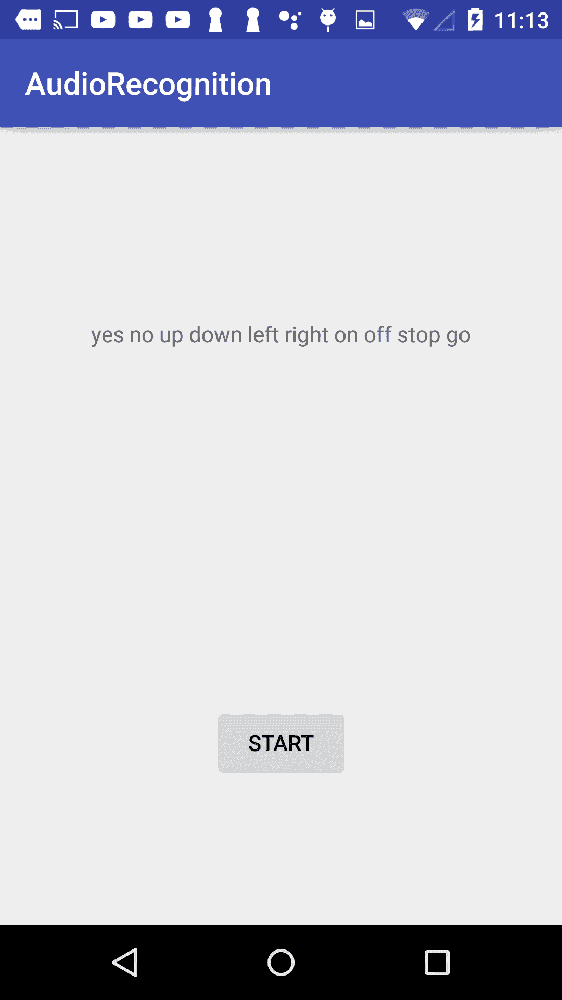
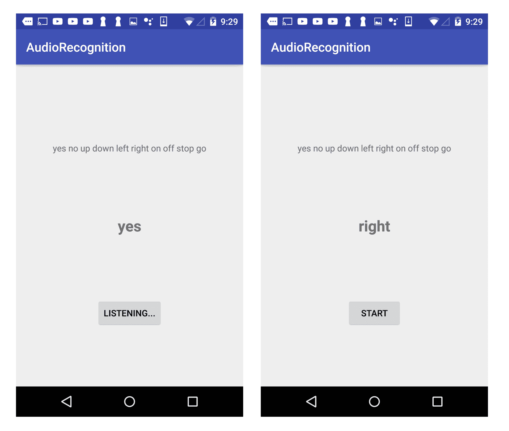
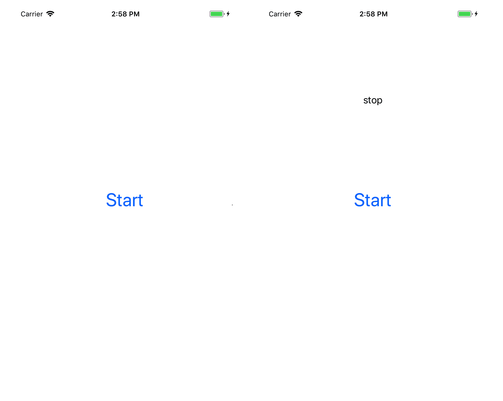
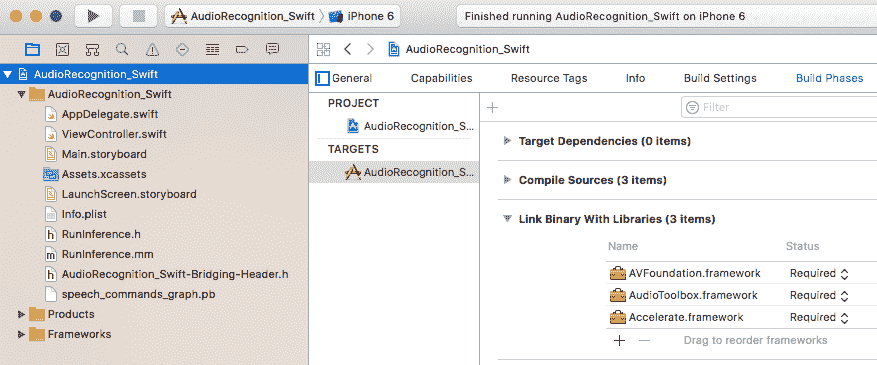

# 了解简单的语音命令


如今，语音服务（例如 Apple Siri，Amazon Alexa，Google Assistant 和 Google Translate）已变得越来越流行，因为语音是我们在某些情况下查找信息或完成任务的最自然和有效的方法。 这些语音服务中的许多服务都是基于云的，因为用户语音可能会很长而且很自由，并且**自动语音识别**（**ASR**）非常复杂，并且需要大量的计算能力。 实际上，得益于深度学习的突破，仅在最近几年，在自然和嘈杂的环境中 ASR 才变得可行。

但是在某些情况下，能够离线识别设备上的简单语音命令是有意义的。 例如，要控制 Raspberry-Pi 驱动的机器人的运动，您不需要复杂的语音命令，不仅设备上的 ASR 比基于云的解决方案还快，而且即使在 没有网络访问的环境。 设备上的简单语音命令识别还可以通过仅在发出某些明确的用户命令时才向服务器发送复杂的用户语音来节省网络带宽。

在本章中，我们将首先概述 ASR 技术，涵盖基于最新的深度学习系统和顶级开源项目。 然后，我们将讨论如何训练和重新训练 TensorFlow 模型，以识别简单的语音命令，例如“左”，“右”，“上”，“下”，“停止”和“开始”。 接下来，我们将使用训练有素的模型来构建一个简单的 Android 应用程序，然后再构建两个完整的 iOS 应用程序，一个由 Objective-C 实现，另一个由 Swift 实现。 在前两章中我们没有介绍使用 TensorFlow 模型的基于 Swift 的 iOS 应用，而本章是回顾和加强我们对构建基于 Swift 的 TensorFlow iOS 应用的理解的好地方。

总之，本章将涵盖以下主题：

*   语音识别-快速概述
*   训练简单的命令识别模型
*   在 Android 中使用简单的语音识别模型
*   在带有 Objective-C 的 iOS 中使用简单的语音识别模型
*   在带有 Swift 的 iOS 中使用简单的语音识别模型


# 语音识别-快速概述


1990 年代出现了第一个实用的独立于说话者的大词汇量和连续语音识别系统。 在 2000 年代初期，领先的初创公司 Nuance 和 SpeechWorks 提供的语音识别引擎为许多第一代基于 Web 的语音服务提供了支持，例如 TellMe，Phone 的 AOL 和 BeVocal。 当时构建的语音识别系统主要基于传统的**隐马尔可夫模型**（**HMM**），并且需要手动编写语法和安静环境以帮助识别引擎更准确地工作。

现代语音识别引擎几乎可以理解嘈杂环境下人们的任何说话，并且基于端到端深度学习，尤其是另一种更适合自然语言处理的深度神经网络，称为**循环神经网络** ]（**RNN**）。 与传统的基于 HMM 的语音识别不同，传统的基于 HMM 的语音识别需要人的专业知识来构建和微调手工设计的功能以及声学和语言模型，而基于 RNN 的端到端语音识别系统则将音频输入直接转换为文本，而无需 将音频输入转换为语音表示以进行进一步处理。

RNN allows us to handle sequences of input and/or output, because the network, by design, has memory of previous items in an input sequence or can generate a sequence of output. This makes RNN more appropriate for speech recognition, (where the input is a sequence of words uttered by users), image captioning, (where the output is a natural language sentence consisting of a series of words), text generation, and time series prediction. If you're unfamiliar with RNN, you should definitely check out *Andrey Karpathy's* blog, *The Unreasonable Effectiveness of Recurrent Neural Networks* ([http://karpathy.github.io/2015/05/21/rnn-effectiveness](http://karpathy.github.io/2015/05/21/rnn-effectiveness)). We'll also cover some detailed RNN models later in the book.

[关于 RNN 端到端语音识别的第一篇研究论文发表于 2014 年](http://proceedings.mlr.press/v32/graves14.pdf)，使用的是**连接主义的时间分类**（**CTC**）层。 2014 年下半年，百度发布了 [Deep Speech](https://arxiv.org/abs/1412.5567)，这是第一个使用基于 CTC 的端到端 RNN 构建但拥有庞大数据集的商业系统之一 ，并在嘈杂的环境中实现了比传统 ASR 系统更低的错误率。 如果您有兴趣，可以查看[深度语音的 TensorFlow 实现](https://github.com/mozilla/DeepSpeech)，但是生成的模型会 由于此类基于 CTC 的系统存在问题，因此需要太多的资源才能在手机上运行。 在部署期间，它需要一个大型语言模型来纠正部分由 RNN 的性质引起的生成的文本错误（如果您想知道为什么，请阅读前面链接的 RNN 博客以获取一些见识）。

在 2015 年和 2016 年，较新的语音识别系统使用了类似的端到端 RNN 方法，但将 CTC 层替换为[基于注意力的模型](https://arxiv.org/pdf/1508.01211.pdf)，因此 运行模型时不需要大型语言模型，因此可以在内存有限的移动设备上进行部署。 在本书的此版本中，我们将不会探讨这种可能性，而将介绍如何在移动应用中使用最新的高级 ASR 模型。 相反，我们将从一个更简单的语音识别模型开始，我们知道该模型肯定会在移动设备上很好地工作。

要将离线语音识别功能添加到移动应用程序，您还可以使用以下两个领先的开源语音识别项目之一：

*   [CMU Sphinx](https://cmusphinx.github.io) 大约 20 年前开始，但仍在积极开发中。 要构建具有语音识别功能的 Android 应用，您可以使用其为 Android 构建的 [PocketSphinx](https://github.com/cmusphinx/pocketsphinx-android)。 要构建具有语音识别功能的 iOS 应用，您可以使用 [OpenEars 框架](https://www.politepix.com/openears)，这是一个免费的 SDK，使用 CMU PocketSphinx 构建离线语音识别和文本转换 在 iOS 应用中进行语音转换。
*   [Kaldi](https://github.com/kaldi-asr/kaldi)，成立于 2009 年，最近非常活跃，截至 2018 年 1 月，已有 165 个参与者。要在 Android 上进行尝试，您可以查看[此博客文章](http://jcsilva.github.io/2017/03/18/compile-kaldi-android)。 对于 iOS，请查看[在 iOS 上使用 Kaldi 的原型](https://github.com/keenresearch/keenasr-ios-poc)。

由于这是一本关于在移动设备上使用 TensorFlow 的书，因此 TensorFlow 可用于为图像处理，语音处理和文本处理以及其他智能任务（本章其余部分的）构建强大的模型。 我们将重点介绍如何使用 TensorFlow 训练简单的语音识别模型并将其在移动应用中使用。


# 训练简单的命令识别模型


在本节中，我们将总结[编写良好的 TensorFlow 简单音频识别教程](https://www.tensorflow.org/versions/master/tutorials/audio_recognition)中使用的步骤。 一些在训练模型时可能对您有帮助的提示。

我们将建立的简单语音命令识别模型将能够识别 10 个单词：“是”，“否”，“上”，“下”，“左”，“右”，“开”，“关” “停止”和“开始”； 它也可以检测沉默。 如果没有发现沉默，并且没有发现 10 个单词，它将生成“未知”。 稍后运行`tensorflow/example/speech_commands/train.py`脚本时，我们将下载语音命令数据集并用于训练模型，实际上除了这 10 个单词外，还包含 20 个单词：“零”，“两个”，“三个”。 ..，“十”（到目前为止，您已经看到的 20 个词称为核心词）和 10 个辅助词：“床”，“鸟”，“猫”，“狗”，“快乐”，“房子” ，“马文”，“希拉”，“树”和“哇”。 核心词比辅助词（约 1750）具有更多的`.wav`文件记录（约 2350）。

The speech commands dataset is collected from an Open Speech Recording site ([https://aiyprojects.withgoogle.com/open_speech_recording](https://aiyprojects.withgoogle.com/open_speech_recording)). You should give it a try and maybe contribute a few minutes of your own recordings to help it improve and also get a sense of how you can collect your own speech commands dataset if needed. There's also a Kaggle competition ([https://www.kaggle.com/c/tensorflow-speech-recognition-challenge](https://www.kaggle.com/c/tensorflow-speech-recognition-challenge)) on using the dataset to build a model and you can learn more about speech models and tips there.

在移动应用中要训练和使用的模型基于纸质卷积神经网络，[用于小尺寸关键词发现](http://www.isca-speech.org/archive/interspeech_2015/papers/i15_1478.pdf)，这与大多数其他基于 RNN 的大规模语音识别模型不同。 基于 CNN 的语音识别模型是可能的，但很有趣，因为对于简单的语音命令识别，我们可以在短时间内将音频信号转换为图像，或更准确地说，将频谱图转换为频率 窗口期间音频信号的分布（有关使用`wav_to_spectrogram`脚本生成的示例频谱图图像，请参见本节开头的 TensorFlow 教程链接）。 换句话说，我们可以将音频信号从其原始时域表示转换为频域表示。 进行此转换的最佳算法是**离散傅立叶变换**（**DFT**），**快速傅立叶变换**（**FFT**）只是一种有效的选择 DFT 实现的算法。

As mobile developers, you probably don't need to understand DFT and FFT. But you'd better appreciate how all this model training works when used in mobile apps by knowing that behind the scenes of the TensorFlow simple speech commands model training that we're about to cover, it's the use of FFT, one of the top 10 algorithms in the 20th century, among other things of course, that makes the CNN-based speech command recognition model training possible. For a fun and intuitive tutorial on DFT, you can read this article: [http://practicalcryptography.com/miscellaneous/machine-learning/intuitive-guide-discrete-fourier-transform](http://practicalcryptography.com/miscellaneous/machine-learning/intuitive-guide-discrete-fourier-transform) .

现在，让我们执行以下步骤来训练简单语音命令识别模型：

1.  在终端上，`cd`到您的 TensorFlow 源根，可能是`~/tensorflow-1.4.0`。
2.  只需运行以下命令即可下载我们之前讨论的语音命令数据集：

```py
python tensorflow/examples/speech_commands/train.py
```

您可以使用许多参数：`--wanted_words`默认为以“ yes”开头的 10 个核心词； 您可以使用此参数添加更多可以被模型识别的单词。 要训​​练自己的语音命令数据集，请使用`--data_url --data_dir=<path_to_your_dataset>`禁用语音命令数据集的下载并访问您自己的数据集，其中每个命令应命名为自己的文件夹，其中应包含 1000-2000 个音频剪辑，大约需要 1 秒钟 长; 如果音频片段更长，则可以相应地更改`--clip_duration_ms`参数值。 有关更多详细信息，请参见`train.py`源代码和 TensorFlow 简单音频识别教程。

3.  如果您接受`train.py`的所有默认参数，则在下载 1.48 GB 语音命令数据集之后，在 GTX-1070 GPU 驱动的 Ubuntu 上，完成 18,000 个步骤的整个培训大约需要 90 分钟。 训练完成后，您应该在`/tmp/speech_commands_train`文件夹内看到检查点文件的列表，以及`conv.pbtxt`图形定义文件和名为`conv_labels.txt`的标签文件，其中包含命令列表（与命令列表相同）。 `--wanted_words`参数是默认值或设置为，在文件的开头加上两个附加词“ _silence”和“ _unknown”）：

```py
-rw-rw-r-- 1 jeff jeff 75437 Dec 9 21:08 conv.ckpt-18000.meta
-rw-rw-r-- 1 jeff jeff 433 Dec 9 21:08 checkpoint
-rw-rw-r-- 1 jeff jeff 3707448 Dec 9 21:08 conv.ckpt-18000.data-00000-of-00001
-rw-rw-r-- 1 jeff jeff 315 Dec 9 21:08 conv.ckpt-18000.index
-rw-rw-r-- 1 jeff jeff 75437 Dec 9 21:08 conv.ckpt-17900.meta
-rw-rw-r-- 1 jeff jeff 3707448 Dec 9 21:08 conv.ckpt-17900.data-00000-of-00001
-rw-rw-r-- 1 jeff jeff 315 Dec 9 21:08 conv.ckpt-17900.index
-rw-rw-r-- 1 jeff jeff 75437 Dec 9 21:07 conv.ckpt-17800.meta
-rw-rw-r-- 1 jeff jeff 3707448 Dec 9 21:07 conv.ckpt-17800.data-00000-of-00001
-rw-rw-r-- 1 jeff jeff 315 Dec 9 21:07 conv.ckpt-17800.index
-rw-rw-r-- 1 jeff jeff 75437 Dec 9 21:07 conv.ckpt-17700.meta
-rw-rw-r-- 1 jeff jeff 3707448 Dec 9 21:07 conv.ckpt-17700.data-00000-of-00001
-rw-rw-r-- 1 jeff jeff 315 Dec 9 21:07 conv.ckpt-17700.index
-rw-rw-r-- 1 jeff jeff 75437 Dec 9 21:06 conv.ckpt-17600.meta
-rw-rw-r-- 1 jeff jeff 3707448 Dec 9 21:06 conv.ckpt-17600.data-00000-of-00001
-rw-rw-r-- 1 jeff jeff 315 Dec 9 21:06 conv.ckpt-17600.index
-rw-rw-r-- 1 jeff jeff 60 Dec 9 19:41 conv_labels.txt
-rw-rw-r-- 1 jeff jeff 121649 Dec 9 19:41 conv.pbtxt
```

`conv_labels.txt`包含以下命令：

```py
_silence_
_unknown_
yes
no
up
down
left
right
on
off
stop
go
```

现在运行以下命令，将图形定义文件和检查点文件组合成一个我们可以在移动应用程序中使用的模型文件：

```py
python tensorflow/examples/speech_commands/freeze.py \
--start_checkpoint=/tmp/speech_commands_train/conv.ckpt-18000 \
--output_file=/tmp/speech_commands_graph.pb
```

4.  （可选）在移动应用程序中部署`speech_commands_graph.pb`模型文件之前，可以使用以下命令对其进行快速测试：

```py
python tensorflow/examples/speech_commands/label_wav.py  \
--graph=/tmp/speech_commands_graph.pb \
--labels=/tmp/speech_commands_train/conv_labels.txt \
--wav=/tmp/speech_dataset/go/9d171fee_nohash_1.wav
```

您将看到类似以下的输出：

```py
go (score = 0.48427)
no (score = 0.17657)
_unknown_ (score = 0.08560)
```

5.  使用`summarize_graph`工具查找输入节点和输出节点的名称：

```py
bazel-bin/tensorflow/tools/graph_transforms/summarize_graph --in_graph=/tmp/speech_commands_graph.pb
```

输出应如下所示：

```py
Found 1 possible inputs: (name=wav_data, type=string(7), shape=[]) 
No variables spotted.
Found 1 possible outputs: (name=labels_softmax, op=Softmax) 
```

不幸的是，它仅对于输出名称是正确的，并且不显示其他可能的输入。 使用`tensorboard --logdir /tmp/retrain_logs`，然后在浏览器中打开`http://localhost:6006`与图形进行交互也无济于事。 但是，前面各章中显示的小代码段可以帮助您了解输入和输出名称，以下内容与 iPython 进行了交互：

```py
In [1]: import tensorflow as tf
In [2]: g=tf.GraphDef()
In [3]: g.ParseFromString(open("/tmp/speech_commands_graph.pb","rb").read())
In [4]: x=[n.name for n in g.node]
In [5]: x
Out[5]: 
[u'wav_data',
 u'decoded_sample_data',
 u'AudioSpectrogram',
 ...
 u'MatMul',
 u'add_2',
 u'labels_softmax']
```

因此，我们看到`wav_data`和`decoded_sample_data`都是可能的输入。 如果在`freeze.py`文件中看不到注释，我们就必须深入研究模型训练代码，以准确找出应该使用的输入名称：“结果图包含一个名为 WAV 的编码数据输入 `wav_data`，用于原始 PCM 数据（在-1.0 到 1.0 范围内浮动）的一种称为`decoded_sample_data`，输出称为`labels_softmax`。” 实际上，在该模型的情况下，有一个 TensorFlow Android 示例应用程序，这是我们在第 1 章，*移动 TensorFlow* 入门中看到的一部分，称为 TF Speech，专门定义了那些 输入名称和输出名称。 在本书后面的几章中，您将看到如何在需要时借助或不借助我们的三种方法来查找模型训练的源代码，以找出关键的输入和输出节点名称。 或者希望，当您阅读本书时，TensorFlow `summarize_graph`工具将得到改进，以为我们提供准确的输入和输出节点名称。

现在是时候在移动应用中使用我们的热门新模型了。


# 在 Android 中使用简单的语音识别模型


位于`tensorflow/example/android`的用于简单语音命令识别的 TensorFlow Android 示例应用程序具有在`SpeechActivity.java`文件中进行音频记录和识别的代码，假定该应用程序需要始终准备好接受新的音频命令。 尽管在某些情况下这确实是合理的，但它导致的代码比仅在用户按下按钮后才进行记录和识别的代码要复杂得多，例如 Apple 的 Siri 的工作方式。 在本部分中，我们将向您展示如何创建新的 Android 应用并添加尽可能少的代码来记录用户的语音命令并显示识别结果。 这应该可以帮助您更轻松地将模型集成到自己的 Android 应用中。 但是，如果您需要处理语音命令应始终自动记录和识别的情况，则应查看 TensorFlow 示例 Android 应用。


# 使用模型构建新应用


执行以下步骤来构建一个完整的新 Android 应用，该应用使用我们在上一节中构建的`speech_commands_graph.pb`模型：

1.  通过接受前面几章中的所有默认设置，创建一个名为`AudioRecognition`的新 Android 应用，然后将`compile 'org.tensorflow:tensorflow-android:+'`行添加到应用`build.gradle`文件依赖项的末尾。
2.  将`<uses-permission android:name="android.permission.RECORD_AUDIO" />`添加到应用程序的`AndroidManifest.xml`文件中，以便可以允许该应用程序记录音频。
3.  创建一个新的资产文件夹，然后将在上一节的步骤 2 和 3 中生成的`speech_commands_graph.pb`和`conv_actions_labels.txt`文件拖放到`assets`文件夹中。
4.  更改`activity_main.xml`文件以容纳三个 UI 元素。 第一个是用于识别结果显示的`TextView`：

```py
<TextView
    android:id="@+id/textview"
    android:layout_width="wrap_content"
    android:layout_height="wrap_content"
    android:text=""
    android:textSize="24sp"
    android:textStyle="bold"
    app:layout_constraintBottom_toBottomOf="parent"
    app:layout_constraintLeft_toLeftOf="parent"
    app:layout_constraintRight_toRightOf="parent"
    app:layout_constraintTop_toTopOf="parent" />
```

第二个`TextView`将显示上一节第 2 步中使用`train.py` Python 程序 训练的 10 个默认命令：

```py
<TextView
    android:layout_width="wrap_content"
    android:layout_height="wrap_content"
    android:text="yes no up down left right on off stop go"
    app:layout_constraintBottom_toBottomOf="parent"
    app:layout_constraintHorizontal_bias="0.50"
    app:layout_constraintLeft_toLeftOf="parent"
    app:layout_constraintRight_toRightOf="parent"
    app:layout_constraintTop_toTopOf="parent"
    app:layout_constraintVertical_bias="0.25" />
```

最后一个 UI 元素是一个 Button，在点击该按钮时，它会开始录音一秒钟，然后将录音发送到我们的模型以进行识别：

```py
<Button
    android:id="@+id/button"
    android:layout_width="wrap_content"
    android:layout_height="wrap_content"
    android:text="Start"
    app:layout_constraintBottom_toBottomOf="parent"
    app:layout_constraintHorizontal_bias="0.50"
    app:layout_constraintLeft_toLeftOf="parent"
    app:layout_constraintRight_toRightOf="parent"
    app:layout_constraintTop_toTopOf="parent"
    app:layout_constraintVertical_bias="0.8" />
```

5.  打开`MainActivity.java`，首先创建`MainActivity` `implements Runnable`类。 然后添加以下常量，以定义模型名称，标签名称，输入名称和输出名称：

```py
private static final String MODEL_FILENAME = "file:///android_asset/speech_commands_graph.pb";
private static final String LABEL_FILENAME = "file:///android_asset/conv_actions_labels.txt";
private static final String INPUT_DATA_NAME = "decoded_sample_data:0";
private static final String INPUT_SAMPLE_RATE_NAME = "decoded_sample_data:1";
private static final String OUTPUT_NODE_NAME = "labels_softmax";
```

6.  声明四个实例变量：

```py
private TensorFlowInferenceInterface mInferenceInterface;
private List<String> mLabels = new ArrayList<String>();
private Button mButton;
private TextView mTextView;
```

7.  在`onCreate`方法中，我们首先实例化`mButton`和`mTextView`，然后设置按钮单击事件处理程序，该事件处理程序首先更改按钮标题，然后启动线程进行记录和识别：

```py
mButton = findViewById(R.id.button);
mTextView = findViewById(R.id.textview);
mButton.setOnClickListener(new View.OnClickListener() {
    @Override
    public void onClick(View v) {
        mButton.setText("Listening...");
        Thread thread = new Thread(MainActivity.this);
        thread.start();
    }
});
```

在`onCreate`方法的末尾，我们逐行读取标签文件的内容，并将每一行保存在`mLabels`数组列表中。

8.  在`public void run()`方法的开头（单击“开始”按钮时开始），添加代码，该代码首先获得用于创建 Android `AudioRecord`对象的最小缓冲区大小，然后使用`buffersize`创建新的`AudioRecord`实例 具有 16,000 `SAMPLE_RATE`和 16 位单声道格式，这是我们模型所期望的原始音频的类型，并最终从`AudioRecord`实例开始记录：

```py
int bufferSize = AudioRecord.getMinBufferSize(SAMPLE_RATE, AudioFormat.CHANNEL_IN_MONO, AudioFormat.ENCODING_PCM_16BIT);
AudioRecord record = new AudioRecord(MediaRecorder.AudioSource.DEFAULT, SAMPLE_RATE, AudioFormat.CHANNEL_IN_MONO, AudioFormat.ENCODING_PCM_16BIT, bufferSize);

if (record.getState() != AudioRecord.STATE_INITIALIZED) return;
record.startRecording();
```

There are two classes in Android for recording audio: `MediaRecorder` and `AudioRecord`. `MediaRecorder` is easier to use than `AudioRecord`, but it saves compressed audio files until Android API Level 24 (Android 7.0), which supports recording raw, unprocessed audio. According to [https://developer.android.com/about/dashboards/index.html](https://developer.android.com/about/dashboards/index.html), as of January 2018, there are more than 70% of Android devices in the market that still run Android versions older than 7.0\. You probably would prefer not to target your app to Android 7.0 or above. In addition, to decode the compressed audio recorded by `MediaRecorder`, you have to use `MediaCodec`, which is pretty complicated to use. `AudioRecord`, albeit a low-level API, is actually perfect for recording raw unprocessed data which is then sent to the speech commands recognition model for processing.

9.  创建两个由 16 位短整数组成的数组`audioBuffer`和`recordingBuffer`，对于 1 秒记录，每次`AudioRecord`对象读取并填充`audioBuffer`数组后，实际读取的数据都会附加到 `recordingBuffer`：

```py
long shortsRead = 0;
int recordingOffset = 0;
short[] audioBuffer = new short[bufferSize / 2];
short[] recordingBuffer = new short[RECORDING_LENGTH];
while (shortsRead < RECORDING_LENGTH) { // 1 second of recording
    int numberOfShort = record.read(audioBuffer, 0, audioBuffer.length);
    shortsRead += numberOfShort;
    System.arraycopy(audioBuffer, 0, recordingBuffer, recordingOffset, numberOfShort);
    recordingOffset += numberOfShort;
}
record.stop();
record.release();
```

10.  录制完成后，我们首先将按钮标题更改为`Recognizing`：

```py
runOnUiThread(new Runnable() {
    @Override
    public void run() {
        mButton.setText("Recognizing...");
    }
});
```

然后将`recordingBuffer` 短数组 转换​​为`float`数组，同时使`float`数组的每个元素都在-1.0 和 1.0 的范围内，因为我们的模型期望在-之间浮动 1.0 和 1.0：

```py
float[] floatInputBuffer = new float[RECORDING_LENGTH];
for (int i = 0; i < RECORDING_LENGTH; ++i) {
    floatInputBuffer[i] = recordingBuffer[i] / 32767.0f;
}
```

11.  如前几章所述，创建一个新的`TensorFlowInferenceInterface`，然后使用两个输入节点的名称和值调用其`feed`方法，其中一个是采样率，另一个是存储在`floatInputBuffer`中的原始音频数据 ]数组：

```py
AssetManager assetManager = getAssets();
mInferenceInterface = new TensorFlowInferenceInterface(assetManager, MODEL_FILENAME);

int[] sampleRate = new int[] {SAMPLE_RATE};
mInferenceInterface.feed(INPUT_SAMPLE_RATE_NAME, sampleRate);

mInferenceInterface.feed(INPUT_DATA_NAME, floatInputBuffer, RECORDING_LENGTH, 1);
```

之后，我们调用`run`方法在模型上运行识别推理，然后`fetch`输出 10 个语音命令中每个命令的输出分数以及“未知”和“沉默”输出：

```py
String[] outputScoresNames = new String[] {OUTPUT_NODE_NAME};
mInferenceInterface.run(outputScoresNames);

float[] outputScores = new float[mLabels.size()];
mInferenceInterface.fetch(OUTPUT_NODE_NAME, outputScores);
```

12.  `outputScores`数组与`mLabels`列表匹配，因此我们可以轻松找到最高得分并获取其命令名称：

```py
float max = outputScores[0];
int idx = 0;
for (int i=1; i<outputScores.length; i++) {
    if (outputScores[i] > max) {
        max = outputScores[i];
        idx = i;
    }
}
final String result = mLabels.get(idx);
```

最后，我们在`TextView`中显示结果，并将按钮标题更改回`"Start"`，以便用户可以再次开始记录和识别语音命令：

```py
runOnUiThread(new Runnable() {
    @Override
    public void run() {
        mButton.setText("Start");
        mTextView.setText(result);
    }
});
```


# 显示模型驱动的识别结果


现在，在您的 Android 设备上运行该应用。 您将看到如图 5.1 所示的初始屏幕：

Figure 5.1 Showing the initial screen after app starts

点击 START 按钮，然后开始说上面显示的 10 个命令之一。 您将看到按钮标题更改为侦听... ，然后是识别... ，如图 5.2 所示：

Figure 5.2 Listening to record audio and recognizing the recorded audio

识别结果几乎实时显示在屏幕中间，如图 5.3 所示：

Figure 5.3 Showing the recognized speech commands

整个识别过程几乎立即完成，用于识别的`speech_commands_graph.pb`模型仅为 3.7 MB。 当然，它仅支持 10 条语音命令，但是即使使用`train.py`脚本的 `--wanted_words`参数或您自己的数据集支持数十个命令，大小也不会发生太大变化，正如我们在培训部分中讨论的那样。

诚然，此处的应用屏幕截图并不像上一章中那样生动有趣（一张图片价值一千个单词），但是语音识别当然可以做艺术家不能做的事情，例如发出语音命令来控制 机器人的运动。

该应用程序的完整源代码位于 Github 上该书的源代码存储库的`Ch5/android`文件夹中。 现在让我们看看如何使用该模型构建 iOS 应用程序，其中涉及一些复杂的 TensorFlow iOS 库构建和音频数据准备步骤，以使模型正确运行。


# 在带有 Objective-C 的 iOS 中使用简单的语音识别模型


如果您已经阅读了前三章中的 iOS 应用程序，那么您可能更喜欢使用手动构建的 TensorFlow iOS 库而不是 TensorFlow 实验窗格，就像使用手动库方法一样，您可以更好地控制可以使用哪些 TensorFlow 操作 添加更好的模型使您的模型满意，这也是我们决定专注于 TensorFlow Mobile 而不是第 1 章， *Mobile TensorFlow* 的 TensorFlow Lite 的原因之一。

因此，尽管您可以在阅读本书时尝试使用 TensorFlow 吊舱，以查看吊舱是否已更新以支持模型中使用的所有操作，但从现在开始，我们将始终使用手动构建的 TensorFlow 库（ 请参见 iOS 应用中第 3 章，“检测对象及其位置”的*在 iOS 中使用对象检测模型的*部分的步骤 1 和 2）。


# 使用模型构建新应用


现在执行以下步骤来创建一个新的 iOS 应用以使用语音命令识别模型：

1.  在 Xcode 中创建一个名为 AudioRecognition 的新 Objective-C 应用，并将项目设置为使用 TensorFlow 手动构建的库，如*的步骤 1 中所述。 4 和*以惊人的艺术风格转换图片*。 还将`AudioToolbox.framework`，`AVFoundation.framework`和`Accelerate.framework`添加到目标的带库的链接二进制文件。*

2.  将`speech_commands_graph.pb`模型文件拖放到项目中。
3.  将`ViewController.m`的扩展名更改为`mm`，然后添加音频记录和处理所使用的以下标头：

```py
#import <AVFoundation/AVAudioRecorder.h>
#import <AVFoundation/AVAudioSettings.h>
#import <AVFoundation/AVAudioSession.h>
#import <AudioToolbox/AudioToolbox.h>
```

还添加 TensorFlow 的标头：

```py
#include <fstream>
#include "tensorflow/core/framework/op_kernel.h"
#include "tensorflow/core/framework/tensor.h"
#include "tensorflow/core/public/session.h"
```

现在，定义一个音频`SAMPLE_RATE`常量，一个指向浮点数组的 C 指针，该数组保存将要发送到模型的音频数据，我们的关键`audioRecognition`函数签名以及两个属性，其中包含记录的文件路径和一个 iOS `AVAudioRecorder`实例。 我们还需要让`ViewController`实现`AudioRecorderDelegate`，以便它知道录制何时结束：

```py
const int SAMPLE_RATE = 16000;
float *floatInputBuffer;
std::string audioRecognition(float* floatInputBuffer, int length);
@interface ViewController () <AVAudioRecorderDelegate>
@property (nonatomic, strong) NSString *recorderFilePath;
@property (nonatomic, strong) AVAudioRecorder *recorder;
@end
```

在此，我们不会显示以编程方式创建两个 UI 元素的代码段：一个按钮，当您点击该按钮时，它将开始录制 1 秒钟的音频，然后将音频发送到我们的模型以进行识别，以及一个显示识别结果的标签。 但是，我们将在下一部分中的 Swift 中展示一些 UI 代码以供复习。

4.  在按钮的`UIControlEventTouchUpInside`处理程序内，我们首先创建一个`AVAudioSession`实例，并将其类别设置为 record 并将其激活：

```py
AVAudioSession *audioSession = [AVAudioSession sharedInstance];
NSError *err = nil;
[audioSession setCategory:AVAudioSessionCategoryPlayAndRecord error:&err];
if(err){
    NSLog(@"audioSession: %@", [[err userInfo] description]);
    return;
}

[audioSession setActive:YES error:&err];
if(err){
    NSLog(@"audioSession: %@", [[err userInfo] description]);
    return;
}
```

然后创建一个记录设置字典：

```py
NSMutableDictionary *recordSetting = [[NSMutableDictionary alloc] init];
[recordSetting setValue:[NSNumber numberWithInt:kAudioFormatLinearPCM] forKey:AVFormatIDKey];
[recordSetting setValue:[NSNumber numberWithFloat:SAMPLE_RATE] forKey:AVSampleRateKey];
[recordSetting setValue:[NSNumber numberWithInt: 1] forKey:AVNumberOfChannelsKey];
[recordSetting setValue :[NSNumber numberWithInt:16] forKey:AVLinearPCMBitDepthKey];
[recordSetting setValue :[NSNumber numberWithBool:NO] forKey:AVLinearPCMIsBigEndianKey];
[recordSetting setValue :[NSNumber numberWithBool:NO] forKey:AVLinearPCMIsFloatKey];
[recordSetting setValue:[NSNumber numberWithInt:AVAudioQualityMax] forKey:AVEncoderAudioQualityKey];
```

最后，在按钮点击处理程序中，我们定义保存录制的音频的位置，创建`AVAudioRecorder`实例，设置其委托并开始录制 1 秒钟：

```py
self.recorderFilePath = [NSString stringWithFormat:@"%@/recorded_file.wav", [NSHomeDirectory() stringByAppendingPathComponent:@"tmp"]];
NSURL *url = [NSURL fileURLWithPath:_recorderFilePath];
err = nil;
_recorder = [[ AVAudioRecorder alloc] initWithURL:url settings:recordSetting error:&err];
if(!_recorder){
    NSLog(@"recorder: %@", [[err userInfo] description]);
    return;
}
[_recorder setDelegate:self];
[_recorder prepareToRecord];
[_recorder recordForDuration:1];
```

5.  在`AVAudioRecorderDelegate`，`audioRecorderDidFinishRecording`的委托方法中，我们使用 Apple 的扩展音频文件服务，该服务用于读写压缩和线性 PCM 音频文件，以加载记录的音频，并将其转换为模型所需的格式， 并将音频数据读入存储器。 我们在这里不会显示这部分代码，[它主要基于此博客](https://batmobile.blogs.ilrt.org/loading-audio-file-on-an-iphone/)。 在此处理之后，`floatInputBuffer`指向原始音频样本。 现在，我们可以将数据传递到工作线程中的`audioRecognition`方法中，并在 UI 线程中显示结果：

```py
dispatch_async(dispatch_get_global_queue(0, 0), ^{
    std::string command = audioRecognition(floatInputBuffer, totalRead);
    delete [] floatInputBuffer;
    dispatch_async(dispatch_get_main_queue(), ^{
        NSString *cmd = [NSString stringWithCString:command.c_str() encoding:[NSString defaultCStringEncoding]];
        [_lbl setText:cmd];
        [_btn setTitle:@"Start" forState:UIControlStateNormal];
    });
});
```

6.  在`audioRecognition`方法内部，我们首先定义一个 C ++ `string`数组，其中包含要识别的 10 个命令以及两个特殊值`"_silence_"`和`"_unknown_"`：

```py
std::string commands[] = {"_silence_", "_unknown_", "yes", "no", "up", "down", "left", "right", "on", "off", "stop", "go"};
```

在完成标准 TensorFlow `Session`，`Status`和`GraphDef`设置后（如我们在前几章的 iOS 应用中所做的那样），我们读出了模型文件，并尝试使用它创建 TensorFlow `Session`：

```py
NSString* network_path = FilePathForResourceName(@"speech_commands_graph", @"pb");

PortableReadFileToProto([network_path UTF8String], &tensorflow_graph);

tensorflow::Status s = session->Create(tensorflow_graph);
if (!s.ok()) {
    LOG(ERROR) << "Could not create TensorFlow Graph: " << s;
    return "";
}
```

如果成功创建了会话，则为模型定义两个输入节点名称和一个输出节点名称：

```py
std::string input_name1 = "decoded_sample_data:0";
std::string input_name2 = "decoded_sample_data:1";
std::string output_name = "labels_softmax";
```

7.  对于`"decoded_sample_data:0"`，我们需要将采样率值作为标量发送（否则在调用 TensorFlow Session 的`run`方法时会出错），并且在 TensorFlow C ++ API 中定义了张量，如下所示：

```py
tensorflow::Tensor samplerate_tensor(tensorflow::DT_INT32, tensorflow::TensorShape());
samplerate_tensor.scalar<int>()() = SAMPLE_RATE;
```

对于 `"decoded_sample_data:1"`，需要将浮点数中的音频数据从`floatInputBuffer`数组转换为 TensorFlow `audio_tensor`张量，其方式类似于`image_tensor`的定义和设置方式 前几章：

```py
tensorflow::Tensor audio_tensor(tensorflow::DT_FLOAT, tensorflow::TensorShape({length, 1}));
auto audio_tensor_mapped = audio_tensor.tensor<float, 2>();
float* out = audio_tensor_mapped.data();
for (int i = 0; i < length; i++) {
    out[i] = floatInputBuffer[i];
}
```

现在我们可以像以前一样使用输入来运行模型并获取输出：

```py
std::vector<tensorflow::Tensor> outputScores;
tensorflow::Status run_status = session->Run({{input_name1, audio_tensor}, {input_name2, samplerate_tensor}},{output_name}, {}, &outputScores);
if (!run_status.ok()) {
    LOG(ERROR) << "Running model failed: " << run_status;
    return "";
}
```

8.  我们对模型的`outputScores`输出进行简单的解析，然后返回最高分。 `outputScores`是 TensorFlow 张量的向量，其第一个元素包含 12 个可能的识别结果的 12 个得分值。 可以通过`flat`方法访问这 12 个得分值，并检查最大得分：

```py
tensorflow::Tensor* output = &outputScores[0];
const Eigen::TensorMap<Eigen::Tensor<float, 1, Eigen::RowMajor>, Eigen::Aligned>& prediction = output->flat<float>();
const long count = prediction.size();
int idx = 0;
float max = prediction(0);
for (int i = 1; i < count; i++) {
    const float value = prediction(i);
    printf("%d: %f", i, value);
    if (value > max) {
        max = value;
        idx = i;
    }
}

return commands[idx];
```

在应用程序可以录制任何音频之前，您需要做的另一件事是在应用程序的`Info.plist`文件中创建一个新的*隐私-麦克风使用说明*属性，并将该属性的值设置为诸如“听到并识别” 您的语音命令”。

现在，在 iOS 模拟器上运行该应用程序（如果您的 Xcode 版本早于 9.2，而 iOS 模拟器版本早于 10.0，则您可能必须在实际的 iOS 设备上运行该应用程序，因为您可能无法在 iOS 中录制音频 模拟器（10.0 之前的版本）或 iPhone，您将首先看到带有 Start 按钮位于中间的初始屏幕，然后点击该按钮并说出 10 个命令之一，识别结果应出现在顶部 ，如图 5.4 所示：

Figure 5.4 Showing the initial screen and recognition result

是的，应该会出现识别结果，但实际上不会出现，因为在 Xcode 输出窗格中会出现错误：

```py
Could not create TensorFlow Graph: Not found: Op type not registered 'DecodeWav' in binary running on XXX's-MacBook-Pro.local. Make sure the Op and Kernel are registered in the binary running in this process.
```


# 使用 tf_op_files.txt 修复模型加载错误


我们已经在前面的章节中看到了这种臭名昭著的错误，除非您知道它的真正含义，否则弄清楚该修复程序可能要花很多时间。 TensorFlow 操作由两部分组成：位于 `tensorflow/core/ops`文件夹中的称为 ops 的定义（这有点令人困惑，因为 op 既可以表示其定义，其实现，也可以表示其定义）。 和位于 `tensorflow/core/kernels`文件夹中的实现（称为内核）。 `tensorflow/contrib/makefile`文件夹中有一个名为`tf_op_files.txt`的文件，其中列出了在手动构建库时需要内置到 TensorFlow iOS 库中的操作的定义和实现。 `tf_op_files.txt`文件应该包含所有操作定义文件，如[为 TensorFlow 移动部署准备模型](https://www.tensorflow.org/mobile/prepare_models)，因为它们占用的空间很小。 但从 TensorFlow 1.4 或 1.5 开始，`tf_op_files.txt`文件中并未包含所有操作的 op 定义。 因此，当我们看到“未注册操作类型”错误时，我们需要找出哪个操作定义和实现文件负责该操作。 在我们的情况下，op 类型名为`DecodeWav`。 我们可以运行以下两个 Shell 命令来获取信息：

```py
$ grep 'REGISTER.*"DecodeWav"' tensorflow/core/ops/*.cc
tensorflow/core/ops/audio_ops.cc:REGISTER_OP("DecodeWav")

$ grep 'REGISTER.*"DecodeWav"' tensorflow/core/kernels/*.cc
tensorflow/core/kernels/decode_wav_op.cc:REGISTER_KERNEL_BUILDER(Name("DecodeWav").Device(DEVICE_CPU), DecodeWavOp);
```

在 TensorFlow 1.4 的 `tf_op_files.txt`文件中，已经有一行文本`tensorflow/core/kernels/decode_wav_op.cc`，但可以肯定的是`tensorflow/core/ops/audio_ops.cc`丢失了。 我们需要做的就是在`tf_op_files.txt`文件中的任意位置添加一行`tensorflow/core/ops/audio_ops.cc`，并像在第 3 章，*检测对象及其位置中一样运行`tensorflow/contrib/makefile/build_all_ios.sh`* ，以重建 TensorFlow iOS 库。 然后再次运行 iOS 应用，并继续轻按启动按钮，然后说出语音命令以识别或误解，直到您无聊为止。

The process on how to fix the "Not found: Op type not registered" error is a big takeaway from this chapter, as it can possibly save you a lot of time when working on other TensorFlow models in the future.

但是，在继续学习下一章中将介绍和使用另一种新的 TensorFlow AI 模型之前，让我们给其他喜欢使用更新的且至少对他们更凉快的 Swift 语言的 iOS 开发人员一些考虑。


# 通过 Swift 在 iOS 中使用简单的语音识别模型


我们在第 2 章，*中使用 TensorFlow 窗格创建了一个基于 Swift 的 iOS 应用，并通过 Transfer Learning* 对图像进行了分类。 现在让我们创建一个新的 Swift 应用程序，该应用程序使用我们在上一节中手动构建的 TensorFlow iOS 库，并在我们的 Swift 应用程序中使用语音命令模型：

1.  通过 Xcode 创建一个新的 Single View iOS 项目，并按照与上一节中的步骤 1 和 2 相同的方式设置该项目，除了将语言设置为 Swift。
2.  选择 Xcode 文件 | 新增 | 文件 ...，然后选择 Objective-C 文件。 输入名称`RunInference`。 您将看到一个消息框，询问您“您是否要配置一个 Objective-C 桥接头？” 单击创建桥接标题。 将文件`RunInference.m`重命名为`RunInfence.mm`，因为我们将混合使用 C，C ++和 Objective-C 代码来进行后期录音音频处理和识别。 我们仍在 Swift 应用程序中使用 Objective-C，因为要从 Swift 调用 TensorFlow C ++代码，我们需要一个 Objective-C 类作为 C ++代码的包装。
3.  创建一个名为`RunInference.h`的头文件，并添加以下代码：

```py
@interface RunInference_Wrapper : NSObject
- (NSString *)run_inference_wrapper:(NSString*)recorderFilePath;
@end
```

现在，您在 Xcode 中的应用程序应类似于图 5.5：

Figure 5.5 The Swift-based iOS app project

4.  打开`ViewController.swift`。 在`import UIKit`之后的顶部添加以下代码：

```py
import AVFoundation

let _lbl = UILabel()
let _btn = UIButton(type: .system)
var _recorderFilePath: String!
```

然后使`ViewController`看起来像这样（未显示为`_btn`和`_lbl`定义`NSLayoutConstraint`并调用`addConstraint`的代码段）：

```py
class ViewController: UIViewController, AVAudioRecorderDelegate {
    var audioRecorder: AVAudioRecorder!
override func viewDidLoad() {
    super.viewDidLoad()

    _btn.translatesAutoresizingMaskIntoConstraints = false
    _btn.titleLabel?.font = UIFont.systemFont(ofSize:32)
    _btn.setTitle("Start", for: .normal)
    self.view.addSubview(_btn)

    _btn.addTarget(self, action:#selector(btnTapped), for: .touchUpInside)

    _lbl.translatesAutoresizingMaskIntoConstraints = false
    self.view.addSubview(_lbl)
```

5.  添加一个按钮点击处理程序，并在其内部，首先请求用户的录制许可：

```py
@objc func btnTapped() {
    _lbl.text = "..."
    _btn.setTitle("Listening...", for: .normal)

    AVAudioSession.sharedInstance().requestRecordPermission () {
        [unowned self] allowed in
        if allowed {
            print("mic allowed")
        } else {
            print("denied by user")
            return
        }
    }
```

然后创建一个`AudioSession`实例，并将其类别设置为记录，并将状态设置为活动，就像我们在 Objective-C 版本中所做的一样：

```py
let audioSession = AVAudioSession.sharedInstance()

do {
    try audioSession.setCategory(AVAudioSessionCategoryRecord)
    try audioSession.setActive(true)
} catch {
    print("recording exception")
    return
}
```

现在定义`AVAudioRecorder`要使用的设置：

```py
let settings = [
    AVFormatIDKey: Int(kAudioFormatLinearPCM),
    AVSampleRateKey: 16000,
    AVNumberOfChannelsKey: 1,
    AVLinearPCMBitDepthKey: 16,
    AVLinearPCMIsBigEndianKey: false,
    AVLinearPCMIsFloatKey: false,
    AVEncoderAudioQualityKey: AVAudioQuality.high.rawValue
    ] as [String : Any]
```

设置文件路径以保存录制的音频，创建`AVAudioRecorder`实例，设置其委托并开始录制 1 秒钟：

```py
do {
    _recorderFilePath = NSHomeDirectory().stringByAppendingPathComponent(path: "tmp").stringByAppendingPathComponent(path: "recorded_file.wav")
    audioRecorder = try AVAudioRecorder(url: NSURL.fileURL(withPath: _recorderFilePath), settings: settings)
    audioRecorder.delegate = self
    audioRecorder.record(forDuration: 1)
} catch let error {
    print("error:" + error.localizedDescription)
}
```

6.  在`ViewController.swift`的末尾，添加具有以下实现的`AVAudioRecorderDelegate`方法`audioRecorderDidFinishRecording`，该实现主要调用`run_inference_wrapper`进行音频后处理和识别：

```py
func audioRecorderDidFinishRecording(_ recorder: AVAudioRecorder, successfully flag: Bool) {
    _btn.setTitle("Recognizing...", for: .normal)
    if flag {
        let result = RunInference_Wrapper().run_inference_wrapper(_recorderFilePath)
        _lbl.text = result
    }
    else {
        _lbl.text = "Recording error"
    }
    _btn.setTitle("Start", for: .normal)
}
```

在`AudioRecognition_Swift-Bridging-Header.h`文件中，添加`#include "RunInference.h"`，以便前面的 Swift 代码`RunInference_Wrapper().run_inference_wrapper(_recorderFilePath)`起作用。

7.  在`run_inference_wrapper`方法内的`RunInference.mm`中，从 Objective-C `AudioRecognition`应用程序中的`ViewController.mm`复制代码，如上一节的步骤 5-8 所述，该代码将保存的录制音频转换为格式 TensorFlow 模型接受模型，然后将其与采样率一起发送给模型以获取识别结果：

```py
@implementation RunInference_Wrapper
- (NSString *)run_inference_wrapper:(NSString*)recorderFilePath {
...
}
```

如果您确实想将尽可能多的代码移植到 Swift，[则可以用 Swift 替换 C 中的音频文件转换代码](https://developer.apple.com/documentation/audiotoolbox/extended_audio_file_services)。 还有一些非官方的开源项目提供了官方 TensorFlow C ++ API 的 Swift 包装器。 但是为了简单起见和达到适当的平衡，我们将保持 TensorFlow 模型的推论，在本示例中，还将保持音频文件的读取和转换，以及在 C ++和 Objective-C 中与控制 UI 和 录音，并启动呼叫以进行音频处理和识别。

这就是构建使用语音命令识别模型的 Swift iOS 应用所需的全部内容。 现在，您可以在 iOS 模拟器或实际设备上运行它，并看到与 Objective-C 版本完全相同的结果。


# 概要


在本章中，我们首先快速概述了语音识别以及如何使用端到端深度学习方法构建现代 ASR 系统。 然后，我们介绍了如何训练 TensorFlow 模型以识别简单的语音命令，并介绍了如何在 Android 应用以及基于 Objective-C 和 Swift 的 iOS 应用中使用该模型的分步教程。 我们还讨论了如何通过找出丢失的 TensorFlow op 或内核文件，添加它并重建 TensorFlow iOS 库来修复 iOS 中常见的模型加载错误。

ASR 用于将语音转换为文本。 在下一章中，我们将探讨另一个将文本作为输出的模型，并且文本中将包含完整的自然语言句子，而不是本章中的简单命令。 我们将介绍如何构建模型以将图像，我们的老朋友转换为文本，以及如何在移动应用程序中使用该模型。 观察和描述您在自然语言中看到的内容需要真正的人类智慧。 Sherlock Holmes 是完成这项任务的最佳人选之一。 我们当然还不如福尔摩斯，但是让我们看看如何开始。


