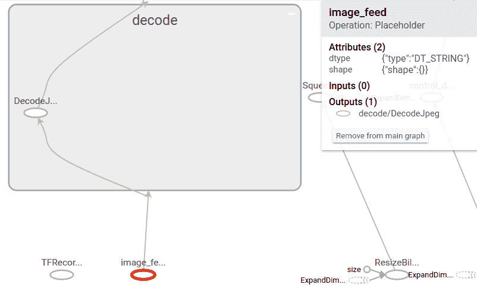
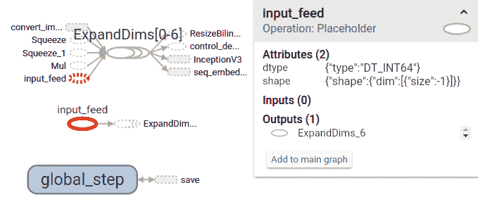
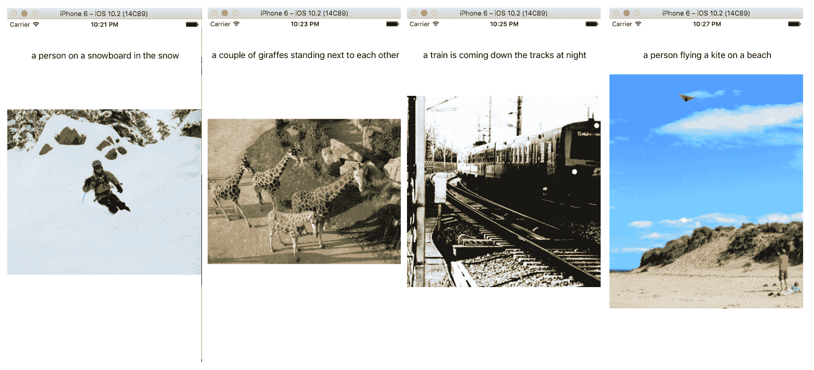

# 用自然语言描述图像


如果图像分类和物体检测是明智的任务，那么用自然语言描述图像绝对是一项更具挑战性的任务，需要更多的智能-请片刻考虑一下每个人如何从新生儿成长（他们学会了识别物体并检测它们的位置）到三岁的孩子（他们学会讲述图片故事）。 用自然语言描述图像的任务的正式术语是图像标题。 与具有长期研究和发展历史的语音识别不同，图像字幕（具有完整的自然语言，而不仅仅是关键词输出）由于其复杂性和 2012 年的深度学习突破而仅经历了短暂而令人兴奋的研究历史。

在本章中，我们将首先回顾基于深度学习的图像字幕模型如何赢得 2015 年 Microsoft COCO（大规模对象检测，分割和字幕数据集），我们在第 3 章，“检测对象及其位置”中简要介绍了该有效模型。 然后，我们将总结在 TensorFlow 中训练模型的步骤，并详细介绍如何准备和优化要在移动设备上部署的复杂模型。 之后，我们将向您展示有关如何构建 iOS 和 Android 应用以使用该模型生成描述图像的自然语言语句的分步教程。 由于该模型同时涉及计算机视觉和自然语言处理，因此您将首次看到两种主要的深度神经网络架构 CNN 和 RNN 如何协同工作，以及如何编写 iOS 和 Android 代码以访问经过训练的网络并进行多个推理。 总而言之，我们将在本章介绍以下主题：

*   图像字幕 -- 工作原理
*   训练和冻结图像字幕模型
*   转换和优化图像字幕模型
*   在 iOS 中使用图像字幕模型
*   在 Android 中使用图像字幕模型


# 图像字幕 -- 工作原理


[Show and Tell：从 2015 年 MSCOCO 图像字幕挑战赛中汲取的经验教训](https://arxiv.org/pdf/1609.06647.pdf)。 在讨论训练过程之前，[TensorFlow 的 im2txt 模型文档网站](https://github.com/tensorflow/models/tree/master/research/im2txt)中也对此进行了很好的介绍，让我们首先基本了解一下解模型的工作原理。 这也将帮助您了解 Python 中的训练和推理代码，以及本章稍后将介绍的 iOS 和 Android 中的推理代码。

获奖的 Show and Tell 模型是使用端到端方法进行训练的，类似于我们在上一章中简要介绍的最新的基于深度学习的语音识别模型。 它使用 MSCOCO 图像字幕 2014 数据集，可从[这里](http://cocodataset.org/#download)下载，该数据集包含超过 82,000 个训练图像，并以描述它们的自然语言句子为目标。 训练模型以使为每个输入图像输出目标自然语言句子的可能性最大化。 与使用多个子系统的其他更复杂的训练方法不同，端到端方法优雅，简单，并且可以实现最新的结果。

为了处理和表示输入图像，Show and Tell 模型使用预训练的 Inception v3 模型，该模型与我们在第 2 章，“通过迁移学习对图像进行分类”所使用的相同。 Inception v3 CNN 网络的最后一个隐藏层用作输入图像的表示。 由于 CNN 模型的性质，较早的层捕获更多的基本图像信息，而较后的层捕获更高级的图像概念。 因此，通过使用输入图像的最后一个隐藏层来表示图像，我们可以更好地准备具有高级概念的自然语言输出。 毕竟，我们通常会开始用诸如“人”或“火车”之类的词来描述图片，而不是“带有尖锐边缘的东西”。

为了表示目标自然语言输出中的每个单词，使用了单词嵌入方法。 词嵌入只是词的向量表示。 [TensorFlow 网站上有一个不错的教程](https://www.tensorflow.org/tutorials/word2vec)，介绍如何构建模型来获取单词的向量表示。

现在，在既表示输入图像又表示输出单词的情况下（每个这样的单词对构成一个训练示例），给定的最佳训练模型可用于最大化在目标输出中生成每个单词`w`的概率，给定输入图像和该单词`w`之前的先前单词，它是 RNN 序列模型，或更具体地说，是**长短期记忆**（**LSTM**）的 RNN 模型类型。 LSTM 以解决常规 RNN 模型固有的消失和爆炸梯度问题而闻名。 为了更好地了解 LSTM，[您应该查看这个热门博客](http://colah.github.io/posts/2015-08-Understanding-LSTMs)。

梯度概念在反向传播过程中用于更新网络权重，因此它可以学习生成更好的输出。 如果您不熟悉反向传播过程，它是神经网络中最基本，功能最强大的算法之一，那么您绝对应该花些时间来理解它-只是 Google 的“反向传播”，排名前五的结果都不会令人失望。 消失的梯度意味着，在深度神经网络反向传播学习过程中，早期层中的网络权重几乎没有更新，因此网络永不收敛。 梯度爆炸意味着这些权重更新得过分疯狂，从而导致网络差异很大。 因此，如果某人头脑封闭，从不学习，或者某人对新事物疯狂而又失去兴趣就快，那么您就会知道他们似乎遇到了什么样的梯度问题。

训练后，可以将 CNN 和 LSTM 模型一起用于推理：给定输入图像，该模型可以估计每个单词的概率，从而预测最有可能为输出语句生成哪`n`个最佳单词； 然后，给定输入图像和`n`个最佳单词，可以生成`n`个最佳的下一个单词，然后继续进行，直到模型返回句子的特定结尾单词，或达到了生成的句子的指定单词长度（以防止模型过于冗长）时，我们得到一个完整的句子。

在每次生成单词时使用`n`个最佳单词（意味着在末尾具有`n`个最佳句子）被称为集束搜索。 当`n`（即集束大小）为 1 时，它仅基于模型返回的所有可能单词中的最高概率值，就成为贪婪搜索或最佳搜索。 TensorFlow im2txt 官方模型的下一部分中的训练和推理过程使用以 Python 实现的集束大小设置为 3 的集束搜索； 为了进行比较，我们将开发的 iOS 和 Android 应用使用更简单的贪婪或最佳搜索。 您将看到哪种方法可以生成更好的字幕。


# 训练和冻结图像字幕模型


在本部分中，我们将首先总结训练训练名为 im2txt 的 Show and Tell 模型的过程，该模型记录在[这个页面](https://github.com/tensorflow/models/tree/master/research/im2txt)中， 一些提示，以帮助您更好地了解该过程。 然后，我们将展示 im2txt 模型项目随附的 Python 代码的一些关键更改，以便冻结该模型以准备在移动设备上使用。


# 训练和测试字幕生成


如果您已按照第 3 章“检测对象及其位置”中的“设置 TensorFlow 对象检测 API”部分进行操作，那么您已经安装`im2txt`文件夹； 否则，只需将`cd`移至您的 TensorFlow 源根目录，然后运行：

```py
 git clone https://github.com/tensorflow/models
```

您可能尚未安装的一个 Python 库是 **自然语言工具包**（**NLTK**），这是最流行的用于自然语言处理的 Python 库之一。 只需访问[其网站](http://www.nltk.org)以获得安装说明。

现在，请按照以下步骤来训练模型：

1.  通过打开终端并运行以下命令来设置保存 2014 MSCOCO 图像字幕训练和验证数据集的位置：

```py
 MSCOCO_DIR="${HOME}/im2txt/data/mscoco" 
```

请注意，尽管 2014 年要下载和保存的原始数据集约为 20GB，但该数据集将转换为 TFRecord 格式（我们还在第 3 章 “检测对象及其位置”来转换对象检测数据集，这是运行以下训练脚本所需的，并添加了大约 100GB 数据。 因此，使用 TensorFlow im2txt 项目总共需要约 140GB 的训练自己的图像字幕模型。

2.  转到您的 im2txt 源代码所在的位置，然后下载并处理 MSCOCO 数据集：

```py
cd <your_tensorflow_root>/models/research/im2txt
bazel build //im2txt:download_and_preprocess_mscoco
bazel-bin/im2txt/download_and_preprocess_mscoco "${MSCOCO_DIR}"
```

`download_and_preprocess_mscoco`脚本完成后，您将在`$MSCOCO_DIR`文件夹中看到所有 TFRecord 格式的训练，验证和测试数据文件。

在`$MSCOCO_DIR`文件夹中还生成了一个名为`word_counts.txt` 的文件。 它总共有 11,518 个单词，每行包含一个单词，一个空格以及该单词出现在数据集中的次数。 文件中仅保存计数等于或大于 4 的单词。 还保存特殊词，例如句子的开头和结尾（分别表示为`<S>`和 `</S>` ）。 稍后，您将看到我们如何在 iOS 和 Android 应用中专门使用和解析文件来生成字幕。

3.  通过运行以下命令来获取 Inception v3 检查点文件：

```py
INCEPTION_DIR="${HOME}/im2txt/data"
mkdir -p ${INCEPTION_DIR}
cd ${INCEPTION_DIR}
wget "http://download.tensorflow.org/models/inception_v3_2016_08_28.tar.gz"
tar -xvf inception_v3_2016_08_28.tar.gz -C ${INCEPTION_DIR}
rm inception_v3_2016_08_28.tar.gz
```

之后，您将在`${HOME}/im2txt/data`文件夹中看到一个名为`inception_v3.ckpt`的文件，如下所示：

```py
jeff@AiLabby:~/im2txt/data$ ls -lt inception_v3.ckpt
-rw-r----- 1 jeff jeff 108816380 Aug 28  2016 inception_v3.ckpt
```

4.  现在，我们准备使用以下命令来训练我们的模型：

```py
INCEPTION_CHECKPOINT="${HOME}/im2txt/data/inception_v3.ckpt"
MODEL_DIR="${HOME}/im2txt/model"
cd <your_tensorflow_root>/models/research/im2txt
bazel build -c opt //im2txt/...
bazel-bin/im2txt/train \
 --input_file_pattern="${MSCOCO_DIR}/train-?????-of-00256" \
 --inception_checkpoint_file="${INCEPTION_CHECKPOINT}" \
 --train_dir="${MODEL_DIR}/train" \
 --train_inception=false \
 --number_of_steps=1000000
```

即使在 GPU 上（例如第 1 章， “移动 TensorFlow 入门”中设置的 Nvidia GTX 1070），整个步骤（在前面的`--number_of_steps`参数中指定）也会超过 5 个昼夜，因为运行 5 万步大约需要 6.5 个小时。 幸运的是，您很快就会看到，即使以大约 50K 的步长，图像字幕的结果也已经相当不错了。 另请注意，您可以随时取消`train`脚本，然后稍后重新运行它，该脚本将从最后保存的检查点开始； 默认情况下，检查点会每 10 分钟保存一次，因此在最坏的情况下，您只会损失 10 分钟的训练时间。

经过几个小时的训练，取消前面的`train`脚本，然后查看`--train_dir`指向的位置。 您将看到类似这样的内容（默认情况下，将保存五组检查点文件，但此处仅显示三组）：

```py
ls -lt $MODEL_DIR/train
-rw-rw-r-- 1 jeff jeff 2171543 Feb 6 22:17 model.ckpt-109587.meta
-rw-rw-r-- 1 jeff jeff 463 Feb 6 22:17 checkpoint
-rw-rw-r-- 1 jeff jeff 149002244 Feb 6 22:17 model.ckpt-109587.data-00000-of-00001
-rw-rw-r-- 1 jeff jeff 16873 Feb 6 22:17 model.ckpt-109587.index
-rw-rw-r-- 1 jeff jeff 2171543 Feb 6 22:07 model.ckpt-109332.meta
-rw-rw-r-- 1 jeff jeff 16873 Feb 6 22:07 model.ckpt-109332.index
-rw-rw-r-- 1 jeff jeff 149002244 Feb 6 22:07 model.ckpt-109332.data-00000-of-00001
-rw-rw-r-- 1 jeff jeff 2171543 Feb 6 21:57 model.ckpt-109068.meta
-rw-rw-r-- 1 jeff jeff 149002244 Feb 6 21:57 model.ckpt-109068.data-00000-of-00001
-rw-rw-r-- 1 jeff jeff 16873 Feb 6 21:57 model.ckpt-109068.index
-rw-rw-r-- 1 jeff jeff 4812699 Feb 6 14:27 graph.pbtxt
```

您可以告诉每 10 分钟生成一组检查点文件（`model.ckpt-109068.*`和`model.ckpt-109332.*`和`model.ckpt-109587.*`）。 `graph.pbtxt`是模型的图定义文件（以文本格式），`model.ckpt-??????.meta`文件还包含模型的图定义，以及特定检查点的其他一些元数据，例如`model.ckpt-109587.data-00000-of-00001`（请注意， 大小几乎为 150MB，因为所有网络参数都保存在此处）。

5.  测试字幕生成，如下所示：

```py
CHECKPOINT_PATH="${HOME}/im2txt/model/train"
VOCAB_FILE="${HOME}/im2txt/data/mscoco/word_counts.txt"
IMAGE_FILE="${HOME}/im2txt/data/mscoco/raw-data/val2014/COCO_val2014_000000224477.jpg"
bazel build -c opt //im2txt:run_inference
bazel-bin/im2txt/run_inference \
 --checkpoint_path=${CHECKPOINT_PATH} \
 --vocab_file=${VOCAB_FILE} \
 --input_files=${IMAGE_FILE}
```

`CHECKPOINT_PATH`被设置为与`--train_dir`被设置为相同的路径。 `run_inference`脚本将生成类似以下内容（不完全相同，具体取决于已执行了多少训练步骤）：

```py
Captions for image COCO_val2014_000000224477.jpg:
 0) a man on a surfboard riding a wave . (p=0.015135)
 1) a person on a surfboard riding a wave . (p=0.011918)
 2) a man riding a surfboard on top of a wave . (p=0.009856)
```

这很酷。 如果我们可以在智能手机上运行此模型，会不会更酷？ 但是在此之前，由于模型的相对复杂性以及 Python 中`train`和`run_inference`脚本的编写方式，我们还需要采取一些额外的步骤。


# 冻结图像字幕模型


在第 4 章，“转换具有惊人艺术风格的图片”，和第 5 章，“了解简单语音命令”中，我们使用了一个名为`freeze.py`的脚本的两个略有不同的版本，将受过训练的网络权重与网络图定义合并到一个自足的模型文件中，这是我们可以在移动设备上使用的好处。 TensorFlow 还带有`freeze`脚本的更通用版本，称为`freeze_graph.py`，位于`tensorflow/python/tools`文件夹中，可用于构建模型文件。 要使其正常运行，您需要为其提供至少四个参数（要查看所有可用参数，请查看 `tensorflow/python/tools/freeze_graph.py`）：

*   `--input_graph`或`--input_meta_graph`：模型的图定义文件。 例如，在上一节的第 4 步的命令`ls -lt $MODEL_DIR/train`的输出中，`model.ckpt-109587.meta`是一个元图文件，其中包含模型的图定义和其他与检查点相关的元数据，而`graph.pbtxt`只是模型的图定义。
*   `--input_checkpoint` ：特定的检查点文件，例如 `model.ckpt-109587` 。 注意，您没有指定大型检查点文件 `model.ckpt-109587.data-00000-of-00001` 的完整文件名。

*   `--output_graph`：冻结模型文件的路径–这是在移动设备上使用的路径。
*   `--output_node_names`：输出节点名称列表，以逗号分隔，告诉`freeze_graph`工具冻结模型中应包括模型的哪一部分和权重，因此生成特定输出不需要的节点名称和权重将保留。

因此，对于该模型，我们如何找出必备的输出节点名称以及输入节点名称，这些对推理也至关重要，正如我们在上一章的 iOS 和 Android 应用中所见到的那样？ 因为我们已经使用`run_inference`脚本来生成测试图像的标题，所以我们可以看到它是如何进行推理的。

转到您的 im2txt 源代码文件夹`models/research/im2txt/im2txt`：您可能想在一个不错的编辑器（例如 Atom 或 Sublime Text）中打开它，[或者在 Python IDE（例如 PyCharm）中打开它](https://github.com/tensorflow/models/tree/master/research/im2txt/im2txt)。 在`run_inference.py`中，对`inference_utils/inference_wrapper_base.py`中的`build_graph_from_config`进行了调用，在`inference_wrapper.py`中调用了`build_model`，在`show_and_tell_model.py`中进一步调用了`build`方法。 最后，`build`方法将调用`build_input`方法，该方法具有以下代码：

```py
if self.mode == "inference":
    image_feed = tf.placeholder(dtype=tf.string, shape=[], name="image_feed")
    input_feed = tf.placeholder(dtype=tf.int64,
        shape=[None], # batch_size
        name="input_feed")
```

还有`build_model`方法，它具有：

```py
if self.mode == "inference":
    tf.concat(axis=1, values=initial_state, name="initial_state")
    state_feed = tf.placeholder(dtype=tf.float32,
        shape=[None, sum(lstm_cell.state_size)],
        name="state_feed")
...
tf.concat(axis=1, values=state_tuple, name="state")
...
tf.nn.softmax(logits, name="softmax")
```

因此，名为`image_feed`，`input_feed`和`state_feed`的三个占位符应该是输入节点名称，而`initial_state`，`state`和`softmax`应当是输出节点名称。 此外，`inference_wrapper.py`中定义的两种方法证实了我们的侦探工作–第一种是：

```py
  def feed_image(self, sess, encoded_image):
    initial_state = sess.run(fetches="lstm/initial_state:0",
                             feed_dict={"image_feed:0": encoded_image})
    return initial_state
```

因此，我们提供`image_feed`并返回`initial_state`（`lstm/`前缀仅表示该节点在`lstm`范围内）。 第二种方法是：

```py
 def inference_step(self, sess, input_feed, state_feed):
    softmax_output, state_output = sess.run(
        fetches=["softmax:0", "lstm/state:0"],
        feed_dict={
            "input_feed:0": input_feed,
            "lstm/state_feed:0": state_feed,
        })
    return softmax_output, state_output, None
```

我们输入`input_feed`和`state_feed`，然后返回`softmax`和`state`。 总共三个输入节点名称和三个输出名称。

注意，仅当`mode`为“推断”时才创建这些节点，因为`train.py`和`run_inference.py`都使用了 `show_and_tell_model.py`。 这意味着在运行`run_inference.py`脚本后，将修改在步骤 5 中使用`train`生成的`--checkpoint_path`中模型的图定义文件和权重。 那么，我们如何保存更新的图定义和检查点文件？

事实证明，在`run_inference.py`中，在创建 TensorFlow 会话后，还有一个调用`restore_fn(sess)`来加载检查点文件，并且该调用在`inference_utils/inference_wrapper_base.py`中定义：

```py
def _restore_fn(sess):
      saver.restore(sess, checkpoint_path)
```

在启动`run_inference.py`之后到达`saver.restore`调用时，已进行了更新的图定义，因此我们可以在此处保存新的检查点和图文件，从而使`_restore_fn`函数如下：

```py
 def _restore_fn(sess):
      saver.restore(sess, checkpoint_path)

      saver.save(sess, "model/image2text")
      tf.train.write_graph(sess.graph_def, "model", 'im2txt4.pbtxt')
      tf.summary.FileWriter("logdir", sess.graph_def) 
```

`tf.train.write_graph(sess.graph_def, "model", 'im2txt4.pbtxt')`行是可选的，因为当通过调用`saver.save`保存新的检查点文件时，也会生成一个元文件，`freeze_graph.py`可以将其与检查点文件一起使用。 但是对于那些希望以纯文本格式查看所有内容，或者在冻结模型时更喜欢使用带有`--in_graph`参数的图定义文件的人来说，它是在这里生成的。 最后一行`tf.summary.FileWriter("logdir", sess.graph_def)`也是可选的，但它会生成一个可由 TensorBoard 可视化的事件文件。 因此，有了这些更改，在再次运行`run_inference.py`之后（除非首先直接使用 Python 运行`run_inference.py`，否则请记住首先运行`bazel build -c opt //im2txt:run_inference`），您将在`model`目录中看到以下新的检查点文件和新的图定义文件：

```py
jeff@AiLabby:~/tensorflow-1.5.0/models/research/im2txt$ ls -lt model
-rw-rw-r-- 1 jeff jeff 2076964 Feb 7 12:33 image2text.pbtxt
-rw-rw-r-- 1 jeff jeff 1343049 Feb 7 12:33 image2text.meta
-rw-rw-r-- 1 jeff jeff 77 Feb 7 12:33 checkpoint
-rw-rw-r-- 1 jeff jeff 149002244 Feb 7 12:33 image2text.data-00000-of-00001
-rw-rw-r-- 1 jeff jeff 16873 Feb 7 12:33 image2text.index
```

在`logdir`目录中：

```py
jeff@AiLabby:~/tensorflow-1.5.0/models/research/im2txt$ ls -lt logdir
total 2124
-rw-rw-r-- 1 jeff jeff 2171623 Feb 7 12:33 events.out.tfevents.1518035604.AiLabby
```

Running the `bazel build` command to build a TensorFlow Python script is optional. You can just run the Python script directly. For example, we can run `python tensorflow/python/tools/freeze_graph.py` without building it first with `bazel build tensorflow/python/tools:freeze_graph` then running `bazel-bin/tensorflow/python/tools/freeze_graph`. But be aware that running the Python script directly will use the version of TensorFlow you’ve installed via pip, which may be different from the version you’ve downloaded as source and built by the `bazel build` command. This can be the cause of some confusing errors so be sure you know the TensorFlow version used to run a script. In addition, for a C++ based tool, you have to build it first with bazel before you can run it. For example, the `transform_graph` tool, which we'll see soon, is implemented in `transform_graph.cc` located at `tensorflow/tools/graph_transforms`; another important tool called `convert_graphdef_memmapped_format`, which we'll use for our iOS app later, is also implemented in C++ located at `tensorflow/contrib/util`.

现在我们到了，让我们快速使用 TensorBoard 看一下我们的图–只需运行`tensorboard --logdir logdir`，然后从浏览器中打开`http://localhost:6006`。 图 6.1 显示了三个输出节点名称（顶部为`softmax`，以及`lstm/initial_state`和红色矩形顶部的突出显示的`lstm/state`）和一个输入节点名称（底部的`state_feed`）：


图 6.1：该图显示了三个输出节点名称和一个输入节点名称

图 6.2 显示了另一个输入节点名称`image_feed`：



图 6.2：该图显示了一个附加的输入节点名称`image_feed`

最后，图 6.3 显示了最后一个输入节点名称`input_feed`：



图 6.3：该图显示了最后一个输入节点名称`input_feed`

当然，这里有很多我们不能也不会涵盖的细节。 但是，您将了解大局，同样重要的是，有足够的细节可以继续前进。 现在运行`freeze_graph.py`应该像轻风（双关语）：

```py
python tensorflow/python/tools/freeze_graph.py --input_meta_graph=/home/jeff/tensorflow-1.5.0/models/research/im2txt/model/image2text.meta --input_checkpoint=/home/jeff/tensorflow-1.5.0/models/research/im2txt/model/image2text --output_graph=/tmp/image2text_frozen.pb --output_node_names="softmax,lstm/initial_state,lstm/state" --input_binary=true
```

请注意，我们在这里使用元图文件以及将`--input_binary`参数设置为`true`，因为默认情况下它为`false`，这意味着`freeze_graph`工具期望输入图或元图文件为文本格式。

您可以使用文本格式的图文件作为输入，在这种情况下，无需提供`--input_binary`参数：

```py
python tensorflow/python/tools/freeze_graph.py  --input_graph=/home/jeff/tensorflow-1.5.0/models/research/im2txt/model/image2text.pbtxt --input_checkpoint=/home/jeff/tensorflow-1.5.0/models/research/im2txt/model/image2text --output_graph=/tmp/image2text_frozen2.pb --output_node_names="softmax,lstm/initial_state,lstm/state" 
```

两个输出图文件`image2text_frozen.pb`和`image2text_frozen2.pb`的大小会稍有不同，但是在经过转换和可能的优化后，它们在移动设备上使用时，它们的行为完全相同。


# 转换和优化图像字幕模型


如果您真的等不及了，现在决定尝试在 iOS 或 Android 应用上尝试新近冻结的热模型，则可以，但是您会看到一个致命错误`No OpKernel was registered to support Op 'DecodeJpeg' with these attrs`，迫使你重新考虑你的决定。


# 使用转换的模型修复错误


通常，您可以使用`strip_unused.py,` 工具，与 `tensorflow/python/tools,`中的 `freeze_graph.py`位于相同位置，来[删除不包含在 TensorFlow 核心库中的`DecodeJpeg`操作](https://www.tensorflow.org/mobile/prepare_models#removing_training-only_nodes)。但是由于输入节点`image_feed`需要进行解码操作（图 6.2）， `strip_unused`之类的工具不会将`DecodeJpeg`视为未使用，因此不会被剥夺。 您可以先运行`strip_unused`命令，如下所示进行验证：

```py
bazel-bin/tensorflow/python/tools/strip_unused --input_graph=/tmp/image2text_frozen.pb --output_graph=/tmp/image2text_frozen_stripped.pb --input_node_names="image_feed,input_feed,lstm/state_feed" --output_node_names="softmax,lstm/initial_state,lstm/state" --input_binary=True
```

然后在 iPython 中加载输出图并列出前几个节点，如下所示：

```py
import tensorflow as tf
g=tf.GraphDef()
g.ParseFromString(open("/tmp/image2text_frozen_stripped", "rb").read())
x=[n.name for n in g.node]
x[:6]
```

输出如下：

```py
[u'image_feed',
 u'input_feed',
 u'decode/DecodeJpeg',
 u'convert_image/Cast',
 u'convert_image/y',
 u'convert_image']
```

解决您的 iOS 应用错误的第二种可能解决方案，像第 5 章， “了解简单语音命令”一样，是在 `tf_op_files`文件中添加未注册的操作实现，并重建 TensorFlow iOS 库。 坏消息是，由于 TensorFlow 中没有`DecodeJpeg`函数的实现，因此无法将`DecodeJpeg`的 TensorFlow 实现添加到`tf_op_files`中。

实际上，在图 6.2 中也暗示了对此烦恼的解决方法，其中`convert_image`节点用作`image_feed`输入的解码版本。 为了更准确，单击 TensorBoard 图中的转换和**解码**节点，如图 6.4 所示，您将从右侧的 TensorBoard 信息卡中看到输入转换（名为`convert_image/Cast`）的输出为`decode/DecodeJpeg`和`convert_image`，解码的输入和输出为`image_feed`和`convert_image/Cast`：


图 6.4：调查解码和`conver_image`节点

实际上，在`im2txt/ops/image_processing.py`中有一行`image = tf.image.convert_image_dtype(image, dtype=tf.float32)`将解码的图像转换为浮点数。 让我们用`convert_image/Cast`代替 TensorBoard 中显示的名称`image_feed`，以及前面代码片段的输出，然后再次运行`strip_unused`：

```py
bazel-bin/tensorflow/python/tools/strip_unused --input_graph=/tmp/image2text_frozen.pb  --output_graph=/tmp/image2text_frozen_stripped.pb --input_node_names="convert_image/Cast,input_feed,lstm/state_feed" --output_node_names="softmax,lstm/initial_state,lstm/state"  --input_binary=True
```

现在，重新运行代码片段，如下所示：

```py
g.ParseFromString(open("/tmp/image2text_frozen_stripped", "rb").read())
x=[n.name for n in g.node]
x[:6]
```

并且输出不再具有`decode` / `DecodeJpeg`节点：

```py
[u'input_feed',
 u'convert_image/Cast',
 u'convert_image/y',
 u'convert_image',
 u'ExpandDims_1/dim',
 u'ExpandDims_1']
```

如果我们在 iOS 或 Android 应用中使用新的模型文件`image2text_frozen_stripped.pb`，则`No OpKernel was registered to support Op 'DecodeJpeg' with these attrs.` 肯定会消失。 但是发生另一个错误， `Not a valid TensorFlow Graph serialization: Input 0 of node ExpandDims_6 was passed float from input_feed:0 incompatible with expected int64`。 如果您通过名为 TensorFlow for Poets 2 的[不错的 Google TensorFlow 代码实验室](https://codelabs.developers.google.com/codelabs/tensorflow-for-poets-2)，可能会想起来，还有另一个名为`optimize_for_inference`的工具，其功能类似于`strip_unused`，并且可以很好地用于代码实验室中的图像分类任务。 您可以像这样运行它：

```py
bazel build tensorflow/python/tools:optimize_for_inference

bazel-bin/tensorflow/python/tools/optimize_for_inference \
--input=/tmp/image2text_frozen.pb \
--output=/tmp/image2text_frozen_optimized.pb \
--input_names="convert_image/Cast,input_feed,lstm/state_feed" \
--output_names="softmax,lstm/initial_state,lstm/state"
```

但是在 iOS 或 Android 应用上加载输出模型文件 `image2text_frozen_optimized.pb`会导致相同的`Input 0 of node ExpandDims_6 was passed float from input_feed:0 incompatible with expected int64` 错误。 看起来，尽管我们试图至少在某种程度上实现福尔摩斯在本章中可以做的事情，但有人希望我们首先成为福尔摩斯。

如果您在其他模型（例如我们在前几章中看到的模型）上尝试过`strip_unused`或`optimize_for_inference`工具，则它们可以正常工作。 事实证明，尽管官方 TensorFlow 1.4 和 1.5 发行版中包含了两个基于 Python 的工具，但在优化一些更复杂的模型时却存在一些错误。 更新和正确的工具是基于 C++ 的`transform_graph`工具，现在是 [TensorFlow Mobile 网站](https://www.tensorflow.org/mobile)推荐的官方工具。 运行以下命令以消除在移动设备上部署时的`int64`不兼容`float`的错误：

```py
bazel build tensorflow/tools/graph_transforms:transform_graph

bazel-bin/tensorflow/tools/graph_transforms/transform_graph \
--in_graph=/tmp/image2text_frozen.pb \
--out_graph=/tmp/image2text_frozen_transformed.pb \
--inputs="convert_image/Cast,input_feed,lstm/state_feed" \
--outputs="softmax,lstm/initial_state,lstm/state" \
--transforms='
 strip_unused_nodes(type=float, shape="299,299,3")
 fold_constants(ignore_errors=true, clear_output_shapes=true) 
 fold_batch_norms
 fold_old_batch_norms' 
```

我们将不讨论所有`--transforms`选项的详细信息，这些选项在[这里](https://github.com/tensorflow/tensorflow/tree/master/tensorflow/tools/graph_transforms)有完整记录。 基本上，`--transforms`设置可以正确消除模型中未使用的节点，例如`DecodeJpeg`，并且还可以进行其他一些优化。

现在，如果您在 iOS 和 Android 应用中加载`image2text_frozen_transformed.pb`文件，则不兼容的错误将消失。 当然，我们还没有编写任何真实的 iOS 和 Android 代码，但是我们知道该模型很好，可以随时使用。 很好，但是可以更好。


# 优化转换后的模型


真正的最后一步，也是至关重要的一步，尤其是在运行复杂的冻结和转换模型（例如我们在较旧的 iOS 设备上训练过的模型）时，是使用位于 `tensorflow/contrib/util`的另一个工具`convert_graphdef_memmapped_format` ，将冻结和转换后的模型转换为映射格式。 映射文件允许现代操作系统（例如 iOS 和 Android）将文件直接映射到主内存，因此无需为文件分配内存，也无需写回磁盘，因为文件数据是只读的，这非常重要。 性能提高。

更重要的是，iOS 不会将已映射文件视为内存使用量，因此，当内存压力过大时，即使文件很大，使用已映射文件的应用也不会由于内存使用太大而被 iOS 杀死和崩溃。 实际上，正如我们将在下一节中很快看到的那样，如果模型文件的转换版本未转换为 memmapped 格式，则将在较旧的移动设备（如 iPhone 6）上崩溃，在这种情况下，转换是必须的， 有。

构建和运行该工具的命令非常简单：

```py
bazel build tensorflow/contrib/util:convert_graphdef_memmapped_format

bazel-bin/tensorflow/contrib/util/convert_graphdef_memmapped_format \
--in_graph=/tmp/image2text_frozen_transformed.pb \
--out_graph=/tmp/image2text_frozen_transformed_memmapped.pb
```

下一节将向您展示如何在 iOS 应用中使用`image2text_frozen_transformed_memmapped.pb`模型文件。 它也可以在使用本机代码的 Android 中使用，但是由于时间限制，我们将无法在本章中介绍它。

我们花了很多功夫才能最终为移动应用准备好复杂的图像字幕模型。 是时候欣赏使用模型的简单性了。 实际上，使用模型不仅仅是 iOS 中的单个 `session->Run` 调用，还是 Android 中的 `mInferenceInterface.run` 调用，就像我们在前面所有章节中所做的那样； 从输入图像到自然语言输出的推论（如您在上一节中研究`run_inference.py`的工作原理时所见）涉及到对模型的`run`方法的多次调用。 LSTM 模型就是这样工作的：“继续向我发送新的输入（基于我以前的状态和输出），我将向您发送下一个状态和输出。” 简单来说，我们的意思是向您展示如何使用尽可能少的简洁代码来构建 iOS 和 Android 应用，这些应用使用该模型以自然语言描述图像。 这样，如果需要，您可以轻松地在自己的应用中集成模型及其推理代码。


# 在 iOS 中使用图像字幕模型


由于该模型的 CNN 部分基于 Inception v3，因此我们在第 2 章，“通过迁移学习对图像进行分类”时使用的模型相同，因此我们可以并且将使用更简单的 TensorFlow Pod 进行以下操作： 创建我们的 Objective-C iOS 应用。 请按照此处的步骤查看如何在新的 iOS 应用中同时使用`image2text_frozen_transformed.pb`和`image2text_frozen_transformed_memmapped.pb`模型文件：

1.  类似于第 2 章，“通过迁移学习对图像进行分类”，“将 TensorFlow 添加到 Objective-C iOS 应用”部分中的前四个步骤， 名为`Image2Text`的 iOS 项目，添加具有以下内容的名为`Podfile`的新文件：

```py
target 'Image2Text'
       pod 'TensorFlow-experimental'
```

然后在终端上运行`pod install`并打开`Image2Text.xcworkspace`文件。 将`ios_image_load.h`， `ios_image_load.mm`，`tensorflow_utils.h`和`tensorflow_utils.mm`文件从位于`tensorflow/examples/ios/camera`的 TensorFlow iOS 示例相机应用拖放到 Xcode 的`Image2Text`项目中。 之前我们已经重用了`ios_image_load.*`文件，此处`tensorflow_utils.*`文件主要用于加载映射的模型文件。 `tensorflow_utils.mm`中有两种方法`LoadModel`和 `LoadMemoryMappedModel` ：一种以我们以前的方式加载非映射模型，另一种加载了映射模型 。 如果有兴趣，请看一下`LoadMemoryMappedModel`的实现方式，并且[这个页面](https://www.tensorflow.org/mobile/optimizing#reducing_model_loading_time_andor_memory_footprint)上的文档也可能会有用。

2.  添加在上一节末尾生成的两个模型文件，在“训练和测试字幕生成”小节第 2 步中生成的`word_counts.txt`文件，以及一些测试图像–我们保存并使用 [TensorFlow im2txt 模型页面](https://github.com/tensorflow/models/tree/master/research/im2txt)顶部的四个图像，以便我们比较我们的模型的字幕结果，以及那些由使用更多步骤训练的模型所生成的结果。 还将`ViewController.m`重命名为`.mm`，从现在开始，我们将只处理`ViewController.mm`文件即可完成应用。 现在，您的 Xcode `Image2Text`项目应类似于图 6.5：


图 6.5：设置`Image2Text` iOS 应用，还显示如何实现`LoadMemoryMappedModel`

3.  打开`ViewController.mm`并添加一堆 Objective-C 和 C++ 常量，如下所示：

```py
static NSString* MODEL_FILE = @"image2text_frozen_transformed";
static NSString* MODEL_FILE_MEMMAPPED = @"image2text_frozen_transformed_memmapped";
static NSString* MODEL_FILE_TYPE = @"pb";
static NSString* VOCAB_FILE = @"word_counts";
static NSString* VOCAB_FILE_TYPE = @"txt";
static NSString *image_name = @"im2txt4.png";

const string INPUT_NODE1 = "convert_image/Cast";
const string OUTPUT_NODE1 = "lstm/initial_state";
const string INPUT_NODE2 = "input_feed";
const string INPUT_NODE3 = "lstm/state_feed";
const string OUTPUT_NODE2 = "softmax";
const string OUTPUT_NODE3 = "lstm/state";

const int wanted_width = 299;
const int wanted_height = 299;
const int wanted_channels = 3;

const int CAPTION_LEN = 20;
const int START_ID = 2;
const int END_ID = 3;
const int WORD_COUNT = 12000;
const int STATE_COUNT = 1024;
```

它们都是自我解释的，如果您通读了本章，则应该看起来都很熟悉，除了最后五个常量：`CAPTION_LEN`是我们要在标题中生成的最大单词数，`START_ID`是句子起始词`<S>`的 ID，定义为`word_counts.txt`文件中的行号； 所以 2 在第二行表示，在第三行表示 3。 `word_counts.txt`文件的前几行是这样的：

```py
a 969108
<S> 586368
</S> 586368
. 440479
on 213612
of 202290
```

`WORD_COUNT`是模型假设的总单词数，对于您很快就会看到的每个推理调用，模型将返回总计 12,000 的概率得分以及 LSTM 模型的 1,024 个状态值。

4.  添加一些全局变量和一个函数签名：

```py
unique_ptr<tensorflow::Session> session;
unique_ptr<tensorflow::MemmappedEnv> tf_memmapped_env;

std::vector<std::string> words;

UIImageView *_iv;
UILabel *_lbl;

NSString* generateCaption(bool memmapped);
```

此简单的与 UI 相关的代码类似于第 2 章，“通过迁移学习对图像进行分类”的 iOS 应用的代码。 基本上，您可以在应用启动后点击任意位置，然后选择两个模型之一，图像描述结果将显示在顶部。 当用户在`alert`操作中选择了映射模型时，将运行以下代码：

```py
dispatch_async(dispatch_get_global_queue(0, 0), ^{
    NSString *caption = generateCaption(true); 
    dispatch_async(dispatch_get_main_queue(), ^{
        _lbl.text = caption;
    });
});
```

如果选择了非映射模型，则使用`generateCaption(false)`。

5.  在`viewDidLoad`方法的末尾，添加代码以加载`word_counts.txt`并将这些单词逐行保存在 Objective-C 和 C++ 中：

```py
NSString* voc_file_path = FilePathForResourceName(VOCAB_FILE, VOCAB_FILE_TYPE);
if (!voc_file_path) {
    LOG(FATAL) << "Couldn't load vocabuary file: " << voc_file_path;
}
ifstream t;
t.open([voc_file_path UTF8String]);
string line;
while(t){
    getline(t, line);
    size_t pos = line.find(" ");
    words.push_back(line.substr(0, pos));
}
t.close();
```

6.  剩下的我们要做的就是实现`generateCaption`函数。 在其中，首先加载正确的模型：

```py
tensorflow::Status load_status;
if (memmapped) 
    load_status = LoadMemoryMappedModel(MODEL_FILE_MEMMAPPED, MODEL_FILE_TYPE, &session, &tf_memmapped_env);
else 
    load_status = LoadModel(MODEL_FILE, MODEL_FILE_TYPE, &session);
if (!load_status.ok()) {
    return @"Couldn't load model";
}
```

7.  然后，使用类似的图像处理代码来准备要输入到模型中的图像张量：

```py
int image_width;
int image_height;
int image_channels;
NSArray *name_ext = [image_name componentsSeparatedByString:@"."];
NSString* image_path = FilePathForResourceName(name_ext[0], name_ext[1]);
std::vector<tensorflow::uint8> image_data = LoadImageFromFile([image_path UTF8String], &image_width, &image_height, &image_channels);

tensorflow::Tensor image_tensor(tensorflow::DT_FLOAT, tensorflow::TensorShape({wanted_height, wanted_width, wanted_channels}));
auto image_tensor_mapped = image_tensor.tensor<float, 3>();
tensorflow::uint8* in = image_data.data();
float* out = image_tensor_mapped.data();
for (int y = 0; y < wanted_height; ++y) {
    const int in_y = (y * image_height) / wanted_height;
    tensorflow::uint8* in_row = in + (in_y * image_width * image_channels);
    float* out_row = out + (y * wanted_width * wanted_channels);
    for (int x = 0; x < wanted_width; ++x) {
        const int in_x = (x * image_width) / wanted_width;
        tensorflow::uint8* in_pixel = in_row + (in_x * image_channels);
        float* out_pixel = out_row + (x * wanted_channels);
        for (int c = 0; c < wanted_channels; ++c) {
            out_pixel[c] = in_pixel[c];
        }
    }
}
```

8.  现在，我们可以将图像发送到模型，并获取返回的`initial_state`张量向量，该向量包含 1,200（`STATE_COUNT`）个值：

```py
vector<tensorflow::Tensor> initial_state;

if (session.get()) {
    tensorflow::Status run_status = session->Run({{INPUT_NODE1, image_tensor}}, {OUTPUT_NODE1}, {}, &initial_state);
    if (!run_status.ok()) {
        return @"Getting initial state failed";
    }
}
```

9.  定义`input_feed`和`state_feed`张量，并将它们的值分别设置为起始字的 ID 和返回的`initial_state`值：

```py
tensorflow::Tensor input_feed(tensorflow::DT_INT64, tensorflow::TensorShape({1,}));
tensorflow::Tensor state_feed(tensorflow::DT_FLOAT, tensorflow::TensorShape({1, STATE_COUNT}));

auto input_feed_map = input_feed.tensor<int64_t, 1>();
auto state_feed_map = state_feed.tensor<float, 2>();
input_feed_map(0) = START_ID;
auto initial_state_map = initial_state[0].tensor<float, 2>();
for (int i = 0; i < STATE_COUNT; i++){
    state_feed_map(0,i) = initial_state_map(0,i);
}
```

10.  在`CAPTION_LEN`上创建一个`for`循环，然后在该循​​环内，首先创建`output_feed`和`output_states`张量向量，然后馈入我们先前设置的`input_feed`和`state_feed`，并运行模型以返回由`softmax`张量和`new_state`张量组成的`output`张量向量：

```py
vector<int> captions;
for (int i=0; i<CAPTION_LEN; i++) { 
    vector<tensorflow::Tensor> output;
    tensorflow::Status run_status = session->Run({{INPUT_NODE2, input_feed}, {INPUT_NODE3, state_feed}}, {OUTPUT_NODE2, OUTPUT_NODE3}, {}, &output);
    if (!run_status.ok()) {
        return @"Getting LSTM state failed";
    } 
    else {
        tensorflow::Tensor softmax = output[0];
        tensorflow::Tensor state = output[1];

        auto softmax_map = softmax.tensor<float, 2>();
        auto state_map = state.tensor<float, 2>();
```

11.  现在，找到可能性最大（softmax 值）的单词 ID。 如果是结束字的 ID，则结束`for`循环；否则，结束循环。 否则，将具有最大 softmax 值的单词`id`添加到向量`captions`中。 请注意，此处我们使用贪婪搜索，始终选择概率最大的单词，而不是像`run_inference.py`脚本中那样将大小设置为 3 的集束搜索。 在`for`循环的末尾，用最大字数`id`更新`input_feed`值，并用先前返回的`state`值更新`state_feed`值，然后再将两个输入，所有下一个单词的 softmax 值和下一个状态值，馈送到模型：

```py
        float max_prob = 0.0f;
        int max_word_id = 0;
        for (int j = 0; j < WORD_COUNT; j++){
            if (softmax_map(0,j) > max_prob) {
                max_prob = softmax_map(0,j);
                max_word_id = j;
            }
        }

        if (max_word_id == END_ID) break;
        captions.push_back(max_word_id);

        input_feed_map(0) = max_word_id;
        for (int j = 0; j < STATE_COUNT; j++){
            state_feed_map(0,j) = state_map(0,j);
        }        
    } 
}
```

我们可能从未详细解释过如何在 C++ 中获取和设置 TensorFlow 张量值。 但是，如果您到目前为止已经阅读了本书中的代码，那么您应该已经学会了。 这就像 RNN 学习：如果您接受了足够的代码示例训练，就可以编写有意义的代码。 总而言之，首先使用`Tensor`类型定义变量，并使用该变量的数据类型和形状指定，然后调用`Tensor`类的`tensor`方法，传入数据类型的 C++ 版本和形状，以创建张量的贴图变量。 之后，您可以简单地使用映射来获取或设置张量的值。

12.  最后，只需遍历`captions`向量并将向量中存储的每个词 ID 转换为一个词，然后将该词添加到`sentence`字符串中，而忽略起始 ID 和结束 ID，然后返回该句子，希望是可读的自然语言：

```py
NSString *sentence = @"";
for (int i=0; i<captions.size(); i++) {
    if (captions[i] == START_ID) continue;
    if (captions[i] == END_ID) break;

    sentence = [NSString stringWithFormat:@"%@ %s", sentence, words[captions[i]].c_str()];

}

return sentence;
```

这就是在 iOS 应用中运行模型所需的一切。 现在，在 iOS 模拟器或设备中运行该应用，点击并选择一个模型，如图 6.6 所示：


图 6.6：运行`Image2Text` iOS 应用并选择模型

在 iOS 模拟器上，运行非映射模型需要 10 秒钟以上，运行映射模型则需要 5 秒钟以上。 在 iPhone 6 上，运行贴图模型还需要大约 5 秒钟，但由于模型文件和内存压力较大，运行非贴图模型时会崩溃。

至于结果，图 6.7 显示了四个测试图像结果：



图 6.7：显示图像字幕结果

图 6.8 显示了 TensorFlow im2txt 网站上的结果，您可以看到我们更简单的贪婪搜索结果看起来也不错。 但是对于长颈鹿图片，看来我们的模型或推理代码不够好。 完成本章中的工作后，希望您会在改进训练或模型推断方面有所收获：


图 6.8：字幕示例显示在 TensorFlow im2txt 模型网站上

在我们进行下一个智能任务之前，是时候给 Android 开发人员一个不错的选择了。


# 在 Android 中使用图像字幕模型


遵循相同的简单性考虑，我们将开发具有最小 UI 的新 Android 应用，并着重于如何在 Android 中使用该模型：

1.  创建一个名为`Image2Text`的新 Android 应用，在应用`build.gradle`文件的依存关系的末尾添加`compile 'org.tensorflow:tensorflow-android:+'`，创建一个`assets`文件夹，然后将`image2text_frozen_transformed.pb`模型文件`word_counts.txt`文件和一些测试图像文件拖放到其中。
2.  在`activity_main.xml`文件中添加一个`ImageView`和一个按钮：

```py
<ImageView
    android:id="@+id/imageview"
    android:layout_width="match_parent"
    android:layout_height="match_parent"
    app:layout_constraintBottom_toBottomOf="parent"
    app:layout_constraintHorizontal_bias="0.0"
    app:layout_constraintLeft_toLeftOf="parent"
    app:layout_constraintRight_toRightOf="parent"
    app:layout_constraintTop_toTopOf="parent"
    app:layout_constraintVertical_bias="1.0"/>

<Button
    android:id="@+id/button"
    android:layout_width="wrap_content"
    android:layout_height="wrap_content"
    android:text="DESCRIBE ME"
    app:layout_constraintBottom_toBottomOf="parent"
    app:layout_constraintHorizontal_bias="0.5"
    app:layout_constraintLeft_toLeftOf="parent"
    app:layout_constraintRight_toRightOf="parent"
    app:layout_constraintTop_toTopOf="parent"
    app:layout_constraintVertical_bias="1.0"/>
```

3.  打开`MainActivity.java`，使其实现`Runnable`接口，然后添加以下常量，在前一节中说明了其中的最后五个，而其他则是自解释的：

```py
private static final String MODEL_FILE = "file:///android_asset/image2text_frozen_transformed.pb";
private static final String VOCAB_FILE = "file:///android_asset/word_counts.txt";
private static final String IMAGE_NAME = "im2txt1.png";

private static final String INPUT_NODE1 = "convert_image/Cast";
private static final String OUTPUT_NODE1 = "lstm/initial_state";
private static final String INPUT_NODE2 = "input_feed";
private static final String INPUT_NODE3 = "lstm/state_feed";
private static final String OUTPUT_NODE2 = "softmax";
private static final String OUTPUT_NODE3 = "lstm/state";

private static final int IMAGE_WIDTH = 299;
private static final int IMAGE_HEIGHT = 299;
private static final int IMAGE_CHANNEL = 3;

private static final int CAPTION_LEN = 20;
private static final int WORD_COUNT = 12000;
private static final int STATE_COUNT = 1024;
private static final int START_ID = 2;
private static final int END_ID = 3;
```

以及以下实例变量和处理器实现：

```py
private ImageView mImageView;
private Button mButton;

private TensorFlowInferenceInterface mInferenceInterface;
private String[] mWords = new String[WORD_COUNT];
private int[] intValues;
private float[] floatValues;

Handler mHandler = new Handler() {
    @Override
    public void handleMessage(Message msg) {
        mButton.setText("DESCRIBE ME");
        String text = (String)msg.obj;
        Toast.makeText(MainActivity.this, text, Toast.LENGTH_LONG).show();
        mButton.setEnabled(true);
    } };
```

4.  在`onCreate`方法中，首先在`ImageView`中添加显示测试图像并处理按钮单击事件的代码：

```py
mImageView = findViewById(R.id.imageview);
try {
    AssetManager am = getAssets();
    InputStream is = am.open(IMAGE_NAME);
    Bitmap bitmap = BitmapFactory.decodeStream(is);
    mImageView.setImageBitmap(bitmap);
} catch (IOException e) {
    e.printStackTrace();
}

mButton = findViewById(R.id.button);
mButton.setOnClickListener(new View.OnClickListener() {
    @Override
    public void onClick(View v) {
        mButton.setEnabled(false);
        mButton.setText("Processing...");
        Thread thread = new Thread(MainActivity.this);
        thread.start();
    }
}); 
```

然后添加读取`word_counts.txt`每行的代码，并将每个单词保存在`mWords`数组中：

```py
String filename = VOCAB_FILE.split("file:///android_asset/")[1];
BufferedReader br = null;
int linenum = 0;
try {
    br = new BufferedReader(new InputStreamReader(getAssets().open(filename)));
    String line;
    while ((line = br.readLine()) != null) {
        String word = line.split(" ")[0];
        mWords[linenum++] = word;
    }
    br.close();
} catch (IOException e) {
    throw new RuntimeException("Problem reading vocab file!" , e);
}
```

5.  现在，在`public void run()`方法中，在`DESCRIBE ME`按钮发生`onClick`事件时启动，添加代码以调整测试图像的大小，从调整后的位图中读取像素值，然后将它们转换为浮点数-我们已经在前三章中看到了这样的代码：

```py
intValues = new int[IMAGE_WIDTH * IMAGE_HEIGHT];
floatValues = new float[IMAGE_WIDTH * IMAGE_HEIGHT * IMAGE_CHANNEL];

Bitmap bitmap = BitmapFactory.decodeStream(getAssets().open(IMAGE_NAME));
Bitmap croppedBitmap = Bitmap.createScaledBitmap(bitmap, IMAGE_WIDTH, IMAGE_HEIGHT, true);
croppedBitmap.getPixels(intValues, 0, IMAGE_WIDTH, 0, 0, IMAGE_WIDTH, IMAGE_HEIGHT);
for (int i = 0; i < intValues.length; ++i) {
    final int val = intValues[i];
    floatValues[i * IMAGE_CHANNEL + 0] = ((val >> 16) & 0xFF);
    floatValues[i * IMAGE_CHANNEL + 1] = ((val >> 8) & 0xFF);
    floatValues[i * IMAGE_CHANNEL + 2] = (val & 0xFF);
}
```

6.  创建一个`TensorFlowInferenceInterface`实例，该实例加载模型文件，并通过向其提供图像值，然后在`initialState`中获取返回结果来使用该模型进行第一个推断：

```py
AssetManager assetManager = getAssets();
mInferenceInterface = new TensorFlowInferenceInterface(assetManager, MODEL_FILE);

float[] initialState = new float[STATE_COUNT];
mInferenceInterface.feed(INPUT_NODE1, floatValues, IMAGE_WIDTH, IMAGE_HEIGHT, 3);
mInferenceInterface.run(new String[] {OUTPUT_NODE1}, false);
mInferenceInterface.fetch(OUTPUT_NODE1, initialState);
```

7.  将第一个`input_feed`值设置为起始 ID，并将第一个`state_feed`值设置为返回的`initialState`值：

```py
long[] inputFeed = new long[] {START_ID};
float[] stateFeed = new float[STATE_COUNT * inputFeed.length];
for (int i=0; i < STATE_COUNT; i++) {
    stateFeed[i] = initialState[i];
}
```

如您所见，得益于 Android 中的`TensorFlowInferenceInterface`实现，在 Android 中获取和设置张量值并进行推理比在 iOS 中更简单。 在我们开始重复使用`inputFeed`和`stateFeed`进行模型推断之前，我们创建了一个`captions`列表，该列表包含一对整数和浮点数，其中整数作为单词 ID，具有最大 softmax 值（在模型为每个推理调用返回的所有 softmax 值中）和`float`作为单词的 softmax 值。 我们可以使用一个简单的向量来保存每个推论返回中具有最大 softmax 值的单词，但是使用对的列表可以使以后我们从贪婪搜索方法切换到集束搜索时更加容易：

```py
List<Pair<Integer, Float>> captions = new ArrayList<Pair<Integer, Float>>();
```

8.  在字幕长度的`for`循环中，我们将上面设置的值提供给`input_feed`和`state_feed`，然后获取返回的`softmax`和`newstate`值：

```py
for (int i=0; i<CAPTION_LEN; i++) {
    float[] softmax = new float[WORD_COUNT * inputFeed.length];
    float[] newstate = new float[STATE_COUNT * inputFeed.length];

    mInferenceInterface.feed(INPUT_NODE2, inputFeed, 1);
    mInferenceInterface.feed(INPUT_NODE3, stateFeed, 1, STATE_COUNT);
    mInferenceInterface.run(new String[]{OUTPUT_NODE2, OUTPUT_NODE3}, false);
    mInferenceInterface.fetch(OUTPUT_NODE2, softmax);
    mInferenceInterface.fetch(OUTPUT_NODE3, newstate);
```

9.  现在，创建另一个由整数和浮点对组成的列表，将每个单词的 ID 和 softmax 值添加到列表中，并以降序对列表进行排序：

```py
    List<Pair<Integer, Float>> prob_id = new ArrayList<Pair<Integer, Float>>();
    for (int j = 0; j < WORD_COUNT; j++) {
        prob_id.add(new Pair(j, softmax[j]));
    }

    Collections.sort(prob_id, new Comparator<Pair<Integer, Float>>() {
        @Override
        public int compare(final Pair<Integer, Float> o1, final Pair<Integer, Float> o2) {
            return o1.second > o2.second ? -1 : (o1.second == o2.second ? 0 : 1);
        }
    });
```

10.  如果最大概率的单词是结束单词，则结束循环。 否则，将该对添加到`captions`列表，并使用最大 softmax 值的单词 ID 更新`input_feed`并使用返回的状态值更新`state_feed`，以继续进行下一个推断：

```py
    if (prob_id.get(0).first == END_ID) break;

    captions.add(new Pair(prob_id.get(0).first, prob_id.get(0).first));

    inputFeed = new long[] {prob_id.get(0).first};
    for (int j=0; j < STATE_COUNT; j++) {
        stateFeed[j] = newstate[j];
    }
}
```

11.  最后，遍历`captions`列表中的每一对，并将每个单词（如果不是开头和结尾的话）添加到`sentence`字符串，该字符串通过处理器返回，以向用户显示自然语言输出：

```py
String sentence = "";
for (int i=0; i<captions.size(); i++) {
    if (captions.get(i).first == START_ID) continue;
    if (captions.get(i).first == END_ID) break;

    sentence = sentence + " " + mWords[captions.get(i).first];
}

Message msg = new Message();
msg.obj = sentence;
mHandler.sendMessage(msg);
```

在您的虚拟或真实 Android 设备上运行该应用。 大约需要 10 秒钟才能看到结果。 您可以使用上一节中显示的四个不同的测试图像，并在图 6.9 中查看结果：


图 6.9：在 Android 中显示图像字幕结果

一些结果与 iOS 结果以及 TensorFlow im2txt 网站上的结果略有不同。 但是它们看起来都不错。 另外，在相对较旧的 Android 设备（例如 Nexus 5）上运行该模型的非映射版本也可以。 但是最好在 Android 中加载映射模型，以查看性能的显着提高，我们可能会在本书后面的章节中介绍。

因此，这将使用功能强大的图像字幕模型完成分步的 Android 应用构建过程。 无论您使用的是 iOS 还是 Android 应用，您都应该能够轻松地将我们训练有素的模型和推理代码集成到自己的应用中，或者返回到训练过程以微调模型，然后准备并优化更好的模型。 在您的移动应用中使用的模型。


# 总结


在本章中，我们首先讨论了由现代端到端深度学习支持的图像字幕如何工作，然后总结了如何使用 TensorFlow im2txt 模型项目训练这种模型。 我们详细讨论了如何找到正确的输入节点名称和输出节点名称，以及如何冻结模型，然后使用最新的图转换工具和映射转换工具修复在将模型加载到手机上时出现的一些讨厌的错误。 之后，我们展示了有关如何使用模型构建 iOS 和 Android 应用以及如何使用模型的 LSTM RNN 组件进行新的序列推断的详细教程。

令人惊讶的是，经过训练了成千上万个图像字幕示例，并在现代 CNN 和 LSTM 模型的支持下，我们可以构建和使用一个模型，该模型可以在移动设备上生成合理的自然语言描述。 不难想象可以在此基础上构建什么样的有用应用。 我们喜欢福尔摩斯吗？ 当然不。 我们已经在路上了吗？ 我们希望如此。 AI 的世界既令人着迷又充满挑战，但是只要我们不断取得稳步进步并改善自己的学习过程，同时又避免了梯度问题的消失和爆炸，我们就有很大机会建立一个类似于 Holmes 的模型，并可以随时随地在一天中在移动应用中使用它。

漫长的篇章讨论了基于 CNN 和 LSTM 的网络模型的实际使用，我们值得一试。 在下一章中，您将看到如何使用另一个基于 CNN 和 LSTM 的模型来开发有趣的 iOS 和 Android 应用，这些应用使您可以绘制对象然后识别它们是什么。 要快速获得游戏在线版本的乐趣，请访问[这里](https://quickdraw.withgoogle.com)。


