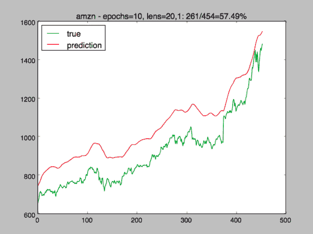
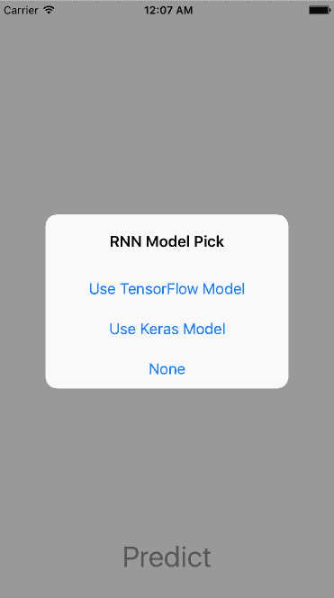
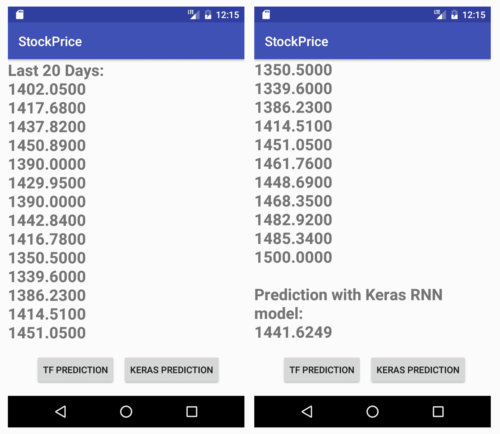

# 用 RNN 预测股价


如果在上一章中在移动设备上玩过涂鸦和构建（并运行模型以识别涂鸦），当您在股市上赚钱时会感到很开心，而如果您不认真的话会变得很认真。 一方面，股价是时间序列数据，一系列离散时间数据，而处理时间序列数据的最佳深度学习方法是 RNN，这是我们在前两章中使用的方法。 AurélienGéron 在他的畅销书*和 Scikit-Learn 和 TensorFlow* 的动手机器学习中，建议使用 RNN“分析时间序列数据，例如股票价格，并告诉您何时买卖”。 另一方面，其他人则认为股票的过去表现无法预测其未来收益，因此，随机选择的投资组合的表现与专家精心挑选的股票一样好。 实际上，Keras（在 TensorFlow 和其他几个库之上运行的非常受欢迎的高级深度学习库）的作者 FrançoisChollet 在他的畅销书 *Python 深度学习*中表示，使用 RNN。 仅用公开数据来击败市场是“一项非常困难的努力，您可能会浪费时间和资源，而无所作为。”

因此，冒着“可能”浪费我们时间和资源的风险，但是可以肯定的是，我们至少将了解更多有关 RNN 的知识，以及为什么有可能比随机 50% 的策略更好地预测股价，我们将 首先概述如何使用 RNN 进行股票价格预测，然后讨论如何使用 TensorFlow API 构建 RNN 模型来预测股票价格，以及如何使用易于使用的 Keras API 来构建 RNN LSTM 模型 价格预测。 我们将测试这些模型是否可以击败随机的买入或卖出策略。 如果我们对我们的模型感到满意，以提高我们在市场上的领先优势，或者只是出于专有技术的目的，我们将了解如何冻结并准备 TensorFlow 和 Keras 模型以在 iOS 和 Android 应用程序上运行。 如果该模型可以提高我们的机会，那么我们支持该模型的移动应用程序可以在任何时候，无论何时何地做出买或卖决定。 感觉有点不确定和兴奋？ 欢迎来到市场。

总之，本章将涵盖以下主题：

*   RNN 和股价预测：什么以及如何
*   使用 TensorFlow RNN API 进行股价预测
*   使用 Keras RNN LSTM API 进行股价预测
*   在 iOS 上运行 TensorFlow 和 Keras 模型
*   在 Android 上运行 TensorFlow 和 Keras 模型


# RNN 和股价预测–什么以及如何


前馈网络（例如密集连接的网络）没有内存，无法将每个输入视为一个整体。 例如，表示为像素向量的图像输入在单个步骤中由前馈网络处理。 但是，使用具有内存的网络可以更好地处理时间序列数据，例如最近 10 或 20 天的股价。 假设过去 10 天的价格为 X <sub>1</sub> ，X <sub>2</sub> ，...，X <sub>10</sub> ，其中 X <sub>1</sub> 为 最早的和 X <sub>10</sub> ，然后将所有 10 天价格视为一个序列输入，并且当 RNN 处理此类输入时，将发生以下步骤：

1.  按顺序连接到第一个元素 X <sub>1</sub> 的特定 RNN 单元处理 X <sub>1</sub> 并获取其输出 y <sub>1</sub>
2.  在序列输入中，连接到下一个元素 X <sub>2</sub> 的另一个 RNN 单元使用 X <sub>2</sub> 以及先前的输出 y <sub>1</sub> ， 获得下一个输出 y <sub>2</sub>
3.  重复该过程：在时间步长使用 RNN 单元处理输入序列中的 X <sub xmlns:epub="http://www.idpf.org/2007/ops">i</sub> 元素时，先前的输出 y <sub xmlns:epub="http://www.idpf.org/2007/ops">i-1</sub> ]，在时间步 i-1 与 X <sub xmlns:epub="http://www.idpf.org/2007/ops">i</sub> 一起使用，以在时间步 i 生成新的输出 y <sub xmlns:epub="http://www.idpf.org/2007/ops">i</sub> 。

因此，在时间步长 i 的每个 y <sub>i</sub> 输出 都具有有关输入序列中直到时间步长 i 以及包括时间步长 i 的所有元素的信息：X <sub>1</sub> ，X <sub>2</sub> ，... X <sub>i-1</sub> 和 X <sub>i</sub> 。 在 RNN 训练期间，预测价格 y <sub>1</sub> ，y <sub>2</sub> ，...，y <sub>9 将</sub> 和 y <sub>10</sub> 的每个时间步长与每个时间步长的真实目标价格进行比较，即 X <sub>2</sub> ，X <sub>3</sub> ，...，X <sub>10</sub> 和 X <sub>11 ，</sub> 和损耗函数因此被定义并用于优化以更新网络参数。 训练完成后，在预测期间，将 X <sub>11</sub> 用作输入序列的预测，X <sub>1</sub> ，X <sub>2</sub> ，...，X <sub>10</sub> 。

这就是为什么我们说 RNN 有内存。 RNN 对于处理股票价格数据似乎很有意义，因为直觉是，今天（以及明天和后天等等）的股票价格可能会受其前 N 天的价格影响。

LSTM 只是解决 RNN 已知梯度消失问题的一种 RNN，我们在第 6 章，“用自然语言描述图像”中引入了 LSTM。 基本上，在训练 RNN 模型的过程中，，如果到 RNN 的输入序列的时间步太长，则使用反向传播更新较早时间步的网络权重可能会得到 0 的梯度值， 导致没有学习发生。 例如，当我们使用 50 天的价格作为输入，并且如果使用 50 天甚至 40 天的时间步长变得太长，则常规 RNN 将是不可训练的。 LSTM 通过添加一个长期状态来解决此问题，该状态决定可以丢弃哪些信息以及需要在许多时间步骤中存储和携带哪些信息。

The other type of RNN that solves the vanishing gradient problem nicely is called **Gated Recurrent Unit** (**GRU**), which simplifies standard LSTM models a bit and is becoming more popular. Both TensorFlow and Keras APIs support basic RNN and LSTM/GRU models. In the next two sections, you'll see concrete TensorFlow and Keras APIs for using RNN and standard LSTM, and you can simply replace "LSTM" with "GRU" in the code to use and compare the results of using the GRU model with RNN and standard LSTM models.

三种常用技术可以使 LSTM 模型表现更好：

*   堆叠 LSTM 层并增加层中神经元的数量：如果不产生过度拟合，通常这将导致功能更强大，更准确的网络模型。 如果还没有，那么您绝对应该玩 [TensorFlow Playground](http://playground.tensorflow.org)来体验一下。
*   使用辍学处理过度拟合。 删除意味着随机删除层中的隐藏单元和输入单元。
*   使用双向 RNN 在两个方向（常规方向和反向方向）处理每个输入序列，希望检测出可能被常规单向 RNN 忽略的模式。

所有这些技术已经实现，并且可以在 TensorFlow 和 Keras API 中轻松访问。

那么，我们如何使用 RNN 和 LSTM 测试股价预测？ 我们将在[这个页面](https://www.alphavantage.co)上使用免费的 API 收集特定股票代码的每日股票价格数据，将其解析为训练集和测试集，并在每次输入时提供 对 RNN / LSTM 模型的一批训练输入（每个训练输入有 20 个时间步长，即，连续 20 天的价格），对模型进行训练，然后进行测试以查看模型在测试数据集中的准确性。 我们将同时使用 TensorFlow 和 Keras API 进行测试，并比较常规 RNN 和 LSTM 模型之间的差异。 我们还将测试三个略有不同的序列输入和输出，看看哪个是最好的：

*   根据过去 N 天预测一天的价格
*   根据过去 N 天预测 M 天的价格
*   基于将过去 N 天移动 1 并使用预测序列的最后输出作为第二天的预测价格进行预测

现在让我们深入研究 TensorFlow RNN API 并进行编码以训练模型来预测股票价格，以查看其准确性如何。


# 使用 TensorFlow RNN API 进行股价预测


首先，您需要在[这里](https://www.alphavantage.co)索取免费的 API 密钥，以便获取任何股票代码的股价数据。 取得 API 密钥后，打开终端并运行以下命令（将`<your_api_key>`替换为您自己的密钥后）以获取 Amazon（amzn）和 Google（goog）的每日库存数据，或将它们替换为您的任何符号 利益：

```py
curl -o daily_amzn.csv "https://www.alphavantage.co/query?function=TIME_SERIES_DAILY&symbol=amzn&apikey=<your_api_key>&datatype=csv&outputsize=full"

curl -o daily_goog.csv "https://www.alphavantage.co/query?function=TIME_SERIES_DAILY&symbol=goog&apikey=<your_api_key>&datatype=csv&outputsize=full"
```

这将生成一个`daily_amzn.csv`或`daily_goog.csv` csv 文件 ，其顶行为“ 时间戳，打开，打开，升高，降低，关闭，音量”，其余部分 这些行作为每日库存信息。 我们只关心收盘价，因此运行以下命令以获取所有收盘价：

```py
cut -d ',' -f 5 daily_amzn.csv | tail -n +2 > amzn.txt

cut -d ',' -f 5 daily_goog.csv | tail -n +2 > goog.txt
```

截至 2018 年 2 月 26 日，`amzn.txt`或`goog.txt`中的行数为 4,566 或 987，这是亚马逊或 Google 的交易天数。 现在，让我们看一下使用 TensorFlow RNN API 训练和预测模型的完整 Python 代码。


# 在 TensorFlow 中训练 RNN 模型


1.  导入所需的 Python 包并定义一些常量：

```py
import numpy as np
import tensorflow as tf
from tensorflow.contrib.rnn import *
import matplotlib.pyplot as plt

num_neurons = 100
num_inputs = 1
num_outputs = 1
symbol = 'goog' # amzn
epochs = 500
seq_len = 20 
learning_rate = 0.001
```

[NumPy](http://www.numpy.org) 是用于 n 维数组操作的最受欢迎的 Python 库，而 [Matplotlib](https://matplotlib.org) 是领先的 Python 2D 绘图库。 我们将使用 numpy 处理数据集，并使用 Matplotlib 可视化股票价格和预测。 `num_neurons`是 RNN（或更准确地说是 RNN 单元）在每个时间步长上的神经元数量-每个神经元在该时间步长上都接收输入序列的输入元素，并从前一个时间步长上接收输出。 `num_inputs`和`num_outputs`指定每个时间步长的输入和输出数量-我们将从每个时间步长的 20 天输入序列中将一个股票价格提供给带有`num_neurons`神经元的 RNN 单元，并期望 每个步骤的库存量。 `seq_len`是时间步数。 因此，我们将使用 Google 的 20 天股票价格作为输入序列，并将这些输入发送给具有 100 个神经元的 RNN 单元。

2.  打开并读取包含所有价格的文本文件，将价格解析为`float`数字列表，颠倒列表顺序，以便最早的价格首先开始，然后每次添加`seq_len+1`值（第一个`seq_len`值将 是 RNN 的输入序列，最后的`seq_len`值将是目标输出序列），从列表中的第一个开始，每次移动 1 直到列表的末尾，直到一个 numpy `result`数组：

```py
f = open(symbol + '.txt', 'r').read()
data = f.split('\n')[:-1] # get rid of the last '' so float(n) works
data.reverse()
d = [float(n) for n in data]

result = []
for i in range(len(d) - seq_len - 1):
    result.append(d[i: i + seq_len + 1])

result = np.array(result)
```

3.  `result` 数组现在包含我们模型的整个数据集，但是我们需要将其进一步处理为 RNN API 期望的格式。 首先，将其分为训练集（占整个数据集的 90% ）和测试集（占 10% ）：

```py
row = int(round(0.9 * result.shape[0]))
train = result[:row, :] 
test = result[row:, :]
```

然后随机地随机排列训练集，作为机器学习模型训练中的标准做法：

```py
np.random.shuffle(train) 
```

制定训练集和测试集`X_train`和`X_test`的输入序列，以及训练集和测试集`y_train`和`y_test`的目标输出序列。 请注意，大写字母 X 和小写字母 y 是机器学习中常用的命名约定，分别代表输入和目标输出：

```py
X_train = train[:, :-1] # all rows with all columns except the last one 
X_test = test[:, :-1] # each row contains seq_len + 1 columns

y_train = train[:, 1:] 
y_test = test[:, 1:]
```

最后，将四个数组重塑为 3-D（批大小，时间步数以及输入或输出数），以完成训练和测试数据集的准备：

```py
X_train = np.reshape(X_train, (X_train.shape[0], X_train.shape[1], num_inputs))
X_test = np.reshape(X_test, (X_test.shape[0], X_test.shape[1], num_inputs)) 
y_train = np.reshape(y_train, (y_train.shape[0], y_train.shape[1], num_outputs))
y_test = np.reshape(y_test, (y_test.shape[0], y_test.shape[1], num_outputs)) 
```

注意，`X_train.shape[1]`，`X_test.shape[1]`，`y_train.shape[1]`和`y_test.shape[1]`与`seq_len`相同。

4.  我们已经准备好构建模型。 创建两个占位符，以便在训练期间和`X_test`一起喂入`X_train`和`y_train`：

```py
X = tf.placeholder(tf.float32, [None, seq_len, num_inputs])
y = tf.placeholder(tf.float32, [None, seq_len, num_outputs])
```

使用`BasicRNNCell`创建一个 RNN 单元，每个时间步分别具有  `num_neurons` 神经元，：

```py
cell = tf.contrib.rnn.OutputProjectionWrapper(
    tf.contrib.rnn.BasicRNNCell(num_units=num_neurons, activation=tf.nn.relu), output_size=num_outputs)
outputs, _ = tf.nn.dynamic_rnn(cell, X, dtype=tf.float32)
```

`OutputProjectionWrapper`用于在每个单元的输出之上添加一个完全连接的层，因此，在每个时间步长处，RNN 单元的输出（将是`num_neurons`值的序列）都会减小为单个值。 这就是 RNN 在每个时间步为输入序列中的每个值输出一个值，或为每个实例的`seq_len`个数的值的每个输入序列输出总计`seq_len`个数的值的方式。

`dynamic_rnn`用于循环所有时间步长的 RNN 信元，总和为`seq_len`（在`X`形状中定义），它返回两个值：每个时间步长的输出列表，以及 网络的最终状态。 接下来，我们将使用第一个`outputs` 返回值 的整形值来定义损失函数。

5.  通过以标准方式指定预测张量，损失，优化器和训练操作来完成模型定义：

```py
preds = tf.reshape(outputs, [1, seq_len], name="preds")
loss = tf.reduce_mean(tf.square(outputs - y)) 
optimizer = tf.train.AdamOptimizer(learning_rate=learning_rate)
training_op = optimizer.minimize(loss)
```

请注意，当我们使用`freeze_graph`工具准备要在移动设备上部署的模型时，`"preds"`将用作输出节点名称，它也将在 iOS 和 Android 中用于运行模型进行预测。 如您所见，在我们甚至开始训练模型之前一定要知道那条信息，这绝对是一件很高兴的事情，而这是我们从头开始构建的模型的好处。

6.  开始训练过程。 对于每个时期，我们将`X_train`和`y_train`数据输入以运行`training_op`以最小化`loss`，然后保存模型检查点文件，并每 10 个时期打印损失值：

```py
init = tf.global_variables_initializer()
saver = tf.train.Saver()

with tf.Session() as sess:
    init.run()

    count = 0
    for _ in range(epochs):
        n=0
        sess.run(training_op, feed_dict={X: X_train, y: y_train})
        count += 1
        if count % 10 == 0:
            saver.save(sess, "/tmp/" + symbol + "_model.ckpt") 
            loss_val = loss.eval(feed_dict={X: X_train, y: y_train})
            print(count, "loss:", loss_val)
```

如果您运行上面的代码，您将看到如下输出：

```py
(10, 'loss:', 243802.61)
(20, 'loss:', 80629.57)
(30, 'loss:', 40018.996)
(40, 'loss:', 28197.496)
(50, 'loss:', 24306.758)
...
(460, 'loss:', 93.095985)
(470, 'loss:', 92.864082)
(480, 'loss:', 92.33461)
(490, 'loss:', 92.09893)
(500, 'loss:', 91.966286)
```

You can replace BasicRNNCell in step 4 with BasicLSTMCell and run the training code, but the training using BasicLSTMCell is much slower and the loss value is still pretty big after 500 epochs. We won't experiment with BasicLSTMCell further in this section, but for comparison, you'll see detailed use of stacked LSTM layers, dropout, and bidirectional RNNs all in the next section of using Keras.


# 测试 TensorFlow RNN 模型


要查看 500 个纪元后的损失值是否足够好，让我们使用测试数据集添加以下代码，以计算总测试示例中正确预测的数量（正确的意思是，预测价格在同一个价格中上下波动 方向作为目标价格，相对于前一天的价格）：

```py
    correct = 0
    y_pred = sess.run(outputs, feed_dict={X: X_test}) 
    targets = []
    predictions = []
    for i in range(y_pred.shape[0]):
        input = X_test[i]
        target = y_test[i]
        prediction = y_pred[i]

        targets.append(target[-1][0])
        predictions.append(prediction[-1][0])

        if target[-1][0] >= input[-1][0] and prediction[-1][0] >= 
        input[-1][0]:
            correct += 1
        elif target[-1][0] < input[-1][0] and prediction[-1][0] <   
        input[-1][0]:
            correct += 1
```

现在我们可以使用`plot`方法可视化正确的预测比率：

```py
    total = len(X_test)
    xs = [i for i, _ in enumerate(y_test)]
    plt.plot(xs, predictions, 'r-', label='prediction') 
    plt.plot(xs, targets, 'b-', label='true')
    plt.legend(loc=0)
    plt.title("%s - %d/%d=%.2f%%" %(symbol, correct, total, 
               100*float(correct)/total))
    plt.show()
```

现在运行代码将显示如图 8.1 所示，正确预测的比率为 56.25% ：

Figure 8.1 Showing the stock price prediction correctness trained with TensorFlow RNN

注意，每次运行此训练和测试代码时，您获得的比率可能都会有所不同。 通过微调模型的超参数，您可能会获得超过 60% 的比率，这似乎比随机预测要好。 如果您乐观的话，您可能会认为至少有 50% （56.25% ）的东西要显示出来，并且可能希望看到该模型在移动设备上运行。 但首先让我们看看是否可以使用酷的 Keras 库来构建更好的模型-在执行此操作之前，让我们通过简单地运行来冻结经过训练的 TensorFlow 模型：

```py
python tensorflow/python/tools/freeze_graph.py --input_meta_graph=/tmp/amzn_model.ckpt.meta --input_checkpoint=/tmp/amzn_model.ckpt --output_graph=/tmp/amzn_tf_frozen.pb --output_node_names="preds" --input_binary=true
```


# 使用 Keras RNN LSTM API 进行股价预测


Keras 是一个非常易于使用的高级深度学习 Python 库，它运行在 TensorFlow，Theano 和 CNTK 等其他流行的深度学习库之上。 您很快就会看到，Keras 使构建和使用模型变得更加容易。 要安装和使用 Keras 以及 TensorFlow 作为 Keras 的后端，最好首先设置一个 virtualenv：

```py
sudo pip install virtualenv
```

如果您的机器和 iOS 和 Android 应用程序上都有 TensorFlow 1.4 源，请运行以下命令；否则，请运行以下命令。 使用 TensorFlow 1.4 自定义库：

```py
cd
mkdir ~/tf14_keras
virtualenv --system-site-packages ~/tf14_keras/
cd ~/tf14_keras/
source ./bin/activate
easy_install -U pip
pip install --upgrade https://storage.googleapis.com/tensorflow/mac/cpu/tensorflow-1.4.0-py2-none-any.whl
pip install keras
```

如果您的机器上装有 TensorFlow 1.5 源，则应在 Keras 上安装 TensorFlow 1.5，因为使用 Keras 创建的模型需要具有与 TensorFlow 移动应用所使用的模型相同的 TensorFlow 版本，或者在尝试加载模型时发生错误：

```py
cd
mkdir ~/tf15_keras
virtualenv --system-site-packages ~/tf15_keras/
cd ~/tf15_keras/
source ./bin/activate
easy_install -U pip
pip install --upgrade https://storage.googleapis.com/tensorflow/mac/cpu/tensorflow-1.5.0-py2-none-any.whl
pip install keras
```

如果您的操作系统不是 Mac 或计算机具有 GPU，则您需要用正确的 URL 替换 TensorFlow Python 软件包 URL，您可以在[这个页面](https://www.tensorflow.org/install)上找到它。


# 在 Keras 中训练 RNN 模型


现在，让我们看看在 Keras 中建立和训练 LSTM 模型以预测股价的过程。 首先，一些导入和常量设置：

```py
import keras
from keras import backend as K
from keras.layers.core import Dense, Activation, Dropout
from keras.layers.recurrent import LSTM
from keras.layers import Bidirectional
from keras.models import Sequential
import matplotlib.pyplot as plt

import tensorflow as tf
import numpy as np

symbol = 'amzn'
epochs = 10
num_neurons = 100
seq_len = 20
pred_len = 1
shift_pred = False
```

`shift_pred`用于指示我们是否要预测价格的输出顺序而不是单个输出价格。 如果是`True`，我们将根据 X <sub xmlns:epub="http://www.idpf.org/2007/ops">1 [X <sub xmlns:epub="http://www.idpf.org/2007/ops">2</sub> ，X <sub xmlns:epub="http://www.idpf.org/2007/ops">3</sub> ，...，X <sub xmlns:epub="http://www.idpf.org/2007/ops">n + 1</sub> 来预测。 HTG14]，X <sub xmlns:epub="http://www.idpf.org/2007/ops">2</sub> ，X <sub xmlns:epub="http://www.idpf.org/2007/ops">3</sub> ，...，X <sub xmlns:epub="http://www.idpf.org/2007/ops">n</sub> 输入，就像我们在使用 TensorFlow API 的最后一部分中所做的那样。 如果`shift_pred`为`False`，我们将基于 X <sub xmlns:epub="http://www.idpf.org/2007/ops">1</sub> ，X <sub xmlns:epub="http://www.idpf.org/2007/ops">2</sub> ，...，X <sub xmlns:epub="http://www.idpf.org/2007/ops">n</sub> 来预测输出`pred_len` ]输入。 例如，如果`pred_len`为 1，我们将预测 X <sub xmlns:epub="http://www.idpf.org/2007/ops">n + 1</sub> ，如果`pred_len`为 3，我们将预测 X <sub xmlns:epub="http://www.idpf.org/2007/ops">n + 1</sub> ，X <sub xmlns:epub="http://www.idpf.org/2007/ops">n + 2</sub> 和 X <sub xmlns:epub="http://www.idpf.org/2007/ops">n + 3</sub> ，这很有意义，因为我们很想知道价格是连续连续 3 天上涨还是仅上涨 1 天 然后下降 2 天。</sub>

现在，让我们创建一个根据上一节中的数据加载代码进行修改的方法，该方法根据`pred_len`和`shift_pred`设置准备适当的训练和测试数据集：

```py
def load_data(filename, seq_len, pred_len, shift_pred):
    f = open(filename, 'r').read()
    data = f.split('\n')[:-1] # get rid of the last '' so float(n) works
    data.reverse()
    d = [float(n) for n in data]
    lower = np.min(d)
    upper = np.max(d)
    scale = upper-lower
    normalized_d = [(x-lower)/scale for x in d]

    result = []
    if shift_pred:
        pred_len = 1
    for i in range((len(normalized_d) - seq_len - pred_len)/pred_len):
        result.append(normalized_d[i*pred_len: i*pred_len + seq_len + pred_len])

    result = np.array(result)
    row = int(round(0.9 * result.shape[0]))
    train = result[:row, :] 
    test = result[row:, :]

    np.random.shuffle(train) 

    X_train = train[:, :-pred_len]
    X_test = test[:, :-pred_len]

    if shift_pred:
        y_train = train[:, 1:] 
        y_test = test[:, 1:]
    else:
        y_train = train[:, -pred_len:]
        y_test = test[:, -pred_len:]

    X_train = np.reshape(X_train, (X_train.shape[0], X_train.shape[1], 
                                                                    1))
    X_test = np.reshape(X_test, (X_test.shape[0], X_test.shape[1], 1)) 

    return [X_train, y_train, X_test, y_test, lower, scale]

```

注意，在这里我们也使用归一化，使用与上一章相同的归一化方法，以查看它是否可以改善我们的模型。 当使用训练模型进行预测时，我们还返回`lower`和`scale`值，这是非规范化所需的值。

现在我们可以调用`load_data`来获取训练和测试数据集，以及`lower`和`scale`值：

```py
X_train, y_train, X_test, y_test, lower, scale = load_data(symbol + '.txt', seq_len, pred_len, shift_pred)
```

完整的模型构建代码如下：

```py
model = Sequential()
model.add(Bidirectional(LSTM(num_neurons, return_sequences=True, input_shape=(None, 1)), input_shape=(seq_len, 1)))
model.add(Dropout(0.2))

model.add(LSTM(num_neurons, return_sequences=True))
model.add(Dropout(0.2))

model.add(LSTM(num_neurons, return_sequences=False))
model.add(Dropout(0.2))

if shift_pred:
    model.add(Dense(units=seq_len))
else:
    model.add(Dense(units=pred_len))

model.add(Activation('linear'))
model.compile(loss='mse', optimizer='rmsprop')

model.fit(
    X_train,
    y_train,
    batch_size=512,
    epochs=epochs,
    validation_split=0.05)

print(model.output.op.name)
print(model.input.op.name)
```

即使使用新添加的`Bidirectional`，`Dropout`，`validation_split`和堆叠 LSTM 层，该代码也比 TensorFlow 中的模型构建代码更容易解​​释和简化。 请注意，LSTM 调用中的`return_sequences` 参数 i 必须为 True，因此 LSTM 单元的输出将是完整的输出序列，而不仅仅是输出序列中的最后一个输出， 除非它是最后的堆叠层。 最后两个 `print` 语句将打印输入节点名称（ bidirectional_1_input ）和输出节点名称（ activation_1 / Identity ] ），当我们冻结模型并在移动设备上运行模型时需要。

现在，如果您运行前面的代码，您将看到如下输出：

```py
824/824 [==============================] - 7s 9ms/step - loss: 0.0833 - val_loss: 0.3831
Epoch 2/10
824/824 [==============================] - 2s 3ms/step - loss: 0.2546 - val_loss: 0.0308
Epoch 3/10
824/824 [==============================] - 2s 2ms/step - loss: 0.0258 - val_loss: 0.0098
Epoch 4/10
824/824 [==============================] - 2s 2ms/step - loss: 0.0085 - val_loss: 0.0035
Epoch 5/10
824/824 [==============================] - 2s 2ms/step - loss: 0.0044 - val_loss: 0.0026
Epoch 6/10
824/824 [==============================] - 2s 2ms/step - loss: 0.0038 - val_loss: 0.0022
Epoch 7/10
824/824 [==============================] - 2s 2ms/step - loss: 0.0033 - val_loss: 0.0019
Epoch 8/10
824/824 [==============================] - 2s 2ms/step - loss: 0.0030 - val_loss: 0.0019
Epoch 9/10
824/824 [==============================] - 2s 2ms/step - loss: 0.0028 - val_loss: 0.0017
Epoch 10/10
824/824 [==============================] - 2s 3ms/step - loss: 0.0027 - val_loss: 0.0019
```

训练损失和验证损失都可以通过简单调用`model.fit`进行打印。


# 测试 Hard RNN 模型


现在该保存模型检查点并使用测试数据集来计算正确预测的数量，正如我们在上一节中所解释的那样：

```py
saver = tf.train.Saver()
saver.save(K.get_session(), '/tmp/keras_' + symbol + '.ckpt')

predictions = []
correct = 0
total = pred_len*len(X_test)
for i in range(len(X_test)):
    input = X_test[i]
    y_pred = model.predict(input.reshape(1, seq_len, 1))
    predictions.append(scale * y_pred[0][-1] + lower)
    if shift_pred:
        if y_test[i][-1] >= input[-1][0] and y_pred[0][-1] >= input[-1]
[0]:
            correct += 1
        elif y_test[i][-1] < input[-1][0] and y_pred[0][-1] < input[-1][0]:
            correct += 1
    else:
        for j in range(len(y_test[i])):
            if y_test[i][j] >= input[-1][0] and y_pred[0][j] >= input[-1][0]:
                correct += 1
            elif y_test[i][j] < input[-1][0] and y_pred[0][j] < input[-1][0]:
                correct += 1
```

我们主要调用`model.predict`来获取`X_test`中每个实例的预测，并将其与真实值和前一天的价格一起使用，以查看在方向方面是否为正确的预测。 最后，让我们根据测试数据集和预测来绘制真实价格：

```py
y_test = scale * y_test + lower 
y_test = y_test[:, -1]
xs = [i for i, _ in enumerate(y_test)]
plt.plot(xs, y_test, 'g-', label='true')
plt.plot(xs, predictions, 'r-', label='prediction')
plt.legend(loc=0)
if shift_pred:
    plt.title("%s - epochs=%d, shift_pred=True, seq_len=%d: %d/%d=%.2f%%" %(symbol, epochs, seq_len, correct, total, 100*float(correct)/total))
else:
    plt.title("%s - epochs=%d, lens=%d,%d: %d/%d=%.2f%%" %(symbol, epochs, seq_len, pred_len, correct, total, 100*float(correct)/total))
plt.show()
```

您会看到类似图 8.2 的内容：

Figure 8.2 Making stock price predictions with the Keras bidirectional and stacked LSTM layers

很容易在堆栈中添加更多 LSTM 层，或者使用诸如学习率和辍学率以及许多恒定设置之类的超参数。 但是，对于使用`pred_len`和`shift_pred`的不同设置，正确率的差异还没有发现。 也许我们现在应该对接近 60% 的正确率感到满意，并看看如何在 iOS 和 Android 上使用 TensorFlow 和 Keras 训练的模型-我们可以在以后继续尝试改进模型，但是 了解使用 TensorFlow 和 Keras 训练的 RNN 模型是否会遇到任何问题将非常有价值。

As François Chollet points out, "deep learning is more an art than a science... every problem is unique and you will have to try and evaluate different strategies empirically. There is currently no theory that will tell you in advance precisely what you should do to optimally solve a problem. You must try and iterate." Hopefully we have provided a good starting point for you to improve the stock price prediction models using TensorFlow and Keras APIs.

本节中最后要做的就是从检查点冻结 Keras 模型-因为我们在虚拟环境中安装了 TensorFlow 和 Keras，而 TensorFlow 是 virtualenv 中唯一安装并受支持的深度学习库，Keras 使用 TensorFlow 后端 并通过`saver.save(K.get_session(), '/tmp/keras_' + symbol + '.ckpt')`调用以 TensorFlow 格式生成检查点。 现在运行以下命令冻结检查点（回想我们在训练期间从`print(model.input.op.name)`获得`output_node_name`）：

```py
python tensorflow/python/tools/freeze_graph.py --input_meta_graph=/tmp/keras_amzn.ckpt.meta --input_checkpoint=/tmp/keras_amzn.ckpt --output_graph=/tmp/amzn_keras_frozen.pb --output_node_names="activation_1/Identity" --input_binary=true
```

因为我们的模型非常简单明了，所以我们将直接在移动设备上尝试这两个冻结的模型，而无需像前两章中那样使用`transform_graph`工具。


# 在 iOS 上运行 TensorFlow 和 Keras 模型


我们不会通过重复项目设置步骤来烦您-只需按照我们之前的操作即可创建一个名为 StockPrice 的新 Objective-C 项目，该项目将使用手动构建的 TensorFlow 库（请参阅[第 7 章[iOS 3]的 iOS 部分 ]，“使用 CNN 和 LSTM 识别图形”（如果需要详细信息）。 然后将两个`amzn_tf_frozen.pb`和`amzn_keras_frozen.pb` 模型文件 添加到项目中，您应该在 Xcode 中拥有 StockPrice 项目，如图 8.3 所示：](../Text/07.html)

Figure 8.3 iOS app using the TensorFlow- and Keras-trained models in Xcode

在 ViewController.mm 中，我们将首先声明一些变量和一个常量：

```py
unique_ptr<tensorflow::Session> tf_session;
UITextView *_tv;
UIButton *_btn;
NSMutableArray *_closeprices;
const int SEQ_LEN = 20;
```

然后创建一个按钮点击处理程序，以使用户可以选择 TensorFlow 或 Keras 模型（该按钮在`viewDidLoad`方法中像以前一样创建）：

```py
- (IBAction)btnTapped:(id)sender {
    UIAlertAction* tf = [UIAlertAction actionWithTitle:@"Use TensorFlow Model" style:UIAlertActionStyleDefault handler:^(UIAlertAction * action) {
        [self getLatestData:NO];
    }];
    UIAlertAction* keras = [UIAlertAction actionWithTitle:@"Use Keras Model" style:UIAlertActionStyleDefault handler:^(UIAlertAction * action) {
        [self getLatestData:YES];
    }];

    UIAlertAction* none = [UIAlertAction actionWithTitle:@"None" style:UIAlertActionStyleDefault handler:^(UIAlertAction * action) {}];

    UIAlertController* alert = [UIAlertController alertControllerWithTitle:@"RNN Model Pick" message:nil preferredStyle:UIAlertControllerStyleAlert];
    [alert addAction:tf];
    [alert addAction:keras];
    [alert addAction:none];
    [self presentViewController:alert animated:YES completion:nil];
}
```

`getLatestData`方法首先发出 URL 请求以获取紧凑型版本的 Alpha Vantage API，该 API 返回 Amazon 每日库存数据的最后 100 个数据点，然后解析结果并将最后 20 个收盘价保存在`_closeprices`中 ]数组：

```py
-(void)getLatestData:(BOOL)useKerasModel {
    NSURLSession *session = [NSURLSession sharedSession];
    [[session dataTaskWithURL:[NSURL URLWithString:@"https://www.alphavantage.co/query?function=TIME_SERIES_DAILY&symbol=amzn&apikey=<your_api_key>&datatype=csv&outputsize=compact"]
            completionHandler:^(NSData *data,
                                NSURLResponse *response,
                                NSError *error) {
                NSString *stockinfo = [[NSString alloc] initWithData:data encoding:NSASCIIStringEncoding];
                NSArray *lines = [stockinfo componentsSeparatedByString:@"\n"];
                _closeprices = [NSMutableArray array];
                for (int i=0; i<SEQ_LEN; i++) {
                    NSArray *items = [lines[i+1] componentsSeparatedByString:@","];
                    [_closeprices addObject:items[4]];
                }

                if (useKerasModel)
                    [self runKerasModel];
                else
                    [self runTFModel];

            }] resume];    
}
```

`runTFModel`方法定义如下：

```py
- (void) runTFModel {
    tensorflow::Status load_status; 
    load_status = LoadModel(@"amzn_tf_frozen", @"pb", &tf_session);
    tensorflow::Tensor prices(tensorflow::DT_FLOAT, 
    tensorflow::TensorShape({1, SEQ_LEN, 1}));

    auto prices_map = prices.tensor<float, 3>();
    NSString *txt = @"Last 20 Days:\n";

    for (int i = 0; i < SEQ_LEN; i++){
        prices_map(0,i,0) = [_closeprices[SEQ_LEN-i-1] floatValue];
        txt = [NSString stringWithFormat:@"%@%@\n", txt,  
                                     _closeprices[SEQ_LEN-i-1]];
    }

    std::vector<tensorflow::Tensor> output;
    tensorflow::Status run_status = tf_session->Run({{"Placeholder", 
                                    prices}}, {"preds"}, {}, &output);
    if (!run_status.ok()) {
        LOG(ERROR) << "Running model failed:" << run_status;
    }
    else {
        tensorflow::Tensor preds = output[0]; 
        auto preds_map = preds.tensor<float, 2>();
        txt = [NSString stringWithFormat:@"%@\nPrediction with TF RNN 
                        model:\n%f", txt, preds_map(0,SEQ_LEN-1)];
        dispatch_async(dispatch_get_main_queue(), ^{
            [_tv setText:txt];
            [_tv sizeToFit];
        });
    }
}
```

`preds_map(0,SEQ_LEN-1)` 是基于最近 20 天的第二天的预测价格； `Placeholder` 是在 *的 TensorFlow* 小节中训练 RNN 模型的 `X = tf.placeholder(tf.float32, [None, seq_len, num_inputs])` 中定义的输入节点名称。 在模型生成预测后，我们将其与最近 20 天的价格一起显示在 TextView 中。

`runKeras`方法的定义与此类似，但具有反规范化以及不同的输入和输出节点名称。 由于我们的 Keras 模型经过训练只能输出一个预测价格，而不是一系列`seq_len`价格，因此我们使用`preds_map(0,0)`来获得预测：

```py
- (void) runKerasModel {
    tensorflow::Status load_status;
    load_status = LoadModel(@"amzn_keras_frozen", @"pb", &tf_session);
    if (!load_status.ok()) return;

    tensorflow::Tensor prices(tensorflow::DT_FLOAT, 
    tensorflow::TensorShape({1, SEQ_LEN, 1}));

    auto prices_map = prices.tensor<float, 3>();
    float lower = 5.97;
    float scale = 1479.37;
    NSString *txt = @"Last 20 Days:\n";
    for (int i = 0; i < SEQ_LEN; i++){
        prices_map(0,i,0) = ([_closeprices[SEQ_LEN-i-1] floatValue] - 
                                                       lower)/scale;
        txt = [NSString stringWithFormat:@"%@%@\n", txt, 
                                        _closeprices[SEQ_LEN-i-1]];
    }

    std::vector<tensorflow::Tensor> output;
    tensorflow::Status run_status = tf_session->Run({{"bidirectional_1_input", prices}}, {"activation_1/Identity"}, 
                                                     {}, &output);
    if (!run_status.ok()) {
        LOG(ERROR) << "Running model failed:" << run_status;
    }
    else {
        tensorflow::Tensor preds = output[0]; 
        auto preds_map = preds.tensor<float, 2>(); 
        txt = [NSString stringWithFormat:@"%@\nPrediction with Keras 
            RNN model:\n%f", txt, scale * preds_map(0,0) + lower];
        dispatch_async(dispatch_get_main_queue(), ^{
            [_tv setText:txt];
            [_tv sizeToFit];
        });
    } 
}
```

如果您现在运行该应用程序并点击 Predict 按钮，您将看到型号选择消息（图 8.4）：

Figure 8.4 Selecting the TensorFlow or Keras RNN model

如果选择 TensorFlow 模型，则可能会出现错误：

```py
Could not create TensorFlow Graph: Invalid argument: No OpKernel was registered to support Op 'Less' with these attrs. Registered devices: [CPU], Registered kernels:
 device='CPU'; T in [DT_FLOAT]
[[Node: rnn/while/Less = Less[T=DT_INT32, _output_shapes=[[]]](rnn/while/Merge, rnn/while/Less/Enter)]]
```

如果选择 Keras 模型，则可能会出现稍微不同的错误：

```py
Could not create TensorFlow Graph: Invalid argument: No OpKernel was registered to support Op 'Less' with these attrs. Registered devices: [CPU], Registered kernels:
 device='CPU'; T in [DT_FLOAT]
[[Node: bidirectional_1/while_1/Less = Less[T=DT_INT32, _output_shapes=[[]]](bidirectional_1/while_1/Merge, bidirectional_1/while_1/Less/Enter)]]
```

我们在上一章中已经看到`RefSwitch` op 出现类似的错误，并且知道针对此类错误的解决方法是在启用 `-D__ANDROID_TYPES_FULL__`的情况下构建 TensorFlow 库。 如果没有看到这些错误，则意味着您在上一章的 iOS 应用程序中已建立了这样的库； 否则，请按照 *开头的说明在* *中为 iOS* 构建自定义 TensorFlow 库。 上一章的内容构建新的 TensorFlow 库，然后再次运行该应用程序。

现在选择 TensorFlow 模型，您将看到如图 8.5 所示的结果：

Figure 8.5 Predicting with the TensorFlow RNN model

使用 Keras 模型输出不同的预测，如图 8.6 所示：

Figure 8.6 Predicting with the Keras RNN model

我们无法确定哪个模型能在没有进一步研究的情况下更好地工作，但是我们可以确定的是，我们的两个 RNN 模型都使用 TensorFlow 和 Keras API 从头开始训练了，其准确性接近 60%， 在 iOS 上运行良好，这很值得我们付出努力，因为我们正在尝试建立一个许多专家认为将达到与随机选择相同的性能的模型，并且在此过程中，我们学到了一些新奇的东西-使用 TensorFlow 和 Keras 构建 RNN 模型并在 iOS 上运行它们。 在下一章中，我们只剩下一件事了：如何在 Android 上使用模型？ 我们会遇到新的障碍吗？


# 在 Android 上运行 TensorFlow 和 Keras 模型


事实证明，这就像使用 Android 上的模型在沙滩上散步一样-尽管我们必须使用自定义的 TensorFlow 库（而不是 TensorFlow pod），我们甚至不需要像上一章那样使用自定义的 TensorFlow Android 库。 截至 2018 年 2 月）。 与用于 iOS 的 TensorFlow Pod 相比，在`build.gradle`文件中使用`compile 'org.tensorflow:tensorflow-android:+'`构建的 TensorFlow Android 库必须对`Less` Op 具有更完整的数据类型支持。

要在 Android 中测试模型，请创建一个新的 Android 应用 StockPrice，并将两个模型文件添加到其`assets`文件夹中。 然后在布局中添加几个按钮和一个`TextView`并在`MainActivity.java`中定义一些字段和常量：

```py
    private static final String TF_MODEL_FILENAME = "file:///android_asset/amzn_tf_frozen.pb";
    private static final String KERAS_MODEL_FILENAME = "file:///android_asset/amzn_keras_frozen.pb";
    private static final String INPUT_NODE_NAME_TF = "Placeholder";
    private static final String OUTPUT_NODE_NAME_TF = "preds";
    private static final String INPUT_NODE_NAME_KERAS = "bidirectional_1_input";
    private static final String OUTPUT_NODE_NAME_KERAS = "activation_1/Identity";
    private static final int SEQ_LEN = 20;
    private static final float LOWER = 5.97f;
    private static final float SCALE = 1479.37f;

    private TensorFlowInferenceInterface mInferenceInterface;

    private Button mButtonTF;
    private Button mButtonKeras;
    private TextView mTextView;
    private boolean mUseTFModel;
    private String mResult;
```

制作`onCreate`如下：

```py
protected void onCreate(Bundle savedInstanceState) {
    super.onCreate(savedInstanceState);
    setContentView(R.layout.activity_main);

    mButtonTF = findViewById(R.id.tfbutton);
    mButtonKeras = findViewById(R.id.kerasbutton);
    mTextView = findViewById(R.id.textview);
    mTextView.setMovementMethod(new ScrollingMovementMethod());
    mButtonTF.setOnClickListener(new View.OnClickListener() {
        @Override
  public void onClick(View v) {
            mUseTFModel = true;
            Thread thread = new Thread(MainActivity.this);
            thread.start();
        }
    });
    mButtonKeras.setOnClickListener(new View.OnClickListener() {
        @Override
  public void onClick(View v) {
            mUseTFModel = false;
            Thread thread = new Thread(MainActivity.this);
            thread.start();
        }
    });

}
```

其余代码全部在`run`方法中，在点击 TF PREDICTION 或 KERAS PREDICTION 按钮时在工作线程中启动，除了使用 Keras 模型需要规范化和非规范化[ 在运行模型之前和之后：

```py
public void run() {
    runOnUiThread(
            new Runnable() {
                @Override
                public void run() {
                    mTextView.setText("Getting data...");
                }
            });

    float[] floatValues = new float[SEQ_LEN];

    try {
        URL url = new URL("https://www.alphavantage.co/query?function=TIME_SERIES_DAILY&symbol=amzn&apikey=4SOSJM2XCRIB5IUS&datatype=csv&outputsize=compact");
        HttpURLConnection urlConnection = (HttpURLConnection) url.openConnection();
        InputStream in = new BufferedInputStream(urlConnection.getInputStream());
        Scanner s = new Scanner(in).useDelimiter("\\n");
        mResult = "Last 20 Days:\n";
        if (s.hasNext()) s.next(); // get rid of the first title line
        List<String> priceList = new ArrayList<>();
        while (s.hasNext()) {
            String line = s.next();
            String[] items = line.split(",");
            priceList.add(items[4]);
        }

        for (int i=0; i<SEQ_LEN; i++)
            mResult += priceList.get(SEQ_LEN-i-1) + "\n";

        for (int i=0; i<SEQ_LEN; i++) {
            if (mUseTFModel)
                floatValues[i] = Float.parseFloat(priceList.get(SEQ_LEN-i-1));
            else
                floatValues[i] = (Float.parseFloat(priceList.get(SEQ_LEN-i-1)) - LOWER) / SCALE;
        }

        AssetManager assetManager = getAssets();
        mInferenceInterface = new TensorFlowInferenceInterface(assetManager, mUseTFModel ? TF_MODEL_FILENAME : KERAS_MODEL_FILENAME);

        mInferenceInterface.feed(mUseTFModel ? INPUT_NODE_NAME_TF : INPUT_NODE_NAME_KERAS, floatValues, 1, SEQ_LEN, 1);

        float[] predictions = new float[mUseTFModel ? SEQ_LEN : 1];

        mInferenceInterface.run(new String[] {mUseTFModel ? OUTPUT_NODE_NAME_TF : OUTPUT_NODE_NAME_KERAS}, false);
        mInferenceInterface.fetch(mUseTFModel ? OUTPUT_NODE_NAME_TF : OUTPUT_NODE_NAME_KERAS, predictions);
        if (mUseTFModel) {
            mResult += "\nPrediction with TF RNN model:\n" + predictions[SEQ_LEN - 1];
        }
        else {
            mResult += "\nPrediction with Keras RNN model:\n" + (predictions[0] * SCALE + LOWER);
        }

        runOnUiThread(
                new Runnable() {
                    @Override
                    public void run() {
                        mTextView.setText(mResult);
                    }
                });

    } catch (Exception e) {
        e.printStackTrace();
    }
}
```

现在运行该应用程序，然后点击 TF PREDICTION 按钮，您将在图 8.7 中看到结果：

Figure 8.7 Using the TensorFlow model to make stock price predictions on Amazon

选择 KERAS 预测将为您提供如图 8.8 所示的结果：



Figure 8.8 Using the Keras model to make stock price predictions on Amazon


# 概要


在本章中，我们首先对表示不屑一顾，试图通过使用 TensorFlow 和 Keras RNN API 预测股价来击败市场。 我们首先讨论了 RNN 和 LSTM 模型是什么以及如何使用它们进行股价预测。 然后，我们使用 TensorFlow 和 Keras 从零开始构建了两个 RNN 模型，接近测试正确率的 60%。 最后，我们介绍了如何冻结模型并在 iOS 和 Android 上使用它们，并使用自定义 TensorFlow 库修复了 iOS 上可能出现的运行时错误。

如果您对我们尚未建立正确预测比率为 80% 或 90% 的模型感到有些失望，则可能需要继续进行“尝试并迭代”过程，以查看是否以该正确比率预测股票价格 可能的。 但是，您肯定会从使用 TensorFlow 和 Keras API 的 RNN 模型构建，训练和测试中学到的技能以及在 iOS 和 Android 上运行的技能而受益。

如果您对使用深度学习技术打败市场感兴趣并感到兴奋，让我们在 GAN（Generative Adversarial Networks）上的下一章中进行研究，该模型试图击败能够分辨真实数据与虚假数据之间差异的对手， 并且越来越擅长生成看起来像真实数据的数据，欺骗对手。 GAN 实际上被深度学习的一些顶级研究人员誉为是过去十年中深度学习中最有趣和令人兴奋的想法。


