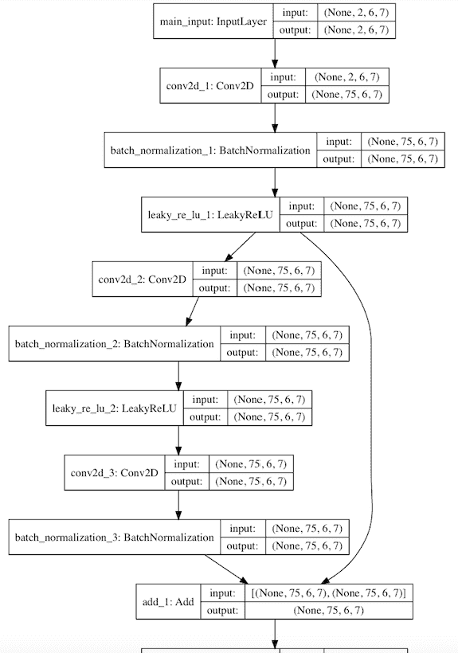
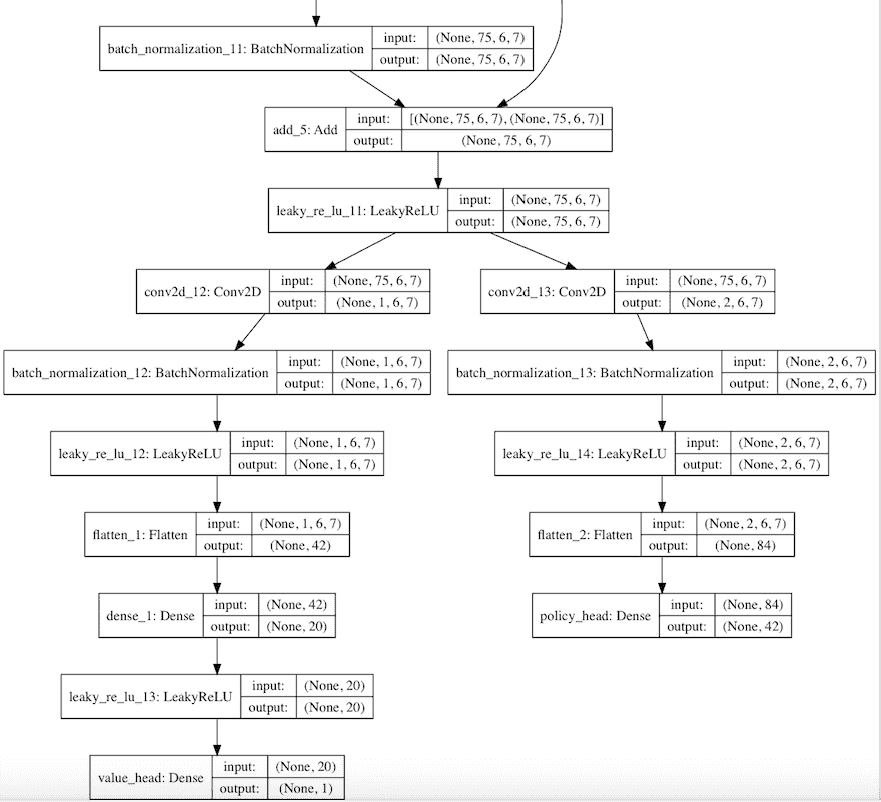
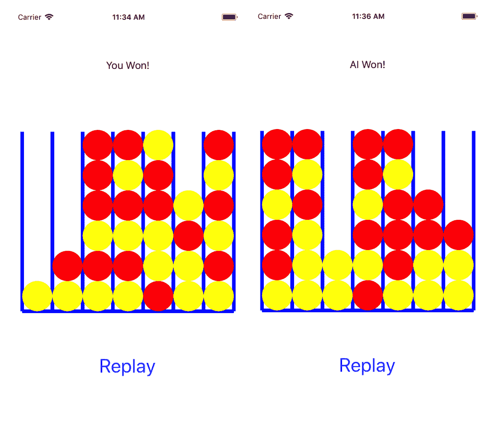

# 构建类似 AlphaZero 的手机游戏应用


尽管现代**人工智能**（**AI**）的日益普及基本上是由 2012 年深度学习的突破引起的，但 2016 年 3 月，Google DeepMind 的 AlphaGo 以 4-1 击败围棋世界冠军 Lee Sedol，然后在 2017 年 5 月以 3-0 击败了目前排名第一的围棋玩家 Ke Jie 的历史性事件，这在很大程度上使 AI 家喻户晓。 由于围棋游戏的复杂性，人们普遍认为任务无法实现，或者至少十年内计算机程序不可能击败顶级围棋玩家。

在 2017 年 5 月 AlphaGo 和 Ke Jie 的比赛之后，Google 退役了 AlphaGo； 谷歌（DeepMind）是 Google 因其开创性的深度强化学习技术而收购的创业公司，也是 AlphaGo 的开发商，决定将其 AI 研究重点放在其他领域。 然后，有趣的是，在 2017 年 10 月，DeepMind 在游戏上发表了另一篇论文[《围棋：在没有人类知识的情况下掌握围棋游戏》](https://deepmind.com/research/publications/mastering-game-go-without-human-knowledge)，它描述了一种称为 AlphaGo Zero 的改进算法，该算法仅通过自我强化学习来学习如何玩围棋，而无需依赖任何人类专家知识，例如大量玩过的专业的围棋游戏，AlphaGo 用它来训练其模型。 令人惊讶的是，AlphaGo Zero 完全击败了 AlphaGo，后者在几个月前以 100-0 击败了世界上最好的人类 GO 玩家！

事实证明，这只是朝着 Google 更雄心勃勃的目标迈出的一步，该目标是将 AlphaGo 背后的 AI 技术应用和改进到其他领域。 2017 年 12 月，DeepMind 发表了另一篇论文，[即使用通用强化学习算法通过自学掌握国际象棋和将棋](https://arxiv.org/pdf/1712.01815.pdf)，对 AlphaGo 进行了概括。 将零程序归类为一个称为 AlphaZero 的算法，并使用该算法从头开始快速学习如何玩象棋和将棋的游戏，从除了游戏规则之外没有任何领域知识的随机游戏开始，并在 24 小时内实现了超人级别并击败世界冠军。

在本章中，我们将带您浏览 AlphaZero 的最新最酷的部分，向您展示如何构建和训练类似 AlphaZero 的模型来玩一个简单而有趣的游戏，称为 [Connect4](https://en.wikipedia.org/wiki/Connect_Four)，在 TensorFlow 和 Keras 中使用，这是我们在第 8 章，“使用 RNN 预测股价”的流行的高级深度学习库。 我们还将介绍如何使用训练有素的 AlphaZero 模型来获得训练有素的专家策略，以指导移动游戏的玩法，以及使用该模型玩 Connect4 游戏的完整 iOS 和 Android 应用的源代码。

总之，本章将涵盖以下主题：

*   AlphaZero – 它如何工作？
*   为 Connect4 构建和训练类似于 AlphaZero 的模型
*   在 iOS 中使用模型玩 Connect4
*   在 Android 中使用模型玩 Connect4


# AlphaZero – 它如何工作？


AlphaZero 算法包含三个主要组件：

*   一个深度卷积神经网络，它以棋盘位置（或状态）为输入，并从该位置输出一个值作为预测的博弈结果，该策略是输入棋盘状态下每个可能动作的移动概率列表。
*   一种通用的强化学习算法，该算法通过自玩从头开始学习，除了游戏规则外，没有特定的领域知识。 通过自增强学习学习深度神经网络的参数，以使预测值与实际自游戏结果之间的损失最小，并使预测策略与搜索概率之间的相似性最大化，这来自以下算法。
*   一种通用（与域无关）的**蒙特卡洛树搜索**（**MCTS**）算法，该算法从头至尾模拟自玩游戏，并通过考虑到从深度神经网络返回的预测值和策略概率值，以及访问节点的频率—有时，选择访问次数较少的节点称为强化学习中的探索（与采取较高预测值的举动相反） 价值和策略，这称为剥削）。 探索与开发之间的良好平衡可以带来更好的结果。

强化学习的历史可以追溯到 1960 年代，当时该术语在工程文献中首次使用。 但是突破发生在 2013 年，当时 DeepMind 将强化学习与深度学习相结合，并开发了深度强化学习应用，该应用学会了从头开始玩 Atari 游戏，以原始像素为输入的，并随后击败了人类。 与监督学习不同，监督学习需要标记数据进行训练，就像我们在前几章中建立或使用的许多模型中所看到的那样，强化学习使用反复试验的方法来获得更好的效果：代理与环境交互并接收在每个状态上采取的每个动作的奖励（正面或负面）。 在 AlphaZero 下象棋的示例中，只有在游戏结束后才能获得奖励，获胜的结果为 +1，失败的为 -1，平局为 0。强化学习 AlphaZero 中的算法对我们前面提到的损失使用梯度下降来更新深层神经网络的参数， 就像一个通用函数近似来学习和编码游戏技巧。

学习或训练过程的结果可以是由深度神经网络生成的策略，该策略说出对任何状态应采取的行动，或者是将每个状态以及该状态的每个可能动作映射到长期奖励的价值函数 。

如果深层神经网络使用自我玩法强化学习所学习的策略是理想的，则我们可能无需让程序在游戏过程中执行任何 MCTS，而程序总是可以最大可能地选择移动。 但是在诸如象棋或围棋的复杂游戏中，无法生成完美的策略，因此 MCTS 必须与训练有素的深度网络一起工作，以指导针对每种游戏状态的最佳可能动作的搜索。

如果您不熟悉强化学习或 MCTS，则在互联网上有很多关于强化学习或 MCTS 的信息。 考虑查看 Richard Sutton 和 Andrew Barto 的经典著作《强化学习：简介》，该书可在[以下网站](http://incompleteideas.net/book/the-book-2nd.html)上公开获得。 您还可以在 YouTube 上观看 DeepMind 的 AlphaGo 的技术负责人 David Silver 的强化学习课程视频（搜索“强化学习 David Silver”）。 一个有趣且有用的强化学习工具包是 [OpenAI Gym](https://gym.openai.com)。 在本书的最后一章中，我们将更深入地学习强化学习和 OpenAI Gym。 对于 MCTS，请查看其[维基页面](https://en.wikipedia.org/wiki/Monte_Carlo_tree_search)，以及[此博客](http://tim.hibal.org/blog/alpha-zero-how-and-why-it-works)。

在下一节中，我们将研究以 TensorFlow 为后端的 Keras 实现 AlphaZero 算法，其目标是使用该算法构建和训练模型以玩 Connect4。您将看到模型架构是什么样，以及构建模型的 Keras 关键代码。


# 训练和测试适用于 Connect4 的类似 AlphaZero 的模型


如果您从未玩过 Connect4，则可以在[这个页面](http://www.connectfour.org)上免费玩它。 这是一个快速有趣的游戏。 基本上，两个玩家轮流从一列的顶部将不同颜色的光盘放入六行乘七列的网格中。 如果尚未在该列中放入任何光盘，则新放置的光盘将位于该列的底部，或者位于该列中最后放置的光盘的顶部。 谁先在三个可能的方向（水平，垂直，对角线）中的任何一个方向上拥有自己颜色的四个连续光盘赢得比赛。

Connect4 的 AlphaZero 模型基于[存储库](https://github.com/jeffxtang/DeepReinforcementLearning)，这是[这个页面](https://github.com/AppliedDataSciencePartners/DeepReinforcementLearning)的分支， 有一个不错的博客，[如何使用 Python 和 Keras 构建自己的 AlphaZero AI](https://applied-data.science/blog/how-to-build-your-own-alphazero-ai-using-python-and-keras)，您可能应该在继续之前阅读它，因此以下步骤更有意义。


# 训练模型


在我们看一些核心代码片段之前，让我们首先看一下如何训练模型。 首先，通过在终端上运行以下命令来获取存储库：

```py
 git clone https://github.com/jeffxtang/DeepReinforcementLearning
```

然后，如果尚未在第 8 章，“使用 RNN 预测股价”中设置，则设置 Keras 和 TensorFlow 虚拟环境：

```py
cd
mkdir ~/tf_keras
virtualenv --system-site-packages ~/tf_keras/
cd ~/tf_keras/
source ./bin/activate
easy_install -U pip

#On Mac:
pip install --upgrade https://storage.googleapis.com/tensorflow/mac/cpu/tensorflow-1.4.0-py2-none-any.whl

#On Ubuntu:
pip install --upgrade https://storage.googleapis.com/tensorflow/linux/gpu/tensorflow_gpu-1.4.0-cp27-none-linux_x86_64.whl

easy_install ipython 
pip install keras
```

您也可以在前面的`pip install`命令中尝试 TensorFlow 1.5-1.8 下载 URL。

现在，先按`cd DeepReinforcementLearning`打开`run.ipynb`，然后按`jupyter notebook`打开-根据您的环境，如果发现任何错误，则需要安装缺少的 Python 包。 在浏览器上，打开`http://localhost:8888/notebooks/run.ipynb`，然后运行笔记本中的第一个代码块以加载所有必需的核心库，并运行第二个代码块以开始训练—该代码被编写为永远训练，因此经过数小时的训练后，您可能要取消`jupyter notebook`命令。 在较旧的 Mac 上，要花一个小时才能看到在以下目录中创建的模型的第一个版本（较新的版本，例如`version0004.h5`，其权重比旧版本中的权重要微调，例如 `version0001.h5`）：

```py
(tf_keras) MacBook-Air:DeepReinforcementLearning jeffmbair$ ls -lt run/models

-rw-r--r-- 1 jeffmbair staff 3781664 Mar 8 15:23 version0004.h5
-rw-r--r-- 1 jeffmbair staff 3781664 Mar 8 14:59 version0003.h5
-rw-r--r-- 1 jeffmbair staff 3781664 Mar 8 14:36 version0002.h5
-rw-r--r-- 1 jeffmbair staff 3781664 Mar 8 14:12 version0001.h5
-rw-r--r--  1 jeffmbair  staff   656600 Mar  8 12:29 model.png
```

带有`.h5`扩展名的文件是 HDF5 格式的 Keras 模型文件，每个文件主要包含模型架构定义，训练后的权重和训练配置。 稍后，您将看到如何使用 Keras 模型文件生成 TensorFlow 检查点文件，然后将其冻结为可在移动设备上运行的模型文件。

`model.png`文件包含深度神经网络架构的详细视图。 卷积层的许多残差块之后是批量归一化和 ReLU 层，以稳定训练，它的深度非常大。 该模型的顶部如下图所示（中间部分很大，因此我们将不显示其中间部分，建议您打开`model.png`文件以供参考）：



图 10.1：深度残差网络的第一层

值得注意的是，神经网络称为残差网络（ResNet），由 Microsoft 于 2015 年在 ImageNet 和 COCO 2015 竞赛的获奖作品中引入。 在 ResNet 中，使用身份映射（图 10.1 右侧的箭头）可避免在网络越深时出现更高的训练错误。 有关 ResNet 的更多信息，您可以查看原始论文[《用于图像识别的深度残差学习》](https://arxiv.org/pdf/1512.03385v1.pdf)， 以及博客[《了解深度残差网络》](https://blog.waya.ai/deep-residual-learning-9610bb62c355) - 一个简单的模块化学习框架，它重新定义了构成最新技术的内容。

深度网络的最后一层如图 10.2 所示，您可以看到，在最后的残差块和具有批量归一化和 ReLU 层的卷积层之后，将应用密集的全连接层以输出`value_head and policy_head`值：



图 10.2：深度 Resnet 的最后一层

在本节的最后部分，您将看到一些使用 Keras API 的 Python 代码片段，该片段对 ResNet 有着很好的支持，以构建这样的网络。 现在让我们让这些模型首先互相对抗，然后与我们一起对抗，看看这些模型有多好。


# 测试模型


例如，要让模型的版本 4 与版本 1 竞争，请首先通过运行`mkdir -p run_archive/connect4/run0001/models`创建新的目录路径，然后将`run/models`文件从`run/models`复制到`run0001/models`目录。 然后将`DeepReinforcementLearning`目录中的`play.py`更改为：

```py
playMatchesBetweenVersions(env, 1, 1, 4, 10, lg.logger_tourney, 0)
```

参数`1,1,4,10`的第一个值表示运行版本，因此 1 表示模型位于`run_archive/connect4`的`run0001/models`中。 第二个和第三个值是两个玩家的模型版本，因此 1 和 4 表示该模型的版本 1 将与版本 4 一起玩。10 是玩的次数或剧集。

运行`python play.py`脚本按照指定的方式玩游戏后，可以使用以下命令找出结果：

```py
grep WINS run/logs/logger_tourney.log |tail -10
```

对于与版本 1 对抗的版本 4，您可能会看到与以下内容相似的结果，这意味着它们处于大致相同的水平：

```py
2018-03-14 23:55:21,001 INFO player2 WINS!
2018-03-14 23:55:58,828 INFO player1 WINS!
2018-03-14 23:56:43,778 INFO player2 WINS!
2018-03-14 23:56:51,981 INFO player1 WINS!
2018-03-14 23:57:00,985 INFO player1 WINS!
2018-03-14 23:57:30,389 INFO player2 WINS!
2018-03-14 23:57:39,742 INFO player1 WINS!
2018-03-14 23:58:19,498 INFO player2 WINS!
2018-03-14 23:58:27,554 INFO player1 WINS!
2018-03-14 23:58:36,490 INFO player1 WINS!
```

`config.py`中有一个设置`MCTS_SIMS = 50`（MCTS 的模拟次数）会对游玩时间产生重大影响。 在每个状态下，MCTS 都会进行`MCTS_SIMS`次仿真，并与受过训练的网络一起提出最佳方案。 因此，将`MCTS_SIMS`设置为 50 会使`play.py` 脚本运行更长的时间，但如果训练的模型不够好，并不一定会使玩家更强大。 在使用特定版本的模型时，可以将其更改为不同的值，以查看其如何影响其强度水平。 要手动玩一个特定版本，请将`play.py`更改为：

```py
playMatchesBetweenVersions(env, 1, 4, -1, 10, lg.logger_tourney, 0)
```

在这里，-1 表示人类玩家。 因此，上一行会要求您（玩家 2）与该模型的玩家 1，版本 4 对抗。 现在运行`python play.py`后，您会看到输入提示`Enter your chosen action:`； 打开另一个终端，转到`DeepReinforcementLearning`目录，然后键入 `tail -f  run/logs/logger_tourney.log`命令，您将看到这样打印的电路板网格：

```py
2018-03-15 00:03:43,907 INFO ====================
2018-03-15 00:03:43,907 INFO EPISODE 1 OF 10
2018-03-15 00:03:43,907 INFO ====================
2018-03-15 00:03:43,908 INFO player2 plays as X
2018-03-15 00:03:43,908 INFO --------------
2018-03-15 00:03:43,908 INFO ['-', '-', '-', '-', '-', '-', '-']
2018-03-15 00:03:43,908 INFO ['-', '-', '-', '-', '-', '-', '-']
2018-03-15 00:03:43,908 INFO ['-', '-', '-', '-', '-', '-', '-']
2018-03-15 00:03:43,909 INFO ['-', '-', '-', '-', '-', '-', '-']
2018-03-15 00:03:43,909 INFO ['-', '-', '-', '-', '-', '-', '-']
2018-03-15 00:03:43,909 INFO ['-', '-', '-', '-', '-', '-', '-']
```

请注意，最后 6 行代表 6 行乘 7 列的板格：第一行对应于 7 个动作编号 0、1、2、3、4、5、6，第二行对应于 7、8、9 10、11、12、13 等，因此最后一行映射到 35、36、37、38、39、40、41 动作编号。

现在，在运行`play.py`的第一个终端中输入数字 38，该模型的版本 4 的玩家 1（打为 O）将移动，显示新的棋盘格，如下所示：

```py
2018-03-15 00:06:13,360 INFO action: 38
2018-03-15 00:06:13,364 INFO ['-', '-', '-', '-', '-', '-', '-']
2018-03-15 00:06:13,365 INFO ['-', '-', '-', '-', '-', '-', '-']
2018-03-15 00:06:13,365 INFO ['-', '-', '-', '-', '-', '-', '-']
2018-03-15 00:06:13,365 INFO ['-', '-', '-', '-', '-', '-', '-']
2018-03-15 00:06:13,365 INFO ['-', '-', '-', '-', '-', '-', '-']
2018-03-15 00:06:13,365 INFO ['-', '-', '-', 'X', '-', '-', '-']
2018-03-15 00:06:13,366 INFO --------------
2018-03-15 00:06:15,155 INFO action: 31
2018-03-15 00:06:15,155 INFO ['-', '-', '-', '-', '-', '-', '-']
2018-03-15 00:06:15,156 INFO ['-', '-', '-', '-', '-', '-', '-']
2018-03-15 00:06:15,156 INFO ['-', '-', '-', '-', '-', '-', '-']
2018-03-15 00:06:15,156 INFO ['-', '-', '-', '-', '-', '-', '-']
2018-03-15 00:06:15,156 INFO ['-', '-', '-', 'O', '-', '-', '-']
2018-03-15 00:06:15,156 INFO ['-', '-', '-', 'X', '-', '-', '-']
```

在玩家 1 移至游戏结束后继续输入新动作，直到可能的新游戏开始：

```py
2018-03-15 00:16:03,205 INFO action: 23
2018-03-15 00:16:03,206 INFO ['-', '-', '-', '-', '-', '-', '-']
2018-03-15 00:16:03,206 INFO ['-', '-', '-', 'O', '-', '-', '-']
2018-03-15 00:16:03,206 INFO ['-', '-', '-', 'O', 'O', 'O', '-']
2018-03-15 00:16:03,207 INFO ['-', '-', 'O', 'X', 'X', 'X', '-']
2018-03-15 00:16:03,207 INFO ['-', '-', 'X', 'O', 'X', 'O', '-']
2018-03-15 00:16:03,207 INFO ['-', '-', 'O', 'X', 'X', 'X', '-']
2018-03-15 00:16:03,207 INFO --------------
2018-03-15 00:16:14,175 INFO action: 16
2018-03-15 00:16:14,178 INFO ['-', '-', '-', '-', '-', '-', '-']
2018-03-15 00:16:14,179 INFO ['-', '-', '-', 'O', '-', '-', '-']
2018-03-15 00:16:14,179 INFO ['-', '-', 'X', 'O', 'O', 'O', '-']
2018-03-15 00:16:14,179 INFO ['-', '-', 'O', 'X', 'X', 'X', '-']
2018-03-15 00:16:14,179 INFO ['-', '-', 'X', 'O', 'X', 'O', '-']
2018-03-15 00:16:14,180 INFO ['-', '-', 'O', 'X', 'X', 'X', '-']
2018-03-15 00:16:14,180 INFO --------------
2018-03-15 00:16:14,180 INFO player2 WINS!
2018-03-15 00:16:14,180 INFO ====================
2018-03-15 00:16:14,180 INFO EPISODE 2 OF 5
```

这样便可以手动测试模型特定版本的强度。 了解前面板上的表示形式还可以帮助您稍后了解 iOS 和 Android 代码。 如果您过于轻易地击败模型，可以采取几种措施来尝试改善模型：

*   在`run.ipynb`（第二个代码块）Python 笔记本中运行模型几天。 在我们的测试中，该模型的版本 19 在较旧的 iMac 上运行了大约一天后，击败了版本 1 或 4 10:0（回想一下版本 1 和版本 4 处于相同水平）

*   为了提高 MCTS 评分公式的强度：MCTS 在模拟过程中使用上置信度树（UCT）评分来选择要做出的举动，并且仓库中的公式是这样的（请参见[博客](http://tim.hibal.org/blog/alpha-zero-how-and-why-it-works)以及 AlphaZero 官方论文以获取更多详细信息）：

```py
edge.stats['P'] * np.sqrt(Nb) / (1 + edge.stats['N'])
```

如果我们将其更改为更类似于 DeepMind 的用法：

```py
edge.stats['P'] * np.sqrt(np.log(1+Nb) / (1 + edge.stats['N']))
```

然后，即使将`MCTS_SIMS`设置为 10，版本 19 仍以 10:0 完全击败版本 1。

*   微调深度神经网络模型以尽可能接近地复制 AlphaZero

关于模型的细节不在本书的讨论范围之内，但让我们继续看看如何在 Keras 中构建模型，以便在以后在 iOS 和 Android 上运行它时更加欣赏它（您可以查看其余部分）。 `agent.py`，`MCTS.py`和`game.py`中的主要代码，以更好地了解游戏的工作方式）。


# 研究模型构建代码


在`model.py`中，Keras 的导入如下：

```py
from keras.models import Sequential, load_model, Model
from keras.layers import Input, Dense, Conv2D, Flatten, BatchNormalization, Activation, LeakyReLU, add
from keras.optimizers import SGD
from keras import regularizers
```

四种主要的模型构建方法是：

```py
def residual_layer(self, input_block, filters, kernel_size)
def conv_layer(self, x, filters, kernel_size)
def value_head(self, x)
def policy_head(self, x)
```

它们都具有一个或多个`Conv2d`层，然后激活`BatchNormalization`和`LeakyReLU`，如图 10.1 所示，但是`value_head`和`policy_head`也具有完全连接的层，如图 10.2 所示。 卷积层以生成我们之前谈到的输入状态的预测值和策略概率。 在`_build_model`方法中，定义了模型输入和输出：

```py
main_input = Input(shape = self.input_dim, name = 'main_input')

vh = self.value_head(x)
ph = self.policy_head(x)

model = Model(inputs=[main_input], outputs=[vh, ph])
```

`_build_model`方法中还定义了深度神经网络以及模型损失和优化器：

```py
if len(self.hidden_layers) > 1:
    for h in self.hidden_layers[1:]:
        x = self.residual_layer(x, h['filters'], h['kernel_size']) 

model.compile(loss={'value_head': 'mean_squared_error', 'policy_head': softmax_cross_entropy_with_logits}, optimizer=SGD(lr=self.learning_rate, momentum = config.MOMENTUM), loss_weights={'value_head': 0.5, 'policy_head': 0.5})
```

为了找出确切的输出节点名称（输入节点名称指定为`'main_input'`），我们可以在`model.py`中添加`print(vh)`和`print(ph)`； 现在运行的`python play.py`将输出以下两行：

```py
Tensor("value_head/Tanh:0", shape=(?, 1), dtype=float32)
Tensor("policy_head/MatMul:0", shape=(?, 42), dtype=float32)
```

冻结 TensorFlow 检查点文件并将模型加载到移动应用时，我们将需要它们。


# 冻结模型


首先，我们需要创建 TensorFlow 检查点文件–只需取消注释`funcs.py`中`player1`和`player2`的两行，然后再次运行`python play.py`：

```py
if player1version > 0:
    player1_network = player1_NN.read(env.name, run_version, player1version)
    player1_NN.model.set_weights(player1_network.get_weights()) 
    # saver = tf.train.Saver()
    # saver.save(K.get_session(), '/tmp/alphazero19.ckpt') 

if player2version > 0:
    player2_network = player2_NN.read(env.name, run_version, player2version)
    player2_NN.model.set_weights(player2_network.get_weights())
    # saver = tf.train.Saver()
    # saver.save(K.get_session(), '/tmp/alphazero_4.ckpt')
```

您可能会觉得很熟悉，因为我们在第 8 章，“使用 RNN 预测股票价格”做了类似的操作。 确保将`alphazero19.ckpt`和`alphazero_4.ckpt`中的版本号（例如 19 或 4）与`play.py`中定义的内容（例如`playMatchesBetweenVersions(env, 1, 19, 4, 10, lg.logger_tourney, 0)`）以及 `run_archive/connect4/run0001/models`目录中的版本号匹配。在这种情况下， `version0019.h5`和 `version0004.h5`都需要存在。

运行`play.py`后，将在`/tmp`目录中生成`alphazero19`检查点文件：

```py
-rw-r--r-- 1 jeffmbair wheel 99 Mar 13 18:17 checkpoint
-rw-r--r-- 1 jeffmbair wheel 1345545 Mar 13 18:17 alphazero19.ckpt.meta
-rw-r--r-- 1 jeffmbair wheel 7296096 Mar 13 18:17 alphazero19.ckpt.data-00000-of-00001
-rw-r--r-- 1 jeffmbair wheel 8362 Mar 13 18:17 alphazero19.ckpt.index
```

现在，您可以转到 TensorFlow 根源目录并运行`freeze_graph`脚本：

```py
python tensorflow/python/tools/freeze_graph.py \
--input_meta_graph=/tmp/alphazero19.ckpt.meta \
--input_checkpoint=/tmp/alphazero19.ckpt \
--output_graph=/tmp/alphazero19.pb \
--output_node_names="value_head/Tanh,policy_head/MatMul" \
--input_binary=true
```

为简单起见，由于它是小型模型，因此我们不会我们不会进行图变换和内存映射变换，就像第 6 章，“用自然语言描述图像”和第 9 章，“用 GAN 生成和增强图像”。 现在，我们准备在移动设备上使用该模型并编写代码以在 iOS 和 Android 设备上玩 Connect4。


# 在 iOS 中使用模型玩 Connect4


对于新冻结的，可选的经过转换和映射的模型，您始终可以将其与 TensorFlow Pod 一起尝试，以查看是否有幸能够以简单的方式使用它。 在我们的案例中，当使用 TensorFlow Pod 加载它时，我们生成的`alphazero19.pb` 模型会导致以下错误：

```py
Couldn't load model: Invalid argument: No OpKernel was registered to support Op 'Switch' with these attrs. Registered devices: [CPU], Registered kernels:
  device='GPU'; T in [DT_FLOAT]
  device='GPU'; T in [DT_INT32]
  device='GPU'; T in [DT_BOOL]
  device='GPU'; T in [DT_STRING]
  device='CPU'; T in [DT_INT32]
  device='CPU'; T in [DT_FLOAT]

     [[Node: batch_normalization_13/cond/Switch = Switch[T=DT_BOOL, _output_shapes=[[], []]](batch_normalization_1/keras_learning_phase, batch_normalization_1/keras_learning_phase)]]
```

您应该已经知道如何解决这种类型的错误，因为前面的章节已经对此进行了讨论。 回顾一下，只需确保`tensorflow/contrib/makefile/tf_op_files.txt`文件中包含`Switch`操作的内核文件。 您可以通过运行`grep 'REGISTER.*"Switch"' tensorflow/core/kernels/*.cc`来查找哪个`Switch`内核文件，该文件应显示`tensorflow/core/kernels/control_flow_ops.cc`。 默认情况下，从 TensorFlow 1.4 开始， `tf_op_files.txt`中包含 `control_flow_ops.cc` 文件，因此您所需要做的就是通过运行`tensorflow/contrib/makefile/build_all_ios.sh`来构建 TensorFlow iOS 自定义库。 如果您已在上一章中成功运行了 iOS 应用，则该库已经不错，您不需要或不想再次运行耗时的命令。

现在，只需创建一个名为 AlphaZero 的新 Xcode iOS 项目，然后将上一章中的 iOS 项目中的`tensorflow_utils.mm`和`tensorflow_utils.h`文件以及上一节中生成的`alphazero19.pb`模型文件拖放到项目。 将`ViewController.m`重命名为`ViewController.mm`，并添加一些常量和变量。 您的项目应如图 10.3 所示：


图 10.3：在 Xcode 中显示 AlphaZero iOS 应用

我们只需要使用三个 UI 组件：

*   一个`UIImageView`，显示棋盘和演奏的棋子。
*   显示游戏结果并提示用户采取措施的`UILabel`。
*   一个`UIButton`可以玩或重玩游戏。 和以前一样，我们以编程方式在`viewDidLoad`方法中创建和定位它们。

轻按游玩或重放按钮时，随机决定谁先走，重置表示为整数数组的棋盘，清除存储我们的移动和 AI 的移动的两个向量，以及重新绘制原始板格：

```py
    int n = rand() % 2;
    aiFirst = (n==0); 
    if (aiFirst) aiTurn = true;
    else aiTurn = false;

    for (int i=0; i<PIECES_NUM; i++)
        board[i] = 0;
    aiMoves.clear();
    humanMoves.clear();

    _iv.image = [self createBoardImageInRect:_iv.frame];
```

然后在辅助线程上开始游戏：

```py
    dispatch_async(dispatch_get_global_queue(0, 0), ^{
        std::string result = playGame(withMCTS);
        dispatch_async(dispatch_get_main_queue(), ^{
            NSString *rslt = [NSString stringWithCString:result.c_str() encoding:[NSString defaultCStringEncoding]];
            [_lbl setText:rslt];
            _iv.image = [self createBoardImageInRect:_iv.frame]; 
        });
    });
```

在`playGame`方法中，首先检查是否已经加载了我们的模型，如果没有加载，则进行加载：

```py
string playGame(bool withMCTS) {
    if (!_modelLoaded) {
        tensorflow::Status load_status;

        load_status = LoadModel(MODEL_FILE, MODEL_FILE_TYPE, &tf_session);

        if (!load_status.ok()) {
            LOG(FATAL) << "Couldn't load model: " << load_status;
            return "";
        }
        _modelLoaded = YES;
    }
```

如果轮到我们了，请返回并告诉我们。 否则，按照模型的期望将板状态转换为二进制格式的输入：

```py
    if (!aiTurn) return "Tap the column for your move";

    int binary[PIECES_NUM*2];
    for (int i=0; i<PIECES_NUM; i++)
        if (board[i] == 1) binary[i] = 1;
        else binary[i] = 0;

    for (int i=0; i<PIECES_NUM; i++)
        if (board[i] == -1) binary[42+i] = 1;
        else binary[PIECES_NUM+i] = 0;
```

例如，如果板阵列为`[0 1 1 -1 1 -1 0 0 1 -1 -1 -1 -1 1 0 0 1 -1 1 -1 1 0 0 -1 -1 -1 1 -1 0 1 1 1 -1 -1 -1 -1 1 1 1 -1 1 1 -1]`，代表以下板状态（`X`表示 1，`O`表示 -1，`-`表示 0）：

```py
['-', 'X', 'X', 'O', 'X', 'O', '-']
['-', 'X', 'O', 'O', 'O', 'X', '-']
['-', 'X', 'O', 'X', 'O', 'X', '-']
['-', 'O', 'O', 'O', 'X', 'O', '-']
['X', 'X', 'X', 'O', 'O', 'O', 'O']
['X', 'X', 'X', 'O', 'X', 'X', 'O']
```

然后，使用前面的代码段构建的二进制数组将为`[0 1 1 0 1 0 0 0 0 0 0 0 1 0 0 1 0 1 0 1 0 0 0 0 0 0 0 0 1 1 1 0 0 0 0 1 1 1 0 1 1 0 0 0 0 1 0 1 0 0 0 1 1 1 0 0 0 0 1 0 1 0 0 0 1 1 1 0 1 0 0 0 0 1 1 1 1 0 0 0 1 0 0 1]`，它在板上编码两个玩家的棋子。

仍然在`playGame`方法中，调用`getProbs`方法，该方法使用`binary`输入运行冻结的模型，并在`probs`中返回概率策略，并在策略中找到最大概率值：

```py
    float *probs = new float[PIECES_NUM];
    for (int i=0; i<PIECES_NUM; i++)
        probs[i] = -100.0; 
    if (getProbs(binary, probs)) {
        int action = -1;

        float max = 0.0;
        for (int i=0; i<PIECES_NUM; i++) {
            if (probs[i] > max) {
                max = probs[i];
                action = i;
            }
        }
```

我们将所有`probs`数组元素初始化为 -100.0 的原因是，在`getProbs`方法内部（我们将很快显示），`probs`数组将仅针对允许的操作更改为由策略返回的值（所有 -1.0 到 1.0 之间的小值），因此所有非法行为的`probs`值将保持为 -100.0，并且在`softmax`函数之后，这使得非法移动的可能性基本为零，我们可以使用合法行动的可能性。

我们仅使用最大概率值来指导 AI 的移动，而不使用 MCTS，如果我们希望 AI 在象棋或围棋这样的复杂游戏中真正强大，这将是必要的。 如前所述，如果从经过训练的模型返回的策略是完美的，则无需使用 MCTS。 我们将在书的源代码存储库中保留 MCTS 实现，以供您参考，而不是显示 MCTS 的所有实现细节。

`playGame`方法中的其余代码根据模型返回的所有合法动作中的最大概率，以选定的动作来更新木板，将`printBoard` 辅助方法调用来在 Xcode 输出面板上打印板以进行更好的调试，将动作添加到 `aiMoves` 向量中，以便可以正确重绘板，并在游戏结束时返回正确的状态信息。 通过将 `aiTurn` 设置为 `false` ，您将很快看到的触摸事件处理程序将接受人类的触摸手势，作为人类打算采取的动作； 如果 `aiTurn` 为 `true` ，则触摸处理程序将忽略所有触摸手势：

```py
        board[action] = AI_PIECE;
        printBoard(board);
        aiMoves.push_back(action);

        delete []probs;

        if (aiWon(board)) return "AI Won!";
        else if (aiLost(board)) return "You Won!";
        else if (aiDraw(board)) return "Draw";

    } else {
        delete []probs;
    }
    aiTurn = false;
    return "Tap the column for your move";
} 
```

`printBoard`辅助方法如下：

```py
void printBoard(int bd[]) {
    for (int i = 0; i<6; i++) {
        for (int j=0; j<7; j++) {
            cout << PIECE_SYMBOL[bd[i*7+j]] << " ";
        }
        cout << endl;
    }    
    cout << endl << endl;
}
```

因此，在 Xcode 输出面板中，它将打印出如下内容：

```py
- - - - - - - 
- - - - - - - 
- - O - - - - 
X - O - - - O 
O O O X X - X 
X X O O X - X 
```

在`getProbs`键方法中，首先定义输入和输出节点名称，然后使用`binary`中的值准备输入张量：

```py
bool getProbs(int *binary, float *probs) {
    std::string input_name = "main_input";    
    std::string output_name1 = "value_head/Tanh"; 
    std::string output_name2 = "policy_head/MatMul";

    tensorflow::Tensor input_tensor(tensorflow::DT_FLOAT, tensorflow::TensorShape({1,2,6,7}));
    auto input_mapped = input_tensor.tensor<float, 4>();

    for (int i = 0; i < 2; i++) {
        for (int j = 0; j<6; j++) {
            for (int k=0; k<7; k++) {
                input_mapped(0,i,j,k) = binary[i*42+j*7+k];
            }
        }
    }
```

现在使用输入运行模型并获取输出：

```py
    std::vector<tensorflow::Tensor> outputs;
    tensorflow::Status run_status = tf_session->Run({{input_name, input_tensor}}, {output_name1, output_name2}, {}, &outputs);
    if (!run_status.ok()) {
        LOG(ERROR) << "Getting model failed:" << run_status;
        return false;
    }
    tensorflow::Tensor* value_tensor = &outputs[0];
    tensorflow::Tensor* policy_tensor = &outputs[1];

    const Eigen::TensorMap<Eigen::Tensor<float, 1, Eigen::RowMajor>, Eigen::Aligned>& value = value_tensor->flat<float>();

    const Eigen::TensorMap<Eigen::Tensor<float, 1, Eigen::RowMajor>, Eigen::Aligned>& policy = policy_tensor->flat<float>();
```

仅设置允许动作的概率值，然后调用`softmax`以使允许动作的`probs`值之和为 1：

```py
    vector<int> actions;
    getAllowedActions(board, actions);
    for (int action : actions) {
        probs[action] = policy(action);
    }

    softmax(probs, PIECES_NUM);
    return true;
}
```

`getAllowedActions`函数定义如下：

```py
void getAllowedActions(int bd[], vector<int> &actions) { 
    for (int i=0; i<PIECES_NUM; i++) {
        if (i>=PIECES_NUM-7) {
            if (bd[i] == 0)
                actions.push_back(i);
        }
        else {
            if (bd[i] == 0 && bd[i+7] != 0)
                actions.push_back(i);
        }
    } 
}
```

以下是`softmax`函数，它们都很简单：

```py
void softmax(float vals[], int count) {
    float max = -FLT_MAX;
    for (int i=0; i<count; i++) {
        max = fmax(max, vals[i]);
    }
    float sum = 0.0;
    for (int i=0; i<count; i++) {
        vals[i] = exp(vals[i] - max);
        sum += vals[i];
    }
    for (int i=0; i<count; i++) {
        vals[i] /= sum;
    }
}
```

定义了其他一些辅助功能来测试游戏结束状态：

```py
bool aiWon(int bd[]) {
    for (int i=0; i<69; i++) {
        int sum = 0;
        for (int j=0; j<4; j++)
            sum += bd[winners[i][j]];
        if (sum == 4*AI_PIECE ) return true;
    }
    return false;
}

bool aiLost(int bd[]) {
    for (int i=0; i<69; i++) {
        int sum = 0;
        for (int j=0; j<4; j++)
            sum += bd[winners[i][j]];
        if (sum == 4*HUMAN_PIECE ) return true;
    }
    return false;
}

bool aiDraw(int bd[]) {
    bool hasZero = false;
    for (int i=0; i<PIECES_NUM; i++) {
        if (bd[i] == 0) {
            hasZero = true;
            break;
        }
    }
    if (!hasZero) return true;
    return false;
}

bool gameEnded(int bd[]) {
    if (aiWon(bd) || aiLost(bd) || aiDraw(bd)) return true;

    return false;
}
```

`aiWon`和`aiLost`函数都使用一个常量数组，该数组定义了所有 69 个可能的获胜位置：

```py
int winners[69][4] = {
    {0,1,2,3},
    {1,2,3,4},
    {2,3,4,5},
    {3,4,5,6},

    {7,8,9,10},
    {8,9,10,11},
    {9,10,11,12},
    {10,11,12,13},

    ......

    {3,11,19,27},

    {2,10,18,26},
    {10,18,26,34},

    {1,9,17,25},
    {9,17,25,33},
    {17,25,33,41},

    {0,8,16,24},
    {8,16,24,32},
    {16,24,32,40},
    {7,15,23,31},
    {15,23,31,39},
    {14,22,30,38}};
```

在触摸事件处理程序中，首先确保轮到人了。 然后检查触摸点值是否在面板区域内，根据触摸位置获取点击的列，并更新`board`数组和`humanMoves`向量：

```py
- (void) touchesEnded:(NSSet *)touches withEvent:(UIEvent *)event {
    if (aiTurn) return;

    UITouch *touch = [touches anyObject];
    CGPoint point = [touch locationInView:self.view];

    if (point.y < startY || point.y > endY) return;

    int column = (point.x-startX)/BOARD_COLUMN_WIDTH;    
    for (int i=0; i<6; i++)
        if (board[35+column-7*i] == 0) {
            board[35+column-7*i] = HUMAN_PIECE;
            humanMoves.push_back(35+column-7*i);
            break;
        }
```

其余触摸处理程序通过调用`createBoardImageInRect`来重绘`ImageView`，它使用`BezierPath`绘制或重绘棋盘和所有已玩过的棋子，检查游戏状态并在游戏结束时返回结果，或者继续玩游戏，如果没有：

```py
    _iv.image = [self createBoardImageInRect:_iv.frame];
    aiTurn = true;
    if (gameEnded(board)) {
        if (aiWon(board)) _lbl.text = @"AI Won!";
        else if (aiLost(board)) _lbl.text = @"You Won!";
        else if (aiDraw(board)) _lbl.text = @"Draw";
        return;
    }
    dispatch_async(dispatch_get_global_queue(0, 0), ^{
        std::string result = playGame(withMCTS));
        dispatch_async(dispatch_get_main_queue(), ^{
            NSString *rslt = [NSString stringWithCString:result.c_str() encoding:[NSString defaultCStringEncoding]];
            [_lbl setText:rslt];
            _iv.image = [self createBoardImageInRect:_iv.frame];
        });
    });
} 
```

其余的 iOS 代码全部在`createBoardImageInRect`方法中，该方法使用 `UIBezierPath` 中的`moveToPoint`和`addLineToPoint`方法绘制面板：

```py
- (UIImage *)createBoardImageInRect:(CGRect)rect
{
    int margin_y = 170;

    UIGraphicsBeginImageContextWithOptions(CGSizeMake(rect.size.width, rect.size.height), NO, 0.0);
    UIBezierPath *path = [UIBezierPath bezierPath];

    startX = (rect.size.width - 7*BOARD_COLUMN_WIDTH)/2.0;
    startY = rect.origin.y+margin_y+30;
    endY = rect.origin.y - margin_y + rect.size.height;
    for (int i=0; i<8; i++) {
        CGPoint point = CGPointMake(startX + i * BOARD_COLUMN_WIDTH, startY);
        [path moveToPoint:point];
        point = CGPointMake(startX + i * BOARD_COLUMN_WIDTH, endY);
        [path addLineToPoint:point];
    }

    CGPoint point = CGPointMake(startX, endY);
    [path moveToPoint:point];
    point = CGPointMake(rect.size.width - startX, endY);
    [path addLineToPoint:point];

    path.lineWidth = BOARD_LINE_WIDTH;
    [[UIColor blueColor] setStroke];
    [path stroke];
```

`bezierPathWithOvalInRect`方法绘制由 AI 和人工移动的所有碎片–根据谁先采取行动，它开始交替绘制碎片，但顺序不同：

```py
    int columnPieces[] = {0,0,0,0,0,0,0};

    if (aiFirst) {
        for (int i=0; i<aiMoves.size(); i++) {
            int action = aiMoves[i];
            int column = action % 7;
            CGRect r = CGRectMake(startX + column * BOARD_COLUMN_WIDTH, endY - BOARD_COLUMN_WIDTH - BOARD_COLUMN_WIDTH * columnPieces[column], BOARD_COLUMN_WIDTH, BOARD_COLUMN_WIDTH);
            UIBezierPath *path = [UIBezierPath bezierPathWithOvalInRect:r];
            UIColor *color = [UIColor redColor];
            [color setFill];
            [path fill];
            columnPieces[column]++;

            if (i<humanMoves.size()) {
                int action = humanMoves[i];
                int column = action % 7;
                CGRect r = CGRectMake(startX + column * BOARD_COLUMN_WIDTH, endY - BOARD_COLUMN_WIDTH - BOARD_COLUMN_WIDTH * columnPieces[column], BOARD_COLUMN_WIDTH, BOARD_COLUMN_WIDTH);
                UIBezierPath *path = [UIBezierPath bezierPathWithOvalInRect:r];
                UIColor *color = [UIColor yellowColor];
                [color setFill];
                [path fill];
                columnPieces[column]++;
            }
        }
    }
    else {
        for (int i=0; i<humanMoves.size(); i++) {
            int action = humanMoves[i];
            int column = action % 7;
            CGRect r = CGRectMake(startX + column * BOARD_COLUMN_WIDTH, endY - BOARD_COLUMN_WIDTH - BOARD_COLUMN_WIDTH * columnPieces[column], BOARD_COLUMN_WIDTH, BOARD_COLUMN_WIDTH);
            UIBezierPath *path = [UIBezierPath bezierPathWithOvalInRect:r];
            UIColor *color = [UIColor yellowColor];
            [color setFill];
            [path fill];
            columnPieces[column]++;

            if (i<aiMoves.size()) {
                int action = aiMoves[i];
                int column = action % 7;
                CGRect r = CGRectMake(startX + column * BOARD_COLUMN_WIDTH, endY - BOARD_COLUMN_WIDTH - BOARD_COLUMN_WIDTH * columnPieces[column], BOARD_COLUMN_WIDTH, BOARD_COLUMN_WIDTH);
                UIBezierPath *path = [UIBezierPath bezierPathWithOvalInRect:r];
                UIColor *color = [UIColor redColor];
                [color setFill];
                [path fill];
                columnPieces[column]++;
            }
        }
    }

    UIImage *image = UIGraphicsGetImageFromCurrentImageContext();
    UIGraphicsEndImageContext();
    return image;
}
```

现在运行该应用，您将看到类似于图 10.4 的屏幕：


图 10.4：在 iOS 上玩 Connect4

使用 AI 玩一些游戏，图 10.5 显示了一些可能的最终游戏：



图 10.5：iOS 上 Connect4 的一些游戏结果

在我们暂停之前，让我们快速看一下使用该模型并玩游戏的 Android 代码。


# 在 Android 中使用模型玩 Connect4


毫不奇怪，我们不需要像第 7 章，“使用 CNN 和 LSTM 识别绘画”那样使用自定义 Android 库来加载模型。 只需创建一个名称为 AlphaZero 的新 Android Studio 应用，将`alphazero19.pb`模型文件复制到新创建的素材资源文件夹，然后将 `compile 'org.tensorflow:tensorflow-android:+'` 行添加到应用的`build.gradle`文件。

我们首先创建一个新类`BoardView`，该类扩展了`View`并负责绘制游戏板以及 AI 和用户制作的棋子：

```py
public class BoardView extends View {
    private Path mPathBoard, mPathAIPieces, mPathHumanPieces;
    private Paint mPaint, mCanvasPaint;
    private Canvas mCanvas;
    private Bitmap mBitmap;
    private MainActivity mActivity;

    private static final float MARGINX = 20.0f;
    private static final float MARGINY = 210.0f;
    private float endY;
    private float columnWidth;

    public BoardView(Context context, AttributeSet attrs) {
        super(context, attrs);
        mActivity = (MainActivity) context;

        setPathPaint();
    }
```

我们使用了`mPathBoard`，`mPathAIPieces`和`mPathHumanPieces`这三个`Path`实例分别绘制了板子，AI 做出的动作和人类做出的不同颜色的。 。 `BoardView`的绘制功能是通过`Path`的`moveTo`和`lineTo`方法以及`Canvas`的`drawPath`方法在`onDraw`方法中实现的：

```py
    protected void onDraw(Canvas canvas) {
        canvas.drawBitmap(mBitmap, 0, 0, mCanvasPaint);
        columnWidth = (canvas.getWidth() - 2*MARGINX) / 7.0f;

        for (int i=0; i<8; i++) {
            float x = MARGINX + i * columnWidth;
            mPathBoard.moveTo(x, MARGINY);
            mPathBoard.lineTo(x, canvas.getHeight()-MARGINY);
        }

        mPathBoard.moveTo(MARGINX, canvas.getHeight()-MARGINY);
        mPathBoard.lineTo(MARGINX + 7*columnWidth, canvas.getHeight()-
                                                            MARGINY);
        mPaint.setColor(0xFF0000FF);
        canvas.drawPath(mPathBoard, mPaint);

```

如果 AI 首先移动，我们开始绘制第一个 AI 移动，然后绘制第一个人类移动（如果有的话），并交替绘制 AI 和人类移动的图形：

```py
        endY = canvas.getHeight()-MARGINY;
        int columnPieces[] = {0,0,0,0,0,0,0};

        for (int i=0; i<mActivity.getAIMoves().size(); i++) {
            int action = mActivity.getAIMoves().get(i);
            int column = action % 7;
            float x = MARGINX + column * columnWidth + columnWidth / 
                                                         2.0f;
            float y = canvas.getHeight()-MARGINY-
                   columnWidth*columnPieces[column]-columnWidth/2.0f;
            mPathAIPieces.addCircle(x,y, columnWidth/2, 
                                               Path.Direction.CW);
            mPaint.setColor(0xFFFF0000);
            canvas.drawPath(mPathAIPieces, mPaint);
            columnPieces[column]++;

            if (i<mActivity.getHumanMoves().size()) {
                action = mActivity.getHumanMoves().get(i);
                column = action % 7;
                x = MARGINX + column * columnWidth + columnWidth / 
                                                         2.0f;
                y = canvas.getHeight()-MARGINY-
                    columnWidth*columnPieces[column]-columnWidth/2.0f;
                mPathHumanPieces.addCircle(x,y, columnWidth/2, 
                             Path.Direction.CW);
                mPaint.setColor(0xFFFFFF00);
                canvas.drawPath(mPathHumanPieces, mPaint);
                columnPieces[column]++;
            }
        }
```

如果人先移动，则将应用类似的绘图代码，如 iOS 代码中一样。 在`BoardView`的`public boolean onTouchEvent(MotionEvent event)`内部，如果轮到 AI 了，则返回它，我们检查哪一列已被挖掘，并且如果该列还没有被全部六个可能的片断填满，则将新的人工移动添加到`humanMoves` `MainActivity`的向量，然后重绘视图：

```py
public boolean onTouchEvent(MotionEvent event) {
    if (mActivity.getAITurn()) return true;

    float x = event.getX();
    float y = event.getY();

    switch (event.getAction()) {
        case MotionEvent.ACTION_DOWN:
            break;
        case MotionEvent.ACTION_MOVE:
            break;
        case MotionEvent.ACTION_UP:
            if (y < MARGINY || y > endY) return true;

            int column = (int)((x-MARGINX)/columnWidth);
            for (int i=0; i<6; i++)
                if (mActivity.getBoard()[35+column-7*i] == 0) {
                    mActivity.getBoard()[35+column-7*i] = 
                                    MainActivity.HUMAN_PIECE;
                    mActivity.getHumanMoves().add(35+column-7*i);
                    break;
                }

            invalidate();
```

之后，将回合设置为 AI，如果游戏结束则返回。 否则，在人类可以触摸并选择下一步动作之前，让 AI 根据模型的策略返回进行下一步动作，以启动新线程继续玩游戏：

```py
            mActivity.setAiTurn();
            if (mActivity.gameEnded(mActivity.getBoard())) {
                if (mActivity.aiWon(mActivity.getBoard()))
                    mActivity.getTextView().setText("AI Won!");
                else if (mActivity.aiLost(mActivity.getBoard()))
                    mActivity.getTextView().setText("You Won!");
                else if (mActivity.aiDraw(mActivity.getBoard()))
                    mActivity.getTextView().setText("Draw");
                return true;
            }
            Thread thread = new Thread(mActivity);
            thread.start();
            break;
        default:
            return false;
    }

    return true;
}
```

UI 的主要布局是在`activity_main.xml`中定义的，它由三个 UI 元素组成：`TextView`，自定义`BoardView`和`Button`：

```py
    <TextView
        android:id="@+id/textview"
        android:layout_width="wrap_content"
        android:layout_height="wrap_content"
        android:text=""
        android:textAlignment="center"
        android:textColor="@color/colorPrimary"
        android:textSize="24sp"
        android:textStyle="bold"
        app:layout_constraintBottom_toBottomOf="parent"
        app:layout_constraintHorizontal_bias="0.5"
        app:layout_constraintLeft_toLeftOf="parent"
        app:layout_constraintRight_toRightOf="parent"
        app:layout_constraintTop_toTopOf="parent"
        app:layout_constraintVertical_bias="0.06"/>

    <com.ailabby.alphazero.BoardView
        android:id="@+id/boardview"
        android:layout_width="fill_parent"
        android:layout_height="fill_parent"
        app:layout_constraintBottom_toBottomOf="parent"
        app:layout_constraintLeft_toLeftOf="parent"
        app:layout_constraintRight_toRightOf="parent"
        app:layout_constraintTop_toTopOf="parent"/>

    <Button
        android:id="@+id/button"
        android:layout_width="wrap_content"
        android:layout_height="wrap_content"
        android:text="Play"
        app:layout_constraintBottom_toBottomOf="parent"
        app:layout_constraintHorizontal_bias="0.5"
        app:layout_constraintLeft_toLeftOf="parent"
        app:layout_constraintRight_toRightOf="parent"
        app:layout_constraintTop_toTopOf="parent"
        app:layout_constraintVertical_bias="0.94" />
```

在`MainActivity.java`中，首先定义一些常量和字段：

```py
public class MainActivity extends AppCompatActivity implements Runnable {

    private static final String MODEL_FILE = 
    "file:///android_asset/alphazero19.pb";

    private static final String INPUT_NODE = "main_input";
    private static final String OUTPUT_NODE1 = "value_head/Tanh";
    private static final String OUTPUT_NODE2 = "policy_head/MatMul";

    private Button mButton;
    private BoardView mBoardView;
    private TextView mTextView;

    public static final int AI_PIECE = -1;
    public static final int HUMAN_PIECE = 1;
    private static final int PIECES_NUM = 42;

    private Boolean aiFirst = false;
    private Boolean aiTurn = false;

    private Vector<Integer> aiMoves = new Vector<>();
    private Vector<Integer> humanMoves = new Vector<>();

    private int board[] = new int[PIECES_NUM];
    private static final HashMap<Integer, String> PIECE_SYMBOL;
    static
    {
        PIECE_SYMBOL = new HashMap<Integer, String>();
        PIECE_SYMBOL.put(AI_PIECE, "X");
        PIECE_SYMBOL.put(HUMAN_PIECE, "O");
        PIECE_SYMBOL.put(0, "-");
    }

    private TensorFlowInferenceInterface mInferenceInterface;
```

然后像在 iOS 版本的应用中一样定义所有获胜职位：

```py
    private final int winners[][] = {
        {0,1,2,3},
        {1,2,3,4},
        {2,3,4,5},
        {3,4,5,6},

        {7,8,9,10},
        {8,9,10,11},
        {9,10,11,12},
        {10,11,12,13},
        ...
        {0,8,16,24},
        {8,16,24,32},
        {16,24,32,40},
        {7,15,23,31},
        {15,23,31,39},
        {14,22,30,38}};
```

`BoardView`类使用的一些获取器和设置器：

```py
    public boolean getAITurn() {
        return aiTurn;
    }
    public boolean getAIFirst() {
        return aiFirst;
    }
    public Vector<Integer> getAIMoves() {
        return aiMoves;
    }
    public Vector<Integer> getHumanMoves() {
        return humanMoves;
    }
    public int[] getBoard() {
        return board;
    }
    public void setAiTurn() {
        aiTurn = true;
    }
```

还有一些帮助程序，它们是 iOS 代码的直接端口，用于检查游戏状态：

```py
    public boolean aiWon(int bd[]) {
        for (int i=0; i<69; i++) {
            int sum = 0;
            for (int j=0; j<4; j++)
                sum += bd[winners[i][j]];
            if (sum == 4*AI_PIECE ) return true;
        }
        return false;
    }

    public boolean aiLost(int bd[]) {
        for (int i=0; i<69; i++) {
            int sum = 0;
            for (int j=0; j<4; j++)
                sum += bd[winners[i][j]];
            if (sum == 4*HUMAN_PIECE ) return true;
        }
        return false;
    }

    public boolean aiDraw(int bd[]) {
        boolean hasZero = false;
        for (int i=0; i<PIECES_NUM; i++) {
            if (bd[i] == 0) {
                hasZero = true;
                break;
            }
        }
        if (!hasZero) return true;
        return false;
    }

    public boolean gameEnded(int[] bd) {
        if (aiWon(bd) || aiLost(bd) || aiDraw(bd)) return true;

        return false;
    }
```

`getAllowedActions`方法（也是 iOS 代码的直接端口）将给定板位置的所有允许的动作设置为`actions`向量：

```py
    void getAllowedActions(int bd[], Vector<Integer> actions) {
        for (int i=0; i<PIECES_NUM; i++) {
            if (i>=PIECES_NUM-7) {
                if (bd[i] == 0)
                    actions.add(i);
            }
            else {
                if (bd[i] == 0 && bd[i+7] != 0)
                    actions.add(i);
            }
        }
    }
```

在`onCreate`方法中，实例化三个 UI 元素，并设置按钮单击侦听器，以便它随机决定谁先采取行动。 当用户想要重玩游戏时，也会点击该按钮，因此我们需要在绘制面板和启动线程进行游戏之前重置`aiMoves`和`humanMoves`向量：

```py
protected void onCreate(Bundle savedInstanceState) {
    super.onCreate(savedInstanceState);
    setContentView(R.layout.activity_main);

    mButton = findViewById(R.id.button);
    mTextView = findViewById(R.id.textview);
    mBoardView = findViewById(R.id.boardview);

    mButton.setOnClickListener(new View.OnClickListener() {
        @Override
        public void onClick(View v) {
            mButton.setText("Replay");
            mTextView.setText("");

            Random rand = new Random();
            int n = rand.nextInt(2);
            aiFirst = (n==0); 
            if (aiFirst) aiTurn = true;
            else aiTurn = false;

            if (aiTurn)
                mTextView.setText("Waiting for AI's move");
            else
                mTextView.setText("Tap the column for your move");

            for (int i=0; i<PIECES_NUM; i++)
                board[i] = 0;
            aiMoves.clear();
            humanMoves.clear();
            mBoardView.drawBoard();

            Thread thread = new Thread(MainActivity.this);
            thread.start();
        }
    });
}
```

线程启动`run`方法，该方法进一步调用`playGame`方法，首先将板的位置转换为`binary`整数数组，以用作模型的输入：

```py
public void run() {
    final String result = playGame();
    runOnUiThread(
            new Runnable() {
                @Override
                public void run() {
                    mBoardView.invalidate();
                    mTextView.setText(result);
                }
            });
}

String playGame() {
    if (!aiTurn) return "Tap the column for your move";
    int binary[] = new int[PIECES_NUM*2];
    for (int i=0; i<PIECES_NUM; i++)
        if (board[i] == 1) binary[i] = 1;
        else binary[i] = 0;

    for (int i=0; i<PIECES_NUM; i++)
        if (board[i] == -1) binary[42+i] = 1;
        else binary[PIECES_NUM+i] = 0;
```

`playGame`方法的其余部分也几乎是 iOS 代码的直接端口，它调用`getProbs`方法以使用为所有操作返回的概率值来获取所有允许的操作中的最大概率值， 该模型的策略输出中总共包括 42 个法律和非法的：

```py
    float probs[] = new float[PIECES_NUM];
    for (int i=0; i<PIECES_NUM; i++)
        probs[i] = -100.0f; 
    getProbs(binary, probs);
    int action = -1;
    float max = 0.0f;
    for (int i=0; i<PIECES_NUM; i++) {
        if (probs[i] > max) {
            max = probs[i];
            action = i;
        }
    }

    board[action] = AI_PIECE;
    printBoard(board);
    aiMoves.add(action);

    if (aiWon(board)) return "AI Won!";
    else if (aiLost(board)) return "You Won!";
    else if (aiDraw(board)) return "Draw";

    aiTurn = false;
    return "Tap the column for your move";

}
```

如果尚未加载`getProbs`方法，则加载模型；使用当前板状态作为输入运行模型；并在调用`softmax`以获得真实概率值之前获取输出策略，该值之和对于允许的动作为 1：

```py
void getProbs(int binary[], float probs[]) {
    if (mInferenceInterface == null) {
        AssetManager assetManager = getAssets();
        mInferenceInterface = new 
        TensorFlowInferenceInterface(assetManager, MODEL_FILE);
    }

    float[] floatValues = new float[2`6`7];
    for (int i=0; i<2`6`7; i++) {
        floatValues[i] = binary[i];
    }

    float[] value = new float[1];
    float[] policy = new float[42];

    mInferenceInterface.feed(INPUT_NODE, floatValues, 1, 2, 6, 7);
    mInferenceInterface.run(new String[] {OUTPUT_NODE1, OUTPUT_NODE2}, 
                                                           false);
    mInferenceInterface.fetch(OUTPUT_NODE1, value);
    mInferenceInterface.fetch(OUTPUT_NODE2, policy);

    Vector<Integer> actions = new Vector<>();
    getAllowedActions(board, actions);
    for (int action : actions) {
        probs[action] = policy[action];
    }

    softmax(probs, PIECES_NUM);
}
```

`softmax`方法的定义与 iOS 版本中的定义几乎相同：

```py
void softmax(float vals[], int count) {
    float maxval = -Float.MAX_VALUE;
    for (int i=0; i<count; i++) {
        maxval = max(maxval, vals[i]);
    }
    float sum = 0.0f;
    for (int i=0; i<count; i++) {
        vals[i] = (float)exp(vals[i] - maxval);
        sum += vals[i];
    }
    for (int i=0; i<count; i++) {
        vals[i] /= sum;
    }
}
```

现在，在 Android 虚拟或真实设备上运行该应用并使用该应用进行游戏，您将看到初始屏幕和一些游戏结果：


图 10.6：在 Android 上显示游戏板和一些结果

当您使用前面的代码在 iOS 和 Android 上玩游戏时，很快就会发现该模型返回的策略并不强大-主要原因是 MCTS 没有出现在这里，由于范围限制，不会与深度神经网络模型一起使用。 强烈建议您自己研究和实现 MCTS，或者在源代码存储库中使用我们的实现作为参考。 您还应该将网络模型和 MCTS 应用于您感兴趣的其他游戏-毕竟，AlphaZero 使用了通用 MCTS 和无领域知识的自我强化学习，从而使超人学习轻松移植到其他问题领域。 通过将 MCTS 与深度神经网络模型结合，您可以实现 AlphaZero 所做的事情。


# 总结


在本章中，我们介绍了 AlphaZero 的惊人世界，这是 DeepMind 截至 2017 年 12 月的最新和最大成就。我们向您展示了如何使用功能强大的 Keras API 和 TensorFlow 后端为 Connect4 训练类似 AlphaZero 的模型，以及如何测试并可能改善这种模型。 然后，我们冻结了该模型，并详细介绍了如何构建 iOS 和 Android 应用以使用该模型，以及如何使用基于模型的 AI 玩 Connect4。 尚不能完全击败人类象棋或 GO 冠军的确切 AlphaZero 模型，但我们希望本章为您提供扎实的基础，并激发您继续进行工作，以复制 AlphaZero 最初所做的工作并将其进一步扩展到其他问题领域。 这将需要很多努力，但完全值得。

如果最新的 AI 进展（例如 AlphaZero）使您兴奋不已，那么您还可能会发现由 TensorFlow 驱动的最新移动平台解决方案或工具包令人兴奋。 如我们在第 1 章“移动 TensorFlow 入门”中提到的，TensorFlow Lite 是 TensorFlow Mobile 的替代解决方案，我们在前面的所有章节中都有介绍。 根据 Google 的说法，TensorFlow Lite 将成为 TensorFlow 在移动设备上的未来，尽管在此时和可预见的将来，TensorFlow Mobile 仍应用于生产场合。

虽然 TensorFlow Lite 在 iOS 和 Android 上均可使用，但在 Android 设备上运行时，它也可以利用 Android Neural Networks API 进行硬件加速。 另一方面，iOS 开发人员可以利用 Core ML， Apple 针对 iOS 11 或更高版本的最新机器学习框架，该框架支持运行许多强大的预训练深度学习模型，以及使用经典的机器学习算法和 Keras，以优化的方式在设备上以最小的应用二进制文件大小运行。 在下一章中，我们将介绍如何在 iOS 和 Android 应用中使用 TensorFlow Lite 和 Core ML。


