# 基于人工智能的系统的基础

**人工智能**（**AI**）在过去几年中一直处于技术的最前沿，并已进入主流应用程序，例如专家系统，移动设备上的个性化应用程序， 自然语言处理中的机器翻译，聊天机器人，自动驾驶汽车等。 但是，AI 的定义在很长一段时间以来一直是一个争论的主题。 这主要是因为所谓的 **AI 效应**将过去已经通过 AI 解决的工作归类为非 AI。 根据一位著名的计算机科学家的说法：

智能是机器尚未完成的一切。

–拉里·特斯勒（Larry Tesler）

在 1996 年 IBM 电脑 Deep Blue 击败 Gary Kasparov 之前，一直认为构建能下象棋的智能系统是 AI。类似地，曾经将视觉，言语和自然语言方面的问题视为复杂问题，但是由于 AI 的影响，它们现在可以 仅被视为计算而非真正的 AI。 近来，人工智能已经能够解决复杂的数学问题，创作音乐和创作抽象绘画，并且人工智能的这些功能正在不断增加。 科学家将 AI 系统在未来等同于人类智能水平的点称为 **AI 奇点**。 机器是否会真正达到人类的智能水平这个问题非常令人着迷。

许多人会认为机器永远无法达到人类的智能水平，因为用来学习或执行智能任务的 AI 逻辑是由人类编程的，并且它们缺乏人类所拥有的意识和自我意识。 但是，一些研究人员提出了另一种想法，即人类意识和自我意识就像无限循环程序，可以通过反馈从周围的环境中学习。 因此，也有可能将意识和自我意识编程到机器中。 但是，就目前而言，我们将把 AI 的这一哲学方面再留一天，并简单地讨论我们所知道的 AI。

简而言之，AI 可以定义为机器（通常是计算机或机器人）以类人的智力执行任务的能力，例如具有推理，学习经验，归纳，破译含义和拥有的能力等属性。 视觉感知。 我们将坚持这个更实际的定义，而不是关注 AI 效应所带来的哲学内涵以及 AI 奇异性的前景。 尽管可能存在关于 AI 可以实现和不能实现的争论，但基于 AI 的系统的最新成功故事却令人 over 目。 下图描述了 AI 的一些较新的主流应用程序：

图 1.1：人工智能的应用

本书将涵盖来自 AI 的所有核心学科的项目的详细实现，概述如下：

*   基于迁移学习的 AI 系统
*   基于自然语言的 AI 系统
*   **基于生成对抗网络**（**GAN**）的应用
*   专家系统
*   视频到文本翻译应用
*   基于 AI 的推荐系统
*   基于 AI 的移动应用
*   基于 AI 的聊天机器人
*   强化学习应用

在本章中，我们将简要介绍实现机器学习和深度学习的概念，这些概念是实施以下各章中涉及的项目所必需的。

# 神经网络

神经网络是受人脑启发的机器学习模型。 它们由神经处理单元组成，它们以分层的方式相互连接。 这些神经处理单元称为**人工神经元**，它们在人脑中执行与轴突相同的功能。 在人脑中，树突接收来自邻近神经元的输入，并在将输入传输到神经元的体细胞之前减弱或放大输入。 在神经元的躯体中，这些修饰的信号被加在一起并传递到神经元的轴突。 如果轴突的输入超过指定的阈值，则信号将传递到相邻神经元的树突。

人工神经元松散地工作可能与生物神经元在相同的逻辑上起作用。 它接收来自邻近神经元的输入。 通过神经元的输入连接来缩放输入，然后将它们加在一起。 最后，求和的输入通过激活函数传递，该函数的输出传递到下一层的神经元。

下图说明了生物神经元和人工神经元，以进行比较：

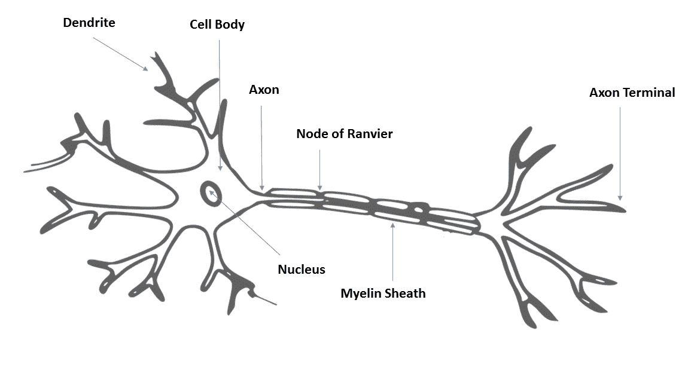

图 1.2：生物神经元

下图说明了人工神经元：

图 1.3：人工神经元

现在，让我们看一下人工神经网络的结构，如下图所示：

图 1.4：人工神经网络

输入`x ∈ R^N`穿过神经单位的连续层，这些层以分层方式排列。 特定层中的每个神经元都接收来自先前层的神经元的输入，这些输入被它们之间的连接权重所衰减或放大。 权重对应于`l`层第`i`个神经元与`l + 1`层第`j`个神经元。 同样，每个神经元单元`i`在特定层`1`中都有一个偏见。 神经网络为输入向量`x ∈ R^N`预测输出。 如果数据的实际标签是`y`，其中`y`取连续值，则神经元网络将预测误差最小化来学习权重和偏差。 当然，对于所有标记的数据点，必须将误差最小化：`(xi, yi), i ∈ 1, 2, ..., m`。

如果我们用一个公共向量`W`表示一组权重和偏差，并且预测中的总误差由`C`表示，则在训练过程中，估计的`W`可以表示为：

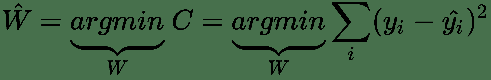

同样，预测输出可以由输入`x`的函数表示，并由权重矢量`W`进行参数化，如下所示：

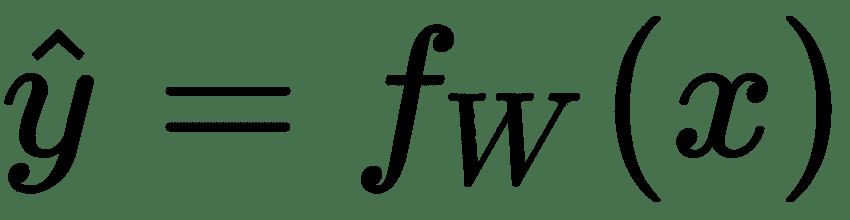

这种用于预测输出连续值的公式称为**回归问题**。

对于两类二进制分类，交叉熵损失最小，而不是平方误差损失，并且网络输出正类的概率而不是输出。 交叉熵损失可以表示为：

此处，`p[i]`是给定输入`x`的输出类别的预测概率，并且可以表示为输入`x`的函数。由权重向量参数化，如下所示：

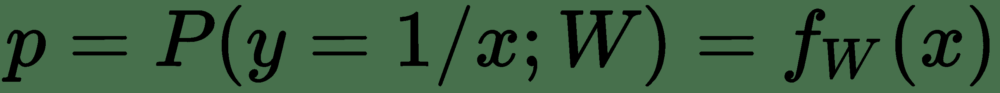

通常，对于多类别分类问题（例如`n`类），交叉熵损失可通过以下方式给出：

在这里，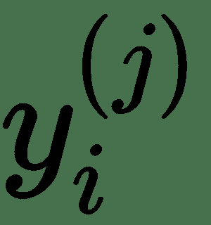是第`i`个数据点的第`j`类的输出标签。

# 神经激活单位

取决于体系结构和当前的问题，在神经网络中使用了几种神经激活单元。 我们将讨论最常用的激活功能，因为它们在确定网络体系结构和性能方面起着重要作用。 线性和 S 形单位激活函数主要用于人工神经网络，直到 Hinton 等人发明的**整流线性单元**（**ReLUs**）彻底改变了神经网络的性能。

# 线性激活单元

**线性激活单元**将总输入输出到衰减的神经元，如下图所示：

图 1.5：线性神经元

如果`x`是线性激活单元的总输入，则输出`y`可以表示如下：

# 乙状结肠激活单元

**乙状结肠** **激活单元**，`y`的输出是其总输入`x`的函数，表示如下：

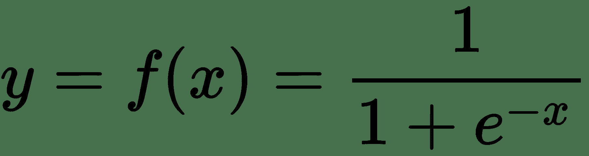

由于 S 形激活单元响应是非线性函数，如下图所示，它可用于在神经网络中引入非线性：

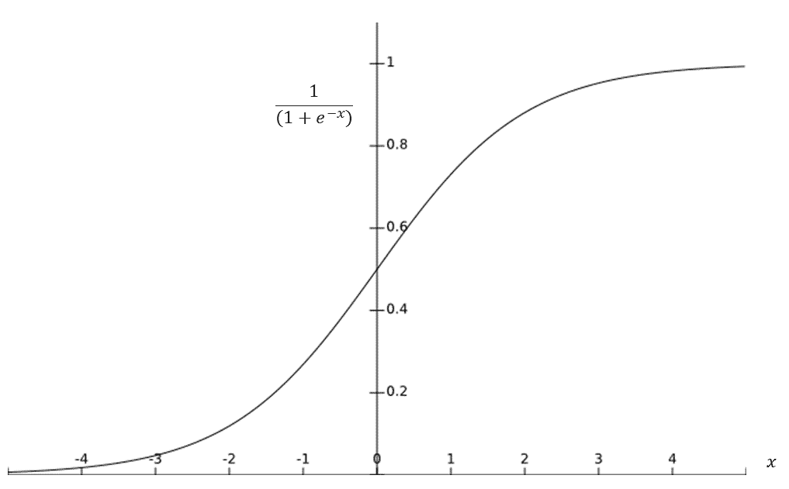

图 1.6：乙状结肠激活功能

自然界中任何复杂的过程通常在输入输出关系上都是非线性的，因此，我们需要非线性激活函数通过神经网络对其进行建模。 两类分类的神经网络的输出概率通常由 S 型神经单元的输出给定，因为它的输出值从零到一。 输出概率可以表示如下：

在这里，`x`代表输出层中 S 型单元的总输入量。

# 双曲正切激活函数

给出了**双曲正切激活函数**（**tanh**）的输出`y`作为其总输入的函数`x`如下：

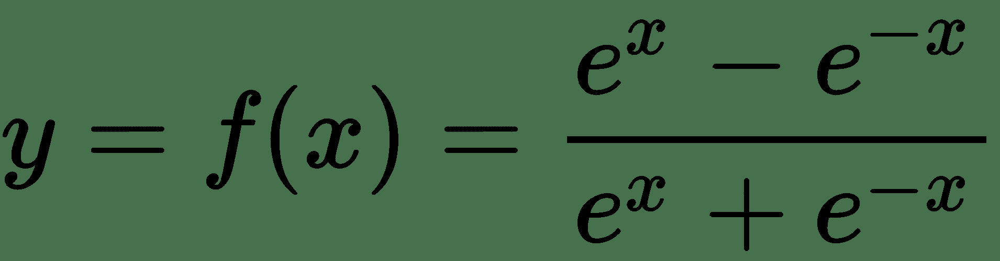

tanh 激活功能输出的值在[ **-1** ，`1`]范围内，如下图所示：

图 1.7：Tanh 激活功能

需要注意的一件事是 S 型和 tanh 激活函数在很小的输入范围内都是线性的，超过该范围输出就会饱和。 在饱和区，激活函数（相对于输入）的梯度非常小或接近零； 这意味着它们非常容易消失梯度问题。 正如您将在后面看到的那样，神经网络将从反向传播方法中学习，在该方法中，层的梯度取决于后续层中直至最终输出层中激活单元的梯度。 因此，如果激活单元中的单元在饱和区域中工作，则将更少的误差反向传播到神经网络的早期层。 神经网络通过利用梯度来最小化预测误差，以学习权重和偏差（`W`）。 这意味着，如果梯度很小或消失为零，则神经网络将无法正确学习这些权重。

# 整流线性单元（ReLU）

当神经元的总输入大于零时，ReLU 的输出为线性，而当神经元的总输入为负时，ReLU 的输出为零。 这个简单的激活函数为神经网络提供了非线性，同时，它相对于总输入提供了一个恒定的梯度。 这个恒定的梯度有助于防止神经网络出现饱和或消失的梯度问题，如激活功能（如 S 型和 tanh 激活单元）所示。 ReLU 函数输出（如图“图 1.8”所示）可以表示如下：

ReLU 激活函数可以绘制如下：

图 1.8：ReLU 激活功能

ReLU 的限制条件之一是其输入负值的零梯度。 这可能会减慢训练速度，尤其是在初始阶段。 LReLU 激活函数（如图 1.9 所示）在这种情况下非常有用，即使输出和梯度不为零，即使输入为负值。 ReLU 输出函数泄漏可以表示如下：

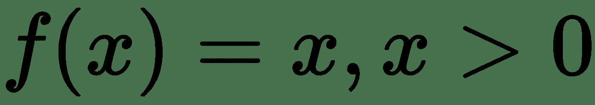

将为泄漏的 ReLU 激活功能提供参数，而对于参数 ReLU，是神经网络将通过训练学习的参数。 下图显示了泄漏的 ReLU 激活函数的输出：

图 1.9：泄漏的 ReLU 激活功能

# softmax 激活单元

在多类别分类问题的情况下， **softmax 激活单元**通常用于输出类别概率。 假设我们正在处理`n`类分类问题，并且与这些类相对应的总输入如下：

在这种情况下，softmax 激活单元的第`k`类的输出概率由以下公式给出：

还有其他几种激活功能，大多数是这些基本版本的变体。 我们将在以下各章介绍的不同项目中讨论它们时，对它们进行讨论。

# 训练神经网络的反向传播方法

在反向传播方法中，神经网络通过梯度下降技术进行训练，其中组合权重向量`W`迭代更新，如下所示：

这里，`η`是学习率， `W^(t + 1)`和`W^(t)`分别是迭代`t + 1`和`t`时的权重向量，`∇C(W^(t))`是迭代`t`时的成本函数或误差函数对于权重向量`W`的梯度。 先前由`w ∈ W`概括的单个权重或偏差的算法可以表示为：

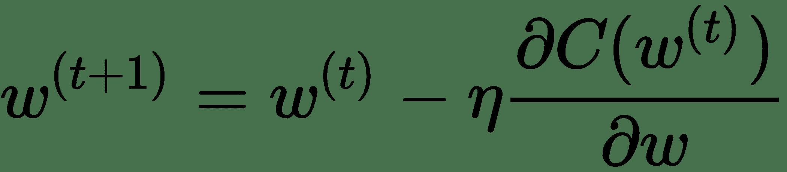

从前面的表达式中可以得出，梯度下降学习方法的核心在于针对每个权重计算成本函数或误差函数的梯度。

从微分的链式规则中，我们知道如果我们有 `y = f(x), z = f(y)`，那么以下是正确的：

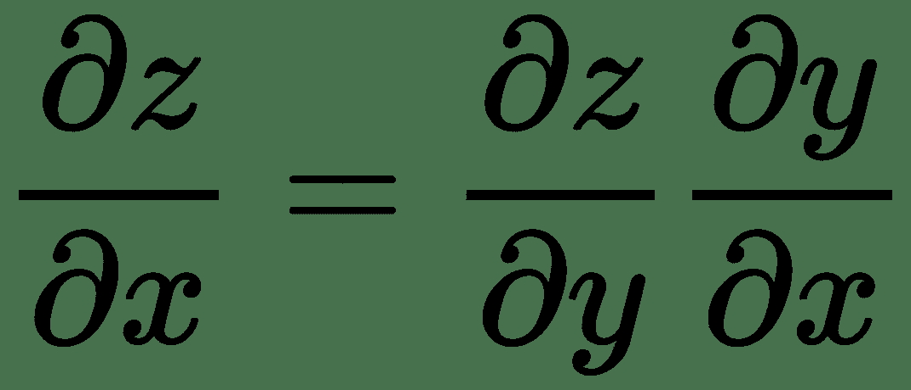

该表达式可以推广为任意数量的变量。 现在，让我们看一个非常简单的神经网络，如下图所示，以了解反向传播算法：

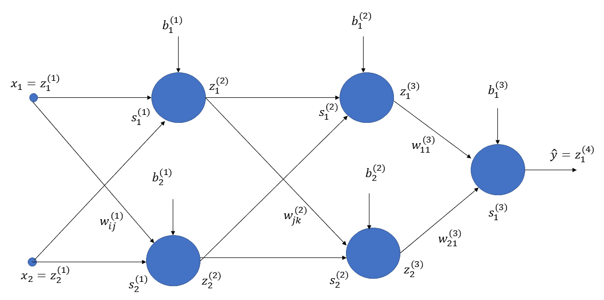

图 1.10：说明反向传播的网络

令网络输入为二维向量， `x = [x1, x2]^T`， 输出标签和预测分别为  和  。 另外，我们假设神经网络中的所有激活单元都是 S 型。 让广义权重将层`l-1`中的任何单元`i`连接到层`l`中的单元`j`表示为  ，而`l`层中任何单位`i`的偏置应表示为  。 让我们得出一个数据点的梯度； 总梯度可以计算为训练（或小批量）中使用的所有数据点的总和。 如果输出是连续的，则可以选择损失函数`C`作为预测误差的平方：

可以通过将相对于`W`向量的成本函数最小化来确定由集合`W`表示的网络的权重和偏差，如下所示：

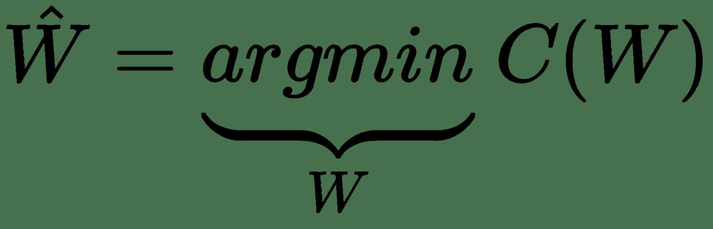

为了通过梯度下降迭代地执行成本函数的最小化，我们需要针对每个权重计算成本函数的梯度`w ∈ W`，如下所示：

现在我们有了所需的一切，让我们计算成本函数`C`相对于权重  的梯度。 使用差分的链式规则，我们得到以下信息：

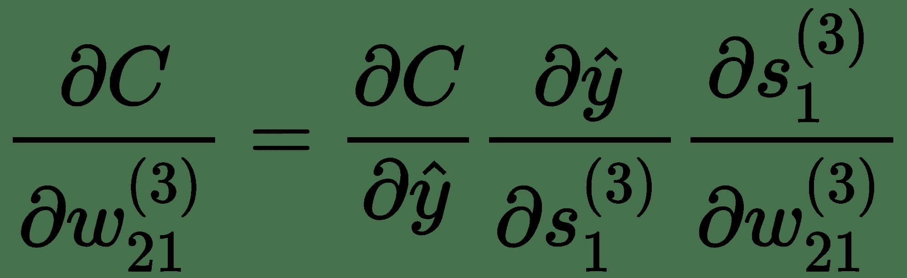

现在让我们看下面的公式：

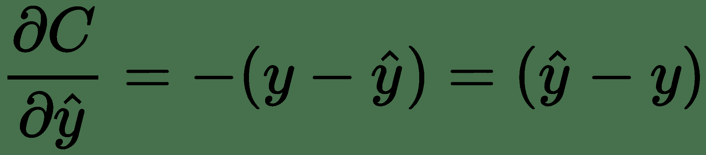

正如您在前面的表达式中看到的那样，导数不过是预测中的错误。 通常，在存在回归问题的情况下，输出单元激活函数是线性的，因此适用以下表达式：

*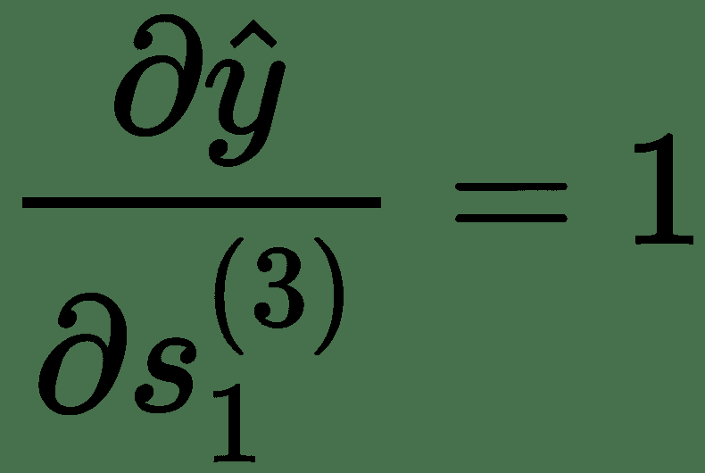*

因此，如果我们要计算成本函数相对于输出单元总输入的梯度，则为  。 这仍然等于输出预测中的误差。

根据输入权重和激活，输出单元上的总输入可以表示为：

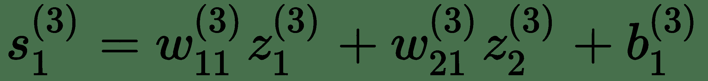

这意味着 *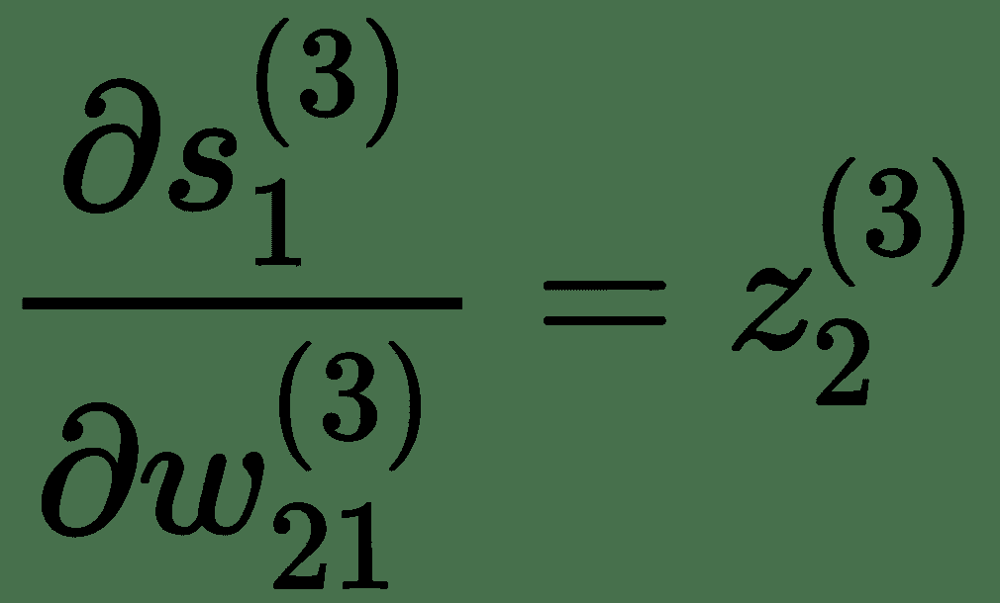* 以及成本函数相对于权重的导数 ** 通过以下方式得出：

如您所见，相对于最终输出层之前的层中的权重，该错误在计算成本函数的梯度时反向传播。 当我们计算成本函数相对于广义权重的梯度时，这变得更加明显。 取对应于`j = 1`和`k = 2`的权重； 即。 成本函数`C`相对于该权重的梯度可以表示为：

现在，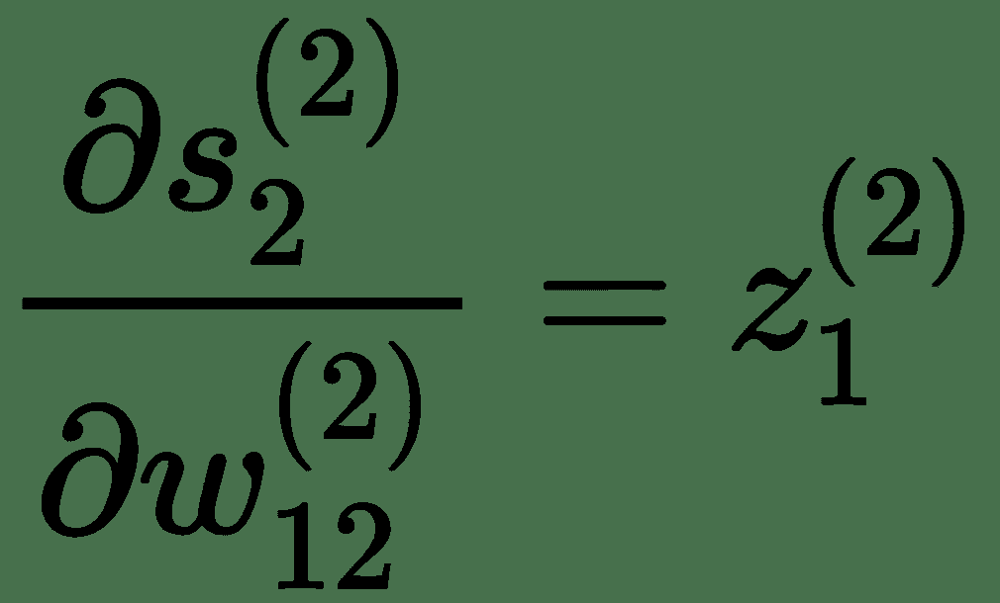表示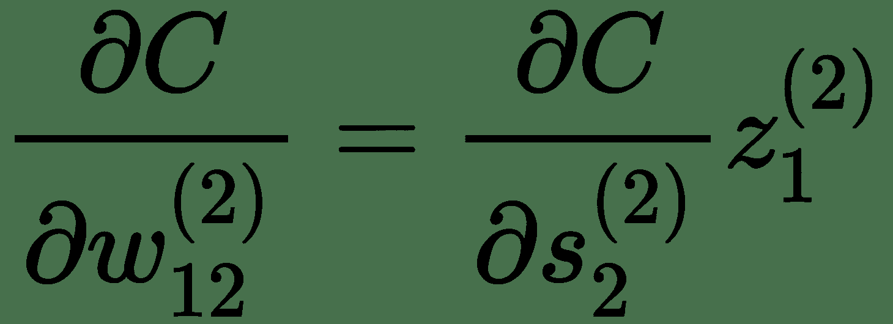。

因此，一旦我们确定了成本函数相对于神经元总输入的梯度为，则任何权重的梯度`w`贡献了总输入量`s`，可以通过简单地乘以与重量相关的激活`z`来获得。

现在，成本函数相对于总输入的梯度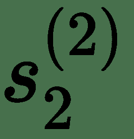可以再次通过链式法则得出，如下所示：

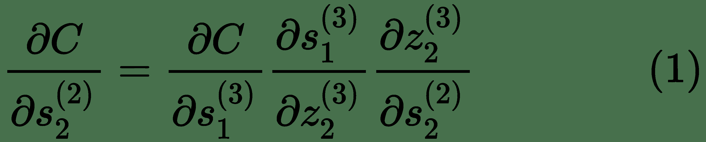

由于神经网络的所有单元（输出单元除外）均为 S 型激活函数，因此情况如下：

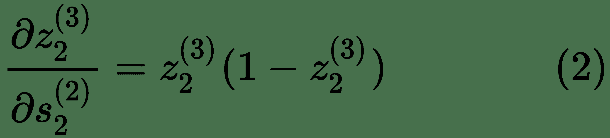

结合`(1), (2), (3)`，我们得到以下信息：

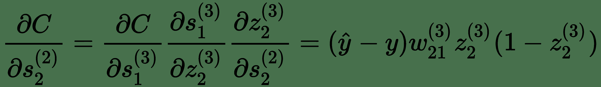

在前面的派生梯度表达式中，您可以看到预测误差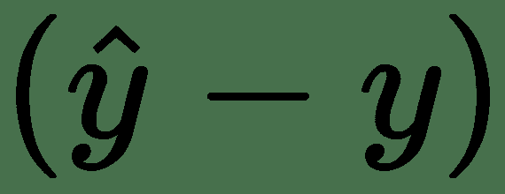通过与相关的激活和权重（根据微分链规则）组合以计算每一层权重的梯度而向后传播 ，因此是 AI 术语中的反向传播名称。

# 卷积神经网络

**卷积神经网络**（**CNN**）利用卷积运算从具有关联拓扑的数据中提取有用信息。 这最适合图像和音频数据。 输入图像在通过卷积层时会生成多个输出图像，称为**输出特征图**。 输出要素图将检测要素。 初始卷积层中的输出特征图可以学习检测基本特征，例如边缘和颜色成分变化。

第二卷积层可以检测到稍微复杂的特征，例如正方形，圆形和其他几何结构。 随着神经网络的发展，卷积层学会了检测越来越复杂的特征。 例如，如果我们有一个 CNN 可以对图像是猫还是狗进行分类，则神经网络底部的卷积层可能会学会检测诸如头部，腿部等特征。

“图 1.11”显示了 CNN 的架构图，该 CNN 处理猫和狗的图像以对其进行分类。 图像通过卷积层，该卷积层有助于检测相关特征，例如边缘和颜色组合。 ReLU 激活会增加非线性。 激活层之后的合并层汇总本地邻居信息，以提供一定数量的**翻译不变性**。 在理想的 CNN 中，此卷积激活池操作在网络进入密集连接之前执行了几次：

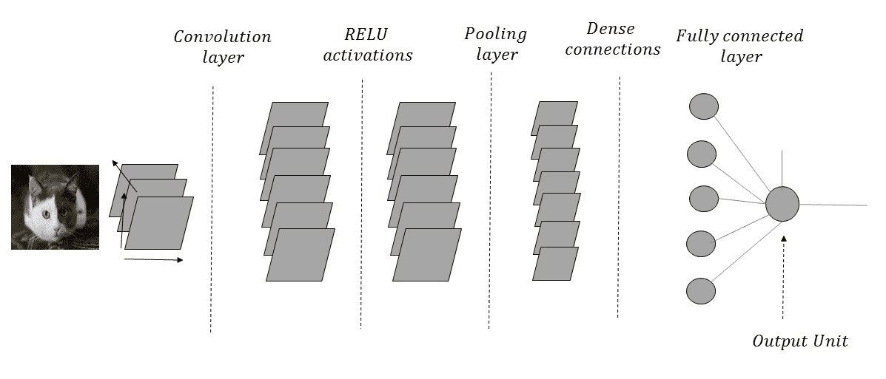

图 1.11：CNN 架构

当我们经过具有多个卷积激活池操作的网络时，图像的空间分辨率会降低，而输出特征图的数量在每一层中都会增加。 卷积层中的每个输出特征图都与过滤器内核相关联，该过滤器内核的权重是通过 CNN 训练过程学习的。

在卷积操作中，将滤镜内核的翻转版本放置在整个图像或特征图上，并为滤镜上每个位置计算滤镜内核输入值与相应图像像素或特征图值的点积。 输入图像或特征图。 已经习惯了普通图像处理的读者可能已经使用了不同的滤镜内核，例如高斯滤镜，Sobel 边缘检测滤镜等，其中许多滤镜的权重已预定义。 卷积神经网络的优点是通过训练过程确定不同的滤波器权重。 这意味着，针对卷积神经网络正在处理的问题，可以更好地定制过滤器。

当卷积运算涉及在输入的每个位置上覆盖滤波器内核时，该卷积被称为跨度为 1。 如果我们选择在覆盖过滤器内核时跳过一个位置，那么卷积将以两个步幅执行。 通常，如果将`n`位置跳过而将滤波器内核覆盖在输入上，则表示卷积以`n + 1`的步幅执行。 大于 1 的步幅会减小卷积输出的空间尺寸。

通常，卷积层之后是池化层，池化层基本上总结了由池化的接收场确定的邻域中的输出特征图激活。 例如，一个 2 x 2 的接收场将收集四个相邻的输出特征图激活的本地信息。 对于最大池操作，将选择四个激活的最大值作为输出，而对于平均池化，将选择四个激活的平均值。 合并降低了特征图的空间分辨率。 例如，对于具有 2 x 2 接收场的 224 x 224 尺寸的特征图池化操作，特征图的空间尺寸将减小为 112 x 112。

要注意的一件事是，卷积运算减少了每层要学习的权重数。 例如，如果我们有一个空间尺寸为 224 x 224 的输入图像，而下一层的期望输出为尺寸为 224 x 224 的尺寸，那么对于具有完整连接的传统神经网络来说，要学习的权重数 是 224 x 224 x 224 x 224.对于具有相同输入和输出尺寸的卷积层，我们需要学习的只是滤波器内核的权重。 因此，如果我们使用 3 x 3 过滤器内核，我们只需要学习 9 个权重即可，而不是 224 x 224 x 224 x 224 权重。 这种简化是有效的，因为局部空间邻域中的图像和音频之类的结构之间具有高度相关性。

输入图像经过多层卷积和池化操作。 随着网络的发展，特征图的数量增加，而图像的空间分辨率降低。 在卷积池层的末端，要素图的输出被馈送到全连接层，然后是输出层。

输出单位取决于手头的任务。 如果执行回归，则输出激活单位是线性的，而如果是二进制分类问题，则输出单位是 S 形的。 对于多类别分类，输出层是 softmax 单位。

在本书的所有图像处理项目中，我们都将使用一种或另一种形式的卷积神经网络。

# 循环神经网络（RNN）

**循环神经网络**（**RNN**）在处理顺序或时间数据时非常有用，其中给定实例或位置的数据与先前时间步长或位置中的数据高度相关。 RNN 在处理文本数据方面已经非常成功，因为给定实例中的单词与它前面的单词高度相关。 在 RNN 中，网络在每个时间步执行相同的功能，因此名称中的术语**重复出现**。 下图说明了 RNN 的体系结构：

图 1.12：RNN 架构

在每个给定的时间步长`t`处，计算记忆状态`h[t]`，基于步骤`t-1`处的之前的状态`h[t-1]`，以及时间步长`t`处的输入`x[t]`。 新状态`h[t]`用于在步骤`t`处预测输出`o[t]`。 控制 RNN 的方程式如下：

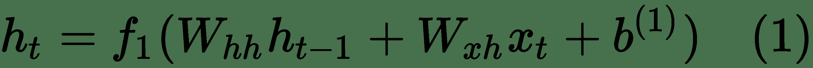

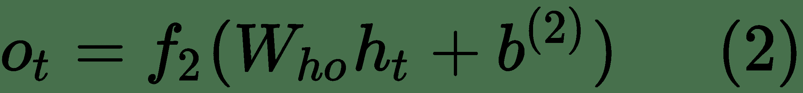

如果我们要预测句子中的下一个单词，则函数`f[2]`通常是词汇表中单词的 softmax 函数。 根据当前问题，`f[1]`功能可以是任何激活功能。

在 RNN 中，步骤`t`中的输出错误会尝试纠正先前时间步中的预测，并通过`k ∈ 1, 2, ..., t-1`来概括。 通过传播先前时间步长中的错误来实现。 这有助于 RNN 了解彼此相距较远的单词之间的长期依赖性。 实际上，由于梯度问题的消失和爆炸，并非总是可能通过 RNN 学习这么长的依赖关系。

如您所知，神经网络通过梯度下降来学习，并且可以通过以下步骤来学习单词在时间步`t`与在先序列步`k`之间的关系。 记忆状态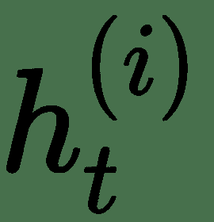相对于记忆状态`h[i]^(t)`的梯度。 用以下公式表示：

如果从序列步骤`k`的存储状态到序列步骤`k + 1`的存储状态的权重连接由*给出`u[ii] ∈ W[hh]`，则以下是正确的：

在前面的等式中，是在时间步`k + 1`时存储状态`i`的总输入，因此情况如下：

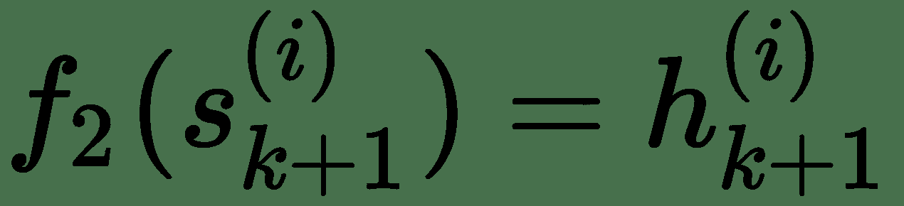

既然我们已经准备就绪，那么就很容易理解为什么 RNN 中可能会出现消失的梯度问题。 从前面的等式`(3))`和`(4)`得到以下结果：

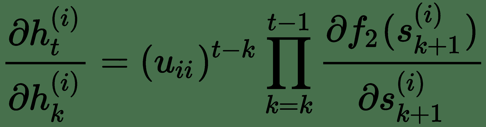

对于 RNN，函数`f[2]`通常为 Sigmoid 或 tanh，其饱受饱和度的困扰，即具有超出指定输入值范围的低梯度。 现在，由于`f[2]`的导数彼此相乘，因此，如果激活函数的输入在饱和区工作，则的斜率可以变为零，即使相对`tk`的中等值。 即使`f[2]`函数在饱和区中不起作用，但 Sigmoids 的`f[2]`函数的梯度始终较小 比`1`难，因此很难学习序列中单词之间的远距离依存关系。 同样，可能会由于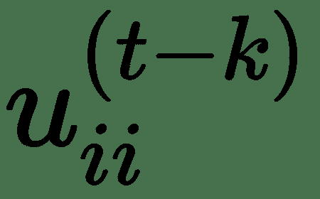因子而出现爆炸性梯度问题。 假设步`t`和`k`之间的距离约为`10`，而重量`u[ii]`，大约两点。 在这种情况下，梯度将被放大两倍，即`2 ^ 10 = 1024`，从而导致爆炸梯度问题。

# 长短期记忆（LSTM）单元

消失的梯度问题在很大程度上由 RNN 的改进版本（称为**长短期记忆**（**LSTM**）单元）解决。 长短期存储单元的体系结构图如下：

图 1.13：LSTM 架构

除了记忆状态`h[t]`之外，LSTM 还介绍了 RNN 单元状态`C[t]`。 单元状态由三个门控制：遗忘门，更新门和输出门。 遗忘门确定从先前的单元状态`C[t-1]`保留多少信息，其输出表示如下：

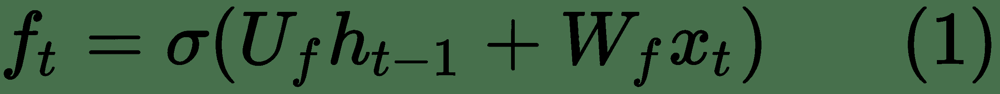

更新门的输出表示如下：

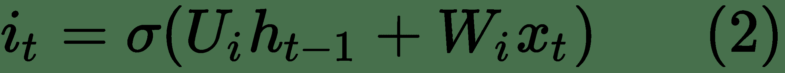

潜在的新候选细胞状态表示如下：

基于先前的电池状态和当前的潜在电池状态，通过以下方式提供更新的电池状态输出：

并非单元状态的所有信息都传递到下一步，并且应由**输出门**确定应释放多少单元状态到下一步。 输出门的输出通过以下方式给出：

根据当前单元状态和输出门，通过以下方式给出传递给下一步的更新后的内存状态：

现在出现了一个大问题：LSTM 如何避免消失的梯度问题？ LSTM 中的等效项由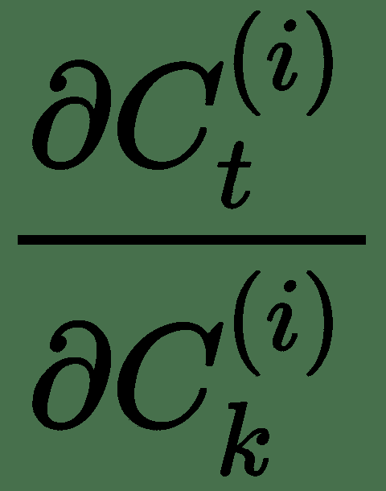给出，可以用以下产品形式表示：

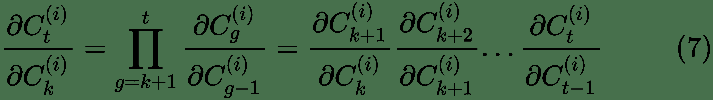

现在，单元状态单元的递归由以下给出：

由此，我们得到以下内容：

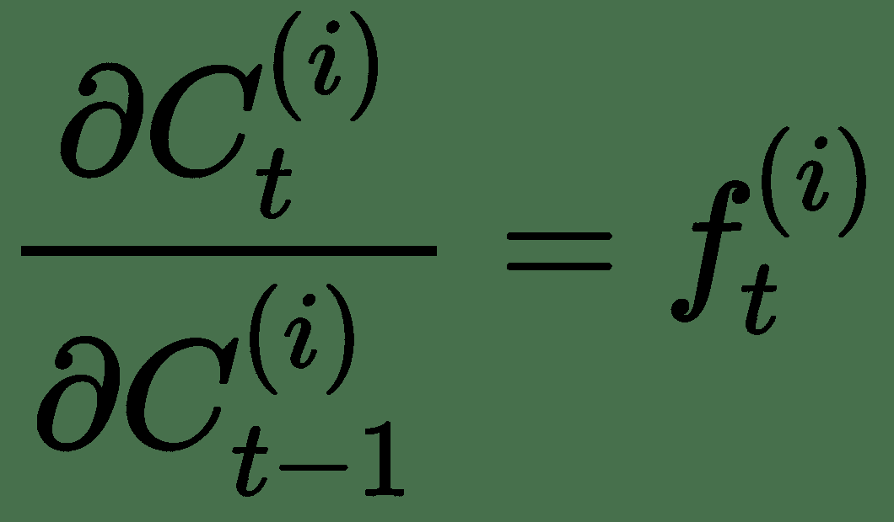

结果，梯度表达式变为以下：

如您所见，如果我们可以将遗忘单元格状态保持在一个附近，则梯度将几乎不衰减地流动，并且 LSTM 不会遭受梯度消失的困扰。

我们将在本书中看到的大多数文本处理应用程序将使用 RSTM 的 LSTM 版本。

# 生成对抗网络

**生成对抗网络**，通常称为 **GAN** ，是通过生成器`G`学习特定概率分布的生成模型。 生成器`G`与鉴别器`D`进行零和极小极大游戏，并且两者都会随着时间的流逝而逐渐达到纳什均衡。 生成器尝试生成类似于给定概率分布`P(x)`生成的样本，而鉴别器`D`尝试区分生成器生成的那些假数据样本。`G`来自原始分布的数据样本。 发生器`G`尝试通过转换样本`z`来生成与`P(x)`相似的样本。 噪声分布`P(z)`。 鉴别符`D`在假冒时学会将生成器`G`生成的样本标记为`G(z)`；`x`原始时属于`P(x)`。 在 minimax 游戏的平衡状态下，生成器将学习生成与原始分布`P(x)`相似的样本，因此以下是正确的：

下图说明了学习 MNIST 数字的概率分布的 GAN 网络：

Figure 1.14: GAN architecture 

鉴别器最小化的成本函数是二进制交叉熵，用于区分生成器生成的假数据 属于概率分布`P(x)`的真实数据点`z`）：

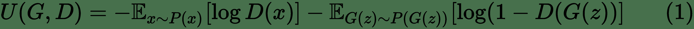

生成器将尝试最大化由`(1)`给出的相同成本函数。 这意味着，优化问题可以表示为具有效用函数 `U(G, D)`的 minimax 播放器，如下所示：

通常，要测量给定概率分布与给定分布的匹配程度，请使用`f`-发散度量，例如 **Kullback-Leibler**（**KL**）散度，詹森·香农散度和 Bhattacharyya 距离。 例如，以下给出两个概率分布`P`和`Q`之间的 KL 散度，其中对分布的期望是`P`：

类似地，`P`和`Q`之间的詹森香农散度给出如下：

现在，回到`(2)`，表达式可以编写如下：

在这里，`G(x)`是生成器的概率分布。 将期望扩展到其不可或缺的形式，我们得到以下内容：

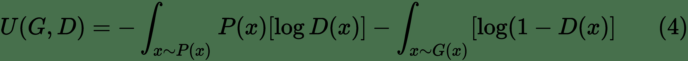

对于固定的发电机分配，如果满足以下条件，则`G(x)`对于鉴别器的效用函数将最小。

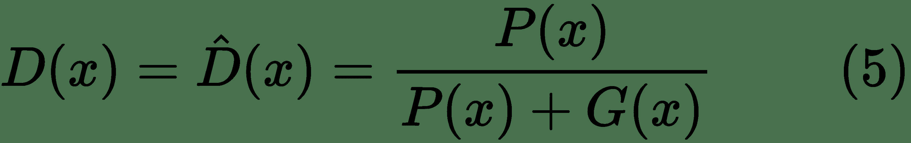

用`(5)`替换为`(3)`中的`D(x)`，我们得到以下信息：

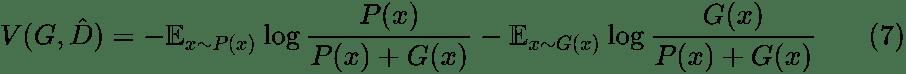

现在，生成器的任务是最大化实用程序或最小化实用程序。 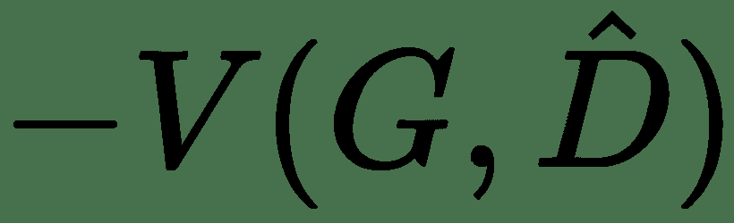的表达式可以重新安排如下：

因此，我们可以看到生成器最小化等于最小化实际分布`P(x)`与生成器生成的样本分布之间的 Jensen Shannon 散度`G`（即`G(x)`）。

训练 GAN 并不是一个简单的过程，在训练这样的网络时我们需要考虑几个技术方面的考虑。 我们将使用高级 GAN 网络在第 4 章“使用 GANs* 的时装行业中的风格迁移”中构建跨域风格迁移应用程序。

# 强化学习

**强化学习**是机器学习的一个分支，它使机器和/或代理可以通过采取特定行动在特定上下文中最大化某种形式的奖励。 强化学习不同于监督学习和无监督学习。 强化学习广泛用于博弈论，控制系统，机器人技术和其他新兴的人工智能领域。 下图说明了强化学习问题中代理与环境之间的交互：

图 1.15：强化学习模型中的 Agent 与环境交互

# Q 学习

现在，我们将研究一种流行的强化学习算法，称为 **Q 学习**。 Q 学习用于确定给定的有限 Markov 决策过程的最佳动作选择策略。 **马尔可夫决策过程**由状态空间`S`； 一个动作空间`A`； 立即奖励集`R`； 给定当前状态`s[t]`的下一个状态的概率`S[t + 1]`； 当前动作`a[t]`； `P(S[t+1]/S[t];r[t])`; 和折扣系数`γ`定义。 下图说明了马尔可夫决策过程，其中下一个状态取决于当前状态以及在当前状态下执行的任何操作：

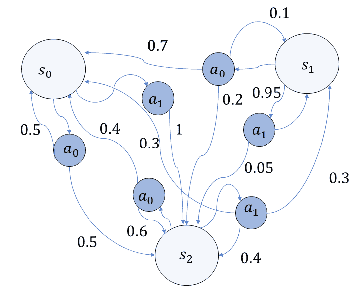

图 1.16：马尔可夫决策过程

假设我们有一系列状态，动作和相应的奖励，如下所示：

如果我们考虑长期奖励`R[t]`，则在步骤`t`处，它等于从`t`开始的每一步直到最后的立即奖励总和，如下所示：

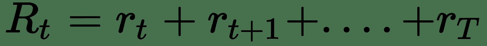

现在，马尔可夫决策过程是一个随机过程，无法每次基于`S[t]`和`a[t]`进行相同的下一步`S[t + 1]`； 因此，我们对未来的奖励应用了折扣系数。 这意味着长期奖励可以更好地表示为：

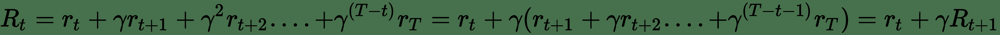

由于在时间步`t`上已经实现了即时奖励，为了最大化长期奖励，我们需要最大化时间步`t + 1`的长期奖励（即`R[t + 1]`），方法是选择最佳操作。 通过采取行动`a[t]`的状态`S[t]`所期望的最大长期回报，由以下 Q 函数表示：

在每个状态`s ∈ S`，Q 学习中的主体尝试采取行动，以最大化其长期回报。 Q 学习算法是一个迭代过程，其更新规则如下：

如您所见，该算法受`(1)`中表达的长期奖励概念的启发。

处于状态`s[t]`的采取行动`a[t]`的总累积奖励`Q(s[t], a[t])`取决于即时奖励`r[t]`以及在新步骤`s[t+1]`处的，我们希望的最大长期回报。 在马尔可夫决策过程中，新状态`s[t + 1]`随机依赖于当前状态，即`s[t]`，然后通过`P(S[t+1]/S[t];r[t])`形式的概率密度/质量函数选取的动作`a[t]`。

该算法通过根据的值对旧期望值和新长期奖励值进行加权平均，来不断更新期望长期累积奖励。

通过迭代算法构建了`Q(s, a)`函数后，在基于给定状态`s`进行游戏时，我们可以采取最佳措施， 作为最大化 Q 功能的策略：

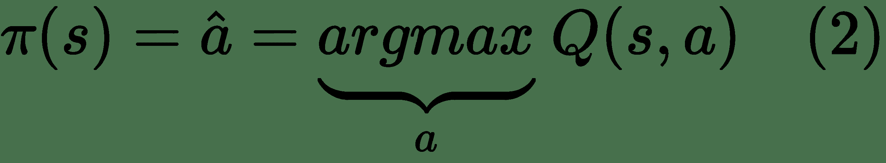

# 深度 Q 学习

在 Q 学习中，我们通常会处理一组有限的状态和动作。 这意味着，表格足以容纳 Q 值和奖励。 但是，在实际应用中，状态和适用动作的数量大多是无限的，并且需要更好的 Q 函数逼近器来表示和学习 Q 函数。 深度神经网络是通用函数逼近器，因此在这里就应运而生。 我们可以用神经网络表示 Q 函数，该神经网络将状态和动作作为输入并提供相应的 Q 值作为输出。 或者，我们可以只使用状态来训练神经网络，然后将输出作为与所有动作相对应的 Q 值。 下图说明了这两种情况。 由于 Q 值是奖励，因此我们在以下网络中处理回归：

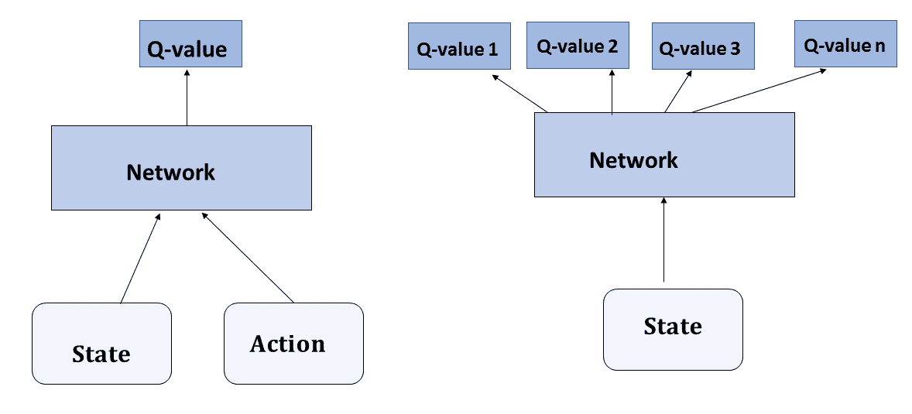

图 1.17：深度 Q 学习功能逼近器网络

在本书中，我们将使用强化学习来训练赛车，以通过深度 Q 学习自行驾驶。

# 迁移学习

通常，**迁移学习**是指使用在一个领域中获得的知识来解决另一领域中的相关问题的概念。 但是，在深度学习中，它专门指的是将针对特定任务训练的神经网络重新用于不同领域中的相似任务的过程。 新任务使用从先前任务中学到的特征检测器，因此我们不必训练模型就可以学习它们。

由于不同层之间的连接模式的性质，深度学习模型倾向于具有大量参数。 要训​​练这么大的模型，需要大量的数据； 否则，模型可能会过拟合。 对于许多需要深度学习解决方案的问题，将无法获得大量数据。 例如，在用于对象识别的图像处理中，深度学习模型提供了最新的解决方案。 在这种情况下，可以基于从现有的经过训练的深度学习模型中学习到的特征检测器，使用迁移学习来创建特征。 然后，这些功能可用于使用可用数据构建简单模型，以解决当前的新问题。 因此，新模型需要学习的唯一参数是与构建简单模型有关的参数，从而减少了过拟合的机会。 通常在大量数据上训练预训练的模型，因此，它们具有作为特征检测器的可靠参数。

当我们在 CNN 中处理图像时，初始层会学会检测非常通用的特征，例如卷曲，边缘，颜色组成等。 随着网络的深入发展，更深层次的卷积层将学会检测与特定种类的数据集相关的更复杂特征。 我们可以使用预训练的网络，并选择不训练前几层，因为它们会学习非常通用的功能。 相反，我们可以只专注于训练最后几层的参数，因为它们将学习针对当前问题的复杂功能。 这样可以确保我们需要训练的参数较少，并且可以明智地使用数据，仅训练所需的复杂参数，而不训练通用特征。

迁移学习已广泛应用于通过 CNN 进行图像处理的过程，其中滤镜充当特征检测器。 用于迁移学习的最常见的预训练 CNN 是`AlexNet`，`VGG16`，`VGG19`，`Inception V3`和`ResNet`等。 下图说明了用于传输学习的预训练`VGG16`网络：

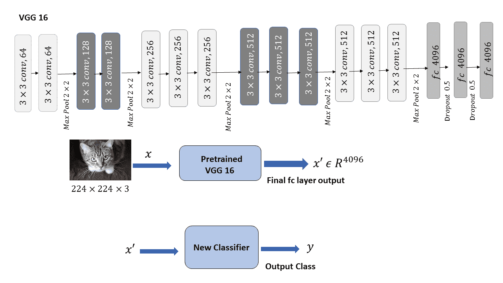

图 1.18：使用预训练的 VGG 16 网络进行迁移学习

以`x`表示的输入图像被馈送到**预训练的 VGG 16** 网络，以及`4096`维输出特征向量 **x'**， *是从最后一个全连接层中提取的。 提取的特征 **x'**以及相应的类别标签`y`用于训练简单的分类网络，从而减少解决问题所需的数据。*

我们将通过使用第 2 章，“迁移学习”中的迁移学习来解决医疗保健领域中的图像分类问题。

# 受限玻尔兹曼机

**受限玻尔兹曼机器**（**RBM**）是一门无监督的机器学习算法，用于学习数据的内部表示。 RBM 具有可见层`v ∈ R^m`，以及隐藏层`h ∈ R^n`。 RBM 学习在可见层中将输入呈现为隐藏层中的低维表示。 给定可见层输入，所有隐藏层单元在条件上都是独立的。 类似地，给定隐藏层输入，所有可见层在条件上都是独立的。 给定隐藏层输入，这使得 RBM 可以独立地对可见单元的输出进行采样，反之亦然。

下图说明了 RBM 的体系结构：

图 1.19：受限的 Boltzmann 机器

权重`w[ij] ∈ W`将可见单位`i`连接到隐藏单位`j`，其中`W ∈ R^(mxn)`是所有这些权重的集合，从可见单位到隐藏单位。 可见单位的偏差由`b[i] ∈ b`表示，而隐藏单位的偏差由`c[j] ∈ c`表示。

受统计物理学中玻耳兹曼分布的思想启发，可见层矢量`v`和隐藏层矢量`h`的联合分布与 负能量的配置：

（1）

配置的能量由以下给出：

（2）

给定可见输入向量`v`的隐藏单位`j`的概率可以表示为：

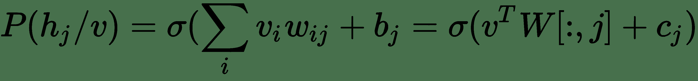（2）

类似地，给出隐藏输入矢量`h`的可见单位`i`的概率由以下公式给出：

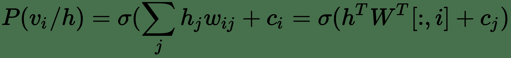（3）

因此，一旦我们通过训练了解了 RBM 的权重和偏差，就可以在给定隐藏状态的情况下对可见表示进行采样，而在给定可见状态的情况下可以对隐藏状态进行采样。

类似于**主成分分析**（**PCA**），RBM 是一种表示一维数据的方法，由可见层`v`表示为不同的维 由隐藏层`h`提供。 当隐藏层的尺寸小于可见层的尺寸时，RBM 执行减小尺寸的任务。 RBM 通常在二进制数据上训练。

通过最大化训练数据的可能性来训练 RBM。 在成本函数相对于权重和偏差的梯度下降的每次迭代中，都会出现采样，这会使训练过程变得昂贵并且在计算上有些棘手。 一种名为**对比发散**的聪明采样方法（使用吉布斯采样）用于训练 RBM。

在第 6 章，“智能推荐系统”中，我们将使用 RBM 构建推荐系统。

# 汽车编码器

与 RBM 十分相似，**自动编码器**是一类无监督的学习算法，旨在发现数据中的隐藏结构。 在**主成分分析**（**PCA**）中，我们尝试捕获输入变量之间的线性关系，并尝试通过（输入的）线性组合来表示降维空间中的数据 变量），这说明了数据的大部分差异。 但是，PCA 无法捕获输入变量之间的非线性关系。

自动编码器是一种神经网络，可以捕获输入变量之间的非线性相互作用，同时在隐藏层中以不同维度表示输入。 在大多数情况下，隐藏层的尺寸小于输入的尺寸。 假设存在高维数据固有的低维结构，我们跳过了这一点。 例如，高维图像可以由低维流形表示，并且自动编码器通常用于发现该结构。 下图说明了自动编码器的神经体系结构：

图 1.20：自动编码器架构

自动编码器有两个部分：编码器和解码器。 编码器尝试将输入数据`x`投影到隐藏层`h`中。 解码器尝试从隐藏层`h`重构输入。 通过最小化重构误差，即来自解码器和原始输入的重构输入之间的误差，可以训练伴随此类网络的权重。 如果输入是连续的，则最小化重构误差的平方和，以学习自动编码器的权重。

如果我们用函数`f[W](x)`表示编码器，而解码器则用`f[U](x)`表示，其中`W`和`U`是与编码器和解码器关联的权重矩阵，那么情况如下：

（1）

（2）

训练集上的重构误差`C`，`x[i], i ∈ 1, 2, 3, ..., m`可以表示如下 ：

（3）

通过最小化`(3)`的成本函数，可以学习自动编码器的最佳权重，如下所示：

（4）

自动编码器用于多种目的，例如学习数据的潜在表示，降噪和特征检测。 降噪自动编码器将实际输入的噪声版本作为其输入。 他们尝试构建实际的输入，以作为重建的标签。 类似地，自动编码器可以用作生成模型。 可以用作生成模型的一类这样的自动编码器称为**变分自动编码器**。 当前，变分自动编码器和 GAN 作为图像处理的生成模型非常受欢迎。

# 概要

现在，我们到了本章的结尾。 我们已经研究了人工神经网络的几种变体，包括用于图像处理目的的 CNN 和用于自然语言处理目的的 RNN。 此外，我们将 RBM 和 GAN 视为生成模型，将自动编码器视为无监督方法，可以解决许多问题，例如降噪或解密数据的内部结构。 此外，我们还谈到了强化学习，这对机器人技术和 AI 产生了重大影响。

您现在应该熟悉本书其余各章中构建智能 AI 应用程序时将要使用的核心技术。 在构建应用程序时，我们将在需要时进行一些技术上的改动。 建议不熟悉深度学习的读者探索更多有关本章涉及的核心技术的信息，以便更全面地理解。

在随后的章节中，我们将讨论实用的 AI 项目，并使用本章中讨论的技术来实现它们。 在第 2 章，“迁移学习”中，我们将从使用迁移学习实现医疗保健应用程序进行医学图像分析开始。 我们希望您期待您的参与。