# 迁移学习

迁移学习是将特定领域中一项任务中获得的知识转移到相似领域中相关任务中的过程。 在深度学习范例中，迁移学习通常是指将预训练模型的重用作为另一个问题的起点。 计算机视觉和自然语言处理中的问题需要大量数据和计算资源，才能训练出有意义的深度学习模型。 迁移学习在视觉和文本领域已变得非常重要，因为它减轻了对大量训练数据和训练时间的需求。 在本章中，我们将使用迁移学习来解决医疗保健问题。

我们将在本章中涉及的与迁移学习有关的一些关键主题如下：

*   使用迁移学习来检测人眼中的糖尿病性视网膜病变状况，并确定视网膜病变的严重程度
*   探索可用于训练可检测人眼眼底图像中的糖尿病性视网膜病变的**卷积神经网络**（**CNN**）的高级预训练卷积神经架构
*   查看实际实现 CNN 所需的不同图像预处理步骤
*   学习制定适合当前问题的成本函数
*   定义适当的度量标准来衡量训练模型的表现
*   使用仿射变换生成其他数据
*   与适当的学习率，优化器的选择等有关的训练错综复杂
*   查看端到端 Python 实现

# 技术要求

您将需要具备 Python 3，TensorFlow，Keras 和 OpenCV 的基础知识。

[本章的代码文件可以在 GitHub 上找到](https://github.com/PacktPublishing/Intelligent-Projects-using-Python/tree/master/Chapter02)

[观看以下视频，查看运行中的代码](http://bit.ly/2t6LLyB)。

# 迁移学习简介

在传统的机器学习范例中（请参见“图 2.1”），每个用例或任​​务都是根据手头的数据独立建模的。 在迁移学习中，我们使用从特定任务中获得的知识（以架构和模型参数的形式）来解决不同（但相关）的任务，如下图所示：

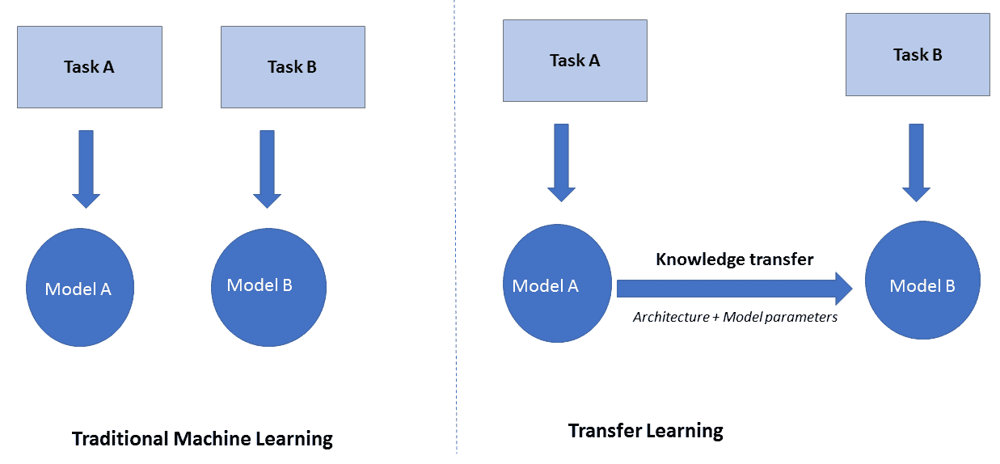

图 2.1：传统机器学习与迁移学习

吴安德（Andrew Ng）在其 2016 年 NIPS 教程中表示，迁移学习将成为机器学习商业成功的第二大推动力（在监督学习之后）； 这一说法日新月异。 迁移学习现已广泛用于需要使用人工神经网络解决的问题中。 因此，最大的问题是为什么会这样。

从头开始训练人工神经网络是一项艰巨的任务，主要是由于以下两个原因：

*   人工神经网络的成本面是非凸的； 因此，它需要一组良好的初始权重才能实现合理的收敛。
*   人工神经网络具有很多参数，因此，它们需要大量数据进行训练。 不幸的是，对于许多项目而言，可用于训练神经网络的特定数据不足，而该项目旨在解决的问题非常复杂，需要神经网络解决方案。

在这两种情况下，迁移学习都可以解决。 如果我们使用在大量标记数据上训练的预训练模型，例如 ImageNet 或 CIFAR，则涉及迁移学习的问题将具有很好的初始权重来开始训练; 然后可以根据现有数据对这些权重进行微调。 同样，为了避免在较少的数据量上训练复杂的模型，我们可能希望从预训练的神经网络中提取复杂的特征，然后使用这些特征来训练相对简单的模型，例如 SVM 或逻辑回归模型。 举个例子，如果我们正在研究图像分类问题，并且已经有一个预训练的模型（例如，基于 1,000 个 ImageNet 的`VGG16`网络），我们可以通过`VGG16`的权重迁移训练数据，并从最后一个池化层提取特征。 如果我们有`m`个训练数据点，则可以使用等式`(xi, yi), i = 1 -> m`，其中`x`是特征向量，`y`是输出类。 然后，我们可以从预训练的`VGG16`网络中得出复杂的特征，例如向量`h`，如下所示：

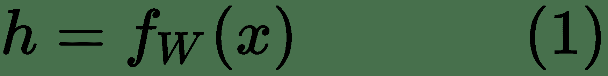

此处`W`是经过预训练的`VGG16`网络的权重集，直到最后一个池化层。

然后我们可以使用经过转换的训练数据点集`(hi, yi), i = 1 -> m`来构建相对简单的模型。

# 检测糖尿病性视网膜病变的迁移学习

在本章中，我们将使用迁移学习来构建一个模型，以检测人眼中的糖尿病性视网膜病变。 糖尿病性视网膜病通常在糖尿病患者中发现，其中高血糖水平导致视网膜血管的损害。 下图左侧为正常视网膜，右侧为糖尿病性视网膜病变：


图 2.2：正常人视网膜与患有糖尿病性视网膜病的视网膜

在医疗保健中，糖尿病性视网膜病变的检测通常是一个手动过程，需要受过训练的医师检查彩色眼底视网膜图像。 这导致诊断过程的延迟，通常导致延迟的治疗。 作为我们项目的一部分，我们将建立一个强大的人工智能系统，该系统可以拍摄视网膜的彩色眼底图像，并对糖尿病性视网膜病变的视网膜状况进行严重性分类。 我们将视网膜图像分类的不同条件如下：

*`0`：无糖尿病性视网膜病变
*`1`：轻度糖尿病性视网膜病变
*`2`：中度糖尿病性视网膜病变
*`3`：严重的糖尿病视网膜病变
*`4`：糖尿病性视网膜增生病

# 糖尿病视网膜病变数据集

用于构建糖尿病性视网膜病变检测应用的数据集可从 Kaggle 获得，[可从以下链接下载](https://www.kaggle.com/c/%20classroom-diabetic-retinopathy-detection-competition/data)。

训练和保留测试数据集都存在于`train_dataset.zip`文件中，该文件可在前面的链接中找到。

我们将使用标记的训练数据通过交叉验证来构建模型。 我们将在保持数据集上评估模型。

由于我们正在处理类别预测，因此准确性将是有用的验证指标。 精度定义如下：


此处，`c`是正确分类的样本数，`N`是评估样本的总数。

与 Kaggle 标准相比，我们还将使用**二次加权 kappa** 统计信息确定模型的质量，并确定模型的性能基准。 二次加权 kappa 定义如下：


二次加权 kappa 表达式中的权重`w[ij]`如下：


在上式中，以下内容适用：

*   `N`代表类别数
*   `O[ij]`表示已被预测为`i`类的图像数量，其中图像的预测类为`i`而实际类别为`j`
*   `E[ij]`表示预测类别为`i`的预期观测个数，预测类为`i`而实际类别为`j`，假设预测类和实际类是独立的

为了更好地了解 kappa 指标组件，让我们看一下苹果和橘子的二进制分类。 假设预测类和实际类的混淆矩阵如下图所示：

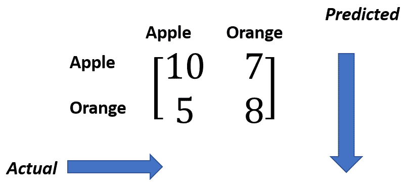

图 2.3：Kappa 指标术语

真实标签为*橙子*，假设标签之间具有独立性时，预测*苹果*的预期计数由以下公式给出：

 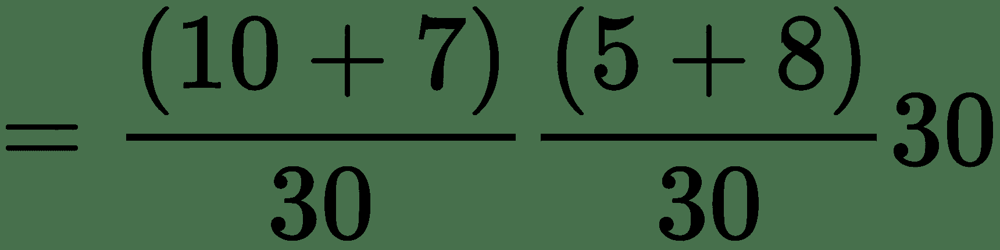 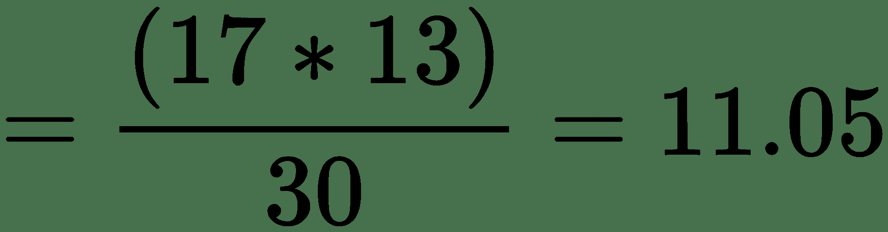

鉴于没有模型，此预期计数是您可能犯的最严重的错误。

如果您熟悉两个类别变量之间的独立性卡方检验，则假设类别变量之间具有独立性，则列联表中每个单元格中的预期计数都是基于相同的公式计算的。

可以从混淆矩阵中直接追踪模型的观测计数，该模型预测的真实标签为*橙子*时，预测的*苹果*等于`5`，如下所示：


因此，我们可以看到模型在预测*橙子*为*苹果*时所产生的误差小于我们不使用模型时所获得的误差。 与没有模型的预测相比，Kappa 通常衡量我们的表现如何。

如果我们观察二次权重的表达式`w[ij]`，我们可以看到，当实际标签与预测标签之间的差异较大时，权重的值会更大。 由于类的序数性质，这是有道理的。 例如，让我们用类别标签 0 表示完美状态的眼睛; 患有轻度糖尿病性视网膜病的患者; 中度糖尿病视网膜病变伴两个; 并伴有严重的糖尿病性视网膜病变。 当轻度糖尿病性视网膜病被错误地分类为严重糖尿病性视网膜病而不是中度糖尿病性视网膜病时，这个二次项权重`w[ij]`将会更高。 这是有道理的，因为即使我们没有设法预测实际类别，我们也希望预测一个尽可能接近实际状况的状况。

我们将使用`sklearn.metrics.cohen_kappa_score`和`weights= "quadratic"`来计算 kappa 得分。 权重越高，kappa 得分越低。

# 定义损失函数

该用例的数据分为五类，分别与无糖尿病性视网膜病变，轻度糖尿病性视网膜病变，中度糖尿病性视网膜病变，严重糖尿病性视网膜病变和增生性糖尿病性视网膜病变有关。 因此，我们可以将其视为分类问题。 对于我们的分类问题，需要对输出标签进行一次热编码，如下所示：

*   **无糖尿病性视网膜病变**：`[1 0 0 0 0]^T`
*   **轻度糖尿病性视网膜病变**：`[0 1 0 0 0]^T`
*   **中度糖尿病性视网膜病变**：`[0 0 1 0 0]^T`
*   **严重糖尿病性视网膜病变**：`[0 0 0 1 0]^T`
*   **增生糖尿病性视网膜病变**：`[0 0 0 0 1]^T`

Softmax 将是表示输出层中不同类别的概率的最佳激活函数，而每个数据点的分类交叉熵损失之和将是优化的最佳损失。 对于具有输出标签向量`y`和`p`的预测概率的单个数据点，交叉熵损失由以下公式给出：


这里是`y = [y1, ..., y5]^T`和`p = [p1, ..., p5]^T`。

同样，`M`训练数据点上的平均损耗可以表示为：

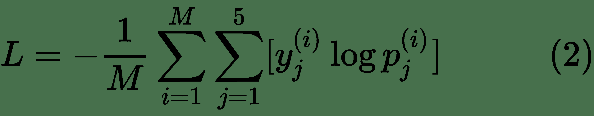

在训练过程中，小批量的梯度基于`(2)`给出的平均对数损失，其中`M`是所选的批量大小。 对于我们将结合验证准确性进行监视的验证日志损失，`M`是验证集数据点的数量。 由于我们将在每个折叠中进行 **K 折交叉验证**，因此在每个折叠中我们将具有不同的验证数据集。

现在我们已经定义了训练方法，损失函数和验证指标，让我们继续进行数据探索和建模。

请注意，输出类别中的分类具有序数性质，因为严重性随类别而增加。 因此，回归可能会派上用场。 我们还将尝试通过回归来代替分类，以了解运气如何。 回归的挑战之一是将原始分数转换为类。 我们将使用一个简单的方案，将分数散列到最接近的整数严重性类别。

# 考虑类别失衡

在分类方面，类别失衡是一个主要问题。 下图描述了五个严重性类别的类别密度：


图 2.4：五个严重性类别的类别密度

从上图可以看出，将近 73% 的训练数据属于 **0 类**，这代表没有糖尿病性视网膜病。 因此，如果我们碰巧将所有数据点标记为 **0 类**，那么我们将具有 73% 的准确率。 在患者健康状况下这是不希望的。 我们宁愿有一个测试说患者没有时有某种健康状况（假阳性），而有一项测试却漏诊时没有发现某种健康状况（假阴性）。 如果模型学会将所有点分类为属于 **0 类**，则 73% 的准确性可能毫无意义。

在严重性类别 0 上，检测较高的严重性类别比做好工作更为重要。 使用对数损失或交叉熵成本函数的分类模型的问题在于它偏爱多数类。 这是因为交叉熵误差是从最大似然原理中得出的，该似然原理倾向于将较高的概率分配给多数类别。 我们可以做两件事：

*   丢弃具有更多样本的类别中的数据，或者丢弃低频类别的上样本，以保持样本在各个类别之间的分布均匀。
*   在损失函数中，权重与类别的密度成反比。 这将确保当模型无法对低频类别进行分类时，对成本函数施加更高的惩罚。

我们将使用方案二，因为它不需要生成更多数据或丢弃现有数据。 如果我们将班级权重与班级频率的倒数成正比，则会得到以下班级权重：

| **严重类别** | **类权重** |
| --- | --- |
| `Class 0` | `0.0120353863` |
| `Class 1` | `0.1271350558` |
| `Class 2` | `0.0586961973` |
| `Class 3` | `0.3640234214` |
| `Class 4` | `0.4381974727` |

我们将在训练分类网络时使用这些权重。

# 预处理图像

不同类别的图像将存储在不同的文件夹中，因此可以轻松标记其类别。 我们将使用`Opencv`函数读取图像，并将其调整为不同的尺寸，例如`224 x 224 x3`。我们将基于 ImageNet 数据集从每个图像的通道方向上减去平均像素强度。 这意味着减法将使糖尿病性视网膜病变图像达到与在其上训练了预训练模型的处理过的 ImageNet 图像相同的强度范围。 提出每个图像后，它们将存储在`numpy`数组中。 图像预处理函数可以定义如下：

```py
def get_im_cv2(path,dim=224):
     img = cv2.imread(path)
     resized = cv2.resize(img, (dim,dim), cv2.INTER_LINEAR)
     return resized

 def pre_process(img):
     img[:,:,0] =     img[:,:,0] - 103.939
     img[:,:,1] =     img[:,:,0] - 116.779
     img[:,:,2] =     img[:,:,0] - 123.68
     return img

```

通过`opencv`函数`imread`读取图像，然后使用线性插值方法将其调整为`(224,224,3)`或任何给定尺寸。 ImageNet 图像的红色，绿色和蓝色通道中的平均像素强度分别为`103.939`，`116.779`和`123.68`； 从图像中减去这些平均值之后，对预训练模型进行训练。 均值减法的这种活动用于使数据居中。 将数据定为零附近有助于解决消失和爆炸的梯度问题，进而帮助模型收敛更快。 同样，对每个通道进行归一化有助于保持梯度均匀地流入每个通道。 由于我们将为此项目使用预训练的模型，因此在将图像馈入预训练的网络之前，有必要根据通道平均像素值校正图像。 但是，并非必须要根据预训练网络所基于的 ImageNet 的平均值来校正图像。 您可以通过该项目的训练语料库的平均像素强度很好地进行归一化。

同样，您可以选择对整个图像进行均值归一化，而不是对通道进行均值归一化。 这需要从自身中减去每个图像的平均值。 想象一下 CNN 识别的对象在不同的​​光照条件下（例如白天和晚上）曝光的场景。 无论光照条件如何，我们都希望对物体进行正确的分类，但是不同的像素强度将以不同方式激活神经网​​络的神经元，从而导致错误分类物体的可能性。 但是，如果我们从自身中减去每个图像的平均值，则对象将不再受到不同光照条件的影响。 因此，根据我们使用的图像的性质，我们可以为自己选择最佳的图像标准化方案。 但是，任何默认的标准化方法都倾向于提供合理的性能。

# 使用仿射变换生成其他数据

我们将在图像像素坐标上使用**仿射变换**，使用 keras `ImageDataGenerator`生成其他数据。 我们将主要使用的转换是旋转，平移和缩放。 如果像素空间坐标由`x = [x[1] x[2]]^T ∈ R^2`定义 ，则像素的新坐标可以通过以下方式给出：


这里， `M = R^(2x2)`是仿射变换矩阵， `b = [b[1], b[2]]^T ∈ R^2`是翻译向量。

术语`b[1]`指定沿一个空间方向的翻译，而`b[2]`提供沿另一空间维度的翻译。

这些转换是必需的，因为神经网络通常不是平移不变，旋转不变或尺度不变。 合并操作确实提供了一些平移不变性，但是通常这还不够。 神经网络不会将图像中特定位置的一个对象和另一图像中平移位置的相同对象视为同一事物。 这就是为什么我们需要在不同平移位置的图像的多个实例，以使神经网络更好地学习。 相同的解释适用于旋转和缩放。

# 旋转

以下是旋转的仿射变换矩阵，其中`θ`表示旋转角度：

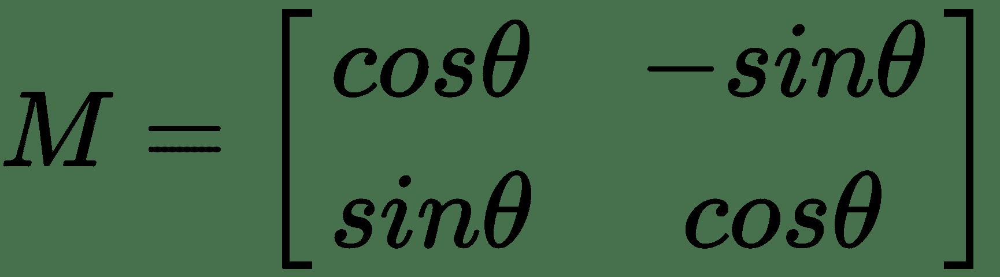

在这种情况下，转换向量`b`为零。 通过选择一个非零`b`，我们可以得到旋转和平移。

例如，下图显示了视网膜的照片，然后是旋转 90 度的同一张照片：


图 2.5：视网膜的旋转照片

# 平移

对于平移，仿射变换矩阵是单位矩阵，平移向量`b`具有非零值：

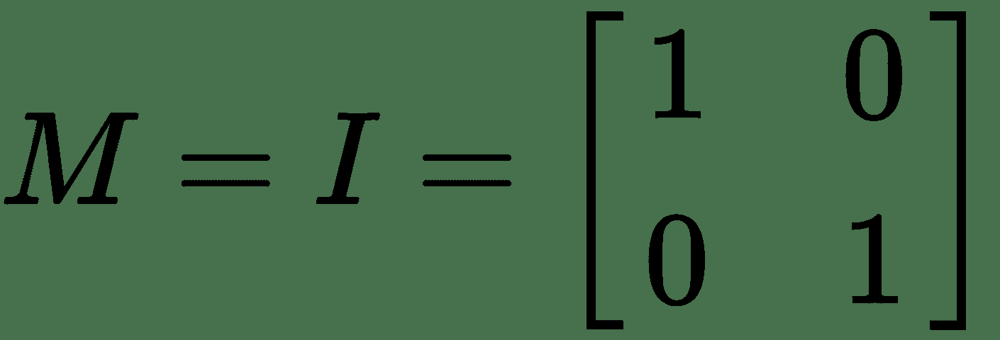

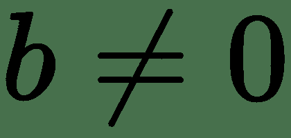

例如，对于垂直方向上五个像素位置和水平方向上三个像素位置的平移，我们可以使用`b = [5 3]^T`和`M`作为单位矩阵。

以下是沿图像的宽度和高度按 24 个像素位置对视网膜进行的图像平移：

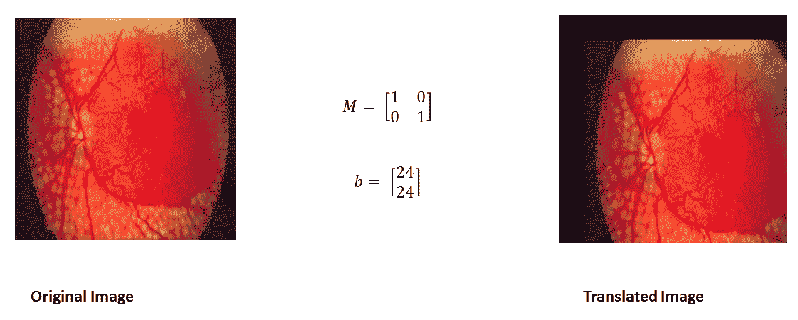

图 2.5：视网膜的图像平移

# 缩放比例

缩放可以通过对角矩阵`M ∈ R^(2x2)`执行，如下所示：


这里，`S[v]`表示沿垂直方向的比例因子，`S[h]`表示沿水平方向的比例因子（请参见 “图 2.6”为插图）。 我们还可以选择通过具有非零转换向量`b`来跟随转换的缩放：


图 2.6 视网膜的图像缩放

# 反射

可以通过变换矩阵`T ∈ R^(2x2)`获得关于一条线`L`与水平角度为`θ`的反射，如下所示：


下图显示了视网膜照片的水平翻转：


图 2.7：视网膜照片的水平翻转

# 通过仿射变换产生更多图像

`keras`图像生成器将使用以下类来完成我们的任务：

```py
datagen = ImageDataGenerator(
             horizontal_flip = True,
                             vertical_flip = True,
                             width_shift_range = 0.1,
                             height_shift_range = 0.1,
                             channel_shift_range=0,
                             zoom_range = 0.2,
                             rotation_range = 20)
```

从定义的生成器中可以看到，我们启用了水平和垂直翻转，这仅是图像沿水平和垂直轴的反射。 同样，我们将沿宽度和高度的图像平移定义为沿这些方向的像素位置的 10% 以内。 旋转范围限制为`20`度的角度，而比例因子定义为原始图像的`0.8`至`1.2`之内。

# 网络架构

现在，我们将对经过预训练的`ResNet50`，`InceptionV3`和`VGG16`网络进行实验，并找出哪种网络效果最好。 每个预训练模型的权重均基于 ImageNet。 我提供了 ResNet，`InceptionV3`和`VGG16`架构的原始论文的链接，以供参考。 建议读者仔细阅读这些文章，以深入了解这些架构及其之间的细微差别。

VGG 论文链接如下：

[《用于大型图像识别的超深度卷积网络》](https://arxiv.org/abs/1409.1556)

ResNet 论文链接如下：

[《用于图像识别的深度残差学习》](https://arxiv.org/abs/1512.03385)

InceptionV3 论文链接如下：

[《重新思考计算机视觉的起始架构》](https://arxiv.org/abs/1512.00567)

简而言之，`VGG16`是一个 16 层的 CNN，使用`3 x 3`滤波器和`2 x 2`接收场进行卷积。 整个网络使用的激活函数都是 ReLU。 由 Simonyan 和 Zisserman 开发的 VGG 架构是 2014 年 ILSVRC 竞赛的亚军。 `VGG16`网络由于其简单性而广受欢迎，它是从图像中提取特征的最受欢迎的网络。

`ResNet50`是一种深层的 CNN，它实现了残余块的概念，与`VGG16`网络的概念完全不同。 经过一系列的卷积激活池操作之后，该块的输入再次被反馈到输出。 ResNet 架构是由 Kaiming He 等人开发的，尽管具有 152 层，但它不如 VGG 网络复杂。 该架构通过实现 3.57% 的前五位错误率赢得了 2015 年 ILSVRC 竞赛，这比该竞赛数据集上的人类水平性能要好。 通过检查目标是否在概率最高的五类预测中来计算前五个错误率。 原则上，ResNet 网络尝试学习残差映射，而不是直接从输出映射到输入，如下面的残差框图所示：


图 2.8：ResNet 模型的残差块

**InceptionV3** 是 Google 提供的最新的 CNN。 InceptionV3 架构没有在每一层使用固定大小的卷积滤波器，而是使用不同大小的滤波器来提取不同粒度级别的特征。 下图说明了 InceptionV3 层的卷积块：


图 2.9：InceptionV3 卷积模块

Inception V1（GoogleNet）是 2014 年 ILSVRC 竞赛的获胜者。 它的最高 5% 错误率非常接近人类水平的性能，为 6.67%。

# VGG16 迁移学习网络

我们将从预训练的`VGG16`网络中的最后一个合并层中获取输出，并添加一对全连接层，每个层 512 个单元，然后是输出层。 最终池化层的输出是从全局平均池化操作传递到全连接层之前的。 我们只可以展平池化层的输出，而不是执行全局平均池化-其思想是确保池化的输出不是二维晶格格式，而是一维数组格式， 非常像一个全连接层。 下图说明了基于预训练的`VGG16`的新`VGG16`的架构：

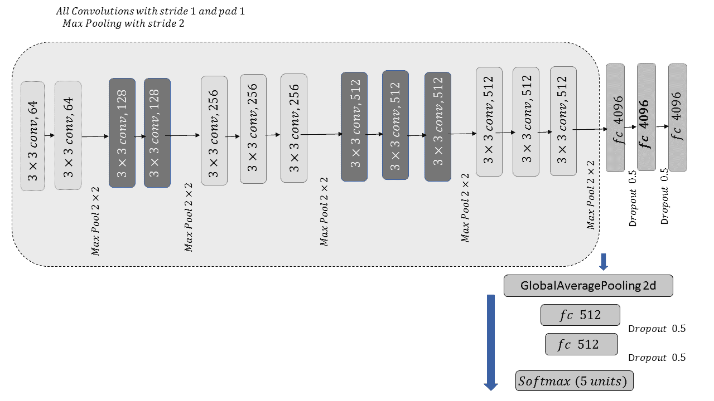

图 2.10：VGG16 迁移学习网络

如上图所示，我们将从预训练网络中的最后一个最大池化层提取输出，并在最终输出层之前附加两个全连接层。 基于先前的架构，可以使用`keras`如下代码块所示定义 VGG 定义函数：

```py
def VGG16_pseudo(dim=224,freeze_layers=10,full_freeze='N'):
   # model_save_dest = {}
    model = VGG16(weights='imagenet',include_top=False)
    x = model.output
    x = GlobalAveragePooling2D()(x)
    x = Dense(512, activation='relu')(x)
    x = Dropout(0.5)(x)
    x = Dense(512, activation='relu')(x)
    x = Dropout(0.5)(x)
    out = Dense(5,activation='softmax')(x)
    model_final = Model(input = model.input,outputs=out)
    if full_freeze != 'N':
        for layer in model.layers[0:freeze_layers]:
         layer.trainable = False
    return model_final
```

我们将使用 ImageNet 上训练的`VGG16`的权重作为模型的初始权重，然后对模型进行微调。 我们还冻结了前几层的权重（默认设置为`10`），因为在 CNN 中，前几层学会了检测通用特征，例如边缘，颜色成分等。 因此，特征在各个域之间不会有太大变化。 冻结层是指不训练该层特定的权重。 我们可以尝试冻结的层数，并选择提供最佳验证分数的层。 由于我们正在执行多类分类，因此已为输出层选择了 softmax 激活函数。

# InceptionV3 迁移学习网络

在以下代码块中定义了用于我们任务的`InceptionV3`网络。 需要注意的一件事是，由于`InceptionV3`是一个更深的网络，因此我们可以拥有更多的初始层。 在数据可用性方面，不训练每个模型中的所有层的想法还有另一个优势。 如果我们使用较少的数据训练，则整个网络的权重可能会导致过拟合。 冻结层会减少要训练的权重数，因此提供了一种形式的规则化。

由于初始层学习通用特征，而与问题的范围无关，因此它们是冻结的最佳层。 我们还在全连接层中使用了丢弃，以防止过拟合：

```py
def inception_pseudo(dim=224,freeze_layers=30,full_freeze='N'):
    model = InceptionV3(weights='imagenet',include_top=False)
    x = model.output
    x = GlobalAveragePooling2D()(x)
    x = Dense(512, activation='relu')(x)
    x = Dropout(0.5)(x)
    x = Dense(512, activation='relu')(x)
    x = Dropout(0.5)(x)
    out = Dense(5,activation='softmax')(x)
    model_final = Model(input = model.input,outputs=out)
    if full_freeze != 'N':
        for layer in model.layers[0:freeze_layers]:
         layer.trainable = False
    return model_final
```

# ResNet50 迁移学习网络

可以类似于`VGG16`和`InceptionV3`网络定义用于迁移学习的`ResNet50`模型，如下所示：

```py
def resnet_pseudo(dim=224,freeze_layers=10,full_freeze='N'):
   # model_save_dest = {}
    model = ResNet50(weights='imagenet',include_top=False)
    x = model.output
    x = GlobalAveragePooling2D()(x)
    x = Dense(512, activation='relu')(x)
    x = Dropout(0.5)(x)
    x = Dense(512, activation='relu')(x)
    x = Dropout(0.5)(x)
    out = Dense(5,activation='softmax')(x)
    model_final = Model(input = model.input,outputs=out)
    if full_freeze != 'N':
        for layer in model.layers[0:freeze_layers]:
       layer.trainable = False
    return model_final

```

# 优化器和初始学习率

**Adam** 优化器（**自适应矩估计器**）用于实现随机梯度下降高级版本的训练。 Adam 优化器会考虑成本函数中的曲率，同时使用动量来确保朝着良好的局部最小值稳定发展。 对于眼前的问题，由于我们正在使用迁移学习，并且希望使用从预训练的网络中获得的尽可能多的先前学习的特征，因此我们将使用较小的初始学习率`0.00001`。 这将确保网络不会丢失经过预训练的网络学习到的有用特征，并根据当前问题的新数据将其微调至较不激进的最佳点。 Adam 优化器可以定义如下：

```py
adam = optimizers.Adam(lr=0.00001, beta_1=0.9, beta_2=0.999, epsilon=1e-08, decay=0.0)
```

`beta_1`参数控制动量计算中当前梯度的贡献，而`beta_2`参数控制梯度归一化中梯度平方的贡献，这有助于解决成本函数中的曲率。

# 交叉验证

由于训练数据集很小，我们将执行五重交叉验证，以更好地了解模型对新数据进行泛化的能力。 我们还将在训练中使用交叉验证不同折中的所有五个模型进行推断。 属于类别标签的测试数据点的概率将是所有五个模型的平均概率预测，其表示如下：

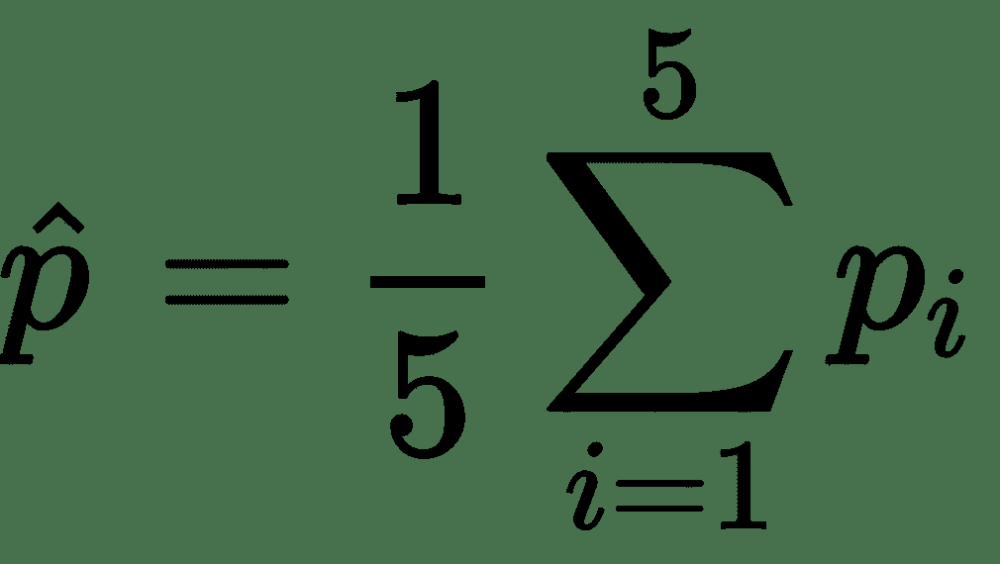

由于目的是预测实际类别而不是概率，因此我们将选择具有最大概率的类别。 当我们使用基于分类的网络和成本函数时，此方法有效。 如果我们将问题视为回归问题，则该过程会有一些更改，我们将在后面讨论。

# 根据验证日志损失对检查点进行建模

它始终是一个很好的做法，以保存模型时所选择的评估验证分数提高。 对于我们的项目，我们将跟踪验证日志损失，并随着验证得分在不同时期的提高而保存模型。 这样，在训练之后，我们将保存提供最佳验证分数的模型权重，而不是保存我们停止训练后的最终模型权重。 训练将继续进行，直到达到为训练定义的最大周期数，或者直到连续`10`个周期的验证日志损失都没有减少为止。 当`3`时期的验证日志损失没有改善时，我们还将降低学习率。 以下代码块可用于执行学习率降低和检查点操作：

```py
reduce_lr = keras.callbacks.ReduceLROnPlateau(monitor='val_loss', factor=0.50,
 patience=3, min_lr=0.000001)

 callbacks = [
 EarlyStopping(monitor='val_loss', patience=10, mode='min', verbose=1),
 CSVLogger('keras-5fold-run-01-v1-epochs_ib.log', separator=',', append=False),reduce_lr,
 ModelCheckpoint(
 'kera1-5fold-run-01-v1-fold-' + str('%02d' % (k + 1)) + '-run-' + str('%02d' % (1 + 1)) + '.check',
 monitor='val_loss', mode='min', # mode must be set to max or keras will be confused
 save_best_only=True,
 verbose=1)
 ]
```

如您在前面的代码块中所见，如果在`3`（`patience=3`）时期中验证损失没有改善，则学习率降低到一半（`0.50`）。 同样，如果在`10`（`patience = 10`）时代没有减少验证损失，我们将停止训练（通过执行`EarlyStopping`）。 每当验证日志损失减少时，都会保存模型，如以下代码片段所示：

```py
'kera1-5fold-run-01-v1-fold-' + str('%02d' % (k + 1)) + '-run-' + str('%02d' % (1 + 1)) + '.check'
```

在`keras-5fold-run-01-v1-epochs_ib.log` 日志文件中跟踪训练过程的每个时期的验证日志损失，如果验证日志损失有所改善，为了保存模型，请参考该文件， 或决定何时降低学习率或停止训练。

通过使用`keras save`函数在用户定义的路径中保存每个折叠中的模型，而在推理过程中，使用`keras.load_model`函数将模型加载到内存中。

# Python 实现训练过程

以下 Python 代码块显示了训练过程的端到端实现。 它由前面各节中讨论的所有函数块组成。 让我们首先调用所需的所有 Python 程序包，如下所示：

```py
import numpy as np
np.random.seed(1000)

import os
import glob
import cv2
import datetime
import pandas as pd
import time
import warnings
warnings.filterwarnings("ignore")
from sklearn.model_selection import KFold
from sklearn.metrics import cohen_kappa_score
from keras.models import Sequential,Model
from keras.layers.core import Dense, Dropout, Flatten
from keras.layers.convolutional import Convolution2D, MaxPooling2D, ZeroPadding2D
from keras.layers import GlobalMaxPooling2D,GlobalAveragePooling2D
from keras.optimizers import SGD
from keras.callbacks import EarlyStopping
from keras.utils import np_utils
from sklearn.metrics import log_loss
import keras
from keras import __version__ as keras_version
from keras.applications.inception_v3 import InceptionV3
from keras.applications.resnet50 import ResNet50
from keras.applications.vgg16 import VGG16
from keras.preprocessing.image import ImageDataGenerator
from keras import optimizers 
from keras.callbacks import EarlyStopping, ModelCheckpoint, CSVLogger, Callback
from keras.applications.resnet50 import preprocess_input
import h5py
import argparse
from sklearn.externals import joblib
import json

```

导入所需的库后，我们可以定义`TransferLearning`类：

```py
class TransferLearning:
  def __init__(self):
    parser = argparse.ArgumentParser(description='Process the inputs')
    parser.add_argument('--path',help='image directory')
    parser.add_argument('--class_folders',help='class images folder  
                        names')
    parser.add_argument('--dim',type=int,help='Image dimensions to 
                        process')
    parser.add_argument('--lr',type=float,help='learning 
                        rate',default=1e-4)
    parser.add_argument('--batch_size',type=int,help='batch size')
    parser.add_argument('--epochs',type=int,help='no of epochs to 
                        train')
    parser.add_argument('--initial_layers_to_freeze',type=int,help='the 
                        initial layers to freeze')
    parser.add_argument('--model',help='Standard Model to 
                        load',default='InceptionV3')
    parser.add_argument('--folds',type=int,help='num of cross 
                        validation folds',default=5)
    parser.add_argument('--outdir',help='output directory')

    args = parser.parse_args()
    self.path = args.path
    self.class_folders = json.loads(args.class_folders)
    self.dim = int(args.dim)
    self.lr = float(args.lr)
    self.batch_size = int(args.batch_size)
    self.epochs = int(args.epochs)
    self.initial_layers_to_freeze = int(args.initial_layers_to_freeze)
    self.model = args.model
    self.folds = int(args.folds)
    self.outdir = args.outdir
```

接下来，让我们定义一个函数，该函数可以读取图像并将它们调整为合适的尺寸，如下所示：

```py
  def get_im_cv2(self,path,dim=224):
    img = cv2.imread(path)
    resized = cv2.resize(img, (dim,dim), cv2.INTER_LINEAR)
    return resized

  # Pre Process the Images based on the ImageNet pre-trained model   
    Image transformation
  def pre_process(self,img):
    img[:,:,0] = img[:,:,0] - 103.939
    img[:,:,1] = img[:,:,0] - 116.779
    img[:,:,2] = img[:,:,0] - 123.68
    return img

  # Function to build X, y in numpy format based on the   
    train/validation datasets
  def read_data(self,class_folders,path,num_class,dim,train_val='train'):
    print(train_val)
    train_X,train_y = [],[] 
    for c in class_folders:
      path_class = path + str(train_val) + '/' + str(c)
      file_list = os.listdir(path_class) 
      for f in file_list:
        img = self.get_im_cv2(path_class + '/' + f)
        img = self.pre_process(img)
        train_X.append(img)
        train_y.append(int(c.split('class')[1]))
    train_y = keras.utils.np_utils.to_categorical(np.array(train_y),num_class) 
    return np.array(train_X),train_y
```

接下来，我们现在将定义三个用于迁移学习的模型，从`InceptionV3`开始：

```py
def inception_pseudo(self,dim=224,freeze_layers=30,full_freeze='N'):
    model = InceptionV3(weights='imagenet',include_top=False)
    x = model.output
    x = GlobalAveragePooling2D()(x)
    x = Dense(512, activation='relu')(x)
    x = Dropout(0.5)(x)
    x = Dense(512, activation='relu')(x)
    x = Dropout(0.5)(x)
    out = Dense(5,activation='softmax')(x)
    model_final = Model(input = model.input,outputs=out)
    if full_freeze != 'N':
      for layer in model.layers[0:freeze_layers]:
        layer.trainable = False
    return model_final
```

然后，我们将定义用于迁移学习的`ResNet50`模型：

```py
  def resnet_pseudo(self,dim=224,freeze_layers=10,full_freeze='N'):
    model = ResNet50(weights='imagenet',include_top=False)
    x = model.output
    x = GlobalAveragePooling2D()(x)
    x = Dense(512, activation='relu')(x)
    x = Dropout(0.5)(x)
    x = Dense(512, activation='relu')(x)
    x = Dropout(0.5)(x)
    out = Dense(5,activation='softmax')(x)
    model_final = Model(input = model.input,outputs=out)
    if full_freeze != 'N':
      for layer in model.layers[0:freeze_layers]:
        layer.trainable = False
    return model_final

```

最后，我们将定义`VGG16`模型：

```py
  def VGG16_pseudo(self,dim=224,freeze_layers=10,full_freeze='N'):
    model = VGG16(weights='imagenet',include_top=False)
    x = model.output
    x = GlobalAveragePooling2D()(x)
    x = Dense(512, activation='relu')(x)
    x = Dropout(0.5)(x)
    x = Dense(512, activation='relu')(x)
    x = Dropout(0.5)(x)
    out = Dense(5,activation='softmax')(x)
    model_final = Model(input = model.input,outputs=out)
    if full_freeze != 'N':
      for layer in model.layers[0:freeze_layers]:
        layer.trainable = False
    return model_final
```

现在，让我们定义训练函数，如下所示：

```py
def train_model(self,train_X,train_y,n_fold=5,batch_size=16,epochs=40,
dim=224,lr=1e-5,model='ResNet50'):
    model_save_dest = {}
    k = 0
    kf = KFold(n_splits=n_fold, random_state=0, shuffle=True)

    for train_index, test_index in kf.split(train_X):
      k += 1 
      X_train,X_test = train_X[train_index],train_X[test_index]
      y_train, y_test = train_y[train_index],train_y[test_index]

      if model == 'Resnet50':
        model_final =     
        self.resnet_pseudo(dim=224,freeze_layers=10,full_freeze='N')

      if model == 'VGG16':
        model_final = 
        self.VGG16_pseudo(dim=224,freeze_layers=10,full_freeze='N') 

      if model == 'InceptionV3':
        model_final = self.inception_pseudo(dim=224,freeze_layers=10,full_freeze='N')

      datagen = ImageDataGenerator(
          horizontal_flip = True,
          vertical_flip = True,
          width_shift_range = 0.1,
          height_shift_range = 0.1,
          channel_shift_range=0,
          zoom_range = 0.2,
          rotation_range = 20)

      adam = optimizers.Adam(lr=lr, beta_1=0.9, beta_2=0.999, 
        epsilon=1e-08, decay=0.0)
      model_final.compile(optimizer=adam, 
       loss= ["categorical_crossentropy"],metrics=['accuracy'])
      reduce_lr = keras.callbacks.ReduceLROnPlateau(monitor='val_loss',   
        factor=0.50, patience=3, min_lr=0.000001)

      callbacks = [
            EarlyStopping(monitor='val_loss', patience=10, mode='min',   
             verbose=1),
        CSVLogger('keras-5fold-run-01-v1-epochs_ib.log', 
        separator=',', append=False),reduce_lr,
            ModelCheckpoint(
                'kera1-5fold-run-01-v1-fold-' + str('%02d' % (k + 1)) + 
                '-run-' + str('%02d' % (1 + 1)) + '.check',
                monitor='val_loss', mode='min',
                save_best_only=True,
                verbose=1)
          ]

      model_final.fit_generator(datagen.flow(X_train,y_train, 
                                 batch_size=batch_size),
      steps_per_epoch=X_train.shape[0]/batch_size, epochs=epochs,
         verbose=1, validation_data= (X_test,y_test),
         callbacks=callbacks, class_weight=     
         {0:0.012,1:0.12,2:0.058,3:0.36,4:0.43})

      model_name = 'kera1-5fold-run-01-v1-fold-' + str('%02d' % (k + 
                    1)) + '-run-' + str('%02d' % (1 + 1)) + '.check'
      del model_final
      f = h5py.File(model_name, 'r+')
      del f['optimizer_weights']
      f.close()
      model_final = keras.models.load_model(model_name)
      model_name1 = self.outdir + str(model) + '___' + str(k) 
      model_final.save(model_name1)
      model_save_dest[k] = model_name1

    return model_save_dest
```

我们还将为保持数据集定义一个`inference`函数，如下所示：

```py
  def inference_validation(self,test_X,test_y,model_save_dest,
    n_class=5,folds=5):
    pred = np.zeros((len(test_X),n_class))

    for k in range(1,folds + 1):
      model = keras.models.load_model(model_save_dest[k])
      pred = pred + model.predict(test_X)
    pred = pred/(1.0*folds) 
    pred_class = np.argmax(pred,axis=1) 
    act_class = np.argmax(test_y,axis=1)
    accuracy = np.sum([pred_class == act_class])*1.0/len(test_X)
    kappa = cohen_kappa_score(pred_class,act_class,weights='quadratic')
    return pred_class,accuracy,kappa 
```

现在，让我们调用`main`函数，以触发训练过程，如下所示：

```py
def main(self):
    start_time = time.time()
    self.num_class = len(self.class_folders)
  if self.mode == 'train':
        print("Data Processing..")
        file_list,labels= 
        self.read_data(self.class_folders,self.path,self.num_class,
                       self.dim,train_val='train')
        print(len(file_list),len(labels))
        print(labels[0],labels[-1])
        self.model_save_dest = 
        self.train_model(file_list,labels,n_fold=self.folds,
                         batch_size=self.batch_size,
                         epochs=self.epochs,dim=self.dim,
                         lr=self.lr,model=self.model)
        joblib.dump(self.model_save_dest,f'{self.outdir}/model_dict.pkl')
        print("Model saved to dest:",self.model_save_dest)
  else:
        model_save_dest = joblib.load(self.model_save_dest)
        print('Models loaded from:',model_save_dest)
            # Do inference/validation
        test_files,test_y = 
        self.read_data(self.class_folders,self.path,self.num_class,
                       self.dim,train_val='validation')
      test_X = []
      for f in test_files:
        img = self.get_im_cv2(f)
        img = self.pre_process(img)
        test_X.append(img)
      test_X = np.array(test_X)
      test_y = np.array(test_y)
      print(test_X.shape)
      print(len(test_y))
      pred_class,accuracy,kappa =     
      self.inference_validation(test_X,test_y,model_save_dest,
                                n_class=self.num_class,folds=self.folds)
      results_df = pd.DataFrame()
      results_df['file_name'] = test_files
      results_df['target'] = test_y
      results_df['prediction'] = pred_class
      results_df.to_csv(f'{self.outdir}/val_resuts_reg.csv',index=False)

      print("-----------------------------------------------------")
      print("Kappa score:", kappa)
      print("accuracy:", accuracy) 
      print("End of training")
      print("-----------------------------------------------------")
      print("Processing Time",time.time() - start_time,' secs')
```

我们可以更改几个参数，例如学习率，批量大小，图像大小等，并且我们可以进行实验以得出一个不错的模型。 在训练阶段，模型位置保存在`model_save_dest`字典中，该字典被写入`dict_model`文件中。

在推理阶段，该模型仅基于训练后的模型对新的测试数据进行预测。

可以如下调用名为`TransferLearning.py`的用于迁移学习的脚本：

```py
python TransferLearning.py --path '/media/santanu/9eb9b6dc-b380-486e-b4fd-c424a325b976/book AI/Diabetic Retinopathy/Extra/assignment2_train_dataset/' --class_folders '["class0","class1","class2","class3","class4"]' --dim 224 --lr 1e-4 --batch_size 16 --epochs 20 --initial_layers_to_freeze 10 --model InceptionV3 --folds 5 --outdir '/home/santanu/ML_DS_Catalog-/Transfer_Learning_DR/'
```

脚本的输出日志如下：

```py
Model saved to dest: {1: '/home/santanu/ML_DS_Catalog-/Transfer_Learning_DR/categorical/InceptionV3___1', 2: '/home/santanu/ML_DS_Catalog-/Transfer_Learning_DR/categorical/InceptionV3___2', 3: '/home/santanu/ML_DS_Catalog-/Transfer_Learning_DR/categorical/InceptionV3___3', 4: '/home/santanu/ML_DS_Catalog-/Transfer_Learning_DR/categorical/InceptionV3___4', 5: '/home/santanu/ML_DS_Catalog-/Transfer_Learning_DR/categorical/InceptionV3___5'}
validation
-----------------------------------------------------
Kappa score: 0.42969781637876836
accuracy: 0.5553973227000855
End of training
-----------------------------------------------------
Processing Time 26009.3344039917 secs
```

从日志中的结果可以看出，我们达到了不错的交叉验证精度，约为`56%`，二次 Kappa 约为`0.43`。

在此脚本中，我们将所有数据加载到内存中，然后将增强图像从`ImageDataGenerator`馈送到模型进行训练。 如果训练图像集很少和/或尺寸适中，那么将数据加载到内存中可能不会引起太大关注。 但是，如果图像语料库很大和/或我们资源有限，那么将所有数据加载到内存中将不是可行的选择。 由于运行这些实验的计算机具有 64 GB RAM，因此我们能够毫无问题地训练这些模型。 即使是 16 GB 的 RAM 计算机也可能不足以通过将所有数据加载到内存中来运行这些实验，并且您可能会遇到内存错误。

**问题是，我们是否需要一次将所有数据加载到内存中？**

由于神经网络适用于小型批量，因此我们只需要与一个小型批量对应的数据即可一次通过反向传播训练模型。 类似地，对于下一个反向传播，我们可以丢弃与当前批量相对应的数据，然后处理下一个批量。 因此，以某种方式，每个小型批量中的内存需求仅是与该批量相对应的数据。 因此，我们可以在训练时创建动态批量，从而避免在内存较少的机器上训练深度学习模型。 Keras 具有在训练时创建动态批量的良好功能，我们将在下一节中讨论。

# 训练期间动态创建小批量

仅加载与小批量对应的数据的一种方法是通过从其位置随机处理图像来动态创建小批量。 小批量处理的图像数量将等于我们指定的小批量大小。 当然，由于在训练期间会动态创建小批量生产，因此在训练过程中会遇到一些瓶颈，但是这一瓶颈可以忽略不计。 特殊的软件包，例如`keras`，具有有效的动态批量创建机制。 我们将在训练过程中利用 keras 中的`flow_from_directory`函数动态创建迷你批，以减少训练过程的内存需求。 我们仍将继续使用`ImageDataGenerator`进行图像增强。 可以如下定义火车生成器和验证生成器。

通过将`pre_process`函数作为输入输入到`ImageDataGenerator`的`preprocessing_function`中，完成从三个通道中减去平均图像像素强度的图像预处理步骤：

```py
        def pre_process(img):
            img[:,:,0] = img[:,:,0] - 103.939
            img[:,:,1] = img[:,:,0] - 116.779
            img[:,:,2] = img[:,:,0] - 123.68
            return img

        train_file_names = glob.glob(f'{train_dir}/*/*')
        val_file_names = glob.glob(f'{val_dir}/*/*')
        train_steps_per_epoch = len(train_file_names)/float(batch_size)
        val_steps_per_epoch = len(val_file_names)/float(batch_size)
        train_datagen = 
        ImageDataGenerator(horizontal_flip =
                           True,vertical_flip =
                           True,width_shift_range =
                           0.1,height_shift_range = 0.1,
                           channel_shift_range=0,zoom_range = 0.2,
                           rotation_range = 20,
                           preprocessing_function=pre_process)
        val_datagen =
        ImageDataGenerator(preprocessing_function=pre_process)
        train_generator =
        train_datagen.flow_from_directory(train_dir,
                                          target_size=(dim,dim),
                                          batch_size=batch_size,
                                          class_mode='categorical')
        val_generator =
        val_datagen.flow_from_directory(val_dir,
                                        target_size=(dim,dim),
                                         batch_size=batch_size,
                                         class_mode='categorical')
        print(train_generator.class_indices)
        joblib.dump(train_generator.class_indices,
        f'{self.outdir}/class_indices.pkl')

```

`flow_from_directory`函数将一个图像目录作为输入，并期望一个与该图像目录中的类有关的文件夹。 然后，它从文件夹名称推断类标签。 如果图像目录的图像目录具有以下结构，则将类别推断为`0`，`1`，`2`，`3`，`4`，与类别文件夹`'class0'`，`'class1'`有关 ，`'class2'`，`'class3'`和`'class4'`。

`flow_from_directory`函数的其他重要输入是`batch_size`，`target_size`和`class_mode`。 `target_size`用于指定要馈送到神经网络的图像的尺寸，而`class_mode`用于指定问题的性质。 对于二进制分类，将`class_mode`设置为二进制，而对于多分类，将其设置为`categorical`。

接下来，我们将通过创建动态批量来训练同一模型，而不是一次将所有数据加载到内存中。 我们只需要使用`flow_from_directory`选项创建一个生成器，然后将其绑定到数据扩充对象即可。 数据生成器对象可以如下生成：

```py
# Pre processing for channel wise mean pixel subtraction 
def pre_process(img):
    img[:,:,0] = img[:,:,0] - 103.939
    img[:,:,1] = img[:,:,0] - 116.779
    img[:,:,2] = img[:,:,0] - 123.68
    return img

# Add the pre_process function at the end of the ImageDataGenerator, 
#rest all of the data augmentation options
# remain the same. 

train_datagen = 
ImageDataGenerator(horizontal_flip = True,vertical_flip = True,
                   width_shift_range = 0.1,height_shift_range = 0.1,
                   channel_shift_range=0,zoom_range =                     
                   0.2,rotation_range = 20,
                   preprocessing_function=pre_process)

 # For validation no data augmentation on image mean subtraction preprocessing
val_datagen = ImageDataGenerator(preprocessing_function=pre_process)

# We build the train generator using flow_from_directory
train_generator = train_datagen.flow_from_directory(train_dir,
        target_size=(dim,dim),
        batch_size=batch_size,
        class_mode='categorical')

# We build the validation generator using flow_from_directory
val_generator = val_datagen.flow_from_directory(val_dir,
        target_size=(dim,dim),
        batch_size=batch_size,
        class_mode='categorical')
```

在前面的代码中，我们将`ImageDataGenerator`传递给执行均值像素减法的附加任务，因为我们没有控制将图像数据加载到内存中并通过`pre_process`函数传递的任何控制权。 在`preprocessing_function`选项中，我们可以为任何特定的预处理任务传递任何所需的自定义函数。

通过`train_dir`和`val_dir`，我们将训练和验证目录传递给使用`flow_with_directory`选项创建的训练和验证生成器。 生成器通过查看传递的训练数据目录（此处为`train_dir`）中的班级文件夹数来识别班级数。 在基于`batch_size`的训练时间内，图像根据指定的`batch_size`读入内存

`class_mode`帮助生成器识别其二进制分类还是多分类（`'categotical'`）。

详细的实现在 GitHub 上的[`TransferLearning_ffd.py`文件夹](https://github.com/PacktPublishing/Python-Artificial-Intelligence-Projects/tree/master/Chapter02)中列出。

Python 脚本`TransferLearning_ffd.py`可以按以下方式调用：

```py
python TransferLearning_ffd.py  --path '/media/santanu/9eb9b6dc-b380-486e-b4fd-c424a325b976/book AI/Diabetic Retinopathy/Extra/assignment2_train_dataset/' --class_folders '["class0","class1","class2","class3","class4"]' --dim 224  --lr 1e-4 --batch_size 32 --epochs 50 --initial_layers_to_freeze 10 --model InceptionV3  --outdir '/home/santanu/ML_DS_Catalog-/Transfer_Learning_DR/' 

```

作业运行的输出日志结尾如下：

```py
Validation results saved at : /home/santanu/ML_DS_Catalog-/Transfer_Learning_DR/val_results.csv
[0 0 0 ... 4 2 2]
[0 0 0 ... 4 4 4]
Validation Accuracy: 0.5183708345200797
Validation Quadratic Kappa Score: 0.44422008110380984

```

如我们所见，通过重用现有网络并在同一网络上执行迁移学习，我们能够实现不错的`0.44`二次方 Kappa。

# 分类结果

通过使用所有三个神经网络架构`VGG16`，`ResNet50`和`InceptionV3`进行分类。 对于该糖尿病性视网膜病用例，使用迁移学习网络的`InceptionV3`版本可获得最佳结果。 如果是分类分类，我们只是将具有最大预测分类概率的分类转换为预测严重性标签。 但是，由于问题中的类别具有序数意义，因此我们可以利用 softmax 概率的方法之一是针对 softmax 概率对类别严重性进行期望并得出预期分数`y_hat`如下 ：

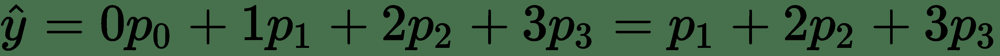

我们可以对分数进行排序，并确定三个阈值来确定图像属于哪个类别。 这些阈值可以通过将这些预期得分作为特征训练辅助模型来选择。 建议读者按照这些思路进行试验，看看是否有任何好处。

作为该项目的一部分，我们正在使用迁移学习来解决一个难题。 通过在给定的数据集上从头开始训练网络，模型性能可能会更好。

# 测试时推断

以下代码可用于对未标记的测试数据进行推断：

```py
import keras
import numpy as np
import pandas as pd
import cv2
import os
import time
from sklearn.externals import joblib
import argparse

# Read the Image and resize to the suitable dimension size
def get_im_cv2(path,dim=224):
    img = cv2.imread(path)
    resized = cv2.resize(img, (dim,dim), cv2.INTER_LINEAR)
    return resized

# Pre Process the Images based on the ImageNet pre-trained model Image transformation
def pre_process(img):
    img[:,:,0] = img[:,:,0] - 103.939
    img[:,:,1] = img[:,:,0] - 116.779
    img[:,:,2] = img[:,:,0] - 123.68
    return img

# Function to build test input data
def read_data_test(path,dim):
    test_X = [] 
    test_files = []
    file_list = os.listdir(path) 
    for f in file_list:
        img = get_im_cv2(path + '/' + f)
        img = pre_process(img)
        test_X.append(img)
        f_name = f.split('_')[0]
        test_files.append(f_name)
    return np.array(test_X),test_files
```

让我们定义推理：

```py
def inference_test(test_X,model_save_dest,n_class):
    folds = len(list(model_save_dest.keys()))
    pred = np.zeros((len(test_X),n_class))
    for k in range(1,folds + 1):
        model = keras.models.load_model(model_save_dest[k])
        pred = pred + model.predict(test_X)
    pred = pred/(1.0*folds) 
    pred_class = np.argmax(pred,axis=1) 
    return pred_class 

def main(path,dim,model_save_dest,outdir,n_class):
    test_X,test_files = read_data_test(path,dim)
    pred_class = inference_test(test_X,model_save_dest,n_class)
    out = pd.DataFrame()
    out['id'] = test_files
    out['class'] = pred_class
    out['class'] = out['class'].apply(lambda x:'class' + str(x))
    out.to_csv(outdir + "results.csv",index=False)

if __name__ == '__main__':
    parser = argparse.ArgumentParser(description='arguments')
    parser.add_argument('--path',help='path of images to run inference on')
    parser.add_argument('--dim',type=int,help='Image dimension size to          
                        process',default=224)
    parser.add_argument('--model_save_dest',
                        help='location of the trained models')
    parser.add_argument('--n_class',type=int,help='No of classes')
    parser.add_argument('--outdir',help='Output DIrectory')
    args = parser.parse_args()
    path = args.path
    dim = args.dim
    model_save_dest = joblib.load(args.model_save_dest)
    n_class = args.n_class
    outdir = args.outdir
    main(path,dim,model_save_dest,outdir,n_class)

```

# 执行回归而不是分类

我们在“损失函数公式”部分中讨论的一件事是，类别标签不是独立的分类类别，但随着糖尿病性视网膜病变情况的严重性增加，它们确实具有序数意义。 因此，值得通过定义的迁移学习网络进行回归，而不是进行分类，并观察结果如何。 我们唯一需要更改的是输出单位，从 softmax 到线性单元。 实际上，我们将其更改为 ReLU，因为我们希望避免出现负分数。 以下代码块显示了回归网络的`InceptionV3`版本：

```py
def inception_pseudo(dim=224,freeze_layers=30,full_freeze='N'):
    model = InceptionV3(weights='imagenet',include_top=False)
    x = model.output
    x = GlobalAveragePooling2D()(x)
    x = Dense(512, activation='relu')(x)
    x = Dropout(0.5)(x)
    x = Dense(512, activation='relu')(x)
    x = Dropout(0.5)(x)
    out = Dense(1,activation='relu')(x)
    model_final = Model(input = model.input,outputs=out)
    if full_freeze != 'N':
        for layer in model.layers[0:freeze_layers]:
         layer.trainable = False
    return model_final
```

与其像分类网络中那样使分类交叉熵（对数损失）最小化，不如使回归网络的均方误差最小。 对于回归问题最小化的成本函数如下，其中`y_hat`是预测的标签：


一旦我们预测了回归分数，就将其舍入到最接近的严重性类别（零到四）。

# 使用 keras `utils.sequence`作为生成器

Keras 具有一个名为`keras.utils.sequence()`的优秀批量生成器，可帮助您以极大的灵活性自定义批量创建。 实际上，使用`keras.utils.sequence()`可以设计整个周期流水线。 我们将在此回归问题中使用此工具以习惯该工具。 对于迁移学习问题，我们可以使用`keras.utils.sequence()`设计生成器类，如下所示：

```py
class DataGenerator(keras.utils.Sequence):
    'Generates data for Keras'
    def __init__(self,files,labels,batch_size=32,n_classes=5,dim=(224,224,3),shuffle=True):
        'Initialization'
        self.labels = labels
        self.files = files
        self.batch_size = batch_size
        self.n_classes = n_classes
        self.dim = dim
        self.shuffle = shuffle
        self.on_epoch_end()

    def __len__(self):
        'Denotes the number of batches per epoch'
        return int(np.floor(len(self.files) / self.batch_size))

    def __getitem__(self, index):
        'Generate one batch of data'
        # Generate indexes of the batch
        indexes = self.indexes[index*self.batch_size:
                               (index+1)*self.batch_size]

        # Find list of files to be processed in the batch
        list_files = [self.files[k] for k in indexes]
        labels = [self.labels[k] for k in indexes]

        # Generate data
        X, y = self.__data_generation(list_files,labels)

        return X, y

    def on_epoch_end(self):
        'Updates indexes after each epoch'
        self.indexes = np.arange(len(self.files))
        if self.shuffle == True:
            np.random.shuffle(self.indexes)

    def __data_generation(self,list_files,labels):
        'Generates data containing batch_size samples' # X : (n_samples, 
                                                        *dim, n_channels)
        # Initialization

        X = np.empty((len(list_files),self.dim[0],self.dim[1],self.dim[2]))
        y = np.empty((len(list_files)),dtype=int)
     # print(X.shape,y.shape)

        # Generate data
        k = -1
        for i,f in enumerate(list_files):
            # print(f)
            img = get_im_cv2(f,dim=self.dim[0])
            img = pre_process(img)
            label = labels[i]
            #label =
             keras.utils.np_utils.to_categorical(label,self.n_classes)
            X[i,] = img
            y[i,] = label
       # print(X.shape,y.shape) 
        return X,y

```

在前面的代码中，我们使用`keras.utils.Sequence`定义了`DataGenerator`类。

我们定义数据生成器以接受图像文件名，标签，批量大小，类数以及我们希望将图像调整大小的尺寸。 另外，我们指定是否希望将图像在一个时代中的处理顺序进行混排。

我们指定的函数是从`keras.utils.Sequence`继承的，因此，这些函数中每个函数的特定活动都无法在其他位置指定。`len`函数用于计算一个时期中的批量数。

类似地，在`on_epoch_end`函数中，我们可以指定在周期结束时要执行的活动，例如打乱周期中要处理输入的顺序。 我们可以在每个时期创建一组不同的数据集进行处理。 当我们有大量数据并且我们不想在每个时期处理所有数据时，这通常很有用。 `__getitem__`函数通过提取与特定于批量的所有数据点索引相对应的数据来帮助创建批量。 如果数据创建过程更复杂，则可以利用`__data_generation `函数具有特定于批量中每个单独数据点提取的逻辑。 例如，我们将与批量中的数据点索引相对应的文件名传递给`__data_generation`函数，以使用`opencv`读取每个图像，并使用`preprocess`函数对其进行预处理，我们必须进行平均像素减法。

基于回归的迁移学习的训练函数可以编码如下：

```py
def train_model(self,file_list,labels,n_fold=5,batch_size=16,
epochs=40,dim=224,lr=1e-5,model='ResNet50'):
        model_save_dest = {}
        k = 0
        kf = KFold(n_splits=n_fold, random_state=0, shuffle=True)

        for train_index,test_index in kf.split(file_list):

            k += 1
            file_list = np.array(file_list)
            labels = np.array(labels)
            train_files,train_labels = 
            file_list[train_index],labels[train_index]
            val_files,val_labels = 
            file_list[test_index],labels[test_index]

            if model == 'Resnet50':
                model_final =        
                self.resnet_pseudo(dim=224,freeze_layers=10,full_freeze='N')

            if model == 'VGG16':
                model_final = 
                self.VGG16_pseudo(dim=224,freeze_layers=10,full_freeze='N')

            if model == 'InceptionV3':
                model_final =  
                self.inception_pseudo(dim=224,freeze_layers=10,full_freeze='N')

            adam = 
            optimizers.Adam(lr=lr, beta_1=0.9, beta_2=0.999, epsilon=1e-08, 
                            decay=0.0)
            model_final.compile(optimizer=adam, loss=["mse"],metrics=['mse'])
            reduce_lr = 
            keras.callbacks.ReduceLROnPlateau(monitor='val_loss', 
                                              factor=0.50,patience=3,                                                                                
                                              min_lr=0.000001)
            early = 
            EarlyStopping(monitor='val_loss', patience=10, mode='min', 
                          verbose=1)
            logger = 
            CSVLogger('keras-5fold-run-01-v1-epochs_ib.log', separator=',', 
                      append=False)
            checkpoint = 
            ModelCheckpoint('kera1-5fold-run-01-v1-fold-' 
                            + str('%02d' % (k + 1))
                            + '-run-' + str('%02d' % (1 + 1)) + '.check',
                            monitor='val_loss', mode='min',
                            save_best_only=True,
                            verbose=1)
            callbacks = [reduce_lr,early,checkpoint,logger]
            train_gen = 
            DataGenerator(train_files,train_labels,batch_size=32,
            n_classes=
            len(self.class_folders),dim=(self.dim,self.dim,3),shuffle=True)
            val_gen =    
            DataGenerator(val_files,val_labels,batch_size=32,
                          n_classes=len(self.class_folders),
                          dim=(self.dim,self.dim,3),shuffle=True)
            model_final.fit_generator(train_gen,epochs=epochs,verbose=1,
            validation_data=(val_gen),callbacks=callbacks)
            model_name =
            'kera1-5fold-run-01-v1-fold-' + str('%02d' % (k + 1)) + '-run-
                                                ' + str('%02d' % (1 + 1)) + '.check'
            del model_final
            f = h5py.File(model_name, 'r+')
            del f['optimizer_weights']
            f.close()
            model_final = keras.models.load_model(model_name)
            model_name1 = self.outdir + str(model) + '___' + str(k)
            model_final.save(model_name1)
            model_save_dest[k] = model_name1

        return model_save_dest
```

从前面的代码中我们可以看到，训练生成器和验证生成器是使用`DataGenerator`类创建的，该类继承了`keras.utils.sequence`类。 推理函数可以编码如下：

```py
def inference_validation(self,test_X,test_y,model_save_dest,n_class=5,
folds=5):
        print(test_X.shape,test_y.shape)
        pred = np.zeros(test_X.shape[0])
        for k in range(1,folds + 1):
            print(f'running inference on fold: {k}')
            model = keras.models.load_model(model_save_dest[k])
            pred = pred + model.predict(test_X)[:,0]
            pred = pred
            print(pred.shape)
            print(pred)
        pred = pred/float(folds)
        pred_class = np.round(pred)
        pred_class = np.array(pred_class,dtype=int)
        pred_class = list(map(lambda x:4 if x > 4 else x,pred_class))
        pred_class = list(map(lambda x:0 if x < 0 else x,pred_class))
        act_class = test_y
        accuracy = np.sum([pred_class == act_class])*1.0/len(test_X)
        kappa = cohen_kappa_score(pred_class,act_class,weights='quadratic')
        return pred_class,accuracy,kappa

```

从前面的代码中我们可以看到，计算出每一折的预测平均值，并通过四舍五入预测分数将其转换为最接近的严重性类别。 用于回归的 Python 脚本位于 [GitHub 链接](https://github.com/PacktPublishing/Python-Artificial-Intelligence-Projects/tree/master/Chapter02)中。 名称为`TransferLearning_reg.py`。 可以通过运行以下命令来调用相同的命令：

```py
python TransferLearning_reg.py --path '/media/santanu/9eb9b6dc-b380-486e-b4fd-c424a325b976/book AI/Diabetic Retinopathy/Extra/assignment2_train_dataset/' --class_folders '["class0","class1","class2","class3","class4"]' --dim 224 --lr 1e-4 --batch_size 32 --epochs 5 --initial_layers_to_freeze 10 --model InceptionV3 --folds 5 --outdir '/home/santanu/ML_DS_Catalog-/Transfer_Learning_DR/Regression/'
```

训练的输出日志如下：

```py
Model saved to dest: {1: '/home/santanu/ML_DS_Catalog-/Transfer_Learning_DR/Regression/InceptionV3___1', 2: '/home/santanu/ML_DS_Catalog-/Transfer_Learning_DR/Regression/InceptionV3___2', 3: '/home/santanu/ML_DS_Catalog-/Transfer_Learning_DR/Regression/InceptionV3___3', 4: '/home/santanu/ML_DS_Catalog-/Transfer_Learning_DR/Regression/InceptionV3___4', 5: '/home/santanu/ML_DS_Catalog-/Transfer_Learning_DR/Regression/InceptionV3___5'}
```

如我们所见，对应于`5`折叠的`5`模型已保存在我们指定的`Regression`文件夹下。 接下来，我们可以对验证数据集进行推断，并查看回归模型的运行情况。 可以如下调用相同的 Python 脚本：

```py
 python TransferLearning_reg.py  --path '/media/santanu/9eb9b6dc-b380-486e-b4fd-c424a325b976/book AI/Diabetic Retinopathy/Extra/assignment2_train_dataset/' --class_folders '["class0","class1","class2","class3","class4"]' --dim 224  --lr 1e-4 --batch_size 32 --model InceptionV3  --outdir '/home/santanu/ML_DS_Catalog-/Transfer_Learning_DR/Regression/' --mode validation  --model_save_dest --'/home/santanu/ML_DS_Catalog-/Transfer_Learning_DR/Regression/model_dict.pkl' --folds 5 
```

推断结果如下：

```py
Models loaded from: {1: '/home/santanu/ML_DS_Catalog-/Transfer_Learning_DR/Regression/InceptionV3___1', 2: '/home/santanu/ML_DS_Catalog-/Transfer_Learning_DR/Regression/InceptionV3___2', 3: '/home/santanu/ML_DS_Catalog-/Transfer_Learning_DR/Regression/InceptionV3___3', 4: '/home/santanu/ML_DS_Catalog-/Transfer_Learning_DR/Regression/InceptionV3___4', 5: '/home/santanu/ML_DS_Catalog-/Transfer_Learning_DR/Regression/InceptionV3___5'}

-----------------------------------------------------
Kappa score: 0.4662660860310418
accuracy: 0.661350042722871
End of training
-----------------------------------------------------
Processing Time 138.52878069877625 secs

```

从前面的日志中可以看到，假设我们刚刚使用回归得分将模型映射到最接近的严重性条件，该模型可实现约 66% 的不错的验证准确性和`0.466`的二次 Kappa 得分。 建议读者进行实验，看看是否基于预测的二级模型对进行评分，并且眼睛是左眼还是右眼比将朴素的评分映射到最近的严重性类别给出了更好的结果。

# 总结

在本章中，我们介绍了迁移学习的实际方面，以解决医疗保健领域的现实问题。 希望读者通过尽可能尝试定制这些示例来进一步构建这些概念。

我们通过分类和基于回归的神经网络获得的准确性和 kappa 分数足以用于生产实现。 在第 3 章，“神经机器翻译”中，我们将致力于实现智能机器翻译系统，这是比本章介绍的主题更为高级的主题。 我期待您的参与。