# 智能推荐系统

互联网上拥有大量的数字信息，这对用户有效地访问项目构成了挑战。 推荐系统是信息过滤系统，该系统处理数字数据过载的问题，以根据用户的喜好，兴趣和行为，从先前的活动中推断出项目或信息。

在本章中，我们将介绍以下主题：

*   推荐系统介绍
*   基于潜在分解的协同过滤
*   使用深度学习进行潜在因素协同过滤
*   使用**受限玻尔兹曼机**（**RBM**）构建推荐系统
*   训练 RBM 的对比差异
*   使用 RBM 的协同过滤
*   使用 RBM 实施协同过滤应用程序

# 技术要求

读者应具有 Python 3 和人工智能的基础知识，才能完成本章中的项目。

[可以在 GitHub 上找到本章的代码文件](https://github.com/PacktPublishing/Intelligent-Projects-using-Python/tree/master/Chapter06)

[观看以下视频，查看运行中的代码](http://bit.ly/2Sgc0R3)

# 什么是推荐系统？

推荐系统在当今世界无处不在。 无论是 Netflix 上的电影推荐还是亚马逊上的产品推荐，推荐器系统都产生了重大影响。 推荐系统可以大致分为基于内容的过滤系统，协同过滤系统和基于潜在因子的过滤推荐系统。 **基于内容的过滤**依赖于基于项目内容的手工编码功能。 根据用户对现有商品的评分方式，创建用户个人资料，并将用户提供的排名赋予这些商品：


图 6.1：基于内容的过滤插图

如上图所示（“图 6.1”），用户`A`购买了名为**深度学习**和**神经网络**的书籍。 由于书籍**人工智能**的内容与这两本书相似，因此基于内容的推荐系统已将书籍**人工智能**推荐给用户`A`。 如我们所见，在基于内容的筛选中，根据用户的偏好向用户推荐项目。 这不涉及其他用户如何评价这本书。

**协同过滤**尝试识别属于给定用户的相似用户，然后推荐相似用户喜欢，购买或给予很高评价的用户项目。 这通常称为**用户-用户协同过滤**。 相反的是找到与给定项目相似的项目，并向也高度喜欢，购买或评价其他类似项目的用户推荐这些项目。 这就是**项目-项目协同过滤**的名称：

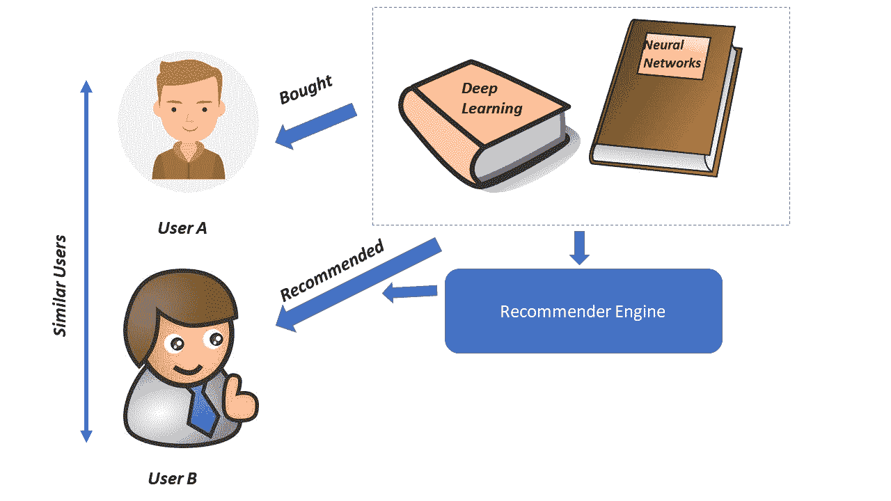

图 6.2：项目-项目协同过滤插图

在上图（“图 6.2”）中，用户`A`和用户`B`在购买书本方面非常相似。 用户`A`最近购买了书籍**深度学习**和**神经网络**。 由于用户`B`与用户`A`非常相似，因此用户-用户协作推荐系统也将这些图书推荐给用户`B`。

# 基于潜在分解的推荐系统

基于潜在因子分解的过滤器推荐方法尝试通过分解评分来发现潜在特征，以表示用户和项目资料。 与基于内容的过滤功能不同，这些潜在功能不可解释，可以表示复杂的功能。 例如，在电影推荐系统中，潜在特征之一可能以特定比例表示幽默，悬念和浪漫的线性组合。 通常，对于已经评分的商品，用户`i`对商品`j`的评分`r[ij]`可以表示为。 其中`u[i]`是基于潜在因子的用户配置文件矢量，而`v[i]`是基于相同潜在因子的项目矢量 ：


图 6.3：基于潜在因子的过滤图

上图（“图 6.3”）中说明了一种基于潜在因子的推荐方法，其中评级矩阵`R[mxn]`已分解为用户产品 配置文件矩阵`U[mxk]`和项目配置文件矩阵`P[nxk]`的转置，其中`k`是 模型的潜在因素。 基于这些配置文件，我们可以通过计算用户配置文件和项目配置文件的内部产品来推荐用户迄今为止尚未购买的项目。 内部产品给出了用户购买该产品时可能给出的暂定评分。

创建这些用户和商品资料的一种方法是，在以某种形式的平均值填充缺失值之后，对评分矩阵执行**奇异值分解**（**SVD**） 用户和项目（视情况而定）。 根据 SVD，评级矩阵`R`可以分解如下：


我们可以将用户个人资料矩阵作为`US^(1/2)`，然后将项目个人资料矩阵转置为 `S^(1/2) V^T`形成潜在因子模型。 当在分级矩阵中缺少与用户未分级的电影相对应的条目时，您可能会遇到有关如何执行 SVD 的问题。 常见的方法是在执行 SVD 之前，通过用户的平均评分或总体评分的平均值来估算缺失的评分。

# 深度学习以进行潜在因素协同过滤

除了使用 SVD，您还可以利用深度学习方法来导出给定尺寸的用户和商品资料向量。

对于每个用户`i`，您可以通过嵌入层定义用户矢量`u[i] ∈ R^k`。 同样，对于每个项目`j`，您可以通过另一个嵌入层定义项目向量`v[j] ∈ R^k`。 然后，用户`i`对项目`j`的评分`r[ij]`可以表示为`u[i], v[j]`的点积，如下所示：

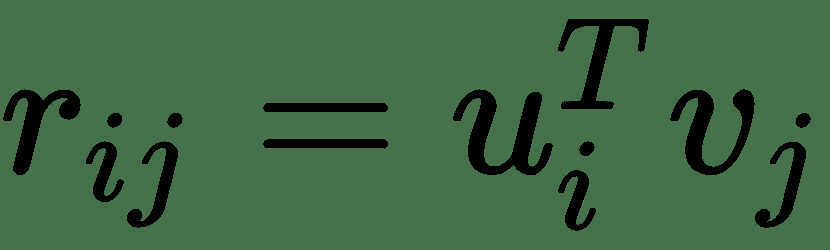

您可以修改神经网络以为用户和项目添加偏见。 假设我们想要`k`潜在分量，则`m`用户的嵌入矩阵`U`的尺寸将是`mxk`。 类似地，`n`项的嵌入矩阵`V`的尺寸将为`nxk`。

在“基于深度学习的潜在因子模型”部分中，我们将使用这种嵌入方法基于`100K Movie Lens`数据集创建推荐系统。 数据集可以从`https://grouplens.org/datasets/movielens/`下载。

我们将使用`u1.base`作为训练数据集，并使用`u1.test`作为保持测试数据集。

# 基于深度学习的潜在因素模型

“潜在协同过滤的深度学习”部分中讨论的基于深度学习的潜在因素模型可以如图 HTG2 图 6.4 所示进行设计：


图 6.4：电影镜头 100 K 数据集上基于深度学习的潜在因子模型

`user_ID`和`movie_ID`从其相应的嵌入矩阵中提取用户和电影嵌入向量。 在该图中，`embedding_1`代表用户 ID 的嵌入层，而`embedding_2`代表电影 ID 的嵌入层。 在`dot_1`层中执行用户嵌入矢量和电影嵌入矢量的点积，以输出评分（一到五个）。 定义模型的代码如下所示：

```py
def model(max_users,max_movies,latent_factors):
    user_ID = Input(shape=(1,))
    movie_ID = Input(shape=(1,))
    x = Embedding(max_users,latent_factors, input_length=1)(user_ID)
    y = Embedding(max_movies,latent_factors, input_length=1)(movie_ID)
    out = dot([x,y],axes=2,normalize=False)
    out= Reshape((1,))(out)
    model = Model(inputs=[user_ID,movie_ID],outputs=out)
    print(model.summary())
    return model
```

在前面的`model`功能中，`max_users`和`max_movies`分别确定用户的大小和电影嵌入矩阵。 该模型的参数不过是用户和电影嵌入矩阵的组成部分。 因此，如果我们有`m`个用户和`n`个电影，并且我们选择了`k`的潜在维度，那么我们就有`mxk + nxk = (m + n) * k`个待学习参数。

数据处理功能可以编码如下：

```py
data_dir = Path('/home/santanu/ML_DS_Catalog-/Collaborating Filtering/ml-100k/')
outdir = Path('/home/santanu/ML_DS_Catalog-/Collaborating Filtering/ml-100k/')

#Function to read data 
def create_data(rating,header_cols):
    data = pd.read_csv(rating,header=None,sep='\t')
    #print(data)
    data.columns = header_cols
    return data

#Movie ID to movie name dict 
def create_movie_dict(movie_file):
    print(movie_file)
    df = pd.read_csv(movie_file,sep='|', encoding='latin-1',header=None)
    movie_dict = {}
    movie_ids = list(df[0].values)
    movie_name = list(df[1].values)
    for k,v in zip(movie_ids,movie_name):
        movie_dict[k] = v 
    return movie_dict

# Function to create training validation and test data
def train_val(df,val_frac=None):
    X,y = df[['userID','movieID']].values,df['rating'].values
    #Offset the ids by 1 for the ids to start from zero
    X = X - 1 
    if val_frac != None:
        X_train, X_test, y_train, y_val = train_test_split(X, y, test_size=val_frac,random_state=0)
        return X_train, X_val, y_train, y_val
    else:
        return X,y
```

要注意的一件事是，已经从`user_ID`和`movie_ID`中都减去了`1`，以确保 ID 从`0`而不是`1`开始，以便嵌入层可以正确地引用它们。

调用数据处理和训练的代码如下：

```py
#Data processing and model training 

train_ratings_df = create_data(f'{data_dir}/u1.base',['userID','movieID','rating','timestamp']) 
test_ratings_df = create_data(f'{data_dir}/u1.test',['userID','movieID','rating','timestamp']) 
X_train, X_val,y_train, y_val = train_val(train_ratings_df,val_frac=0.2)
movie_dict = create_movie_dict(f'{data_dir}/u.item')
num_users = len(train_ratings_df['userID'].unique())
num_movies = len(train_ratings_df['movieID'].unique())

print(f'Number of users {num_users}')
print(f'Number of movies {num_movies}')
model = model(num_users,num_movies,40)
plot_model(model, to_file='model_plot.png', show_shapes=True, show_layer_names=True)
model.compile(loss='mse',optimizer='adam')
callbacks = [EarlyStopping('val_loss', patience=2), 
             ModelCheckpoint(f'{outdir}/nn_factor_model.h5', save_best_only=True)]
model.fit([X_train[:,0],X_train[:,1]], y_train, nb_epoch=30, validation_data=([X_val[:,0],X_val[:,1]], y_val), verbose=2, callbacks=callbacks)

```

该模型已设置为存储有关验证错误的最佳模型。 从训练日志中可以看出，该模型收敛于大约`0.8872`的验证 RMSE，如下所示：

```py
Train on 64000 samples, validate on 16000 samples
Epoch 1/30
 - 4s - loss: 8.8970 - val_loss: 2.0422
Epoch 2/30
 - 3s - loss: 1.3345 - val_loss: 1.0734
Epoch 3/30
 - 3s - loss: 0.9656 - val_loss: 0.9704
Epoch 4/30
 - 3s - loss: 0.8921 - val_loss: 0.9317
Epoch 5/30
 - 3s - loss: 0.8452 - val_loss: 0.9097
Epoch 6/30
 - 3s - loss: 0.8076 - val_loss: 0.8987
Epoch 7/30
 - 3s - loss: 0.7686 - val_loss: 0.8872
Epoch 8/30
 - 3s - loss: 0.7260 - val_loss: 0.8920
Epoch 9/30
 - 3s - loss: 0.6842 - val_loss: 0.8959
```

现在，我们在看不见的测试数据集上评估模型的性能。 可以调用以下代码对测试数据集进行推理：

```py
#Evaluate on the test dataset 
model = load_model(f'{outdir}/nn_factor_model.h5')
X_test,y_test = train_val(test_ratings_df,val_frac=None)
pred = model.predict([X_test[:,0],X_test[:,1]])[:,0]
print('Hold out test set RMSE:',(np.mean((pred - y_test)**2)**0.5))
pred = np.round(pred)
test_ratings_df['predictions'] = pred
test_ratings_df['movie_name'] = test_ratings_df['movieID'].apply(lambda x:movie_dict[x])
```

从日志中可以看到，保持测试 RMSE 在`0.95`附近：

```py
Hold out test set RMSE: 0.9543926404313371
```

现在，我们通过调用以下代码行，为测试数据集中 ID 为`1`的用户评估模型的性能：

```py
#Check evaluation results for the UserID = 1 
test_ratings_df[test_ratings_df['userID'] == 1].sort_values(['rating','predictions'],ascending=False)
```

从以下结果（“图 6.5”）可以看出，该模型在预测训练期间看不到的电影的收视率方面做得很好：


图 6.5：用户 ID 1 的评估结果

可以在[这个页面](https://github.com/PacktPublishing/Intelligent-Projects-using-Python/tree/master/Chapter06)上找到与深度学习方法潜在因子方法相关的代码。

# SVD ++

通常，SVD 不会捕获用户和数据中可能存在的项目偏差。 一种名为 SVD ++的方法考虑了潜在分解因子方法中的用户和项目偏见，并且在诸如 *Netflix Challenge* 之类的比赛中非常流行。

进行基于潜在因素推荐的最常见方法是将用户配置文件定义为`u[i] ∈ R^k`和`b[i] ∈ R`，项目轮廓和偏差为`v[i] ∈ R^k`和`b[j] ∈ R`。 然后，将用户`i`对项目`j`提供的评分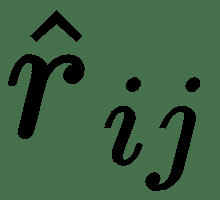定义如下：


`µ`是所有评分的总体平均值。

然后，通过在预测由用户评分的所有物品的评分时，通过最小化误差平方和来确定用户概况和物品概况。 要优化的误差平方误差可以表示为：

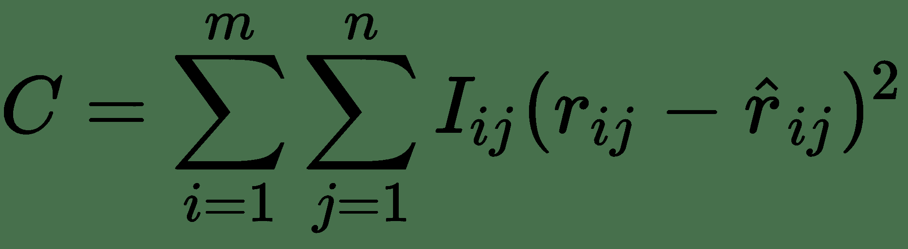

`I[ij]`是一种指标函数，如果用户`i`具有额定项目`j`，则该函数为 1；否则为零。

相对于用户参数和项目资料，成本最小化。 通常，这种优化会导致过拟合，因此，将用户的规范和物料配置文件用作成本函数的正则化，如下所示：

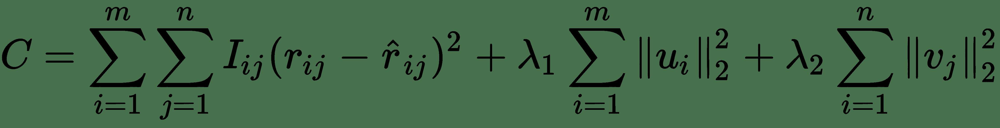

这里，`λ[1]`和`λ[2]`是正则化常数。 通常，一种流行的梯度下降技术称为**交替最小二乘**（**ALS**）用于优化，该技术通过保持项目参数固定来交替更新用户配置文件参数，反之亦然。

`surprise`软件包具有 SVD++ 的良好实现。 在下一部分中，我们将在`100K movie lens`数据集上使用 SVD++ 训练模型，并查看性能指标。

# 电影镜头 100k 数据集上的 SVD ++训练模型

可以使用以下命令通过`conda`下载`surprise`软件包：

```py
conda install -c conda-forge scikit-surprise 
```

对应于 SVD ++的算法在`surprise`中被命名为`SVDpp`。 我们可以按以下方式加载所有必需的软件包：

```py
import numpy as np
from surprise import SVDpp # SVD++ algorithm
from surprise import Dataset
from surprise import accuracy
from surprise.model_selection import cross_validate
from surprise.model_selection import train_test_split
```

可以下载`100K Movie lens`数据集，并使用`surprise`中的`Dataset.load_builtin`实用程序将其提供给代码。 我们将数据分为`80`与`20`比率的训练和保持测试集。 数据处理代码行如下：

```py
# Load the movie lens 10k data and split the data into train test files(80:20)
data = Dataset.load_builtin('ml-100k')
trainset, testset = train_test_split(data, test_size=.2)
```

接下来，我们将对数据进行`5`折叠交叉验证，并查看交叉验证结果。 我们为随机梯度下降选择了`0.008`的学习率。 为了防止过拟合，我们为 L1 和 L2 正则化选择了正则化常数`0.1`。 这些代码行的详细信息如下：

```py
#Perform 5 fold cross validation with all data 
algo = SVDpp(n_factors=40, n_epochs=40, lr_all=0.008, reg_all=0.1)
# Run 5-fold cross-validation and show results summary
cross_validate(algo,data, measures=['RMSE', 'MAE'], cv=5, verbose=True)
```

交叉验证的结果如下：

```py
Evaluating RMSE, MAE of algorithm SVDpp on 5 split(s). Fold 1 Fold 2 Fold 3 Fold 4 Fold 5 Mean Std RMSE (testset) 0.9196 0.9051 0.9037 0.9066 0.9151 0.9100 0.0062 MAE (testset) 0.7273 0.7169 0.7115 0.7143 0.7228 0.7186 0.0058 Fit time 374.57 374.58 369.74 385.44 382.36 377.34 5.72 Test time 2.53 2.63 2.74 2.79 2.84 2.71 0.11   
```

从前面的结果可以看出，模型的`5 fold cv RMSE`是`0.91`。 在`Movie Lens 100K`数据集上，结果令人印象深刻。

现在，我们将仅在训练数据集`trainset`上训练模型，然后在测试集上评估模型。 相关代码行如下：

```py
model = SVDpp(n_factors=40, n_epochs=10, lr_all=0.008, reg_all=0.1)
model.fit(trainset)
```

训练完模型后，我们将在保留测试数据集测试集中评估模型。 相关代码行如下：

```py
#validate the model on the testset
pred = model.test(testset)
print("SVD++ results on the Test Set")
accuracy.rmse(pred, verbose=True)   
```

验证的输出如下：

```py
SVD++ results on the test set
RMSE: 0.9320
```

从前面的结果可以看出，SVD ++模型在 RMSE 为`0.93`的测试数据集上确实表现良好。 结果与我们在此之前训练的基于深度学习的模型潜在因子模型（支持`0.95`的 RMSE）相当。

在“用于推荐的受限玻尔兹曼机”部分中，我们将介绍用于构建推荐系统的受限玻尔兹曼机。 由于该方法可以扩展到大型数据集，因此在协同过滤中获得了很大的普及。 协同过滤域中的大多数数据集都很稀疏，从而导致困难的非凸优化问题。 与其他分解方法（例如 SVD）相比，RBM 在数据集中更不容易遭受此稀疏问题的困扰。

# 推荐的受限玻尔兹曼机

受限玻尔兹曼机是一类属于无监督学习技术的神经网络。 众所周知，**受限玻尔兹曼机**（**RBM**）试图通过将输入数据投影到隐藏层中来学习数据的隐藏结构。

隐藏层激活有望对输入信号进行编码并重新创建。 受限制的玻尔兹曼机通常可处理二进制数据：

<sup></sup>

图 6.6：用于二进制数据的受限玻尔兹曼机

只是为了刷新我们的记忆，上图（“图 6.6”）是一个 RBM，具有`m`输入或可见单位。 这被投影到具有`n`个单位的隐藏层。 给定可见层输入[H​​TG6]，则隐藏单元彼此独立，因此可以如下进行采样，其中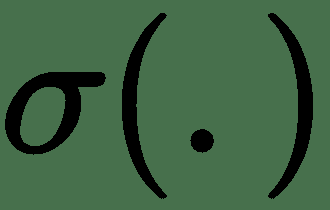表示 Sigmoid 函数：

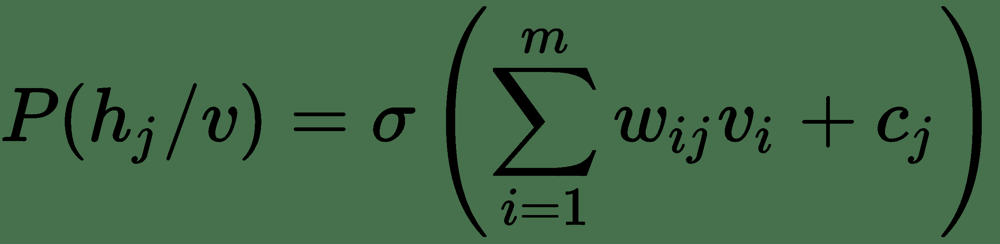

类似地，给定隐藏层激活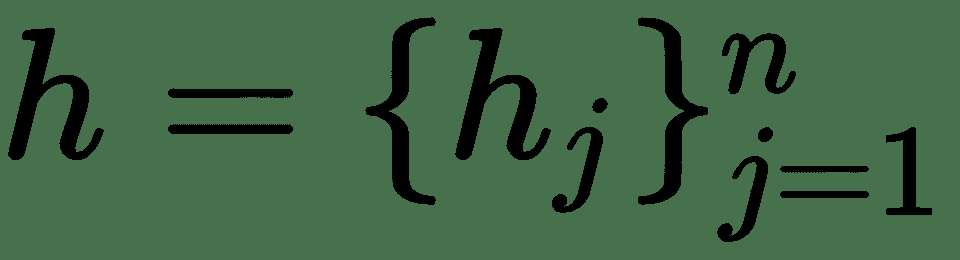，可见层单元是独立的，可以如下进行采样：

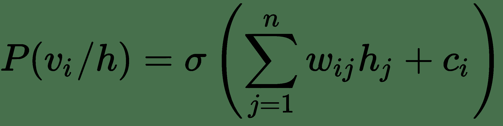

RBM 的参数是可见层单位`i`与隐藏层单位之间的广义权重连接`w[ij] ∈ w[mxn]`，在可见单位`i`处的偏差`c[i] ∈ b`和隐藏层单位`j`处的偏差`c[j] ∈ c`。

通过最大化可见输入数据的可能性来学习 RBM 的这些参数。 如果我们用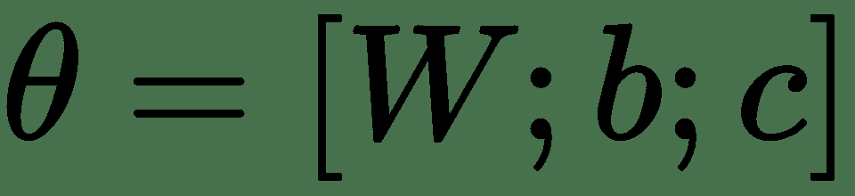表示组合的参数集，并且有一组`T`训练输入数据点，则在 RBM 中，我们尝试使似然函数最大化：


通常，我们不使用乘积形式，而是最大化似然对数，或最小化对数似然的负值，以使函数在数学上更加方便。 如果我们将对数似然的负数表示为成本函数`C`，则：


通常通过梯度下降使成本函数最小化。 成本函数相对于参数的梯度由期望项组成，并表示为：

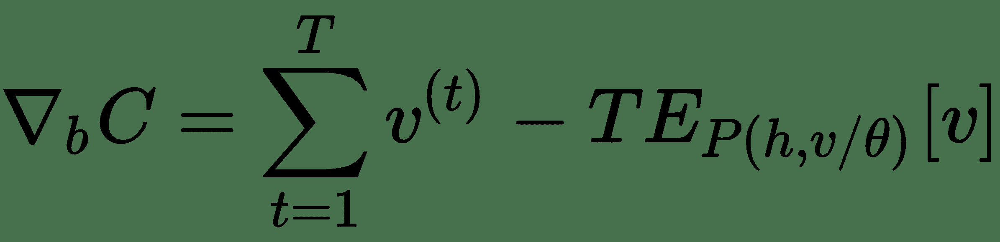

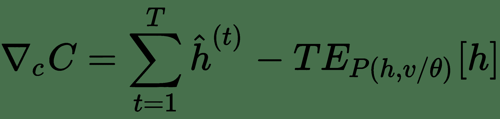


术语表示对隐藏和可见单位的联合概率分布的任何给定数量的期望。 另外，表示给定可见单位`v`的采样的隐藏层输出。 在梯度下降的每次迭代中计算联合概率分布的期望在计算上是棘手的。 我们将采用下一节中讨论的称为**对比发散**的智能方法来计算期望值。

# 对比分歧

计算联合概率分布的期望值的一种方法是通过 Gibbs 采样从联合概率分布中生成很多样本，然后将样本的平均值作为期望值。 在吉布斯抽样中，可以以其余变量为条件对联合概率分布中的每个变量进行抽样。 由于可见单位是独立的，因此给定隐藏单位，反之亦然，因此您可以将隐藏单位采样为，然后将可见单位激活给定隐藏单位为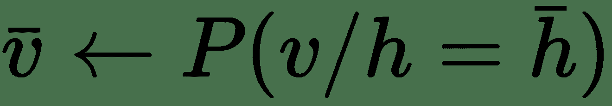。 然后我们可以将样本作为从联合概率分布中抽取的样本。 这样，我们可以生成大量样本，例如`M`，并取其平均值来计算期望的期望值。 但是，在梯度下降的每个步骤中进行如此大量的采样将使训练过程变得令人无法接受的缓慢，因此，与其在梯度下降的每个步骤中计算许多样本的平均值，不如从联合概率中生成一个样本 表示整个联合概率分布中期望期望的分布：

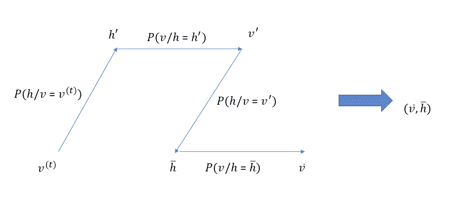

图 6.7：对比散度图

如上图所示（“图 6.7”），我们从可见的输入`v^(t)`开始，并对隐藏层进行采样 根据条件概率分布`P(h / v = v^(t))`激活。 再次，使用条件概率分布`P(v / h = h')`，我们对`v'`进行采样。 根据条件概率分布`P(h / v = v')`对隐藏单元的下一次采样给出，然后使用对可见单元激活进行采样 给我们。 对于`v`和`h`，即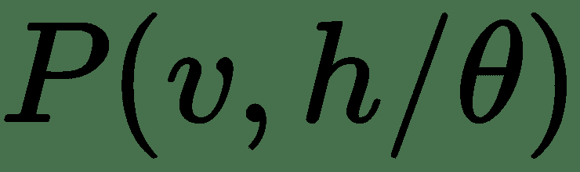的整个联合概率分布，将样本取为代表性样本。 相同的用于计算包含`v`和`h`的任何表达式的期望。 这种采样过程称为对比散度。

从可见输入开始，然后从条件分布`P(v / h)`和`P(v / h)`连续采样构成吉布斯采样的一个步骤，并为我们提供了一个样本 联合分布中的`v / h`。 代替在 Gibbs 采样的每个步骤中选择样本`v / h`，我们可以选择从条件概率分布中进行几次连续的采样迭代后再选择样本。 如果在吉布斯采样的`k`个步骤之后，选择了代表元素，则将对比散度称为`CD-k`。 “图 6.7”中所示的对比散度可以称为`CD-2`，因为我们是在经过两步 Gibbs 采样后才选择样本的。

# 使用 RBM 的协同过滤

提出建议时，可以使用受限玻尔兹曼机进行协同过滤。 我们将使用这些 RBM 向用户推荐电影。 使用不同用户为不同电影提供的分级来训练他们。 用户不会观看或评价所有电影，因此可以使用此训练模型来向用户推荐未看过的电影。

我们应该首先遇到的一个问题是如何处理 RBM 中的评分，因为评分本质上是有序的，而 RBM 则针对二进制数据。 可以将评分视为二进制数据，表示评分的单位数量等于每个评分的唯一值的数量。 例如：在评级系统中，评分从 1 到 5 不等，并且将有 5 个二进制单位，其中与评分相对应的 1 个单位设置为 1，其余单位设置为 0。 RBM 可见的单位将是为用户提供给不同电影的评分。 如所讨论的，每个评分将以二进制表示，并且对于每个可见单元，来自所有二进制可见单元的权重连接都与电影评分相对应。 由于每个用户将为一组不同的电影评分，因此每个用户的输入将不同。 但是，从电影分级单位到隐藏单位的重量连接对于所有用户而言都是通用的。

下图所示（“图 6.8a”和“图 6.8b”）是用户`A`和用户`B`的 RBM 视图。 **用户**`A`和用户`B`为一组不同的电影评分。 但是，正如我们所看到的，每个用户到每部电影中隐藏单元的权重连接都相同。 关于用户`A`的 RBM 评分如下：


图 6.8a：用于协同过滤的 RBM 用户 A 视图

相对于用户`B`的 RBM 评分如下：


图 6.8b：用于协同过滤的 RBM 用户 B 视图

还有一点要注意的是，如果有`M`个电影，并且每个电影都有`k`评分，那么 RBM 的可见单位数是`M * k`。 此外，如果二进制隐藏单元的数量为`n`，则`W`中的权重连接数等于`M * k * n`。 给定可见层输入，每个隐藏单元`h[j]`可以独立于其他隐藏单元进行采样，如下所示：


此处，`m = M * k`。

与传统的 RBM 不同，在给定隐藏层激活的情况下，无法独立采样该网络可见层中的二进制单元。 相对于电影的评分，每个`k`个二进制单位通过 k 路 softmax 激活函数进行绑定。 如果给定隐藏单元的特定电影的可见单元的输入为，则电影`i`的评分`l`的一般输入计算如下：

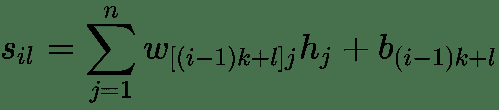

在这里，`(i - 1) * k + 1`是电影`i`的可见单位对评分`l`的索引。 同样，可以根据 soft-max 函数给出的概率对任何特定电影的可见单位进行采样，如下所示：


在定义隐藏单元和可见单元的输出时，还有一件重要的事情是需要概率抽样，而不是将输出默认为具有最大概率的抽样。 如果给定可见单位的隐藏单位激活的概率为`P`，则统一生成`[0, 1]`范围内的随机数`r`，并且如果`P > r`，则隐藏单元激活设置为`true`。 该方案将确保在很长的一段时间内以概率`P`将激活设置为 true。 类似地，电影的可见单位是根据跨国公司发行给定隐藏单位的概率从跨国发行机构中采样的。 因此，如果对于特定电影，给定的隐藏单位激活为`(p[1], p[2], p[3], p[4], p[5])`，然后可以从多项式分布中抽样选择五个评分中的评分值， 其概率质量函数如下：

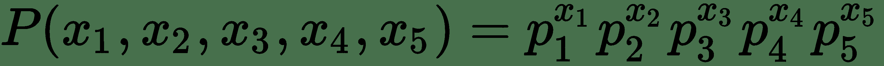

这里：


现在，我们具备了创建用于协同过滤的受限玻尔兹曼机所需的所有技术知识。

# 使用 RBM 的协同过滤实现

在接下来的几节中，我们将使用前一部分介绍的技术原理，使用受限玻尔兹曼机实施协同过滤系统。 我们将使用的数据集是 MovieLens 100K 数据集，其中包含用户对不同电影提供的评分（从 1 到 5）。 可以从[这里](https://grouplens.org/datasets/movielens/100k/)下载数据集。

此协同过滤系统的 TensorFlow 实现在接下来的几节中介绍。

# 处理输入

每行中的输入评级文件记录包含字段`userId`，`movieId`，`rating`和`timestamp`。 我们处理每条记录以创建`numpy`数组形式的训练文件，其中三个维度分别与`userId`，`movieId`和`rating`有关。 从 1 到 5 的评级是一热编码的，因此沿评级维度的长度为 5。 我们使用 80% 的输入记录创建培训数据，而其余 20% 保留用于测试。 用户已评分的电影数量为`1682`。 培训文件包含`943`用户，因此培训数据的维度为`(943,1682,5)`。 培训文件中的每个用户都是 RBM 的培训记录，其中将包含用户已评分的几部电影和用户尚未评分的几部电影。 一些电影分级也已删除，将包含在测试文件中。 将对 RBM 进行可用分级的培训，在隐藏单元中捕获输入数据的隐藏结构，然后尝试从捕获的隐藏结构中为每个用户重建所有电影的输入分级。 我们还创建了两个字典，以将实际电影 ID 的交叉引用及其索引存储在训练/测试数据集中。 以下是用于创建培训和测试文件的详细代码：

```py
"""
@author: santanu
"""

import numpy as np
import pandas as pd
import argparse

'''
Ratings file preprocessing script to create training and hold out test datasets
'''

def process_file(infile_path):
    infile = pd.read_csv(infile_path,sep='\t',header=None)
    infile.columns = ['userId','movieId','rating','timestamp']
    users = list(np.unique(infile.userId.values))
    movies = list(np.unique(infile.movieId.values))

    test_data = []
    ratings_matrix = np.zeros([len(users),len(movies),5])
    count = 0 
    total_count = len(infile)
    for i in range(len(infile)):
        rec = infile[i:i+1]
        user_index = int(rec['userId']-1)
        movie_index = int(rec['movieId']-1)
        rating_index = int(rec['rating']-1)
        if np.random.uniform(0,1) < 0.2 :
            test_data.append([user_index,movie_index,int(rec['rating'])])

        else:
            ratings_matrix[user_index,movie_index,rating_index] = 1 

        count +=1 
        if (count % 100000 == 0) & (count>= 100000):
            print('Processed ' + str(count) + ' records out of ' + str(total_count))

    np.save(path + 'train_data',ratings_matrix)
    np.save(path + 'test_data',np.array(test_data))

if __name__ == '__main__':
    parser = argparse.ArgumentParser()
    parser.add_argument('--path',help='input data path')
    parser.add_argument('--infile',help='input file name')
    args = parser.parse_args()
    path = args.path
    infile = args.infile
    process_file(path + infile)

```

训练文件是尺寸为`mxnxk`的`numpy`数组对象，其中`m`是用户总数，`n`是电影总数，并且`k`是离散额定值的数量（一到五个）。 要构建测试集，我们从训练数据集中随机选择 20% 的`m x n`评分条目。 因此，测试集评级样本的所有`k`评级值在训练数据集中均标记为零。 在测试集中，我们不会将数据扩展为三维 numpy 数组格式，因此可以将其用于训练。 相反，我们只将`userid`，`movieid`和分配的评分保存在三列中。 请注意，存储在火车中的`userid`和`movieid`和测试文件不是原始评级数据文件`u.data`中的实际 ID。 它们被`1`偏移以适应从`0`而非`1`开始的 Python 和`numpy`索引

以下命令可用于调用数据预处理脚本：

```py
python preprocess_ratings.py --path '/home/santanu/ML_DS_Catalog-/Collaborating Filtering/ml-100k/' --infile 'u.data'

```

# 建立用于协同过滤的 RBM 网络

以下函数`_network`为协同过滤创建所需的 RBM 结构。 首先，我们定义输入的权重，偏差和占位符。 然后定义`sample_hidden`和`sample_visible`函数，以根据概率分别对隐藏的激活和可见的激活进行采样。 隐藏的单位是从 Sigmoid 函数提供的概率从伯努利分布中采样的，而与每个电影有关的可见单元是根据 softmax 函数提供的概率从多项分布中采样的。 无需创建 softmax 概率，因为`tf.multinomial`函数可以直接从 logit 采样，而不是实际概率。

接下来，我们根据 Gibbs 采样定义对比差异的逻辑。 `gibbs_step`函数执行 Gibbs 采样的一个步骤，然后利用它来实现`k`阶的对比散度。

现在我们拥有所有必需的功能，我们将创建 TensorFlow 操作，以在给定可见输入的情况下对隐藏状态`self.h`进行采样，并在给定采样状态下对可见单位`self.x`进行采样。 我们还使用对比散度从 v 和 h 的联合概率分布（即`P(v,h/model)`）中抽取`(self.x_s,self.h_s)`作为代表性样本，以计算梯度中的不同期望项。

`_network`函数的最后一步基于梯度更新 RBM 模型的权重和偏差。 如我们先前所见，梯度基于给定可见层输入的隐藏层激活`self.h`以及通过对比发散得出的联合概率分布`P(v,h/model)`的代表性样本`(self.x_s,self.h_s)`。

TensorFlow ops `self.x_`指的是给定隐藏层激活`self.h`的可见层激活，在推断过程中将有用以推导尚未被每个用户评级的电影的评级：

```py
    def __network(self):

        self.x = tf.placeholder(tf.float32, [None,self.num_movies,self.num_ranks], name="x") 
        self.xr = tf.reshape(self.x, [-1,self.num_movies*self.num_ranks], name="xr") 
        self.W = tf.Variable(tf.random_normal([self.num_movies*self.num_ranks,self.num_hidden], 0.01), name="W") 
        self.b_h = tf.Variable(tf.zeros([1,self.num_hidden], tf.float32, name="b_h")) 
        self.b_v = tf.Variable(tf.zeros([1,self.num_movies*self.num_ranks],tf.float32, name="b_v")) 
        self.k = 2 

## Converts the probability into discrete binary states i.e. 0 and 1 
        def sample_hidden(probs):
            return tf.floor(probs + tf.random_uniform(tf.shape(probs), 0, 1)) 

        def sample_visible(logits):

            logits = tf.reshape(logits,[-1,self.num_ranks])
            sampled_logits = tf.multinomial(logits,1) 
            sampled_logits = tf.one_hot(sampled_logits,depth = 5)
            logits = tf.reshape(logits,[-1,self.num_movies*self.num_ranks])
            print(logits)
            return logits 

## Gibbs sampling step
        def gibbs_step(x_k):
          # x_k = tf.reshape(x_k,[-1,self.num_movies*self.num_ranks]) 
            h_k = sample_hidden(tf.sigmoid(tf.matmul(x_k,self.W) + self.b_h))
            x_k = sample_visible(tf.add(tf.matmul(h_k,tf.transpose(self.W)),self.b_v))
            return x_k
## Run multiple gives Sampling step starting from an initital point 
        def gibbs_sample(k,x_k):

            for i in range(k):
                x_k = gibbs_step(x_k)
# Returns the gibbs sample after k iterations
            return x_k

# Constrastive Divergence algorithm
# 1\. Through Gibbs sampling locate a new visible state x_sample based on the current visible state x 
# 2\. Based on the new x sample a new h as h_sample 
        self.x_s = gibbs_sample(self.k,self.xr)
        self.h_s = sample_hidden(tf.sigmoid(tf.matmul(self.x_s,self.W) + self.b_h))

# Sample hidden states based given visible states
        self.h = sample_hidden(tf.sigmoid(tf.matmul(self.xr,self.W) + self.b_h))
# Sample visible states based given hidden states
        self.x_ = sample_visible(tf.matmul(self.h,tf.transpose(self.W)) + self.b_v)

# The weight updated based on gradient descent 
        #self.size_batch = tf.cast(tf.shape(x)[0], tf.float32)
        self.W_add = tf.multiply(self.learning_rate/self.batch_size,tf.subtract(tf.matmul(tf.transpose(self.xr),self.h),tf.matmul(tf.transpose(self.x_s),self.h_s)))
        self.bv_add = tf.multiply(self.learning_rate/self.batch_size, tf.reduce_sum(tf.subtract(self.xr,self.x_s), 0, True))
        self.bh_add = tf.multiply(self.learning_rate/self.batch_size, tf.reduce_sum(tf.subtract(self.h,self.h_s), 0, True))
        self.updt = [self.W.assign_add(self.W_add), self.b_v.assign_add(self.bv_add), self.b_h.assign_add(self.bh_add)]
```

可以使用如下所示的`read_data`功能在训练和推理期间读取来自预处理步骤的数据：

```py
    def read_data(self):

        if self.mode == 'train':
           self.train_data = np.load(self.train_file)
           self.num_ranks = self.train_data.shape[2]
           self.num_movies = self.train_data.shape[1]
           self.users = self.train_data.shape[0]

        else:
           self.train_df = pd.read_csv(self.train_file)
           self.test_data = np.load(self.test_file)
           self.test_df = pd.DataFrame(self.test_data,columns=['userid','movieid','rating'])

           if self.user_info_file != None:
               self.user_info_df = pd.read_csv(self.user_info_file,sep='|',header=None)
               self.user_info_df.columns=['userid','age','gender','occupation','zipcode']

           if self.movie_info_file != None:
               self.movie_info_df = pd.read_csv(self.movie_info_file,sep='|',encoding='latin-1',header=None)
               self.movie_info_df = self.movie_info_df[[0,1]] 
               self.movie_info_df.columns = ['movieid','movie Title']
```

同样，在推理过程中，我们将与所有测试文件和测试文件一起（所有代码和评分均被读入）读入预测文件 CSV（在先前代码的推理部分中为`self.train_file`，在此处）。 一旦训练了模型，便执行预测。 由于我们已经在训练后预测了收视率，因此在推断时间内我们要做的就是将收视率预测信息与测试文件的实际收视率信息相结合（后面的`train`和`inference`部分中有更多详细信息）。 另外，我们从用户和电影元数据文件中读取信息以供以后使用。

# 训练成果管理制

此处说明的`_train`功能可用于训练 RBM。 在此函数中，我们首先调用`_network`函数以构建 RBM 网络结构，然后在激活的 TensorFlow 会话中针对指定时期数训练模型。 使用 TensorFlow 的`saver`函数以指定的时间间隔保存模型：

```py
      def _train(self):

        self.__network()
       # TensorFlow graph execution

        with tf.Session() as sess:
            self.saver = tf.train.Saver()
            #saver = tf.train.Saver(write_version=tf.train.SaverDef.V2) 
            # Initialize the variables of the Model
            init = tf.global_variables_initializer()
            sess.run(init)

            total_batches = self.train_data.shape[0]//self.batch_size
            batch_gen = self.next_batch()
            # Start the training 
            for epoch in range(self.epochs):
                if epoch < 150:
                    self.k = 2

                if (epoch > 150) & (epoch < 250):
                    self.k = 3

                if (epoch > 250) & (epoch < 350):
                    self.k = 5

                if (epoch > 350) & (epoch < 500):
                    self.k = 9

                    # Loop over all batches
                for i in range(total_batches):
                    self.X_train = next(batch_gen)
                    # Run the weight update 
                    #batch_xs = (batch_xs > 0)*1
                    _ = sess.run([self.updt],feed_dict={self.x:self.X_train})

                # Display the running step 
                if epoch % self.display_step == 0:
                    print("Epoch:", '%04d' % (epoch+1))
                    print(self.outdir)
                    self.saver.save(sess,os.path.join(self.outdir,'model'), 
                                    global_step=epoch)
           # Do the prediction for all users all items irrespective of whether they 
             have been rated
            self.logits_pred = tf.reshape(self.x_,
           [self.users,self.num_movies,self.num_ranks])
            self.probs = tf.nn.softmax(self.logits_pred,axis=2)
            out = sess.run(self.probs,feed_dict={self.x:self.train_data})
            recs = []
            for i in range(self.users):
                for j in range(self.num_movies):
                    rec = [i,j,np.argmax(out[i,j,:]) +1]
                    recs.append(rec)
            recs = np.array(recs)
            df_pred = pd.DataFrame(recs,columns=
            ['userid','movieid','predicted_rating'])
            df_pred.to_csv(self.outdir + 'pred_all_recs.csv',index=False)

            print("RBM training Completed !")
```

在前面的函数中要强调的重要一点是使用自定义`next_batch`函数创建随机批次。 该函数在下面的代码片段中定义，并且用于定义迭代器`batch_gen`，该迭代器可以由`next`方法调用以检索下一个迷你批量：

```py
def next_batch(self):
    while True:
        ix = np.random.choice(np.arange(self.data.shape[0]),self.batch_size)
        train_X = self.data[ix,:,:] 
        yield train_X
```

需要注意的一件事是，在培训结束时，我们会预测所有用户对所有电影的收视率，无论它们是否被评级。 具有最高可能性的评级，将从五个可能的评级（即从 1 到 5）中给出最终评级。 由于在 Python 中，索引从零开始，因此在使用`argmax`获得最高概率的位置之后，我们加一以获得实际评分。 因此，在培训结束时，我们有一个`pred_all_recs.csv`文件，其中包含所有培训和测试记录的预测评分。 请注意，测试记录已嵌入培训记录中，并且评分的所有索引（从 1 到 5）都设置为零。

但是，一旦我们从用户观看过的电影的隐藏表示中充分训练了模型，就可以学习从用户未看过的电影中生成评分。

可以通过调用以下命令来训练模型：

```py
python rbm.py main_process --mode train --train_file '/home/santanu/ML_DS_Catalog-/Collaborating Filtering/ml-100k/train_data.npy' --outdir '/home/santanu/ML_DS_Catalog-/Collaborating Filtering/' --num_hidden 5 --epochs 1000
```

从日志中可以看到，仅使用`5`隐藏层训练`1000`时代的模型大约需要`52`秒。

```py
RBM training Completed !
52.012 s: process RBM 
```

请注意，受限玻尔兹曼机网络已在配备 GeForce Zotac 1070 GPU 和 64 GB RAM 的 Ubuntu 机器上进行了培训。 培训时间可能会根据用于培训网络的系统而有所不同。

# 使用训练有素的 RBM 推理

鉴于我们已经在训练过程中生成了带有所有预测的文件`pred_all_recs.csv`，因此针对 RBM 的推论非常简单。 我们要做的只是基于提供的测试文件从`pred_all_recs.csv`中提取测试记录。 另外，我们通过将`1`添加到它们的当前值来求助于原始的`userid`和`movieid`。 返回原始 ID 的目的是能够从`u.user`和`u.item`文件中添加用户和电影信息。

推理块如下：

```py
    def inference(self):

        self.df_result = self.test_df.merge(self.train_df,on=['userid','movieid'])
        # in order to get the original ids we just need to add 1 
        self.df_result['userid'] = self.df_result['userid'] + 1
        self.df_result['movieid'] = self.df_result['movieid'] + 1
        if self.user_info_file != None:
            self.df_result.merge(self.user_info_df,on=['userid'])
        if self.movie_info_file != None:
            self.df_result.merge(self.movie_info_df,on=['movieid'])
        self.df_result.to_csv(self.outdir + 'test_results.csv',index=False)

        print(f'output written to {self.outdir}test_results.csv')
        test_rmse = (np.mean((self.df_result['rating'].values - 
        self.df_result['predicted_rating'].values)**2))**0.5
        print(f'test RMSE : {test_rmse}')
```

可以按以下方式调用推断：

```py
 python rbm.py main_process --mode test --train_file '/home/santanu/ML_DS_Catalog-/Collaborating Filtering/pred_all_recs.csv' --test_file '/home/santanu/ML_DS_Catalog-/Collaborating Filtering/ml-100k/test_data.npy' --outdir '/home/santanu/ML_DS_Catalog-/Collaborating Filtering/' --user_info_file '/home/santanu/ML_DS_Catalog-/Collaborating Filtering/ml-100k/u.user' --movie_info_file '/home/santanu/ML_DS_Catalog-/Collaborating Filtering/ml-100k/u.item'
```

通过在 RBM 中仅使用`5`隐藏单元，我们获得了大约`1.19`的测试均方根误差（RMSE），这是值得称赞的，因为我们选择了这样一个简单的网络。 以下代码块中提供了推理的输出日志，以供参考：

```py
output written to /home/santanu/ML_DS_Catalog-/Collaborating Filtering/test_results.csv
test RMSE : 1.1999306704742303
458.058 ms: process RBM
```

我们从`test_results.csv`观察`userid 1`的推断结果，如下所示（请参见“图 6.9”）：


图 6.9：用户 ID 1 的保留数据验证结果

从前面的屏幕快照（“图 6.9”）中的预测可以看出，RBM 在预测`userid` `1`的电影的保留集方面做得很好。

建议您将最终收视率预测作为对每个电影收视率预测的多项式概率分布的收视率的期望值，并与采用最高收视率的方法进行比较，了解其效果如何 多项式分布的概率。 可以在[这个页面](https://www.cs.toronto.edu/~rsalakhu/papers/rbmcf.pdf)上找到用于协同过滤的 RBM 论文。受限玻尔兹曼机有关的代码位于[这里](https://github.com/PacktPublishing/Intelligent-Projects-using-Python/blob/master/Chapter06/rbm.py)。

# 概要

阅读完本章后，您现在应该能够使用受限玻尔兹曼机构建智能推荐系统，并根据您的领域和要求以有趣的方式对其进行扩展。 有关本章中说明的项目的详细实现，请参考[此项目的 GiHub 链接](https://github.com/PacktPublishing/Intelligent-Projects-using-Python/blob/master/Chapter06)。

在下一章中，我们将处理移动应用程序的创建，以执行电影评论的情感分析。 我期待您的参与。