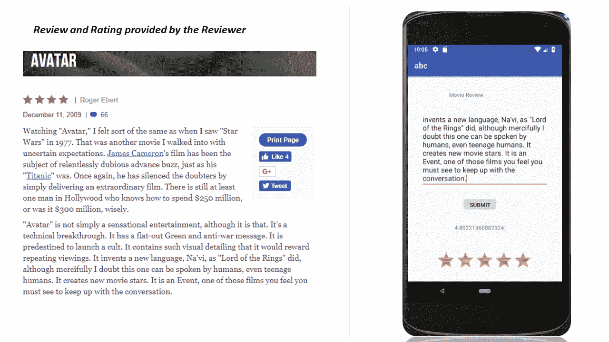
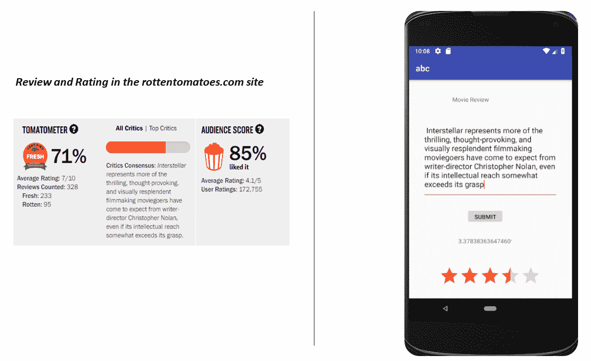

# 电影评论情感分析移动应用

在这个现代时代，将数据发送到云中基于 AI 的应用程序进行推理是司空见惯的。 例如，用户可以将手机拍摄的图像发送到 Amazon Rekognition API，该服务可以标记图像中存在的各种对象，人物，文本，场景等。 利用托管在云中的基于 AI 的应用程序的服务的优势在于其易用性。 移动应用程序只需要向基于 AI 的服务以及图像发出 HTTPS 请求，然后在几秒钟内，该服务将提供推理结果。 这些**机器学习即服务**提供程序中的一些如下：

*   亚马逊认可
*   亚马逊波利
*   亚马逊 Lex
*   Microsoft Azure 认知服务
*   沃森
*   Google Cloud Vision

下图“图 7.1，”说明了这种应用程序在云上托管时的体系结构以及如何与移动设备交互：


图 7.1：移动应用程序与托管在云上的 AI 模型进行通信

如您在上图中所见，移动应用程序将图像本地化和分类请求与图像一起发送到托管在云上的模型，并且在对提供的图像进行推断之后，模型将结果发送回去。 在云上使用此类服务​​的优势如下：

*   无需收集数据来训练这种模型
*   将 AI 模型作为服务托管不会带来任何痛苦
*   无需担心重新训练模型

所有上述内容将由服务提供商负责。 但是，在云上使用这种 AI 应用程序确实也有一些缺点，其中包括：

*   用户无法在移动设备上本地运行推理。 所有推理都需要通过向托管 AI 应用程序的服务器发送网络请求来完成。 如果没有网络连接，该移动应用将无法运行。 同样，通过网络从模型中获取预测可能会有一些延迟。
*   如果不是免费托管的云应用程序，则用户通常需要为运行的推理次数付费。
*   云托管的模型非常通用，用户无法控制使用自己的数据训练这些模型。 如果数据是唯一的，则在通用数据上经过训练的这种应用程序可能不会提供很好的结果。

可以通过在移动设备本身上运行推理，而不是通过互联网将数据发送到 AI 应用程序来克服部署在云上的 AI 应用程序的上述缺点。

可以使用特定于移动应用程序所针对问题的训练数据在具有适当 CPU 和 GPU 的任何系统上训练该模型。 然后，可以将经过训练的模型转换为优化的文件格式，而只需要运行推理所需的权重和操作即可。 然后，可以将优化的模型与移动应用程序集成，并且可以将整个项目作为应用程序加载到移动设备上。 训练后的模型的优化文件应尽可能轻巧，因为模型将与其他移动应用程序代码一起存储在移动设备上。 在本章中，我们将使用 TensorFlow mobile 开发一个 Android 移动应用程序。

# 技术要求

您需要具备 Python 3，TensorFlow 和 Java
的基本知识。

[可以在 GitHub 上找到本章的代码文件](https://github.com/PacktPublishing/Intelligent-Projects-using-Python/tree/master/Chapter07)

[观看以下视频，查看运行中的代码](http://bit.ly/2S1sddw)

# 使用 TensorFlow Mobile 构建 Android 移动应用

在这个项目中，我们将使用 TensorFlow 的移动功能来优化训练好的模型作为协议缓冲区对象。 然后，我们将模型与 Android 应用程序集成，该应用程序的逻辑将用 Java 编写。 我们需要执行以下步骤：

1.  在 TensorFlow 中构建模型并使用相关数据进行训练。
2.  模型在验证数据集上令人满意地执行后，将 TensorFlow 模型转换为优化的 protobuf 对象（例如，`optimized_model.pb`）。

3.  下载 Android Studio 及其先决条件。 用 Java 开发核心应用程序逻辑，并使用 XML 开发接口页面。
4.  将 TensorFlow 训练有素的模型 protobuf 对象及其相关的依赖项集成到项目内的 Assets 文件夹中。
5.  生成项目并运行它。

下图说明了此 Android 应用的实现（“图 7.2”）：


图 7.2：移动应用程序部署架构图

# Android 应用中的电影评论评分

我们将构建一个 Android 应用，该应用将基于电影评论的情感分析，将电影评论作为输入，并提供从`0`到`5`的等级作为输出。 首先将训练循环神经网络的 LSTM 版本，以对电影的情感进行二进制分类。 训练数据将由基于文本的电影评论以及`0`或`1`的二进制标签组成。 标签`1`代表评论带有正面情绪，而`0`则代表电影带有负面情绪。 从模型中，我们将预测情绪为正的可能性，然后将可能性放大五倍，以将其转换为合理的等级。 将使用 TensorFlow 构建模型，然后将训练后的模型转换为优化的冻结 protobuf 对象，以与 Android 应用程序逻辑集成。 冻结对象的大小将比原始训练模型小得多，并且仅用于推理目的。

我们将使用以下论文中标题为[《学习单词向量进行情感分析》](http://ai.stanford.edu/~amaas/data/sentiment/)的可用数据集：

```py
@InProceedings{maas-EtAl:2011:ACL-HLT2011,
  author    = {Maas, Andrew L.  and  Daly, Raymond E. and  Pham, Peter T.  and  Huang, Dan  and  Ng, Andrew Y.  and  Potts, Christopher},
  title     = {Learning Word Vectors for Sentiment Analysis},
  booktitle = {Proceedings of the 49th Annual Meeting of the Association for Computational Linguistics: Human Language Technologies},
  month     = {June},
  year      = {2011},
  address   = {Portland, Oregon, USA},
  publisher = {Association for Computational Linguistics},
  pages     = {142--150},
  url       = {http://www.aclweb.org/anthology/P11-1015}
}
```

# 预处理电影评论文本

电影评论文本需要进行预处理，并转换为数字标记，与语料库中的不同单词相对应。 通过使用第一个`50000`常见单词，Keras 令牌生成器将这些单词转换为数字索引或令牌。 我们已限制电影评论最多包含`1000`个单词标记。 如果电影评论的单词令牌少于`1000`，则该评论的开头会填充零。 预处理之后，数据将分为训练，验证和测试集。 保存 Keras `Tokenizer`对象以在推理期间使用。

用于预处理电影评论的详细代码（preprocess.py）如下：

```py
# -*- coding: utf-8 -*-
"""
Created on Sun Jun 17 22:36:00 2018
@author: santanu
"""
import numpy as np
import pandas as pd
import os
import re
from keras.preprocessing.text import Tokenizer
from keras.preprocessing.sequence import pad_sequences
import pickle
import fire 
from elapsedtimer import ElapsedTimer

# Function to clean the text and convert it into lower case 
def text_clean(text):
    letters = re.sub("[^a-zA-z0-9\s]", " ",text)
    words = letters.lower().split()
    text = " ".join(words)

    return text

def process_train(path):
    review_dest = []
    reviews = []
    train_review_files_pos = os.listdir(path + 'train/pos/')
    review_dest.append(path + 'train/pos/')
    train_review_files_neg = os.listdir(path + 'train/neg/')
    review_dest.append(path + 'train/neg/')
    test_review_files_pos = os.listdir(path + 'test/pos/') 
    review_dest.append(path + 'test/pos/')
    test_review_files_neg = os.listdir(path + 'test/neg/')
    review_dest.append(path + 'test/neg/')

    sentiment_label = [1]*len(train_review_files_pos) + \
                      [0]*len(train_review_files_neg) + \
                      [1]*len(test_review_files_pos) + \
                      [0]*len(test_review_files_neg)

    review_train_test = ['train']*len(train_review_files_pos) + \
                        ['train']*len(train_review_files_neg) + \
                        ['test']*len(test_review_files_pos) + \
                        ['test']*len(test_review_files_neg)

    reviews_count = 0 

    for dest in review_dest:
        files = os.listdir(dest)
        for f in files:
            fl = open(dest + f,'r')
            review = fl.readlines()
            review_clean = text_clean(review[0])
            reviews.append(review_clean)
            reviews_count +=1

    df = pd.DataFrame()
    df['Train_test_ind'] = review_train_test
    df['review'] = reviews
    df['sentiment_label'] = sentiment_label
    df.to_csv(path + 'processed_file.csv',index=False)
    print ('records_processed',reviews_count)
    return df

def process_main(path):
    df = process_train(path)
    # We will tokenize the text for the most common 50000 words.
    max_fatures = 50000
    tokenizer = Tokenizer(num_words=max_fatures, split=' ')
    tokenizer.fit_on_texts(df['review'].values)
    X = tokenizer.texts_to_sequences(df['review'].values) 
    X_ = []
    for x in X:
        x = x[:1000] 
        X_.append(x) 
    X_ = pad_sequences(X_)
    y = df['sentiment_label'].values
    index = list(range(X_.shape[0]))
    np.random.shuffle(index)
    train_record_count = int(len(index)*0.7)
    validation_record_count = int(len(index)*0.15)

    train_indices = index[:train_record_count]
    validation_indices = index[train_record_count:train_record_count + 
                              validation_record_count]
    test_indices = index[train_record_count + validation_record_count:]
    X_train,y_train = X_[train_indices],y[train_indices]
    X_val,y_val = X_[validation_indices],y[validation_indices]
    X_test,y_test = X_[test_indices],y[test_indices]

    np.save(path + 'X_train',X_train)
    np.save(path + 'y_train',y_train)
    np.save(path + 'X_val',X_val)
    np.save(path + 'y_val',y_val)
    np.save(path + 'X_test',X_test)
    np.save(path + 'y_test',y_test)

    # saving the tokenizer oject for inference
    with open(path + 'tokenizer.pickle', 'wb') as handle:
        pickle.dump(tokenizer, handle, protocol=pickle.HIGHEST_PROTOCOL)

if __name__ == '__main__':
    with ElapsedTimer('Process'):
        fire.Fire(process_main)

```

代码`preprocess.py`可以按以下方式调用：

```py
python preprocess.py --path /home/santanu/Downloads/Mobile_App/aclImdb/ 
```

相同的输出日志如下：

```py
Using TensorFlow backend.
records_processed 50000
24.949 s: Process
```

# 建立模型

我们将构建一个简单的 LSTM 版本的循环神经网络，在输入层之后有一个嵌入层。 使用预训练的尺寸为 100 的 Glove 向量初始化嵌入层字向量，并将该层定义为`trainable`，以便字向量嵌入可以根据训练数据进行更新。 隐藏状态和单元状态的维数也保持为`100`。 使用二进制交叉熵损失训练模型。 为避免过拟合，将脊正则化添加到损失函数中。 **Adam 优化器** ***，*** 用于训练模型。

以下代码段显示了用于在 TensorFlow 中构建模型的函数：

```py
def _build_model(self):

        with tf.variable_scope('inputs'):
            self.X = tf.placeholder(shape=[None, self.sentence_length],dtype=tf.int32,name="X")
            print (self.X)
            self.y = tf.placeholder(shape=[None,1], dtype=tf.float32,name="y")
            self.emd_placeholder = tf.placeholder(tf.float32,shape=[self.n_words,self.embedding_dim]) 

        with tf.variable_scope('embedding'):
            # create embedding variable
            self.emb_W =tf.get_variable('word_embeddings',[self.n_words, self.embedding_dim],initializer=tf.random_uniform_initializer(-1, 1, 0),trainable=True,dtype=tf.float32)
            self.assign_ops = tf.assign(self.emb_W,self.emd_placeholder)

            # do embedding lookup
            self.embedding_input = tf.nn.embedding_lookup(self.emb_W,self.X,"embedding_input") 
            print( self.embedding_input )
            self.embedding_input = tf.unstack(self.embedding_input,self.sentence_length,1) 
            #rint( self.embedding_input)

        # define the LSTM cell
        with tf.variable_scope('LSTM_cell'):
            self.cell = tf.nn.rnn_cell.BasicLSTMCell(self.hidden_states)

        # define the LSTM operation
        with tf.variable_scope('ops'):
            self.output, self.state = tf.nn.static_rnn(self.cell,self.embedding_input,dtype=tf.float32)

        with tf.variable_scope('classifier'):
            self.w = tf.get_variable(name="W", shape=[self.hidden_states,1],dtype=tf.float32)
            self.b = tf.get_variable(name="b", shape=[1], dtype=tf.float32)
        self.l2_loss = tf.nn.l2_loss(self.w,name="l2_loss")
        self.scores = tf.nn.xw_plus_b(self.output[-1],self.w,self.b,name="logits")
        self.prediction_probability = tf.nn.sigmoid(self.scores,name='positive_sentiment_probability')
        print (self.prediction_probability)
        self.predictions = tf.round(self.prediction_probability,name='final_prediction')

        self.losses = tf.nn.sigmoid_cross_entropy_with_logits(logits=self.scores,labels=self.y)
        self.loss = tf.reduce_mean(self.losses) + self.lambda1*self.l2_loss
        tf.summary.scalar('loss', self.loss)

        self.optimizer = tf.train.AdamOptimizer(self.learning_rate).minimize(self.losses)

        self.correct_predictions = tf.equal(self.predictions,tf.round(self.y))
        print (self.correct_predictions)

        self.accuracy = tf.reduce_mean(tf.cast(self.correct_predictions, "float"),         name="accuracy")
        tf.summary.scalar('accuracy', self.accuracy)
```

# 训练模型

在本部分中，我们将说明用于训练模型的 TensorFlow 代码。 训练模型时要适度`10 epochs`，以避免过拟合。 用于优化器的学习速率为`0.001`，而训练批次大小和验证批次大小分别设置为`250`和`50`。 需要注意的一件事是，我们使用`tf.train.write_graph`函数将模型图定义保存在`model.pbtxt`文件中。 同样，一旦模型被训练，我们将使用`tf.train.Saver` 功能将模型权重保存在检查点文件`model_ckpt`中。 `model.pbtxt`和`model_ckpt`文件将用于创建 protobuf 格式的 TensorFlow 模型的优化版本，该版本可以与 Android 应用程序集成：

```py
   def _train(self):

        self.num_batches = int(self.X_train.shape[0]//self.batch_size)
        self._build_model()
        self.saver = tf.train.Saver()

        with tf.Session() as sess:
            init = tf.global_variables_initializer()
            sess.run(init) 
            sess.run(self.assign_ops,feed_dict={self.emd_placeholder:self.embedding_matrix}) 
            tf.train.write_graph(sess.graph_def, self.path, 'model.pbtxt') 
            print (self.batch_size,self.batch_size_val)
            for epoch in range(self.epochs):
                gen_batch = self.batch_gen(self.X_train,self.y_train,self.batch_size)
                gen_batch_val = self.batch_gen(self.X_val,self.y_val,self.batch_size_val)

                for batch in range(self.num_batches):
                    X_batch,y_batch = next(gen_batch) 
                    X_batch_val,y_batch_val = next(gen_batch_val)
                    sess.run(self.optimizer,feed_dict={self.X:X_batch,self.y:y_batch})
                    c,a = sess.run([self.loss,self.accuracy],feed_dict={self.X:X_batch,self.y:y_batch})
                    print(" Epoch=",epoch," Batch=",batch," Training Loss: ","{:.9f}".format(c), " Training Accuracy=", "{:.9f}".format(a))
                    c1,a1 = sess.run([self.loss,self.accuracy],feed_dict={self.X:X_batch_val,self.y:y_batch_val})
                    print(" Epoch=",epoch," Validation Loss: ","{:.9f}".format(c1), " Validation Accuracy=", "{:.9f}".format(a1))
                results = sess.run(self.prediction_probability,feed_dict={self.X:X_batch_val})
                print(results)

                if epoch % self.checkpoint_step == 0:
                    self.saver.save(sess, os.path.join(self.path,'model'), global_step=epoch) 

            self.saver.save(sess,self.path + 'model_ckpt')
            results = sess.run(self.prediction_probability,feed_dict={self.X:X_batch_val})
            print(results)
```

# 批处理生成器

在`train`函数中，我们将使用批次生成器根据传递的批次大小生成随机批次。 生成器功能可以定义如下。 请注意，这些功能使用`yield`代替`return`。 通过使用所需参数调用函数，将创建批处理的迭代器对象。 可以通过将`next`方法应用于迭代器对象来检索批次。 我们将在每个时期开始时调用生成器函数，以便在每个时期中批次都是随机的。

以下代码段说明了用于生成批处理迭代器对象的函数：

```py
def batch_gen(self,X,y,batch_size):

        index = list(range(X.shape[0]))
        np.random.shuffle(index)
        batches = int(X.shape[0]//batch_size)

        for b in range(batches):
            X_train,y_train = X[index[b*batch_size: (b+1)*batch_size],:],
                                      y[index[b*batch_size: (b+1)*batch_size]]
            yield X_train,y_train

```

脚本`**movie_review_model_train.py**`中提供了模型训练活动的详细代码。 可以通过以下方式调用相同的训练：

```py
python movie_review_model_train.py process_main --path /home/santanu/Downloads/Mobile_App/ --epochs 10
```

培训的输出如下：

```py
Using TensorFlow backend.
(35000, 1000) (35000, 1)
(7500, 1000) (7500, 1)
(7500, 1000) (7500, 1)
no of positive class in train: 17497
no of positive class in test: 3735
Tensor("inputs/X:0", shape=(?, 1000), dtype=int32)
Tensor("embedding/embedding_lookup:0", shape=(?, 1000, 100), dtype=float32)
Tensor("positive_sentiment_probability:0", shape=(?, 1), dtype=float32)
.....
25.043 min: Model train 
```

# 将模型冻结为 protobuf 格式

以`model.pbtxt`和`model_ckpt`文件的形式保存，训练好的模型不能直接由 Android 应用使用。 我们需要将其转换为优化的 protobuf 格式（`.pb`扩展文件），该格式可以与 Android 应用集成。 经过优化的 protobuf 格式的文件大小将比`model.pbtxt`和`model_ckpt`文件的总大小小得多。

以下代码（`freeze_code.py`）将根据`model.pbtxt`和`model_ckpt`文件创建优化的 protobuf 模型：

```py
# -*- coding: utf-8 -*-

import sys
import tensorflow as tf
from tensorflow.python.tools import freeze_graph
from tensorflow.python.tools import optimize_for_inference_lib
import fire
from elapsedtimer import ElapsedTimer

#path = '/home/santanu/Downloads/Mobile_App/'
#MODEL_NAME = 'model'

def model_freeze(path,MODEL_NAME='model'):

    # Freeze the graph

    input_graph_path = path + MODEL_NAME+'.pbtxt'
    checkpoint_path = path + 'model_ckpt'
    input_saver_def_path = ""
    input_binary = False
    output_node_names = 'positive_sentiment_probability'
    restore_op_name = "save/restore_all"
    filename_tensor_name = "save/Const:0"
    output_frozen_graph_name = path + 'frozen_'+MODEL_NAME+'.pb'
    output_optimized_graph_name = path + 'optimized_'+MODEL_NAME+'.pb'
    clear_devices = True

    freeze_graph.freeze_graph(input_graph_path, input_saver_def_path,
                            input_binary, checkpoint_path, output_node_names,
                            restore_op_name, filename_tensor_name,
    output_frozen_graph_name, clear_devices, "")

    input_graph_def = tf.GraphDef()

    with tf.gfile.Open(output_frozen_graph_name, "rb") as f:
        data = f.read()
        input_graph_def.ParseFromString(data)

    output_graph_def = optimize_for_inference_lib.optimize_for_inference(
            input_graph_def,
            ["inputs/X" ],#an array of the input node(s)
            ["positive_sentiment_probability"],
            tf.int32.as_datatype_enum # an array of output nodes
            )

    # Save the optimized graph

    f = tf.gfile.FastGFile(output_optimized_graph_name, "w")
    f.write(output_graph_def.SerializeToString())

if __name__ == '__main__':
    with ElapsedTimer('Model Freeze'):
        fire.Fire(model_freeze)

```

正如您在前面的代码中看到的那样，我们首先通过引用在声明模型时定义的名称来声明输入张量和输出张量。 使用输入和输出张量以及`model.pbtxt`和`model_ckpt` 文件，通过使用`freeze_graph` 函数冻结模型 来自`tensorflow.python.tools`。 下一步，使用`tensorflow.python.tools`中的`optimize_for_inference_lib`函数创建名为`optimized_model.pb`的原型泡沫模型，进一步优化了冻结模型。 经过优化的 protobuf 模型`optimized_model.pb`将与 Android 应用集成，以进行推理。

可以调用`freeze_code.py`模型来创建 protobuf 格式文件，如下所示：

```py
python freeze_code.py --path /home/santanu/Downloads/Mobile_App/ --MODEL_NAME model
```

前面命令的执行输出如下：

```py
39.623 s: Model Freeze
```

# 创建用于推理的单字词典

在预处理过程中，我们训练了 Keras 标记器，用其数字单词索引替换单词，以便将处理后的电影评论输入 LSTM 模型进行训练。 我们还保留了具有最高单词频率的前`50000`个单词，并将查看序列设置为`1000`的最大长度。 尽管训练有素的 Keras 令牌生成器已保存用于推断，但 Android 应用程序无法直接使用它。 我们可以还原 Keras 标记器，并将前`50000`个单词及其对应的单词索引保存在文本文件中。 可以在 Android 应用中使用此文本文件，以构建**词对索引词典**，以将评论文本的词转换为其词索引。 重要的是要注意，可以通过参考`tokenizer.word_index.`从加载的 Keras 标记生成器对象中检索单词到索引的映射，执行此活动`tokenizer_2_txt.py`的详细代码如下：

```py
import keras 
import pickle 
import fire
from elapsedtimer import ElapsedTimer

#path = '/home/santanu/Downloads/Mobile_App/aclImdb/tokenizer.pickle'
#path_out = '/home/santanu/Downloads/Mobile_App/word_ind.txt'
def tokenize(path,path_out):
    with open(path, 'rb') as handle:
        tokenizer = pickle.load(handle)

    dict_ = tokenizer.word_index

    keys = list(dict_.keys())[:50000] 
    values = list(dict_.values())[:50000]
    total_words = len(keys)
    f = open(path_out,'w')
    for i in range(total_words):
        line = str(keys[i]) + ',' + str(values[i]) + '\n'
        f.write(line)

    f.close()

if __name__ == '__main__':
    with ElapsedTimer('Tokeize'):
        fire.Fire(tokenize)
```

`tokenizer_2_txt.py`可以如下运行：

```py
python tokenizer_2_txt.py --path '/home/santanu/Downloads/Mobile_App/aclImdb/tokenizer.pickle' --path_out '/home/santanu/Downloads/Mobile_App/word_ind.txt'

```

上一条命令的输出日志如下：

```py
Using TensorFlow backend.
165.235 ms: Tokenize
```

# 应用界面页面设计

可以使用 Android Studio 设计一个简单的移动应用程序界面，并将相关代码生成为 XML 文件。 正如您在以下屏幕截图（“图 7.3”）中所看到的那样，该应用程序包含一个简单的电影评论文本框，用户可以在其中输入他们的电影评论，并在完成后按 SUBMIT 按钮。 按下 SUBMIT 按钮后，评论将传递到核心应用逻辑，该逻辑将处理电影评论文本并将其传递给 TensorFlow 优化模型进行推理。

作为推理的一部分，将计算情感得分，该得分将显示在移动应用上，并同时以星级评分的形式展示：


图 7.3：移动应用程序用户界面页面格式

生成前面提到的移动应用程序视图所需的 XML 文件如下所示：

```py
<?xml version="1.0" encoding="utf-8"?>
<android.support.constraint.ConstraintLayout xmlns:android="http://schemas.android.com/apk/res/android"
    xmlns:app="http://schemas.android.com/apk/res-auto"
    xmlns:tools="http://schemas.android.com/tools"
    android:layout_width="match_parent"
    android:layout_height="match_parent"
    tools:context=".MainActivity"
    tools:layout_editor_absoluteY="81dp">

    <TextView
        android:id="@+id/desc"
        android:layout_width="100dp"
        android:layout_height="26dp"
        android:layout_marginEnd="8dp"
        android:layout_marginLeft="44dp"
        android:layout_marginRight="8dp"
        android:layout_marginStart="44dp"
        android:layout_marginTop="36dp"
        android:text="Movie Review"
        app:layout_constraintEnd_toEndOf="parent"
        app:layout_constraintHorizontal_bias="0.254"
        app:layout_constraintStart_toStartOf="parent"
        app:layout_constraintTop_toTopOf="parent"
        tools:ignore="HardcodedText" />

    <EditText
        android:id="@+id/Review"
        android:layout_width="319dp"
        android:layout_height="191dp"
        android:layout_marginEnd="8dp"
        android:layout_marginLeft="8dp"
        android:layout_marginRight="8dp"
        android:layout_marginStart="8dp"
        android:layout_marginTop="24dp"
        app:layout_constraintEnd_toEndOf="parent"
        app:layout_constraintStart_toStartOf="parent"
        app:layout_constraintTop_toBottomOf="@+id/desc" />

    <RatingBar
        android:id="@+id/ratingBar"
        android:layout_width="240dp"
        android:layout_height="49dp"
        android:layout_marginEnd="8dp"
        android:layout_marginLeft="52dp"
        android:layout_marginRight="8dp"
        android:layout_marginStart="52dp"
        android:layout_marginTop="28dp"
        app:layout_constraintEnd_toEndOf="parent"
        app:layout_constraintHorizontal_bias="0.238"
        app:layout_constraintStart_toStartOf="parent"
        app:layout_constraintTop_toBottomOf="@+id/score"
        tools:ignore="MissingConstraints" />

    <TextView
        android:id="@+id/score"
        android:layout_width="125dp"
        android:layout_height="39dp"
        android:layout_marginEnd="8dp"
        android:layout_marginLeft="96dp"
        android:layout_marginRight="8dp"
        android:layout_marginStart="96dp"
        android:layout_marginTop="32dp"
        android:ems="10"
        android:inputType="numberDecimal"
        app:layout_constraintEnd_toEndOf="parent"
        app:layout_constraintHorizontal_bias="0.135"
        app:layout_constraintStart_toStartOf="parent"
        app:layout_constraintTop_toBottomOf="@+id/submit" />

    <Button
        android:id="@+id/submit"
        android:layout_width="wrap_content"
        android:layout_height="35dp"
        android:layout_marginEnd="8dp"
        android:layout_marginLeft="136dp"
        android:layout_marginRight="8dp"
        android:layout_marginStart="136dp"
        android:layout_marginTop="24dp"
        android:text="SUBMIT"
        app:layout_constraintEnd_toEndOf="parent"
        app:layout_constraintHorizontal_bias="0.0"
        app:layout_constraintStart_toStartOf="parent"
        app:layout_constraintTop_toBottomOf="@+id/Review" />

</android.support.constraint.ConstraintLayout>

```

要注意的一件事是，在`android:id`选项中，在 XML 文件中声明了用户和移动应用程序核心逻辑相互交互所通过的变量。 例如，用户提供的电影评论将由`Review`变量处理，如下面所示的 XML 文件中所定义：

```py
android:id="@+id/Review"
```

# Android 应用程序的核心逻辑

Android 应用程序的核心逻辑是处理用户请求以及传递的数据，然后将结果发送回用户。 作为此移动应用程序的一部分，核心逻辑将接受用户提供的电影评论，处理原始数据，并将其转换为经过训练的 LSTM 模型可以进行推理的格式。 Java 中的`OnClickListener`功能用于监视用户是否已提交处理请求。 在将输入直接输入经过优化的经过训练的 LSTM 模型进行推理之前，需要将提供的电影评论中的每个单词更改为其索引。 除了优化的 protobuf 模型之外，还为此目的存储了单词及其对应索引的字典。 `TensorFlowInferenceInterface` 方法用于对训练后的模型进行推论。 优化的 protobuf 模型和单词词典及其对应的索引存储在`assets`文件夹中。 总而言之，应用程序的核心逻辑执行的任务如下：

1.  将索引字典中的单词加载到`WordToInd` `HashMap`中。 词间索引字典是在训练模型之前，在文本的预处理过程中从分词器派生的。
2.  使用`OnClickListener`方法监视用户是否已提交电影评论以进行推断。
3.  如果已提交电影评论，则将从与 XML 关联的`Review`变量中读取评论。 该评论会通过删除标点符号等内容进行清理，然后拆分为单词。 使用`HashMap`函数`WordToInd`将这些单词中的每个单词转换为相应的索引。 这些索引构成我们 TensorFlow 模型的`InputVec`输入，以进行推断。 输入向量长度为​​`1000`； 因此，如果评论的字数少于`1000`，则矢量的开头将填充零。

4.  下一步，使用`TensorFlowInferenceInterface`功能创建`mInferenceInterface`对象，将优化的 protobuf 模型（扩展名为`.pb`）从`assets`文件夹加载到内存中。 与原始模型一样，需要定义要参考的 TensorFlow 模型的输入节点和输出节点。 对于我们的模型，它们定义为`INPUT_NODE`和`OUTPUT_NODE`，它们分别包含 TensorFlow 输入占位符的名称和输出情感概率 ops。 `mInferenceInterface` 对象的`feed`方法用于将`InputVec`值分配给的`INPUT_NODE` 模型，而`mInferenceInterface` 的`run`方法执行`OUTPUT_NODE`。 最后，使用`mInferenceInterface` 的`fetch`方法来填充对浮点变量`value_`的推断结果。
5.  情感分数（情感为正的概率）乘以五将转换为等级。 然后通过`ratingBar` 变量将其馈送到 Android 应用程序用户界面。

Java 中的移动应用程序的核心逻辑如下：

```py
package com.example.santanu.abc;
import android.content.res.AssetManager;
import android.support.v7.app.AppCompatActivity;
import android.os.Bundle;
import android.view.View;
import android.widget.RatingBar;
import android.widget.TextView;
import android.widget.Button;
import android.widget.EditText;
import java.io.BufferedReader;
import java.io.FileReader;
import java.io.IOException;
import java.io.InputStreamReader;
import java.util.HashMap;
import java.util.Map;
import org.tensorflow.contrib.android.TensorFlowInferenceInterface;

public class MainActivity extends AppCompatActivity {

    private TensorFlowInferenceInterface mInferenceInterface;
    private static final String MODEL_FILE = "file:///android_asset/optimized_model.pb";
    private static final String INPUT_NODE = "inputs/X";
    private static final String OUTPUT_NODE = "positive_sentiment_probability";

    @Override
    protected void onCreate(Bundle savedInstanceState) {
        super.onCreate(savedInstanceState);
        setContentView(R.layout.activity_main);
        // Create references to the widget variables

        final TextView desc = (TextView) findViewById(R.id.desc);
        final Button submit = (Button) findViewById(R.id.submit);
        final EditText Review = (EditText) findViewById(R.id.Review);
        final TextView score = (TextView) findViewById(R.id.score);
        final RatingBar ratingBar = (RatingBar) findViewById(R.id.ratingBar);

        //String filePath = "/home/santanu/Downloads/Mobile_App/word2ind.txt";
        final Map<String,Integer> WordToInd = new HashMap<String,Integer>();
        //String line;

        //reader = new BufferedReader(new InputStreamReader(getAssets().open("word2ind.txt")));

        BufferedReader reader = null;
        try {
            reader = new BufferedReader(
                    new InputStreamReader(getAssets().open("word_ind.txt")));

            // do reading, usually loop until end of file reading
            String line;
            while ((line = reader.readLine()) != null)
            {
                String[] parts = line.split("\n")[0].split(",",2);
                if (parts.length >= 2)
                {

                    String key = parts[0];
                    //System.out.println(key);
                    int value = Integer.parseInt(parts[1]);
                    //System.out.println(value);
                    WordToInd.put(key,value);
                } else

                {
                    //System.out.println("ignoring line: " + line);
                }
            }
        } catch (IOException e) {
            //log the exception
        } finally {
            if (reader != null) {
                try {
                    reader.close();
                } catch (IOException e) {
                    //log the exception
                }
            }
        }

        //line = reader.readLine();

        // Create Button Submit Listener

        submit.setOnClickListener(new View.OnClickListener() {

            @Override
            public void onClick(View v) {
                // Read Values
                String reviewInput = Review.getText().toString().trim();
                System.out.println(reviewInput);

                String[] WordVec = reviewInput.replaceAll("[^a-zA-z0-9 ]", "").toLowerCase().split("\\s+");
                System.out.println(WordVec.length);

                int[] InputVec = new int[1000];
                // Initialize the input
                for (int i = 0; i < 1000; i++) {
                    InputVec[i] = 0;
                }
                // Convert the words by their indices

                int i = 1000 - 1 ;
                for (int k = WordVec.length -1 ; k > -1 ; k--) {
                    try {
                        InputVec[i] = WordToInd.get(WordVec[k]);
                        System.out.println(WordVec[k]);
                        System.out.println(InputVec[i]);

                    }
                    catch (Exception e) {
                        InputVec[i] = 0;

                    }
                    i = i-1;
                }

                if (mInferenceInterface == null) {
                    AssetManager assetManager = getAssets();
                    mInferenceInterface = new TensorFlowInferenceInterface(assetManager,MODEL_FILE);
                }

                float[] value_ = new float[1];

                mInferenceInterface.feed(INPUT_NODE,InputVec,1,1000);
                mInferenceInterface.run(new String[] {OUTPUT_NODE}, false);
                System.out.println(Float.toString(value_[0]));
                mInferenceInterface.fetch(OUTPUT_NODE, value_);

                double scoreIn;
                scoreIn = value_[0]*5;
                double ratingIn = scoreIn;
                String stringDouble = Double.toString(scoreIn);
                score.setText(stringDouble);
                ratingBar.setRating((float) ratingIn);

            }

        });

    }
}
```

需要注意的要点之一是，为了将包添加到依赖项中，我们可能需要编辑该应用程序的`build.gradle`文件：

```py
org.tensorflow:tensorflow-android:1.7.0
```

# 测试移动应用

我们将使用以下两部电影的评论测试该移动应用程序： 《阿凡达》和《星际穿越》。 《阿凡达》电影评论来自[这里](https://www.rogerebert.com/reviews/avatar-2009)，其内容如下：

> “看着《阿凡达》，我感觉与 1977 年看到《星球大战》时的感觉差不多。那是另一部我充满不确定性的电影。詹姆斯·卡梅隆的电影一直是毫无疑问的超前嗡嗡声的主题，就像他的《泰坦尼克号》一样 再次，他只是通过制作一部非凡的电影而使怀疑者们保持沉默，好莱坞仍然至少有一个人知道如何花费 2.5 亿美元，或者明智地花费 3 亿美元。

> “阿凡达》不仅是一种令人震撼的娱乐活动，而且还是一项技术突破。它具有鲜明的绿色和反战信息。它注定要发动一场邪教。它包含如此直观的细节， 像《指环王》一样，它发明了一种新的语言 Na'vi，尽管我很仁慈地怀疑这种语言可以被人类甚至青少年使用，它创造了新的电影明星。 在那些电影中，您觉得必须跟上对话的步伐。”

审阅者给电影评分为 4/5，而移动应用的评分为 4.8 / 5，如以下屏幕截图所示（“图 7.4”）：



图 7.4。 电影 Avatar 的移动应用评论评分

同样，我们将评估应用为电影《星际穿越》提供的评分，并从[这里](https://www.rottentomatoes.com/m/interstellar_2014/)获取评论。 评论如下：

> “星际大片代表了导演兼导演克里斯托弗·诺兰（Christopher Nolan）所期待的更多激动人心，发人深省，视觉上灿烂的电影制作人，即使其知识渊博超出了人们的理解范围。”

该影片在*烂番茄*上的平均评分为 7/10，如果将其缩放为 5，则得分为 3.5 / 5，而移动应用预测的评分为 3.37，如下图所示 屏幕截图（“图 7.5”）：



图 7.5。 电影《星际穿越》的移动应用评论评分

正如您在前面的两个插图中看到的那样，移动电影评论分级应用程序在为电影评论提供合理的分级方面做得很好。

# 概要

完成本章后，读者应该对如何使用 TensorFlow 的移动功能在 Android 应用程序中部署深度学习模型有一个清晰的认识。 本章所涉及的技术和实现细节将对读者有所帮助，帮助他们构建智能 Android 移动应用程序并以有趣的方式扩展它们。 该项目的详细代码位于[这里](https://github.com/PacktPublishing/Python-Artificial-Intelligence-Projects/Chapter07)。

在下一章中，我们将构建一个用于客户服务的对话式 AI 聊天机器人。 我们非常期待你的参与。