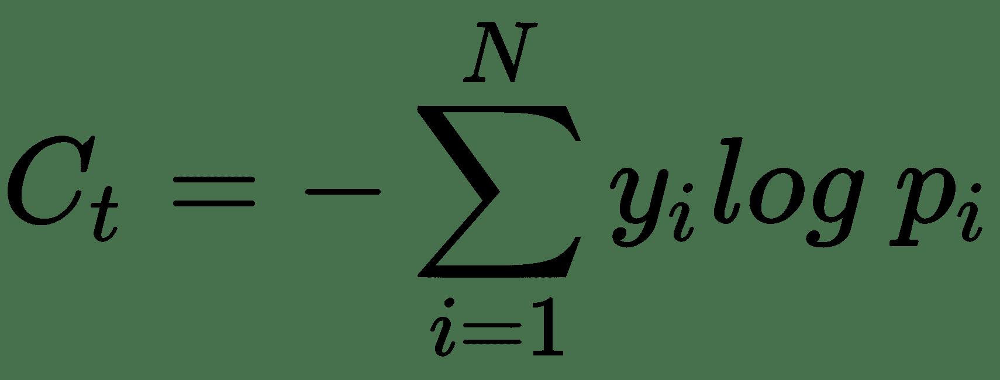

# 用于客户服务的会话式 AI 聊天机器人

会话式聊天机器人最近因其在增强客户体验方面的作用而大肆宣传。 现代企业已经开始在几个不同的过程中使用聊天机器人的功能。 由于对话式 AI 的广泛接受，填写表格或通过互联网发送信息的繁琐任务变得更加简化。 对话型聊天机器人的理想品质之一是，它应该能够在当前上下文中响应用户请求。 对话型聊天机器人系统中的参与者分别是用户和机器人。 使用对话型聊天机器人有很多优点，如下表所示：

*   **个性化帮助**：为所有客户创建个性化体验可能是一项繁琐的任务，但如果不这样做，则会使企业蒙受损失。 对话型聊天机器人是向每个客户提供个性化体验的便捷替代方法。
*   **全天候支持**：使用客户服务代表 24/7 的费用很高。 在非工作时间使用聊天机器人提供客户服务消除了雇用额外客户代表的麻烦。
*   **一致性响应**：聊天机器人提供的响应可能是一致的，而不同客户服务代表对相同问题的响应可能会有所不同。 如果客户对客户服务代表提供的答案不满意，则无需多次拨打电话。
*   **耐心**：虽然客户服务代表在与客户打交道时可能会失去耐心，但这对于聊天机器人来说是不可能的。
*   **查询记录**：与人类客户服务代表相比，聊天机器人在查询记录方面效率更高。

聊天机器人不是最近才出现的东西，其起源可以追溯到 1950 年代。 在第二次世界大战之后，艾伦·图灵（Alan Turing）开发了**图灵测试**，以查看人是否可以将人与机器区分开。 多年后的 1966 年，约瑟夫·魏曾鲍姆（Joseph Weizenbaum）开发了一些名为 *Eliza* 的软件，该软件模仿了心理治疗师的语言。 该工具仍位于[这个页面](http://psych.fullerton.edu/mbirnbaum/psych101/Eliza.htm)中。

聊天机器人可以执行各种各样的任务，下面的列表中显示了其中的一些任务，以强调其多函数式：

*   回答有关产品的查询
*   向客户提供建议
*   进行句子补全活动
*   会话聊天机器人
*   与客户协商价格并参与投标

很多时候，企业很难确定是否需要聊天机器人。 企业是否需要聊天机器人可以通过“图 8.1”中的流程图确定：


图 8.1：客户参与模型

作为本章的一部分，我们将涵盖以下主题：

*   聊天机器人架构
*   用于聊天机器人的 LSTM 序列到序列模型
*   为 Twitter 支持聊天机器人构建序列到序列模型

# 技术要求

您将需要具备 Python 3，TensorFlow 和 Keras 的基础知识

[可以在 GitHub 上找到本章的代码文件](https://github.com/PacktPublishing/Intelligent-Projects-using-Python/tree/master/Chapter08)

[观看以下视频，查看运行中的代码](http://bit.ly/2G9AyoB)

# 聊天机器人架构

聊天机器人的核心组件是其自然语言处理框架。 聊天机器人使用自然语言处理通过通常称为**解析**的过程来处理呈现给他们的数据。 然后解析解析的用户输入，并根据用户的需求（从输入中解密），将适当的响应发送回用户。 聊天机器人可能需要从知识库和历史交易数据存储中寻求帮助，以适当地处理用户的请求。

聊天机器人可以大致分为以下两类：

*   **基于检索的模型**：这些模型通常依赖于查找表或知识库来从预定义的答案集中选择答案。 尽管这种方法看起来很幼稚，但是生产中的大多数聊天机器人都是这种类型的。 当然，从查找表或知识库中选择最佳答案可能会有各种复杂程度。
*   **生成模型**：生成模型可即时生成响应，而不是采用基于查找的方法。 它们主要是概率模型或基于机器学习的模型。 直到最近，马尔可夫链大多被用作生成模型。 然而，随着深度学习的最新成功，基于循环神经网络的方法越来越受欢迎。 通常，RSTM 的 LSTM 版本被用作聊天机器人的生成模型，因为它更擅长处理长序列。

基于检索的模型和生成模型都具有各自的优缺点。 由于基于检索的模型从一组固定的答案中进行回答，因此它们无法处理看不见的问题或没有适当预定义响应的请求。 生成模型要复杂得多。 他们可以了解用户输入中的实体并生成类似人的响应。 但是，它们很难训练，并且通常需要更多的数据来训练。 他们还容易犯语法错误，而基于检索的模型则不会犯这些语法错误。

# 使用 LSTM 的序列到序列模型

序列到序列模型架构非常适合捕获客户输入的上下文，然后基于该上下文生成适当的响应。 “图 8.2”显示了一个序列到序列模型框架，该框架可以像聊天机器人那样回答问题：


图 8.2：使用 LSTM 的序列到序列模型

从上图（“图 8.2”）中可以看出，**编码器 LSTM** 接受单词的输入序列，并将其编码为隐藏状态向量`h`和单元状态向量`c`。 向量`h`和`c`是 LSTM 编码器最后一步的隐藏状态和单元状态。 它们本质上将捕获整个输入句子的上下文。

然后，以`h`和`c`形式的编码信息作为其初始隐藏状态和单元状态被馈送到**解码器 LSTM** 。 每个步骤中的**解码器 LSTM** 尝试预测以当前单词为条件的下一个单词。 这意味着，**解码器 LSTM** 的每个步骤的输入都是当前字。

为了预测第一个单词，LSTM 将提供一个虚拟的起始关键字`<BOS>`，它代表句子的开头。 同样， `<EOS>`虚拟关键字表示句子的结尾，并且一旦预测到该句，就应该停止输出生成。

在训练每个目标词的序列到序列模型的过程中，我们知道`apriori`是先前的词，这是**解码器 LSTM** 的输入。 但是，在推理过程中，我们将没有这些目标词，因此我们必须将上一步作为输入。

# 建立序列到序列模型

我们将用于构建聊天机器人的序列到序列模型的架构将对先前在“图 8.2”中说明的基本序列到序列架构进行一些修改。修改后的架构可以在下图中看到（“图 8.3”）：


图 8.3：序列到序列模型

与其将编码器最后一步的隐藏状态`h`和单元状态`c`馈送到**解码器 LSTM** 的初始隐藏状态和单元状态，我们将隐藏状态`h`馈入解码器的每个输入步骤。 为了预测目标词`w[t]`在任何步骤`t`中，输入是先前的目标词`w[t-1]`，`t-1`和隐藏状态`h`。

# Twitter 上的客户支持

现在，我们对如何使用循环神经网络构建聊天机器人有了一些想法，我们将使用 20 个大品牌对客户发布的推文的客户服务响应来构建聊天机器人。 数据集`twcs.zip`位于[这个页面](https://www.kaggle.com/thoughtvector/customer-support-on-twitter)中。每个推文均由`tweet_id`标识，并且推文内容位于`text`字段中。 客户发布的推文可以通过`in_response_to_tweet_id`字段进行标识。 这应该包含客户推文的空值。 对于客户服务推文，此`in_response_to_tweet_id` 字段应指向此推文所针对的客户`tweet_id`。

# 创建用于训练聊天机器人的数据

要提取客户发布的所有入站推文，我们需要将具有`in_response_to_tweet_id` 字段的所有推文作为`null`提取。 如果`in_response_to_tweet_id` 字段不为空，则可以通过推文筛选出包含客户服务代表响应的出站文件。 有了入站和出站文件后，我们需要将它们合并到入站文件的`tweet_id`和出站文件的`in_response_to_tweet_id` 中。 作为回应，这将为我们提供客户发布的`tweets in`以及客户服务代表在回复中发布`tweets out`。 数据创建函数可以编码如下：

```py
    def process_data(self,path):
        data = pd.read_csv(path)

       if self.mode == 'train':
            data = pd.read_csv(path)
            data['in_response_to_tweet_id'].fillna(-12345,inplace=True)
            tweets_in =  data[data['in_response_to_tweet_id'] == -12345]
            tweets_in_out = 
            tweets_in.merge(data,left_on=['tweet_id'],right_on=
            ['in_response_to_tweet_id'])
            return tweets_in_out[:self.num_train_records]
        elif self.mode == 'inference':
            return data

```

# 将文本标记为单词索引

需要将这些推文标记化并转换为数字，然后才能将其发送到神经网络。 **计数向量化器**用于确定固定数量的常见单词，这些单词构成了聊天机器人的词汇空间。 我们还引入了三个新标记，分别表示句子的开头`(START)`，句子的结尾（`PAD`）和任何未知的单词（`UNK`）。 标记推文的函数如下所示，以供参考：

```py
    def tokenize_text(self,in_text,out_text):
        count_vectorizer = CountVectorizer(tokenizer=casual_tokenize, max_features=self.max_vocab_size - 3)
        count_vectorizer.fit(in_text + out_text)
        self.analyzer = count_vectorizer.build_analyzer()
        self.vocabulary = 
        {key_: value_ + 3 for key_,value_ in count_vectorizer.vocabulary_.items()}
        self.vocabulary['UNK'] = self.UNK
        self.vocabulary['PAD'] = self.PAD
        self.vocabulary['START'] = self.START
        self.reverse_vocabulary = 
        {value_: key_ for key_, value_ in self.vocabulary.items()}
        joblib.dump(self.vocabulary,self.outpath + 'vocabulary.pkl')
        joblib.dump(self.reverse_vocabulary,self.outpath + 'reverse_vocabulary.pkl')
        joblib.dump(count_vectorizer,self.outpath + 'count_vectorizer.pkl')
        #pickle.dump(self.count_vectorizer,open(self.outpath + 
        'count_vectorizer.pkl',"wb"))
```

现在，需要将标记化的单词转换为单词索引，以便可以将它们馈送到循环神经网络，如以下代码所示：

```py
def words_to_indices(self,sent):
        word_indices = 
       [self.vocabulary.get(token,self.UNK) for token in self.analyzer(sent)] + 
        [self.PAD]*self.max_seq_len
        word_indices = word_indices[:self.max_seq_len]
        return word_indices
```

我们还希望将循环神经网络预测的单词索引转换为单词以形成句子。 此函数可以编码如下：

```py
 def indices_to_words(self,indices):
        return ' '.join(self.reverse_vocabulary[id] for id in indices if id != self.PAD).strip() 

```

# 替换匿名的屏幕名称

在对推文进行标记之前，可能值得将推文中的匿名屏幕名称替换为通用名称，以使响应更好地泛化。 此函数可以编码如下：

```py
    def replace_anonymized_names(self,data):

        def replace_name(match):
            cname = match.group(2).lower()
            if not cname.isnumeric():
                return match.group(1) + match.group(2)
            return '@__cname__'

        re_pattern = re.compile('(\W@|^@)([a-zA-Z0-9_]+)')
        if self.mode == 'train':

            in_text = data['text_x'].apply(lambda txt:re_pattern.sub(replace_name,txt))
            out_text = data['text_y'].apply(lambda 
            txt:re_pattern.sub(replace_name,txt))
            return list(in_text.values),list(out_text.values)
        else:
            return map(lambda x:re_pattern.sub(replace_name,x),data)

```

# 定义模型

RNN 的 LSTM 版本用于构建序列到序列模型。 这是因为 LSTM 在记住长文本序列中的长期依存关系方面效率更高。 LSTM 架构中的三个门使它能够有效地记住长期序列。 基本的 RNN 无法记住长期依赖关系，因为与其架构相关的梯度问题逐渐消失。

在此模型中，我们使用两个 LSTM。 第一个 LSTM 将输入推文编码为上下文向量。 该上下文向量不过是编码器 LSTM 的最后一个隐藏状态`h ∈ R^n`，`n`是隐藏状态向量的维。 输入推文`x ∈ R^k`作为单词索引序列被馈送到编码器 LSTM，`k`就是输入推文的序列长度。 这些单词索引在馈送到 LSTM 之前已映射到单词嵌入`w ∈ R^m`。 单词嵌入包含在一个嵌入矩阵中`[W ∈ R^(m x N)]`，其中`N`表示词汇表中单词的数量。

第二个 LSTM 用作解码器。 它试图将编码器 LSTM 创建的上下文向量`h`解码为有意义的响应。 作为此方法的一部分，我们在每个时间步中将上下文向量与前一个单词一起馈入以生成当前单词。 在第一步中，我们没有任何先前的词可用于条件 LSTM，因此我们使用智能体`START`词开始从解码器 LSTM 生成词序列的过程。 在推理过程中，我们在当前时间步输入前一个单词的方式与训练过程中使用的方法不同。 在训练中，由于我们在每个时间步都知道`apriori`之前的单词，因此相应地输入它们没有任何问题。 但是，在推理期间，由于我们在当前时间步上没有实际的前一个单词，因此会反馈前一个时间步上的预测单词。 每个时间步`t`的隐藏状态`h'[t]`在最终的最大 softmax `N`之前通过几个全连接层馈送。 在此 softmax 层中获得最大概率的单词是时间步长的预测单词。 然后将这个字输入到下一步的输入，即解码器 LSTM 的步骤`t + 1`。

Keras 中的`TimeDistributed`函数允许在解码器 LSTM 的每个时间步长获得预测的有效实现，如以下代码所示：

```py
    def define_model(self):

        # Embedding Layer
        embedding = Embedding(
            output_dim=self.embedding_dim,
            input_dim=self.max_vocab_size,
            input_length=self.max_seq_len,
            name='embedding',
        )

        # Encoder input

        encoder_input = Input(
            shape=(self.max_seq_len,),
            dtype='int32',
            name='encoder_input',
        )

        embedded_input = embedding(encoder_input)

        encoder_rnn = LSTM(
            self.hidden_state_dim,
            name='encoder',
            dropout=self.dropout
        )
        # Context is repeated to the max sequence length so that the same context 
        # can be feed at each step of decoder
        context = RepeatVector(self.max_seq_len)(encoder_rnn(embedded_input))

        # Decoder    
        last_word_input = Input(
            shape=(self.max_seq_len,),
            dtype='int32',
            name='last_word_input',
        )

        embedded_last_word = embedding(last_word_input)
        # Combines the context produced by the encoder and the last word uttered as 
        inputs
        # to the decoder.

        decoder_input = concatenate([embedded_last_word, context],axis=2)

        # return_sequences causes LSTM to produce one output per timestep instead of 
        one at the
        # end of the intput, which is important for sequence producing models.
        decoder_rnn = LSTM(
            self.hidden_state_dim,
            name='decoder',
            return_sequences=True,
            dropout=self.dropout
        )

        decoder_output = decoder_rnn(decoder_input)

        # TimeDistributed allows the dense layer to be applied to each decoder output    
       per timestep
        next_word_dense = TimeDistributed(
            Dense(int(self.max_vocab_size/20),activation='relu'),
            name='next_word_dense',
        )(decoder_output)

        next_word = TimeDistributed(
            Dense(self.max_vocab_size,activation='softmax'),
            name='next_word_softmax'
        )(next_word_dense)

        return Model(inputs=[encoder_input,last_word_input], outputs=[next_word])

```

# 训练模型的损失函数

对模型进行分类交叉熵损失训练，以预测解码器 LSTM 的每个时间步中的目标单词。 任何步骤中的分类交叉熵损失都将遍及词汇表的所有单词，并且可以表示为：



标签`[y[i]], i = 1 -> N`代表目标单词的单热编码版本。 仅对应于实际单词的标签为`1`； 其余为`0`。 项`Pi`表示实际目标单词是由`i`索引的单词的概率。 为了获得每个输入/输出推特对的总损失`C`，我们需要对解码器 LSTM 的所有时间步长上的损失求和。 由于词汇量可能会变得很大，因此在每个时间步骤中为目标标签创建单热编码向量`y[t] = [y[i]], i = 1 -> n`会很昂贵。 `sparse_categorical_crossentropy`损失在这里变得非常有益，因为我们不需要将目标单词转换为单热编码向量，而只需输入目标单词的索引作为目标标签即可。

# 训练模型

该模型可以使用 Adam 优化器进行训练，因为它可靠地提供了稳定的收敛性。 由于 RNN 容易出现梯度问题（尽管这对于 LSTM 来说不是问题），因此，如果梯度太大，则最好将其剪裁。 可以使用 Adam 优化器和`sparse_categorical_crossentropy`定义和编译给定的模型，如以下代码块所示：

```py
    def create_model(self):
        _model_ = self.define_model()
        adam = Adam(lr=self.learning_rate,clipvalue=5.0)
        _model_.compile(optimizer=adam,loss='sparse_categorical_crossentropy')
        return _model_
```

现在我们已经研究了所有基本函数，可以将训练函数编码如下：

```py
def train_model(self,model,X_train,X_test,y_train,y_test):
        input_y_train = self.include_start_token(y_train)
        print(input_y_train.shape)
        input_y_test = self.include_start_token(y_test)
        print(input_y_test.shape)
        early = EarlyStopping(monitor='val_loss',patience=10,mode='auto')

        checkpoint = 
        ModelCheckpoint(self.outpath + 's2s_model_' + str(self.version) + 
        '_.h5',monitor='val_loss',verbose=1,save_best_only=True,mode='auto')
        lr_reduce =
        ReduceLROnPlateau(monitor='val_loss',factor=0.5, patience=2, verbose=0, 
         mode='auto')
        model.fit([X_train,input_y_train],y_train, 
              epochs=self.epochs,
              batch_size=self.batch_size, 
              validation_data=[[X_test,input_y_test],y_test], 
              callbacks=[early,checkpoint,lr_reduce], 
              shuffle=True)
        return model

```

在`train_model`函数的开头，我们创建`input_y_train`和`input_y_test`，它们分别是`y_train`和`y_test`的副本，并从它们移了一个时间步，以便它们可以用作解码器每个时间步的前一个单词的输入。 这些移位序列的第一个单词是`START`关键字，它在解码器 LSTM 的第一时间步输入。 `include_start_token`定制工具函数如下：

```py
def include_start_token(self,Y):
    print(Y.shape)
    Y = Y.reshape((Y.shape[0],Y.shape[1]))
    Y = np.hstack((self.START*np.ones((Y.shape[0],1)),Y[:, :-1]))
    return Y
```

回到训练函数`train_model`，我们看到如果`10`周期的损失没有减少，可以使用`EarlyStopping`回调工具启用提前停止。 类似地，如果误差没有在两个周期内减少，则`ReduceLROnPlateau`回调会将现有学习率降低一半（`0.5`）。 只要误差在某个周期减少，就会通过`ModelCheckpoint`回调保存模型。

# 从模型生成输出响应

训练完模型后，我们要使用它来生成给定输入鸣叫的响应。 可以通过以下步骤完成此操作：

1.  用通用名称替换输入推文中的匿名屏幕名称。
2.  将修改后的输入推文转换为单词索引。
3.  将单词索引输入到编码器 LSTM，将`START`关键字输入到解码器 LSTM，以生成第一个预测的单词。 从下一步开始，输入上一个时间步的预测单词，而不是`START`关键字。
4.  继续执行此操作，直到预测到句子结尾关键字。 我们用`PAD`表示了这一点。
5.  查看逆词汇词典，从预测的单词索引中获取单词。

以下代码中提供了`respond_to_input`函数，该函数可以在给定输入鸣叫的情况下完成生成输出序列的工作：

```py
def respond_to_input(self,model,input_sent):
        input_y = self.include_start_token(self.PAD * np.ones((1,self.max_seq_len)))
        ids = np.array(self.words_to_indices(input_sent)).reshape((1,self.max_seq_len))
        for pos in range(self.max_seq_len -1):
            pred = model.predict([ids, input_y]).argmax(axis=2)[0]
            #pred = model.predict([ids, input_y])[0]
            input_y[:,pos + 1] = pred[pos]
        return self.indices_to_words(model.predict([ids,input_y]).argmax(axis=2)[0])

```

# 全部放在一起

综上所述，`main`函数可以定义为具有两个流程：一个用于训练，另一个用于推理。 即使在训练函数中，我们也会对输入的推文序列生成一些响应，以检查我们对模型的训练程度。 以下代码显示`main`函数供参考：

```py
    def main(self):
        if self.mode == 'train':

            X_train, X_test, y_train, y_test,test_sentences = self.data_creation()
            print(X_train.shape,y_train.shape,X_test.shape,y_test.shape)
            print('Data Creation completed')
            model = self.create_model()
            print("Model creation completed")
            model = self.train_model(model,X_train,X_test,y_train,y_test)
            test_responses = self.generate_response(model,test_sentences)
            print(test_sentences)  
            print(test_responses)
            pd.DataFrame(test_responses).to_csv(self.outpath + 
            'output_response.csv',index=False)

        elif self.mode == 'inference':

            model = load_model(self.load_model_from)
            self.vocabulary = joblib.load(self.vocabulary_path)
            self.reverse_vocabulary = joblib.load(self.reverse_vocabulary_path)
            #nalyzer_file = open(self.analyzer_path,"rb")
            count_vectorizer = joblib.load(self.count_vectorizer_path)
            self.analyzer = count_vectorizer.build_analyzer()
            data = self.process_data(self.data_path)
            col = data.columns.tolist()[0]
            test_sentences = list(data[col].values)
            test_sentences = self.replace_anonymized_names(test_sentences)
            responses = self.generate_response(model,test_sentences)
            print(responses)
            responses.to_csv(self.outpath + 'responses_' + str(self.version) + 
            '_.csv',index=False)
```

# 调用训练

可以通过运行带有多个参数的`chatbot.py`（请参见 GitHub 中此项目的代码）模块来调用训练，如以下命令所示：

```py
python chatbot.py --max_vocab_size 50000 --max_seq_len 30 --embedding_dim 100 --hidden_state_dim 100 --epochs 80 --batch_size 128 --learning_rate 1e-4 --data_path /home/santanu/chatbot/data/twcs.csv --outpath /home/santanu/chatbot/ --dropout 0.3 --mode train --num_train_records 50000 --version v1
```

以下是一些重要的论据，以及它们的描述和用于调用聊天机器人序列到序列模型的训练的使用值：

| **参数** | **说明** | **用于训练的值** |
| --- | --- | --- |
| `max_vocab_size` | 词汇中的单词数 | `50,000` |
| `max_seq_len` | 应被限制到 LSTM 的推文的最大长度 | `30` |
| `hidden_state_dim` | LSTM 的隐藏状态`h`的大小 | `100` |
| `embedding_dim` | 词嵌入的维度 | `100` |
| `learning rate` | 用于优化程序的起始学习率 | `0.0001` |
| `dropout` | 用于正则化目的的丢弃 | `0.3` |
| `Mode` | 训练/推理 | 对于训练，请使用`train`；对于推理，请使用`inference` |

# 对某些输入推文的推断结果

训练后的序列到序列模型响应于某些输入推文生成了一些相关的推文。 以下命令显示了示例推断命令。 `data_path`参数包含测试输入推文的位置：

```py
python chatbot.py --max_vocab_size 50000 --max_seq_len 30 --embedding_dim 100 --hidden_state_dim 100  --data_path /home/santanu/chatbot/data/test.csv --outpath /home/santanu/chatbot/ --dropout 0.3 --mode inference --version v1 --load_model_from /home/santanu/chatbot/s2s_model_v1_.h5  --vocabulary_path /home/santanu/chatbot/vocabulary.pkl --reverse_vocabulary_path /home/santanu/chatbot/reverse_vocabulary.pkl --count_vectorizer_path /home/santanu/chatbot/count_vectorizer.pkl
```

推断结果如下表所示：

| Tweet in | Tweet out |
| --- | --- |
| `@sprintcare` is the worst customer service. | `@__cname__` Hey there! Can you dm us your account's email address? We'll take a look backstage / dn https://t.co/ldfdzrinat. |
| `@__cname__` Y'all lie about your great connection. 5 bars LTE, still won't load something. Smh. | `@__cname__` We apologize for the trouble. Please send us a dm with your email address so we can connect. |
| `@__cname__` Whenever I contact customer support, they tell me I have shortcode enabled on my account, but I have never in the 4 years I've tried https://t.co/0G98RtNxPK. | `@__cname__` Hi there, we are sorry to hear this. Please send us a dm with your email address and phone number so we can look into this for. |
| Actually that's a broken link you sent me and incorrect information https://t.co/V4yfrHR8VI. | `@__cname__` Hi, we are sorry to hear this. Please dm us your contact info and we'll be happy to help. ^ kk |
| Yo `@Ask_Spectrum`, your customer service reps are super nice— but imma start trippin if y'all don't get my service going! | `@__cname__` We apologize for the trouble. Please send us a dm with your email address so we can connect. |
| My picture on `@Ask_Spectrum` pretty much every day. Why should I pay $171 per month? https://t.co/U6ptkQa5Ik. | `@__cname__` Hi, we are sorry to hear this. Please dm us your contact info and we'll be happy to help. ^ kk |
| Somebody from `@VerizonSupport` please help me �������� I'm having the worst luck with your customer service. | `@__cname__` We apologize for the trouble. Please dm us your contact info and phone number so we can assist. |
| `@VerizonSupport` My friend is without internet we need to play video games together please our skills diminish every moment without internetz. | `@__cname__` Hey there! Can you dm us your account's email address? we'll take a look backstage / dn https://t.co/ldfdzrinat |
| `@__cname__` tried to pay a bill for 60 days. No service, rude CS, and several transfers. Look up my equipment # and give me an acct #! | `@__cname__` Hi, we are sorry to hear this. Please dm us your contact info and we'll be happy to help. ^ kk |
| `@__cname__` is the worst ISP I've ever had. | `@__cname__` Hey there! Can you dm us your account's email address? We'll take a look backstage / dn https://t.co/ldfdzrinat |
| `@__cname__` fix your app it won't even open. | `@__cname__` Hi there! We don't have any info on this issue. Please send us a dm with your name and phone number and the full service address. |

# 总结

现在，我们到本章的结尾。 看完本章中说明的与聊天机器人和序列到序列模型相关的各种概念之后，读者现在应该能够构建自己的聊天机器人实现并以有趣的方式对其进行扩展。 众所周知，序列到序列模型不仅适用于聊天机器人，还适用于整个自然语言处理领域，例如机器翻译。 本章的代码位于 [GitHub](https://github.com/PacktPublishing/Python-Artificial-Intelligence-Projects/tree/master/Chapter08)。

在下一章中，我们将使用强化学习来使赛车学习如何独立驾驶。 我们非常期待你的参与。