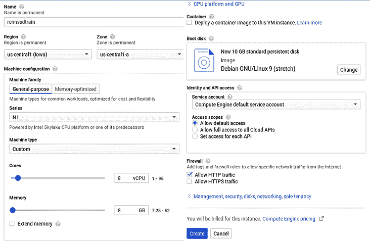
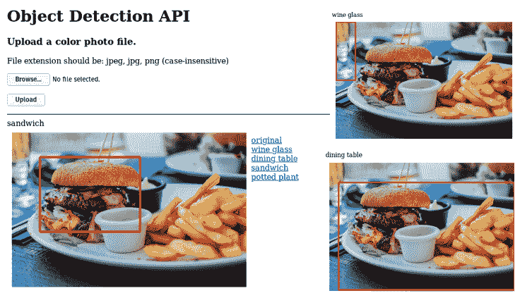
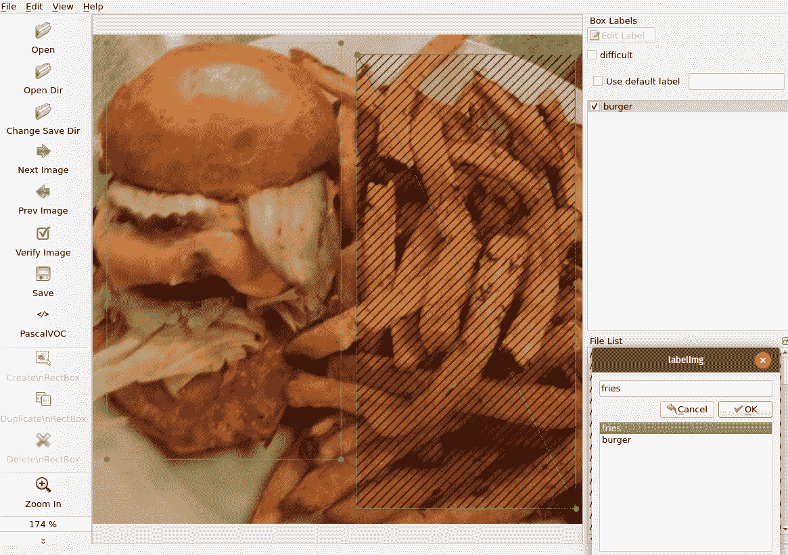
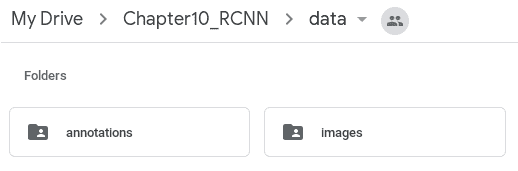
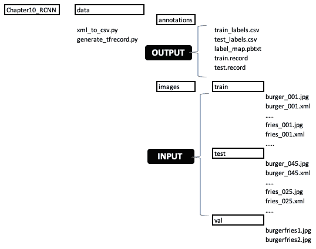
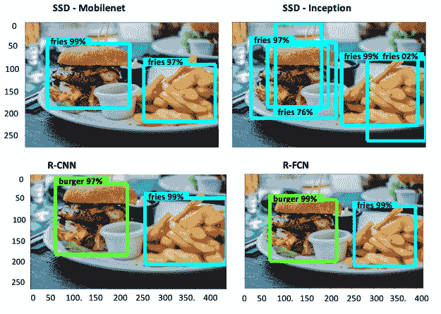

# 十、R-CNN，SSD 和 R-FCN 对象检测

在“第 7 章”，“使用 YOLO 进行对象检测”中，我们了解了 YOLO 对象检测，然后在前两章中，我们了解了动作识别和图像修补。 本章通过为数据摄取和训练流水线以及模型开发奠定坚实的基础，标志着**端到端**（**E2E**）对象检测框架的开始。 在这里，我们将深入了解各种对象检测模型，例如 R-CNN，**单发检测器**（**SSD**），**基于区域的全卷积网络**（**R-FCN**）和 Mask R-CNN，并使用 Google Cloud 和 Google Colab 笔记本执行动手练习。 我们还将针对如何训练自己的自定义图像以使用 TensorFlow 对象检测 API 开发对象检测模型进行详细的练习。 我们将在本章结束时对各种对象跟踪方法进行深入概述，并使用 Google Colab 笔记本进行动手练习。

本章分为八个小节：

*   SSD 概述
*   R-FCN 概述
*   TensorFlow 对象检测 API 概述
*   在 Google Cloud 上使用 TensorFlow 检测对象
*   使用 TensorFlow Hub 检测对象
*   使用 TensorFlow 和 Google Colab 训练自定义对象检测器
*   Mask R-CNN 概述和 Google Colab 演示
*   开发对象跟踪器模型来补充对象检测器

# SSD 概述

SSD 是一种非常快速的对象检测器，非常适合部署在移动设备和边缘设备上以进行实时预测。 在本章中，我们将学习如何使用 SSD 开发模型，在下一章中，我们将评估在边缘设备上部署时的表现。 但是在详细介绍 SSD 之前，我们将快速了解到目前为止我们在本书中了解的其他对象检测器模型。

我们在“第 5 章”，“神经网络架构和模型”中了解到，Faster R-CNN 包含 21,500 个区域提议（`60 x 40`滑动窗口和 9 个锚定框），这些建议被扭曲为 2K 固定层。 这些 2K 层被馈送到全连接层和包围盒回归器，以检测图像中的包围盒。 9 个锚框来自 3 个比例尺，框面积分别为`128^2`，`256^2`，`512^2`和三个长宽比：1:1、1:2 和 2:1。

9 个锚点框的说明如下：

```py
128x128:1:1; 128x128:1:2; 128x128:2:1
256x256:1:1; 256x256:1:2; 256x256:2:1
512x512:1:1; 512x512:1:2; 512x512:2:1
```

在“第 7 章”，“使用 YOLO 进行对象检测”中，我们了解到 YOLO 使用单个 CNN，该 CNN 同时预测整个图像中对象的多个边界框。 YOLO v3 检测分为三层。 YOLO v3 使用 9 个锚点：`(10, 13)`，`(16, 30)`，`(33, 23)`，`(30, 61)`，`(62, 45)`，`(59, 119)`，`(116, 90)`，`(156, 198)`，`(373, 326)`。 此外，YOLO v3 使用 9 个掩码，这些掩码链接到锚点，如下所述：

*   **第一层**：遮罩：6、7、8； 对应的锚点：`(116, 90)`，`(156, 198)`，`(373, 326)`
*   **第二层**：遮罩：3、4、5； 对应的锚点：`(30, 61)`，`(62, 45)`，`(59, 119)`
*   **第三层**：遮罩：0、1、2； 对应的锚点：`(10, 13)`，`(16, 30)`，`(33, 23)`

SSD 于 2016 年由 Liu Wei，Dragomir Anguelov，Dumitru Erhan，Christian Szegedy，Scott Reed，傅成扬和 Alexander C.Berg 在题为[《SSD：单发多框检测器》](https://arxiv.org/abs/1512.02325)提出。

它的速度比 Faster R-CNN 快，但其准确率与 YOLO 相比。 改进来自消除区域提议并将小型卷积过滤器应用于特征映射，以预测不同比例的多层。

SSD 的主要功能概述如下：

*   SSD 原始论文使用 VGG16 作为基础网络提取特征层，但也可以考虑使用其他网络，例如 Inception 和 ResNet。
*   SSD 在基础网络之上添加了另外六个功能层，由`conv4_3`，`conv7`（`fc7`），`conv8_2`，`conv9_2`，`conv10_2`和`conv11_2`组成，用于对象检测。
*   一组默认框与每个特征映射单元相关联，因此默认框位置相对于特征映射单元是固定的。 每个默认框都会预测`c`类中每个类别的得分以及相对于地面真实情况的四个偏移，从而产生`(c + 4)k`过滤器。 这些过滤器应用于特征映射（大小为`m x n`），产生`(c + 4)kmn`输出。 下表说明了这一点。 SSD 的独特之处在于默认框适用于不同分辨率的多个特征映射：

| **层名称** | **检测** | **过滤器输出** |
| --- | --- | --- |
| `Conv4_3` | `38 x 38 x 4 = 5776` | `3 x 3 x 4 x (c + 4)` |
| `Conv7` | `19 x 19 x 6 = 2166` | `3 x 3 x 6 x (c + 4)` |
| `Conv8_2` | `10 x 10 x 6 = 600` | `3 x 3 x 6 x (c + 4)` |
| `Conv9_2` | `5 x 5 x 6 = 150` | `3 x 3 x 6 x (c + 4)` |
| `Conv10_2` | `3 x 3 x 4 = 36` | `3 x 3 x 4 x (c + 4)` |
| `Conv11_2` | 4 |  |
| 总 | 8732 |  |

*   默认框的设计是使用比例因子和宽高比创建的，因此特定尺寸（基于真实情况预测）的特征映射与对象的特定比例相匹配。
*   比例范围可以从`smin(0.2)`到`smax(0.95)`线性变化，而纵横比（`ar`）可以取五个值（`1`，`2`，`0.5`，`3.0`和`0.33`） ，其中`k`在`1`和`m`之间变化。
*   对于长宽比`1`，添加了一个附加的默认框。 因此，每个特征映射位置最多有六个默认框。
*   默认框中心的坐标为`((i+0.5)/|fk|, (j+0.5)/|fk|)`，其中`|fk|`是`kth`正方形特征映射的大小，`i`和`j`的值从`0`到`|fk|`不等。 对六个默认框的每个重复此操作。
*   SSD 通过将给定比例和宽高比的默认框与地面真实物体的默认框匹配，并消除不匹配的框，从而预测各种物体的大小和形状。 默认框与地面真值对象的匹配是通过 Jaccard 重叠（也称为**交并比**与 **IOU**）完成的，这在第 7 章，“使用 YOLO 进行对象检测”中。 例如，如果图像由`human`和`bus`组成并且都具有不同的宽高比和比例，则 SSD 显然可以识别两者。 问题出现在两个类别彼此接近且纵横比相同时，我们将在后面看到。
*   使用 R-CNN，区域提议网络执行筛选以限制被视为 2K 的样本数量。 另一方面，SSD 没有区域提议，因此它会生成大量的边界框（如我们先前所知，为 8,732 个），其中许多都是负面示例。 SSD 拒绝了额外的负面示例，它使用硬性负面挖掘来使正面与负面之间的平衡保持至多 3：1。 硬否定挖掘是一种用于使用置信度损失进行排序以便保留最高值的技术。
*   SSD 使用非最大抑制来选择给定类别具有最高置信度的单个边界框。 非最大抑制的概念在“第 7 章”，“使用 YOLO 进行对象检测”中。 非最大抑制算法以最高的概率选择对象类别，并丢弃 IOU 大于`0.5`的所有边界框。
*   SSD 还通过获取假阴性图像作为训练期间的输入来使用硬性阴性挖掘。 SSD 保持负数与正数之比为 3:1。
*   为了进行训练，使用以下参数：`300x300`或`512x512`图像大小，`10^(-3)`的学习率为 40,000 次迭代，`10^(-4)`至`10^(-5)`的学习率为随后的 10,000 次迭代，衰减率为`0.0005`和`0.9`的势头。

# R-FCN 概述

R-FCN 比 R-CNN 与 SSD 更相似。 R-FCN 由主要由 Microsoft Research 组成的团队于 2016 年开发，该团队由戴继峰，李毅，何凯明和孙健组成，题为《R-FCN：通过基于区域的全卷积网络进行对象检测》。 您可以在[这个页面](https://arxiv.org/abs/1605.06409)上找到该论文的链接。

R-FCN 也基于区域提议。 与 R-CNN 的主要区别在于，R-FCN 一直等到最后一层，然后应用选择性池提取特征以进行预测，而不是从 2K 区域提议网络开始。 在本章中，我们将使用 R-FCN 训练自定义模型，并将最终结果与其他模型进行比较。 下图描述了 R-FCN 的架构：


在上图中，汽车的图像通过 ResNet-101 生成了特征映射。 请注意，我们在“第 4 章”，“基于图像的深度学习”中使用，它介绍了如何可视化**卷积神经网络**（**CNN**）及其特征映射。 这种技术本质上是相同的。 然后，我们在特征映射内获取`k x k`内核（在此图像中，`k = 3`），并将其在图像上滑动以创建`k^2(C+1)`得分图。 如果得分图包含一个对象，则我们投票`yes`，否则，我们投票`no`。 展平不同区域之间的投票以创建 softmax 层，该层被映射到对象类别以进行检测。

R-FCN 的主要功能如下所述：

*   类似于 R-CNN，在整个图像上计算出全卷积**区域提议网络**（**RPN**）。
*   R-FCN 并未像 R-CNN 那样将 2K 扭曲区域发送到全连接层，而是在预测之前使用了特征的最后卷积层。
*   减去平均池化层和全连接层的 ResNet-101 用于特征提取。 因此，仅卷积层用于计算特征映射。 ResNet-101 中的最后一个卷积块具有 2,048 个维，将其传递到 1,024 维的`1×1`卷积层以进行维降。
*   1,024 个卷积层产生一个`k^2`得分图，它对应于`k^2(C + 1)`通道输出，带有`C`对象类别加上背景。
*   应用选择性合并从`k^2`得分图中仅从得分图中提取响应。
*   这种从最后一层提取特征的方法可最大程度地减少计算量，因此 R-FCN 甚至比 Faster R-CNN 更快。
*   对于边界框回归，在`4k^2`卷积层上使用平均池，从而为每个关注区域层生成`4k^2`维向量。 来自每个`k^2`层的`4k^2`向量被聚合为四维向量，该向量将边界框的位置和几何形状表征为`x`，`y`，宽度和高度 。
*   为了进行训练，使用以下参数：衰减率为`0.0005`，动量为`0.9`，将图像调整为高度为`600`像素，20,000 批量的学习率为`0.001`和`0.0001` 10,000 个批量。

# TensorFlow 对象检测 API 概述

可以在[这里](https://github.com/tensorflow/models/tree/master/research/object_detection)找到 TensorFlow 对象检测 API。 在撰写本书时，TensorFlow 对象检测 API 仅适用于 TensorFlow 版本 1.x。 在终端中下载 TensorFlow 1.x 时，它将`models/research/object detection`目录安装到您的 PC。 如果您的 PC 上装有 TensorFlow 2.0，则可以从 [GitHub](https://github.com/tensorflow/models/tree/master/research) 下载研究目录。

TensorFlow 对象检测 API 具有预先训练的模型，[您可以使用网络摄像头对其进行检测](https://tensorflow-object-detection-api-tutorial.readthedocs.io/en/latest/camera.html)以及[有关自定义图片的示例训练](https://tensorflow-object-detection-api-tutorial.readthedocs.io/en/latest/training.html)。 浏览前两个链接，然后自己尝试，然后返回下一部分。

在本章中，我们将使用 TensorFlow 对象检测器执行以下任务：

*   使用 Google Cloud 和 Coco 数据集上的预训练模型进行对象检测
*   使用 TensorFlow Hub 和 Coco 数据集上的预训练模型进行对象检测
*   使用迁移学习训练 Google Colab 中的自定义对象检测器

在所有这些示例中，我们将使用汉堡和薯条数据集进行检测和预测。

# 在 Google Cloud 上使用 TensorFlow 检测对象

以下说明介绍了如何使用 Google Cloud 上的 TensorFlow 对象检测 API 来检测对象。 为此，您必须具有 Gmail 和 Google Cloud 帐户。 提交信用卡信息后，根据地区的不同，Google Cloud 可以在有限的时间内免费提供访问权限。 此免费访问权限应涵盖此处列出的练习。 请按照以下步骤在 Google Cloud Console 中创建**虚拟机**（**VM**）实例。 需要 VM 来运行 TensorFlow 对象检测 API 并进行推断：

1.  登录到您的 Gmail 帐户，然后转到 [h](https://cloud.google.com/solutions/creating-object-detection-application-tensorflow) [ttps：//cloud.google.com/solutions/creating-object-detection-application-tensorflow](https://cloud.google.com/solutions/creating-object-detection-application-tensorflow) 。

2.  创建一个项目，如下面的屏幕快照所示。 在这里，`R-CNN-trainingpack`是我的项目的名称。 您的项目名称可能会有所不同。
3.  按照[启动 VM 实例]下的 10 条说明进行操作-在“步骤 12”之后的屏幕快照中也进行了说明。
4.  在 Google Cloud Console 中，导航到“VM 实例”页面。
5.  点击顶部的“创建实例”。 它应该带您到另一个页面，您必须在其中输入实例名称。
6.  以小写字母输入实例的名称。 请注意，实例名称与项目名称不同。
7.  单击“计算机类型”，然后选择`n1-standard-8`（8vCPU，30 GB 内存）。
8.  单击“自定义”，然后调整水平条以将“计算机类型”设置为 8 个 vCPU，将“内存”设置为 8GB，如以下屏幕截图所示。
9.  选择“防火墙”下的“允许 HTTP 通信”。
10.  在防火墙下，您将看到管理，安全性，磁盘，网络，唯一租赁链接，如屏幕快照所示，该屏幕快照说明了创建 VM 实例的步骤。 单击它，然后单击“网络”选项卡。
11.  在“网络”选项卡中，选择“网络接口”部分。 接下来，在“网络接口”部分中，我们将通过在“外部 IP”下拉列表中分配一个新 IP 地址来分配静态 IP 地址。 给它起一个名字（例如`staticip`），然后单击“保留”。
12.  完成所有这些步骤之后，请检查并确保已按照说明填充所有内容，然后单击“创建”（如以下屏幕截图所示）以创建 VM 实例。

以下屏幕快照显示了在 Google 云平台中创建名为`R-CNN-trainingpack`的项目：


创建项目是第一步，然后我们将在项目中创建一个实例，如下面的屏幕快照所示。 此屏幕快照说明了我们刚刚描述的 VM 实例创建的步骤：



然后，按照以下说明在测试图像上创建对象检测推断：

*   接下来，我们将使用**安全套接字外壳**（**SSH**）客户端通过互联网安全地访问实例。 您将需要输入用户名和密码。 将用户名设置为`username`，将密码设置为`passw0rd`； 请记住，它不是`o`而是`0`，如零。
*   使用[这个页面](https://cloud.google.com/solutions/creating-object-detection-application-tensorflow)上描述的说明，安装 **TensorFlow 对象检测 API** 库和必备包。

正确遵循上述说明并上传图像后，您将获得如下所示的输出：



在此屏幕截图中，检测到了汉堡，酒杯和桌子，但未检测到炸薯条。 在下一节中，我们将看到为什么会这样，然后我们将训练自己的神经网络来检测这两者。

# 使用 TensorFlow Hub 检测对象

在此示例中，我们将从`tfhub`导入 TensorFlow 库，并使用它来检测对象。 [TensorFlow Hub](https://www.tensorflow.org/hub) 是一个库，其中的代码可用并且可以用于计算机视觉应用。 该代码是从 [TensorFlow Hub](https://github.com/tensorflow/hub/blob/master/examples/colab/object_detection.ipynb) 中提取的，但图像是在本地插入的，而不是云端。

可以在[这个页面](https://github.com/PacktPublishing/Mastering-Computer-Vision-with-TensorFlow-2.0/blob/master/Chapter10/Chapter10_Tensorflow_Object_detection_API.ipynb)中找到用于此练习的修改后的代码。

在这里，我们通过导入`tensorflow_hub`和`six.moves`安装 TensorFlow 库。 `six.moves`是一个 Python 模块，用于提供 Python 2 和 Python 3 之间的通用包。它显示图像并在图像上绘制边框。 在通过检测器之前，图像将转换为数组。 检测器是直接从集线器加载的模块，该模块在后台执行所有神经网络处理。 以下显示了在两种不同模型的`tfhub`上运行示例图像时的输出：


如您所见，具有 Inception 和 ResNet 作为特征提取器的 R-CNN 可以正确预测汉堡包和炸薯条以及许多其他对象。 具有 MobileNet 模型的 SSD 可以检测到汉堡，但无法检测到薯条-将其分类为`snacks`类别。 当我们训练自己的对象检测器并开发自己的模型并基于此进行推论时，我们将在下一部分中了解更多信息。

# 使用 TensorFlow 和 Google Colab 训练自定义对象检测器

在本练习中，我们将使用 TensorFlow 对象检测 API 使用四种不同的模型训练自定义对象检测器。 **Google Colab** 是在 Google 服务器上运行的 VM，因此 TensorFlow 的所有包都得到了适当的维护和更新：

| **序号** | **模型** | **特征提取器** |
| --- | --- | --- |
| 1 | 更快的 R-CNN | Inception |
| 2 | SSD | MobileNet |
| 3 | SSD | Inception |
| 4 | R-FCN | ResNet-101 |

请注意，在撰写本书时，TensorFlow 对象检测 API 尚未迁移到 TensorFlow 2.x，因此请在 Google Colab 默认版本 TensorFlow 1.x 上运行此示例。 您可以通过键入`%tensorflow_version 2.x`在 Google Colab 中安装 TensorFlow 2.x，但是对象检测 API 会导致错误。 该演示练习安装了 TenorFlow 1.14 版和 numpy 1.16 版。

我们将在此练习中使用迁移学习，首先从在 Coco 数据集上训练的预训练模型开始，然后在通过我们自己的数据集进行训练的基础上建立迁移学习。 TensorFlow 已经在 ModelZoo GitHub 站点中存储了预训练的模型，该站点可从[这里](https://github.com/tensorflow/models/blob/master/research/object_detection/g3doc/detection_model_zoo.md)获取。 这些模型主要是具有不同特征提取器的 R-CNN，SSD 和 R-FCN。 相应的配置文件可以在[这个页面](https://github.com/tensorflow/models/tree/master/research/object_detection/samples/configs)中找到。

[可可数据集](http://cocodataset.org)具有以下类别：

```py
Person, bicycle, car, motorcycle, airplane, bus, train, truck, boat, traffic light, fire hydrant, stop sign, parking meter, bench, bird, cat, dog, horse, sheep, cow, elephant, bear, zebra, giraffe, backpack, umbrella, handbag, tie, suitcase, frisbee, skis, snowboard, sports, ball, kite, baseball, bat, baseball, glove, skateboard, surfboard, tennis, racket, bottle, wine, glass, cup, fork, knife, spoon, bowl, banana, apple, sandwich, orange, broccoli, carrot, hot dog, pizza, donut, cake, chair, couch, potted plant, bed, dining table, toilet, tv, laptop, mouse, remote, keyboard, cell phone, microwave oven, toaster, sink, refrigerator, book, clock, vase, scissors, teddy bear, hair drier, toothbrush
```

如您所见，Coco 数据集没有`burger`或`French fries`作为类别。 形状接近这些的项目是`sandwich`，`donut`和`carrot`。 因此，我们将获得模型权重，并在我们自己的数据集上使用迁移学习来开发检测器。 GitHub 网站上的 Jupyter 笔记本具有执行 E2E 训练工作的 Python 代码。

训练工作使用 TensorFlow 对象检测 API，该 API 在执行期间调用各种 Python `.py`文件。 经过大量练习，我们发现，最好是使用 Google Colab 笔记本而不是您自己的 PC 来运行此工作。 这是因为许多库都是用 TensorFlow 1.x 版本编写的，需要进行转换才能在 TensorFlow 2.0 中工作。 此处显示了在本地 PC 上使用 Anaconda 运行作业时发生的一些错误示例：

```py
module 'keras.backend' has no attribute 'image_dim_ordering'
self.dim_ordering = K.common.image_dim_ordering()
module 'tensorflow_core._api.v2.image' has no attribute 'resize_images'

rs = tf.image.resize(img[:, y:y+h, x:x+w, :], (self.pool_size, self.pool_size))
 61    outputs.append(rs)
 62
 AttributeError: module 'tensorflow_core._api.v2.image' has no attribute 'resize_images'
```

当作业在 Colab 上的 TensorFlow 中运行时，模块之间的依存关系配置良好。 因此，不会花费很多时间解决许多简单的错误，您可以将时间花在训练开发上，而不是修正错误以开始训练。

在以下部分中，将提供逐步指南，以建立训练组合。 可以在[这个页面](https://github.com/PacktPublishing/Mastering-Computer-Vision-with-TensorFlow-2.0/blob/master/Chapter10/Chapter10_Tensorflow_Training_a_Object_Detector_GoogleColab.ipynb)中找到代码的详细信息。

# 将图像收集并格式化为`.jpg`文件

本节介绍如何处理图像，使其具有相同的格式和大小。 步骤在这里列出：

1.  了解您要使用的类数量，并确保图像具有相等的类分布。 这意味着，例如，如果我们要使用两个类别（`burger`和`french fries`），则图像应包含大约三分之一的汉堡包，三分之一的薯条，以及三分之一两者的混合。 仅具有汉堡的图像和炸薯条的图像而不包含组合的图像是不好的。
2.  确保图像包含不同的方向。 对于具有均匀形状的图像（例如汉堡的圆形）或具有不均匀形状（例如炸薯条）的图像，方向无关紧要，但是对于特定形状（例如汽车，钢笔和船形），不同的方向至关重要。

3.  将所有图像转换为`.jpg`格式。
4.  调整所有图像的大小以供神经网络快速处理。 在此示例中，考虑`416x416`图像大小。 在 Linux 中，您可以使用 ImageMagick 批量调整图像大小。
5.  转换`file.jpg`-将其调整为`416x416`图像尺寸`file.jpg`。
6.  将图像重命名为`classname_00x.jpg`格式。

例如，`dec2f2eedda8e9.jpg`应该转换为`burger_001.jpg`。 将所有图像保存在一个文件夹中。 由于我们的图像包含一个汉堡，炸薯条和一个组合，并且我们的文件总数为 100，因此对于图像文件名，请创建`burger_001 …burger_030.jpg`，`fries_031 …fries_060.jpg`和`comb_061 …comb_100.jpg`三个类。

# 标注图像来创建`.xml`文件

在本节中，我们将描述如何创建标注文件。 每个图像文件对应一个标注文件。 标注文件通常为`.xml`格式。 此处描述了创建标注文件的步骤：

1.  在此步骤中，使用`labelImg`创建标注文件。 此步骤已经在“第 7 章”，“使用 YOLO 的对象检测”中进行了讨论，但此处再次重复。 使用终端命令`pip install labelImg`下载`labelImg`。
2.  下载后，只需在终端中键入`labelImg`即可打开。
3.  定义源（`.jpg`文件）和目标（`.xml`文件）目录。
4.  选择每个图像并在其周围绘制一个矩形。 定义类名称并保存。
5.  如果给定图像中有多个类别，则在每个图像周围绘制一个矩形，并为其分配相关的类别名称。

通常，人们会犯这样的错误：仅在一个类上绘制一个矩形，然后跳过另一个类。 这将导致在推理过程中仅检测到一个类别。

此屏幕快照显示了我们如何在一张图像中标记两个类：



这显示了两个类别-`burger`和`fries`-以及如何使用`labelImg`在它们周围绘制边框。 `labelImg`的输出是`.xml`文件，该文件存储在单独的文件夹中。

每个`.xml`文件中都有相应的`.jpg`文件。 因此，如果稍后手动更改`labelImg`文件名，则文件系统将无法工作，您必须再次重新运行`labelImg`。 同样，如果在`labelImg`操作之后调整图像大小，则标注文件的位置将更改，并且您将必须重新运行`labelImg`。

# 通过训练和测试文件夹分隔文件

在本节中，我们将数据集分为`train`和`test`文件夹。 这是必需的，因为`train`模型使用`train`数据集生成模型，并使用`test`数据集进行验证。 请注意，有时`test`和`val`名称可以互换使用来表示同一事物。 但是总的来说，我们需要第三个文件夹来检查最终模型是否与该模型以前未见过的一些未知图像相对应。 包含这些图像的文件夹称为`val`-稍后将进行讨论。

请按照此处列出的步骤将图像分成`train`和`test`文件夹。 请注意，这些任务将在 Google Colab 上完成：

1.  如果执行上述步骤，则将有两个文件夹-一个用于图像，一个用于标注。 接下来，我们创建两个单独的文件夹-`train`和`test`。
2.  将所有`.jpg`和`.xml`文件复制到任何文件夹中。 因此，现在该文件夹将包含背对背`.jpg`和`.xml`文件。
3.  将文件名类的 70% 的文件（`.jpg`和相应的`.xml`文件）复制到`train`文件夹中。 因此，完成本练习后，`train`文件夹中将有大约 140 个文件（70 个`.jpg`文件和 70 个`.xml`文件）。
4.  将剩余的 30% 的文件复制到`test`文件夹中。
5.  将`train`和`test`文件夹都上传到`data`下的 Google 云端硬盘。
6.  创建一个标题为`val`的验证文件夹，并将所有类中的一些图像插入其中。

请注意，在此示例中，在`train`和`test`文件夹之间使用了 70/30 的比例，但是通常，数字范围可以从 90/10 到 70/30。

7.  在“我的云端硬盘”下（如以下屏幕截图所示），创建一个名为`Chapter10_R-CNN`的文件夹，然后在其中创建一个名为`data`的文件夹：



8.  创建`data`文件夹后，在 Google 云端硬盘中在其中创建两个名为`annotations`和`images`的新文件夹，如图所示。 下一个任务是填充这些目录。

此屏幕快照显示了`Chapter10_R-CNN`中的目录结构和命名约定：



如上图所示的目录结构应在 Google 云端硬盘中建立。 请按照此处描述的格式开始使用：

*   INPUT 代表`images`文件夹，需要提供所有图像数据。 请记住要遵循前面的图中概述的命名约定，并将`.jpg`文件和`.xml`文件上传到相应的目录，如上图所示。

由于大小限制，我们无法将图像数据上传到 GitHub 站点。 因此，本部分中使用的图像可以从[这里](https://www.kaggle.com/kmader/food41)的 Kaggle 食品图像（用于汉堡和薯条样本）下载。 电话并上传。

*   `annotations`是输出文件夹，应为空，并将在下一部分中填写。 不要将`annotations`文件夹与标注图像混淆以创建`.xml`文件。 所有`.xml`文件都放在`images`文件夹中。

# 配置参数并安装所需的包

现在我们的图像准备工作已经完成，我们将开始在 Google Colab 笔记本中进行编码。 第一步是参数配置和获取训练工作所需的包，这涉及模型的类型，训练参数等等。 请按照以下步骤执行此操作：

1.  在继续下一步之前，请将`Chapter10_Tensorflow-Training_a_Object_Detector_GoogleColab.ipynb` Python 文件保存到 Google 云端硬盘，然后将其作为 Colab 笔记本打开。
2.  运行单元格`Configure`参数，然后通过按`Shift + Enter`安装所需的包。
3.  如果一切正常，则应该在以下代码块中看到显示模型配置选择的输出。 以下输出从`config`参数创建测试模型，这是开始构建数据并准备进行测试之前的先决条件：

```py
Running tests under Python 3.6.9: /usr/bin/python3
 [ RUN ] ModelBuilderTest.test_create_experimental_model
 [ OK ] ModelBuilderTest.test_create_experimental_model
 [ RUN ] ModelBuilderTest.test_create_faster_R-CNN_model_from_config_with_example_miner
 [ OK ] ModelBuilderTest.test_create_faster_R-CNN_model_from_config_with_example_miner
 [ RUN ] ModelBuilderTest.test_create_faster_R-CNN_models_from_config_faster_R-CNN_with_matmul
 [ OK ] ModelBuilderTest.test_create_faster_R-CNN_models_from_config_faster_R-CNN_with_matmul
 [ RUN ] ModelBuilderTest.test_create_faster_R-CNN_models_from_config_faster_R-CNN_without_matmul
 [ OK ] ModelBuilderTest.test_create_faster_R-CNN_models_from_config_faster_R-CNN_without_matmul
 [ RUN ] ModelBuilderTest.test_create_faster_R-CNN_models_from_config_mask_R-CNN_with_matmul
 [ OK ] ModelBuilderTest.test_create_faster_R-CNN_models_from_config_mask_R-CNN_with_matmul
 [ RUN ] ModelBuilderTest.test_create_faster_R-CNN_models_from_config_mask_R-CNN_without_matmul
 [ OK ] ModelBuilderTest.test_create_faster_R-CNN_models_from_config_mask_R-CNN_without_matmul
 [ RUN ] ModelBuilderTest.test_create_rfcn_model_from_config
 [ OK ] ModelBuilderTest.test_create_rfcn_model_from_config
 [ RUN ] ModelBuilderTest.test_create_ssd_fpn_model_from_config
 [ OK ] ModelBuilderTest.test_create_ssd_fpn_model_from_config
 [ RUN ] ModelBuilderTest.test_create_ssd_models_from_config
 [ OK ] ModelBuilderTest.test_create_ssd_models_from_config
 [ RUN ] ModelBuilderTest.test_invalid_faster_R-CNN_batchnorm_update
 [ OK ] ModelBuilderTest.test_invalid_faster_R-CNN_batchnorm_update
 [ RUN ] ModelBuilderTest.test_invalid_first_stage_nms_iou_threshold
 [ OK ] ModelBuilderTest.test_invalid_first_stage_nms_iou_threshold
 [ RUN ] ModelBuilderTest.test_invalid_model_config_proto
 [ OK ] ModelBuilderTest.test_invalid_model_config_proto
 [ RUN ] ModelBuilderTest.test_invalid_second_stage_batch_size
 [ OK ] ModelBuilderTest.test_invalid_second_stage_batch_size
 [ RUN ] ModelBuilderTest.test_session
 [ SKIPPED ] ModelBuilderTest.test_session
 [ RUN ] ModelBuilderTest.test_unknown_faster_R-CNN_feature_extractor
 [ OK ] ModelBuilderTest.test_unknown_faster_R-CNN_feature_extractor
 [ RUN ] ModelBuilderTest.test_unknown_meta_architecture
 [ OK ] ModelBuilderTest.test_unknown_meta_architecture
 [ RUN ] ModelBuilderTest.test_unknown_ssd_feature_extractor
 [ OK ] ModelBuilderTest.test_unknown_ssd_feature_extractor
 ----------------------------------------------------------------------
 Ran 17 tests in 0.157s
 OK (skipped=1)
```

# 创建 TensorFlow 记录

这是非常重要的一步，我们许多人为此奋斗。 请按照以下步骤创建您的`tfRecord`文件。 您必须在上一步中安装所有必需的包，然后才能继续执行此步骤：

1.  在上图中的`Chapter10_R-CNN`文件夹下，`data`下有两个文件名为`xml_to_csv.py`并生成`tfrecord.py`。 这些文件应从本地驱动器复制到 Google 云端硬盘。
2.  当您使用`pip install TensorFlow`或`pip install tensorflow-gpu`安装 TensorFlow 时，它将在`home`目录下创建一个`models-master`目录。 在其中，导航到`research`文件夹，然后导航到`object_detection`文件夹，您将找到`xml_to_csv.py`并生成`tfrecord.py`。 如前所述，将它们复制并插入 Google 云端硬盘。 您还可以在本地运行以下步骤，但是使用 TensorFlow 2.0 在本地运行时，我注意到错误，因此对于本练习，我们将在 Google Colab 中运行它。
3.  接下来，我们将 Google 云端硬盘中的`Chapter10_R-CNN`文件夹链接到您的 Colab 笔记本。 这是通过使用以下命令完成的：

```py
from google.colab import drive
drive.mount('/content/drive')
```

4.  完成上述步骤后，系统将提示您输入 Google Drive 密钥，然后在输入密钥后将 Google Drive 装入 Colab 笔记本。
5.  接下来，我们使用以下命令从 Colab 笔记本转到 Google 云端硬盘`Chapter10_R-CNN`目录：

```py
%cd /content/drive/My Drive/Chapter10_R-CNN
```

6.  现在，您可以执行以下步骤来生成`tfRecord`文件。
7.  完全按照所示输入命令。 此命令将所有`.xml`文件从`train`数据转换为`data/annotations`文件夹中的`train_labels.csv`文件：

```py
!python xml_to_csv.py -i data/images/train -o data/annotations/train_labels.csv -l data/annotations
```

8.  此命令将所有`.xml`文件从`test`数据转换为`data/annotations`文件夹中的`test_labels.csv`文件：

```py
!python xml_to_csv.py -i data/images/test -o data/annotations/test_labels.csv
```

9.  该命令从`train_labels.csv`生成`train.record`文件，从`train`文件夹生成图像`jpg`文件。 它还会生成`lable_map.pbtxt`文件：

```py
!python generate_tfrecord.py --csv_input=data/annotations/train_labels.csv --output_path=data/annotations/train.record --img_path=data/images/train --label_map data/annotations/label_map.pbtxt
```

10.  该命令从`test_labels.csv`生成`test.record`文件，从`test`文件夹生成图像`jpg`文件。 它还会生成`lable_map.pbtxt`文件：

```py
!python generate_tfrecord.py --csv_input=data/annotations/test_labels.csv --output_path=data/annotations/test.record --img_path=data/images/test --label_map data/annotations/label_map.pbtx
```

11.  如果一切顺利，那么前面的代码行将生成以下输出。 这表示成功生成了训练和测试`tfRecord`文件。 请注意，扩展名可以是`tfRecord`或`record`：

```py
/content/drive/My Drive/Chapter10_R-CNN
 Successfully converted xml to csv.
 Generate `data/annotations/label_map.pbtxt`
 Successfully converted xml to csv.
 WARNING:tensorflow:From generate_tfrecord.py:134: The name tf.app.run is deprecated. Please use tf.compat.v1.app.run instead.
 WARNING:tensorflow:From generate_tfrecord.py:107: The name tf.python_io.TFRecordWriter is deprecated. Please use tf.io.TFRecordWriter instead.
 W0104 13:36:52.637130 139700938962816 module_wrapper.py:139] From generate_tfrecord.py:107: The name tf.python_io.TFRecordWriter is deprecated. Please use tf.io.TFRecordWriter instead.
 WARNING:tensorflow:From /content/models/research/object_detection/utils/label_map_util.py:138: The name tf.gfile.GFile is deprecated. Please use tf.io.gfile.GFile instead.
 W0104 13:36:52.647315 139700938962816 module_wrapper.py:139] From /content/models/research/object_detection/utils/label_map_util.py:138: The name tf.gfile.GFile is deprecated. Please use tf.io.gfile.GFile instead.
 Successfully created the TFRecords: /content/drive/My Drive/Chapter10_R-CNN/data/annotations/train.record
 WARNING:tensorflow:From generate_tfrecord.py:134: The name tf.app.run is deprecated. Please use tf.compat.v1.app.run instead.
 WARNING:tensorflow:From generate_tfrecord.py:107: The name tf.python_io.TFRecordWriter is deprecated. Please use tf.io.TFRecordWriter instead.
 W0104 13:36:55.923784 140224824006528 module_wrapper.py:139] From generate_tfrecord.py:107: The name tf.python_io.TFRecordWriter is deprecated. Please use tf.io.TFRecordWriter instead.
 WARNING:tensorflow:From /content/models/research/object_detection/utils/label_map_util.py:138: The name tf.gfile.GFile is deprecated. Please use tf.io.gfile.GFile instead.
 W0104 13:36:55.933046 140224824006528 module_wrapper.py:139] From /content/models/research/object_detection/utils/label_map_util.py:138: The name tf.gfile.GFile is deprecated. Please use tf.io.gfile.GFile instead.
 Successfully created the TFRecords: /content/drive/My Drive/Chapter10_R-CNN/data/annotations/test.reco
```

# 准备模型并配置训练管道

接下来，使用以下命令下载并解压缩基本模型。 在“配置参数和安装所需包”部分的配置参数步骤中，已选择模型和相应的配置参数。 可以根据配置参数和批量大小选择四种不同的模型（SSD，Faster R-CNN 和 R-FCN 的两种变体）。 您可以从指示的批量大小开始，并在模型优化期间根据需要进行调整：

```py
MODEL_FILE = MODEL + '.tar.gz'
DOWNLOAD_BASE = 'http://download.tensorflow.org/models/object_detection/'
DEST_DIR = '/content/models/research/pretrained_model'
```

在这里，目标目录是 Google Colab 笔记本本身，`content/models/research`目录就在其中-因此，无需自己创建一个目录。 当您安装所需的包部分时，便完成了此操作。

此步骤还将从您的`label_map.pbtxt`文件中自动下载许多类，并调整大小，比例，长宽比和卷积超参数，以准备进行训练。

# 使用 TensorBoard 监控训练进度

TensorBoard 是用于实时监控和可视化训练进度的工具。 它可以绘制训练损失和准确率的图表，因此无需手动绘制。 TensorBoard 允许您可视化模型图并具有许多其他功能。 访问[这里](https://www.tensorflow.org/tensorboard)，以了解有关 TensorBoard 功能的更多信息。

# 在本地计算机上运行的 TensorBoard

通过添加以下代码行，可以将 TensorBoard 添加到模型训练中。 检查 GitHub 页面上提供的代码以获取确切位置：

```py
tensorboard_callback = tf.keras.callbacks.TensorBoard(log_dir=log_dir, histogram_freq=1)
history = model.fit(x=x_train, y=y_train, epochs=25, validation_data=(x_test, y_test), callbacks=[tensorboard_callback])
```

然后，可以在训练开始后通过在终端中键入以下内容来可视化 TensorBoard 图：

```py
%tensorboard --logdir logs/fit
```

# 在 Google Colab 上运行的 TensorBoard

本节介绍如何在 Google Colab 上运行 TensorBoard。 这涉及以下步骤：

1.  为了在 Google Colab 上运行 TensorBoard，必须从本地 PC 访问 TensorBoard 页面。 这是通过名为 **ngrok** 的服务完成的，该服务将您的本地 PC 链接到 TensorBoard。 **Ngrok** 使用以下两行代码下载并提取到您的 PC 中：

```py
!wget https://bin.equinox.io/c/4VmDzA7iaHb/ngrok-stable-linux-amd64.zip
!unzip ngrok-stable-linux-amd64.zip
```

2.  接下来，使用以下代码打开 TensorBoard：

```py
LOG_DIR = model_dir
get_ipython().system_raw(
 'tensorboard --logdir {} --host 0.0.0.0 --port 6006 &
 .format(LOG_DIR))
```

3.  之后，调用`ngrok`以使用端口`6006`启动 TensorBoard，该端口是用于通信和交换数据的传输通信协议：

```py
get_ipython().system_raw('./ngrok http 6006 &')
```

4.  最后一步是使用以下命令设置公共 URL 以访问 Google Colab TensorBoard：

```py
! curl -s http://localhost:4040/api/tunnels | python3 -c \
 "import sys, json; print(json.load(sys.stdin)['tunnels'][0]['public_url'])"
```

# 训练模型

完成上述所有步骤后，我们已准备好进行最重要的步骤-训练自定义神经网络。

训练模型是通过以下五个步骤执行的，这些步骤也在代码中概述：

1.  指定配置文件。
2.  指定输出模型目录。
3.  指定发送`STDERR`文件的位置。
4.  指定训练步骤数。
5.  指定验证步骤的数量：

```py
!python /content/models/research/object_detection/model_main.py \
 --pipeline_config_path={pipeline_fname} \
 --model_dir={model_dir} \
 --alsologtostderr \
 --num_train_steps={num_steps} \
 --num_eval_steps={num_eval_steps}
```

此代码的说明如下：

*   管道配置路径由`pipeline_fname`定义，这是模型和配置文件。
*   `Model_dir`是`training`目录。 注意`TensorBoard LOG_DIR`也映射到`model_dir`，因此 TensorBoard 在训练期间获取数据。
*   训练和评估步骤的数量是在配置设置期间预先定义的，可以根据需要进行调整。

训练成功开始后，您将开始在 Jupyter 笔记本中查看消息。 在某些包上的某些警告被弃用之后，您将开始看到有关训练步骤的注解并成功打开了动态库：

```py
INFO:tensorflow:Maybe overwriting train_steps: 1000

 Successfully opened dynamic library libcudnn.so.7
 Successfully opened dynamic library libcublas.so.10
 INFO:tensorflow:loss = 2.5942094, step = 0
 loss = 2.5942094, step = 0
 INFO:tensorflow:global_step/sec: 0.722117
 global_step/sec: 0.722117
 INFO:tensorflow:loss = 0.4186823, step = 100 (138.482 sec)
 loss = 0.4186823, step = 100 (138.482 sec)
 INFO:tensorflow:global_step/sec: 0.734027
 global_step/sec: 0.734027
 INFO:tensorflow:loss = 0.3267398, step = 200 (136.235 sec)
 loss = 0.3267398, step = 200 (136.235 sec)
 INFO:tensorflow:global_step/sec: 0.721528
 global_step/sec: 0.721528
 INFO:tensorflow:loss = 0.21641359, step = 300 (138.595 sec)
 loss = 0.21641359, step = 300 (138.595 sec)
 INFO:tensorflow:global_step/sec: 0.723918
 global_step/sec: 0.723918
 INFO:tensorflow:loss = 0.16113645, step = 400 (138.137 sec)
 loss = 0.16113645, step = 400 (138.137 sec)
 INFO:tensorflow:Saving checkpoints for 419 into training/model.ckpt.
 model.ckpt-419
 INFO:tensorflow:global_step/sec: 0.618595
 global_step/sec: 0.618595
 INFO:tensorflow:loss = 0.07212131, step = 500 (161.657 sec)
 loss = 0.07212131, step = 500 (161.657 sec)
 INFO:tensorflow:global_step/sec: 0.722247
 ] global_step/sec: 0.722247
 INFO:tensorflow:loss = 0.11067433, step = 600 (138.457 sec)
 loss = 0.11067433, step = 600 (138.457 sec)
 INFO:tensorflow:global_step/sec: 0.72064
 global_step/sec: 0.72064
 INFO:tensorflow:loss = 0.07734648, step = 700 (138.765 sec)
 loss = 0.07734648, step = 700 (138.765 sec)
 INFO:tensorflow:global_step/sec: 0.722494
 global_step/sec: 0.722494
 INFO:tensorflow:loss = 0.088129714, step = 800 (138.410 sec)
 loss = 0.088129714, step = 800 (138.410 sec)
 INFO:tensorflow:Saving checkpoints for 836 into training/model.ckpt.
 I0107 15:44:16.116585 14036592158
 INFO:tensorflow:global_step/sec: 0.630514
 global_step/sec: 0.630514
 INFO:tensorflow:loss = 0.08999817, step = 900 (158.601 sec)
 loss = 0.08999817, step = 900 (158.601 sec)
 INFO:tensorflow:Saving checkpoints for 1000 into training/model.ckpt.
 Saving checkpoints for 1000 into training/model.ckpt.
 INFO:tensorflow:Skip the current checkpoint eval due to throttle secs (600 secs).

 Average Precision (AP) @[ IoU=0.50:0.95 | area= all | maxDets=100 ] = 0.505
 Average Precision (AP) @[ IoU=0.50 | area= all | maxDets=100 ] = 0.915
 Average Precision (AP) @[ IoU=0.75 | area= all | maxDets=100 ] = 0.493
 Average Precision (AP) @[ IoU=0.50:0.95 | area= small | maxDets=100 ] = -1.000
 Average Precision (AP) @[ IoU=0.50:0.95 | area=medium | maxDets=100 ] = 0.200
 Average Precision (AP) @[ IoU=0.50:0.95 | area= large | maxDets=100 ] = 0.509
 Average Recall (AR) @[ IoU=0.50:0.95 | area= all | maxDets= 1 ] = 0.552
 Average Recall (AR) @[ IoU=0.50:0.95 | area= all | maxDets= 10 ] = 0.602
 Average Recall (AR) @[ IoU=0.50:0.95 | area= all | maxDets=100 ] = 0.611
 Average Recall (AR) @[ IoU=0.50:0.95 | area= small | maxDets=100 ] = -1.000
 Average Recall (AR) @[ IoU=0.50:0.95 | area=medium | maxDets=100 ] = 0.600
 Average Recall (AR) @[ IoU=0.50:0.95 | area= large | maxDets=100 ] = 0.611

 SavedModel written to: training/export/Servo/temp-b'1578412123'/saved_model.pb
 INFO:tensorflow:Loss for final step: 0.06650969.
 Loss for final step: 0.06650969.
```

请注意前面显示的输出。 根据您的 CPU/GPU 功能，执行此步骤将花费不同的时间。 在前面的训练输出中要注意的最重要的事情是训练期间的准确率和召回率值。

# 运行推理测试

此步骤涉及导出训练有素的推理图并运行推理测试。 推断是使用以下 Python 命令完成的：

```py
!python /content/models/research/object_detection/export_inference_graph.py \
 --input_type=image_tensor \
 --pipeline_config_path={pipeline_fname} \
 --output_directory={output_directory} \
 --trained_checkpoint_prefix={last_model_path}
```

此处，`last_model_path`是`model_dir`，其中在训练期间存储模型检查点，而`pipeline_fname`是模型路径和配置文件。 检查点涵盖训练过程中模型使用的参数值。 下图显示了训练期间开发的四种不同模型的输出。 通过执行上述步骤并仅选择不同的模型类型，它们可以逐一运行：



请注意，前面提到的带有代码块的模型针对四种不同的模型运行。 在运行下一个模型之前，请单击 Google Colab 页面顶部的“运行时”，然后选择“工厂重置运行时”，以便为新模型重新开始。 请注意，SSD 模型仍然无法正确检测对象，而 R-CNN 和 R-FCN 则可以正确检测汉堡和薯条。 这可能是由于汉堡和薯条的大小几乎相同，并且我们从 SSD 概述中了解到 SSD 可以更好地检测不同比例的图像。

设置 TensorBoard 后，可以在 TensorBoard 中可视化输出。

TensorBoard 具有三个选项卡-标量，图像和图。 标量包括 mAP（精度），召回率和损失值，图像包括先前的视觉图像，图包括 TensorFlow 图`frozen_inference_graph.pb`文件。 请注意，精度和召回率之间的差异定义如下：

*   `精度 = 真正 / (真正 + 假正)`
*   `召回 = 真正 / (真正 + 假负)`

# 使用神经网络模型时的注意事项

请注意，我们仅使用 68 张图像来训练我们的神经网络，它给了我们很好的预测。 这提出了四个问题：

1.  我们开发的模型在所有情况下都能正确预测吗？ 答案是不。 该模型只有`burger`和`fries`两类，因此它可以检测其他与汉堡形状类似的对象，例如甜甜圈。 要解决此问题，我们需要加载类似于`burger`的图像并将其分类为非`burger`，然后使用这些其他图像集训练模型。
2.  为什么我们听到我们需要成千上万张图像来训练神经网络？ 如果您是从头开始训练神经网络，或者甚至是使用迁移学习从另一个模型（例如 Inception 或 ResNet）中获取权重，但是该模型之前从未看到过您的新图像，那么您将需要至少 1,000 幅图像。 1,000 个来自 ImageNet 数据集，每个类具有 1,000 个图像。
3.  如果我们需要数千张图像进行训练，那么为什么在我们的案例中它可以工作？ 在我们的案例中，我们使用了迁移学习并下载了 ImageNet 数据集的权重。 ImageNet 数据集已经将`cheeseburger`作为一类，因此对少于 100 张图像的传输学习效果很好。
4.  在使用少于 1000 张图像开发模型的情况下，什么时候根本不会检测到任何物体？ 在对象与 ImageNet 类中的任何对象都非常不同的情况下，例如，检测到车身上的刮擦，红外图像等时。

# Mask R-CNN 概述和 Google Colab 演示

[Mask R-CNN](https://arxiv.org/abs/1703.06870) 由 Kaiming He，Georgia Gkioxari，Piotr Dollar 和 Ross Girshick 在 **CVPR** 2017 中提出。Mask R-CNN 使用 R-CNN 有效地检测图像中的对象，同时针对每个兴趣区域进行对象分割任务。 因此，分割任务与分类和边界框回归并行工作。 Mask R-CNN 的高级架构如下：


Mask R-CNN 实现的详细信息如下：

*   掩码 R-CNN 遵循 Faster R-CNN 的一般两阶段原理，但进行了修改—第一阶段 **RPN** 与 Faster R-CNN 相同。 第二阶段，快速 R-CNN，它从**兴趣区域**（**RoI**）中进行特征提取，分类和边界框回归开始，还为每个 RoI 输出二进制掩码 。
*   遮罩代表输入对象的空间形状。 掩码 R-CNN 使用完全卷积网络进行语义分割，为每个 RoI 预测一个（`M x N`）掩码。
*   将特征映射划分为`M x N`网格后，将 RoI Align 应用于区域提议网络的输出，然后在每个箱子中应用`2 x 2`箱子和四个采样点 ，使用双线性插值选择。 RoI Align 用于将提取的特征与输入对齐。
*   骨干神经网络通过提取第四阶段的最后卷积层来使用 ResNet-50 或 101。
*   重新调整训练图像的大小，使较短的边缘为 800 像素。 每个微型批量每个 GPU 具有两张图像，正样本与负样本的比例为 1:3。 训练持续进行 160,000 次迭代，学习率`0.02`高达 120,000 次迭代，然后下降到`0.002`。 使用`0.0001`的重量衰减和`0.9`的动量。

[Mask R-CNN 图像分割演示是用 Google Colab 编写的](https://github.com/PacktPublishing/Mastering-Computer-Vision-with-TensorFlow-2.0/blob/master/Chapter10/Chapter10_Mask_R_CNN_Image_Segmentation_Demo.ipynb)。

笔记本电脑加载示例图像并通过激活 TPU 创建 TensorFlow 会话。 然后加载预训练的模型蒙版 R-CNN，然后执行实例分割和预测。 该笔记本取自 Google Colab 网站，仅作了一项修改-图像加载功能。 下图显示了 Mask R-CNN 的输出：


Mask R-CNN 在前面概述的 Coco 数据集上进行了训练。 因此，`human`，`car`和`traffic light`已经是为此预定的类。 每个人，汽车和交通信号灯都使用边界框进行检测，并使用分段绘制形状。

# 开发对象跟踪器模型来补充对象检测器

对象跟踪从对象检测开始，为每次检测分配一组唯一的 ID，并在对象四处移动时保持该 ID。 在本节中，将详细描述不同类型的对象跟踪模型。

# 基于质心的跟踪

顾名思义，基于质心的跟踪涉及跟踪使用阈值处理开发的图像簇的质心。 在初始化时，将 ID 分配给边界框形心。 在下一帧中，通过查看两个帧之间的相对距离来分配 ID。 当对象相距很远时此方法有效，但是当对象彼此非常靠近时该方法不起作用。

# SORT 跟踪

SORT 是由 Alex Bewley，Zongyuan Ge，Lionel Ott，Fabio Ramos 和 Ben Upcroft 在其名为[《简单在线和实时跟踪》](https://arxiv.org/abs/1602.00763)的论文中提出的。 本文使用 Faster R-CNN 进行检测，而卡尔曼过滤器和匈牙利算法用于**多目标跟踪**（**MOT**）进行实时。 跟踪实现的详细信息可以在[这个页面](https://github.com/abewley/sort)中找到。

# DeepSORT 跟踪

在 CVPR 2017 上，Nicolai Wojke，Alex Bewley 和 Dietrich Paulus 在他们的论文中提出了 DeepSORT 跟踪，其论文标题为《使用深度关联指标的简单在线和实时跟踪》。 可以在[这个页面](https://arxiv.org/abs/1703.07402)中找到该论文的详细信息。

DeepSORT 是 SORT 的扩展，并使用经过训练以区分行人的 CNN 将外观信息集成到边界框中。 跟踪实现的详细信息可以在[这个页面](https://github.com/nwojke/deep_sort)中找到。

该架构的细节概述如下：

*   跟踪方案是在八维状态空间`(u, v, γ, h, x, y, γ, h)`上定义的，其中`(u, v)`是边界框中心位置，`γ`是长宽比，`h`是高度。
*   卡尔曼过滤器根据当前位置和速度信息预测未来状态。 在 DeepSORT 中，基于位置和速度的卡尔曼过滤器用于查找下一个跟踪位置。
*   对于每个轨道`k`，在卡尔曼过滤器预测期间对帧数进行计数和递增，并在对象检测期间将其重置为`0`。 删除在前三个帧内超过阈值或与检测无关的轨道。
*   预测的卡尔曼状态与新到达的测量值之间的关联通过两种状态（预测的测量值和新的测量值）之间的马氏距离和外观描述符之间的余​​弦相似度的组合来解决。
*   引入了一个匹配的级联，该优先级优先于更常见的对象。
*   计算 IoU 关联以说明场景中突然消失的情况。
*   减少深度和增加宽度的广泛 ResNet 神经网络已用于改善薄残差网络上的表现。 宽的 ResNet 层具有两个卷积层和六个残差块。
*   DeepSort 使用对 1,251 位行人的 110 万张人类图像进行训练的模型，并为每个边界框提取 128 个暗淡向量，以进行特征提取。

# OpenCV 跟踪方法

OpenCV 具有许多内置的跟踪方法：

*   **BOOSTING 跟踪器**：基于 Haar 级联的旧跟踪器。
*   **MIL 跟踪器**：比 BOOSTING 跟踪器具有更高的准确率。
*   **核相关过滤器（KCF）跟踪器**：这比 BOOSTING 和 MIL 跟踪器快。
*   **CSRT 跟踪器**：这比 KCF 更为准确，但跟踪速度可能较慢。
*   **MedianFlow 跟踪器**：当对象有规律的运动并且在整个序列中可见时，此跟踪器将起作用。
*   **TLD 跟踪器**：请勿使用。
*   **MOSSE 跟踪器**：非常快速的跟踪器，但不如 CSRT 或 KCF 准确。
*   **GOTURN 跟踪器**：基于深度学习的对象跟踪器。

OpenCV 中上述方法的实现如下：

```py
tracker = cv2.TrackerBoosting_create()
tracker = cv2.TrackerCSRT_create()
tracker = cv2.TrackerKCF_create()
tracker = cv2.TrackerMedianFlow_create()
tracker = cv2.TrackerMIL_create()
tracker = cv2.TrackerMOSSE_create()
tracker = cv2.TrackerTLD_create()
```

# 基于连体网络的跟踪

Luca Bertinetto，Jack Valmadre，Joao F. Henriques，Andrea Vedaldi 和 Philip HS Torr 在其具有里程碑意义的论文《用于目标跟踪的全卷积连体网络》中提出了基于连体网络的对象跟踪。 可以在[这个页面](https://arxiv.org/abs/1606.09549)上找到该论文的详细信息。

在本文中，作者训练了一个深度卷积网络以离线开发相似性函数，然后将其应用于实时对象跟踪。 相似度函数是连体 CNN，将测试边界框与训练边界框（真实情况）进行比较并返回高分。 如果两个边界框包含相同的对象且分数较低，则对象不同。

连体网络通过相同的神经网络传递两个图像。 它通过删除最后一个全连接层来计算特征向量，这在“第 6 章”，“使用迁移学习的视觉搜索”中进行了描述。 然后比较两个特征向量的相似性。 所使用的连体网络没有任何全连接层。 因此，仅使用卷积过滤器，因此网络相对于输入图像是完全卷积的。 全卷积网络的优点是它与大小无关。 因此，任何输入尺寸均可用于`test`和`train`图像。 下图说明了连体网络的架构：


在该图中，网络的输出是特征映射。 通过 CNN（`f[θ]`）重复该过程两次，一次分别进行测试（`x`）和训练（`z`）。 图像，生成两个相互关联的特征映射，如下所示：

`g[θ](z, x) = f[θ](z) * f[θ](x)`

跟踪开始如下：

*   `初始图像位置 = 先前的目标位置`
*   `位移 = 步幅乘以最大得分相对于中心的位置`
*   `新位置 = 初始位置 + 位移`

因此，矩形边界框用于初始化目标。 在每个后续帧，使用跟踪来估计其位置。

# 基于 SiamMask 的跟踪

在 CVPR 2019 上，王强，张立，Luca Bertinetto，胡卫明和 Phillip H.S.Torr 在他们的论文《快速在线对象跟踪和分段：统一方法》中提出了 SiamMask。 有关本文的更多详细信息，请参见[这里](https://arxiv.org/abs/1812.05050)。

SiamMask 使用单个边界框初始化并以每秒 55 帧的速度跟踪对象边界框。

在此，将连体网络的简单互相关替换为深度相关，以生成多通道响应图：

*   使用简单的两层`1 x 1`卷积神经网络`hf`设计`w x h`二元掩码（每个特征映射一个）。 第一层具有 256 个通道，第二层具有`1 x 1`通道。
*   ResNet-50 用于 CNN，直到第三阶段结束为止，最后以`1 x 1`卷积层结束。 请注意，ResNet-50 具有四个阶段，但仅考虑了前三个阶段，并且对步幅 1 的卷积进行了修改，以将输出步幅减小到 8。
*   在 DeepLab 中使用了扩张的（无意义的）卷积（在 “第 8 章”，“语义分割和神经样式迁移”中进行了详细描述）以增加接收场。 ResNet 第三阶段的最终输出附加了具有 256 个输出的`1 x 1`卷积。

可在[这里](https://github.com/foolwood/SiamMask) 上找到有关 SiamMask 实现以及训练的详细信息。 SiamMask 也可以在[这个页面](https://colab.research.google.com/github/tugstugi/dl-colab-notebooks/blob/master/notebooks/SiamMask.ipynb)上使用。 请注意，为了使其成功运行，视频文件必须以人像开头。

# 总结

在本章中，您将从头到尾全面了解各种对象检测器方法以及使用自己的自定义图像训练对象检测器的实用方法。 学习到的一些关键概念包括如何与 Google Cloud 一起使用以评估对象检测器，如何使用`labelImg`创建标注文件，如何将 Google Drive 链接到 Google Colab 笔记本以读取文件，如何生成 TensorFlow `.xml`和`.jpg`文件中的`tfRecord`文件，如何开始训练过程并在训练过程中监控读数，如何创建 TensorBoard 以观察训练准确率，如何在训练后保存模型以及如何通过保存的模型进行推断。 使用这种方法，您可以选择对象类并创建用于推理的对象检测模型。 您还学习了各种对象跟踪技术，例如 Kalman 滤波和基于神经网络的跟踪，例如 DeepSORT 和基于连体网络的对象跟踪方法。 下一步，可以将对象检测模型连接到跟踪方法以跟踪检测到的对象。

在下一章中，我们将通过在边缘设备（例如手机）中优化和部署神经网络模型来学习边缘计算机视觉。 我们还将学习如何使用 Raspberry Pi 进行实时对象检测。