# 通过 CPU/GPU 优化在边缘设备上进行深度学习

到目前为止，我们已经学习了如何通过预处理数据，训练模型以及使用 Python PC 环境生成推论来开发深度学习模型。

在本章中，我们将学习如何采用生成的模型并将其部署在边缘设备和生产系统上。 这将导致完整的端到端 TensorFlow 对象检测模型实现。 本章将讨论许多边缘设备及其标称性能和加速技术。

特别是，使用 **TensorFlow Lite** 和 **Intel 开放视觉推断和神经网络优化**（**VINO**）架构，并部署到 Raspberry Pi，Android 和 iPhone。 尽管本章主要关注 Raspberry Pi，Android 和 iPhone 上的对象检测，但我们将介绍的方法可以扩展到图像分类，样式转换和所考虑的任何边缘设备的动作识别。

本章分为以下几节：

*   边缘设备上的深度学习概述
*   用于 GPU/CPU 优化的技术
*   MobileNet 概述
*   使用 Raspberry Pi 进行图像处理
*   使用 OpenVINO 进行模型转换和推理
*   TensorFlow Lite 的应用
*   使用 TensorFlow Lite 在 Android 上进行对象检测
*   使用 TensorFlow Lite 在 Raspberry Pi 上进行对象检测
*   使用 TensorFlow Lite 和 Create ML 在 iPhone 上进行对象检测
*   各种注释方法的摘要

# 边缘设备上的深度学习概述

对于计算机而言，边缘是查看事物并测量参数的最终设备。 在边缘设备上进行深度学习意味着将 AI 注入到边缘设备中，以便与视觉一起还可以分析图像并报告其内容。 用于计算机视觉的边缘设备的示例是照相机。 边缘计算使本地图像识别快速有效。 摄像头内的 AI 组件由功能强大的微型处理器组成，该处理器具有深度学习功能。

取决于所使用的硬件和软件平台的选择，边缘的 AI 可以执行三种独立功能的组合：

*   硬件加速使设备运行更快
*   软件优化可减小模型尺寸并删除不必要的组件
*   与云交互以批量处理图像和张量

这样做的好处是提高了速度，减少了带宽，增加了数据保密性和网络可伸缩性。 这是通过在相机内部嵌入一个控制器来赋予相机所需的处理能力来完成的。

边缘计算意味着将工作负载从云转移到设备。 这就需要高效的边缘设备，优化的软件来执行检测而不会出现明显的延迟，以及高效的数据传输协议，以将选择的数据发送到云中进行处理，然后将输出反馈到边缘设备以进行实时决策。 选择正确的边缘设备取决于您的应用要求及其与子系统其余部分的接口方式。 边缘设备的一些示例如下：

*   NVIDIA Jetson Nano
*   Raspberry Pi + Intel 神经网络棒
*   Coral 开发板 + Coral USB 加速器
*   Orange Pi + Intel 神经网络棒
*   ORDOID C2
*   Android 手机
*   iOS 手机

下表总结了前面列出的各种边缘设备的性能规格。 您可以使用此表来确定选择过程：

| **装置** | **GPU** | **CPU** | **内存** | **加速器** |
| --- | --- | --- | --- | --- |
| NVIDIA Jetson Nano 69 毫米 x 45 毫米 | 128 核 NVIDIA Maxwell | 四核 ARM Cortex A57 | 4 GB RAM，16 GB 存储 | 并行处理器 |
| Raspberry Pi 4 8​​5 毫米 x 56 毫米 |  | 1.5 GHz 时的 ARM Cortex A72 | 4 GB RAM，32 GB 存储 |  |
| Coral 开发板 48 毫米 x 40 毫米 | 集成的 GC7000 Lite 图形 | 四核 Cortex-A53，加上 Cortex-M4F | 1 GB LPDDR4 | Google Edge TPU ML 加速器协处理器 |
| Orange Pi 85 毫米 x 55 毫米 | ARM Mali-400 MP2 GPU @ 600MHz | 4 个 Cortex-A7 @ 1.6 GHz | 1 GB DDR3 SDRAM |  |
| ORDOID C2 85 毫米 x 56 毫米 | Mali 450MP3 | ARM Cortex-A53 四核 @ 1.5 GHz | 2 GB DDR3 SDRAM |  |
| 英特尔神经网络棒 | 英特尔 Movidius Myriad X **视觉处理单元**（**VPU**），具有 16 个处理核心和一个网络硬件加速器 | 英特尔 OpenVINO 工具包 |  |  |
| Coral USB 加速器 | Google Edge TPU ML 加速器协处理器，支持 AUTOML Vision Edge | TensorFlow Lite 模型支持 |  |  |
| Android Pixel XL 155 毫米 x 76 毫米 | Ardeno 530 | 2 个 2.15 GHz Kryo 和 2 个 1.6 GHz Kryo | 4 GB 内存 |  |
| iPhone XR 155 毫米 x 76 毫米 | A12 仿生芯片 | A12 仿生芯片 | 3 GB 内存 |  |

# 用于 GPU/CPU 优化的技术

**中央处理器**（**CPU**）主要执行串行处理，而**图形处理器**（**GPU**）并行运行进程并且可以一次执行大量操作，从而加快了处理速度。 GPU 中的数据称为线程。 使用**计算统一设备架构**（**CUDA**）和**开放计算语言**（**OpenCL**）对 GPU 进行编程。 CPU 执行许多不同类型的计算，而 GPU 专门处理给定的计算，例如图像处理。 为了使边缘设备提供无延迟的结果，它们必须伴随加速器，GPU 和软件优化。

以下是一些通常用于 GPU/CPU 优化的方法：

*   模型优化方法，例如图像大小，批量归一化，梯度下降等。
*   基于幅度的权重修剪通过将模型权重清零来使模型稀疏，从而使其更易于压缩。 [请参阅以下链接以了解修剪技术](https://www.tensorflow.org/model_optimization/guide/pruning/)。
*   GPU 内存分区，例如 NVIDIA Jetson Nano。
*   使用用于英特尔神经网络棒的通用 API，在 CPU，GPU 和 FPGA 上进行异构计算。
*   SWAP 空间为 RAM 内存分配磁盘空间。
*   将**张量处理单元**（**TPU**）与 CPU 或 GPU 结合使用。 CPU 依次执行算术运算，而 GPU 一次执行多个算术运算。 TPU 由 Google 开发，用于加速神经网络处理。 在 TPU 中，算术运算直接相互连接，而无需使用任何内存。
*   量化，即将权重从 32 位转换为 8 位。
*   iOS 手机使用不同的金属来访问 GPU，以加快图像处理速度。 有关更多详细信息，请参阅[这里](https://developer.apple.com/metal/)。
*   对于 Android 手机，[请参考 VR 性能基准以了解可用的 GPU/CPU 优化方法](https://developers.google.com/vr/develop/best-practices/perf-best-practices)。

# MobileNet 概述

Google 的一个团队在 CVPR 2017 中的题为《MobileNets：针对移动视觉应用的高效卷积神经网络》中介绍了 MobileNet。 您可以在[这个页面](https://arxiv.org/abs/1704.04861)上找到此 MobileNet 论文。

MobileNet 提出了一种深度可分离的卷积架构，该架构缩小了神经网络模型，以便可以处理边缘设备的资源限制问题。 MobileNet 架构包括两个主要部分：

*   深度可分离卷积
*   逐点`1 x 1`卷积

请注意，我们在“第 4 章”，“图像深度学习”和“第 5 章”，“神经网络架构和模型”中描述了`1 x 1`卷积的重要性。 您可能需要重新阅读这些章节。

下图显示了深度卷积的工作方式：


在上图中，我们可以看到以下内容：

*   与普通卷积相比，我们减少了运算数量。
*   在 MobileNet 中，卷积层之后是批量归一化和 ReLU 非线性，最后一层除外，最后一层连接到 softmax 层进行分类。
*   可以通过深度乘法和分辨率乘法来减少 MobileNet 架构。

# 使用 Raspberry Pi 进行图像处理

Raspberry Pi 是没有 GPU 的单板微型计算机，可以连接到外部相机和其他传感器模块，并且可以用 Python 编程以执行计算机视觉工作，例如目标检测。 Raspberry Pis 具有内置的 Wi-Fi，因此它们可以无缝连接到互联网以接收和传输数据。 由于其纤巧的外形和强大的计算能力，Raspberry Pi 是用于物联网和计算机视觉工作的边缘设备的完美示例。 可以在[这个页面](https://www.raspberrypi.org/products/)上找到有关 Raspberry Pi 的详细信息。 下图显示了 Raspberry Pi 的完整设置：


以下各节将介绍 Raspberry Pi 的详细硬件设置。

请注意，此图像将在以下设置部分中多次列出。

# Raspberry Pi 硬件设置

以下是开始 Raspberry Pi 设置工作之前要考虑的一些重要点：

*   订购最新版本的 Raspberry Pi 4 –您可以直接从 Raspberry Pi 或从任何在线商店获取。
*   获得具有 4 GB RAM 和 32 GB MicroSD 卡的 Raspberry Pi。 在大多数情况下，Raspberry Pi 都带有用 NOOBS 编程的 MicroSD 卡。 订购前请检查一下。
*   如果您的 Raspberry Pi 没有随附编程的 MicroSD 卡，请购买 32 GB 的 MicroSD 卡，然后通过转到[这里](https://www.raspberrypi.org/downloads/noobs/)在其上安装 NOOBS。 为此，您必须在用于 PC 的 MicroSD 适配器中安装 MicroSD 卡，然后使用常规 PC 将 NOOBS 下载到该卡上。 编程后，从适配器中卸下 MicroSD 卡，然后将其插入 Raspberry Pi MicroSD 插槽，该插槽位于 Raspberry Pi 下方，在 USB 插槽的对角位置，靠近电源按钮。 有关更多信息，请参见上一节中显示的照片。
*   大多数 Raspberry Pi 都不随附相机模块，因此请单独订购。 摄像头模块端口位于 HDMI 端口旁边，HDMI 端口上有一个黑色塑料夹。 相机随附白色带状电缆。 您可以向上拉照相机模块中的黑色塑料夹，然后将白色带状电缆完全插入其中，以使发亮的表面朝向旁边的 HDMI 端口。 插入带状电缆后，将塑料夹完全向下推以将其关闭，以使带状电缆牢固地连接到摄像头模块端口。 有关更多信息，请参见上一节中的照片。
*   将鼠标电缆，键盘电缆和 HDMI 电缆连接到外接显示器。 请注意，这是可选的，因为您可以使用 PC 通过 Wi-Fi 连接来连接 Raspberry Pi。
*   购买 Intel Neural Network Stick 2 并将其插入 USB 端口之一。 请注意，英特尔神经网络棒占用了额外的宽度，因此您必须具有所有三个 USB 端口（神经网络棒，用于键盘的 USB 和用于鼠标的 USB）的创造力。
*   所有连接完成后，连接电源。 Raspberry Pi 中的红灯会亮起，旁边的绿灯会偶尔闪烁，表明 microSD 卡已打开电源。 这表明一切正常。 下一节将讨论如何设置相机。

# Raspberry Pi 相机软件设置

在本节中，我们将研究为了建立用于计算机视觉的 Raspberry Pi 而需要的 Python 中的各个代码段。

我们可以将相机设置为视频播放器。 在 Raspberry Pi 终端中一一使用以下命令。 这些命令将进行必要的软件包更新，并启动新的 Raspbian 安装：

```py
$sudo apt update
$sudo apt full-upgrade
$sudo raspi-config
```

输入最后一个命令后，Raspberry Pi 中将出现一些对话框。 选择必要的接口选项，选择一个摄像机，然后单击“是”是否要启用摄像机接口？ 然后，重新启动 Raspberry Pi，并在启动后在终端中输入以下命令：

```py
$raspivid -o video.h264 -t 10000
```

您会注意到视频录制了 10 秒钟并以`video.h264`格式保存。 第一次执行此操作时，您会发现相机未对准焦点。 调整相机上的圆帽（取下盖子后），直到其对准焦点。

到此结束如何设置相机软件。 如果要了解有关此过程的更多信息，请参考[这里](https://www.raspberrypi.org/documentation/usage/camera/raspicam/raspivid.md)。

# 在 Raspberry Pi 中安装 OpenCV

有关详细说明，请转到[这里](https://software.intel.com/en-us/articles/raspberry-pi-4-and-intel-neural-compute-stick-2-setup)。

在安装过程中，我发现必须在多个页面之间导航才能正确处理所有问题。 以下是对我有用的分步说明。 欢迎您使用官方网站或此处给出的说明以使所有功能正常运行：

以下每一行都是单独的指令。 这意味着要输入一个命令，请按`Enter`并等待其显示在控制台中，表明已完成，然后再输入下一个命令。

1.  在终端中输入以下命令以安装 OpenCV 所需的组件：

```py
$sudo su
$apt update && apt upgrade –y
$apt install build-essential
```

2.  安装 CMake 来管理构建过程：

```py
$wget https://github.com/Kitware/CMake/releases/download/v3.14.4/cmake-3.14.4.tar.gz
$tar xvzf cmake-3.14.4.tar.gz
$cd ~/cmake-3.14.4
```

3.  安装任何其他依赖项，例如`bootstrap`：

```py
$./bootstrap
$make –j4
$make install
```

4.  从 Raspberry Pi 驱动器中的源代码安装 OpenCV：

```py
$git clone https://github.com/opencv/opencv.git
$cd opencv && mkdir build && cd build
$cmake –DCMAKE_BUILD_TYPE=Release –DCMAKE_INSTALL_PREFIX=/usr/local ..
$make –j4
$make install
```

上面的命令将安装 OpenCV。

5.  要验证安装过程，请在保持当前终端打开的同时打开另一终端，然后输入以下命令：

```py
$python3
>>> import cv2
>>> cv2.__version__
```

这应该显示系统上安装的最新 OpenCV 版本。

# 在 Raspberry Pi 中安装 OpenVINO

OpenVINO 是 Intel 的商标，代表 Open Visual Inference 和 Neural Network Optimization 工具包。 它为开发人员提供了基于 Intel 硬件的深度学习加速工具包，例如 CPU（Intel Core 和 Xeon 处理器），GPU（Intel Iris Pro 图形和 HD 图形），VPU（Intel Movidius 神经计算棒）和 FPGA（Intel Arria 10GX）。 。

要在桌面上下载 OpenVINO，请转到[这里](https://software.intel.com/en-us/openvino-toolkit/choose-download)。

下载 OpenVINO 之后，您将必须输入您的姓名和电子邮件。 然后，您将能够下载 OpenVINO。 按照说明解压缩文件并安装依赖项。 请注意，此过程不适用于 Raspberry Pi。 因此，对于 Raspberry Pi，请使用以下命令：

```py
$cd ~/dldt/inference-engine
$mkdir build && cd build
$cmake -DCMAKE_BUILD_TYPE=Release \
-DCMAKE_CXX_FLAGS='-march=armv7-a' \
-DENABLE_MKL_DNN=OFF \
-DENABLE_CLDNN=OFF \
-DENABLE_GNA=OFF \
-DENABLE_SSE42=OFF \
-DTHREADING=SEQ \
..
$make
```

前面的命令将在终端中返回一系列显示。

# 安装 OpenVINO 工具包组件

要安装 OpenVINO 工具包组件，请转到[这里](https://docs.openvinotoolkit.org/latest/_docs_install_guides_installing_openvino_raspbian.html)。

已列出以下步骤作为参考：

1.  打开一个新的终端窗口，输入`sudo su`，然后按`Enter`。
2.  单击以下链接并下载`R3 l_openvino_toolkit_runtime_raspbian_p_2019.3.334.tgz`。 请注意，[`p_`和`before.tgz`之后的数字在将来的版本中可能会更改](https://download.01.org/opencv/2019/openvinotoolkit/R3/)。

3.  创建一个安装文件夹：

```py
$sudo mkdir -p /opt/intel/openvino
```

4.  解压缩下载的文件：

```py
$sudo tar -xf l_openvino_toolkit_runtime_raspbian_p_2019.3.334.tgz --
$strip 1 -C /opt/intel/openvino
```

5.  接下来，安装 CMake（如果尚未安装）：

```py
sudo apt install cmake
```

通过设置环境变量，每次启动终端时，OpenVINO 都会被初始化。 这使您不必每次都记住命令提示符。

# 设置环境变量

您可以在以下步骤的帮助下本地设置环境变量或全局设置环境变量：

1.  要在本地设置它，请在终端中运行以下命令：

```py
$source /opt/intel/openvino/bin/setupvars.sh
```

2.  要全局设置，请在终端中运行以下命令：

```py
$echo "source /opt/intel/openvino/bin/setupvars.sh" >> ~/.bashrc
```

3.  要测试所做的更改，请打开一个新的终端。 您将看到以下输出：

```py
[setupvars.sh] OpenVINO environment initialized
Pi$raspberripi: $
Type sudo su and you should get
root@raspberripi:
```

# 添加 USB 规则

需要 USB 规则才能在 Intel Movidius 神经计算棒上进行推理。 按着这些次序：

1.  以下命令将帮助您将任何当前 Linux 用户添加到该组：

```py
$sudo usermod -a -G users "$(whoami)"
```

2.  现在，重新启动 Raspberry Pi，然后再次登录：

```py
sh /opt/intel/openvino/install_dependencies/install_NCS_udev_rules.sh
```

# 使用 Python 代码运行推理

完成所有安装过程后，下一个任务是使用通过相机模块连接到 Raspberry Pi 的 Intel Movidius 神经计算棒进行推理。 此处的摄像头模块是边缘设备，而带有英特尔 Movidius 神经计算棒的 Raspberry Pi 是处理器单元。

请注意，Raspberry Pi 本身无法通过神经网络执行推理，因为处理速度非常慢。 使用英特尔 OpenVINO 神经计算棒，您会看到很少的延迟。 作为比较，请参考“使用 TensorFlow Lite 在 Raspberry Pi 上进行对象检测”，其中使用 tflite 在没有神经网络棒的情况下将 TensorFlow 模型部署到 Raspberry Pi。 您会注意到，在这种情况下，延迟是很大的。

让我们看一下以下命令：

```py
$mkdir build && cd build
$cmake -DCMAKE_BUILD_TYPE=Release -DCMAKE_CXX_FLAGS="-march=armv7-a" /opt/intel/openvino/deployment_tools/inference_engine/samples
$make -j2 object_detection_sample_ssd
$wget --no-check-certificate https://download.01.org/opencv/2019/open_model_zoo/R1/models_bin/face-detection-adas-0001/FP16/face-detection-adas-0001.bin
$wget --no-check-certificate https://download.01.org/opencv/2019/open_model_zoo/R1/models_bin/face-detection-adas-0001/FP16/face-detection-adas-0001.xml
```

运行`openvino_fd_myriad.py`文件中提供的示例代码，如下所示：

```py
python3 openvino_fd_myriad.py 
```

[请参阅以下 GitHub 页面以获取完整代码](https://github.com/PacktPublishing/Mastering-Computer-Vision-with-TensorFlow-2.0/blob/master/Chapter11/Chapter%2011_openvino_fd_myriad.py)。 另外，[查看`out.png`文件以查看在图像上绘制的边界框](https://github.com/PacktPublishing/Mastering-Computer-Vision-with-TensorFlow-2.0/blob/master/Chapter11/Chapter%2011_openvino_fd_myriad.py)。

# 高级推理

到目前为止，我们刚刚使用 OpenVINO 工具包执行了面部检测。 在本节中，我们将学习如何使用连接到 Raspberry Pi 的 Intel Movidius 神经网络棒执行各种计算机视觉任务，例如行人检测，车辆和自行车检测，车牌检测，年龄和性别识别，面部标志识别 ，情感识别，姿势估计，动作识别，注视识别等。

[英特尔开源技术中心](https://download.01.org/opencv/2019/open_model_zoo/)提供了我们将使用的所有`bin`和`xml`文件的列表。 。

请注意，当您单击上一个链接时，将看到四个标记为`R1, R2, R3, and R4`的文件夹。 单击一个具有最新日期的日期，在这种情况下为`R1`。 在以下屏幕截图中可以看到：


然后，单击最新文件夹，在这种情况下为`models_bin`。 这将打开一个对话框，显示`FP16`，`FP32`或`INT8`。 对于某些型号，不提供`INT8`。

现在，让我们尝试了解这些参数的含义，以便我们可以根据自己的具体应用选择合适的参数。 `FP16`将 16 位而不是 32 位用于`FP32`，从而减少了训练和推理时间。 另一方面，`INT8`使用 8 位整数对神经网络进行权重，渐变和激活的训练。 因此，在这三种方法中，`INT8`应该是最快的一种，英特尔声称它仍然保持准确率。

如果您想了解有关英特尔使用的 8 位训练方法的更多信息，请参阅标题为《神经网络的 8 位训练的可扩展方法》的论文，该论文发表在[这里](https://arxiv.org/abs/1805.11046)。 为了在 Raspberry Pi 等边缘设备上更快地进行处理，建议的方法是使用`FP16`或`INT8`（如果有）。

先前描述的开放模型动物园具有各种预先构建的模型，例如用于人脸检测，人检测，自行车检测等的模型。 这些模型已经过训练，因此我们将在本章中仅出于推理目的使用这些模型。 如果您想了解训练方法，则可以按照“第 10 章”，“使用 R-CNN，SSD，和 R-FCN”。

接下来，我们将看一些将模型分为四种类型的表。

# 人脸检测，行人检测和车辆检测

下表描述了各种面部检测，人员检测以及车辆和自行车检测模型。 请仔细注意表中列出的每个模型的输入和输出，因为需要在 Python 代码中输入这些信息以进行推断：


我们可以看到，尽管模型类型不同，但输入本质上是相同的。 唯一的区别是输入图像的尺寸。 输出也相同–它们都生成一个矩形边界框。

# 地标模型

下表描述了用于年龄性别和情感识别，面部标志识别，车辆颜色和类型识别以及人的属性（例如衬衫，帽子和背包）的模型。 请注意表中列出的每个模型的输入和输出，因为这需要在 Python 代码中输入以进行推断：


在这里，输入是相同的：不同模型的尺寸不同，但是输出却不同。 对于地标，输出可以是面部轮廓的 5 点或 35 点。 对于人员属性，输出可以是八个属性中每个属性的二进制结果。 车辆属性可以是颜色或类型，而情感属性将导致五个类别中每个类别的概率。

# 动作识别模型

下表描述了用于姿势估计和动作识别的模型。 请注意表中列出的每个模型的输入和输出，因为这需要在 Python 代码中输入以进行推断：


上表显示，所有模型的输入结构均相同，只是图像形状有所变化。 姿势识别的输出显示三个角度：偏航，横摇和俯仰。

# 车牌，注视和人员检测

最后，下表显示了车牌，注视估计和人员检测的多输入 Blob：


以下代码概述了前两个表的主要组成部分； 即，用于面部检测，人物检测，汽车检测和地标检测。 让我们来看看：

1.  [请参阅以下 GitHub 链接以提取代码](https://github.com/PacktPublishing/Mastering-Computer-Vision-with-TensorFlow-2.0/blob/master/Chapter11/Chapetr11_openvino_fd_video.py)。

2.  导入 OpenCV 和视频捕获后，可以使用以下命令加载模型。 它将加载人脸检测模型：

```py
cvNet = cv2.dnn.readNet('face-detection-adas-0001.xml', 'face-detection-adas-0001.bin')
cvNet.setPreferableTarget(cv2.dnn.DNN_TARGET_MYRIAD)
```

3.  以下命令可用于加载界标检测模型。 可以使用此命令打开列出的任何其他模型。 要记住的唯一重要的事情是，模型应该位于执行以下代码的 Python 所在的目录中：

```py
cvLmk = cv2.dnn.readNet('facial-landmarks-35-adas-0002.xml','facial-landmarks-35-adas-0002.bin')
cvLmk.setPreferableTarget(cv2.dnn.DNN_TARGET_MYRIAD)
```

4.  接下来，我们使用以下命令读取视频帧并定义该帧的行和列：

```py
  ret, frame = cam.read()
 rows = frame.shape[0]
  cols = frame.shape[1]
```

5.  接下来，我们使用 OpenCV 的`blobFromImage`函数从给定大小和深度的帧中提取一个四维斑点。 请注意，斑点的大小应等于上表中列出的相应模型中指定的输入大小。 对于人脸检测，斑点输入大小为`(672, 384)`，因此斑点表达式编写如下：

```py
  cvNet.setInput(cv2.dnn.blobFromImage(frame, size=(672, 384), ddepth=cv2.CV_8U))
  cvOut = cvNet.forward()
```

对于界标检测，斑点输入大小为`(60, 60)`，因此斑点表达可以表示为：

```py
  cvLmk.setInput(cv2.dnn.blobFromImage(frame, size=(60, 60), ddepth=cv2.CV_8U))
  lmkOut = cvLmk.forward()
```

完成前面的步骤后，我们可以继续并绘制输出以进行可视化。 这是通过带有嵌套循环的两个`for`语句执行的：

*   第一个`for`语句使用`xmin, ymin, xmax, and ymax`查找矩形边界框坐标，如果`confidence > 0.5`则使用`cv2.rectangle`创建矩形。
*   第二个`for`语句在面边界框内绘制 35 个圆，其`x`和`y`坐标如下：

```py
x = xmin + landmark output (i) * (xmax-xmin)
y = ymin + landmark output (i) * (ymax-ymin)
```

现在，我们可以使用`cv2.circle`绘制圆。 下面的代码总结了这一原理，在其中绘制了面部标志。 请注意我们前面讨论的两个`for`语句：

```py
  # Draw detected faces on the frame.
for detection in cvOut.reshape(-1,7):
    confidence = float(detection[2])
   xmin = int(detection[3] * cols)
    ymin = int(detection[4] * rows)
    xmax = int(detection[5] * cols)
    ymax = int(detection[6] * rows)
    if confidence > 0.5 :
      frame = cv2.rectangle(frame, (xmin, ymin), (xmax, ymax), color=(255, 255, 255),thickness = 4)
  for i in range(0, lmkOut.shape[1], 2):
    x, y = int(xmin+lmkOut[0][i]*(xmax-xmin)), ymin+int(lmkOut[0][i+1]*(ymax-ymin))
    # Draw Facial key points
    cv2.circle(frame, (x, y), 1, color=(255,255,255),thickness = 4)
```

尽管此处描述的代码讨论了面部标志和面部检测，但是可以更新相同的 Python 代码，以便我们可以执行其他任何类型的检测，例如车牌，人，自行车等。 您需要做的就是通过更改设置的输入来更改输入，然后调整`for`语句值。 此面部关键点检测示例是一个涉及面部和界标检测的复杂示例，这就是为什么使用两个`for`循环语句的原因。 例如，在车牌检测中，您只需要使用一个`for`循环语句。

现在，让我们学习使用 OpenVINO 进行推理。

# 使用 OpenVINO 进行模型转换和推理

本节讨论如何使用预训练模型或定制训练模型来使用 OpenVINO 进行推理。 推理是使用模型执行对象检测或分类的过程，分为三个步骤：

1.  使用来自 ncappzoo 的预训练模型进行推理。
2.  将定制模型转换为 IR 格式以进行推断。
3.  流程图中涉及的所有步骤的摘要。

以下各小节将详细讨论这些步骤。

# 使用 ncappzoo 在终端中运行推理

如前所述，OpenVINO 为 Raspberry Pi 安装的工具包与在普通 PC 上的安装方法不同。 Raspberry Pi 的安装不包括 Model Optimizer。 **神经计算应用动物园**（**NCPAppZoo**）是一个开放源代码存储库。 让我们看一下如何使用 ncappzoo：

1.  要使用 ncappzoo，请克隆 OpenVINO 的开源版本和**深度学习开发工具包**（**DLDT**），然后更改 PYTHONPATH。 这样，模型优化器将安装在 Raspberry Pi 中。 以下代码块显示了这些步骤：

```py
```
$cd ~
$git clone https://github.com/opencv/dldt.git
$ dldt/model-optimizer
$pip3 install -r requirements_tf.txt
$pip3 install -r requirements_caffe.txt
$export PATH=~/dldt/model-optimizer:$PATH
$export PYTHONPATH=~/dldt/model-optmizer:$PYTHONPATH
```py
```

2.  现在，使用以下命令克隆`repo`：

```py
$git clone https://github.com/movidius/ncappzoo.git
```

3.  转到`/ncappzoo/apps/`，找到相关的`app`文件夹目录，然后执行以下命令：

```py
$make run
```

这将打开一个窗口，我们可以在该窗口上显示图像。

# 转换预训练模型以进行推断

本部分描述了转换自定义 TensorFlow 模型的步骤，它们使用我们在“第 6 章”，“使用迁移学习的视觉搜索”中开发的 TensorFlow Keras 对象分类模型，或使用 TensorFlow 对象检测 API，就像我们在上一章中所做的那样。 如果您已经计划使用来自英特尔开放源技术中心的经过预先训练的优化模型，那么上一节中描述的步骤将起作用。 在下一节中，我们将描述如何使用两种类型的 TensorFlow 模型执行转换。

# 从使用 Keras 开发的 TensorFlow 模型进行转换

本节介绍如何将 TensorFlow 模型转换为 OpenVINO IR 格式。 有关更多信息，[请参考以下链接](https://docs.openvinotoolkit.org/latest/_docs_MO_DG_prepare_model_convert_model_Convert_Model_From_TensorFlow.html)。

这些步骤可以总结如下：

1.  **配置模型优化器**。 如本章开头所述，必须对部署在边缘设备上的任何模型进行优化，这涉及在不牺牲精度的情况下删除所有不必要的组件。 以下代码在全局范围内执行此任务：

```py
<INSTALL_DIR>/deployment_tools/model_optimizer/install_prerequisites directory and run: $install_prerequisites.sh
```

2.  **转换为冻结模型**。 请注意，我们在“第 6 章”，“使用迁移学习的视觉搜索”中开发的模型并未冻结。
3.  **将冻结的 TensorFlow 模型转换为 IR 形式**。 推理引擎读取模型的**中间表示**（**IR**）。 IR 是 OpenVINO 特定的图形表示。 IR 表示的输出是我们已经熟悉的`xml`文件和`bin`文件。 转换是通过`mo.py`工具完成的，如以下代码所示：

```py
Go to the <INSTALL_DIR>/deployment_tools/model_optimizer directoryin the Terminal and execute
$python3 mo_tf.py --input_model <INPUT_MODEL>.pb
```

在冻结模型开发过程中指定以下参数并理解它们非常重要，因为`mo.py`工具有时会在冻结模型中找不到时产生错误：

*   `input_model`：正在使用的预训练模型的名称
*   `input_shape`：例如[1，300,300,3]

# 转换使用 TensorFlow 对象检测 API 开发的 TensorFlow 模型

本节介绍如何转换使用 TensorFlow 对象检测 API 创建的冻结图。 如果使用 TensorFlow 对象检测 API 开发模型，则详细过程与我们在上一节中介绍的过程不同。 可以在[这里](https://docs.openvinotoolkit.org/latest/_docs_MO_DG_prepare_model_convert_model_tf_specific_Convert_Object_Detection_API_Models.html)中找到更多信息。

我们已经冻结了使用 TensorFlow 对象检测 API 在“第 10 章”，“使用 R-CNN，SSD 和 R-FCN”进行对象检测的模型。 请按照以下步骤进行转换：

1.  [转换之前，请参考以下链接来配置模型优化器](https://docs.openvinotoolkit.org/latest/_docs_MO_DG_prepare_model_Config_Model_Optimizer.html)。

2.  现在，我们准备进行转换。 准备三个文件，如下所示：

*   模型的冻结推理图：这是一个带有`.pb`扩展名的文件，是通过使用自定义图像训练模型（R-CNN，SSD 或 R-FCN）而生成的。 在此示例中，它是`frozen_inference_graph_fasterRCNN.pb`。
*   配置`json`文件：这是相应的`json`文件，该文件描述了冻结的 TensorFlow 图的自定义属性，节点，端口，端点和起点。
*   用于生成模型的配置文件：该文件与在“第 10 章”，“使用 R-CNN，SSD 和 R-FCN”。 例如，对于 R-CNN，我们使用了`faster_rcnn_inception_v2_pets.config.`

完成上述步骤后，在终端中执行以下代码：

```py
$python3 mo_tf.py --input_model frozen_inference_graph_fasterRCNN.pb --transformations_config faster_rcnn_support_api_v1.14.json --tensorflow_object_detection_api_pipeline_config faster_rcnn_inception_v2_pets.config 
```

在这里，您需要将扩展​​名为`.pb`的文件替换为扩展名为`.pb`的特定模型文件名。 转换的结果将是`xml`和`bin`文件。

有了`xml`和`bin`文件后，我们就可以使用 Python 文件和“高级推断”部分中所述的说明来测试模型。

如果在调色时遇到问题，可以使用下面的 linbke 中显示的 OpenVINO 论坛，以查看类似问题的答案，[也可以发布您的问题](https://software.intel.com/en-us/forums/intel-distribution-of-openvino-toolkit)。

# OpenVINO 模型推断过程总结

前面描述的整个模型推断过程可以用流程图表示：


上图表明该过程可以分为三个关键部分：

1.  **预处理步骤**：在这里，我们安装 OpenCV 并设置环境变量。
2.  **模型准备**：在这里，我们将模型转换为优化的模型格式。

3.  **推论**：这可以分为两种独立的方法–通过在终端上执行推论，方法是转到相应的控制器并执行`make run`或使用 Python 代码执行推论。 我发现在 Intel PC 上，所有这些步骤都很容易执行。 但是，在 Raspberry Pi 环境中，使用`make Run`命令在终端中进行操作会导致不同类型的错误。 例如，有时找不到`.bin`或`.xml`文件。 其他时间，环境变量未初始化或找不到`CMakeLists.txt`文件。 执行提供的 Python 代码不会在 Raspberry Pi 中产生任何这些问题。 这也使我们对计算机视觉环境有了更好的了解，因为我们要做的只是获取模型，了解输入和输出，然后生成一些代码以便我们可以显示结果。

在继续下一节之前，让我们总结到目前为止所学的模型优化技术：

1）批量归一化操作与卷积操作融合-OpenVINO 使用它

2）将步长大于 1 并且过滤器大小为 1 的卷积移动到上层卷积层。 添加池化层以对齐输入形状-OpenVINO 使用它

3）用两个小滤镜替换大滤镜，例如将`3 x 3 x 3`替换为`#32`，将`3 x 3 x 1`替换为`#3`，将`1 x 1 x 3`替换为`#32`-MobileNet 使用它。

# TensorFlow Lite 的应用

TensorFlow Lite 是用于边缘设备推理的 TensorFlow 深度学习框架。 与 OpenVINO 相似，TensorFlow Lite 具有内置的预训练深度学习模块。 或者，可以将现有模型转换为 TensorFlow Lite 格式以进行设备上推理。 目前，TensorFlow Lite 为具有内置或外部摄像头的 PC，Android 设备，iOS 设备，Raspberry Pi 和微型微控制器提供推理支持。 访问[这里](https://www.tensorflow.org/lite)了解有关 TensorFlow Lite 的详细信息。

TensorFlow Lite 转换器采用 TensorFlow 模型并生成`FlatBuffer tflite`文件。 `FlatBuffer`文件是高效的跨平台库，可用于访问二进制序列化数据而无需解析。 序列化的数据通常是文本字符串。 二进制序列化数据是以字符串格式写入的二进制数据。 有关`FlatBuffer`的详细信息，[请参考以下链接](https://google.github.io/flatbuffers/)。

TensorFlow 输出模型可以是以下类型：

*   **SavedModel 格式**：`tf.saved_model`执行保存的模型，输出为`saved_model.pb`。 它是完整的 TensorFlow 格式，其中包括学习的权重和图形结构。
*   **`tf.keras`模型格式**：`tf.kears`模型是`tf.keras.model.compile`文件，我们在“第 4 章”，“图像深度学习”和“第 6 章”，“使用迁移学习的视觉搜索”。
*   **具体功能**：具有单个输入和输出的 TensorFlow 图。

# 将 TensorFlow 模型转换为 tflite 格式

本节将描述如何将 TensorFlow 模型转换为`tflite`格式。 如果我们不这样做，那么我们开发的模型可以在本地 PC 中用于推理，但不能部署到边缘设备进行实时推理。 将针对此转换描述三种方法：

*   Python API，在本地 PC 中用于`tflite`转换
*   使用`tflite`转换的 Google Colab
*   Google Colab 使用`toco`

由于这是对象检测转换，因此我们的模型是根据 TensorFlow 对象检测 API 开发的，因此我们将在 Google Colab 中使用`toco`方法。

# Python API

Python API 使我们可以轻松使用 TensorFlow Lite 转换器。 在本节中，我们将描述使用 tflite 转换器的 Python API。 有关更多信息，[请参考以下链接](https://www.tensorflow.org/lite/convert/python_api)。

根据所使用的转换器类型，建议了三种方法–保存的模型，Keras 模型或具体函数。 以下代码显示了如何从 Python API 调用`tf.lite.TFLiteConverter`来转换三个模型（保存模型，Keras 模型或具体函数）中的每个模型：

```py
$import tensorflow as tf
$converter = tf.lite.TFLiteConverter.from_saved_model(export_dir)
$converter = tf.lite.TFLiteConverter.from_keras_model(model)
$converter = tf.lite.TFLiteConverter.from_concrete_functions([concrete_func])
tflite_model = converter.convert()
```

接下来，我们将学习如何使用 TensorFlow 对象检测 API 转换在“第 10 章”，“使用 R-CNN，SSD 和 R-FCN 的对象检测”中开发的训练模型。 Google Colab 使用两种不同的方法-`tflite_convert`和`toco`。

# TensorFlow 对象检测 API – `tflite_convert`

在以下代码中，我们定义了冻结模型`.pb`文件和相应的`tflite`文件的位置。 然后，我们将三个 RGB 轴的每一个的输入彩色图像的大小调整为`(300, 300)`，并将图像转换为归一化张量，然后将其变为转换的输入数组。 有四个输出数组，它们的定义如下：

*   `TFLite_Detection_PostProcess` —检测盒
*   `TFLite_Detection_PostProcess:1`-检测类别
*   `TFLite_Detection_PostProcess:2`-检测分数
*   `TFLite_Detection_PostProcess:3`-检测次数

```py
!tflite_convert \
--graph_def_file=/content/models/research/fine_tuned_model/tflite_graph.pb \
--output_file=/content/models/research/fine_tuned_model/burgerfries.tflite \
--output_format=TFLITE \
--input_shapes=1,300,300,3 \
--input_arrays=normalized_input_image_tensor \
--output_arrays= 'TFLite_Detection_PostProcess','TFLite_Detection_PostProcess:1','TFLite_Detection_PostProcess:2','TFLite_Detection_PostProcess:3' \
--change_concat_input_ranges=false \
--allow_custom_ops
```

# TensorFlow 对象检测 API – TOCO

TOCO 代表 TensorFlow 优化转换器。 要了解对 TOCO 的详细了解，[请访问以下 GitHub 页面](https://github.com/tensorflow/tensorflow/tree/master/tensorflow/lite/toco)。

以下代码描述了如何使用 TOCO 转换 TensorFlow 模型。 除了使用`toco`而不是`tflite`之外，代码的第一部分与之前的内容相同。 下一部分使用量化推断类型。 量化是一个过程，用于减小模型大小，同时改善硬件加速延迟。 有多种量化方法，如[这个页面](https://www.tensorflow.org/lite/performance/post_training_quantization)中所述。

在这种情况下，我们使用完整的整数量化。 没有使用反量化，但是平均值和标准偏差值用于确定推理代码中的定点乘数：

```py
"!toco \\\n",
 "--graph_def_file=\"/content/models/research/fine_tuned_model/tflite_graph.pb\" \\\n",
 "--output_file=\"/content/models/research/fine_tuned_model/burgerfries_toco.tflite\" \\\n",
 "--input_shapes=1,300,300,3 \\\n",
 "--input_arrays=normalized_input_image_tensor \\\n",
 "--output_arrays='TFLite_Detection_PostProcess','TFLite_Detection_PostProcess:1','TFLite_Detection_PostProcess:2','TFLite_Detection_PostProcess:3' \\\n",
 "--inference_type=QUANTIZED_UINT8 \\\n",
 "--mean_values=128 \\\n",
 "--std_dev_values=128 \\\n",
 "--change_concat_input_ranges=false \\\n",
 "--allow_custom_ops"
```

[可以在以下 GitHub 链接中找到用于训练和转换的 Google Colab 笔记本的详细信息](https://github.com/PacktPublishing/Mastering-Computer-Vision-with-TensorFlow-2.0/blob/master/Chapter11/Chapter11_Tensorflow_Training_a_Object_Detector_GoogleColab_tflite_toco.ipynb)。

注意，在两个模型之间，我们使用了 TOCO。 原因是使用 tflite 时，转换后的模型不会在 Android 手机上检测到边界框。

TensorFlow 模型可以表示为已保存的模型或 Keras 模型。 以下代码显示了如何将模型另存为已保存的模型或 Keras 模型：

*   **保存的模型**：保存的模型包括 TensorFlow 权重和检查点。 它由`model.save`功能启动：

```py
tf.saved_model.save(pretrained_model, "/tmp/mobilenet/1/")
tf.saved_model.save(obj, export_dir, signatures=None, options=None)
```

*   **Keras 模型**：以下代码描述了如何使用`history.fit`命令编译 Keras 模型并准备进行训练。 请注意，我们在“第 4 章”，“图像深度学习”和“第 6 章”，“使用迁移学习的视觉搜索”中对此进行了编码练习。 ：

```py
model.compile(loss='sparse_categorical_crossentropy', optimizer=keras.optimizers.RMSprop())
history = model.fit(x_train, y_train, batch_size=64, epochs=20)
model.save('path_to_my_model.h5')
```

# 模型优化

可以通过训练后量化来执行模型优化（也称为量化），以提高 CPU/GPU 性能，而不会牺牲准确率。 可以使用以下方法执行优化过程：

*   浮点至 8 位精度（针对大小进行优化）
*   使用微控制器的整数输入和输出进行完整的整数量化
*   两者都有-动态量化为 8 位，但任何输出均以浮点形式存储
*   修剪是另一种动态优化方法，可在训练过程中从神经网络中消除低值权重。 可以通过以下代码行启动它：

```py
from tensorflow_model_optimization.sparsity import keras as sparsity
pruning_params = {
   'pruning_schedule': sparsity.PolynomialDecay(initial_sparsity=0.50,
                                final_sparsity=0.90,
                                begin_step=end_step/2,
                                end_step=end_step,
                                frequency=100)
}

l = tf.keras.layers
sparsity.prune_low_magnitude(l.Conv2D(64, (3, 3), activation='relu'),**pruning_params
```

有关详细信息，[请访问 TensorFlow 网站](https://www.tensorflow.org/lite/performance/post_training_quantization)。

请注意，在上一节中讨论了使用 Google Colab 对使用 TOCO 的对象检测模型进行的模型优化。

在以下代码中，我们正在优化保存的模型的大小，从而将最终输出模型减小到其原始大小的 1/3 或 1/4：

```py
import tensorflow as tf
converter = tf.lite.TFLiteConverter.from_saved_model(saved_model_dir)converter.optimizations = [tf.lite.Optimize.OPTIMIZE_FOR_SIZE]
tflite_quant_model = converter.convert()
```

以下代码描述了完整的整数量化以及大小的优化：

```py
import tensorflow as tf
converter = tf.lite.TFLiteConverter.from_saved_model(saved_model_dir)
converter.target_spec.supported_ops = [tf.lite.OpsSet.TFLITE_BUILTINS_INT8]
converter.inference_input_type = tf.uint8
converter.inference_output_type = tf.uint8

converter.optimizations = [tf.lite.Optimize.OPTIMIZE_FOR_SIZE]
tflite_quant_model = converter.convert()
```

# 使用 TensorFlow Lite 在 Android 手机上进行对象检测

本节将介绍部署 TensorFlow lite 转换模型所需的步骤。 或者，您可以按照[这个页面](https://github.com/tensorflow/examples/tree/master/lite/examples/image_classification/android)上的说明来构建示例应用。 有关 Android 手机上对象检测的详细流程图如下：


我们需要两个文件：

*   TensorFlow Lite 转换为`.tflite`格式的文件
*   更新的 labelmap `.txt`文件显示了该类

如果我们导出`.tflite`文件，则直接来自 Google Colab，如“TensorFlow 对象检测 API – TOCO”部分中所述。 `lablemap.txt`文件来自`label_map.pbtxt`文件，仅列出了类的名称。

[可以在以下 GitHub 页面上找到示例文件](https://github.com/PacktPublishing/Mastering-Computer-Vision-with-TensorFlow-2.0/blob/master/burgerfries_toco.tflite)。

在 Android 手机中采用`tflite`模型并生成推理的步骤如下：

1.  在汉堡和薯条示例中，`.txt`文件将具有一列和两行，如下所示：

```py
   burger
   fries
```

2.  将这两个文件放在 PC 的同一目录中。 打开 Android Studio。 如果您以前从未使用过 Android Studio，则必须从[这里](https://developer.android.com/studio)下载。 请按照网站上提供的下载说明进行操作。
3.  下载后，在 Mac 或 Windows 上，双击打开它。 对于 Linux，您必须转到终端并导航到`android-studio/bin`目录并键入`./studio.h`。
4.  通过在终端中键入以下内容来下载一些示例示例：`git clone https://github.com/tensorflow/examples`。
5.  打开 Android Studio 并打开一个现有项目，将文件夹设置为`examples/lite/examples/object_detection/android`。

6.  在 Android Studio 项目中，转到应用，然后转到资产，如以下屏幕截图所示：

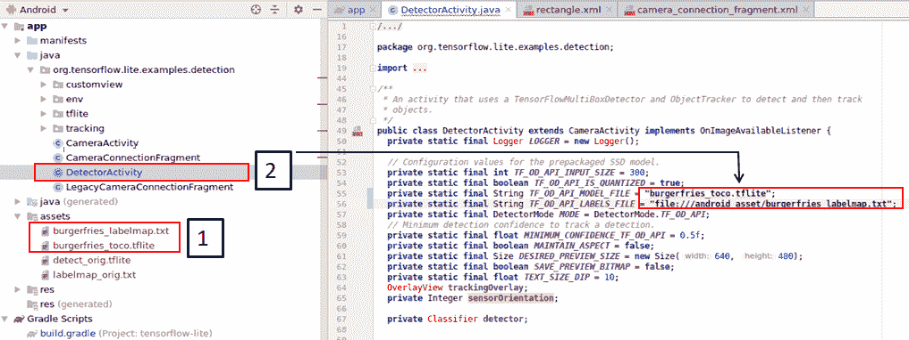

7.  右键单击“资产”，然后从菜单列表中选择在文件中显示。 将我们在第一步中创建的`.tflite`和`.txt`文件拖放到资产目录中。 关闭文件夹，然后返回 Android Studio。
8.  双击`.txt`文件将其打开，并在顶部添加新行。 用`???`填充它。 因此，`.txt`文件将为这两个类提供三行：

```py
???
Burger
fries
```

9.  选择`Java`，然后选择跟踪，然后双击`DetectorActivity`。 将`.tflite`和`.txt`文件的名称更改为其实际名称，如以下屏幕截图所示。 然后，点击`build gradle`：

请注意，对于`.txt`文件，请保留路径，即`file:///android_asset/burgerfries_labelmap.txt`。 稍后，我们将提到，如果未使用`toco`生成`.tflite`文件，则保留先前的路径将导致应用崩溃。 为了防止崩溃，您可以仅保留文件名（例如`burgerfries_labelmap.txt`）。 但是，请注意，这不会为检测到的图像创建边界框。

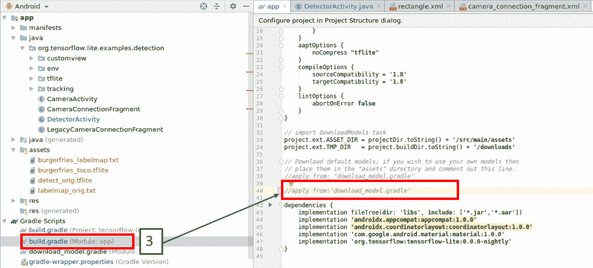

10.  注释掉`///apply from download_model.gradle`。 验证依赖性是否出现，如前面的屏幕快照所示。
11.  现在，使用 USB 电缆将 Android 设备连接到 PC。 转到您的设备，然后在“设置”下单击“开发人员选项”以确保其打开。 然后，打开 USB 调试。 对于许多 Android 手机，此选项会自动显示。

12.  单击顶部的“生成”，然后单击“创建项目”。 在 Android Studio 完成编译后（查看屏幕底部以查看所有活动是否已完成），单击“运行”，然后单击“运行应用”。 该应用将下载到您的设备上。 设备上会出现一个选项框。 选择`ok`即可运行该应用。 以下是该应用工作的图像：

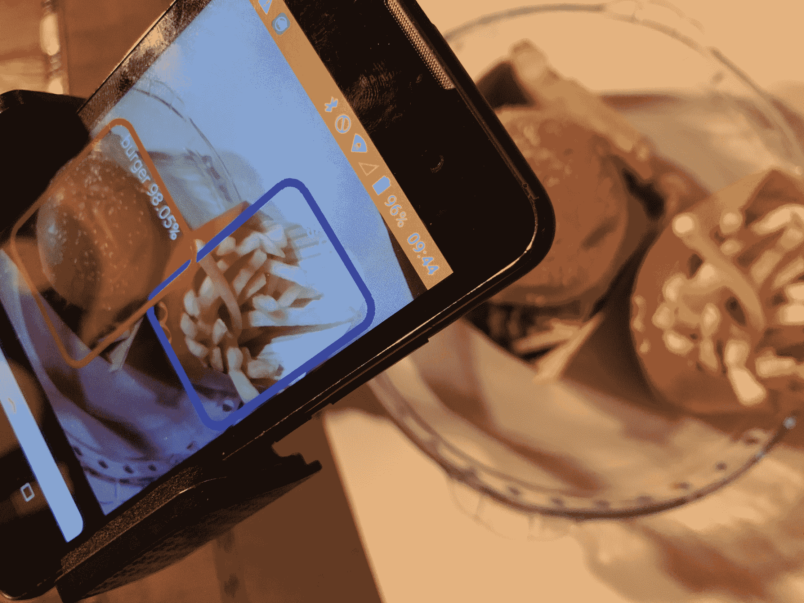

如我们所见，该电话能够以非常高的准确率清晰地检测汉堡和薯条的真实图像。 至此，Android 应用部署练习结束。

# 使用 TensorFlow Lite 在 Raspberry Pi 上进行对象检测

[TensorFlow Lite](https://www.tensorflow.org/lite/guide/python) 下列出的 Python `quickstart`软件包描述了如何为 Raspberry Pi 安装 TensorFlow Lite 软件包。 但是，有几个值得注意的例外。 因此，我们在此处列出了整个过程：

1.  首先，请安装 TensorFlow Lite 解释器。 Raspberry Pi 已安装 ARM7 和 Python3.7，因此在终端中运行以下两个命令：

```py
$sudo su
$pip3 install tflite_runtime-1.14.0-cp37-cp37m-linux_armv7l.whl
```

2.  根据 TensorFlow Lite 官方文档，[需要在`label_image.py`文件中进行一些更改](https://github.com/tensorflow/tensorflow/tree/master/tensorflow/lite/examples/python)：

```py
$import tflite_runtime.interpreter as tflite,
$interpreter = tf.lite.Interpreter(model_path=args.model_file)
```

请注意，当在 Raspberry Pi 4 中进行了这些更改并且在终端中通过键入`python3 label_image.py`执行代码时，将发生错误，指出即使安装了 Python，也找不到 TensorFlow Lite 解释器。 对 Raspberry Pi 3 重复了上述步骤，没有发生错误。

3.  接下来，[按照以下链接提供的步骤安装 TensorFlow Lite 目录和文件](https://github.com/tensorflow/examples.git)。
4.  如果一切顺利，则应该在 Raspberry Pi 中有一个名为`pi/examples/lite/examples`的目录。 在此文件夹中，您应该具有诸如`image_classification`，`object_detection`，`image_segmentation`，`posenet`和`style_transfer`等目录。
5.  接下来，我们将在 Raspberry Pi 上执行两个示例-一个用于图像分类，另一个用于对象检测。

# 图片分类

现在，让我们执行以下步骤进行图像分类：

1.  使用文件管理器转到`image_classification`目录，即`pi/examples/lite/examples/image_classification/raspberry_pi`。 您将看到一个名为`classify_picamera.py`的文件。 现在，转到[这里](https://www.tensorflow.org/lite/guide/hosted_models)并下载对象检测模型以及名为`mobilenet_v2_1.0_224.tflite`和`labels_mobilenet_v2_1.0_224.txt`的`label`文件文件夹。 将这些文件复制到`pi/examples/lite/examples/image_classification/raspberry_pi`中。

2.  接下来，使用`pi/examples/lite/examples/image_classification/raspberry_pi`使用终端转到目录并执行以下命令：

```py
$Python3 classify_picamera.py –model mobilenet_v2_1.0_224.tflite –labels labels_ mobilenet_v2_1.0_224.txt 
```

3.  您应该看到 Raspberry Pi 相机模块亮起并开始对图像进行分类。

# 物体检测

在 Raspberry Pi 上安装 TensorFlow lite 之后，我们现在可以执行对象检测。 按着这些次序：

1.  使用文件管理器进入对象检测目录，即`pi/examples/lite/examples/object_detection/raspberry_pi`。 您将看到一个名为`detect_picamera.py`的文件。
2.  现在，转到[这里](https://www.tensorflow.org/lite/guide/hosted_models)并下载名为`coco_ssd_mobilenet_v1_1.0_quant_2018_06_29`的对象检测模型和标签文件文件夹。 在此文件夹中，您将看到两个文件：`detect.tflite`和`labelmap.txt`。
3.  将这些文件复制到`pi/examples/lite/examples/object_detection/raspberry_pi`中。
4.  接下来，使用`pi/examples/lite/examples/object_detection/raspberry_pi`使用终端转到对象检测目录，并执行以下命令：

```py
$Python3 detect_picamera.py –model detect.tflite –labels labelmap.txt 
```

现在，您应该看到 Raspberry Pi 摄像头模块亮起并开始在图像周围显示边框。

5.  接下来，将`burgerfries.tflite`和`labelmap`文件复制到文件夹中。 然后，更改前面命令行中显示的 Python 路径以反映您的新文件名并执行它。 以下图像是用于`object_detection`的图像：


这里有几件事要注意：

*   我在 Raspberry Pi 中使用了广角相机，无法正确检测食物。
*   我转移到常规的 Raspberry Pi 相机上，能够检测到上图中看到的内容。
*   此处显示的检测效果不如使用手机时好，并且存在时滞。

该示例清楚地显示了相同模型在不同设备上的行为方式不同。

在 2020 TensorFlow 开发峰会上，TensorFlow 工程师宣布将显着改善延迟-浮点 CPU 执行为 55 ms 至 37 ms，定量定点 CPU 执行为 36 ms 至 13 ms，OpenCL 为 20 ms 至 5 ms 浮动 16 GPU 执行，2 ms 用于量化定点 Edge TPU 执行。 在进行此更改之前，对仅具有 CPU 的 Raspberry Pi 进行了测试。 因此，由于上述更改，您应该在 Raspberry Pi 上看到性能上的改进。 TF Lite 2.3 将带来进一步的改进。

# 使用 TensorFlow Lite 和 Create ML 在 iPhone 上进行对象检测

到目前为止，我们已经学习了如何将 TensorFlow 模型转换为 tflite 格式并在 Android 手机和 Raspberry Pi 上进行推理。 在本节中，我们将使用 tflite 模型并在 iPhone 上执行推理。 iPhone 或 iPad 上的对象检测可以遵循两种不同的路径，如以下小节所述。

# 适用于 iPhone 的 TensorFlow Lite 转换模型

在本节中，我们将描述如何在 iPhone 上使用 tflite 模型进行对象检测。 有关详细信息，[请参阅以下 GitHub 页面上概述的步骤](https://github.com/tensorflow/examples/tree/master/lite/examples/image_classification/ios)。

本质上，该过程可以分为以下步骤：

1.  此过程应在装有最新版本 Xcode 的 macOS 上完成。 您还应该具有 Apple Developer 证书。
2.  在终端中，运行 Xcode 的命令行工具（`run xcode-select --install`）。 请注意，即使您已经安装了 Xcode，也需要完成此步骤。
3.  在终端中输入`git clone` [`https://github.com/tensorflow/examples.git`](https://github.com/tensorflow/examples.git) 。
4.  通过在终端中输入`$sudo gem install cocoapods`来安装`cocoapods`。
5.  调用将安装 TensorFlow 示例的最终目录`examples-master`或`examples`。 相应地更改以下文件夹地址。
6.  在终端中，键入以下命令：

```py
$cd examples-master/lite/examples/object_detection/ios
$pod install
```

7.  前面的过程将执行三个主要任务：

*   在 Xcode 中安装 TensorFlow Lite
*   在文件夹中创建一个名为`ObjectDetection.xcworkspace`的文件
*   自动启动 Xcode 并打开`ObjectDetection`文件

以下屏幕截图显示了在 pod 安装过程中您将在终端中看到的注释：

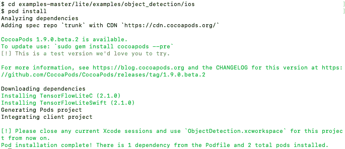

8.  在 Xcode 的签名部分，选择您的开发团队。
9.  对应用进行以下更改：


前面的屏幕快照中描述的更改说明了如何用您的更改替换基线`detect.tflite`和`labelmap.txt`文件。 请注意，如果您不进行任何更改，而是通过将手机连接到 macOS 来运行 Xcode，则它将显示一个常规检测器，如下图所示：

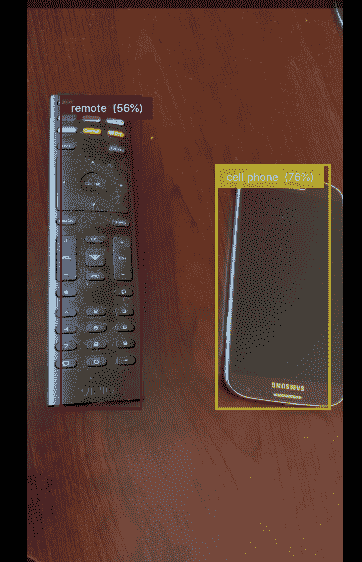

要更改您的特定模型，请右键单击以删除旧模型，然后通过拖放安装新模型。 对代码内的文件名进行必要的更改，如“步骤 4”中所示。 以下屏幕截图显示了您将看到的输出：


即使图像已旋转，前面的屏幕截图也清楚地显示出很好的检测效果。

# Core ML

Core ML 是 Apple 的机器学习框架，该框架集成了来自 TensorFlow 等各种来源的神经网络模型，并在必要时进行了转换，然后优化了 GPU/CPU 性能以进行设备上的训练和推理，同时最大程度地减小了应用尺寸和功耗。 在 WWDC 2019 中引入的 Core ML 3 更新了设备上特定用户数据的神经网络模型，从而消除了设备到云的交互并最大程度地提高了用户隐私。 有关更多信息，请访问[这里](https://developer.apple.com/machine-learning/core-ml)。 Core ML 本身建立在诸如 Accelerate 和 BNNS 以及 Metal Performance Shaders 之类的低级基元之上。 所有 Core ML 模型均具有`.mlmodel`扩展名。

Core ML 的核心部分是 Create ML，它是用于图像分类和对象检测的 Apple 机器学习框架。 该系统类似于 TensorFlow，但使用零编码生成模型更容易。 在 macOS 上，打开 Xcode 并输入`.mlmodel`，如以下屏幕截图所示：

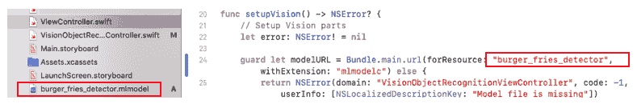

现在，Create ML 中的整个模型开发过程仅涉及三个步骤：

1.  准备数据–即输入文件
2.  将数据拖到 Core ML 中，然后单击“训练”
3.  保存模型（请注意，我找不到找到保存到桌面的方法，因此我通过电子邮件将其发送给自己并保存了文件）并分析了数据

以下屏幕截图显示了“创建 ML”中的训练过程：

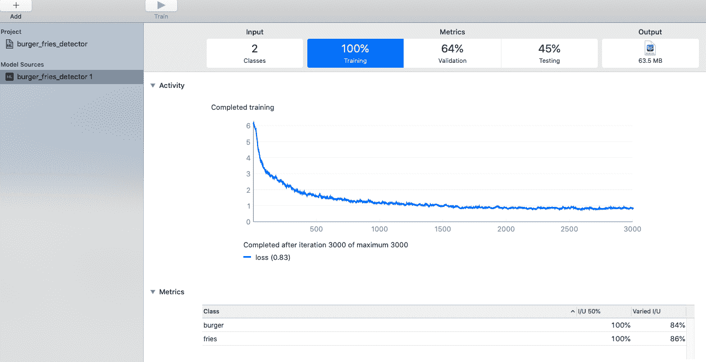

有关上述屏幕截图的一些关键要点如下：

*   最终的训练损失为 0.83，这表明结果非常好–任何低于 1 的值都应表明检测良好。 请注意，仅使用 68 张图像即可获得该图像，这表明我们不需要大量图像即可开发出良好的神经网络模型。
*   请注意，与 TensorFlow 相比，使用 Create ML 开发模型非常容易-绝对零编码，无需转换，也无需前往单独的站点即可查看图表。 一切都紧凑且易于使用。

开发模型后，将其移植到以下用 Swift 编写的视觉框架。 [它将检测带有边界框的对象](https://developer.apple.com/documentation/vision/recognizing_objects_in_live_capture)。

以下是有关应用开发的一些注意事项：

*   您必须具有 Apple 开发人员帐户和团队才能登录 Xcode。
*   您需要删除现有模型并将最新模型拖到 Xcode 中，如以下屏幕截图的左侧所示：


*   完成此操作后，转到`ViewController.swift`，并将默认模型名称重命名为您的模型名称，如上图右侧所示。 最后，建立模型并在 iPhone 上运行。

以下屏幕截图显示了模型输出。 它显示了我们使用 Create ML 开发的模型与我们使用 TensorFlow 开发并转换为`.tflite`形式的模型提供的检测结果的比较：

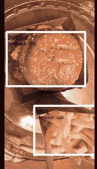

# 将 TensorFlow 模型转换为 Core ML 格式

转换器仅转换 TensorFlow 模型的一部分。 完整的 MobileNet-SSD TF 模型包含四个子图：`Preprocessor`，`FeatureExtractor`，`MultipleGridAnchorGenerator`和`Postprocessor`。 Core ML 工具仅转换模型中的`FeatureExtractor`子图； 其他任务必须由开发人员自行转换。

# 各种注释方法的摘要

图像标注是对象检测或分割的核心部分。 就神经网络开发中的手动工作而言，此部分最繁琐。 先前，我们描述了用于注释的三个工具：`LebelImg`，`VGG Image Annotator`和`RectLabel`。 但是，还有许多其他工具可用，例如 Supervisely 和 Labelbox。 其中一些工具会执行半自动注释。 最大的挑战是创建 100,000 个注释，并在像素级精度内正确地进行注释。 如果注释不正确，则开发的模型将不正确，并且在 100,000 张图像中找到不正确的注释就像在大海捞针中找针。 对于大型项目工作，注释工作流可以分为两类：

*   将标签工作外包给第三方
*   自动或半自动贴标

在下一节中，我们将讨论这两种方法。

# 将标签工作外包给第三方

许多企业将标签工作作为其核心业务模型之一。 每个云服务提供商都与人类标签商合作，为神经网络开发工作执行准确的图像标签服务。 以下是有关在哪里可以找到第三方数据标签服务的一些信息。 请注意，此列表并不全面，因此请在此列表之外进行自己的研究，以找到适合您需求的数据标签服务：

*   Google Cloud –数据标签。 有关详细信息，请转到[这里](https://cloud.google.com/ai-platform/data-labeling/docs)。
*   Amazon Sagemaker 真实情况–使用 Amazon Mechanical Turk 进行数据标记。 有关详细信息，请转到[这里](https://aws.amazon.com/sagemaker/groundtruth)。
*   Hive AI 数据标签服务。 有关详细信息，请转到[这里](https://thehive.ai)。
*   Cloud Factory 数据标签服务。 有关详细信息，请转到[这里](https://www.cloudfactory.com)。

数据标记服务的成本可能会很高。

# 自动或半自动贴标

在本节中，我们将讨论一个完全免费的自动注释工具，该工具应减少人工标记的程度。 这是英特尔的**计算机视觉注释工具**（**CVAT**）工具，它非常有前途，仅通过加载模型即可执行完整的自动注释作为起点。 您可以在[这个页面](https://software.intel.com/en-us/articles/computer-vision-annotation-tool-a-universal-approach-to-data-annotation)中找到有关该工具的更多信息。 。

该工具能够为边界框，多边形和语义分段创建注释，并且还可以执行自动注释。 该工具可以将注释输出为 VOC XML，JSON TXT 或 TFRecord 文件。 这意味着，如果您使用该工具，则无需将图像转换为 TFRecord 形式–您可以直接训练神经网络。 请按照以下步骤学习如何使用该工具：

1.  执行必要的安装。 所有说明均在终端中执行，包括安装 Docker，构建 Docker 映像以及克隆 CVAT 源代码。 可以在[这个页面](https://github.com/opencv/cvat/blob/master/cvat/apps/documentation/installation.md)中找到更多信息。
2.  通过转到[这里](https://github.com/opencv/cvat/blob/master/components/tf_annotation/README.md)，安装已在 coco 数据集上训练的 Faster R-CNN ResNet 初始 Atrous 模型。
3.  安装 OpenVINO 模型。 如果您使用的是 TensorFlow，则无需安装 OpenVINO 模型-只需直接转到“步骤 4”。 但是，如果要使用 Intel Open Model Zoo 中的模型或您自己的自定义模型，[请遵循此链接上的说明](https://github.com/opencv/cvat/blob/master/cvat/apps/auto_annotation/README.md)。
4.  打开谷歌浏览器，然后输入`localhost:8080`。 这将打开 CVAT。 请注意，CVAT 当前仅可在 Google Chrome 浏览器上使用。
5.  从下拉列表中选择模型，如以下屏幕截图所示：

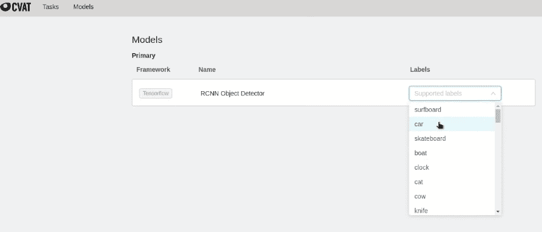

对于 TensorFlow，只有一种模型可供选择。 但是，您仍然需要从下拉列表中选择类，如前面的屏幕快照所示。 请注意，您可以选择多个类别，但不会显示选定的类别。

6.  通过给它命名来创建任务。 然后，命名所有类并添加所有图像，如以下屏幕截图所示：

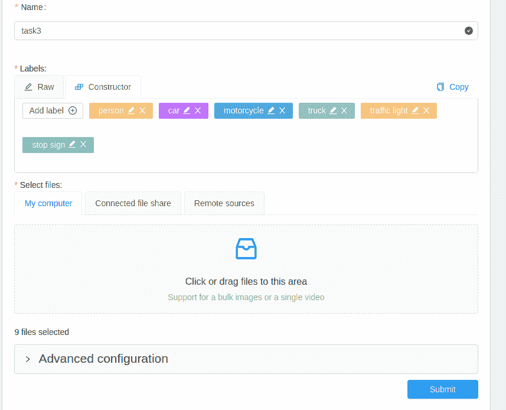

如前面的屏幕快照所示，已上传了九张图像。 然后，单击“提交”按钮，这将创建任务。 您可以将不同的人分配给不同的任务。

7.  在“任务”下，在操作旁边的新菜单栏上单击鼠标左键，然后选择“自动注释”。 您将看到一个菜单栏，显示其进度。
8.  完成自动注释后，单击“作业编号” –您会注意到所有图像都有注释。 以下屏幕截图显示了所有上传的九张图像的自动注释报告：


在前面的示例中，我们一次批量加载了所有九个图像，以演示自动化过程的有效性。 它正确检测了所有物体（汽车，人，卡车和摩托车）。 在某些情况下，该模型没有绘制交通信号灯和停车标志。 因此，在此示例中，只有交通信号灯和停车标志需要手动注释； 我们可以将工具用于所有其他对象。 接下来，我们以 VOC XML 格式获取该工具的输出，并将图像以及`.xml`文件加载到标签边界框的`labelImg`工具中。 以下屏幕截图显示了结果。 请注意，这是上述屏幕快照的左下图：

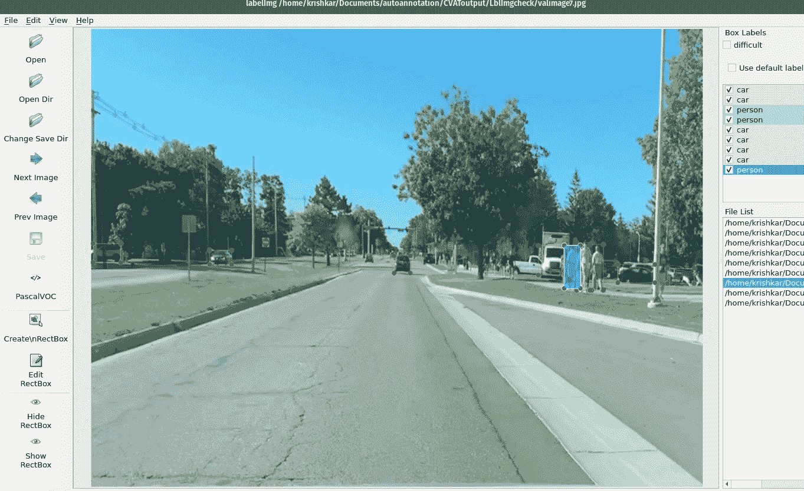

数据显示贴标工作非常准确。 该工具不断更新。 与其他任何工具一样，如果遇到此处未涉及的任何问题，请提交工作单。

我发现了与该工具有关的一个问题：输出不一致表示对于某些图像，它将绘制边界框注释，而对于其他图像，则不会。 我通过移至另一台 Linux PC 并重新安装 CVAT 来解决了此问题。 要在当前 PC 上解决此问题，可以在当前 CVAT 目录中卸载 Docker，删除 CVAT 文件夹，并确保端口`8080`没有被其他程序调用。 然后，您可以重新安装 CVAT。

# 总结

在本章中，您学习了如何在网络的最远端开发和优化卷积神经网络模型。 神经网络的核心是需要训练的大量数据，但最终，它提供了一个模型，该模型无需人工干预即可完成任务。 在前面的章节中，我们了解了必要的理论和实现的模型，但从未进行任何实际练习。 在实践中，摄像机可以用于监视，监视机器性能或评估手术过程。 在每种情况下，嵌入式视觉都用于实时设备上数据处理，这需要在边缘设备上部署更小，更有效的模型。

在本章中，您了解了各种单板计算机和加速器的性能，从而使您能够针对特定应用选择哪种设备做出明智的决定。 然后，我们学习了如何使用 OpenVINO 工具包和 TensorFlow Lite 来设置 Raspberry Pi 并在其上部署神经网络。 我们这样做是为了进行设备上的推断。 之后，我们学习了如何将 TensorFlow 模型转换为 TensorFlow Lite 模型并将其部署在 Android 和 iOS 设备上。 我们还了解了 Apple 的 Core ML 平台，并使用 Create ML 训练神经网络以开发对象检测器模型。 然后，我们将其与 TensorFlow Lite 对象检测器模型进行了比较。 我们在本章结束时概述了图像注释和自动注释方法。

在下一章中，我们将学习如何使用云处理来训练神经网络，然后将其部署在设备上。