# 使用局部二进制模式的内容识别

**局部二进制模式**（**LBP**）于 1994 年由 Timo Ojala，Matti Pietikäinen 和 David Harwood 在国际模式识别会议上，在论文[《Performance evaluation of texture measures with classification based on Kullback discrimination of distributions》](https://ieeexplore.ieee.org/document/576366)中首次提出。

在本章中，您将学习如何创建 LBP 图像类型的二进制特征描述符和 LBP 直方图，以对纹理图像和非纹理图像进行分类。 您将了解可用于计算直方图之间的差异以找到各种图像之间的匹配的不同方法，以及如何调整 LBP 参数以优化其性能。

本章将涵盖以下主题：

*   使用 LBP 处理图像
*   将 LBP 应用于纹理识别
*   使脸色与基础色匹配-LBP 及其局限性
*   使用基础色匹配面部颜色-颜色匹配技术

# 使用 LBP 处理图像

LBP 是一种灰度图像阈值操作，用于基于不同的模式对图像进行分类。 通过将邻域像素值与中心像素值进行比较来开发二进制模式，并将其用于构建直方图块。 在以下部分中，我们将详细描述 LBP 操作。

# 生成 LBP 模式

LBP 模式生成的主要步骤如下：

1.  将 RGB 图像 A 转换为灰度图像 G。
2.  对于图像 G 中每个具有强度`I[c]`（x，y）的像素，选择`P`相邻点（`p[0], p[1], ...,  p[P-1]`），其半径`[I[0], I[1], ..., I[P-1]`具有相应的强度。`R`。 半径以像素为单位定义为两个像素之间的差。 像素和相邻点代表图像 G 的滑动窗口 W。对于半径 R = 1，P 变为 8，如下所示。

滑动窗口`W[0]`用表示为数组。 在这里，点 0 到 P-1 代表围绕中心像素 c 的 P 个点的强度：


确定半径 R 和相邻点 P 之间的关系，以使附近的每个像元恰好具有一个像素。 如上图中的前三个圆圈所示，周长中的每个像元恰好具有一个像素，而最后一个像元在周长中填充了多个像素。 从前三个圆圈，我们可以表示，为了使每个单元格都有一个像素，点数 P 可以表示为`(8R + 16) / 3`。 下图显示了线性关系和离群值，离群值由左起第四个圆圈显示，在相邻单元格中有重叠点：


3.  计算相邻像素和中心像素之间的强度差，并删除第一个值 0。该数组可以表示如下：

`W[1] ~ [I[0] - I[c], I[1] - I[c], ..., I[P-1] - I[c]]`

4.  现在，对图像进行阈值处理。 为此，如果强度差小于 0，则将值分配为 0；如果强度差大于 0，则将值分配为 1，如以下等式所示：

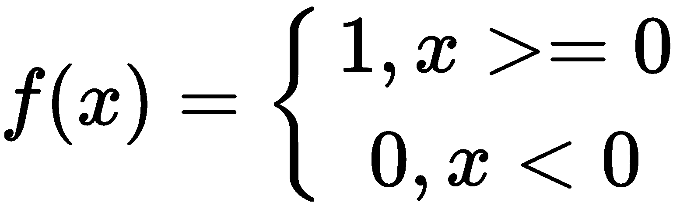

应用阈值函数`f`之后的差数组如下：

`W[2] = [f(I[0] - I[c]), f(I[1] - I[c]), ..., f(I[P-1] - I[c])`

例如，假设第一个差异小于 0 且第二个和最后一个差异大于 0，则数组可以表示如下：

`W[2] = [0, 1, ... 1]`

5.  将差数组`W[2]`乘以二项式权重`2^p`，将二进制数组`W[2]`转换​​为表示十进制数组`W[LBP]`的代码 3：


请注意，本节中描述的五个步骤将在接下来的几节中引用。

下图显示了在灰度图像的滑动窗口上 LBP 操作的图形表示：


在上图中，我们可以看到以下内容：

*   起始的 3 x 3 内核只是图像的一部分。
*   接下来的 3 x 3 是二进制表示形式。
*   左上角的值为 1，因为我们正在比较 120 和 82。
*   顺时针旋转，因为我们将 51 与 82 进行了比较，所以最后一个值为 0。
*   接下来的 3 x 3 内核只是`2^n`操作。
*   第一个值是 1（`2^0`），最后一个值是顺时针为 128（`2^7`）。

# 了解 LBP 直方图

LBP 阵列`W[3]`以直方图形式表示如下：

`W4 = histogram(W3, bins=P, range=W3(min) to W3(max))`

对训练后的图像和测试图像重复上一节中的“步骤 1”至`5`，以创建图像（`W_train, W_test`）的 LBP 直方图，每个都包含 P 个箱子，然后使用直方图比较方法对其进行比较。

# 直方图比较方法

可以使用不同的直方图比较方法来计算直方图之间的距离。 这些如下：

*   **交叉方法**：


在 Python 中，这表示如下：

```py
minima = np.minimum(test_hist,train_hist)
intersection = np.true_divide(np.sum(minima),np.sum(train_hist))
```

*   **卡方方法**：


*   **欧几里得方法**：

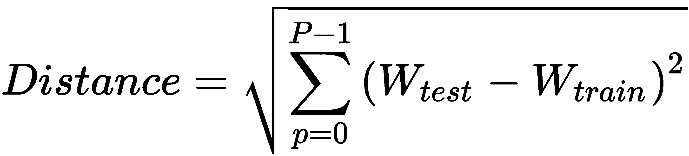

*   **城市街区方法**：

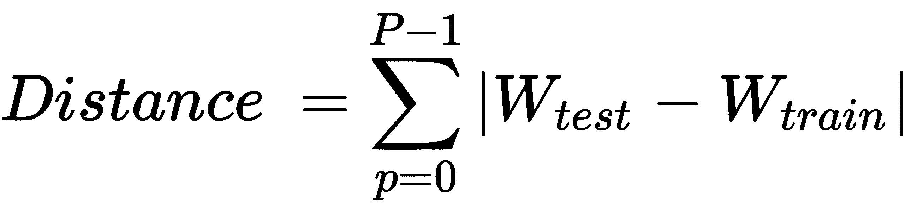

*   **Bhattacharya 方法**：


*   **Wasserstein 方法**：


*   给定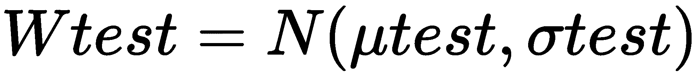和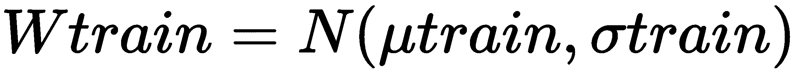，此处是分布的平均值（第一矩），（第二矩）是分布的标准偏差，而`ρ[QQ]`为 两个分布和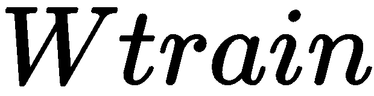的分位数彼此之间的相关性。

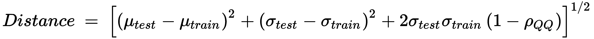

前面的距离度量具有以下特征：

*   每种方法的距离绝对值都不相同。
*   除 Wasserstein 方法外，所有方法的测试直方图和训练直方图值之间的最小距离都相似。 Wasserstein 方法根据位置（均值差异），大小（标准差差异）和形状（相关系数）计算距离。

下面显示了给定半径 **R = 5** 时的原始灰度图像和相应的 LBP 图像：

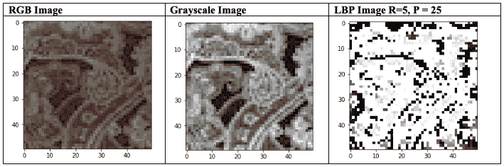

接下来，我们将评估半径变化对图像清晰度的影响。 为此，需要通过将半径值从 1 更改为 10 来执行 Python 代码。下图显示了对 LBP 图像清晰度的最终影响。

根据相关性`P = (8R + 16) / 3`获得到多个点的半径。请注意，随着半径的增加，图像中的图案变得更加清晰。 围绕半径 5 和点 20-25，该图案在主拱的主要图案和次要图案之间变得更加清晰。 在很大的半径上，辅助图案变得不太明显：


从前面的图像中还可以清楚地看到以下内容：

*   选择`R`和`P`对于模式识别很重要。
*   可以通过`P = (8R + 16) / 3`来选择初始值，但是对于给定的`R`，`P`的值不能超过此值 平均不良表现，如先前示例中的`R = 5`，`P = 25`所示。
*   选择的模式明显优于`R = 4`，`P = 16`示例，并且与`R = 5.5`，`P = 20`非常相似。

另外，请注意，此处的示例仅提供适用于此图像的准则。 对于不同尺寸的图像，请从此示例中学习，首先选择`P`的初始值，然后调整`R`和`P`以获得所需的值 模式。

# LBP 的计算成本

与传统的神经网络方法相比，LBP 在计算上更便宜。 LBP 的计算成本由 Li Li，Paul Fieguth，Wang Xiaogang Wang，Matti Pietikäinen 和 Dewen Hu 在他们的论文《使用新的稳健性基准评估 LBP 和深纹理描述符》中提出。 [论文的详细信息可以在这里找到](https://www.ee.cuhk.edu.hk/~xgwang/papers/liuFWPHeccv16.pdf)。

作者确定了在 2.9 GHz Intel Quad-Core CPU 和 16 GB RAM 上对 480 张图像进行特征提取所花费的平均时间，这些图像的大小为 128 x 128。 该时间不包括训练时间。 研究发现，与被认为中等的 AlexNet 和 VGG 相比，LBP 特征提取非常快。

# 将 LBP 应用于纹理识别

既然我们了解了 LBP 的基础知识，我们将把它应用于纹理识别示例。 对于此示例，已将 11 张训练后的图像和 7 张尺寸为 50 x 50 的测试图像分为以下几类：

*   **训练图像**
*   图案图片（7）
*   普通图像（4）
*   **测试图片**
*   图案图片（4）
*   普通图像（3）

执行“生成 LBP 模式”部分的“步骤 1”至 5 ，然后将每个测试图像的 LBP 直方图与所有训练图像进行比较，以找到 最佳匹配。 尽管已使用了不同的直方图比较方法，但是对于此分析，将使用卡方检验作为确定匹配的主要方法。 具有正确匹配项的最终摘要输出用绿线显示，而错误匹配项将用红线显示。 实线是最短距离的第一个匹配项，而虚线是下一个最佳匹配项。 如果用于下一个最佳匹配的直方图之间的距离比最小距离远得多，则仅显示一个值（最小距离），这表明系统对此输出具有相当高的置信度。

下图显示了使用 LBP 在测试和训练灰度图像之间的匹配过程。 实线表示最接近的匹配，而虚线表示第二最接近的匹配。 第三张测试图像（从左起）只有一个匹配项，这意味着当图像转换为灰度时，模型对其预测非常有信心。 第二个，第三个和第六个训练图像（从右侧开始）没有相应的测试图像匹配：

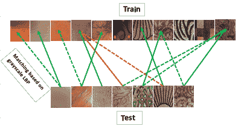

在这里，我们可以看到，基于有限的训练数据（11 个样本），LBP 通常会产生很好的匹配，在考虑的七个测试样本中只有一个错误。 要了解在上一张图像中如何完成相关性，我们需要绘制 LBP 直方图并比较训练图像和测试图像之间的直方图。 下图分析每个测试图像，并将其直方图与相应测试图像的直方图进行比较，以找出最匹配的图像。

`n_points = 25`表示 LBP 中有 25 点。 使用 LBP 直方图的主要优点是可实现平移的归一化，从而使其旋转不变。 我们将逐一分析每个直方图。 直方图的`x`轴为 25，表示点数（25），而`y`轴为 LBP 直方图块。

下图中显示的两个图像都具有图案并且看起来相似：


先前图像的直方图分析显示了相似的模式，使用 LBP 可以显示正确的匹配。 下图中显示的两个图像都具有图案并且看起来相似。 实际上，它们是从不同的方向和不同的阴影获取的同一张地毯图像：


先前图像的直方图分析显示了相似的模式，使用 LBP 可以显示正确的匹配。 下图中显示的两个图像具有图案，但是它们来自不同的地毯：


先前图像的直方图分析显示了相似的模式。 它们的样式看起来相似，但图像实际上不同。 因此，这是匹配不良的一个示例。

下一张图像中的第一张图像具有图案（与我们已经看到的图像相比，它是一种较弱的图案），而经过训练的图像则完全没有图案，但是在地毯上似乎有污渍：

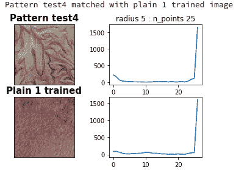

先前图像的直方图分析显示了相似的模式。 它们的样式看起来相似，但图像实际上不同。 这是比赛不佳的另一个例子。 由于红地毯上的污渍，LBP 似乎认为图像相似。

下图显示了 LBP 将灰色地毯与前面相同的红色地毯相匹配：


LBP 直方图显示了类似的趋势–这是合理的，因为 LBP 是一种灰度图像识别技术。

下图显示了 LBP 将硬木地板与地毯相匹配：

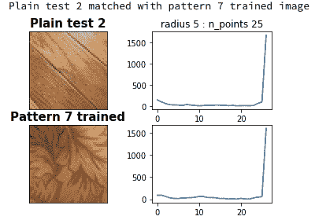

请注意，训练图像没有硬木地板，因此 LBP 发现具有叶子形状的地毯是与具有木纹的木地板最接近的匹配。

最后一个 LBP 图片显示相似的图片，几乎没有图案：


在这里，LBP 预测似乎是正确的。

比较顶部直方图和底部直方图，以可视化直方图如何比较测试图像和训练图像。 可以在[这个页面](https://github.com/PacktPublishing/Mastering-Computer-Vision-with-TensorFlow-2.0/blob/master/Chapter02/Chapter2_LBPmatching_texture.ipynb)中找到详细的 Python 代码。 

# 使脸色与基础色匹配-LBP 及其局限性

由于我们在纹理识别方面使用 LBP 取得了相对良好的成功，因此让我们尝试另一个示例来了解 LBP 的局限性。 在此示例中，从浅色到深色（测试）的七种面部颜色将与 10 种基础色（训练）相匹配，这些基础色是 50 x 50 的图像。

与纹理识别示例类似，将应用“生成 LBP 模式”部分中的“步骤 1”至`5`，然后将每个面部彩色图像 LBP 直方图进行比较 与所有基础彩色图像 LBP 直方图一起找到最佳匹配。 尽管已使用不同的直方图比较方法，但对于此分析，将使用卡方检验作为确定匹配的主要方法。 下图显示了最终的摘要输出：

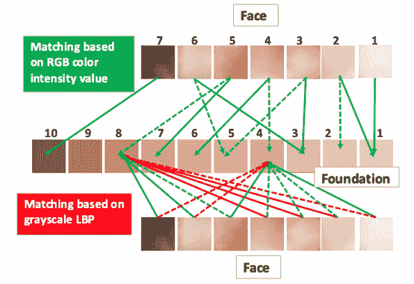

如我们所见，LBP 的效果不佳，所有脸部颜色都导致底色为 4 或 8。 P12 和另一个 R5.5，P20）已绘制。 这是由两个因素引起的：

*   面部颜色从 RGB 到灰度的转换会导致图像中不必要的亮度，这在比较过程中会产生误导。
*   LBP 转换采用这些模式并生成无法正确解释的任意灰色阴影。

下图显示了两个图像-脸色 1 和 7-分别代表肤色和深色皮肤的颜色，以及 LBP 不同步骤的结果。 每个图像都会转换为灰度，这表明两个图像的中间都有一个亮点，而原始彩色图像无法看到该亮点。 然后，将两个 LBP 操作应用于图像：一个半径为 2.5，另一个半径为 5.5。 在这里，我们可以看到在应用 LBP 之后有很多相似之处，这是原始彩色图像所没有的。 让我们看一下下面的图片：


解决第一个问题的可能方法是应用高斯滤波，我们已在“第 1 章”，“计算机视觉和 TensorFlow 基本原理”中进行了研究，以抑制该模式。 下图可以看到应用高斯滤波器然后进行 LBP 的结果：


即使在应用滤镜之后，也无法清晰地区分浅灰和深灰这两种灰色阴影。 由此可以得出结论，LBP 并不是用于面部颜色识别的好方法。

# 使脸部颜色与基础颜色匹配–颜色匹配技术

对于这种方法，RGB 图像不会转换为灰度； 而是使用以下 Python 代码（针对每种情况重复）确定七种面部颜色和 10 种基础颜色中的每一种的颜色强度值：

```py
facecol1img = Image.open('/…/faceimage/facecol1.JPG')
facecol1arr = np.asarray(facecol1img)
(mfc1, sfc1) = cv2.meanStdDev(facecol1arr)
statfc1 = np.concatenate([mfc1, sfc1]).flatten()
print ("%s statfc1" %(statfc1))
```

输出具有六个元素。 前三个是 RGB 平均值，而后三个是 RGB 值的标准偏差。

面部和底色之间的强度差计算如下：


让我们看一下下面的图像，它代表了脸部和底色：


矩阵中差异最小的值是最佳匹配。 我们可以看到，对于每种脸部颜色，匹配（如对角线上的最小限度点所示）可得出合理的值，这表明颜色匹配技术应该是与基础色进行脸部颜色匹配的首选方法 。

# 概要

在本章中，我们学习了如何获取图像像素并将其与给定半径内的相邻像素阈值化，然后执行二进制和积分运算以创建 LBP 模式。 LBP 模式是无监督机器学习的一个很好的例子，因为我们没有用输出训练分类器。 相反，我们学习了如何调整 LBP 的参数（半径和点数）以达到正确的输出。 发现 LBP 是用于纹理分类的非常强大且简单的工具。 但是，当图像为非纹理图像时，LBP 无法返回良好的结果，我们学习了如何开发 RGB 颜色匹配模型来匹配彩色的非纹理图像，例如面部和基础色。 要创建 LBP 表示，必须将图像转换为灰度。

在下一章中，我们将结合各种边缘检测方法来识别人脸，眼睛和耳朵，介绍积分图像的概念。 然后，我们将介绍卷积神经网络，并使用它来确定面部关键点和面部表情。