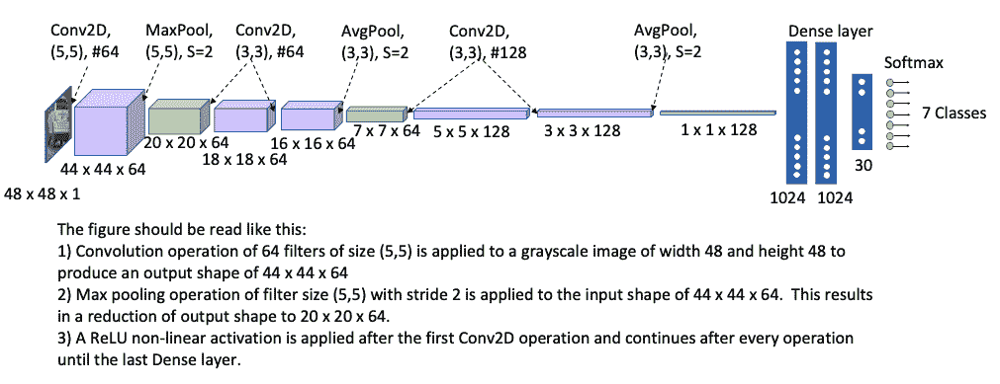
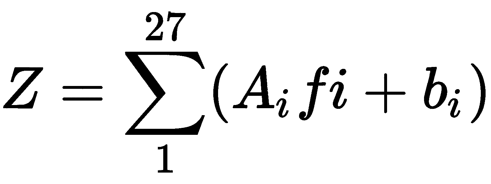
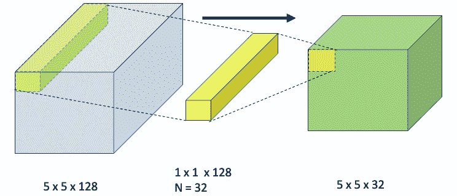
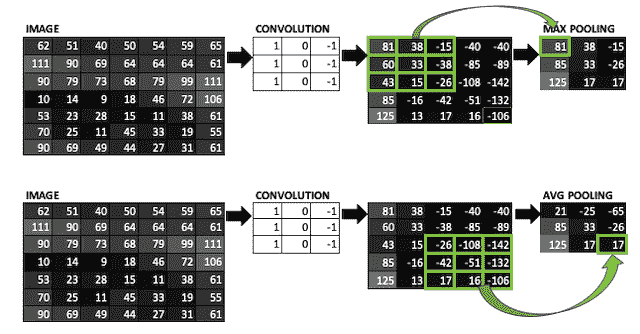
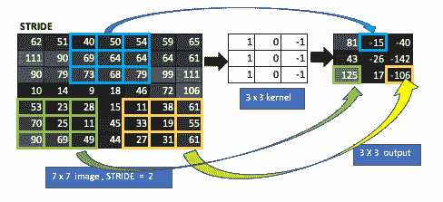
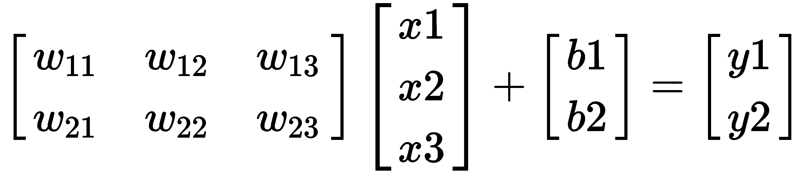
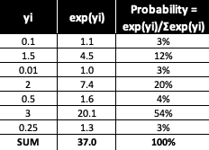
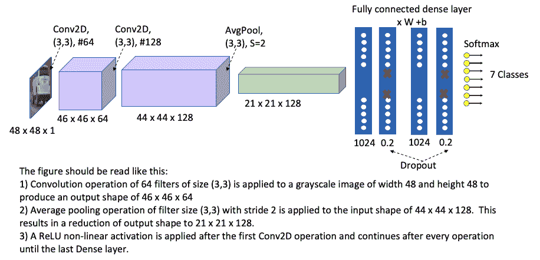
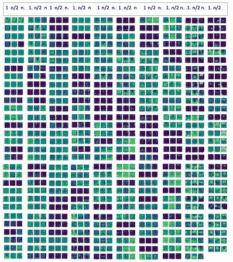
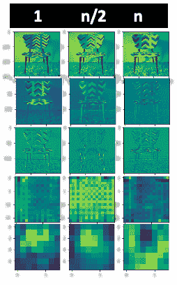

# 图像深度学习

边缘检测的概念在“第 1 章”，*计算机视觉和 TensorFlow 基础知识*中进行了介绍。 在本章中，您将学习如何使用边缘检测在体积上创建卷积运算，以及不同的卷积参数（例如滤波器大小，尺寸和操作类型（卷积与池化））如何影响卷积体积（宽度与深度）。 本章将为您提供有关神经网络如何查看图像以及图像如何使用可视化对图像进行分类的非常详细的概述。 您将从建立第一个神经网络开始，然后在图像通过其不同层时对其进行可视化。 然后，您将网络模型的准确性和可视化与诸如 VGG 16 或 Inception 之类的高级网络进行比较。

请注意，本章和下一章将提供神经网络的基础理论和概念以及当今实际使用的各种模型。 但是，这个概念是如此广泛，以至于不可能将您需要了解的所有内容都放在这两章中。 因此，为了便于阅读，将为每章讨论的主题引入其他概念，从“第 6 章”，*使用转移学习*的视觉搜索开始，以防止您不得不 阅读本书时，请参考这些章节。

在本章中，我们将介绍以下主题：

*   了解 CNN 及其参数
*   优化 CNN 参数
*   可视化神经网络的各个层

# 了解 CNN 及其参数

**卷积神经网络**（**CNN**）是一种自学习网络，它通过观察不同类别的图像来对类似于人类大脑学习方式的图像进行分类。 CNN 通过应用图像滤波并处理各种滤波器大小，数量和非线性运算的方法来学习图像的内容。 这些滤镜和操作应用于多个图层，以便在图像转换过程中，每个后续图层的空间尺寸减小，并且其深度增大。

对于每个过滤应用程序，所学内容的深度都会增加。 首先从边缘检测开始，然后识别形状，然后识别称为特征的形状集合，依此类推。 当我们理解信息时，这类似于人脑。 例如，在阅读理解测试中，我们需要回答关于段落的五个问题，每个问题都可以视为一类，需要从段落中获得特定信息的必须回答的问题：

1.  首先，我们浏览整个通道，这意味着空间维度是完整的通道，而深度（我们对通道的理解）很小，因为我们只是浏览了整个通道。
2.  接下来，我们浏览问题以了解每个班级的特征（问题），即在文章中寻找的内容。 在 CNN 中，这等效于考虑要使用哪些卷积和池化操作来提取特征。
3.  然后，我们阅读文章的特定部分，以找到与全班相似的内容，并深入探讨这些部分–在这里，空间维度很小，但深度很大。 我们重复此过程 2 至 3 次，以回答所有问题。 我们将继续加深我们的理解深度，并更加专注于特定领域（缩小维度），直到我们有一个很好的理解为止。 在 CNN 中，这等效于逐渐增加深度并缩小尺寸–卷积操作通过更改滤镜数量来更改深度； 合并会缩小尺寸。
4.  为了节省时间，我们倾向于跳过段落以找到与答案匹配的相关段落。 在卷积中，这等效于步幅，步幅会缩小尺寸，但不会更改深度。
5.  下一步是将问题与文章的答案相匹配。 我们通过在精神上使问题的答案保持一致来做到这一点。 在这里，我们不会做得更深入–我们将问题和答案并排放置，以便我们进行匹配。 在 CNN 中，这等效于展平并使用完全连接的层。

6.  在此过程中，我们可能会有过多的信息–我们将其删除，以便仅与段落中的问题相关的信息可供我们使用。 在 CNN 中，这等效于辍学。
7.  最后一个阶段实际上是进行匹配练习以回答问题。 在 CNN 中，这等效于 Softmax 操作。

CNN 的图像过滤和处理方法包括执行多种操作，所有这些操作都可以通过以下方式进行：

*   卷积（Conv2D）
*   卷积– 3 x 3 滤镜
*   卷积– 1 x 1 过滤器
*   汇集
*   填充
*   大步走
*   激活
*   全连接层
*   正则化
*   退出
*   内部协方差平移和批量归一化
*   软最大

下图说明了 CNN 及其组件：



让我们研究一下每个组件的功能。

# 卷积

卷积是 CNN 的主要构建块。 它包括将图像的一部分与内核（过滤器）相乘以产生输出。 卷积的概念在“第 1 章”，*计算机视觉和 TensorFlow 基础知识*中进行了简要介绍。 请参考该章以了解基本概念。 通过在输入图像上滑动内核来执行卷积操作。 在每个位置执行逐元素矩阵乘法，然后在乘法范围内进行累加和。

每次卷积操作之后，CNN 都会从图像中学到更多信息–它首先是学习边缘，然后是下一次卷积中的形状，然后是图像的特征。 在卷积操作期间，过滤器的大小和过滤器的数量可以改变。 通常，在通过卷积，合并和跨步操作减小特征图的空间尺寸之后，增加过滤器的数量。 当滤镜尺寸增加时，特征图的深度也会增加。 下图说明了当我们有两个不同的边缘检测内核选择时的 Conv2D：


上图显示了以下要点：

*   如何通过在输入图像上滑动 3 x 3 窗口来执行卷积操作。
*   逐元素矩阵乘法和总和结果，用于生成特征图。
*   随着多次卷积运算而堆叠的多个特征图将生成最终输出。

# 卷积– 3 x 3 滤镜

在前面的示例中，我们在二维图像（灰度）上应用了 3 x 3 卷积。 在本节中，我们将学习具有三个通道（**红色**，**绿色**和**蓝色**（**RGB**）的三维图像 使用卷积运算的 3 x 3 边缘滤波器对）进行变换。 下图以图形方式显示了此转换：


上图显示了如何使用 3 x 3 过滤器（边缘检测器）在宽度减小和深度增加（从 3 到 32）方面转换 7 x 7 图像的图形的一部分。 内核（ *f <sub>i</sub>* ）中 27 个（3 x 3 x 3）单元中的每一个都乘以输入（ *A <sub>i</sub>* ）。 然后，将这些值与**整流线性单位**（**ReLU**）激活函数（ *b <sub>i</sub>* ）相加在一起 单个元素（`Z`），如以下等式所示：



通常，在卷积层中，有许多执行不同类型边缘检测的滤波器。 在前面的示例中，我们有 32 个过滤器，这将导致 32 个不同的堆栈，每个堆栈由 5 x 5 层组成。

3 x 3 滤波器将在本书的其余部分中广泛用于神经网络开发。 例如，您将在 ResNet 和 Inception 层中看到大量使用它，我们将在“第 5 章”，*神经网络体系结构和模型*中进行讨论。 TensorFlow 中可以将大小为 3 x 3 的 32 个过滤器表示为`.tf.keras.layers.Conv2D(32, (3,3))`。 在本章的后面，您将学习如何将此卷积与 CNN 的其他层一起使用。

# 卷积– 1 x 1 过滤器

在本节中，我们将学习 1 x 1 卷积的重要性及其用例。 1 x 1 卷积滤波器是图像的直倍数，如下图所示：


在上图中，在上一节输出的 5 x 5 图像上使用了 1 x 1 卷积滤波器值 1，但实际上它可以是任何数字。 在这里，我们可以看到使用 1 x 1 过滤器可以保留其高度和宽度，而深度则增加到过滤器通道的数量。 这是 1 x 1 滤波器的基本优点。 三维内核（`f`*<sub>i</sub>* ）中三个（1 x 1 x 3）单元中的每一个都与输入的相应三个单元相乘 （`A`*<sub>i</sub>* ）。 然后，将这些值与 ReLU 激活函数（`b`*<sub>i</sub>* ）一起加在一起，以形成单个元素（`Z`）：


上图显示 1 x 1 过滤器使深度增加，而相同的 1 x 1 过滤器可用于减小值，如下图所示：



上图显示了 1 x 1 x 128 图像滤波器如何将卷积深度减少到 32 个通道。

1 x 1 卷积在所有 128 个通道中与 5 x 5 输入层执行逐元素乘法–将其在深度维度上求和，并应用 ReLU 激活函数在 5 x 5 中创建单个点 输出表示 128 的输入深度。本质上，通过使用这种机制（卷积+整个深度的和），它会将三维体积折叠为具有相同宽度和高度的二维数组。 然后，它应用 32 个过滤器以创建 5 x 5 x 32 输出，如前所示。 这是有关 CNN 的基本概念，因此请花一些时间来确保您理解这一点。

本书将使用 1 x 1 卷积。 稍后，您将了解到池化会减小宽度，而 1 x 1 卷积会保留宽度，但可以根据需要收缩或扩展深度。 例如，您将看到在网络和 Inception 层中使用了 1 x 1 卷积（在“第 5 章”，*神经网络体系结构和模型*中。具有 1 的 32 滤波器） x 1 的卷积可以在 TensorFlow 中表示为`.tf.keras.layers.Conv2D(32, (1,1))`。

# 汇集

卷积是卷积之后的下一个操作。 它用于减小尺寸和特征图的大小（宽度和高度），而无需更改深度。 轮询参数的数量为零。 池的两种最受欢迎​​的类型如下：

*   最大池
*   平均池化

在最大池化中，我们在特征图上滑动窗口并获取窗口的最大值，而在进行平均池化时，我们获取窗口中的平均值。 卷积层和池化层一起执行特征提取的任务。 下图显示了在 7 x 7 图像上使用的最大和平均池化操作：



请注意，由于合并，3 x 3 窗口如何缩小（由绿线显示）为单个值，从而导致 5 x 5 矩阵尺寸更改为 3 x 3 矩阵。

# 填充

填充用于保留要素图的大小。 通过卷积，可能会发生两个问题，并且填充会同时解决两个问题：

*   每次卷积操作时，要素图的大小都会缩小。 例如，在上图中，由于卷积，一个 7 x 7 的特征图缩小为 5 x 5。
*   由于边缘上的像素仅更改一次，因此边缘上的信息会丢失，而中间的像素会通过多次卷积操作进行多次更改。

下图显示了在 7 x 7 输入图像上使用大小为 1 的填充操作：


请注意填充如何保留尺寸，以便输出与输入的尺寸相同。

# 大步走

通常，在卷积中，我们将内核移动一步，对那一步应用卷积，依此类推。 大步走使我们可以跳过一步。 让我们来看看：

*   当步幅= 1 时，我们应用普通卷积而不跳过。
*   当步幅= 2 时，我们跳过一步。 这会将图像大小从 7 x 7 减小到 3 x 3（请参见下图）：



在这里，每个 3 x 3 窗口显示跳过一个步骤的结果。 大步的结果是缩小尺寸，因为我们跳过了可能的`x`，`y`位置。

# 激活

激活层为神经网络增加了非线性。 这是至关重要的，因为图像和图像中的特征是高度非线性的问题，而 CNN 中的大多数其他功能（Conv2D，池化，完全连接的图层等）仅生成线性变换。 激活函数在将输入值映射到其范围时生成非线性。 没有激活功能，无论添加多少层，最终结果仍然是线性的。

使用了多种类型的激活函数，但最常见的激活函数如下：

*   乙状结肠
*   h
*   恢复

下图显示了上述激活功能：


每个激活函数都显示非线性行为，当输入大于 3 时，Sigmoid 和 Tanh 接近 3，而 ReLU 继续增加。

下图显示了不同的激活功能对输入大小的影响：


与 Tanh 和 Sigmoid 激活功能相比，ReLU 激活功能具有以下优点：

*   与 ReLU 相比，Sigmoid 和 Tanh 的梯度问题（学习缓慢的人）消失了，因为它们在输入值大于 3 时都接近 1。
*   对于小于 0 的输入值，Sigmoid 激活功能仅具有正值。
*   ReLU 函数对计算有效。

# 全连接层

完全连接的层（也称为密集层）通过对它们施加权重和偏差来将当前层中的每个连接神经元连接到上一层中的每个连接神经元。 权重和偏差的向量称为**滤波器**。 这可以用以下等式表示：



如*卷积*部分中所述，滤波器可以采用边缘滤波器的形式来检测边缘。 在神经网络中，许多神经元共享同一过滤器。 权重和过滤器允许完全连接的层充当分类器。

# 正则化

正则化是一种用于减少过度拟合的技术。 为此，可以在模型误差函数中添加一个附加项（模型输出-训练值），以防止模型权重参数在训练过程中取极端值。 CNN 中使用三种类型的正则化：

*   **L1 正则化**：对于每个模型权重，`w`，一个附加参数，*λ* |`w`|添加到模型目标。 这种正则化过程使优化过程中的权重因子稀疏（接近零）。
*   **L2 正则化**：对于每个模型权重，`w`，附加参数 *1 /2λw <sup>2</sup>* 被添加到模型目标 。 这种正则化使得权重因子在优化过程中扩散。 可以期望 L2 正则化比 L1 正则化具有更好的性能。
*   **最大范数约束**：这种类型的正则化为 CNN 的权重添加了最大限制，因此|`w`| *< c* ，其中`c`可以为 3 或 4。即使学习率很高，最大范数约束也可以防止神经网络过度拟合。

# 退出

辍学是一种特殊的正则化类型，指的是忽略神经网络中的神经元。 具有 dropout = 0.2 的完全连接层意味着仅 80％的完全连接神经元连接到下一层。 在当前步骤中神经元被丢弃，但在下一步中处于活动状态。 丢失可防止网络依赖少量神经元，从而防止过度拟合。 辍学应用于输入神经元，但不应用于输出神经元。 下图显示了带有和不带有辍学的神经网络：


以下是辍学的优点：

*   辍学迫使神经网络学习更强大的功能。
*   每个时期的训练时间较少，但是迭代次数增加了一倍。
*   辍学可提高准确度-约 1-2％。

# 内部协方差平移和批量归一化

在训练过程中，每层输入的分布会随着上一层的权重因子的变化而变化，从而导致训练变慢。 这是因为它要求较低的学习率和权重因子选择。 谢尔盖·艾菲（Sergey Ioffe）和克里斯汀·塞格迪（Christian Szegedy）在题为*批量归一化：通过减少内部协方差漂移*加速深度网络训练的论文中称这种现象**内部协方差漂移**。 有关详细信息，请参阅[这里](https://arxiv.org/abs/1502.03167)。

批次归一化通过从当前输入中减去上一层的批次平均值并将其除以批次标准偏差来解决协方差移位的问题。 然后将此新输入乘以当前权重系数，再乘以偏置项以形成输出。 下图显示了带有和不带有批次规范化的神经网络的中间输出功能：


当应用批量归一化时，我们在大小为`m`的整个迷你批量中计算均值（*μ*）和方差（*σ*）。 然后，利用这些信息，我们计算归一化的输入。 微型批处理的输出计算为比例（*γ*）乘以归一化输入，再加上偏移量（*β*）。 在 TensorFlow 中，这可以表示如下。 除方差ε外，所有术语均在上图中进行了解释，方差ε是归一化输入计算中的*ε*项，以避免被零除：

```py
tf.nn.batch_normalization(x,mean,variance,offset,scale,variance_epsilon,name=None)
```

麻省理工学院的 Shibani Santurkar，Dimitris Tsipras，Andrew Ilyas 和 Aleksander Madry 在其题为*的论文中详细阐述了批处理规范化的优势？* 。 可以在[这个页面](https://arxiv.org/abs/1805.11604)中找到该论文的详细信息。

该论文的作者发现，批量归一化并不能减少内部协方差漂移。 批处理归一化的学习速度可以归因于归一化输入的平滑性，这归因于归一化输入而不是常规输入数据的使用，规则数据可能由于扭结，尖锐的边缘和局部最小值或最大值而具有较大的差异。 这使梯度下降算法更加稳定，从而允许它使用更大的步长以实现更快的收敛。 这样可以确保它不会出现任何错误。

# 软最大

Softmax 是在 CNN 的最后一层中使用的激活功能。 它由以下等式表示，其中`P`是每个类别的概率，`n`是类别的总数：


下表显示了使用前面描述的 Softmax 函数时七个类中每个类的概率：



这用于计算每个类别的分布概率。

# 优化 CNN 参数

CNN 具有许多不同的参数。 训练 CNN 模型需要许多输入图像并执行处理，这可能非常耗时。 如果选择的参数不是最佳参数，则必须再次重复整个过程。 这就是为什么理解每个参数的功能及其相互关系很重要的原因：这样可以在运行 CNN 之前优化其值，以最大程度地减少重复运行。 CNN 的参数如下：

*   图像尺寸=（ *n x n* ）
*   滤镜= *（f <sub>h</sub> ，f <sub>w</sub> ），f <sub>h</sub>* =应用于图像高度的滤镜， *f <sub>w</sub>* =应用于图像宽度的滤镜
*   过滤器数量= *n <sub>f</sub>*
*   填充=`p`
*   步幅=`s`
*   输出大小 *=* *{（n + 2p-f）/ s +1} x {（n + 2p-f）/ s +1}*
*   参数数量 *=* *（f <sub>h</sub> x f <sub>w</sub> + 1）x n <sub>f</sub>*

关键任务是选择上述参数（滤波器大小（`f`），滤波器数量（**nf**），步幅（`s`），填充 CNN 每一层的值（`p`），激活（`a`）和偏差。 下表显示了各种 CNN 参数的功能图：


上表的每个参数说明如下：

*   **输入图像**：第一输入层是大小为*（48 x 48）*的灰度图像，因此深度为`1`。 特征图大小= *48 x 48 x 1 = 2,304* 。 它没有参数。
*   **第一卷积层**： *CONV1* （*滤镜形状= 5 * 5，步幅=* ）层的高度，宽度= *（48-5 + 1 ）= 44* ，特征图大小= *44 x 44 x 64 = 123904* ，参数数= *（5 x 5 +1）x 64 = 1,664。*
*   **第一池层（POOL1）**：池层没有参数。
*   **剩余的卷积和池化层**：剩余的计算– *CONV2，CONV3，CONV4，CONV5，POOL2* –遵循与第一卷积层相同的逻辑。
*   **全连接（FC）层**：对于全连接层（ *FC1，FC2* ），*参数* *的数量= [（当前层 n *上一个 层 n）+1]参数= 128 * 1,024 + 1 = 131,073* 。
*   **退出（DROP）**：对于退出，将丢弃 20％的神经元。 剩余的神经元为 *1,024 * 0.8 = 820* 。 第二次删除的参数数= *820 x 820 +1 = 672401。*
*   **CNN 的最后一层始终是 Softmax** ：对于 Softmax，参数数= *7 x 820 +1 = 5,741* 。

在“第 3 章”，*使用 OpenCV 和 CNN 进行面部检测的第一张图中用于面部表情识别的神经网络类别有 7 个类别，其准确性约为 54％。*

在以下各节中，我们将使用 TensorFlow 输出优化各种参数。 我们从基准情况开始，然后尝试通过调整此处描述的参数进行五次迭代。 该练习应该使您对 CNN 的参数以及它们如何影响最终模型的输出有很好的了解。

# 基准案例

基线情况由神经网络的以下参数表示：

*   **实例数**：35,888
*   **实例长度**：2,304
*   28,709 个火车样本
*   3,589 个测试样本

模型迭代如下：

```py
Epoch 1/5
 256/256 [=======================] - 78s 306ms/step - loss: 1.8038 - acc: 0.2528
 Epoch 2/5
 256/256 [=======================] - 78s 303ms/step - loss: 1.6188 - acc: 0.3561
 Epoch 3/5
 256/256 [=======================] - 78s 305ms/step - loss: 1.4309 - acc: 0.4459
 Epoch 4/5
 256/256 [=======================] - 78s 306ms/step - loss: 1.2889 - acc: 0.5046
 Epoch 5/5
 256/256 [=======================] - 79s 308ms/step - loss: 1.1947 - acc: 0.5444
```

接下来，我们将优化 CNN 参数，以确定哪些参数在更改准确性时影响最大。 我们将分四次迭代运行此实验。

# 迭代 1 – CNN 参数调整

删除一个 Conv2D 64 和一个 Conv2D 128，以使 CNN 仅具有一个 Conv2D 64 和一个 Conv2D 128：

```py
Epoch 1/5
 256/256 [========================] - 63s 247ms/step - loss: 1.7497 - acc: 0.2805
 Epoch 2/5
 256/256 [========================] - 64s 248ms/step - loss: 1.5192 - acc: 0.4095
 Epoch 3/5
 256/256 [========================] - 65s 252ms/step - loss: 1.3553 -acc: 0.4832
 Epoch 4/5
 256/256 [========================] - 66s 260ms/step - loss: 1.2633 - acc: 0.5218
 Epoch 5/5
 256/256 [========================] - 65s 256ms/step - loss: 1.1919 - acc: 0.5483
```

结果：放下 Conv2D 层不会对性能产生不利影响，但也不能使其更好。

接下来，我们将保留我们在此处所做的更改，但是我们会将平均池转换为最大池。

# 迭代 2 – CNN 参数调整

删除一台 Conv2D 64 和一台 Conv2D 128，以使 CNN 仅具有一台 Conv2D 64 和一台 Conv2D 128。 另外，将平均池转换为最大池，如下所示：

```py
Epoch 1/5
 256/256 [========================] - 63s 247ms/step - loss: 1.7471 - acc: 0.2804
 Epoch 2/5
 256/256 [========================] - 64s 252ms/step - loss: 1.4631 - acc: 0.4307
 Epoch 3/5
 256/256 [========================] - 66s 256ms/step - loss: 1.3042 - acc: 0.4990
 Epoch 4/5
 256/256 [========================] - 66s 257ms/step - loss: 1.2183 - acc: 0.5360
 Epoch 5/5
 256/256 [========================] - 67s 262ms/step - loss: 1.1407 - acc: 0.5691
```

结果：同样，此更改对准确性没有明显影响。

接下来，我们将大大减少隐藏层的数量。 我们将更改输入层，并完全删除第二个 Conv2D 和关联的池。 在第一个 Conv2D 之后，我们将直接移至第三个 Conv2D。

# 迭代 3 – CNN 参数调整

第二个卷积层完全掉落； 输入层从 5 x 5 更改为 3 x 3：

```py
model.add(Conv2D(64, (3, 3), activation='relu', input_shape=(48,48,1)))
```

第三卷积层保持不变。 该层如下：

```py
model.add(Conv2D(128, (3, 3), activation='relu'))
model.add(AveragePooling2D(pool_size=(3,3), strides=(2, 2)))
```

致密层没有变化。 输出如下：

```py
Epoch 1/5
 256/256 [==========================] - 410s 2s/step - loss: 1.6465 - acc: 0.3500
 Epoch 2/5
 256/256 [==========================] - 415s 2s/step - loss: 1.3435 - acc: 0.4851
 Epoch 3/5
 256/256 [==========================] - 412s 2s/step - loss: 1.0837 - acc: 0.5938
 Epoch 4/5
 256/256 [==========================] - 410s 2s/step - loss: 0.7870 - acc: 0.7142
 Epoch 5/5
 256/256 [==========================] - 409s 2s/step - loss: 0.4929 - acc: 0.8242
```

结果：计算时间很慢，但精度达到最佳状态，即 82％。

# 迭代 4 – CNN 参数调整

在此迭代中，所有参数均与上一个迭代中的参数相同，除了`strides = 2`，它在第一个 Conv2D 之后添加。

接下来，我们将所有内容保持不变，但是在第一个 Conv2D 之后添加一个池化层：

```py
model.add(Conv2D(64, (3, 3), activation='relu', input_shape=(48,48,1)))
model.add(AveragePooling2D(pool_size=(3,3), strides=(2, 2)))
model.add(Conv2D(128, (3, 3), activation='relu'))
model.add(AveragePooling2D(pool_size=(3,3), strides=(2, 2)))
```

在此迭代中，不会更改密集层。 计算时间更快，但准确性下降了：

```py
Epoch 1/5
 256/256 [========================] - 99s 386ms/step - loss: 1.6855 - acc: 0.3240
 Epoch 2/5
 256/256 [========================] - 100s 389ms/step - loss: 1.4532 - acc: 0.4366
 Epoch 3/5
 256/256 [========================] - 102s 397ms/step - loss: 1.3100 - acc: 0.4958
 Epoch 4/5
 256/256 [=======================] - 103s 402ms/step - loss: 1.1995 - acc: 0.5451
 Epoch 5/5
 256/256 [=======================] - 104s 407ms/step - loss: 1.0831 - acc: 0.5924
```

结果类似于基线迭代中的结果，即 1 和 2。

从这个实验中，我们可以得出以下有关 CNN 参数优化的结论：

*   减少 Conv2D 的数量并以*步幅= 2 消除一个合并层*具有最显着的效果，因为它提高了准确性（大约 30％）。 但是，这是以速度为代价的，因为 CNN 的大小没有减小。
*   合并类型（平均合并与最大合并）对测试准确性的影响不明显。

产生最高准确性的 CNN 架构如下：



请注意，与原始架构相比，该架构要简单得多。 在下一章中，您将了解一些最新的卷积模型以及为什么要使用它们。 然后，我们将回到这个优化问题，并学习如何更有效地选择参数以获得更好的优化。

# 可视化神经网络的各个层

在本章中，我们了解了如何将图像转换为边缘然后转换为特征图，并且通过这样做，神经网络能够通过组合许多特征图来预测类。 在前几层中，神经网络可视化线和角，而在后几层中，神经网络识别复杂的模式，例如特征图。 可以分为以下几类。

*   建立自定义图像分类器模型并可视化其层
*   训练现有的高级图像分类器模型并可视化其层

让我们看一下这些类别。

# 建立自定义图像分类器模型并可视化其层

在本节中，我们将开发自己的家具分类器网络。 这将分为三类：沙发，床和椅子。 基本过程描述如下。

[该示例的详细代码可以在 GitHub 上找到](https://github.com/PacktPublishing/Mastering-Computer-Vision-with-TensorFlow-2.0/blob/master/Chapter04/Chapter4_classification_visualization_custom_model%26VGG.ipynb)。

请注意，在“第 6 章”，*使用传递学习*的视觉搜索中，我们将执行更高级的编码，并使用相同的三个类提供详细的说明。

# 神经网络输入和参数

在本部分中，模型输入各种 Keras 库和 TensorFlow。 在下面的代码中可以看到。 现在，先加少许盐。 这将在“第 6 章”，*使用转移学习*的视觉搜索中全面说明：

```py
from __future__ import absolute_import, division, print_function, unicode_literals,
import tensorflow as tf,
from tensorflow.keras.applications import VGG16\n
from keras.applications.vgg16 import preprocess_input,

from keras import models
from tensorflow.keras.models import Sequential, Model
from tensorflow.keras.layers import Dense, Conv2D, Flatten, Dropout, GlobalAveragePooling2D, MaxPooling2D
from tensorflow.keras.preprocessing.image import ImageDataGenerator\n",
from tensorflow.keras.optimizers import SGD, Adam
import os
import numpy as np
import matplotlib.pyplot as plt
```

# 输入图像

在本节中，我们定义训练和验证目录路径，并使用`os.path.join`功能和类名在训练和验证目录中定义目录。 之后，我们使用`len`命令计算每个类目录中的图像总数：

```py
train_dir = 'furniture_images/train'
train_bed_dir = os.path.join(train_dir, 'bed')
num_bed_train = len(os.listdir(train_bed_dir))
```

火车目录中的图像总数是通过将每个类别中的图像总数相加得出的。 验证使用相同的方法，最后导致输出为训练和验证目录中图像的总数。 训练期间神经网络将使用此信息。

# 定义火车和验证生成器

训练生成器和验证生成器使用一种称为图像数据生成和流的方法。 他们在目录上使用它输入张量图像。 有关此过程的详细信息，[请参阅 Keras 文档](https://keras.io/preprocessing/image/)。

一个典型的例子如下。 如 Keras 文档中所述，图像数据生成器具有许多参数，但此处仅使用其中一些。 预处理输入将图像转换为张量。 输入旋转范围将图像旋转 90 度并垂直翻转以进行图像增强。 我们可以使用在“第 1 章”，*计算机视觉和 TensorFlow 基础知识*中学习到的图像变换，并使用`rotation`命令。 图像增强可以增加训练数据集，从而在不增加测试数据量的情况下提高模型的准确性：

```py
train_datagen = ImageDataGenerator(preprocessing_function=preprocess_input,rotation_range=90,horizontal_flip=True,vertical_flip=True)
```

# 开发模型

准备好图像后，我们就可以开始构建模型了。 Keras 顺序模型使我们能够做到这一点。 这是彼此堆叠的模型层的列表。 接下来，我们通过堆叠卷积，激活，最大池，丢失和填充来构建顺序模型，如以下代码所示：

```py
model = Sequential([Conv2D(96, 11, padding='valid', activation='relu',input_shape=(img_height, img_width,3)), MaxPooling2D(),Dropout(0.2),Conv2D(256, 5, padding='same', activation='relu'),MaxPooling2D(),Conv2D(384, 3, padding='same', activation='relu'),Conv2D(384, 3, padding='same', activation='relu'), Conv2D(256, 3, padding='same', activation='relu'),MaxPooling2D(), Dropout(0.2),Conv2D(1024, 3, padding='same', activation='relu'), MaxPooling2D(),Dropout(0.2),Flatten(),Dense(4096, activation='relu'), Dense(3)])
```

该模型的基本思想与 AlexNet 相似，将在“第 5 章”，*神经网络体系结构和模型*中进行介绍。 该模型大约有 16 层。

# 编译和训练模型

接下来，我们编译模型并开始训练。 编译`option`指定三个参数：

*   **优化器**：我们可以使用的优化器是`adam`，`rmsprop`，`sgd`，`adadelta`，`adagrad`，`adamax`和`nadam`。 有关 Keras 优化器的列表，请参考[这里](https://keras.io/optimizers)：
    *   `sgd`代表随机梯度下降。 顾名思义，它使用梯度值作为优化程序。
    *   `adam`代表自适应力矩。 它在最后一步中使用渐变来调整渐变下降参数。 亚当运作良好，几乎不需要调整。 在本书中将经常使用它。
    *   `adagrad`适用于稀疏数据，并且几乎不需要调整。 对于`adagrad`，不需要默认学习率。

*   **损失函数**：用于图像处理的最常用损失函数是二进制交叉熵，分类交叉熵，均方误差或`sparse_categorical`交叉熵。 当分类任务是二进制时，例如处理猫和狗图像或停车标志与无停车标志图像时，将使用二进制交叉熵。 当我们有两个以上的类时（例如，配有床，椅子和沙发的家具店），将使用分类交叉熵。 稀疏分类交叉熵与分类交叉熵类似，不同之处在于，该类被其索引代替-例如，我们将传递 0、1 和 2 而不是将床，椅子和沙发作为类， 指定类时出现错误，可以使用稀疏分类交叉熵来解决此问题。 Keras 中还有许多其他损失函数。 有关更多详细信息，请参阅[这里](https://keras.io/losses/)。
*   **指标**：这些指标用于设置准确性。

在下面的代码中，我们使用`adam`优化器。 编译模型后，我们使用 Keras `model.fit()`函数开始训练。 `model.fit()`函数将序列发生器用作我们先前定义的输入图像矢量。 它还需要时期数（迭代参数），每个时期的步骤（每个时期的批次数），验证数据和验证步骤。 请注意，将在“第 6 章”，*使用转移学习*的视觉搜索中详细描述每个参数：

```py
model.compile(optimizer='adam',loss=tf.keras.losses.BinaryCrossentropy(from_logits=True), metrics=['accuracy'])

history = model.fit(train_generator,epochs=NUM_EPOCHS,steps_per_epoch=num_train_images // batchsize,validation_data=val_generator, validation_steps=num_val_images // batchsize)
```

培训持续 10 个纪元。 在训练过程中，模型的准确性随历元数的增加而增加：

```py
WARNING:tensorflow:sample_weight modes were coerced from
 ...
 to
 ['...']
 Train for 10 steps, validate for 1 steps
 Epoch 1/10
 10/10 [==============================] - 239s 24s/step - loss: 13.7108 - accuracy: 0.6609 - val_loss: 0.6779 - val_accuracy: 0.6667
 Epoch 2/10
 10/10 [==============================] - 237s 24s/step - loss: 0.6559 - accuracy: 0.6708 - val_loss: 0.5836 - val_accuracy: 0.6693
 Epoch 3/10
 10/10 [==============================] - 227s 23s/step - loss: 0.5620 - accuracy: 0.7130 - val_loss: 0.5489 - val_accuracy: 0.7266
 Epoch 4/10
 10/10 [==============================] - 229s 23s/step - loss: 0.5243 - accuracy: 0.7334 - val_loss: 0.5041 - val_accuracy: 0.7292
 Epoch 5/10
 10/10 [==============================] - 226s 23s/step - loss: 0.5212 - accuracy: 0.7342 - val_loss: 0.4877 - val_accuracy: 0.7526
 Epoch 6/10
 10/10 [==============================] - 226s 23s/step - loss: 0.4897 - accuracy: 0.7653 - val_loss: 0.4626 - val_accuracy: 0.7604
 Epoch 7/10
 10/10 [==============================] - 227s 23s/step - loss: 0.4720 - accuracy: 0.7781 - val_loss: 0.4752 - val_accuracy: 0.7734
 Epoch 8/10
 10/10 [==============================] - 229s 23s/step - loss: 0.4744 - accuracy: 0.7508 - val_loss: 0.4534 - val_accuracy: 0.7708
 Epoch 9/10
 10/10 [==============================] - 231s 23s/step - loss: 0.4429 - accuracy: 0.7854 - val_loss: 0.4608 - val_accuracy: 0.7865
 Epoch 10/10
 10/10 [==============================] - 230s 23s/step - loss: 0.4410 - accuracy: 0.7865 - val_loss: 0.4264 - val_accuracy: 0.8021
```

# 输入测试图像并将其转换为张量

到目前为止，我们已经开发了图像目录并准备和训练了模型。 在本节中，我们将图像转换为张量。 我们通过将图像转换为数组来从图像中生成张量，然后使用 NumPy 的`expand_dims()`函数扩展数组的形状。 随后，我们对输入进行预处理以准备图像，使其具有模型所需的格式：

```py
img_path = 'furniture_images/test/chair/testchair.jpg'
img = image.load_img(img_path, target_size=(150, 150))
img_tensor = image.img_to_array(img)
img_tensor = np.expand_dims(img_tensor, axis=0)
img_tensor = preprocess_input(img_tensor)
featuremap = model.predict(img_tensor)
```

最后，我们使用 Keras `model.predict()`函数输入图像张量，然后将张量转换为特征图。 现在您知道了如何通过将图像张量传递给我们刚刚开发的模型来计算特征图。

# 可视化激活的第一层

为了计算激活，我们计算每个层的模型输出。 在此示例中，共有 16 层，因此我们使用`model.layers[:16]`指定所有 16 层。 我们用于执行此操作的代码如下：

```py
layer_outputs = [layer.output for layer in model.layers[:16]]
activation_modelfig = Model(inputs=model.input, outputs=layer_outputs)
activationsfig = activation_modelfig.predict(img_tensor)
```

为了使用激活，我们使用 Keras `Model`功能 API，当给定`a`时，该 API 计算计算`b`所需的所有层：

```py
model = Model(inputs=[a1, a2], outputs=[b1, b2, b3])
```

对于我们的练习，输入是我们先前计算的图像张量，而输出是激活层。

接下来，我们使用以下命令可视化第一层，其中`activationsfig[0]`表示第一层。 要绘制它，我们使用`plt.matshow()`。 在这里，`95`是第一神经网络层的倒数第二个激活过滤器：

```py
first_layer_activation = activationsfig[0]
print(first_layer_activation.shape)
plt.matshow(first_layer_activation[0, :, :, 95], cmap='viridis')
```

# 可视化多层激活

按照之前的操作，我们运行`for`循环并使用`plt.imshow`方法在给定神经网络层的第一个，中间和最后一个过滤器值中显示激活层：

```py
for i in range(0,12):
    current_layer_activation = activationsfig[i]
    ns = current_layer_activation.shape[-1]
    plt.imshow(current_layer_activation[0, :, :, 0], cmap='viridis')
    plt.imshow(current_layer_activation[0, :, :, int(ns/2)], cmap='viridis')
    plt.imshow(current_layer_activation[0, :, :, ns-1], cmap='viridis')
```

下图显示了椅子图像的最终输出值：


在上图中，`n`表示给定层的最大滤波器数。 `n`的值在不同的层可以不同。 例如，对于第一层，`n`的值为`96`，而对于第四层，其为`256`。 下表显示了自定义神经网络不同层的参数，输出形状和过滤器：


如您所见，每个层都有许多不同的激活过滤器，因此对于我们的可视化，我们正在查看给定层的第一个过滤器，中间过滤器和最后一个过滤器的可视化值。

最初的第一层代表椅子，但是随着我们深入模型的层，结构变得越来越抽象。 这意味着图像看起来不太像椅子，而更像代表班级的东西。 此外，您可以看到某些层根本没有激活，这表明模型的结构变得复杂且效率不高。

自然而然产生的一个大问题是，神经网络如何处理来自最后一层的看似抽象的图像并从中提取出一个类？ 这是人类无法做的事情。

答案在于完全连接的层。 如上表所示，共有 16 层，但是`i`的可视化代码在（ *0,12* ）范围内，因此我们仅可视化前 12 层。 如果您尝试可视化更多，则会收到错误消息。 在第 12 层之后，我们展平该层并映射该层的每个元素-这称为完全连接层。 这本质上是一个映射练习。 该神经网络将完全连接层的每个元素映射到特定类别。 对所有类都重复此过程。 将抽象层映射到类是机器学习练习。 通过这样做，神经网络能够预测类别。

下图显示了床图像的输出值：


就像椅子的图像一样，初始激活从类似于床的输出开始，但是当我们深入网络时，我们开始看到床与椅子相比的独特特征。

下图显示了沙发图像的输出值：


就像椅子和床的示例一样，前面的图从具有不同特征的顶层开始，而最后几层则显示了特定于该类的非常抽象的图像。 请注意，第 4、5 和 6 层很容易被替换，因为这些层根本没有激活。

# 训练现有的高级图像分类器模型并可视化其层

我们发现，我们开发的模型约有 16 层，其验证准确性约为 80％。 由此，我们观察了神经网络如何看到不同层的图像。 这带来了两个问题：

*   我们的自定义神经网络与更高级的神经网络相比如何？
*   与我们的自定义神经网络相比，高级神经网络如何看待图像？ 所有的神经网络都以相似或不同的方式看到图像吗？

为了回答这些问题，我们将针对两个高级网络 VGG16 和 InceptionV3 训练分类器，并在网络的不同层上可视化椅子图像。 “第 5 章”，*神经网络体系结构和模型*提供了网络的详细说明，而“第 6 章”，*使用转移学习的视觉搜索* ，提供了代码的详细说明。 因此，在本节中，我们将只专注于可视化部分。 在完成“第 5 章”，*神经网络体系结构和模型*和“第 6 章”，*视觉搜索之后，您可能需要重新访问编码部分 转移学习*，以便您对代码有深刻的了解。 VGG 16 中的层数为 26。您可以在[上找到有关此代码的代码 https://github.com/PacktPublishing/Mastering-Computer-Vision-with-TensorFlow-2.0/blob/master/Chapter04/Chapter4_classification_visualization_custom_model ％26VGG.ipynb](https://github.com/PacktPublishing/Mastering-Computer-Vision-with-TensorFlow-2.0/blob/master/Chapter04/Chapter4_classification_visualization_custom_model%26VGG.ipynb) 。

请注意，前面的代码同时运行自定义网络和 VGG 16 模型。 在此练习中，请勿运行标记为自定义网络的单元，以确保仅执行 VGG16 模型。 Keras 有一个简单的 API，可以在其中导入 VGG16 或 InceptionV3 模型。 这里要注意的关键是 VGG 16 和 InceptionV3 均在具有 1,000 个类的 ImageNet 数据集上进行了训练。 但是，在这种情况下，我们将使用三个类来训练该模型，以便我们可以仅使用 VGG 16 或 Inception 模型。 Keras 将针对不兼容的形状抛出错误：`[128,1000]`与`[128,3]`相对，其中`128`是批量大小。 要解决此问题，请在模型定义中使用`include_top = False`，该模型将删除最后的完全连接的层，并仅用三个类将它们替换为我们自己的层。 同样，“第 6 章”，*使用转移学习的视觉搜索*对此进行了详细描述。 在训练 135 个步骤并验证 15 个步骤后，VGG 16 模型的验证准确性约为`0.89`：

```py
Epoch 1/10
 135/135 [==============================] - 146s 1s/step - loss: 1.8203 - accuracy: 0.4493 - val_loss: 0.6495 - val_accuracy: 0.7000
 Epoch 2/10
 135/135 [==============================] - 151s 1s/step - loss: 1.2111 - accuracy: 0.6140 - val_loss: 0.5174 - val_accuracy: 0.8067
 Epoch 3/10
 135/135 [==============================] - 151s 1s/step - loss: 0.9528 - accuracy: 0.6893 - val_loss: 0.4765 - val_accuracy: 0.8267
 Epoch 4/10
 135/135 [==============================] - 152s 1s/step - loss: 0.8207 - accuracy: 0.7139 - val_loss: 0.4881 - val_accuracy: 0.8133
 Epoch 5/10
 135/135 [==============================] - 152s 1s/step - loss: 0.8057 - accuracy: 0.7355 - val_loss: 0.4780 - val_accuracy: 0.8267
 Epoch 6/10
 135/135 [==============================] - 152s 1s/step - loss: 0.7528 - accuracy: 0.7571 - val_loss: 0.3842 - val_accuracy: 0.8333
 Epoch 7/10
 135/135 [==============================] - 152s 1s/step - loss: 0.6801 - accuracy: 0.7705 - val_loss: 0.3370 - val_accuracy: 0.8667
 Epoch 8/10
 135/135 [==============================] - 151s 1s/step - loss: 0.6716 - accuracy: 0.7906 - val_loss: 0.4276 - val_accuracy: 0.8800
 Epoch 9/10
 135/135 [==============================] - 152s 1s/step - loss: 0.5954 - accuracy: 0.7973 - val_loss: 0.4608 - val_accuracy: 0.8533
 Epoch 10/10
 135/135 [==============================] - 152s 1s/step - loss: 0.4926 - accuracy: 0.8152 - val_loss: 0.3550 - val_accuracy: 0.8933
```

下图显示了在椅子上使用 VGG 16 模型后神经网络的可视化效果：


上图显示了 VGG 16 模型如何在前 16 层看到椅子。 请注意，与我们的自定义模型相比，VGG 16 模型效率更高，因为每一层都在执行某种类型的图像激活。 不同图层的图像特征不同，但总体趋势是相同的–随着我们深入图层，图像将转换为更抽象的结构。

接下来，我们使用 Inception V3 模型执行相同的练习。 在“第 6 章”，*使用转移学习*的视觉搜索中描述了此代码。 下图显示了 Inception V3 模型如何形象化椅子图像：



Inception V3 模型的验证准确性约为 99％。 如您所见，与 VGG16 相比，Inception V3 模型中的层数更多。 先前的图像难以可视化。 下图显示了第一层，最后一层和一些选择的中间层：



前面的图像清楚地显示了当我们更深入地进入神经网络时，椅子图像如何失去锐度并变得越来越模糊。 最终图像看起来不太像椅子。 神经网络可以看到许多相似的椅子图像，并根据它们来解释椅子。

在本节中，我们描述了如何在训练过程中查看中间激活层，以了解如何在神经网络上变换特征图。 但是，如果您想了解神经网络如何将要素和隐藏层转换为输出，请参阅 [TensorFlow 神经网络游乐场](https://bit.ly/2VNfkEn)。

# 概要

CNN 是事实上的图像分类模型，这是因为 CNN 能够自己学习每个类别的独特功能，而无需推导输入和输出之间的任何关系。 在本章中，我们了解了 CNN 的组件，这些组件负责学习图像特征，然后将其分类为预定义的类。 我们了解了卷积层如何彼此堆叠以从简单的形状（例如边缘）学习以创建复杂的形状（例如眼睛），以及特征图的维数如何因卷积和合并层而改变。 我们还了解了非线性激活函数，Softmax 和完全连接的层的功能。 本章重点介绍如何优化不同的参数以减少过度拟合的问题。

我们还构建了用于分类目的的神经网络，并使用我们开发的模型来创建图像张量，该图像张量被神经网络用于开发可视化的激活层。 可视化方法可帮助我们了解如何在神经网络中变换特征图，以及神经网络如何使用完全连接的图层从此变换后的特征图中分配类别。 我们还学习了如何将自定义神经网络可视化与高级网络（例如 VGG16 和 Inception V3）的可视化进行比较。

在下一章中，您将学习一些最著名的神经网络模型，以便对 CNN 参数选择有更深入的了解。