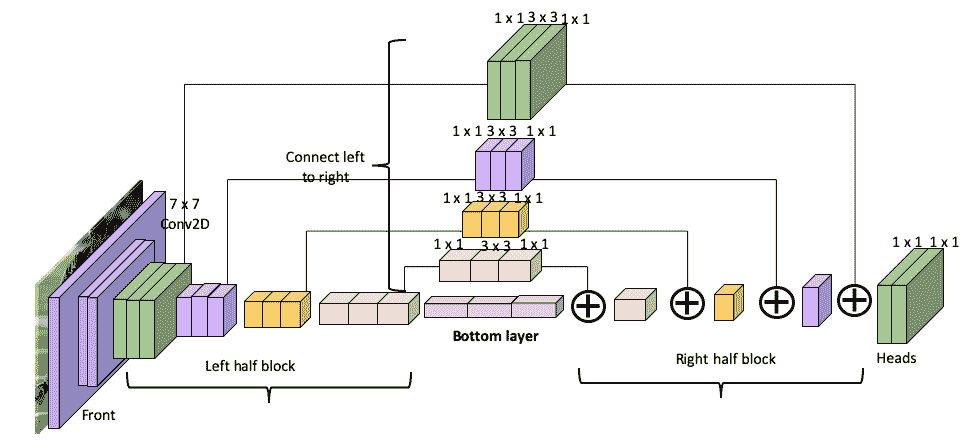
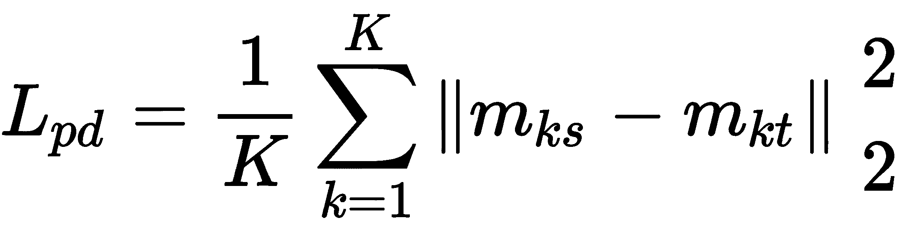
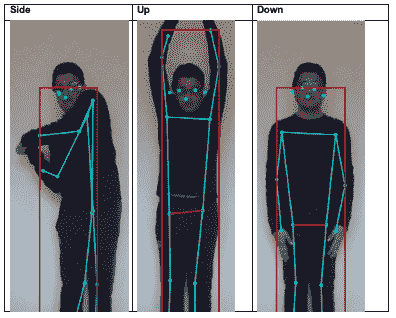
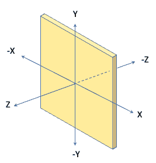
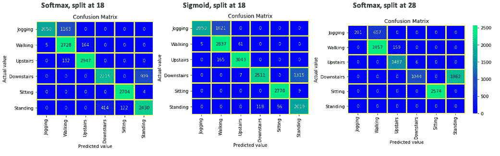

# 使用多任务深度学习进行动作识别

动作识别是计算机视觉的关键部分，涉及识别人的手，腿，头和身体的位置，以检测特定的运动并将其分类为众所周知的类别。 困难在于视觉输入（例如，身体凌乱或衣服被覆盖）的变化，类似的动作，不同的类别（如饮用水或使用手持手机的通话）以及获得代表性的训练数据。

本章详细概述了可用于人体姿势估计和动作识别的关键方法。 动作识别将姿势估计方法与基于加速度的活动识别以及基于视频和三维点云的动作识别相结合。 该理论将通过使用 TensorFlow 2.0 的实现解释加以补充。

本章分为四个部分。 前三个讨论了可用于人体姿势估计的三种不同方法，而第四个全部涉及动作识别：

*   人体姿势估计– OpenPose
*   人体姿势估计–堆叠沙漏模型
*   人体姿势估计-PoseNet
*   使用各种方法进行动作识别

# 人体姿势估计– OpenPose

人体姿势估计是深度神经网络取得巨大成功的另一个领域，并且近年来发展迅速。 在最后几章中，我们了解到深度神经网络结合使用线性（卷积）和非线性（ReLU）运算来预测给定输入图像集的输出。 在姿势估计的情况下，当提供一组输入图像时，深度神经网络会预测关节位置。 图像中的标记数据集由一个边界框组成，该边界框确定图像中的`N`个人和每人`K`关节。 随着姿势的改变，关节的方向也会改变，因此通过观察关节的相对位置来表征不同的位置。 在以下各节中，我们将描述可以使用的不同姿势估计方法。

# OpenPose 背后的理论

OpenPose 是第一个针对图像或视频中的多个人的开源实时二维姿态估计系统。 它主要由**卡内基梅隆大学**（**CMU**）的学生和教职员工开发。 论文的标题是 *OpenPose：使用零件亲和力字段进行实时多人 2D 姿势估计*，作者是 Zhe Cao，Gines Hidalgo，Tomas Simon，Shih-En-Wei 和 Yaser Sheikh。 您可以在[这个页面](https://arxiv.org/abs/1812.08008)上找到该论文。

请注意，OpenPose 首次出现在 CVPR 2017 中，题目为*，使用部分相似性字段*进行实时多人 2D 姿势估计，可在[中找到 https://arxiv.org/abs /1611.08050](https://arxiv.org/abs/1611.08050) 。 接下来是 2018 年的论文 *OpenPose：使用零件相似性字段的实时多人 2D 姿势估计*，网络得到了进一步改善。

本文的主要发现如下：

*   网络的输入由 VGG-19 模型的前 10 层组成，用于生成一组特征图`F`。 下图显示了 OpenPose 网络的体系结构：


*   OpenPose 网络将特征图作为输入，并由 CNN 的两个阶段组成：第一阶段使用`T[p]`编号预测**部分相似性字段**（**PAF**） 迭代次数，而第二阶段则以`T[c]`迭代次数预测置信度图。 由于以下两个关键指标，2018 年提出的 OpenPose 模型是对 2017 年提出的早期模型的总体改进：
*   通过先计算 PAF，再计算置信度图，可将计算时间减少一半。 这不同于两者的同时计算以及用 3 x 3 卷积代替 7 x 7 卷积。
*   改进的 PAF 估计（2018 年论文）通过增加神经网络的深度来改善常规 PAF（2017 年）的置信度图，从而提高了准确率。
*   在下一阶段中，将前一阶段的预测与原始图像特征`F`合并在一起，以为图像中的所有人产生二维关键点预测。 在估计的预测，地面真实特征图和 PAF 之间的每个阶段的末尾都应用了损失函数。 重复此过程几次迭代，从而得到最新的特征图和 PAF 检测。
*   使用基于特征向量的自下而上的方法，无论图像中有多少人，都可以实现高精度。
*   置信度图是特定特征（身体部位）可以位于任何给定像素中的概率的二维表示。 另一方面，特征图表示 CNN 给定层中给定过滤器的输出图。
*   网络体系结构由几个 1 x 1 和 3 x 3 内核组成。 每个 3 x 3 内核的输出是串联的。
*   OpenPose 是第一个实时多人系统，使用三个独立的 CNN 块检测 135 个关键点：（a）身体和脚部检测，（b）手部检测和（c）人脸检测。
*   在对象检测讨论（“第 5 章”，*神经网络体系结构和模型*和“第 7 章”，*使用 YOLO* 进行对象检测）中，我们 发现，与诸如 SSD 或 YOLO 等单次检测方法相比，诸如 Faster R-CNN 之类的区域提议方法可带来更高的准确率，但速度却更低。 同样，对于人体姿势估计，自下而上的方法与自下而上的方法相比，具有较高的准确率，但速度较低。 自上而下的方法分别为每个由人组成的边界框提供图像。 自下而上的方法提供了由一个人的多个边界框组成的整个图像，从而产生了一个较小分辨率的人的图像。

在 2019 年，OpenPose 的作者以及其他一些人（Gines Hidalgo，Yaadhav Raaj，Haroon Idrees，Donglai Xiang，Hanbyul Joo，Tomas Simon1 和 Yaser Sheikh）提高了 OpenPose 的准确率和检测时间。 HTG0]单网络全身姿势估计。 您可以在[这个页面](https://arxiv.org/abs/1909.13423)上找到本文。

主要功能如下：

*   不需要重复进行手和脸姿势检测的网络，因此与 OpenPose 相比，它的速度更快。 **多任务学习**（**MTL**）用于从四个不同任务中训练单个全身估计模型：身体，面部，手和脚检测。
*   通过连接面部，手和脚的置信度图可以增强关键点置信度图。 使用这种方法，所有关键点都在同一模型体系结构下定义。
*   网络体系结构的输入分辨率和卷积层数增加了，以提高整体精度。
*   对于其中只有一个人的图像，检测时间输出比 OpenPose 快 10％。

# 了解 OpenPose 代码

CMU 使用 OpenPose 模型，而 OpenCV 在其新的**深层神经网络**（**DNN**）框架中集成了经过预训练的 OpenPose 模型。 可以从下面的 GitHub 页面下载整个代码块。 该模型使用 TensorFlow 示例，而不是 OpenPose 作者最初使用的 Caffe 模型，可以在[这个页面](https://github.com/quanhua92/human-pose-estimation-opencv)中找到。

可以使用以下命令在终端中执行 OpenCV 的 OpenPose 代码：

```py
python openpose.py --input image.jpg
```

要开始使用 PC 的网络摄像头，只需在终端中键入以下内容：

```py
python openpose.py
```

下图显示了针对足球运动员图像的 OpenPose 实现：


该算法容易受到背景图像的影响，如以下棒球运动员的图像所示：


去除背景后，该算法的预测非常好。

让我们来看一下代码的主要功能。 我们将定义关键点，然后构建预测模型：

1.  该模型输入 18 个身体部位和姿势对，如下所示：

```py
BODY_PARTS = { "Nose": 0, "Neck": 1, "RShoulder": 2, "RElbow": 3, "RWrist": 4,"LShoulder": 5, "LElbow": 6, "LWrist": 7, "RHip": 8, "RKnee": 9,"RAnkle": 10, "LHip": 11, "LKnee": 12, "LAnkle": 13, "REye": 14,"LEye": 15, "REar": 16, "LEar": 17, "Background": 18 }

POSE_PAIRS = [ ["Neck", "RShoulder"], ["Neck", "LShoulder"], ["RShoulder", "RElbow"],["RElbow", "RWrist"], ["LShoulder", "LElbow"], ["LElbow", "LWrist"],["Neck", "RHip"], ["RHip", "RKnee"], ["RKnee", "RAnkle"], ["Neck", "LHip"],["LHip", "LKnee"], ["LKnee", "LAnkle"], ["Neck", "Nose"], ["Nose", "REye"],["REye", "REar"], ["Nose", "LEye"], ["LEye", "LEar"] ]
```

2.  接下来，使用以下代码通过 TensorFlow 实现 OpenPose：

```py
net = cv.dnn.readNetFromTensorflow("graph_opt.pb")
```

使用 tf-pose-estimation 在 TensorFlow 中实现 OpenPose。 TensorFlow / model / graph 的实际 GitHub 页面可在[这个页面](https://github.com/ildoonet/tf-pose-estimation/blob/master/models/graph/mobilenet_thin/graph_opt.pb)中找到。 请注意，可以在[这个页面](https://arxiv.org/abs/1704.04861)中找到 MobileNetV1 的描述。

3.  接下来，使用`cv.dnn.blobFromImage`对图像进行预处理（执行减法和缩放）：

```py
net.setInput(cv.dnn.blobFromImage(frame, 1.0, (inWidth, inHeight), (127.5, 127.5, 127.5), swapRB=True, crop=False))
```

4.  接下来，我们使用`out = net.forward()`预测模型的输出，并获得 MobileNetV1 输出的前 19 个元素：

```py
out = out[:, :19, :, :] .
```

5.  以下代码计算热图，使用 OpenCV 的`minMaxLoc`函数查找点值，并在其置信度高于阈值时添加点。 热图是用颜色表示的数据图：

```py
for i in range(len(BODY_PARTS)):
    # Slice heatmap of corresponding body's part.
    heatMap = out[0, i, :, :]
    # Originally, we try to find all the local maximums. To simplify a     sample
    # we just find a global one. However only a single pose at the same     time
    # could be detected this way.
    _, conf, _, point = cv.minMaxLoc(heatMap)
    x = (frameWidth * point[0]) / out.shape[3]
    y = (frameHeight * point[1]) / out.shape[2]
    # Add a point if it's confidence is higher than threshold.
    points.append((int(x), int(y)) if conf > args.thr else None)
```

6.  以下代码块在原始图像中使用`cv.line`和`cv.ellipse`显示关键点：

```py
for pair in POSE_PAIRS:
    partFrom = pair[0]
    partTo = pair[1]
    assert(partFrom in BODY_PARTS)
    assert(partTo in BODY_PARTS)
    idFrom = BODY_PARTS[partFrom]
    idTo = BODY_PARTS[partTo]
    if points[idFrom] and points[idTo]:
       cv.line(frame, points[idFrom], points[idTo], (0, 255, 0), 3)
       cv.ellipse(frame, points[idFrom], (3, 3), 0, 0, 360, (0, 0, 255),        cv.FILLED)
       cv.ellipse(frame, points[idTo], (3, 3), 0, 0, 360, (0, 0, 255),         cv.FILLED)
```

到目前为止，我们已经使用 OpenPose 通过自下而上的方法来确定多个身体姿势。 在下一节中，我们将使用堆叠的沙漏方法，该方法同时使用了自上而下和自下而上的方法。

# 人体姿势估计–堆叠沙漏模型

堆叠沙漏模型是由 Alejandro Newell，Kaiyu Yang 和 Jia Deng 于 2016 年在他们的论文*用于人体姿势估计的堆叠沙漏网络*中开发的。 可以在[这个页面](https://arxiv.org/abs/1603.06937)中找到该模型的详细信息。

下图说明了该模型的体系结构：



该模型的主要功能如下：

*   通过将多个沙漏堆叠在一起，可在所有刻度上重复进行自下而上和自上而下的处理。 该方法导致能够验证整个图像的初始估计和特征。
*   该网络使用多个卷积和一个最大池化层，这导致最终分辨率较低，然后再进行上采样以提高分辨率。
*   在每个最大池化步骤中，平行于主网络添加其他卷积层。
*   输出结果将产生热图，表示每个像素出现关节的概率。
*   该体系结构充分利用了残差模型。 每个残差都有三层：
*   1 x 1 Conv2D，可将尺寸从 256 减少到 128 通道
*   3 x 3 Conv2D 的 128 个通道
*   1 x 1 Conv2D，可将尺寸从 128 个通道增加到 256 个通道
*   该体系结构从 7 x 7 卷积开始，步幅为 2，将输入图像从 256 x 256 带到 64 x 64，从而可以有效地使用 GPU 内存。
*   跨度为 2 的最大 2 x 2 合并用于对图像进行下采样。 在执行每个最大池化之前和之后，将残余块添加，然后在上采样到原始大小后再添加回主块。
*   最后的标题块由两个 1 x 1 Conv2D 组成。
*   表现最佳的是将八个沙漏模块堆叠在一起。 每个沙漏模块在每个分辨率下都有一个残差模块。
*   该模型大约需要进行 40,000 次迭代，以达到 70％以上的精度。
*   培训过程需要 FLIC 约 5,000 张图像（用于培训的 4,000 张和用于测试的 1,000 张）和用于 MPII 的 40,000 张带批注的样本（用于培训的 28,000 张和用于测试的 12,000 张）。 [FLIC](https://bensapp.github.io/flic-dataset.html) 和 [MPII](http://human-pose.mpi-inf.mpg.de) 是两个姿势估计数据库。 FLIC 由从胶片中获取的 5003 张图像（用于培训的 3987 张图像和用于测试的 1,016 张图像）组成，而 MPII 由 40,000 个带注释的样本（用于培训的 28,000 张图像和用于测试的 12,000 张）组成。
*   该网络在 Torch 7 上进行了培训，学习率为 2.5e-4。 在 12 GB 的 NVIDIA Titan X GPU 上进行培训大约需要 3 天。

# 了解沙漏模型

沙漏模型在 MPII 人类姿态数据集中的所有关节上都达到了最先进的结果，但这是以占用资源密集型网络带宽为代价的。 这是由于每层通道数量众多而导致训练困难。 张峰，朱夏田和毛 Mao 在题为*快速人体姿态估计*的论文中，将 **FastPose 蒸馏**（**FPD**）引入 CVPR 2019。 与沙漏模型相比，FPD 可以实现更快，更经济的模型推断，同时达到相同的模型性能。 主要功能如下：

*   四个沙漏（而不是八个）可以预测 95％的模型准确率。
*   从 256 个通道下降到 128 个通道只会导致精度降低 1％。
*   首先，在大型沙漏模型（也称为教师姿势模型）上进行训练。 然后，在教师姿势模型的帮助下训练目标学生模型（四个沙漏，128 个通道）。 定义了蒸馏损失函数，以从教师模型中提取知识并将其传递给学生模型。
*   姿势蒸馏损失函数如下：



在这里，`K`是关节总数， *L <sub>pd</sub>* 是 FPD 的预测关节置信度图， *m <sub>ks</sub>* 是学生模型预测的`$1[$2]`关节的置信度图，而 m *<sub>kt</sub>* 是 教师模型预测的`k`<sub>th</sub> 联合。

*   总体损失函数如下：


此处， *L <sub>fpd</sub>* 是整体 FPD 损失函数， *L <sub>gt</sub>* 是用于地面真相注释的置信度图，而`M`是权重函数。

*   使用前面描述的损失函数分别训练教师模型和目标模型。

可在[这个页面](https://github.com/yuanyuanli85/Stacked_Hourglass_Network_Keras)中找到该模型的 Keras 实现。

请注意，下一部分的目的是详细解释沙漏网络的代码。 这是一个复杂的神经网络模型，其想法是，一旦掌握了这些代码，您就应该能够自己构建一个非常复杂的神经网络模型。 我们不会在前面的 GitHub 页面上详细说明如何运行代码。

在下一部分中，我们将描述模型的体系结构并进行详细说明。

# 编码沙漏模型

下图显示了沙漏模型的编码块：


让我们花一点时间来理解前面的图，因为我们将在以下部分中对其进行编码：

*   前模块将图像作为输入和通道数（每层的第三个尺寸，前两个尺寸是宽度和高度）。
*   图像穿过前模块的不同层，最后一个模块连接到左半块。
*   左半块具有四个瓶颈回旋块-f1，f2，f4 和 f8，每个块分别具有 1、1 / 2、1 / 4 和 1/8 的分辨率。 如果查看架构图，就在堆叠的沙漏感应下，这应该很清楚。
*   每个块的最后一层– f1，f2，f4 和 f8 –创建一个对应的特征图，即 lf1，lf2，lf4 和 lf8。
*   功能图 lf1，lf2，lf4 和 lf8 连接到右半块。 该块的输出为 rf1。
*   底层也从左半块连接到 lf8 特征图。
*   头块连接到 rf1。 总共有两个头块。 每个使用 1 x 1 卷积。

让我们看一下不同的代码块。

# argparse 块

Python 命令行参数（通过终端输入）允许程序通过`parser.add_argument`命令获取有关神经网络操作的不同指令。 可以从`argparse`功能包中导入。

下图显示了 16 种不同的类：


上图使用的代码块如下：

```py
0 - r ankle, 1 - r knee, 2 - r hip, 3 - l hip, 4 - l knee, 5 - l ankle, 6 - pelvis, 7 - thorax, 8 - upper neck, 9 - head top, 10 - r wrist, 11 - r elbow, 12 - r shoulder, 13 - l shoulder, 14 - l elbow, 15 - l wrist
```

以下代码导入`argparse`模块，TensorFlow 和 HourglassNet 模型。 它有两种类型的用户可选模型：用于小型网络的 128 个通道和用于大型网络的 256 个通道：

```py
import argparse
import os
import tensorflow as tf
from keras import backend as k
from hourglass import HourglassNet
parser.add_argument("--resume", default=False, type=bool, help="resume training or not")
parser.add_argument("--resume_model", help="start point to retrain")
parser.add_argument("--resume_model_json", help="model json")
parser.add_argument("--init_epoch", type=int, help="epoch to resume")
parser.add_argument("--tiny", default=False, type=bool, help="tiny network for speed, inres=[192x128], channel=128")
args = parser.parse_args()
if args.tiny:
    xnet = HourglassNet(num_classes=16, num_stacks=args.num_stack, num_channels=128, inres=(192, 192),outres=(48, 48))
else:
xnet = HourglassNet(num_classes=16, num_stacks=args.num_stack, num_channels=256, inres=(256, 256),outres=(64, 64))
if args.resume:
    xnet.resume_train(batch_size=args.batch_size, model_json=args.resume_model_json,model_weights=args.resume_model,init_epoch=args.init_epoch, epochs=args.epochs)
else:
xnet.build_model(mobile=args.mobile, show=True)
xnet.train(epochs=args.epochs, model_path=args.model_path, batch_size=args.batch_size)
```

# 训练沙漏网络

沙漏网络已被描述。 在本节中，我们将解释培训网络背后的代码。

如果您想训练自己的沙漏网络，请按照[这个页面](https://github.com/yuanyuanli85/Stacked_Hourglass_Network_Keras)上的说明进行操作。

训练沙漏网络的代码如下：

```py
def build_model(self, mobile=False, show=False):
if mobile:
   self.model = create_hourglass_network(self.num_classes, self.num_stacks, self.num_channels, self.inres, self.outres, bottleneck_mobile)
 else:
    self.model = create_hourglass_network(self.num_classes, self.num_stacks,self.num_channels, self.inres, self.outres, bottleneck_block)
# show model summary and layer name
  if show:
     self.model.summary(def train(self, batch_size, model_path, epochs):
      train_dataset = MPIIDataGen("../../data/mpii/mpii_annotations.json", "../../data/mpii/images"
        inres=self.inres, outres=self.outres, is_train=True)
#here MPIIDataGen is a data generator function (not shown here) - it takes in json file and the images to preapre data for training similar to how we use image data generator in Chapter6.
        train_gen = train_dataset.generator(batch_size, self.num_stacks, sigma=1, is_shuffle=True,rot_flag=True, scale_flag=True, flip_flag=True)
csvlogger = CSVLogger(os.path.join(model_path, "csv_train_" + str(datetime.datetime.now().strftime('%H:%M')) + ".csv"))
modelfile = os.path.join(model_path, 'weights_{epoch:02d}_{loss:.2f}.hdf5')
checkpoint = EvalCallBack(model_path, self.inres, self.outres)
xcallbacks = [csvlogger, checkpoint]
self.model.fit_generator(generatepochs=epochs, callbacks=xcallbacks)
```

前面的代码是如何设置神经网络进行训练的典型示例。 我们在“第 6 章”，*使用转移学习的视觉搜索*中对此进行了详细介绍。 主要功能如下：

*   `create_hourglass_network`是主要型号。
*   `train_dataset`使用 MPIIDatagen，这是用于输入数据的外部模块。
*   `train_gen`输入`train_dataset`并放大图像。
*   它包含回调和检查点，因此我们可以在训练过程中了解模型的内部状态。
*   `model.fit_generator`开始训练过程。

# 创建沙漏网络

沙漏模型代码的实际实现将在此处说明。 用于此的代码称为`create_hourglass_network`。 如前所述，该代码具有以下组件。

# 前模块

以下代码描述了前端模块：

```py
def create_front_module(input, num_channels, bottleneck):
    _x = Conv2D(64, kernel_size=(7, 7), strides=(2, 2), padding='same',         activation='relu', name='front_conv_1x1_x1')(input)
    _x = BatchNormalization()(_x)
    _x = bottleneck(_x, num_channels // 2, 'front_residual_x1')
    _x = MaxPool2D(pool_size=(2, 2), strides=(2, 2))(_x)
    _x = bottleneck(_x, num_channels // 2, 'front_residual_x2')
    _x = bottleneck(_x, num_channels, 'front_residual_x3')
    return _x
front_features = create_front_module(input, num_channels, bottleneck)
```

如前所述，它由一个 Conv2D 块组成，总共有 64 个滤波器，滤波器大小为 7 x 7，步幅为 2。该块的输出为`(None, 32, 32,6)`。 接下来的几行贯穿批量规范化，瓶颈和最大池化层。 让我们定义瓶颈块。

# 左半块

左半块的代码如下：

```py
def create_left_half_blocks(bottom, bottleneck, hglayer, num_channels):
# create left half blocks for hourglass module
# f1, f2, f4 , f8 : 1, 1/2, 1/4 1/8 resolution
hgname = 'hg' + str(hglayer)
f1 = bottleneck(bottom, num_channels, hgname + '_l1')
_x = MaxPool2D(pool_size=(2, 2), strides=(2, 2))(f1)
f2 = bottleneck(_x, num_channels, hgname + '_l2')
_x = MaxPool2D(pool_size=(2, 2), strides=(2, 2))(f2)
f4 = bottleneck(_x, num_channels, hgname + '_l4')
_x = MaxPool2D(pool_size=(2, 2), strides=(2, 2))(f4)
f8 = bottleneck(_x, num_channels, hgname + '_l8')
return (f1, f2, f4, f8)
```

前面的代码执行两个特定的操作：

*   它定义分辨率为`1, ½, ¼, and 1/8`的滤波器系数`(f1, f2, f4, and f8)`。
*   对于每个过滤器块，它通过使用 2 的过​​滤器和 2 的跨度应用最大池化来生成最终输出。

接下来，下面的代码迭代从 0 到 2，以每个滤镜分辨率创建三个滤镜块：

```py
for i in range(2):
head_next_stage, head_to_loss = create_left_half_blocks (front_features, num_classes, num_channels, bottleneck, i)
outputs.append(head_to_loss)
```

# 从左到右连接

如果查看*编码沙漏模型*部分开头的图像，您会注意到左右两个块由`connect_left_to_right`块连接。 用于将左侧块连接到右侧块的代码如下：

```py
def connect_left_to_right(left, right, bottleneck, name, num_channels):
'''
:param left: connect left feature to right feature
:param name: layer name
:return:
'''
_xleft = bottleneck(left, num_channels, name + '_connect')
_xright = UpSampling2D()(right)
add = Add()([_xleft, _xright])
out = bottleneck(add, num_channels, name + '_connect_conv')
return out
```

注意，每个右块是通过上采样生成的，并被添加到左块以生成最终输出。 在前面的代码中，`_xleft`显示左侧块，`_xright`显示右侧块，`add`函数将两者相加。

# 右半块

右侧块的代码如下：

```py
def create_right_half_blocks(leftfeatures, bottleneck, hglayer, num_channels):
lf1, lf2, lf4, lf8 = leftfeatures
rf8 = bottom_layer(lf8, bottleneck, hglayer, num_channels)
rf4 = connect_left_to_right(lf4, rf8, bottleneck, 'hg' + str(hglayer) + '_rf4', num_channels)
rf2 = connect_left_to_right(lf2, rf4, bottleneck, 'hg' + str(hglayer) + '_rf2', num_channels)
rf1 = connect_left_to_right(lf1, rf2, bottleneck, 'hg' + str(hglayer) + '_rf1', num_channels)
return rf1
```

在前面的代码中，`lf8, lf4, lf2, and lf1`具有左功能。 相应的右图块的特征`rf8, rf4, rf2, and rf1`是通过将左到右瓶颈图块应用到每个左图特征而生成的。 以下代码通过为每个左侧范围迭代 0 到 2 来应用此逻辑：

```py
for i in range(2):
head_next_stage, head_to_loss = create_right_half_blocks (front_features, num_classes, num_channels, bottleneck, i)
outputs.append(head_to_loss)
```

# 头块

头块的代码如下：

```py
def create_heads(prelayerfeatures, rf1, num_classes, hgid, num_channels):
# two head, one head to next stage, one head to intermediate features
head = Conv2D(num_channels, kernel_size=(1, 1), activation='relu', padding='same', name=str(hgid) + '_conv_1x1_x1')(rf1)
head = BatchNormalization()(head)
# for head as intermediate supervision, use 'linear' as activation.
head_parts = Conv2D(num_classes, kernel_size=(1, 1), activation='linear', padding='same',name=str(hgid) + '_conv_1x1_parts')(head)
# use linear activation
head = Conv2D(num_channels, kernel_size=(1, 1), activation='linear', padding='same',name=str(hgid) + '_conv_1x1_x2')(head)
head_m = Conv2D(num_channels, kernel_size=(1, 1), activation='linear', padding='same',name=str(hgid) + '_conv_1x1_x3')(head_parts)
head_next_stage = Add()([head, head_m, prelayerfeatures])
return head_next_stage, head_parts
```

磁头有两个主要块，每个块由一个 1 x 1 Conv2D 滤波器组成。 它使用激活层和填充。 作为复习，请参考*人体姿势估计-沙漏模型*部分下显示的沙漏架构图，以了解以下组件之间的联系：

*   进入下一个阶段
*   前往中间特征

以下逻辑将头块应用于 0 到 2 的每个范围，分别对应于左块和右块：

```py
for i in range(2):
    head_next_stage, head_to_loss = create_head_blocks (front_features, num_classes, num_channels, bottleneck, i)
    outputs.append(head_to_loss)
```

# 沙漏训练

沙漏网络在 FLIC 人体姿势数据集上进行了训练，该数据集包含 5,000 张图像（用于训练的 4,000 和用于测试的 1,000）和具有 40,000 图片（用于训练的 28,000 和用于测试的 12,000）的 MPII 人体姿势数据集。

请注意，在本书中，我们没有使用 MPII 数据集来训练沙漏模型。 提供了有关 MPII 数据集的信息，以解释如何训练沙漏模型进行人体姿势估计。

在大约 20,000 次训练迭代中，所有关节的平均准确率达到大约 70％，最大准确率大约为 80％。

到目前为止，我们已经讨论了 OpenPose 和姿势估计的堆叠沙漏方法。 在下一节中，我们将讨论 PoseNet。

# 人体姿势估计-PoseNet

TensorFlow 发布了 PoseNet 模型，该模型用于使用浏览器检测人体姿势。 它可以用于单个姿势和多个姿势。

PoseNet 基于 Google 的两篇论文。 一种使用自上而下的方法，而另一种使用自下而上的方法。

# 自上而下的方法

第一篇论文的标题为*，其目的是在野外进行准确的多人姿势估计*，由 George Papandreou，Tyler Zhu，Nori Kanazawa，Alexander Toshev，Jonathan Tompson，Chris Bregler 和 Kevin Murphy 撰写。 您可以在[这个页面](https://arxiv.org/abs/1701.01779)上找到该论文。

这是一种由上而下的两阶段方法：

*   使用带有 ResNet-101 网络主干的 Faster R-CNN 确定边界框坐标（ *x，y，w，h* ）。 在“第 5 章”，*神经网络架构和模型*中引入了更快的 R-CNN 和 ResNet，但在“第 10 章”中将在实际实现中一起使用它们。 ]，*使用 R-CNN，SSD 和 R-FCN* 进行对象检测。 这种分类仅针对人类进行。 调整返回的所有边界框，使其具有固定的纵横比，然后将其裁剪为 353 x 257。
*   使用 ResNet-101 估算位于每个边界框内的人的 17 个关键点，用 3 x 17 输出替换最后一层。 已经使用分类和回归相结合的方法来找到人体的每个位置与 17 个关键点位置中的每个位置之间的偏移矢量或距离。 每 17 个关键点计算一次距离小于半径的概率，从而得出 17 个热图。 使用 Sigmoid 激活函数训练具有 17 个热图的 ResNet-101 模型。

# 自下而上的方法

第二篇论文的标题为 *PersonLab：具有自下而上的，基于零件的几何嵌入模型*的人员姿势估计和实例细分，由第一篇论文的许多相同作者撰写； 分别是 George Papandreou，Tyler Zhu，Chen-Chieh Chen，Spyros Gidaris，Jonathan Tompson 和 Kevin Murphy。 您可以在[这个页面](https://arxiv.org/abs/1803.08225)上找到该论文。

在这种无框的，自下而上的方法中，作者使用卷积神经网络检测单个关键点及其相对位移，以将关键点分组为人的姿势实例。 另外，设计了几何嵌入描述符来确定人员分割。 该模型使用 ResNet-101 和 ResNet-152 体系结构进行训练。

像自顶向下方法一样，定义了一个 32 像素大小的半径，对应于 17 个关键点中的每一个。 然后，如果图像中的空间位置在关键点位置的半径之内，则以热图概率 1 定义 17 个独立的二元分类任务； 否则，将其设置为 0。与自顶向下方法一样，图像位置和关键点之间的距离也称为短距离偏移矢量。 因此，存在 17 个这样的偏移矢量。 与自顶向下方法一样，热图和偏移向量使用二维 Hough 得分图分组在一起。

在这种方法中，我们有一个与关键点相关联的人，但是当图像中存在多个人的实例时，这不允许我们对每个人的关键点进行分组。 为了解决这个问题，开发了 32 个独立的中距离二维偏移量字段来连接成对的关键点。 除此之外，还开发了一个由单个 1 x 1 Conv2D 层组成的简单语义分割模型，该模型可以执行密集逻辑回归并计算每个图像像素至少属于一个人的概率。 语义分段的详细信息在“第 8 章”，[《语义分段和神经样式转换》](https://cdp.packtpub.com/mastering_computer_vision_with_tensorflow_2_0/wp-admin/post.php?post=31&action=edit)中进行了描述。

有关预测图像的信息，[请参阅以下有关自上而下与自下而上的文章](https://arxiv.org/abs/1701.01779)和[这个](https://arxiv.org/abs/1803.08225)。 这两篇论文都包含大量示例图像。

预测关键点在两种方法之间或多或少是相同的，但是自上而下的方法从绘制边界框开始，而自下而上的方法执行语义分割。

# PoseNet 实施

到目前为止，我们已经讨论了 PoseNet 自上而下和自下而上方法背后的理论。 在本节中，我们将使用 PoseNet 识别这些操作。 有关如何实现 PoseNet 模型的详细信息，请参见[这里](https://github.com/tensorflow/tfjs-models/tree/master/posenet)。 查看此链接以了解 PoseNet 的文档。

接下来，我们将进行现场演示。 此实时演示是使用网络摄像头完成的，[可以通过在网络浏览器中键入以下链接来启动](https://storage.googleapis.com/tfjs-models/demos/posenet/camera.html)。

尽管自上而下和自下而上的方法使用 ResNet-101 模型，但 PoseNet 模型使用 MobileNetV1 或 ResNet-50。 下表说明了它们之间的区别：

|  | **MobileNet V1** | **ResNet 50** |
| **步幅** | 16 | 32 |
| **输入分辨率** | 宽度：640，高度：480 | 宽度：257，高度：200 |

PoseNet 网站说明了如何调整模型参数。 可以使用以下屏幕快照中显示的参数窗口来调整模型参数：


在前面的屏幕截图中，我们可以通过更改输入图像的分辨率来演示这两种模型，这似乎效果最好。

下图比较了八种不同配置（对于 MobileNetV1 和 ResNet，分辨率为 200 和 500 的上下姿势）的 PoseNet 输出：


上图显示，当人的手举起时，ResNet 平均比 MobileNetV1 更准确。 当手的位置向下时，性能大致相同。 同样，与 500 分辨率相比，200 分辨率可实现更好的关键点预测。 边界框选项可用，但未显示。 下图显示了用于其他配置的 ResNet 的边界框：



请注意边界框的大小和位置在不同方向上如何变化。 关键点存储在向量中。 生成的关键点之间的角度可用于预测动作。 上一个图像由三个不同的动作组成–侧向运动，向上和向下运动。 这些动作的关键角度不会重叠，因此预测将是可靠的。

# 将人体姿势应用于手势识别

到目前为止，我们已经学习了如何在给定的关键点上进行训练以生成人体姿势。 手势识别的过程类似。 请按照以下步骤执行手势识别以进行手部运动：

1.  收集不同手位置的图像-上，下，左和右。
2.  调整图像大小。
3.  此时，您可以用关键点标记图像。 如果为关键点标记图像，则每个图像都必须用相应的关键点表示。
4.  将图像及其相应的标签加载到两个不同的数组中。

5.  下一步是执行图像分类，类似于我们在“第 6 章”，*使用转移学习*进行视觉搜索时所做的工作。
6.  CNN 模型最多可以包含三个 Conv2D 层，一个最大合并层和一个 ReLU 层。
7.  对于关键点估计，而不是分类，我们将使用每个关键帧手势位置之间的距离，并选择具有最小距离的手势。

到目前为止，我们已经学习了如何开发用于训练的二维神经网络。 我们开发的网络也可以用于生产。

# 使用各种方法进行动作识别

加速度计测量加速度的`x`，`y`和`z`分量，如下图所示：



加速度计的这一特性使其可以放置在可穿戴设备中，例如安装在腕带上的手腕上的手机，智能手表，甚至是鞋子中，以测量加速度的 XYZ 分量。 在本节中，我们将学习如何使用神经网络分析加速度计数据以识别人类活动。 我们将使用 TensorFlow 开发机器学习模型。 这是本书中唯一讨论无图像的原始数据以及如何将其传递到神经网络以开发模型并从中进行推断的章节。

人类活动识别涉及基于加速度计数据对不同类型的活动进行分类。 这里的挑战是关联从不同类型的人体运动生成的加速度计数据，并基于不同的人体运动和活动来区分相似的加速度计轨迹。 例如，当左手移动和右手移动安装到人的腰部时，可能会产生类似的加速度计数据。 这减轻了加速度计数据应与姿势估计或视频图像数据结合的事实。 在本节中，我们将讨论可用于人类活动识别的两种不同工具。

# 基于加速度计识别动作

此方法涉及以下步骤：

1.  **处理输入的加速度计数据**：加速度计数据对其位置敏感。 例如，如果安装在腰部区域，则与安装在手臂中相比，手部运动不会在加速度计中看到很大的变化。 另外，对于不同的位置，需要收集不同的数据，然后进行组合。
2.  **准备数据以便可以将其输入到 TensorFlow** 中：使用`tf.data.Dataset`加载数据以开发简单，高效的数据管道。 `tensor_slices`命令从输入中提取一片数据。
3.  **开发 CNN 模型并对其进行训练**：一层或两层密集层，最后具有 flatten 和 softmax 功能。
4.  **检查测试数据**：对照测试数据验证数据。

请参阅以下 GitHub 页面上的代码，[以获取遵循这些步骤的代码示例](https://github.com/PacktPublishing/Mastering-Computer-Vision-with-TensorFlow-2.0/blob/master/Chapter09/Chapter9_TF_Accelerometer_activity.ipynb)。

在上一个链接中可以找到两个文件：`Chapter9_TF_Accelerometer_activity.ipynb`和`sample.csv`。 下载两个文件，并将它们放在同一文件夹下。

`sample.csv`文件是一个示例 CSV 文件，其中包含用于六个不同动作的加速度计*（x，y，z）*数据：慢跑（0），步行（1），楼上（2），楼下（3） ，坐（4）和站立（5），每个动作都包含 5,000 个数据点。 在您的实际情况下，这些数据值可能会根据放置位置和所使用的加速度计的类型而有所不同。 最好使用相同的加速度计进行训练数据进行推理，以避免推理错误。

接下来，根据索引文件将数据分为两部分：训练和测试。 在这里，我们将评估两个不同的分割 18 和 28，这意味着在一种情况下，如果索引文件小于 18，则数据属于 train 文件夹； 否则，它属于测试文件夹。 该模型加载了三个密集（全连接）的层，分辨率为 128。 最终的 softmax 层被 Sigmoid 函数代替。 下图显示了在三种不同情况下模型的迭代：

*   Softmax，火车与测试的索引为 18
*   Sigmoid 函数，在索引 18 处分割，用于训练与测试
*   Softmax，火车与测试的索引为 28：


前面的数据表明，每次迭代大约需要 40 秒，最终精度约为 0.97。 下图以图形方式说明了这一点：


前面的曲线表明，在所研究的三个条件下，列车的精度基本相同。 为了进一步分析这一点，让我们看一下下图中所示的置信度图：



混淆矩阵指示测试数据与预测数据的比较程度。 在这里，我们可以看到在索引 18 处进行了训练分割的 Softmax 函数比其他站立和步行案例提供了更好的结果。 不出所料，Softmax 与 Sigmoid 激活函数没有导致任何显着差异。 一旦开发了模型，就可以使用模型的预测功能来预测实际测试情况下的数据。

# 将基于视频的动作与姿势估计相结合

动作识别可以是二维的，也可以是三维的。 二维动作识别方法使用人体的关节信息，以关键点表示。 这些关键点以称为特征图的向量表示。 另一方面，三维动作识别方法不仅需要特征图，还需要全身的骨架数据。 可以使用深度传感器（例如 Microsoft Kinect 或 Intel RealSense）获得此数据。 在 2018 年，Diogo C.Luvizon，David Picard 和 Hedi Tabia 介绍了他们的论文 *2D / 3D 姿势估计和使用多任务深度学习的动作识别*。 可以在[这里](https://arxiv.org/abs/1802.09232)中找到本文的详细信息。

在本文中，作者在一个多任务框架中将基于高级人体关节的姿势信息与低级视觉特征（来自对象识别和特征识别）集成在一起。 该方法能够进行二维和三维动作识别。 使用体积表示将二维姿态图扩展为三维图。

这些技术的组合有助于使动作识别对类似身体的关节运动（如饮用水和打个电话）的抵抗力更强。

# 使用 4D 方法进行动作识别

4D 动作识别意味着体积表示的三维动作是时间的函数。 可以将其视为对动作进行批量跟踪。 全全友和郝江提出了一种新颖的 4D 方法，名为 *Action4D：人群和杂物中的在线动作识别。* 可以在[这个页面](http://www.hao-jiang.net/papers/conference/cvpr2019.pdf)中找到本文的详细信息。

该方法使用 4D 表示跟踪人类，并在混乱和拥挤的环境中识别他们的行为。 本文的概念如下：

*   使用多个 RGBD 图像为每个场景创建三维点云。
*   在拥挤场景中的检测得到了创新的跟踪建议的补充，该提议不使用背景减法，这意味着它在拥挤空间中不太容易出错。
*   跟踪过程通过训练 3 维 CNN（具有 3 维卷积，ReLU 和池化层）来使用候选人提案，以将每个候选量分类为人与非人。
*   使用一系列三维体积识别动作，这些三维体积经过一系列三维卷积和池化层（称为 Action4D）。

# 概要

在本章中，我们了解并实现了三种不同的姿势估计方法-OpenPose，堆叠式沙漏和 PostNet。 我们学习了如何使用 OpenCV 和 TensorFlow 预测人类关键点。 然后，我们了解了堆叠沙漏方法的详细理论和 TensorFlow 实现。 我们向您展示了如何在浏览器中评估人体姿势，以及如何使用网络摄像头实时估计关键点。 然后将人体姿势估计与动作识别模型链接，以演示如何使用两者来提高准确率。 基于加速的代码展示了如何使用 TensorFlow 2.0 加载数据，训练模型和预测动作。

在下一章中，我们将学习如何实现 R-CNN 并将其与其他 CNN 模型（如 ResNet，Inception 和 SSD）结合使用，以提高对象检测的预测，准确率和速度。