# 回归和分类的综合方法

商业企业广泛使用高级分析工具，以解决使用数据的问题。 分析工具的目的是分析数据并提取相关信息，这些信息可用于解决问题或提高业务某些方面的绩效。 它还涉及各种机器学习算法，通过这些算法我们可以创建预测模型以获得更好的结果。

在本章中，我们将探索一个可以大大改善基本预测模型性能的简单想法。

我们将在本章中介绍以下主题：

*   合奏方法及其工作
*   集成回归方法
*   归类方法

# 合奏方法及其工作

集成方法基于一个非常简单的思想：我们不是使用单个模型进行预测，而是使用许多模型，然后使用某种方法来**汇总**预测。 具有不同的模型就像具有不同的观点，并且已经证明，通过汇总提供不同观点的模型，可以得到不同的结果。 预测可以更准确。 这些方法进一步提高了单个模型的通用性，因为它们降低了选择效果不佳的分类器的风险：

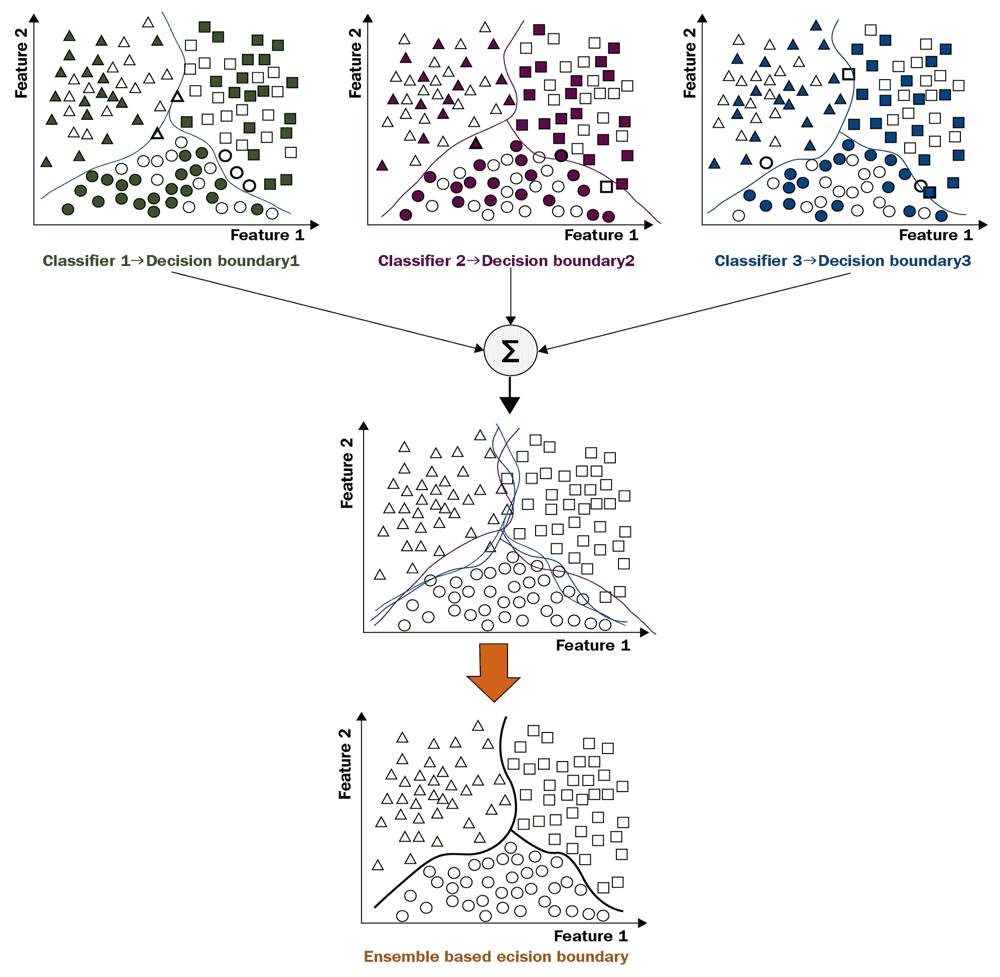

在上图中，我们可以看到每个对象属于三个类别之一：三角形，圆形和正方形。 在这个简化的示例中，我们有两个功能可以将对象分离或分类为不同的类。 如您在这里看到的，我们可以使用三个不同的分类器，并且这三个分类器都代表不同的方法并具有不同种类的决策边界。

集成学习将所有这些单独的预测合并为一个预测。 通过组合三个边界进行的预测通常比单个模型所产生的预测具有更好的性能。 这是集成方法（也称为**集成学习**）背后的简单思想。

最常用的合奏方法如下：

*   自举采样
*   装袋
*   随机森林
*   助推

在对这些方法进行高级解释之前，我们需要讨论一种非常重要的统计技术，称为**自举抽样**。

# 自举采样

许多集成学习方法都使用一种称为引导抽样的统计技术。 数据集的引导样本是另一个数据集，它是通过对原始数据集中的观测值**随机抽样并替换掉**而获得的。

例如，该技术在统计中大量使用。 它用于估计样本统计量的标准误差，例如平均值或标准偏差。

让我们通过看下面的图来更多地了解这项技术：


假设我们有 1 到 10 的人口，可以认为是原始人口数据。 要获得引导程序样本，我们需要从原始数据中抽取 10 个样本进行替换。 假设您戴着帽子，用 10 张卡片写下了 10 个数字； 对于样本的第一个元素，您从帽子上随机拿出一张卡片并将其写下来，然后将卡片放回帽子中，此过程一直进行到获得 10 个元素为止。 这是您的引导程序示例。 如您在前面的示例中所见，在引导程序样本中，`9`重复了三次。

用替换对数字进行重采样可以提高真实总体数据的准确性。 它还有助于理解重采样过程中涉及的各种差异和特征，从而提高其准确性。

# 装袋

套袋（也称为引导聚合）是减少机器学习模型中差异的通用过程。 它基于自举抽样技术，通常与回归树或分类树一起使用，但是原则上该套袋技术可以与任何模型一起使用。

套袋过程涉及以下步骤：

1.  我们选择要使用的估计量或单个模型的数量。 让我们将其视为参数 B。
2.  我们使用训练集中的自举抽样从 B 抽取样本数据集并进行替换。
3.  对于这些训练数据集中的每一个，我们将机器学习模型拟合到每个引导样本中。 这样，我们获得了 B 参数的单独预测变量。
4.  我们通过汇总所有单个预测来获得整体预测。

在回归问题中，获得总体预测的最常见方法是找到所有单个预测的平均值。

在分类问题中，获得汇总预测的最常见方法是进行多数表决。 多数投票可以通过一个例子来解释。 假设我们有 100 个单独的预测变量，其中 80 个投票针对某一特定类别。 然后，我们选择该类别作为汇总预测。 这就是多数表决的意思。

# 随机森林

该集成方法是专门为回归树或分类树创建的。 它与装袋非常相似，因为在这里，每棵树都是在训练数据集的引导样本上训练的。 装袋的不同之处在于，它使模型非常强大，并且在从树中拆分节点时，选择的拆分在要素的随机子集中是最好的。 因此，每个预测变量都会考虑特征的随机子集。 这具有使每个单独的预测变量稍微更差，更偏颇的效果，但是由于各个预测变量的相关性，总体上总体上要比单个预测变量更好。

# 助推

提升是集成学习的另一种方法。 提升的方法很多，但是人们用于整体学习的最成功，最流行的方法之一就是 **AdaBoost** 算法。 也称为**自适应增强**。 该算法背后的核心思想是，我们可以拟合一系列弱学习者，而不是单独拟合许多单独的预测变量。 下一个算法取决于上一个算法的结果。 在 AdaBoost 算法中，每次迭代都会对所有这些样本进行加权。 此处的训练数据根据以前的单个学习者或单个模型的结果进行加权。

例如，在分类中，基本思想是错误分类的示例会增加权重，而正确分类的示例会失去权重。 因此，序列中的下一个学习者或序列中的下一个模型更多地关注错误分类的示例。

# 集成回归方法

关于回归，我们将训练这些不同的模型，然后比较它们的结果。 为了测试所有这些模型，我们将需要一个样本数据集。 我们将使用它来在给定的数据集上实现这些方法，并了解这如何帮助我们提高模型的性能。

# 钻石数据集

让我们通过使用不同的集成学习模型对钻石价格进行实际预测。 [我们将使用钻石数据集（可在此处找到）](https://www.kaggle.com/shivam2503/diamonds)。 除其他功能外，该数据集的价格接近 54,000 钻石。 以下是此数据集中的功能：

*   **功能信息**：具有 53,940 行和 10 个变量的数据框
*   **价格**：美元价格

以下是九种预测功能：

*   `carat`：此功能代表钻石的重量（0.2-5.01）
*   `cut`：此功能代表剪切的质量（`Fair`，`Good`，`Very Good`，`Premium`和`Ideal`）
*   `color`：此功能代表钻石的颜色，从`J`（最差）到`D`（最佳）
*   `clarity`：此功能代表钻石净度的测量值（`I1`（最差），`SI2`，`SI1`，`VS2`，`VS1`，`VVS2`，`VVS1`，`IF` （最好））
*   `x`：此功能代表以毫米为单位的钻石长度（0-10.74）
*   `y`：此功能代表以毫米为单位的钻石宽度（0-58.9）
*   `z`：此功能代表以毫米为单位的钻石深度（0-31.8）
*   `depth`：此功能表示`z / mean(x, y) = 2 * z / (x + y)`（43-79）
*   `table`：此功能代表钻石顶部相对于最宽点的宽度（43-95）

`x`，`y`和`z`变量表示钻石的大小。

我们将使用的库为`numpy`，`matplotlib`和`pandas`。 为了导入这些库，可以使用以下代码行：

```py
import numpy as np
import matplotlib.pyplot as plt
import pandas as pd
%matplotlib inline
```

以下屏幕截图显示了我们用于调用原始数据集的代码行：

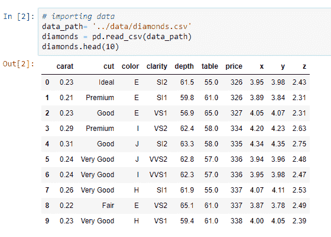

前面的数据集具有一些数值特征和一些分类特征。 在这里，53,940 是我们在该数据集中拥有的样本的确切数量。 现在，为了对这些分类特征中的信息进行编码，我们使用一键编码技术将这些分类特征转换为伪特征。 其背后的原因是因为`scikit-learn`仅适用于数字。

以下屏幕截图显示了用于将分类特征转换为数字的代码行：

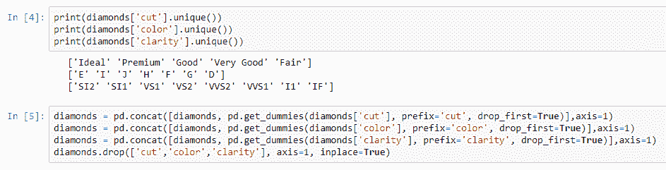

在这里，我们可以看到如何使用`pandas`中的`get_dummies`函数来执行此操作。 最终数据集看起来与以下屏幕快照中的数据集相似：


在这里，对于分类变量中的每个类别，我们都有虚拟特征。 当类别存在时，此处的值为`1`；当特定钻石中不存在类别时，此处的值为`0`。

现在，为了重新缩放数据，我们将使用`RobustScaler`方法将所有功能转换为相似的比例。

以下屏幕快照显示了用于导入`train_test_split`函数和`RobustScaler`方法的代码行：


在这里，我们提取`X`矩阵中的特征，提及目标，然后使用`scikit-learn`中的`train_test_split`函数将数据分为两组。

# 训练不同的回归模型

以下屏幕快照显示了我们将用于记录这些模型的指标和性能指标的数据框。 由于这是一项回归任务，因此我们将使用均方误差。 在这里的列中，我们将使用四个模型。 我们将使用`KNN`，`Bagging`，`RandomForest`和`Boosting`变量：


# KNN 模型

**K 最近邻居**（[ **KNN**）模型不是整体学习模型，但在简单模型中表现最佳：


在前面的模型中，我们可以看到制作 KNN 时使用的过程。 我们将使用 20 个邻居。 我们正在使用`euclidean`度量来测量点之间的距离，然后将训练模型。 此处，由于该值仅为`1`（均方误差），因此可以保存性能指标。

# 套袋模型

套袋是一种整体学习模型。 套袋方法可以使用任何估算器。 因此，让我们来看一下使用 KNN 的情况，如以下屏幕截图所示：


使用`n_estimators`参数，我们可以产生 15 个独立估算器的集合。 结果，这将产生训练数据集的 15 个引导程序样本，然后，在每个这些样本中，它将使这些 KNN 回归变量之一与 20 个邻居匹配。 最后，我们将使用装袋法获得各个预测。 该算法用于给出单个预测的方法是多数表决。

# 随机森林模型

随机森林是另一个整体学习模型。 在这里，我们从`scikit-learn`中的`ensemble`子模块中获取所有集成学习对象。 例如，在这里，我们使用`RandomForestRegressor`方法。 以下屏幕截图显示了用于此模型的算法：


因此，在我们生成包含 50 个单独预测变量的森林的情况下，此算法将生成 50 个单独的树木。 每棵树将具有`16`的`max_depth`，然后将通过多数表决再次产生单个预测。

# 提升模型

提升也是一种整体学习模型。 在这里，我们使用`AdaBoostRegressor`模型，我们将再次产生`50`估算器。 以下屏幕截图显示了用于此模型的算法：

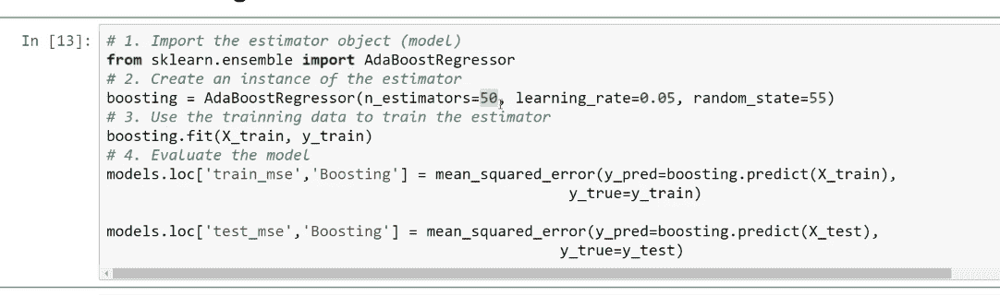

以下屏幕截图显示了训练所有这些模型后获得的`train_mse`和`test_mse`结果：


以下屏幕截图显示了算法，并根据测试均方误差的值对所有这些模型进行了比较。 借助水平条形图显示结果：

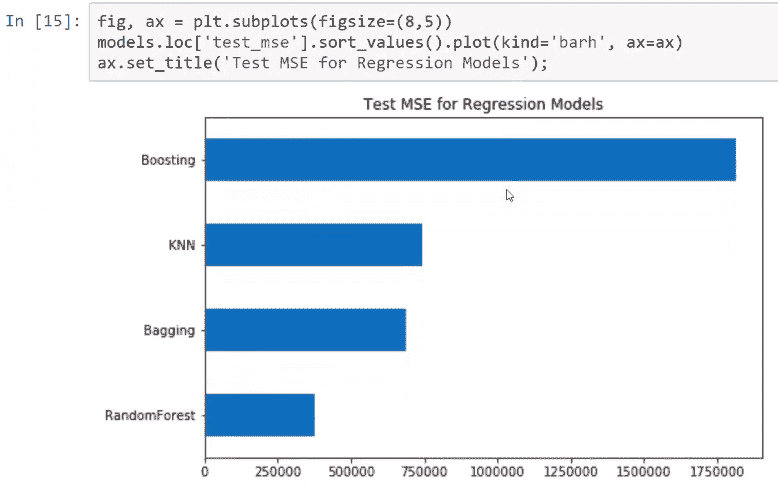

现在，当我们比较所有这些模型的结果时，我们可以看到随机森林模型是最成功的。 套袋模型和 KNN 模型分别排在第二和第三。 这就是为什么我们将 KNN 模型与 bagging 模型一起使用的原因。

以下屏幕截图显示了在测试数据集时用于在预测价格和观察到的价格之间生成图形表示的算法，还显示了随机森林模型的性能：

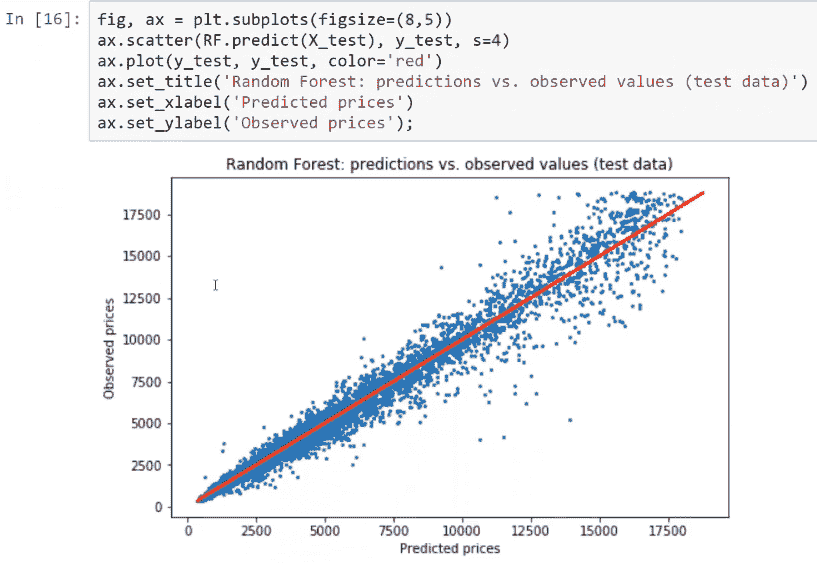

通过`predict` API 或`predict`方法再次使用此模型，我们可以获得单独的预测。

例如，让我们预测从测试数据集中获得的前十个预测的值。 以下算法显示了由该随机森林模型做出的预测，该预测又向我们显示了来自测试数据集的钻石的真实价格和预测价格：


从此屏幕截图中，我们可以看到`Real price`和`Predicted price`的值非常接近，无论是昂贵的钻石还是便宜的钻石。

# 使用集成方法进行分类

现在，我们已经熟悉了集成学习和集成方法的基本概念。 现在，我们将实际使用这些方法在使用各种机器学习算法的模型构建中进行比较，并比较它们产生的结果。 为了实际测试所有这些方法，我们将需要一个样本数据集，以便在给定的数据集上实现这些方法，并了解这如何帮助我们提高模型的性能。

# 预测信用卡数据集

让我们以信用卡数据集为例。 该数据集来自台湾的一家金融机构，[可以在以下位置找到](https://www.kaggle.com/uciml/default-of-credit-card-clients-dataset)。 请看以下屏幕截图，该屏幕截图显示了数据集的信息及其功能：


在这里，我们具有有关每个客户的以下详细信息：

*   它包含限额余额，即使用信用卡提供给客户的信用限额
*   然后，我们具有有关每个客户的个人信息的一些功能，例如性别，教育程度，婚姻状况和年龄
*   我们也有过往付款记录
*   我们还有账单上的金额
*   我们拥有上个月至六个月前的账单金额和先前付款金额的历史记录，这是由客户完成的

有了这些信息，我们将预测下个月客户的付款状态。 我们将首先对这些功能进行一些转换，以使其更易于解释。

在这种情况下，肯定类别将是默认类别，因此数字 1 表示属于默认状态类别的客户，数字 0 表示已支付信用卡会费的客户。

现在，在开始之前，我们需要通过运行一些命令来导入所需的库，如以下代码片段所示：

```py
import numpy as np
import matplotlib.pyplot as plt
import pandas as pd
%matplotlib inline
```

以下屏幕快照显示了用于准备信用卡数据集的代码行：

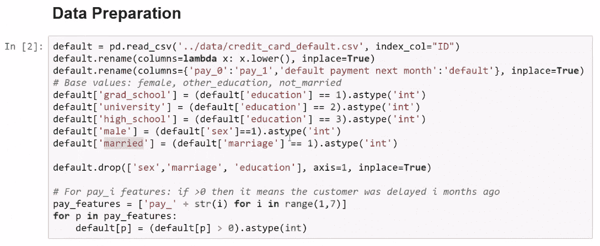

让我们在`grad _school`，`university`和`high_school`中产生用于教育的虚拟功能。 不用[性别]一词，使用`male`虚拟功能，而不是使用婚姻，让我们使用`married`功能。 当此人结婚时，此功能的值为 1，否则为 0。 对于`pay_1`功能，我们将做一些简化过程。 如果我们在此处看到一个正数，则表示该客户在`i`个月内延迟付款。 这表示`ID`为 1 的客户将付款延迟了前两个月。 我们可以看到，三个月前，他/她的付款没有延迟。 这是数据集的样子：

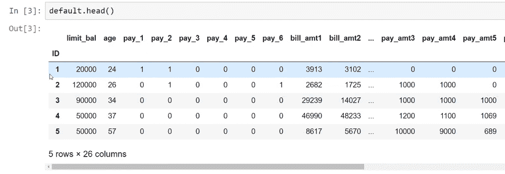

在拟合模型之前，我们要做的最后一件事就是重新缩放所有特征，因为，正如我们在此处看到的那样，我们拥有的特征比例非常不同。 例如，`limit_bal`的规模与`age`的规模大不相同。

这就是为什么我们将使用`scikit-learn`中的`RobustScaler`方法-尝试将所有功能转换为相似的比例：

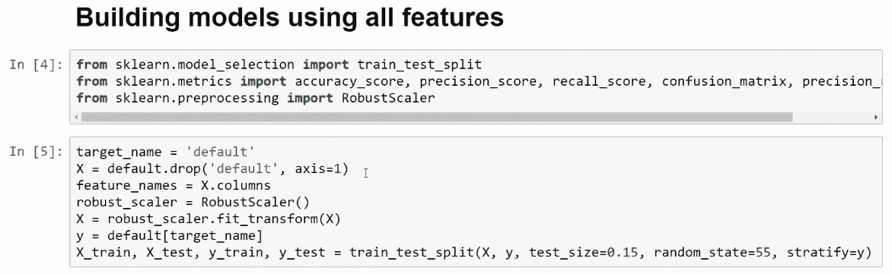

正如我们在最后一行代码中的上一个屏幕快照中所看到的，我们将数据集划分为训练集和测试集，然后在下面，`CMatrix`函数用于为每个模型打印混淆矩阵。 以下代码片段中说明了此功能：

```py
def CMatrix(CM, labels=['pay', 'default']):
    df = pd.DataFrame(data=CM, index=labels, columns=labels)
    df.index.name='TRUE'
    df.columns.name='PREDICTION'
    df.loc['Total'] = df.sum()
    df['Total'] = df.sum(axis=1)
    return df
```

# 训练不同的回归模型

下面的屏幕快照显示了一个我们要保存性能的数据框。 我们将运行四个模型，即逻辑回归，装袋，随机森林和增强：


在这种情况下，我们将使用以下评估指标：

*   `accuracy`：此度量标准衡量模型正确预测违约者和非违约者的频率
*   `precision`：此指标将在模型预测默认值以及模型正确的频率时出现
*   `recall`：此指标将是模型可以正确预测的实际默认违约者的比例

其中最重要的是`recall`指标。 其背后的原因是我们希望最大化模型所识别的实际默认值的比例，因此选择具有最佳召回率的模型。

# 逻辑回归模型

与`scikit-learn`中一样，我们只是导入对象，然后实例化估计量，然后将训练集`X`和训练集`Y`传递给`fit()`方法。 首先，我们将预测测试数据集，然后得出准确性，准确性和召回率得分。 以下屏幕截图显示了代码和混淆矩阵作为输出：

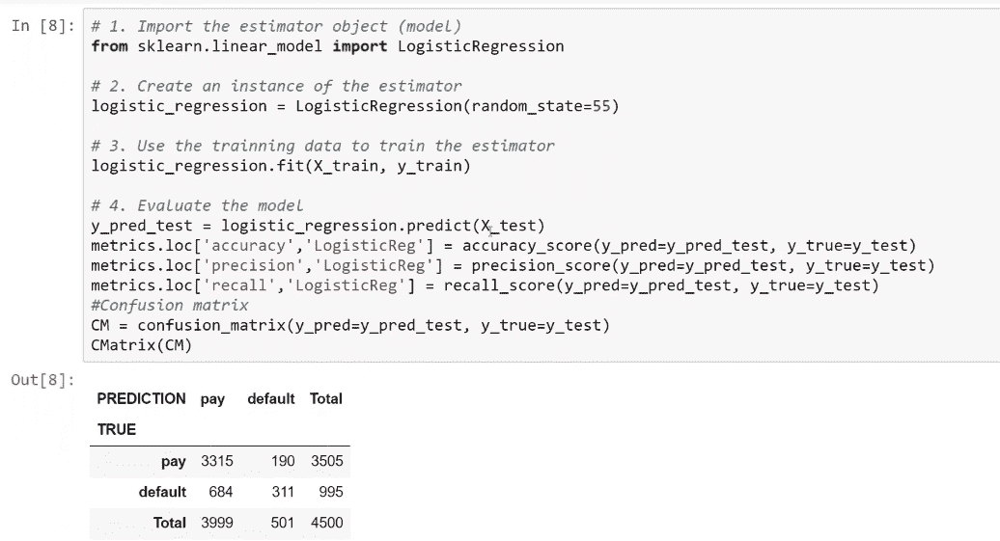

稍后，我们将把它们保存到我们刚刚创建的`pandas`数据框中。

# 套袋模型

使用集成学习技术中的方法训练装袋模型涉及使用 Logistic 回归方法导入装袋分类器。 为此，我们将拟合其中的 10 个逻辑回归模型，然后使用装袋将 10 个单独的预测合并为一个预测。 之后，我们将其保存到指标数据框中。

以下屏幕截图显示了代码和混淆矩阵作为输出：

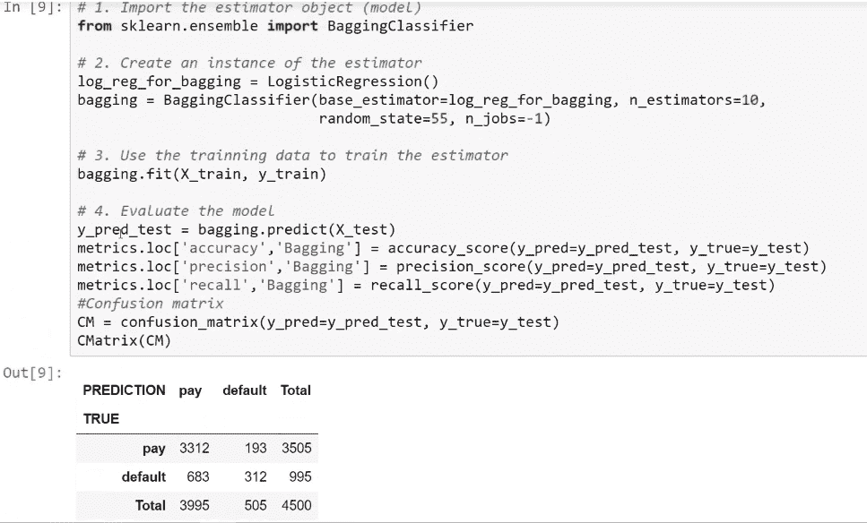

# 随机森林模型

要使用随机森林模型执行分类，我们必须导入`RandomForestClassifier`方法。 例如，让我们采用 35 棵单独的树，每棵树的`max_depth`为`20`。 `max_features`参数告诉`scikit-learn`，在确定可能的特征之间的最佳划分时，我们应该使用所拥有特征总数的平方根。 这些都是我们可以调整的超参数。

以下屏幕截图显示了代码和混淆矩阵作为输出：


# 提升模型

在提升模型的分类中，我们将使用`AdaBoostClassifier`对象。 在这里，我们还将使用`50`估算器来组合各个预测。 我们将在这里使用的学习率是`0.1`，这是该模型的另一个超参数。

以下屏幕截图显示了代码和混淆矩阵：


现在，我们将比较四个模型，如以下屏幕截图所示：


上面的屏幕截图显示了这四个模型的相似精度，但是对于此特定应用程序，最重要的指标是`recall`指标。

以下屏幕截图显示，具有最佳召回率和准确性的模型是随机森林模型：


前面的屏幕快照证明，随机森林模型总体上优于其他模型。

要查看`precision`，`recall`和`threshold`之间的关系，我们可以使用`scikit-learn`中的`precision_recall_curve`功能。 在这里，传递预测值和实际观测值，然后我们得到的结果将包含使我们能够生成`precision_recall_curve`函数代码的对象。

以下屏幕截图显示了`scikit-learn`中`precision_recall_curve`功能的代码：


现在，以下屏幕快照将可视化使用随机森林模型和逻辑回归模型时精度和召回率之间的关系：

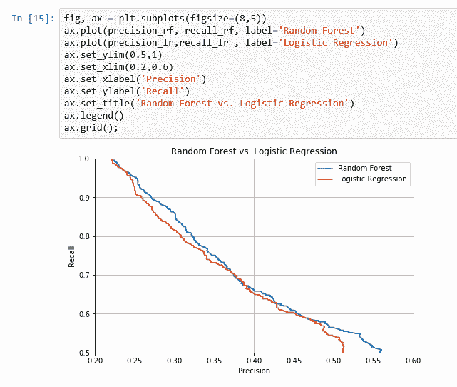

前面的屏幕快照显示，随机森林模型更好，因为它位于逻辑回归曲线之上。 因此，对于`0.30`的精度，与逻辑回归模型相比，使用随机森林模型获得的召回率更高。

要查看`RandomForestClassifier`方法的性能，我们更改了分类阈值。 例如，我们将分类阈值设置为`0.12`，那么我们将获得`30`的精度和`84`的召回率。 该模型将正确预测 84% 的可能违约者，这对于金融机构将非常有用。 这表明增强模型对此优于逻辑回归模型。

以下屏幕截图显示了代码和混淆矩阵：

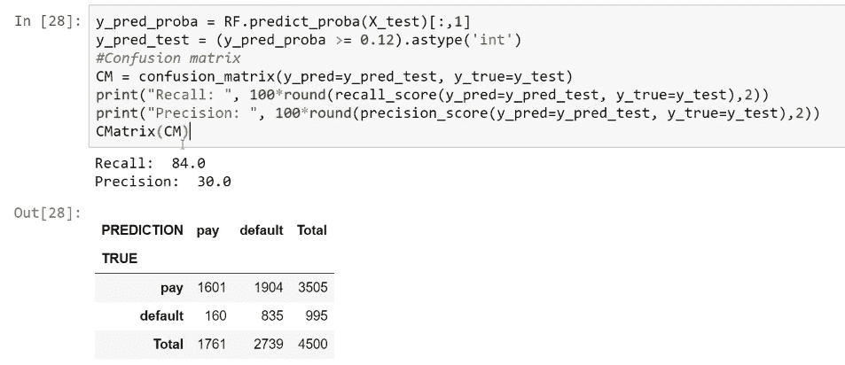

特征重要性是我们在使用随机森林模型时获得的非常重要的东西。 `scikit-learn`库针对我们在模型中使用的每个功能，计算该功能重要性度量。 内部计算使我们能够获得预测中每个功能重要性的度量。

以下屏幕截图显示了这些功能的可视化，因此强调了使用`RandomForestClassifier`方法的重要性：


预测客户是否将在下个月违约或客户是否在前一个月违约的最重要功能是`pay_1`。 在这里，我们只需要验证客户是否在上个月付款。 该模型的另一个重要特征是两个月的帐单金额，而另一个重要特征是年龄。

对于预测目标而言不重要的功能是性别，婚姻状况和客户的教育程度。

总体而言，随机森林模型已被证明比逻辑回归模型更好。

根据无免费午餐定理，没有一个模型可以最好地解决每个数据集中的每个问题。 这意味着整体学习不能总是胜过简单的方法，因为有时简单的方法比复杂的方法表现更好。 因此，对于每个机器学习问题，我们必须使用简单的方法而不是复杂的方法，然后评估这两种方法的性能以获得最佳结果。

# 概要

在本章中，我们介绍了不同的集成方法，例如引导程序采样，装袋，随机森林和增强方法，并通过一些示例说明了它们的工作原理。 然后，我们将它们用于回归和分类。 对于回归，我们以菱形数据集为例，还训练了一些 KNN 和其他回归模型。 后来，对它们的性能进行了比较。 为了进行分类，我们以信用卡数据集为例。 同样，我们训练了所有回归模型。 我们比较了它们的性能，发现随机森林模型的性能最佳。

在下一章中，我们将研究 k 倍交叉验证和参数调整。 我们将比较具有 K 折交叉验证的不同集成学习模型，然后，我们将使用 K 折交叉验证进行超参数调整。