# 使用特征

在本章中，我们将仔细研究特征如何在特征工程技术中发挥重要作用。 我们将学习一些技术，这些技术将使我们能够通过两种方式改进预测分析模型：就模型的性能指标而言，以及了解特征与我们试图预测的目标变量之间的关系。

在本章中，我们将涵盖以下主题：

*   特征选择方法
*   降维和 PCA
*   创建新特征
*   通过特征工程改进模型

# 特征选择方法

特征选择方法用于选择可能有助于预测的特征。 以下是三种特征选择方法：

*   删除低方差的虚拟特征
*   通过统计确定重要特征
*   递归特征消除

在建立预测分析模型时，某些特征将与目标无关，这将对预测没有太大帮助。 现在的问题是，在模型中包含不相关的特征会引入噪声并给模型增加偏差。 因此，特征选择技术是用于选择最相关和最有用的特征的一组技术，这些特征将有助于预测或理解我们的模型。

# 删除低方差的虚拟特征

我们将学习的特征选择的第一种技术是删除方差低的虚拟特征。 到目前为止，我们一直在对特征进行的唯一转换是使用编码技术对分类特征进行转换。 如果我们采用一个分类特征并使用此编码技术，则会得到一组伪特征，将对其进行检查以查看它们是否具有可变性。 因此，方差非常低的特征可能对预测影响很小。 现在，为什么呢？ 假设您有一个具有性别特征的数据集，而 98% 的观测值仅对应于女性。 此特征不会对预测产生任何影响，因为几乎所有情况都属于一个类别，因此变异性不足。 这些案例成为排定要消除的候选对象，应该更仔细地检查这些特征。 现在，看看以下公式：

您可以删除超过`x%`的样本中所有为 0 或 1 的虚拟特征，或者可以为这些特征的方差建立最小阈值。 现在，可以使用前面的公式获得这些特征的方差，其中`p`是您的虚拟特征中`1`的数量或比例。 我们将在 Jupyter 笔记本中查看其工作原理。

# 通过统计确定重要特征

此方法将帮助您利用一些统计测试来识别和选择相关特征。 因此，例如，对于分类任务，我们可以使用 ANOVA F 统计量来评估数字特征和目标之间的关系，这将是分类特征，因为这是经典任务的一个示例。 或者，为了评估分类特征与目标之间的统计关系，我们将使用卡方检验来评估这种关系。 在`scikit-learn`中，我们可以使用`SelectKBest`对象，我们将在 Jupyter 笔记本中了解如何使用这些对象。

# 递归特征消除

识别重要特征并删除我们认为对模型不重要的特征的过程称为**递归特征消除**（**RFE**）。 RFE 也可以应用在`scikit-learn`中，我们可以使用此技术来计算系数，例如线性，逻辑回归，或使用模型来计算**特征重要性**。 随机森林模型为我们提供了这些特征重要性指标。 因此，对于既不计算系数也不计算特征重要性的模型，则无法使用这些方法。 例如，对于 KNN 模型，您不能应用 RFE 技术，因为这首先要预先定义要在模型中使用的特征。 使用所有特征，此方法将拟合模型，然后基于系数或特征重要性，消除最不重要的特征。 在所选的一组特征上递归地重复此过程，直到最终达到所需的要选择的特征数量。

有以下几种方法可以选择模型中的重要特征：

*   L1 特征
*   选择阈值方法
*   基于树的方法

让我们转到 Jupyter 笔记本，看看我们如何在`scikit-learn`中实际应用这些方法。 以下屏幕快照描述了导入所需的库和模块：

在以下屏幕截图中，我们首先使用了信用卡默认数据集，并且将对原始数据进行的传统转换应用于：

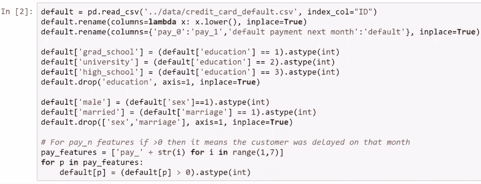

以下屏幕快照显示了数据集中具有的虚拟特征和数值特征，具体取决于特征的类型：

在这里，我们将缩放操作应用于特征建模：

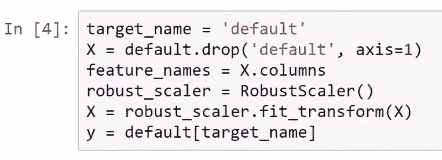

我们在演示中讨论的第一种方法是使用`var()`方法删除具有低方差的伪特征以从我们的特征中获得方差：

让我们只看一下虚拟特征的变化； 例如，方差的阈值将仅考虑方差超过`0.1`的虚拟特征。 在这种情况下，以 0.1 为阈值，将消除的两个候选候选`pay_5`和`pay_6`是将被删除的前几个具有低方差的不必要虚拟特征。 请看以下屏幕截图，该屏幕截图描绘了要淘汰的候选人：

我们讨论的第二种方法是从统计角度选择与目标相关的特征，并且有两种情况，虚拟特征和数值特征。

让我们对虚拟特征进行统计测试。 我们将从`scikit-learn`库中`feature_selection`模块中的`chi2`对象中导入对象。 我们还将使用`SelectKBest`对象在所有虚拟特征中执行统计测试，如以下屏幕截图所示：

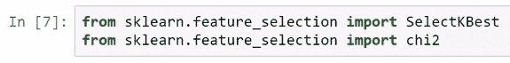

在这里，我们实例化一个名为`dummy _selector`的对象并通过所需的统计测试以应用于该对象。 在这里，我们通过了`k ="all"`参数，因为此统计测试将应用于所有虚拟特征。 实例化此对象后，将调用`fit()`方法。 看一下以下屏幕截图：

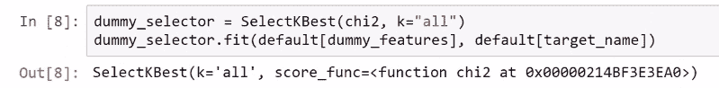

在以下屏幕截图中，我们具有卡方得分。 这不是一项统计测试，数字越大，特征与目标之间的关系越强：

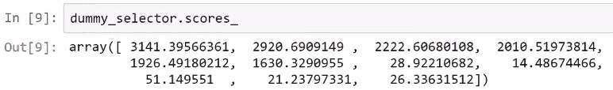

现在，如果您还记得统计课，这就是假设检验设置。 因此，我们还可以计算 p 值，可以说`pvalues_`大于`0.05`的特征与目标无关。 现在，在这种情况下，所有特征的 p 值都非常小，如以下屏幕截图所示：

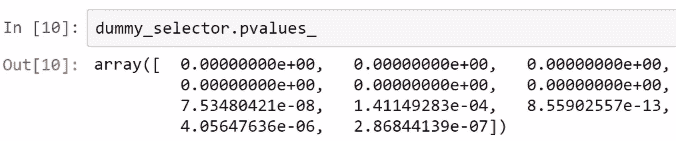

目标和所有虚拟特征之间都有关系，因此在这种方法下，我们不应消除任何这些虚拟特征。

现在，我们可以使用另一个名为`f_ classif`的统计测试来评估数字特征与目标之间的关系，如以下屏幕截图所示：

重用此`f_classif`对象，我们将通过所需的统计测试和特征数量。 在这种情况下，我们想将测试应用于所有数值特征，然后对数值特征和目标再次使用`fit()`方法：

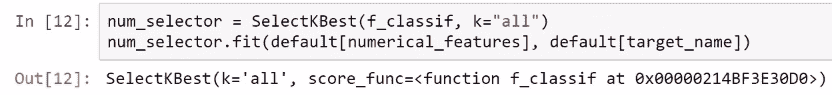

以下屏幕快照显示了我们从此统计测试的应用收到的 p 值：

我们可以通过`f_classif`统计检验，然后选择 p 值大于`0.05`的数值特征，这是统计检验的常用阈值； 此处产生的特征是`bill_amt4`，`bill_amt5`和`bill_amt6`，它们可能与目标无关或无关：

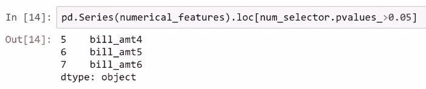

我们有 3 个可以消除或可以应用的消除候选者。 我们在前面的步骤中使用了第二种技术，现在在以下部分中将使用第三种技术。

RFE 是我们将使用`RandomForestClassifier`模型的第三种技术，请记住这里有 25 个特征：

因此，假设我们只选择 12 个特征，而我们想要一个仅使用 12 个特征的模型。 因此，我们使用了大约一半的特征。 我们可以使用`feature_selection`模块中`scikit-learn`中存在的`RFE`对象。 我们可以使用 RFE 技术使用它来实际选择这 12 个特征。 因此，我们通过传递所需的估计量和要选择的特征数量来实例化此对象：

现在，请记住，随机森林为我们提供了特征重要性的度量标准，可以与 RFE 技术一起使用：

在整个数据集上使用`fit()`方法后，我们获得了`recursive_selector.support_`和`True`包含在模型中的特征，所需的 12 个特征，并获得了`False`表示应删除的特征。 ：

因此，根据此目标和方法，我们应该在随机森林模型中包含 12 个最重要的特征，以便预测诸如`limit_bal`，`age`，`pay`之类的目标; 所有账单金额； 和`pay_amt1`，`pay_amt2`和`pay_amt3`，如以下屏幕截图所示：

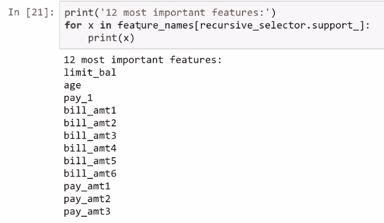

这些是应消除的特征，因为根据此方法和用于预测目标的模型，它们并不十分相关：

现在，我们可以评估较简单的模型，该模型具有 12 个特征，而到目前为止我们一直在使用完整模型，之后，我们可以使用交叉验证来计算指标。 因此，在此示例中，我们使用 10 倍交叉验证来评估这两个模型的性能。 请记住，根据 RFE 技术，此选择器模型是完整模型，结果如下：

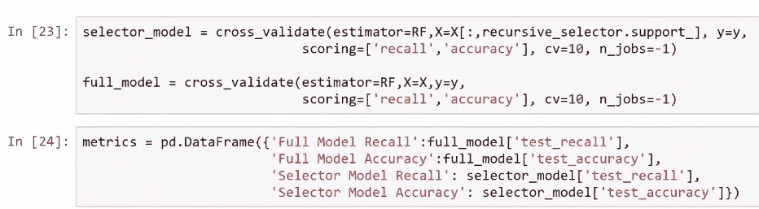

完整模型的召回度为`0.361365`，仅包含 12 个特征的模型的召回度为`0.355791`。 由于此模型的召回率较低，因此完整模型仍然是最佳模型。 但是，如果我们使用其中一半特征，则完整模型也会为我们提供类似的性能：

正如您在以下屏幕截图中所看到的，这些值确实很接近：

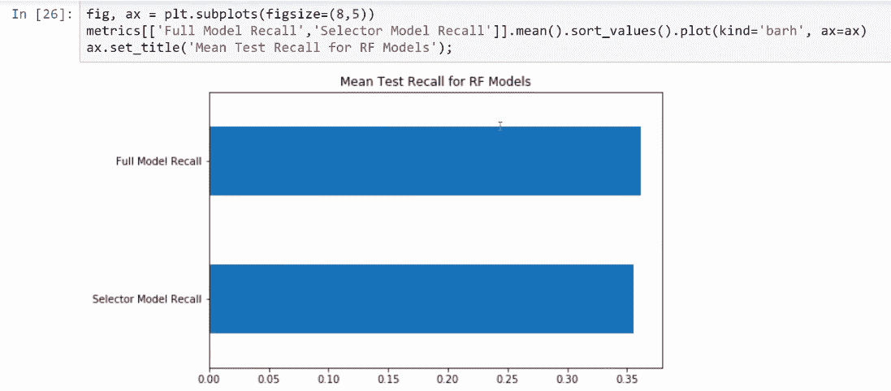

现在，您可以决定是要使用完整模型还是要使用简单模型。 这取决于您，但是就准确性而言，我们几乎可以达到相同的水平，尽管整个模型的准确性仍然更高：

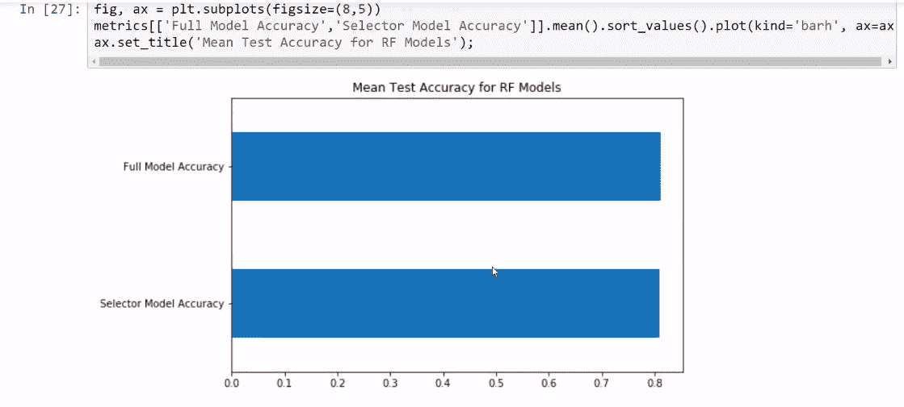

现在，您可以使用一种技术来决定要使用具有更多特征的更复杂模型还是更简单的模型。

# 降维和 PCA

降维方法是通过获取一组主变量来减少所考虑特征数量的过程。 **主成分分析**（**PCA**）技术是用于降维的最重要技术。 在这里，我们将讨论为什么需要降维，并且还将在`scikit-learn`中看到如何执行 PCA 技术。

这些是在进行预测分析时拥有大量特征的原因：

*   它可以简化模型，从而使模型更易于理解和解释。 如果要处理成千上万的特征，可能需要一些计算方面的考虑。 减少特征部件数量以节省计算资源可能是一个好主意。
*   另一个原因是要避免“维度诅咒”。 现在，这是一个技术术语，在处理高维数据时会出现一系列问题。
*   这也有助于我们最大程度地减少过拟合，因为如果您包含许多不相关的特征来预测目标，则您的模型可能会过拟合该噪声。 因此，删除不相关的特征将帮助您进行过拟合。

在本章前面看到的特征选择可以认为是降维的一种形式。 当您具有一组紧密相关甚至冗余的特征时，PCA 将是使用较少特征对相同信息进行编码的首选技术。 那么，什么是 PCA？ 这是一种统计过程，将一组可能相关的变量的观测值转换为一组线性无关的变量，称为**主成分**。 我们不要讨论有关 PCA 发生了什么的数学细节。

假设我们有一个二维数据集。 PCA 确定数据集变化最大的方向，并将关于这两个特征的最大信息量编码为一个特征，以将维数从二维减少为一个。 此方法将每个点投影到这些轴或新大小上。

如下面的屏幕截图所示，这两个特征的第一个主要组成部分是点到红线上的投影，这是 PCA 中发生的事情的主要数学直觉：

现在，让我们转到 Jupyter 笔记本，看看如何实现降维方法并将 PCA 应用于给定的数据集：

在这种情况下，我们将使用信用卡默认数据集。 因此，在这里，我们正在做到目前为止介绍的转换：

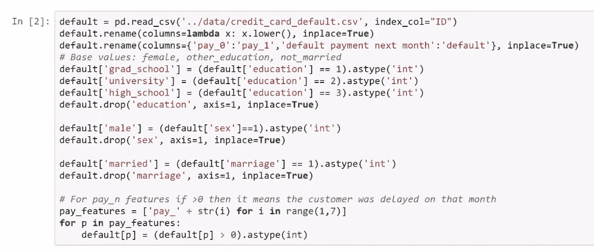

现在，让我们看一下帐单金额特征。 我们具有以下六个特征，这些特征与一到六个月前的账单金额历史密切相关，正如您从以下代码片段屏幕截图生成的可视化效果中可以看到的那样：

因此，它们表示相同的信息。 如果您看到客户在两三个月前的账单金额很高，那么很可能他们一个月前的账单金额也很高。 因此，正如您从以下屏幕快照所示的可视化效果中看到的那样，这些特征确实紧密相关：

我们通过计算相关系数来确认这一点。 如您所见，它们之间确实具有高度相关性：

一个月前和两个月前的账单金额之间的相关性是`0.95`。 我们具有很高的相关性，这是应用降维技术的好机会，例如`scikit-learn`中的 PCA，我们从`sklearn.decomposition`导入了降维技术，如以下屏幕截图所示：

之后，我们实例化此`PCA`对象。 然后，我们将要应用 PCA 分解的列或特征传递给：

因此，在使用从该对象派生的`fit()`方法之后，我们接收到其中一个属性，即解释的方差比，如以下屏幕快照所示：

让我们绘制此数量，以了解这些特征的运行情况。 如您所见，我们得到了所有六个组成部分的解释方差：

读取此图的方式是，我们在这六个特征上执行的 PCA 的第一部分编码了所有六个特征的总方差的 90% 以上。 第二个变量的变化很小，而第三，第四，第五和第六个分量的变化也很小。

现在，我们可以在以下屏幕快照中所示的累积解释方差图中看到这一点：

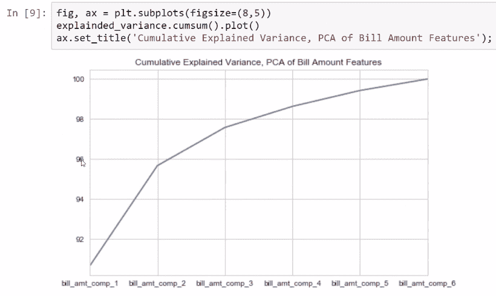

如您所见，第一个组件编码了我们使用的六个特征的 90% 以上的方差。 因此，仅一项特征就可以获取 90% 以上的信息。 因此，您可以仅使用一个特征而不是使用六个特征，而仍然获得 90% 以上的方差。 或者，您可以使用前两个组件，并仅通过两个特征（此 PCA 的第一和第二个组件）获得六个特征所包含的全部信息的 95% 以上。 因此，这就是实践中的工作方式，我们可以将其用作执行特征工程的一种技术。

# 特征工程

特征工程在使机器学习算法正常工作中起着至关重要的作用，如果正确执行，它会增强机器学习算法的预测能力。 换句话说，特征工程是使用领域知识，问题的上下文或产生更准确的预测模型的专门技术，从原始数据中提取现有特征或创建新特征的过程。 这是一项领域知识和创造力起着非常重要作用的活动。 这是一个重要的过程，可以显着提高我们的预测模型的性能。 您对问题的了解越多，创建新的有用特征的能力就越强。 基本上，特征工程过程会将特征转换为算法可以理解的输入值。
有多种实现特征工程的方法。 您可能会发现所有技术都不可行，并且最终可能会排除其中的一些技术。 这样做的目的不是要就此主题进行学术讨论，而是要向您展示在使用特征和尝试创建新特征时我们所做的一些常见操作。 第一个是缩放特征，用于将其范围转换为更合适的特征。 另一个是以更好的方式对信息进行编码，我们将在本章后面看到一个示例。 特征工程涉及从现有特征创建新特征，以便您可以通过对现有特征执行一些数学运算来组合它们。
创建新特征的另一种方法是使用降维技术，例如我们之前看到的 PCA。 只要您使它具有创造力，使用哪种技术都没有关系。 如前所述，您对问题的了解越多越好。

# 创建新特征

我们将在此处使用信用卡默认值和钻石数据集。 现在，让我们转到 Jupyter 笔记本创建新特征，并了解这些技术在实践中的用途：

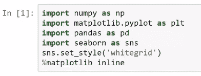

让我们通过执行一些命令来导入信用卡默认数据集，如以下屏幕截图所示：

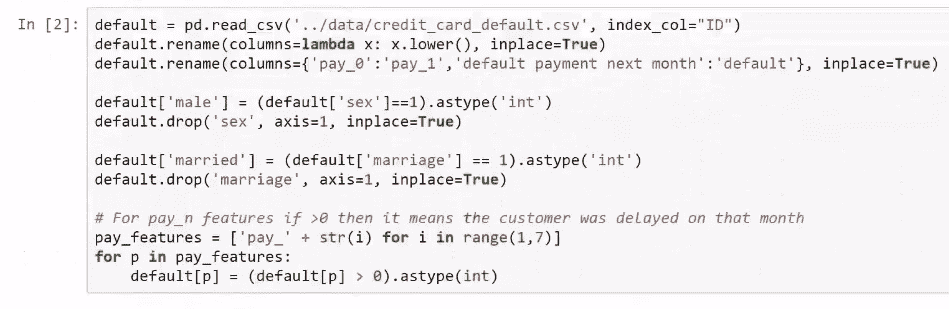

我们将要做的第一个转换是创建另一种方式来编码`education`函数中的信息。 到目前为止，我们已经在`education`函数中使用了一种编码技术，并且我们将使用`x`变量的上下文来提出另一种编码。 受过研究生教育的人比受过其他教育的人受过更高的教育。 因此，我们可以针对这些特征提出某种积分系统。 例如，我们可以为受过高等教育的人分配 2 分，为受过大学教育的人分配 1 分，而为该数据集中的其他教育水平分配负分。
让我们看一下以下屏幕截图，看看如何完成此操作：

前面的屏幕快照反映了我们在这些教育级别中的顺序，因此这可能是编码信息的另一种方法。 这在预测下个月的默认值方面可能有帮助，也可能没有帮助。 但是，我们可以尝试使用这项新技术对信息进行编码，并在以下屏幕截图中查看结果：

我们可以在此数据集中使用的另一种技术是在此问题的背景下使用账单金额和付款金额特征来计算这两个变量/特征之间的差异。 因此，如果我们从特定月份中提取帐单金额，然后减去该月份的付款金额，我们将获得一定数量或数量。 在此示例中，我们调用`bill_minus_pay`变量，该变量代表客户针对该月的账单付款。 因此，此新得出的数量可用于预测下个月的违约者。 我们已将它们包含在此数据集的潜在预测模型中：

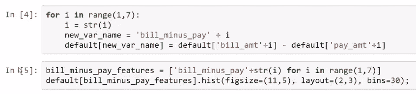

现在，让我们看一下以下输出，该输出描述了特定月份的默认值：

我们现在可以在这里使用的另一种方法是，现在我们在名为`bill_minus_pay`的新特征中拥有了这些特征的部分信息，那就是我们可以使用以下特征仅汇总一个屏幕快照中显示的六个特征的主要信息： PCA 技术：

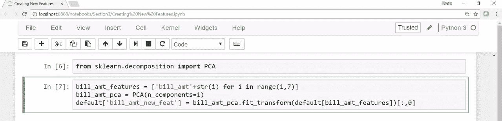

我们可以使用付费特征执行相同的操作。 从先前的分析中，我们知道`pay_1`函数对于预测接下来要付款的人非常重要。 因此，为了将其他五个`pay_i`函数减少到两个，我们将六个账单金额特征减少到一个，并将六个`pay_i`函数减少到两个。 除此之外，我们再次对其余五个`pay_i`函数应用 PCA 技术，以将这五个特征减少到仅一个。 看一下以下屏幕截图：

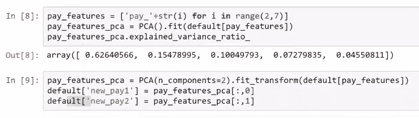

这些是一些特征工程技术以及示例，您可以在数据集中执行这些示例，但是您可能希望从现有转换中创建其他转换或变量。

现在，让我们看一下钻石数据集中的几个示例。 我们需要通过执行一些命令来导入钻石数据集，如以下屏幕截图所示：

如前面的屏幕截图所示，我们已经使用编码技术对一些分类特征进行了转换。 现在，让我们看一下导入的数据集，如以下屏幕快照所示：

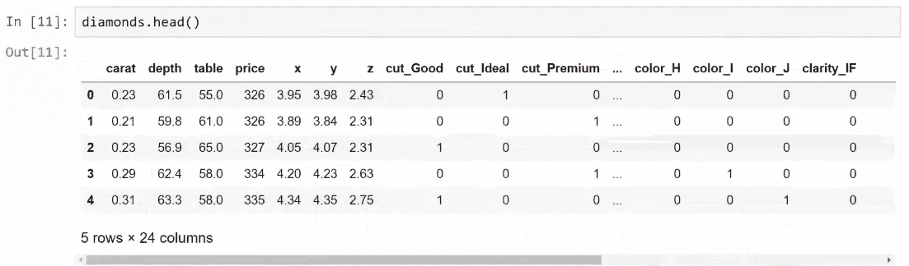

这就是我们具有四个特征[散布图矩阵]的散布图矩阵`x`，`y`，`z`和`price`的样子。 前三个特征指的是钻石的大小，`price`表示这三个特征与钻石的定价之间的关系：

如您所见，在前面的屏幕截图中，前三个特征之间有非常强的线性关系，这是此散点图矩阵中有趣的事情之一。

由于钻石是三维物体，因此我们将这三个特征组合为一个称为体积的特征。

现在，我们将乘以`x`，`y`和`z`轴的测量值，这将得出一个接近该对象体积的数字：

现在，我们知道它们不是盒子，并且它们没有任何固定的形状。 但是，这将是钻石体积的非常好的近似值。 因此，这可能是我们可以从此数据集中现有特征创建新特征量的另一种方法。

在下一个屏幕截图中，我们具有对象的体积以及钻石的重量，其度量为`carat`，我们将使用它们来创建一个名为`density`的新特征：

如您在前面的屏幕快照中所见，我们将克拉数除以体积，以获得钻石对象的密度。

这就是我们从给定的上下文中创建两个特征的方式，这证明了该陈述的正确性：“问题的知识或上下文越多越好”。 如您所见，仅通过提供的有关问题的知识，我们就可以提出新特征。

现在，让我们尝试看看这些特征可能对预测模型有多大帮助。 我们将在这里使用的示例是如何组合现有特征以产生新特征。 下图显示了数量和价格之间的紧密关系：

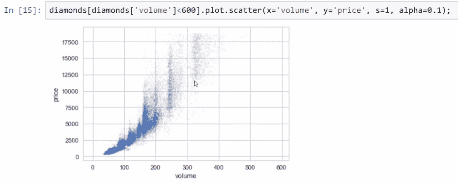

我们可以假设数量将有助于预测价格。

但是，在下面的密度和价格散点图中，我们看到所有钻石都具有相同的预期密度：

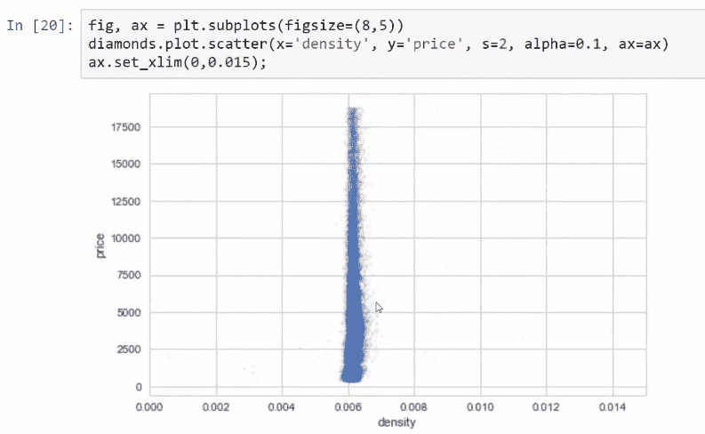

当我们看到已经存在的`price`和`carat`之间的相关性时，似乎`density`可能与`price`无关：

因此，此新特征可能对预测没有太大帮助。 体积和克拉特征具有相同的关系。 我们可能无法利用此特征获得很多预测能力，但是解释此示例的主要目的是展示如何组合数据集中已有的不同特征以创建新特征。

这就是特征工程的全部意义。 您可能还会想到此数据集的其他特征。

# 通过特征工程改进模型

现在，我们已经了解了特征工程技术如何帮助构建预测模型，让我们尝试改善这些模型的性能，并评估新构建的模型是否比先前构建的模型更好地工作。 然后，我们将讨论在进行预测分析时必须始终牢记的两个非常重要的概念，它们是预测模型中可减少和不可减少的误差。

首先导入所需的模块，如以下屏幕截图所示：

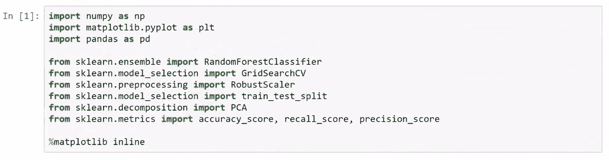

因此，让我们转到 Jupyter 笔记本，看看在本章前面看到的导入的信用卡默认数据集，但是正如您所看到的，已经对该数据集进行了一些修改：

对于该模型，我们没有使用`male`和`married`来将`sex`和`marriage`特征转换为两个虚拟特征； 因此，让我们以略有不同的方式对信息进行编码，以查看效果是否更好。 因此，我们将信息编码为`married_male`和`not_married_female`，然后看效果是否更好。 这是我们在这里进行的第一个转换。 这是数据集的样子：

现在，让我们做更多的特征设计。 我们要做的第一件事是计算这些新特征，这些新特征是通过从账单金额中减去付款金额而构建的，如以下屏幕截图所示：

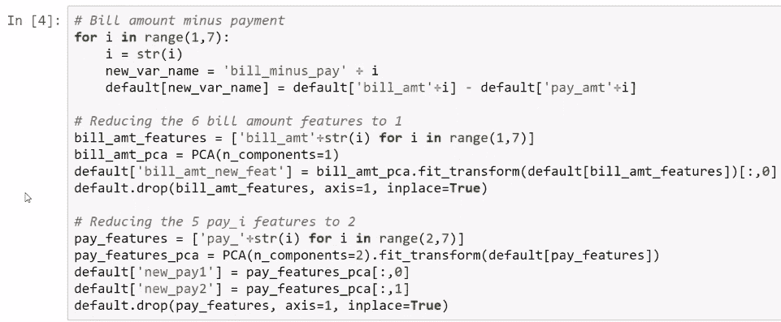

对于这个问题，我们将执行一个数学运算。 我们将使用前面截图中显示的新特征来预测目标。 现在，帐单金额特征中的大多数信息都已编码为这些特征，不再需要，但是我们可以使用 PCA 技术将六个帐单金额特征减少为一个，而不是丢弃它们。 因此，让我们应用 PCA 技术将六个特征简化为一个组件。 现在有一个名为`bill_amt_new_feat`的新特征。 因此，这是我们执行的第二个特征工程步骤。 最后，对于`pay_i`函数，我们将按原样保留第一个特征，并将 PCA 技术应用于后五个函数`pay_2`，`pay_3`，`pay_4`，`pay_5`和`pay_6`， 将这五个特征简化为仅两个组成部分。 您可以在`PCA`对象上使用`fit_transform`方法来获取组件。

现在，让我们看下面的屏幕快照，显示所有与金钱有关的特征。 如您所见，这里的差异确实很大，因为货币金额很大：

现在，通过将它们除以 1,000 来重新缩放这些特征，以减小差异，如以下屏幕截图所示：

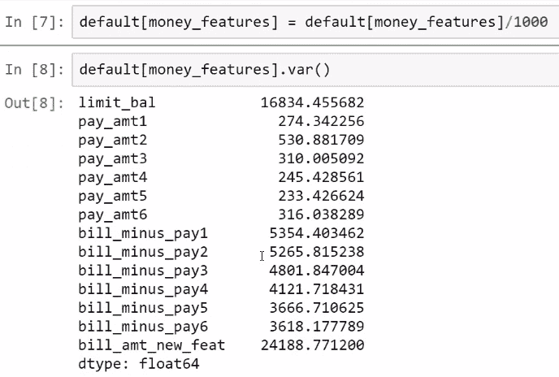

这有助于我们使这些数字易于理解。 因此，这是我们所做的另一种转换，现在让我们使用这些新特征来训练我们的模型。

# 训练模型

以下模型是新模块，因为与其他模型相比，它具有不同的特征。 由于特征已更改，因此我们需要使用`GridSearchCV`模块为`RandomForestClassifier`模块找到最佳的超参数。 因此，也许以前找到的最佳参数并不是这些新特征的最佳参数。 因此，我们将再次运行`GridSearchCV`算法：

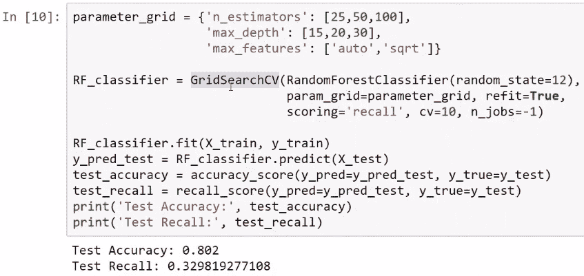

如以下屏幕截图所示，在这种情况下，这些新特征的最佳参数组合是`30`的`max _depth`，`auto`中的`max_features`和`n_estimators`（估计数）应为`100` ：

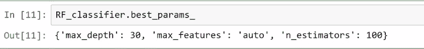

现在，让我们评估一下我们使用特征工程构建的新模型，并将其与先前从先前构建的模型中获得的指标进行比较：

如您在前面的屏幕截图中所见，我们使用的阈值为 0.2。 该模型生成`71.39`% 的召回率和`37.38`的精度。 在这里，精度是相似的，但是，如前所述，召回率可能是我们应该关注的指标，因为与前一个指标略有不同。 我们对该模型有更好的回忆。 更改可能只是 2% 或 3%，看起来似乎并不多，但是请记住，在这些财务应用中，实际上提高 1% 或 2% 可能意味着很多钱。 因此，使用这种小特征工程技术，我们对模型的预测能力有了一点改进。 让我们在以下屏幕截图中查看特征的重要性：

您可以在以下随机森林模型的屏幕截图中评估此特征的重要性是否有意义：

您可以将此特征的重要性与之前的特征进行比较。 应用特征工程后，您可以做很多事情。 我们可能会提高性能并从模型中获得见识。 已经观察到，通过使用此技术，我们对模型进行了一些改进。 现在，您可以提出不同的方法来组合现有特征，以进一步改善模型。 这只是一个简单的小例子，向您展示您可以实际使用有意义的特征来玩这些特征。

# 可减少和不可减少的误差

在继续进行之前，预测分析要涵盖两个非常重要的概念。 误差可以分为以下两种类型：

*   **可减少的误差**：可以通过对模型进行某些改进来减少这些误差
*   **无法减少的误差**：完全无法减少这些误差

假设在机器学习中，特征与目标之间存在由函数表示的关系，如以下屏幕截图所示：

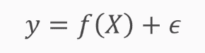

假设目标（`y`）是机器学习的基础假设，并且特征与目标之间的关系由一个函数给出。 由于在大多数情况下，我们认为特征与目标之间的关系存在一定的随机性，因此我们在此处添加了一个噪声项，该噪声项将始终存在于现实中。 这是机器学习中的基本假设。

在模型中，我们尝试在执行特征工程，调整参数等时通过使用实际函数来近似理论函数：

因此，我们的预测是将这些近似值应用于概念或理论`f`的结果。 我们在机器学习中所做的所有事情都是通过训练模型来尝试近似`f`函数。

训练模型意味着近似该函数。 可以从数学上显示预期误差（可以定义为实际`y`与预测的`y`之差）可以分解为两个项。 一个术语称为**可减少的误差**，另一术语称为**不可减少的误差**，如以下屏幕截图所示：

现在，**不可减少的误差**项是该随机项的方差。 您对此词没有任何控制权。 总会有一个不可减少的误差成分。 因此，您的模型总是会出错； 无论您拥有多少个特征和数据点，您的模型都不能总是 100% 正确的。 我们必须尝试使用​​更好和更复杂的方法来执行特征工程，并尝试将我们的估计近似为真实函数。 仅仅因为您使用的是更复杂的模型或您有更多的数据，您的模型就不会是完美的，并且您将无法准确预测`y`是什么，因为几乎所有过程都存在需要处理的随机性。 这是一个非常有趣的部分的结尾。

# 总结

在本章中，我们讨论了特征选择方法，如何区分有用的特征和对预测没有帮助的特征。 我们讨论了降维，并学习了如何在`scikit-learn`中执行 PCA。 我们还讨论了特征工程，并尝试在迄今为止一直在使用的数据集中提出新特征。 最后，我们尝试通过提供新特征以及使用本章学到的所有技术来改进信用卡模型。 希望您喜欢本章。

在下一章中，我们将学习人工神经网络以及在使用神经网络和人工智能时如何使用`tensorflow`库。