# 人工神经网络和 TensorFlow 简介

在本章中，我们将介绍**人工神经网络**（**ANN**），它们基本上是受活脑和感知器启发的计算模型，而感知器是 ANN 的基础。 我们还将讨论构建深度神经网络模型时要考虑的所有要素。 然后，我们将讨论 TensorFlow，这是我们将用来创建这些深度神经网络模型的库。 最后，我们将讨论我们需要了解的有关 TensorFlow 的核心概念，以便使用这些库概念，例如变量，占位符，会话，图形以及其他对于使用此库必不可少的概念。

以下是随着我们的前进将涉及的主题：

*   人工神经网络简介
*   深度神经网络的要素
*   TensorFlow 的安装和介绍
*   TensorFlow 的核心概念

# 人工神经网络简介

人工神经网络是受生物学启发的计​​算模型，可用于训练计算机使用数据执行任务。 这些模型是机器学习模型的广泛类别的一部分。 这些模型与其他模型之间的区别在于，这些模型基于称为**人工神经元**的连接单​​元的集合。

人工神经网络的类型很多，在本书中，我们将使用一种特定的类型，称为**多层感知器**（**MLP**）。 请注意，人工神经网络的变化更多。 这些是机器学习模型，我们可以将它们用于分类和回归任务，但实际上，我们可以扩展这些模型，并将其应用于其他非常特定的任务，例如计算机视觉，语音识别和机器翻译。 这些模型是令人兴奋且不断发展的深度学习领域的基础，在过去的几年中，它在许多领域都取得了成功。

# 感知器

感知器是最简单的人工神经元类型，被发明为二进制分类的简单模型。 让我们使用本书中一直使用的数据集（信用卡数据集）的上下文。 假设我们只有两个功能可以对违约者和非违约者进行分类：账龄和账单金额。 因此，感知器的想法是创建某种分数。 为此，将一个常数`w1`乘以`age`的值，然后添加另一个常数`w2`，再乘以`bill`的值，如下所示：

```py
 score = w1age+w2bill
```

通常，如果`score` > `b`，我们将此人归为默认人。

因此，通过这个简单的操作，我们创建了一个分数。 然后，我们遵循规则将人员分类为违约者或非违约者。 因此，如果此`score`大于某个数字，则我们将此人分类为默认人。

以下屏幕快照显示了一种等效的声明此规则的方法：

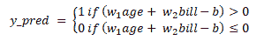

因此，如果数量大于`0`，则此模型的预测将为`1`或默认值；如果数量小于或等于`0`，则此模型的预测将为`0`或非默认值。 。 `b`值也称为阈值或偏差。

通常，如果我们具有`n`个功能，那么我们的感知器将类似于以下屏幕截图：


如您所见，我们有相同的表格。 如果权重之和乘以特征`-b`的值实际上大于`0`，则我们预测`1`，否则，我们预测`0`。 假设所有特征都在同一尺度上，权重将代表每个特征在做出决策时的重要性。 因此，我们知道对于这个特殊问题，所有功能的比例都非常不同。 例如，年龄与帐单金额的比例不同，但是假设您将所有功能设置为相似的比例。 您可以将`w`变量视为权重，它们是决策时每个功能最重要的部分。

以下屏幕截图显示了可视化此感知器的另一种方法：


因此，您具有阈值或偏差`b`的值，并且具有**年龄**，`x1`和**帐单金额**，`x2`。 因此，这三个值进入一个运算，然后得到输出。 现在，我们可以对感知器进行一些修改，这就是添加所谓的**激活函数**。 激活函数是任何可以获取运算结果并使用`f`功能对输入值进行某种转换的功能。 因此，激活函数的输入是来自运算的结果数量，然后在应用激活函数`f`之后，我们将获得以下输出：

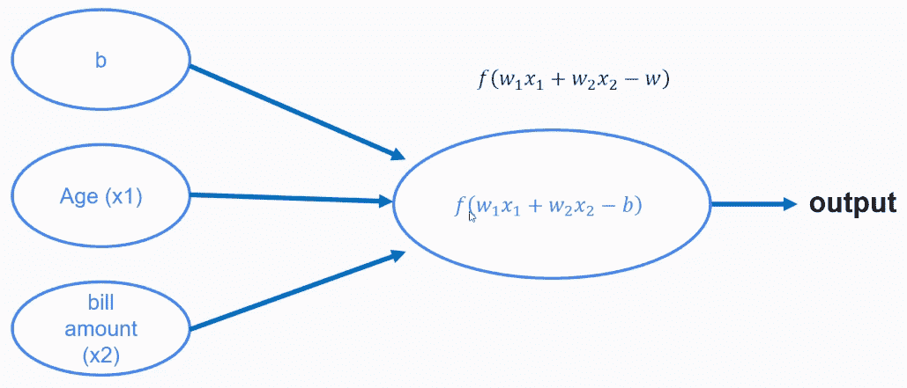

因此，这是感知器。 我们可以向感知器添加激活函数，然后获得规则或分类`1`或`0`。

现在，也许您想知道我们如何确定感知器的最佳权重和阈值？ 我们可以使用什么激活函数？ 这些问题的答案由感知器学习算法提供。 因此，有一种学习算法可用于实际训练感知器。 感知器的好处是它们很容易理解。 但是，与更复杂的方法（例如我们在前几章中使用的方法）相比，它们的性能非常弱。 因此，实际上不值得学习这种感知器学​​习算法。 但是，这些非常简单的模型是人工神经网络的基础。

# 多层感知器

人工神经网络是基于感知器或其他类似基本构建模块的模型，我们将在本书中学习的模型基于感知器。 MLP 是最受欢迎的 ANN 模型之一，我们将在本书中使用它。 在人工神经网络中使用感知器的动机是，如果不使用一个感知器进行分类，那么如果我们使用其中的许多感知器，会怎样呢？ 看一下以下屏幕截图：

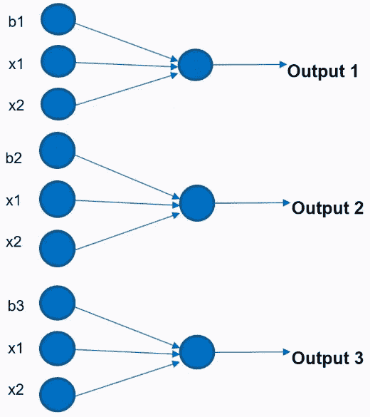

在这里，我们有三个感知器，我们注意到每个感知器都有不同的偏差。 但是在所有情况下，我们功能的值都是相同的。 如果我们使用三个感知器，我们将获得三个输出值，但是我们知道这是一个二进制分类问题，因此我们仅需要一个输出。 因此，现在我们有了三个输出值，我们可以将它们组合起来，或者可以将这些输出值视为另一个感知器的输入值。 看一下以下屏幕截图：

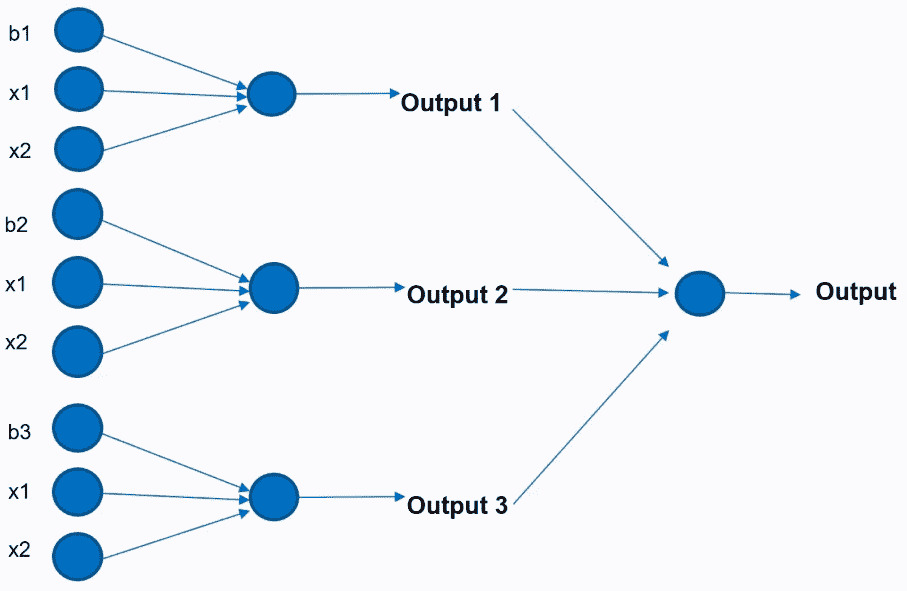

如下面的屏幕快照所示，我们可以将之前的感知器的输出值用作另一个感知器的输入值，而该感知器将为我们提供输出。 因此，这是关于如何构建神经网络或 MLP 的直觉，这是 ANN 的示例：

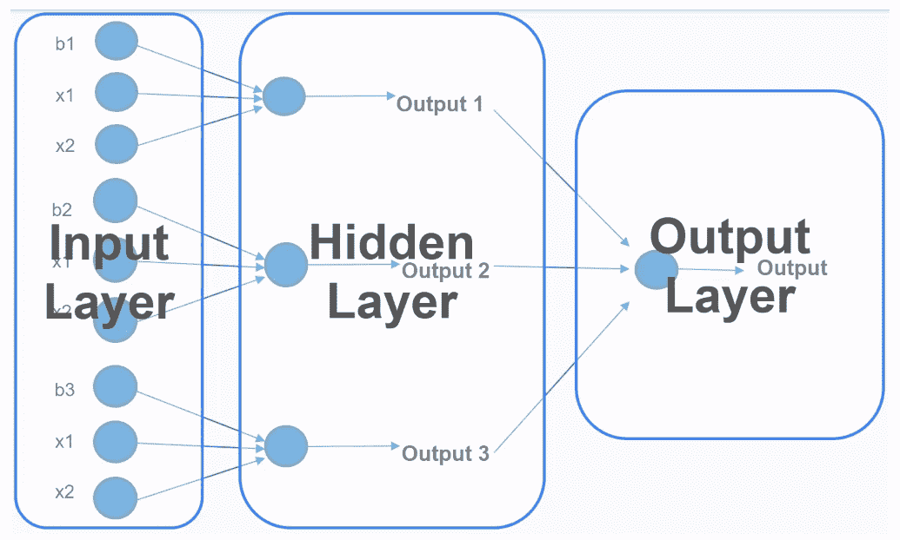

在前面的屏幕截图中，我们具有以下三个 MLP 层：

*   **输入层**：在这一层中，您将拥有用于训练此模型的原始数据或训练数据
*   **隐藏层**：此中间层是前一个感知器的输出，用作下一个感知器的输入
*   **输出层**：在这一层中，您将获得从网络获得的输出

以下屏幕截图是可视化相同 ANN 的另一种方法：

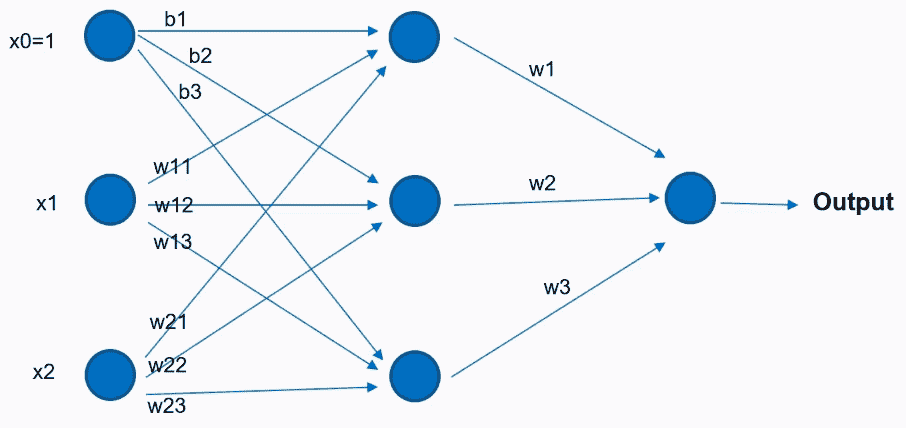

这是一种更紧凑的可视化方式，但实际上是同一网络。 因此，我们为每个观察结果添加了一个不变的特征`1`，而不是具有三个偏差。`1`的值乘以不同的偏差，并作为对我们隐藏层中神经元的输入。`x1`的值乘以一定的权重，并作为下一个神经元的输入，`x2`的值也是如此。 然后，将隐藏层中神经元的结果用作我们网络中最后一个感知器的输入，这是总输出。

# 深度神经网络模型的要素

**深度神经网络**（**DNN**）的动机是相似的，这里的问题是，如果不使用一个隐藏层，那么如果我们使用多个隐藏层怎么办？ 因此，在这种情况下，我们的模型将类似于以下内容：

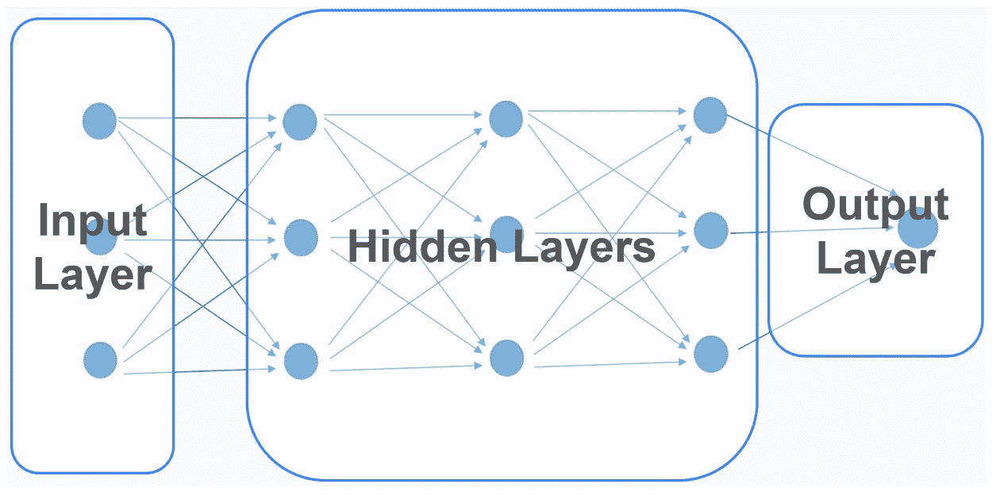

在这里，我们有相同的输入层。 但是，在这种情况下，我们将有许多隐藏层，而输出层将保持不变。 这里的关键是网络的隐藏部分，即隐藏的层。 我们有很多隐藏层，而不是只有一层，这被称为 **DNN** 。

# 深度学习

深度学习是一组基于神经网络的机器学习模型，以及使用数据训练此类模型的相关技术。 有很多深度学习模型。 它们是一类具有以下特征的机器学习算法：

*   这些模型使用一组多层非线性处理单元，可以执行抽象特征提取和转换
*   这些模型使用某种形式的梯度下降通过反向传播进行训练

*   他们通常需要大量数据和大量计算能力才能使这些模型表现出色
*   这些模型现在被认为是许多应用程序的最新技术，例如计算机视觉，语音识别和游戏

# MLP 模型的要素

在多层感知器中构建深度学习模型时，需要考虑很多因素。 您必须考虑架构，激活函数，优化算法，`loss`函数，权重初始化策略，正则化策略和训练策略。 我们将在以下列表中讨论有关它们的更多信息：

*   **架构**：构建深度学习模型时，您需要考虑的第一个元素是 MLP 的架构。 当我们说架构时，我们在谈论的是层数和每层神经元数。 输入层中神经元的数量由数据集中的要素数量决定。 输出值的数量也是如此。 因此，它们基本上由您在分类设置中的问题确定。 输出值的数量通常是分类问题中的类数，而在回归问题中，输出层中将只有一个输出。 您必须做出的选择是要使用多少个隐藏层以及每个隐藏层的神经元数量。 设置这些数字并不容易。 实际上，我们要做的是首先使用几层。 如果有几层不起作用，也许我们增加更多层，每层的神经元数量就是输入值数量和输出数量`[n_inputs, n_outputs]`之间的数字。

这只是一个经验法则。 但是，有更多正式的方法可以选择隐藏层的数量和神经元的数量，研究人员一直在努力寻找更好的方法来选择这些值。

*   **激活函数**：激活函数是在隐藏层的每个神经元中使用的功能。 有很多选择。 **Sigmoid** 是开发这些模型时使用的第一个功能，但随后研究人员发现使用此功能存在许多问题，因此他们提出了其他激活函数，例如**整流线性单元**（**ReLU**），**双曲正切**，**LReLU** 以及我们将在进行中的示例中使用的其他一些选择。

*   **优化算法**：这是用于学习网络权重的算法。 您选择的每种算法都有不同的超参数，建模者需要您选择它们​​。 训练这些网络的最基本算法是**梯度下降**。 但是，梯度下降的速度可能很慢并且存在一些问题，因此研究人员提出了其他算法，例如**动量优化器**， **AdaGrad** ， **RMSProp** 和 **Adam** 算法。 在 TensorFlow 中，我们可以选择很多算法，包括 Adam 算法，而这实际上是我们将在示例中使用的算法。
*   **损失函数**：此函数将产生将由优化器最小化的数量。 损失函数的选择取决于问题。 如果我们正在做回归问题，则可以选择均方误差或均对均方误差。 对于分类问题，有更多选择，例如交叉熵，平方损失和铰链损失。 这类似于反复试验。 有时候，一个损失函数会解决您的问题，有时却不会。 因此，这就是为什么您必须考虑许多不同的损失函数的原因。 但是，请记住，损失函数将产生数量，该数量将用于优化算法，以调整将成为网络一部分的不同感知器的不同权重。 因此，这是将产生数量的函数，优化器的目标是使该数量尽可能小。
*   **权重初始化策略**：必须使用一些值来初始化网络中每个感知器的权重，并且优化算法将逐步更改这些值以最大程度地减少损失。 您可以通过多种方式初始化这些值。 您可以用全零初始化。 多年来，研究人员习惯于使用随机正态分布进行初始化，但近年来，研究人员提出了更好的选择，包括 Xavier 初始化和 He 初始化。
*   **正则化策略**：这是一项可选功能，但强烈建议您使用该功能，因为深度学习模型由于计算出的参数数量过多，往往会过拟合数据。 您可以使用许多选择，包括 L1 正则化，L2 正则化和丢弃正则化策略。 在本书中，我们不会在示例中使用正则化，但请记住，如果您要构建真正有效的深度学习模型，则很有可能需要正则化策略。

*   **训练策略**：训练策略是指将数据呈现给训练算法的方式。 这不是模型本身的一部分，但是会影响模型的结果和性能。 在谈论训练深度学习模型时，您会听到“周期”一词。 一个时期是所有训练实例通过网络的第一步。 在这些深度学习模型中，您将不得不多次将数据呈现给网络，以便网络可以为模型学习最佳参数。 这里还有另一个概念：批量大小。 这是同时显示给训练算法的元素数量。 因此，在深度学习模型的情况下，我们不向模型提供整个训练数据集。 我们要做的是呈现数据集的批次，并且在每批次中，我们仅发送几个示例，也许是 100 或 50，这就是我们训练深度学习模型的方式。 现在，您可以使用时期和批量大小来计算模型中的迭代次数，这就是训练步骤数，这是优化算法对模型权重进行调整的次数。 因此，例如，如果您有 1,000 个训练示例，并且将使用的批量大小为 100，则将需要 10 次迭代才能完成一个周期。 您可以使用以下公式获得迭代总数：

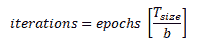

因此，作为建模者，您必须做出许多决定。 这些是非常复杂的模型，并且训练起来很棘手。 因此，在开始使用这些模型之前，请考虑以下指导：

*   由于我们在这些模型中拥有众多选择，因此构建它们可能非常棘手。 因此，在进行预测时，它们不应该是您的首选。 始终从更简单，更易理解的模型开始，然后，如果这些模型不起作用，则转向更复杂的模型。
*   我们已经为所有选择提供了最佳实践，但是如果您想构建有效的深度学习模型，则需要更多有关这些元素的知识。
*   为了使这些模型表现出色，您需要大量数据。 因此，您不能将这些模型用于非常小的数据集。
*   了解有关这些模型的理论的更多信息，以了解如何更好地使用它们。 因此，如果您真的想使用这些模型来解决实际问题，则必须进一步了解这些模型背后的理论。

# TensorFlow 简介

TensorFlow 是一个开源软件库，用于使用数据流图进行数值计算。 计算图的概念在 TensorFlow 中非常重要，并且是专门为创建深度学习模型而设计的。 该库允许开发人员将计算部署到台式机，服务器甚至移动设备中的一个或多个 CPU 或 GPU。 该库最初由 Google 的研究人员和工程师开发。 它于 2015 年开源，从那时起，它已成为机器学习领域的主要图书馆之一。

TensorFlow 提供了多个 API，它们可以分为以下两种类型：

*   **低级**：也称为 TensorFlow Core，这是最低级的 API。 该 API 为我们提供了完整的编程控制，面向在构建深度学习模型时需要高度灵活性的研究人员和用户。
*   **高级**：高级 API（例如`tf.contrib.learn`，`keras`和 TF-Slim）通常更易于使用。 他们负责重复性任务和低级细节，作为高级用户，您无需担心。 它们是为快速实施常用模型而设计的。

# TensorFlow 安装

现在，为安装做准备，我们将在 Anaconda 中创建一个新的虚拟环境。 我们可以按照以下说明进行操作：

1.  我们打开 Anaconda 提示符。
2.  我们键入以下命令行来创建新的虚拟环境，并使用`anaconda`传递环境名称，这将安装 Anaconda 随附的所有软件包：

```py
conda create-n apa anaconda
```

`apa`代表高级预测分析。 安装可能需要一些时间，具体取决于您的互联网速度。

3.  安装完成后，键入`activate apa`激活新的虚拟环境。 这是 Anaconda 提示的屏幕截图，显示了 Anaconda 软件包的安装：

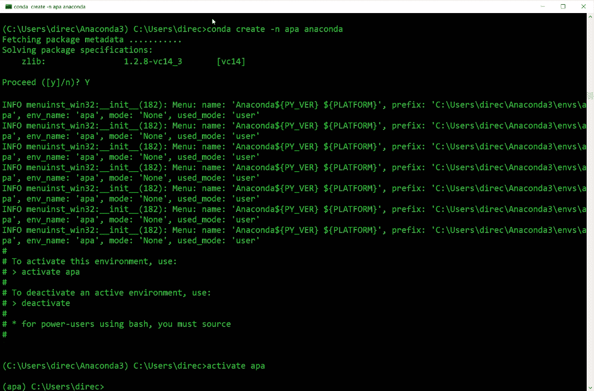

现在，新的虚拟环境已激活，我们准备在此新的虚拟环境中安装 TensorFlow。

但是在安装 TensorFlow 之前，您必须知道基本上有以下两种 TensorFlow 安装：

*   仅具有 CPU 支持的 TensorFlow
*   具有 GPU 支持的 TensorFlow

第二个选项通常更快，因为它使用您的计算机或设备中的 GPU，但是此安装需要 **Nvidia** 支持。 您还需要其他软件才能运行此安装，安装起来有点复杂。

在这里，为简便起见，我们将安装和使用 CPU 版本，因为除了速度之外，编写程序以及在 CPU 或 GPU 版本中运行程序没有区别。 我们使用以下代码行在我们的系统中安装 TensorFlow：

```py
pip install --ignore-installed --upgrade tensorflow
```

运行代码时，将启动 TensorFlow 的安装，安装完成后，您将在屏幕上看到以下输出：

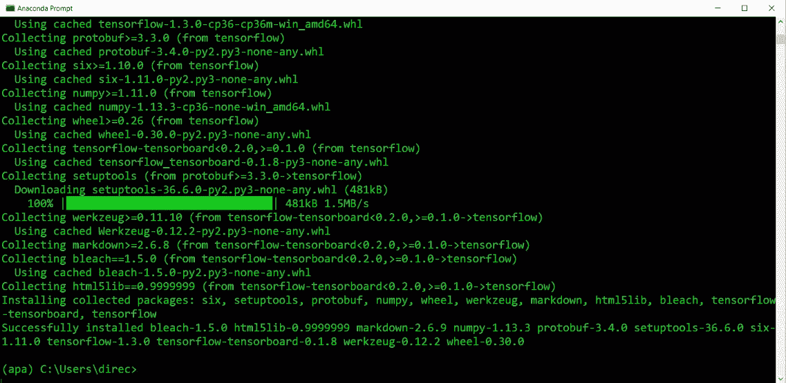

现在，我们将通过执行以下步骤来启动 Python Shell 来测试安装：

1.  我们输入`python`启动 Python shell。
2.  我们使用`import tensorflow as tf`将 TensorFlow 导入我们的 Python shell。
3.  我们运行`hello = tf.constant("Hello")`; 这将创建一个名为`hello`的常量。

4.  我们使用`sess = tf.Session()`创建会话。

如果您看到与以下屏幕截图类似的警告消息，则可以忽略它们，因为它们只是告诉您可以使用其他选项进行安装，因此 TensorFlow 可能运行得更快。

5.  让我们通过使用`print(sess.run(hello))`在会话中运行常量来打印`hello`的结果：


如果您得到`Hello`的结果（类似于此屏幕截图），则表明我们的安装正确。 因此，现在我们准备使用 TensorFlow 来构建一些模型。

# TensorFlow 的核心概念

在实际使用`tensorflow`库之前，我们需要了解一些主要概念。 以下是我们将在本书中介绍的概念：

*   张量
*   计算图
*   届会
*   变数
*   占位符
*   常数

# 张量

**张量**是 TensorFlow 中数据的中央单位。 张量由一组原始值组成，这些原始值成形为任意数量的维数组。 它基本上是类似于 NumPy 数组的多维数组。 维数定义张量的等级。 让我们看下面的一些例子：

*   `3`：如果我们只有一个数字，则将张量视为等级`0`张量。 这可以是`shape[]`的标量。
*   `[2., 2., 1.]`：如果我们有一个向量，它将被认为是等级`1`张量，因此我们将其称为形状`3`的向量，因为它具有三个元素。
*   `[[9., 5., 3.], [4., 5., 7]]`：形状为`[2, 3]`的矩阵将是等级`2`张量。
*   `[[[8., 3.]], [[7., 9.,]]]`：形状为`[2, 1, 2]`的矩阵将是等级`3`张量，如您在最外层看到的，我们有两个元素，在下一层，我们只有一个元素，在最后一维， 我们有两个要素。 这就是为什么我们将`2`，`1`和`2`用作值并且它们都是张量的原因。

# 计算图

计算图是布置在节点图中的一系列 TensorFlow 操作，也称为 **OPS**。 TensorFlow Core 使用以下两个基本步骤：

1.  定义计算图
2.  运行计算图

让我们尝试通过一个非常简单的示例来理解这个概念。 假设您有一个带有两个变量的函数，`x`和`y`，如以下屏幕截图所示：


当您传递`x`和`y`的值`3`和 2 时，我们将使用上述公式来计算或构建此函数的实际值的计算图 ] 分别：

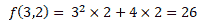

现在，让我们构建一个计算图以实际从该计算模型中获取结果：


在前面的屏幕截图中，我们看到了通过计算图流到图中不同节点的值。 因此，在第一个节点中，将值`3`分配给`x`，在另一个节点中，将值`2`分配给`y`。 现在，`x`的值流到一个运算节点，在该运算节点上平方，该节点的结果流到另一个运算，在运算上与`y`的值相乘。 我们还有另一个节点，其中`y`的值乘以`4`。`x`和`y`乘法节点的结果以及`y`乘法节点的结果流到最终节点，即加法节点，这为我们产生最终输出`26`。 因此，这基本上就是 TensorFlow 的工作方式。 节点之间流动的是张量。

我们在 TensorFlow 中使用以下其他对象：

*   **会话**：会话是封装执行操作对象的环境的对象。 因此，会话是将操作放置在 CPU 或 GPU 等设备上的对象。
*   **占位符**：占位符是对稍后提供值的承诺。 这些对象通常用于在机器学习模型中提供训练和测试值。
*   **变量**：这些是用值初始化的对象，该值可以在图形执行期间更改。 通常，它们在机器学习模型中用作可训练变量。
*   **常量**：常量是其值永不变的对象。

为了更好地理解这些对象概念，让我们看一个例子。 首先，我们将通过执行以下代码片段导入所需的库：

```py
import tensorflow as tf
import numpy as np
import matplotlib.pyplot as plt
%matplotlib inline
```

然后，通过执行以下代码片段，定义一些 TensorFlow 对象，占位符和常量：

```py
#Placeholders
x = tf.placeholder(tf.float32)
y = tf.placeholder(tf.float32)
c = tf.constant(5)
```

在这里，我们定义了一个占位符`x`和另一个占位符`y`。 您必须明确给出将在 TensorFlow 中使用的对象类型，在我们的示例中为`float32`。 然后，我们定义一个常量`c`，其值为`5`。

创建这些对象之后，如果尝试打印它们，将看不到该对象的值，但是它将显示该对象的类型，如以下屏幕截图所示：


现在，让我们用占位符实现以下功能：

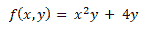

通过执行以下代码行，我们将使用刚刚创建的占位符为图定义不同的节点：

```py
square_node = x*x
mult_node = square_node*y
quadruple_node = 4*y
adder_node = mult_node + quadruple_node
```

同样，如果尝试打印这些对象的值，则将得到对象类型，而不是如下面的屏幕快照所示的值：


因此，要执行这些对象的计算，必须创建一个会话对象，然后在会话中运行所有对象：

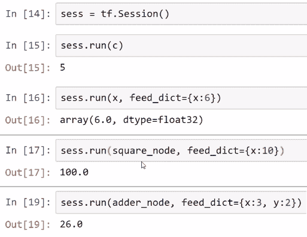

如果您要进行一些计算，则无需定义计算图，因为 TensorFlow 会在后台进行。 因此，假设您要计算`f`并打印该值，它仍将提供对象类型。 但是要在执行计算时实际看到`f`的值，我们将在会话对象中再次运行该函数：


您可以通过两种方式在 TensorFlow 中运行对象。 还有其他方法，但是这些是运行对象的基本且最常见的方法。 您可以在会话中使用`run()`方法，也可以在张量中使用`eval()`方法：


如我们所见，我们使用`with`语句创建了一个会话，并在该语句内运行了这两个方法。

现在，我们将建立一个基本的线性模型。 我们将让 TensorFlow 猜测以下屏幕快照中显示的`b`和`w`参数的最佳值：

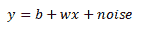

在前面的公式中，`w`的值为`5`，`b`的值为`1`。 我们将使用这些值进行训练并将这些值绘制在散点图上：


如您所见，我们在两个值之间具有线性关系。

现在，我们将使用值`0`初始化变量对象`w`和`b`，它们将成为我们的可训练参数。 占位符通常是我们用来传递数据的对象，因此我们将创建两个占位符`x`和`y`，现在线性模型将成为计算图中的节点之一。 然后，我们将定义一个`loss`函数，优化器将使用该函数实际更改变量的值。 每次我们运行训练操作时，优化器都会调整`w`和`b`的值，以最大程度地减少损失。 然后我们将初始化变量并创建一个会话以运行`init`初始化器节点，如以下屏幕截图所示：


现在，我们可以开始训练我们的机器学习模型。 我们将进行 20 次训练操作，这将对`w`和`b`的值进行校正以最大程度地减少损失：

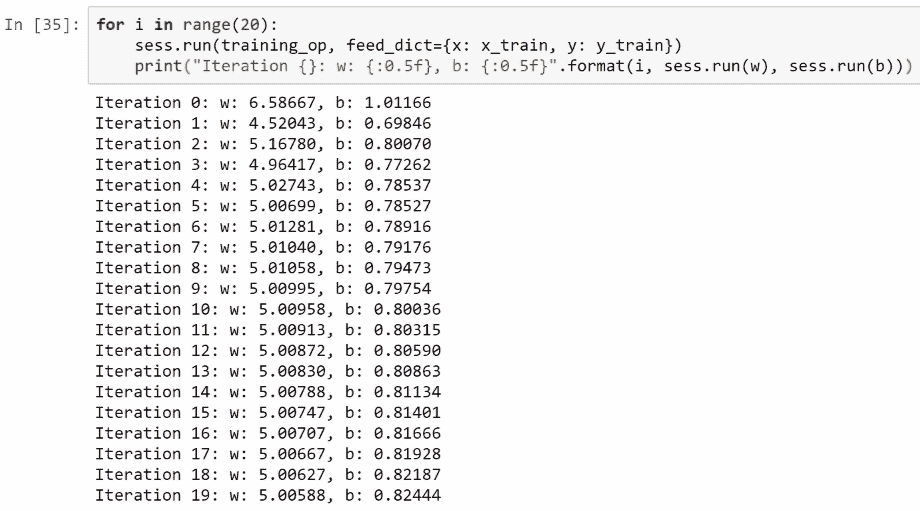

如我们所见，在第一次迭代之后，优化器校正了`w`和`b`的值，这也在每次迭代中执行。

我们也可以使用一些线性代数进行此操作，但请记住，机器学习的目标是实际从数据中学习参数，在这种情况下，我们已经使用 TensorFlow 运行了我们的第一个机器学习模型。

# 概要

在本章中，我们讨论了人工神经网络，深度学习以及深度学习模型的要素。 然后，我们安装了 TensorFlow，并了解了我们在 TensorFlow 中使用的核心概念。

在下一章中，我们将使用 TensorFlow 和深度学习执行预测分析。