# 将 TensorFlow 和深度神经网络用于预测分析

TensorFlow 是 **Google Brain Team** 开发的开源库。 它用于大型机器学习应用（例如神经网络）中，并用于进行数值计算。 开发人员可以使用 TensorFlow 创建数据流图。 这些图显示了数据的移动。 TensorFlow 可用于为各种应用（例如图像识别，机器语言翻译和自然语言处理）训练和运行深度神经网络。

我们已经知道预测分析是关于提供未知事件的预测。 我们将在这里将其与 TensorFlow 一起使用。

在本章中，我们将介绍以下主题：

*   使用 TensorFlow 进行预测
*   **深度神经网络**（**DNN**）的回归
*   DNN 分类

# 将 TensorFlow 用于预测

我们将执行深度学习的`hello world`示例。 此示例用于检查并确保模型按预期工作。 为此，我们将使用 MNIST 数据集。

# MNIST 数据集简介

MNIST 代表**国家混合标准技术研究院**，它已经产生了一个手写的数字数据集。 这是机器学习中研究最多的数据集之一，用于对手写数字进行分类。 由于其庞大的规模，该数据集有助于进行预测分析，从而允许深度学习有效地发挥其魔力。 该数据集包含 60,000 个训练图像和 10,000 个测试图像，格式为`28 x 28`像素的单色图像。 以下屏幕截图显示了此数据集中包含的图像：

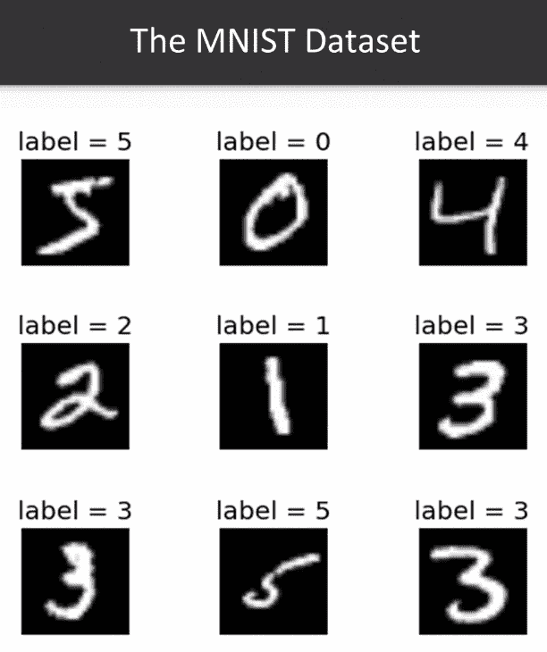

在前面的屏幕截图中，我们可以看到，对于每个手写数字，都有一个对应的真实标签； 因此，我们可以使用该数据集构建分类模型。 因此，我们可以使用图像将每个数字分类为从 0 到 9 的 10 个数字之一。

# 使用 MNIST 数据集构建分类模型

让我们看一下以下步骤并学习建立分类模型：

1.  我们必须导入将在此数据集中使用的库。 使用以下代码行导入`tensorflow`，`numpy`和`matplotlib`库：

```py
import tensorflow as tf
import numpy as np
import matplotlib.pyplot as plt

from tensorflow.contrib.layers import fully_connected

%matplotlib inline
```

2.  我们将从`tensorflow.contrib.layers`导入`fully_connected`函数，该函数将用于构建我们的网络层。

# DNN 模型的元素

在运行模型之前，我们首先必须确定用于构建多层感知器模型的元素。 以下是我们将在此模型中使用的元素：

*   **架构**：该模型在输入层中包含 728 个神经元。 这是因为我们有 28 个图像，每个图像都有 28 个像素。 这里，在这种情况下，每个像素都是一个特征，因此我们有 728 个像素。 尽管可以使用任意数量的隐藏层，但在输出层中将有 10 个元素，并且还将使用三个隐藏层。 在这里，我们将使用三个隐藏层。 我们将在每一层中使用的神经元数在第一层为 350，第二层为 200，最后一层为 100。
*   **激活函数**：我们将使用 ReLU 激活函数，如以下代码块所示：

```py
vector = np.arange(-5,5,0.1)
def relu(x) :
return max(0.,x)
relu = np.vectorize(relu)
```

如果输入为负，则函数输出`0`；如果输入为正，则函数仅输出与输入相同的值。 因此，在数学上，ReLU 函数看起来与此相似。 以下屏幕截图显示了用于生成 ReLU 激活函数的图形表示的代码行：


在`0`和输入之间获得最大值。 该激活函数将用于隐藏层的每个神经元。

*   **优化算法**：此处使用的优化算法是学习率为 0.01 的梯度下降。
*   **损失函数**：对于`loss`函数，我们将使用`cross_entropy`函数，但是与本书中使用的其他损失函数一样，该函数将测量实际值与测量值之间的距离。 模型做出的预测。
*   **权重初始化策略**：为此，我们将使用 Xavier 初始化程序，该方法实际上是 TensorFlow 的`fully_connected`函数默认提供的方法。
*   **正则化策略**：我们将不使用任何正则化策略。

*   **训练策略**：我们将使用 20 个周期。 数据集将被呈现给网络 20 次，并且在每次迭代中，我们将使用 80 的批量大小。因此，我们将数据一次呈现给网络 80 个点，并将整个数据集呈现给网络 20 次。

# 建立 DNN

现在，我们将导入将要使用的数据集。 使用此数据集的原因是它易于获取。 我们将实际使用此数据集并围绕它构建 DNN 模型。 在下一节中，我们将看到构建 DNN 模型的步骤。

# 读取数据

在这里，我们读取单元格中的数据。 以下屏幕截图显示了用于读取数据的代码行：

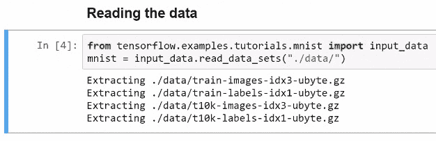

# 定义架构

我们将使用三个隐藏层，第一层为 256 个神经元，第二层为 128 个，第三层为 64 个。 以下代码段显示了分类示例的架构：

```py
n_inputs = 28*28
n_hidden1 = 350
n_hidden2 = 200
n_hidden3 = 100
n_outputs = 10
```

# 输入和标签的占位符

不同层的值是对象，也称为输入和标签的占位符。 这些占位符用于将数据馈入网络。 以下代码行用于显示输入和标签的占位符：

```py
X = tf.placeholder(tf.float32, shape=[None, n_inputs])
y = tf.placeholder(tf.int64)
```

因此，对于要素（即输入层），我们有一个占位符`X`；对于目标值，我们有一个占位符`y`。 因此，此对象将包含数字的实际真标签。

# 建立神经网络

为了构建 DNN，我们将`fully_connected`函数用于第一个隐藏层。 此隐藏层的输入是`x`，它是来自占位符的数据。 `n_hidden1`是我们在此隐藏层中拥有的神经元数量，您会记得是 350 个神经元。 现在，此隐藏层 1 成为隐藏层 2 的输入，`n_hidden2`是该层中神经元的数量。 同样，隐藏层 2 成为第三个隐藏层的输入，我们将在这一层中使用此数量的神经元。 最后，我们将称为`logits`的输出层是用作输入的全连接层，即隐藏层 3。以下屏幕截图显示了用于构建神经网络的代码行：


我们输入 10 作为输出，因为分类问题中有 10 个类别，并且我们知道在输出层中不使用任何激活函数。

# 损失函数

对于我们的`loss`函数，我们使用交叉熵函数。 TensorFlow 为我们提供了许多这样的功能。 例如，在这种情况下，我们使用`sparse_softmax_cross_entropy _with_logits`函数，因为在这里我们从网络上获得了`logits`。 因此，在此函数中，我们传递了实际的标签。 这些是真实的标签，它们是`logits`，即我们网络的结果或输出。 以下屏幕截图显示了代码行，这些代码行用于显示`reduce_mean`函数与该交叉熵的使用，以获取损失：

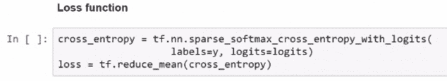

现在，使用这种交叉熵，我们可以将损失计算为将在此处获得的向量的平均值。 因此，这是`loss`函数和交叉熵的平均值。

# 定义优化器和训练操作

优化器的目标是最大程度地减少损耗，它可以通过调整网络所有层中的不同权重来实现。 这里使用的优化器是学习速率为`0.01`的梯度下降。 以下屏幕快照显示了用于定义优化器的代码行，还显示了训练操作。

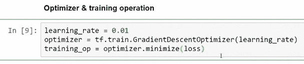

每次我们运行训练操作`training_op`时，优化器都会稍微改变这些权重的值。 这样做可以最大程度地减少损失，并且预测值和实际值应尽可能接近。

# 训练策略和分类准确性评估

在这里，我们设置训练策略。 我们将使用 20 个时期，批量大小为 80。在所有这些单元格中，我们已经建立了将在该程序中使用的计算图。 以下屏幕截图显示了用于显示训练策略的代码行以及用于评估分类准确性的两个节点：


# 运行计算图

为了实际运行计算图，首先我们将初始化程序中的所有变量。 以下屏幕截图显示了用于运行计算图的代码行：

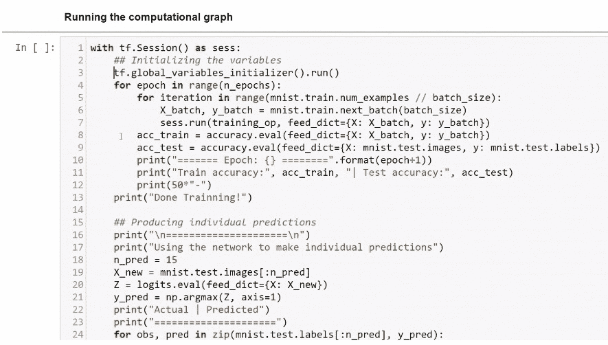

在第 3 行中，我们初始化程序中的所有变量。 现在，在这里，我们没有任何明确的变量。 但是，内部的变量是全连接。 `fully_connected`函数是我们包含权重的所有隐藏层的地方。 这些就是变量，这就是为什么我们必须使用`global_ variables_initializer`对象初始化变量并运行此节点的原因。 对于每个时期，我们运行此循环 20 次。 现在，对于批量数量超过 80 的示例数量中的每次迭代，我们将获得要素和目标的值。 因此，每次迭代将有 80 个数据点。 然后，我们运行训练操作，并将通过`x`； 我们将传递特征值，在这里我们将传递目标值。 请记住，`x`和`y`是我们的占位符。 然后，我们评估训练的准确性，然后评估测试数据集中的准确性，从而获得测试数据集。 我们来自`mnist.test.images`，因此现在这些都是功能，`test.labels`是目标。 然后，在这两个循环完成之后，我们将打印两个精度。

然后，我们为测试数据集中的前 15 张图像生成一些单独的预测。 运行此步骤后，我们获得了第一个周期，其训练准确度为 86%，测试准确度为 88-89%。 以下屏幕截图显示了训练的结果以及不同时期的测试结果：


这些程序需要一点时间才能运行，但是经过 20 个星期之后，测试准确性几乎达到了 97%。 以下屏幕截图显示了实际标签和预测标签。 这些是网络所做的预测：


因此，我们建立了第一个 DNN 模型，并且使用该程序能够以接近 97% 的准确度对手写数字进行分类。

# 深度神经网络（DNN）的回归

对于 DNN 的回归，我们首先必须导入将在此处使用的库。 我们将使用以下屏幕快照中显示的代码行导入 TensorFlow，pandas，NumPy 和 matplotlib：


我们将使用`tensorflow.contrib.layers`模型中的`fully_ connected`函数。

# DNN 模型的元素

在运行模型之前，我们首先必须确定用于构建多层感知器模型的元素，如下所示：

*   **架构**：该模型在输入层中包含 23 个元素，因此在此数据集中有 25 个要素。 尽管可以使用任意数量的隐藏层，但在输出层中只有一个元素，并且将使用三个隐藏层。 我们将在第一层使用 256 个神经元，第二层使用 128 个神经元，第三层使用 64 个神经元。 这是两个的力量。
*   **激活函数**：我们将选择 ReLu 激活函数。
*   **优化算法**：这里使用的优化算法是 Adam 优化器。 Adam 优化器是最受欢迎的优化器之一，因为它是解决许多问题的最佳选择。
*   **损失函数**：我们将使用均方误差，因为我们在这里进行回归问题，这是`loss`函数的最佳选择之一。
*   **权重初始化策略**：为此，我们将使用 Xavier 初始化程序，它是 TensorFlow 中`fully_connected`函数的默认设置。
*   **正则化策略**：我们将不使用任何正则化策略。
*   **训练策略**：我们将使用 40 个周期。 我们将数据集呈现给网络 40 次，并且在每次迭代中，每次运行训练操作时，我们都会使用 50 个数据点的批量。 因此，我们将使用数据集中的 50 个元素。

# 建立 DNN

首先，我们导入将要使用的数据集。 使用此数据集的原因在于，它易于获得。 以下是构建 DNN 模型的步骤。

# 读取数据

我们将读取单元格中的数据并将其过滤为我们的首选项。 以下屏幕截图显示了用于读取数据的代码行：

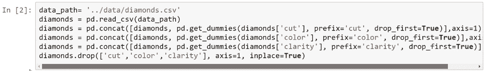

# 建模对象

导入数据集后，我们准备对象以进行建模。 因此，我们在这里进行了`x`和`y`的训练和测试。 以下屏幕快照显示了用于准备对象以进行建模的代码行：

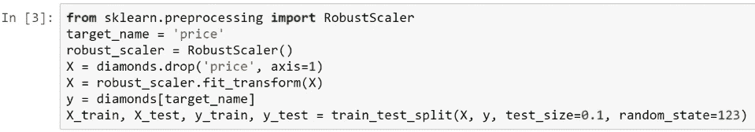

# 训练策略

这是具有 40 个周期且批量大小为 50 个的训练策略。它是使用以下代码行创建的：

```py
n_epochs = 40
batch_size = 50
```

# DNN 的输入管道

由于这是一个外部数据集，因此我们必须使用数据输入管道，并且 TensorFlow 提供了用于在深度学习模型内部获取数据的不同工具。 在这里，我们创建一个数据集对象和一个迭代器对象，其中的代码行如以下屏幕截图所示：


首先，我们生成数据集对象。 然后，我们将整个训练数据集传递给一些将要使用的占位符。 然后，我们对数据进行混洗，并将训练数据集分为 50 个批量。因此，准备了数据集对象，其中包含所有训练样本，这些样本均被分为大小为 50 个批量。接下来，我们创建一个迭代器对象。 然后，使用`get_next`方法，创建一个名为`next_element`的节点，该节点从训练示例中提供了 50 个批量。

# 定义架构

我们使用三个隐藏层，第一层为 256 个神经元，第二层为 128 个，第三层为 64 个。 以下代码段显示了此过程的架构：

```py
n_inputs = X_train.shape[1] #23
n_hidden1 = 256
n_hidden2 = 128
n_hidden3 = 64
n_outputs = 1
```

# 输入值和标签的占位符

不同层的值是对象，也称为占位符，用于输入和标签。 这些占位符用于将数据馈入网络。 以下代码行显示了输入和标签的占位符：

```py
X = tf.placeholder(X_train.dtype, shape=[None,n_inputs])
y = tf.placeholder(y_train.dtype)
```

# 建立 DNN

为了构建以下示例，我们首先必须定义`DNN`函数。 该功能将获取`X_values`并输出预测。 对于第一个隐藏层，我们使用`fully_ connected`函数。 此隐藏层的输入为`X`，它是来自占位符的数据，而`n_hidden1`是我们在此隐藏层中拥有的神经元数。 请记住，在第一个隐藏层中有 350 个神经元。 现在，第一个隐藏层成为第二个隐藏层的输入，`n_hidden2`是我们在第二个隐藏层中使用的神经元数量。 同样，第二个隐藏层成为第三个隐藏层的输入，我们在这一层中使用此数量的神经元。 最后，我们有了输出层，我们称它为`y_pred`，这是一个全连接层，其中第三个隐藏层为输入。 这是一个输出，该层没有激活函数。 以下屏幕截图显示了用于构建神经网络的代码行：

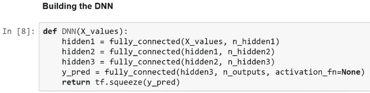

# 损失函数

我们将使用`mean_squared _error`功能-TensorFlow 为我们提供了许多这样的功能。 我们传递观测值和预测值，并且此函数计算均方误差。 以下屏幕截图显示了用于显示`mean_squared _error`功能的代码行：

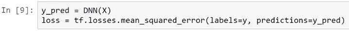

# 定义优化器和训练操作

优化器的目标是最大程度地减少损耗，它可以通过调整网络所有层中的不同权重来实现。 此处使用的优化器是学习率为 0.001 的 Adam 优化器。

以下屏幕快照显示了用于定义优化器的代码行，还显示了训练操作：

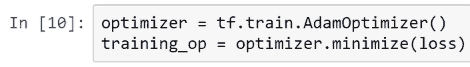

以下屏幕快照显示了我们创建的一些 NumPy 数组，这些数组将用于评估目的：

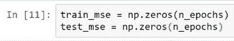

# 运行计算图

为了实际运行计算图，首先我们将初始化程序中的所有变量。 以下屏幕截图显示了用于运行计算图的代码行：

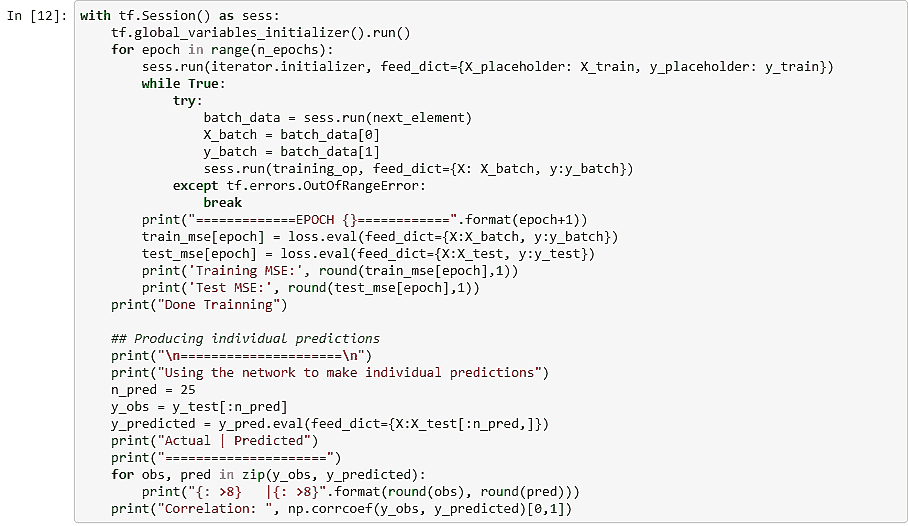

变量是`fully_connected`函数中隐含的权重。 然后，对于每个时期，我们初始化迭代器对象并传递训练数据集。 在这里，我们有`batch_data`，我们运行此`next_ element`节点，并得到 50 个批量。我们可以获取特征值和标签，我们可以获取标签，然后可以运行训练操作。 当对象数据用完时，我们会收到错误消息。 在这种情况下，当我们遇到这些错误之一时，这意味着我们已经使用了所有训练数据集。 然后，我们从`while`循环中跳出，进入下一个周期。 稍后，我们产生一些单独的预测，因此您可以查看该神经网络所做的具体预测。

以下屏幕截图显示了在我们向该网络展示数据时所有 40 个时期的训练和测试 MSE 的行为：


在最后一次测试的 MSE（周期 40）中，我们获得了训练和测试的 MSE 的最终值。

我们从网络获得了实际的预测，并且值相对接近。 在这里，我们可以看到预测价格。 对于廉价钻石，该网络产生的值相对接近。 对于非常昂贵的钻石，网络产生了很高的值。 而且，预测值与观察值非常接近。 以下屏幕截图显示了我们从网络获得的实际值和预测值：


以下屏幕快照显示了带有测试 MSE 的训练 MSE 的图形以及用于生成它的代码行：


# DNN 分类

为了了解 DNN 的分类，我们首先必须了解指数线性单元函数的概念和模型的元素。

# 指数线性单元激活函数

**指数线性单元**（**ELU**）函数是 ReLU 函数的相对较新的修改。 它看起来与 ReLU 函数非常相似，但是具有非常不同的数学特性。 以下屏幕截图显示了 ELU 功能：


上面的屏幕截图显示，在`0`处，我们没有拐角。 对于 ReLU 函数，我们有一个角落。 在此函数中，我们将 ELU 函数缓慢地移至负`alpha`参数，而不是将单个值移至`0`。

# DNN 分类

对于 DNN 分类，我们首先必须导入将要使用的库。 使用以下屏幕快照中的代码行导入`tensorflow`，`pandas`，`numpy`和`matplotlib`库：


我们还将从`sklearn.model_selection`导入`train_test_split`功能，从`sklearn.preprocessiong`导入`RobustScaler`功能，并从`sklearn.metrics`导入`precision_score`，`recall_score`和`accuracy_score`。 我们还从`tensorflow.contrib.layers`导入`fully_connected`函数以构建我们的网络层。

# DNN 模型的元素

在运行模型之前，我们首先必须确定在构建多层感知器模型的
中将使用的元素，如下所示：

*   **架构**：该模型在输入层中包含 25 个元素，因为我们在数据集中具有
    25 个要素。 在输出层中我们有两个元素，尽管我们可以使用任意数量的隐藏
    层，但
    也将使用三个隐藏层。 我们将在每层中使用相同数量的神经元，即 200。在这里，我们使用
    的 2 的幂进行选择。

*   **激活函数**：我们将选择 ELU 激活函数，该功能在上一章中已说明。
*   **优化算法**：这里使用的优化算法是 Adam
    优化器，学习率为 0.001。
*   **损失函数**：对于`loss`函数，我们将使用交叉熵函数。
*   **权重初始化策略**：为此，我们将使用 Xavier 初始化程序，这是
    方法的默认方法，该方法与
    TensorFlow 中的`fully_connected`函数一起提供。
*   **正则化策略**：我们将不使用任何正则化策略。
*   **训练策略**：我们将使用 40 个周期。 因此，我们将 40 次数据集
    呈现给网络，并且在每次迭代中，我们将使用 100 的批量大小。

# 建立 DNN

现在，我们导入将要使用的数据集。 使用此数据集的原因是
易于获得。 以下是构建 DNN 模型的步骤。

# 读取数据

我们将读取单元格中的数据。 以下屏幕截图显示了
用来读取数据的代码行：


# 生成用于建模的对象

现在，我们生成用于建模的对象。 我们将使用 10% 的测试
和 90% 的训练。 以下屏幕截图显示了
用于生成建模对象的代码行：

 

# 训练策略

这是我们前面提到的训练策略，共 40 个时期，批量大小为
100。以下代码块显示了我们在此策略中设置的参数：

```py
n_epochs = 40
batch_size = 100
```

# DNN 的输入管道

现在，我们执行与回归示例相同的操作。 我们创建一个
`dataset`对象和一个迭代器对象。 最后，我们有`next_element`。 这将是我们计算图中的一个节点，每次将为我们提供 100 个数据点。 因此，我们得到了
批量。 以下屏幕快照显示了用于为 DNN 生成输入
管道的代码行：


# 定义架构

我们将对所有三个使用三个隐藏层和 200 个神经元。 以下代码段
显示了本示例中将使用的架构：

```py
n_inputs = X_train.shape[1] #25
n_hidden1 = 200
n_hidden2 = 200
n_hidden3 = 200
n_outputs = 2
```

# 输入和标签的占位符

不同层的值是输入和
标签的对象，也称为占位符。 这些占位符用于将数据馈入网络。 下面的
代码行用于显示输入和标签的占位符：

```py
X = tf.placeholder(X_train.dtype, shape=[None,n_inputs])
y = tf.placeholder(y_train.dtype)
```

# 建立神经网络

为了构建深度神经网络，我们将使用`DNN`函数。 我们分为三层，我们将使用 ELU 函数作为激活函数。 您可以从
TensorFlow，`tf.nn.elu`中获得此功能，从中您可以获得许多功能，这些功能将帮助您构建深度学习模型。 以下屏幕截图显示了用于
产生此功能并以`logits`形式获取输出的代码行：


最后一层称为`logits`层。 我们不会在
的这一层中使用任何激活函数。

# 损失函数

对于`loss`函数，我们再次从 DNN 获取`logits`，然后将此`logits`传递给 TensorFlow 的`softmax_cross_entropy_with_logits`函数。 我们传递真实的标签和`logits`，然后通过将`reduce_mean`函数与`cross_entropy`一起使用来获得损失。 以下屏幕截图显示了用于显示`cross_entropy`函数和`cross_entropy`的使用的代码行，以获取损失：


# 评估节点

现在，为了进行评估，我们将计算默认变量和非默认变量的概率； 您可以通过将`softmax`函数应用于`logits`来获得概率。 以下屏幕截图显示了`softmax`功能：


`softmax`函数用于提供不同类别的概率。

# 优化器和训练操作

优化器的目标是使损失最小化，它可以通过调整网络所有层中的不同权重来实现。

以下屏幕快照显示了用于定义优化器的代码行，并显示了训练操作：


在这种情况下，优化器还是学习速率为`0.001`的 Adam 优化器。 训练操作是优化器将损失最小化的操作。

# 运行计算图

为了实际运行计算图，首先我们初始化
程序中的所有变量。 变量是`fully_connected`函数中隐含的权重。 我们运行四个时期，并为每个时期初始化迭代器对象。 我们通过训练`x`和训练`y`，然后运行此循环。 只要`next_elementelement`中有数据，此循环就会运行。 因此，我们得到接下来的 100 个元素，然后在下一次迭代中得到接下来的 100 个元素，依此类推。 在每次迭代中，我们都要运行训练操作。 现在，此训练操作要做的是要求优化器稍微调整参数和权重，以便做出更好的预测。

以下屏幕截图显示了用于运行计算图的代码行：

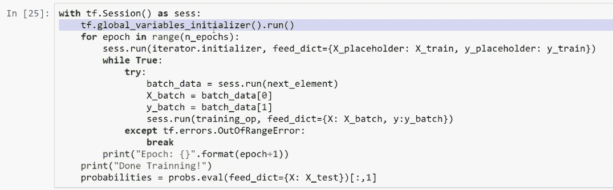

最后，我们可以获得概率，并将其用于评估目的。

# 使用设定的阈值评估模型

生成`probabilities`对象，以使用
不同的分类阈值实际评估模型性能。 可以针对二元
分类问题修改分类阈值，并且可以将其用于计算召回得分，准确性和
准确性。 使用分类阈值`0.16`时，这些是我们在测试数据集中获得的指标：


通过计算，我们得出的召回得分为`82.53`%，准确度为`34.02`%，准确度为`60.7`%。

# 总结

在本章中，我们学习了如何使用 TensorFlow 进行预测。 我们研究了 MNIST 数据集和使用该数据集的模型分类。 我们遇到了 DNN 模型的元素以及 DNN 的构建过程。 后来，我们开始研究 DNN 的回归和分类。 我们对手写数字进行了分类，并进一步了解了 TensorFlow 中的构建模型。 这使我们到本书的结尾！ 我们学习了如何使用集成算法来生成准确的预测。 我们应用了各种技术来组合和构建更好的模型。 我们学习了如何有效执行交叉验证。 我们还实现了各种技术来解决预测分析领域中的当前问题。 最好的部分是，我们使用建立的 DNN 模型来解决分类和回归问题。 本书帮助我们实现了各种机器学习技术，以构建高级的预测模型并将其应用于现实世界。