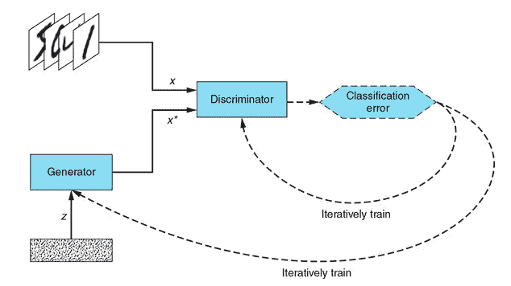
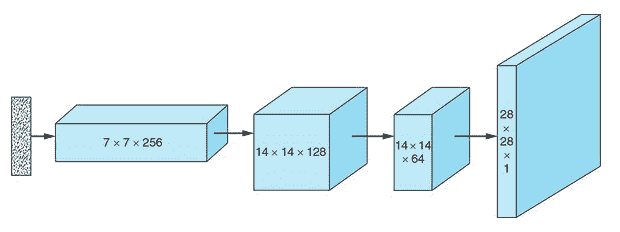
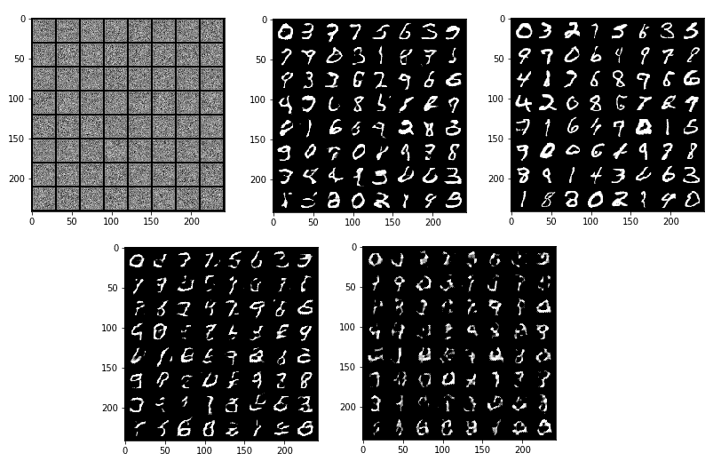
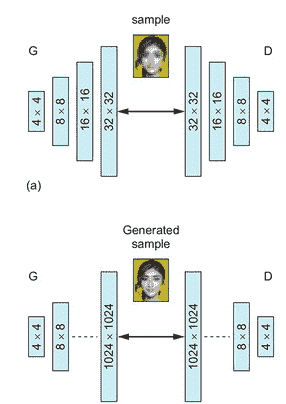
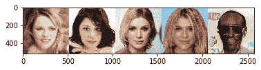

# 探索生成对抗网络

**生成对抗网络**（**GAN**）是一种机器学习技术，其中同时训练两种模型：一种专门用于创建伪造数据，另一种专门用于区分伪造数据和伪造数据。 真实数据。 术语*生成的*反映了以下事实：这些神经网络用于创建新数据，而术语*对抗性*来自以下事实：两个模型相互竞争，从而提高了质量 生成的数据。

GAN 中的两个模型称为生成器和鉴别器，其中生成器负责创建数据，鉴别器接收数据并将其分类为真实数据或由生成器生成。 生成器的目标是创建与训练集中的真实数据没有区别的数据样本。

我们可以用一个类比来理解 GAN 的概念，即犯罪分子（产生者）想要伪造金钱，而侦探（鉴别者）则试图抓住他。 假币的外观越真实，侦探在检测到假币时就必须越好，越高效，这意味着伪钞的质量必须提高到足以使侦探无法发现。

生成器从鉴别器的分类反馈中学习。 判别器的目标是确定其输入是真实的（来自训练数据集）还是伪造的（来自生成器），因此，每当辨别器将虚假图像分类为真实的错误时，生成器都会获得正反馈 一份好工作。 相反，每当鉴别器正确捕捉到生成器生成的图像为伪造图像时，生成器就会收到需要改进的反馈。

鉴别器基本上是一个分类器，并且像任何分类器一样，它从真实标签（它在这种情况下是真实的或假的）中了解到其预测有多远。 因此，随着生成器在生成逼真的数据方面变得更好，鉴别器在从真实标签中辨别伪造品方面也必须变得更好。 这样，两个网络都可以同时改善。

从概念上讲，生成器必须能够从训练示例中捕获真实数据的特征，以使其生成的样本与真实数据无法区分。 生成器自己学习创建模式（而不是识别图像分类问题中的模式）。 通常，生成器的输入通常是随机数的向量。

让我们看一下 GAN 的以下架构图：



在此图中，有一个数据源，其中包含训练图像`x`，生成器必须捕获其属性并重新创建。 生成器接收随机向量`z`，该向量充当生成器创建伪图像的种子。 生成器获取种子并生成 *x <sup>*</sup>* 图像，鉴别器从真实和虚假图像中获取图像，并输出给定​​输入为真实的概率（假设 图像用 1 表示，伪图像用 0 表示）。 然后，我们获得分类误差，并使用它来迭代训练鉴别器和生成器。 鉴别器的目的是使分类误差最小，而发生器的目的是使分类误差最大化。

从理论上讲，生成器和判别器达到平衡，其中生成器已捕获了生成的伪图像中真实图像的所有特征，而从进一步的训练中没有任何收获。 类似地，鉴别者只能以 50% 的概率猜测图像是伪造的还是真实的，因为这两个图像就其性质而言完全无法区分。 在那个状态下，GAN 已经收敛。 然而，实际上，这种状态很难实现。 在本章中，我们将探讨 GAN 的概念以及 PyTorch 中各种 GAN 的实现。

在本章中，我们将介绍以下食谱：

*   创建一个 DCGAN 生成器
*   创建 DCGAN 鉴别器
*   训练 DCGAN 模型
*   可视化 DCGAN 结果
*   使用 PyTorch 集线器运行 PGGAN

# 技术要求

强烈建议，对于本章中实现的配方，代码应在具有 NVIDIA GPU 且启用了 CUDA 和 CUDNN 的计算机上运行，​​因为本章中的配方需要大量计算。

# 创建一个 DCGAN 生成器

在本食谱及其后续食谱中，我们将实现 DCGAN。 DCGAN 代表“深度卷积 GAN”； 与香草 GAN 相比，它们有很大的改进。 在 DCGAN 中，我们使用卷积神经网络，而不是香草 GAN 中的全连接网络。 在第 3 章和*用于计算机视觉的卷积神经网络*中，我们看到了第 2 章和*的全连接分类器如何处理神经网络* ，是该领域的一项改进； DCGAN 与香草 GAN 的情况相同。 在 DCGAN 中，我们将使用批量归一化，这是一种技术，它可以将作为输入输入到下一层的层的输出归一化。 批量归一化允许网络的每一层独立于其他层进行学习，从而减少了协变量偏移。

批量归一化是通过缩放来实现的，以使平均值为 0，方差为 1。在此配方中，我们将生成类似于 MNIST 数据集的手写数字，其中包含来自噪声矢量的数据。 我们将扩展此噪声矢量，将其转换为 2D 矩阵，最后将其转换为 28 x 28 黑白图像。 为了增加高度和宽度，我们必须执行与卷积操作相反的操作，这称为反卷积。 我们将在使用卷积执行分类任务时执行此操作。 在执行反卷积时，我们将增加高度和宽度，同时减少通道数。

以下是我们的 DCGAN 生成器的架构图：



请注意，我们将使用第 3 章和*用于计算机视觉的卷积神经网络* *和*中的概念，因此再次阅读这些食谱将非常有用。

# 怎么做...

在此配方中，我们将实现 GAN 网络的生成器端：

1.我们将从进口开始：

```py
>import torch
>>import torch.nn as nn
>>import torchvision.transforms as transforms
```

2.然后，我们将定义转换：

```py
>>transform = transforms.Compose([
    transforms.ToTensor(),
    transforms.Normalize((0.5, ), (0.5, )),
])
```

3.然后，我们将提供该设备：

```py
>>device = torch.device("cuda" if torch.cuda.is_available() else "cpu")
```

3.现在，我们将定义生成器类：

```py
>>class Generator_model(nn.Module):
    def __init__(self, z_dim):
         super().__init__()
```

4.然后，我们将定义生成器的单位：

```py
 self.fc = nn.Linear(z_dim, 256 * 7 * 7)
 self.gen = nn.Sequential(
            nn.ConvTranspose2d(256, 128, 4, 2, 1),
            nn.BatchNorm2d(128),
            nn.LeakyReLU(0.01),
            nn.ConvTranspose2d(128, 64, 3, 1, 1),
            nn.BatchNorm2d(64),
            nn.LeakyReLU(0.01),
            nn.ConvTranspose2d(64, 1, 4, 2, 1),
            nn.Tanh()
        )
```

5.现在我们将定义 forward 方法：

```py
def forward(self, input):
    x = self.fc(input)
    x = x.view(-1, 256, 7, 7)
    return self.gen(x)
```

6.最后，我们将为生成器模型创建对象：

```py
>>generator = Generator_model(z_dim).to(device)
```

完成此过程后，我们已经准备好 DCGAN 发生器。

# 这个怎么运作...

在此食谱中，我们进行了变换以将图像转换为张量并对其进行归一化，就像在第 3 章和*用于计算机视觉的卷积神经网络*中所做的一样。 然后，我们确定了机器上的设备：CPU 或 GPU。 然后，我们定义了从`nn.Module`类继承的`Generator_model`类，就像在所有以前的体系结构中所做的一样。

在构造函数中，我们传递了`z_dim`参数，这是我们的噪声矢量大小。 然后，我们定义了一个全连接单元`self.fc`，我们将噪声矢量传递给该单元，并为其提供了`256 * 7 * 7`输出。 然后，我们定义了一个称为`self.gen`的`nn.Sequential`单元，其中包含用于定义生成器的关键组件。 我们使用 PyTorch 中提供的`nn.ConvTranspose2d`，`nn.BatchNorm2d`和`nn.LeakyReLU`使用一组反卷积，批处理规范化和激活层。 `ConvTranspose2d`接受输入通道，输出通道，内核大小，步幅和填充等参数。 `BatchNorm2d`接受上一层的要素/通道数作为其参数，而 LeakyReLU 接受负斜率的角度。

与 ReLU 不同，LeakyReLU 允许传递小的梯度信号以获取负值。 它使来自鉴别器的梯度流入发生器。 我们在输出层中使用了 tanh 激活，但是从 DCGAN 论文中我们观察到，使用有界激活可以使模型学会快速饱和并覆盖训练分布的色彩空间。 tanh 的对称性在这里可能是一个优势，因为网络应该以对称方式处理较深的颜色和较浅的颜色。

让我们看一下`forward`方法的工作方式。 `z_dim`维度的输入噪声矢量经过全连接层以提供 12544 输出。 然后，我们将 12544 输出调整为`256 x 7 x 7`，其中 256 是通道数。 `256 x 7 x 7`张量然后通过反卷积层以提供`128 x 14 x 14`输出，然后通过具有 128 个特征和泄漏 ReLU 的 Batchnorm 层。 `128 x 14 x 14`然后在第二次反卷积中转换为`64 x 14 x 14`张量，在第三次反卷积中变为`1 x 28 x 28`张量； 这些只是我们需要的尺寸。 然后，我们创建生成器对象并将其移动到设备。

# 也可以看看

您可以通过[这个页面](https://arxiv.org/pdf/1511.06434.pdf)了解更多有关 DCGAN 的信息。

# 创建 DCGAN 鉴别器

在本食谱中，我们将探讨 GAN 网络的鉴别方。 基本上，鉴别器是在两个类别之间进行分类的分类器，即根据给定图像是来自数据集的真实图像还是由生成器网络生成的伪图像。 正是基于来自鉴别器网络的反馈，生成器学会了创建更好的图像，以试图使鉴别器误以为来自生成器的图像是真实的。 现在，在 DCGAN 中，将使用卷积神经网络构建鉴别器。

以下是我们的鉴别器的架构图：


# 准备好

在本食谱中，我们将严重依赖第 3 章和*用于计算机视觉的卷积神经网络*的食谱，因此最好快速浏览 第 3 章，*用于计算机视觉的卷积神经网络*。

# 怎么做...

在此配方中，我们将构建 GAN 的鉴别器端：

1.我们将从进口开始：

```py
>>import torch.nn.functional as F
```

2.然后，我们将定义鉴别器类：

```py
>>class Discriminator_model(nn.Module):
    def __init__(self):
        super().__init__()
```

3.接下来，我们定义鉴别单位：

```py
self.disc = nn.Sequential(
            nn.Conv2d(1, 32, 3, 2, 1),
            nn.LeakyReLU(0.01),
            nn.Conv2d(32, 64, 3, 2, 1),
            nn.BatchNorm2d(64),
            nn.LeakyReLU(0.01),
            nn.Conv2d(64, 128, 3, 2, 1),
            nn.BatchNorm2d(128),
            nn.LeakyReLU(0.01)
        )
```

4.然后定义最后一个全连接层：

```py
self.fc = nn.Linear(2048, 1)
```

5.然后定义`forward()`方法：

```py
def forward(self, input):
        x = self.disc(input)
        return F.sigmoid(self.fc(x.view(-1, 2048)))
```

6.然后我们创建鉴别对象：

```py
>>discriminator = Discriminator_model().to(device)
```

现在我们已经准备好鉴别器。

# 这个怎么运作...

在本食谱中，我们定义了一个分类器； 使用`nn.Sequential()`定义卷积，激活和批处理规范化单元的数组； 并且还定义了最后一个全连接层，该层采用平坦的张量并给出通过 S 形层的单个输出。 由于只有两个类，因此我们最后使用了 S 形层。 输入是尺寸为`1 x 28 x 28`的图像张量，并经过第一卷积单元以给出尺寸为`32 x 14 x 14`的输出张量。 第二个卷积层使它成为`64 x 7 x 7`张量，然后从那里变成`128 x 4 x 4`。 之后，我们将拉平并使张量穿过全连接层。

# 也可以看看

您可以在[这个页面](https://arxiv.org/pdf/1511.06434.pdf)上了解有关 DCGAN 的信息。

# 训练 DCGAN 模型

我们在前两个配方中定义了生成器，即*创建 DCGan 生成器*和*创建 DCGAN 鉴别器*。 在本食谱中，我们将继续训练 GAN 模型。 请记住，生成器的目标是创建与数据集尽可能相似的图像，而鉴别器的目标是区分真实图像和生成的图像。 从理论上讲，生成器将捕获数据集中图像的所有特征，并且无法学习更多信息，而鉴别器只能猜测图像是真实的还是生成的。 在本食谱中，我们将通过整合到目前为止已经创建的生成器和鉴别器来完成 DCGANs 模型的训练。

# 准备好

我们将使用`torchsummary`库来查看我们的模型层，它们的输出形状和它们的参数。 为此，我们将使用以下命令安装该库：

```py
pip install torchsummary
```

准备好此安装​​后，我们将继续进行下一步。

# 怎么做...

在此食谱中，我们将完成 GAN 训练：

1.  一，进口：

```py
>>from torchsummary import summary
>>import torch.optim as optim
>>import torchvision.utils as vutils
```

2.  然后我们初始化生成器和鉴别器的权重：

```py
>>def weights_init(m):
    classname = m.__class__.__name__
    if classname.find('Conv') != -1:
        nn.init.normal_(m.weight.data, 0.0, 0.02)
    elif classname.find('BatchNorm') != -1:
        nn.init.normal_(m.weight.data, 1.0, 0.02)
        nn.init.constant_(m.bias.data, 0)
>>generator.apply(weights_init)
>>discriminator.apply(weights_init)
```

3.  然后我们打印生成器的摘要：

```py
>>summary(generator, (100, ))
```

这给我们以下输出：

```py
----------------------------------------------------------------
        Layer (type)               Output Shape         Param #
================================================================
            Linear-1                [-1, 12544]       1,266,944
   ConvTranspose2d-2          [-1, 128, 14, 14]         524,416
       BatchNorm2d-3          [-1, 128, 14, 14]             256
         LeakyReLU-4          [-1, 128, 14, 14]               0
   ConvTranspose2d-5           [-1, 64, 14, 14]          73,792
       BatchNorm2d-6           [-1, 64, 14, 14]             128
         LeakyReLU-7           [-1, 64, 14, 14]               0
   ConvTranspose2d-8            [-1, 1, 28, 28]           1,025
              Tanh-9            [-1, 1, 28, 28]               0
================================================================
Total params: 1,866,561
Trainable params: 1,866,561
Non-trainable params: 0
----------------------------------------------------------------
Input size (MB): 0.00
Forward/backward pass size (MB): 0.97
Params size (MB): 7.12
Estimated Total Size (MB): 8.09
----------------------------------------------------------------

```

4.  然后，我们将打印鉴别器摘要：

```py
>>summary(discriminator, (1, 28, 28))
```

这给我们以下输出：

```py
----------------------------------------------------------------
        Layer (type)               Output Shape         Param #
================================================================
            Conv2d-1           [-1, 32, 14, 14]             320
         LeakyReLU-2           [-1, 32, 14, 14]               0
            Conv2d-3             [-1, 64, 7, 7]          18,496
       BatchNorm2d-4             [-1, 64, 7, 7]             128
         LeakyReLU-5             [-1, 64, 7, 7]               0
            Conv2d-6            [-1, 128, 4, 4]          73,856
       BatchNorm2d-7            [-1, 128, 4, 4]             256
         LeakyReLU-8            [-1, 128, 4, 4]               0
            Linear-9                    [-1, 1]           2,049
================================================================
Total params: 95,105
Trainable params: 95,105
Non-trainable params: 0
----------------------------------------------------------------
Input size (MB): 0.00
Forward/backward pass size (MB): 0.21
Params size (MB): 0.36
Estimated Total Size (MB): 0.58
----------------------------------------------------------------
```

5.  接下来，我们将定义损失函数：

```py
>>criterion = nn.BCELoss()
```

6.  我们还将创建一个固定的噪声：

```py
>>fixed_noise = torch.randn(64, z_dim, device=device)
```

7.  现在，我们将定义优化器功能：

```py
>>doptimizer = optim.Adam(discriminator.parameters())
>>goptimizer = optim.Adam(generator.parameters())
```

8.  然后，我们将为鉴别符设置标签：

```py
>>real_label, fake_label = 1, 0
```

9.  我们还将准备存储我们训练中的指标：

```py
>>image_list = []
>>g_losses = []
>>d_losses = []
>>iterations = 0
>>num_epochs = 50
```

10.  现在，我们开始训练循环：

```py
>>for epoch in range(num_epochs):
```

11.  然后我们遍历数据：

```py
print(f'Epoch : | {epoch+1:03} / {num_epochs:03} |')
for i, data in enumerate(train_loader):
```

12.  然后，我们通过清除梯度来开始训练鉴别器：

```py
discriminator.zero_grad()
```

13.  然后我们获取图像：

```py
real_images = data[0].to(device)
size = real_images.size(0)
```

14.  然后，我们为这些图像创建标签：

```py
label = torch.full((size,), real_label, device=device)
```

15.  接下来，我们得到鉴别器输出：

```py
d_output = discriminator(real_images).view(-1)
```

16.  然后我们计算鉴别器误差：

```py
derror_real = criterion(d_output, label)
```

17.  接下来，我们计算梯度：

```py
derror_real.backward()
```

18.  现在我们将创建一个噪声矢量：

```py
noise = torch.randn(size, z_dim, device=device)
```

19.  接下来，我们将噪声矢量传递给生成器：

```py
fake_images = generator(noise)
```

20.  然后，我们为生成的图像创建标签：

```py
label.fill_(0)
```

21.  然后我们将它们传递给鉴别器：

```py
d_output = discriminator(fake_images.detach()).view(-1)
```

22.  接下来，我们得到误差和梯度：

```py
derror_fake = criterion(d_output, label)
derror_fake.backward()
derror_total = derror_real + derror_fake
```

23.  然后，我们更新鉴别器权重：

```py
doptimizer.step()
```

24.  我们通过清除梯度开始训练生成器：

```py
generator.zero_grad()
```

25.  然后，我们将标签从假更改为真实：

```py
label.fill_(1)
```

26.  接下来，我们得到鉴别器输出：

```py
d_output = discriminator(fake_images).view(-1)
```

27.  然后我们计算发电机损耗和梯度并更新发电机权重：

```py
gerror = criterion(d_output, label)
gerror.backward()
goptimizer.step()
```

28.  然后我们节省了损失：

```py
if i % 50 == 0:
    print(f'| {i:03} / {len(train_loader):03} | G Loss: {gerror.item():.3f} | D Loss: {derror_total.item():.3f} |')
    g_losses.append(gerror.item())
    d_losses.append(derror_total.item())
```

29.  然后，我们从固定噪声中保存图像：

```py
if (iterations % 500 == 0) or ((epoch == num_epochs-1) and (i == len(train_loader)-1)):
    with torch.no_grad():
        fake_images = generator(fixed_noise).detach().cpu()
        image_list.append(vutils.make_grid(fake_images, padding=2, normalize=True))

iterations += 1
```

以下是示例输出：

```py
Epoch : | 001 / 050 |
| 000 / 469 | G Loss: 1.939 | D Loss: 1.432 |
| 050 / 469 | G Loss: 3.920 | D Loss: 0.266 |
| 100 / 469 | G Loss: 3.900 | D Loss: 0.406 |
| 150 / 469 | G Loss: 3.260 | D Loss: 0.230 |
| 200 / 469 | G Loss: 3.856 | D Loss: 0.556 |
| 250 / 469 | G Loss: 4.097 | D Loss: 0.123 |
| 300 / 469 | G Loss: 2.377 | D Loss: 0.416 |
| 350 / 469 | G Loss: 2.984 | D Loss: 0.416 |
| 400 / 469 | G Loss: 3.262 | D Loss: 0.140 |
| 450 / 469 | G Loss: 3.469 | D Loss: 0.849 |
Epoch : | 002 / 050 |
| 000 / 469 | G Loss: 2.057 | D Loss: 0.484 |
| 050 / 469 | G Loss: 2.108 | D Loss: 0.435 |
| 100 / 469 | G Loss: 1.714 | D Loss: 0.862 |
| 150 / 469 | G Loss: 3.902 | D Loss: 0.199 |
| 200 / 469 | G Loss: 3.869 | D Loss: 0.086 |
| 250 / 469 | G Loss: 2.390 | D Loss: 0.208 |
| 300 / 469 | G Loss: 3.008 | D Loss: 0.586 |
| 350 / 469 | G Loss: 4.662 | D Loss: 0.074 |
| 400 / 469 | G Loss: 3.353 | D Loss: 0.368 |
| 450 / 469 | G Loss: 5.080 | D Loss: 0.110 |
Epoch : | 003 / 050 |
| 000 / 469 | G Loss: 7.159 | D Loss: 0.008 |
| 050 / 469 | G Loss: 5.087 | D Loss: 0.056 |
| 100 / 469 | G Loss: 4.232 | D Loss: 0.184 |
| 150 / 469 | G Loss: 5.037 | D Loss: 0.141 |
| 200 / 469 | G Loss: 5.636 | D Loss: 0.570 |
| 250 / 469 | G Loss: 3.624 | D Loss: 0.304 |
| 300 / 469 | G Loss: 4.291 | D Loss: 0.214 |
| 350 / 469 | G Loss: 2.901 | D Loss: 0.247 |
| 400 / 469 | G Loss: 3.703 | D Loss: 0.643 |
| 450 / 469 | G Loss: 1.149 | D Loss: 1.035 |
Epoch : | 004 / 050 |
| 000 / 469 | G Loss: 3.317 | D Loss: 0.202 |
| 050 / 469 | G Loss: 2.990 | D Loss: 0.350 |
| 100 / 469 | G Loss: 2.680 | D Loss: 0.162 |
| 150 / 469 | G Loss: 2.934 | D Loss: 0.391 |
| 200 / 469 | G Loss: 3.736 | D Loss: 0.215 |
| 250 / 469 | G Loss: 3.601 | D Loss: 0.199 |
| 300 / 469 | G Loss: 4.288 | D Loss: 0.164 |
| 350 / 469 | G Loss: 2.978 | D Loss: 0.086 |
| 400 / 469 | G Loss: 3.827 | D Loss: 0.189 |
| 450 / 469 | G Loss: 4.283 | D Loss: 0.216 |
Epoch : | 005 / 050 |
| 000 / 469 | G Loss: 4.456 | D Loss: 0.250 |
| 050 / 469 | G Loss: 4.886 | D Loss: 0.160 |
| 100 / 469 | G Loss: 1.844 | D Loss: 0.447 |
| 150 / 469 | G Loss: 3.680 | D Loss: 0.505 |
| 200 / 469 | G Loss: 4.428 | D Loss: 0.200 |
| 250 / 469 | G Loss: 4.270 | D Loss: 0.222 |
| 300 / 469 | G Loss: 4.617 | D Loss: 0.102 |
| 350 / 469 | G Loss: 3.920 | D Loss: 0.092 |
| 400 / 469 | G Loss: 4.010 | D Loss: 0.392 |
| 450 / 469 | G Loss: 1.705 | D Loss: 0.651 |
```

至此，我们已经完成了 DCGAN 的训练。

# 这个怎么运作...

我们从`weights_init`函数开始，该函数用于从均值 0 和标准偏差 0.02 的正态分布中随机初始化所有权重。 初始化模型后，函数将模型作为输入，并重新初始化所有卷积，卷积转置和批归一化层。

然后，我们使用`torchsummary`库打印模型的摘要； 为此，我们将模型与输入维一起传递。 方便地查看我们所有的输出尺寸是否正确，并检查每一层中参数的数量和大小。 接下来，我们定义损失函数，并使用二进制交叉熵损失，因为只有一个输出具有两个可能的状态，分别表示图像是真实的 1 还是伪造的 0。

我们还创建了固定噪声，用于可视化 GAN 模型在迭代过程中的改进。 我们使用 ADAM 优化器分别更新了生成器和鉴别器`goptimizer`和`doptimizer`的权重。 然后，我们进行了准备以存储一些模型指标，以查看模型在迭代过程中的变化，然后开始训练循环。

我们遍历了每个迷你批量并开始训练鉴别器。 我们仅从 MNIST 数据集中获取图像，然后使用`real_images = data[0].to(device)`将其移动到设备中； 由于图像全部来自 MNIST 数据集，因此我们知道它们是真实的，因此我们创建了与小批量相同大小的标签矢量，并用真实图像标签 1 进行填充。然后，将这些真实图像传递到 预测的鉴别符，然后使用此预测从准则中得出误差`derror_real`并计算梯度。 然后，我们创建了相等数量的噪声矢量，并将它们传递给生成器以生成图像，然后将这些生成的图像传递给鉴别器以获取预测，然后从准则`derror_fake`中获取误差。 然后，我们再次进行此操作以计算和累积梯度。 然后，我们从真实图像和伪图像中获得了误差之和，以得出总的鉴别器误差，并更新鉴别器的权重。

然后，我们开始训练生成器，并且生成器应该能够欺骗鉴别器。 生成器必须纠正鉴别者正确预测生成的图像为假的情况。 因此，只要来自鉴别器的预测将生成的图像标记为伪造，就会增加生成器损耗`gerror`。 然后，我们计算梯度并更新发生器权重。

然后，我们定期显示模型指标，并保存固定噪声生成器生成的图像，以可视化模型在各个时期的性能。

# 还有更多...

您可以利用网络的超参数发挥更多的作用-例如，您可以对鉴别器优化器使用与生成器不同的学习率，或者对鉴别器的每次更新训练生成器两次或三次。

# 也可以看看

您可以在 [这个页面](https://pytorch.org/tutorials/beginner/dcgan_faces_tutorial.html)和[这个页面](https://iq.opengenus.org/deep-convolutional-gans-pytorch/)上看到训练和架构 DCGAN 的另一个示例。

# 可视化 DCGAN 结果

以前我们已经看到，使用 GAN，生成器和鉴别器相互竞争，并且这样做可以产生越来越好的图像。 但是，从理论上讲，它们达到了生成器已捕获真实图像的所有特征的程度，并且生成器无法学习。 同样，鉴别者只能猜测给定图像是真实的还是伪造的，成功机会为 50/50。 在这一点上，据说 GAN 已经收敛。

现在，任何方面的改善都会导致另一面的结果降低，这是**零和**状态或 **Nash 平衡**； 但是在实践中很难实现，因为生成器和鉴别器都在不断变化，因此检查 GAN 性能的最佳方法是通过图形和图表。 在本食谱中，我们将快速了解可视化。

# 准备好

对于此食谱，您必须具有`matplotlib`和`numpy`库，可以使用`pip`如下安装它们：

```py
pip install matplotlib
pip install numpy
```

安装这些工具后，我们将继续进行操作。

# 怎么做...

在此配方中，我们将快速绘制 GAN 中的图形和图像：

1.  我们将从进口开始：

```py
>>import matplotlib.pyplot as plt
>>import numpy as np
```

2.  然后，我们将添加图的大小和标题：

```py
>>plt.figure(figsize=(10,5))
>>plt.title("Generator and Discriminator Loss During Training")
```

3.  接下来，我们添加生成器和鉴别器损耗：

```py
>>plt.plot(g_losses,label="Generator")
>>plt.plot(d_losses,label="Discriminator")
```

4.  然后，我们添加`x`和`y`轴标签：

```py
>>plt.xlabel("iterations")
>>plt.ylabel("Loss")
```

5.  接下来，我们为图添加图例：

```py
>>plt.legend()
```

6.  最后，我们显示该图：

```py
>>plt.show()
```

这将给出以下输出：


7.  然后，我们遍历`image_list`中的图像并显示它们：

```py
>>for image in image_list:
    plt.imshow(np.transpose(image,(1,2,0)))
    plt.show()
```

结果为以下输出：



在这里，我们看到了 DCGAN 生成的手写图像。

# 这个怎么运作...

在本食谱中，我们使用 matplotlib 绘制图形和图像。 我们使用`figure()`和`title()`方法设置图形尺寸和标题，然后使用`plot()`方法绘制发生器和鉴别器损耗。 我们还使用`xlabel`和`ylabel`方法添加了`x`和*和*标签。 我们还使用`legend()`方法为图添加了图例，最后使用`show()`方法显示了图。

我们遍历训练期间保存在`image_list`中的图像，并使用 NumPy 的`transpose()`方法以所需顺序固定图像的尺寸。 `image_list`中的图像是使用`torchvision.util.make_grid()`方法生成的，我们根据噪声矢量创建了生成图像的网格。

# 还有更多...

您可以使用其他库（例如 plotly 和 seaborn）来绘制和美化图形。

# 也可以看看

您可以在[这个页面](https://pytorch.org/tutorials/beginner/dcgan_faces_tutorial.html#results)上看到 DCGAN 的可视化效果和动画。

# 使用 PyTorch 集线器运行 PGGAN

在本食谱中，我们将研究**渐进 GAN**（**PGGAN**），与 DCGAN 相比它们是高级 GAN，并且能够生成逼真的图像。 PGGAN 分多个阶段训练 GAN 网络。 它具有`z`的潜在特征，并使用两个反卷积层生成 4×4 图像。 在鉴别器方面，网络使用两个卷积层训练生成的 4 x 4 图像。 网络稳定后，它会在鉴别器中再增加两个卷积层以将图像上采样到 8 x 8，再增加两个卷积层以对图像下采样。

经过 9 个这样的级数后，生成器将生成 1024 x 1024 个图像。 PGGAN 的渐进式训练策略相对于常规 GAN 具有优势，因为它可以加快并稳定训练。 之所以如此，是因为大多数训练都是在较低的分辨率下进行的，而在网络达到各个阶段的稳定性之后，会逐渐发展为较高的分辨率。

以下是 PGGAN 的抽象表示形式：



PGGAN 的关键创新可以总结如下：

*   **在高分辨率层中逐渐增长并逐渐淡入淡出**：它从低分辨率卷积变为高分辨率卷积，而不是立即跳变分辨率，而是通过参数平滑地淡化了具有更高分辨率的 nedonew 层 alpha（α）（介于 0 和 1 之间）的大小，用于控制我们使用旧的还是放大的较大输出。
*   **迷你批处理标准偏差**：我们计算鉴别符的统计信息，即生成器生成或来自真实数据的迷你批处理中所有像素的标准偏差。 现在，判别器需要了解，如果要评估的批量中图像的标准偏差较低，则该图像很可能是伪造的，因为真实数据的方差更高。 因此，生成器必须增加所生成样本的方差，以欺骗鉴别器。
*   **均衡的学习率**：所有权重（`w`）被归一化（ *w'*）在某个范围内，以便 *w'* =`w`/`c`的常数`c`对于每一层来说都是不同的，具体取决于重量矩阵的形状。
*   **逐像素特征归一化**：对每个像素中的特征向量进行归一化，因为批处理规范最适合大型微型批处理，并且占用大量内存。

Nvidia 最初执行 PGGAN 的过程要花一到两个月的时间。 但是，为了让我们看到 PGGAN 的性能，我们将使用 PyTorch 集线器，它是使用 PyTorch 构建的预训练模型的存储库。

# 做好准备

为了使割炬轮毂正常工作，您需要拥有 PyTorch 版本 1.1.0 或更高版本。

# 怎么做...

在此配方中，我们将从火炬中心运行 PGGAN：

1.  首先，我们将设置进口：

```py
>>import torch
>>import matplotlib.pyplot as plt
>>import torchvision
```

2.  然后我们检查 GPU：

```py
>>use_gpu = True if torch.cuda.is_available() else False
```

3.  接下来，我们加载预训练的 PGGAN 模型：

```py
>>model = torch.hub.load('facebookresearch/pytorch_GAN_zoo:hub', 'PGAN', 
                       model_name='celebAHQ-512',
                       pretrained=True, 
                       useGPU=use_gpu)
```

4.  然后我们产生噪音：

```py
>>num_images = 5
>>noise, _ = model.buildNoiseData(num_images)
```

5.  接下来，我们获得发电机输出

```py
>>with torch.no_grad():
    generated_images = model.test(noise)
```

6.  最后，我们制作图像网格并显示它：

```py
>>grid = torchvision.utils.make_grid(generated_images.clamp(min=-1, max=1), scale_each=True, normalize=True)
>>plt.imshow(grid.permute(1, 2, 0).cpu().numpy())
```

在这里，我们看到了从 PGGAN 生成的面部图像：



通过前面的步骤，我们学习了如何使用 PyTorch Hub 运行 PGGAN。

# 这个怎么运作...

在此配方中，我们加载了在`celebAHQ`数据集上训练的 PGGAN 预训练模型； 为此，我们使用了`torch.hub`中的`load()`方法。 然后，我们定义了创建和生成尺寸为`num_images x 512`的噪声矢量所需的图像数量，因为此模型使用大小为 512 的噪声矢量进行训练，所有噪声矢量都由`buildNoiseData()`方法内部处理 在模型对象中可用。

`model.test()`方法生成了我们用来制作网格的图像。 钳位方法将所有值限制在`min`和`max`定义的范围内。 `.cpu()`方法将生成的图像移至 CPU，我们使用`permute`固定尺寸。 最后，`plt.imshow()`显示了我们创建的网格。

# 还有更多...

您可以在[这里](https://github.com/github-pengge/PyTorch-progressive_growing_of_gans)探索完整的 PGGAN 实现。

# 也可以看看

您可以在[这个页面](https://pytorch.org/docs/stable/hub.html)上了解有关割炬轮毂的更多信息。

您可以在[这里](https://github.com/tkarras/progressive_growing_of_gans)和[这里](https://research.nvidia.com/publication/2017-10_Progressive-Growing-of)。