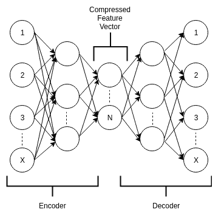
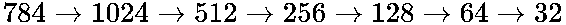
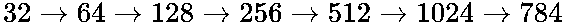

# 机器人一切-真正的战略游戏

近年来，视频游戏行业以惊人的速度增长。 根据 SuperData 的 2017 年度回顾报告，全球游戏行业创造了 1084 亿美元的收入。 全球游戏市场研究机构 Newzoo 预测，到 2020 年，视频游戏行业的收入将超过 1400 亿美元。

实时策略游戏构成策略视频游戏类型的子类别，并且相对于回合制策略游戏而言，实时策略游戏现在变得越来越重要。 在本章中，我们将讨论 AI 社区为何无法解决实时策略游戏，以及与其他算法相比，强化学习在学习和性能方面如何更好地解决该问题陈述。

我们将在本章介绍以下主题：

*   实时策略游戏
*   强化学习和其他方法
*   RTS 游戏中的强化学习

# 实时策略游戏

Brett Sperry 首先使用术语**实时策略**（ **RTS** ）作为宣传其游戏 Dune II 的标语。 实时策略游戏涉及玩家使用实时策略来增加资产，保存资产并利用它们来摧毁对手的资产。 它与需要在非常短的时间内做出的许多复杂的战术决策相关。

这与基于回合的策略游戏不同，在回合制策略游戏中，每个对手都有时间分析和采取行动，而其他对手则无法执行任何动作。 在实时策略游戏中，动作和反应都实时发生，因为环境中的其他实体（即对手）也很活跃，并且会同时执行动作。 在真实的策略游戏环境中，实体的形式多种多样，包括玩家，结构及其多样化的高维特征。 因此，目标是采取最佳措施在游戏环境中生存，直到您取得胜利为止，而环境中的一个或多个实体正在对您不利。

实时策略游戏的特性使传统的规划方法效率低下，如下所示：

*   高尺寸和连续动作空间
*   高维连续状态空间
*   环境是不确定的
*   该环境是部分可观察的，玩家只能感知该环境的一部分（即游戏地图/世界）
*   因此，由于游戏环境的状态不断变化，因此系统应该是实时的，可以实时决定并执行动作。

实时策略游戏已经发展了很多，现在具有包含许多实体的复杂虚拟环境，可以模拟各种现实问题。 因此，现实世界策略游戏已成为 AI 社区研究人员的良好测试平台，因为它们提供了复杂，多样，真实世界环境的仿真以测试其算法，从而创建更强大，更高效的算法。 因此，这些模拟环境实际上有助于创建更好的学习代理，这些学习代理可以在这些环境中生存和获胜，而无需在现实世界中进行测试，这在创建和维护方面非常昂贵。

近几十年来，计算能力的提高使得实现高级 AI 算法成为可能。 因此，它使他们成为解决实际策略游戏中国家行动复杂性和时间问题的最有效的候选人选择。 大多数技术（例如 minimax 和基于案例的在线计划）都可以用来解决此问题，但是它们在有限的条件下可以高效运行。

在可用的技术中，强化学习在学习和计划中表现更好。 我们已经知道，强化学习在涉及高维和连续状态动作空间时有许多成功的案例。

# 强化学习和其他方法

已经设计出许多方法来解决实时策略游戏的问题。 强化学习之前的主要方法之一是**在线基于案例的计划**。 基于案例的在线计划涉及基于案例的实时推理。 在基于案例的推理中，使用了一组方法来学习计划。 基于案例的在线计划在实施计划获取和执行的同时也实时地实现了此属性。

# 基于案例的在线计划

基于案例的推理包括四个步骤：

*   取回

*   重用

*   修改

*   保留

下图说明了这些步骤：

基于案例的推理

在检索步骤中，从案例库中选择与问题相关的案例子集。 在重用步骤中，将根据所选情况调整解决方案。 然后，在修订步骤中，通过在实际环境中进行测试来验证适应的解决方案，并观察到量化预测解决方案准确性的反馈。 保留步骤决定是否将此新解决的案例存储在案例库中。 因此，基于案例的推理和计划涉及重用以前的计划，并使它们适应新情况。

基于案例的推理主要应用于静态域，也就是说，代理有时间决定要采取的操作，与此同时，环境的状态也不会改变。 但是现实世界中的问题是动态的，并且有时间限制。 因此，基于案例的推理不适合实际的策略游戏，这导致**在线基于案例的计划**，其中与基于案例的推理不同，实时进行计划和执行。 下图给出了基于案例的在线计划的体系结构：

基于案例的在线计划

如图所示，基于案例的在线计划具有两个额外的流程，相对于基于案例的推理，这些流程有很小的变化，以实时实施计划和执行。 这两个过程如下：

*   扩展：此过程将当前适应的解决方案作为输入，并找到未解决的子问题，即子目标，如果有任何可检索和可解决的未解决子目标。 如果世界状态发生的变化足以使当前解决方案发生变化，它还会监视世界状态并将信号发送到适配模块。 这称为**延迟自适应**，在运行期间执行。 该流程模块使在线基于案例的计划在动态环境中工作。
*   执行：这将执行当前解决方案并根据执行结果更新其状态。 如果子问题失败，导致当前解决方案在执行时失败，则此过程通过将当前信息发送到扩展模块以查找替代解决方案来更新当前解决方案，以缓解此问题。

# 实时策略游戏的缺点

所有先前方法效率低下的原因在于，决策是实时进行的，其中状态动作空间巨大且连续。 先前的方法在有限的条件下是有效的，因为它们不能满足以下所有条件：

*   高维状态作用空间
*   对抗环境
*   部分可观察的环境
*   随机环境
*   即时的

为了覆盖较大的状态操作空间，解决方案库中将需要大量规则。 此外，没有探索策略可以找到最佳解决方案。 因此，由于所有前面提到的与实时策略游戏相关的问题和复杂性，这些传统的 AI 方法很难实现。

# 为什么要加强学习？

强化学习相对于其他 AI 方法脱颖而出的原因如下：

*   避免使用基于规则的手动编码方法。
*   强化学习不需要存储游戏的特定规则。 强化学习代理学习多种交互，并增强其每次与环境交互时在环境中起作用的理解。
*   对于高维状态作用空间，可以将神经网络用作函数逼近器以得出最佳作用。
*   始终探索不同的策略以找到最佳策略。
*   强化学习已应用于需要状态行动计划的各个领域，例如机器人技术，自动驾驶汽车等。
*   此外，强化学习是一个非常活跃且庞大的研究领域，因此可以肯定，还有许多更好的算法尚待发展。

# RTS 游戏中的强化学习

在这里，我们将讨论如何实施强化学习算法来解决实时策略游戏问题。 让我们再次回顾强化学习的基本组成部分，它们如下：

*   状态 *S*
*   动作 *A*
*   奖励 *R*
*   过渡模型（如果基于策略，非策略学习不需要）

如果这些组件在接收来自给定游戏环境的信号时被学习代理上的传感器感知和处理，则可以成功应用强化学习算法。 传感器感知到的信号可以进行处理，以形成当前的环境状态，根据状态信息预测动作，并接收反馈，即在所采取动作的好坏之间进行奖励。 这将更新状态-动作对值，即根据收到的反馈加强其学习。

此外，可以使用深度自动编码器将较高维度的状态和操作空间编码为紧凑的较低维度。 这将状态和动作空间的特征尺寸减小为重要特征。

# 深度自动编码器

**深度自动编码器**是一种由两个对称神经网络组成的深度神经网络，如下图所示，它能够将输入数据转换为尺寸也较小的更紧凑的表示形式。 编码器网络首先将输入编码为紧凑的压缩表示形式，然后解码器网络将该表示形式解码回以输出原始输入。 如下图所示，中间层连接了两个神经网络（编码器和解码器），其中包含输入数据的紧凑压缩表示形式：

自动编码器的体系结构

此处， *X* 表示输入和输出层中的节点数，它等于输入数据的特征（维度）数，而 *N* 表示节点数 在中间层中，它等于紧凑压缩表示形式所需的特征（尺寸）数。

例如，假设您输入的是游戏环境的 28x28 像素图像，即 784 像素。 因此，示例编码器网络体系结构可以按以下顺序拥有节点（不必遵循该顺序）：

在前面的示例编码器网络中，我们采用了维度 784 的输入，然后将其扩展为 1024 维度，然后通过网络的连续层分别减小为 512、256、128、64，最后是 32 维度。 在这里， *X* 为 784， *N* 为 32。这里，我们的紧凑压缩表示形式仅相对于 784 维的输入数据由 32 维表示。

同样，我们的解码器网络架构与此相反，如下所示：

培训深度的自动编码器后，无需解码器网络。 因此，我们的目标是训练网络，使解码器网络的输出与编码器网络的输入之间的损耗最小。 结果，中间层学会了创建更好的输入表示形式。 因此，我们可以为输入特征向量检索特征向量的更好，紧凑和低维的表示形式。

# 强化学习如何更好？

以前，通过基于案例的在线计划，专家提供的人的踪迹是学习过程中最重要的组成部分。 这些由专家提供，以创建解决方案列表。 这样就创建了案例库并消耗了大量空间。 而且，它还带有一个缺点，即它们没有捕获所有可能的痕迹，也就是说，特别是在连续的状态动作空间的情况下，状态和动作的组合。

但是，通过强化学习，不需要存储这些迹线，而且，高维和连续状态动作空间可以处理深度神经网络，该网络将其作为输入并输出最佳动作。 此外，如果状态作用空间很大，并且需要减小尺寸以进一步减少计算时间，那么使用如前所示的深层自动编码器会将输入数据转换为紧凑的低维向量。

强化学习中的奖励功能必须与每个状态相关联，以使从开始状态开始的动作通过一系列中间状态导致达到目标状态，从而使预期的奖励总和最大化，从而导致 最佳路径。

基本的强化学习算法，例如 Q 学习和 SARSA 算法（在[第 5 章](../Text/05.html)， *Q-Learning 和深度 Q 网络*中进行了解释）在收敛时间和比率方面表现更好 与早期的在线案例学习相比。

此外，在深度强化学习领域中正在进行大量研究，该研究集中于使用图像进行代理感知以在更复杂的领域中更好地工作。 以前的自动编码器方法有助于将非常复杂的域转换为更简单的域。 此外，学习奖励功能和自动编码器的其他变体，尤其是去噪堆叠式自动编码器，将进一步改善结果。

此外，使用异步或分布式多主体强化学习方法（在[第 6 章](../Text/06.html)，*异步方法*中讨论），其中学习代理与自己的环境副本并行工作将进一步减少 收敛时间更好的结果。

# 概要

在本章中，我们讨论了真正的战略游戏以及 AI 社区的研究人员为何试图解决它们。 我们还介绍了实际策略游戏的复杂性和属性以及不同的传统 AI 方法，例如基于案例的推理和基于在线案例的计划以解决它们及其缺点。 我们讨论了强化学习成为该问题的最佳人选的原因，以及强化学习如何成功解决与早期传统 AI 方法失败有关的实时战略游戏相关的复杂性和问题。 我们还了解了深层自动编码器，以及如何使用它们来减少输入数据的维数并获得更好的输入表示。

在下一章中，我们将介绍使深度强化学习成为众人关注的最著名的话题，并使之成为 AI 算法的旗手，即 Alpha Go。