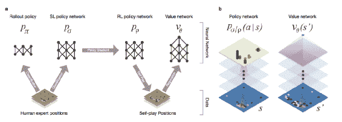

# AlphaGo –最好的强化学习

游戏为许多**人工智能**（**AI**）算法提供了最佳的测试环境。 这些模拟环境具有成本效益，并且可以安全方式测试算法。 人工智能的主要目标是解决世界上最大的问题。 人工智能的主要全球目标是：

*   消除贫困
*   消除饥饿
*   所有人的主要个性化医疗保健
*   素质教育
*   清洁能源
*   良好的基础设施
*   创新与创造力
*   减少不平等
*   保护地球
*   应对气候变化
*   和平与正义
*   好的工作
*   经济增长
*   解决水危机

研究技术和工业界正在努力实现更多的全球目标。 现在，借助 AI 算法和更好的计算能力，随着时间的推移，向这些目标迈进的步伐越来越长。 尽管这是一条很长的路要走，但随着最近的进步和发现，我们至少可以说我们走在正确的道路上，并且比十年前处于更好的位置。

如前所述，游戏是测试这些 AI 算法的最佳测试平台。 除了具有成本效益之外，没有两个游戏是相同的，因此能够使用从一个游戏中学到的知识并将其应用于另一个游戏，这是一般智慧的标志。 单个算法可以应用的游戏越多，它变得越通用。

我们第一次看到向**人工智能**（**AGI**）迈出了巨大的一步，当时 DeepMind 证明了他们的 AI 可以击败许多 Atari 游戏，使其成为现存最通用的 AI 系统 。 DeepMind 在研究期刊 **Nature** 上发表了他们的论文[《通过深度强化学习进行人类级别控制》](http://www.davidqiu.com:8888/research/nature14236.pdf)，由 Silver 等展示了他们的 AI 智能体**深度 Q 学习器**，使用了深度强化学习算法，已成功应用于 50 种不同的 Atari 游戏，并在以下截图中显示了其中的 30 种，其表现均达到人类水平。 通用人工智能的发展方向是 Google 购买 DeepMind 的原因：

比较 50 种不同的 Atari 游戏的表现：DQN 的表现根据专业人类玩家测试员规范化，[《通过深度强化学习的人类水平控制》](http://www.davidqiu.com:8888/research/nature14236.pdf)。

2016 年 3 月 9 日，我们见证了 Google DeepMind 的 AlphaGo 在古代中国游戏围棋中击败 18 届世界冠军 Lee Sedol 的历史。 对于整个 AI 社区来说，这是一个伟大的里程碑。 这是因为人们投入了毕生精力来掌握围棋游戏。 由于其复杂性，围棋游戏具有很高的挑战性。 根据 1997 年[《纽约时报》的文章](http://www.nytimes.com/1997/07/29/science/to-test-a-powerful-computer-play-an-ancient-game.html)，科学家说，围棋是智力水平最高的游戏，要在围棋上击败人类至少要花一个世纪的时间。 但是，由于有了 Google DeepMind，我们得以在不到二十年的时间内实现了这一壮举。 以下是本章将涉及的主题：

*   什么是围棋？
*   AlphaGo-精通围棋
*   AlphaGo Zero

# 什么是围棋？

围棋游戏起源于中国大约 3000 年前。 游戏规则很简单，如下所示：

*   围棋是一款两人游戏
*   默认棋盘尺寸为`19x19`行
*   一个玩家放置一块黑色的石头，而另一玩家放置一块白色的石头
*   目标是包围对手的石头，并覆盖棋盘上的大部分空白区域

以下是默认的板尺寸，为`19x19`行：

`19x19`围棋板

即使有这些简单的规则，围棋的游戏还是非常复杂的。 在`19x19`围棋中，大约有`2.08 x 10^170`，而在宇宙中有`10^80`个原子，而在象棋中有`10^120`个可能的移动。 因此，玩围棋游戏所需的智力深度已经吸引了人类多年的想象力。

# 围棋

1997 年，IBM 的 DeepBlue 在国际象棋比赛中击败了当时的世界冠军加里·卡斯帕罗夫。 大约二十年后，Google DeepMind 的 AI 程序 AlphaGo 击败了 9 段围棋选手和前世界冠军 Lee Sedol。 为了了解通过 AlphaGo 进行的 Google DeepMind 的巨大飞跃和成就，让我们首先了解这两个游戏之间的区别，然后再了解 DeepBlue 和 AlphaGo 的 AI 背后使用的架构。

国际象棋和围棋都需要两名球员。 在国际象棋中，每个玩家都有十六种不同类型的十六种棋子，根据游戏规则它们具有不同的优势。 目的是夺取对手的国王。 另一方面，围棋从一个空白的棋盘开始，每个棋手依次一个人放置一块石头，并且所有石头都具有相同的强度，遵循相同的规则。 此处的目标是在板上捕获尽可能多的区域。

因此，我们发现围棋的游戏规则比国际象棋简单，但我们没有看到的是复杂性，相对于国际象棋，围棋的复杂性很高。 在每个游戏状态下，围棋玩家必须从 250 个可能的选择中选择一个棋步，而国际象棋则需要选择 35 个选择。 围棋比赛持续约 150 步，而象棋比赛持续约 80 步。

正如我们之前研究的，在`19x19`围棋中大约有`2.08 x 10^170`个可能的移动，而宇宙中有`10^80`个原子和在国际象棋中有`10^120`个可能的移动。

# DeepBlue 如何击败 Gary Kasparov？

在第 5 章， “Q 学习和深度 Q 网络”中，我们研究了游戏树和 minimax 算法。 让我们回想一下那些了解 IBM DeepBlue AI 程序背后的架构的方法。

游戏树表示游戏的完整端到端表示，其中树中的每个节点表示特定的游戏状态（位置），链接节点的边表示在先前游戏状态下所采取的动作（动作），产生新游戏状态。 根节点代表游戏的开始，下一级别的节点代表在游戏的开始状态下采取了所有不同的可能动作之后生成的可能状态，并且类似地生成了其他层中的节点。

对于井字游戏这样的简单游戏，由于复杂度较低，因此很容易创建游戏树。 一旦游戏复杂性增加，就不可能创建游戏树。 对于国际象棋，将需要`10^120`个不同的节点来创建游戏树。 如此巨大的游戏树无法存储。

按照传统方法，了解游戏的游戏树对于创建玩 AI 的游戏非常重要，因为它有助于在任何给定状态下选择最佳动作。 使用最小最大算法选择了最佳的移动方式，在每个回合中，它试图找出哪个移动方式可以最大程度地减少最坏的情况（这还包括输掉比赛）。

为此，它首先找出代表当前游戏状态的节点，然后以使遭受的损失最小化的方式采取行动。 为此，需要遍历整个游戏树到叶子节点（最终游戏状态）以评估损失。 因此，minimax 算法要求遍历游戏树以评估每一步的损失（最坏的情况），然后选择损失最小的那一步。

DeepBlue 搜索国际象棋的游戏树到最低深度（因为不可能创建整个国际象棋的游戏树）。 然后，它使用评估函数来计算值，该值将替换下面的子树。 此评估函数用于将下面的子树汇总为单个值。 然后，它使用 minimax 算法引导最小的最坏情况，直到达到最大可能深度。

评估函数依赖于一些试探法。 在 DeepBlue 中，评估函数分为 8000 个部分，专门针对某些特定位置进行设计。 因此，为了更深入地了解游戏树，计算能力应该更高，甚至在此之后，还要根据监督下的不同游戏位置来设计游戏特定评估函数。 因此，由于没有学习，它不能在其他领域（或游戏）上推广。

简而言之，为了解决国际象棋的复杂性，DeepBlue 对设计良好的评估函数的游戏树使用了蛮力方法。

# 为什么游戏树方法对围棋不利？

不能以游戏树方式接近。 原因是所使用的更大的复杂性和蛮力方法无法进行任何学习。 它执行的唯一任务是将游戏状态映射到游戏树中的节点。 而且，DeepBlue 中使用的蛮力方法没有通用的评估函数，而是针对不同的游戏位置手工制作的。 因此，先前的方法过于特定于游戏，因此此类方法无法扩大规模以玩围棋。

# AlphaGo –精通围棋

在围棋的情况下，基于搜索树覆盖所有可能位置的传统 AI 方法会失败。 原因是由于`2.08 x 10^170 `可能的移动以及因此而难以评估每个可能的棋盘位置的强度，因此搜索空间极其巨大。 因此，传统的蛮力方法在围棋的巨大搜索空间中失败了。

因此，高级树搜索（例如具有深度神经网络的蒙特卡罗树搜索）被认为是捕捉人类用来玩围棋游戏的直觉的新颖方法。 这些神经网络是**卷积神经网络**（**CNN**），并为棋盘拍摄图像，即棋盘的描述，并根据游戏的给定状态，通过一系列层激活它来找到最佳的动作。

AlphaGo 的架构中使用了两个神经网络，分别是：

*   **策略网络**：此神经网络决定要采取的下一步行动/行动
*   **值网络**：此神经网络从当前位置预测游戏的获胜者

AlphaGo 使用策略和值网络的方式是将搜索树的巨大复杂性降低到较小的可管理搜索空间。 因此，它没有考虑每个步骤的数百个不同动作，而是考虑了策略网络建议的一些最佳可能动作。

此外，值网络减少了搜索的深度。 在每个位置，值网络都试图预测哪个玩家将获胜，而不是遍历搜索树进行评估。 因此，它能够返回一个值，该值量化可能的网络建议的移动量。

人类在游戏寿命方面存在弱点，也就是说，他们在长时间比赛中会感到疲倦，从而导致失误，而这并不是计算机的问题。 而且，人类的时间有限。 他们一生可以玩大约数千场围棋游戏，而 AlphaGo 一天可以玩一百万场游戏。 因此，经过足够的处理，足够的训练，足够的搜索和足够的计算能力，AlphaGo 击败了世界上最好的专业围棋选手。

因此，应对给定的围棋极大复杂性也可以为在医学中使用这种方法铺平道路，通过深度强化学习来帮助患者接受个性化治疗，从而可以根据患者的病史和生物学史来产生最佳结果。

# 蒙特卡罗树搜索

在第 5 章， “Q 学习和深度 Q 网络”中，我们研究了蒙特卡洛树搜索。 在这里，让我们再次对其进行修改，看看 AlphaGo 如何使用它来获得更好的结果。

蒙特卡洛树搜索是游戏树搜索的另一种方法。 在这种方法中，我们对游戏进行了许多模拟，其中每个模拟都以当前游戏状态开始，以两个玩家之一作为获胜者结束。 开始时，模拟是随机的，即为两个玩家随机选择动作。 在每个模拟中，对于该模拟的每个游戏状态，都会存储相应的值。 游戏状态（节点）的该值表示该节点的出现频率以及其中几次出现导致获胜的频率。 这些值可为以后的模拟选择动作提供指导。 运行的模拟次数越多，这些值在选择获胜举动时就会越优化。

蒙特卡洛树搜索（Monte Carlo Tree Search）更加侧重于一旦赢得胜利并趋向该方向的获胜行为，因此导致对已探索的现有行为的利用。 为了探索新动作，在执行下一个动作时添加随机性很重要。 这有助于增加对搜索中新动作的探索。

最大的优势之一是，蒙特卡洛树搜索不需要任何领域知识。 它唯一需要做的就是对游戏进行大量模拟，并在遇到相应的情况时更新不同游戏状态的值。 而且，它不需要整个游戏树就可以了解每个可能的游戏状态。 存储象棋和围棋之类的游戏树是不可能的。 相反，蒙特卡洛树搜索（Monte Carlo Tree Search）只是运行越来越多的模拟来优化节点（游戏状态）值，从而获得更好的结果。

AlphaGo 之前的围棋 AI 程序完全依赖于蒙特卡洛树搜索。 这些是 Fuego，Pachi，Zen 和 Crazy Stone。 其中，Pachi 是最强的，直到 AlphaGo 仅使用策略网络而不使用任何搜索方法将其击败。 前面提到的围棋 AI 程序还依赖于一些领域知识，以便在蒙特卡洛模拟期间选择更好的结果并达到强大的业余水平。 纯粹的蒙特卡洛树搜索（Monte Carlo Carlo Tree Search）不会通过经验模拟来学习，它只是优化位置（游戏状态/节点）。

# AlphaGo 的架构和属性

所有方法都依赖于结合某些领域知识和人工干预的树搜索。 AlphaGo 使用树搜索和两种 CNN（策略和值网络）来指导树搜索。 这些 CNN 类似于 DeepBlue 中使用的评估函数，但有一个区别，即 CNN 在手工制作 DeepBlue 中使用的评估函数时学习评估函数。

较早使用的树搜索是一种蛮力方法，而 CNN 是一种基于学习的方法，它提供了一种基于直觉的游戏方式。 因此，第一个任务是减少搜索空间（围棋的搜索空间大约为`10^170`）。 这可以通过两种方法来完成：

*   减少*动作候选*，即广度减少（避免在游戏树中探索它们时避免出现不必要的动作）
*   在时间之前减少评估函数，即深度减少（避免遍历整个游戏树来评估所采取的移动并根据当前游戏状态预测获胜状态）

策略网络并入当前游戏状态，并输出给定​​状态下每个可能动作的概率。 具有较高概率的动作有较高的获胜机会。 首先，使用专家玩家玩游戏的数据集，通过监督学习来训练策略网络。 输入数据包含游戏板的图像，输出将采取的措施。 来自 160000 个专家游戏的大约 3000 万个棋盘位置的训练数据集最初用于训练 AlphaGo 的策略网络。 在专家数据集上进行训练后，通过自我扮演改进了预测可能学习到的动作的模型，在自我扮演的过程中，它与自身无数次比赛，以使用策略梯度从过去的错误中学习。 因此，策略网络通过提供可能采取行动的可能性来帮助减少候选行动。

值网络提供当前状态的估计值，该值是黑人玩家在当前状态下赢得比赛的概率。 策略和值网络的输入与当前游戏状态（具有当前石头位置的棋盘游戏的图像）相同。 策略网络的输出是获胜的概率。 因此，值网络的作用类似于评估函数，该功能是通过 3000 万个棋盘位置的监督学习集获得的。

因此，值网络输出直觉（赢和输的机会），而策略网络输出反思（训练游戏知识）。 因此，AlphaGo 中直觉和反射的混合使其比任何基于搜索的方法都强大。 但是在 AlphaGo 中，这些网络可根据所开发的直觉和学习的反射来帮助更快，优化树搜索。

下图是神经网络训练管道和架构：

AlphaGo 的神经网络训练流水线和架构，摘录自 Google DeepMind 的 Silver 等人在 Nature 上发表的文章[《AlphaGo》](https://storage.googleapis.com/deepmind-media/alphago/AlphaGoNaturePaper.pdf)。 

让我们讨论前面详细显示的 AlphaGo 的神经网络架构图：

*  `a`：快速部署策略`ρ[π]`和监督学习策略网络`ρ[σ]`在包含 3000 万个棋盘位置的数据集上接受专家训练，以像人类专家一样学习预测动作。 通过学习的监督学习策略网络的权重初始化强化学习策略网络，并通过使用策略梯度来最大化策略质量，从而改进其策略`ρ[ρ]`策略网络的早期版本。 通过使用此更新的策略网络进行自我播放，将生成一个新的数据集。 数据集包含棋盘位置的图像及其相应的最终结果，即获胜或失败。 最后，使用该自玩数据集通过回归训练值网络`ν[θ]`，以输出获胜的概率。

*   `b`：该流程的架构流程，其中策略网络将棋盘位置（游戏状态）的图像表示作为输入，并通过参数`σ`的卷积层传播（如果它是一个有监督的学习策略网络）或`ρ`（如果它是强化学习策略网络），并针对所有可能的动作`a`返回概率分布`p[σ](a | s)`或`p[ρ](a | s)`输出。 值网络还使用参数`θ`的许多卷积层，返回标量值`v[θ](s')`，该标量值表示在给定位置`s'`中获胜或失败的结果（最终结果）的概率：

Silver 等人

让我们讨论前面详细显示的在 AlphaGo 中使用的**蒙特卡罗树搜索**（**MCTS**）：

*  `a`：在每次仿真过程中，遍历树时选择了该边，该边具有作用值`Q`和值`u(P)`之和的最大值。 `u(P)`是该边存储的先验概率`P`的函数。
*  `b`：扩展叶节点，即在策略网络`p[σ]`之后处理新节点，并将每个操作的输出概率存储为先验概率`P`。
*  `c`：在仿真结束时，以两种方式对叶节点进行评估：
    *   使用值网络`v[θ]`
    *   使用学习到的快速推广策略`p[π]`进行推广，直到游戏结束，并使用函数`r`计算获胜者
*  `d`：更新动作值`Q`，以跟踪该动作下方子树中所有评估值`r(·)`和`v[θ](·)`的平均值。

如前所述，对一个策略网络进行了 3000 万个游戏职位的训练。 在不使用树搜索的情况下，AlphaGo 赢得了与 Pachi（最强的围棋 AI 程序）对战的 85% 的比赛，其中 Pachi 依靠基于蒙特卡洛搜索树的 100,000 次模拟。 值网络接受了 3000 万个游戏位置的训练，并学习了预测获胜概率的模型。 策略网络输出充当树搜索的指南。 对于给定的游戏状态，策略网络为每个可能的移动提供了概率。 这有助于减少树搜索期间的候选动作。

# 能耗分析– Lee Sedol 与 AlphaGo

下表是能耗分析（Lee Sedol 与 AlphaGo）：

| **Lee Sedol（9 段围棋棋手）** | **Google DeepMind 的 AlphaGo** |
| --- | --- |
| 每人每天的卡路里 ~ 2,500 kCal（平均 BMR） | 假设：CPU ~ 100W，GPU ~ 300W，使用了 1,202 个 CPU 和 176 个 GPU |
| 假设 Lee Sedol 在一场比赛中消耗了所有精力， 因此为`2,500 kCal * 4184 J/kCal ≈ 10 MJ` | `[1,202 * 100 + 176 * 300] W = [1,202 * 100 + 176 * 300] J/s = 173,000 J/s`，考虑到它是至少四小时的游戏，因此，`173,000 J/s * 3 * 3,600 s ≈ 2,500 MJ` |

# AlphaGo Zero

第一代 AlphaGo 能够击败专业的围棋玩家。 2017 年 10 月，Google DeepMind 在 Nature 上发表了有关[《AlphaGo Zero》](https://www.nature.com/articles/nature24270)的论文。 AlphaGo Zero 是 AlphaGo 的最新版本。 早期版本的 AlphaGo 在接受过数以千计的从业余到专业游戏的人类游戏训练后，学会了玩游戏。 但是 AlphaGo 的最终版本（即 AlphaGo Zero）从零开始学到了一切，这是从第一个基本原理开始的，既没有使用任何人工数据也没有任何人工干预，并且能够实现最高水平的表现。 因此，AlphaGo Zero 通过与自己对战来学习玩围棋。 最大的壮举之一是，AlphaGo Zero 在 19 小时内就能够学习更高级的围棋策略的基础知识，包括生与死，影响力和领土。 在短短的三天内，AlphaGo Zero 击败了所有先前的 AlphaGo 版本，并在 40 天内超过了人类对围棋的一千年了解。

AlphaGo Zero 背后最重要的想法是，它完全从空白状态（即清晰的围棋棋盘）中学习，并通过自己的玩法自行弄清楚，而无需任何人类知识，没有任何人类游戏示例和数据，甚至没有任何人为干预。 它从最初的基本原理中发现并发展了学习围棋游戏的直觉。 这种从头开始的学习称为**表格学习**或**白板学习**。

Tabula rasa 学习对于任何 AI 智能体都是非常重要的，因为如果有一个智能体已实现 Tabula rasa 学习，则可以将其从围棋游戏移植到其他域环境（可能是其他任何游戏）。 Tabula rasa 学习将智能体与其所在领域的具体情况脱钩，并尝试开发一种算法，该算法足够通用，可以学习以实现与该环境相关的目标，并且可以在任何地方应用。

AlphaGo 项目背后的目标不是击败最佳的人类围棋选手，而是发现学习和做科学的意义以及对于计算机程序学习知识和直觉本质的意义。 AlphaGo Zero 不仅重新发现了人类倾向于玩的常见模式和空缺，还通过自行弄清它们来学习它们，并且还抛弃了许多已知的人类移动，而是优先选择了在数百万游戏中在数天之内发现的更好的移动。 这些更好的举动甚至是人类所不知道的。

在短时间内，AlphaGo Zero 可以理解人类在数千年的游戏过程中积累的所有围棋知识。 AlphaGo Zero 本身发现了大部分知识，并发现了人类围棋玩家尚未发现的大多数举动。 因此，除了比人类更快地适应知识之外，它还开发了新的知识，即知识创造，因此这种成就在许多方面被认为是新颖的。

因此，AlphaGo Zero 是第一个在围棋复杂而具有挑战性的领域中实现了非常高性能的计算机程序，已经开始了新的旅程，在该旅程中，我们可以开始解决一些具有挑战性的问题，这些问题要紧跟着一个顺序，而这些问题很少或更少。 同样复杂的游戏，例如围棋，会对人类产生不利影响。

Google DeepMind 已经开始使用 AlphaGo Zero 来了解蛋白质折叠，因为错误折叠的蛋白质会导致许多疾病，例如阿尔茨海默氏病，帕金森氏病，II 型糖尿病和囊性纤维化。 因此，使用基于 Tabras Rasa 的深度强化学习方法，可以了解蛋白质折叠，减少能量消耗，发现新元素或新材料以及更多其他内容。

# AlphaGo Zero 的架构和属性

与先前版本的 AlphaGo 相比有五处变化。 它们如下：

*   完全从自我游戏中训练，这不是人类专家的游戏数据，而是从头开始学习一切。 较早的版本监督学习策略网络，该网络经过专家游戏训练。
*   没有手工制作的特征。
*   用残差卷积架构替换了普通卷积架构。
*   AlphaGo Zero 并没有将其单独的策略和值网络，而是将它们两者合并为一个大型网络。
*   简化了蒙特卡洛树搜索，该搜索使用此大型神经网络进行仿真。

网络输入包括：

*   `19 x 19`矩阵平面，代表棋盘
*   一个用于白色宝石的特征图（在具有白色宝石的位置具有 1，在其他位置具有 0 的二进制矩阵）
*   一个用于黑宝石的特征图（在具有黑宝石的位置具有 1，在其他位置具有 0 的二进制矩阵）
*   七个使用白色石头的玩家过去的特征图（代表历史，因为它捕获了过去的七个动作）
*   七个使用黑石头的玩家过去特征地图（代表历史，因为它捕获了过去七个动作）
*   一个用于转弯指示的特征图（转弯可以用 1 位表示，但此处已在整个特征图上重复出现）

因此，网络输入由`19 x 19 x (1 + 1 + 7 + 7 + 1) = 19 x 19 x 17`张量表示。 使用过去七个动作的特征图的原因在于，这段历史就像一个注意力机制。

为什么我们使用残差架构而不是普通卷积架构？ 其背后的原因是残留的架构允许梯度信号直接穿过层。 此外，即使在卷积层没有做任何有用的学习的早期阶段，重要的学习信号也会进入卷积层并直接进入其他层。 详细解释残留架构超出了本书的范围。

因此，我们采用板的`19 x 19 x 17`张量表示形式的输入，并将其通过残差卷积网络，从而生成特征向量。 该特征向量通过全连接层传递，以进行最终的特征提取，其中包含两件事：

*   **值表示形式**：AlphaGo 的可能性在当前棋盘位置赢得零的游戏。
*   **策略向量**：AlphaGo 可以在当前位置播放的所有可能动作的概率分布。

因此，目标将是获得较高的良好举动概率和较低的不良举动概率。 在强化学习中，通过自玩这种较高复杂性的游戏来训练网络经常导致网络高度不稳定。 在这里，简化的蒙特卡洛树搜索执行稳定网络权重的任务。

# AlphaGo Zero 中的训练过程

接收板表示的输入，它是`19 x 19 x 17`张量。 它经过残差卷积网络，然后全连接层最终输出策略向量和值表示。 最初，策略向量将包含随机值，因为网络最初以随机权重开始。 在获得给定状态下所有可能动作的策略向量后，假设具有高概率的动作也可能是强力动作，它会选择一组概率很高的可能动作：

AlphaGo Zero 的自玩增强学习架构，摘录自 Google DeepMind 的 Silver 等人在 Nature 上发表的文章[《AlphaGo Zero》](https://www.nature.com/articles/nature24270)

基于这些选定的移动集，接收不同的游戏状态，每个状态对应于它们的移动。 由于您模拟了在先前状态下的移动，因此会产生许多不同的状态。 现在，对于这些下一组状态，通过输入这些游戏状态的表示张量来重复前面的过程，并获得其策略向量。

因此，对于当前的棋盘位置，这种重复过程将爆发成一棵大树。 运行更多的模拟，并且树将随着扩展呈指数扩展。 因此，该想法是将该搜索树爆炸到一定深度，因为由于有限的计算能力，进一步的搜索将是不可能的。

AlphaGo 团队决定为每个单板位置评估进行大约 1600 次仿真。 因此，对于每个单板状态，将运行蒙特卡洛树搜索，直到获得 1600 个模拟为止。 之后，值网络决定哪个结果棋盘位置是最好的，即获胜的可能性最高。 然后将所有这些值备份到树的顶部，直到当前的游戏状态（即正在评估的当前棋盘位置），并获得对真正有力的，但不是强势的动作的非常强的估计：

AlphaGo Zero 进行的蒙特卡罗树搜索，摘录自 Google DeepMind 的 Silver 等人在 Nature 上发表的文章[《AlphaGo Zero》](https://www.nature.com/articles/nature24270)

# 总结

在本章中，我们研究了目前最好的强化学习架构，即 AlphaGo。 我们了解了选择围棋的原因及其相对于象棋的复杂性。 我们还了解了 DeepBlue AI 架构的工作原理，以及围棋需要一种不同的更好的架构和训练过程。 我们研究了 AlphaGo 和 AlphaGo Zero 使用的架构和训练过程，还了解了版本之间的差异以及 AlphaGo Zero 如何超越其早期版本。

在下一章中，我们将研究如何在自动驾驶和自动驾驶汽车中使用和实现强化学习。