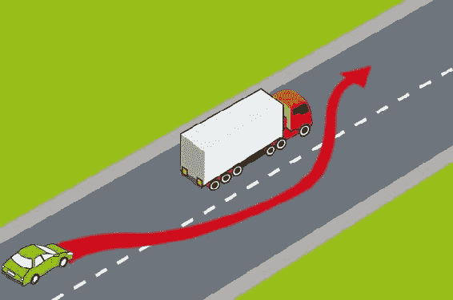
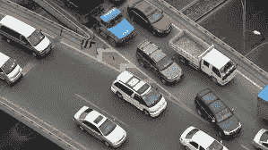
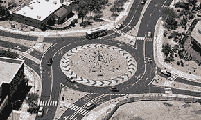
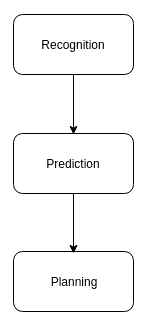
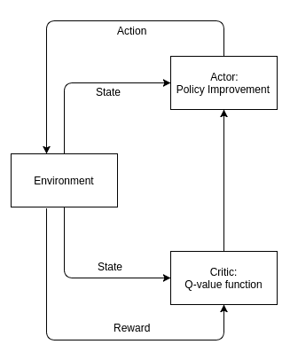

# 自动驾驶中的强化学习

在本章中，我们将介绍研究人员正在致力于使端到端自动驾驶成为可能的不同方法。 我们已经看到许多公司，例如 Google，特斯拉，Uber，梅赛德斯·奔驰，奥迪，沃尔沃，博世，还有更多公司进入自动驾驶汽车领域。 对于 AI 社区而言，端到端自动驾驶将是通往**人工智能**（**AGI**）的下一个里程碑。

纵观汽车行业的当前趋势，我们看到以下几点：

*   环境和气候友好型电动汽车正在增加
*   通过出租车聚合服务和拼车（即拼车）获利
*   利用 AI 和云技术进行无人驾驶汽车的颠覆性研究

乐高自动驾驶的主要功能如下：

*   传感器融合（传感器可以是相机，LIDAR，RADAR，GPS 等）
*   对象检测与分类
*   车辆路径规划-采取哪种操作，例如向左或向右转向，加速或制动，以及更多取决于：
    *   操作的不同类型
    *   操作的复杂性

# 自动驾驶中的机器学习

首先，为了开发端到端的无人驾驶汽车，在深入研究整个过程中使用强化学习之前，我们必须从高水平了解开发过程。 下图描述了开发过程：

如上图所示，该过程的第一步是传感器数据的收集。 传感器包括摄像头，LIDAR，IMU，RADAR，GPS，CAN 和更多其他设备，这些设备可以以最佳方式捕获车辆状态以及周围环境。 收到这些感官信号后，将对它们进行预处理，汇总，然后准备发送到下一个过程，包括**机器学习**（**ML**）和数据中心分析。 在准备好的感觉信号上执行 ML 的这一步骤是关键部分，它涉及从输入数据进行状态估计，从而对其进行建模，预测可能的未来动作，最后根据预测的输出进行计划，即执行哪个动作从而使整体奖励最大化。

涉及自动驾驶时，ML 可以用于不同的任务。 它们主要是以下内容：

*   **传感器融合**：聚类，模式识别和隔离
*   **环境理解**：图像处理，对象检测，对象分类和运动检测
*   **轨迹规划**：运动规划和控制
*   **控制策略**：强化和监督学习
*   **驱动模型**：图像处理和模式识别

此外，使用强化学习背后的最大原因是，由于以下几种不同的类型，它是处理多种车辆操纵的最佳人选：

*   换道时超车
*   交通拥堵
*   高速公路合并
*   高速公路分叉
*   车道缩小
*   在红色交通信号灯处停车
*   在停车标志处停在
*   放慢速度限制标志
*   在建筑或事故现场附近行驶时改变路线或安全驾驶
*   道路交叉口
*   合并为环岛的道路（环形路）

某些先前提到的车辆操作如下所示：

 

变道（左）和合并高速公路（右）时超车

 

分叉的高速公路（左）和道路交叉点（右）

合并为环岛的道路（环形路）

# 自动驾驶中的强化学习

由于与环境的强大交互作用以及环境中的多个障碍和操作（如前所述），无法通过全面的有监督的学习方法来解决自动驾驶所带来的挑战。 强化学习的奖励机制必须非常有效，这样代理才能对内部个体的安全以及外部所有障碍（无论是人类，动物还是任何正在进行的构造）保持谨慎。

奖励的方法之一可能是：

*   **智能体车辆与前方车辆相撞**：高负面奖励
*   **智能体车辆与前端和后端之间的距离都更安全**：积极的回报
*   **智能体车辆保持不安全的距离**：中等的负面奖励
*   **智能体车辆正在接近距离**：负面奖励
*   **智能体车辆加速**：随着速度增加，正奖励减少，超过速度限制则负奖励

整合**循环神经网络**（**RNN**）来整合时间序列信息将使汽车能够处理部分可观察的场景。 此外，使用注意力模型来关注相关信息还可以降低计算复杂度。 如前所述，AI 的下一个，当然是最大的里程碑之一是创建端到端自动驾驶汽车。

# 创建自动驾驶智能体

驾驶车辆需要良好的技能，专注力和经验。 因此，作为一项高技能的任务，创建自动驾驶代理所涉及的过程可以大致分为三类，如下图所示：

*   识别周围环境的组成部分，其中包括人行道，人，交通信号灯，任何建筑，道路边界，其他车辆等。 对于 AI，由于使用**卷积神经网络**（**CNN**）和**生成对抗网络**（**GAN**）。 CNN 和 GAN 的成功可用于自动驾驶环境要素的识别过程。
*   **预测**环境的未来状态。 识别当前环境状态的环境的当前组成部分很重要，但是将其用作输入并预测未来环境状态对于计划下一步行动也很有必要。 解决此问题的基本方法之一是创建环境图。 此外，我们可以合并深度神经网络，例如循环神经网络的变体，例如**长短期记忆网络**（**LSTM**）或**门控循环单元**（**GRU**），以整合和整合过去时间步长以及当前时间步长和预测未来中的数据。 正如我们在第 1 章，“深度学习–架构和框架”中讨论的那样，由于长期依赖以及 LSTM 单元如何解决该问题，围绕梯度消失的问题仍然存在 RNN 的情况。 RNN 是集成时间序列数据的最新技术，它在 [DeepTracking](https://arxiv.org/pdf/1602.00991.pdf)中显示了对象跟踪方面的改进。

*   **规划**是整个过程中最难的部分。 该任务包括将识别和预测的结果集成在一起，以计划将来的动作序列以及下一个驾驶动作集（向左或向右转向，加速等等），以使导航安全且成功。 这是一项艰巨的任务，因为整合和规划需要处理不可避免的情况才能安全到达目的地。 强化学习最适合此类控制计划任务。 我们已经了解了如何成功地部署强化学习来控制 50 场 Atari 游戏中的计划任务，以及 Google DeepMind 提供的最先进的 AlphaGo Zero。 在这些情况下，我们目睹了深度学习在进行表示学习的同时进行强化学习的规划。

由于使用了多种类型的传感器，所有这些信息的集成对于自动驾驶至关重要。 由于数据维数的差异，很难整合来自不同来源的感官输入。 例如，摄像机输入为高维，而 LIDAR 输入为低维。 提取相关信息并忽略不相关信息无疑会提高性能和准确率。 它降低了计算和存储能力的利用率。 因此，为了获取相关信息，注意模型适用于此目的，因为使用注意力机制的循环神经网络强化学习已成功应用于图像，从而仅关注相关部分。

# 为什么要强化学习？

我们已经讨论的一个重要原因是车辆操纵的可变性，无法以有监督的方式学习。 在本节中，我们将详细介绍为什么强化学习是自动驾驶的最佳选择。

就 ML 而言，驾驶是一个多主体交互问题。 考虑人类驾驶员在没有其他汽车在附近的车道上行驶。 与交通繁忙时更改车道相比，这更容易。 第二种情况之所以如此困难，是因为它还包括其他驾驶员的不确定行为和未知行为。 因此，与您的车辆进行交互的车辆数量，车辆类型（大小）以及其相应驾驶员的行为都是巨大且高度可变的信息。 由于这种高可变性，因此在此类数据上设计监督学习模型将无法涵盖所有​​不同类型的场景。 在监督学习中，训练数据越多越好，但是可变性和数量很重要。 因此，如果我们进行监督学习，则不可能涵盖所有情况。

当我们开车时，我们可以了解附近其他驾驶员的行为，这取决于他们的车辆在道路上行驶的方式。 假设，如果车辆行驶非常快并经过其他车辆，那么您会认为其他车辆的驾驶员具有进取心和经验。 因此，人脑执行此在线学习，从而了解环境及其组成部分。

需要这种类型的不断学习和计划，才能了解各种情况，从您无车行驶时到交通繁忙时的换道。 因此，在这些情况下，人们可以通过经验学习，但是在某些情况下，人们也会感到困难？ 因此，潜在的挑战包括目前人类尚难解决的情况。 这些情况包括在灾难性情况下驾驶，例如洪水，建筑坍塌或在没有 GPS 连接的情况下在新环境中导航等等。

因此，所有这些显式场景都不能被纳入学习模型，而需要诸如强化学习之类的方法来覆盖这些场景并通过从执行的不同动作中获得的奖励来增强其学习能力。

我们已经讨论了创建端到端自动驾驶车辆涉及的不同类别的任务。 当前，将这些任务分离并分别处理，然后使用后处理层进行合并。 一个基本且非常重要的缺点是这些孤立的任务可能无法正确组合。

因此，强化学习由于其行动奖励机制，可以根据所采取的驾驶行为和所获得的相应奖励进行建模，然后计划采取哪种行动。 测试自动驾驶的奖励机制对于真实汽车来说是非常危险且昂贵的，因为奖励值应基于良好的驾驶和意外情况而保持稳定。 因此，最好在 TORCS 或 Unity 等模拟环境中进行测试。

# 提出的自动驾驶框架

在本节中，我们将讨论 El Sallab 等人（2017）给出的[提出的用于自动驾驶的深度强化学习框架](https://arxiv.org/pdf/1704.02532.pdf)。

以下是端到端深度神经网络的架构：

[El Sallab 等人（2017）的《对自动驾驶深度神经网络进行端到端训练》](https://arxiv.org/pdf/1704.02532.pdf)。

让我们详细讨论前面的架构。 在这种情况下，输入是多个时间步长上环境状态的汇总。

# 空间聚合

该架构的第一个单元是空间聚合网络。 它由两个网络组成，每个网络都用于以下子过程：

*   传感器融合
*   空间特征

总体状态包括车辆的状态以及周围环境的状态。 车辆的状态包括位置，几何方向，速度，加速度，当前剩余燃料，当前转向方向等等。 环境状态包括其组成部分，即对象，生物，障碍及其特征，即它们的位置，几何定向（无论是否运动）以及更多。 周围物体的状态通过摄像机，激光雷达等来感知。 因此，对于识别，预测和计划任务，需要将多个感官输入组合在一起。

# 传感器融合

此步骤包括融合来自不同传感器和过程的输入，并准备将其输入到深度神经网络。 每个传感器信息以原始向量的形式捕获环境状态。 完成所有这些原始向量的分组，并将其馈入深度神经网络。 每个感官输入将形成一个单独的特征向量。 因此，作为学习的结果，即成本最小化，发生了与那些传感器特征中的每一个相关联的权重的优化。 这些学习的权重量化了相应传感器功能的相关性。 就深度神经网络而言，CNN 是完成任务的最佳选择。

# 空间特征

卷积神经网络用于查找隐藏的表示，然后应用注意力机制。 注意力机制指导网络的卷积层专注于数据的相关部分。 使用注意力模型的优势在于，它减少了数据集的维数。 结果，还减少了对原始数据的大量计算，包括卷积等。

运用注意力模型的最佳方法是使用动作和瞥见网络（说明超出了本书的范围，但有关动作和瞥见网络的更多详细信息，请转到此研究出版物[《视频中的帧错误的动作检测的端到端学习》](https://arxiv.org/pdf/1511.06984.pdf)，并避免使用注意过滤器，因为注意过滤器不会降低计算的维数 ，并将卷积应用于整个数据。 但是对于包含神经网络的动作和瞥见网络却不是这种情况，该网络学习学习数据的相关部分，从而引导卷积层专注于数据的这些相关部分。

# 周期性时间聚合

周期性时间聚合涉及跨不同时间步长聚集环境状态。 让我们详细讨论其背后的原因。 首先，获取环境状态并非易事，传感器读数可提供环境的最佳状态表示。 因此，当前时间步的状态信息不足以获取环境的完整信息。 因此，在多个时间步长上整合状态信息可捕获运动行为，这在环境状态在几秒钟内发生变化的自动驾驶中非常重要。

因此，通过增加重复性，可以处理 POMDP（部分可观察的马尔可夫决策过程）场景，这在驾驶中非常常见，因为无法完全观察到整个环境状态。 传统的算法（如贝叶斯过滤器）用于处理这种情况，方法是随着时间的推移集成信息，但它们是从 MDP 框架（环境状态完全可见）中派生的。

因此，通过创建时间序列格式，我们可以使用 RNN 来使用过去状态信息和当前状态数据对长期依赖关系进行建模。 众所周知，LSTM 具有足够的能力来处理长期依赖性，而不会遇到梯度消失的任何问题。 这是因为 LSTM 具有单元状态和隐藏状态，在该状态下，对于每个新的时间步，LSTM 都会根据来自先前的隐藏状态和当前时间步的新传入数据的相关信息来更新其新的隐藏状态。 此外，单元状态跨不同的时间步长存储相关数据，并且在单元状态中从存储的信息中忘记无关数据。 因此，LSTM 完全控制要在其单元格和隐藏状态中包含哪些信息。

# 规划

先前的网络构成**深度 Q 网络**（**DQN**）的一部分，该网络将状态信息作为输入并将体验存储在体验缓冲区中。 来自该经验缓冲区的样本数据用于训练 DQN 中使用的深度神经网络，该神经网络进而预测状态动作值。 状态操作值有助于得出最佳策略，即为给定状态规划最佳操作。

基于 DQN 的方法适用于连续状态空间，但它要求动作空间是离散的。 因此，在连续动作空间的情况下，首选参与者批评算法。 回顾第 4 章，“策略梯度”的参与者评论算法，以下是参与者评论算法的示意图：

演员评论算法包括：

*   充当评论者的网络更新状态动作的函数逼近器的权重参数向量
*   另一个充当参与者的网络按照评论者给出的方向更新策略参数向量

# DeepTraffic –用于自动驾驶的 MIT 模拟器

[DeepTraffic](https://selfdrivingcars.mit.edu/deeptraffic/) 是为课程《MIT 6.S094：用于自动驾驶汽车的深度学习》创建的，由 Lex Fridman 教授 。 课程内容和作业是公开的。 DeepTraffic 由于其排行榜而获得了很多欢迎。 迄今为止，DeepTraffic 拥有 13,000 多个提交文件，竞争非常激烈。 用户必须在`convnet.js`（由 Andrej Karpathy 创建的框架）中使用本节开头提到的链接中存在的编码依据来编写其神经网络。 平均速度最高的座席在排行榜上居首。

诸如 DeepTraffic 之类的模拟可帮助训练不同的方法，以使汽车代理迅速适应模拟环境。 此外，它的竞争性元素随着时间的推移增加了更好的提交，超过了过去的最高得分。 比赛很有趣，但在现实世界中，学生无法测试他们的深度强化学习脚本。 因此，DeepTraffic 为下一代 AI 开发人员提供了使用不同方法的最佳测试平台，这肯定会导致未来的 AI 开发人员在现实世界中创造出自动驾驶汽车，而这要得益于这些模拟的学习。

众所周知，在现实世界中，自动驾驶汽车应该规划最安全的道路。 因此，将需要大量修剪和更好的神经网络架构来实现该目标。 DeepTraffic 是朝着这个方向迈出的第一步，因此 AI 社区中感兴趣的人们可以玩耍并创建更好的学习架构和方法：

DeepTraffic 环境的四个视角：模拟，占用网格，防撞系统以及代表增强学习*状态*的占用网格的一部分，策略网络可基于此学习估计期望的奖励，通过采取五种可用操作中的每一项。（DeepTraffic：Fridman 等人在[这个页面](https://arxiv.org/pdf/1801.02805.pdf)上进行的具有深度强化学习的密集交通快速驾驶）。

DeepTraffic 由一条高速公路带组成，该高速公路带显示了同时行驶的七个车道和二十辆汽车（请参见上图的第一列），其时速限制为 80 mph（不允许任何车子超过该限制）。 DeepTraffic 是现实公路场景的简化模拟表示。 此模拟的重点只是学习交通繁忙时的有效运动方式。 所有汽车均可从以下五种动作中进行选择：

*   车道向左转
*   车道向右转
*   加速
*   减速
*   没做什么

对于其他汽车，将按照现实的模式随机选择动作，例如，由于随机选择动作，不会太频繁地改变车道。 以红色（深灰色）显示的汽车由深度强化学习智能体控制。 竞争对手获得以 DQN 实现的预定义神经网络。 任务是配置不同的超参数并获得最佳性能，即最高平均速度。

# 总结

在本章中，我们谈到了与最大的 AI 问题之一即自动驾驶相关的主要概念和挑战。 我们了解了问题所带来的挑战，还了解了用于使自动驾驶成功的当前方法。 此外，我们从接收感官输入到计划开始，对过程的各个子任务进行了概述。 我们还介绍了著名的 DeepTraffic 仿真，您可以在其中测试神经网络，以了解繁忙交通中的有效运动方式。 自动驾驶本身就是一个不断发展的广泛研究主题，而涵盖所有这些内容超出了本书的范围。

在下一章中，我们将研究另一个发展中的研究热点，即在金融中使用人工智能，我们将学习强化如何帮助金融投资组合管理。