# 金融投资组合管理

金融投资组合是将资金分配到不同金融产品中的过程。 在项目组合管理中实施深度学习一直是人工智能界的一个研究部门。 随着强化学习的进步，在创建免费的无财务模型的强化学习框架以产生端到端的财务组合管理代理方面，人们进行了积极的研究。

投资组合管理是一个连续的决策过程，将资金重新分配到众多不同的金融产品中，以期获得最大的回报。

传统的最新在线投资组合管理方法包括：

| **方法** | **重要算法** |
| 基准测试 | 

*   买入并持有
*   最佳股票
*   恒定的平衡投资组合

 |
| 关注获胜者 | 

*   通用投资组合
*   指数梯度
*   跟随领导者
*   跟随正则领导者
*   聚合类型算法

 |
| 跟随失败者 | 

*   反相关
*   被动积极平均回归
*   置信加权平均回归
*   在线移动平均回归
*   稳健中值回归

 |
| 模式匹配 | 

*   非参数直方图对数最优策略
*   基于非参数核的对数最优策略
*   非参数最近邻对数最优策略
*   相关驱动的非参数学习 策略
*   基于非参数内核的半对数最优策略
*   基于非参数内核的 Markowitz 型策略
*   基于非参数内核的 GV 类型策略

 |
| 元学习 | 

*   聚合算法
*   快速通用算法
*   在线梯度更新
*   在线牛顿更新
*   遵循领先的历史

 |

跟随获胜者和跟随失败者是基于先前构建的财务模型，该模型可能会或可能不会在上表中提及的相应算法中使用机器学习技术。 这些方法在不同金融市场中的有效性可以判断其效果。

模式匹配模型将历史数据样本作为输入，根据样本分布优化投资组合，并预测下一个时期的市场分布。 元学习聚合了不同类别的多种策略，以实现稳定的性能。

当前，存在用于金融市场交易的深度学习方法，这些方法可以预测价格走势和趋势，但不能在不同的金融产品之间执行自动的资金分配和重新分配。 由于我们拥有所有资产的历史价格，因此我们可以将包含它们的输入数据准备到循环神经网络中，该网络将预测下一时期的资产价格作为输出。 这是机器学习中的监督回归问题。

这些模型的性能完全取决于未来资产价格的预测准确性，而不仅是在下一个时期。 但是，未来的市场价格极难预测，因为它们不仅取决于历史价格，而且只能反映波动和流动，不包括也会驱动金融市场的情绪因素。

需要注意的另一个重要点是，预测市场价格并不意味着预测市场行为。 因此，需要领域知识和逻辑将预测价格转换为行动。 结合深度强化学习，可根据最大化回报的目标使此逻辑转换自动化。

已经提出了许多成功的针对金融模型免费和完全基于机器学习的方法的尝试，用于算法交易。 其中使用强化学习的主要问题是它们无法预测未来价格，并且仅适用于单一资产交易。 因此，它们不能应用于投资组合管理，其中包括同时管理多个资产。

而且，投资组合管理是一个连续的动作空间问题，而不是一个离散的动作空间。 大多数已建立的最先进的深度强化学习算法都可以很好地与离散的动作空间配合使用。 但是，尽管我们已经为投资组合管理问题开发了连续操作空间离散化的过程，但是如果我们采用离散化过程，那么我们将失去许多可能的重要市场行为。 这导致更大的信息丢失和不可用的风险。

投资组合管理，甚至任何设计的交易算法所需的算法，都应可在不同市场上扩展。 传统算法曾经失败，因为无法在不同的市场上扩展，因为市场受资产类型和资产总数等因素支配，这些因素因市场而异。 这是因为资产的模式和行为因市场而异，并且传统算法没有得到概括。 此处的机器学习具有跨不同垂直方向（即不同金融市场）进行泛化的优势。

此外，如前所述，强化学习在金融投资组合管理中的应用在人工智能界的研究人员中很重要。 在本章中，我们将讨论一个关于[《针对金融投资组合管理问题的深度强化学习框架》](https://arxiv.org/pdf/1706.10059.pdf)的最新论文，该论文由西交利物浦大学的研究者发布。我们将介绍他们采取的方法及其相对于当前在线投资组合管理方法的绩效，如下所示：

*   介绍
*   问题定义
*   资料准备
*   强化学习
*   进一步的改进

# 介绍

所提出的强化学习框架的核心是**相同独立评估者**（**EIIE**）拓扑。 在这里，EIIE 是一个神经网络，它将资产历史记录作为输入并评估未来资产的潜在增长。 每个资产的评估得分用于计算下一个交易期的投资组合权重。

投资组合权重（我们将在后面讨论）实际上是由强化学习驱动的投资组合管理代理的市场行为。 将购买目标权重增加的资产，而目标权重减小的资产将被出售。 因此，最后交易期间的投资组合权重也作为 EIIE 的输入。 因此，每个期间的投资组合权重存储在**投资组合向量存储器**（**PVM**）中。

EIIE 通过**在线随机批处理学习**（**OSBL**）进行训练，其中强化学习框架的奖励函数是该时期的平均对数回报。 由于奖励功能是动态的，因此，随着训练是通过梯度上升进行的，EIIE 也在不断发展。 如前所述，EIIE 由一个神经网络组成，因此，对于当前框架，使用不同类型的神经网络测试了三种不同类型的 EIIE，即**卷积神经网络**（**CNN**），**递归神经网络**（**RNN**）和**长短期记忆 neworks**（**LSTM**），这是 RNN 单元。 这种类型的框架可以轻松扩展到不同的市场，而不仅限于一个。

该提议框架的测试平台是一个名为 Poloniex 的加密货币交易市场。 实验之前，通过在一定时间间隔内的交易量排名来选择硬币。 实验在 30 分钟的交易时间内进行，并将 EIIE 的性能与前面提到的在线投资组合选择方法进行了比较。 EIIE 能够击败所有这些方法。

由于该框架不是在现实世界的金融市场中而是在加密货币市场中进行测试的，因此我们必须知道加密货币与传统金融资产之间的差异，以及为什么加密货币市场事先是算法投资组合管理实验的更好测试平台。 它们如下：

*   加密货币的去中心化（不是控制协议的中央机构）
*   加密货币市场的开放性（更易进入的市场）
*   加密货币中的小批量货币丰富
*   加密货币市场一直都是开放的，因此，对于学习代理来说，随着时间的流逝学习非常有用，这与受时间限制的现实世界不同。

# 问题定义

众所周知，投资组合管理是指跨多种金融产品（资产）对资金进行持续重新分配。 在这项工作中，时间分为相等长度的时间段，其中每个时间段 *T = 30* 分钟。 在每个时期的开始，交易代理将资金重新分配到不同的资产上。 资产的价格在一段时间内会波动，但要考虑四个重要的价格指标，它们足以表征该期间资产的价格变动。 这些价格指标如下：

*   开盘价
*   最高价
*   最低价格
*   收盘价

对于连续市场（例如我们的测试用例），资产在 *t* 期间的开盘价是其在前一时期 *t-1* 的收盘价。 投资组合由 *m* 个资产组成。 在时间段 *t* 中，所有 *m* 资产的收盘价都创建了价格向量。 因此，的元素即是该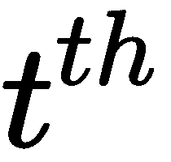时间段内资产的收盘价。

同样，我们有向量和，其中：

*   ：包含时间段 *t* 中所有 *m* 资产的最高价格的向量
*   ：包含时间段 *t* 中所有 *m* 资产的最低价格的向量

投资组合中的第一个资产是特殊资产，从现在开始将被称为现金。 之所以认为与众不同，是因为所有资产的价格均以现金面额报价。 由于第一个资产定义了基础货币，因此，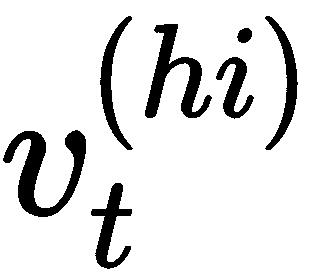和的第一个元素将始终为 1，即：

在这里，比特币被认为是现金。 因此，所有资产定价都将按照比特币进行。 正如我们已经讨论过的，这是一个连续的市场， *t + 1* 期的开盘价将等于 *t* 期的收盘价。 周期 *t* 的**价格相对向量**表示为，它是和的按元素划分，如下所示：

这是时间段 *t* 中资产的收盘价和时间段 *t-1，*中资产收盘价的按元素划分，换句话说，按元素划分 时间段 *t* 中资产的收盘价和开盘价的百分比。 因此，的元素是时间段 *t* 中单个资产的收盘价和开盘价之比。 **价格相对向量**用于计算一个时期内投资组合总价值的变化。

令时间段 *t* 开头的投资组合值为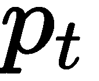。 因此，忽略交易成本：

在这里，是**投资组合权重向量**，也称为**投资组合向量**在时间段 *t* 的开始时，其元素是： 是资产*对*在当前投资组合中的比例。 因为是权重（比例）的向量，所以从定义上讲的元素总和将总和为 1，即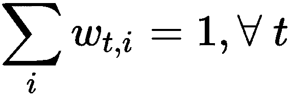。

时间段 *t* 的**回报率**由下式给出：

**对数回报率**由下式给出：

初始投资组合权重向量表示进入市场之前，该金额是以交易货币（称为**现金**，此处现金为比特币）表示，因为初始投资金额为 以交易货币计。 由于金额是以交易货币为单位的，因此投资组合向量的第一个资产是指交易货币资产，因此：

因此，如果没有交易成本，则最终投资组合价值将由下式给出：

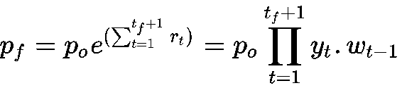

在此，是初始投资金额。 因此，投资组合经理的目标是在给定的时间范围内最大化。 实验中有两个假设：

*   **零滑点**：每笔定单在下单时均以最后价格执行，没有滞后，立即进行交易

*   **零市场影响**：交易代理商在市场上的投资金额微不足道，不会影响市场

# 资料准备

交易实验在名为 Poloniex 的加密货币交易所中进行了测试。 为了测试当前方法，预先选择了 *m = 11* 具有最高交易量的非现金资产作为投资组合。 由于第一基础资产是现金，即比特币，因此投资组合的大小为 *m + 1 = 12* 。 如果我们在交易量较大的市场（例如外汇市场）中进行了测试，则 *m* 将与市场中资产的总数一样大。

资产的历史数据被馈送到神经网络，该神经网络输出投资组合权重向量。 在周期 *t* 结束时输入到神经网络的是张量，其阶数为 3（ *f* ， *n* ， *m* ），其中：

*   *m* 是预选的非现金资产的数量
*   *n* 是 *t* 之前的输入周期数（此处 *n = 50* ）
*   *f = 3* 是功能编号

由于 *n = 50* ，即输入周期数为 50，每个周期为 30 分钟，因此总时间*帧= 30 * 50 分钟= 1500 分钟= 25 小时*。 时间段 *t* 上资产 *i* 的特征是其在时间段 *t* 中的收盘价，最高价和最低价。 价格矩阵不直接输入到神经网络。 价格变化决定了投资组合管理的绩效。 输入张量中的所有价格将由最新收盘价标准化，如下所示：

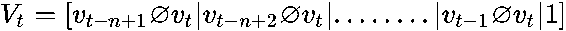

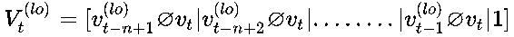

这里：

*   ，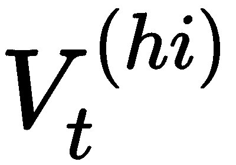和是归一化价格矩阵
*   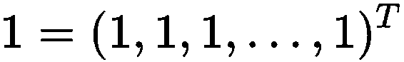和是逐元素除法运算符

因此，是三个归一化价格矩阵的堆栈：

投资组合管理代理使用输入张量和上一个时间段的（即 *t-1* ），投资组合权重向量输出时间段 *t 的投资组合权重向量。 根据策略的*。

因此：

并且由于（如前面的*问题定义*部分中所示）：

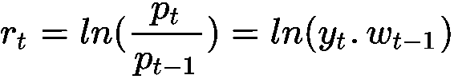

因此，通过对前面的陈述进行强化学习的框架化，我们可以说先前的权重向量是在时间段 *t-1* 的动作，收到了立即奖励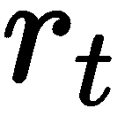。

# 强化学习

在算法投资组合管理的实验中，投资组合管理代理在强化学习的支持下在金融市场环境中执行交易操作。 环境包括给定市场的所有可用资产。 由于环境庞大而复杂，因此代理程序无法完全观察状态，即获取状态的所有信息。 而且，由于市场的全部订购历史太大而无法处理，因此从订购历史数据中进行子采样可以简化环境状态表示的处理。 这些子采样方法包括：

*   **周期性特征提取**：将时间离散化为多个时段，然后提取每个时段的开盘价，最高价，最低价和收盘价
*   **数据切片**：仅考虑最近时间段的数据，并避免使用较旧的历史数据，以便进行环境的当前状态表示

代理根据时段输出的投资组合权重向量，在时段 *t，*结束时，即在时段 *t + 1* 的开始进行了一些买卖交易。 神经网络。 因此，主体在时间 *t* 的动作仅由投资组合权重向量表示。 因此，在当前框架中，被视为环境的一部分，并作为输入输入到代理中，以输出下一个时间段即的代理的操作策略。 因此，在时期 *t，*，即的状态由价格张量和前一时期的投资组合权重矢量表示：

和，

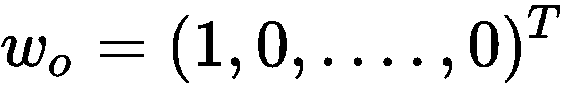

如前所述，投资组合管理代理的目标是使最终投资组合价值最大化，即，其中：

因此，在时间段内的总收益为。 因此，总回报对数的平均值为：

因此，最大化最终投资组合价值可以转换为最大化总收益的对数平均值，其公式为：

创建了三个具有深度神经网络的三个不同变体的策略网络，分别是 CNN，RNN 和 LSTM。 前一个时间段的输出是当前时间段内网络的输入。 因此，使用策略梯度和深层 Q 网络中的经验重播的想法，创建了一个 PVM，用于存储网络输出，也就是说，它将包含每个时间步骤的投资组合权重向量。

PVM 是按时间步长顺序（即时间顺序）收集投资组合向量的集合。 在训练纪元的每个时间步 *t* ，策略网络从 *t-1* 的存储位置取最后时间段的投资组合权重向量，并进行覆盖 *t* 处的内存与输出投资组合权重向量的关系。 由于策略网络参数的收敛，PVM 中的值随着训练时期的增加而收敛。

单个内存堆栈（例如 PVM）还有助于使用迷你批处理提高训练过程的并行性，从而提高训练过程的效率。

对于有监督的学习，数据的排序以小批量为单位，但是在这里，数据需要按照训练过程中每批传递的时间步长进行排序。 现在，由于数据是按时间序列格式的，因此从不同时间段开始的小批处理是更可取的，因为它们涵盖了训练过程的独特数据。 金融市场的持续性导致不断向代理网络输入新数据，从而导致训练数据中的数据爆炸。

因此，提出了 OSBL，其中在时段 *t* 结束时，时段的价格变动将添加到训练集中。 在完成时间段 *t + 1* 的订单后，使用从该组中随机选择的迷你批次对策略网络进行训练。 有关 OSBL 的完整详细研究超出了本书的范围，但是为了进一步探索，请阅读[上的“ *金融组合管理问题的深层强化学习框架*”中的 5.3 节。 ] https://arxiv.org/pdf/1706.10059.pdf](https://arxiv.org/pdf/1706.10059.pdf) 。

使用所有三个不同的策略网络（即 CNN，RNN 和 LSTM）在加密货币交易所 Poloniex 上对该框架进行了测试。 用于检查框架性能的投资组合的财务指标为：

*   **投资组合价值**：最终投资组合的价值
*   **最大跌幅**：在达到新峰值之前，从一个峰值（最高点）到波谷（最低点）的最大损失
*   **夏普比率**：风险收益率（可变性）比率

在前面提到的指标的基础上，将提出的框架的性能与现有的在线投资组合管理方法进行了比较，它能够成功击败现有的在线投资组合管理方法。 因此，提出的强化学习框架能够解决一般的金融投资组合管理问题。

拟议框架的主要特点是：

*   多渠道，多市场输入
*   政策网络直接提供投资组合权重向量形式的市场行为
*   在此，仅使用了深度神经网络的三个变体，但也可以应用其他变体
*   随着投资组合规模的增加可线性扩展

*   PVM 在使用迷你批次的训练中增加了并行性功能
*   OSBL 帮助在线使用实时输入数据

# 进一步的改进

可以对以前的框架进行进一步的改进，也可以使用深度强化学习来创建端到端金融投资组合管理代理的更好方法。 它们如下：

*   当前框架假设为零滑点和零市场影响。 因此，考虑市场影响和滑点将提供真实的交易样本，这将改善训练数据集。
*   使用行为者-批评类型的框架将有助于长期的市场反应。
*   在基本 RNN 上优于 LSTM 和 GRU 可以解决梯度消失的问题。

# 概要

在本章中，我们研究了最近发布的在金融组合管理中使用深度强化学习的方法之一。 我们查看了金融投资组合管理中的问题陈述，投资组合经理的目标，并将问题陈述映射到强化学习任务。 我们还了解了用于基准化绩效的不同财务指标以及不同的现有在线投资组合管理方法。 使用深度强化学习使财务组合自动化的研究主题是 AI 社区中要解决的最具挑战性的任务之一。 因此，除了本章介绍的方法外，还要尝试研究算法交易中的其他传统机器学习方法。

在下一章中，我们将研究强化学习在机器人技术中的使用，当前的挑战及其提出的解决方案。