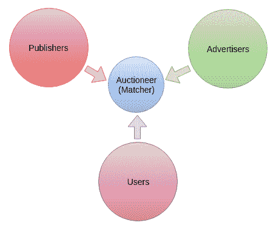

# 广告技术中的深度强化学习

到目前为止，在讨论强化学习应用研究领域的单元中，我们看到了强化学习如何破坏机器人技术，自动驾驶，金融投资组合管理以及解决诸如围棋之类的极其复杂的游戏领域。 强化学习可能会破坏的另一个重要领域是广告技术。

在深入了解问题陈述及其基于强化学习的解决方案之前，让我们了解所涉及的挑战，业务模型和投标策略，这将成为理解我们将尝试使用强化学习框架解决问题的基本前提。 我们将在本章中介绍的主题如下：

*   计算广告挑战和出价策略

*   展示广告中使用强化学习的实时出价

# 计算广告挑战和出价策略

广告是一种传达信息的方式。 计算广告的核心任务是在给定上下文中的给定用户和广告之间找到最佳匹配，其中适用以下因素：

*   **上下文/出价人**：用户访问过且被认为适合广告的平台，例如：
    *   使用搜索引擎的用户。 因此，在这种情况下赞助广告是一个很好的计划。
    *   用户阅读网页。 因此，展示广告适合这种情况。
    *   观看任何视频（电影，剪辑，短视频等）的用户。 因此，短视频广告是好的。
*   **约束条件**：对广告客户而言，最大的约束条件是预算有限和时间段有限。

在实现上述目标方面面临的核心挑战如下：

*   设计市场和交易平台，以便利所有用户，广告商和发行人的所有参与利益相关者的工作，并使其价值最大化。
*   为此完整的端到端过程构建基础结构：

这些元素之间的关系如下所示：



# 广告中使用的商业模式

广告平台的业务模型由不同的模型组成，这些模型控制广告商必须使用广告平台支付的应付金额度量。 计算广告领域中有不同的指标，如下所示：

*   **CPM**：每千次展示费用
    *   在这种类型的模型中，广告商为每千次展示支付固定金额，其中的展示次数可以是点击次数，观看次数等
*   **CPC**：每次点击费用，**每次点击付费**（**PPC**）
    *   在这种类型的在线广告模型中，广告商向用户支付平台所有者对用户在广告链接上进行的每次点击操作的费用
*   **CPA**：每次操作费用/每次获取费用/**每次获取费用**（**PPA**）/每次转化费用
    *   在这种类型的模型中，平台所有者（例如，运行广告的发布者）承担所有风险，而广告客户仅为已获得全部用户（换句话说，他们已经完成了所需操作，注册订阅或购买交易）。

# 赞助搜索广告

赞助搜索在在线广告中起着重要作用，尤其是在诸如 Google，Yahoo，Bing 等搜索引擎中。 由于每天都有大量的受众访问这些搜索平台，因此它们是最大的广告平台。

# 搜索广告管理

广告客户对某些搜索查询的每次点击率进行出价，这些查询由搜索引擎接收。 然后，将广告显示为那些搜索查询结果的一部分，并且，如果用户单击广告，则广告商必须支付投标金额。

# Adwords

在所有广告客户将其每次点击费用的出价针对某些搜索查询进行出价后，平台会接收到数据，该数据包括不同广告客户的出价集以及每个广告客户的总预算，以及每个搜索查询的**点击率**（**CTR**）的历史数据。

主要目的是响应每个查询选择一组广告，以使搜索引擎（即出价商）获得的收益最大化。 就像出价师的收入最大化一样，广告商的利润最大化也很重要，并且包括各种出价策略。

# 广告商的竞标策略

广告客户的出价策略主要包括在出价时针对不同关键字的预算优化。 重点讨论如下：

*   广告客户可以更好地将预算分配给不同的关键字
*   实现利润最大化的更好的出价策略

此外，在这个在线广告世界中，竞标是实时发生的。 您如何实现更好的实时出价策略以实现利润最大化？

*   自主竞标智能体
    *   这些智能体将使用历史市场数据并直接与市场参与者进行交互，并根据此数据对自己的行为进行建模，从而帮助制定不同的决策策略
*   使用强化学习的机器学习方法

    *   在第 3 章“Markov 决策过程”中可以看到**马尔可夫决策过程**（**MDP**）的框架，在该框架中，我们，最大化了每个状态的预期效用，并通过最大化预期奖励总和，优化了每个状态到目标状态的路径。

# 展示广告中使用强化学习的实时出价

在线展示主要通过实时出价来提供，其中，展示广告的每次展示都是在通过用户访问产生的同时实时出价的。 自动实时地出价对于广告商最大限度地提高利润至关重要。 因此，需要设计一种学习算法，该算法可以基于历史数据实时设计出最佳的学习策略，以便根据即时和未来的回报跨不同的印象进行预算的动态分配。 在这里，我们将讨论由 Cai 等人在《使用强化学习的展示广告中的实时出价》中发布​​的强化学习框架来制定出价决策过程。 

在蔡等人的这项研究中。 此外，我们考虑了在展示广告的情况下进行机器竞标，因为实时竞标是一项极富挑战性的任务，因为在在线展示广告的情况下，只要它由用户访问生成，广告印象的竞标就会立即开始。 在考虑了剩余预算，未来相关广告展示的可用性，出价结果和收到的反馈之后，为每次广告出价计算最佳出价，这些都可以帮助广告客户优化出价策略，从而更好地进行分配。

在这里，研究人员试图获得最佳出价函数，该函数可以最大化广告活动的关键表现指标，这些指标主要是总点击次数或总收入。 但是，这种方法主要在静态出价的情况下起作用，在这种情况下，出价发生在广告商为每个展示支付固定的平均费率的情况下。 在实时出价的情况下，它在展示级别是动态的，这意味着在一个平台中，根据生成的展示的需求，出价值会有所不同。

本研究试图通过使用强化学习框架来解决实时竞标挑战，并将其作为顺序决策来解决，其中：

*   智能体将从广告商的角度学习
*   整个广告市场和所有互联网用户形成环境
*   状态空间包含出价信息和实时活动参数
*   动作是要设定的买入价

因此，在每个步骤中，代表广告商出价者的智能体都会观察到由当前广告系列参数（例如预算和剩余时间）以及针对该特定广告印象的出价请求组成的状态。 然后，它发布一个动作； 例如，确定出价，中奖结果和用户反馈将一起作为对所采取措施的奖励，并将用于加强模型。 由于在现实世界中出价量很大，因此 MDP 框架已与基于 Q 网络的方法一起使用，该方法使用神经网络作为状态作用值函数逼近器。 竞标的基本强化学习框架如下所示：


最初，预算`b`是​​提供给智能体的，此处的目标是在随后的出价`t`中获得尽可能多的点击。 以下是智能体考虑的重要信息：

*   其余出价，即剩余出价编号`t ∈ {0, ···, T}`
*   初始分配预算中剩余的剩余金额，即未用预算`b ∈ {0, ..., B}`
*   特征向量`x`，代表出价请求

在每个剧集中，每次出价都会按顺序发送给智能体，智能体针对每个智能体根据当前信息`t`，`b`和`x`。 因此，智能体基于出价的剩余时间，初始分配预算中剩余的剩余量以及提出的投标请求的所有关键信息来决定适当的动作。

如上图所示，智能体维护剩余的出价`t`和剩余的预算`b`。 在每个时间步，智能体都收到一个竞标请求以及出价`x ∈ X`（特征向量空间），并且它必须确定竞标价格`a`。

给定特征向量`x`的市场价格概率分布函数为`m(δ, x)`，其中`δ`是市场价格， `m`是其概率。 因此，如果智能体以`a ≥ δ`的价格出价，则它将赢得竞标并支付`δ`，剩余预算将变为`b-δ`。 万一失败，智能体从竞标中得不到任何东西。 在此，如果将赢得出价视为预期奖励，则将**预测 CTR**（**pCTR**）表示为`θ(x)`。 在每次出价之后，剩余的出价数量减少 1。当`t = 0`时，也就是说，没有剩余的出价，则剧集结束。 随着当前剧集的结束，剩余的出价编号和预算都将分别重置为`T`和`B`。

以下是前面的增强型学习框架要投标的实现的伪代码：

```py
(In this part of the process: approximation of the optimal value function V(t, b) is done)

Inputs: probability distribution function of market price that is m(),
        average click through rate (CTR) , 
        episode length that is number of auctions in an episode T,
        budget B

Output: value function V(t, b)

Steps:
initialize V(0, b) = 0
for t = 1, 2, · · · , T − 1 do
    for b = 0, 1, · · · , B do
        enumerate  from 0 to min(, b) and set V (t, b) as per the following equation:     
    end for
end for
```

```py
(In this part of the process: as per the converged optimal value function V(t, b) obtained from the above part, using that value function the action to bid price is performed)

Input: CTR estimator θ(x), 
value function V(t, b), 
current state()

Output: optimal bid price  in current state

Steps:
calculate the pCTR for the current bid request: 
for δ = 0, 1, · · · , min(, ) do
     if θc + V ( − 1,  − δ) − V ( − 1, ) ≥ 0 then
          ← δ
     end if
end for
```

# 总结

在本章中，我们了解了广告技术领域的基本概念和挑战。 我们还了解了相关的业务模型，例如 CPC，CPM 和 CPA，以及实时策略出价，以及为什么需要一个独立的智能体来使流程自动化。 此外，我们讨论了一种将在线广告中实时出价的问题状态转换为强化学习框架的基本方法。 这是用于强化学习的全新领域。 利用强化学习技术进行广告技术开发的更多探索性作品及其结果尚未发布。

在下一章中，我们将研究在计算机视觉领域，尤其是在对象检测中，如何使用强化学习。