# NLP 中的深度强化学习

大约一年前，在**自然语言处理**（**NLP**）中进行强化学习成为人工智能界研究的热点。 2017 年下半年发布了大多数适合在 NLP 中使用强化学习的研究出版物。

在任何领域中使用强化学习框架的最大原因在于，以状态的形式表示环境，详尽列出了环境中所有可能的动作，以及特定领域的奖励功能，通过该功能来实现目标。 最优化的行动路径。 因此，如果系统具有许多可能的动作，但是未给出正确的动作集，并且目标高度依赖于系统的不同选项（动作），则强化学习框架可以比现有的监督或非监督模型更好地对系统进行建模。

为什么在 NLP 中使用强化学习？

*   面向 NLP 的系统（例如文本摘要，对话框生成，问题解答，机器翻译等）确实具有典型的强化学习场景。 例如，对话系统具有增强型学习代理，该学习代理根据接收到的查询生成响应，其中接收到的查询可以是代表当前状态的信号，并且可以采取某种行动来生成响应，代理可以对此进行反馈 以奖励的形式。
*   有很多隐藏变量，它们以隐藏状态的形式存在，还有更多。 决定要包括哪个潜在变量也可以表示为与某些奖励相关的动作。
*   当前，对于序列到序列模型，我们有一个 BLEU 分数（请参见[附录 A](../Text/15.html) ，*强化学习*中的其他主题），该分数用于评估生成的语言和实际语言之间的错误分数 输出，但 BLEU 分数只能在生成输入的整个预测语言之后进行评估。 它无法评估代持续进行的时间； 因此，它无法改善旅途中的流程。

根据迄今为止进行的积极研究，强化学习为破坏和增强 NLP 下列领域的成果提供了机会：

*   文字摘要
*   问题回答
*   对话产生
*   对话系统
*   基于知识的质量检查
*   机器翻译
*   文字产生

在这里，我们将介绍在文本摘要和问题解答中使用强化学习的方法，这将使您对研究人员如何在这些领域中收获强化学习的好处有一个基本的了解。

# 文字摘要

文本摘要是通过保留文档的重要信息自动生成作为输入输入的文档测试的摘要文本的过程。 文本摘要以简洁的方式压缩了大量信息； 因此，摘要在与新闻/文章，文本搜索和报告生成相关的应用程序中起着重要作用。

有两种类型的汇总算法：

*   **提取摘要**：通过复制输入文本中的部分文本来创建摘要
*   **抽象性摘要**：通过改写文本或使用输入文本中未包含的新词来生成新文本

为机器翻译创建的基于注意力的编码器解码器模型（Bahdanau 等，2014）是一个序列到序列模型，能够通过获得良好的 ROUGE 得分来生成具有良好性能的抽象摘要（请参见[附录 A](../Text/15.html) ，*强化学习*中的其他主题）。 在短输入序列上的性能很好，并且随着输入文本序列长度的增加而降低。

在 CNN /每日邮件数据集的更大输入序列和输出摘要数据集上（Hermann 等，2015），Nallapati 等人提出了抽象摘要模型。 （2016）的应用，其中输入序列最多为 800 个令牌，而摘要最多为 100 个令牌。 对本实验的分析表明，与较大输入序列的基于注意力的编码器-解码器模型相关的问题是，它们通常会生成异常摘要，这些摘要通常由重复的短语组成。 这是因为仅通过监督学习方法进行训练的编码器解码器模型通常会遭受曝光偏差，即在训练过程中的每个时间步骤都提供了地面真相（实际文本）的假设。

在这里，我们将讨论 Paulus 等人的研究出版物*抽象摘要的深度强化模型*。 等 （2017 年 11 月），它向我们介绍了一种抽象摘要的新模型，该模型在 CNN /每日邮件数据集以及**纽约时报**（**NYT**）数据集上都获得了强大的结果（ Sandhaus，2008 年）。

所提出的模型通过使用**神经内注模型**和**混合** **学习目标**来解决上述问题，从而获得了这些最新结果 重复短语：

*   **神经内注意模型**：它由编码器中的**时间内注意**组成，以记录每个输入令牌的注意权重和**顺序** **解码器中的内部注意模型**来记录解码器已经生成的单词。
*   **混合学习目标**：这是最大似然交叉熵损失（通常在有监督的深度学习框架中使用）和从策略梯度强化学习中获得的奖励的组合，以减少暴露偏见。 因此，当使用监督学习的标准单词预测与强化学习的全局序列预测训练相结合时，所得的摘要变得更具可读性，而不是重复短语。

该提议的方法在 CNN /每日邮件数据集上进行了测试，并获得 41.16 的 ROUGE-1 评分，相对于以前的抽象摘要方法而言，这是一个显着的改进。 此外，人工评估还表明，与早期方法相比，所得到的摘要更具可读性。

在下一节中，我们将简要介绍该方法，以了解如何使用强化学习来创建最新的抽象总结模型。

# 用于抽象的深度强化模型

如前所述，此方法包含两个重要方法：

*   神经内注意模型
*   混合学习目标

# 神经内注意模型

本节说明了编码器-解码器网络上的神经内注意模型。 此处，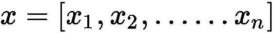代表输入（文章）令牌的序列，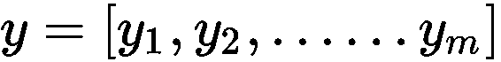代表输出（摘要）令牌的序列。 网络的编码器部分由双向 LSTM 组成（请参见[附录 A](../Text/15.html) ，*强化学习*中的其他主题）。 因此，使用双向 LSTM 读取输入序列`x`，该 LSTM 从的嵌入向量计算隐藏状态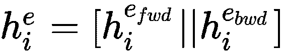，其中||。 表示向量的串联。

在框架的解码器部分，使用单个 LSTM，该 LSTM 从的嵌入向量计算隐藏状态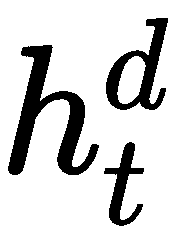。 在时间步零处的初始隐藏状态（即）使用编码器的最后一个隐藏状态（即）进行初始化。 因此，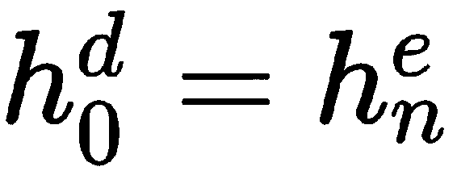。

# 解码时对输入序列的时间内注意

解码时，在每个时间步`t`时，时空内注意力函数用于伴随编码器输入序列的重要部分以及解码器的隐藏状态和先前生成的单词（在早期的解码过程中）`t`之前的时间步长）。 这种注意方法用于防止在不同时间步长的解码过程中出现输入序列的相同部分。

由给出在解码时间步长`t`处的隐藏输入状态的关注分数。 因此，，其中`f`是返回标量值的任何函数。

注意权重进一步标准化（如下所示），以惩罚在先前的解码步骤中已收到较高注意值的那些输入令牌。 这为我们提供了新的时间注意力得分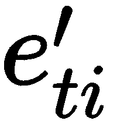：


最后，在输入中计算归一化注意力分数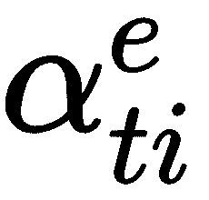，然后将其用于计算输入上下文向量：

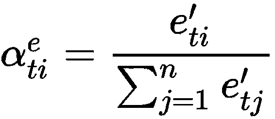


# 解码器内注意

即使是时间内注意功能，也可以确保在每个解码步骤中，都参与了编码输入的不同部分，但解码器仍可以在长序列中生成重复的短语。 为了防止这种情况，来自先前解码的序列的信息也可以被馈送到解码器中。 来自先前解码步骤的信息将帮助模型避免重复相同的信息并导致结构化的预测。

为了实现这种方法以合并来自先前解码步骤的信息，应用了解码器内注意。 当前的编码器-解码器模型中未使用此方法进行抽象总结。 对于解码时的每个时间步`t`，都会计算新的解码器上下文向量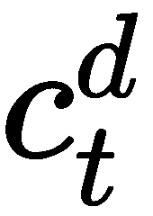。 由于在解码时为第一时间步生成的序列为空，因此，将用于时间步 1 的初始解码器上下文向量（即）设置为零向量。

对于 t> 1，按以下方式计算时间关注分数，归一化关注分数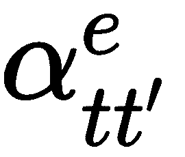和解码器上下文向量：


下图显示了两个上下文向量`C`的使用（绿色为上下文编码器向量，蓝色为上下文解码器向量），以及该向量的当前隐藏状态`H`。 解码器生成输出序列的新单词：


Paulus 等人（2017）在[《用于抽象摘要的深度强化模型》](https://arxiv.org/pdf/1705.04304.pdf)中发表的时间内注意和解码器内注意

# 令牌生成和指针

在确定输出序列令牌时，解码器决定使用 softmax 层生成令牌，或者使用指针机制指向输入中的稀有重要令牌，并将其复制为输出序列令牌。 在每个解码步骤，使用切换功能来决定是使用令牌生成还是使用点来复制输入令牌。 定义为二进制值，如果使用指针机制，则等于 1，否则等于 0。因此，作为输出令牌的概率由以下公式给出：


在这里，令牌生成层创建以下概率分布：

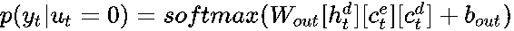，

这里，和是连接到输出节点的解码器网络的权重和偏差参数，并且指针机制生成以下概率分布来复制输入令牌：

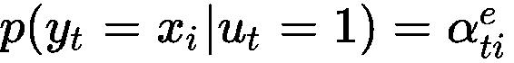

使用指针机制（即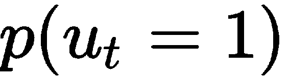）的概率由以下公式给出：


在此，是 S 形激活函数。

# 混合学习目标

在本节中，使用监督学习和强化学习的组合来训练编码器解码器网络上先前提出的神经内注意模型的框架。

# 老师强迫下的监督学习

教师强迫算法（由 Williams 等，1989）是训练解码器 RNN 用于序列生成的最广泛使用的方法。 在解码过程中的每个时间步，教师强制算法都将最大似然损失降至最低。 定义为给定输入序列`x`的地面真值输出序列。 然后，使用教师强迫算法进行监督学习的最大似然目标将是最小化损失函数，如下所示：

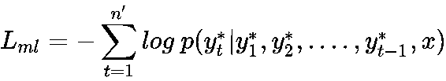

但是，将最小化的目标并不总是产生最佳结果。 此问题背后的两个主要原因如下：

*   **暴露偏差**：在训练过程中，神经网络知道直到下一个标记的地面真相序列，但在测试时并非如此。
*   **多个输出候选**（即**，即多个可能有效的摘要**）：有更多方式可以安排令牌以生成多个摘要。 最大可能性目标没有考虑这种可能性。

# 政策学习

这里的思想是学习一种最大化度量标准而不是最小化从最大似然目标获得的损失的策略。 为此，使用了强化学习方法，其中将自关键策略梯度算法用于训练。 对于此训练，每次训练迭代都会生成两个单独的输出序列：

*   通过在每个解码时间步长处从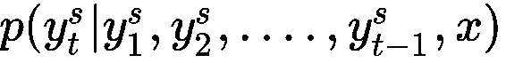的概率分布中采样来获取
*   是通过最大化每个时间步的输出概率分布而获得的基线输出

因此，奖励函数`r`可以是我们选择的任何评估指标，目的是最大程度地减少以下损失：

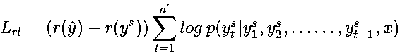

最小化等同于最小化采样序列的。 因此，为了使和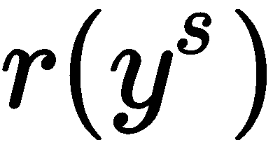最小化，需要增加输出序列的奖励，使其变得高于基线的奖励，从而增加了预期的奖励。

因此，强化学习框架用于学习最大化特定离散量度的策略。 强化学习框架总结如下：

*   **操作**： [generate（0），copy（1）]和单词
*   **状态**：编码器和先前输出的隐藏状态
*   **奖励**：ROUGE 得分或任何其他评估指标

# 混合训练目标函数

由于最大似然目标基于先前生成的令牌计算了下一个令牌的概率，而诸如 ROUGE 之类的奖励指标有助于通过困惑度来衡量人类的可读性，因此这两种方法都可用于得出混合学习目标函数，如下所示：

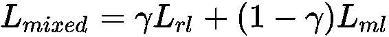

此处，是缩放系数，用于平衡和的大小差异。

# 文字答疑

问题回答是提供文档上下文以及在给定文档上下文中存在其答案的问题的任务。 现有的问题回答模型用于优化交叉熵损失，该模型用于鼓励准确答案并惩罚与准确答案同等准确的其他可能答案。 这些现有的问题回答模型（Xiong 等人，2017 年的最新动态动态求职网络）经过训练，可以从文档上下文中输出所问问题的准确答案范围。 实际地面真相答案的开始和结束位置将用作此监督学习方法的目标。 因此，该监督模型在两个位置上都使用了交叉熵损失，目的是使两个位置上的总损失最小化。

如我们所见，优化是通过使用位置来完成的，评估是通过使用答案的文本内容来完成的。 因此，优化和评估方法之间存在脱节。 由于这种脱节，许多文本上相似的答案由于其在其他位置的存在而受到惩罚，就好像它们是不正确的答案一样，这与地面真实答案的位置不同。

为了解决这个问题，熊等人。 等 发表了他们的研究 *DCN +：问答的混合目标和深度残差协作，*提出了使用混合目标函数的方法，该函数是交叉熵损失和自我批判策略学习的组合。 这个混合目标使用从单词重叠中获得的奖励来解决现有模型中评估与优化之间的脱节问题。

提出的新框架对于需要捕获长期依存关系的长问题表现更好，能够获得 75.1% 的精确匹配准确度和 83.1% 的 F1 分数的强大结果，而集成模型获得 78.9% 的精确匹配准确度和 86.0 % F1 分数。

因此，混合目标的方法提供了两个好处：

*   强化学习目标还鼓励在文字上相似的答案
*   交叉熵通过鼓励更正确的部署轨迹来帮助政策学习

除了混合训练目标之外，还通过使用深度残差共同注意编码器建立输入的更好表示，对现有的动态共同注意注意网络进行了改进（Xiong 等人，2017 年）。

来自 **Stanford 问题解答数据集**（**SQuAD**）（Rajpurkar 等人）的一些示例如下：

```py
Context/Passage 1:
Nikola Tesla (Serbian Cyrillic: Никола Тесла; 10 July 1856 – 7 January 1943) was a Serbian American inventor, electrical engineer, mechanical engineer, physicist, and futurist best known for his contributions to the design of the modern alternating current (AC) electricity supply system.
```

```py
Questions and Answers:
In what year was Nikola Tesla born?
Ground Truth Answer: 1856

What was Nikola Tesla's ethnicity?
Ground Truth Answer: Serbian

What does AC stand for?
Ground Truth Answer: alternating current

```

```py
Context/Passage 2:
Tesla went on to pursue his ideas of wireless lighting and electricity distribution in his high-voltage, high-frequency power experiments in New York and Colorado Springs, and made early (1893) pronouncements on the possibility of wireless communication with his devices. He tried to put these ideas to practical use in an ill-fated attempt at intercontinental wireless transmission, his unfinished Wardenclyffe Tower project. In his lab he also conducted a range of experiments with mechanical oscillators/generators, electrical discharge tubes, and early X-ray imaging. He also built a wireless controlled boat, one of the first ever exhibited.
```

```py
Questions and Answers: What were some of Tesla's experiments?
Ground Truth Answer: mechanical oscillators/generators, electrical discharge tubes, and early X-ray imaging

Other than New York where did Tesla conduct experiments?
Ground Truth Answer: Colorado Springs 
```

现有的最新**动态共同注意网络**（**DCN**）将上下文/段落和问题视为两个不同的输入序列，并输出 上下文中的答案范围作为输入。 下图简要概述了 DCN：


动态共同注意网络（由 Xiong 等人撰写，2017 年）

在下一部分中，我们将简要介绍该方法，以了解如何使用强化学习来创建最新的问题回答模型。

# 客观的和深层的残留包容性混合用于问答

本研究中提出的框架基于 DCN 模型（请参见上图），该模型由 Coattention 编码器和动态解码器指针组成。 编码器分别对问题和文档上下文进行编码，然后通过覆盖范围形成二者的协作表示，然后解码器根据覆盖范围输出开始和结束位置估计。

在 DCN +的新框架中，原始 DCN 框架引入了两个新更改。 它们如下：

*   添加深度残留共同注意浓淡度编码器
*   混合训练目标函数，是最大似然交叉熵损失函数和强化学习的奖励函数的组合

# 深层残留共同注意编码器

由于原始的 DCN 仅具有一个单层涂布编码器，因此形成输入序列的复杂表示的能力也受到限制。 因此，对共同注意保持编码器进行了两种修改。 它们如下：

*   通过堆叠许多共同注意增强层来修改共同注意增强编码器，以便网络能够创建更好的复杂表示形式
*   合并每一层的所有 coattnetion 输出，以减少信号路径长度：

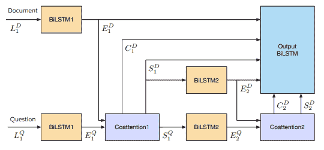

深度残差共同注意编码器，由 Xiong 等人发表在[《DCN+：问答的混合目标和深度残差共同注意》](https://arxiv.org/pdf/1711.00106.pdf)

# 使用自我批评性策略学习的混合目标

DCN 在答案的开始位置创建概率分布，并在答案的结束位置创建单独的概率分布。 在每个解码时间步长，模型会汇总每个位置的交叉熵损失。 问答任务包括两个评估指标。 它们如下：

*   **完全匹配**：一个二进制值，指示模型输出的答案范围与地面真实答案范围具有精确的字符串匹配
*   **F1 分数**：该值用于量化模型在预测答案范围和地面真实答案范围之间的单词重叠程度

根据原始的 DCN 框架，目标功能和评估指标是不连贯的，因此，对确切的匹配给予了极大的鼓励。 举例来说，有两个答案范围`A`和`B`，但它们都不与地面真实答案范围匹配，但是`A`具有完全匹配的字符串，而`B`没有字符串匹配。 然后，在这种情况下，尽管根据先前的完全匹配指标，A 是正确的输出，但仅交叉熵损失的旧客观方法将同等地惩罚`A`和`B`和 F1 得分。

如果我们检查 F1 分数，则`A`的量度显示单词在跨度`A`中重叠且具有真实答案范围，但答案 *B 则不是这种情况。* 。 因此，F1 分数与自关键策略梯度算法一起用作训练的奖励函数。

# 概要

在本章中，我们学习了强化学习如何破坏 NLP 的领域。 我们研究了在 NLP 中使用强化学习的原因。 我们涵盖了 NLP 中的两个主要应用领域，即文本摘要和问题回答，并了解了在现有模型中如何实施强化学习框架以获得最新结果的基础。 NLP 中还有其他实施了强化学习的应用程序领域，例如对话生成和机器翻译（讨论它们不在本书的范围之内）。

这使我们结束了深度强化学习的惊人旅程。 我们通过了解概念开始了基础知识，然后使用 TensorFlow 和 OpenAI Gym 实施了这些概念，然后遍历了很酷的研究领域，在这些领域中正在实施核心强化学习。 我希望旅途很有趣，我们能够建立最好的基础。