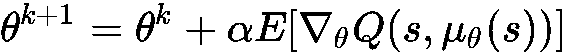
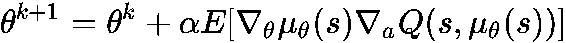
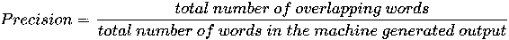
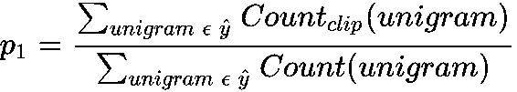
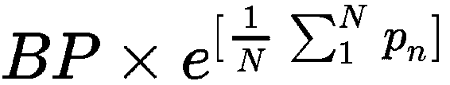
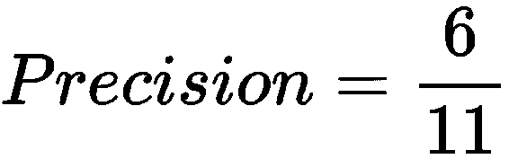

# 强化学习的其他主题

在本附录中，我们将介绍一些超出本书范围的主题。 但是，我们将简要提及它们，并以外部链接结尾这些主题，以供您进一步探索。 本书已经涵盖了深度强化学习理论以及活跃研究领域的大多数高级主题。

# 连续动作空间算法

深度强化学习拓扑中有许多连续的动作空间算法。 我们在[第 4 章](../Text/04.html)，*策略梯度*中较早介绍的其中一些主要是随机策略梯度和随机行为者-批判算法。 随机策略梯度与许多问题相关，例如由于观察值和奖励分配的连续变化而导致的非平稳数据导致难以选择步长，其中差的步长会对策略网络参数的学习产生不利影响。 因此，需要一种在训练策略网络参数时可以限制此策略搜索空间并避免不良步骤的方法。

在这里，我们将尝试介绍一些高级连续动作空间算法：

*   信任区域政策优化
*   确定性政策梯度

# 信任区域政策优化

**信任** **区域策略优化**（**TRPO**）是一种用于优化策略的迭代方法。 TRPO 优化了大型非线性策略。 TRPO 通过对输出策略分布施加约束来限制策略搜索空间。 为此，对策略网络参数使用 KL 散度损失函数（）来惩罚这些参数。 新策略和旧策略之间的 KL 差异约束称为信任区域约束。 由于此约束，策略分布中不会发生大规模更改，从而导致策略网络尽早收敛。

TRPO 由 Schulman 等（2017）发布在名为[《信任区域策略优化》](https://arxiv.org/pdf/1502.05477.pdf)的研究出版物中。 在这里，他们提到了一些实验，这些实验证明了 TRPO 在不同任务上的强大性能，例如学习模拟机器人游泳，玩 Atari 游戏等等。 [为了详细研究 TRPO，请访问出版物的 arXiv 链接](https://arxiv.org/pdf/1502.05477.pdf)。

# 确定性政策梯度

确定性策略梯度由 Silver 等人提出在名为[《确定性策略梯度算法》](http://proceedings.mlr.press/v32/silver14.pdf)的出版物中。 在连续行动空间中，用贪婪方法改进策略变得困难，并且需要全局优化。 因此，最好按以下方向在`Q`函数的梯度方向上更新策略网络参数：

其中，是确定性策略，*α*是学习率，θ表示策略网络参数。 通过应用链式规则，策略改进可以显示如下：

可以将先前的更新规则合并到策略网络中，在该策略网络中使用随机梯度上升来更新参数。 这可以通过确定性的行为者批判方法来实现，其中批评者估计动作值函数，而行为者从批评者获得其梯度以更新其参数。 如 Silver 等人在[《确定性策略梯度算法》](http://proceedings.mlr.press/v32/silver14.pdf)中所述。 在实验之后，他们能够成功得出结论，确定性的政策梯度比随机的梯度更有效率。 此外，确定性行动者批评者的表现优于随机行动者。 有关此主题的详细说明超出了本书的范围。 因此，请转到前面提到的研究出版物链接。

# NLP 顺序模型中的评分机制

两种评分机制用于评估[第 14 章](../Text/14.html)和 *NLP* 中的深度强化学习中提到的方法，如下所示：

# 蓝色

在机器翻译，文本摘要，图像字幕等中使用的 NLP 顺序模型中的最大挑战之一是评估的适当度量。

假设您的用例是机器翻译； 您有一个德语短语，并且有多个英语翻译。 他们看起来都不错。 因此，如果有多个同样好的答案，您如何评估机器翻译系统？ 这不同于图像识别，在图像识别中，目标只有一个正确答案，而没有多个同样好的正确答案。

例如：

*   **德语句子**：*猫在垫子上*

先前德语句子的多参考人为翻译如下：

*   *猫在垫子上*
*   *垫子上有只猫*

如果目标只是一个正确的答案，那么准确度的测量很容易，但是如果存在多个同样正确的可能性，那么在这种情况下如何测量准确度？ 在本节中，我们将研究 BLEU 分数，BLEU 分数是一种评估指标，用于在出现多个同等正确答案的情况下，测量准确性。

# 什么是 BLEU 分数，它的作用是什么？

BLEU 分数由 Papineni 等（2002）发表在他们的研究出版物《BLEU：一种自动评估机器翻译的方法》](https://www.aclweb.org/anthology/P02-1040.pdf)中。 BLEU 代表双语评估计划。 对于给定的机器生成的输出（例如，机器翻译为翻译或文本摘要为摘要），分数可衡量输出的优劣，即，机器生成的输出与以下任何一个有多接近 可能的人工生成参考（可能的实际输出）。 因此，输出文本离任何人工生成的参考越近，BLEU 得分就越高。

BLEU 分数背后的动机是设计一种度量标准，该度量标准可以像人类评估者一样相对于人类产生的引用来评估机器产生的文本。 BLEU 评分背后的直觉是，它考虑了机器生成的输出，并探讨了这些单词是否存在于多个人工生成的引用中的至少一种。

让我们考虑以下示例：

*   **输入德语文本**：*狗在毯子下*

假设我们有两个人为产生的参考，如下所示：

*   **参考文献 1** ：*狗在毯子下*
*   **参考 2** ：*毯子下有一只狗*

并说我们的机器翻译生成了可怕的输出，即“ *的 the the the the”*

因此，精度由以下公式给出：

因此，以下情况适用：

由于*和*在输出中出现了六次，而*和*的每个出现在至少一篇参考文献中，因此精度为 1.0。 出现此问题的原因是精度的基本定义，即定义为实际输出（参考）中出现的预测输出的分数。 因此，在预测输出中出现的*和*是唯一的文本，由于它出现在参考文献中，因此精度为 1.0。

因此，对精度的定义进行了修改，以得到修改后的公式，在该公式中放置了片段计数。 此处，片段计数是单词在任何参考文献中出现的最大次数。 因此，修改的精度定义为单词在任何参考中出现的最大次数除以该单词在机器生成的输出中出现的总数。

对于前面的示例，修改后的精度为：

到现在为止，我们已经以孤立的形式（即，字母组合形式）考虑了每个单词。 在 BLEU 分数中，您还希望成对看待单词，而不仅仅是孤立地看。 让我们尝试使用二元语法方法来计算 BLEU 分数，其中二元语法表示一对单词彼此相邻出现。

让我们考虑以下示例：

*   **输入德语文本**：*狗在毯子下*

假设我们有两个人工生成的引用，如下所示：

*   **参考文献 1** ：*狗在毯子下*
*   **参考 2** ：*毯子下有一只狗*

**机器生成的输出**：*狗狗狗在毯子下面*

| 机器中的 **Bi-grams-** **生成的输出** | **计数** | **计数片段（最大数量的二元语法**任何参考文献中的**）** |
| 那只狗 | 3 | 1 |
| 狗的 | 2 | 0 |
| 狗下 | 1 | 0 |
| 在下面 | 1 | 1 |
| 毯子 | 1 | 1 |

因此，修改后的二元语法精度将为二元语法*计数片段* 与二元语法计数的总和之比，即：

因此，我们可以为单字组，二元组和 n 元组创建以下精度公式，如下所示：

*   p 1 =精确度，表示：

*   p 2 =二元语法的精度，其中：

*   p n = n-gram 的精度，其中：

以单字，双字或什至任何 n-gram 计算的改进精度，使您可以测量机器生成的输出文本与人工生成的引用相似的程度。 如果机器生成的文本与人工生成的引用中的任何一个完全相似，则：

让我们将所有的 i 分数放在一起，以计算机器生成的输出的最终 BLEU 分数。 由于 *p n* 仅是 n-gram 的 BLEU 分数（即，改进的 n-gram 精度），因此组合的 BLEU 分数为 *n max = N* 由以下公式给出：

BP 称为简短惩罚。 如果机器生成的输出非常短，那么这个代价就会出现。 这是因为，在输出序列短的情况下，其中出现的大多数单词很有可能出现在人工生成的参考文献中。 因此，简洁性惩罚是一种调整因素，当该机器生成的文本短于该输入的最短人类生成的输出参考时，它便会对其进行惩罚。

**简短惩罚**（**BP**）由以下公式给出：

哪里：

*len（MO）* =机器生成的输出的长度

*s len （REF）* =最短的人工生成参考输出的长度

有关更多详细信息，请检查 Papineni 等人（2002）[关于 BLEU 分数的出版物](https://www.aclweb.org/anthology/P02-1040.pdf)。

# 红

ROUGE 代表针对召回评估的面向召回的本科。 它也是评估 NLP 中的顺序模型（特别是自动文本摘要和机器翻译）的度量。 CY Lin（2004）在研究出版物[《ROUGE：摘要自动评估包》](http://www.aclweb.org/anthology/W04-1013)中提出了 ROUG。

ROUGE 还可以通过将机器生成的输出（自动摘要或翻译）与一组人工生成的参考进行比较来工作。

让我们考虑以下示例：

*   **机器生成的输出**：*在床下发现了狗*
*   **人为产生的参考物**：*狗在床下*

因此，在 ROUGE 上下文中的精度和召回率如下所示：

因此，召回率= 6/6 = 1.0。

如果召回率为 1.0，则意味着人工生成的参考中的所有单词均由机器生成的输出捕获。 可能会出现机器生成的输出过长的情况。 因此，在计算召回率时，较长的机器生成的输出很可能覆盖大多数人工生成的参考词。 结果，精度得以提高，其计算方法如下所示：

因此，精度（对于前面的示例）= 6/7 = 0.86

现在，如果机器生成的输出为*，则在大圆床*下找到了一只大黑狗，那么，

，

这表明机器生成的输出不合适，因为它包含大量不必要的单词。 因此，我们可以很容易地发现仅召回是不够的，因此召回率和精度应同时用于评估。 因此，在以下情况下，作为召回率和精度的谐波均值计算的 F1 分数是一种很好的评估指标：

*   ROUGE-1 表示机器生成的输出和人工生成的引用之间的字母组合的重叠
*   ROUGE-2 表示机器生成的输出和人工生成的引用之间的二元语法重叠

通过以下示例，让我们更多地了解 ROUGE-2：

*   **机器生成的输出**：*在床下发现了狗*
*   **人为产生的参考物**：*狗在床下*

在床底下发现了机器生成的输出*的双峰狗：*

“那只猫”

“猫是”

“被找到”

“发现之下”

“在下面”

“床”

人类产生的参照*的二元组，即狗在床*之下：

“狗”

“狗是”

“下”

“在下面”

“床”

因此：

因此，ROUGE-2 精度显示该机器生成的二元语法的 67％与人类生成的参考重叠。

本附录涵盖了 NLP 中顺序模型中 ROUGE 评分的基本概述。 有关 ROUGE-N，ROUGE-L 和 ROUGE-S 的更多详细信息，请浏览[《ROUGE：自动摘要评估包》](http://www.aclweb.org/anthology/W04-1013)，作者为 CY Lin。

# 概要

作为附录的一部分，我们涵盖了深度强化学习拓扑的连续动作空间算法的基本概述，其中简要介绍了信任区域策略优化和确定性策略梯度。 我们还了解到 BLEU 和 ROUGE 分数被积极用于基于 NLP 的顺序模型中的评估。

最后，我想说的是，随着将开发出更多的算法，深度强化学习仍然是一个新主题。 但是，最有助于您理解和探索那些尚未发现的未来算法的最重要的事情，将是牢固掌握本书所涵盖的基础知识。